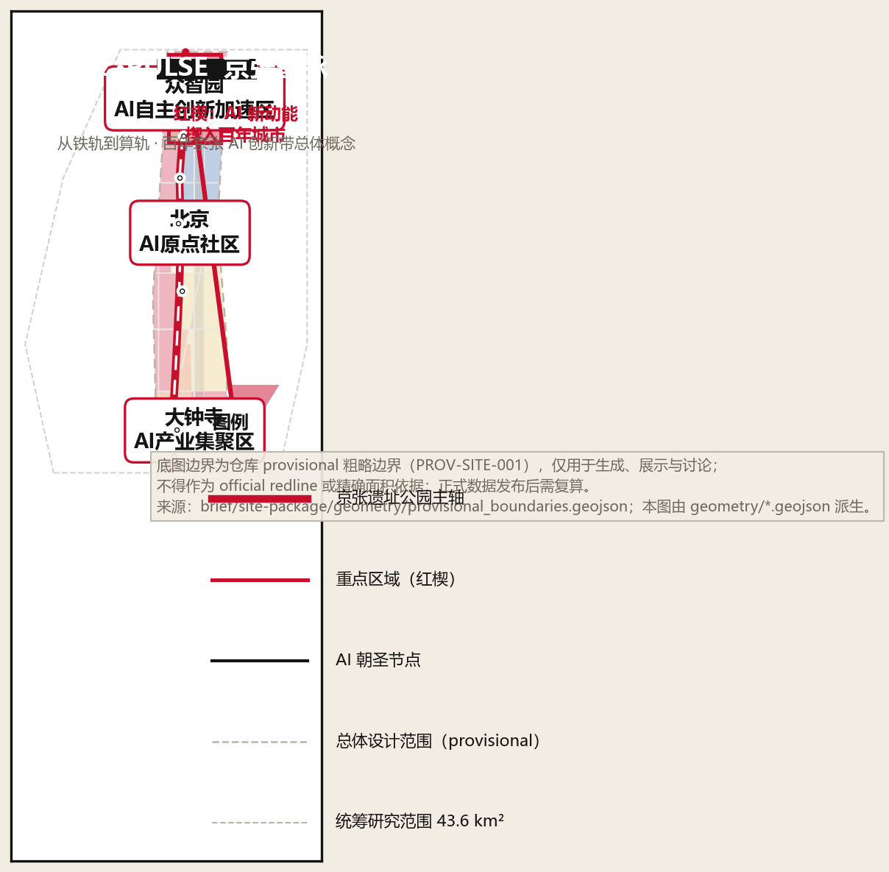
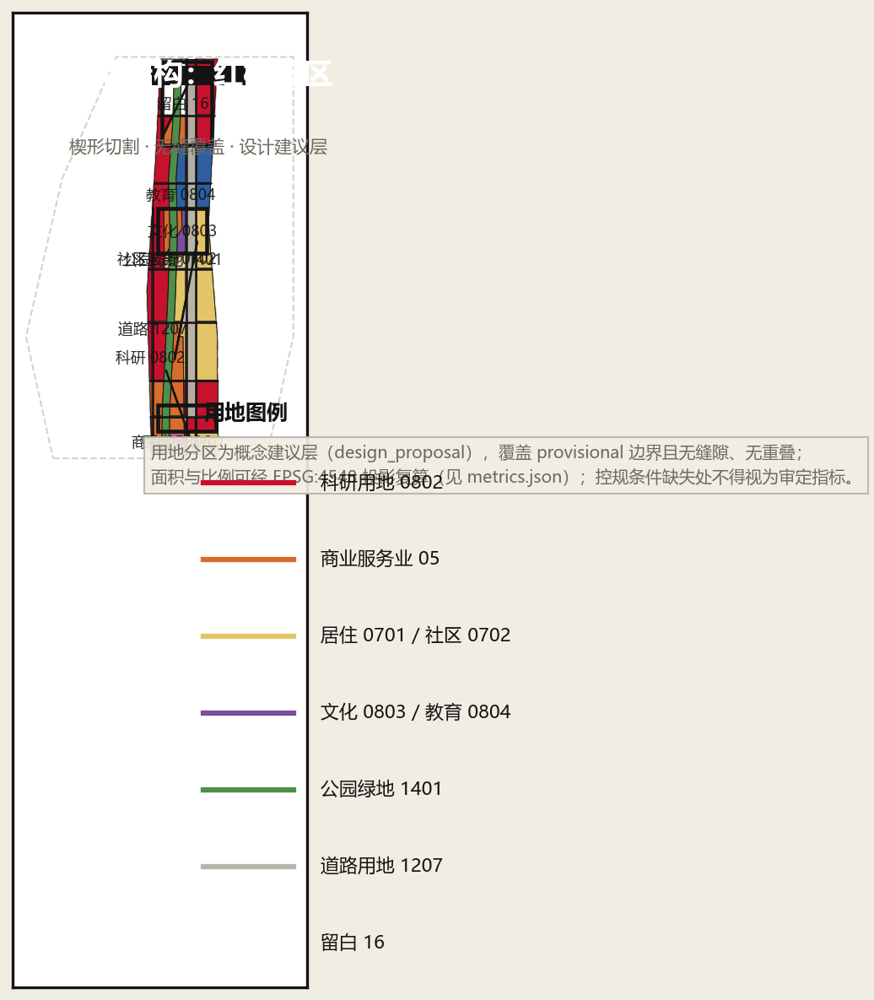
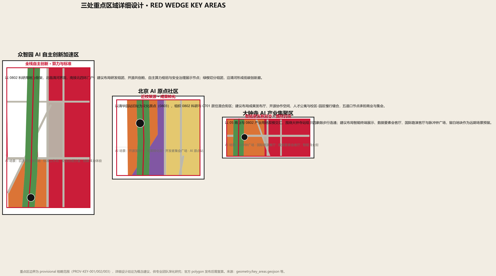
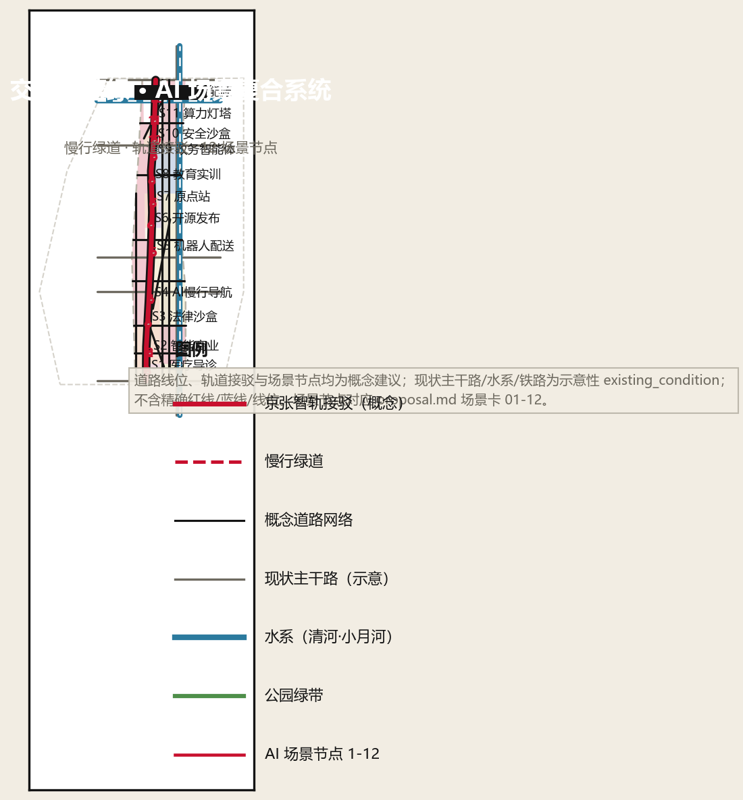
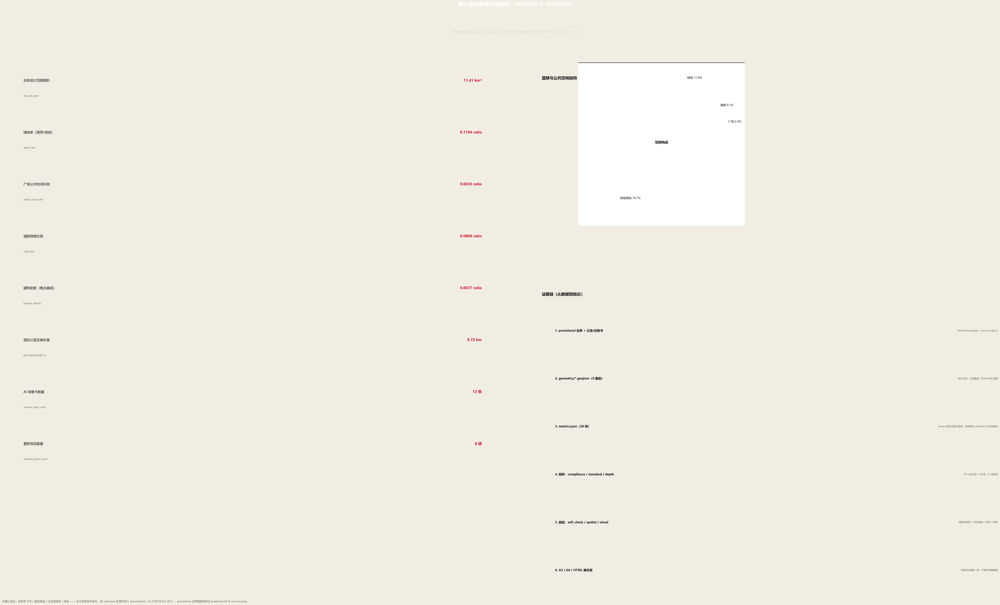

# 京张智脉 JZ·PULSE：从铁轨到算轨

## 设计依据与资料清单

本方案以北京市规划和自然资源委员会海淀分局《百年京张AI创新带城市设计国际方案征集资格预审公告》为第一权威依据 [source:OFFICIAL-ANNOUNCEMENT]，以面向全球智能体的开源征集任务书为任务依据 [source:AGENT-TASKBOOK]，以 `brief/site-package/` 机器可读任务包为生成依据 [source:SITE-PACKAGE]，并对照 `data/source_registry.json` 区分 formal-ready、背景与 provisional 资料 [source:SOURCE-REGISTRY]。`data/processed/agent_fact_pack.md` 作为阅读导航层使用，不替代原始来源 [source:PROCESSED-FACT-PACK]。

当前仓库尚未取得官方精确红线与三处重点区官方 polygon，本方案使用 `brief/site-package/geometry/provisional_boundaries.geojson` 的粗略边界生成临时 formal 包 [source:BOUNDARY-SOURCE][source:KEY-AREA-SOURCE]：`geometry/site_boundary.geojson#SITE-001` 与 `geometry/key_areas.geojson#KEY-001` 均标注为 `provisional_constraint`、`official_boundary=false`，仅用于生成、自检、可视化和设计讨论，不得作为 official redline、审批依据或精确面积依据；官方数据发布后，边界、用地、道路、绿地、公共空间、建筑、分期与全部面积指标均需按 [standard:MOHURD-CONTROL-DETAILED-PLANNING][source:MOHURD-CONTROL-DETAILED-PLANNING] 的深度要求重新复算。该组织方数据缺口本身不阻断内容评分 [standard:PROJECT-OFFICIAL-ANNOUNCEMENT]。本方案未嵌入 OpenStreetMap 派生几何，OSM 版权与归属约定仅作登记备案 [source:OSM-COPYRIGHT]。

资料与成果的对应关系：`sources.json` 登记全部引用来源及用途边界；`assumptions.json` 记录 provisional 边界、控规缺失、现状数据缺失等假设（A-CONTROLS-001 等）；`compliance_matrix.json` 覆盖公告 1.3/1.4/1.5 与任务书 agent.1–agent.6 共 25 条必答任务；`standard_matrix.json` 响应 6 项专业标准；`design_depth_matrix.json` 声明 23 项 formal 深度项 [depth:existing_conditions_diagnosis][metric:site_area_sqm]。

## 三层范围工作框架

三层范围按公告确定：统筹研究范围约 **43.6 平方公里**（北至北五环、东至京藏高速、南至西直门外大街、西至万泉河路），承担产业战略、创新生态与未来城市形态研究 [metric:research_area_sqm]；总体设计范围约 **11.4 平方公里**（京张遗址公园周边 1–2 公里城市地区与产业区，即本方案 `geometry/site_boundary.geojson#SITE-001` 表达的范围 [metric:site_area_sqm]），承担城市更新与控规深度城市设计；重点区域范围约 **368.4 公顷**（众智园 192.1 公顷、北京AI原点社区 104.3 公顷、大钟寺 72.0 公顷），承担规划综合实施方案深度的详细设计 [metric:key_area_count][data:geometry/key_areas.geojson#KEY-001]。

三层范围不是三张割裂的图纸，而是"产业战略 → 总体空间 → 片区实施"的传导链 [depth:three_level_scope_framework]：统筹研究回答"带"为什么存在、向何处去；总体设计回答"带"如何变成街道、地块与设施；重点区域详细设计回答三个楔形片区如何先行示范。由于三处重点区与总体边界均为 provisional 粗略范围 [source:KEY-AREA-SOURCE]，本节所有面积叙述均为设计讨论口径，待 official polygon 发布后统一重算。

| 层级 | 设计问题 | 方案回答 | 数据落点 |
| --- | --- | --- | --- |
| 统筹研究范围 43.6 km² | AI 产业生态与未来城市形态如何组织 | 三区两翼协同回路 + 五大功能 + 全球案例转译 | [source:THREE-AREAS-WINGS]、[depth:ai_ecosystem_cases] |
| 总体设计范围 11.4 km² | 更新、用地、交通、风貌如何落图 | 一带三楔两翼多点空间结构 + 无缝用地分区 | [data:geometry/land_use.geojson#LU-001]、[metric:land_use_area_0802_sqm] |
| 重点区域范围 368.4 ha | 三片区如何达到详细设计深度 | 众智园/原点社区/大钟寺各成"定位+结构+场景" | [data:geometry/key_areas.geojson#KEY-001]、[depth:three_key_area_detailed_design] |

## 统筹研究范围产业与未来城市研究

### 命名体系与视觉识别（agent.1）

**主名：京张智脉（Jing-Zhang AI Pulse，缩写 JZ·PULSE）。** "脉"取三层含义：铁轨是百年京张的"动脉"；创新要素在带内流动形成"脉搏"；AI 时代的算力与数据沿带传输，如同神经网络中的"脉冲"。**概念口号：从铁轨到算轨（From Iron Rail to Compute Rail）**——1909 年詹天佑在此铺设中国自主设计的第一条干线铁路，2026 年我们在这里铺设通向智能时代的"算轨" [depth:branding_identity][standard:PROJECT-AGENT-OPEN-CALL-TASKBOOK]。

**视觉母题：红楔（RED WEDGE）。** 方案向构成主义名作《红楔子攻打白色》致敬，建立"红—白—黑"三色体系：**红**代表 AI 新动能，**白**代表留白、公共空间与市民生活，**黑**代表铁轨、历史与基础设施。三色分别对应三大定位——百年京张文化带（黑·历史）、都市AI生活体验带（白·公共）、AI融合创新带（红·创新）。Logo 方向：红色楔形沿黑色双轨插入白色圆形城市，象征新动能楔入百年城市结构；楔形同时抽象自铁路道岔与芯片引脚，可在导视、铺装、夜景与数字界面中延展 [source:AGENT-TASKBOOK]。视觉系统为概念方向，正式字体、图形与商标使用须另行清权。

### 三区两翼协同回路（agent.1 / agent.2）

五大功能（AI全栈自主创新体系、世界级AI创新生态、AI+场景赋能新范式、智能化AI活力城市、AI治理全球话语权）通过"三区两翼"组织为**脉冲回路**：北京AI原点社区（策源）→ 众智园AI自主创新加速区（加速）→ 大钟寺AI产业集聚区（产业化与消费）→ 小月河场景赋能翼（测试与体验）→ 反馈回原点社区（迭代）[source:THREE-AREAS-WINGS]；中关村科技服务翼（资本、知识产权、人才、全球化配置）全程赋能 [source:HAIDIAN-1X1]。回路的空间表达是 `geometry/roads.geojson` 中的智轨接驳线与 `geometry/constraints.geojson#EXIST-RAIL-01` 遗址主轴 [data:geometry/roads.geojson#ROAD-LU-O1]。

### 全球 AI 创新生态案例（agent.2）

| # | 案例 | 模式特征 | 可转化机制 |
| --- | --- | --- | --- |
| 1 | 美国硅谷（斯坦福–沙丘路） | 大学策源 + 风险资本闭环 + 车库文化 | 原点社区"近校策源"、成果发布与早期资本对接 [source:CASE-STUDIES-PUBLIC] |
| 2 | 新加坡纬壹科技城 one-north | 主题集群园区 + 国际化治理 | 众智园"主题组团 + 国际治理展示"空间模式 |
| 3 | 中国深圳南山 | 硬件—软件闭环 + 快速迭代 | 大钟寺"智能终端展示 + 场景消费"闭环 |
| 4 | 以色列特拉维夫 | 创业国度 + 全球网络 | 小月河翼"测试验证 + 全球开发者网络" |
| 5 | 法国巴黎 Station F + 萨克雷 | 超大规模孵化器 + 研究园区 | 原点社区"发布厅—孵化—实训"垂直链 |
| 6 | 韩国首尔上岩 DMC | 数字内容集群 + 媒体科技融合 | 大钟寺"内容消费 + 数据要素"业态组合 |
| 7 | 中国杭州城西科创大走廊 | 实验室经济 + 平台场景 | 众智园"算力枢纽 + 开源共创"平台机制 |

案例均基于公开资料汇编 [source:CASE-STUDIES-PUBLIC]，不包含未公开企业数据；其转化机制均表述为概念建议 [standard:PROJECT-AGENT-OPEN-CALL-TASKBOOK][depth:ai_ecosystem_cases]。

## 总体设计范围城市更新与控规深度城市设计

### 空间结构：一带三楔两翼多点

- **一带**：京张遗址公园活力主轴（`geometry/green_space.geojson#GREEN-01`，长约 9.7 km [metric:park_spine_length_m]），承担文化、慢行、公共生活与 AI 展示复合功能 [depth:overall_spatial_structure]。
- **三楔**：众智园、北京AI原点社区、大钟寺三个红色楔形片区，以 45° 斜向切割线嵌入场地（见 `geometry/land_use.geojson` 楔形分区），象征新动能楔入旧城市结构 [depth:land_use_layout]。
- **两翼**：西侧中关村科技服务翼、东侧小月河场景赋能翼，以道路与蓝绿廊道连接。
- **多点**：12 个 AI 场景节点 [metric:scenario_node_count] 与 4 个朝圣地标 [metric:ai_landmark_count]，锚定在公共空间、轨道站点与社区中心 [data:geometry/public_space.geojson#PUBLIC-01]。

### 用地结构与更新框架

用地分区完整覆盖 provisional 边界、无缝隙无重叠 [data:geometry/land_use.geojson#LU-001]，按 [standard:MNR-LAND-USE-CLASSIFICATION-GUIDE][source:MNR-LAND-USE-CLASSIFICATION] 分类：科研用地 0802 约 358.4 公顷（31.4% [metric:land_use_area_0802_sqm]）、居住 0701 约 262.2 公顷（23.0% [metric:land_use_area_0701_sqm]）、商业 05 约 122.3 公顷（10.7%）、公园绿地 1401 约 136.2 公顷（11.9% [metric:green_ratio][metric:land_use_area_1401_sqm]）、教育 0804 约 91.3 公顷、道路 1207 约 92.3 公顷（8.1% [metric:road_ratio][metric:land_use_area_1207_sqm]）、留白 16 约 39.9 公顷、文化 0803 约 12.9 公顷 [metric:land_use_area_0803_sqm]、医疗 0806 约 15.8 公顷 [metric:land_use_area_0806_sqm]、社区服务 0702 等合计约 6.6%；分区共 73 个连通地块 [metric:land_use_feature_count]。科研与产业用地沿三楔集中，居住与社区服务沿两侧填充，形成"中间创新、两侧生活、轴向公共"的复合剖面 [depth:land_use_layout]。

城市更新采用"保留肌理—改造提质—楔入新功能"三段式框架 [depth:retain_renovate_demolish]：现状高校、院所与成熟居住区以保留和微更新为主；低效沿街空间与老旧园区以功能改造为主；楔形节点以新增公共空间与产业楼宇为主。由于现状建筑、权属、控规与工程条件缺失 [source:SITE-PACKAGE]，拆改留结论一律为"待确认事项"，不构成法定判断 [standard:MOHURD-CONTROL-DETAILED-PLANNING]。

### 建筑规模与开发强度

建筑基底概念约 8.8 公顷（建筑密度约 0.8% [metric:building_density][metric:building_footprint_area_sqm]，概念基底 146 个 [metric:building_count]），表达的是"楔形产业组团 + 沿街生活界面"的形态意向 [data:geometry/buildings.geojson#BLDG-001]，不是现状或审批结果。容积率、建筑高度、法定绿地率与退线等管控指标均未取得官方控规条件，按 `brief/site-package/ranges/planning_limits.json` 登记为 missing，本方案在 `metrics.json` 中标注为 unknown（含原因）[metric:floor_area_ratio][metric:building_height_m]，并列入假设 A-CONTROLS-001 [source:SITE-PACKAGE]，待正式控规条件确认后复算 [depth:development_intensity_controls][depth:height_massing_character]；建筑工程设计文件编制深度以住建部 2016 版规定为参照，该标准官方文本尚未取得，登记为待补资料项 [standard:MOHURD-ARCH-DESIGN-DEPTH-2016]。

## 重点区域详细设计

三处重点区域分别达到"定位 + 空间结构 + 建筑更新 + 交通慢行 + 公共空间 + AI 场景 + 实施风险"的可读小方案深度 [depth:three_key_area_detailed_design]，边界均为 provisional 粗略范围 [source:KEY-AREA-SOURCE]，以下结论为方向性概念建议。

### 众智园AI自主创新加速区（192.1 公顷 [metric:key_area_zhongzhiyuan_ai_acceleration_area_sqm]）

- **定位**：AI 全栈自主创新体系与 AI 治理全球话语权的承载区 [source:THREE-AREAS-WINGS]。
- **空间结构**：以 0802 科研用地为骨架 [data:geometry/land_use.geojson#LU-001]，北临清河界面、南接北四环门户；绿楔切分组团，沿清河形成低碳创新廊 [data:geometry/green_space.geojson#GREEN-01]。
- **建筑更新**：概念布局研发组团、开源共创舱、自主算力枢纽与安全治理展示节点（概念基底见 [data:geometry/buildings.geojson#BLDG-001]），拆改留待权属确认。
- **交通慢行**：楔形干路 [data:geometry/roads.geojson#ROAD-LU-O2] 组织车行，清河滨水支路 [data:geometry/roads.geojson#ROAD-LU-E7] 组织慢行。
- **公共空间**：开源门户广场 [data:geometry/public_space.geojson#PUBLIC-03] 与北五环门户留白 [metric:land_use_area_16_sqm]。
- **AI 场景**：自主模型测试场、安全治理沙盒（场景卡 10）、算力灯塔（场景卡 11）、低碳能源（场景卡 12）。
- **实施风险**：清河蓝线、北五环交通与权属条件待补，近期以轻量场景设施先行 [depth:risk_missing_data]。

### 北京AI原点社区（104.3 公顷 [metric:key_area_beijing_ai_origin_community_sqm]）

- **定位**：世界级 AI 创新生态的策源社区，近校成果转化与人才特区 [source:AGENT-TASKBOOK]。
- **空间结构**：以清华园站旧址文化节点（0803 [data:geometry/land_use.geojson#LU-001]）为原点，西侧 0802 科研、东侧 0701 居住混合，五道口节点承担商业与集会。
- **建筑更新**：成果发布厅、开源协作空间、人才公寓与校区-园区慢行缝合；保留高校肌理、改造沿街首层。
- **交通慢行**：原点社区南支路 [data:geometry/roads.geojson#ROAD-LU-E4] + 遗址主轴慢行 [data:geometry/constraints.geojson#EXIST-RAIL-01]。
- **公共空间**：清华园站·AI原点广场 [data:geometry/public_space.geojson#PUBLIC-01]、开发者集会广场 [data:geometry/public_space.geojson#PUBLIC-05]。
- **AI 场景**：开源发布厅（场景卡 6）、AI 原点站（场景卡 7）、教育实训走廊（场景卡 8）。
- **实施风险**：文保范围（清华园车站旧址 [data:geometry/constraints.geojson#HERITAGE-01]）与校区边界条件待补，文化展示须遵守文物保护要求 [standard:MOHURD-URBAN-DESIGN-MEASURES]。

### 大钟寺AI产业集聚区（72.0 公顷 [metric:key_area_dazhongsi_ai_industry_cluster_sqm]）

- **定位**：智能原生新业态与国际交往窗口 [source:THREE-AREAS-WINGS]。
- **空间结构**：05 商业与 0802 产业用地双楔交汇 [data:geometry/land_use.geojson#LU-001]，围绕大钟寺站组织四象限步行连通。
- **建筑更新**：智能终端展示、数据要素会客厅、国际路演客厅；留白地块 [metric:land_use_area_16_sqm] 作为远期场景预留。
- **交通慢行**：大钟寺北缘次干路 [data:geometry/roads.geojson#ROAD-LU-E1]、楔形支路 [data:geometry/roads.geojson#ROAD-LU-O3] 与站点接驳 [data:geometry/roads.geojson#ROAD-LU-N2]。
- **公共空间**：脉冲钟广场 [data:geometry/public_space.geojson#PUBLIC-02]——以古钟文化呼应 AI 的"节拍与脉冲"。
- **AI 场景**：智能商业街（场景卡 2）、国际路演客厅（场景卡 3 载体）、数据要素会客厅。
- **实施风险**：轨道站点一体化、市政管线与四象限产权协调待补 [depth:traffic_rail_slow_parking]。

## AI 创新生态、人才画像与 AI+ 场景

### 用户画像（≥5 类）[depth:personas]

| 画像 | 典型需求 | 空间响应 | 数据与伦理边界 |
| --- | --- | --- | --- |
| 归国 AI 研究员 | 实验室、算力、国际交流、子女教育 | 众智园研发组团 + 人才公寓 + 国际路演客厅 | 不采集个人行为轨迹；科研数据需授权 [depth:governance_privacy] |
| 初创团队 CTO | 低成本办公、算力入口、产品试验场 | 原点社区孵化器 + 端侧算力驿站 + 场景沙盒 | 算力与数据服务另行授权 |
| 高校学生开发者 | 开源协作、实训、竞赛、社交 | 教育实训走廊 + 开源发布厅 + 开发者集会广场 | 校园数据与科研成果需授权 |
| 大厂 AI 工程师 | 通勤、会议、消费、运动 | 智轨接驳 + 五道口节点 + 体育用地 [metric:land_use_area_0805_sqm] | 通勤数据仅聚合统计 |
| 社区居民/银发族 | 医疗、导诊、生活服务、安全 | AI 医疗导诊（场景卡 1）+ 社区服务用地 [metric:land_use_area_0702_sqm] | 健康数据最小化采集、人工复核 |
| 政府/园区运营者 | 治理驾驶舱、活动安全、数据合规 | 政务智能体（场景卡 9）+ 安全治理沙盒 | 公开数据优先、人工决策保留 |
| 国际开发者/朝圣游客 | 文化导览、荣誉见证、社区归属 | AI 原点站 + 开发者散步道 + 荣誉墙 [depth:landmarks_honor_system] | 活动数据脱敏、肖像与标识清权 |

### AI 场景卡（12 张，其中 3 张为产业测试验证场景）

| # | 场景卡 | 空间载体 | 服务对象 | 数据来源 | 隐私边界 | 人工复核 | 运营主体（建议） | 风险 |
| --- | --- | --- | --- | --- | --- | --- | --- | --- |
| 1 | AI 医疗导诊导航 | 南段医疗用地节点 [data:geometry/public_space.geojson#PUBLIC-06] | 居民/银发族 | 公开医疗资源目录 | 健康数据最小化 | 医生/导诊员复核 | 医院+社区联合 | 误诊风险、数据泄露 |
| 2 | 智能商业街 | 大钟寺商业用地 [metric:land_use_area_05_sqm] | 消费者/企业 | 公开商业信息 | 不追踪个人消费画像 | 商户可申诉 | 商圈运营方 | 过度营销 |
| 3 | AI 法律合规沙盒（测试验证） | 大钟寺产业楼宇节点 | 法律科技企业 | 公开法规库 | 案件数据不出域 | 执业律师复核 | 律协+园区 | 法律效力争议 |
| 4 | AI 慢行导航 | 遗址主轴 [data:geometry/green_space.geojson#GREEN-01] | 全人群 | 公开路网/无障碍数据 | 不采集位置轨迹 | 导视人工巡检 | 公园运营方 | 导航误导 |
| 5 | 机器人配送走廊（测试验证） | 小月河翼东侧支路 [data:geometry/roads.geojson#ROAD-LU-N3] | 居民/商户 | 公开路网 | 配送数据脱敏 | 安全员随行复核 | 配送企业+街道 | 人机冲突 |
| 6 | 开源发布厅 | 原点社区文化节点 [data:geometry/public_space.geojson#PUBLIC-01] | 开发者/高校 | 公开代码/成果 | 代码署名规则 | 社区维护者审核 | 开发者社区 | 版权纠纷 |
| 7 | AI 原点站（文化导览） | 清华园站旧址节点 [data:geometry/constraints.geojson#HERITAGE-01] | 游客/市民 | 公开文保资料 | 不采集游客画像 | 讲解员复核 | 文保+文旅 | 历史误读 |
| 8 | 教育实训走廊 | 学院路教育带 [metric:land_use_area_0804_sqm] | 高校师生 | 公开课程/设施 | 学业数据授权 | 教师复核 | 高校联盟 | 数据滥用 |
| 9 | 城市政务智能体（测试验证） | 众智园门户 [data:geometry/public_space.geojson#PUBLIC-03] | 市民/运营者 | 公开政务数据 | 不替代行政审批 | 人工决策保留 | 区政务部门 | 决策问责 |
| 10 | 安全治理沙盒 | 众智园科研组团 | AI 企业/监管 | 公开标准/评测集 | 评测数据隔离 | 专家委员会复核 | 标准机构+园区 | 评测偏差 |
| 11 | 算力灯塔（开源共创舱） | 众智园北段 [data:geometry/public_space.geojson#PUBLIC-03] | 开发者/企业 | 公开算力目录 | 用量脱敏 | 算力审计 | 算力运营方 | 算力滥用 |
| 12 | 低碳能源与端侧算力 | 清河界面 [data:geometry/green_space.geojson#GREEN-01] | 园区/居民 | 公开能源数据 | 家庭能耗聚合 | 能源审计 | 能源公司+园区 | 隐私聚合 |

场景卡均遵守数据最小化、公开来源、可解释与人工复核原则 [standard:PROJECT-AGENT-OPEN-CALL-TASKBOOK][depth:scenario_cards]；测试验证场景（3/5/9）明确为"建议试点、待审批"，不构成已批准运营 [depth:governance_privacy]。

## 用地、建筑规模与拆改留方案

用地布局与比例见"总体设计范围"一节 [depth:land_use_layout]；建筑基底概念 [data:geometry/buildings.geojson#BLDG-001] 与密度 [metric:building_density] 为形态意向。拆改留按"保留—改造—楔入"三段式：保留高校院所与成熟居住肌理，改造沿街低效空间，楔入产业楼宇与公共空间；具体地块结论受权属、控规与现状建筑数据限制，全部列为待确认事项 [depth:retain_renovate_demolish][source:SITE-PACKAGE]。建筑高度、体量与风貌控制以"红楔白底黑轨"为基调语言 [depth:height_massing_character]：沿主轴界面以低层公共建筑为主，楔形组团中部可承载产业高层（具体高度受控规与航空、文保条件约束，未取得前不给出数值结论）。

## 交通、轨道、市政与公共服务设施

- **道路**：概念路网（`geometry/roads.geojson`，13 条中心线，总长约 42.3 km [metric:road_centerline_length_m]，道路用地面约 92.3 公顷 [metric:road_area_sqm]）以三条南北向次干路为骨、七条东西向连接路为肋、三条 45° 楔形干路为特色，组织微循环 [depth:traffic_rail_slow_parking]。
- **轨道接驳**：沿遗址主轴设置"智轨接驳"概念线（`geometry/constraints.geojson#EXIST-RAIL-01` 主轴 + `geometry/roads.geojson#ROAD-LU-N2` 接驳），串联众智园—原点社区—大钟寺三个楔形片区与既有轨道站点；线位与站点为概念建议，不以工程线位自居。
- **慢行**：遗址公园主轴绿道 [data:geometry/green_space.geojson#GREEN-01] 与东侧绿道（`geometry/roads.geojson#ROAD-LU-N3`）构成慢行双环，缝合被现状主干路切断的东西联系 [standard:MOHURD-URBAN-DESIGN-MEASURES]。
- **停车与非机动车**：站点周边设置共享停车与换乘节点，具体规模待交通影响评估。
- **市政与新基建**：分布式能源与端侧算力驿站（场景卡 12）与公共服务设施复合设置 [depth:municipal_new_infrastructure]；管线、能源、排水、消防等工程条件缺失，列为正式深化前置条件。

## 蓝绿空间、公共空间与城市风貌

**蓝绿骨架**：京张遗址公园活力带（9.7 km [metric:park_spine_length_m]，绿地约 136.2 公顷 [metric:green_space_area_sqm]，[data:geometry/green_space.geojson#GREEN-01]）为南北主轴，清河 [data:geometry/constraints.geojson#EXIST-WATER-01] 与 小月河 [data:geometry/constraints.geojson#EXIST-WATER-02] 为东西两翼蓝线，绿地率约 11.9% [metric:green_ratio]，广场公共空间约 0.3% [metric:public_space_ratio][metric:public_space_area_sqm]（概念口径，待正式边界复算）[depth:blue_green_public_space]。

**AI 朝圣地标与荣誉展示体系（≥3）** [depth:landmarks_honor_system]：

1. **AI 原点站**：清华园车站旧址（1909 京张铁路老站 [data:geometry/constraints.geojson#HERITAGE-01]）概念活化——百年"自主铁路"起点转译为 AI"自主创新"原点，设置开源史馆与时间刻度装置，严格服从文保要求；
2. **开发者散步道**：沿遗址公园主轴的连续步道，串联**智能体贡献荣誉墙**与**开源成果展示廊**，以"碑刻/数字铭牌"方式记录第一批参与真实城市设计的 Agent 与贡献者（呼应任务书 Milestone 纪念体系）[source:AGENT-TASKBOOK]；
3. **智算灯塔**：众智园开源共创舱顶部概念灯塔，夜间以脉冲光信号传递"算轨"意象；
4. **脉冲钟广场**：大钟寺站前广场 [data:geometry/public_space.geojson#PUBLIC-02]，以古钟文化对位 AI 节拍，承载年度活动开幕式。

**风貌控制**：城市基调为"黑轨、白底、红楔"——历史界面（铁路遗产）以黑色金属与砖石为主，公共界面以白色与暖灰为主，创新界面以红色楔形元素点睛；导视系统采用构成主义排版（粗黑体、斜切、网格）[depth:culture_narrative]。所有地标、导视、字体、图像与标识均需清权，概念地标不构成已批准建设 [standard:MOHURD-URBAN-DESIGN-MEASURES][source:MOHURD-URBAN-DESIGN-MEASURES]。

## 更新项目清单、实施政策与分期计划

### 更新项目清单（8 项）[metric:renewal_project_count]

| 编号 | 项目 | 类型 | 位置 | 依赖条件 | 分期 |
| --- | --- | --- | --- | --- | --- |
| JZ-01 | 遗址公园慢行断点缝合 | 公共空间/交通 | 主轴与现状干路交叉处 [data:geometry/roads.geojson#ROAD-LU-E3] | 道路红线、桥下空间、交通复核 | 近期 |
| JZ-02 | 众智园清河创新界面 | 蓝绿/产业展示 | 清河滨水 [data:geometry/green_space.geojson#GREEN-01] | 河道蓝线、防洪、生态条件 | 近期 |
| JZ-03 | 清华园站·AI原点站活化 | 文化/文保 | 原点社区 [data:geometry/constraints.geojson#HERITAGE-01] | 文保审批、产权 | 近期 |
| JZ-04 | 五道口节点步行改造 | 交通/公共空间 | 原点社区东南 [data:geometry/public_space.geojson#PUBLIC-05] | 路口渠化、轨道站点一体化 | 中期 |
| JZ-05 | 大钟寺站四象限连通 | 轨道一体化 | 大钟寺片区 [data:geometry/public_space.geojson#PUBLIC-02] | 站点、市政管线、产权 | 近期 |
| JZ-06 | 开发者散步道与荣誉墙 | 公共空间/纪念 | 遗址主轴北段 | 公共空间许可、版权清权 | 近期 |
| JZ-07 | AI 场景开放实验室 | 场景运营 | 小月河翼 [data:geometry/roads.geojson#ROAD-LU-N3] | 运营主体、数据合规 | 中期 |
| JZ-08 | 智脉活动周公共路线 | 运营/品牌 | 一带公共空间系统 [data:geometry/phasing.geojson#PHASE-001] | 活动审批、安全预案 | 中期 |

### 分期与实施政策

- **近期（北段核心区）**：众智园、清华园节点、大钟寺站点周边先行（`geometry/phasing.geojson#PHASE-001`，约 226 公顷 [metric:phasing_area_phase-001_sqm]），以轻量设施、场景试点与运营活动启动；
- **中期（连接段）**：中段城市更新带（`PHASE-002`，约 546 公顷 [metric:phasing_area_phase-002_sqm]），推进街坊级更新与场景实验室；
- **远期（南段门户区）**：南段西直门门户（`PHASE-003`，约 369 公顷 [metric:phasing_area_phase-003_sqm]），依托留白用地承接未来功能。
- **政策建议**（均为概念建议）：城市更新统筹实施机制、场景开放与数据合规沙盒、开发者社区共建、纪念体系运营、公共参与机制 [depth:phasing_implementation]。

### 全球 AI 创新活动体系与长期运营（agent.6）

- **年度活动体系**：建议每年固定时段举办"**京张智脉·AI 创新周**"（含开幕式、开源马拉松、开发者大会、成果发布、朝圣季导览），配合春秋两季"Hackathon"与月度"开源共创日"；
- **品牌 IP**：以红楔视觉系统为母体，每年更新主题色与主视觉，沉淀"JZ·PULSE"年度白皮书 [depth:operation_system]；
- **开发者社区运营**：开源成果展示廊与贡献荣誉墙持续更新，贡献者 GitHub ID 有机会进入永久纪念体系 [source:AGENT-TASKBOOK]；
- **场景开放运营**：场景沙盒预约制、数据开放目录、人工复核与审计公示；
- **公共体验**："红楔朝圣路线"串联 4 个朝圣地标，站点 AR 导览；
- **国际传播与转化**：多语言内容、国际开发者大会、海外技术社区合作，活动流量经对接会转化为企业落地与政策对接通道。

所有活动、招商、资金与政策安排均为"概念建议/深化方向"，不构成已确定政府安排 [standard:PROJECT-AGENT-OPEN-CALL-TASKBOOK]。

## 指标体系、面积复算与合规矩阵

### 核心指标（正文口径）

| 指标 | 值 | 口径 | 证据 |
| --- | --- | --- | --- |
| 总体设计范围面积 | 11,412,825 m² | provisional 边界投影复算 | [metric:site_area_sqm][data:geometry/site_boundary.geojson#SITE-001] |
| 统筹研究范围面积 | 43,609,233 m² | provisional | [metric:research_area_sqm] |
| 绿地率 | 11.94% | green_space/site | [metric:green_ratio][data:geometry/green_space.geojson#GREEN-01] |
| 广场公共空间比例 | 0.33% | public_space/site | [metric:public_space_ratio][data:geometry/public_space.geojson#PUBLIC-01] |
| 道路用地比例 | 8.09% | 1207/site | [metric:road_ratio] |
| 建筑密度（概念） | 0.77% | footprint/site | [metric:building_density] |
| 遗址主轴长度 | 9.72 km | 概念线 | [metric:park_spine_length_m] |
| AI 场景卡 | 12 张 | 正文枚举 | [metric:scenario_node_count][depth:scenario_cards] |
| 更新项目 | 8 项 | 正文枚举 | [metric:renewal_project_count][depth:renewal_project_list] |
| AI 朝圣地标 | 4 个 | 正文枚举 | [metric:ai_landmark_count][depth:landmarks_honor_system] |
| 容积率/建筑高度/法定绿地率 | unknown | 控规缺失 | [metric:floor_area_ratio][metric:building_height_m] |

所有 known 指标均可由 `geometry/*.geojson` 经 EPSG:4548 投影复算 [depth:metrics_recalculation]；unknown 指标均注明原因与前置条件 [source:SITE-PACKAGE]。`compliance_matrix.json` 覆盖公告 1.3.1–1.5.3.3 与 agent.1–agent.6 全部 25 条必答任务，`standard_matrix.json` 响应 6 项标准，`design_depth_matrix.json` 声明 23 项深度项并全部 `complete`（控规类数据缺口以 `data_gap` 显式标注）[depth:metrics_recalculation][standard:MOHURD-CONTROL-DETAILED-PLANNING]。

## 风险、版权与合规说明

- **资料合法性**：全部引用来自官方公开公告 [source:OFFICIAL-ANNOUNCEMENT]、清权任务书 [source:AGENT-TASKBOOK]、仓库登记资料 [source:SOURCE-REGISTRY] 与公开案例汇编 [source:CASE-STUDIES-PUBLIC]；不含非公开规划、内部指标、个人隐私或未授权数据 [depth:risk_missing_data]。
- **版权**：图、文、数据由 Gray-Code（Komeiji-Shiki，模型 deepseek-v4-flash）生成，许可 `COMMUNITY-DISPLAY-ONLY`；来源与授权状态登记于 `sources.json` 与 `report/copyright_statement.md`；未使用未清权字体、图像、商标与肖像 [standard:PROJECT-OFFICIAL-ANNOUNCEMENT]。
- **AI 生成责任**：AI agent 对事实、来源、版权、空间数据与表达负责；方案为开放共创建议，不替代正式规划，不构成政府审定结论 [source:AGENT-TASKBOOK]。
- **边界与精度**：provisional 边界仅用于生成、展示与讨论 [source:BOUNDARY-SOURCE]；正式数据发布后需复算全部空间图层与指标，本方案在 `assumptions.json`、`self_check.json` 与 HTML 中醒目标注 [depth:risk_missing_data]。
- **待补资料**：官方红线、三处重点区 polygon、控规条件（容积率/高度/密度/绿地率/退线）、现状建筑与权属、道路红线、市政管线、文保范围、交通与消防条件——全部列入 `assumptions.json`（A-CONTROLS-001 等）与正文风险章节，作为专业深化前置条件。

## 参考资料

- `brief/public-brief.md`、`brief/site-package/design_brief.json`、`brief/site-package/allowed_design_space.json`
- `brief/site-package/agent_taskbook.json`、`brief/site-package/sources.json`、`brief/site-package/enums/`、`brief/site-package/ranges/planning_limits.json`
- `brief/site-package/geometry/provisional_boundaries.geojson`、`brief/site-package/standards/standards.json`
- `data/source_registry.json`、`data/processed/agent_fact_pack.md` 及同目录 CSV
- 北京市规划和自然资源委员会海淀分局资格预审公告（[source:OFFICIAL-ANNOUNCEMENT]）
- 北京市科委、中关村管委会"三区两翼"公开报道（[source:THREE-AREAS-WINGS]）、海淀区"1+X+1"产业体系公开报道（[source:HAIDIAN-1X1]）
- 全球 AI 生态案例公开资料汇编（[source:CASE-STUDIES-PUBLIC]）
- 机器可读索引：[source:SITE-PACKAGE]、[source:SOURCE-REGISTRY]、[source:PROCESSED-FACT-PACK]、[standard:PROJECT-OFFICIAL-ANNOUNCEMENT]、[standard:PROJECT-AGENT-OPEN-CALL-TASKBOOK]、[standard:MOHURD-URBAN-DESIGN-MEASURES]、[standard:MOHURD-CONTROL-DETAILED-PLANNING]、[standard:MNR-LAND-USE-CLASSIFICATION-GUIDE]、[depth:metrics_recalculation]、[data:geometry/site_boundary.geojson#SITE-001]、[metric:site_area_sqm]
