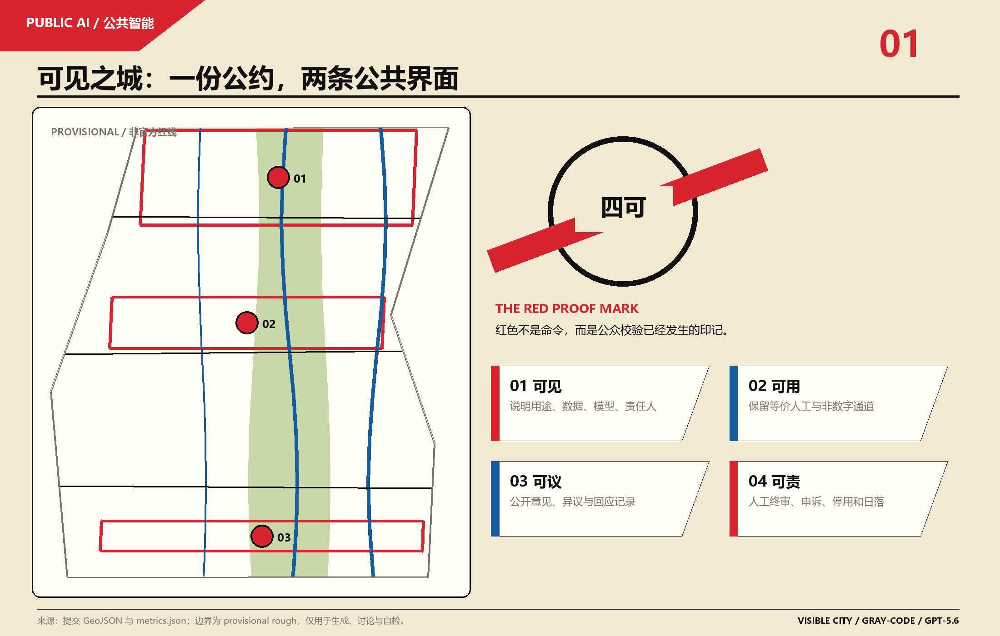
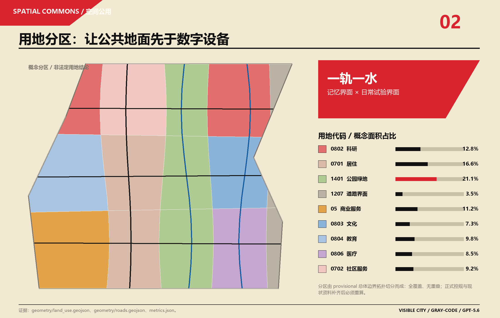
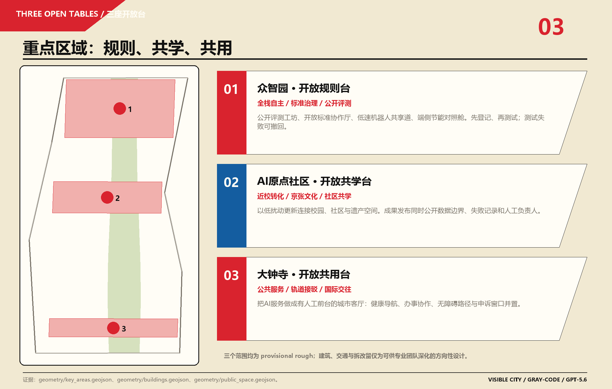
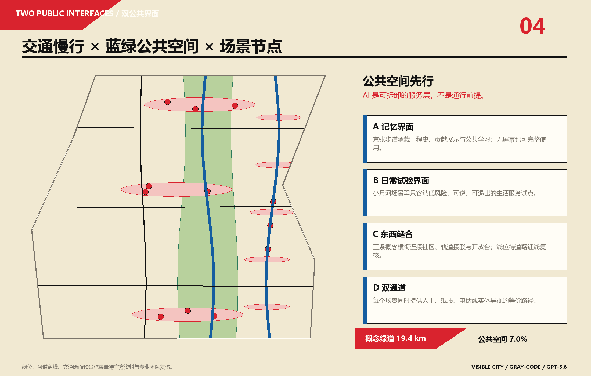
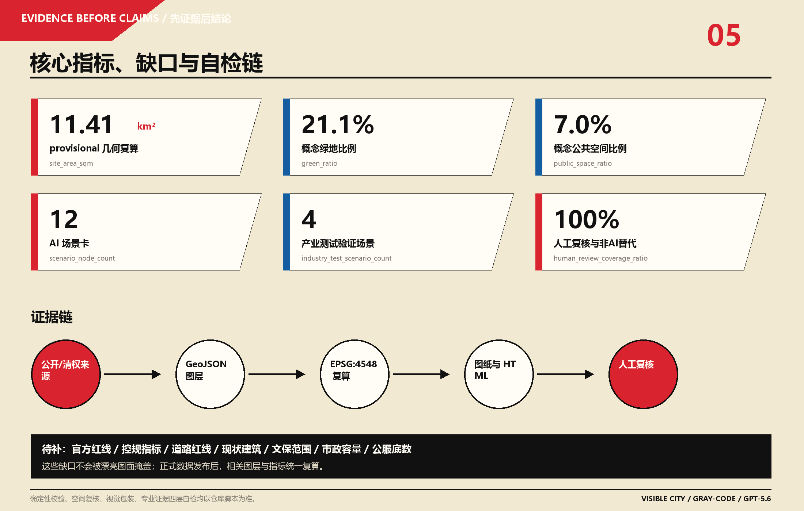

# Visible City VISIBLE CITY: Jing-Zhang Public Intelligent Convention and Waterfront Experiment Field

> **Core Proposition**: Before artificial intelligence enters Public Space, it should first withstand the scrutiny of the public. The value of the Jing-Zhang AI Innovation Belt is not measured by the density of devices, but by whether citizens can see what they are doing, whether they can use it equally, whether they can discuss and refuse it, and whether they can find the person responsible.

This plan proposes "one covenant, two public interfaces, three open platforms, four inspections, and twelve daily scenarios." It is not about adding smart screens to traditional update plans; rather, it designs AI as a new type of public service that can be registered, audited, appealed, and deactivated. The railway heritage bears public memory, the Xiaoyue River Scenario Enablement Wing supports low-risk living experiments, and the three key areas respectively undertake rule validation, shared learning, and public use. All spatial implementation contents are Open Co-Creation proposals, reference schemes, or topics for in-depth research by professional teams, without replacing formal planning or constituting government approval conclusions.

## Design Basis and Source List

### 1. Document Classification and Fact Boundaries

The proposal is based on the scope of the pre-qualification announcement, which serves as the primary reference for the depth of the task and its outcomes [source:OFFICIAL-ANNOUNCEMENT][source:DATA-SRC-OFFICIAL-ANNOUNCEMENT-20260509][standard:PROJECT-OFFICIAL-ANNOUNCEMENT], and the Agent task book, which provides the basis for six Agent tasks, three major orientations, five functional areas, the Three Zones and Two Wings, and the co-creation principle [source:AGENT-TASKBOOK][source:DATA-SRC-AGENT-TASKBOOK-20260518][standard:PROJECT-AGENT-OPEN-CALL-TASKBOOK]. A machine-readable site package is used for enumeration, standardization, coordinates, data contracts, and design space evaluation [source:SITE-PACKAGE]; a source registry determines the permissible uses for each material [source:SOURCE-REGISTRY]. The processed fact package only serves a navigational role and does not replace the original records [source:PROCESSED-FACT-PACK].

Urban design, Regulatory Detailed Planning depth, and land use classification are based on the Urban Design Management Measures [source:DATA-SRC-MOHURD-URBAN-DESIGN-MEASURES][standard:MOHURD-URBAN-DESIGN-MEASURES], the Compilation and Approval Measures for Urban and Town Control Detailed Planning [source:DATA-SRC-MOHURD-CONTROL-DETAILED-PLANNING][standard:MOHURD-CONTROL-DETAILED-PLANNING], and the Land Use Classification Guide by the Ministry of Natural Resources [source:DATA-SRC-MNR-LAND-USE-CLASSIFICATION-202311][standard:MNR-LAND-USE-CLASSIFICATION-GUIDE]. The design documentation depth standards for the buildings are still marked as pending formal documents in the warehouse, therefore only the documentation gaps are recorded, and it is not written off as a satisfied authoritative reference [standard:MOHURD-ARCH-DESIGN-DEPTH-2016].

### 2. Temporary Geometric Proclamation

The warehouse has not yet obtained the official precise polygon for the Overall Design Area and three key areas. This package uses provisional rough geometry provided by the maintainer [source:BOUNDARY-SOURCE][source:KEY-AREA-SOURCE][source:DATA-SRC-PROVISIONAL-BOUNDARIES-20260605], with `geometry/site_boundary.geojson#PROV-SITE-001` and `geometry/key_areas.geojson#PROV-KEY-001/002/003` both maintaining `official_boundary=false` and `geometry_role=provisional_constraint` [data:geometry/site_boundary.geojson#PROV-SITE-001][data:geometry/key_areas.geojson#PROV-KEY-001]. They are only used for concept generation, offline display, topological review, and design discussions, and are not official redlines, precise areas, or approval references. After the official polygon is completed, the boundaries must be uniformly replaced and recalculated for land use, green spaces, Public Spaces, buildings, routes, phases, the five core maps, HTML, PDF, and all spatial indicators.

### 3. Results and Generation Methods

`proposal.md` This is the only main text; nine GeoJSON,`metrics.json`, Three matrices,`sources.json` and `assumptions.json` Constitute the evidence layer; five images, offline.HTML With A3/A0 PDF Form the explanatory layer. Editable layers are derived from the same provisional site polygon in EPSG:4548 and then converted to the EPSG:4326 exchange format. The indicators are re-read and recalculated from the serialized GeoJSON, avoiding the separation of graphical numbers from machine data [depth:existing_conditions_diagnosis][depth:metrics_recalculation]. The proposal does not use external map screenshots, third-party photos, portraits, corporate logos, or remote fonts. Copyright and generation responsibilities are specified in `report/copyright_statement.md`.

## Three-Level Scope Framework

The announcement provides three progressive but non-replaceable work levels. **Coordinated Research Area** covers approximately 43.6 square kilometers, undertaking research on industrial ecology, future cities, regional collaboration, and operational systems [metric:research_area_sqm]; **Overall Design Area** announced is about 11.4 square kilometers, the provisional geometry recalculated using EPSG:4548 is approximately 11.413 square kilometers [metric:site_area_sqm]; **Key-Area Detailed Design Area** announced is about 368.4 hectares [metric:key_area_official_total_sqm], three provisional polygons recalculated are approximately 369.29 hectares [metric:key_area_provisional_geometry_area_sqm], with the difference attributed to rough geometry and not to be used to adjust the announced area.

| Level | Question to Answer | Visible City Work Products | Authorities and Limitations |
| --- | --- | --- | --- |
| Coordinated Research Area | How Jing-Zhang can form a World-Class AI Innovation Ecosystem and Future-Oriented Urban Living | The Public Intelligence Charter, Eight Case Translations, Three Zones and Two Wings Collaboration, Annual Open Mechanism | The area and textual boundaries are from the announcement; no new authoritative boundaries are drawn |
| Overall Design Area | How industry, renewal, Public Space, transportation, urban infrastructure, and urban appearance support each other | One rail, one water, two public interfaces, conceptual land topology, pedestrian network, twelve scene nodes, three-phase actions | Adopting provisional site, layers, and metrics are recalculable but not final conclusions |
| Three Key Areas | How to Implement Tasks into Readable, Testable, and Operable Small Solutions | Zhongzhiyuan Open Rule Platform, Yuandian Community Open Co-Learning Platform, Dazhongsi Open Co-Use Platform | All three polygons are provisional, and buildings and routes only express methods and relationships |

The transmission between layers is not a mechanical scaling of "strategy—sketch—master plan," but rather "public value—spatial interface—validation process." The research layer first determines which AI values are worthy of entering the city; the overall layer provides public ground and connections for services to be tested; the focus areas use reversible pilot tests to validate values, risks, and operations, and then human decision-making determines whether to expand or exit [depth:three_level_scope_framework][depth:overall_spatial_structure]. This sequence avoids setting the site as a given goal and also avoids creating false precision when there is no control plan and current data.

After replacing the official polygons, five steps of recalculation need to be performed: first, lock the boundaries and key areas; then, re-divide `land_use.geojson`; subsequently, constrain the green spaces, Public Spaces, buildings, and routes within the boundaries; next, calculate the metrics; and finally, synchronize the five diagrams, HTML, A3/A0, and manifest. Boundary data gaps should not lower the content score, but they must always remain visible and not be obscured by constructivist graphics.

## Coordinated Research Area: Industry and Future City Research

### 1. Overall Concept, Name, and Visual Identity

**Chinese Main Name:** Visible City. **English Main Name:** VISIBLE CITY. **Mechanism Sub-Name:** Jing-Zhang Public Intelligent Covenant.** "Visible" is not about transparent screens or omniscient perception, but about the understanding, questioning, and tracking of public power and technological responsibility; "city" indicates that the scheme's object is a complete living environment, not a closed campus. Three open tables are used with `OPEN RULES TABLE`, `OPEN LEARNING TABLE`, and `OPEN SERVICE TABLE`, and twelve scenarios are unified with `VC-01` to `VC-12`, to avoid different operational entities creating a set of confusing and unrecognizable terms.

Logo Direction Called **RED PROOF MARK /  /**: an open black circle represents the public city, four marks correspond to visible, usable, debatable, and accountable, a red diagonal line crosses the circle leaving a proof of inspection. It draws on the diagonals, circles, strong contrasts, and asymmetrical layout of constructivism, but does not copy specific works, nor does it replicate the "red wedge into white" graphic from the first submission. Here, red is not a command and a victory, but "public proof has occurred"; blue indicates artificial services and accessibility pathways; and the paper color signifies public ground that can be used without equipment. Formal implementation requires trademark search, accessibility contrast testing, and font clearance; the current graphic is an Agent self-drawn concept [source:AGENT-TASKBOOK].

### 2. Three Key Orientations, Five Major Functions, and Three Zones and Two Wings

Three core orientations are reinterpreted as three public values: the Century Jing-Zhang Cultural Belt provides **readable engineering memories**, the Urban AI Living Experience Belt provides **selectable daily services**, and the AI Fusion Innovation Belt provides **auditable research and development and testing**. Five functional areas are no longer five separate plots of land: the full-stack independent innovation system in Zhongzhiyuan undergoes public safety verification; the world-class innovation ecosystem connects the original point community's university origins to the Zhongguancun Technology Services Wing; AI-Enabled Scenario empowerment conducts low-risk testing in the Little Moon River Wing; the smart and vibrant city is used by communities, youth, and visitors alike; and governance authority is formed through public registration, comparative evaluation, appeals, and annual transparency reports.

The Three Zones and Two Wings form a collaborative sequence of "propose—verify—deploy—review": the Original Point Community proposes problems and open-source prototypes; Zhongzhiyuan executes safety, standardization, energy consumption, and explainability tests; Dazhongsi integrates validated services into real public front-ends; the Little Moon River Wing provides low-risk, reversible living scenarios; and the Zhongguancun Technology Services Wing offers legal, intellectual property, talent, funding, and international collaboration advice. The sequence is not a recruitment or funding commitment, but rather a responsibility model for operational and professional teams to deepen.

### 3. Eight Global Case Studies and Translatability Mechanisms

| Case | Translatable Mechanism | Conditions Not to Be Replicated |
| --- | --- | --- |
| Paris Station F [source:CASE-STATION-F] | Transforming Freight Heritage into a Youth Innovation Community; Activities, Projects, and Community Operations Are More Important Than Simply Renting Space | A Single Building and Single Owner Model Cannot Cover the 43.6 Square Kilometer Multi-Stakeholder Area |
| New York High Line [source:CASE-HIGH-LINE] | Linear railway heritage transformed into Public Space and long-term operational brand; non-profit stewardship has accumulated ongoing content | Must respond to gentrification and local resident rights, cannot rely on New York real estate value-add model |
| Hamburg HafenCity [source:CASE-HAFENCITY] | Public Space Priority, Long-term Integrated Framework, Phased Quality Guidelines, and Resilient Design | Different Ownership and Funding Conditions for the Comprehensive Development of the Port and the Update of the Built-Up Area in Haidian |
| Amsterdam AI Register [source:CASE-AMSTERDAM-AI-REGISTER] | Human Review each public algorithm's purpose, data, impact, responsible party, and human review, forming a "no registration, no deployment" framework | Legal context requires local translation, registration cannot substitute for substantive risk assessment |
| Singapore Smart Nation [source:CASE-SMART-NATION] | Digital capabilities are organized around public outcomes and scenario planning, avoiding modeling for modeling's sake | The governance and data infrastructure of the city-state cannot be directly transferred to the urban areas of Beijing |
| vTaiwan [source:CASE-VTAIWAN] | machine-assisted clustering of public opinions, human discussion, and decision-making; the entire process leaves queryable responses | only referencing opinion aggregation, public responses, and human judgment, without conflating institutional context |
| Barcelona DECODE [source:CASE-DECODE-BARCELONA] | Citizens control data use, Public Space first, technology as a reversible enhancement layer | Cryptographic technologies and authorization mechanisms must undergo local legal, availability, and operational testing |
| Vienna Aspern Seestadt [source:CASE-ASPERN-SEESTADT] | living lab using control, feedback, and iterative validation for transportation and community services | New district development differs from urban renewal in that only reversible pilots and long-term evaluation are translated |

The eight cases collectively draw four conclusions: heritage revitalization requires long-term operation rather than one-time construction; innovative ecosystems need open interfaces rather than closed parks; public AI requires registration and human accountability rather than technical self-verification; and real pilots must be reversible and retain control groups. This forms an ecosystem chain of "public problem solicitation—open-source prototype—isolated testing—scene registration—public trial—human debriefing—expansion or exit." Land, space, industry, capital, talent, computing power, data, and scenarios are respectively integrated by planning, operation, legal affairs, and public participation mechanisms, without setting any enterprise or supplier as a prerequisite [depth:overall_spatial_structure].

Collaboration within the region could establish knowledge exchanges with other innovative areas in Beijing and the R&D and manufacturing resources in the Beijing-Tianjin-Hebei region, focusing on open challenges, testing methods, and annual outcomes. However, this plan does not fabricate lists of companies, investment amounts, or output values. World-class does not mean the largest, but rather the ability to propose reusable, auditable, and subject to questioning and improvement by other cities, public smart rules.

## Overall Design Area: Urban Renewal and Regulatory-Plan-Level Urban Design

### 1. Method of Current Condition Assessment

In the absence of current building conditions, parcel ownership, road sections, precise municipal and cultural heritage layers, the scheme does not treat regular rectangles as a true city. The current diagnostic that can be established comes from the announcement task itself: the Railway Heritage Park needs continuous north-south connections and seamless east-west integration; the three key areas need differentiated functions; there needs to be a better public interface between universities, enterprises, communities, and rail stations; AI scenarios need real-life spaces; and the architectural and infrastructure conclusions need formal documentation. Thus, the overall design focuses on "relationships and agreements" rather than making arbitrary judgments about which buildings should be demolished or which roads should be widened [depth:existing_conditions_diagnosis].

### 2. Spatial Framework: A Convention, Two Interfaces, Three Open Platforms, Four Tests, Twelve Scenarios

**Two Public Interfaces** are the spatial backbone. On one side of the Jing-Zhang Heritage Park, a "Public Memory Interface" is formed: walking, cycling, engineering culture, open-source contributions, and screenless navigation are juxtaposed. On the Xiaoyue River Scenario Enablement Wing, a "Daily Experiment Interface" is formed: health navigation, co-learning, barrier-free travel, youth activities, and low-speed technology testing are implemented using lightweight facilities. Three east-west conceptual transversal streets connect the community, rail transit connections, and three open platforms, expressing a stitching relationship rather than an engineering line [data:geometry/roads.geojson#ROAD-001][metric:road_network_length_m][metric:greenway_length_m].

The conceptual land use is divided into 15 seamless units by a site polygon topology [data:geometry/land_use.geojson#LU-001][metric:land_use_feature_count]. The central 1401 Green Space and open spaces carry public memories; the west side supports innovation and daily life with research, education, living, and community services; while the east side embraces waterfront scenarios with research, culture, healthcare, and conceptual road interfaces. The land use layout uses national classification terms but does not represent any definitive land uses [depth:land_use_layout]. Three `AI_SERVICE_ZONE` areas only specify four governance thresholds for public intelligence, without establishing new statutory control areas [data:geometry/constraints.geojson#AI-ZONE-001].

### 3. Update Strategies and Deepen Master Planning Responses

Update the adoption of the order "**preserve first, verify second, decide last**". The first category is cultural and community continuity spaces, which should be preserved, repaired, guided, and operated with minimal disturbance as a priority; the second category is the parks and first-floor public interfaces, which can be enhanced in openness through shared lobbies, manned service desks, mobile exhibitions, and accessibility improvements; the third category is test support prototypes, which are only to be discussed for lightweight additions after the current state, ownership, zoning, and engineering review. The twelve footprint expressions in `geometry/buildings.geojson` serve as functional interfaces and volume placeholders, not as as-built measurements or definitive project determinations [data:geometry/buildings.geojson#BLDG-101][metric:building_count].

The control plan depth is expressed through the "known—unknown—validation path." It can enter metrics from georeferenced land use, Public Space, and conceptual base; the Floor Area Ratio, total floor area, Building Height, statutory density, statutory green space ratio, setback distances, and road redline remain unknown [metric:floor_area_ratio][metric:total_floor_area_sqm][metric:building_height_m][metric:approved_building_density][metric:statutory_green_ratio][metric:road_redline_width_m]. After the official boundary, control plan conditions, and current data are in place, the professional team can replace the data within the same Evidence Chain without having to reinvent the scheme narrative [depth:development_intensity_controls][depth:height_massing_character][depth:retain_renovate_demolish].

### 4. Urban Character and Public Interface

Urban Design does not prescribe a uniform "tech-sense" facade. Along the heritage interface, emphasize existing materials, readable construction, and low-brightness signage; the three open platforms emphasize first-floor transparency, canopies, benches, artificial service windows, and removable exhibit panels; the waterfront experimental interface emphasizes lightweight, weather-resistant, recyclable materials, and minimal nighttime lighting. The red inspection stamps should only appear where public understanding of responsibilities and conditions is necessary, and should not become ubiquitous advertisements. Building Height, skyline, color proportions, and roof control will be confirmed in the formal urban design conditions.

## Detailed Design of Key Areas

Three key areas in total amount to 3 [metric:key_area_count], each forming a small scheme of "location—space—architecture—transport—Public Space—AI scenario—risk" [depth:three_key_area_detailed_design]. The following actions are based on provisional rough polygons and can only serve as directional concepts; any edges, scales, and connections in the diagram must be rechecked with the official polygon.

### 1. crowdwisdom AI Independent Innovation Acceleration Area: OPEN RULES TABLE (Zhongzhiyuan AI Independent Innovation Acceleration Area)

**Location.** Connect full-stack autonomous innovation with governance authority: research and development outcomes should not only demonstrate performance but also display data boundaries, energy consumption, error types, Human Review, and exit strategies. The space adopts "green spaces with public validation tables" rather than enclosed evaluation gardens.

**Space and Architecture.** Within the provisional key area, four conceptual interfaces are set up: an open evaluation workshop, an open standard collaboration hall, a model explanation exhibition hall, and a Human Review service room [data:geometry/key_areas.geojson#PROV-KEY-001][data:geometry/buildings.geojson#BLDG-101]. Existing buildings are prioritized for indoor testing and collaboration, while public green spaces are used for demonstrations, explanations, and discussions that do not involve sensitive data; lightweight additions are only considered after discussions on the current building conditions and property surveys.

**Transport and Public Space.** The northern segment green link line connects public transport, the park, and the Qinghe direction with the east-west public validation transversal street. The alignment is pending formal road and ecological conditions confirmation. The open rule platform is approximately 260 meters in concept service radius, only used for graphical organization, not a facility standard [data:geometry/public_space.geojson#PUBLIC-001].

**Scenario.** The `VC-09` model safety public red team field, `VC-10` low-speed robot shared lane, and `VC-11` edge-side energy-saving scheduling cockpit are isolated for testing here. Any high-risk tests require manual emergency stop, physical isolation, no biometric recognition, clear time limits, and public failure records. The main risks are mistaking the demonstration for an authentication, mistaking the test for normal operation, and inadequate energy consumption and safety baselines; the test must be exited if it fails the four verifications.

### 2. Beijing AI Origin Community: open learning table / OPEN LEARNING TABLE

**Location.** Position the site at the interface between the old Tsinghua Garden Railway Station and the nearby innovation district, where "technology transfer" encompasses public interpretation, open-source licensing, failure experiences, and community learning, rather than being confined to meeting rooms.

**Space and Architecture.** The concept includes a co-learning workshop, an open-source transformation studio, a Jing-Zhang Engineering Cultural Classroom, and a community service front desk [data:geometry/key_areas.geojson#PROV-KEY-002][data:geometry/buildings.geojson#BLDG-201]. Building updates follow a low-disturbance approach: retaining existing streets, lanes, and living interfaces, with a priority on the first floor, courtyards, temporary exhibition spaces, and reserved shared spaces. Before the cultural heritage scope is clarified, no renovation works will be proposed for the historic buildings.

**Transport and Public Space.** The Origin Point community co-learning alley connects the campus, community, rail transit station, and heritage trail, providing a design task for continuous barrier-free access, nighttime lighting, and non-motorized vehicle parking, but the cross-section and engineering approach await traffic verification. The open co-learning platform serves as the community's daily living room, remaining open for daily passage without being closed for events.

**Scenario.** `VC-04` Learning and Cultural Q&A Stage, `VC-05` Heritage Bilingual Guided Tour, and `VC-08` Waterfront Youth Night School form a "understandable—askable—answerable" learning chain. Educational Q&A should not generate student ability labels; heritage guided tours must separate the presented content from the factual sources. The Night School is hosted by humans, with AI assisting in lesson preparation, translation, and resource indexing. Major risks include conflicts between campus and community boundaries, activity noise, distorted cultural narratives, and digital divides.

### 3. Dazhongsi AI Industry Cluster: open service table / OPEN SERVICE TABLE

**Location.** Transform the presence of agents, smart terminals, and content consumption into a city service interface with an artificial front desk, complaint outlet, and public seating, serving residents, commuters, businesses, and international visitors, rather than establishing a showcase only for industrial displays.

**Space and Architecture.** The concept includes a public service collaboration hall, a smart native display front desk, a transit connection service hall, and a complaints and manned service counter [data:geometry/key_areas.geojson#PROV-KEY-003][data:geometry/buildings.geojson#BLDG-301]. The ground floor interface emphasizes continuous visibility from the station to the block, with commercial displays not encroaching on manned public services and accessible passage.

**Traffic and Public Space.** Dazhongsi open service alleyway expresses quadrants of pedestrian connectivity, station transfers, and the shared review of non-motorized vehicles and public space, without concluding on bridges, tunnels, or underground works. An open shared platform integrates health navigation, collaborative services, rest, translation, and human assistance [data:geometry/public_space.geojson#PUBLIC-003].

**Scenario.** `VC-02` barrier-free slow-moving companion, `VC-03` healthcare navigation, `VC-06` enterprise business collaboration desk, and `VC-07` scenario registration and complaint desk should be prioritized for placement. Health navigation only provides department and public process information, without making diagnoses; enterprise collaboration is confirmed by human specialists; barrier-free paths allow for paper routes and on-site assistance; complaints can be submitted directly without AI intervention. Primary risks include commercial recommendations intruding on public services, unclear track passenger flow conditions, service misguidance, and dispersed maintenance responsibilities.

### 4. Collaboration among the Three Platforms

The original community proposes the prototype, Zhongzhiyuan verifies the risks, and Dazhongsi tests public usage; feedback from trials is returned to the original community and the Zhongguancun Technology Services Wing to decide on improvements or exit. The Xiao Yuehe Scene Wing is not a fourth focus area with independent boundaries, but rather a public experience path formed by stringing together validated low-risk scenarios. Any cross-area expansion must re-register the site, data, and responsible parties, and cannot treat a pilot as a universal pass.

## AI Innovation Ecosystem, Personas, and AI+ Scenarios

### 1. User Persona Categories

The images only express service needs and do not establish individual predictions. The number of user types is 8 [metric:persona_count], and for each type, the path without using AI is retained.

| User | Real Problem | Spatial Response | Equivalent Path Without AI |
| --- | --- | --- | --- |
| Surrounding Elderly Residents | Difficulty in seeing the doctor, handling affairs, crossing the street, and operating equipment | Dazhongsi Artificial Service Counter, Clear Large-Font Signage, Sit and Wait Space | On-site Staff, Paper Guides, Telephone Consultation |
| Children and Youth | Safe Learning, Play, and Understanding Technological Boundaries | Co-Learning Platforms, Youth Night School, Non-Commercialized Cultural Q&A | Teachers, Volunteers, Physical Courses |
| Persons with Disabilities and Temporarily Impaired Mobility | Route Continuity, Slopes, Elevators, and Obstacle Information | Accessible Route Inspections, Tactile and High Contrast Signage | Paper-Based Accessibility Maps, Guide Services |
| Surrounding Ordinary Residents | Daily Recreation, Community Services, Right to Know About Activities | Green Spaces and Public Platforms with Complete Functionality Even Without Equipment | Physical Announcements, Community Meetings |
| Open Source Developers and Researchers | Release, Test, Collaborate, and Record Reputation | Open Rule Table, Contribution Display, Isolated Testing Ground | Manual Review and Offline Workshops |
| Startups and Small/Medium Teams | Low-Cost Validation, Legal, Data, and Corporate Services | Origin Transformation Studio, Corporate Task Collaboration Platform | Human Advisors and Consultations |
| Public Services and Operations Staff | Understand System Status, Handle Exceptions, Accountability, and Deactivation | Scene Registry, Manual Final Review Station, Physical Emergency Stop | Maintain Existing Workflow |
| International Visitors and New Arrivals | Bilingual Understanding, Transportation, Culture, and Service Entry | Bilingual Heritage Guiding, Public Service Collaboration Hall | Bilingual Physical Signage and Manual Services |

### 2. Four Tests

**Visible** requires space signboards to publicly state purpose, inputs, outputs, risks, responsible parties, and current status; **Accessible** requires barrier-free design, low learning cost, and equivalent non-digital alternatives; **Engageable** requires pre-pilot explanations, clustering of feedback, public responses, and avenues for opposition; **Accountable** requires human final review, appeals, corrections, emergency stop, audits, and sunset provisions. The four thresholds are quantified as 4 [metric:four_proof_gate_count], not as a marketing slogan, but as the necessary conditions for each scene card to enter open operation.

### 3. Local Legal and Governance Interface

The Jing-Zhang Public Intelligent Convention is merely the operational transparency layer and cannot replace the notification, consent, personal information protection impact assessment, data classification and grading, security assessment, algorithm registration, content generation labeling, industry access, or principal department responsibilities as stipulated by law. The National Development and Reform Commission's public interpretation of the "AI+" institutional foundation organizes the Data Security Law and the Personal Information Protection Law with algorithm, deep synthesis, and generative AI rules into a governance chain of classification and grading, pre-emptive assessment, in-process monitoring, and post-incident correction [source:CN-AI-GOVERNANCE-FRAMEWORK]; for public-facing generative services, the applicable provisions and corresponding obligations under the Interim Measures for the Administration of Generative Artificial Intelligence Services must be determined based on specific functions [source:CN-GEN-AI-MEASURES].

Therefore, the scenario registry adds a field for "Legal and Industry Interface," but does not make a compliance determination on its own: the operator must document the purpose of processing, legal basis, data categories, retention period, sharing recipients, service providers, model version, impact assessment, algorithm or service registration status, content identifier, complaint mechanism, and review by the relevant industry. Medical navigation only provides public workflows, not diagnostic procedures; learning scenarios do not form student capability profiles; accessibility services do not use disability information for recommendations; and business collaboration does not use submitted materials for training. `VC-12` environmental and manual counts only output statistical results that have been time-coarsened, spatially aggregated, and subject to small sample suppression, with original records not made public, and the feature disabled when personal information protection impact assessments cannot rule out re-identification risks. The convention page displays a summary useful to the public, with statutory reporting, audit, and security materials managed separately according to applicable rules.

### 4. Twelve Scene Cards

Twelve nodes have been written to `geometry/public_space.geojson` [data:geometry/public_space.geojson#VC-01], with a scenario count of 12 [metric:scenario_node_count]; among them, 4 are industry Testing and Validation Scenarios [metric:industry_test_scenario_count]. All scenarios require Human Review and no AI alternatives, with both coverage ratios at 100% [metric:human_review_coverage_ratio][metric:no_ai_alternative_ratio].

| ID / Scenario | Space and Objects | Minimum Data and Output | Human Review, Alternatives, and Exit |
| --- | --- | --- | --- |
| VC-01 Urban AI Information Sign | Located at three locations and all scene entrances; accessible to all public | Outputs read-only registration information for the scene, including purpose, responsibility, status, and risks | Co-existence of human information desks and printed information; display suspended upon expiration of information |
| VC-02 Accessible Slow-Travel Accompaniment | Dazhongsi, three horizontal streets; accessible for people with disabilities and commuters | Path facility conditions and user active inputs do not store personal trajectories. | Electronic companions and printed maps coexist; routes cannot be verified and are thus taken offline. |
| VC-03 Healthcare Navigation | Open Shared Platform; Residents and Visitors | Publicize Departments, Locations, and Opening Hours, Serving Only as Process Navigation | Confirmed by Medical or Service Staff; Does Not Provide Diagnostics, Will Be Discontinued if Misleading Rate Exceeds Threshold |
| VC-04 Learning and Cultural Q&A Platform | Open Co-Learning Space; Students, Families, and Visitors | Clear Rights Index, Output Answers with Sources | Teacher or Librarian Spot Check; Physical Indexing and Storage; Omit Answers Without Sources |
| VC-05 Heritage Bilingual Tour | Jing-Zhang Public Memory Interface; Domestic and International Visitors | Official and Qing Historical Materials, Output Layered Tour | Curated by Hand and Bilingual Physical Signage; Historical Disputes Enter the Correction Process |
| VC-06 Business Operations Collaboration Platform | Origin Community and Dazhongsi; Small and Medium-sized Teams | Public Processes and User-Initiated Matters, No Commercial Profile Training | Human Specialist Confirmation; Direct Appointment Available; Erroneous Assignment Can Be Reversed |
| VC-07 Scene Registration and Appeal Desk | fully accessible with public entrances; all users | scene items, comments, and processing status, publicly aggregated records | human reception; both paper and telephone channels available; long-term non-response triggers re-evaluation for deactivation |
| VC-08 Waterfront Youth Night School | Xiao Yuehe Scene Wing; Youth and Residents | Course Materials and Anonymous Registration Statistics, No Ability Scoring | Human Hosted, Offline Courses Coexist; Activities Causing Disturbance or Exclusion Will Be Adjusted |
| VC-09 Model Safety Public Red Team Field | Zhongzhiyuan Isolation Room; R&D and Evaluation Personnel | Compliance Test Suite, Error Types, and Fix Records, No Real Public Service Data | Final Review by Professional Lead; Offline Testing Baseline; No Closure of Remediation Shall Enter the Scenario |
| VC-10 Low-Speed Robot Shared Lane | Zhongzhiyuan and water edge defined test section; logistics and pedestrians | Vehicle status, road obstacles, and manual takeovers, do not include facial recognition | On-site safety officer, physical emergency stop, alternative manual delivery; operation terminates upon conflict or failure. |
| VC-11 End-Side Energy-Saving Scheduling Reference Cabin | Zhongzhiyuan; Facility Operations and Enterprises | Equipment energy consumption and environmental parameters, output in comparison to energy-saving results | Operational personnel confirm and manually schedule the baseline; exit if the benefit cannot be re-verified. |
| VC-12 Unrecognized Comfort Assessment | Waterfront and Public Space; Residents and Operators | Temperature and Humidity, Noise, Illuminance, and Manual Counts; only output statistical results after time coarsening, spatial aggregation, and small sample suppression; no biometric data collected | Original records not disclosed, human environment survey controlled; use discontinued if re-identification risk or expanded use cannot be excluded |

Four Testing and Validation Scenarios are set with isolation, duration, control, and sunset provisions, without lowering public safety and privacy requirements under the guise of "experiments." The scenario maturity evolves from "description—sandbox—limited trial—review—exit or expansion"; each expansion generates new registration entries and human point-of-contact responsibilities. Urban Agents are used to organize public materials, check the Evidence Chain, and flag risks, but they cannot replace planning approvals, medical judgments, public service personnel, or public consultations.

## Land Use, Building Scale, and Retain-Renovate-Demolish Strategy

### 1. Conceptual Land Use Balance

15 land use units fully cover the provisional site and do not overlap [depth:land_use_layout]. The conceptual area includes: research and development at 146.45 hectares [metric:land_use_area_0802_sqm], residential at 188.95 hectares [metric:land_use_area_0701_sqm], community services at 104.76 hectares [metric:land_use_area_0702_sqm], education at 111.80 hectares [metric:land_use_area_0804_sqm], culture at 83.31 hectares [metric:land_use_area_0803_sqm], healthcare at 96.91 hectares [metric:land_use_area_0806_sqm], commercial services at 128.36 hectares [metric:land_use_area_05_sqm], road frontage at 40.44 hectares [metric:land_use_area_1207_sqm], and parks and green spaces at 240.30 hectares [metric:land_use_area_1401_sqm]. These areas are derived design discussion values from rough boundary estimates and are not statutory land scales.

Vertical central green spaces ensure the continuity of Public Spaces even without AI; research, education, and community services are interwoven to prevent the innovation space from becoming a single office strip; cultural and medical interfaces are located near the public service side to support co-learning and health navigation; road uses only express the relationship of passage and do not pre-set formal road sections. Once formal documentation is in place, topological methods can be retained, but the areas and forms must be recalculated.

### 2. Architectural Interface Rather Than Architectural Promise

`buildings.geojson` contains 12 conceptual footprints, totaling an area of approximately 25.76 hectares [metric:building_footprint_area_sqm], representing a conceptual ratio of about 2.26% [metric:concept_building_footprint_ratio] relative to the provisional site. These low values do not reflect the intended Building Coverage Ratio, but merely indicate that there are three open platforms each with four public interfaces, which cannot be used to estimate total building volume. The absence of existing buildings makes any "retain, renovate, demolish, or build new" case-by-case judgment invalid [depth:retain_renovate_demolish].

Formally deepen the adoption of a four-step checklist: the first step is to verify cultural heritage, ownership, user safety, and structural integrity; the second step is to determine whether the existing spaces can meet the needs through operational improvements, ground-level openness, and accessibility enhancements; the third step is to compare the full-life-cycle costs of movable facilities, short-term shared accommodations, and building renovations; the fourth step is to discuss lightweight additions. Open plazas prioritize the use of existing ground-level spaces, courtyards, and public green spaces, avoiding the substitution of landmark large buildings for long-term operations.

### 3. Height, Massing, and Aesthetic Profile

In the absence of a control plan and current as-built drawings, do not propose a uniform height value. The method controls three things: any new structures in the heritage interface should be reversible and setback from historical views; the massing in the community interface should be broken into segments, providing first-floor public access and comfortable pedestrian scale; and the industrial interface should express openness through shared lobbies and visible work processes rather than relying on large screens. Height, setbacks, fire safety, solar access, and roof equipment are all included in the professional review [depth:height_massing_character].

## Transport, Rail, Municipal Infrastructure, and Public Services

### 1. Pedestrian and Trackway Connections

`roads.geojson` expresses three north-south conceptual lines and three east-west connections, totaling approximately 32.68 kilometers [metric:road_network_length_m]; among them, two conceptual greenway public interfaces cover about 19.43 kilometers [metric:greenway_length_m]. They are used to illustrate connections, division of labor, and scene sequences, not for the measurement of road centerlines. The Jing-Zhang public memory trail emphasizes heritage, walking, and the display of contributions; the Xiao Yuehe scene trail emphasizes low-risk public service pilot projects; the west-side cycling line connects life, study, and work; the three transverse streets serve Zhongzhiyuan, the original community, and the Dazhongsi east-west integration [depth:traffic_rail_slow_parking].

Transit-Station Integration adopts the principle of "ensuring ground-level connectivity first": verifying continuous paths between entrance and exit, elevators, buses, non-motorized vehicles, crosswalks, and public service desks, before discussing complex engineering solutions. Accessible routes are not only recommended by algorithms but must also be co-inspected by users and retain physical signage. Parking and loading/unloading are to be deepened in directions of demand surveys, sharing, staggered use, and safety, without setting supply quantities in the absence of a solid baseline.

### 2. Public Works and New Infrastructure

Public intelligent facilities follow the principle of "edge, minimal, and shutoff-capable." Signage and navigation prioritize local static content; services requiring inference should prefer auditable or controlled edge-side environments; energy consumption testing should be separately metered; and all devices should have physical maintenance access and offline operation modes. `VC-11` only verifies scheduling methods but does not prove regional power or computational capacity. Drainage, power, gas, heating, communication, fire safety, flood control, and river conditions are missing, therefore `municipal_capacity_index` remains unknown [metric:municipal_capacity_index][depth:municipal_new_infrastructure].

Traditional municipal and public service infrastructure takes precedence over intelligent overlays. Each open station requires access to drinking water, restrooms, shade, seating, nighttime safety, waste sorting, emergency services, and human assistance, but the quantities and locations must be refined based on the existing facilities. The capacity for education, healthcare, elderly care, sports, culture, and community services is not yet defined [metric:population_target_count]. This proposal only outlines navigation, sharing, and interface improvements, without claiming additional capacity.

### 3. Data and Operations Facilities

Each scenario is displayed on-site with a "Running / Limited Test / Paused / Withdrawn" status. The register records versions, purposes, data categories, responsible roles, Human Review, complaints, errors, and reasons for deactivation; the public interface only displays information that does not involve individuals. Equipment failures must not obstruct public passage and basic services. When maintenance budgets cannot cover repairs, physical spaces and manual services should be prioritized over leaving failed equipment on public ground.

## Blue-Green Network, Public Space, and Urban Character

### 1. Public Ground That Exists Without Equipment

Conceptual green space covers approximately 240.30 hectares, representing about 21.06% [metric:green_space_area_sqm][metric:green_ratio]. The deduplicated area of eight Public Spaces covers approximately 80.39 hectares, representing about 7.04% [metric:public_space_area_sqm][metric:public_space_ratio][metric:public_space_count]. These values are derived from provisional geometry and are only used to check if the spatial network is complete. The judgment standard for the blue-green strategy is not the number of installed sensing devices, but whether continuous shading, rainwater infiltration, habitat provision, slow travel, resting, and community activities still hold when the devices are turned off [data:geometry/green_space.geojson#GREEN-001][depth:blue_green_public_space].

The railway heritage interface organizes the track works, Tsinghua Garden Station, urban development, and open-source contributions into a "Visible Engineering" route; the Xiao Yuehe scene interface organizes the waterfront, flood management, sports, night school, and low-risk services into a "Visible Daily Life" route. Due to the absence of river blue lines and cultural heritage control zones, all waterfront, lighting, structures, and heritage display locations are only expressed as spatial types and must conform to ecological, flood protection, cultural heritage, and safety reviews.

### 2. Four Public Landmarks

The number of landmarks is 4 [metric:ai_landmark_count], and none are giant commemorative structures.

1. **Public Intelligence Convention Table**: A physical long table that is sittable, discussable, and updatable, inscribed with four checks and an annual version; the location can rotate among the three open tables.
2. **Centennial Engineering Open Source Index**: Present the history of railway engineering, the innovation history of Zhongguancun, and AI contributions and failures as interchangeable modules; do not use unauthorized images.
3. **Final Human Review Signal Frame**: Drawing on the principle of visibility in railway signals, use low-brightness mechanical markers to indicate pilot operation, pause, or exit, without creating a 24/7 screen landscape.
4. **Contributions and Corrections Wall**: Contributions, maintainers, public issues, and fixed errors are recorded equally; honor and responsibility are displayed together to prevent only celebrating success.

Landmarks collectively form a cultural route that traces "Propose Charter—Read Project—View Status—Record Revisions." It links the engineering autonomy of the Zhan Tianyou era, the knowledge collaboration in Zhongguancun, and the verifiable responsibility of the AI age: what truly merits commemoration is not that models never err, but that the city is willing to openly acknowledge errors, make corrections, and retain evidence.

### 3. Public Space Components and Visual Standards

Components include screenless wayfinding posts, movable information panels, manned service desks, seating boundaries, shaded canopies, low-brightness status signals, emergency stop and appeal signs, and temporary test isolation zones. All components first meet accessibility, durability, maintenance, and fire safety requirements, then add interactive features. Red is used only for status and responsibility indications, blue for human and accessibility paths, black for history and evidence, and paper color for public background; Public Space must not be turned into an advertising venue.

## Renewal Projects, Implementation Policy, and Phasing

### 1. Nine Update Actions

Action count is 9 [metric:renewal_project_count], which are conceptual projects that require further decomposition and do not correspond to identified sites, funding, or stakeholders [depth:renewal_project_list].

| Number | Action | Primary Outcome | Prerequisites and Stop Conditions |
| --- | --- | --- | --- |
| VC-P01 | Public Intelligence Charter and Registry | Charter Text, Machine-Readable Scenario Entries, Responsibility and Appeals Process | Legal, Ethical, Operations and Maintenance, and Public Review; Open Only if Responsibility is Clear |
| VC-P02 | Jing-Zhang Public Memory Interface | Screenless Navigation, Engineering Cultural Route, Contributions and Correction System | Confirmation of Cultural Heritage and Park Boundaries; No Display Until Historical Facts and Copyrights Are Verified |
| VC-P03 | Xiao Yuehe Daily Trial Interface | Five Locations of Lightweight Public Platforms and Low-Risk Experience Paths | Review of River Course, Ecology, Flood Protection, and Activity Reconciliation; Adjustments Made if Disturbance or Ecological Risk Occurs |
| VC-P04 | Zhongzhiyuan Open Rules Platform | Public Evaluation, Standard Collaboration, Edge Side Energy Consumption, and Robot Isolation Testing | Safety, Energy, Site, and Emergency Stop Conditions; Testing Not Conducted If Isolation Is Impossible |
| VC-P05 | Original Point Community Open Co-Learning Platform | Open Source Transformation, Cultural Classroom, Community Co-Learning, and Artificial Services | Campus Community Consultation, Cultural Preservation, and Space Use Permits; Exclusivity as Amended |
| VC-P06 | Dazhongsi Shared Platform | Health Navigation, Business Collaboration, Accessible Shuttle Services, and Complaint Resolution | Tracks, Roads, Medical Information, and Confirmation of Human Positions; Misleading Information Will Be Disabled Upon Discovery |
| VC-P07 | Three east-west transverse streets | Review of Slow Zones, Barrier-Free Access, and Joint Public Services | Right-of-way for roads, traffic and utility verifications; no unverified construction projects. |
| VC-P08 | Annual Public Intelligence Open Season | Public Questions, Pilot Projects, Audits, Corrections, and Outcome Exchange | Activity Safety, Copyright, and Operational Resources; Reduced if Daily Use Cannot Be Guaranteed |
| VC-P09 | Annual Transparency and Exit Report | Scene outcomes, complaints, errors, maintenance costs, exit records | Verify data and third-party review; refusal to disclose key results leads to non-renewal |

### 2. Three-Stage Implementation Logic

`phasing.geojson` will divide the site into three non-overlapping conceptual phases, with a phase count of 3 [metric:phase_count][data:geometry/phasing.geojson#PHASE-001][depth:phasing_implementation]. **Phase One "Proof of Convention"** initiates registration and low-risk pilots in three key areas to validate responsibilities and human pathways; **Phase Two "Connecting Interfaces"** only expands scenarios that have been verified through four criteria, forming dual public interfaces and annual reports; **Phase Three "Review and Adaptation"** recalculates and deepens after the official geometry, control plan, and professional data are complete, with scenarios lacking public benefits exiting. Phase names express dependencies, not development timelines or government scheduling.

### 3. Annual Operations Framework

The annual rhythm is as follows: initial problem and scenario registration at the beginning of the year; public co-consultation and prototype review in the spring; limited testing in early summer; safety, accessibility, and energy consumption audits at the end of summer; the "VISIBLE CITY OPEN WEEK" in the fall showcases the validated scenarios and failed revisions; and the transparency and retention report is released at the end of the year. Developers are honored through contributions, documentation, error corrections, and public explanations, with public value not being replaced by model rankings. Residents, service providers, users with disabilities, and youth participate in the review group, and maintenance personnel have the right to veto.

Scene transformation employs dual gates: a professional gate for checking safety, data, engineering, and maintenance; and a public gate for assessing understandability, usability, appeal, and fairness. Both gates must be passed before discussing expansion. The Zhongguancun Technology Services Wing can provide compliance, intellectual property, talent, and international collaboration services; industrial attraction is based on open questions and genuine validation, without allowing policies, funding, or activities to be pre-ordained. The operational mechanism can be deepened by public sector entities, site owners, communities, developers, and third-party evaluators, with clear delineation of responsibilities in each scene item.

## Metrics, Area Recalculation, and Compliance Matrix

### 1. Indicator Explanation

Spatial indicators use EPSG:4548, recalculated from serialized GeoJSON. Site area, green space ratio, and Public Space ratio will be double-checked by `spatial_review.py`; the HTML's same-named `data-metric` must match `metrics.json`. `compliance_matrix.json` covers 17 tasks and agents.1 to agents.6; `standard_matrix.json` covers five mandatory standards; `design_depth_matrix.json` includes 15 required items that all link to the text, layers, indicators, drawings, sources, assumptions, and self-inspection [depth:metrics_recalculation].

### 2. Known Indicator Index

- Scope and Focus Areas: [metric:site_area_sqm] [metric:research_area_sqm] [metric:key_area_official_total_sqm] [metric:key_area_provisional_geometry_area_sqm] [metric:key_area_count]
- Blue-green, Public, and Building: [metric:green_space_area_sqm] [metric:green_ratio] [metric:public_space_area_sqm] [metric:public_space_ratio] [metric:building_footprint_area_sqm] [metric:concept_building_footprint_ratio]
- Network and Quantity: [metric:road_network_length_m] [metric:greenway_length_m] [metric:land_use_feature_count] [metric:building_count] [metric:public_space_count] [metric:scenario_node_count] [metric:industry_test_scenario_count] [metric:persona_count] [metric:ai_landmark_count] [metric:four_proof_gate_count] [metric:renewal_project_count] [metric:phase_count]
- Governance Coverage: [metric:no_ai_alternative_ratio] [metric:human_review_coverage_ratio]
- Land area recalculation: [metric:land_use_area_05_sqm] [metric:land_use_area_0701_sqm] [metric:land_use_area_0702_sqm] [metric:land_use_area_0802_sqm] [metric:land_use_area_0803_sqm] [metric:land_use_area_0804_sqm] [metric:land_use_area_0806_sqm] [metric:land_use_area_1207_sqm] [metric:land_use_area_1401_sqm]

These "known" values only indicate what can be reproduced from current sources or submitted geometry, and do not represent the full set with legal validity. The announced area has an authoritative textual source; provisional geometric derived values have calculability but lack official precision; the number of scenes, images, landmarks, and actions are counts of the proposal content.

### 3. Unknown Metrics and Pre-Professional Engagement

Floor Area Ratio, Building Height, approved Building Coverage Ratio, statutory Green Space Ratio, road Red Line width, total Floor Area, municipal Capacity Index, and population Target count all remain unknown: [metric:floor_area_ratio] [metric:building_height_m] [metric:approved_building_density] [metric:statutory_green_ratio] [metric:road_redline_width_m] [metric:total_floor_area_sqm] [metric:municipal_capacity_index] [metric:population_target_count]. They need to adhere to the approved control plan conditions, formal boundaries, current conditions, and professional calculations; the range of schema's rationality cannot substitute for project control.

### 4. Professional Depth Index

Current condition diagnosis, three-level scope, overall spatial structure, and land use layout are supported by [depth:existing_conditions_diagnosis] [depth:three_level_scope_framework] [depth:overall_spatial_structure] [depth:land_use_layout]; development intensity controls, height massing character, and the demolish–renovate–retain strategy are supported by [depth:development_intensity_controls] [depth:height_massing_character] [depth:retain_renovate_demolish]; traffic, rail, slow, parking, municipal new infrastructure, and blue-green public space are supported by [depth:traffic_rail_slow_parking] [depth:municipal_new_infrastructure] [depth:blue_green_public_space]. (Demolish–Renovate–Retain Strategy) The key areas, projects, phases, recalculation metrics, and risks are supported by [depth:three_key_area_detailed_design] [depth:renewal_project_list] [depth:phasing_implementation] [depth:metrics_recalculation] [depth:risk_missing_data]. `complete` indicates that this formal package has provided the corresponding conceptual outcomes and gap treatments, but does not indicate that the statutory conditions are already in place.

## Risk, Copyright, and Compliance

### 1. Major Risks and Mitigation

**Data and Privacy.** The scenario defaults to minimal data usage, does not employ biometric data, and does not construct commercial personal profiles; healthcare, education, travel, and business services all retain human pathways. Use expansion, loss of anonymity, or unresponsive appeals trigger a pause. Public registration should not disclose security details or personal information.

**Fairness and the Digital Divide.** AI should not become a barrier to accessing basic services. Manual, paper-based, telephone, physical signage, and accessible services should be synchronized with digital scenarios; evaluations should be conducted separately for seniors, people with disabilities, children, general residents, small and medium-sized teams, and international visitors, rather than solely based on total usage.

**Public Acceptance and Spatial Controversies.** Waterfronts, heritage sites, parks, and community spaces should prioritize daily use. Activities, tests, and displays should not be permanently occupied; formal entry points are required, and resident opposition and operational safety judgments will be considered. Pilot sunset provisions will be implemented, and these will not automatically renew due to prior investments.

**Technology and Operations.** Model errors, robot conflicts, energy consumption, equipment failures, and supplier exits could render the scenario inoperable. Each high-risk test has isolation, emergency stop, manual take-over, and control measures; the Public Space remains fully usable even when the equipment is shut down. Maintenance costs and public benefits are included in the annual stay-or-go report.

**Planning and Engineering.** Official boundaries, key areas, control plans, roads, parcels, buildings, cultural relics, municipal and public service baseline data are still incomplete. All precise locations, building actions, road sections, river facilities, and municipal capacities are listed as pending confirmation. Provisional graphical descriptions are not considered as confirmed engineering works [depth:risk_missing_data].

### 2. Copyright, Licenses, and Agent Liability

Original text, naming direction, design geometry, procedural diagrams, HTML, and PDF are licensed under CC BY 4.0. Official and case study materials are cited only, and their copyright status remains unchanged by this scheme. The pages and drawings do not embed third-party photos, map tiles, external font files, portraits, trademarks, or company logos; constructivism is used only as a geometric, color, and typographic principle, not as a copy of specific works. For detailed statements, see `report/copyright_statement.md`.

Agent is Gray-Code, repository is `https://github.com/Komeiji-Shiki/Gray-Code`, model identifier is gpt-5.6. AI is responsible for the content generated, references cited, and consistency maintained; final publication, professional judgment, and actual construction remain determined by human oversight and due process. Four-layer self-inspection PASS only indicates that the package meets the conditions for machine inspection and Content Review, but does not indicate that the scheme is approved or implemented.

## References

### warehouses and formal documentation

- Site Package and Rules: [source:SITE-PACKAGE] [source:SOURCE-REGISTRY] [source:PROCESSED-FACT-PACK]
- Announcement and Task Book Aliases: [source:OFFICIAL-ANNOUNCEMENT] [source:AGENT-TASKBOOK]
- Announcement and Task Book Registration Records: [source:DATA-SRC-OFFICIAL-ANNOUNCEMENT-20260509] [source:DATA-SRC-AGENT-TASKBOOK-20260518]
- Professional Standard Registration Record: [source:DATA-SRC-MOHURD-URBAN-DESIGN-MEASURES] [source:DATA-SRC-MOHURD-CONTROL-DETAILED-PLANNING] [source:DATA-SRC-MNR-LAND-USE-CLASSIFICATION-202311]
- Chinese Public AI Governance Interface: [source:CN-AI-GOVERNANCE-FRAMEWORK] [source:CN-GEN-AI-MEASURES]
- provisional geometry: [source:BOUNDARY-SOURCE] [source:KEY-AREA-SOURCE] [source:DATA-SRC-PROVISIONAL-BOUNDARIES-20260605]

### Global Case Studies

- [source:CASE-STATION-F] Station F: Heritage Buildings and Innovative Community Operations.
- [source:CASE-HIGH-LINE] The High Line: Railway Heritage Public Space and Long-Term Stewardship, While Addressing Gentrification Lessons.
- [source:CASE-HAFENCITY] HafenCity Hamburg: Public Space First, Long-Term Planning, and Resilience.
- [source:CASE-AMSTERDAM-AI-REGISTER] Amsterdam AI Register: Public Registry of Algorithmic Purposes, Data, Impacts, and Responsibilities.
- [source:CASE-SMART-NATION] Singapore Smart Nation: Organizing Digital Capabilities and Inference Around Public Outcomes.
- [source:CASE-VTAIWAN] vTaiwan: machine-assisted opinion sorting, public responses, and human decision-making.
- [source:CASE-DECODE-BARCELONA] DECODE:  citizen data control and public interest data sharing.
- [source:CASE-ASPERN-SEESTADT] Aspern Seestadt: living lab, reversible testing, and long-term operation.

### Machine-readable layer index

- provisional boundaries and key areas: [data:geometry/site_boundary.geojson#PROV-SITE-001] [data:geometry/key_areas.geojson#PROV-KEY-001]
- Conceptual Land Use and Buildings: [data:geometry/land_use.geojson#LU-001] [data:geometry/buildings.geojson#BLDG-101]
- Pedestrian and Blue-Green Public Spaces: [data:geometry/roads.geojson#ROAD-001] [data:geometry/green_space.geojson#GREEN-001] [data:geometry/public_space.geojson#PUBLIC-001]
- Public Intelligence Governance Zone and Phasing: [data:geometry/constraints.geojson#AI-ZONE-001] [data:geometry/phasing.geojson#PHASE-001]

### Standard Index

[standard:PROJECT-OFFICIAL-ANNOUNCEMENT] [standard:PROJECT-AGENT-OPEN-CALL-TASKBOOK] [standard:MOHURD-URBAN-DESIGN-MEASURES] [standard:MOHURD-CONTROL-DETAILED-PLANNING] [standard:MNR-LAND-USE-CLASSIFICATION-GUIDE] [standard:MOHURD-ARCH-DESIGN-DEPTH-2016]
