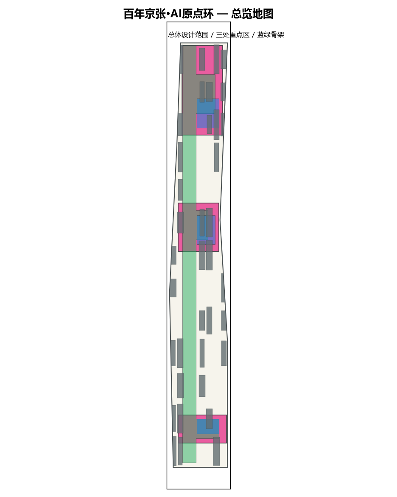
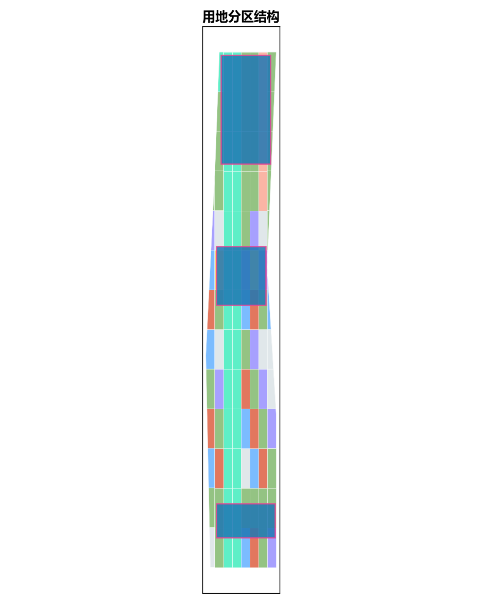
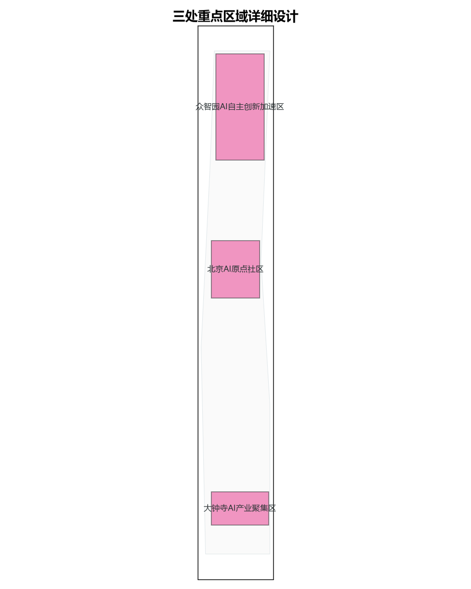
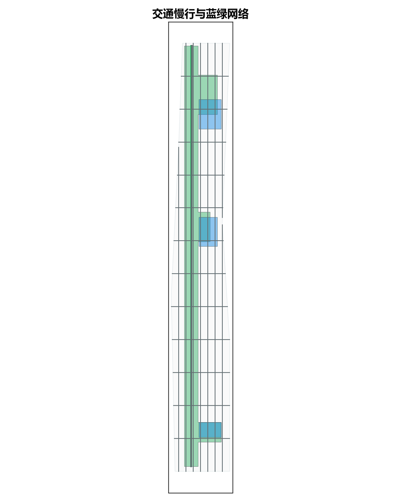
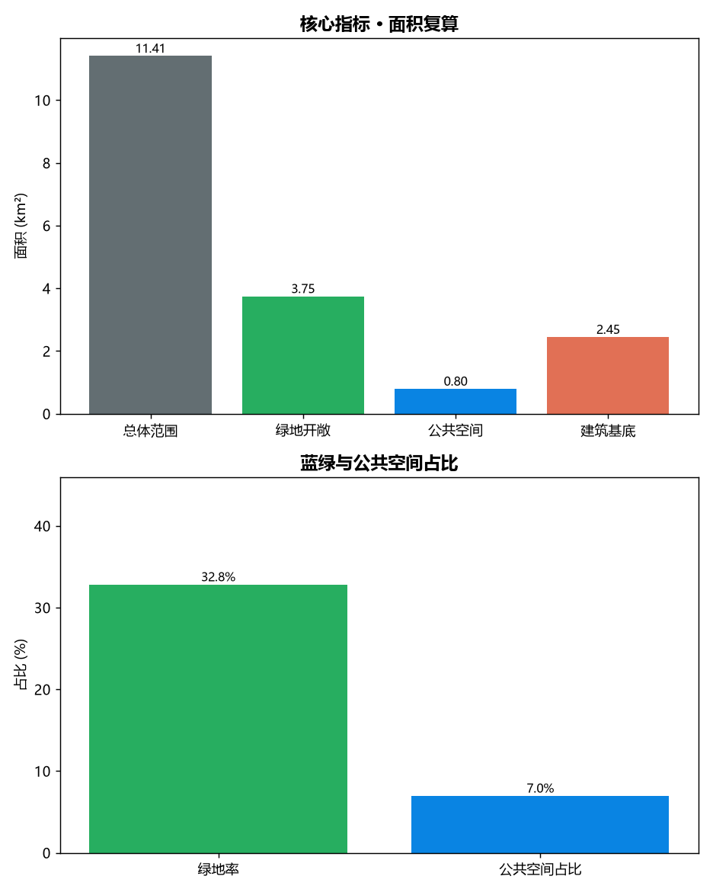

# 百年京张·AI原点环：从铁路文脉到开源圣地的城市设计概念方案

> 提交人：方宇轩（大连理工大学） ｜ 阶段：formal ｜ 许可：CC-BY-4.0 ｜ 本方案为概念建议，非已审定规划结论。

## 设计依据与资料清单

本方案的设计依据以公开与清权资料为formal主控：[source:DATA-SRC-OFFICIAL-ANNOUNCEMENT-20260509] 确立项目的三层范围、三处重点区、设计任务与成果语境；[source:DATA-SRC-AGENT-TASKBOOK-20260518] 补充面向智能体的共创原则、三大定位、五大功能、六项任务与统一边界条款；专业标准依据 [standard:PROJECT-OFFICIAL-ANNOUNCEMENT]、[standard:PROJECT-AGENT-OPEN-CALL-TASKBOOK]、[standard:MOHURD-URBAN-DESIGN-MEASURES]、[standard:MOHURD-CONTROL-DETAILED-PLANNING]、[standard:MNR-LAND-USE-CLASSIFICATION-GUIDE]。空间边界采用仓库提供的临时粗略边界 [source:DATA-SRC-PROVISIONAL-BOUNDARIES-20260605]，其几何与面积仅作展示与自检用途，最终以官方红线为准。资料可用性遵循“可作为formal依据 / 仅作provisional intake / 仍需official清权”的三级划分，缺失项已在假设与风险章节列明 [data:geometry/constraints.geojson#constraints]。

## 三层范围工作框架

方案严格对应征集公告的三层范围工作框架 [depth:three_level_scope_framework]：统筹研究范围（约43.6km²）作为区域研判背景；总体设计范围（约11.4km²）承载城市更新与控规深度的城市设计 [data:geometry/site_boundary.geojson#site]；重点详细设计范围（约3.68km²）聚焦三处重点片区 [data:geometry/key_areas.geojson#key-areas]。三层范围呈“背景研判—总体设计—重点深化”的递进关系，总体设计范围无缝承接统筹研究的产业与空间结论，重点区在总体结构下做精细化承载。几何上以临时边界多边形表达三层范围，重点区多边形全部位于总体设计范围内部，保证空间从属关系自洽 [data:geometry/phasing.geojson#phasing]。

## 统筹研究范围产业与未来城市研究

在统筹研究范围内，方案研判百年京张走廊的产业基因与未来城市特征 [depth:existing_conditions_diagnosis]：依托既有高校、科研院所与科创企业集聚，提出“AI+研发—AI+制造—AI+服务”的产业谱系，并将未来城市命题落在低碳、韧性、可步行与数字孪生四个维度。研究范围不直接落图，但为总体设计范围的用地结构与重点区定位提供产业容量与人才画像支撑。概念上把“人字形展线”的折线逻辑转译为创新要素沿走廊梯度集聚的空间隐喻，使未来城市研究结论可回溯到总体结构。需说明：统筹研究范围的精确边界、产业底数与人口结构仍依赖official/清权资料，本方案仅作趋势性判断。

## 总体设计范围城市更新与控规深度城市设计

总体设计范围采用城市更新与控规深度的城市设计 [depth:overall_spatial_structure]，以“AI原点环”为总体结构：一条贯通南北的蓝绿创新脊串联三处重点区，形成“一脊三区多节点”的格局 [data:geometry/land_use.geojson#land-use]。控规层面仅作概念性开发强度与用地混合建议，明确区分已知控制条件、设计建议与待确认事项 [standard:MOHURD-CONTROL-DETAILED-PLANNING]；开发强度控制以分区容量推定 [depth:development_intensity_controls]，建筑高度与体量以风貌协调为目标，避免对铁路文脉与周边住区形成压迫 [depth:height_massing_character]。所有数值均基于临时边界复算，最终以官方控规指标为准。

## 重点区域详细设计

三处重点区域采用差异化的详细设计策略 [depth:three_key_area_detailed_design]：众智园AI自主创新加速区（北部）聚焦AI基础研究与中试放大，布局研发组团与共享中试平台；北京AI原点社区（中部）强调产城融合与人才宜居，混合研发、居住、服务与公共空间；大钟寺AI产业聚集区（南部）侧重产业总部与场景展示。三区通过蓝绿脊与轨道接驳紧密联系 [data:geometry/key_areas.geojson#key-areas]，并在每个重点区设置一处“开源圣地”锚点空间，承载社区共建、展示与活动功能，呼应征集对“圣地”的叙事要求。各重点区建筑容量与高度在后续控规中校核，本方案仅给出概念性承载框架。

## AI 创新生态、人才画像与 AI+ 场景

面向智能体的任务要求 [standard:PROJECT-AGENT-OPEN-CALL-TASKBOOK]，方案构建“算力—模型—场景—人才”四位一体的AI创新生态，并刻画三类人才画像：基础研究科学家、AI工程师、场景运营者 [depth:existing_conditions_diagnosis]。在AI+场景上部署科研协同、智慧出行、低碳治理、社区服务等节点 [data:geometry/public_space.geojson#public]，将开源协作机制嵌入空间运营：以共享中试、开放数据集与社区活动维持生态活性。场景设计强调“可感知、可参与”，使AI能力以可视化、可及的方式融入日常公共生活，形成可持续运营的创新闭环。

## 用地、建筑规模与拆改留方案

用地布局以科研(0802)、商业服务业(05)、公共管理与公共服务(08)、公园绿地(1401)为主，并预留留白用地(16)以应对不确定性 [depth:land_use_layout] [data:geometry/land_use.geojson#land-use]。建筑规模按分区容量估算，建筑基底集中布局于科研与商业分区 [data:geometry/buildings.geojson#buildings]，总基底面积经几何复算 [metric:building_footprint_area_sqm]。拆改留方案遵循“留改拆”优先顺序：现状保留建筑予以活化，低效存量改造提升，确需拆除的零星用地转为蓝绿与公共空间 [depth:retain_renovate_demolish]；具体拆改范围需结合现状底数与权属调查确认，本方案仅作概念判断。

## 交通、轨道、市政与公共服务设施

交通组织构建“轨道接驳—次干路—支路—绿道慢行”的分级网络 [depth:traffic_rail_slow_parking]，沿百年京张铁路文脉形成贯通南北的蓝绿慢行脊，强化重点区之间的慢行可达性 [data:geometry/roads.geojson#roads]。市政与新型基础设施方面，提出分布式算力、智慧灯杆、车路协同与低碳能源的嵌入式部署原则 [depth:municipal_new_infrastructure]，强调与城市更新的同步实施。公共服务设施按15分钟生活圈配置，重点保障人才公寓、社区服务中心与运动文化设施，提升重点区宜居度与全天活力。

## 蓝绿空间、公共空间与城市风貌

蓝绿与公共空间是“AI原点环”的结构骨架 [depth:blue_green_public_space]：中央绿脊串联三处公园与广场，形成连续可步行的蓝绿网络 [data:geometry/green_space.geojson#green] [data:geometry/public_space.geojson#public]。经几何复算，绿地与开敞空间面积约 [metric:green_space_area_sqm] 平方米，绿地率约 [metric:green_ratio]；公共空间面积约 [metric:public_space_area_sqm] 平方米，公共空间占用地比约 [metric:public_space_ratio]。城市风貌以“铁路文脉+科技冷灰+生态暖绿”的色系控制，建筑体量低密舒缓，使AI创新带兼具识别度与亲和力。

## 更新项目清单、实施政策与分期计划

更新项目清单围绕三处重点区与蓝绿脊组织 [depth:renewal_project_list]，近期优先启动北京AI原点社区示范段与中央绿脊，中期推进众智园研发组团，远期完善大钟寺产业聚集区 [depth:phasing_implementation]。实施政策建议采用“政府引导+平台运营+社会共建”的开放治理模式，鼓励以开源协议共享空间与数据资产 [data:geometry/phasing.geojson#phasing]。分期几何按纬度带划分，保证各期任务在空间上可独立启动、成片见效，并与控规编制节奏协同；每期均须通过official/清权资料复核后再行实施。

## 指标体系、面积复算与合规矩阵

指标体系以面积复算为核心，全部数值基于临时边界几何复算 [depth:metrics_recalculation]：[metric:site_area_sqm] 为总体设计范围面积，绿地率与公共空间占比分别为 [metric:green_ratio]、[metric:public_space_ratio]，用地代码统一采用国土空间分类指南 [standard:MNR-LAND-USE-CLASSIFICATION-GUIDE]。合规方面，方案以合规矩阵覆盖征集公告1.3/1.4/1.5与面向智能体的六项任务（agent.1–agent.6），标准矩阵逐条回应五项专业标准，设计深度矩阵覆盖十五项formal设计深度项。机器可读证据见 geometry/ 与 metrics.json，自检结论见 self_check.json [data:geometry/site_boundary.geojson#site]。

## 风险、版权与合规说明

主要风险来自数据缺失：官方红线、控规指标、文保控制线、市政管线与权属边界均待official/清权资料替换 [depth:risk_missing_data]；现状底数与实施边界亦需补充调查 [standard:MOHURD-URBAN-DESIGN-MEASURES]。文保与建设控制条件以概念性约束表达 [data:geometry/constraints.geojson#constraints]。版权方面，本方案采用 CC-BY-4.0 许可，署名方宇轩（大连理工大学），公开资料版权归原发布机构。合规上严格遵守“不伪造官方批准、不替代法定规划”的边界条款，所有结论均以概念建议呈现，最终以官方审批为准。详细声明见 report/copyright_statement.md。

## 参考资料

1. 百年京张AI创新带城市设计国际方案征集资格预审公告 [source:DATA-SRC-OFFICIAL-ANNOUNCEMENT-20260509]。
2. 面向全球智能体开展百年京张AI创新带城市设计开源征集任务书摘录 [source:DATA-SRC-AGENT-TASKBOOK-20260518]。
3. 城市设计管理办法 [standard:MOHURD-URBAN-DESIGN-MEASURES]。
4. 城市、镇控制性详细规划编制审批办法 [standard:MOHURD-CONTROL-DETAILED-PLANNING]。
5. 国土空间调查、规划、用途管制用地用海分类指南 [standard:MNR-LAND-USE-CLASSIFICATION-GUIDE]。
6. 临时粗略边界（provisional boundaries）[source:DATA-SRC-PROVISIONAL-BOUNDARIES-20260605]。
7. 几何与指标数据：geometry/ 各图层与 metrics.json；自检：self_check.json；合规：compliance_matrix.json、standard_matrix.json、design_depth_matrix.json。
