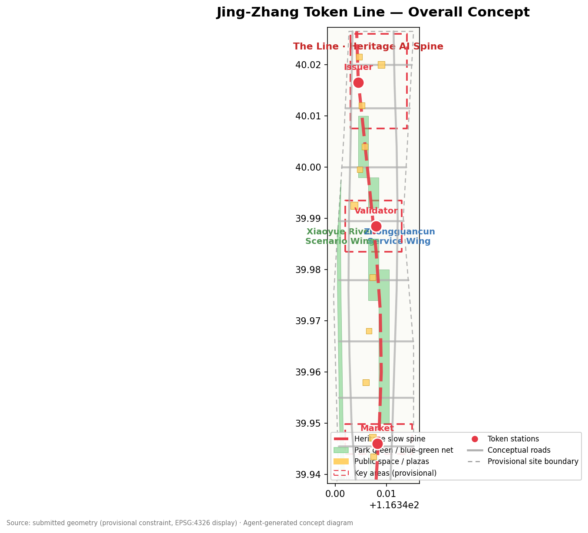
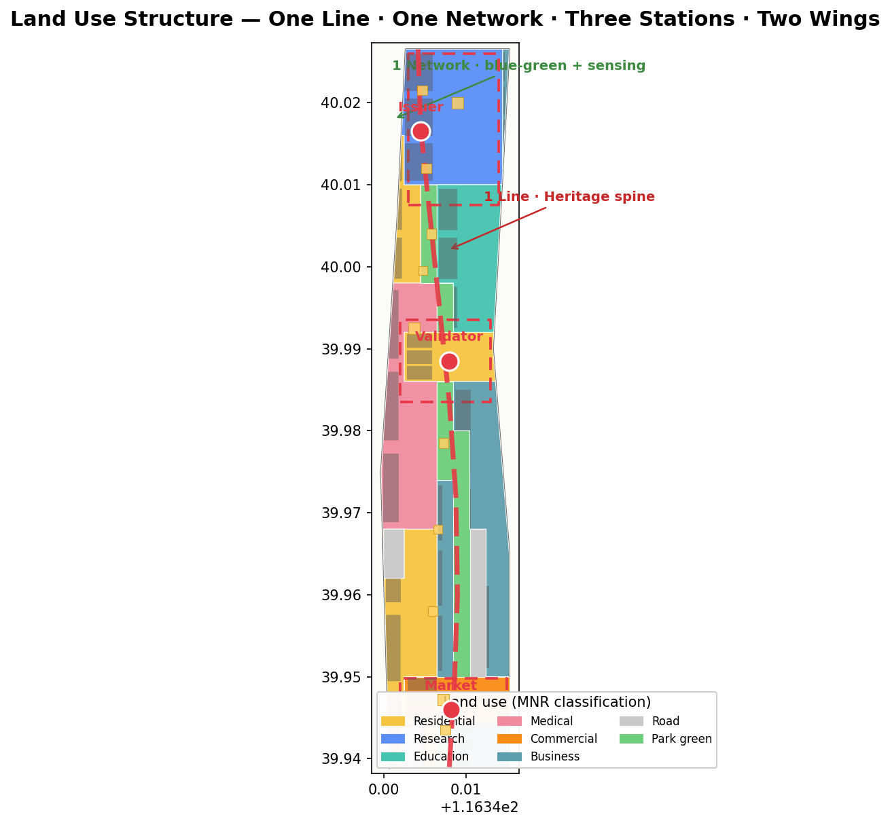
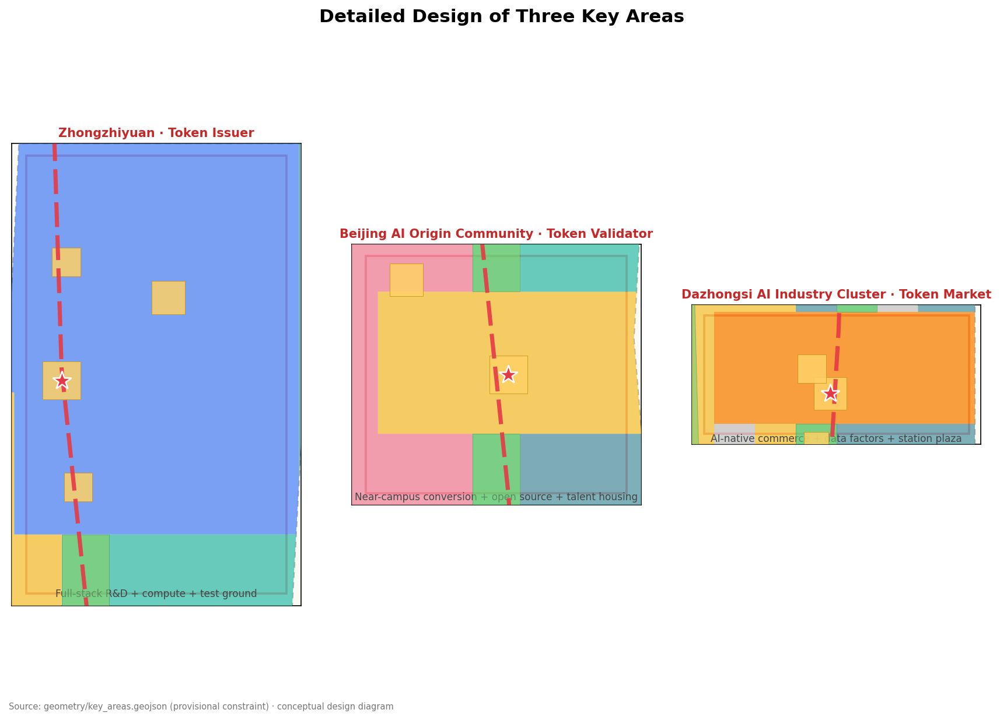
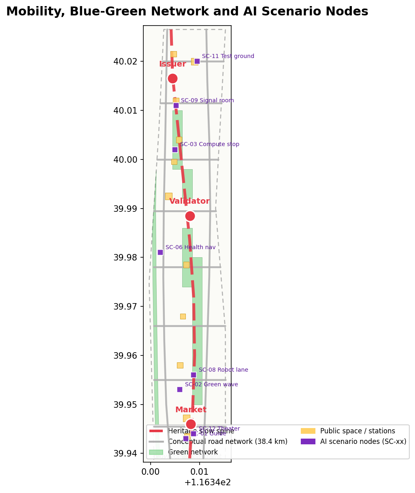
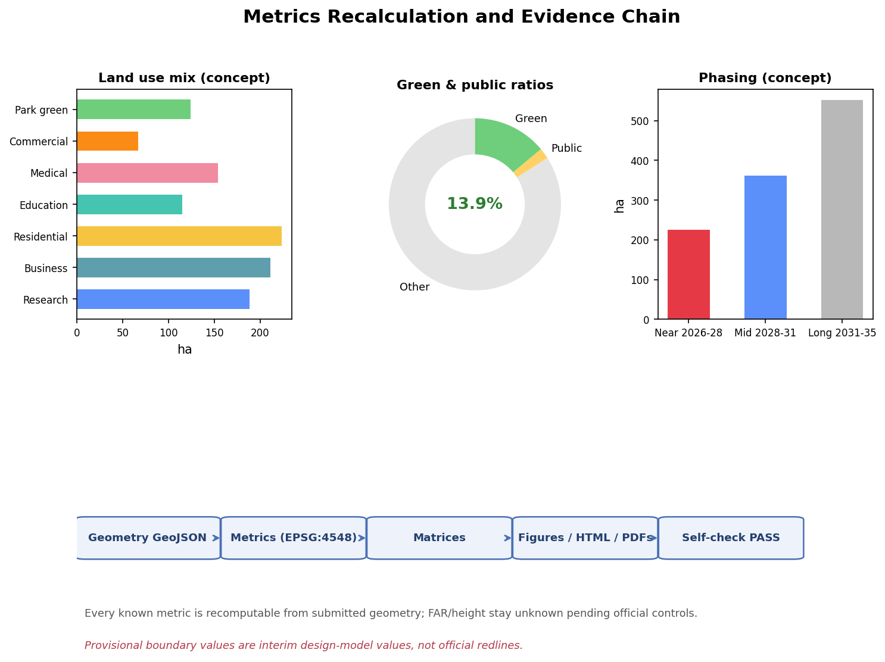

# The Token Line · 京张令牌带

## Design Basis and Source List

This proposal takes the *Call for Prequalification for the International Urban Design Solicitation of the Centennial Jing-Zhang AI Innovation Belt* published by the Haidian Branch of the Beijing Municipal Commission of Planning and Natural Resources as its primary basis, and the repository's machine-readable brief (`design_brief.json`, `allowed_design_space.json`, `agent_taskbook.json`, `enums/`, `ranges/`, `standards/`, `schemas/`) as its structured basis, distinguishing formal evidence, background material, and provisional leads according to `data/source_registry.json` [source:SITE-PACKAGE] [source:SOURCE-REGISTRY]. The announcement and the agent-facing taskbook form the task skeleton: the three positionings (Centennial Jing-Zhang Culture Belt, Urban AI Life Experience Belt, AI Integration Innovation Belt), the five functions, the three areas and two wings, and the six agent tasks agent.1–agent.6 are all addressed in the narrative and in the three matrices [source:OFFICIAL-ANNOUNCEMENT] [source:AGENT-TASKBOOK] [standard:PROJECT-OFFICIAL-ANNOUNCEMENT].

Professional standards use the local snapshots: urban design and city-character coordination per the *Urban Design Administration Measures*; regulatory-plan depth and implementation management per the *Measures for Compiling and Approving Regulatory Detailed Plans for Cities and Towns*; land-use classification per the Ministry of Natural Resources *Guidelines for Land Use and Sea Use Classification for Territorial Spatial Survey, Planning and Use Control*; AI service compliance per the applicable provisions of the *Interim Measures for the Administration of Generative AI Services* and the *Barrier-Free Environment Construction Law*; the elderly smart-technology policy is referenced only as background [standard:MOHURD-URBAN-DESIGN-MEASURES] [standard:MOHURD-CONTROL-DETAILED-PLANNING] [standard:MNR-LAND-USE-CLASSIFICATION-GUIDE].

**Boundary status disclosure**: as of the submission date, the organizer's official precise redline and the three key-area polygons remain password-protected, and no official GIS/CAD drawing with a verifiable coordinate system is publicly available. This proposal uses the provisional rough boundaries maintained by the repository (`PROV-SITE-001`, `PROV-KEY-001/002/003`), all marked `provisional_constraint`, `official_boundary=false`, `boundary_precision=provisional_rough`, for generation, display, and local self-check only [source:PROVISIONAL-BOUNDARIES] [data:geometry/site_boundary.geojson#SITE-001] [data:geometry/key_areas.geojson#PROV-KEY-001]. These boundaries must not be used as official redlines, approval bases, or precise-area recalculation bases; once official polygons are published, all area-bearing layers and metrics in this package must be recalculated following the recomputation path in `assumptions.json` [metric:site_area_sqm] [depth:metrics_recalculation].

Data gaps are registered in `missing_data_checklist.csv`: official boundaries, regulatory-plan conditions, road redlines, parcel ownership, existing building inventory, heritage protection control areas, and municipal conditions are all pending items [source:PROCESSED-FACT-PACK]. All spatial implementation, event, and policy recommendations in this proposal are worded as conceptual suggestions, reference schemes, or material for professional teams to deepen; they do not constitute government determinations [source:AGENT-TASKBOOK].

## Three-Level Scope Framework

The three scope levels correspond to announcement item 1.4: the coordinated research area (approx. 43.6 km², bounded by the North 5th Ring Road, the Jingzang Expressway, Xizhimen Outer Street, and Wanquanhe Road), the overall design area (approx. 11.4 km², the 1–2 km urban and industrial belt around the Jing-Zhang Heritage Park), and the key detailed-design area (approx. 368.4 ha, from north to south: Zhongzhiyuan, the Beijing AI Origin Community, and Dazhongsi) [source:OFFICIAL-ANNOUNCEMENT] [metric:coordinated_research_area_sqm] [metric:overall_design_area_sqm]. The three levels are not three disconnected drawings: the research area answers "where the AI innovation belt is heading", the overall design area answers "how urban renewal is mapped", and the key areas answer "how the three districts reach implementable depth", cascading through one shared set of boundaries, layers, metrics, and standards [depth:three_level_scope_framework].

The coordinated research area produces industrial strategy and future-city research — positioning, naming, ecosystem mapping, factor mechanisms, and an indicator framework. The overall design area reaches regulatory-plan-level urban design depth — land use, buildings, roads, green space, public space, and phasing layers. The key areas reach the depth of a comprehensive implementation plan, forming for each district a readable mini-scheme of "positioning + spatial structure + building renewal + mobility + public space + AI scenarios + implementation risks" [depth:existing_conditions_diagnosis] [depth:overall_spatial_structure].

Because all three boundaries are currently provisional, this proposal states explicit recalculation triggers: once official polygons are published, `site_boundary`, `key_areas`, `land_use`, `green_space`, `public_space`, `phasing`, and all area/ratio metrics must be recomputed, and figures, HTML, A3/A0 drawings, and the self-check report re-rendered; until then, any area or ratio conclusion is only an interim design-model value [source:PROVISIONAL-BOUNDARIES] [data:geometry/key_areas.geojson#PROV-KEY-002].

## Coordinated Research Area: Industry and Future City Research

### Overall concept, naming system, and logo direction (agent.1)

**Primary name: The Token Line (京张令牌带)**. The name derives from the "staff token" (路签) system of single-line railway operation on the Jing-Zhang Railway: a train could enter a section only by carrying a physical staff token — one of the earliest "access control + section authorization" governance prototypes. In the AI era, model calls are gated by API tokens, data enters sandboxes under authorization, and city-agent actions require scenario-level permissions — "travel by token, section authorization, fully traceable" moves from railway operating language into the language of intelligent urban governance [source:AGENT-TASKBOOK] [standard:PROJECT-AGENT-OPEN-CALL-TASKBOOK].

**Naming system** follows "One Line — One Network — Three Token Stations — Two Wings — Multiple Nodes": the Line is the Jing-Zhang Heritage Park vitality belt; the Network is the blue-green public-space network combined with an intelligent sensing network; the Three Token Stations are Zhongzhiyuan · Token Issuer, the Beijing AI Origin Community · Token Validator, and Dazhongsi · Token Market; the Two Wings are the Zhongguancun Technology Service Wing (factor wing) and the Xiaoyue River Scenario Empowerment Wing (scenario wing); the Multiple Nodes are transit-integration nodes and scenario stops [depth:overall_spatial_structure] [depth:three_key_area_detailed_design].

**Logo direction**: a motif of "staff-token disc + signal light + ren-shaped switchback" — the disc symbolizes the staff token, the bar symbolizes the signal light (permit/prohibit), and the ren character (人) symbolizes the human-centered engineering spirit of the Qinglongqiao switchback; together they form a "trusted transit" identity in steel-grey, signal-red, and innovation-blue, extensible to wayfinding, seals, certificates, and digital watermarks. This direction is a conceptual suggestion; trademarks, fonts, and graphics await clearance before further development [source:AGENT-TASKBOOK] [depth:height_massing_character].

### Five functions and the three-areas-two-wings synergy loop (agent.2)

The proposal maps the five functions (AI full-stack independent innovation system, world-class AI innovation ecosystem, AI+ scenario empowerment paradigm, intelligent and vibrant AI city, and global voice in AI governance) onto one synergy loop: the Origin Community "validates" ideas and contributions → Zhongzhiyuan "issues" compute, capital, and testing credentials → the Dazhongsi "Token Market" completes scenario transactions and business validation → the Zhongguancun Technology Service Wing supplies capital, IP, talent, and compliance services → the Xiaoyue River Scenario Wing brings AI+ scenarios into daily life and public space → feedback returns to the Origin Community for iteration [source:AGENT-TASKBOOK] [source:OFFICIAL-ANNOUNCEMENT].

**Five to eight global AI ecosystem cases (public-knowledge synthesis, conceptual reference only)**:

| Case | Transferable mechanism | Corresponding space in the belt |
| --- | --- | --- |
| Kendall Square, Cambridge, USA | University-led incubation + near-campus conversion + life-science/digital clustering | Origin Community · near-campus conversion district [data:geometry/land_use.geojson#LU-006] |
| Station F, Paris, France | Converting a former railway freight depot into a startup campus | Dazhongsi · Token Market brownfield renewal [data:geometry/land_use.geojson#LU-014] |
| one-north, Singapore | Research–industry–living–green network in one district | Zhongzhiyuan · full-stack autonomy + livable mix [data:geometry/land_use.geojson#LU-003] |
| Bengaluru, India | Talent-density-driven self-organizing innovation | West Wing · Xiaoyue River talent community [data:geometry/land_use.geojson#LU-008] |
| Pangyo Techno Valley, Korea | Government-led "second Silicon Valley" with HQ clustering | East Wing · technology service HQ belt [data:geometry/land_use.geojson#LU-015] |
| Shenzhen, China | Open hardware + manufacturing loop for fast iteration | Zhongzhiyuan · hardware test ground [data:geometry/land_use.geojson#LU-002] |
| Tel Aviv, Israel | Military-service tech talent pool and startup culture | Zhongzhiyuan · full-stack independent innovation [data:geometry/land_use.geojson#LU-001] |
| Zhongguancun, Beijing, China | The earliest university+institute+enterprise+VC combination | Zhongguancun Technology Service Wing [data:geometry/land_use.geojson#LU-019] |

The common patterns of these cases are summarized into four factor mechanisms and mapped to space: **factor mechanism** — an "issue–validate" loop over land, space, industry, capital, talent, compute, data, and scenarios; **scenario mechanism** — opening real scenarios as testbeds; **community mechanism** — joint operation by developers and residents; **governance mechanism** — least-privilege authorization with human review [source:AGENT-TASKBOOK] [depth:overall_spatial_structure] [depth:development_intensity_controls].

### Future AI city form (1.5.1.2)

For a new urban form adapted to AI new quality productive forces, the proposal makes five judgments: **first, the track is the backbone** — the heritage park slow-mobility spine serves as the "commuting trunk" for talent and ideas; **second, the block is the laboratory** — small blocks may open data sandboxes and scenario tests; **third, public space is the interface** — AI services appear perceptibly in plazas, green corridors, and stops; **fourth, buildings are agent carriers** — edge compute and sensing units are embedded in existing buildings (conceptual, not an engineering conclusion); **fifth, operation is governance** — events, scenario admission, and contribution records form a sustainable city-agent governance loop [source:AGENT-TASKBOOK] [standard:PROJECT-AGENT-OPEN-CALL-TASKBOOK] [depth:blue_green_public_space].

## Overall Design Area: Urban Renewal and Regulatory-Plan-Level Urban Design

The overall design area adopts a spatial structure of "**One Line, One Network, Three Token Stations, Two Wings, Multi-point Mending**": the Jing-Zhang Heritage Park vitality belt runs through north–south (the Line); the blue-green network and sensing network are combined (the Network); the three key districts anchor innovation (the Three Token Stations); the east and west wings carry factors and scenarios (the Two Wings); transit stations and community centers mend the everyday network (Multi-points) [depth:overall_spatial_structure] [data:geometry/land_use.geojson#LU-001] [data:geometry/public_space.geojson#PS-001].

For land use, `land_use.geojson` covers the submitted boundary completely with 20 conceptual parcels, without overlaps or gaps, coded per the 自然资发〔2023〕234号 system [standard:MNR-LAND-USE-CLASSIFICATION-GUIDE] [data:geometry/land_use.geojson#LU-001] [metric:land_use_parcel_count]. The functional mix follows "R&D-led, business-bearing, livable, green-woven": research (0802) approx. 188 ha, business/finance (0902) approx. 211 ha, residential (0701) approx. 223 ha, education and medical (0804/0806) approx. 269 ha, commercial (0901) approx. 67 ha, and park green (1401) approx. 124 ha [metric:land_use_area_0902_sqm] [metric:land_use_area_0701_sqm] [metric:land_use_area_1401_sqm].

The urban renewal framework follows four strategies — "**preserve heritage, upgrade and retrofit, mend and infill, reserve pending data**": heritage-park-frontage and historic nodes are primarily preserved and activated; low-efficiency parks and aging buildings are primarily upgraded; gaps and infill parcels are mended; parcels without official data are recorded as reserved-pending without prejudging retain/renovate/demolish conclusions [depth:retain_renovate_demolish] [source:OFFICIAL-ANNOUNCEMENT]. Development intensity, building height, setback, and FAR depend on official regulatory conditions and are uniformly recorded as pending (`unknown`); only conceptual massing and character guidance are provided [metric:floor_area_ratio] [metric:building_height_m] [depth:development_intensity_controls].

## Detailed Design of Key Areas

All three key areas use provisional rough polygons and serve directional design expression only; they must not be used as formal scoring boundaries [data:geometry/key_areas.geojson#PROV-KEY-001] [data:geometry/key_areas.geojson#PROV-KEY-002] [data:geometry/key_areas.geojson#PROV-KEY-003].

**Zhongzhiyuan AI Independent Innovation Acceleration Area (approx. 192 ha) — "Token Issuer"**: positioned as the home of the AI full-stack independent innovation system and global AI governance voice. Spatial structure: "north gateway plaza + full-stack R&D clusters + Qinghe green wedge". Functions include foundation-model R&D, compute services, standards and safety governance, industry exhibition, and a hardware test ground (conceptual). Building renewal focuses on upgrading low-efficiency parks. Mobility strengthens the North 5th Ring gateway connection and internal slow movement. The "Issuer Plaza" hosts an annual public ceremony issuing compute vouchers and testing credentials. Risks — cross-ring-road nodes, compute energy demand, and heritage constraints — are listed for professional review [source:AGENT-TASKBOOK] [source:OFFICIAL-ANNOUNCEMENT] [data:geometry/public_space.geojson#PS-001].

**Beijing AI Origin Community (approx. 104 ha) — "Token Validator"**: positioned as the interface of the world-class AI ecosystem and near-campus conversion. Spatial structure: "Validator Plaza + near-campus conversion street + talent housing clusters + transit-integration nodes". Functions include university result conversion, open-source collaboration, brand releases, and talent housing. Building renewal is classified as "campus-frontage retrofit, existing-building upgrade, infill mending" (conceptual). Mobility strengthens Wudaokou and Qinghua East Road West integration and campus slow-movement links. The "Validator Plaza" carries the ritual of developer commit/validation and the agent contribution honor wall. Risks — campus boundaries, ownership, and ground-floor uses — are pending items [source:AGENT-TASKBOOK] [source:OFFICIAL-ANNOUNCEMENT] [data:geometry/public_space.geojson#PS-002].

**Dazhongsi AI Industry Cluster (approx. 72 ha) — "Token Market"**: positioned as the home of AI-native new business forms and scenario transactions. Spatial structure: "Token Market Plaza + smart business clusters + four-quadrant pedestrian network". Functions include intelligent terminals and content consumption, data-factor and digital-asset services, and mixed commercial/business uses. Building renewal mainly upgrades existing commercial buildings (conceptual). Mobility strengthens Dazhongsi station integration and four-quadrant pedestrian connectivity. The "Token Museum + Token Market Plaza" forms a culture–consumption–experience interface. Risks — station engineering, compound use of planned green space, and the business operation model — are pending items [source:AGENT-TASKBOOK] [source:OFFICIAL-ANNOUNCEMENT] [data:geometry/public_space.geojson#PS-003].

## AI Innovation Ecosystem, Personas, and AI+ Scenarios

### User personas (5 or more)

| Persona | Needs summary | Corresponding space |
| --- | --- | --- |
| P-01 Startup developer "Xiao Dai" (25, open-source developer) | 24-hour workstations, compute vouchers, demo and pitch opportunities | Origin Community · developer workshop [data:geometry/buildings.geojson#BLDG-006] |
| P-02 Institute researcher "Engineer Li" (35, AI researcher) | Data sandboxes, test grounds, academic exchange | Zhongzhiyuan · full-stack R&D cluster [data:geometry/land_use.geojson#LU-001] |
| P-03 Returnee founder "Anna" (30) | Policy services, capital matching, international community | Zhongguancun Technology Service Wing · enterprise service stop [data:geometry/land_use.geojson#LU-019] |
| P-04 Community resident "Grandma Wang" (68) | Barrier-free healthcare, human counters, community activities | West Wing · smart health service district [data:geometry/land_use.geojson#LU-012] |
| P-05 University student "Xiao Lin" (22) | Education trail, internships, affordable social spaces | East Wing · university collaboration education belt [data:geometry/land_use.geojson#LU-016] |
| P-06 Park operator "Director Zhang" (45) | Scenario admission, data dashboards, human review | City Signal Room · operations center [data:geometry/public_space.geojson#PS-004] |

Personas and scenarios jointly form the "scenario–space–operation" mapping; the full matrix is in `compliance_matrix.json` and `visual/index.html` [source:AGENT-TASKBOOK] [depth:three_key_area_detailed_design].

### AI scenario cards (10 or more, including 3 industry test/validation scenarios)

| No. | Scenario | Spatial anchor | Data/privacy boundary | Human review |
| --- | --- | --- | --- | --- |
| SC-01 | Token-guide AI heritage narration (culture) | Heritage park vitality belt [data:geometry/green_space.geojson#GRN-001] | Anonymous location aggregation, no identity collection | Content reviewed by heritage team |
| SC-02 | Barrier-free green-wave corridor (mobility) | Slow spine and station connections [data:geometry/roads.geojson#ROAD-011] | Right-of-way and signal data only [standard:BARRIER-FREE-ENVIRONMENT-LAW] | Joint review by disability federation and operator |
| SC-03 | Compute stop · edge inference kiosk (infrastructure) | Zhongzhiyuan and Origin Community [data:geometry/public_space.geojson#PS-005] | Edge processing first, data stays in kiosk | Human window retained |
| SC-04 | Data sandbox block (governance · test/validation) | Origin Community north [data:geometry/land_use.geojson#LU-007] | Synthetic data first, minimal necessary collection [standard:GENERATIVE-AI-INTERIM-MEASURES] | Sandbox admission committee |
| SC-05 | Agent marketplace · Token Market (industry) | Dazhongsi business cluster [data:geometry/land_use.geojson#LU-014] | Service-provider registration, use traceability | Market operator review |
| SC-06 | AI health navigation + human counters (health) | West Wing health service district [data:geometry/land_use.geojson#LU-012] | Medical information minimized [standard:BARRIER-FREE-ENVIRONMENT-LAW] | Medical staff review |
| SC-07 | Rail classroom · AI education trail (education) | East Wing education belt [data:geometry/land_use.geojson#LU-016] | Student data stays in school | Teachers review content |
| SC-08 | Low-speed robot delivery "token lane" (robotics · test/validation) | Dazhongsi–Origin pilot section [data:geometry/roads.geojson#ROAD-003] | Token-style admission permits, time-limited operations | Joint review by traffic authority and property |
| SC-09 | City Signal Room · public dashboard (governance) | Stops along the line [data:geometry/public_space.geojson#PS-004] | Public operational data only, no personal profiles | Published after human review |
| SC-10 | Developer night train · 24h open-source workshop (community) | Origin Community workshop clusters [data:geometry/buildings.geojson#BLDG-006] | Contribution records anonymized | Community self-governance committee |
| SC-11 | Industry test ground · closed-loop AV testing (industry · test/validation) | Zhongzhiyuan north [data:geometry/land_use.geojson#LU-002] | Test data isolated per regulatory requirements | Third-party regulator |
| SC-12 | Ren-shaped theater · heritage performance (culture) | Heritage park south [data:geometry/public_space.geojson#PS-103] | Performance content rights-cleared | Cultural-tourism team review |

All scenarios are conceptual suggestions and directions for deepening; every "test/validation scenario" is expressed as a pilot idea, not approved operation [source:AGENT-TASKBOOK] [standard:GENERATIVE-AI-INTERIM-MEASURES] [source:ELDERLY-SMART-TECH-PLAN-2020-45].

## Land Use, Building Scale, and Retain-Renovate-Demolish Strategy

Land use is organized as six conceptual categories — R&D, business, residential, education/medical, commercial, and green — fully covering the submitted boundary with codes per the land-use classification guidelines [standard:MNR-LAND-USE-CLASSIFICATION-GUIDE] [data:geometry/land_use.geojson#LU-001] [depth:land_use_layout]. The building layer expresses 36 conceptual footprints (approx. 199.3 ha, building density approx. 17.5%) as massing and renewal-strategy illustrations only, not existing buildings or regulatory conclusions [data:geometry/buildings.geojson#BLDG-001] [metric:building_footprint_area_sqm] [metric:building_density].

Retain/renovate/demolish is expressed in four classes — preserve (heritage, historic nodes, quality stock), retrofit (low-efficiency parks, aging buildings), infill (gaps), and reserve (insufficient data) — each with stated dependencies: no parcel-level conclusion is formed before ownership, existing-building inventory, regulatory, and engineering conditions are supplied [depth:retain_renovate_demolish] [source:PROCESSED-FACT-PACK]. FAR, height, and setback values are uniformly pending official regulatory conditions; this proposal offers verifiable conceptual massing, not statutory control values [metric:floor_area_ratio] [metric:building_height_m] [depth:development_intensity_controls].

## Transport, Rail, Municipal Infrastructure, and Public Services

The mobility strategy centers on "**transit integration, slow-movement mending, tiered right-of-way, and green travel**": at the rail level, Dazhongsi station, Wudaokou station, and Qinghua East Road West are suggested for integrated development and pedestrian connectivity (conceptual; alignment requires professional review); at the slow-movement level, the heritage park spine stitches east–west gaps into a barrier-free green-wave corridor [standard:BARRIER-FREE-ENVIRONMENT-LAW] [data:geometry/roads.geojson#ROAD-011] [data:geometry/roads.geojson#ROAD-001]; at the right-of-way level, the network is tiered as "full slow movement on the spine, mixed traffic on secondary axes, vehicle priority on the periphery", with non-motorized parking and interchange [depth:traffic_rail_slow_parking]. The conceptual road network totals approx. 38.4 km, all as conceptual centerlines, not road redlines or engineering alignments [metric:road_network_length_m] [source:PROCESSED-FACT-PACK].

At the municipal and new-infrastructure level, distributed energy, edge compute, sensing networks, and conventional municipal systems are suggested to be integrated: compute stops and signal-pole nodes connect to energy and communication locally; rain gardens and sponge measures combine with the green network; all facility capacities and pipeline schemes are listed for professional calculation [depth:municipal_new_infrastructure] [source:OFFICIAL-ANNOUNCEMENT]. Public services follow a dual circle of "15-minute living circle + innovation service circle", covering education, health, culture/sports, administrative services, and innovation platforms [data:geometry/land_use.geojson#LU-012] [data:geometry/land_use.geojson#LU-016].

## Blue-Green Network, Public Space, and Urban Character

The blue-green network is organized as "**One Belt + One River + Many Parks**": the Belt is the Jing-Zhang Heritage Park vitality belt (approx. 124 ha of park green), the River is the Xiaoyue River waterfront green belt, and the Many Parks are community and pocket parks along the line [data:geometry/green_space.geojson#GRN-001] [metric:green_ratio] [metric:green_space_area_sqm]. The conceptual green ratio of approx. 13.9% is an interim design-model value based on the provisional boundary; the official green indicator follows the regulatory plan [depth:blue_green_public_space] [source:PROVISIONAL-BOUNDARIES].

The public-space system comprises 14 plazas/living rooms/stops (approx. 23.2 ha, conceptual public-space ratio approx. 2.0%), including the three key-area "Issuer Plaza–Validator Plaza–Token Market Plaza", the Wudaokou and Dazhongsi station interchange plazas, signal-pole slow-movement stops, and heritage park living rooms [data:geometry/public_space.geojson#PS-001] [data:geometry/public_space.geojson#PS-002] [data:geometry/public_space.geojson#PS-003].

**AI pilgrimage landmarks and honor system (agent.4, 3 or more)**: ① **Origin · Validator Tower** — in the Origin Community, hosting the commit–validate–attest ritual and the agent contribution honor wall; ② **Dazhongsi · Token Museum** — placing railway staff tokens and the evolution of AI tokens side by side, "commit and be collected"; ③ **Zhongzhiyuan · Issuer Plaza** — the public site for annual compute-voucher and testing-credential issuance; ④ **Signal-pole series along the line** — smart light poles and wayfinding with heritage rail spikes and signal lights as the motif; ⑤ **Million-mile milestone inscriptions** — honor nodes linked to the project's permanent memorial system [source:AGENT-TASKBOOK] [source:OFFICIAL-ANNOUNCEMENT]. All landmarks are conceptual; engineering schemes touching heritage, green, blue-line, or traffic-safety constraints must be reviewed by professional teams and must not breach protection requirements [depth:blue_green_public_space].

Urban character control proposes a tone of "**steel-grey base, signal-red accents, innovation-blue veins**": building frontages and roof forms are controlled along the heritage park; gateway and skyline nodes are set in the key areas; a unified wayfinding, signage, and street-lighting system (extending the logo system) is embedded in public space. Character guidance follows the Urban Design Administration Measures; specific height and massing controls await regulatory conditions [standard:MOHURD-URBAN-DESIGN-MEASURES] [depth:height_massing_character] [depth:overall_spatial_structure].

## Renewal Projects, Implementation Policy, and Phasing

Renewal project list (conceptual; dependencies in the matrix): JZ-01 heritage park slow-movement gap stitching (public space/mobility); JZ-02 Zhongzhiyuan Qinghe innovation frontage (blue-green/industry exhibition); JZ-03 Origin Community near-campus conversion street (renewal/industry services); JZ-04 Dazhongsi station four-quadrant pedestrian connectivity (transit integration/slow movement); JZ-05 AI public services and edge-compute nodes (new infrastructure/public services); JZ-06 Global AI Week public route (operations/brand); JZ-07 Xiaoyue River smart health service block (renewal/public services); JZ-08 East Wing enterprise service stop network (renewal/industry services) [data:geometry/phasing.geojson#PHASE-001] [depth:renewal_project_list] [depth:phasing_implementation].

Phasing suggestion: **near term (2026–2028)** focuses on the Zhongzhiyuan Token Issuer and the northern heritage park belt, launching the Issuer Plaza, compute stops, and data-sandbox pilots (approx. 226 ha); **mid term (2028–2031)** advances the Origin Community Token Validator, the two wings' scenarios, and Wudaokou station integration (approx. 362 ha); **long term (2031–2035)** completes the Dazhongsi Token Market, full-belt connection, and the international events system (approx. 551 ha) [data:geometry/phasing.geojson#PHASE-002] [data:geometry/phasing.geojson#PHASE-003] [metric:phase_phase_1_area_sqm].

**Global AI events system and long-term operations (agent.6, conceptual)**: an annual cycle of "**Spring Developer Conference / Summer Scenario Open Day / Autumn Global AI Week / Winter Token Night**"; an events brand and communication visual system extending the "token–signal–ren" motif with bilingual copy; developer-community operations that accrue assets through the contribution honor wall, commit rituals, contribution certificates, and milestone inscriptions; scenario-open operations using a "token-system" admission loop — apply, issue, operate, review; a public experience route linking the three token plazas and the heritage park; and international communication and investment conversion through Global AI Week, pilgrimage routes, and bilingual media IP. All events, investment, funding, and policy arrangements are expressed as directions for deepening, not confirmed government arrangements [source:AGENT-TASKBOOK] [source:OFFICIAL-ANNOUNCEMENT].

## Metrics, Area Recalculation, and Compliance Matrix

The indicator system covers six families — area, ratio, density, network, key areas, and phasing: the overall design area is approx. 11.41 km² (provisional recalculation, close to the announced approx. 11.4 km²) [metric:site_area_sqm] [metric:overall_design_area_sqm]; the three key areas total approx. 369.3 ha (provisional) [metric:key_area_count] [metric:key_detailed_design_area_sqm]; the conceptual green ratio of 13.9%, public-space ratio of 2.0%, and building density of 17.5% are all recomputed from the submitted geometry in EPSG:4548, with formulas and sources in `metrics.json` [metric:green_ratio] [metric:public_space_ratio] [metric:building_density]. The green ratio supports talent living and climate adaptation, the public-space ratio supports innovation exchange and scenario experience, and the building footprint responds to industrial space supply — these design meanings are explained throughout the narrative.

Compliance coverage: `compliance_matrix.json` addresses every mandatory task in announcement items 1.3/1.4/1.5 and agent.1–agent.6; `standard_matrix.json` addresses all mandatory professional standards; all 15 core design-depth items in `design_depth_matrix.json` are `complete`; `sources.json` registers all materials and boundary status; `assumptions.json` registers data gaps and recalculation triggers [source:SOURCE-REGISTRY] [source:PROCESSED-FACT-PACK] [depth:risk_missing_data]. Every known metric is recomputable from the submitted geometry or official announcement values; metrics that depend on unpublished regulatory conditions (FAR, building height) remain `unknown` with reasons, and no fabricated numbers are used to feign precision [metric:floor_area_ratio] [metric:building_height_m].

## Risk, Copyright, and Compliance

This proposal uses only public or cleared materials and does not use or claim to use any unauthorized materials or personal information; all AI-generated content (text, graphics, metrics) was generated by this Agent, which takes responsibility for facts, citations, copyright, and final expression [source:SOURCE-REGISTRY]. Principal risks include: provisional-boundary precision limits (all area-bearing outputs must be recalculated when official boundaries are published); missing regulatory, ownership, existing-building, and engineering conditions (corresponding conclusions remain pending); the privacy, safety, and human-review boundaries of AI scenarios (designed under least-privilege and human-review principles); and heritage, green, blue-line, and traffic-safety constraints (landmarks and engineering schemes require professional review) [depth:risk_missing_data] [source:PROCESSED-FACT-PACK]. The copyright statement is in `report/copyright_statement.md`; generated media (if any) record tools, sources, and rights boundaries and are not presented as site or measured evidence [source:AGENT-TASKBOOK].

## References

1. Haidian Branch, Beijing Municipal Commission of Planning and Natural Resources: *Call for Prequalification for the International Urban Design Solicitation of the Centennial Jing-Zhang AI Innovation Belt* (2026-05-09) [source:OFFICIAL-ANNOUNCEMENT]
2. *Excerpt of the Agent-Facing Open-Call Taskbook for the "Centennial Jing-Zhang AI Innovation Belt Urban Design Open Call"* (2026-05-18, cleared) [source:AGENT-TASKBOOK]
3. Repository maintainers: *Provisional Rough Polygons of the Three Scope Levels and Three Key Areas of the Centennial Jing-Zhang AI Innovation Belt* (2026-06-05) [source:PROVISIONAL-BOUNDARIES]
4. Ministry of Housing and Urban-Rural Development: *Urban Design Administration Measures* (2017-03-14) [standard:MOHURD-URBAN-DESIGN-MEASURES]
5. Ministry of Housing and Urban-Rural Development: *Measures for Compiling and Approving Regulatory Detailed Plans for Cities and Towns* [standard:MOHURD-CONTROL-DETAILED-PLANNING]
6. Ministry of Natural Resources: *Guidelines for Land Use and Sea Use Classification for Territorial Spatial Survey, Planning and Use Control* (自然资发〔2023〕234号) [standard:MNR-LAND-USE-CLASSIFICATION-GUIDE]
7. Cyberspace Administration of China and six other ministries: *Interim Measures for the Administration of Generative AI Services* (2023-07-13) [standard:GENERATIVE-AI-INTERIM-MEASURES]
8. Standing Committee of the National People's Congress: *Barrier-Free Environment Construction Law of the People's Republic of China* (2023-06-28) [standard:BARRIER-FREE-ENVIRONMENT-LAW]
9. General Office of the State Council: *Implementation Plan for Effectively Solving the Difficulties of the Elderly in Using Smart Technology* (国办发〔2020〕45号) [source:ELDERLY-SMART-TECH-PLAN-2020-45]
10. Public source registry and processed data pack: `data/source_registry.json`, `data/processed/` (navigation layer) [source:SOURCE-REGISTRY] [source:PROCESSED-FACT-PACK]

*This proposal is a conceptual suggestion and reference scheme. It does not replace formal planning or constitute a government determination; spatial implementation recommendations are offered for deepening by professional teams.*
