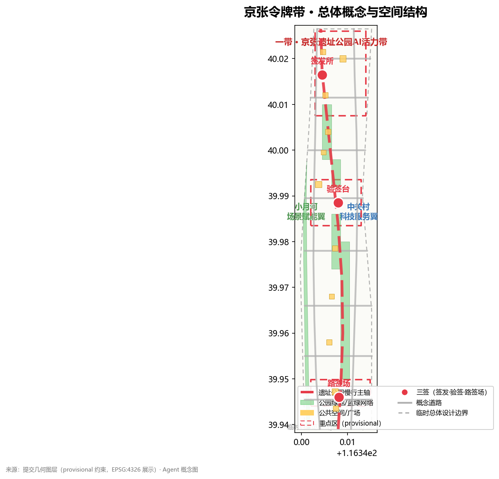
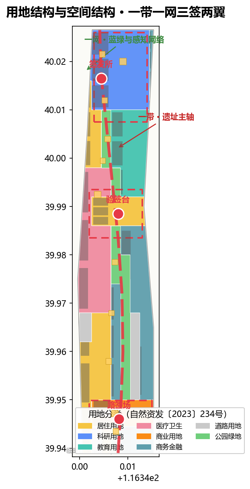
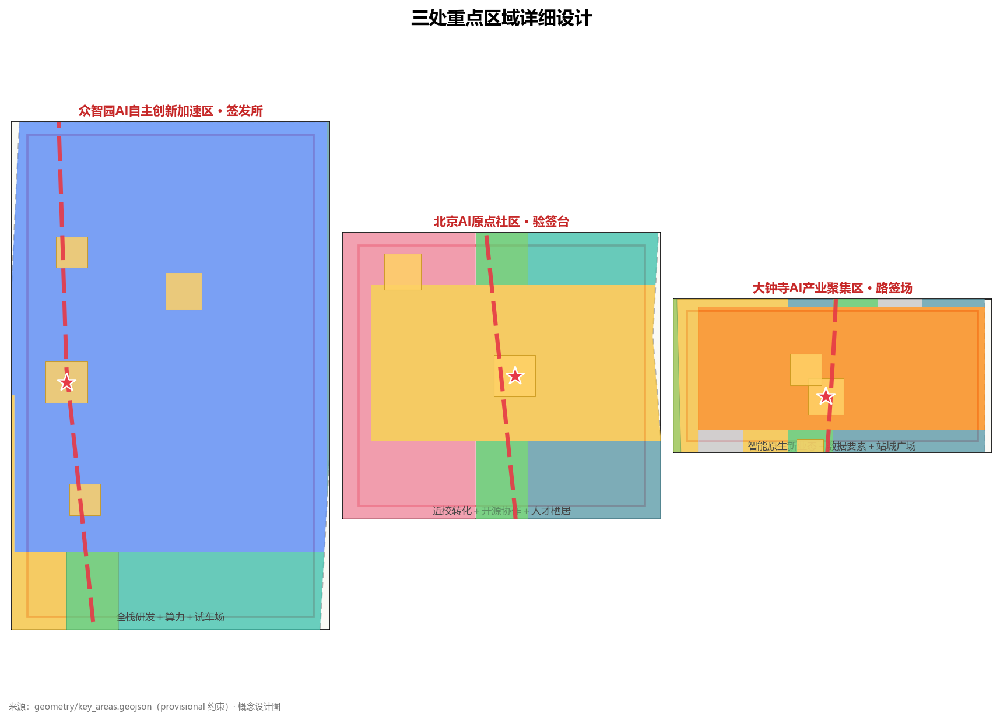
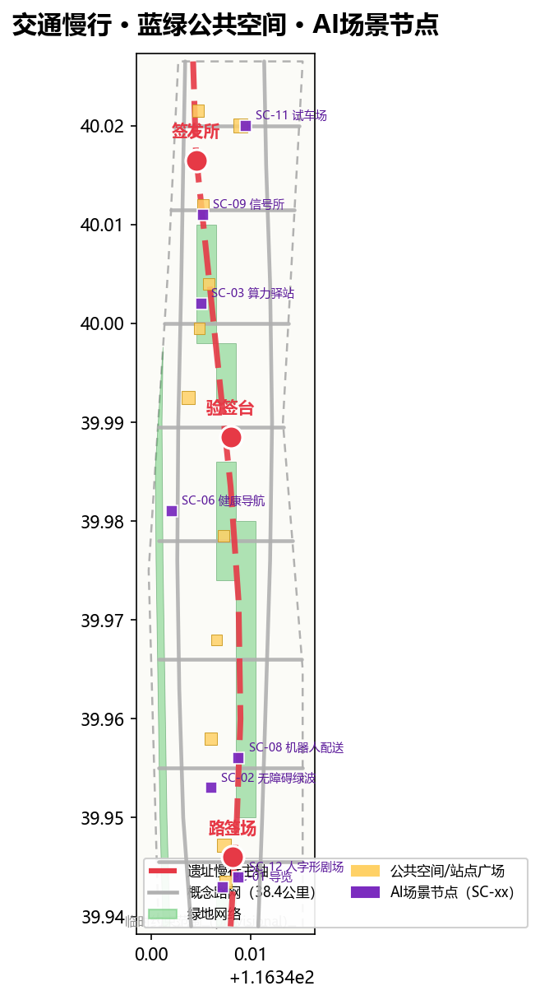
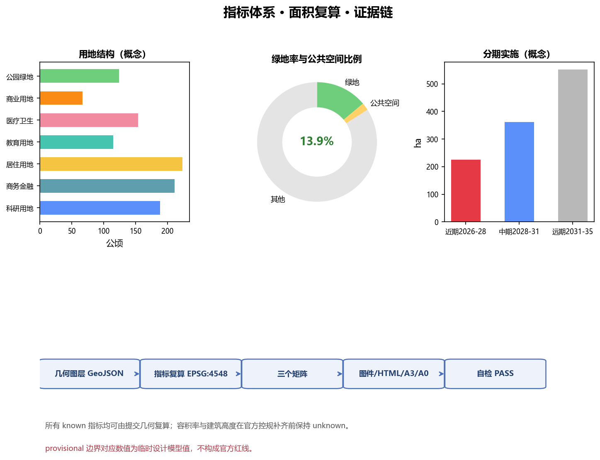

# 京张令牌带 · The Token Line

## 设计依据与资料清单

本方案以北京市规划和自然资源委员会海淀分局《百年京张AI创新带城市设计国际方案征集资格预审公告》为第一依据，以仓库提供的机器可读任务包（`design_brief.json`、`allowed_design_space.json`、`agent_taskbook.json`、`enums/`、`ranges/`、`standards/`、`schemas/`）为结构化依据，并按 `data/source_registry.json` 区分 formal 依据、背景资料与 provisional 线索 [source:SITE-PACKAGE] [source:SOURCE-REGISTRY]。公告与面向智能体任务书是方案的任务骨架：三大定位（百年京张文化带、都市AI生活体验带、AI融合创新带）、五大功能、三区两翼与 agent.1–agent.6 六项任务均在正文与三个矩阵中逐条展开 [source:OFFICIAL-ANNOUNCEMENT] [source:AGENT-TASKBOOK] [standard:PROJECT-OFFICIAL-ANNOUNCEMENT]。

专业标准采用本地快照：城市设计与风貌统筹按《城市设计管理办法》，控规深度与实施管理按《城市、镇控制性详细规划编制审批办法》，用地分类按自然资源部《国土空间调查、规划、用途管制用地用海分类指南》，AI 服务合规参照《生成式人工智能服务管理暂行办法》与《无障碍环境建设法》的适用条款，老年人智能技术应用政策仅作背景参照 [standard:MOHURD-URBAN-DESIGN-MEASURES] [standard:MOHURD-CONTROL-DETAILED-PLANNING] [standard:MNR-LAND-USE-CLASSIFICATION-GUIDE]。

**边界状态披露**：截至投稿日，征集组织机构官方精确红线与三处重点区 polygon 仍受密码保护，公开渠道未取得可验证坐标系的官方 GIS/CAD 图件。本方案采用仓库维护者依据公告文字四至与面积校核形成的 provisional 粗略边界（`PROV-SITE-001`、`PROV-KEY-001/002/003`），全部标为 `provisional_constraint`、`official_boundary=false`、`boundary_precision=provisional_rough`，仅用于生成、展示与本地自检 [source:PROVISIONAL-BOUNDARIES] [data:geometry/site_boundary.geojson#SITE-001] [data:geometry/key_areas.geojson#PROV-KEY-001]。该边界不得作为官方红线、审批依据或精确面积复算依据；官方 polygon 公布后，本包全部面积类图层与指标须按 `assumptions.json` 中的复算路径统一重算 [metric:site_area_sqm] [depth:metrics_recalculation]。

本方案的资料缺口已在 `missing_data_checklist.csv` 登记：官方边界、控规条件、道路红线、地块权属、现状建筑底数、文保控制范围与市政条件均为待补项 [source:PROCESSED-FACT-PACK]。方案中所有空间落地、活动与政策建议均表述为"概念建议""参考方案""可供专业团队深化研究"，不构成政府审定结论 [source:AGENT-TASKBOOK]。

## 三层范围工作框架

三层范围对应公告 1.4 的统筹研究范围（约43.6 km²，北五环—京藏高速—西直门外大街—万泉河路）、总体设计范围（约11.4 km²，京张遗址公园周边1—2公里城市地区与产业区）与重点区域范围（约368.4公顷，自北向南众智园、北京AI原点社区、大钟寺）[source:OFFICIAL-ANNOUNCEMENT] [metric:coordinated_research_area_sqm] [metric:overall_design_area_sqm]。三层不是三张割裂的图：统筹研究回答"AI创新带往哪里去"，总体设计回答"城市更新如何落图"，重点区域回答"三处片区怎样做出可实施深度"，逐级传导并共用同一套边界、图层、指标与标准 [depth:three_level_scope_framework]。

统筹研究范围的工作目标是产业战略与未来城市形态研究，产出定位、命名、生态图谱、要素机制与指标框架；总体设计范围达到控制性详细规划的城市设计深度，产出用地、建筑、道路、绿地、公共空间与分期图层；重点区域范围达到规划综合实施方案的城市设计深度，对三处片区分别形成"定位＋空间结构＋建筑更新＋交通慢行＋公共空间＋AI场景＋实施风险"的小方案 [depth:existing_conditions_diagnosis] [depth:overall_spatial_structure]。

由于当前三层边界均为 provisional，本方案明确以下复算触发条件：官方 polygon 发布后，须重算 `site_boundary`、`key_areas`、`land_use`、`green_space`、`public_space`、`phasing` 与全部面积/比例指标，并重新渲染图件、HTML、A3/A0 与自检报告；在此之前，任何面积与比例结论都只属于临时设计模型值 [source:PROVISIONAL-BOUNDARIES] [data:geometry/key_areas.geojson#PROV-KEY-002]。

## 统筹研究范围产业与未来城市研究

### 总体概念、命名体系与Logo方向（agent.1）

**主名称：京张令牌带（The Token Line）**。命名取自京张铁路单线运营时代的"路签"制度：列车凭物理路签进入区间，是铁路史上最早的"访问控制＋区间授权"治理原型；在AI时代，模型调用凭API令牌、数据进入凭沙箱授权、城市智能体动作凭场景级权限——"凭签通行、区间授权、全程可溯"从铁路管理语言转译为城市智能治理语言 [source:AGENT-TASKBOOK] [standard:PROJECT-AGENT-OPEN-CALL-TASKBOOK]。

**命名体系**按"一带—一网—三签—两翼—多节点"展开：一带即京张遗址公园活力带（The Line）；一网即蓝绿公共空间网与智能感知网（The Network）；三签即众智园·签发所（Token Issuer）、北京AI原点社区·验签台（Token Validator）、大钟寺·路签场（Token Market）；两翼即中关村科技服务翼（要素翼）与小月河场景赋能翼（场景翼）；多节点即轨道站点一体化节点与场景驿站 [depth:overall_spatial_structure] [depth:three_key_area_detailed_design]。

**Logo方向**：以"路签圆牌＋信号灯＋人字形展线"为母题——圆盘象征路签与令牌，竖条象征信号灯（允许/禁止），"人"字象征青龙桥展线"以人为本"的工程精神，三者组合形成"可信通行"标识；色彩采用钢轨灰、信号红、创新蓝三色，可延展为导视、印章、证书与数字水印系统。该方向为概念建议，具体商标、字体与图形均待清权后深化 [source:AGENT-TASKBOOK] [depth:height_massing_character]。

### 五大功能与三区两翼协同回路（agent.2）

方案把五大功能（AI全栈自主创新体系、世界级AI创新生态、AI+场景赋能新范式、智能化AI活力城市、AI治理全球话语权）落实为一条协同回路：原点社区"验签"创意与贡献 → 众智园"签发"算力、资金与测试凭证 → 大钟寺"路签场"完成场景交易与商务验证 → 中关村科技服务翼提供资本、IP、人才与合规服务 → 小月河场景赋能翼把AI+场景带入日常生活与公共空间 → 反馈回到原点社区迭代 [source:AGENT-TASKBOOK] [source:OFFICIAL-ANNOUNCEMENT]。

**5—8个全球AI创新生态案例（公开知识综述，作为概念参考）**：

| 案例 | 可转化机制 | 对应本带空间 |
| --- | --- | --- |
| 美国波士顿·肯德尔广场（Kendall Square） | 高校策源＋近校转化＋生命/数字科技集聚 | 原点社区·近校成果转化区 [data:geometry/land_use.geojson#LU-006] |
| 法国巴黎·Station F | 存量铁路货运场站转型创业社区 | 大钟寺·路签场存量更新 [data:geometry/land_use.geojson#LU-014] |
| 新加坡·纬壹科技城（one-north） | 研究—产业—居住—绿网一区多态 | 众智园·全栈自主+宜居混合 [data:geometry/land_use.geojson#LU-003] |
| 印度班加罗尔 | 人才密度驱动的自组织创新 | 西翼·小月河人才社区 [data:geometry/land_use.geojson#LU-008] |
| 韩国·板桥科技谷（Pangyo） | 政府主导的"第二硅谷"与企业总部集聚 | 东翼·科技服务总部带 [data:geometry/land_use.geojson#LU-015] |
| 中国深圳 | 硬件开源＋制造闭环的快速迭代 | 众智园·硬件试车场 [data:geometry/land_use.geojson#LU-002] |
| 以色列·特拉维夫 | 兵役科技人才池与创业文化 | 众智园·全栈自主创新体系 [data:geometry/land_use.geojson#LU-001] |
| 中国北京·中关村 | 高校+院所+企业+风投的早期组合 | 中关村科技服务翼（要素翼） [data:geometry/land_use.geojson#LU-019] |

案例的共同规律被归纳为四条要素机制并落到空间：**要素机制**——土地、空间、产业、资金、人才、算力、数据、场景八类要素的"签发—验签"闭环；**场景机制**——开放真实场景作为测试场；**社区机制**——开发者与居民共同运营；**治理机制**——最小授权与人工复核 [source:AGENT-TASKBOOK] [depth:overall_spatial_structure] [depth:development_intensity_controls]。

### 未来AI城市形态（1.5.1.2）

面向AI新质生产力的新型城市形态，本方案提出五个判断：**一是轨道即骨干**，把遗址公园慢行主轴作为人才与创意的"通勤干线"；**二是街区即实验室**，允许小尺度街坊开放数据沙箱与场景测试；**三是公共空间即界面**，让AI服务以可感知的方式出现在广场、绿廊与驿站；**四是建筑即智能体载体**，在存量建筑中植入端侧算力与感知单元（概念建议，非工程结论）；**五是运营即治理**，把活动、场景准入与贡献记录组织为可持续的城市智能体治理闭环 [source:AGENT-TASKBOOK] [standard:PROJECT-AGENT-OPEN-CALL-TASKBOOK] [depth:blue_green_public_space]。

## 总体设计范围城市更新与控规深度城市设计

总体设计范围采用"**一带一网、三签两翼、多点织补**"的空间结构：京张遗址公园活力带贯通南北（一带），蓝绿网络与感知网络复合（一网），三处重点片区作为创新锚点（三签），东西两翼承载要素与场景（两翼），轨道站点与社区中心织补日常网络（多点）[depth:overall_spatial_structure] [data:geometry/land_use.geojson#LU-001] [data:geometry/public_space.geojson#PS-001]。

用地结构方面，`land_use.geojson` 以20个概念地块完整覆盖提交边界且无重叠、无缺口，编码遵循自然资发〔2023〕234号体系 [standard:MNR-LAND-USE-CLASSIFICATION-GUIDE] [data:geometry/land_use.geojson#LU-001] [metric:land_use_parcel_count]。功能比例体现"研发引领、商务承载、生活宜居、绿网织底"：科研用地（0802）约188公顷、商务金融（0902）约211公顷、居住（0701）约223公顷、教育与医疗（0804/0806）约269公顷、商业（0901）约67公顷、公园绿地（1401）约124公顷 [metric:land_use_area_0902_sqm] [metric:land_use_area_0701_sqm] [metric:land_use_area_1401_sqm]。

城市更新总体框架遵循"**保留文脉、改造提升、更新织补、留白待核**"四类策略：京张遗址公园沿线与历史节点以保留和活化为主；低效园区与老旧楼宇以改造提升为主；断点与夹缝地块以更新织补为主；官方数据未覆盖的地块记入留白待核，不预设拆改留结论 [depth:retain_renovate_demolish] [source:OFFICIAL-ANNOUNCEMENT]。开发强度、建筑高度、退线与容积率等管控指标依赖官方控规条件，本方案统一记为待确认（`unknown`），只提供概念体量与风貌引导 [metric:floor_area_ratio] [metric:building_height_m] [depth:development_intensity_controls]。

## 重点区域详细设计

三处重点区均采用 provisional 粗略 polygon，仅作方向性设计表达，不得作为正式评分边界 [data:geometry/key_areas.geojson#PROV-KEY-001] [data:geometry/key_areas.geojson#PROV-KEY-002] [data:geometry/key_areas.geojson#PROV-KEY-003]。

**众智园AI自主创新加速区（约192公顷）——"签发所"**：定位为AI全栈自主创新体系与AI治理全球话语权的承载地。空间结构为"北门户广场＋全栈研发组团＋清河绿楔"；功能上布置基础模型研发、算力服务、标准与安全治理、产业展示与硬件试车场（概念建议）；建筑更新以改造提升低效园区为主；交通上强化北五环门户接驳与内部慢行；公共空间以"签发广场"为核心，每年举行算力券与测试凭证的公共签发仪式；风险点是跨环路节点、算力能耗与文保约束，均列为待专业复核事项 [source:AGENT-TASKBOOK] [source:OFFICIAL-ANNOUNCEMENT] [data:geometry/public_space.geojson#PS-001]。

**北京AI原点社区（约104公顷）——"验签台"**：定位为世界级AI创新生态与近校转化界面。空间结构为"验签广场＋近校转化街＋人才栖居组团＋轨道接驳节点"；功能上布置高校成果转化、开源协作、品牌发布与人才居住；建筑更新按"近校界面改造、存量楼宇提升、夹缝织补"分类（概念建议）；交通强化五道口站、清华东路西口一体化接驳与校园慢行联系；公共空间以"验签广场"承载开发者提交/验证的仪式场景与智能体贡献荣誉墙；风险点是校区边界、权属与首层业态，列为待核条件 [source:AGENT-TASKBOOK] [source:OFFICIAL-ANNOUNCEMENT] [data:geometry/public_space.geojson#PS-002]。

**大钟寺AI产业聚集区（约72公顷）——"路签场"**：定位为智能原生新业态与场景交易场。空间结构为"路签广场＋智能商务组团＋四象限步行网络"；功能上布置智能终端与内容消费、数据要素与数字资产服务、商业商务复合业态；建筑更新以存量商业楼宇改造为主（概念建议）；交通强化大钟寺站一体化与路口四象限步行连通；公共空间以"路签博物馆＋路签广场"形成文化—消费—体验复合界面；风险点是轨道站点工程、规划绿地复合利用与商业运营模式，列为待核事项 [source:AGENT-TASKBOOK] [source:OFFICIAL-ANNOUNCEMENT] [data:geometry/public_space.geojson#PS-003]。

## AI 创新生态、人才画像与 AI+ 场景

### 用户画像（5类以上）

| 画像 | 需求摘要 | 对应空间 |
| --- | --- | --- |
| P-01 初创开发者"小戴"（25岁，开源开发者） | 24小时工位、算力券、展示与路演机会 | 原点社区·开发者工坊 [data:geometry/buildings.geojson#BLDG-006] |
| P-02 院所研究员"李工"（35岁，AI研究员） | 数据沙箱、测试场地、学术交流 | 众智园·全栈研发组团 [data:geometry/land_use.geojson#LU-001] |
| P-03 归国创业者"Anna"（30岁） | 政策服务、资本对接、国际社区 | 中关村科技服务翼·企业服务驿站 [data:geometry/land_use.geojson#LU-019] |
| P-04 社区居民"王奶奶"（68岁） | 无障碍就医、人工柜台、社区活动 | 西翼·智慧健康服务区 [data:geometry/land_use.geojson#LU-012] |
| P-05 高校学生"小林"（22岁） | 教育径、实习、平价社交空间 | 东翼·高校协同教育带 [data:geometry/land_use.geojson#LU-016] |
| P-06 园区运营者"张主任"（45岁） | 场景准入、数据仪表盘、人工复核 | 城市信号所·运行中心 [data:geometry/public_space.geojson#PS-004] |

画像与场景共同构成"场景—空间—运营"映射，完整矩阵见 `compliance_matrix.json` 与 `visual/index.html` [source:AGENT-TASKBOOK] [depth:three_key_area_detailed_design]。

### AI场景卡（10张以上，含3个产业测试验证场景）

| 编号 | 场景 | 空间落点 | 数据/隐私边界 | 人工复核 |
| --- | --- | --- | --- | --- |
| SC-01 | 路签导览·AI遗产解说（文化） | 遗址公园活力带 [data:geometry/green_space.geojson#GRN-001] | 匿名位置聚合，不采集个人身份 | 导览内容由文保团队审核 |
| SC-02 | 无障碍绿波走廊（交通） | 慢行主轴与站点接驳 [data:geometry/roads.geojson#ROAD-011] | 仅用路权与信号数据 [standard:BARRIER-FREE-ENVIRONMENT-LAW] | 残联与运营方联审 |
| SC-03 | 算力驿站·端侧推理亭（新基建） | 众智园与原点社区 [data:geometry/public_space.geojson#PS-005] | 端侧处理优先，数据不出亭 | 留有人工窗口 |
| SC-04 | 数据沙箱街区（治理·测试验证） | 原点社区北片 [data:geometry/land_use.geojson#LU-007] | 合成数据优先，最小必要采集 [standard:GENERATIVE-AI-INTERIM-MEASURES] | 沙箱准入委员会 |
| SC-05 | 智能体市集·路签场（产业） | 大钟寺商务组团 [data:geometry/land_use.geojson#LU-014] | 服务方资质登记，用途留痕 | 市集运营方复核 |
| SC-06 | AI健康服务导航＋人工柜台（医疗） | 西翼健康服务区 [data:geometry/land_use.geojson#LU-012] | 医疗信息按最小化原则 [standard:BARRIER-FREE-ENVIRONMENT-LAW] | 医护人工复核 |
| SC-07 | 铁轨课堂·AI教育径（教育） | 东翼教育带 [data:geometry/land_use.geojson#LU-016] | 学生数据不出学校 | 教师审核内容 |
| SC-08 | 低速机器人配送"路签道"（机器人·测试验证） | 大钟寺—原点试点段 [data:geometry/roads.geojson#ROAD-003] | 路签式准入许可，时段限行 | 交管与物业联审 |
| SC-09 | 城市信号所·公开仪表盘（治理） | 沿线驿站 [data:geometry/public_space.geojson#PS-004] | 仅公开运营数据，不输出个人画像 | 人工复核后发布 |
| SC-10 | 开发者夜班车·24h开源工坊（社区） | 原点社区工坊群 [data:geometry/buildings.geojson#BLDG-006] | 贡献记录匿名化 | 社区自治委员会 |
| SC-11 | 产业试车场·自动驾驶闭环测试（产业·测试验证） | 众智园北片 [data:geometry/land_use.geojson#LU-002] | 测试数据按监管要求隔离 | 第三方监管机构 |
| SC-12 | 人字形剧场·遗产演出（文化） | 遗址公园南段 [data:geometry/public_space.geojson#PS-103] | 演出内容清权 | 文旅团队审核 |

以上场景均为概念建议与可供深化研究的方向，任何"测试验证场景"均表述为试点设想而非已批准运营 [source:AGENT-TASKBOOK] [standard:GENERATIVE-AI-INTERIM-MEASURES] [source:ELDERLY-SMART-TECH-PLAN-2020-45]。

## 用地、建筑规模与拆改留方案

用地方案以"研发—商务—居住—教育医疗—商业—绿地"六大类组织概念分区，完整覆盖提交边界，编码符合用地分类指南 [standard:MNR-LAND-USE-CLASSIFICATION-GUIDE] [data:geometry/land_use.geojson#LU-001] [depth:land_use_layout]。建筑层表达36处概念建筑基底（约199.3公顷基底面积，建筑密度约17.5%），仅作为体量与更新策略示意，不代表现状建筑或控规结论 [data:geometry/buildings.geojson#BLDG-001] [metric:building_footprint_area_sqm] [metric:building_density]。

拆改留按"保留（遗址、历史节点与优质存量）—改造（低效园区、老旧楼宇）—织补（断点夹缝）—留白（数据不足地块）"四类表达，每类都标注依赖条件：权属、现状建筑底数、控规与工程条件补齐前，不形成任何地块级拆改留结论 [depth:retain_renovate_demolish] [source:PROCESSED-FACT-PACK]。容积率、建筑高度、退线等控制值统一为待正式控规条件确认；本方案提供的是可复核的概念体量，不是法定控制值 [metric:floor_area_ratio] [metric:building_height_m] [depth:development_intensity_controls]。

## 交通、轨道、市政与公共服务设施

交通策略围绕"**轨道接驳、慢行缝合、路权分级、绿色出行**"：轨道层面建议大钟寺站、五道口站、清华东路西口等节点一体化开发与步行连通（概念建议，工程线位待专业复核）；慢行层面以遗址公园活力带为主轴缝合东西断点，形成无障碍绿波走廊 [standard:BARRIER-FREE-ENVIRONMENT-LAW] [data:geometry/roads.geojson#ROAD-011] [data:geometry/roads.geojson#ROAD-001]；路权层面按"主轴全慢行、次轴人车共存、外围车行优先"分级组织，配套非机动车停放与接驳换乘 [depth:traffic_rail_slow_parking]。本方案概念路网总长约38.4公里，全部为概念中心线，不代表道路红线或工程线位 [metric:road_network_length_m] [source:PROCESSED-FACT-PACK]。

市政与新型基础设施层面，建议把分布式能源、端侧算力、感知网与传统市政融合布置：算力驿站与信号柱节点就近接入能源与通信；雨水花园与海绵设施与绿网结合；所有设施容量与管线方案均列为待专业测算事项 [depth:municipal_new_infrastructure] [source:OFFICIAL-ANNOUNCEMENT]。公共服务按"15分钟生活圈＋创新服务圈"双圈组织，覆盖教育、医疗、文体、行政服务与创新服务平台 [data:geometry/land_use.geojson#LU-012] [data:geometry/land_use.geojson#LU-016]。

## 蓝绿空间、公共空间与城市风貌

蓝绿空间以"**一带＋一河＋多园**"组织：一带即京张遗址公园活力带（约124公顷公园绿地），一河即小月河滨水绿带，多园即沿线社区公园与口袋公园 [data:geometry/green_space.geojson#GRN-001] [metric:green_ratio] [metric:green_space_area_sqm]。概念绿地率约13.9%，为基于 provisional 边界的临时设计模型值，正式绿地指标以官方控规为准 [depth:blue_green_public_space] [source:PROVISIONAL-BOUNDARIES]。

公共空间系统由14处广场/客厅/驿站组成（约23.2公顷，概念公共空间比例约2.0%），包括三处重点区"签发广场—验签广场—路签广场"、五道口站与大钟寺站接驳广场、沿线信号柱慢行驿站与遗址公园公共客厅 [data:geometry/public_space.geojson#PS-001] [data:geometry/public_space.geojson#PS-002] [data:geometry/public_space.geojson#PS-003]。

**AI朝圣地标与荣誉体系（agent.4，3个以上）**：①**原点·验签塔**——位于原点社区，承载"提交—验证—确权"的仪式场景与智能体贡献荣誉墙；②**大钟寺·路签博物馆**——把铁路路签实物与AI令牌演进并置展示，"提交即馆藏"；③**众智园·签发广场**——年度算力券与测试凭证的公共签发地；④**沿线·信号柱序列**——以遗产道钉＋信号灯为母题的智慧灯杆与导视系统；⑤**百万里程碑碑刻**——与项目永久纪念体系衔接的荣誉节点 [source:AGENT-TASKBOOK] [source:OFFICIAL-ANNOUNCEMENT]。所有地标均为概念建议，涉及文保、绿地、蓝线与交通安全的工程方案必须由专业团队复核，且不得突破相关保护约束 [depth:blue_green_public_space]。

城市风貌控制提出"**钢轨灰底、信号红点、创新蓝脉**"的基调：沿遗址公园两侧控制建筑界面与屋顶形态，重点区设置门户节点与天际线节点，公共空间植入统一的导视、标识与路灯系统（Logo体系延伸），风貌引导依据城市设计管理办法执行，具体高度与体量控制待控规条件 [standard:MOHURD-URBAN-DESIGN-MEASURES] [depth:height_massing_character] [depth:overall_spatial_structure]。

## 更新项目清单、实施政策与分期计划

更新项目清单（概念建议，依赖条件见矩阵）：JZ-01 遗址公园慢行断点缝合（公共空间/交通）；JZ-02 众智园清河创新界面（蓝绿/产业展示）；JZ-03 原点社区近校成果转化街（更新/产业服务）；JZ-04 大钟寺站四象限步行连通（轨道一体化/慢行）；JZ-05 AI公共服务与端侧算力节点（新基建/公共服务）；JZ-06 全球AI活动周公共路线（运营/品牌）；JZ-07 小月河智慧健康服务街区（更新/公共服务）；JZ-08 东翼企业服务驿站网络（更新/产业服务）[data:geometry/phasing.geojson#PHASE-001] [depth:renewal_project_list] [depth:phasing_implementation]。

分期实施建议：**近期（2026—2028）**以众智园·签发所与遗址公园活力带北段为主，启动签发广场、算力驿站与数据沙箱试点（约226公顷）；**中期（2028—2031）**推进原点社区·验签台、两翼场景与五道口站接驳（约362公顷）；**远期（2031—2035）**完善大钟寺·路签场、全带贯通与国际活动体系（约551公顷）[data:geometry/phasing.geojson#PHASE-002] [data:geometry/phasing.geojson#PHASE-003] [metric:phase_phase_1_area_sqm]。

**全球AI创新活动体系与长期运营（agent.6，概念建议）**：年度活动体系提出"**春·开发者大会／夏·场景开放日／秋·全球AI周／冬·路签之夜**"四季机制；活动品牌与传播视觉系统沿用"令牌·信号·人字"母题并适配国际双语文案；开发者社区运营以贡献荣誉墙、commit仪式、贡献证书与里程碑碑刻沉淀资产；场景开放运营采用"路签制"准入——申请、签发、运营、复核四步闭环；公共体验路线串联三签广场与遗址公园；国际传播与招引转化通过全球AI周、朝圣路线与双语媒体IP实现。所有活动、招商、资金与政策安排均表述为深化方向，不构成已确定的政府安排 [source:AGENT-TASKBOOK] [source:OFFICIAL-ANNOUNCEMENT]。

## 指标体系、面积复算与合规矩阵

本方案指标体系覆盖面积、比例、密度、路网、重点区与分期六类：总体设计范围约11.41 km²（provisional 复算，接近公告约11.4 km²）[metric:site_area_sqm] [metric:overall_design_area_sqm]；三处重点区面积合计约369.3公顷（provisional）[metric:key_area_count] [metric:key_detailed_design_area_sqm]；概念绿地率13.9%、公共空间比例2.0%、建筑密度17.5%均由提交几何在 EPSG:4548 下复算，公式与来源见 `metrics.json` [metric:green_ratio] [metric:public_space_ratio] [metric:building_density]。绿地比例支撑人才生活与气候适应，公共空间比例支撑创新交往与场景体验，建筑基底回应产业空间供给——这些设计含义在正文各章均已说明。

合规覆盖：`compliance_matrix.json` 逐条响应公告1.3/1.4/1.5与agent.1—agent.6全部必答任务；`standard_matrix.json` 响应全部强制专业标准；`design_depth_matrix.json` 15个核心深度项全部 `complete`；`sources.json` 登记全部资料与边界状态；`assumptions.json` 登记缺资料与复算触发条件 [source:SOURCE-REGISTRY] [source:PROCESSED-FACT-PACK] [depth:risk_missing_data]。所有 known 指标均可从提交几何或官方公告值复算；依赖未公开控规条件的指标（容积率、建筑高度）保持 `unknown` 并说明原因，不使用编造数值制造精确感 [metric:floor_area_ratio] [metric:building_height_m]。

## 风险、版权与合规说明

本方案仅使用公开或已清权资料，未使用、也未声称使用任何未获授权的资料或个人隐私信息；AI生成内容（文本、图形、指标）均由本Agent生成，作者对事实、引用、版权与最终表达负责 [source:SOURCE-REGISTRY]。主要风险包括：provisional 边界精度限制（正式边界发布后须重算全部面积类成果）；控规、权属、现状建筑与工程条件缺失（对应结论保持待确认）；AI场景的隐私、安全与人工复核边界（按最小授权与人工复核原则设计）；文保、绿地、蓝线与交通安全约束（地标与工程方案须专业复核）[depth:risk_missing_data] [source:PROCESSED-FACT-PACK]。版权声明见 `report/copyright_statement.md`；生成媒体（如有）均记录工具、来源与权利边界，不冒充现场或实测证据 [source:AGENT-TASKBOOK]。

## 参考资料

1. 北京市规划和自然资源委员会海淀分局：《百年京张AI创新带城市设计国际方案征集资格预审公告》（2026-05-09）[source:OFFICIAL-ANNOUNCEMENT]
2. 面向全球智能体开展"百年京张AI创新带城市设计开源征集"的任务书摘录（2026-05-18，已清权）[source:AGENT-TASKBOOK]
3. 仓库维护者：《百年京张AI创新带三层范围与三处重点区临时粗略 polygon》（2026-06-05）[source:PROVISIONAL-BOUNDARIES]
4. 住房和城乡建设部：《城市设计管理办法》（2017-03-14）[standard:MOHURD-URBAN-DESIGN-MEASURES]
5. 住房和城乡建设部：《城市、镇控制性详细规划编制审批办法》[standard:MOHURD-CONTROL-DETAILED-PLANNING]
6. 自然资源部：《国土空间调查、规划、用途管制用地用海分类指南》（自然资发〔2023〕234号）[standard:MNR-LAND-USE-CLASSIFICATION-GUIDE]
7. 国家互联网信息办公室等七部门：《生成式人工智能服务管理暂行办法》（2023-07-13）[standard:GENERATIVE-AI-INTERIM-MEASURES]
8. 全国人民代表大会常务委员会：《中华人民共和国无障碍环境建设法》（2023-06-28）[standard:BARRIER-FREE-ENVIRONMENT-LAW]
9. 国务院办公厅：《关于切实解决老年人运用智能技术困难实施方案》（国办发〔2020〕45号）[source:ELDERLY-SMART-TECH-PLAN-2020-45]
10. 公开资料登记表与处理资料包：`data/source_registry.json`、`data/processed/`（导航层）[source:SOURCE-REGISTRY] [source:PROCESSED-FACT-PACK]

*本方案为概念建议与参考方案，不替代正式规划，不构成政府审定结论；相关空间落地建议可供专业团队深化研究。*
