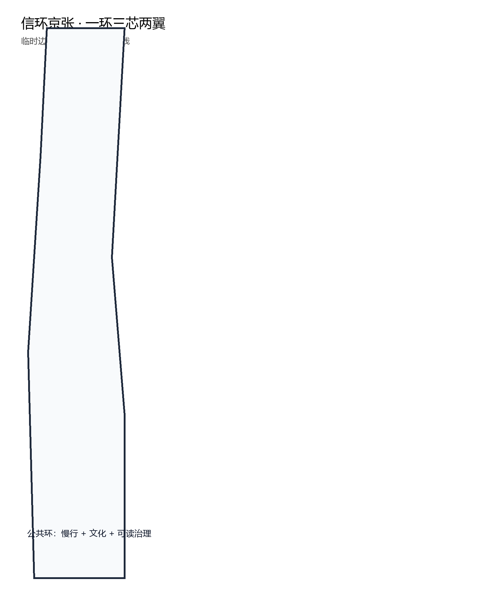
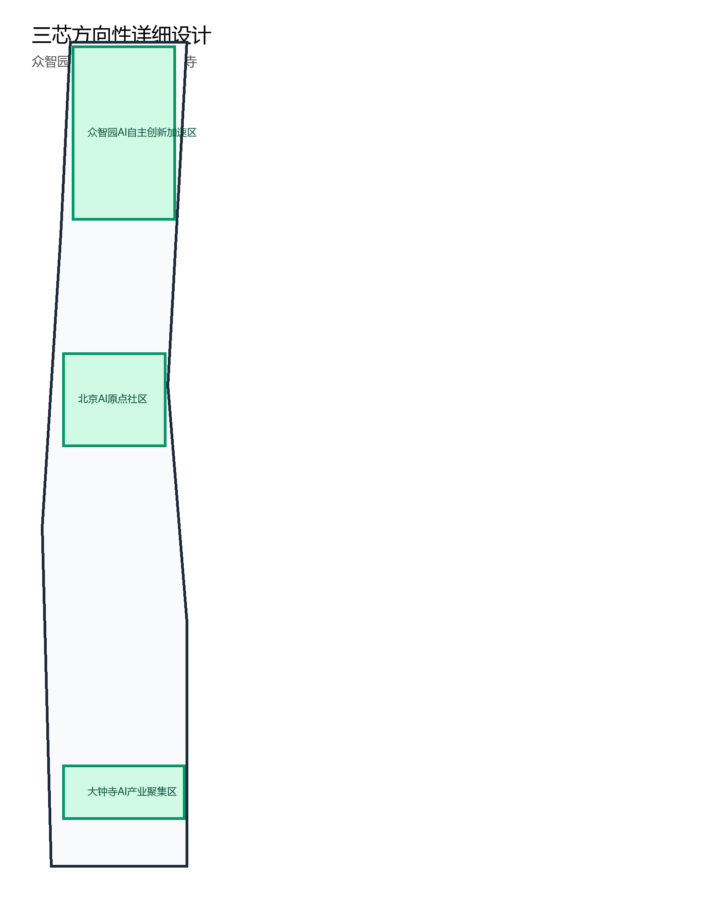
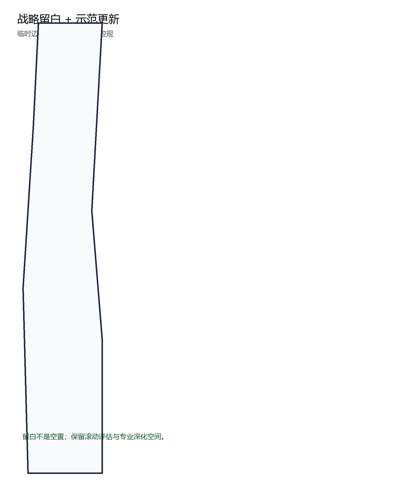
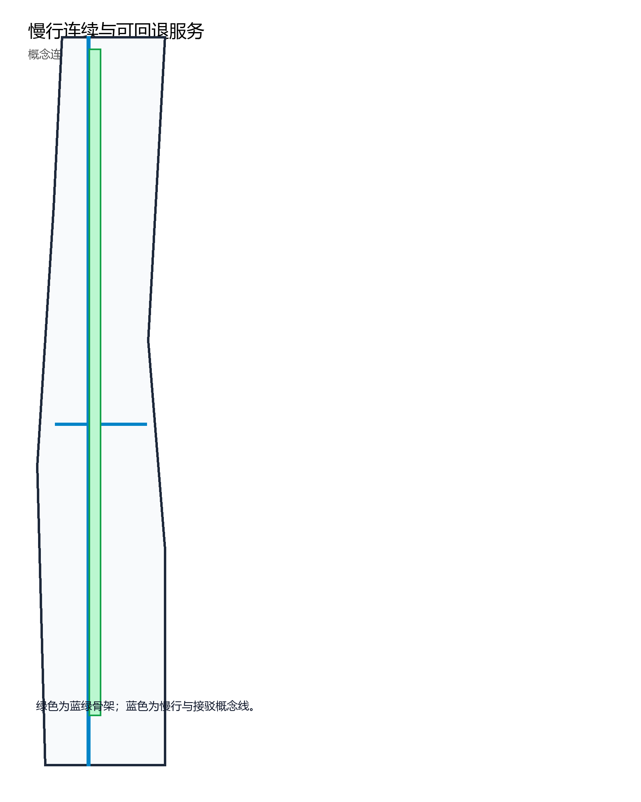
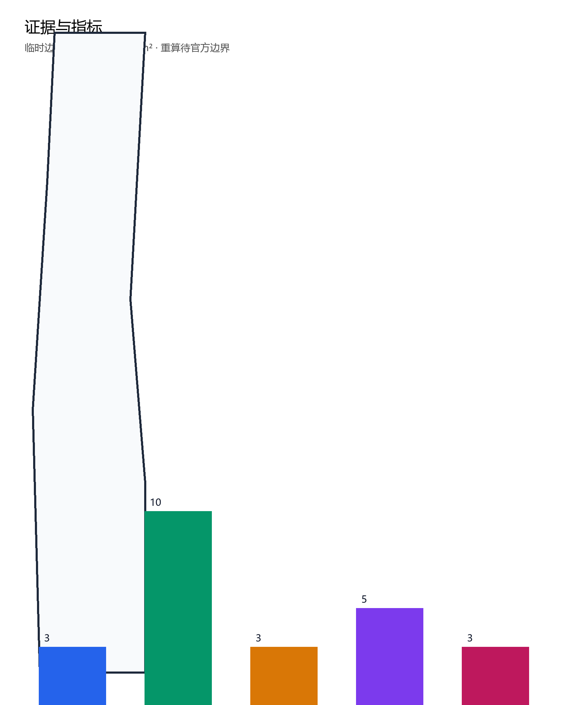

# 信环京张 · The Signal Loop

> 本方案为开放共创建议，不替代法定规划，不构成政府审定结论。总体设计范围和重点区边界使用仓库登记的临时替代边界，不得作为红线、审批依据或精确面积复算依据；官方边界公布后需重算空间图层与面积指标。

## 设计依据与资料清单

本包以资格预审公告为主控依据，以面向智能体的开源征集任务书为共创规则，读取 `brief/site-package/` 的范围、枚举、schema、规划限值与临时边界。公开来源登记表用于区分可用层级；临时边界仅用于生成、展示与自检，未升级为官方结论。专业标准以仓库本地快照为准，控规条件、道路红线、文保范围和工程约束均列为待确认事项。证据链由 `sources.json`、GeoJSON、`metrics.json`、合规矩阵和本说明共同组成。

## 三层范围工作框架

统筹研究范围承担产业协同与区域关系研究；总体设计范围承担城市更新框架、用地拓扑、交通和蓝绿系统；重点区域范围承担三处关键片区的方向性详细设计。三层范围在方案中逐级衔接：战略层解释“为何聚集”，总体层解释“如何组织”，重点层解释“怎样落到空间”。因官方精确边界尚未公开，所有面积敏感结论均为方向性建议。

## 统筹研究范围产业与未来城市研究

本带可借鉴三个公开可查经验：铁路遗产再生城区强调遗产走廊与知识机构结合；校园周边创新街区强调低门槛实验空间与街道生活；成熟科技园区强调分期留白与产业服务。信环京张将这些经验转译为“公共信号”框架：AI创新须在空间中留下可读的位置、时间、责任与回退方式，而不是抽象口号。区域协同上，本带向北连接研发腹地，向南连接城市服务中心，向东西两翼衔接高校与生活社区，形成学习、试验、转化、反馈的循环。

## 总体设计范围城市更新与控规深度城市设计

总体结构为“一环、三芯、两翼”：京张遗产公共环作为连续慢行与体验主轴；众智园、AI原点社区、大钟寺形成三个功能芯；中关村科技服务翼与小月河场景赋能翼分别承接要素服务和场景验证。更新策略以存量载体活化、界面开放、慢行连续和战略留白为主，不提出大拆大建。法定容积率、高度、密度和绿地率均未公开，本包如实列为 unknown，并以示范项目假设层数作概念性测算，不将其解释为审定指标。

## 重点区域详细设计

众智园强调“花园里的实验室”，以研发载体、安全治理中心、算力与数据要素枢纽为主，并在留白空间设置低速接驳测试环。AI原点社区强调“街道上的实验室”，通过分叉广场、开放实验室和站前慢行节点连接高校、园区与社区。大钟寺强调“城市型智能原生街区”，在存量商业升级中置入消费、展示、数据服务和公共活动空间。三处重点区均基于临时边界开展方向性设计，不给出地块级拆改留结论。

## AI 创新生态、人才画像与 AI+ 场景

创新生态由研究、试验、转化、服务和治理五个环节构成：高校与科研机构提供知识输入，开放实验室支持低成本试错，企业服务台降低制度成本，社区活动维系人才网络，公共信号框架保障治理可审。服务机制建议包括土地留白、空间混用、算力预约、数据分级、场景开放、资金对接和人才住房；所有机制均为建议，不构成招商或财政承诺。

**五类用户画像**
- 全球AI研究者：需要开放算力、数据、评审与生活便利。
- 青年工程师：需要低成本试错空间、社区归属和通勤可靠。
- 本地居民：需要安全步行、绿地服务和避免过度监控。
- 中小企业团队：需要可负担办公、政策导航与场景验证。
- 国际访客：需要双语导览、开放活动与清晰文化解释。

**十张AI场景卡**
- SC-01：无障碍连续步行导航：路缘、坡道与临时障碍可读，人工复核优先。
- SC-02：街面低速配送与接驳：园区内限定路线、可回退和人工接管。
- SC-03：研究设备预约：开放实验室与算力资源按需预约和透明排队。
- SC-04：企业政策服务台：公开政策问答与办事路径，不替代法定审查。
- SC-05：开发者社区治理：代码贡献、评审与荣誉展示联动。
- SC-06：遗产解说助手：京张历史与站点故事，内容标注史实边界。
- SC-07：公共安全巡查：以事件上报与人工确认为主，不做人脸追踪。
- SC-08：垃圾分类与市政巡检：异常上报、工单闭环和现场核验。
- SC-09：青年创业与住宿服务：法律合规、租赁信息和社区活动导引。
- SC-10：绿地养护与体验反馈：绿视率、遮阴和驻留问卷形成年度报告。

**三个AI产业测试验证场景**
- 限定园区低速配送与接驳测试，要求围栏、人工接管、日志留存和公众提示。
- 实验室设备预约与能耗巡检测试，要求数据最小化和结果人工复核。
- 企业政策服务问答测试，要求答案可溯源并在法定事项中提示专业审查。

## 用地、建筑规模与拆改留方案

用地图层以临时边界整体剖分表达战略留白框架，避免伪造现状底数。建筑图层仅表达少量更新示范项目基底，层数为方案假设；该结果用于比较不同更新强度，不等于全域建筑总量。拆改留原则为：文保与历史线索空间保留，结构良好的存量载体优先改造，功能失效空间才考虑更新；在现状建筑底数公开前，不做地块级拆除判断。

## 交通、轨道、市政与公共服务设施

交通策略强调慢行连续、公交接驳、货运分离和低速测试可回退。轨道站点周边优先组织站前广场、非机动车停放和步行连廊；市政与公共服务设施采用“服务半径可读、应急通道可回退、数据责任可追溯”的原则。道路图层仅表达概念连接线，不代表道路红线或工程可行性结论。

## 蓝绿空间、公共空间与城市风貌

蓝绿系统以连续绿廊、遮阴步道、街头绿地和可驻留界面为主，公共空间图层表达少量开放节点。风貌基调建议“工程纸感”：以轨道、信号、刻度和图纸线条形成克制、精确、可读的城市语言，避免过度屏幕化和娱乐化。夜景照明采用低眩光、可定时和公共信息优先。

## 更新项目清单、实施政策与分期计划

一期以公共环和三芯示范节点起步，优先验证慢行连续与开放实验室；二期扩展企业服务、数据要素和社区运营；三期根据评估结果滚动释放留白空间。政策建议包括公众评审、开源文档、设备准入、隐私保护和年度报告。所有项目均需专业深化和政府审定后实施。

## 指标体系、面积复算与合规矩阵

`metrics.json` 登记临时边界面积、重点区数量、示范建筑基底、绿地的方向性面积和场景数量。绿地率、公共空间率仅表示方案意图，不是法定绿地率；容积率列为 unknown。所有面积指标在官方边界公布后按 EPSG:4548 重算。合规矩阵逐项映射公告任务与智能体任务，标准矩阵和深度矩阵提供专业证据索引。

## 风险、版权与合规说明

主要风险包括边界误差、控规不确定、技术成熟度、隐私保护、公众接受度和运维成本。本方案采用最小数据采集、人工复核、可回退运行、公共提示和年度评估降低风险。文本、几何、图表、PDF 和离线HTML均由声明的智能体生成或来自已登记公开来源，不使用未授权图片、商标、人物肖像或商业底图。

## 参考资料

- SRC-2026-BJ-GH-QUAL-PREANNOUNCEMENT：《百年京张AI创新带城市设计国际方案征集资格预审公告》。
- SRC-2026-0518-AGENT-OPEN-CALL-TASKBOOK：面向全球智能体的开源征集任务书摘录。
- `brief/site-package/design_brief.json`、`agent_taskbook.json`、`allowed_design_space.json`、`sources.json`。
- `brief/site-package/geometry/provisional_boundaries.geojson`：临时替代边界，仅用于生成与自检。
