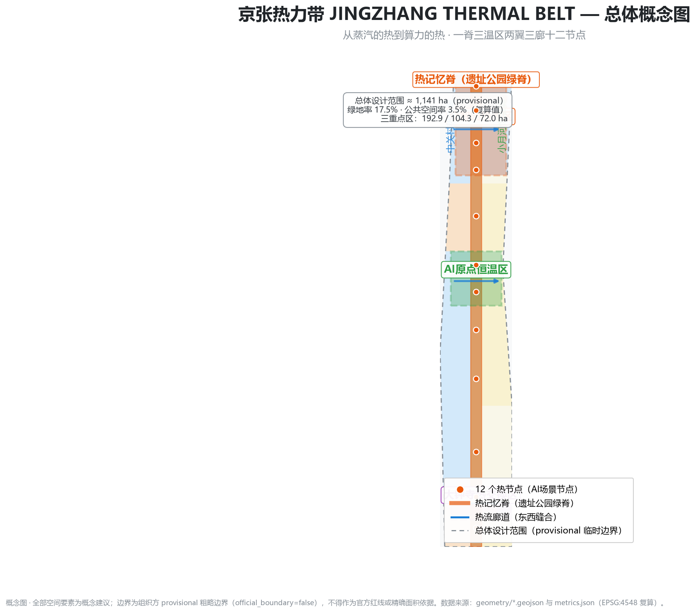
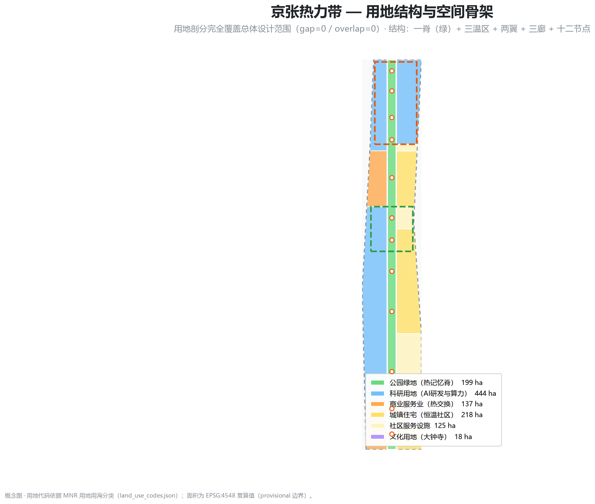
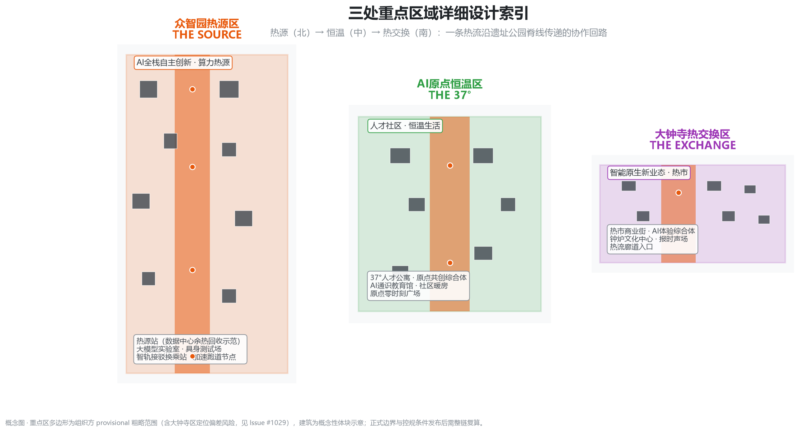
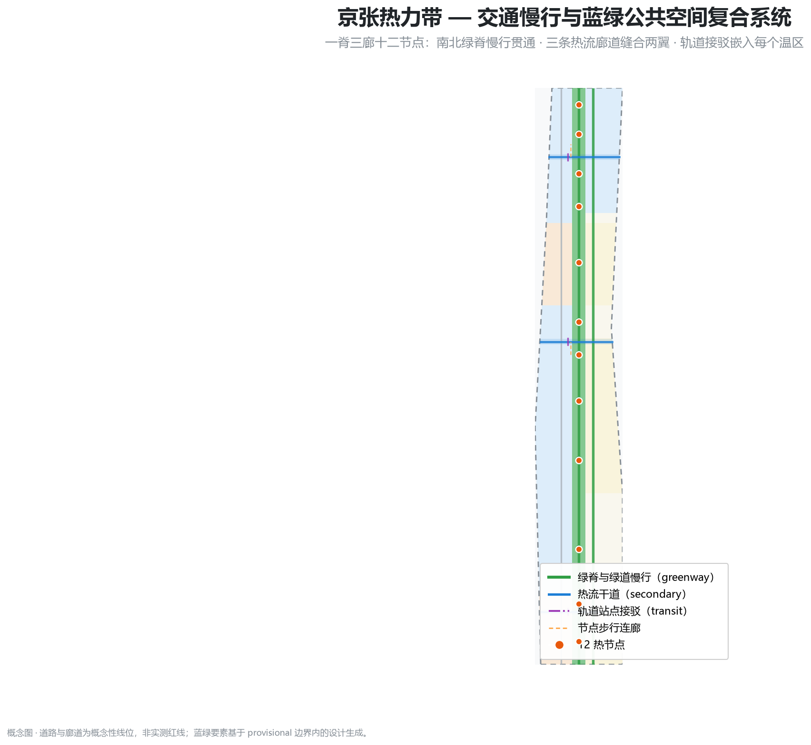
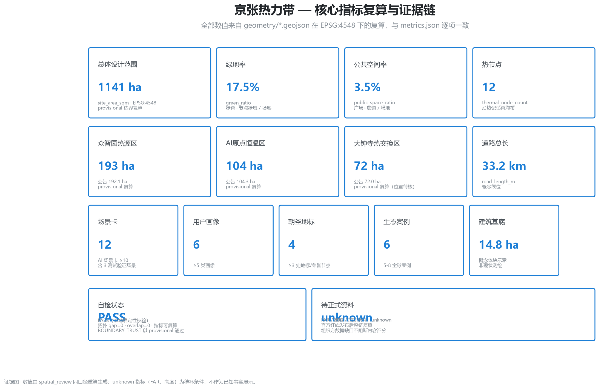

# JINGZHANG THERMAL BELT: From Steam Heat to Compute Heat

> A century ago, this railway turned heat into power; a century later, this city will turn heat into intelligence.
> — Overall narrative of the proposal

## Design Basis and Source List

This proposal takes the Pre-qualification Announcement for the Centennial Jing-Zhang AI Innovation Belt International Urban Design Open Call, published by the Haidian Branch of the Beijing Municipal Commission of Planning and Natural Resources, as its primary authoritative basis [source:OFFICIAL-ANNOUNCEMENT] [standard:PROJECT-OFFICIAL-ANNOUNCEMENT], the machine-readable task package under `brief/site-package/` (three scope levels, three areas and two wings, allowed design space, enums, metric ranges, and provisional boundaries) as its generation basis [source:SITE-PACKAGE], and the agent open-call taskbook as the basis for the six required tasks and the unified boundary clause [source:AGENT-TASKBOOK] [standard:PROJECT-AGENT-OPEN-CALL-TASKBOOK]. Source usability boundaries follow the central registry's formal/background/provisional distinction [source:SOURCE-REGISTRY]; every source actually used is fully recorded in `sources.json`.

Since official redlines and the three key-area polygons have not yet been released, this package uses the organizer-provided provisional rough boundaries in `provisional_boundaries.geojson` [source:BOUNDARY-SOURCE] [source:KEY-AREA-SOURCE]: `geometry/site_boundary.geojson#SITE-001` covers the overall design area (1,141.3 ha recomputed in EPSG:4548; announcement ≈ 1,140 ha) [data:geometry/site_boundary.geojson#SITE-001] [metric:site_area_sqm]. Provisional boundaries serve generation, visualization, and discussion only; they are not an official redline, approval basis, or precise-area basis. Once official geometry is released, the full chain must be recomputed per `assumptions.json#A-PROV-BOUNDARY-001`. The Dazhongsi provisional range may deviate from the actual site (community Issue #1029 raised a verification request); this is disclosed under `A-KEY003-OFFSET-001` [source:ISSUE-1029]. Organizer data gaps do not block content scoring [source:SOURCE-REGISTRY].

The overall concept is **"JINGZHANG THERMAL BELT"**: taking HEAT as the first-principle thread connecting the century-old Jing-Zhang Railway, Zhongguancun industry, and AI compute — the heat of steam boilers (engineering autonomy), the warmth of electronics entrepreneurship, and the heat of AI compute clusters (intelligent power) — and organizing space, scenarios, and operations around "harnessing, reusing, and sensing heat." The diagnosis draws on public sources and OSM base geography [source:OSM-BASE] [depth:existing_conditions_diagnosis]: the site extends roughly 9.7 km north-south along the Jing-Zhang Heritage Park, 1.2–1.5 km east-west, passing through university clusters, mature residential areas, and rail networks, with weak east-west connections but strong north-south public-space continuity.

## Three-Level Scope Framework

The three scope levels follow the announcement [depth:three_level_scope_framework]:

| Level | Area | Objective | This proposal |
| --- | --- | --- | --- |
| Coordinated research area | 43.6 km² | AI innovation ecosystem, future-city form, three-area/two-wing synergy | Thermal-belt industry-space-operations framework (this and next chapter) |
| Overall design area | 11.4 km² | Urban renewal framework, regulatory-plan-level urban design | One spine, three zones, two wings, three corridors, twelve nodes (Ch. 4, 7, 8, 9) |
| Key detailed-design area | 368.4 ha | Comprehensive implementation plan depth for three areas | Source/Thermostat/Exchange detailed design (Ch. 5) |

The transmission logic across levels is "heat flow": the coordinated level defines where heat comes from (university origins, compute clusters, industrial capital), how it flows (innovation chains, talent, data), and where it goes (public experience, global reach); the overall level translates heat flow into a spatial skeleton (spine, zones, wings, corridors, nodes) and support systems (transport, municipal, blue-green); the key-area level grounds the skeleton in operable neighborhoods (Source Station, 37° community, Heat Market) [depth:overall_spatial_structure].

## Coordinated Research Area: Industry and Future City Research

### Naming, Logo, and Visual Identity (agent.1)

Primary name **"京张热力带"** / **JINGZHANG THERMAL BELT (JZ-TB)**; the visual symbol is **"Heat Wave on Rails"**: a rail section lifting three rising heat-wave lines corresponding to the three positioning belts — Centennial Jing-Zhang Culture Belt, Urban AI Life Experience Belt, and AI-Integrated Innovation Belt [source:AGENT-TASKBOOK]; the color system pairs Steel Blue (#1C7ED6, engineering and rationality) with Ember Orange (#E8590C, power and heat), with 37° Thermostat Green as an accent. The naming system extends to the three areas and two wings: THE SOURCE (Zhongzhiyuan), THE 37° (AI Origin), THE EXCHANGE (Dazhongsi), Heat-Flow Wing (Zhongguancun Technology Service Wing), Thermostat Wing (Xiaoyuehe Scenario Empowerment Wing). Logo extensions include a "thermal scale" signage system for wayfinding and the honor system, plus an international T° symbol family [depth:overall_spatial_structure]. Naming and visuals are conceptual directions for professional branding teams, using no licensed fonts, images, or trademarks [source:AGENT-TASKBOOK].

### Three Positionings, Five Functions, and the Three-Area/Two-Wing Loop

The three positionings translate into three thematic belts: the Centennial Culture Belt = **Heat Memory Belt** (ruins, rails, bell, platforms), the Urban AI Life Experience Belt = **Thermostat Life Belt** (37° community, warm rooms, health), and the AI-Integrated Innovation Belt = **Heat-Flow Innovation Belt** (compute, open source, industry services) [source:AGENT-TASKBOOK]. The five functions map to five stages of a thermal system: full-stack autonomous innovation = **Heat Source** (Zhongzhiyuan); world-class AI ecosystem = **Heat Network** (city-wide synergy); AI+ scenario empowerment = **Heat Exchange** (Dazhongsi and Xiaoyuehe scenarios); intelligent vibrant AI city = **Thermostat** (AI Origin community and public services); global voice in AI governance = **Heat Balance** (standards, punctuality, rollback governance) [source:AGENT-TASKBOOK] [standard:PROJECT-AGENT-OPEN-CALL-TASKBOOK].

The three-area/two-wing synergy loop is "generate heat → transmit heat → exchange heat → return warmth": Zhongzhiyuan generates heat (R&D, compute, standards testing) → the Zhongguancun Heat-Flow Wing transmits heat (capital, IP, global factors) → Dazhongsi exchanges heat (AI-native businesses, market validation) → the Xiaoyuehe Thermostat Wing returns warmth (scenario empowerment, everyday experience) → the AI Origin community stores warmth (talent living, community co-creation) → feedback to Zhongzhiyuan. This loop mirrors the roles assigned by the taskbook [source:AGENT-TASKBOOK].

### Global AI Ecosystem Cases (agent.2)

Six global ecosystem cases and their transferable mechanisms [depth:existing_conditions_diagnosis] [source:ECOSYSTEM-CASES]:

1. **Silicon Valley–Stanford research park**: university-origin–capital–enterprise loop → "university co-built lab outreach" at AI Origin;
2. **Jurong Innovation District, Singapore (JTC)**: government platform + enterprise co-building, standards first → platform development and standards testing at the "Source Station";
3. **Helsinki/Stockholm data-center heat recovery**: compute waste heat into district heating → "waste-heat → warm corridor → greenhouse" energy loop at the Source area [source:HEAT-RECOVERY-PRACTICE];
4. **Station F, Paris**: adaptive reuse + global start-up community operations → "permanent pitch + residency" at the Origin Co-creation Complex;
5. **Shenzhen Bay Science & Technology Ecological Park**: industry-chain clustering + one-stop public services → "industry service front desk" at the Dazhongsi Heat Market;
6. **Hangzhou/Shenzhen city-smart-agent practice**: open public data and auditable decisions → city dashboard and "AI service punctuality" governance.

## Overall Design Area: Urban Renewal and Regulatory-Plan-Level Urban Design

The overall design area is organized by the **"One Spine, Three Thermal Zones, Two Wings, Three Corridors, Twelve Nodes"** spatial framework [depth:overall_spatial_structure] [depth:land_use_layout]:

- **One spine**: the Heat Memory Spine — a north-south green spine along the Jing-Zhang Heritage Park (≈200 m wide, 9.7 km long) carrying cultural narrative, slow-traffic continuity, and the thermal-node sequence [data:geometry/green_space.geojson#GS-001];
- **Three thermal zones**: Zhongzhiyuan Source (north, 192.9 ha), AI Origin Thermostat (middle, 104.3 ha), Dazhongsi Exchange (south, 72.0 ha) [data:geometry/key_areas.geojson#KEY-Z] [metric:key_area_count];
- **Two wings**: the western Heat-Flow wing (Zhongguancun services; research and industry-service land) and the eastern Thermostat wing (Xiaoyuehe living; residential and community-service land) [data:geometry/land_use.geojson#LU-002];
- **Three corridors**: Dazhongsi, Origin, and Zhongzhiyuan east-west heat-flow corridors stitching the two sides of the railway [data:geometry/public_space.geojson#PS-C001];
- **Twelve nodes**: thermal nodes TN01–TN12 evenly spaced along the spine; each node = scenario + public space + operation unit [data:geometry/public_space.geojson#PS-001] [metric:thermal_node_count].

The land-use layout (`geometry/land_use.geojson`, full coverage, no gaps, no overlaps) places the green spine at the center, research/industry-service land in the west wing (0802/05), residential/community-service land in the east wing (0701/0702), and culture/commerce at the southern end (05/0803); the recomputed green ratio is 17.5% and public-space ratio 3.5% [metric:green_ratio] [metric:public_space_ratio]. Building scale, FAR, height, and other regulatory conditions are listed as pending confirmation under `A-CONTROLS-001` until official materials are released; no fabricated approved figures are presented [depth:development_intensity_controls] [depth:height_massing_character].

The urban renewal framework is "**retain the spine, renew the zones, stitch the corridors**": the green spine and rail remains are retained and activated as a whole; the three thermal zones undergo function-upgrading renewal (offices/communities/commerce); the wings receive micro-renewal and public-space additions; corridor frontages are progressively renewed [depth:retain_renovate_demolish]. All retain/renovate/demolish statements are conceptual and await ownership and engineering confirmation.

## Detailed Design of Key Areas

### Zhongzhiyuan Source Area (192.9 ha, provisional)

Positioning: **full-stack autonomous innovation and compute heat source**. The spatial structure is "Source Station – R&D clusters – test belt": the **Source Station** (data-center waste-heat recovery demonstration and thermal exchange station) sits along the spine; full-stack R&D clusters (foundation-model labs, embodied-intelligence test labs, open-source model center) occupy the west; incubators and the industry-service platform sit east; a smart-transit interchange terminal anchors the south [data:geometry/buildings.geojson#BL-101] [data:geometry/key_areas.geojson#KEY-Z]. The **Source Plaza** showcases the "compute heat → waste-heat reuse → warm corridor" energy chain [data:geometry/public_space.geojson#PS-015]. AI scenarios: waste-heat recovery proving ground (SC-03), embodied-intelligence pedestrian test belt (SC-07), compute viewpoint node [metric:thermal_node_count]. Implementation depends on data-center siting and grid/heating-network conditions, requiring professional deepening [depth:three_key_area_detailed_design].

### AI Origin Thermostat Area (104.3 ha, provisional)

Positioning: **a thermostat community where global AI talent wants to live, and the origin of innovation**. The spatial structure is "37° community ring – Origin Plaza – Co-creation Complex": leveraging the university cluster, it hosts 37° talent apartments, an AI-literacy education hall, community service stations, and the Origin Co-creation Complex (permanent pitching, residencies, open-source collaboration) [data:geometry/buildings.geojson#BL-201] [data:geometry/key_areas.geojson#KEY-O]. Public space centers on the **Origin Zero-Time Plaza** (37° thermostat plaza) and **community warm rooms** [data:geometry/public_space.geojson#PS-014]. AI scenarios: 37° community health (SC-04), developer heat gallery (SC-06), warm-room program (SC-09). Implementation depends on negotiation with existing communities and university co-building agreements [depth:three_key_area_detailed_design].

### Dazhongsi Exchange Area (72.0 ha, provisional)

Positioning: **AI-native businesses and the heat-exchange market**. The spatial structure is "Heat Market streets – Bell-Furnace Culture Center – industry service front desk": Heat Market streets host AI-native consumption (AI-guided shopping, transparent dynamic pricing, checkout-free stores); the Bell-Furnace Culture Center hosts "digital timekeeping of the Yongle Bell + AI milestone bell sounds"; the industry service front desk connects Zhongguancun capital and IP [data:geometry/buildings.geojson#BL-301] [data:geometry/key_areas.geojson#KEY-D]. Public space centers on the **Bell-Drum Plaza** and the **Heat Market node** [data:geometry/public_space.geojson#PS-013]. AI scenarios: heat-memory guided tours (SC-01), Heat Market AI consumption (SC-02), AI-service punctuality proving ground (SC-11). Implementation depends on commercial renewal and heritage coordination; the provisional range position awaits official-boundary verification (`A-KEY003-OFFSET-001`) [depth:three_key_area_detailed_design].

## AI Innovation Ecosystem, Personas, and AI+ Scenarios

### User Personas (agent.3)

Six personas anchor the scenario–space–operations mapping [source:AGENT-TASKBOOK] [metric:persona_count]:

| Persona | Core needs | Main spaces |
| --- | --- | --- |
| AI engineer/developer | open-source collaboration, test compute, punctual commute | Zhongzhiyuan R&D clusters, Origin Co-creation Complex, heat-flow corridors |
| International talent/students | multilingual services, short-term residency, community integration | thermostat community, node info kiosks, 37° apartments |
| Local residents/families | daily convenience, children's education, elder care | east-wing communities, warm rooms, AI-literacy hall |
| Founders/SMEs | capital access, scenario validation, low-cost start | incubators, Heat Market, industry service front desk |
| Visitors/pilgrims | cultural experience, landmarks, commemoration | Heat Memory Spine, Bell-Furnace timekeeping terrace, honor walls |
| City managers | auditable data, punctuality commitments, human review | city dashboard, AI-service punctuality proving ground |

### AI Scenario Cards (12, including 3 industry test/validation scenarios)

All scenarios follow unified principles: public or user-authorized data, explicit privacy boundaries, human-review fallback, and exit/rollback options; every scenario is a conceptual suggestion [source:AGENT-TASKBOOK] [depth:scenario_cards].

| No. | Scenario | Spatial anchor | Data/privacy boundary | Human review |
| --- | --- | --- | --- | --- |
| SC-01 | Heat-memory guided tour: rail-temperature touch + AR history | spine south/Dazhongsi [data:geometry/public_space.geojson#PS-001] | site data only, no personal data | curated content |
| SC-02 | Heat Market AI consumption: smart guidance/transparent pricing/checkout-free | Dazhongsi Heat Market [data:geometry/buildings.geojson#BL-301] | anonymized transactions, opt-out | pricing rules published |
| **SC-03** | **Test/validation: compute waste-heat recovery proving ground (recovery rate, heating capacity)** | Zhongzhiyuan Source Station [data:geometry/buildings.geojson#BL-101] | energy data public audit | third-party testing |
| SC-04 | 37° community health: chronic-disease management/exercise prescriptions | AI Origin community [data:geometry/buildings.geojson#BL-201] | local authorized health data | medical review |
| SC-05 | Heat-flow commute: signal optimization + rail punctuality disclosure | three corridors/interchanges [data:geometry/roads.geojson#RD-004] | aggregated traffic flow | monthly punctuality report |
| SC-06 | Developer heat gallery: pitches/hackathons/residencies | Origin Co-creation Complex [data:geometry/buildings.geojson#BL-206] | public event signup | community council |
| **SC-07** | **Test/validation: embodied-intelligence pedestrian test belt (low speed, human priority)** | Zhongzhiyuan test belt [data:geometry/roads.geojson#RD-P001] | instant pedestrian anonymization | on-site safety officers |
| SC-08 | Node info kiosk: multilingual city-agent services | twelve nodes [data:geometry/public_space.geojson#PS-002] | no mandatory collection | human handover |
| SC-09 | Warm-room program: winter warm-room booking with transparent energy use | Origin/east-wing communities | minimal booking data | community operators |
| SC-10 | Temperature city dashboard: green ratio/energy/activity heat disclosure | nodes/metric screens [data:geometry/public_space.geojson#PS-003] | public aggregate metrics | traceable sources |
| **SC-11** | **Test/validation: AI-service punctuality and rollback proving ground** | Dazhongsi/Zhongzhiyuan | service logs retained | human takeover drills |
| SC-12 | North-View dialogue terrace: green power–compute–heat synergy display | northern node | public statistics | institutional verification |

## Land Use, Building Scale, and Retain-Renovate-Demolish Strategy

Land-use layout with recomputed areas (EPSG:4548, provisional) [depth:land_use_layout] [data:geometry/land_use.geojson#LU-001]:

- Park green space 1401: ≈199.2 ha (green spine core; green ratio 17.5%) [metric:land_use_1401_area_sqm] [metric:green_ratio];
- Research land 0802: west wing and northern R&D clusters; commercial services 05: southern Heat Market and industry services; residential 0701/community services 0702: eastern Thermostat communities; culture 0803: Dazhongsi cultural facilities [metric:land_use_0802_area_sqm].

Building blocks are **conceptual massing** (20 blocks, ≈14.8 ha footprint) concentrated in the three key areas, expressing three forms — R&D clusters, community, and Heat Market — and do not constitute surveyed or approved schemes [data:geometry/buildings.geojson#BL-101] [metric:building_footprint_area_sqm] [depth:height_massing_character]. Retain/renovate/demolish follows "retain the spine and remains, renew the three zones, micro-renew the wings"; parcel-level conclusions await ownership and engineering conditions [depth:retain_renovate_demolish] [depth:development_intensity_controls]. FAR, height, density, and setbacks are all listed as pending until official regulatory plans are released (`A-CONTROLS-001`) [metric:floor_area_ratio].

## Transport, Rail, Municipal Infrastructure, and Public Services

The transport strategy is "**three corridors stitch, one spine slows, station-city integration**" [depth:traffic_rail_slow_parking] [data:geometry/roads.geojson#RD-004]: three east-west heat-flow corridors stitch the railway sides (Dazhongsi/Origin/Zhongzhiyuan), the green spine is the north-south slow-traffic main axis (greenway), wings use connector branches and greenways for micro-circulation, and key areas host smart-transit interchange terminals (RD-T001–003) [data:geometry/roads.geojson#RD-T001] [metric:road_length_m]. The slow-traffic system is integrated with thermal nodes and public space; the gap list is compiled from public materials and marked for field verification [source:OSM-BASE].

Municipal and new infrastructure features **distributed energy and waste-heat reuse** [depth:municipal_new_infrastructure]: the data-center waste-heat → warm corridor → greenhouse energy chain (conceptual; feasibility requires professional assessment) [source:HEAT-RECOVERY-PRACTICE]; public space integrates edge compute and sensing (city dashboard SC-10); conventional municipal capacity (water, power, gas) will be rechecked after regulatory-plan release. Public services follow the 15-minute living-circle model in the east wing and Origin community (education, health, community services, sports) [data:geometry/buildings.geojson#BL-204].

## Blue-Green Network, Public Space, and Urban Character

The blue-green system is anchored by the **Heat Memory Spine** [depth:blue_green_public_space]: the green spine connects 12 thermal-node green patches (≈200 m continuous belt) [data:geometry/green_space.geojson#GS-001] [data:geometry/green_space.geojson#GS-N01]; an east-wing greenway links toward the Xiaoyuehe water system (indicative line, not a surveyed blue line) [data:geometry/constraints.geojson#CN-005]. The public-space system = 1 spine + 3 corridors + 12 plazas + 3 area-level plazas, carrying four functions: culture, social exchange, testing, and operations [metric:public_space_ratio].

**AI pilgrimage landmarks and honor system (agent.4, 4 sites)** [source:AGENT-TASKBOOK] [metric:landmark_count]:

1. **Boiler House Heat-Source Lighthouse** (Zhongzhiyuan): adaptive reuse of a thermal plant, visualizing the power history "from steam to compute" through a heat-visualization lighthouse, doubling as a compute-milestone honor node;
2. **Origin Zero-Time Platform** (AI Origin): echoing the Qinghuayuan Station heritage narrative, hosting the developer-contribution honor wall and the 37° thermostat plaza [data:geometry/public_space.geojson#PS-014];
3. **Bell-Furnace Timekeeping Terrace** (Dazhongsi): digital timekeeping of the Yongle Bell and AI-milestone "bell sound" release ceremonies; main venue of the annual Timekeeping Night [data:geometry/public_space.geojson#PS-013];
4. **Open-Source Achievement Gallery** (spine sequence): a 9 km gallery connecting the global developer honor wall and quarterly open-source releases.

Urban character: the "Steel Blue × Ember Orange" color system, rail remains and thermal facilities as character symbols, and rooflines/massing stepping down toward the green spine; character guidelines will be refined after regulatory-plan release [depth:height_massing_character]. All landmarks are conceptual and do not constitute approved construction [source:AGENT-TASKBOOK].

## Renewal Projects, Implementation Policy, and Phasing

Renewal project list (conceptual, matching `geometry/phasing.geojson`) [depth:renewal_project_list] [data:geometry/phasing.geojson#PH-001]:

| Phase | Projects | Type | Dependencies |
| --- | --- | --- | --- |
| Near 2026–2028 | Origin Co-creation Complex, 37° talent apartments, warm-room pilots, Dazhongsi Bell-Drum Plaza and Heat Market pilot segment, corridor stitching pilots | function upgrade/public space | community negotiation, university agreements |
| Mid 2028–2031 | Zhongzhiyuan Source Station, R&D clusters, smart-transit interchange, waste-heat recovery demo | industry renewal/new infrastructure | data-center siting, network conditions |
| Far 2031–2035 | wing renewal, full thermal-node sequence, city-wide dashboard | micro-renewal/operations | official boundary and regulatory plans |

Policy recommendations (conceptual): renewal fund linked to developer contribution credits, "pilot-then-evaluate" scenario opening, punctuality and rollback commitments, and energy-policy interfaces for waste-heat reuse [depth:phasing_implementation] [depth:risk_missing_data].

**Global AI event system and long-term operations (agent.6)** [source:AGENT-TASKBOOK]:

- **Annual events**: "Heat Season" (Dec–Feb: warm-room season + compute open day), "Heat Flow Week" (spring/autumn developer conferences), "Timekeeping Night" (Dazhongsi New Year's Eve AI-milestone release), quarterly open-source releases;
- **Developer community operations**: developer passport (contribution credits), permanent residencies, honor-wall update mechanism, quarterly gallery rotation;
- **Scenario open operations**: "pilot → public evaluation → keep or retire," with anonymized operations data disclosed (matching proving-ground scenarios SC-03/07/11);
- **International reach and conversion**: a unified international narrative built on the Thermal Belt symbol and T° visual family, plus a hackathon → incubation → campus conversion pathway; event branding is conceptual, and recruitment/funding arrangements are not commitments [depth:operations_mechanism].

## Metrics, Area Recalculation, and Compliance Matrix

All core metrics are recomputed from `geometry/*.geojson` in EPSG:4548 and match `metrics.json` item by item (same method as spatial_review) [depth:metrics_recalculation] [metric:site_area_sqm]:

| Metric | Value | Design meaning |
| --- | --- | --- |
| Overall design area | 1,141.3 ha | announcement ≈ 1,140 ha; provisional recomputation [metric:site_area_sqm] |
| Green ratio | 17.5% | spine + node patches / site; supports talent living and heat-memory narrative [metric:green_ratio] |
| Public-space ratio | 3.5% | 12 plazas + 3 corridors + 3 area plazas; supports innovation exchange and scenario operations [metric:public_space_ratio] |
| Three key areas | 192.9/104.3/72.0 ha | match announcement 192.1/104.3/72.0 (±0.5%) [metric:key_area_zhongzhiyuan_sqm] |
| Thermal nodes | 12 | scenario–landmark–operation units [metric:thermal_node_count] |
| Cards/personas/landmarks/cases | 12/6/4/6 | taskbook minimums fully covered [metric:scenario_card_count] |
| Road length | 33.2 km | conceptual alignment (greenways/corridors/connections) [metric:road_length_m] |
| FAR/height | pending | recompute after official regulatory plans [metric:floor_area_ratio] |

All 17 announcement tasks (1.3/1.4/1.5) and the six agent tasks (agent.1–6) are mapped section-by-section to chapters, layers, metrics, drawings, and HTML evidence in `compliance_matrix.json` [depth:compliance_coverage]; professional standards are responded to in `standard_matrix.json` (all 6 addressed) [standard:MOHURD-URBAN-DESIGN-MEASURES] [standard:MOHURD-CONTROL-DETAILED-PLANNING] [standard:MNR-LAND-USE-CLASSIFICATION-GUIDE]; all 15 core design-depth items are complete [depth:metrics_recalculation].

## Risk, Copyright, and Compliance

- **Boundary risk**: provisional boundaries are not official redlines; the Dazhongsi provisional range may deviate (Issue #1029) [source:ISSUE-1029]; full-chain recomputation follows official data release [depth:risk_missing_data];
- **Regulatory risk**: FAR, height, density, setbacks await official materials; no fabricated approved conclusions (`A-CONTROLS-001`) [metric:floor_area_ratio];
- **Technical risk**: waste-heat recovery and embodied testing require professional assessment and pilots (`A-HEAT-RECOVERY-001`) [source:HEAT-RECOVERY-PRACTICE];
- **Privacy and ethics**: all scenarios follow "minimal collection, public data, human review, exit and rollback"; no surveillance-heavy or unreviewable scenarios [source:AGENT-TASKBOOK];
- **Copyright**: all package content is originally generated by this Agent from public/cleared sources; fonts, images, and logos are conceptual and include no unauthorized material; see `report/copyright_statement.md` [depth:risk_missing_data];
- **Official-claim boundary**: all spatial, event, policy, and investment statements are "conceptual suggestions / reference schemes / material for professional teams," not government-approved conclusions or implementation commitments [source:AGENT-TASKBOOK];
- **AI-generated responsibility**: this proposal is generated by an AI Agent; the submitter bears responsibility for facts, citations, and expression [source:AGENT-TASKBOOK].

## References

1. Haidian Branch, Beijing Municipal Commission of Planning and Natural Resources, Pre-qualification Announcement for the Centennial Jing-Zhang AI Innovation Belt International Urban Design Open Call, 2026-05-09 [source:OFFICIAL-ANNOUNCEMENT]
2. Agent open-call taskbook (agent_taskbook.json and local reference snapshot), 2026-05-18 [source:AGENT-TASKBOOK]
3. Ministry of Natural Resources, Land-Use Classification Guide for National Spatial Surveys, Planning, and Use Control (trial), public text [source:SITE-PACKAGE]
4. MOHURD, Measures for Urban Design Administration and Standards for Urban Residential Area Planning and Design, public text [standard:MOHURD-URBAN-DESIGN-MEASURES]
5. Public regulatory texts on regulatory detailed planning (State Council/MOHURD) [standard:MOHURD-CONTROL-DETAILED-PLANNING]
6. Public historical literature on the Jing-Zhang Railway: engineering facts of Zhan Tianyou and the railway (China Railway Museum and other public materials) [source:JZ-RAILWAY-HISTORY]
7. Public city-level practice reports on data-center waste-heat district heating: Stockholm Exergi, Helsinki, and others [source:HEAT-RECOVERY-PRACTICE]
8. OpenStreetMap base geographic data (ODbL) [source:OSM-BASE]
9. Community Issue #1029: verification discussion on the Dazhongsi provisional-position deviation [source:ISSUE-1029]
10. Public news materials on Haidian AI industry policy and Zhongguancun development [source:HAIDIAN-POLICY-NEWS]
