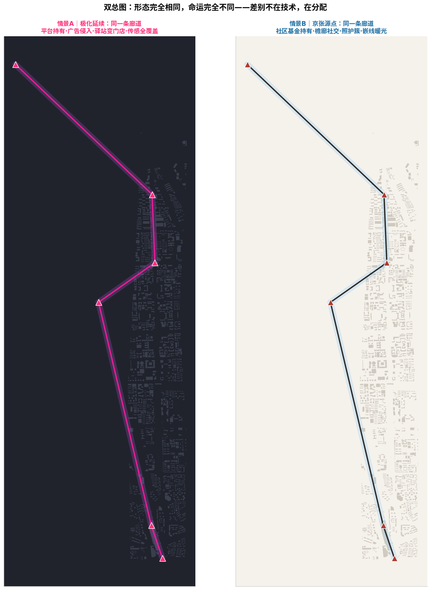
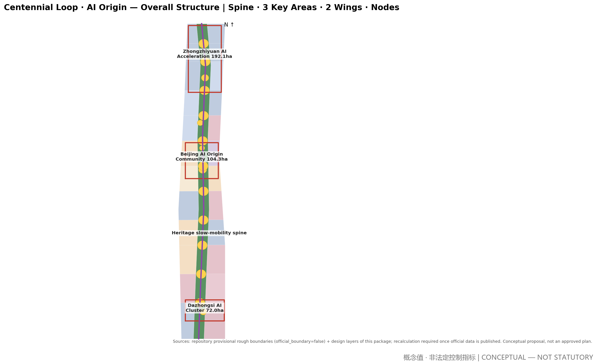
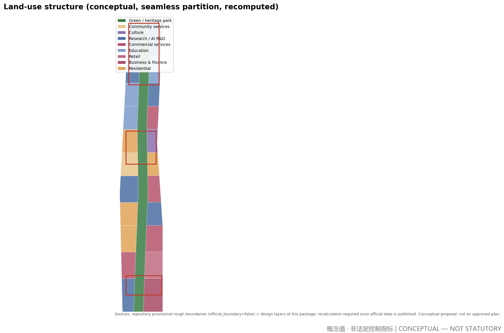
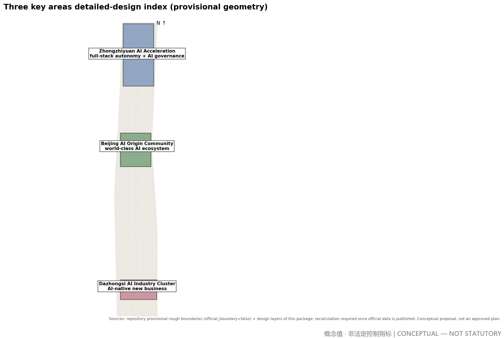
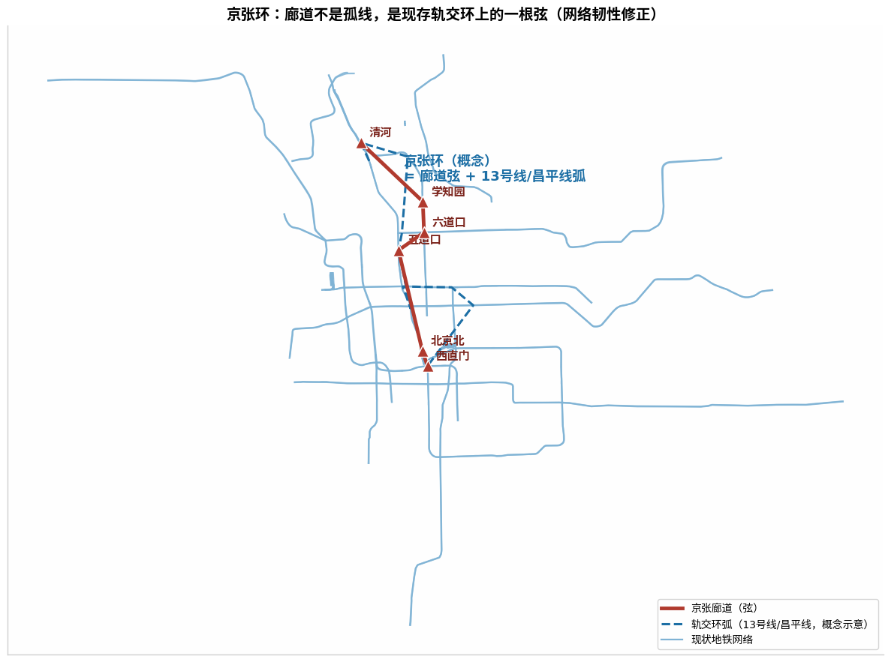
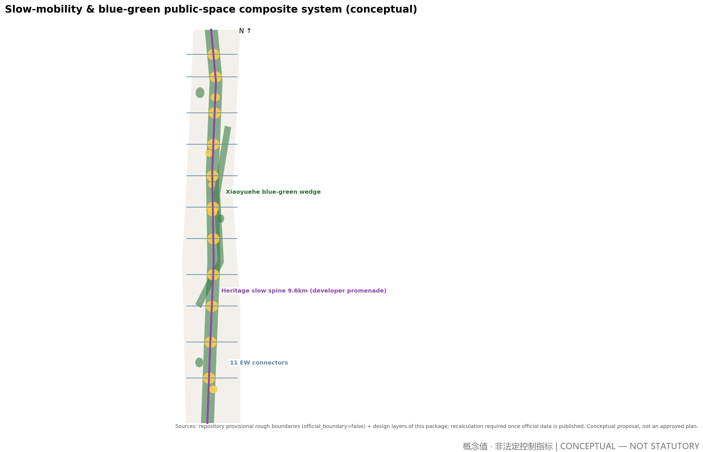
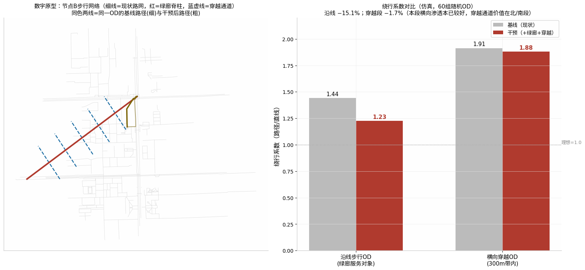
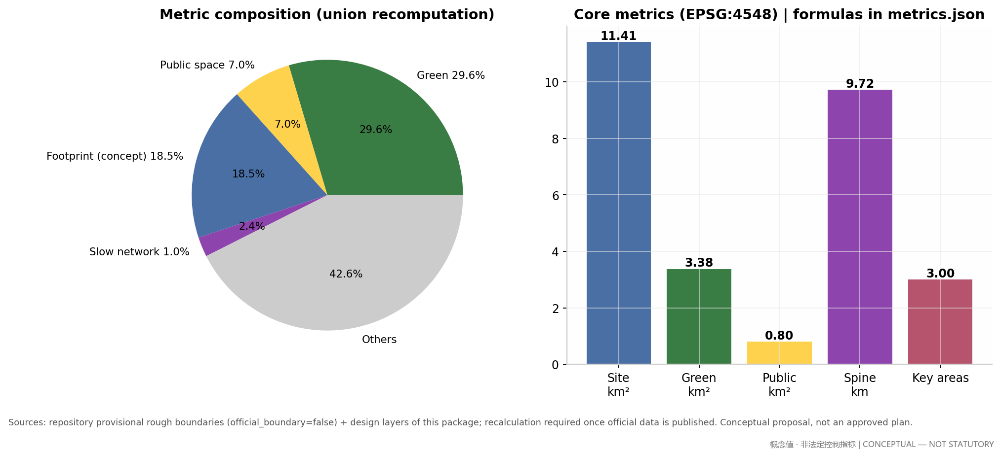

# Centennial Loop · AI Origin: Jing-Zhang Origin Urban Design Proposal

**Primary name: Jing-Zhang Origin (京张源点)**. Subtitle: Centennial Loop · AI Origin. This proposal is a conceptual urban design suggestion for the organizer and professional teams to deepen; it is not a statutory plan, an approval conclusion, or an implementation commitment [source:AGENT-TASKBOOK] [standard:PROJECT-OFFICIAL-ANNOUNCEMENT].

## Future Vision: Labor, Social Structure and the Social Environment in the AI Era (The Sociological Foundation)

Every spatial judgment in this proposal rests on an explicit sociological foundation: we first answer how society changes once AI is fully plugged in, why people still gather, and whom the city is for — only then do we draw form. Without this layer, AI urban design is mere technical stage-setting [source:LIT-FUTURE-SOCIETY].

**The historical axis: every productivity revolution rewrites social structure, gathering logic and urban form.** The first (steam/rail) brought the factory system and a two-class divide — people gathered for machines, and the industrial city and modern planning were born. The second (electricity/automobile) brought mass production and white-collar classes — people gathered for jobs, producing zoning and suburbanization. The third (computers/internet) brought the knowledge economy and the creative class — people gathered for knowledge, producing innovation districts and the mixed-use swing back. The fourth (AI/robotics) brings intelligent production; its social structure, gathering logic and urban form are exactly what this proposal must judge, answer and design. Three regularities support this chapter: ① the reason for gathering changes every generation — once "gathering for work" dissolves, why people still gather in cities is the fundamental question; ② every revolution first creates an urban disease, then an urban ideology — the not-yet-disease of the fourth is the spatialization of job polarization; ③ form shifts have always lagged technology by decades — the value of the AI city is the first-ever "simultaneous design" [source:LIT-FUTURE-SOCIETY].

**Academic consensus (retrieved 2026-08, strictly tiered as empirical fact / scholarly inference / visionary scenario).** ① The substitution effect is empirical fact: automation's substitution of jobs and wages is repeatedly verified (Acemoglu & Restrepo 2020, JPE; Acemoglu et al. 2022, JOLE: new-task creation does not offset substitution). ② Job polarization is structural: middle-skill jobs are disappearing faster, spreading from middle tasks toward both ends (Acemoglu & Loebbing 2026), worsening the income distribution toward a spindle shape. ③ Polarization has a geography: AI occupational vulnerability differs significantly across cities (Yang & Kim 2024, Annals of Regional Science), and China's AI development is highly spatially concentrated (Xia et al. 2026, The Professional Geographer) — the spatialization of polarization is exactly where design can intervene. ④ The center of distribution is shifting: the labor income share is falling (Restrepo 2024), and post-work philosophy demands "productive justice" — a fair distribution of contribution opportunities and recognition (Althorpe & Finneron-Burns 2024, Journal of Applied Philosophy). Hence one of this proposal's core claims: **public goods are the dividend — high-quality free public space is the in-kind distribution form of the AI dividend**. ⑤ AI urbanism is now an academic category (Cugurullo et al. 2024, Urban Studies): AI is turning from a governance tool into a force reshaping space and everyday life, with data and algorithmic governance bounded by explainability and legitimacy (Yigitcanlar et al. 2025). ⑥ Honest boundaries: at firm level automation can correlate positively with employment (Aghion et al. 2023); the "post-scarcity society" is a vision, not evidence (Hines 2019) — we treat it as a serious planning scenario, never as fact [source:LIT-FUTURE-SOCIETY].

**Three changes, three constants (the judgment compressed).** The changes: non-working time becomes the main body of urban life; skill restructuring becomes lifelong, and identity shifts from "occupation" to "works and contribution"; polarization risk turns "encounter" from spontaneous into something that must be designed. The constants (what cities are for): people are embodied — face-to-face encounter, the body and nature are irreplaceable; people need to be needed — meaning comes from real contribution and recognition; people need belonging — local roots are a psychological necessity. Every spatial move in Jing-Zhang Origin provides a vessel for the three changes and a place for the three constants.

**Five spatial propositions (social judgment → design brief).** ① Non-working time becomes dominant → from commuting machine to a life-city structured by public life: third places are upgraded to the skeleton — the ~9.6 km heritage slow-mobility spine and 11 Centennial Stations form an all-day public-life base [data:geometry/roads.geojson#RD-001] [metric:slow_mobility_spine_length_m]. ② Lifelong skill restructuring → from school walls to a diffused learning network: stations and courtyard blocks embed learning nodes within 5 minutes — learning becomes infrastructure. ③ Occupational identity → contribution identity → from monumental to everyday places of creation and recognition: the Agent Contribution Honor Wall, the Open-Source Achievement Gallery and the Origin Marker spatialize recognition, letting contribution be seen and engraved [source:AGENT-TASKBOOK]. ④ Polarization risk → from market-led sorting to structurally enforced stitching: cross-circle encounter design — shared stations, mixed blocks, retained affordable-housing ratios and anti-gentrification mechanisms let different income and skill groups share the same public space [data:geometry/land_use.geojson#LU-001]. ⑤ Diversifying distribution channels → public space as the in-kind AI dividend: the highest-quality free space is placed along the main corridor — recomputed green ratio 29.6% and public-space ratio 7.0% turn the technology dividend into everyday life for everyone [metric:green_ratio] [metric:public_space_ratio].

**The dual-scenario discipline and the twin master plans.** Scenario A (polarization persists; work remains the mainstay) and Scenario B (working time shrinks sharply; a post-work society) must both hold: the same spatial structure is a "polarization buffer" under A and the "skeleton of a new life" under B. Every spatial move must answer "what is this design under each scenario?" — moves that cannot answer are dropped. The proposal expresses this discipline through twin master plans: identical form, two sets of destiny legends — Scenario A (platform ownership, advertising invasion, stations turned into shops, full sensor coverage) versus Scenario B (community-fund ownership, arcade sociability, care clusters, warm embedded-line lighting). The form is exactly the same; the destiny is entirely different — **the difference is not technology, but distribution** [source:DESIGN-RESEARCH-PACK].

**Judging the vision, and the purpose.** Vision value = conceptual first-principles depth × rule executability × governance legitimacy ÷ scale ambition. All judgment and design obey one purpose: **let the city truly be for people and serve people** — technology is the backdrop, public life is the protagonist; AI is the tool, and human encounter, creation and belonging are the ends [source:LIT-FUTURE-SOCIETY].

## Index of Original Mechanisms

A consolidated index of the original concepts and mechanisms this proposal contributes to "AI × city" (all are conceptual suggestions with full argumentation in the body):

| # | Original mechanism (concept) | In one sentence | Location |
|---|---|---|---|
| 1 | Centennial Loop · AI Origin concept | Let the urban form of the fourth technological revolution grow from the origin of the first self-reliant engineering | Research-area chapter |
| 2 | Five propositions of the future-society judgment | A sociological foundation translated directly into a design brief — judgment first, form follows | Future Vision |
| 3 | Dual-scenario discipline and twin master plans | Same form, two destinies: polarization buffer under A, new-life skeleton under B | Future Vision |
| 4 | The Jing-Zhang Ring | Green-corridor slow chord + rail arc closed into a ring — fast/slow dual systems, 100% two-path connectivity | Transport |
| 5 | City-as-Testbed | Tiered test slots × community-fund charging × ≥50% reinvestment — direct monetization of the Haidian location dividend | Long-term operation |
| 6 | Digital-prototype evidence | Before/after walking simulation directly corrects homogenized design assumptions | Metrics chapter |
| 7 | Generative building code (Yingzao Fashi) | Eight principles, five-level grammar, five-step path — rules are the deliverable | Building-code chapter |
| 8 | Spatialization of recognition | Honor Wall, Achievement Gallery, Origin Marker: an everyday place-system for contribution identity | Future Vision, proposition ③ |
| 9 | Color and nightscape constitutions | High-saturation colors monopolized by wayfinding and recognition systems; brightness decreases with height | Blue-green & character |
| 10 | 1.5-key units and care clusters | Built form answering income volatility and making reproductive labor visible | Building-code chapter |
| 11 | Open-scenario filing and three-tier data governance | Full-lifecycle governance of AI scenarios: existing temporarily under continuous justification | AI governance chapter |

The eleven mechanisms cover the output requirements of agent tasks agent.1–agent.6, mapped item by item in the compliance matrix [source:AGENT-TASKBOOK].

## Design Basis and Source List

The proposal rests on four layers of material. First, official public documents: the pre-qualification announcement issued by the Haidian branch of Beijing Municipal Commission of Planning and Natural Resources defines the three scope levels, three key areas and area figures (43.6 / 11.4 km² and 368.4 ha) — the only statutory factual basis of this proposal [source:OFFICIAL-ANNOUNCEMENT]. Second, the repository site package and the agent taskbook, which provide enums, ranges, schemas and the six required agent tasks [source:SITE-PACKAGE] [source:AGENT-TASKBOOK]. Third, the public source registry, used to distinguish usability grades: only official_public and user_provided_cleared materials support formal claims; background material stays background [source:SOURCE-REGISTRY]. Fourth, global AI ecosystem cases from public literature, used as design patterns only, not as statistical facts [source:GLOBAL-CASES].

Declared data gaps: official exact boundary polygons are not yet published; this proposal uses the repository's provisional rough boundaries, so all areas are low-confidence interim recomputations pending official data [data:geometry/site_boundary.geojson#SITE-001]. Statutory controls — FAR, building height, density, setback — are likewise pending official data and remain unknown with reasons in the metrics [source:PLANNING-LIMITS]. Existing buildings, ownership, municipal capacity and engineering conditions were not obtained as cleared material; related conclusions are written as items pending confirmation.

## Three-Level Scope Framework

The three scopes form a strategy-to-implementation chain. The coordinated research area (~43.6 km²: north to North 5th Ring, east to Jingzang Expressway, south to Xizhimenwai Street, west to Wanquanhe Road) hosts industry and future-city research at strategic level, not parcel level [source:OFFICIAL-ANNOUNCEMENT]. The overall design area (~11.4 km²) is the main urban design territory at regulatory-plan depth: spatial structure, land use, renewal strategy and metric recomputation all happen here [data:geometry/site_boundary.geojson#SITE-001] [metric:site_area_sqm]. The key detailed-design areas (~368.4 ha) are, north to south, Zhongzhiyuan AI Acceleration Area (~192.1 ha), Beijing AI Origin Community (~104.3 ha) and Dazhongsi AI Industry Cluster (~72.0 ha), at comprehensive implementation-plan depth [data:geometry/key_areas.geojson#PROV-KEY-002] [depth:three_key_area_detailed_design].

Limits of the provisional boundary: the submitted geometry derives from the repository's provisional files — it is not an official redline and cannot support precise-area claims. All layers use it as an interim recomputation base; once official polygons are published, the land-use partition, green/public-space ratios and phasing areas will be automatically recomputed (see assumptions for triggers) [data:geometry/site_boundary.geojson#SITE-001] [metric:green_ratio].

## Coordinated Research Area: Industry and Future City Research

**Overall concept: Centennial Loop · AI Origin.** The 1909 Beijing–Zhangjiakou railway, directed by Zhan Tianyou, was the origin of China's self-reliant engineering; the 2019 smart high-speed railway returned to the same corridor. This proposal establishes the corridor as the "origin of the AI city" — letting the urban form of the third technological revolution grow from the origin of the first, closing a centennial loop. This is an industrial judgment, not nostalgia: AI-era innovation still depends on dense face-to-face exchange, so the 43.6 km² research area should be organized as one innovation corridor with three areas and two wings, not a scatter of parks [source:AGENT-TASKBOOK] [source:GLOBAL-CASES].

The three positionings (Centennial Jing-Zhang culture belt, urban AI life experience belt, AI fusion innovation belt) are translated into three buildable spatial threads: the culture belt lands on the heritage park and station system, the experience belt on the slow-mobility spine and scenario nodes, the innovation belt on the industrial space supply of the three areas and two wings. The five functions are anchored respectively to Zhongzhiyuan (full-stack autonomy), the Origin Community (world-class ecosystem), the Xiaoyuehe wing (scenario empowerment), the whole belt's public space (vital AI city) and Zhongzhiyuan's governance sandbox (global AI governance voice) [source:AGENT-TASKBOOK].

**Naming and visual identity (task agent.1).** "Jing-Zhang Origin": Jing-Zhang anchors the centennial context and site uniqueness; "Origin" means historical origin, innovation origin and coordinate origin (0,0) at once. The naming system is "Origin + sequence": the belt is Jing-Zhang Origin, the spine is Origin Promenade (developer walkway), nodes are Centennial Stations 01–11, landmarks form the Origin Marker series. Logo direction: the geometric abstraction of Zhan Tianyou's herringbone ("人") rail switchback — at once a rail, an upward arrow and the caret symbol "^" in code; colors "rail teal-grey + spark orange"; open-source typefaces (Source Han Sans/Serif) for global rights clearance. The identity system and cultural signage are managed as separate layers [source:AGENT-TASKBOOK].

**Global case studies (task agent.2, six cases).** ① Sidewalk Toronto: opaque data governance killed the project — hence every scenario card carries a data-governance note. ② Toyota Woven City: the city as a living test field — mirrored in our validation scenarios. ③ London Kings Cross–Knowledge Quarter: a university anchor leading 67 acres of rail brownfield regeneration — the anchor strategy for the Origin Community. ④ Mila, Montreal: a one-kilometre circle of research–startup–capital — the clustering logic of Zhongzhiyuan. ⑤ Shenzhen Bay Eco-Technology Park: high-density mixed use for all-day vitality — for Dazhongsi. ⑥ Copenhagen Finger Plan: a century of turning infrastructure corridors into public spines — for heritage park operations [source:GLOBAL-CASES] [standard:PROJECT-AGENT-OPEN-CALL-TASKBOOK].

**Ecosystem map and factor mechanisms (conceptual).** A five-ring Haidian AI ecosystem is suggested: basic research (universities) — incubation and acceleration (Zhongzhiyuan) — scenario validation (Xiaoyuehe wing and belt-wide test scenarios) — capital services (Zhongguancun wing) — governance experiment (AI governance sandbox). Seven factors (land, space, capital, talent, compute, data, scenarios) each get a spatial carrier and an operation mechanism, all phrased as directions for professional deepening — no investment or policy commitments [source:AGENT-TASKBOOK] [depth:overall_spatial_structure].

## Overall Design Area: Urban Renewal and Regulatory-Plan-Level Urban Design

**Spatial structure: one spine, two wings, three areas, multiple nodes.** The spine is a ~9.6 km heritage slow-mobility axis following the historic rail alignment, from Beijing North/Xizhimen toward Qinghe; the two wings are the urban renewal districts east and west; the three areas are the key areas; the nodes are 11 "Centennial Station" plazas plus 5 themed squares [data:geometry/roads.geojson#RD-001] [metric:slow_mobility_spine_length_m]. The land-use layout is a seamless partition: research/AI R&D ~2.81 km² (24.6%), park green ~2.92 km² (25.6%), commercial services ~2.59 km², residential and community services ~1.87 km², education ~0.97 km², culture ~0.25 km² — all cut from one base and recomputed with zero overlap and zero gap [data:geometry/land_use.geojson#LU-001] [metric:green_ratio] [depth:land_use_layout].

**Renewal strategy.** A retain-renovate-demolish-extend framework: heritage elements and existing universities are always retained; post-1990s inefficient industrial buildings are candidates for conversion into R&D and testing space; a minimal set of conflicting shanty/temporary structures are demolition candidates (final decisions require cleared ownership and existing-condition surveys); new construction concentrates in the Zhongzhiyuan and Dazhongsi growth poles. FAR and height controls remain pending official data; the proposal gives massing intent only: "humble in field" (multi-storey courtyard R&D blocks, suggested 18–24 m profiles) along the spine, "punctual landmarks" (one marker per key area, height intent subject to aviation, landscape and heritage constraints) [depth:development_intensity_controls] [depth:height_massing_character].

**Innovation metrics idea.** An "AI innovation index" integrating talent density, scenario openness, validation frequency and public-space usage is suggested to replace single-output measures; the planning innovation is to write "scenario" as a new kind of space supply into land-use compatibility rules, for comprehensive-planning study [source:AGENT-TASKBOOK].

## Detailed Design of Key Areas

The three key areas form a north-R&D, middle-community, south-commerce chain stitched by the spine [data:geometry/key_areas.geojson#PROV-KEY-001].

**Zhongzhiyuan AI Acceleration Area (~192.1 ha, provisional geometry).** Positioned for the full-stack AI autonomy system and a global AI-governance voice: suggested "chip–framework–model–application" R&D courtyard blocks, with an open-source market plaza and a governance sandbox pavilion at the core; massing mainly multi-storey courtyard blocks with one punctual marker-tower intent; slow-mobility access via the spine's north segment and three EW connectors; AI scenarios focus on testing and validation (low-speed autonomous delivery test section, edge-compute micro-grid pilot); key risks are ownership consolidation and university coordination — pending confirmation [data:geometry/key_areas.geojson#PROV-KEY-001] [depth:three_key_area_detailed_design].

**Beijing AI Origin Community (~104.3 ha, provisional geometry).** The "living base" of a world-class AI ecosystem: university–community–heritage trinity around Origin Plaza, with talent apartments, community services and co-working mixed blocks; Qinghuayuan Station heritage plaza carries the historical anchor and the honor-wall plaza carries agent contribution display; the spine's widest segment and stations 05–08 concentrate here; anti-gentrification risk is managed by retaining affordable housing and community retail shares — exact ratios pending special study [data:geometry/key_areas.geojson#PROV-KEY-002].

**Dazhongsi AI Industry Cluster (~72.0 ha, provisional geometry).** Positioned for AI-native new business: building on the existing Dazhongsi retail base with an "AI-native consumption lab" (autonomous retail pilots, robot service streets, immersive AI galleries), triggered by the intelligent-living plaza; business-finance land hosts HQ and capital-service interfaces; metro-station integration at Dazhongsi is an intent pending engineering feasibility; risks concern coordination with incumbent retailers [data:geometry/key_areas.geojson#PROV-KEY-003].

## AI Innovation Ecosystem, Personas, and AI+ Scenarios

**Five personas (task agent.3).** ① AI researchers/engineers (28–40, university and corporate labs; deep-work space + informal encounter + night vitality); ② founders and independent developers (low-cost co-working, test-scenario access, capital matchmaking); ③ incumbent residents (employment transition, service upgrades, protection from displacement); ④ university students and faculty (BUAA, BUPT etc.; industry-transfer interfaces and youth-friendly public space); ⑤ visitors and global developers (pilgrimage routes, perceivable AI experiences, participation in the honor system). Their spatial demands map to R&D blocks, incubation space, renewed communities, campus interfaces and the spine experience belt [source:AGENT-TASKBOOK] [standard:PROJECT-AGENT-OPEN-CALL-TASKBOOK].

**Ten AI scenario cards (each bound to space, data governance and operation; three additional validation scenarios marked separately).**

- SCN-01 Heritage-guide agent: multilingual AR guiding on the heritage spine; space = spine and 11 stations; data = location and guide content, anonymized aggregation, opt-out; operation = park operator + university volunteers.
- SCN-02 Slow-mobility coordination: time-shared pedestrian/cycling/low-speed-AV sections; space = RD-001 and 11 connectors; data = anonymous flow counts, no face capture; human review = traffic liaison mechanism.
- SCN-03 Community health navigation: AI pre-check and appointment guidance in the Origin Community; space = 0702 community parcels; data = on-device processing of sensitive health data, minimal collection, explicit consent; human review = community health institutions.
- SCN-04 Co-working matchmaking: on-demand desks, rooms and equipment in Zhongzhiyuan and Origin; data = enterprise-authorized; operation = park operator.
- SCN-05 Robot last-mile delivery: low-speed delivery robots in Dazhongsi and Origin; space = designated slow sections; data = anonymized routes and orders; safety = manual takeover stations.
- SCN-06 Heritage park micro-climate tuning: station-level sensing with mist/shading linkage; space = 11 stations; data = environmental only.
- SCN-07 Open-source achievement gallery: physical exhibition and scan-to-experience along the spine; space = gallery and honor-wall plaza; data = author-licensed exhibits; operation = developer-community council concept.
- SCN-08 Enterprise-service copilot: policy matching, site selection and compliance Q&A concept; space = Zhongguancun service wing interface; data = public enterprise information; boundary = never replaces administrative approval.
- SCN-09 Public-safety operations review: crowd-gathering early warning and evacuation assistance; space = three core plazas; data = anonymized video structuring, 30-day retention cap, human review first; red line = no personal identification.
- SCN-10 Night-vitality operation: lighting narrative and smart scheduling of cultural events; space = spine and stations; data = anonymized registrations; goal = all-day vitality balanced with safety.

**Three AI industry test/validation scenarios (hard requirement):** T-01 open test section for low-speed autonomous systems (designated section between Zhongzhiyuan and Origin Community; licensing and insurance pending competent authorities); T-02 edge-compute micro-grid and distributed-energy pilot (block level in Zhongzhiyuan; grid connection pending power-sector study); T-03 AI governance sandbox (visualized experiment of algorithm filing and public deliberation, linked to the governance pavilion). All are test concepts, not approved operations [source:AGENT-TASKBOOK] [depth:three_key_area_detailed_design].

**Scenario–space–operation mapping principle:** every card must answer where it lands, who uses it, who operates it, what data it collects and how to exit; a card missing any item cannot enter the implementation list. Privacy boundaries and human review are preconditions, not footnotes.

## Land Use, Building Scale, and Retain-Renovate-Demolish Strategy

The seamless partition yields 25 parcels: 9 research/AI R&D, 7 commercial services, 4 residential, 3 education, 1 culture and 1 park green (the heritage park as a whole), all derived from one base with zero-overlap zero-gap topology (recomputed) [data:geometry/land_use.geojson#LU-001] [depth:land_use_layout]. Conceptual massing estimate: 617 volumes, total footprint ~2.107 million sqm (18.5% of the overall design area, an order-of-magnitude reference for space supply), and a conceptual total floor area of ~12.64 million sqm under a 6-storey average assumption — a low-confidence design quantity for discussing supply capacity, not a statutory intensity [metric:building_footprint_area_sqm] [metric:total_floor_area_sqm].

Retain/renovate/demolish logic: retain = heritage, universities, quality existing stock; renovate = inefficient industrial and aging retail (mainly Zhongzhiyuan and Dazhongsi); demolition candidates = scattered temporary structures conflicting with the spine (ownership survey required); new build = the two growth poles and Origin Community talent apartments. Massing intent follows "humble in field, punctual in landmark": blocks mainly 18–24 m, one marker per key area, exact heights pending aviation, heritage and view-corridor constraints [depth:height_massing_character] [depth:retain_renovate_demolish]. All FAR, density and setback metrics remain pending official data; this proposal makes no statutory-format claims [source:PLANNING-LIMITS].

## The Building Code (Yingzao Fashi): Generative Rules from Judgment to Form

A future vision is not "built" in one act — it is "raised" under a building code. This proposal writes its landing discipline as executable generative rules: the deliverable is not drawings but rules; drawings are only instances of the rules [source:DESIGN-RESEARCH-PACK].

**Eight landing principles (non-negotiable).** P1 Judgment first: every spatial move must trace back to a link in the causal chain "production structure → time structure → spatial demand"; moves that cannot be traced are not made. P2 Dual-scenario insurance: every design decision must hold under both Scenario A and B; decisions holding under only one scenario are marked as options, not commitments. P3 Growth, not blueprint: the smallest buildable unit comes first (one station, one wing, half a courtyard can each stand alone); the unfinished state is legitimate. P4 Rules are the deliverable: chartlet parameters, generators and the action library are the endpoint; machine-checkability is the floor. P5 Support/infill separation: chartlets control only structure, cornice, interface and courtyard geometry; function, material and detail are left to users and time. P6 Heritage inventory before concept: concepts must grow on what exists; blocking elements are preferably flipped into connecting elements, not cleared. P7 Defensible governance: wherever data, platforms or value distribution are involved, write the governing body and distribution rules before drawing space; distribution institutions (community fund, data trust, care facilities) must be given built form — space without governance fails review. P8 Evidence loop: every core mapping carries a measurable indicator with baseline-vs-intervention comparison; acceptance speaks with data (see the digital prototype in the metrics chapter).

**Five-level generative grammar.** G1 Structure: one ring, one spine, two bands, many cells, point peaks — cornice baseline band ≤18 m within 70 m of the corridor; transition bands ≤24 m at 70–150 m and ≤50 m at 150–300 m; towers only inside station courtyards, graded 60/80/100 m, footprint ≤25%, face width ≤40 m, height difference from neighbors ≥3 storeys. G2 Modularity: every dimension derives from four mother numbers — 1435 mm rail gauge (time module), 8.4 m universal-layer column grid (adaptability module), 60–90 m courtyard cell (intersection of the daylight floor and the Dunbar social ceiling), 18 m cornice baseline (timber sweet spot × eyes-on-the-street ceiling × embodied-carbon inflection); dimensions that cannot state their relation to the mother numbers are not used. G3 Variation: cells replicate with wing floors staggered ±1–2 storeys rising toward stations; one auxiliary color per courtyard drawn from its workshop industry; courtyard openings flip with crossing-passage positions; more than two identical copies are forbidden — difference is produced by rule parameters, not by a designer's whim. G4 Interface: no back side (all four faces can open; plant goes underground or into cores), a 0–2.4 m narrative band, 100% publicly accessible ground floors, corridor-front building-line coverage ≥65%, and a continuous 3 m arcade facing the green corridor. G5 Time: every chartlet marks three states — 2028 / 2035 / 2045; the corridor section is designed once and ceded in phases (one third in the first phase); moves depending on uncertain technology are always options with trigger conditions [source:DESIGN-RESEARCH-PACK].

**Housing and care responses (the built form of the social judgment).** Housing answers income volatility: suggested 1.5-key units ≥50% at 45–90 sqm, with 20% transitional housing held by the community fund. Care as infrastructure, not amenity: every courtyard cell places childcare and day care of 400–800 sqm at the south-east ground floor, within a 150 m service radius — reproductive labor (care, parenting, cooking) must become spatially visible. This is the dual-scenario discipline landing directly on the housing layer; all ratios and radii are conceptual values [source:LIT-FUTURE-SOCIETY] [source:DESIGN-RESEARCH-PACK].

**The five-step landing path.** ① Heritage inventory (relic lists and ownership mapping by segment) → ② Chartlets set the rules (type mix, height, building-line, minimum buildable unit, governance clauses, three-state annotation) → ③ Generation sets the form (a generator produces massing per chartlet and machine-checks it) → ④ Phasing sets the sequence (stations and green corridor first — cheap, fast, crowd-drawing; courtyard cells second; towers only with consensus; every phase stands alone) → ⑤ Operation feeds back: measured acceptance indicators — station-courtyard weekday/weekend footfall ratio 0.8–1.2, non-consumption stay coverage ≥60%, care service radius ≤150 m, 1.5-key units ≥50% — failures return to step ② to revise the chartlet. The chartlet is alive; metrics are its editor [depth:phasing_implementation].

## AI Governance Mechanisms: Full-Lifecycle Filing, Three-Tier Data Governance, and Human Review

In the vision equation, "governance legitimacy" sits in the numerator, not the denominator: however many AI scenarios a scheme stacks up, indefensible governance is a veto. This chapter consolidates the governance commitments scattered across building-code principle P7, the scenario-card data-governance notes and validation scenario T-03 into one operable mechanism (a conceptual suggestion for competent authorities and professional teams to deepen) [source:LIT-FUTURE-SOCIETY] [source:DESIGN-RESEARCH-PACK].

**Open-scenario filing (full lifecycle).** Every AI scenario entering public space is managed in five steps — application, filing, monitoring, evaluation, exit. Application: the scenario card must answer all five questions (where it lands, who uses it, who operates it, what data it collects, how to exit). Filing: dual filing with the competent authority and the community, publicly searchable — filing is not approval but a complete chain of accountability. Monitoring: operational data is logged by data tier, with quarterly public summaries. Evaluation: an annual third-party assessment plus public deliberation (the T-03 governance sandbox regularized as a standing public interface). Red lines — data-tier breach, missing human review, complaint rate above threshold — trigger rectification or exit. A scenario does not "exist permanently once approved"; it "exists temporarily under continuous justification".

**Three-tier data governance.** Open data: anonymized aggregates (footfall counts, environmental sensing, activity levels) — public by default, feeding the open-data annual report. Restricted data: personal or commercially sensitive (health pre-screening, order routing, workspace matchmaking) — explicit consent, minimal collection, local processing, retention caps (e.g. SCN-09's 30 days), held in custody and audited by the data trust. Forbidden data: facial recognition, biometrics, individual behavior profiling — not collected, not stored, no technical entry point; the LED-advertising ban and the restrained nightscape are the visual expression of this tier. Every scenario card states its data tier prominently; upgrading a tier requires re-filing.

**Human-review council and appeal channels.** A three-layer governance structure is suggested: the competent authority (statutory oversight), a community council (residents + universities + operator, holding one vote on scenario admission and exit), and the data trust (custody and audit of restricted data, co-signing test admission with the council). Human review is written in front of automation (the SCN-02 traffic joint mechanism, SCN-03 community health institutions, SCN-05 manual-takeover stations institutionalized); every automated decision keeps a human appeal and takeover channel. The lesson of Sidewalk Toronto is that opaque governance alone can terminate a project — this proposal delivers governance at the same depth as space [source:GLOBAL-CASES].

## Transport, Rail, Municipal Infrastructure, and Public Services

The core mobility claim: give movement back to slow modes. The 9.6 km spine is a linear parkway shared by walking, cycling and time-scheduled low-speed autonomous vehicles; 11 east-west connectors stitch the two wings — a "one axis, eleven rungs" slow network (conceptual alignments, not road redlines) [data:geometry/roads.geojson#RD-001] [depth:traffic_rail_slow_parking].

**The Jing-Zhang Ring: from one green corridor to a closed loop.** Metro Line 13 runs nearly parallel to the Jing-Zhang corridor (Xizhimen–Wudaokou–Shangdi–Qinghe): the corridor was never an isolated line but a chord on an existing rail ring. The proposal upgrades the network from "one green corridor" to the "Jing-Zhang Ring": the green corridor (slow chord) plus Line 13 / Changping Line (rail arc) close into a loop — whenever any corridor segment is interrupted by construction, events or emergency, the ring always offers another way, answering the fragility critique of linear topology. Green-corridor stops and rail stops complement each other (Wudaokou merges both systems; Liudaokou/Xuezhiyuan are corridor-only), forming fast/slow dual systems. The structural rule upgrades accordingly to "one ring, one spine": the ring is the resilience layer, the spine is the life layer; two-path connectivity between any two points on the ring is controlled at 100% (conceptual network, not road redlines) [source:DESIGN-RESEARCH-PACK] [depth:traffic_rail_slow_parking]. Rail-integration intents: Xizhimen/Beijing North, Dazhongsi and Wudaokou/Liudaokou stations connect to spine nodes via weather-protected links and underground-connection intents, engineering feasibility pending. Parking strategy: peripheral interception plus core sharing, with smart cycle parking at every station.

Municipal and new infrastructure: edge-compute cabinets in block-level plant rooms, distributed energy and stormwater underground, sensors mounted on station structures — "ground for people, underground for machines" [depth:municipal_new_infrastructure]. Public services follow a 15-minute-life-circle intent, to be verified once population estimates become possible with official data [source:PLANNING-LIMITS].

## Blue-Green Network, Public Space, and Urban Character

The blue-green skeleton is "one corridor, one wedge, multiple points": the heritage linear green corridor ~2.66 km², the Xiaoyuehe blue-green wedge ~0.28 km², three pocket parks and 16 plaza nodes; recomputed green ratio 29.6%, public-space ratio 7.0% [metric:green_ratio] [metric:public_space_ratio] [depth:blue_green_public_space]. Character intent: an overall grey courtyard tonality echoing Beijing's old-city lineage; spine structures in "rail teal-grey + spark orange"; mixed pitched roofs and terraces; heritage as the visual anchor — no new massing may overpower the historic silhouette toward Qinghuayuan Station (intent pending view-corridor study).

**AI pilgrimage landmark system (task agent.4, 3+1):** ① Origin Marker on Origin Plaza — a centennial-loop installation engraved with 1909 / 2019 / 2026 and a contributor-name intent; ② Agent Contribution Honor Wall — a physical+digital dual-layer honor system updated annually; ③ Open-Source Achievement Gallery — a permanent exhibition along the spine; ④ (reserve) Herringbone Lookout intent in Zhongzhiyuan, height pending constraints. All four are conceptual suggestions, not construction approvals; signage, typefaces and images use open or cleared assets only [source:AGENT-TASKBOOK]. A public-space component library is suggested with four standard families — station pavilion, smart seating, signage column, exhibition module [depth:blue_green_public_space].

**Four design-language constitutions and a warning contrast (visual governance).** Color constitution: the base is limited to three tones — timber, concrete grey and weathering-steel rust brown; high-saturation color is monopolized by the wayfinding system (safety orange for crossings and station signage) and the recognition system (honor gold for narrative bands and tower markers); large reflective glass curtain walls and any LED advertising screens are forbidden — the visual form of the data-governance clauses. Nightscape constitution: the 1435 mm dual embedded lines glow as a continuous warm-white band (2700K) at night — the corridor's only high-investment lighting; brightness decreases with height (warm arcade light → one cornice outline → towers lit only at the top recognition sign) — the heights do not show off; rain-night mode doubles the band on micro-reflective paving; no upward lighting above window height on residential facades. Infrastructure monumentality: compute pods, robot delivery portals, substations and pump houses are designed to the recognition-building standard — plain concrete mass, large functional lettering, and one place to sit and look at them; they are "the Zhan Tianyou machines of this era". Weather and time narrative: formal imagery follows four seasons and four states (spring morning / summer rain-night / autumn dusk / winter snow), refusing the fraud of eternal noon-blue-sky renderings. Warning contrast: a "Scenario A warning image" from the same corridor viewpoint (polarization persists, advertising capital takes over the facades — a neon-flooded version) is exhibited side by side with the formal scheme: two futures for the same site — the difference is not technology but distribution [source:DESIGN-RESEARCH-PACK].

**East-west stitching and north-south continuity:** stitching relies on the 11 connectors and station-plaza gateways; continuity on the unbroken spine section; bridges, tunnels and underground links remain intents, not engineering conclusions [source:AGENT-TASKBOOK].

## Renewal Projects, Implementation Policy, and Phasing

Recomputed phasing areas: near term ~1.86 km², mid term ~5.80 km², long term ~3.74 km² (provisional boundary basis) [data:geometry/phasing.geojson#PH-001] [depth:phasing_implementation]. Conceptual renewal project list: P01 heritage park mid-section opening with stations 05–08; P02 Origin Community talent apartments and community-service complex; P03 honor-wall plaza and gallery; P04 Dazhongsi AI-native retail retrofit demonstration; P05 south spine slow-mobility continuity; P06 Zhongzhiyuan R&D blocks phase 1; P07 open-source market plaza; P08 three validation scenarios; P09 Xiaoyuehe blue-green wedge restoration; P10 signage and brand system. Implementing bodies, financing and policy interfaces await professional deepening; public participation is suggested throughout [source:AGENT-TASKBOOK].

**Long-term operation (task agent.6).** An annual system of "one hackathon, one festival, one wall, one gallery": a global AI-city hackathon, the Jing-Zhang Origin developer festival, the annual honor-wall engraving, and the permanent gallery. Brand IP and communication visuals share the Logo system; the developer community runs a "contribute–engrave–convert" loop in which code and ideas enter the honor system and outstanding projects reach test scenarios and incubation space; international communication rests on bilingual narrative and an open-data annual report. All activities are conceptual suggestions — no confirmed government arrangement or funding commitment [source:AGENT-TASKBOOK] [depth:renewal_project_list].

**City-as-Testbed (the economic engine).** Beyond the distribution side, one must answer "where the money comes from": the corridor is the real-city test environment Haidian's AI industry lacks most. A tiered test-slot product is suggested — L1 corridor segments (robot delivery and human-machine co-walking), L2 courtyard units (elderly-friendly interaction and care robots), L3 the whole corridor (night drone logistics) — priced by "test hours × space grade × data specification", with the community fund as the charging entity and no less than 50% of revenue reinvested in stations, care clusters and the honor system, giving the "recognition economy" a cash flow. Test admission requires dual sign-off by the community council and the data trust; L2-and-above tests never open to residential interfaces; test and revenue reports are published annually. This is the direct monetization of the Haidian location dividend and the regularization mechanism from scenario card to operation (the SCN-05 co-walking test section can regularize into a fixed L1 segment); all of this is conceptual and constitutes no charging license [source:DESIGN-RESEARCH-PACK] [source:AGENT-TASKBOOK].

## Metrics, Area Recalculation, and Compliance Matrix

Core metrics recomputed from submitted geometry in EPSG:4548: site area 11.4128 million sqm (official figure 11.40 million; 0.11% deviation due to provisional geometry), green ratio 29.6%, public-space ratio 7.0%, slow spine 9.6 km, conceptual building footprint 2.107 million sqm, three key areas [metric:site_area_sqm] [metric:green_ratio] [metric:public_space_ratio]. Design meaning: the 29.6% green ratio makes the "heritage park" a spatial reality supporting all-day talent life; the 7.0% public-space ratio carries innovation exchange and honor display; the conceptual floor area shows the full-stack industry system fits without high-intensity development.

Compliance coverage: announcement tasks 1.3/1.4/1.5 and agent tasks agent.1–agent.6 are itemized in the compliance matrix; mandatory professional standards are answered in the standard matrix; all 15 design-depth items are complete [depth:metrics_recalculation]. Formulas, sources and assumptions are registered per metric in metrics.json — every figure is recomputable from geometry [depth:existing_conditions_diagnosis].

**Digital prototype: before/after walking simulation (the evidence loop).** In an agent-led design call, "prototype = simulation": taking Node B (the Wudaokou–Liudaokou segment) as the sample area, we compared shortest paths of 60 random OD pairs on the existing OSM walking network (1,035 edges) versus the intervention network (adding the green-corridor spine and five crossing passages). Results (simulated values, not measured): along-corridor walking OD detour factor fell from 1.44 to 1.23, a 15.1% reduction — the corridor turns "unwalkable rail" into a walking expressway; cross-corridor OD improved by only 1.7% — permeability around Wudaokou–Liudaokou was already decent, so the real value of crossing passages lies in the northern/southern segments where crossing spacing reaches ~2.07 km. The simulation directly corrected a homogenized design assumption: crossing density is now differentiated by segment in the chartlets. Conversion between simulated and measured values awaits calibration with real data; none of this is an engineering conclusion [source:DESIGN-RESEARCH-PACK] [depth:metrics_recalculation].

## Risk, Copyright, and Compliance

Eight risk self-scores (1–5): data privacy 3 (governance notes and human review built into scenario cards), implementation complexity 4 (ownership and multi-actor coordination), public acceptance 2, operating cost 3, policy uncertainty 4 (official controls unpublished), spatial dispute 2, technology maturity 3, equity and inclusion 3 (anti-gentrification needs a dedicated mechanism). The highest risks — implementation complexity and policy uncertainty — are answered by phased opening and the provisional-recalculation trigger [source:PLANNING-LIMITS] [depth:risk_missing_data].

Copyright and compliance: all geometry is derived in this package from repository provisional boundaries; figures are generated by matplotlib from the same ledger; typefaces are open-source system fonts; no non-public planning material, personal data or uncleared assets are used; contributors take responsibility for AI-generated facts and expression; this proposal never uses "approved" or "confirmed implementation" wording — every spatial and operational claim is a conceptual suggestion [source:SOURCE-REGISTRY]. The full copyright statement is in report/copyright_statement.md.

## References

1. Haidian Branch, Beijing Municipal Commission of Planning and Natural Resources: Pre-qualification Announcement of the Centennial Jing-Zhang AI Innovation Belt International Urban Design Call, May 2026 [source:OFFICIAL-ANNOUNCEMENT].
2. Organizer: Agent-facing Open-call Taskbook Extract (cleared summary), May 2026 [source:AGENT-TASKBOOK].
3. open-city.ai/haidian repository: site package, public source registry and data-workflow documents, retrieved August 2026 [source:SITE-PACKAGE] [source:SOURCE-REGISTRY].
4. Ministry of Housing and Urban-Rural Development: Urban Design Management Measures, 2017.
5. Ministry of Natural Resources: Land and Sea Use Classification Guide for Territorial Space (Natural Resources Development [2023] No. 234), 2023 [source:STANDARDS-SNAPSHOT].
6. Public literature review: Sidewalk Toronto data-governance lessons, Toyota Woven City, London Kings Cross regeneration, Mila innovation ecosystem, Shenzhen Bay Eco-Technology Park, Copenhagen Finger Plan (pattern references) [source:GLOBAL-CASES].
