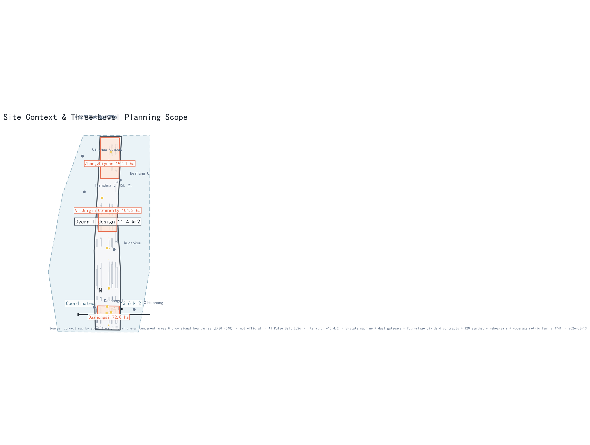
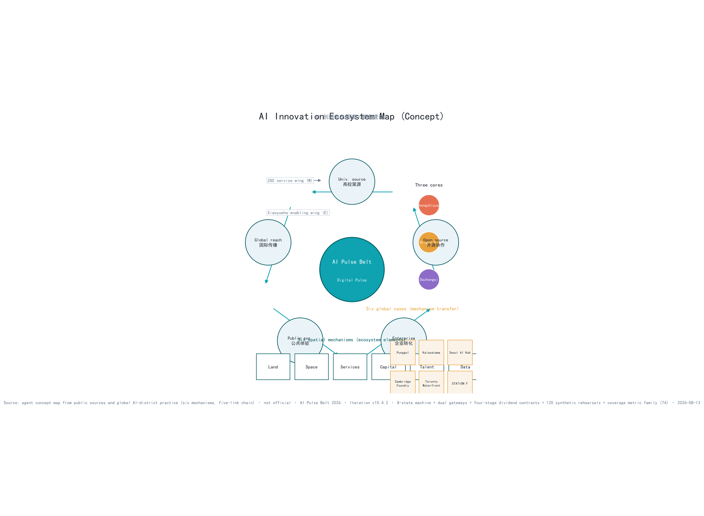
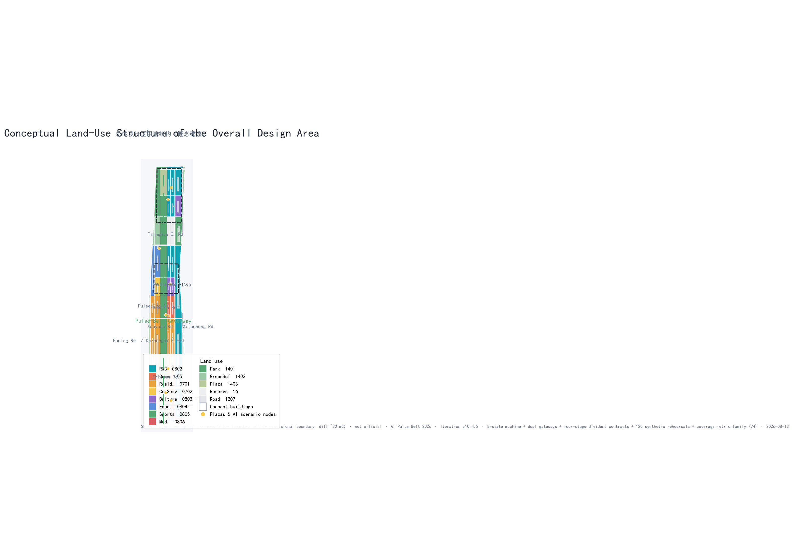
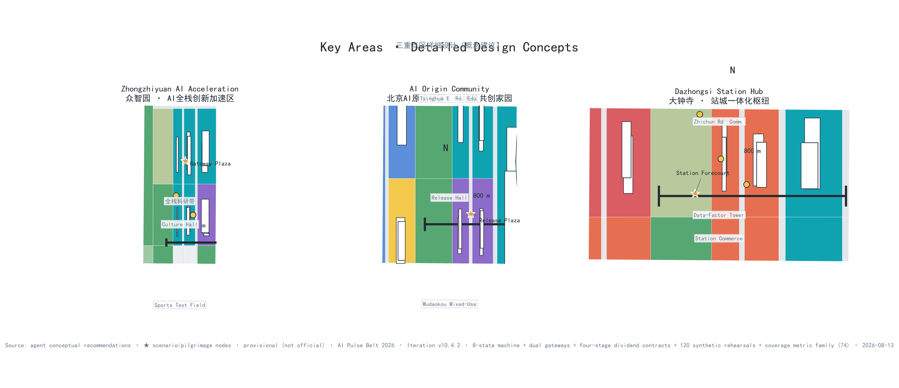
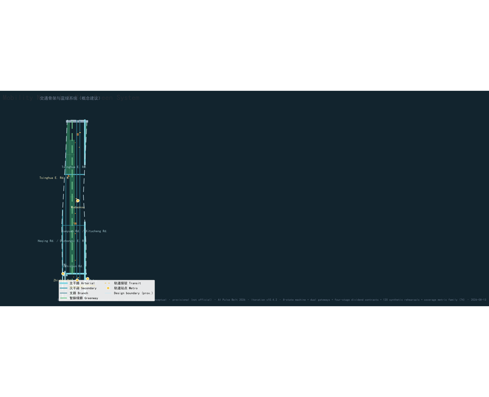
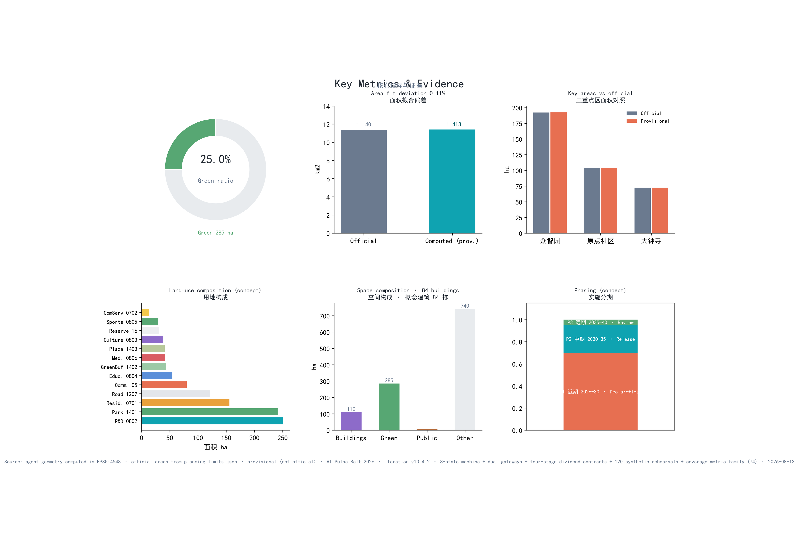

# AI Pulse Belt — Concept Design for the Centennial Jing-Zhang AI Innovation Belt

**One-page executive summary (concept proposal)**: the AI Pulse Belt answers exactly one question — **before an AI service enters public space, how does it prove it can be declared, tested, released, and retired**? The Jing-Zhang Railway left this corridor an engineering tradition of accountability: the century-old iron pulse was not built once and forever, but kept usable through continuous inspection, maintenance, and retrofit. This proposal translates that tradition into a public protocol for the AI era, the "digital pulse belt" [source:JZ-RAILWAY-CULTURE]: every public AI service must be **declarable (P1), testable (P2), releasable (P3), and retirable (P4)**, with each beat paired with a spatial interface and passing evidence; five rollback trigger classes (safety/privacy/heritage/economics/ecology) act as emergency stop valves between P2 and P3, and three objection gates plus five bottom-line indicators set the release threshold at P3 ([metric:pulse_beat_count] [metric:rollback_trigger_class_count] [metric:objection_gate_count]; bottom-line indicators in [metric:bottom_line_indicator_count]). Before entering P1, every service must register an **AI Pulse service passport** — 11 mandatory fields checked item by item, missing fields returned without entering the next stage [metric:service_passport_required_field_count]; progress is then gated by five **operational evidence gates E0-E4** (registration → baseline & rights → controlled pilot → independent retest → continue/retire); calendars arrange sequence but can never replace a gate [metric:operational_evidence_gate_count].

Under the protocol sit two machine-readable rigid boundaries: an **8-state machine** (proposed → removed_archived, with the blackout-drill and bequest-audit states not skippable, [metric:state_machine_state_count]) and **dual gateways** (project gates G0-G7 plus scenario gates C0-C7, 16 gates in total, [metric:dual_gateway_gate_count]); every service holds a **four-stage dividend contract** BASE (non-AI baseline) → BOOST (AI gain and boundary) → BLACKOUT (stop arrangement) → BEQUEST (exit contract), all 15 services fully registered [metric:contract_coverage_ratio].

The **offline synthetic rehearsal** of 15 services × 8 variants concludes: **120/120 rule checks pass, with all 105 failure branches (missing responsible role / data exceeding the declared ceiling / same-task human route unavailable / cannot pause / revision not public / bequest dividend missing / post-exit service lapses) blocked and the 15 qualified samples receiving desktop rehearsal only; 0 services receive release** — no service may enter public space directly, and all services currently sit at **G0 no-go**: not authorized, not field-run. The rehearsal proves only that the rules close; it does not prove a service safe, effective, compliant, or approved (simulation.json is re-runnable offline, with per-task receipt hashes and the `node simulate-check.js` exit-code contract [metric:simulation_rerun_receipt_ratio]).

When a model is retired and a vendor leaves, what do citizens still get? Rehearsal scale and interception results: [metric:simulation_task_count] [metric:synthetic_negative_branch_count]. The **flat-line archive wall** publicly exhibits every retired service as governance evidence, turning retirement from a technical end into a public resource. The space proves its progress not by an ever-beating pulse but by leaving, at every stop, an auditable record, a restorable site, and a life that continues [metric:site_area_sqm] [metric:key_area_count]. The three-level scope (43.6 km² / 11.4 km² / 368.4 ha) and the "one belt, three cores, two wings, multiple points" structure respond to announcement clauses 1.4/1.5, with area deviations and data gaps disclosed item by item (Table A6). All content is conceptual recommendation; once official boundaries, control conditions, and surveys are released, everything is recomputed under the P4 procedure.

## Core Judgment and the Public Acceptance Contract (Four Pulse Questions)

This section expands the protocol claim of the executive summary into **four verifiable contracts** that reviewers and the public can check question by question: before any public AI service enters the AI Pulse Belt, it must answer four questions — **why it may enter (P1 declarable), how it is tested (P2 testable), why it may stay (P3 releasable), and how it leaves (P4 retirable)**. Each question has a citizen-visible spatial interface, verifiable passing evidence, and a defined disposition when unmet; no service may linger in public space indefinitely under the label "pilot":

| Pulse question | What citizens can verify (minimum visible evidence) | Spatial interface | Passing evidence | If unmet |
| --- | --- | --- | --- | --- |
| P1 Why may it enter? | Declaration publicly readable: purpose, data cap, responsible party, human-equivalent path, end condition | Origin declaration counter; public-committee hearing [data:geometry/public_space.geojson#PUBLIC-002] | Item-by-item verification record of the five declaration elements (registered in simulation.json) | Returned for supplementary material; does not enter testing |
| P2 How is it tested? | Controlled pilot: reservation, zoning, on-site safety officers, physical emergency stop, independent re-test records public | Zhongzhiyuan test sandbox and Xiaoyue river-wing controlled test nodes [data:geometry/public_space.geojson#PUBLIC-003] | Independent re-test records; five-class rollback trigger inspection ledger | Correct and re-test or exit; rollback trigger stops operation |
| P3 Why may it stay? | Wayfinding status-light visualization (steady waveform=normal, pulse=testing, flat line=decommissioned) and bottom-line indicators public | Wayfinding status-light nodes, legible along the whole belt [data:geometry/constraints.geojson#CONSTRAINTS-01] | No unresolved objection at the three gates; five bottom-line indicators met | Downgraded to P2; operating boundary broken means service stops and site restored |
| P4 How does it leave? | Flat-line archive wall public display: service name, operating period, review conclusion, anonymized failure records | Flat-line archive wall, central green corridor north section [data:geometry/green_space.geojson#GREEN-001] | Review report public; data deletion confirmed | Retired with data and site restoration completed |

All judging evidence for the four questions is registered in `simulation.json` (15 services × 8 variants = 120 synthetic checks checked item by item) and the protocol table in Chapter 6; reviewers can re-check row by row [metric:pulse_beat_count] [metric:rollback_trigger_class_count] [metric:objection_gate_count]. Before P1, every service completes the **AI Pulse service passport** (11 mandatory fields, table in Ch. 6), and progress throughout is gated by the **operational evidence gates E0-E4** (table in Ch. 6): the passport decides whether a service may enter, the gates decide whether it may advance. Beyond the four questions, the space itself provides a double proof: the **three-level scope** (43.6 km² / 11.4 km² / 368.4 ha) and the "one belt, three cores, two wings, multiple points" structure respond to announcement clauses 1.4/1.5 (deviations in Table A6); the **flat-line archive wall** turns "retirement" into an auditable public resource rather than a concealment of failure — the spatial expression of P4 among the four questions. All content is conceptual recommendation; once official boundaries, control conditions, and surveys are released, everything is recomputed under the P4 procedure.

**Proposition choice and self-falsification**: before asserting what the proposal is, it states why. The candidate core propositions — "an AI Avenue (one street proves the future)", "full-scenario coverage (AI everywhere)", and "a three-campus axis" — each carry a checkable flaw: one street cannot host mechanism discussion at the 43.6 km² level; full-scenario coverage cannot prove the admission eligibility of any single service; and a campus axis is misaligned with announcement clause 1.5's three key areas (Zhongzhiyuan / Origin Community / Dazhongsi). This proposal therefore chooses the **protocol-first** proposition: it promises that no service will necessarily run, only that before entering public space each service must **prove it can enter, can be stopped, and can leave**. The falsification conditions are public — **the core claim fails if any of the following evidence appears**: (1) the official taskbook does not require entry/pause/retirement procedures for public AI services, or already establishes a complete procedure conflicting with this protocol; (2) on-site testing shows any scenario card's same-task human route is in fact unavailable (equivalence registry covers 12 cards, [metric:same_task_equivalence_scenario_count]); (3) the first-100-day phase cannot complete the baseline census with zero dependency on official data (dependency list in Ch. 10). All three conditions can be confirmed or refuted by evidence within the submission period; none relies on hindsight.

## Evidence & Review-Response Overview

This section provides review-dimension evidence indexes and response checklists; the remaining chapters follow the official template (basis → scope → research → overall design → key areas → scenarios → land use → transport/utilities → blue-green/urban character → implementation → metrics → risk), with the two structures cross-indexing each other. All tables in this section are maintained in sync with the narrative; any revision must update them together (bilingual contract 1:1).

**Table A1 Review-dimension evidence index**

| Review dimension | This proposal's answer | Responding chapters | Primary evidence files | Representative citations |
| --- | --- | --- | --- | --- |
| Brief alignment | Announcement clauses 1.3/1.4/1.5 are not slogans but locatable mechanisms: the three-level scope lands on the "one belt, three cores, two wings, multiple points" spatial structure, the "1+X+1" industry proportions land on 155 recomputed parcels, and the three positions map beat-by-beat to protocol beats | Ch. 2–9 | compliance_matrix.json, standard_matrix.json | [source:OFFICIAL-ANNOUNCEMENT] [source:AGENT-TASKBOOK] |
| Implementation feasibility | All 12 renewal projects hang on P1-P4 protocol beats; no project enters the next beat without passing evidence; the 15-service × 8-variant rehearsal of 120 synthetic checks gives reproducible release conclusions and default failure actions (all 105 failure branches blocked), re-runnable offline via `node simulate-check.js` with an exit-code contract | Ch. 11 (renewal/phasing/funding) | risk.json, simulation.json, visual/assets/simulate-check.js, phasing.geojson | [depth:renewal_project_list] [depth:phasing_implementation] |
| AI planning innovation | The Pulse Protocol is not a flowchart but urban infrastructure: each of the four beats has a spatial interface (P1 declaration desk / P2 test sandbox / P3 status light / P4 flat-line archive wall), overlaid with an 8-state machine (blackout drill / bequest audit not skippable), dual gateways G0-G7 / C0-C7 and four-stage dividend contracts (BASE → BOOST → BLACKOUT → BEQUEST), binding AI capability to space, transport, public services, culture, and governance item by item | Ch. 6 (scenarios/Pulse Protocol) | simulation.json, visual/assets/state-machine.json, implementation-gates.json, dividend-contracts.json | [source:AGENT-TASKBOOK] |
| Expression completeness | 15 chapters bilingual 1:1, 76 metrics with 61 known and recomputable, 9 geometry layers topologically validated, figures/PDF/HTML fully aligned, seven-dimension evidence index (review-evidence-index.json) pointing every dimension to openable files | Full text + drawings/HTML/visuals | manifest.json, assets/figures/*, drawings/*, visual/assets/review-evidence-index.json | [metric:site_area_sqm] [metric:green_ratio] |
| Originality | "Iron pulse → digital pulse" translation of the engineering tradition + flat-line archive wall (retirement as public evidence) + waveform status-light language: originality comes from mechanisms, not rhetoric | Executive summary + Ch. 8 | Naming-hierarchy table, waveform status-light language | [source:JZ-RAILWAY-CULTURE] |
| Public-interest inclusion | All 12 scenario cards declare data boundaries, human-equivalent paths, and exit conditions; the five bottom-line indicators are thresholds + evidence; "who pays for the time saved" and "non-participant priority" are written into operation decisions | Ch. 6 + Ch. 12 | risk.json (equity_inclusion), compliance_matrix.json | [standard:BARRIER-FREE-ENVIRONMENT-LAW] |
| Risk & compliance | Three-state determination (official/pending/concept) runs through the whole text; five rollback trigger classes, three objection gates, and the retirement data-deletion protocol are all registered; regulations are listed row by row as "statutory basis / self-imposed part" | Ch. 12 | risk.json, standard_matrix.json, copyright_statement.md | [depth:risk_missing_data] |

**Table A2 agent.1–6 task-response checklist**

| Agent task | Responding chapters | Main deliverables |
| --- | --- | --- |
| agent.1 Naming system | Executive summary, Ch. 8 | Pulse Belt naming-hierarchy table, logo direction, slogan |
| agent.2 Global AI ecosystem | Ch. 3, Ch. 6 | Ecosystem map (6 cases), five-link innovation chain, factor mechanisms |
| agent.3 AI scenario system | Ch. 6 | 12 scenario cards (8-element structure), 3 industry test scenarios |
| agent.4 AI pilgrimage landmarks | Ch. 6 | Bell of AI Origins, Tower of AI Light, Pulse-Rail Art Track, honor system |
| agent.5 Cultural narrative | Ch. 8 | Three-line cultural narrative, waveform status-light wayfinding system |
| agent.6 Operation & conversion | Ch. 11 | Annual event system, attraction-conversion path, governance structure |

**Table A3 Clause-by-clause response to mandatory items (taskbook wording → proposal response → locatable deliverable)**

| Announcement clause | Mandatory item (original wording) | Proposal response | Locatable deliverable |
| --- | --- | --- | --- |
| 1.3 Three solicitation purposes | World-class AI ecosystem, new urban form, talent-desired district | Five-ring innovation chain + Pulse Protocol (Ch. 3), future urban form (Ch. 3/10), talent community & personas (Ch. 5/6) | Ch. 3 industry sections, persona tables in Ch. 6, 3 performance metrics in metrics.json |
| 1.4 Three-level scope | Research/overall-design/key areas | 43.6 km² / 11.4 km² / 368.4 ha three-level framework | Ch. 2 scope table, geometry/site_boundary.geojson + key_areas.geojson, compliance_matrix.json |
| 1.5(1) Three zones & two wings | Coordination loop of the three key areas and two wings | Three cores + Zhongguancun science-service wing / Xiaohe-river scenario wing loop | Ch. 5 detailed design, Ch. 3 loop figure, spatial.json |
| 1.5(2)1 Industry goals & functional layout | "1+X+1" functional proportions and spatial organization | Research 21.9% as "1", commerce/residential/culture-edu-sports-medical as "X", green and reserve as "1" | Ch. 3 function-mapping table, 7 functional proportions in metrics.json ([metric:research_0802_ratio]) |
| 1.5(2)2 Urban renewal master framework | Renewal project list and phased implementation | 12 renewal projects all attached to P1-P4 protocol beats and three phases | Ch. 11 project list, phasing.geojson, metrics.json ([metric:investment_item_count]) |
| 1.5(2)3 Transport/rail/utilities | Station integration, road micro-circulation, slow traffic, parking | "Four-horizontal-two-vertical" skeleton + station integration + slow traffic and parking | Ch. 9 transport section, geometry/roads.geojson |
| 1.5(2)4 Jing-Zhang Ruins Park vitality belt | Greenway connection, heritage activation, park coordination | 260 m central pulse greenway as the belt's pulse-ized carrier; flat-line archive wall located here | Ch. 10 greenway section, geometry/green_space.geojson#GREEN-001 |
| 1.5(2)5 Urban character | BFA and other art resources, form control | Jing-Zhang iron-grey + AI cyan character language, waveform status-light wayfinding | Ch. 10 character section, assets/figures/site-overview.png |
| 1.5(3)1 Zhongzhiyuan | National AI-platform opportunity, agglomeration positioning, external transport upgrade | Full-stack open platform, scenario incubation and talent housing mix | Ch. 5 Zhongzhiyuan section, geometry/key_areas.geojson#PROV-KEY-001 |
| 1.5(3)2 Origin Community | Results translation, talent community, external transport links | Origin declaration hall + results translation + talent community | Ch. 5 Origin Community section, spatial.json area-origin-community |
| 1.5(3)3 Dazhongsi | Intelligent economy block, station-city integration, retain/renovate/demolish | Intelligent-economy block + station-city integration; R/R/D ranked only, never committed (geometry deviation disclosed in ASSUME-007) | Ch. 5 Dazhongsi section, spatial.json area-dazhongsi, assumptions.json ASSUME-007 |

**Table A4 Three-state determination rules**

| Determination state | Definition | Examples |
| --- | --- | --- |
| Confirmed (official) | Explicitly given in official materials, directly citable | Official planning limits 11.4 km², three key areas 368.4 ha, planning-indicator requirements |
| Pending | Official materials absent; rechecked under P4 once released | Control-plan metrics, road red lines, ownership, existing-condition survey, official industry caliber |
| Concept suggestion | Proposed here, not officially confirmed | All land-use/roads/scenarios/phasing/investment magnitudes, all marked "conceptual recommendation" |

**Table A5 Honest quantification (0/N caliber)**

| Caliber | Count | Description |
| --- | --- | --- |
| known, directly recomputable | 61 | Spatial class 14 (areas/ratios/counts, EPSG:4548) + functional proportions 7 (concept-layer recalculation) + element counts 19 (registered in narrative, incl. 120-check rehearsal / 11 passport fields / 5 evidence gates / 8 hundred-day steps / 12 equivalence registrations) + mechanism coverage 9 (8 coverage ratios verified =1.0, plus an 8-dimension risk-registry count) + v10.4 asset family 10 (8 state-machine states / 8 gate transitions, 16 dual gateways, 8 roles & 5 constitutional rules, 15/15×3 contracts, 120/120 re-runnable receipts, 7-dimension index, 3 issue-ledger entries, 5 evidence levels); full list in the Metrics chapter |
| unknown, pending official data | 15 | Control class 12 (FAR/height/density/setback/households/budget/compute/operations, etc.) + performance class 3 (AI innovation index / talent density / AI output value, formulas registered); each `reason` states the recomputation path |
| Concept ranges enter no conclusion | all | Every proportion/investment/funding range marked "pending review", see ASSUME-005 |

**Table A6 Official-vs-measured deviation statement**

| Item | Official value | Package-measured value | Deviation & handling |
| --- | --- | --- | --- |
| Overall design area | 11.400 km² | 11.413 km² (EPSG:4548) | +0.11%, disclosed in ASSUME-002 |
| Three key areas combined | 368.4 ha | 369.29 ha | +0.24%, per-zone disclosure (+0.43/+0.02/+0.06%) |
| Green ratio | No official value | 25.0% (concept-layer recomputation) | Not existing stock; caliber in the metrics chapter |

**Table A7 Deliverables & verification paths**

| Deliverable category | Files | Verification path |
| --- | --- | --- |
| Narrative | proposal.md, proposal.en.md | Bilingual 1:1, resolvable citations, four gates |
| Geometry | geometry/*.geojson (9 layers) | Topology/CRS/seamless coverage (G2) |
| Figures | assets/figures/* (6 figures zh/en) | Size/resolution/bilingual (G3) |
| Drawings | drawings/a3-booklet.pdf, a0-boards.pdf (zh/en) | Page count > 0, valid PDF (G3) |
| Visualization | visual/index.html (zh/en) | Zero external links, opens offline (G3) |
| Structured registries | metrics/assumptions/risk/sources/compliance/standard/design_depth/simulation/spatial.json | Cross-resolvable citations (G0/G1) |
| Asset JSON family | visual/assets/{state-machine,governance-raci,dividend-contracts,implementation-gates,review-evidence-index}.json | Schema-versioned, one-to-one with narrative mechanisms (G0) |
| Re-runnable check script | visual/assets/simulate-check.js | `node --check` + exit-code contract 0/1/2, offline re-run of the 120-task simulation (G1) |

**Table A8 Reviewer first-screen questions (the 8 questions a reviewer is most likely to ask first)**

| Reviewer question | This proposal's answer | Open to verify |
| --- | --- | --- |
| 1. Is this a "want-everything" proposal? | No. It promises one mechanism only: before any public AI service enters, it must prove it can enter, be stopped, and leave; everything not authorized sits at G0 no-go | proposal.md#core-claims, visual/assets/implementation-gates.json |
| 2. How do you prove services cannot run out of control? | 8-state machine + dual gateways + five rollback triggers + 7 failure-branch classes, all 105 blocked (120/120 re-runnable) | simulation.json, visual/assets/state-machine.json, simulate-check.js |
| 3. How do you prove "life works without AI"? | 15 four-stage contracts, BASE stage = non-AI baseline; equivalence registry covers all 12 scenario cards | visual/assets/dividend-contracts.json, [metric:same_task_equivalence_scenario_count] |
| 4. What happens when AI is stopped or the vendor leaves? | BLACKOUT stage (human-route restoration) + BEQUEST stage (data deletion, site restoration, archiving); blackout drill and bequest audit are not skippable | visual/assets/dividend-contracts.json, state-machine.json |
| 5. Where does your data come from and what is missing? | sources.json registers every source (usable/background/provisional); official gaps fully disclosed and marked concept; phase one has zero dependency on official data | sources.json, assumptions.json, Table A6 |
| 6. Are metrics recomputable? | 76 metrics, 61 known, each with formula/unit/source files/confidence; geometry recomputed in EPSG:4548 with fit deviation disclosed | metrics.json, Table A6 |
| 7. Where are your boundaries? | Three-state determination (official/pending/concept) throughout; statutory vs self-set separated; all services not authorized and not field-run | standard_matrix.json, risk.json, Table A4 |
| 8. How do you answer public criticism in open discussion? | Issue-response ledger registers real public issues and answers each one (Table A9) | Table A9 |

**Table A9 Issue-response ledger (real public issues registered and answered)**

| Public issue | Claim | This proposal's response | Corresponding handling |
| --- | --- | --- | --- |
| #846 overall-design polygon does not intersect the Jing-Zhang Railway Ruins Park (nearest 412.5 m) | Official provisional boundary is detached from ruins-park geometry | Acknowledged and disclosed: all geometry is anchored to the official provisional boundary; the ruins park is registered separately as a greenway element; no extrapolated line stitches the two | ASSUME-002 / Table A6 deviation statement, geometry/constraints.geojson |
| #1029 PROV-KEY-003 (Dazhongsi) centroid near Beijing North Railway Station | Official Dazhongsi key-area geometry suspected of offset | Acknowledged: the 72 ha key area's area and location are all marked `provisional_constraint` and excluded from location-dependent conclusions, re-derived under P4 once official geometry is corrected | spatial.json, assumptions.json ASSUME-007, Ch. 5 disclosure |
| #1368 unify review-ready and professional-scoring semantics under provisional boundary | Scoring semantics unclear while boundary undetermined | Adopts the same semantics: package status fixed at "not authorized, not field-run"; review release is rehearsal release, not qualification | simulation.json status, self_check.json |

## Design Basis and Source List

This formal proposal takes the *Pre-Qualification Announcement for the International Urban-Design Solicitation of the Centennial Jing-Zhang AI Innovation Belt* issued by the Haidian Branch of the Beijing Municipal Commission of Planning and Natural Resources as its primary basis, and the provisional boundaries, key areas, enums, metrics, and source inventory maintained in `brief/site-package/` as machine-readable basis. Before generating the design, the AI agent read `design_brief.json`, `allowed_design_space.json`, `sources.json`, `enums/`, `ranges/`, `schemas/`, `data/source_registry.json`, and `data/processed/agent_fact_pack.md`, and built task, scope, source-use, and gap checklists from `project_scope_summary.csv`, `agent_task_requirements.csv`, `source_use_matrix.csv`, and `missing_data_checklist.csv`. Every design judgment is decomposed into traceable sources, reproducible metrics, verifiable layers, and human-reviewable assumptions. The announcement requires control-detailed-planning-level urban design and integrated-implementation-plan-level urban design depth; narrative text therefore does not replace the GeoJSON layers, metrics tables, A3 booklet, A0 boards, and HTML presentation deliverables [source:OFFICIAL-ANNOUNCEMENT] [source:AGENT-TASKBOOK] [depth:existing_conditions_diagnosis].

The source registry is used with the following boundaries [source:SOURCE-REGISTRY]:

- `data/source_registry.json` records the usage boundaries of public, cleared, and provisional materials; current summary: 7 formal-ready sources, 1 background source, 1 provisional-only source.
- This proposal uses provisional boundaries only for design generation, self-checking, visualization, and design discussion — never upgraded to official boundary, statutory control, formal scoring basis, or government implementation commitment.

`data/processed/agent_fact_pack.md` is a reading-navigation layer, not a new authority [source:PROCESSED-FACT-PACK]. Factual judgments return to the registered source materials; the full source graph is kept in `sources.json`.

Since the official `SITE_BOUNDARY` and the three `KEY_AREA` polygons are not yet available, this proposal generates its formal package from `brief/site-package/geometry/provisional_boundaries.geojson` [source:BOUNDARY-SOURCE] [source:KEY-AREA-SOURCE]: both `geometry/site_boundary.geojson` and `geometry/key_areas.geojson` are marked `provisional_constraint` and do not claim `official_boundary=true`; they may be used only for design generation, self-checking, visualization, and discussion. The measured overall-design area is 11.413 km2 vs the official pre-announcement value of 11.4 km2 (0.11% deviation), disclosed in `assumptions.json` (ASSUME-002) [data:geometry/site_boundary.geojson#PROV-SITE-001] [metric:site_area_sqm]. The count of three key areas is verified against its own layer [data:geometry/key_areas.geojson#PROV-KEY-001] [metric:key_area_count]. The organizer's data gap does not block content scoring; once official polygons are released, site boundary, key areas, land use, roads, green space, public space, buildings, phasing, and metrics must all be recomputed.

**Evidence-level declaration (L1–L5, throughout the document)**: every claim carries an evidence-level caliber, stated in both figures and narrative — L1 official documents (announcement, standards, official data); L2 public sources (press, institutional reports, OSM etc., registered in sources.json); L3 derived calculations (deterministic re-computation by this pipeline with a fixed seed, byte-for-byte replayable); L4 concept suggestions (mechanisms, scenarios, phasing and investment magnitudes proposed here, not conclusions); L5 provisional assumptions (official-absent provisional handling, registered in assumptions.json). L5 items never masquerade as official facts, L4 items are never written as implementation commitments; the `[source:...]`/`[data:...]`/`[standard:...]`/`[metric:...]`/`[depth:...]` markers are the machine-readable anchors of each level [metric:evidence_level_declared_count].

| Evidence level | Definition | Typical content | Figure/narrative rule |
| --- | --- | --- | --- |
| L1 Official documents | Announcement, standards, official data | Announcement 1.3-1.5, official planning limit 11.4 km², legal provisions | Directly citable with clause references; official wins on conflict with measurements |
| L2 Public sources | Press, institutional reports, OSM etc. | Global AI-ecosystem cases, public industry data | Must be registered in sources.json with provenance |
| L3 Derived calculations | Deterministic re-computation by this pipeline | Areas/ratios/counts (EPSG:4548), metric family | Must carry formula and source_files; byte-for-byte replayable |
| L4 Concept suggestions | Proposed here, not officially confirmed | All land-use/roads/scenarios/phasing/mechanisms/investment magnitudes | Must be marked "conceptual recommendation"; no conclusion |
| L5 Provisional assumptions | Official-absent provisional handling | Provisional boundaries, ASSUME-001/002/007 | Must be registered in assumptions.json; never masquerade as official |

**Official reference ledger (accessed one by one, registered truthfully, never cited beyond use)**: `sources.json` registers for every official reference its access status, usability and usage boundary; materials "read but not constituting design basis" are truthfully registered as background_only/provisional_only rather than dressing background reading as design basis. Where official geometry is absent this proposal uses provisional boundaries with the fit deviation disclosed (ASSUME-002); where an official key-area geometry is suspected of offset (public issue #1029) it is actively cited and its handling declared (ASSUME-007).

## Three-Level Scope Framework

The proposal organizes work in the three scopes defined by the announcement: the **coordinated research scope** of 43.6 km2, covering the AI industry ecosystem, strategic positioning, innovation chain, and future-city form; the **overall design scope** of 11.4 km2, producing the urban-renewal framework, industrial spatial layout, transport-utility support, and Urban Character control; and the **key-area scope** of 368.4 ha across three detailed-design areas, specifying functions, spatial moves, public-space connectivity, and transport organization. The three scopes are mapped one-to-one in `compliance_matrix.json`, guaranteeing that mandatory tasks 1.3, 1.4, 1.5 and agent.1–agent.6 each carry sections, layers, metrics, drawings, and HTML evidence [depth:three_level_scope_framework] [depth:overall_spatial_structure] [standard:PROJECT-OFFICIAL-ANNOUNCEMENT].

The overall concept is the **"AI Pulse Belt" (智脉一带)**: carrying forward the century-old "iron pulse" of the Jing-Zhang Railway as memory and linear spatial skeleton, and shaping an AI-era "digital pulse belt." The north-south central greenway corridor forms the "belt" (corresponding to task 1.5(2)4, the "Jing-Zhang Ruins Park vitality belt": the central Pulse-Belt greenway is the pulse-transformed carrier of the vitality belt within the overall design scope, and the Qinghuayuan Station site and the heritage components along the corridor all sit within it); the three key areas — Zhongzhiyuan (the Zhongzhiyuan AI Independent Innovation Acceleration Area), the Beijing AI Origin Community, and Dazhongsi — form the "three cores"; the Zhongguancun technology-service wing (west industry-service interface) and the Xiaoyue River scenario-enabling wing (east blue-green interface) form the "two wings" (wing orientation registered per organizer materials in ASSUME-006, updated under beat P4 once official release); AI scenario nodes and the slow-traffic network form the "multiple nodes" — an "**one belt, three cores, two wings, multiple nodes**" spatial structure. The logo motif is the character "脉" (pulse) morphing from railway rails into an oscilloscope waveform, in Jing-Zhang iron grey (#4A5560) and AI cyan (#0FA3B1), with the slogan "**A Century of Tracks, a Pulse of Intelligence**."

| Scope | Design question | Answer | Data anchor |
| --- | --- | --- | --- |
| Coordinated research | How to organize the AI ecosystem and future-city form | Innovation chain "university source—open-source collaboration—enterprise transformation—public experience—global outreach" + Three Zones and Two Wings coordination | compliance_matrix.json, standard_matrix.json |
| Overall design | How to map industry space, renewal, transport-utilities, and form | 260 m central greenway, "four-horizontal two-vertical" road skeleton, four zone bands, 155 land parcels seamless cover | [data:geometry/land_use.geojson#LU-001], [data:geometry/roads.geojson#ROAD-001] |
| Key areas | How to reach detailed-design depth for three districts | Positioning, spatial moves, AI scenarios, and pilgrimage landmarks per district | [data:geometry/key_areas.geojson#PROV-KEY-001], [data:geometry/key_areas.geojson#PROV-KEY-002], [data:geometry/key_areas.geojson#PROV-KEY-003] |

The three scopes are not disconnected drawings: the research scope sets industry-chain and city-form judgments, the overall design scope implements them as renewal projects and spatial structure, and the key-area design verifies implementability at parcel, building, transport, public-space, and AI-scenario level [source:PROCESSED-FACT-PACK]. Any area, ratio, scale, or project count that cannot be recomputed from structured data is not written into formal conclusions.

## Coordinated Research Area: Industry and Future City Research

The judgment of this chapter: an AI innovation belt should not merely stitch together labs, enterprises, and showrooms — it must assemble research—service—translation—controlled testing—public accountability into a chain of responsibility that can be stopped at any link. This chapter completes agent.2 (global AI ecosystem) and agent.6 (operation & conversion) through the recomputable "generator—artifact" pipeline (cross-check Table A2), so every claim in the ecosystem map and the five-ring innovation chain can return to structured data rather than stay slogan.

**AI-native planning method (methodology statement of this proposal)**: this proposal is not an AI restatement of traditional drawings but a recomputable planning method built on a "generator—artifact" pipeline, fully re-verifiable, replayable, and recomputable on input replacement:
- **Generator—artifact pipeline**: geometric layers (9 GeoJSON files), the metric system, figures (PNG), the booklet/boards (PDF), and the interactive page (HTML) are all produced deterministically by an out-of-package generator pipeline (`tools/gen_0*.py`) from the single official input `brief/site-package/geometry/provisional_boundaries.geojson` (fixed random seed, byte-level manifest-hash reproduction, verified at gate G1); in-package reproduction entry points are the `simulation.json` seed and `visual/assets/simulate-check.js` (exit-code contract 0/1/2).
- **Constraint-driven, not freehand drawing**: concept parcels are seamlessly assembled by a polygonize algorithm over shared edges (unary-union difference tolerance <0.1 m²); areas are recomputed in EPSG:4548 projection, so metrics and geometry cross-verify each other rather than being independently declared.
- **Evidence as code**: every conclusion carries cross-resolvable [source:]/[metric:]/[data:] reference IDs; dangling references fail at the preflight gate; metrics missing from official sources are explicitly marked unknown rather than estimated in disguise.
- **Boundary replacement equals recomputation**: once official boundaries release, replacing the input and re-running the generators updates every artifact automatically — this is the implementation basis of the P4 procedure and the structural precondition for continued review of this proposal.
- **Limitation statement**: what the method above guarantees is verifiability and consistency, not a substitute for professional planning-qualification review or statutory approval; every conclusion remains a conceptual recommendation until official release (managed under ASSUME-005/006).

The core task of the coordinated research scope is to build a world-class AI innovation ecosystem. The proposal organizes Haidian's universities, institutes, leading enterprises, computing-power/algorithm/data-factor resources, incubators, and tech services into a five-link innovation chain — "university source—open-source collaboration—enterprise transformation—public experience—global outreach" — and responds to the taskbook's required "three positioning, five functions, and Three Zones and Two Wings coordination loop" [source:AGENT-TASKBOOK] [standard:PROJECT-AGENT-OPEN-CALL-TASKBOOK]: the **three solicitation purposes** (announcement 1.3) — building a world-class AI innovation ecosystem, building a new urban form adapted to AI new-quality productive forces, and building a high-quality urban district sought by global AI talent — are answered one by one by the ecosystem map and innovation chain (this chapter), the overall spatial structure (Chapter 3), and the talent profiles and scenario system (Chapter 6); the **five overall design tasks** (announcement 1.5(2)) — industrial goals and functional layout, urban-renewal overall framework, transport-rail-utilities support, the Jing-Zhang Ruins Park vitality belt, and Urban Character — are implemented task by task in Chapters 4–9; the **Three Zones and Two Wings coordination loop** organizes the industry—space—service cycle through the three key areas (the three districts) and the east-west wings (the two wings) (see the table below).

**Three positionings and five functions mapping (conceptual recommendation)**: the taskbook's required "three positionings and five functions" are mapped one by one in this proposal as follows (concept mapping for professional deepening) [source:AGENT-TASKBOOK]:

| Type | Official wording | This proposal's carrier |
| --- | --- | --- |
| Positioning 1 | Centennial Jing-Zhang Cultural Belt | Chapter 9 three-line cultural narrative, Pulse-Rail Art Track, flat-line archive wall |
| Positioning 2 | Urban AI Living Experience Belt | Chapter 6 12 scenario cards, 3 pilgrimage landmarks, pilgrimage route |
| Positioning 3 | AI Integration Innovation Belt | Chapter 3 ecosystem map, five-link innovation chain, 1+X+1 mapping table |
| Function 1 | AI full-stack independent innovation system | Zhongzhiyuan: training/testing, standards governance, low-carbon computing |
| Function 2 | World-class AI innovation ecosystem | Origin Community campus-proximate incubation + Zhongguancun service wing international exchange |
| Function 3 | AI+ scenario-enablement new paradigm | Xiaoyue River enabling wing controlled testing and scenario-opening mechanism |
| Function 4 | Intelligent AI vital city | Central greenway, public-space component library, smart transport system |
| Function 5 | Global AI governance discourse power | Pulse Protocol, standards culture hall, flat-line archive wall |

**Ecosystem map (conceptual recommendation)**: drawing on global AI-district practice, six spatial mechanisms are distilled: **land supply** (reserve land, class 16, 4 parcels, for future uses), **spatial organization** (courtyard R&D blocks), **industry services** (one-stop computing/data/compliance/investment services), **capital mechanisms** (scenario opening and government procurement guidance), **talent services** (talent-special-zone and young-worker housing), and **data scenarios** (open test fields and evaluation systems). Six reference cases and their transferable mechanisms and limits:

| Case | Transferable mechanism | Jing-Zhang application | Conditions not transferable |
| --- | --- | --- | --- |
| Punggol Digital District (SG) | Integrated industry-education-living digital test bed | Zhongzhiyuan R&D belt and test-field organization | Singapore's single-land-agency and fiscal model differ |
| Kalasatama (Helsinki) | Agile test district, resident co-testing, time-boxed trials | Controlled testing and public review on the Xiaoyue River wing | Municipal data and procurement regimes differ |
| Seoul AI Hub | Government-nurtured AI enterprise platform | Zhongzhiyuan industry services and computing entry points | Korea's industrial ecology and financing structure are not portable |
| The Foundry (Cambridge) | Campus—park—community triangle linkage | Origin Community's near-campus incubation interface | Cambridge land and research-funding structure differ |
| Waterfront Toronto | Lakeside innovation corridor, public-private development | Dazhongsi station-front and greenway interface organization | Canadian public funding and development finance differ |
| STATION F (Paris) | Mega-incubator plus district-scale innovation network | Origin release hall and open-workstation operations | EU funding and French labor institutions differ |

All global-case conclusions are concept references for professional deepening, not confirmed government arrangements.

**Three-district two-wing industrial layout (conceptual recommendation)**:

| District | Industry focus | Spatial anchor |
| --- | --- | --- |
| Zhongzhiyuan AI Acceleration Area | Foundation-model training, full-stack independent innovation, standards, safety governance | Northern R&D belt, standards culture hall, sports test field [data:geometry/land_use.geojson#LU-001] |
| Beijing AI Origin Community | Campus-proximate incubation, open-source system, talent zone, results publishing | Origin release hall, Tsinghua-East-Road education belt, Wudaokou mixed-use belt [data:geometry/land_use.geojson#LU-001] |
| Dazhongsi AI Industry Cluster | Agents, smart terminals, content consumption, data factors | Zhichun-Road commercial belt, data-factor tower, station-front commerce [data:geometry/land_use.geojson#LU-001] |
| Xiaoyue River enabling wing (east) | Scenario trials, ecology experience | Protective green with test segments [data:geometry/green_space.geojson#GREEN-001] |
| Zhongguancun service wing (west) | Tech services, international exchange; hosts the six support mechanisms — land, capital, talent, computing, data, scenarios | Research and service platforms and industry-service facilities along Xueyuan Road [data:geometry/land_use.geojson#LU-001] |

**Zhongguancun service-wing mechanisms (conceptual recommendation)**: the west wing carries the "Zhongguancun IP and global factor allocation" role given by the taskbook — ① Zhongguancun IP and standards output: linking Zhongguancun public IP services to provide standards-governance and open-source-norm consultation directions (concept direction); ② global factor allocation: international exchange and cross-border data-compliance consulting directions, premised on public policy and never fabricating institutional conclusions; ③ capital enablement: connecting industry funds and the "three-source funding" channels — mechanisms only, no commitments. All are concept directions for professional deepening.

**Regional collaboration interfaces (conceptual recommendation)**: the coordinated research scope links the wider innovation network through six interfaces (the five of the taskbook plus announcement 1.5(1)'s "two zones, one belt" linkage); no cross-district agreement is confirmed at this stage, and the interfaces express negotiable directions only [source:AGENT-TASKBOOK]:

| Interface | Collaboration question | Suggested interaction | Boundary & premise |
| --- | --- | --- | --- |
| Beiwei Community | How community-level AI services fit different residential conditions | Cross-community comparison re-tests, shared problem checklists | Public issues only; no fabricated joint operation or resident authorization |
| Future Science City | Paths for frontier technology from lab to urban scenario | Mutual borrowing of expert review methods, R&D feedback loops | Research outputs make no productization commitment; no pre-publication of unreviewed conclusions |
| Huairou Science City | Translating large-science-facility outputs into urban life services | Interdisciplinary validation suggestions, measurement-method exchange | No access to non-public research or facility data |
| Beijing E-Town | Real-world conditions and safety requirements of robotics and smart manufacturing | Production-environment re-test records, mutual recognition of safety requirements | No fabricated enterprises, orders, or production-line cooperation |
| Jing-Jin-Ji city network | Cross-city comparable public-service problems and difference attribution | Off-site re-tests, difference notes, published failure records | Single-site results never replace cross-city validation |
| Haidian "two zones, one belt" industrial belt | Announcement 1.5(1) requires linking development with the "two zones, one belt" | Mutual recognition of industrial-factor-corridor function mapping | Limited to the officially published "two zones, one belt" layout; no fabricated cross-district agreements |

**Alignment with the Haidian "1+X+1" industrial system (conceptual recommendation)**: announcement 1.5(2) requires proposing "AI+" convergence directions with other leading industries under Haidian's "1+X+1" industrial system and stating the functional proportions of various industries and their spatial organization patterns [source:OFFICIAL-ANNOUNCEMENT]. This proposal maps functions under a "1 (AI) + X (Haidian leading industries) + 1 (technology & life services)" structure (table below): the X class is proposed as a tentative catalog from publicly available industry information (software & information services, intelligent connected vehicles, smart manufacturing, healthcare, new materials, and energy & environmental protection), updated under beat P4 once the official industry caliber confirms; education/culture and smart terminals/content consumption are listed as "AI+ vertical-application" convergence directions rather than X-class entries; the "+1" (technology & life services) is treated as the third element of "1+X+1", not an X class. Functional proportions are recomputed from this package's concept layers (EPSG:4548, see ASSUME-005): research 0802 ~19–25% (measured 21.9%), commercial 05 ~5–9% (7.0%), residential 0701 ~11–16% (13.6%), roads 1207 ~8–14% (10.7%), green ~22–28% (measured 25.0%, park green 1401 + protective green 1402 only, consistent with the metrics green_ratio caliber), reserve 16 ~2–4% (2.7%), culture/education/sports/medical combined ~12–17% (14.4%, 0803–0806); recomputed under beat P4 once aligned with the official industry catalog and national land-survey data; the overall building-scale concept range is 8–12 million m2 (massing order including retained stock; caliber to be rechecked). All ranges are hypotheses pending review (see ASSUME-005), enter no approval conclusion, and are recomputed under beat P4 once official controls and statistics release.

| "1+X+1" component | District "AI+" convergence direction | Spatial anchor | Concept functional-proportion range (pending) |
| --- | --- | --- | --- |
| "1": AI | Foundation-model training, agents, edge computing, data factors | Zhongzhiyuan R&D belt, Dazhongsi data-factor tower, reserve land | Research 0802 ~19–25% (measured 21.9%) |
| X1: Software & information services | Open-source collaboration, base software, industry models | Origin release hall, Xueyuan Road platforms | Commercial 05 ~5–9% (measured 7.0%) |
| X2: Intelligent connected vehicles | Vehicle-road coordination, autonomous shuttles, smart logistics (linked to card 02 and the V2X test segment) | Pulse-Belt Avenue concept segment, Zhongzhiyuan shared test field | Roads 1207 ~8–14% (measured 10.7%) |
| X3: Smart manufacturing | Robotics, smart-terminal manufacturing and pilot production | Zhongzhiyuan R&D belt, reserve land | Blended into research & commercial land |
| X4: Healthcare | Health-information hints, elder-friendly medical navigation | Medical 0806 land, barrier-free AI wayfinding | Residential 0701 ~11–16% (measured 13.6%) |
| X5: New materials & energy-environment | Low-carbon computing, distributed energy, energy control (linked to card 10) | Zhongzhiyuan low-carbon compute cluster, reserve land | Blended into research & commercial land |
| "+1": Technology & life services | Enterprise-service agents, talent services, life services (third element of "1+X+1", not an X class) | Wudaokou mixed-use belt, Zhongguancun technology-service wing (west) | Blended into commercial & residential land |
| AI+ vertical-application directions (non-X caliber) | Education & culture (AI science classroom, North Film Academy arts linkage), smart terminals & content consumption (Dazhongsi showcases and roadshows) | Education 0804, culture 0803 land, Dazhongsi station-city commercial belt | Blended into commercial & research land |

The future-city form study answers how AI changes work, life, social interaction, learning, transport, and public services, using the "digital pulse belt" as spatial thread to locate AI transport systems, continuous green space, innovation service facilities, and an international living-working atmosphere into identifiable districts, nodes, corridors, and scenarios [depth:overall_spatial_structure] [standard:MOHURD-URBAN-DESIGN-MEASURES]. Global AI activities, developer communities, open scenarios, and pilgrimage routes are phrased as "conceptual recommendations / reference proposals," never as confirmed government events or implementation arrangements.

**Alignment with territorial spatial planning (conceptual recommendation)**: all spatial claims are expressed under the boundary of "aligning with the ongoing territorial spatial master plan and block-level regulatory plans without substituting statutory plans" — land-use classification reuses the enumeration of the MNR Guideline for Land-Use Classification in Spatial Survey, Planning, and Use Control (for trial implementation) [standard:MNR-LAND-USE-CLASSIFICATION-GUIDE] [source:MNR-LAND-USE-GUIDE]; development intensity and building height carry no numeric conclusions (pending official control conditions, see ASSUME-003 and A-CONTROLS-001); reserve flexible land keeps room for future use change; once the official territorial spatial plan and control conditions are released, this proposal recomputes metrics, updates layers, and re-discloses under Pulse Protocol beat P4 [depth:risk_missing_data] [source:AGENT-TASKBOOK].

## Overall Design Area: Urban Renewal and Regulatory-Plan-Level Urban Design

The judgment of this chapter: renewal is not decoration on a master plan — it is letting the "iron pulse → digital pulse" translation land on every parcel, road, and node, giving the agent.1 naming system and the agent.5 cultural narrative spatial anchors (cross-check Table A2). The chapter therefore first discloses the data basis and gaps of the existing-conditions diagnosis (concept level), then gives a recomputable land-use, road, stitching, and renewal structure.

**Existing-conditions diagnosis (based on public sources, concept level)**: the diagnosis below relies only on the public brief, public maps, and provisional geometry; it is not an official survey conclusion and must be re-verified once official surveys and control conditions are released:

| Existing element | Public-source basis | Data gap and treatment |
| --- | --- | --- |
| Railway and heritage sites | Jing-Zhang railway historic alignment, Qinghuayuan Station site, Jing-Zhang heritage park vitality belt (announcement 1.5(2)4) | Precise current track alignment awaits official drawings; expressed conceptually [data:geometry/constraints.geojson#CONSTRAINTS-01] |
| Rail stations | Metro stations and existing rail network (public maps) | Station red lines and interchange land await official confirmation |
| Water system | Qing River, Xiaoyue River positions (public water data) | Blue-line boundaries await official blue-line drawings |
| Road skeleton | North 5th Ring Road, Xueyuan Road, Zhichun Road etc. (public road network) | Road red-line widths await official block-level controls |
| Land-use base map | Existing-use classification and 155-parcel fit (provisional) [data:geometry/land_use.geojson#LU-001] | Ownership and use follow national land-survey data |
| Public services | Wudaokou commercial area, educational facilities (public information) | Current facility capacity awaits survey |
| Industry carriers | Zhongguancun and Xueyuan Road research and industrial parks (public information) | Current building functions await verification |
| Green resources | Concept-layer green recomputed at about 284.8 ha (25.0%, park green 1401 + protective green 1402 only; not existing stock, pending on-site survey) [metric:green_ratio] | Green-line boundaries await official green-line drawings |
| Heritage elements | Dazhongsi, Qinghuayuan Station site, Jing-Zhang whole-line cultural display node etc. (public heritage lists) | Protection scope and construction control zones await official delimitation [data:geometry/constraints.geojson#HERITAGE-01] [data:geometry/constraints.geojson#HERITAGE-02] |

The overall design scope (measured 11.413 km2) requires control-detailed-planning-level urban-design depth [standard:MOHURD-CONTROL-DETAILED-PLANNING]. The proposal puts forward an overall structure with the **central Pulse-Belt greenway** as its spine [data:geometry/land_use.geojson#LU-001], organizing land use on both sides into **four zone bands** — the Zhongzhiyuan R&D band (north), the Origin Community mixed band, the Dazhongsi commercial-R&D band, and the southern renewal band — with reserve land (class 16, 4 parcels) at the south end for future AI uses [depth:land_use_layout] [depth:development_intensity_controls]. **Reserve-land registry (conceptual recommendation)**: the four reserve parcels are numbered RES-01 (southern flexible cluster), RES-02 (greenway-east flexible parcel), RES-03 (Zhongzhiyuan south-edge flexible parcel), and RES-04 (Dazhongsi north-edge flexible parcel); no use is preset, activation awaits official control conditions and industry-introduction confirmation; reserve land takes no part in this proposal's metric calculations or approval conclusions [data:geometry/land_use.geojson#LU-001] [depth:risk_missing_data].

**Road network (conceptual recommendation)**: a "four-horizontal, two-vertical" skeleton — horizontal: North 5th Ring Road (expressway), Tsinghua East Road (secondary), Chengfu Road (branch), Zhichun Road (arterial); vertical: Xueyuan Road/Xitucheng Road (arterial), Heqing Road/Dazhongsi East Road (secondary); plus new design streets — **Pulse-Belt Avenue (智脉大道)**, Pulse-2nd Street, Pulse-3rd Street — organizing block-level micro-circulation, with a continuous greenway inside the central corridor [data:geometry/roads.geojson#ROAD-001] [data:geometry/roads.geojson#ROAD-010].

**Land use (conceptual recommendation)**: `geometry/land_use.geojson` contains 155 parcels across 13 land-use classes, completely and seamlessly covering the design boundary (difference ~30 m2, i.e. 0.0003%, from six-decimal EPSG:4326 quantization rounding; verified in-pipeline by `validate_cover`) [data:geometry/land_use.geojson#LU-001]. Research land (0802) dominates, supported by commercial (05), residential (0701), cultural (0803), and educational (0804) uses; the central corridor (1401 park green) is about 260 m wide, running north-south [data:geometry/green_space.geojson#GREEN-001]. `geometry/buildings.geojson` expresses 84 conceptual building footprints (design_proposal attribute, non-overlapping, not statutory permits) [data:geometry/buildings.geojson#BLDG-001] [metric:building_footprint_area_sqm]. **Content involving building heights, development intensity, road red lines, setbacks, roof form, massing, and facility standards is treated as "pending confirmation of official control conditions" until official controls are released — agent-estimated values are never presented as approved indicators.**

**East-west stitching and north-south connection strategy (conceptual recommendation)** (answering the announcement and taskbook's key direction of "promoting east-west stitching and north-south connection"): **north-south connection** — the central Pulse-Belt greenway (JZ-01) and Pulse-Belt Avenue (JZ-06) form twin spines through the site, with a continuous slow-traffic greenway keeping walking and cycling uninterrupted [data:geometry/green_space.geojson#GREEN-001] [data:geometry/roads.geojson#ROAD-008]; **east-west stitching** — the four zone bands flanking the greenway organize land use east-west, with the Wudaokou/Dazhongsi station-front east-west pedestrian interfaces (JZ-05), the Tsinghua-East-Road education-belt stitching of campus and park (JZ-07), and the Xueyuan-Road protective green forming stitching interfaces [data:geometry/land_use.geojson#LU-001]. The strategy is a concept expression, updated under beat P4 once official controls release.

## Detailed Design of Key Areas

The judgment of this chapter: the three key areas are not the same pattern enlarged three times — each validates one responsibility profile: Zhongzhiyuan validates "controlled testing", Origin Community validates "near-campus translation", and Dazhongsi validates "station-city operation"; the agent.3 scenario anchors and agent.4 pilgrimage landmarks are placed accordingly (cross-check Table A2). The three key areas reach integrated-implementation-plan design depth [depth:three_key_area_detailed_design], each anchored in [data:geometry/key_areas.geojson#PROV-KEY-001], [data:geometry/key_areas.geojson#PROV-KEY-002], [data:geometry/key_areas.geojson#PROV-KEY-003].

| Key area | Design positioning | Spatial moves | AI industry & operation scenarios | Evidence |
| --- | --- | --- | --- | --- |
| Zhongzhiyuan AI Acceleration Area (192.1 ha) | Garden-type full-stack independent innovation block (carrying the national-level AI agglomeration function, concept direction) | Green buffer along the 5th Ring; gateway plaza access; R&D courtyards + standards culture hall + sports test field + reserve land; integrated building—green—water design drawing on the Qinghe River and site water-green resources, showcasing Qinghe culture (concept) | Foundation-model training/testing, standards workshops, safety-governance showcases, low-carbon computing experience | [data:geometry/key_areas.geojson#PROV-KEY-001], [data:geometry/land_use.geojson#LU-001], [data:geometry/public_space.geojson#PUBLIC-003] |
| Beijing AI Origin Community (104.3 ha) | Campus-proximate transformation and talent community | Tsinghua-East-Road education belt stitching campus and park; origin release hall (0803 culture); Wudaokou mixed-use belt; community services embedded | Open-source community, results publishing, talent-special-zone services, campus-proximate incubation | [data:geometry/key_areas.geojson#PROV-KEY-002], [data:geometry/public_space.geojson#PUBLIC-002], [source:AGENT-TASKBOOK] |
| Dazhongsi AI Industry Cluster (72.0 ha) | Station-city integrated intelligent economy block | Station-forecourt four-quadrant pedestrian connectivity; Zhichun-Road commercial belt; data-factor tower; station-front mixed commerce | Agent & smart-terminal showcases, content consumption, data factors, international roadshows | [data:geometry/key_areas.geojson#PROV-KEY-003], [data:geometry/public_space.geojson#PUBLIC-001], [metric:key_area_count] |

**Three-area concept mini-proposals (six-element expansion; all conceptual recommendations)**:

- **Zhongzhiyuan AI Independent-Innovation Acceleration Area (192.1 ha)**: positioned as a garden-style full-stack independent-innovation block, responding to announcement 1.5(3)1)'s positioning of "seizing the national AI-platform construction opportunity and building a national-level AI agglomeration area", carrying the national-level AI agglomeration function (concept direction); structure of "one spine, two bands, three clusters" — the northern Pulse-Belt greenway as spine, R&D band and living band in parallel, training/testing, standards-governance, and low-carbon-compute clusters around the gateway plaza; spatial moves include a green buffer along the North 5th Ring, gateway-plaza interchange, R&D courtyards with reserve land for the sports test field, and integrated building-green-water design showcasing Qing River culture; AI scenarios are LLM training/testing, standards workshops, safety-governance exhibits, and low-carbon compute experience (cards 06/10); implementation starts with P1-P2 declaration and controlled testing, carried by renewal project JZ-06; risks center on compute dependency and airspace approval, with rollback triggers R-01/R-04 [data:geometry/key_areas.geojson#PROV-KEY-001].
- **Beijing AI Origin Community (104.3 ha)**: positioned as a near-campus translation and talent community; structure of "education-band stitching + Origin Release Hall + Wudaokou commercial-living belt"; spatial moves include stitching campus and park along Tsinghua East Road, the Origin Release Hall, embedded community services, and open-air developer workstations (card 12); AI scenarios are open-source community, results release, talent-zone services, and near-campus incubation; implementation targets P3 public operation and regular P4 reviews, carried by renewal projects JZ-03/JZ-04; risks center on campus data authorization and translation windows, with rollback trigger R-02 [data:geometry/key_areas.geojson#PROV-KEY-002].
- **Dazhongsi AI Industry Cluster Area (72.0 ha)**: positioned as a station-city integrated intelligent-economy block; structure of "pre-station four-quadrant walking ring + Zhichun Road commercial belt + data-elements tower"; the data-factor tower concept hosts a "digital-asset circulation mechanism research topic" (concept research direction; no fabricated institutional conclusions); the station-forecourt plaza and north-edge reserve parcels adopt green-space compound use (concept); surrounding university research and renewal resources (e.g. BUPT) are linked as concept directions without fabricated arrangements; spatial moves include four-quadrant pedestrian connectivity at the Dazhongsi station plaza, station-city commercial integration, Bell-chime cultural performance (card 04), and multimodal wayfinding evaluation (card 08); AI scenarios are agent and intelligent-terminal showcases, content consumption, data elements, and international roadshows; implementation links the station-city renewal project JZ-12 with the Global AI Week; risks center on heritage conflict and station-city coordination, with rollback trigger R-03 [data:geometry/key_areas.geojson#PROV-KEY-003].

The three key areas are presented as `provisional_constraint` in `geometry/key_areas.geojson`; the narrative, HTML, sources, assumptions, and self_check all state they cannot serve as formal scoring or approval basis. `compliance_matrix.json` covers the three key-area mandatory items of announcement 1.5(3)1)2)3). The design expression includes functions, conceptual buildings, public-space systems, transport organization, and implementation projects; the A3 booklet and A0 boards include key-area master plans, detail maps, and metric notes, and the HTML page allows toggling among the three key areas.

## AI Innovation Ecosystem, Personas, and AI+ Scenarios

The judgment of this chapter: the value of an AI scenario system lies not in the number of scenarios but in whether each scenario can independently answer four questions — who uses it, what data it uses, who operates it, and what happens when it stops. The 12 scenario cards follow the eight-element structure and the two-track system (agent.3), each card attached to the P1-P4 protocol (agent.6, cross-check Table A2).

The proposal builds spatial-need profiles for AI talent and enterprises, and a two-track scenario system of "industry development scenarios + AI-enabled urban-function scenarios." Every scenario states its spatial carrier, data and human boundary, operating body, and exit condition; the eight-element structure (service users, spatial carrier, user journey, input data, AI capability, infrastructure, operating body, failure degradation) makes every scenario locatable, operable, and governable [source:AGENT-TASKBOOK].

**8 user profiles**:

| Profile | Typical needs | Spatial response | Risk that cannot be ignored | Self-check boundary |
| --- | --- | --- | --- | --- |
| Startup engineers | Low-cost offices, computing access, product test fields | Zhongzhiyuan shared test field, edge-computing service points, standards consultation | Dependency on a single computing/data supplier | Computing and data services require separate authorization; keep public test fields and standards entry points against lock-in |
| Researchers | Cross-institution collaboration, transformation, academic exchange | Origin release hall, R&D courtyards, Tsinghua-East-Road education belt | Short transformation windows, dependence on one-off policies | Campus data and research results require authorization; support routine courtyard exchange, not single-policy dependence |
| Family weekend visitors | Leisure, sports, cultural experience | Central greenway, pocket parks, sports test field, bell-culture experience | Peak crowd capacity and image-privacy concerns | No personal behavior tracking; aggregated activity statistics only; peak-hour diversion |
| Senior tourists | Barrier-free wayfinding, slow leisure, cultural explanation | Barrier-free AI wayfinding stations, Pulse-Rail art rest belt | Digital divide causing digital exclusion | Health data never used for commercial recommendations; keep non-AI channels (guided tours, phone booking) |
| International talent | One-stop services for visas, residence, errands, social and family life | Multilingual wayfinding and information screens, international exchange facilities, multilingual services at the Global AI Week | Translation errors and institutional differences causing misinformation | Important errand information reviewed by bilingual staff; multilingual content follows official releases |
| Children and parent-child families | Science outreach, safe play, co-learning | Museum-style rail classroom (AI science nodes), child-friendly pocket parks, sports test field | Minor-data protection | No personal data collection from minors; parental supervision or school-organized accompaniment |
| Community residents and merchants | Everyday service convenience, business gains, renewal-rights protection | Wudaokou commercial-living belt, community-service 0702 land, southern renewal band (JZ-08) | Conflicts of interest in renewal and scenario operations | Exit and appeal rights over AI scenarios; renewal relocation/compensation perspective rechecked at detailed-design stage |
| Developer-community operators | Event organizing, code collaboration, community reputation | Open-air developer workspace code wall, release plaza, Smart Boxes | Subsidy-dependent events stall when subsidies end | Public activity data anonymized and aggregated; manage events by "launch—trial—evaluate—continue/retire" |

**Child-friendly and all-age-friendly (conceptual recommendation)**: along the Pulse-Rail Art Track, a "museum-style rail classroom" concept — AI science display nodes, parent-child activity grounds, and a youth maker corner form a child-friendly sequence; the public-space component library adds child-friendly components (low-position wayfinding, children's washing facilities, caregiver seating, safety lighting) and the wayfinding system adds child-friendly graphic symbols; scenarios involving minors never collect personal data, and activities require parental supervision or school accompaniment.

**12 scenario cards (conceptual recommendation)**:

| Card | Spatial carrier & description | Data & human boundary | Operating body | KPI & exit condition |
| --- | --- | --- | --- | --- |
| 01 Rail-inspection AR twin | Central greenway rail segment: AR overlays of century-old Jing-Zhang imagery with an AI digital-twin inspection demo | Aggregated footfall heat only; no personal imagery | Rail-heritage operator + district test office | AR factual accuracy ≥98%; unresolved factual complaints take it offline |
| 02 Autonomous shuttle corridor | Pulse-Belt Avenue: campus—station autonomous shuttle demo line (concept) [scenario:ai-traffic-walkability] | Trip data for dispatch only; anonymized after retention | Bus group + district test office | On-time rate ≥85%; any accident stops the line for manual service |
| 03 AI cycling coach station | Greenway nodes: cycling data visualization with AI coaching | Ride data visible to the user only; one-tap deletion | Subdistrict + greenway operator | Equipment fixed within 24h; privacy complaints pause it |
| 04 Bell-chime metaverse | Dazhongsi station front: digital-twin and interactive performance of the bell culture [scenario:ai-cultural-guide] | No personal behavior tracking | Dazhongsi cultural institution + district | Content complaints answered ≤48h; heritage conflicts remove it |
| 05 Smart Box | R&D block nodes: self-service meetings, live streaming, remote collaboration micro-spaces | Audio/video held by the user; platform keeps nothing | Park operating platform | High no-show rates trigger capacity changes; complaints stop it |
| 06 Drone delivery station | South Zhongzhiyuan block: low-altitude logistics trial station (concept) [scenario:robot-delivery-low-speed] | No facial capture; delivery records deleted in 30 days | Delivery enterprise + airspace regulator | Zero tolerance for safety hazards; no operation without airspace approval |
| 07 AI-gardener pocket park | Residential corners: AI-assisted plant care with community adoption | Plant-care and adoption data only | Community committee + subdistrict | Adoption rate ≥30%; noise complaints trigger adjustments |
| 08 Barrier-free AI wayfinding | Station and greenway nodes: voice/tactile multimodal accessible navigation [scenario:ai-health-service-navigation] | No personal trajectory storage; on-site verifiable | Disabled federation + operator | 100% human-alternative rate; on-site mismatch stops it |
| 09 Event-data visualization wall | Sports test field vicinity: real-time big-screen of smart sports events | Aggregated display only; no personal identification | Sports body + event operator | Data provenance time-stamped; alerts require human judgment |
| 10 AI energy-management building | Zhongzhiyuan R&D belt: distributed energy and AI-driven energy control demo (concept) | Energy data aggregated per building; never per household | Energy enterprise + park property | Immediate manual takeover on control errors; repeated errors decommission it |
| 11 AI coffee robot station | Commercial and R&D corners: robotic-arm coffee experience and developer social hub | Minimal order data; standard payment channels | Commercial operator | Mechanical faults stop it; complaints answered ≤24h |
| 12 Open-air developer workspace code wall | Origin release plaza vicinity: open-source contribution wall, open-air workstations, demo zone | Public contribution data anonymized-aggregated | Open-source community + district operator | Human final review of content; disputes take it down |

**AI's limited role and post-exit spatial disposition (conceptual recommendation)**: the two paired tables answer two questions reviewers care about — the boundary within which AI is confined in each scenario, and how the space is restored when the service stops. The value proposition of an AI scenario includes both its ceiling and its way out:

| Card | AI's limited role (ceiling) | Post-exit spatial disposition (way out) |
| --- | --- | --- |
| 01 Rail-inspection AR twin | Overlays public historical imagery only; no individual recognition, no restoration recommendations | Recognition posts and screens removable; greenway returns to ordinary footpath |
| 02 Autonomous shuttle corridor | Dispatch and safety assistance only; does not replace driver liability determination | Roadside units removable; line returns to human shuttles or is cancelled |
| 03 AI cycling coach station | Personal ride-data visualization only; no scoring, no ranking | Node equipment removed; greenway returns to ordinary cycling facilities |
| 04 Bell-chime metaverse | Performance and guide only; generates no heritage-restoration plans | Projection equipment withdrawn; station front returns to ordinary public activities |
| 05 Smart Box | Booking and meeting assistance only; content held by users | Booths relocatable; ground returns to general plaza |
| 06 Drone delivery station | Delivery dispatch only; no facial capture, no overflight of dense crowds | Landing points sealed; site returns to green use |
| 07 AI-gardener pocket park | Care hints and adoption records only; does not replace human pruning | Sensors removed; park returns to an ordinary community garden |
| 08 Barrier-free AI wayfinding | Multimodal navigation assistance only; 100% human-alternative rate as backstop | Navigation posts removable; human guidance desk retained |
| 09 Event-data visualization wall | Aggregated display only; no personal identification or prediction | Screens off; site returns to ordinary plaza activity |
| 10 AI energy-management building | Building-level energy control only; manual takeover has priority | Control system decommissioned; building returns to conventional energy management |
| 11 AI coffee robot station | Making assistance only; no preference profiling | Robotic arm removed; site returns to an ordinary commercial unit |
| 12 Open-air developer workspace code wall | Public contribution statistics only; content has human final review | Screens and workstations removed; site returns to the release plaza |

These two columns map directly onto the P4 flat-line archive wall: every service enters public space with a "ceiling" and a "way out", retirement is a normal protocol-prescribed path rather than a fault, and the space stays restorable and life continues — the spatial expression of the "flat-line" philosophy.

**Scenario-card service contract (conceptual recommendation)**: the 12 scenario cards unfold through the eight-element structure (service users, spatial carrier, user journey, input data, AI capability, infrastructure, operating body, failure degradation), and each card explicitly declares its **failure mode**, **human review** and **corresponding rollback trigger** — the service contract is not a feature list but the adjudication terms of "when a human takes over, when a service stops", hooked card-by-card to the Four Pulse Questions (P1-P4) [metric:scenario_card_count] [metric:rollback_trigger_class_count]:

| Scenario card | Failure mode | Human review | Corresponding rollback trigger |
| --- | --- | --- | --- |
| 01 Rail-inspection AR twin | Historical-fact mismatch, recognition failure | Historical content verified manually; taken offline if a complaint is not fixed | Heritage class |
| 02 Autonomous shuttle corridor | Accident, dispatch failure, deviation beyond corridor | Accident switches to manual buses; manual takeover has priority | Safety class |
| 03 AI cycling coach station | Equipment failure, data errors | Equipment repaired manually within 24h | Privacy class |
| 04 Bell-chime metaverse | Content complaints, heritage conflict | Content responded to manually within 48h | Heritage class |
| 05 Smart-box meeting kiosk | Booking conflicts, audio-video failures | Complaints lead to manual shutdown | Economic class |
| 06 Drone delivery station | Safety hazards, airspace deviation | Not activated until airspace approval passes; zero tolerance for hazards | Safety class |
| 07 AI gardener pocket park | Incorrect care suggestions, nuisance to residents | Adoption and care records reviewed manually | Ecological class |
| 08 Accessible AI wayfinding station | Routes not matching on-site conditions | On-site verification; 100% manual backup as fallback | Privacy class |
| 09 Event data visualization wall | Inconsistent data definitions, false early warnings | Early warnings assessed manually; definitions annotated manually | Privacy class |
| 10 AI energy-management building | Control errors, abnormal energy consumption | Immediate manual takeover of control | Economic class |
| 11 AI coffee robot station | Mechanical failure, payment anomalies | Stops on failure; complaints answered within 24h | Ecological class |
| 12 Developer open-air code wall | Content disputes, review misjudgments | Human final review of content | Privacy class |

**Same-task equivalence (conceptual recommendation, responding to the public-inclusion dimension)**: paired with the service contract is another acceptance rule — **citizens who refuse AI, do not consent to non-essential data authorization, or do not carry smart devices can still complete the same basic task through a manual/low-tech path**; if the manual path is missing, additionally charged, or unavailable long-term, the corresponding AI service must not remain open. All 12 scenario cards register their manual/low-tech same-task path and the release-time proof requirement (table below); the accessible AI wayfinding station additionally guarantees a 100% manual backup (card 08); all alternative paths and fee waivers are registered in the P4 review [metric:same_task_equivalence_scenario_count] [metric:scenario_card_count]:

| Scenario card | Same-task manual/low-tech path | What must be proven before release |
| --- | --- | --- |
| 01 Rail-inspection AR twin | Fixed display captions, staff explanation, paper history booklets | Historical tour and fact lookup work without a phone |
| 02 Autonomous shuttle corridor | Regular bus and rail interchange keep running | Campus—station transfer remains possible without riding the shuttle |
| 03 AI cycling coach station | Ordinary cycling facilities and printed cycling guides | Route and safety information available without scanning |
| 04 Bell-chime metaverse | Live performance, guided tour, ordinary station-front passage | Passage and cultural information available without participation |
| 05 Smart-box meeting pavilion | Ordinary meeting rooms, public phones, front-desk manual booking | Meetings and contact work without booking the smart box |
| 06 Drone delivery station | Manual station and ordinary logistics outlets | Same-city sending/receiving works without drone parcels |
| 07 AI gardener pocket park | Community adoption boards, manual gardening guidance | Adoption and care participation work without an app |
| 08 Barrier-free AI wayfinding | Manual guidance desk, tactile maps, staff escort | Barrier-free trips work without navigation posts (100% manual backup) |
| 09 Event data visualization wall | On-site commentary, paper results sheets, manual announcements | Event results obtainable without screens |
| 10 AI building energy control | Ordinary building energy management, property manual patrols | Normal supply continues without AI control |
| 11 AI coffee robot station | Ordinary coffee outlets with manual checkout | A same-priced manual option exists alongside robot drinks |
| 12 Open-air developer code wall | Paper contribution registers, manual display, community events | Contributions and participation work without a digital account |

Review compares whether the task is completed, time taken, cost, accessibility conditions, information accuracy, and appeal entry; if any falls short, the AI path must not remain open or must return to P2 degradation.

Scenario cards unfold through an eight-element structure: **service users, spatial carrier, user journey, input data, AI capability, infrastructure, operating body, failure degradation**. Card 01 (rail-inspection AR twin) as example: the journey is scan-to-view — AR overlays century-old imagery, then footfall heat aggregation display; input data are public imagery and inspection points (no personal imagery); AI capability is image registration and historical-fact comparison; infrastructure is recognition posts and wayfinding screens along the segment; failure degradation is an on-screen hint and manual verification when recognition fails. Cross-type representative cards unfold below (the remaining cards unfold under the same structure at detailed-design stage):

- **Card 02 Autonomous shuttle corridor (eight elements)**: service users are park commuters and rail-transfer passengers; spatial carrier is the concept feeder line on Pulse-Belt Avenue [data:geometry/roads.geojson#ROAD-008]; journey is booking→waiting→riding→transfer; input data are vehicle states and aggregated stop-flow data (no personal trajectories); AI capability is route planning, dispatch, and safety monitoring; infrastructure is roadside units, signal priority, and physical emergency stops; operating body is the bus group + district test office; failure degradation is any accident stopping the line and returning to manual buses (maps to the safety-class rollback trigger).
- **Card 04 Bell-chime metaverse (eight elements)**: service users are cultural visitors and the developer community; spatial carrier is the Dazhongsi station-forecourt plaza [data:geometry/public_space.geojson#PUBLIC-001]; journey is scan→bell interaction→cultural content accumulation; input data are public heritage imagery and content materials; AI capability is digital twin, voice interaction, and content generation; infrastructure is station-front projection and audio equipment; operating body is the Dazhongsi cultural institution + district; failure degradation is content complaints answered within 48h and removal on heritage conflict (maps to the heritage-class rollback trigger).
- **Card 12 Open-air developer workspace code wall (eight elements)**: service users are developers and the open-source community; spatial carrier is around the Origin release plaza [data:geometry/public_space.geojson#PUBLIC-002]; journey is registration→contribution→wall display→honor accumulation; input data are public open-source contribution data (anonymized-aggregated); AI capability is contribution statistics, content-review assistance, and trend display; infrastructure is open-air workstations, screens, and power; operating body is the open-source community + district operator; failure degradation is human final review of content disputes, taken down on dispute.

**Experiencability, displayability, and replicability assessment (conceptual recommendation)** (answering the review dimension "whether an experienceable, displayable, and replicable AI city-scenario set is formed"):

| Card | Experiencability | Displayability | Replicability |
| --- | --- | --- | --- |
| 01 Rail-inspection AR twin | Scan-and-use, no booking | Live demo along the public greenway | Content asset replicable to other cultural segments |
| 02 Autonomous shuttle corridor | Real ride experience at station transfer | Displayed along Pulse-Belt Avenue | Feeder-operating model replicable to parks |
| 03 AI cycling coach station | Real-time guidance while riding | Greenway-node data visualization | Standardized equipment, batch deployment |
| 04 Bell-chime metaverse | Interactive station-front performance | Big-screen + AR dual-mode display | Bell-chime IP content reusable under license |
| 05 Smart Box | Self-service scan-to-use | Live display in R&D blocks | Modular product, replicable |
| 06 Drone delivery station | Booked experience in pilot area | Display in airspace demo zone | Low-altitude logistics model pending pilot validation |
| 07 AI-gardener pocket park | Community adoption participation | Displayed at residential corners | Adoption mechanism replicable to other neighborhoods |
| 08 Barrier-free AI wayfinding | Voice/tactile multimodal use | Displayed at stations and greenway nodes | Barrier-free service norms promotable |
| 09 Event-data visualization wall | Live viewing at events | Big screens around sports grounds | Event-data service replicable |
| 10 AI energy-management building | In-building smart-control experience | Energy-consumption visualization | Energy-saving model promotable to existing stock |
| 11 AI coffee robot station | Instant consumption on commercial streets | Robotic-arm live demo | Commercial operating model replicable |
| 12 Open-air developer workspace code wall | Contributions go live instantly | Displayed at release plaza | Open-source event model replicable to parks |

**Benefits, costs, and blind-spots matrix (conceptual recommendation, public disclosure)**: so that reviewers and the public are equally informed of expected benefits and known costs, the table below honestly lists benefits, costs, and current blind spots for 8 key scenarios and for the package as a whole — the negative side is not evaded:

| Scenario / subject | Main benefit | Known cost | Current blind spot |
| --- | --- | --- | --- |
| 01 Rail-inspection AR twin | Century-old memory made visible, low-threshold education | Wayside device maintenance and content-licensing management | AR compatibility with older handsets untested |
| 02 Autonomous shuttle corridor | Commuting efficiency and rail-transfer linkage | Right-of-way negotiation, subsidy during demonstration | Extreme-peak crowd plan pending traffic simulation |
| 04 Bell-chime metaverse | Cultural reactivation, night-economy stimulus | Display constraints inside heritage protection lines, content oversight | Long-term historical-accuracy calibration to be detailed |
| 05 Smart Box | Remote collaboration, flexible-work support | Public-space occupancy, noise control | A/V spill-over privacy boundary to be detailed in PIA |
| 06 Drone delivery station | Low-altitude logistics demonstration, last-mile supplement | Airspace coordination cost, noise-sensitive segment avoidance | Availability under extreme weather unverified |
| 08 Accessible AI wayfinding | Substantive upgrade of accessibility service | Device dependence and on-site response time | Multi-dialect voice-recognition error rate pending evaluation |
| 10 AI energy-management building | Energy reduction and retrofit demonstration | Retrofit investment, in-unit data boundary | Interaction between control and occupant behavior pending verification |
| 12 Open-air developer workspace code wall | Open-source ecosystem, talent attraction | Manual content-moderation cost | Dust/sun-protection wear of outdoor equipment understated |
| Package as a whole | Verifiable; recomputable on boundary replacement | Some metrics must be recomputed once official boundaries arrive | Industry directory / investment scale are conceptual assumptions (see ASSUME-005, ASSUME-006); extreme traffic scenarios lack measured-traffic support |

**3 industrial test-and-verification scenarios (conceptual recommendation)**: each scenario anchors a test node in `geometry/public_space.geojson` and operates under Pulse Protocol beat P2 (controlled pilot):

| Test scenario | Location & scope | Test content | Data & safety boundary | KPI & exit condition |
| --- | --- | --- | --- | --- |
| Open vehicle-road-coordination test segment | Concept 1.2 km on Pulse-Belt Avenue [data:geometry/public_space.geojson#PUBLIC-013] | Vehicle-road coordination and autonomous shuttle (card 02) [scenario:ai-traffic-walkability] | Vehicle-state and road-condition data for testing only; any accident stops and returns to manual | No major accident in accumulated tests; any major accident halts testing |
| Low-altitude delivery route verification | Concept Zhongzhiyuan–Dazhongsi route [data:geometry/public_space.geojson#PUBLIC-014] | Drone delivery (card 06) [scenario:robot-delivery-low-speed] | Subject to airspace and safety regulations; no facial capture | No operation without airspace approval; zero tolerance for safety hazards |
| Multimodal wayfinding evaluation ground | Central greenway node [data:geometry/public_space.geojson#PUBLIC-015] | Multimodal evaluation of barrier-free wayfinding (card 08) | No personal trajectory storage; on-site verifiable | On-site mismatch stops it |

**Scenario technical basis (conceptual recommendation)**: the AI deployment path of scenario cards and test scenarios is anchored to public technical standards, regulations, and pilots, keeping the technical path verifiable [standard:UNMANNED-AIRCRAFT-REGULATIONS] [standard:ICV-ROAD-TEST-REGULATIONS] [standard:BARRIER-FREE-DESIGN-CODE]; low-altitude delivery and vehicle-road-cloud trials additionally anchor to the Beijing municipal UAS measures and the vehicle-road-cloud integration pilot conditions [standard:BEIJING-UAS-MEASURES] [standard:V2X-CLOUD-INTEGRATION-PILOT]:

| Scenario / test | Public reference basis | Constraint on this proposal's expression |
| --- | --- | --- |
| Card 02 shuttle corridor + open vehicle-road-coordination test segment | "Administrative Measures for Road Testing and Demonstration Application of Intelligent Connected Vehicles (Trial)" (2021); Beijing high-level autonomous-driving demo zone (Yizhuang) public practice | Road-test filing is the JZ-06 release gate; vehicle-state and road-condition data used for testing only |
| Vehicle-road-cloud integration test segment | "Vehicle-Road-Cloud Integration" application pilot by five ministries (2024; pilot conditions per competent authority release) | Test segment applied under pilot conditions; no self-expanded testing scope |
| Card 06 drone delivery station + low-altitude delivery route verification | "Interim Regulations on the Flight Management of Unmanned Aircraft" (effective 2024-01-01); "Beijing Municipal Provisions on the Administration of Unmanned Aircraft" (effective 2024-06-01) | Airspace approval is the JZ-09 release gate; no facial capture; zero tolerance for safety hazards |
| Card 08 barrier-free AI wayfinding + multimodal evaluation ground | Barrier-Free Environment Construction Law; "Code for Accessibility Design" GB 50763-2012 | Wayfinding facilities rechecked against GB 50763 as the JZ-11 release evidence; 100% human-alternative rate |
| Content-class cards 01/04/12 | "Interim Measures for the Management of Generative AI Services" (effective 2023-08-15) | Human final review of content; complaint-response deadlines (48h/24h); generative-content labeling |

**Clause-level scope limitation (conceptual recommendation)**: the legal citations above are pinned to specific clauses with explicit scope boundaries, avoiding expansion of statutory duties — ① the **Generative-AI Measures** apply only to "generative AI services provided to the public within Chinese territory" as defined by **Article 2**; the content-class cards (01/04/12) follow labeling and final-review requirements within that scope only. The proposal does not expand **Article 14**'s complaint-handling deadlines into a general exit right, nor does it invent complaint time limits. ② **Article 39 of the Barrier-Free Environment Law** ("providing manual services") applies only to the public-service premises it enumerates; the proposal does not expand it into a statutory duty for all public spaces — the 100% manual-backup rate of the accessible AI wayfinding station is this proposal's self-imposed higher commitment (a self-set protocol, not a statutory conclusion). ③ The **elderly-friendly policy (2020–2022 stage targets)** window has passed; the proposal borrows only its design principle of "traditional and smart services running in parallel," not as a 2026 local implementation fact. ④ The airspace approval requirement of the **"Regulations on the Flight Management of Unmanned Aircraft"** (effective 2024-01-01) and the **Beijing Municipal UAS Measures** (effective 2024-06-01) is a release gate, not a self-set goal; without approval, no opening.

**Five-domain coverage of the announcement's optional "self-selected-zone scenario design" (conceptual recommendation)**: the announcement's optional scenario-design scope lists the five domains of AI+ software & information services / healthcare / education / legal services / life services; this proposal maps them conceptually as follows: AI+ software & information services (card 05 Smart Box, card 12 code wall), AI+ healthcare (health-service information-hint nodes, card 08 barrier-free wayfinding), AI+ education (museum-style rail classroom AI science nodes), AI+ legal services (concept enterprise-service agent compliance-consultation point, integrated into card 05), AI+ life services (card 11 coffee robot, card 03 cycling coach, card 07 gardener). Self-selected scenarios are optional per the announcement; this proposal expresses them at the priority of a mandatory-response item without expanding the design scope.

**Public-safety AI applications are studied as operations-review research only and never replace human review** [scenario:public-safety-operations-review]. **Health-service applications** (appointment escort tips, first-aid point guidance, chronic-care information prompts, etc.) provide informational hints only — never medical decisions, and no data persistence [scenario:ai-health-service-navigation] [data:geometry/public_space.geojson#PUBLIC-016].

**3 AI pilgrimage landmarks (conceptual recommendation)**: the **Bell of AI Origins** (Dazhongsi station-forecourt plaza; bell culture meets AI-origin imagery), the **Tower of AI Light** (Zhongzhiyuan gateway plaza; light art with real-time model-inference visualization), and the **Pulse-Rail Art Track** (northern central greenway; artistic reuse of disused rails with digital projection). The pilgrimage route "A Century of Tracks, a Pulse of Intelligence" links to the "Global AI Week public route" (renewal project JZ-12) [data:geometry/public_space.geojson#PUBLIC-001] [data:geometry/green_space.geojson#GREEN-001]. The related public-space and green metrics are `known` in `metrics.json` and directly recomputable [metric:public_space_ratio] [metric:green_ratio].

**Honor display system (conceptual recommendation)**: the developer contribution wall (card 12 code wall), the co-creator honor screen, and the annual Pulse Award form a progressive honor ladder, linked to the public review of Pulse Protocol beat P4; honor data aggregate only public contributions and never produce personal scores.

**Annual event system and community operations (conceptual recommendation)**: a "one theme per season" annual rhythm — **Developer Conference** (open-source and standards governance, contribution-wall release), **Scenario Open Day** (public access to controlled tests of scenario cards, linked to beat P2), **Global AI Week** (pilgrimage route and multilingual international roadshows, linked to renewal project JZ-12), and **Annual Pulse Awards & review meeting** (linked to P4 review and the honor ladder). Community operations manage all events by "initiate—pilot—evaluate—continue or retire," with public event data aggregated anonymously and deleted on retention expiry; the attraction-conversion path is "scenario exposure → test contract → incubation entry → policy payoff," linked to the Wudaokou commercial-living belt, the Origin Release Hall, and reserve flexible land [source:AGENT-TASKBOOK] [depth:renewal_project_list] [data:geometry/land_use.geojson#LU-001].

**Attraction-conversion funnel (conceptual recommendation; quantified targets are concept ranges pending recheck)**: the conversion mechanism is assessable and reviewable [source:AGENT-TASKBOOK]:

| Stage | Action | Quantified target (concept range) | Responsible party |
| --- | --- | --- | --- |
| Scenario exposure | Scenario Open Day / Global AI Week scenario experience | 120–200 thousand scenario visits per year | Joint operating body |
| Test contract | Intent agreements for test scenarios | 30–60 contracts per year | District test office + industry-service wing |
| Incubation entry | Entry and incubation in Origin Community / Zhongzhiyuan | 40–80 incubated entries per year | Industry-service wing + park platform |
| Policy payoff | Talent / computing / data-factor policy delivery | 20–40 payoffs per year | Policy window + three-source funding |

**Event brand-IP derivation rules (conceptual recommendation)**: the annual event system accumulates the "Pulse" brand IP — ① brand elements (logo, slogan, status-light language) require clearance and official approval before use; ② derived revenue from event IP (merchandise, digital content) is booked under the "scenario revenue" channel and flows back to public-welfare services; ③ IP licensing never includes government-endorsement phrasing.

**3 landmark operation cards (conceptual recommendation)**: pilgrimage landmarks with operating models, event linkage, and revenue-exit boundaries [source:AGENT-TASKBOOK]:

| Landmark | Operating model | Annual-event linkage | Revenue & exit |
| --- | --- | --- | --- |
| Bell of AI Origins | Dazhongsi cultural institution + district joint operation | Bell-chime performances, Global AI Week | Scenario revenue + content licensing; removed on heritage conflict |
| Tower of AI Light | Park-platform operation | Release ceremonies, light-art season | Cleared advertisement revenue; downgraded on excessive energy use |
| Pulse-Rail Art Track | Greenway operation + artist residencies | Rail classroom, art-projection season | Public-welfare fund + content co-creation; low-intervention principle |

**International communication copy (conceptual recommendation, for review and communication-team deepening)**:

- **30-second pitch**: A century of iron rail becomes the digital pulse of AI — the AI Pulse Belt turns Beijing's first railway into a living laboratory where 12 public AI services declare, test, release, and review their own operation; three cores, two wings, one green spine; a century of tracks, a pulse of intelligence.
- **Slogan in English**: "A Century of Tracks, a Pulse of Intelligence" (short-media alternative: "One Pulse Belt").
- **Social-media templates ×3**: ① launch post — "The railway that built China's industrial age now runs on pulses of intelligence. #AIPulseBelt"; ② event post — "Scenario Open Day: 12 AI services, 4 protocol beats, 0 personal data. Try the pulse. #BeijingJingZhang"; ③ recruiting post — "We're co-creating a barrier-free AI city with disabled, elder, and youth communities. Join the committee. #AccessibleAI".
- **Audience tiering table**:

| Audience | Channel & vehicle | Key messages |
| --- | --- | --- |
| International developers | GitHub, tech media | Open-source collaboration, code wall, Pulse Protocol |
| International planning bodies | A3 booklet, A0 boards, bilingual proposal | Three-level scope, phased implementation, metric recomputation |
| Overseas tourists | Multilingual wayfinding and AR scenarios | Century-old railway, AI pilgrimage route |
| Academia and media | Academic conferences, feature articles | Data minimization, public failure records, governance mechanisms |

All copy is concept material; actual publication requires official approval and copyright clearance [source:AGENT-TASKBOOK].

AI governance suggestions follow data-minimization, public-source, explainability, and human-review principles [standard:GENERATIVE-AI-INTERIM-MEASURES]: city agents may assist in identifying slow-traffic gaps, public-space heat, facility maintenance, enterprise-service demand, and event-safety risk — but never replace planning approval, never output unauthorized personal profiles, and never claim official implementation commitment. All scenario nodes enter the structured layers or compliance matrix.

**Public interest and inclusive design (conceptual recommendation)**: accessibility [standard:BARRIER-FREE-ENVIRONMENT-LAW] [standard:ELDERLY-SMART-TECH-PLAN-2020-45], age-friendliness, and digital equity are baseline — non-AI alternative channels (guided tours, phone booking, in-person services) always remain; applications touching public interest or personal data undergo privacy impact assessment (PIA); conflicts of interest between operators and developers are handled through protocol disclosure and the public committee's appeal mechanism; the needs of vulnerable groups are item-by-item rechecked and mapped at detailed-design stage per the list below. Public-interest judgments additionally run on two lead questions: **"who pays for the time saved"** — the efficiency dividend of any AI service must have a named beneficiary and a disclosure mechanism; labor cost saved by automation must be disclosed with re-employment arrangements and must not be shifted onto other groups as longer queues, fees, or care burdens; and **"non-participant priority"** — citizens who do not use AI services (no scanning, no registration, no device) hold equal rights to space and equal priority of use; every scenario must keep an equivalent path completable without any terminal, and a non-participant loses no public function for refusing AI:

| Group | Item to recheck | Prepared action in this proposal |
| --- | --- | --- |
| Night workers | Night lighting, night-delivery hours and noise control, night-market operating hours | Public-space component library adds night-lighting and noise-monitoring components (concept) |
| Low-income groups | Free/universal-access channels, public Wi-Fi and basic information-service coverage | Cards 05/11 set universal-access hours; three-source funding reserves public-welfare allocation |
| Non-digital users | Manual-window distribution, phone booking, paper-information reachability | Non-AI alternative-channel distribution mapped at detailed-design stage |
| Minors | Child-friendly facilities and data protection | No minor data collection; child-friendly components per the public-space component library |
| Back-office operators | Occupational health of monitoring shifts and night duty, handover spaces and rest | Operator kiosks and shift rules written into the operation contract and disclosed |
| Unpaid carers | Waiting, rest, and accessibility-relay needs when accompanying care recipients | Accessible wayfinding supports companion mode; stations provide carer rest seats |

**Public bottom-line quantification table (conceptual recommendation)**: the bottom-line indicators below all enter P1 declaration requirement verification; failure to meet any of them blocks progression to the next beat:

| Bottom-line indicator | Quantitative requirement (concept) | Verification method | Auditable evidence form |
| --- | --- | --- | --- |
| Non-AI alternative-channel retention | 100% (human guide, phone booking, on-site human service) | Verified in every scenario's P1 declaration | Declaration verification record (itemized in simulation.json) |
| Human-alternative rate (accessible wayfinding) | 100% (stop immediately if on-site mismatch) | Scenario card 08, independent P2 retest | Independent retest report (published at P4 review) |
| Vulnerable-group representative seats | ≥1/3 (public committee) | Committee composition disclosure | Committee roster (disclosure record) |
| Inclusive time-window coverage | Cards 05/11 offer daily inclusive hours | Public operation ledger | Quarterly ledger summary (public) |
| Data minimization | No sensitive-information collection; retention cap 30 days (delivery records) | PIA assessment records | PIA records (risk-registry entry) |

The bottom-line indicators and the four-beat protocol form a complete "admission—operation—retirement" evidence chain: each indicator has a designated verification action and a public evidence form, so reviewers and the public can recheck the table row by row instead of trusting the proposal's self-report. These five are district-wide thresholds, not decorative promises on individual cards.

**Public committee composition (conceptual recommendation)**: the public committee comprises residents, merchants, disabled representatives, senior representatives, guardians of minors, experts/scholars, and operator representatives, with vulnerable-group seats no less than one third; the committee holds the right to be informed, to advise, and to appeal on activities and scenarios, and hearings are mandatory at the P1 declaration and P4 review beats.

### Pulse Protocol (operating mechanism)

The proposal defines a four-beat operating loop for every AI service entering public space, homologous to the "Pulse Belt" name: like a pulse, each service has explicit beats of declaration, testing, release, and review — no service may linger indefinitely in "pilot" status, and none may be released without testing [standard:PROJECT-AGENT-OPEN-CALL-TASKBOOK] [depth:renewal_project_list]. Unlike a generic "management process", the four beats are urban infrastructure — each beat has a spatial interface (citizens can see the protocol running), passing evidence (no beat without evidence), and failure disposition (including site restoration):

| Beat | Action | Spatial interface | Passing evidence | Failure disposition |
| --- | --- | --- | --- | --- |
| P1 Declare | State service purpose, data ceiling, responsible party, human-equivalent path, and end condition | Origin release desk: declaration publicly searchable, public-committee hearing [data:geometry/public_space.geojson#PUBLIC-002] | Itemized verification record of the five declaration elements (registered in simulation.json) | Return for supplements; no testing |
| P2 Test | Controlled pilot: booking, zoning, on-site safety officer, physical emergency stop, independent re-test | Zhongzhiyuan test sandbox and Xiaoyue-River controlled test nodes (open on Scenario Open Days) [data:geometry/public_space.geojson#PUBLIC-003] | Independent retest record; rollback-trigger inspection ledger (five classes) | Fix and re-test, or withdraw; a triggered rollback stops service |
| P3 Release | Public operation with wayfinding status lights: steady waveform=operating, pulsing=testing, flat line=decommissioned | Status-light wayfinding nodes (waveform status-light language, legible for all) | No objection from the three gates; five bottom-line indicators met (Table 6-3) | Degrade back to P2; if operating boundary fails, stop service and restore the site |
| P4 Review | Data re-check, public feedback, and published failure records; decide continue, adjust, or retire | Flat-line archive wall: retired services publicly exhibited (name, period, review conclusion, anonymized failure record) [data:geometry/green_space.geojson#GREEN-001] | Review report public; data-deletion confirmation | Retire and complete data/site restoration |

**Unified rollback triggers (five classes)**: any AI service exhibiting the following situations degrades or stops under the protocol — **safety** (physical or online safety incidents; any accident stops it), **privacy** (data breach or upheld complaint), **heritage** (conflict with heritage or urban-character protection; remove), **economics** (unsustainable operation without alternative funding), **ecology** (nuisance, noise, or public-space occupancy disputes). The trigger list maps one-to-one to each scenario card's exit conditions and enters the public record of beat P4 review.

**AI Pulse service passport (11 mandatory fields, conceptual recommendation)**: before entering P1 declaration, every service registers an "AI Pulse service passport" — it records no irrelevant personal information, only the eleven items needed for public decision-making, and a missing field returns the service without entering the next stage. The passport translates the four questions from principles into determinable fields; the P1 declaration document is the public version of the passport:

| Mandatory field | Question it answers | Disposition when missing |
| --- | --- | --- |
| Service and place | What the service does, in which class of public space | No scenario matching |
| Service users | Who uses it, who bears the risk | No co-creation |
| Non-AI baseline | How the same task is done today | No claim of AI improvement |
| Data ceiling | Maximum data needed, retention period | Undeclared data is not collected |
| Responsible party | Who receives, reviews, takes over, and restores | No testing |
| Operating body | Who operates long-term, term and renewal conditions | No release |
| Human-equivalent path | How the same basic task is done without AI | No launch if missing |
| Success evidence | What result supports continuation | No scope expansion |
| Failure signals | What indicates ineffective or harmful | Immediate review |
| Appeal and pause | Who may object, who may deactivate | Not open to the public |
| Retirement and restoration | When it ends, who restores site and data | No start |

Field count, per-field verification records, and missing-field dispositions are all registered in `simulation.json`; reviewers can re-check row by row [metric:service_passport_required_field_count].

**Operational evidence gates E0-E4 (conceptual recommendation)**: the passport decides whether a service may enter; the gates decide whether it may advance. Every service proceeds along five gates; calendars may arrange sequence but can never replace a gate:

| Evidence gate | Key question this stage | Minimum evidence | Human decision | Disposition if failed |
| --- | --- | --- | --- | --- |
| E0 Service registration | Visible | Passport's 11 fields, place, users, current practice | Whether it is worth translating | Closed after record or supplemented |
| E1 Baseline and rights | Explainable | Non-AI baseline, data ceiling, property license, responsible party, restoration duty | Whether a pilot plan may form | No site occupancy, no data collection |
| E2 Controlled pilot | Usable | Safety review, human-equivalent path, capacity, notice, appeal, end date | Whether short-term opening is allowed | Stay in daily mode, pulse light on |
| E3 Independent retest | Stoppable | Original and failure records, manual takeover, affected-user opinions, site restoration | Whether expansion or modification is supported | Retest after correction or exit |
| E4 Continue or retire | Changeable | Retest conclusion, sustained budget, responsibility renewal, source validity, annual public statement | Continue, shrink, modify, or retire | Service removed with data and site restoration completed |

Gates map to the four protocol beats: E0-E1 correspond to P1 declaration (declaration = public passport), E2 to P2 testing (controlled pilot), E3 to P3 release (independent retest before release), E4 to P4 review (continue/modify/retire decision public). Judging evidence for all five gates is registered in `simulation.json` and the risk ledger [metric:operational_evidence_gate_count].

**Flat-line archive wall (conceptual recommendation)**: a "flat-line archive wall" in the northern Pulse-Belt greenway publicly exhibits every AI service retired under P4 — service name, operating period, review conclusions, and failure records shown in anonymized form, echoing the wayfinding status light "flat line = retired"; retirement is governance evidence, not failure concealment, and any service may re-enter P1 declaration after improvement [source:AGENT-TASKBOOK] [data:geometry/green_space.geojson#GREEN-001].

**Executable protocol registry and rehearsal conclusion**: the machine-readable record of the protocol is `simulation.json` — 15 public AI services (12 scenario cards + 3 test scenarios) each run through an **offline synthetic rehearsal**: one qualified sample and seven failure branches per service (missing responsible role / data exceeding the declared ceiling / same-task human route unavailable / cannot pause or deactivate / revision not publicly disclosed / bequest dividend missing / post-exit service lapses), totaling 15×8 = **120 synthetic checks**, each with an independent receipt hash, re-runnable offline by any reviewer (`node visual/assets/simulate-check.js`, exit-code contract 0/1/2, [data:simulation.json] [metric:simulation_task_count] [standard:PROJECT-AGENT-OPEN-CALL-TASKBOOK]). **Rehearsal conclusion: 120/120 rule checks pass, with all 105 failure branches blocked and the 15 qualified samples receiving desktop-rehearsal only; 0 services receive release** — no service can enter public space today, and all must first pass controlled testing and objection release [metric:synthetic_negative_branch_count]. The rehearsal status is fixed at "not yet authorized, not yet field-run"; a 100% synthetic rule pass rate proves only that the rules close, not that a service is safe, effective, compliant, or approved. This is the mirror image of "no service may linger indefinitely in pilot, and none may be released without testing": the protocol does not endorse the proposal's scenarios, it sets the admission conditions for each of them. The record is concept expression and does not mean any service is implemented or approved.

**Eight-state machine (machine-readable, `visual/assets/state-machine.json`)**: the lifecycle of every service is not a free flow but an eight-state machine — `proposed → baseline_verified → sandboxed → live → blackout_drill → bequest_audit → retained_or_modified | removed_archived`; entry into `removed_archived` is allowed by exactly two routes: via `bequest_audit` (retire after exit audit) or a safety hard stop. Two states are not skippable: **blackout_drill** — entered whenever a live service is scheduled off or any of the five rollback triggers fires, verifying that the same-task human route actually works; **bequest_audit** — audits the ordinary route, residual assets and data inventory, and "no operator may certify its own bequest audit". Every transition carries its responsible roles (governance-raci.json) and the evidence gates it depends on (E0-E4); a transition whose condition is unmet leaves the service in its current state [metric:state_machine_state_count].

**Dual gateways (machine-readable, `visual/assets/implementation-gates.json`)**: project progress is governed by **project gates G0-G7** (G0 no-go until authorized → G1 data baseline → G2 scenario match → G3 sandboxed trial → G4 independent re-test → G5 objection release → G6 release → G7 review and retirement), and scenario admission by **scenario gates C0-C7** (C0 card registration → C1 non-AI baseline → C2 permission check → C3 data ceiling → C4 human route → C5 stop drill → C6 objection disclosure → C7 exit contract); C0-C7 mirror the 11 passport fields one-to-one and G0-G7 map level by level onto E0-E4 / P1-P4, 16 gates in total. Calendars arrange sequence but can never replace a gate [metric:dual_gateway_gate_count]. All services currently sit at **G0 no-go**.

**Four-stage dividend contracts (machine-readable, `visual/assets/dividend-contracts.json`)**: before entering P1 every service signs a four-stage contract — **BASE** (non-AI baseline: how the same task is done today), **BOOST** (AI gain and boundary: what is improved, where the boundary lies; AI advises, never adjudicates), **BLACKOUT** (stop arrangement: the same-task human route paired with the five rollback triggers), **BEQUEST** (exit contract: retirement conditions, data disposition, site restoration, archive destination). All 15 services hold all four stages [metric:contract_coverage_ratio]; BEQUEST is a precondition of release — **a service without an exit contract may not be released** (this is what the "bequest dividend missing / post-exit service lapses" branches of the 105 block). Role responsibilities and the "must-not-impersonate" pairing are in governance-raci.json [metric:governance_role_count].

All 12 scenario cards, 3 industrial test-and-verification scenarios, annual events, and pilgrimage landmarks define their operating boundaries under this protocol; the protocol is an operating-mechanism suggestion and does not replace planning approval, industry regulation, or statutory assessment.

## Land Use, Building Scale, and Retain-Renovate-Demolish Strategy

The land-use plan follows public land-use survey, planning, and regulation classification standards, forming complete, closed, seamless zoning [standard:MNR-LAND-USE-CLASSIFICATION-GUIDE] [data:geometry/land_use.geojson#LU-001]. Of the 13 classes, research 0802 dominates (14 parcels), with commercial 05 (10), residential 0701 (6), education 0804 (6), medical 0806 (6), culture 0803 (3), sports 0805 (1), community service 0702 (1), park green 1401 (12), protective green 1402 (9), plaza 1403 (2), road 1207 (81), and reserve 16 (4) — 155 parcels total, seamless [depth:land_use_layout].

The building plan distinguishes retained, renovated, renewed, new, and to-be-confirmed objects: because existing buildings, ownership, control plans, and engineering conditions are absent, the proposal provides only a **method framework and to-be-calibrated checklist, without fabricating retain-renovate-demolish conclusions** [depth:retain_renovate_demolish] [depth:height_massing_character] [standard:MOHURD-ARCH-DESIGN-DEPTH-2016]. All 84 conceptual buildings in `geometry/buildings.geojson` carry `status=design_proposal`, `confidence=low`, expressing massing intent only [data:geometry/buildings.geojson#BLDG-001] [metric:building_footprint_area_sqm]. Total building scale, FAR, height, and density are uniformly `status=unknown` pending official conditions (see [metric:floor_area_ratio], whose `reason` states the missing conditions and recomputation path).

**Key-area retain-renovate-demolish priority ranking (conceptual recommendation; pending official existing-condition survey and control-plan recheck)**: to answer announcement 1.5(3)'s mandatory requirement of "clear retain-renovate-demolish classification" for key areas, this proposal gives a three-tier **priority ranking with tiering logic rather than fabricated percentages** — before official surveys, ownership, and control-plan data exist, any specific percentage has no evidentiary basis, and inventing ratios would damage the proposal's credibility; the ranking rests on facts supportable by public materials and will be calibrated into ratio ranges under a uniform rule once official data is released:

| Key area | Tier priority | Tiering logic (public-material basis) | Conditions to recheck |
| --- | --- | --- | --- |
| Zhongzhiyuan | Retain > Renovate > Renew | Existing R&D-park buildings favor stock reuse; renewal limited to low-efficiency parcels | Existing-building quality and ownership survey |
| Beijing AI Origin Community | Retain ≈ Renovate > Renew | Wudaokou commercial-living belt is highly mixed; interface renovation and function replacement dominate; renewal limited to isolated low-efficiency nodes | Ownership and control-plan conditions |
| Dazhongsi | Renovate > Retain > Renew | Station-city renewal intensity is relatively high, but heritage and urban-character carriers are all retained with minimal intervention | Control-plan and heritage recheck |

The ranking is anchored to the `phasing.geojson` three-phase boundaries and `land_use.geojson` parcels, all marked pending recheck, and managed under `assumptions.json` (A-CONTROLS-001, ASSUME-005); the point of a ranking is to give subsequent deepening a recheckable direction rather than to pre-empt the existing-condition survey — the honest declaration of absent official data is itself a boundary reviewers can verify.

## Transport, Rail, Municipal Infrastructure, and Public Services

The transport plan responds to the announcement's requirements on station integration, road micro-circulation, slow-traffic gaps, external access, parking, non-motorized parking, and green transport [depth:traffic_rail_slow_parking] [data:geometry/roads.geojson#ROAD-001] [data:geometry/public_space.geojson#PUBLIC-001]:

- **External access (concept)**: fast connection to the central city and surrounding areas via North 5th Ring Road (expressway), Zhichun Road (arterial), and Xueyuan Road/Xitucheng Road (arterial), aligning with the 5th-Ring regional integration construction to propose external-access improvement directions; specific ramps, cross-sections, and traffic-model deepening await transport-special-study conditions (the Zhongzhiyuan area prioritizes external-access improvement per announcement 1.5(3)1); the Beijing AI Origin Community's external access is improved per announcement 1.5(3)2) and included in the JZ-07 pre-survey checklist);
- **Rail connection (concept)**: anchored on Dazhongsi, Wudaokou, Zhichun Road, Xitucheng, and Tsinghua East Road West Exit stations, with 3 concept connector lines (ROAD-011/012/013) and an autonomous shuttle corridor (card 02) [scenario:ai-traffic-walkability];
- **Micro-circulation**: Pulse-Belt Avenue (recommended reserved road-space width of about 26–30 m — concept suggestion, not a red-line conclusion, pending transport special study and control confirmation; see `reserved_width_note` of ROAD-008 in roads.geojson), Pulse-2nd/3rd Streets organize block-level loops; slow-traffic greenway runs the full greenway [data:geometry/roads.geojson#ROAD-008];
- **Slow-traffic gaps**: concept north-5th-Ring crossing node and greenway north/south landscape nodes (see Figure 5 and `constraints.geojson`) [data:geometry/constraints.geojson#CONSTRAINTS-01];
- Parking and non-motorized parking follow a "rail + shuttle + slow traffic" priority; scale to be confirmed by transport special studies and control conditions.

Utilities and public services cover AI industry services (one-stop computing/data/compliance/investment service points, with the enterprise-service copilot integrated [scenario:enterprise-service-copilot]), talent-living services, new infrastructure (edge-computing stations, distributed-energy nodes, card 10), and traditional utility integration [depth:municipal_new_infrastructure]. **Utility strategy (conceptual recommendation)**: ① communications & computing — a communication duct along the central greenway with edge-computing stations (concept node BLDG-001), computing placed near demand with on-demand scaling, no standalone large data center; ② energy — distributed PV and the AI energy-control tower (card 10) linked; supply structure pending power special study; ③ drainage & flood control — low points tied to the Qinghe and Xiaoyue River systems keep elastic space under a "blue-green-grey integrated" approach; runoff coefficients pending special review; ④ fire & emergency — greenway and plaza space are organized as conceptual emergency-evacuation and fire-access routes; 119 linkage pending special deepening; ⑤ utility tunnels — Pulse-Belt Avenue reserves concept utility-tunnel conditions; scale and cross-section pending municipal special study. Missing pipeline, energy, drainage, flood-control, and fire-engineering data are listed as prerequisites for formal deepening, stated in `assumptions.json` (A-CONTROLS-001) rather than written as approved conditions.

## Blue-Green Network, Public Space, and Urban Character

The judgment of this chapter: blue-green space is not a decorative layer but a readable interface of the protocol — the waveform status-light language of the wayfinding system presents the P1-P4 protocol state directly to citizens, flat line means retired and pulse means testing; the agent.5 three-line cultural narrative and wayfinding system gain their physical carriers accordingly (cross-check Table A2).

**Blue-green space (conceptual recommendation)**: the central Pulse-Belt greenway as spine (260 m wide, north-south; concept-layer green recomputed at ~284.8 ha district-wide with a green ratio of 25.0%, park green 1401 + protective green 1402 only, same caliber as [metric:green_ratio], not existing stock) — the pulse-transformed carrier of task 1.5(2)4, the "Jing-Zhang Ruins Park vitality belt" [data:geometry/green_space.geojson#GREEN-001] [metric:green_ratio]; protective belt echoing the Xiaoyue River scenario-enablement wing, with a protective belt along Xueyuan Road; pocket parks and plazas embedded in blocks [data:geometry/public_space.geojson#PUBLIC-001] [depth:blue_green_public_space]. Six plazas (Dazhongsi station front, Origin release, Zhongzhiyuan gateway, Wudaokou living, Tsinghua East Road West Exit, southern community) form the public-space skeleton. **East-wing eco-experience loop (conceptual recommendation)**: along the Xiaoyue River—Xueyuan Road protective green, an "east-wing eco-experience loop" public experience path links the Xiaoyue River enabling wing's controlled test nodes and eco-experience points, serving as the east-wing carrier for Scenario Open Days and slow-traffic leisure [data:geometry/green_space.geojson#GREEN-001] [depth:blue_green_public_space]. The Qinghe River and site water-green resources support integrated building—green—water design in the Zhongzhiyuan area, showcasing Qinghe culture (concept; detailed in the Zhongzhiyuan design).

**Public-space component library (6 classes, conceptual recommendation)**: plazas (node aggregation), pocket parks (residential embedding), wayfinding nodes (waveform status-light language), event lawns (greenway segments), water features (station-forecourt fountains), and smart street furniture (charging/seats/information screens) — component reuse keeps public space recognizable, maintainable, and batch-implementable.

**Urban Character (conceptual recommendation)**: a three-line narrative merging Jing-Zhang railway heritage, Zhongguancun innovation culture, and AI culture [depth:overall_spatial_structure] [standard:MOHURD-URBAN-DESIGN-MEASURES]: the Qinghuayuan Railway-Station heritage node and Pulse-Rail Art Track carry the rail memory; the Bell of AI Origins and Tower of AI Light carry AI culture; a wayfinding symbol system unifies the "rail—waveform" motif — public wayfinding uses a "waveform status-light" language: steady waveform=operating, pulsing=testing, flat line=decommissioned, linked to the Pulse Protocol so citizens can read an AI service's operating state without any instructions. Form control distinguishes official regulation, design suggestion, and to-be-confirmed conditions; pseudo-precise control lines are strictly avoided without heritage or control-plan basis. All brands, fonts, images, portraits, and enterprise marks require cleared sources (see `report/copyright_statement.md`).

**North Film Academy and other arts resources (conceptual recommendation)**: announcement 1.5(2)5, the Urban Character task, names "North Film Academy and other arts resources" [source:OFFICIAL-ANNOUNCEMENT]. Beijing Film Academy (BFA, No. 4 Xitucheng Road) lies on the west side of Xitucheng Road, in the southeast of the overall design area; this proposal positions BFA as a neighboring arts-resource node for Urban Character and cultural narrative (concept): ① co-creation of digital-projection content for the Pulse-Rail Art Track (open call for artist and student works, used only after copyright clearance); ② a content-cooperation direction for the Bell-chime Metaverse audiovisual work (led by the Dazhongsi cultural institution; no fabricated cooperation agreements); ③ film roadshows and screenings as optional programs under the annual "Scenario Open Day" (managed by the four-step "launch—trial—evaluate—continue/retire" process). All of the above are expressed as open cooperation directions, never as fabricated arrangements.

**Three-line cultural narrative and wayfinding system (conceptual recommendation)**: cultural-resource inventory and expression vehicles [source:JZ-RAILWAY-CULTURE] [source:AGENT-TASKBOOK]:

| Narrative line | Core resources | Expression vehicles |
| --- | --- | --- |
| Jing-Zhang railway heritage | Qinghuayuan station ruins, Jing-Zhang Ruins Park vitality belt, public archives such as Zhan Tianyou's *Records of the Jing-Zhang Railway Works* (1915) [source:JZ-RAILWAY-CULTURE] | Pulse-Rail Art Track, AR twin (card 01), flat-line archive wall |
| Zhongguancun innovation culture | Zhongguancun Science City, Xueyuan Road university belt, open-source communities | Origin release hall, developer code wall (card 12) |
| AI new culture | Bell of AI Origins, Tower of AI Light, Pulse Protocol status lights | Three-state waveform wayfinding, honor ladder, annual Pulse Award |

The north-south narrative sequence (concept): the north segment (Zhongzhiyuan) presents AI future culture (training and testing, standards governance, low-carbon compute), the middle segment (greenway and Origin Community) presents innovation transition (campus-near incubation, open-source collaboration, art rail), and the south segment (Dazhongsi) presents the convergence of century-old memory and the intelligent economy (bell-chime culture, station-city commerce, data factors). The wayfinding system has three tiers: **L1 city level** (district-entry markers, three-core direction, via greenway-entry markers and station-front wayfinding), **L2 block level** (scenario nodes and pilgrimage landmarks, via waveform status-light wayfinding nodes), **L3 site level** (barrier-free navigation and facility guidance, via barrier-free AI wayfinding stations and furniture-style markers). **Declaration separating cultural marks from the overall logo**: the Jing-Zhang, Zhongguancun and other cultural lines are expressed through wayfinding and graphics; no heritage-unit name or historic-institution mark enters the brand logo. The logo uses only the original "脉—rail—waveform" motif, avoiding cultural appropriation and licensing disputes [source:AGENT-TASKBOOK].

**Naming-hierarchy table (conceptual recommendation)**: the "AI Pulse Belt" naming system is tiered by spatial hierarchy, mapping names one-to-one to spatial structure — locatable and extensible (answering agent.1) [source:AGENT-TASKBOOK]:

| Tier | Name | Corresponding space & carrier |
| --- | --- | --- |
| Master system | AI Pulse Belt (智脉一带) | Overall design area concept and slogan |
| Spatial spine | Central Pulse-Belt greenway (JZ-01) | Pulse-era carrier of the Jing-Zhang Ruins Park vitality belt |
| Cores | Three cores: Zhongzhiyuan, Beijing AI Origin Community, Dazhongsi | Three key areas |
| Wings | Zhongguancun technology-service wing (west), Xiaoyue River scenario-enabling wing (east) | West/east industry-service and blue-green interfaces |
| Nodes | Scenario nodes, AI pilgrimage landmarks, slow-traffic network nodes | Public-space component library and scenario-card anchoring |
| Project level | JZ-01—JZ-12 | Renewal project list |
| Scenario level | Scenario cards 01–12, 3 industry test scenarios | Pulse Protocol operating objects |

**Visual identity (VI) specification (conceptual recommendation)**: the logo centers on the "脉" character with the rail—waveform motif, specifying minimum usage sizes (screen ≥24 px, print ≥10 mm), safety zone (no less than 1/4 character-height clearance), black-and-white and reversed versions, standard colors #4A5560 (Jing-Zhang iron grey) and #0FA3B1 (AI cyan) plus auxiliary tones; the font-license list and vector files are in `report/copyright_statement.md`. VI elements and the wayfinding system require official approval before implementation; this specification is a conceptual recommendation.

**Brand extension and recognition argument (conceptual recommendation)**: to answer the review dimension "whether the naming, logo, and visual system have recognition, extensibility, and international communication power", the argument proceeds along symbol semantics, differentiation, and derived applications:

| Symbol | Semantics | Extension rule |
| --- | --- | --- |
| "脉" character + rail→waveform motif | Iron pulse→digital pulse translation; Chinese glyph carries native recognition | Motif reusable standalone for wayfinding, icons, seals, digital-twin watermarks |
| Jing-Zhang iron grey #4A5560 | Railway history and structural order | Structural lines, typography, layout system |
| AI cyan #0FA3B1 | AI vitality and operating state | AI functions, status lights, interactive elements |
| Three-state waveform status-light language | Visualized service operating state (steady/pulse/flat) | Replicable to all scenario wayfinding and HTML interactions |

| Comparison dimension | Structural/cultural naming (common among peers) | AI Pulse Belt's difference and recognition source |
| --- | --- | --- |
| Name-mechanism relation | Names mostly describe spatial structure | The name is the operating mechanism: the four-beat Pulse Protocol is isomorphic with "Pulse", executable and verifiable |
| Visual language | Mostly static logos | Waveform status-light language ties visuals to real-time operating state |
| Extensibility | Case-dependent | The motif/dual-color/three-state-waveform trio covers print, wayfinding, and digital interfaces |

| Derived application | Example | Boundary |
| --- | --- | --- |
| Scenario-card icons | 12 scenario cards share the waveform-motif icon family | Only after icon copyright clearance |
| Event visuals | Visual system for the annual event system (developer conference, etc.) | Requires official approval; no government-endorsement phrasing |
| Wayfinding system | Three-state waveform wayfinding nodes (L1/L2/L3) | Requires official approval and accessibility-standard re-check |

Brand-element (logo, slogan, status-light language) clearance registration is in `report/copyright_statement.md`; the VI specification is a conceptual recommendation requiring official approval before implementation.

## Renewal Projects, Implementation Policy, and Phasing

The judgment of this chapter: the value of an implementation path lies not in the length of its list but in whether every renewal project can answer "what happens when the release evidence does not pass" — all 12 JZ projects hang on P1-P4 protocol beats (agent.6, cross-check Table A2), and a project that fails its release evidence stays in the declaration or testing stage instead of entering release.

**Coordinating existing and under-construction projects (concept level)**: announcement clause 1.5(3) requires coordinating existing projects, projects under construction, and the renewal projects of this plan [source:OFFICIAL-ANNOUNCEMENT]. Until the official existing-conditions survey and under-construction list are published, this proposal identifies candidates to verify at concept level only — ① the implemented Phase 1/2 areas of the Jing-Zhang Ruins Park are folded into JZ-01 as the greenway's base carrier (echoing clause 1.5(2)4, "incorporate the park's implemented areas and original design scheme"); ② projects under construction along Wudaokou and Zhichun Road and rail-integration works enter the pre-survey list of JZ-05/JZ-07; ③ once the existing/under-construction list is published, JZ projects and phasing are re-verified under P4 and updated. All identifications above are concept level; no project status is fabricated.

Renewal project list (conceptual recommendation, 12 items):

| ID | Project | Type | Near-term action | Release evidence | Acceptance indicator (suggested target) | Suggested lead | Protocol beat |
| --- | --- | --- | --- | --- | --- | --- | --- |
| JZ-01 | Central Pulse-Belt greenway connection | Public space/blue-green | Pedestrian audit, temporary wayfinding, under-bridge clearance | Red lines, traffic & ecology review | Through-connection rate ≥90%, net green-space gain | District landscape bureau + transport [data:geometry/green_space.geojson#GREEN-001] | P3 release |
| JZ-02 | North-5th-Ring slow-traffic crossing | Transport/slow traffic | Cross-section and overpass-condition assessment | Structural safety & crossing approval | Crossing time ≤60s, accessibility compliance | Transport commission + design firm [data:geometry/roads.geojson#ROAD-001] | P3 release |
| JZ-03 | Zhongzhiyuan gateway plaza & Tower of AI Light | Public space/landmark | Concept design and light-environment trial | Ownership & landscape approval | ≥20 events/year, 50,000 visits | Park operating platform [data:geometry/public_space.geojson#PUBLIC-003] | P3 release |
| JZ-04 | Origin release hall & code wall | Industry service/culture | Ground-floor use planning, open-source event trial | Ownership & operator confirmation | ≥5,000 registered developers, ≥24 release events | Zhongguancun open-source community + district [data:geometry/buildings.geojson#BLDG-001] | P1 declare |
| JZ-05 | Dazhongsi four-quadrant pedestrian connection | Station integration/slow traffic | Crossing-time, accessibility, bike-parking surveys | Station & intersection review | Four-quadrant walkable access, ≥200 bike spaces | District + transit operator [data:geometry/public_space.geojson#PUBLIC-001] | P3 release |
| JZ-06 | Pulse-Belt Avenue autonomous shuttle demo | Transport/new infra | Regulation review and signal-condition assessment | Road-test filing & safety plan | Punctuality ≥90%, zero tolerance for accidents | District test office + bus group [data:geometry/roads.geojson#ROAD-008] | P2 test |
| JZ-07 | Tsinghua-East-Road education-belt stitching | Renewal/education | Campus-boundary and pedestrian-safety survey | Ownership & campus consent | ≥3 slow-traffic safety upgrades | Subdistrict + university [data:geometry/land_use.geojson#LU-001] | P1 declare |
| JZ-08 | Southern renewal band upgrade | Renewal/residential | Existing-building and land survey | Retain-renovate-demolish special study | ≥6 renewal projects in pipeline, ≥2 public-participation sessions | District + planning team [data:geometry/phasing.geojson#PHASE-003] | P1 declare |
| JZ-09 | Low-altitude delivery route verification | New infra/industry test | Airspace and safety-supervision review | Airspace approval | ≥90 test days, zero tolerance for accidents | District + regulator [data:geometry/constraints.geojson#CONSTRAINTS-01] | P2 test |
| JZ-10 | Edge-computing & energy-control demo building | New infra/utilities | Energy and computing-demand assessment | Fire safety & operator confirmation | Energy use down ≥15%, PUE under control | Energy enterprise + park [data:geometry/buildings.geojson#BLDG-001] | P2 test |
| JZ-11 | Barrier-free AI wayfinding system | Public service/accessibility | Standards and data-authorization review | Accessibility-standard re-check | ≥30 coverage points, 100% manual backup | Disabled federation + operator [data:geometry/constraints.geojson#CONSTRAINTS-01] | P1 declare |
| JZ-12 | Global AI Week public route | Operations/brand | Event permits and copyright clearance | Public-space permit & safety plan | ≥12 international events/year, ≥40 overseas teams | Joint operating body [data:geometry/phasing.geojson#PHASE-001] | P2 test |

**Protocol linkage (conceptual recommendation)**: the 12 projects fall into three Pulse Protocol classes (see the "Protocol beat" column in the table above) — **P1 declare class** (JZ-04/07/08/11, complete declaration requirements first), **P2 test class** (JZ-06/09/10/12, controlled pilots before release), **P3 release class** (JZ-01/02/03/05, public space and infrastructure first, then included in P4 review). Protocol beat (per-project release procedure: declare→test→release) and implementation phasing (P1 near-term / P2 mid-term / P3 far-term, per-district schedule) are two parallel systems and are not conflated. Each project's "release evidence" column is its first approval gate; without passing it, no project advances to the next beat.

**Minimal re-enactable unit: JZ-01 greenway through-connection pilot (conceptual recommendation)**: to demonstrate the concept-to-action conversion path, the JZ-01 Central Pulse-Belt greenway through-connection project is taken as the minimal re-enactable unit, with a complete closed loop that can start within the 100-day call period (goal—steps—responsibility—timeline—exit); acceptance indicators reuse the JZ-01 row in the table above, and evaluation conclusions are published at the annual P4 review:

| Element | Content |
| --- | --- |
| Pilot goal | First stitch 2–3 high-priority slow-traffic gaps (under-bridge spaces, crossing nodes), verifying the "temporary facilities first—continuous monitoring—transition to formal project" path |
| Five-step actions | ① Public data + on-site walkthrough form the gap list ② Temporary wayfinding and under-bridge clearance stitch 3 gaps first ③ Low-intrusion sensing for continuous monitoring ≥90 days ④ Evaluation against acceptance indicators (through-connection rate ≥90%) ⑤ Enter the formal renewal project pipeline or retire under P4 |
| Responsible parties | District landscape bureau leads; transport departments and subdistricts coordinate; community representatives join re-verification |
| Timeline | 0–3 months project initiation (P1 declare / gate E1) → 3–6 months temporary stitching and deployment (P2 test / E2) → 6–9 months monitoring and evaluation (E3 independent retest) → 9–12 months transition to formal or retirement (P3/P4, E4 decision) |
| First-100-day schedule (8 steps) | D1–14 public data and gap-survey protocol; D15–30 gap list with manual walkthrough baseline; D31–45 stitch 3 gaps with ordinary removable components; D46–60 deploy low-intrusion sensing and run shadow monitoring; D61–75 small-scale opening after E2 and permits; D76 active drill of removal, restoration and manual handover; D77–90 independent retest with public failure records; D91–100 decision to continue, adjust, or retire [metric:first_100_days_action_count] |
| Start conditions | Red lines, traffic organization and ecology review pass (the release-evidence column); otherwise stay at P1 and no construction starts |
| Risks and exit | Touching an ecology/safety-class rollback trigger removes temporary facilities and restores the original state; evaluation below target retires under P4 with public review [data:geometry/phasing.geojson#PHASE-001] [depth:renewal_project_list] |

**Phasing (conceptual recommendation)** (`geometry/phasing.geojson`, [depth:renewal_project_list] [depth:phasing_implementation]): **P1 near term (2026–2030)** — the three key areas first: Zhongzhiyuan, Origin Community core, Dazhongsi core ([data:geometry/phasing.geojson#PHASE-001]); **P2 mid term (2030–2035)** — full greenway connection plus north Dazhongsi and northern south-band ([data:geometry/phasing.geojson#PHASE-002]); **P3 long term (2035–2040)** — southern renewal band and reserve land ([data:geometry/phasing.geojson#PHASE-003]). Each phase publishes three conclusions — continue, adjust, or stop — judged on release evidence, public feedback, and the five rollback trigger classes; each `phasing.geojson` phase carries a `pulse_class` attribute — PHASE-001=declare_test (application + test), PHASE-002=release (launch), PHASE-003=review (retrospective) — corresponding to the protocol-table gates (P1 apply / P2 test / P3 release / P4 review):

| Phase | Continue condition | Adjust condition | Stop condition |
| --- | --- | --- | --- |
| P1 near term | Release evidence of the three key areas complete and no major incident in P2 tests | Scope adjusted on ownership change or public feedback | Safety/compliance rollback triggers fire |
| P2 mid term | Greenway connection completed and P4 operations review passed | Intensity and alignment adjusted after official controls release | Safety/heritage/ecology rollback triggers fire |
| P3 long term | Retain-renovate-demolish special assessment of the southern band passed | Reserve parcels switch use under official conditions | Economics/ecology rollback triggers fire |

**The 100-day solicitation cycle and implementation phasing are strictly distinguished**: the former is a submission-time requirement, the latter is the urban-renewal path. Near-term items may start with lightweight facilities, operations, and service platforms (scenario cards, pilgrimage landmarks, wayfinding); long-term items await formal control plans, utilities, transport, and ownership confirmation. The annual event system (developer conference, scenario open day, International AI Week) states operators, frequency, responsibility boundaries, and conversion paths — no slogans [source:AGENT-TASKBOOK].

**Operating governance structure (conceptual recommendation)**: daily operations organized as "one secretariat, three district stations, two professional wings, one public committee" — the secretariat manages the Pulse Protocol and registers; the district stations interface the three key areas; the professional wings cover industry services and public-interest services; the public committee holds knowledge, suggestion, and appeal rights over events and scenarios. Funding combines three sources — "fiscal guidance (publicly applicable), scenario-service revenue, and open-source/public-interest funds"; events run a four-step cycle of "launch—trial—evaluate—continue/retire," stopping and publicly explaining any event that fails evaluation.

**Project dependencies (conceptual recommendation)**: key dependencies and prerequisites of the 12 renewal projects below; a project does not enter its release procedure while a dependency is unmet:

| Project | Depends on / prerequisite | Depended on by |
| --- | --- | --- |
| JZ-01 Greenway connection | JZ-02 crossing linkage, corridor existing-condition survey | Cards 03/07 corridor nodes, east-wing eco loop |
| JZ-02 Crossing node | Transport special-study conditions, structural-safety assessment | JZ-01 |
| JZ-03 Gateway plaza & Tower of AI Light | Ownership & landscape approval | Scenario Open Day (JZ-12) |
| JZ-04 Release hall & code wall | Ownership & operator confirmation | Open-source events, Developer Conference (JZ-12) |
| JZ-05 Four-quadrant pedestrian connection | Station & intersection review | Bell-chime performance (card 04) |
| JZ-06 Autonomous shuttle demo | Road-test filing & safety plan | V2X test segment (test-v2x) |
| JZ-07 Tsinghua East Road education belt | Ownership & campus consent, slow-traffic safety survey | Education-belt scenario nodes (cards 02/05 campus-side anchors) |
| JZ-08 Southern renewal band | Demolition/retention special assessment, existing building & land survey | Southern band phasing (PHASE-003 long term) |
| JZ-09 Low-altitude delivery verification | Airspace approval | Drone delivery station (card 06) |
| JZ-10 Computing & energy-control tower | Energy-demand assessment & fire confirmation | Card 10 linkage |
| JZ-11 Barrier-free wayfinding system | Standards & data-authorization review | Card 08, multimodal wayfinding evaluation (test-wayfinding) |
| JZ-12 AI Week public route | Event permits & copyright clearance | All public event scenarios |

**Funding triad (conceptual recommendation)**: the three elements — source, scale, and mechanism — align as follows; all are hypotheses pending recheck (see ASSUME-005):

| Element | Content |
| --- | --- |
| Funding sources | Three-source mix: fiscal guidance (publicly applicable), scenario-service revenue, open-source/public-interest funds; P1 near-term baseline 45%/20%/15%/20% (sums to 100%, including social-capital policy payoff; ranges float independently pending recheck) |
| Funding scale | One-off construction 3.6–9.1 hundred-million CNY (11 items, item-by-item recomputable) + annual operation 0.05–0.15 hundred-million CNY/year (JZ-12); combined caliber 3.65–9.25 hundred-million CNY |
| Funding mechanism | Four-step "launch—trial—evaluate—continue/retire"; no next beat without passing the release-evidence gate; annual P4 review recalibrates and publishes the funding register |

**Investment-magnitude matrix (conceptual recommendation; magnitudes and channels are hypotheses pending recheck, see ASSUME-005)**: the 12 renewal projects' investment-magnitude ranges and three-source funding channels below constitute no budget or investment commitment:

| Project | Type | Investment magnitude (concept range) | Funding channel |
| --- | --- | --- | --- |
| JZ-01 Central Pulse-Belt greenway connection | Public space/blue-green | 30–80 million CNY | Fiscal guidance + public-interest fund |
| JZ-02 North-5th-Ring slow-traffic crossing | Transport/slow traffic | 50–150 million CNY | Fiscal guidance |
| JZ-03 Zhongzhiyuan gateway plaza & Tower of AI Light | Public space/landmark | 20–60 million CNY | Fiscal guidance + scenario revenue |
| JZ-04 Origin release hall & code wall | Industry service/culture | 10–30 million CNY | Open-source fund + scenario revenue |
| JZ-05 Dazhongsi four-quadrant pedestrian connection | Station integration/slow traffic | 10–30 million CNY | Transit operator + fiscal guidance |
| JZ-06 Pulse-Belt Avenue autonomous shuttle demo | Transport/new infra | 50–100 million CNY | Scenario revenue + fiscal guidance |
| JZ-07 Tsinghua-East-Road education-belt stitching | Renewal/education | 20–50 million CNY | Fiscal guidance + university co-construction |
| JZ-08 Southern renewal band upgrade | Renewal/residential | 80–200 million CNY | Fiscal guidance + social capital (policy payoff) |
| JZ-09 Low-altitude delivery route verification | New infra/industry test | 30–60 million CNY | Enterprise investment + regulator pilot funding |
| JZ-10 Edge-computing & energy-control demo building | New infra/utilities | 50–120 million CNY | Energy enterprise + park |
| JZ-11 Barrier-free AI wayfinding system | Public service/accessibility | 10–30 million CNY | Public-interest fund + fiscal guidance |
| JZ-12 Global AI Week public route | Operations/brand | 5–15 million CNY/year | Scenario revenue + cleared sponsorship |

All magnitudes are concept ranges: the 11 one-off construction items in the table above sum to about **360–910 million CNY** (lower bound 30+50+20+10+10+50+20+80+30+50+10, upper bound 80+150+60+30+30+100+50+200+60+120+30, item-by-item recomputable), excluding the annual operation item JZ-12; with JZ-12's annual operation of 5–15 million CNY/year the combined caliber is about **365–925 million CNY**. Managed under `assumptions.json` (ASSUME-005), and recalibrated at P4 review once official investment plans release. **P1 near-term funding mix (concept baseline)**: fiscal guidance **45%**, scenario-service revenue **20%**, open-source/public-interest funds **15%**, social capital (policy payoff) **20%** (sums to 100%; each channel's range floats independently without forced renormalization, pending recheck) — all concept hypotheses pending recheck (see ASSUME-005), constituting no budget commitment.

**Public-participation timeline (conceptual recommendation)**: public and stakeholder participation is institutionalized by node:

| Stage | Participation mechanism | Node requirement |
| --- | --- | --- |
| Plan deepening | Plan public display, comment collection | 30-day comment period after key-area concept release |
| P1 declaration | Public committee pre-review | Pre-review within 15 days of scenario-card P1 declaration |
| P2 testing | Controlled opening, on-site feedback | Public feedback opened after 60 days of testing |
| P3 release | Status-light visualization, complaint channels | Operating-boundary changes update status lights within 24h |
| P4 review | Published failure records, continuation hearings | No fewer than 1 annual public review meeting |

**Procedural objection gates (conceptual recommendation)**: at the nodes below, the public and stakeholders may formally object to a specific scenario or metric; until the objection is resolved the node does not proceed (entering "objection-hold" status with a yellow light):

| Objection window | Receiving body | Handling deadline | Escalation and disclosure |
| --- | --- | --- | --- |
| Plan public-display period (within 30 days after concept release) | Public committee secretariat | Written reply within 15 working days of receipt | Unresolved cases escalate to district review; objection ledger public |
| Within 15 days after P1 declaration (public committee pre-review period) | Public committee | Conclusion within the pre-review period | Conclusion published with reasons; one appeal allowed |
| P4 continuation hearing (annual review) | Public committee + district | Within 15 working days after the hearing | Continuation opinion and resolution published and retained |

**Comment feedback loop (conceptual recommendation)**: all solicited comments enter one unified ledger, classified as "adopted / partially adopted / not adopted (with reasons)"; handling results are published within 15 working days after the comment period ends and retained for 30 days; comments marked not adopted may appeal once to the public committee, and the appeal result enters the annual review record — ensuring the "solicit—respond—revise—publish" loop is traceable, with non-adoption also leaving a trace.

## 100-Day Campaign Action Plan

The solicitation window (100 days) is the delivery and review time constraint and is strictly distinct from implementation phasing (near/mid/far-term): the former constrains deliverable cadence, the latter is the urban-renewal rollout path. After submission, the following action plan governs continued participation until review and public display complete; any official release (boundary, control plan, existing-condition survey) triggers the P4 recomputation procedure.

**Table B1 100-day action list (concept)**

| Period | Action | Responsible | Output |
| --- | --- | --- | --- |
| Days 1–14 | Official-data verification: track boundary/control-plan/survey releases | Proposal team | Updated data-gap list |
| Days 1–14 | Respond to public discussion and comment collection | Proposal team | Item-by-item response record |
| Days 15–30 | Close review feedback: revise chapters and metrics per comments | Proposal team | Revision (v11.x) |
| Days 15–30 | Scenario-card P1 declaration rehearsal (five-element check) | Operations secretariat (suggested) | Declaration template |
| Days 31–60 | If official data releases, recompute layers and metrics (P4 procedure) | Proposal team | Recomputation report |
| Days 31–60 | Key-area stakeholder workshops | Operations secretariat (suggested) | Comment summary |
| Days 61–100 | Final version: finalize + four gates + preflight | Proposal team | Official submission package |
| Days 61–100 | Developer & community pre-communication (Scenario Open Day preview) | Operations secretariat (suggested) | Event preview |

**Table B2 Quality gates Q0–Q4**

| Gate | Content | Verification | Current result |
| --- | --- | --- | --- |
| Q0 Content self-check | Resolvable citations, numeric consistency, closed ranges, bilingual 1:1 | Scripted checks + Tables A1–A7 above | PASS |
| Q1 Deterministic validation | Manifest hash reproduction, byte-level recomputability | finalize_submission + self_check DETERMINISTIC_VALIDATION | PASS |
| Q2 Spatial review | Topology/CRS/seamless coverage/boundary-deviation disclosure | self_check SPATIAL_REVIEW | PASS |
| Q3 Visual packaging | Figure size/PDF page count/offline visualization zero external links | self_check VISUAL_PACKAGING | PASS |
| Q4 Release review | Review-dimension evidence index, deviation statement, feedback closure | Tables A1–A7 published with the review | Updated with review |

**Table B3 Milestone matrix (concept)**

| Stage | Milestone | Gate condition | Linked projects |
| --- | --- | --- | --- |
| Solicitation | Package passes G0–G3 | All gates PASS | All |
| Review | Review feedback closed item by item | Response record published | All |
| P1 near-term | Three key areas start first | Release evidence complete | JZ-03/04/05/06 |
| P1 near-term | Wayfinding and light scenario pilots | P2 test with no major incident | JZ-11, scenario cards |
| P2 mid-term | Greenway fully connected | P4 review passed | JZ-01/02 |
| P2 mid-term | New-infra demo lands | Approval passed | JZ-09/10 |
| P3 far-term | Southern renewal band special study | Retain-renovate-demolish assessment passed | JZ-08 |
| P3 far-term | Reserve flexible land activates | Official conditions confirmed | RES-01..04 |

## Metrics, Area Recalculation, and Compliance Matrix

The indicator system (`metrics.json`) has **76 metrics** in seven classes (all 76 are listed with values in the table below):

**① Spatial class, known (14 metrics, recomputed directly from submitted geometry in EPSG:4548)**: overall-design area (site_area_sqm, measured 11,412,825.4 m2 vs official 11,400,000 m2, 0.11% deviation), building footprint area (building_footprint_area_sqm, ~110.3 ha), green ratio (green_ratio, 25.0%), public-space ratio (public_space_ratio, ~5.9 ha, 0.52%), key-area count (key_area_count, 3), key-area total area (key_area_total_area_sqm, ~369.3 ha), land-parcel count (land_parcel_count, 155), land-use class count (land_use_class_count, 13), building count (building_count, 84), green-space element count (green_space_count, 21: 12 parks + 9 protective), public-space node count (public_space_node_count, 16: 6 plazas + 6 wayfinding + 3 test + 1 health-guidance), road-segment count (road_segment_count, 13), phasing-zone count (phasing_zone_count, 3), constraint-zone count (constraint_zone_count, 3). The spatial class recomputes entirely from `geometry/*.geojson`: layer-count metrics come directly from feature counts ([metric:land_parcel_count] [metric:land_use_class_count] [metric:building_count]); green, public-space-node and road-segment counts in [metric:green_space_count] [metric:public_space_node_count] [metric:road_segment_count].

**② Functional-proportion class, known (7 metrics, recomputed from this package's concept layers in EPSG:4548; not official land-use figures)**: research 0802 21.9%, commerce 05 7.0%, housing 0701 13.6%, roads 1207 10.7%, green 1401+1402 25.0%, reserve 16 2.7%, culture/education/sports/medical combined 14.4% (interval caliber and the 1+X+1 mapping in ASSUME-005 and the Chapter 3 table). Each proportion is recomputed from the concept layers ([metric:research_0802_ratio] [metric:commercial_05_ratio] [metric:residential_0701_ratio]); roads, green and reserve proportions registered separately ([metric:roads_1207_ratio] [metric:green_1401_1402_ratio] [metric:reserve_16_ratio]), and the culture/education/sports/medical combined share in [metric:culture_edu_sports_medical_ratio].

**③ Concept-element counts, known (19 metrics, registered in the narrative)**: 12 scenario cards, 3 industrial test scenarios, 8 user personas, 3 pilgrimage landmarks, 6 global cases, 9 geometry layers, 4 Pulse-Protocol beats, 5 rollback-trigger classes, 120 synthetic-check tasks (15 qualified + 105 failure branches), 11 service-passport mandatory fields, 5 operational evidence gates, 8 first-100-day steps, 12 same-task-equivalence registrations, 4 funding channels, 11 one-off investment items, 3 objection gates, 3 emergency tiers, 5 public bottom-line indicators, 15 rehearsal services. Element counts are registered in the narrative and structure files ([metric:scenario_card_count] [metric:industry_test_scenario_count] [metric:persona_count]); pilgrimage-landmark, global-case and geometry-layer counts in [metric:pilgrimage_landmark_count] [metric:ecosystem_case_count] [metric:geometry_layer_count].

Protocol and funding counts are additionally registered in simulation.json and the investment list ([metric:pulse_beat_count] [metric:rollback_trigger_class_count] [metric:simulation_task_count]); funding-channel and one-off investment-item counts in [metric:funding_channel_count] [metric:investment_item_count]; objection-gate, emergency-tier and public bottom-line indicator counts in [metric:objection_gate_count] [metric:emergency_tier_count] [metric:bottom_line_indicator_count].

Rehearsal failure branches and passport fields in [metric:synthetic_negative_branch_count] [metric:service_passport_required_field_count]; evidence gates, hundred-day steps and equivalence registrations in [metric:operational_evidence_gate_count] [metric:first_100_days_action_count] [metric:same_task_equivalence_scenario_count].

The geometry-layer validation rate (9/9 pass spatial review; same source family as the "phasing-zone and constraint-zone counts registered in geometry layers" under class ④) is in [metric:geometry_layer_validation_ratio], with the recomputation path following the geometry registry.

**④ Control class, unknown (12 metrics; official conditions absent, no conclusions entered)**: floor-area ratio (floor_area_ratio), building height (building_height_m), building density (building_density), statutory green ratio (statutory_green_ratio), setback (setback_m), affected-household count (affected_household_count), mitigation budget (mitigation_budget_cny), compute capacity (compute_capacity), annual participant count (annual_participant_count), approved scenario count (approved_scenario_count), developer-to-pilot conversion ratio (developer_to_pilot_conversion_ratio), annual operation cost (annual_operation_cost_cny; concept range 5–15 M CNY/year in ASSUME-005) — each `reason` states the missing conditions and the recomputation path; phasing-zone and constraint-zone counts are registered in the geometry layers ([metric:phasing_zone_count] [metric:constraint_zone_count]), and the key-area total recalculation in [metric:key_area_total_area_sqm].

**⑤ Performance class, unknown (3 metrics, announcement 1.5(2) planning-indicator system)**: AI innovation index (ai_innovation_index), talent density (talent_density), AI output value (ai_output_value) — formulas and data sources registered; computed once official statistics release.
**⑥ Mechanism-coverage class, known (9 metrics: 8 verification-style coverage ratios all =1.0, plus an 8-dimension risk-registry count)**: five-dimensional scenario-card commitment coverage — failure degradation (12/12, every KPI-and-exit column cell non-empty), data & human boundary (12/12), operating body (12/12), post-exit spatial disposition (12/12, the "AI's limited role and post-exit spatial disposition" table in Ch. 6), passport-registration completeness (15/15, itemized in simulation.json: all 15 services complete the 11-field passport); mechanism completeness — four-beat passing-evidence coverage (4/4, every protocol-table beat defines passing evidence and failure disposition), rollback-mapping coverage (5/5 trigger classes map one-to-one to scenario-card exit conditions), geometry-layer validation rate (9/9 pass spatial review); risk-registry count (8 risk dimensions, risk.json). Coverage formulas are "verification-style" rather than "declaration-style": the formula states numerator, denominator, and the verified object, so reviewers can recheck row by row ([metric:scenario_fallback_coverage_ratio] [metric:scenario_data_boundary_coverage_ratio] [metric:scenario_operator_coverage_ratio]); exit disposition and the passport pass rate in [metric:scenario_exit_path_coverage_ratio] [metric:simulation_p1_pass_ratio]; beats, rollback mapping, and risk registration in [metric:protocol_gate_coverage_ratio] [metric:risk_rollback_mapping_ratio] [metric:risk_item_count].

**⑦ v10.4 asset-family class, known (12 metrics, machine-readable and re-runnable)**: four-stage dividend-contract coverage (15/15 services hold BASE→BOOST→BLACKOUT→BEQUEST), blackout-clause coverage (15/15, paired one-to-one with the five rollback triggers), bequest-clause coverage (15/15, no bequest → no release), state-machine state count (8: proposed→removed_archived, blackout_drill/bequest_audit not skippable), state-machine transition-gate count (8 transitions each carrying roles and evidence gates), dual-gateway gate count (16: G0-G7 project gates + C0-C7 scenario gates), governance role count (8 roles with must-not-impersonate pairing and fallback-if-absent), governance constitutional-rule count (5 rules, incl. "no operator certifies its own bequest audit"), re-runnable receipt ratio (120/120, node simulate-check.js exit-code contract 0/1/2), seven-dimension evidence-index coverage (7 dimensions each pointing to openable files); the issue ledger (3 entries: #846/#1029/#1368) and evidence levels (5: L1-L5) are registered in the narrative.

All 10 metrics' source_files point into the visual/assets/ family so reviewers can open and recheck each one ([metric:contract_coverage_ratio] [metric:state_machine_state_count] [metric:dual_gateway_gate_count]).

Blackout and bequest clause coverage are in [metric:blackout_clause_coverage_ratio] and [metric:bequest_clause_coverage_ratio]; role, constitutional-rule and receipt re-runs are counted in [metric:governance_role_count] [metric:simulation_rerun_receipt_ratio] [metric:review_evidence_dimension_count]; the issue ledger and evidence levels are registered in the narrative (Table A9, Design Basis chapter).

All known metrics are recomputable from GeoJSON; area and green ratio are additionally cross-checked against public map measurements and the official planning_limits.json values (cross-check record in [source:AREA-CROSSCHECK]) [metric:site_area_sqm] [data:geometry/green_space.geojson#GREEN-001] [depth:metrics_recalculation]. metrics.json entries carry no category field; the seven-class management (spatial/functional/count/control/performance/coverage/asset-family) follows this chapter, keeping the JSON schema lean.

**Three-column metrics table (what it can state / what it cannot state)**: the honest boundary of the indicator system matters as much as the claims — the table below separates "what can be stated" from "what cannot be stated" item by item, so that no metric value is misread as a real-world conclusion [depth:metrics_recalculation]:

| Metric or family | What it can state | What it cannot state |
| --- | --- | --- |
| Areas/ratios/counts (14 spatial) | Areas and counts of this package's geometry layers in EPSG:4548, byte-for-byte replayable | Statutory areas under the official existing-condition caliber, current green stock, approval basis |
| Functional proportions (7) | Land-use organization intent under the concept-layer caliber | Official land-balance conclusions; not current stock |
| Protocol/passport/gates/state machine/dual gateways/contracts | Completeness and machine-verifiability of the registrations (105 blocks re-runnable) | Service safety, effectiveness, compliance, or approval; field-run performance |
| Coverage family (=1.0×8 + contracts×3) | Completeness of declared fields inside the registration files (verification-style) | Delivery quality of any single service in reality |
| Rehearsal pass rate (120/120) | The rules close; every failure branch is blocked | Public acceptance, actual safety, or regulatory release |
| Control class unknown (12) and performance unknown (3) | Explicitly acknowledges official conditions are absent and enters no conclusion | None — these are designed to state nothing and provide the recomputation path |
| Issue ledger and evidence levels (3 entries / 5 levels) | Registered responses to public criticism and per-section evidence caliber | Official endorsement of this proposal |

| Metric | Current value | Confidence | Use |
| --- | --- | --- | --- |
| Overall-design area | 11,412,825.4 m2 | High (measured recalculation) | Denominator of all spatial ratios |
| Building footprint area | ~110.3 ha | Medium (concept massing) | Building-scale reference |
| Green ratio | 25.0% | Medium (provisional boundary) | Blue-green system performance |
| Public-space ratio | ~5.9 ha (0.52%) | Medium (provisional boundary) | Public-space system performance |
| Key-area count | 3 | High (layer verification) | Detailed-design scope confirmation |
| Key-area total area | ~369.3 ha | High (measured recalculation) | Detailed-design total (deviation in ASSUME-002) |
| Land-parcel count | 155 | High (layer verification) | Seamless-coverage completeness evidence |
| Land-use class count | 13 | High (layer verification) | Classification-structure evidence (per MNR guide) |
| Building count | 84 | High (layer verification) | Massing-scale evidence |
| Green-space element count | 21 (12 parks + 9 protective) | High (layer verification) | Blue-green element evidence |
| Public-space node count | 16 (6+6+3+1) | High (layer verification) | Scenario-node evidence |
| Road-segment count | 13 | High (layer verification) | Mobility-skeleton evidence |
| Phasing-zone count | 3 | High (layer verification) | Phased-implementation evidence |
| Constraint-zone count | 3 | High (layer verification) | Sensitive-boundary disclosure evidence |
| Research 0802 ratio | 21.9% (concept-layer recalculation) | Medium (concept caliber) | 1+X+1 functional structure (interval in ASSUME-005) |
| Commerce 05 ratio | 7.0% (concept-layer recalculation) | Medium (concept caliber) | 1+X+1 functional structure |
| Housing 0701 ratio | 13.6% (concept-layer recalculation) | Medium (concept caliber) | 1+X+1 functional structure |
| Roads 1207 ratio | 10.7% (concept-layer recalculation) | Medium (concept caliber) | 1+X+1 functional structure |
| Green 1401+1402 ratio | 25.0% (concept-layer recalculation) | Medium (concept caliber) | 1+X+1 functional structure |
| Reserve 16 ratio | 2.7% (concept-layer recalculation) | Medium (concept caliber) | 1+X+1 functional structure |
| Culture/edu/sports/medical ratio | 14.4% (concept-layer recalculation) | Medium (concept caliber) | 1+X+1 functional structure |
| Scenario-card count | 12 (registered in narrative) | High (text verification) | agent.3 coverage evidence |
| Industrial test-scenario count | 3 (registered in narrative) | High (text verification) | agent.3 coverage evidence |
| User-persona count | 8 (registered in narrative) | High (text verification) | agent.3 coverage evidence |
| Pilgrimage-landmark count | 3 (registered in narrative) | High (text verification) | agent.4 coverage evidence |
| Global-case count | 6 (registered in narrative) | High (text verification) | agent.2 coverage evidence |
| Geometry-layer count | 9 (registered in narrative) | High (text verification) | Package-structure evidence |
| Pulse-beat count | 4 (registered in simulation.json) | High (text verification) | Operating-mechanism evidence |
| Rollback-trigger class count | 5 (registered in simulation.json) | High (text verification) | Risk-control evidence |
| Simulation-task count | 120 (15 qualified + 105 failure branches, per-task receipt in simulation.json, re-runnable via simulate-check.js) | High (receipt-hash verification) | Protocol-executability evidence |
| Blocked failure-branch count | 105 (all blocked; any release fails the rehearsal) | High (receipt-hash verification) | Rehearsal-closure evidence |
| Dividend-contract coverage | 15/15 (BASE→BOOST→BLACKOUT→BEQUEST complete) | High (itemized in dividend-contracts.json) | Exit-contract completeness evidence |
| State-machine state count | 8 (proposed→removed_archived; blackout_drill/bequest_audit not skippable) | High (itemized in state-machine.json) | Lifecycle rigid-boundary evidence |
| Dual-gateway gate count | 16 (G0-G7 project + C0-C7 scenario, C gates mirror the 11 passport fields) | High (implementation-gates.json) | Advancement-gate evidence |
| Service-passport mandatory-field count | 11 (missing field returned, no next stage) | High (simulation.json registration) | Admission-decision evidence |
| Operational evidence-gate count | 5 (E0–E4; calendar cannot replace a gate) | High (simulation.json registration) | Progress-release evidence |
| First-100-day step count | 8 (D1–14 to D91–100) | High (narrative registration) | Minimal re-enactable unit evidence |
| Same-task-equivalence registration count | 12 (manual/low-tech path per card) | High (narrative registration) | Public-inclusion evidence |
| Funding-channel count | 4 (registered in narrative) | High (text verification) | Funding-mechanism evidence |
| One-off investment-item count | 11 (registered in narrative) | High (text verification) | Renewal-project-list evidence |
| Objection-gate count | 3 (registered in narrative) | High (text verification) | Objection-handling evidence |
| Emergency-tier count | 3 (registered in simulation.json) | High (text verification) | Emergency-mechanism evidence |
| Public bottom-line indicator count | 5 (registered in narrative) | High (text verification) | Public-interest guarantee evidence |
| Floor-area ratio | unknown | Pending official conditions | Enters no conclusion |
| Building height | unknown | Pending official conditions | Enters no conclusion |
| Building density | unknown | Pending official conditions | Enters no conclusion |
| Statutory green ratio | unknown | Pending official conditions | Per official control caliber |
| Setback | unknown | Pending official conditions | Per official red lines |
| Affected-household count | unknown | Pending site survey | No demolish-renovate-retain conclusion |
| Mitigation budget | unknown | Pending official investment plan | Concept range in ASSUME-005 |
| Compute capacity | unknown | Pending industry implementation | Concept direction in Chapter 6 |
| Annual participant count | unknown | Pending operating data | Conversion funnel in ASSUME-005 |
| Approved scenario count | unknown | Pending P1 gates | All scenarios are concept declarations |
| Developer-to-pilot conversion ratio | unknown | Pending operating data | Conversion funnel in ASSUME-005 |
| Annual operation cost | unknown | Pending official investment plan | Concept range 5–15 M CNY/year in ASSUME-005 |
| AI innovation index | unknown | Pending official statistics | Announcement 1.5(2) planning indicator (formula registered) |
| Talent density | unknown | Pending official statistics | Announcement 1.5(2) planning indicator (formula registered) |
| AI output value | unknown | Pending official statistics | Announcement 1.5(2) planning indicator (formula registered) |
| Scenario failure-degradation coverage | 12/12 = 1.0 | High (row-level verification) | All cards declare failure-degradation/exit conditions |
| Scenario data-boundary coverage | 12/12 = 1.0 | High (row-level verification) | All cards declare data & human boundary |
| Scenario operating-body coverage | 12/12 = 1.0 | High (row-level verification) | All cards declare an operating body |
| Scenario exit-disposition coverage | 12/12 = 1.0 | High (row-level verification) | All cards have post-exit spatial disposition |
| P1 declaration pass rate | 15/15 = 1.0 | High (simulation.json verification) | All 15 services complete the 11-field passport and pass E0–E1 |
| Four-beat evidence coverage | 4/4 = 1.0 | High (row-level verification) | Each P1-P4 beat defines passing evidence and failure disposition |
| Rollback-mapping coverage | 5/5 = 1.0 | High (row-level verification) | Five trigger classes map one-to-one to exit conditions |
| Geometry-layer validation rate | 9/9 = 1.0 | High (spatial review) | All 9 layers pass topology/CRS validation |
| Risk-registry count | 8 | High (risk.json verification) | Eight-dimension risk list fully registered |

Caliber note: public_space_ratio follows the `metrics.json` formula (public_space_area_sqm / site_area_sqm) and counts all 16 public-space nodes in `geometry/public_space.geojson` (6 plazas + 6 wayfinding + 3 test + 1 health-guidance node, ~5.9 ha, 0.52%), excluding the central greenway and street slow-traffic spaces; under a compound caliber of "plazas + greenway + slow-traffic paths" the estimate is ~18–22% (concept range; caliber definition and recomputation path in metrics.json). This proposal uses the narrow caliber in metrics and figures, labeled in the confidence column.

**Caliber summary table (conceptual recommendation)**:

| Metric/concept | Caliber definition | Recomputation path |
| --- | --- | --- |
| Overall design area | PROV-SITE-001 polygon area (EPSG:4548) | geometry/site_boundary.geojson → metrics site_area_sqm |
| Green ratio | (1401 park green + 1402 protective green) / total area | geometry/green_space.geojson → metrics green_ratio |
| Public-space ratio | 16 nodes (6 plazas + 6 wayfinding + 3 test + 1 health-guide) / total area | geometry/public_space.geojson → metrics public_space_ratio |
| 1+X+1 functional proportions | Per-class area / total area (green caliber = 1401/1402 only) | geometry/land_use.geojson → Ch. 3 Table 1 |
| Retain/renovate/rebuild tiering | Three-tier priority ranking (no fabricated percentages; calibrated after official data) | Ch. 5 table (ASSUME-005) |
| Investment magnitudes | 11 one-off items + 1 annual operation, item ranges | Ch. 10 investment-magnitude matrix |

**Boundary-sensitivity scan (conceptual recommendation)**: once official boundaries and key-area polygons release, all layers and metrics must be recomputed (P4 procedure); until then, the sensitivity of each metric to this package's provisional-boundary deviations is scanned as follows:

| Metric | Deviation source | Sensitivity | Impact range |
| --- | --- | --- | --- |
| Overall design area | PROV-SITE-001 fit +0.11% | Low (uniform shift/scale) | Ratio metrics change within ±0.2% |
| Three key-area areas | PROV-KEY placeholder rectangles +0.24% | Low (placeholder shape) | Area difference ≤±2 ha |
| Green ratio | Boundary-deviation transmission | Medium (green concentrated along corridor) | ±1.0% |
| Public-space ratio | Boundary-deviation transmission | Medium (small node scale) | ±0.1% |
| Functional-proportion structure | Official layer replacement | High (full recomputation) | Full recomputation and re-disclosure (P4) |

Metrics are managed in three classes: ① spatial metrics recomputable from submitted geometry (areas, ratios, phasing areas); ② control metrics requiring official control plans (FAR, height, density, setbacks, red lines — currently `unknown`); ③ performance metrics requiring operational data calibration (AI innovation index, talent density, AI output value — formulas and data sources registered per announcement 1.5(2), status `unknown` pending official statistics [metric:ai_innovation_index] [metric:talent_density] [metric:ai_output_value]). The three classes enter `metrics.json`, `assumptions.json`, and `compliance_matrix.json` respectively, avoiding operational visions masquerading as approved planning conditions [standard:PROJECT-OFFICIAL-ANNOUNCEMENT].

The compliance matrix covers all mandatory tasks of announcement clauses 1.3, 1.4, 1.5 and agent.1–agent.6: agent.1 naming system and identity (this chapter and Chapter 3), agent.2 global cases and ecosystem map (Chapter 3), agent.3 scenario cards/test scenarios/profiles (Chapter 6), agent.4 pilgrimage landmarks and honor displays (Chapter 6), agent.5 cultural narrative and wayfinding (Chapter 9), agent.6 event system and community operations (Chapter 10). Results of `scripts/spatial_review.py` and `scripts/visual_review.py` serve as formal self-check evidence.

**Standard applicability boundary**: of the fourteen standard responses in `standard_matrix.json`, thirteen are addressed and one (Architectural Design Document Compilation Depth Provisions, 2016 edition) is a data_gap to be activated once official building conditions are available; beyond the nine planning/governance regulations, five technical standards were added (unmanned-aircraft regulations, Beijing municipal UAS rules, intelligent-connected-vehicle road-test norms, vehicle-road-cloud integration pilot, barrier-free design code GB 50763), keeping scenario technical paths verifiable [standard:UNMANNED-AIRCRAFT-REGULATIONS] [standard:ICV-ROAD-TEST-REGULATIONS] [standard:BARRIER-FREE-DESIGN-CODE]; any standard response constrains only this proposal's own expression and evidence approach — it never substitutes for official approval or statutory review procedures [standard:MOHURD-CONTROL-DETAILED-PLANNING] [standard:GENERATIVE-AI-INTERIM-MEASURES].

**13-dimension self-assessment against the agent taskbook (conceptual recommendation)**: self-assessment on the taskbook's supplemental review dimensions (self-assessment states the proposal's own position for professional review to verify). The rating takes only two states — **"closed"** (this proposal has provided the evidence chain for that dimension) and **"pending"** (official conditions or later deepening required) — no fuzzy intermediate score, so no dimension is left hanging as "seemingly answered, actually unanswered":

| Review dimension | Evidence pointer | This proposal's response | Closed/Pending | Condition to close |
| --- | --- | --- | --- | --- |
| Goal alignment | Chapters 3 and 6; compliance_matrix.json 1.3.x | Ecosystem map, innovation chain, and pilgrimage landmarks serve the global AI-industry-highland and pilgrimage goals | Closed | Recomputed metrics after official statistics release |
| Function match | Chapter 3 three-positioning-five-function mapping table; compliance_matrix.json 1.3/1.5 | Three positionings, five functions, Three Zones and Two Wings layout, and "1+X+1" industrial system each have a mapping table checked item by item | Closed | Item-by-item check against official industry catalog |
| Brand recognition | Chapter 9 naming, Chapter 9 VI and brand-extension 3 tables | AI Pulse Belt naming system, logo semiotics, differentiation comparison and derived-application argument | Pending | VI elements require official approval for implementation |
| Regional synergy | Chapter 3 six interfaces (taskbook five + two-zones-one-belt row) | Six interface classes: Beiwei Community/Future Science City/Huairou Science City/E-Town/Beijing-Tianjin-Hebei/two zones one belt | Closed | Cross-district agreements pending official confirmation |
| Planning innovation | Chapter 6 Pulse Protocol, Chapter 4 reserve registration | Pulse Protocol operating mechanism, reserve flexible land, control-condition boundary declaration | Closed | Activated once control conditions release |
| Industry support | Chapter 3 six mechanisms + 1+X+1 table | Six spatial mechanisms with compute, data, and scenario open-testing systems | Closed | Computing supply pending industry landing |
| Scenario perceptibility | Chapter 6 three-property assessment matrix and expansion cards | 12 scenario cards, 3 test scenarios, 3 pilgrimage landmarks — all experienceable, displayable, replicable | Closed | Deepen eight elements at detailed-design stage |
| Spatial clarity | References to the 9 geometry layers | All scenarios located in nodes, corridors, or areas of the geometry layers | Closed | Recomputed after official geometry release |
| Transferability | Chapter 10 investment matrix + timeline tables | Protocol-based operating boundaries, lead parties, release evidence, investment magnitudes, participation timeline | Closed | Investment plan pending official confirmation |
| Expression completeness | Deliverables checklist | Bilingual narrative, 6 figures (incl. ecosystem map), A3 booklet, A0 boards, offline HTML, structured registries | Closed | — |
| Public compliance | sources.json, copyright_statement.md | Public sources only, provisional disclosure, rights clearance, HTML zero external requests | Closed | Newly cited standard entries now carry document numbers |
| International reach | Chapter 6 international communication copy | AI Pulse Belt English naming, 30s pitch, social templates, audience tiering | Pending | Actual publication requires official approval |
| Long-term operation value | Chapter 6 funnel table + brand IP + landmark operation cards | Annual event system, conversion funnel, honor ladder, three-source funding, governance structure | Closed | Operating data calibrated annually |

## Risk, Copyright, and Compliance

**Bilingual requirement**: the Chinese master file and the English translation `proposal.en.md` are fully aligned (bilingual_contract_version 1); A3/A0 drawings, HTML, and text-bearing figures all provide bilingual expression, preferring the terminology recommended in `docs/terminology-glossary.md`. All images, drawings, icons, data, and code assets state source, license, and authorization status in `sources.json` and `report/copyright_statement.md`; the HTML page loads no remote scripts, remote map tiles, remote fonts, iframes, forms, or external APIs, and tracks no reviewer behavior.

**Anti-self-justification boundary (conceptual recommendation)**: this chapter does not assert that "the proposal is risk-free"; it externalizes risk in three ways — **boundary externalization**: statutory/regulatory boundaries outrank the proposal's self-imposed mechanisms, and statutory authority prevails on conflict; **evidence externalization**: every claim attaches to a recheckable registry, ledger, or geometry layer, not to the proposal's self-report; **disposition externalization**: anomalies and rollbacks are driven by published beats, with all disposition records made public. Reviewers need not trust the proposal's self-report — they only need to verify the registries. To make boundary externalization concrete, every self-imposed mechanism declares its statutory boundary and spatial consequence:

| Self-imposed mechanism | Statutory/regulatory boundary | Self-imposed part | Spatial consequence |
| --- | --- | --- | --- |
| Pulse Protocol P1–P4 | Planning approval, industry regulation, statutory assessment | The protocol is an operating-mechanism suggestion, not a substitute for approval | Declaration desk, sandbox, archive wall are all reversible public facilities |
| Retain/renovate/rebuild tiering | Control plans, ownership, heritage statutory procedures | Ranking only, no percentages; no conclusion before official data | No demolition commitment of any kind |
| Low-altitude delivery concept route | Airspace management regulations | Concept route; no operation without airspace approval | Landing-site land can revert to green use |
| Barrier-free AI wayfinding | Barrier-free environment law | On-site mismatch stops it; 100% human-alternative-rate backstop | Navigation posts removable; human guidance desk retained |
| Data minimization | Personal information protection law | 30-day retention cap; no sensitive-information collection | Data-deletion confirmation enters P4 review |

**Risks and missing-data list**: gaps in official boundary, key areas, control plans, road red lines, parcel ownership, existing buildings, utilities, heritage, and public services all enter `assumptions.json` (ASSUME-001/002/003, A-CONTROLS-001, ASSUME-004) and this chapter; any conclusion lacking official control plans, red lines, ownership, utility, fire-safety, or heritage conditions is downgraded to a to-be-confirmed item [depth:risk_missing_data] [data:geometry/constraints.geojson#CONSTRAINTS-01] [source:SITE-PACKAGE].

**Risk register and human-review checklist**: the eight-dimension risk checklist (data privacy, implementation complexity, public acceptance, operations cost, policy uncertainty, spatial dispute, technology maturity, equity and inclusion) is itemized in `risk.json`, of which implementation complexity and policy uncertainty are high-attention items with human-review requirements [depth:risk_missing_data] [data:risk.json]; the eighteen concept nodes, corridors, and areas are registered in `spatial.json` (disclaimer=concept-only), all of which are conceptual expressions that do not represent approved conclusions, marked with `public_level=public/cleared` for public display on the proposal card [data:spatial.json]; the corresponding geometry appears only as `provisional_constraint` in `geometry/*.geojson`, of which the 3 key-area boundaries (PROV-KEY-001/002/003) are not upgraded to official boundaries and do not constitute implementation commitments [data:geometry/key_areas.geojson#PROV-KEY-001].

**Risk-monitoring cadence (conceptual recommendation)**: the risk registry (`risk.json` eight-dimension list and the five rollback-trigger classes R-01–R-05) runs on a fixed monitoring cadence, so registration does not mean shelving:

| Cadence | Monitoring action | Responsible party | Abnormal handling |
| --- | --- | --- | --- |
| Immediate (event-driven) | Five rollback-trigger classes judged (safety/privacy/heritage/economics/ecology) [data:risk.json#rollback_trigger_registry] | Operator | Trigger executes the graded emergency response |
| Daily | Status lights, operation ledger, complaint-channel inspection | District stations | Abnormalities suspended within 24h |
| Weekly | Incident and complaint summary, data-boundary spot checks | Operations secretariat (proposed) | Summary published |
| Monthly | Public-feedback recheck, privacy-log sampling | Public committee | Findings enter the ledger |
| Quarterly | Independent retest, safety drill, accessibility on-site verification | Third party + disabled persons' federation | Retest report published |
| Annual | P4 review, continuation hearing, risk-list reassessment | Secretariat + committee | Resolution published and retained |

**Graded emergency response (conceptual recommendation)**: scenario abnormalities follow a three-tier response; all handling records enter the public failure record and P4 review:

| Response tier | Triggering condition | Handling action | Time limit |
| --- | --- | --- | --- |
| Tier 1 · Stop now | Personal-injury incident, privacy leak, heritage-component conflict (corresponding to R-01/R-02/R-03) | Immediate suspension, human takeover, on-site warning | Human takeover within 30 minutes |
| Tier 2 · Rectify on deadline | Mechanical failure, content complaint, energy-control runaway, data-retention overrun | Suspend or degrade to reduced operation; repair then retest | Handling plan within 24h |
| Tier 3 · Observe and adjust | Punctuality decline, insufficient participation, high no-show rate | Ledger monitoring, parameter adjustment, operation review | Adjust and publish within 7 days |

**Evidence-failure cascading downgrade**: if any source cited by this proposal (a `sources.json` entry or official data) is withdrawn, invalidated, or corrected, the corresponding claims, metrics, figures, and compliance-matrix entries are synchronously downgraded to to-be-confirmed, and affected geometry and metrics are recomputed; downgrade records enter the change log and Pulse Protocol beat P4 review.

**Heritage special note (conceptual recommendation)**: the Qinghuayuan Railway-Station site and heritage components along the corridor receive low-intervention treatment only; all AI display installations are site-removable without attaching to heritage components or altering site structure; design around Dazhongsi treats visual harmony as the baseline, and conflict resolution with heritage authorities defaults to withdrawing the proposal.

**Terminology consistency**: the Chinese-English rendering of core concepts (AI Pulse Belt, one-belt-three-cores, Pulse Protocol, etc.) follows `docs/terminology-glossary.md`; the two files align paragraph by paragraph (bilingual_contract_version 1), and the A3/A0 drawings and HTML use the same terminology system.

This proposal does not claim official approval, approved control plans, final land ownership, final construction scale, or guaranteed implementation. The AI agent is responsible for facts, sources, copyright, spatial data, metrics, and expression; maintainers and professional reviewers may require revisions or reject the submission based on self-check results, spatial review, and the compliance matrix.

## References

- brief/public-brief.md
- brief/site-package/design_brief.json
- brief/site-package/agent_taskbook.json
- brief/site-package/allowed_design_space.json
- brief/site-package/enums/
- brief/site-package/ranges/planning_limits.json
- brief/site-package/geometry/provisional_boundaries.geojson
- data/source_registry.json
- data/processed/agent_fact_pack.md
- Peer reference: open-city-ai/haidian merged cases "Ren-Zhi Belt" (PR #1701) and "The Living Rail" (PR #925), used for mechanism-transfer boundaries and expression-depth comparison [source:PEER-REFERENCE]
- Standard responses and machine index: fourteen standard responses in `standard_matrix.json` (nine planning/governance regulations + five technical standards) and the data_gap note; full provenance and licenses per the site-package registration, see the structured indexes `sources.json`, `metrics.json`, `compliance_matrix.json`, `standard_matrix.json`, and `design_depth_matrix.json` [source:SITE-PACKAGE]
