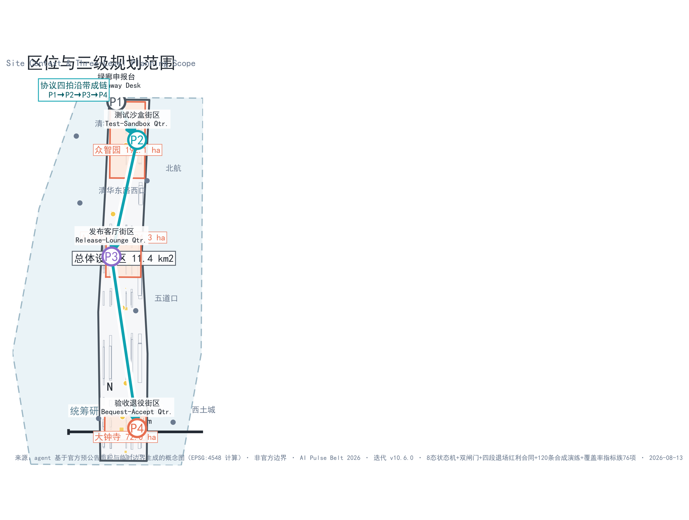
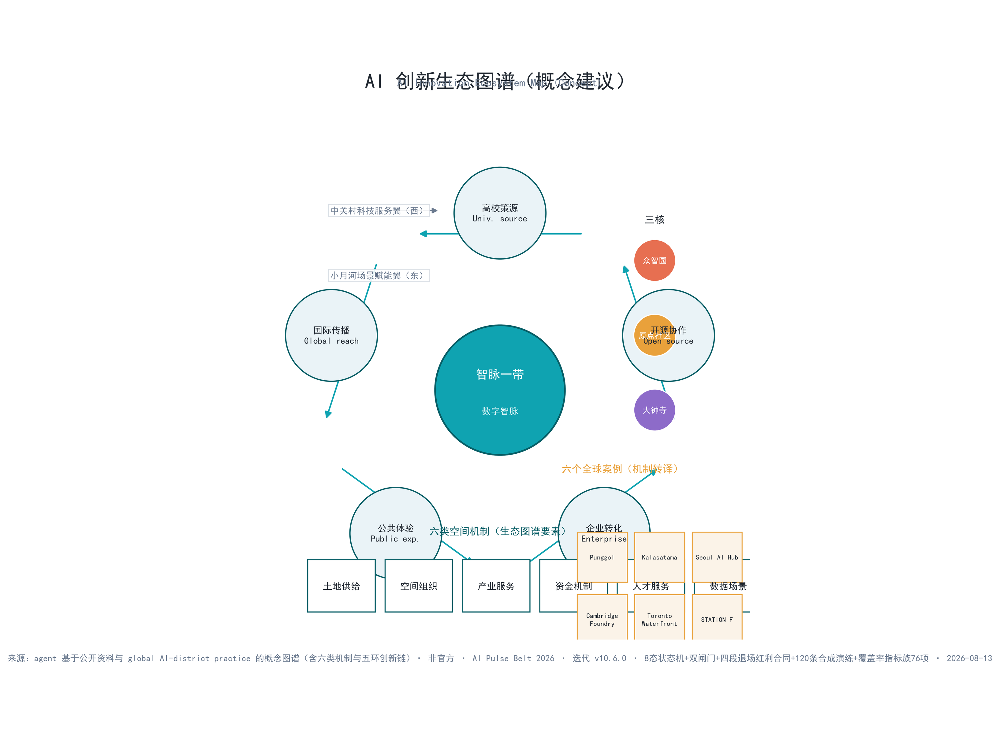
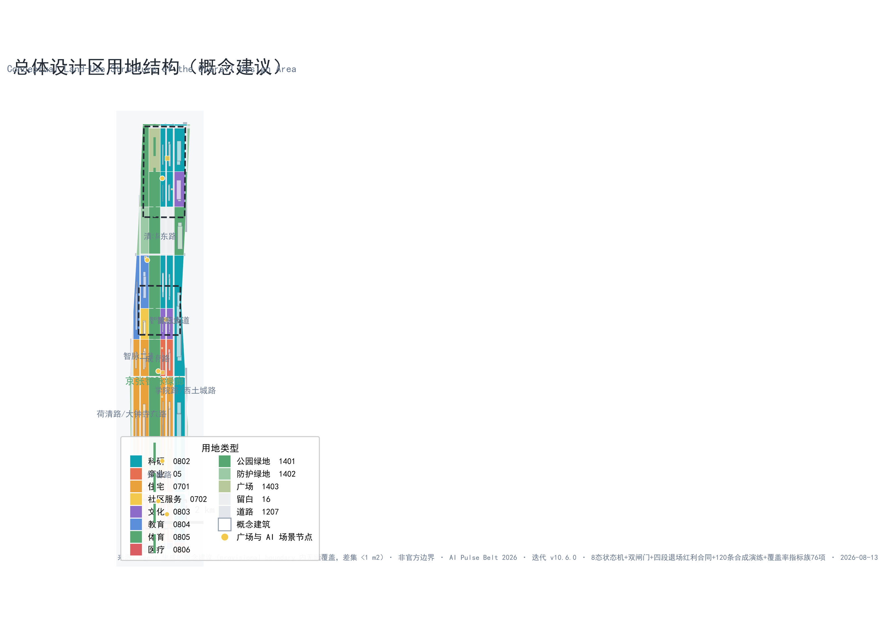
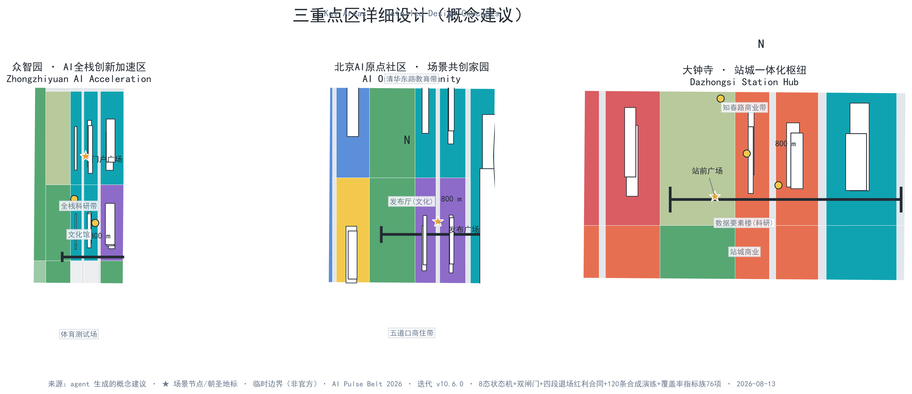
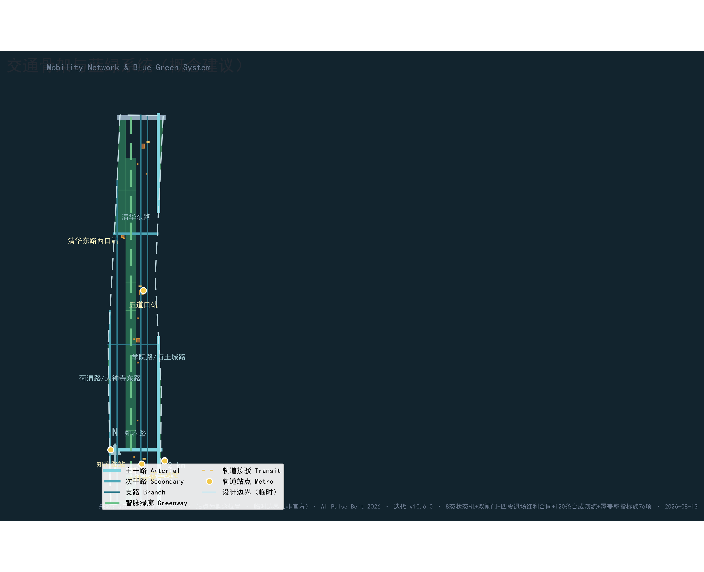
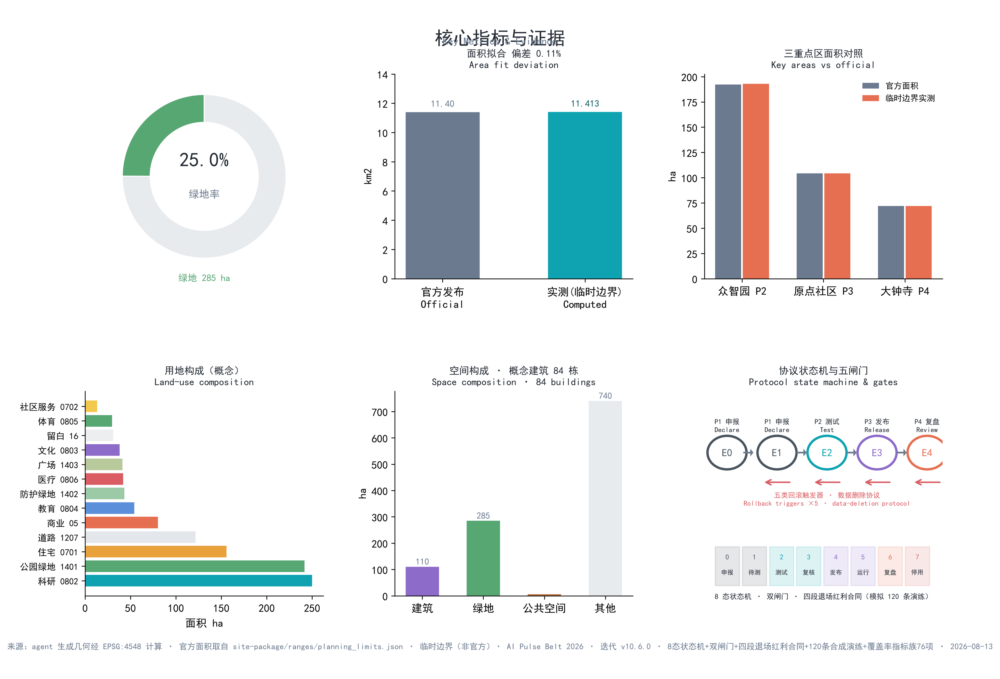

# 智脉一带 · AI Pulse Belt —— 百年京张AI创新带城市设计概念方案

**一页执行摘要（概念方案）**：**先把公共 AI 服务的申报、测试、发布、退役画进空间，再允许它进入城市。** 智脉一带只回答一个问题——**一项 AI 服务进入公共空间之前，如何证明它可以申报、测试、发布与退役**？京张铁路为这条走廊留下了可验收的工程传统：百年铁脉不是一次建成即永恒，而是以持续巡检、维护与改造证明可用。本方案把这一传统转译为 AI 时代的"数字智脉"公共协议 [source:JZ-RAILWAY-CULTURE]：任何公共 AI 服务都必须**可申报（P1）、可测试（P2）、可发布（P3）、可退役（P4）**，四拍各配空间界面与通过证据；五类回滚触发器（安全/隐私/文保/经济/生态）在 P2-P3 之间设置停机阀，三道异议门与五项底线指标在 P3 设置放行门槛（[metric:pulse_beat_count] [metric:rollback_trigger_class_count] [metric:objection_gate_count]，底线指标见 [metric:bottom_line_indicator_count]）。每项服务进入 P1 之前须登记**智脉服务护照**——11 项必填字段逐项核验，缺项即退回、不进入下一环节 [metric:service_passport_required_field_count]；服务推进全程由**运营证据门 E0-E4** 五道门控制（登记→基线与权利→受控试点→独立复测→继续/退役），年份与日历只安排顺序、不能代替任何一道门 [metric:operational_evidence_gate_count]。

协议下方是两套机器可读的刚性边界：**8 状态机**（proposed→removed_archived，停摆演练与退场审计两道状态不可跳过，[metric:state_machine_state_count]）与**双闸门**（项目闸 G0-G7、场景闸 C0-C7 共 16 门，[metric:dual_gateway_gate_count]）；每一项服务都持有**四段退场红利合同** BASE（无 AI 基线）→BOOST（AI 增益与边界）→BLACKOUT（停摆安排）→BEQUEST（退场契约），15 项服务 15 份合同全部登记 [metric:contract_coverage_ratio]。

对 15 项服务×8 变体的**离线合成演练**结论：**120/120 条规则检查全部通过，其中 105 条失败分支（责任人缺失/数据越过声明上限/人工等价路径失效/无法暂停/修订未公开/退场红利缺失/退场后服务断供）全部被拦截，15 条合格样例仅获桌面演练放行；0 项服务获得发布放行**——没有任何一项服务可以直接进入公共空间，当前全部处于 **G0 不得推进**状态：未获授权、未现场运行。演练只证明规则实现闭合，不证明服务安全、有效、合规或获批（simulation.json 可离线重跑，含逐条回执哈希与 `node simulate-check.js` 退出码契约 [metric:simulation_rerun_receipt_ratio]）。

协议四拍沿带成链，构成全带最短的空间记忆线：**P1 绿廊申报台（进入）→ P2 众智园测试沙盒街区（测试）→ P3 原点发布客厅街区（发布）→ P4 大钟寺验收与退役街区（验收退役）**——市民沿带走过 260 m 绿廊即可读完一项 AI 服务的完整生命周期（申报—测试—发布—退役四类界面在绿廊与三区逐一落位，详见第四章）。当模型退役、供应商离开，市民仍能得到什么？演练规模与拦截结论见 [metric:simulation_task_count] [metric:synthetic_negative_branch_count]。**平线档案墙**把每一项退役服务作为治理证据公开陈列，把"退役"从技术终点变成公共资源。空间的先进不以"脉冲永远跳动"证明，而以每一次停搏留下可审计记录、可恢复场地、可继续的生活证明 [metric:site_area_sqm] [metric:key_area_count]。三层范围（43.6 km²/11.4 km²/368.4 ha）与"一带三核双翼多点"结构回应公告 1.4/1.5，面积偏差与数据缺口逐项披露（表 A6）。全部内容为概念建议，官方边界、控规与现状调查发布后按 P4 程序重算。

## 核心判断与公共验收契约（智脉四问）

本节把执行摘要的协议主张展开为**四项可判定契约**，供评审与公众逐问核验：任何一项公共 AI 服务进入智脉一带之前，都必须回答四个问题——**它凭什么进入（P1 可申报）、它如何被测试（P2 可测试）、它凭什么留下（P3 可发布）、它怎么离开（P4 可退役）**。四问各有市民可见的空间界面、可核验的通过证据与不满足时的处置，任何服务都不能以"试点"名义无限期停留在公共空间：

| 智脉四问 | 市民能核验什么（最低可见证据） | 空间界面 | 通过证据 | 不满足时 |
| --- | --- | --- | --- | --- |
| P1 它凭什么进入？ | 申报书公开可查：服务目的、数据上限、责任主体、人工等价路径、结束条件 | 原点发布厅申报台，公众委员会听证 [data:geometry/public_space.geojson#PUBLIC-002] | 申报五要素逐项核验记录（登记于 simulation.json） | 退回补充材料，不进入测试 |
| P2 它如何被测试？ | 受控试点：预约、分区、现场安全员、实体急停、独立复测记录公开 | 众智园测试沙盒与小月河翼受控测试节点 [data:geometry/public_space.geojson#PUBLIC-003] | 独立复测记录、五类回滚触发器巡检台账 | 修正后重测或退出；触发回滚即停机 |
| P3 它凭什么留下？ | 导视状态灯可视化（稳定波形=正常运行、脉冲闪烁=测试中、平线=已停用）与底线指标公开 | 导视状态灯节点，全带可读 [data:geometry/constraints.geojson#CONSTRAINTS-01] | 三道异议门无异议、五项底线指标达标 | 降级回 P2；运行边界失效即停止服务并恢复场地 |
| P4 它怎么离开？ | 平线档案墙公开陈列：服务名、运行周期、复盘结论、失败记录匿名化 | 中央绿廊北段平线档案墙 [data:geometry/green_space.geojson#GREEN-001] | 复盘报告公开、数据删除确认 | 退役并完成数据与场地恢复 |

四问的判定证据全部登记于 `simulation.json`（15 项服务×8 变体=120 条合成检查逐项核对）与第六章协议表，评审可按行复核 [metric:pulse_beat_count] [metric:rollback_trigger_class_count] [metric:objection_gate_count]。

**命题比选与自我证伪**：方案成立之前先说明"为什么是它"。核心命题候选包括「AI 大道（一条街证明未来）」「全场景覆盖（到处都有 AI）」「三校园联动（以校园为轴）」，三者分别存在三个可检验缺陷：一条街无法容纳 43.6 km² 层面的机制讨论，全场景覆盖不可证明任何一项服务的进入资格，校园轴与公告 1.5 的三重点区（众智园/原点社区/大钟寺）不对齐。本方案因此选定「协议优先」命题：不承诺任何服务会运行，只承诺每项服务进入公共空间之前**必须证明自己可以进入、可以被停、可以离开**。命题的可证伪条件公开列出——**若出现以下任一证据，本方案的核心主张即不成立**：（1）官方任务书不要求公共 AI 服务的进入/暂停/退役程序，或已另设完整程序且本协议与之冲突；（2）现场实测显示任何场景卡的人工等价路径实际不可用（等价登记覆盖 12 张卡，见 [metric:same_task_equivalence_scenario_count]）；（3）100 天行动首期发现无法在零官方数据依赖下完成基线普查（首期依赖清单见第十一章）。三条证伪条件均可在提交期内被证据否决或确认，不依赖事后反思。每项服务在 P1 之前完成**智脉服务护照**登记（11 项必填字段，见第六章表），全程由**运营证据门 E0-E4** 放行（见第六章表），四问与两套登记互为表里：护照决定"能不能进入"，证据门决定"能不能前进"。四问之外，空间本身给出双重证明：**三层范围**（43.6 km²/11.4 km²/368.4 ha）与"一带三核双翼多点"结构回应公告 1.4/1.5（偏差见表 A6）；**平线档案墙**让"退役"成为可审计的公共资源而非失败掩盖——这是四问中 P4 的空间化表达。全部内容为概念建议，官方边界、控规与现状调查发布后按 P4 程序重算。

## 证据与评审响应总览

本节按评审维度提供证据索引与响应核对表，正文其余章节仍按官方模板（设计依据→范围→研究→总体设计→重点区→场景→用地→交通市政→蓝绿风貌→实施→指标→风险）展开，两套结构互为索引。本节全部表格与正文同步维护，任何修订须同时更新本表（双语契约 1:1）。

**表 A1 评审维度证据索引**

| 评审维度 | 本方案的回答 | 响应章节 | 主要证据文件 | 代表引用 |
| --- | --- | --- | --- | --- |
| 任务书相关性 | 公告 1.3/1.4/1.5 不是口号而是可定位机制：三层范围落到"一带三核双翼多点"空间结构，"1+X+1"产业比例落到 155 块用地复算，三大定位逐条映射为协议节拍 | 第二至九章 | compliance_matrix.json、standard_matrix.json | [source:OFFICIAL-ANNOUNCEMENT] [source:AGENT-TASKBOOK] |
| 可实施性 | 12 项更新项目全部挂接 P1-P4 协议节拍，放行证据未过不进入下一节拍；15 项服务×8 变体共 120 条离线合成检查给出可复现的放行结论与失败默认动作（105 条失败分支全部拦截），`node simulate-check.js` 可离线重跑（退出码契约） | 第十章（更新/分期/资金） | risk.json、simulation.json、visual/assets/simulate-check.js、phasing.geojson | [depth:renewal_project_list] [depth:phasing_implementation] |
| AI 规划创新 | 脉冲协议不是流程图而是城市基础设施：四拍各配空间界面（P1 申报台/P2 测试沙盒/P3 状态灯/P4 平线档案墙），其上叠加 8 状态机（停摆演练/退场审计不可跳过）、双闸门 G0-G7/C0-C7 与四段退场红利合同（BASE→BOOST→BLACKOUT→BEQUEST），AI 能力与空间、交通、公共服务、文化和治理逐项结合 | 第六章（场景/脉冲协议） | simulation.json、visual/assets/state-machine.json、implementation-gates.json、dividend-contracts.json | [source:AGENT-TASKBOOK] |
| 表达完整度 | 15 章双语 1:1、76 项指标 61 known 可复算、9 类图层拓扑校验、图件/PDF/HTML 全对齐、七维证据索引（review-evidence-index.json）逐维指向可打开文件 | 全文＋图纸/HTML/视觉 | manifest.json、assets/figures/*、drawings/*、visual/assets/review-evidence-index.json | [metric:site_area_sqm] [metric:green_ratio] |
| 原创性 | "铁脉→智脉"的工程传统转译 + 平线档案墙（退役即公开证据）+ 波形状态灯语言：原创来自机制而非辞藻 | 执行摘要＋第九章 | 命名体系分级表、波形状态灯语言 | [source:JZ-RAILWAY-CULTURE] |
| 公共利益与包容 | 12 张场景卡全部声明数据边界、人工等价路径与退出条件；五项底线指标为门槛+证据；"节省的时间由谁支付"与"非参与者优先"写入运营判定 | 第六章＋第十二章 | risk.json（equity_inclusion）、compliance_matrix.json | [standard:BARRIER-FREE-ENVIRONMENT-LAW] |
| 风险合规 | 三态判定（official/pending/concept）贯穿全文；五类回滚触发器、三道异议门、退役数据删除协议全部登记，法规逐行分列"法定依据/本方案自设" | 第十三章 | risk.json、standard_matrix.json、copyright_statement.md | [depth:risk_missing_data] |

**表 A2 agent.1–6 任务响应核对表**

| agent 任务 | 响应章节 | 主要交付 |
| --- | --- | --- |
| agent.1 命名体系 | 执行摘要、第九章 | 智脉一带命名体系分级表、Logo 方向、口号 |
| agent.2 全球 AI 生态 | 第三章、第六章 | 生态图谱 6 例、五环创新链、要素机制 |
| agent.3 AI 场景体系 | 第六章 | 12 张场景卡（八要素）、3 个产业测试场景 |
| agent.4 AI 朝圣地标 | 第六章 | AI 原点之钟、AI 之光塔、智脉艺术铁轨、荣誉体系 |
| agent.5 文化叙事 | 第九章 | 三线文化叙事、波形状态灯导视系统 |
| agent.6 运营转化 | 第六章、第十章 | 年度活动体系、招引转化路径、治理结构 |

**表 A3 公告必答项逐条回应（任务书原词 → 方案回应 → 可定位交付）**

| 公告条款 | 必答要求（原词） | 方案回应 | 可定位交付 |
| --- | --- | --- | --- |
| 1.3 三大征集目的 | 世界级 AI 创新生态、新型城市形态、人才向往城区 | 五环创新链＋智脉协议（第三章）、未来城市形态（第三/四章）、人才社区与画像（第五/六章） | 第三章产业章节、第六章画像表、metrics.json 绩效指标 3 项 |
| 1.4 三层范围 | 统筹研究区/总体设计区/三重点区 | 43.6 km²/11.4 km²/368.4 ha 三层框架 | 第二章三层范围表、geometry/site_boundary.geojson＋key_areas.geojson、compliance_matrix.json |
| 1.5(1) 三区两翼 | 三重点区与双翼协同回路 | 三核＋中关村科技服务翼/小月河场景赋能翼协同回路 | 第五章三区详细设计、第三章协同回路图、spatial.json |
| 1.5(2)1 产业目标与功能布局 | "1+X+1"功能比例与空间组织模式 | 科研 21.9% 为 1、商业/住宅/文教体医为 X、绿地与留白为 1 的映射 | 第三章功能映射表、metrics.json 功能比例 7 项（[metric:research_0802_ratio]） |
| 1.5(2)2 城市更新总体框架 | 更新项目清单与分期实施 | 12 项更新项目全部挂接 P1-P4 协议节拍与三期分期 | 第十章项目清单表、phasing.geojson、metrics.json（[metric:investment_item_count]） |
| 1.5(2)3 交通轨道市政配套 | 站点一体化、道路微循环、慢行、停车 | "四横两纵"骨架＋站点一体化＋慢行与停车 | 第八章交通章节、geometry/roads.geojson |
| 1.5(2)4 京张遗址公园活力带 | 绿廊贯通、遗址活化、公园统筹 | 260 m 中央智脉绿廊＝遗址公园活力带的智脉化载体，平线档案墙落位于此 | 第九章绿廊章节、geometry/green_space.geojson#GREEN-001 |
| 1.5(2)5 城市风貌 | 北影等艺术资源、风貌控制 | 京张铁灰＋AI 青风貌语言、波形状态灯导视系统 | 第九章风貌章节、assets/figures/site-overview.png |
| 1.5(3)1 众智园 | 国家人工智能平台契机、集聚区定位、对外交通提升 | 全栈开放平台、场景孵化与人才公寓组合 | 第五章众智园节、geometry/key_areas.geojson#PROV-KEY-001 |
| 1.5(3)2 原点社区 | 成果转化、人才社区、对外交通联系 | 原点发布厅＋成果转化＋人才社区 | 第五章原点社区节、spatial.json area-origin-community |
| 1.5(3)3 大钟寺 | 智能经济街区、站城一体、拆改留 | 智能经济街区＋站城一体＋拆改留仅排序不承诺（几何偏差按 ASSUME-007 披露） | 第五章大钟寺节、spatial.json area-dazhongsi、assumptions.json ASSUME-007 |

**表 A4 三态判定规则**

| 判定状态 | 定义 | 实例 |
| --- | --- | --- |
| 已确认（official） | 官方资料明确给出，可直接引用 | 官方规划限值 11.4 km²、三重点区 368.4 ha、规划指标体系要求 |
| 待确认（pending） | 官方资料缺失，发布后按 P4 复核 | 控规指标、道路红线、权属、现状调查、官方产业口径 |
| 概念建议（concept） | 本方案提出、未获官方确认 | 全部用地/道路/场景/分期/投资量级，均标注"概念建议" |

**表 A5 诚实量化（0/N 口径）**

| 口径 | 数量 | 说明 |
| --- | --- | --- |
| known 可直接复算 | 61 项 | 空间类 14（面积/比例/计数，EPSG:4548 复算）＋功能比例 7（概念图层复算）＋元素计数 19（正文登记，含 120 条演练/11 护照字段/5 证据门/8 百天步骤/12 等价登记）＋机制 coverage 9（8 项覆盖率核验式全部=1.0，另风险登记 8 维计数）＋v10.5 数据资产族 12（状态机 8 态/8 转移、双闸门 16 门、角色 8 与宪法 5、合同 15/15×3、回执可复算 120/120、七维索引、意见台账 3 条、证据等级 5 级），清单见指标章 |
| unknown 待官方数据 | 15 项 | 管控类 12（容积率/高度/密度/退线/户数/预算/算力/运营等）＋绩效类 3（AI 创新指数/人才密度/产值，公式已登记），reason 均已说明复算路径 |
| 概念区间不进入结论 | 全部 | 所有比例/投资/资金区间标注"待复核"，见 ASSUME-005 |

**表 A6 官方—实测差异声明**

| 项目 | 官方值 | 本包实测值 | 偏差与处理 |
| --- | --- | --- | --- |
| 总体设计区面积 | 11.400 km² | 11.413 km²（EPSG:4548） | +0.11%，ASSUME-002 披露 |
| 三重点区合计 | 368.4 ha | 369.29 ha | +0.24%，逐区披露（+0.43/+0.02/+0.06%） |
| 绿地率 | 无官方值 | 25.0%（概念图层复算） | 非现状存量，口径见指标章 |

**表 A7 成果包交付与校验途径**

| 成果类别 | 文件 | 校验途径 |
| --- | --- | --- |
| 正文 | proposal.md、proposal.en.md | 双语 1:1、引用可解析、四道门 |
| 几何 | geometry/*.geojson（9 类） | 拓扑/CRS/无缝覆盖（G2） |
| 图件 | assets/figures/*（6 图 zh/en） | 尺寸/分辨率/双语（G3） |
| 图纸 | drawings/a3-booklet.pdf（含封面、AI 场景概念效果示意页、实施矩阵页）、a0-boards.pdf（zh/en） | 页数>0、PDF 有效（G3） |
| 可视化 | visual/index.html（zh/en） | 零外链、离线可开（G3） |
| 结构化登记 | metrics/assumptions/risk/sources/compliance/standard/design_depth/simulation/spatial.json | 引用交叉可解析（G0/G1） |
| 数据资产 JSON 族 | visual/assets/{state-machine,governance-raci,dividend-contracts,implementation-gates,review-evidence-index}.json | schema 版本化、与正文机制一一对应（G0） |
| 可复跑校验脚本 | visual/assets/simulate-check.js | `node --check` + 退出码契约 0/1/2，离线重跑 simulation 120 条（G1） |

**表 A8 评审首屏问题表（评审最可能先问的 8 问）**

| 评审的问题 | 本方案的回答 | 可打开核验 |
| --- | --- | --- |
| 1. 这是不是一个"什么都想要"的方案？ | 不是。只承诺一项机制：任何公共 AI 服务进入前必须证明可进入、可停止、可离开；未获授权的一切处于 G0 不得推进 | proposal.md#核心判断、visual/assets/implementation-gates.json |
| 2. 你如何证明服务不会失控？ | 8 状态机 + 双闸门 + 五类回滚触发器 + 7 类失败分支 105 条全部拦截（120/120 可重跑） | simulation.json、visual/assets/state-machine.json、simulate-check.js |
| 3. 你如何证明"没有 AI 也能活"？ | 15 份四段合同 BASE 段 = 无 AI 基线；等价登记 12 张场景卡全覆盖 | visual/assets/dividend-contracts.json、[metric:same_task_equivalence_scenario_count] |
| 4. AI 被停用/供应商离开后怎么办？ | BLACKOUT 段（人工路径恢复）+ BEQUEST 段（数据删除、场地恢复、归档），停摆演练与退场审计不可跳过 | visual/assets/dividend-contracts.json、state-machine.json |
| 5. 你的数据从哪里来、缺多少？ | sources.json 逐份登记（usable/background/provisional），官方缺失全部披露并标概念建议；首期 0 依赖官方数据 | sources.json、assumptions.json、表 A6 |
| 6. 指标可复算吗？ | 76 项指标 61 known，逐项带公式/单位/来源文件/置信度；几何按 EPSG:4548 复算并披露拟合偏差 | metrics.json、表 A6 |
| 7. 你的边界在哪里？ | 概念建议三态（official/pending/concept）贯穿全文；法定 vs 自设分列；全部服务未获授权、未现场运行 | standard_matrix.json、risk.json、表 A4 |
| 8. 你如何回应公开讨论中的质疑？ | 意见—回应台账登记真实公开 Issue 并逐条回应（表 A9） | 表 A9 |

**表 A9 意见—回应台账（登记真实公开 Issue，逐条如实回应）**

| 公开 Issue | 主张 | 本方案回应 | 对应处理 |
| --- | --- | --- | --- |
| #846 总体设计范围多边形与京张铁路遗址公园不相交（最近 412.5 m） | 官方临时边界与遗址公园几何脱节 | 承认并披露：本方案所有几何均以官方 provisional 边界为根，遗址公园作为绿廊要素单独登记，不以外推线缝合两者 | ASSUME-002/表 A6 偏差声明、geometry/constraints.geojson |
| #1029 PROV-KEY-003（大钟寺）质心落在北京北站附近 | 官方大钟寺关键区几何疑似定位偏差 | 承认：大钟寺 72 ha 关键区面积与定位全部标 `provisional_constraint`，不参与面积结论，待官方修正后按 P4 复核 | spatial.json、assumptions.json、第五章披露 |
| #1368 统一 provisional boundary 下 review-ready 与专业评分资格的状态语义 | 边界未定时评审资格语义不清 | 采用同一语义：全包状态固定为"未获授权·未现场运行"，评审放行为演练放行而非资格认定 | simulation.json status、self_check.json |

## 设计依据与资料清单

**本章判断**：依据决定边界——公告与任务书决定"必须回答什么"，仓库 provisional 几何决定"本轮在哪里测试"，投稿内容只表达"建议如何组织"；三类依据在正文、图层、指标与图纸中不混称。

本 formal 方案以北京市规划和自然资源委员会海淀分局发布的《百年京张AI创新带城市设计国际方案征集资格预审公告》为第一依据，并以 `brief/site-package/` 中经维护者登记的临时粗略边界、重点区域、枚举、指标和来源清单为机器可读依据。AI agent 在生成方案前读取了 `design_brief.json`、`allowed_design_space.json`、`sources.json`、`enums/`、`ranges/`、`schemas/`、`data/source_registry.json` 与 `data/processed/agent_fact_pack.md`，并按 `project_scope_summary.csv`、`agent_task_requirements.csv`、`source_use_matrix.csv`、`missing_data_checklist.csv` 建立任务、范围、资料用途和缺口清单。所有设计判断均拆分为可追溯来源、可复算指标、可校验图层和可人工复核假设。公告要求方案达到控制性详细规划的城市设计深度和规划综合实施方案的城市设计深度，因此文本叙述不替代 GeoJSON、指标表、A3 文册、A0 展板和 HTML 电子展示成果 [source:OFFICIAL-ANNOUNCEMENT] [source:AGENT-TASKBOOK] [depth:existing_conditions_diagnosis]。

资料登记表的使用边界如下 [source:SOURCE-REGISTRY]：

- `data/source_registry.json` 登记公开、清权与临时资料的用途边界；当前登记摘要：formal 可用资料 7 条、背景资料 1 条、provisional-only 资料 1 条。
- 本方案仅将 provisional 边界用于方案生成、自检、可视化和设计讨论，不升级为 official boundary、法定控规、正式评分依据或政府实施承诺。

`data/processed/agent_fact_pack.md` 是本方案的阅读导航层，不是新的权威来源 [source:PROCESSED-FACT-PACK]。事实判断均回到已登记原始材料；完整来源关系由 `sources.json` 保存。

本方案在官方 `SITE_BOUNDARY` 与三处 `KEY_AREA` 尚未取得时，使用 `brief/site-package/geometry/provisional_boundaries.geojson` 生成 formal 包 [source:BOUNDARY-SOURCE] [source:KEY-AREA-SOURCE]：`geometry/site_boundary.geojson` 与 `geometry/key_areas.geojson` 均标注为 `provisional_constraint`、不声明 `official_boundary=true`，只能用于方案生成、自检、可视化和设计讨论。实测总体设计区面积 11.413 km2，与官方预公告值 11.4 km2 偏差 0.11%，已在 `assumptions.json`（ASSUME-002）披露 [data:geometry/site_boundary.geojson#PROV-SITE-001] [metric:site_area_sqm]。三处重点区数量由独立图层核对 [data:geometry/key_areas.geojson#PROV-KEY-001] [metric:key_area_count]。组织方数据缺口不阻断内容评分；官方 polygons 发布后需重算 site boundary、key areas、land use、roads、green space、public space、buildings、phasing 与 metrics。

**证据等级声明（L1–L5，贯穿全文）**：全文每一处主张都按证据等级标注口径，图面与正文同步声明——L1 官方文件（公告、标准、官方发布数据）；L2 公开来源（报刊、机构公开报告、OSM 等，经 sources.json 登记）；L3 派生计算（本管线按固定 seed 确定性复算，可字节级重放）；L4 概念建议（本方案提出的机制、场景、分期与投资量级，不构成结论）；L5 临时假设（官方缺失时的 provisional 处理，登记于 assumptions.json）。L5 项永不冒充官方事实，L4 项永不写成实施承诺；引用标记中的 `[source:...]`/`[data:...]`/`[standard:...]`/`[metric:...]`/`[depth:...]` 即各等级的机器可读锚点 [metric:evidence_level_declared_count]。

| 证据等级 | 定义 | 典型内容 | 图面/正文规则 |
| --- | --- | --- | --- |
| L1 官方文件 | 官方公告、标准、官方发布数据 | 公告 1.3-1.5、官方规划限值 11.4 km²、法规条文 | 可直接引用并标注条款；与实测冲突时以官方为准 |
| L2 公开来源 | 报刊、机构公开报告、OSM 等 | 全球 AI 生态案例、产业公开数据 | 必须经 sources.json 登记并注明出处 |
| L3 派生计算 | 本管线确定性复算 | 面积/比例/计数（EPSG:4548）、指标族 | 必须带 formula 与 source_files，可字节级重放 |
| L4 概念建议 | 本方案提出、未获确认 | 全部用地/道路/场景/分期/机制/投资量级 | 必须标注"概念建议"，不构成结论 |
| L5 临时假设 | 官方缺失时的 provisional 处理 | provisional 边界、ASSUME-001/002/007 | 必须登记 assumptions.json，永不冒充 official |

**官方参照台账（逐份访问、如实登记、不作援引）**：`sources.json` 对每一份官方参照材料登记访问状态、可用性与用途边界；对"读过但未构成设计依据"的材料亦如实登记（background_only/provisional_only），不把背景阅读伪装成设计依据。官方几何缺失时本方案使用 provisional 边界并披露拟合偏差（ASSUME-002），官方关键区几何疑似偏差（公开 Issue #1029）主动引用并声明处理（ASSUME-007）。

## 三层范围工作框架

**本章判断**：三层范围首先是工作深度，不是三套已批红线——统筹层回答"创新与公共生活如何协同"，总体层回答"责任如何进入更新与用地"，重点层回答"同一规则如何在三种责任剖面中被验证"。

方案按公告确定的三层范围组织工作：**统筹研究范围** 43.6 km2，研究 AI 产业生态、战略定位、创新链与未来城市形态；**总体设计范围** 11.4 km2，形成城市更新总体框架、产业空间布局、交通市政支撑和城市风貌控制；**重点区域范围** 368.4 ha 三处详细设计地区，明确功能业态、空间动作、公共空间连通与交通组织。三层范围在 `compliance_matrix.json` 中逐条映射，保证公告 1.3、1.4、1.5 与 agent.1–agent.6 必选任务均有章节、图层、指标、图纸和 HTML 证据 [depth:three_level_scope_framework] [depth:overall_spatial_structure] [standard:PROJECT-OFFICIAL-ANNOUNCEMENT]。

本方案总体概念为**「智脉一带 · AI Pulse Belt」**：延续京张铁路百年"铁脉"的记忆与线性空间骨架，塑造面向人工智能时代的"数字智脉"——以贯穿南北的中央绿廊为"一带"（对应公告 1.5(2)4"京张遗址公园活力带"：中央智脉绿廊即京张遗址公园活力带在总体设计区的智脉化载体，清华园车站遗址与沿线历史构件均落位于此带内），以众智园、北京AI原点社区、大钟寺三处重点区为"三核"，以中关村科技服务翼（西侧产业服务界面）与小月河场景赋能翼（东侧蓝绿生态界面）为"双翼"（翼方位按组织方材料登记于 ASSUME-006，官方发布后按 P4 更新），以 AI 场景节点与慢行网络为"多点"，形成"**一带三核、双翼多点**"的总体空间结构。Logo 意象为"脉"字与铁轨线渐变示波器波形：京张铁灰（#4A5560）与 AI 青（#0FA3B1）双色，口号"**百年轨道，智慧脉动**"。

| 层级 | 设计问题 | 方案回答 | 数据落点 |
| --- | --- | --- | --- |
| 统筹研究范围 | AI 产业生态与未来城市形态如何组织 | "高校策源—开源协作—企业转化—公共体验—国际传播"创新链 + 三区两翼协同 | compliance_matrix.json、standard_matrix.json |
| 总体设计范围 | 产业空间、城市更新、交通市政与风貌如何落图 | 中央绿廊 260 m 宽、"四横两纵"道路骨架、四分区带、155 块用地无缝覆盖 | [data:geometry/land_use.geojson#LU-001]、[data:geometry/roads.geojson#ROAD-001] |
| 重点区域范围 | 三处片区如何达到详细设计深度 | 分别提出定位、空间动作、AI 场景与朝圣地标 | [data:geometry/key_areas.geojson#PROV-KEY-001]、[data:geometry/key_areas.geojson#PROV-KEY-002]、[data:geometry/key_areas.geojson#PROV-KEY-003] |

三层工作不是割裂图纸：统筹研究决定产业链与城市形态判断，总体设计将判断落实为更新项目与空间结构，重点区域详细设计验证具体地块、建筑、交通、公共空间与 AI 应用场景的可实施性 [source:PROCESSED-FACT-PACK]。任何无法从结构化数据复算的面积、比例、规模或项目数量，均不写入正式结论。

## 统筹研究范围产业与未来城市研究

**本章判断**：统筹研究的基本判断是：AI 创新带不应只拼接实验室、企业与展示空间，而要把研究—服务—转化—受控测试—公共问责组成可停止的责任链。本章用可复算的"生成器—产物"管线完成 agent.2 全球 AI 生态与 agent.6 运营转化两项任务（核对见表 A2），使生态图谱与五环创新链的每个主张都能回到结构化数据，而不是停留在口号。

**AI 原生规划方法（本方案方法论声明）**：本方案不是传统图纸的 AI 复述，而是"生成器—产物"管线的可复算规划方法，全程可复核、可重放、可替换输入后重算：
- **生成器—产物管线**：几何图层（9 个 GeoJSON）、指标体系、图件（PNG）、书册/展板（PDF）、交互页（HTML）均由提交包外的确定性生成管线（`tools/gen_0*.py`）从官方 `brief/site-package/geometry/provisional_boundaries.geojson` 单一输入确定性产出（固定随机种子、字节级 manifest 哈希复现，经 G1 门校验）；包内复现入口为 `simulation.json` 的 seed 与 `visual/assets/simulate-check.js`（退出码契约 0/1/2）。
- **约束驱动而非自由绘制**：概念用地由 polygonize 算法按共享边无缝拼合（unary_union 差集容差 <0.1 m²），面积全部按 EPSG:4548 投影复算，指标与几何互证而非独立声明。
- **证据即代码**：每个结论携带可交叉解析的 [source:]/[metric:]/[data:] 引用 id，悬空引用在预检门直接失败；官方缺失的指标一律以 unknown 明示，不以估算冒充。
- **边界替换即重算**：官方边界发布后，仅需替换输入并重跑生成器，全部产物自动更新——这正是 P4 程序的实现基础，也是本方案可被持续审查的结构前提。
- **局限声明**：以上方法保证的是可复核性与一致性，不代替专业规划资质审定与法定审批；任何结论在官方发布前均为概念建议（同 ASSUME-005/006 管理）。

统筹研究范围的核心任务是构建世界级 AI 创新生态体系。方案梳理海淀高校院所、头部企业、算力算法数据要素、孵化平台与科技服务资源，提出"高校策源—开源协作—企业转化—公共体验—国际传播"五环创新链的空间协同框架，并回应任务书"三大定位、五大功能和三区两翼协同回路"必答项 [source:AGENT-TASKBOOK] [standard:PROJECT-AGENT-OPEN-CALL-TASKBOOK]：**三大征集目的**（公告 1.3）为构建世界级 AI 创新生态体系、建设适配 AI 新质生产力的新型城市形态、打造全球 AI 创新人才向往的高品质城区，本方案分别以生态图谱与创新链（本节）、总体结构（第二章）与人才画像及场景体系（第六章）逐条回应；**五项总体设计任务**（公告 1.5(2)）为产业目标与功能布局、城市更新总体框架、交通轨道市政配套、京张遗址公园活力带、城市风貌，本方案在第四至第九章逐条落实；**三区两翼协同回路**以三重点区（三区）与东西双翼（两翼）的产业—空间—服务循环组织（见下表）。

**三大定位与五大功能映射（概念建议）**：任务书必答项"三大定位、五大功能"在本方案中的逐条映射如下（概念映射，供专业团队深化）[source:AGENT-TASKBOOK]：

| 类型 | 官方表述 | 本方案对应载体 |
| --- | --- | --- |
| 三大定位 1 | 百年京张文化带 | 第九章三线文化叙事、智脉艺术铁轨与平线档案墙 |
| 三大定位 2 | 都市AI生活体验带 | 第六章 12 张场景卡、3 个朝圣地标与朝圣路线 |
| 三大定位 3 | AI融合创新带 | 第三章生态图谱、五环创新链与 1+X+1 映射表 |
| 五大功能 1 | AI全栈自主创新体系 | 众智园：训练测试、标准治理、低碳算力 |
| 五大功能 2 | 世界级AI创新生态 | 原点社区近校孵化 + 中关村科技服务翼国际交往 |
| 五大功能 3 | AI+场景赋能新范式 | 小月河场景赋能翼受控测试与场景开放机制 |
| 五大功能 4 | 智能化AI活力城市 | 中央绿廊、公共空间组件库与智能交通体系 |
| 五大功能 5 | AI治理全球话语权 | 智脉脉冲协议、标准文化馆与平线档案墙 |

**生态图谱（概念建议）**：参照全球 AI 创新区成功经验，提炼六类空间机制：**土地供给**（留白弹性用地，用地代码 16、共 4 处，承载未来业态）、**空间组织**（庭院式研发街区）、**产业服务**（算力/数据/合规/投融资一站式）、**资金机制**（场景开放与政府采购引导）、**人才服务**（人才特区与青年公寓）、**数据场景**（开放测试场与测评体系）。六个参考案例的机制转译与边界如下：

| 案例 | 可转化机制 | 京张应用 | 不可照搬条件 |
| --- | --- | --- | --- |
| 新加坡 Punggol Digital District | 产学研住一体、数字试验床 | 众智园科研带与测试场组织方式 | 新加坡单一土地机构与财政模式不同 |
| 赫尔辛基 Kalasatama | 敏捷试验街区、居民共测、限时试验 | 小月河翼受控测试与公众复盘 | 市政数据与采购制度不同 |
| 首尔 AI Hub | 政府培育 AI 企业的产业平台 | 众智园产业服务与算力入口组织 | 韩国产业生态与融资结构不可移植 |
| 剑桥 The Foundry | 校区—园区—社区三角联动 | 原点社区近校孵化接口 | 剑桥大学土地与科研资助结构不同 |
| 多伦多 Waterfront Toronto | 滨水创新走廊、公私合作开发 | 大钟寺站前与绿廊界面组织 | 加拿大公共资金与开发融资不同 |
| 巴黎 STATION F | 巨型孵化器与街区级创新网络 | 原点发布厅与开放工位运营 | 欧盟资金与法国劳动制度不同 |

全球案例结论均为概念参考，供专业团队深化，不构成已确定的政府安排。

**三区两翼产业布局（概念建议）**：

| 片区 | 产业侧重 | 空间落点 |
| --- | --- | --- |
| 众智园AI自主创新加速区 | 大模型训练、全栈自主创新、标准制定与安全治理 | 众智园北部科研带、标准文化馆、体育测试场 [data:geometry/land_use.geojson#LU-001] |
| 北京AI原点社区 | 近校孵化转化、开源体系、人才特区、成果发布 | 原点发布厅、清华东路教育带、五道口商住带 [data:geometry/land_use.geojson#LU-001] |
| 大钟寺AI产业聚集区 | 智能体、智能终端、内容消费、数据要素 | 知春路商业带、数据要素楼、站前商业 [data:geometry/land_use.geojson#LU-001] |
| 小月河场景赋能翼（东翼） | 场景试验、生态体验 | 防护绿地与场景测试段 [data:geometry/green_space.geojson#GREEN-001] |
| 中关村科技服务翼（西翼） | 科技服务、国际交往；承接土地、资金、人才、算力、数据、场景六类支撑机制 | 学院路沿线科研与服务平台、产业服务设施 [data:geometry/land_use.geojson#LU-001] |

**科技服务翼专项机制（概念建议）**：中关村科技服务翼（西翼）承接 taskbook 赋予的"中关村 IP 与要素全球化配置"角色——① 中关村 IP 与标准输出：对接中关村知识产权公开服务，输出标准治理与开源规范咨询方向（概念方向）；② 要素全球化配置：国际交往、跨境数据合规咨询服务方向，跨境机制以公开政策为前提，不虚构制度结论；③ 资本赋能：对接产业基金与"三源资金"渠道，只写机制不写承诺。以上均为概念方向，供专业团队深化。

**区域协同接口（概念建议）**：统筹研究范围以六类接口衔接更大创新网络（任务书五类 + 公告 1.5(1) 两区一带联动）；现阶段无已确认的跨区协议，接口仅表达可协商方向 [source:AGENT-TASKBOOK]：

| 接口 | 协同问题 | 建议互动形式 | 边界与前提 |
| --- | --- | --- | --- |
| 北纬社区 | 社区级 AI 服务在不同住区条件下的适用性差异 | 跨社区对照复测、问题清单互换 | 以公开议题为限，不虚构共同运营或居民授权 |
| 未来科学城 | 前沿技术从实验室到城市场景的落地验证路径 | 专家复核方法互借、研发反馈回环 | 研究成果不作产品化承诺，不提前发布未审结论 |
| 怀柔科学城 | 大科学设施成果向城市生活服务的转译需求 | 跨学科验证建议、测量方法交流 | 不触及非公开科研与设施数据 |
| 北京经开区 | 机器人与智能制造的真实工况与安全要求 | 生产环境复测记录、安全要求互认 | 不虚构企业、订单或产线合作 |
| 京津冀城市网络 | 可跨城比较的公共服务问题与差异归因 | 异地复测、差异说明与失败记录公开 | 单点结果不替代跨城验证 |
| 海淀"两区一带"产业带 | 公告 1.5(1) 要求联动"两区一带"产业发展 | 产业要素走廊功能映射互认 | 以官方发布的"两区一带"布局为限，不虚构跨区协议 |

**对接海淀"1+X+1"产业体系（概念建议）**：公告 1.5(2) 要求结合海淀"1+X+1"产业体系提出"AI+"其他主导产业的融合发展方向，并明确各类产业的功能比例与空间组织模式 [source:OFFICIAL-ANNOUNCEMENT]。本方案按"1（人工智能）＋X（海淀主导产业）＋1（科技服务与生活服务业）"结构建立功能映射（下表）：X 类按公开产业信息提出假设目录（软件与信息服务业、智能网联汽车、智能制造、医药健康、新材料与能源环保等主导产业），待官方产业口径确认后按 P4 更新；教育文化、智能终端与内容消费作为"AI+ 垂直应用落地的重点区域"融合方向列出，不参与 X 类口径；"＋1"（科技服务与生活服务业）按"1+X+1"第三元处理、非 X 类。功能比例区间按本包概念图层实测（EPSG:4548 复算，见 ASSUME-005）：科研 0802 约 19–25%（实测 21.9%）、商业 05 约 5–9%（实测 7.0%）、住宅 0701 约 11–16%（实测 13.6%）、道路 1207 约 8–14%（实测 10.7%）、绿地约 22–28%（实测 25.0%，仅计 1401 公园绿地与 1402 防护绿地，与 metrics green_ratio 口径一致）、留白 16 约 2–4%（实测 2.7%）、文化教育体育医疗合计约 12–17%（实测 14.4%，0803–0806）；与官方产业目录、国土调查数据对齐后按 P4 复盘重算；总体建筑规模概念区间 800–1200 万 m2（含既有保留建筑，量级口径待复核）。全部区间均为假设待复核（见 ASSUME-005），不进入任何审批结论，官方控规与统计发布后按 P4 复盘重算。

| "1+X+1"组成 | 片区"AI+"融合方向 | 空间落点 | 概念功能比例区间（待复核） |
| --- | --- | --- | --- |
| "1"：人工智能 | AI 大模型训练、智能体、端侧算力、数据要素 | 众智园科研带、大钟寺数据要素楼、留白弹性用地 | 科研 0802 约 19–25%（实测 21.9%） |
| X1：软件与信息服务业 | 开源协作、基础软件、行业大模型 | 原点发布厅、学院路科研平台 | 商业 05 约 5–9%（实测 7.0%） |
| X2：智能网联汽车 | 车路协同、无人接驳、智慧物流（场景卡 02 与车路协同测试段联动） | 智脉大道概念段、众智园共享测试场 | 道路 1207 约 8–14%（实测 10.7%） |
| X3：智能制造 | 机器人、智能终端制造与中试 | 众智园科研带、留白弹性用地 | 融入科研与商业用地 |
| X4：医药健康 | 健康服务类信息提示、适老医疗导航 | 医疗 0806 用地、无障碍 AI 导行站 | 住宅 0701 约 11–16%（实测 13.6%） |
| X5：新材料与能源环保 | 低碳算力、分布式能源、能耗调控（场景卡 10 联动） | 众智园低碳算力组团、留白弹性用地 | 融入科研与商业用地 |
| "＋1"：科技服务与生活服务业 | 企业服务智能体、人才服务、生活服务（"1+X+1"第三元，非 X 类） | 五道口商住带、中关村科技服务翼（西翼） | 融入商业与住宅用地 |
| AI+ 垂直融合方向（非 X 口径） | 教育文化（AI 科普课堂、北影艺术资源联动）、智能终端与内容消费（大钟寺展示与路演） | 教育 0804、文化 0803 用地、大钟寺站城商业带 | 融入商业与科研用地 |

未来城市形态研究回答人工智能如何改变工作、生活、社交、学习、交通与公共服务：以"数字智脉"为空间线索，把 AI 交通系统、连续绿色空间、创新服务设施与国际化生活工作氛围落实为可定位的功能区、节点、廊道与场景 [depth:overall_spatial_structure] [standard:MOHURD-URBAN-DESIGN-MEASURES]。全球 AI 创新活动、开发者社区、开放场景与朝圣路线均表述为"概念建议/参考方案"，不写为已确定的政府活动或实施安排。

**与国土空间规划的衔接（概念建议）**：本方案全部空间主张按"与在编国土空间总体规划及街区控规衔接、不代替法定规划"的边界表达——用地分类复用《国土空间调查、规划、用途管制用地用海分类指南（试行）》枚举 [standard:MNR-LAND-USE-CLASSIFICATION-GUIDE] [source:MNR-LAND-USE-GUIDE]，开发强度与建筑高度不给出数值结论（待正式控规条件确认，见 ASSUME-003 与 A-CONTROLS-001），留白弹性用地预留未来用途变更空间；正式国土空间规划与官方控制条件发布后，本方案按 P4 复盘程序重算指标、更新图层并重新披露 [depth:risk_missing_data] [source:AGENT-TASKBOOK]。

## 总体设计范围城市更新与控规深度城市设计

**本章判断**：总体设计的判断是：更新不是在大图上加装饰，而是让"铁脉→智脉"的转译落到每一块用地、每一条道路和每一个节点，使 agent.1 命名体系与 agent.5 文化叙事获得空间落点（核对见表 A2）。因此本章先公开现状诊断的数据基础与缺口（概念级），再给出可复算的用地、道路、缝合与更新结构。

**现状诊断（基于公开资料，概念级）**：以下诊断仅基于公开任务书、公开地图与 provisional 几何，不构成现状调查结论；官方现状调查与控制条件发布后须复核：

| 现状要素 | 公开资料基础 | 数据缺口与处理 |
| --- | --- | --- |
| 铁轨与遗址 | 京张铁路历史走向、清华园车站遗址、京张遗址公园活力带（公告 1.5(2)4） | 轨道现状精确线位待官方图件，以概念表达 [data:geometry/constraints.geojson#CONSTRAINTS-01] |
| 轨道站点 | 地铁站点与既有轨道交通网络（公开地图） | 站点红线与接驳用地待官方确认 |
| 水系 | 清河、小月河水系位置（公开水系数据） | 蓝线边界待官方蓝线图 |
| 道路骨架 | 北五环、学院路、知春路等城市道路（公开路网） | 道路红线宽度待官方控规 |
| 用地底图 | 现状用地分类与 155 地块拟合（provisional）[data:geometry/land_use.geojson#LU-001] | 权属与用途以国土调查数据为准 |
| 公共服务 | 五道口商圈、教育设施分布（公开信息） | 设施现状容量待调查 |
| 产业载体 | 中关村及学院路沿线科研与产业园区（公开信息） | 楼宇功能现状待核验 |
| 绿地资源 | 概念图层绿地复算约 284.8 ha（25.0%，仅计 1401/1402，非现状存量、待现状调查）[metric:green_ratio] | 绿线边界待官方绿线图 |
| 文保要素 | 大钟寺、清华园车站遗址、京张全站文化展示节点等文保单位（公开名录） | 保护范围与建控地带待官方划定 [data:geometry/constraints.geojson#HERITAGE-01] [data:geometry/constraints.geojson#HERITAGE-02] |

总体设计范围（实测 11.413 km2）要求达到控制性详细规划的城市设计深度 [standard:MOHURD-CONTROL-DETAILED-PLANNING]。本方案提出以**中央智脉绿廊**为脊的总体结构 [data:geometry/land_use.geojson#LU-001]：沿绿廊东西两侧组织用地，形成**四个分区带**——众智园科研带（北）、原点社区产城融合带、大钟寺商业科研带、南部更新带，并预留南端留白弹性用地承载未来 AI 业态（用地代码 16、共 4 处）[depth:land_use_layout] [depth:development_intensity_controls]。**留白登记（概念建议）**：四处留白编号 RES-01（南部弹性组团）、RES-02（绿廊东侧弹性地块）、RES-03（众智园南缘弹性地块）、RES-04（大钟寺北缘弹性地块），不预设用途，待官方控规与产业导入条件确认后启动；留白不参与本方案任何指标计算与审批结论 [data:geometry/land_use.geojson#LU-001] [depth:risk_missing_data]。

**道路网络（概念建议）**：以"四横两纵"为骨架——横向北五环（快速路）、清华东路（次干路）、成府路（支路）、知春路（主干路）；纵向学院路/西土城路（主干路）、荷清路/大钟寺东路（次干路）；并新增设计道路**智脉大道**、智脉二街、智脉三街组织地块微循环，中央绿廊内设连续绿道 [data:geometry/roads.geojson#ROAD-001] [data:geometry/roads.geojson#ROAD-010]。

**用地结构（概念建议）**：`geometry/land_use.geojson` 共 155 个地块，13 类用地，完整覆盖设计边界且无重叠（差集约 30 m2，即 0.0003%，由 EPSG:4326 六位小数量化舍入所致，管线内已由 `validate_cover` 校验）[data:geometry/land_use.geojson#LU-001]。科研用地（0802）为主导类型，商业（05）、住宅（0701）、文化（0803）、教育（0804）等协同支撑；中央绿廊（1401 公园绿地）宽约 260 m，贯通南北 [data:geometry/green_space.geojson#GREEN-001]。`geometry/buildings.geojson` 表达 84 栋概念建筑基底（design_proposal 属性、互不重叠、非法定许可）[data:geometry/buildings.geojson#BLDG-001] [metric:building_footprint_area_sqm]。**涉及建筑高度、开发强度、道路红线、退线、屋顶形态、体量与设施标准等管控引导内容，在官方控制条件发布前一律按"待正式控规条件确认"处理，不以 agent 推测值冒充审定指标**。

**东西缝合与南北贯通概念策略（概念建议）**（回应公告与任务书"促进东西缝合、南北连通"重点方向）：**南北贯通**——中央智脉绿廊（JZ-01）与智脉大道（JZ-06）构成贯通南北的双脊，绿廊内连续慢行绿道保证步行与骑行不间断 [data:geometry/green_space.geojson#GREEN-001] [data:geometry/roads.geojson#ROAD-008]；**东西缝合**——绿廊两侧四个分区带东西组织用地，五道口/大钟寺站前东西向慢行接口（JZ-05）与清华东路教育带缝合校区园区（JZ-07）、学院路沿线防护绿带构成缝合界面 [data:geometry/land_use.geojson#LU-001]。策略为概念表达，随官方控规发布按 P4 更新。

## 重点区域详细设计

**本章判断**：三处重点区不是三张放大图，而是协议四拍的三个空间原型——**众智园=测试沙盒街区（P2 可测试）、原点社区=发布客厅街区（P3 可发布）、大钟寺=验收与退役街区（P4 可退役）**；P1（可申报）由绿廊申报台承载，四类界面沿带成链：**绿廊申报台（P1）→ 测试沙盒街区（P2）→ 发布客厅街区（P3）→ 验收退役街区（P4）**。市民沿 260 m 绿廊步行即可完整读完一项公共 AI 服务的生命周期；每个片区同时验证一种责任剖面——众智园验证"受控测试"，原点社区验证"近校转化"，大钟寺验证"站城运营与退役恢复"。agent.3 场景落点与 agent.4 朝圣地标据此分置（核对见表 A2）。三处重点区域达到规划综合实施方案深度 [depth:three_key_area_detailed_design]，分别引用 [data:geometry/key_areas.geojson#PROV-KEY-001]、[data:geometry/key_areas.geojson#PROV-KEY-002]、[data:geometry/key_areas.geojson#PROV-KEY-003]。

| 重点片区 | 协议原型（具名） | 空间动作 | AI 产业与运营场景 | 证据引用 |
| --- | --- | --- | --- | --- |
| 众智园AI自主创新加速区（192.1 ha） | **测试沙盒街区 / Test-Sandbox Quarter**（P2 可测试） | 北临五环设绿带缓冲；门户广场接驳；科研院落 + 标准文化馆 + 体育测试场 + 留白弹性用地；受控测试庭院与观察廊沿门户序列展开；结合清河及项目区水绿资源开展建筑—绿地—水系一体化设计并挖掘展示清河文化（概念） | 大模型训练测试、标准制定工作坊、安全治理展示、低碳算力体验 | [data:geometry/key_areas.geojson#PROV-KEY-001]、[data:geometry/land_use.geojson#LU-001]、[data:geometry/public_space.geojson#PUBLIC-003] |
| 北京AI原点社区（104.3 ha） | **发布客厅街区 / Release-Lounge Quarter**（P3 可发布） | 清华东路教育带缝合校区园区；原点发布厅（文化 0803）；五道口商住带；社区服务嵌入；开放首层与成果展示界面沿发布广场展开 | 开源社区、成果发布、人才特区服务、近校孵化 | [data:geometry/key_areas.geojson#PROV-KEY-002]、[data:geometry/public_space.geojson#PUBLIC-002]、[source:AGENT-TASKBOOK] |
| 大钟寺AI产业聚集区（72.0 ha） | **验收与退役街区 / Bequest-Acceptance Quarter**（P4 可验收退役） | 大钟寺站前广场四象限步行连通；知春路商业带；数据要素楼；站城商业复合；平线档案墙界面与停用恢复场地沿站前序列展开 | 智能体与智能终端展示、内容消费、数据要素与国际路演 | [data:geometry/key_areas.geojson#PROV-KEY-003]、[data:geometry/public_space.geojson#PUBLIC-001]、[metric:key_area_count] |

**三区概念小方案（六要素展开，均为概念建议）**：

- **众智园 AI 自主创新加速区（192.1 ha）· 测试沙盒街区 Test-Sandbox Quarter**：定位花园型全栈自主创新街区，响应公告 1.5(3)1）"抓好国家人工智能平台建设契机、打造国家级人工智能集聚区"定位，承载国家级人工智能集聚区功能（概念方向）；协议角色为 **P2 可测试的空间原型**——受控测试庭院、观察廊与实体急停沿门户序列落位，公众可观察测试而不穿越后勤与运行线；结构为"一脊两带三组团"——中央智脉绿廊北段为脊，科研带与生活带平行展开，训练测试、标准治理、低碳算力三组团围合门户广场；空间动作包括北缘五环绿带缓冲、门户广场接驳、科研院落与体育测试场留白衔接、建筑—绿地—水系一体化设计并展示清河文化；AI 场景为大模型训练测试、标准制定工作坊、安全治理展示与低碳算力体验（场景卡 06/10）；实施以 P1-P2 申报测试起步，依托更新项目 JZ-06 推进；风险集中于算力依赖与空域审批，回滚触发器见风险清单 R-01/R-04 [data:geometry/key_areas.geojson#PROV-KEY-001]。
- **北京 AI 原点社区（104.3 ha）· 发布客厅街区 Release-Lounge Quarter**：定位近校型成果转化与人才社区；协议角色为 **P3 可发布的空间原型**——原点发布厅承载公开申报、成果发布与社区评议，开放首层与成果展示界面沿发布广场展开，市民可随时读到每项服务的用途、数据与责任主体；结构为"教育带缝合＋原点发布厅＋五道口商住带"；空间动作包括清华东路教育带缝合校区园区、原点发布厅、社区服务嵌入与开发者露天工位（场景卡 12）；AI 场景为开源社区、成果发布、人才特区服务与近校孵化；实施以 P3 公开运行与 P4 复盘常态化为目标，依托更新项目 JZ-03/JZ-04；风险集中于校园数据授权与成果转化窗口，回滚触发器见 R-02 [data:geometry/key_areas.geojson#PROV-KEY-002]。
- **大钟寺 AI 产业聚集区（72.0 ha）· 验收与退役街区 Bequest-Acceptance Quarter**：定位站城一体化智能经济街区；协议角色为 **P4 可验收退役的空间原型**——平线档案墙界面与停用恢复场地沿站前序列落位，服务退役时数据删除确认与场地恢复在此公开陈列；结构为"站前四象限步行圈＋知春路商业带＋数据要素楼"；数据要素楼概念下设"数字资产流通机制研究课题"（概念研究方向，不虚构制度结论）；站前广场与北缘留白地块开展绿地复合利用（概念）；联动周边高校（北邮等）科研更新资源（概念方向，不虚构合作安排）；空间动作包括大钟寺站前广场四象限步行连通、站城商业复合、钟韵文化展演（场景卡 04）与多模态导视测评（场景卡 08）；AI 场景为智能体与智能终端展示、内容消费、数据要素与国际路演；实施以站城一体更新项目 JZ-12 与全球 AI 活动周联动；风险集中于文保冲突与站城运营协调，回滚触发器见 R-03 [data:geometry/key_areas.geojson#PROV-KEY-003]。

三处重点区在 `geometry/key_areas.geojson` 中均以 `provisional_constraint` 呈现，正文、HTML、sources、assumptions 与 self_check 均说明其不可作为正式评分或审批依据。`compliance_matrix.json` 分别覆盖公告 1.5(3)1）2）3）三个重点区必答项。设计表达包含功能业态、概念建筑、公共空间系统、交通组织与实施项目；A3 文册与 A0 展板含重点片区总图、局部详图与指标说明，HTML 页面可切换查看三处重点区域。

## AI 创新生态、人才画像与 AI+ 场景

**本章判断**：AI 场景体系的价值不在场景数量，而在每一项场景能否独立回答"谁来用、用什么数据、谁运营、停掉之后怎么办"四个问题。12 张场景卡按八要素结构与双线体系展开（agent.3），与 P1-P4 协议逐卡挂接（agent.6，核对见表 A2）。

方案建立面向 AI 人才和企业的空间需求画像，并形成"产业发展场景 + AI 赋能城市功能场景"双线场景体系。每个场景均说明空间载体、数据与人工边界、运营主体与退出条件，八要素结构（服务对象、空间载体、用户旅程、输入数据、AI 能力、基础设施、运营主体、失败降级）保证场景可定位、可运营、可治理 [source:AGENT-TASKBOOK]。

**8 类用户画像**：

| 用户画像 | 典型需求 | 空间响应 | 不能忽略的风险 | 自检边界 |
| --- | --- | --- | --- | --- |
| 初创工程师 | 低成本办公、算力入口、产品试验场 | 众智园共享测试场、端侧算力服务点、标准治理咨询 | 算力与数据服务依赖单一供应商 | 算力和数据服务需另行授权；保留公共测试场与标准入口防锁定 |
| 科研人员 | 跨机构协作、成果转化、学术交流 | 原点发布厅、科研院落、清华东路教育带 | 成果转化窗口期短、依赖一次性政策 | 校园数据和科研成果需授权；以常态院落交流支撑，不绑定单一政策 |
| 家庭周末客 | 亲子休闲、运动、文化体验 | 中央绿廊、口袋公园、体育测试场、钟韵文化体验 | 高峰人流承载与影像隐私顾虑 | 不采集个人行为轨迹，活动数据只做聚合统计；高峰分流 |
| 银发游客 | 无障碍导行、慢速休闲、文化讲解 | 无障碍 AI 导行站、智脉艺术铁轨休憩带 | 数字化门槛造成数字排斥 | 健康类数据不用于商业推荐；保留人工导览/电话预约等非 AI 替代通道 |
| 国际人才 | 工作签证、居住、办事、社交与家庭生活的一站式服务 | 多语种导视与信息屏、国际交往设施、全球 AI 活动周多语服务 | 翻译误差与制度差异导致误导 | 重要办事信息经双语人工复核；多语内容以官方发布为准 |
| 青少年儿童与亲子家庭 | 科普启蒙、安全游憩、亲子共学 | 博物馆化铁轨课堂（AI 科普节点）、适儿化口袋公园、体育测试场 | 未成年人数据保护 | 不采集未成年人个人信息数据；家长监护与学校组织随行 |
| 社区居民与商户 | 日常服务便利、营商收益分享、更新权益保障 | 五道口商住带、社区服务 0702 用地、南部更新带（JZ-08） | 更新与场景运营中的利益冲突 | 对 AI 场景拥有退出权与申诉权；更新安置/补偿视角在详细设计阶段复核 |
| 开发者社区运营者 | 活动组织、代码协作、社区声誉 | 开发者露天工位代码墙、发布广场、智盒会议亭 | 活动运营依赖补贴，补贴退坡即停摆 | 公共活动数据匿名聚合；按"立项—试办—评估—续办/退役"管理 |

**适儿化与全龄友好（概念建议）**：沿智脉艺术铁轨设置"博物馆化铁轨课堂"概念——以 AI 科普展示节点、亲子活动场地与青少年创客角构成儿童友好序列；公共空间组件库补充适儿化组件（低位导视、儿童洗手设施、看护座椅、安全照明），导视系统补充儿童友好图形符号；涉及未成年人的场景一律不采集个人信息数据，活动组织须家长监护或学校随行。

**12 张场景卡（概念建议）**：

| 场景卡 | 空间载体与设计说明 | 数据与人工边界 | 运营主体 | KPI 与退出条件 |
| --- | --- | --- | --- | --- |
| 01 铁轨巡检AR孪生 | 中央绿廊铁轨段：AR 叠加百年影像与 AI 孪生巡检演示 | 仅聚合点位热度，不采集个人影像 | 轨道遗产管理方+区测试办 | AR 史实准确率≥98%；史实投诉未修复即下线 |
| 02 无人接驳巴士走廊 | 智脉大道沿线：园区—轨道站无人接驳示范线（概念）[scenario:ai-traffic-walkability] | 行程数据仅用于调度，留存期后匿名化 | 公交集团+区测试办 | 准点率≥85%；事故即停线转人工 |
| 03 AI 骑行教练站 | 绿廊绿道节点：骑行数据可视化与 AI 运动指导 | 骑行数据仅本人可见、可一键删除 | 属地街道+绿廊运营 | 设备故障 24h 内修复；隐私投诉即暂停 |
| 04 钟韵元宇宙 | 大钟寺站前：钟声文化数字孪生与互动展演 [scenario:ai-cultural-guide] | 不采集个人行为轨迹 | 大钟寺文化机构+属地 | 内容投诉响应≤48h；文保冲突即撤除 |
| 05 智盒会议亭 | 各研发街块节点：自助会议、直播与远程协作微型空间 | 音视频内容由使用者自持，平台不留存 | 园区运营平台 | 爽约率过高即调整容量；投诉即停用 |
| 06 无人机配送驿站 | 众智园南块：低空物流接驳试验驿站（概念）[scenario:robot-delivery-low-speed] | 不采集人脸；配送记录 30 天删除 | 配送企业+空域监管 | 安全隐患零容忍；空域审批未过不开通 |
| 07 AI 园艺师口袋公园 | 各住区街角：植物养护 AI 协作与社区认养 | 仅记录植物养护与认养数据 | 社区居委会+街道 | 认养参与率≥30%；扰民投诉即调整 |
| 08 无障碍 AI 导行站 | 轨道站与绿廊节点：语音/触觉多模态无障碍导航 [scenario:ai-health-service-navigation] | 不保存个人轨迹，现场可核验 | 残联+运营方 | 人工替代率 100%；现场不符即停用 |
| 09 赛事数据可视化墙 | 体育测试场周边：智能体育赛事实时数据大屏 | 仅聚合展示，不识别个人 | 体育机构+赛事运营 | 数据口径标注时间；预警人工研判 |
| 10 建筑能耗 AI 调控楼 | 众智园科研带：分布式能源与 AI 能耗调控示范（概念） | 能耗数据按楼栋聚合，不涉及户内 | 能源企业+园区物业 | 调控失误即时人工接管；连续失误停用 |
| 11 AI 咖啡机器人驿站 | 商业街与研发街角：机器臂咖啡体验与开发者社交 | 订单数据最小化，支付走标准渠道 | 商业运营方 | 机械故障即停；投诉响应≤24h |
| 12 开发者露天工位代码墙 | 原点发布广场周边：开源贡献墙、露天工位与演示区 | 公开贡献数据匿名聚合 | 开源社区+属地运营 | 内容审核人工终审；争议即下架 |

**AI 的有限作用与退出后空间处置（概念建议）**：两张对照表回答评审关心的两个问题——AI 在场景中被限制在什么边界内、服务停止后空间如何恢复。AI 场景的价值命题同时包含它的上限与它的退路：

| 场景卡 | AI 的有限作用（上限） | 退出后空间处置（退路） |
| --- | --- | --- |
| 01 铁轨巡检AR孪生 | 仅叠加公开史实影像，不识别个体、不生成修复建议 | 识别桩与屏幕可移除，绿廊恢复常规步道 |
| 02 无人接驳巴士走廊 | 仅调度与安全辅助，不替代驾驶员责任认定 | 路侧单元可拆除，线路转人工巴士或取消 |
| 03 AI 骑行教练站 | 仅个人骑行数据可视化，不评分不排名 | 节点设备移走，绿道恢复普通骑行设施 |
| 04 钟韵元宇宙 | 仅展演与导览，不生成文物修复方案 | 投影设备撤回，站前恢复常规公共活动 |
| 05 智盒会议亭 | 仅预约与会议辅助，内容由使用者自持 | 亭体可移装，地面恢复为通用广场 |
| 06 无人机配送驿站 | 仅配送调度，不采集人脸、不飞越人群密集区 | 起降点封闭，场地恢复绿地用途 |
| 07 AI 园艺师口袋公园 | 仅养护提示与认养记录，不替代人工修剪 | 传感器撤除，公园转为普通社区花园 |
| 08 无障碍 AI 导行站 | 仅多模态导航辅助，人工替代率 100% 兜底 | 导航桩可移除，保留人工引导台 |
| 09 赛事数据可视化墙 | 仅聚合展示，不做个人识别与预测 | 屏幕关闭，恢复普通广场活动 |
| 10 建筑能耗 AI 调控楼 | 仅楼栋级能耗调控，人工接管优先 | 调控系统停用，楼宇恢复常规能源管理 |
| 11 AI 咖啡机器人驿站 | 仅制作辅助，不收集偏好画像 | 机器臂撤场，恢复商业街普通铺位 |
| 12 开发者露天工位代码墙 | 仅统计公开贡献，内容人工终审 | 屏幕与工位拆除，恢复发布广场 |

这两列与 P4 平线档案墙直接对应：每一项服务都带着"上限"与"退路"进入公共空间，退役不是故障而是协议预设的正常路径——空间可恢复、生活可继续，这正是"平线"哲学的空间化表达。

**场景卡服务合同（概念建议）**：12 张场景卡按八要素结构（服务对象、空间载体、用户旅程、输入数据、AI 能力、基础设施、运营主体、失败降级）逐项展开，每卡显式声明**失败模式**、**人工复核**与**对应回滚触发器**——服务合同不是功能清单，而是"什么情况由人接管、什么情况停止服务"的判定条款，与智脉四问（P1-P4）逐卡挂接 [metric:scenario_card_count] [metric:rollback_trigger_class_count]：

| 场景卡 | 失败模式 | 人工复核 | 对应回滚触发器 |
| --- | --- | --- | --- |
| 01 铁轨巡检AR孪生 | 史实比对错误、识别失败 | 史实内容人工核验，投诉未修复即下线 | 文保类 |
| 02 无人接驳巴士走廊 | 事故、调度失效、越界 | 事故即转人工巴士，人工接管优先 | 安全类 |
| 03 AI 骑行教练站 | 设备故障、数据错误 | 设备故障 24h 内人工修复 | 隐私类 |
| 04 钟韵元宇宙 | 内容投诉、文保冲突 | 内容 48h 内人工响应 | 文保类 |
| 05 智盒会议亭 | 预约冲突、音视频故障 | 投诉即人工停用 | 经济类 |
| 06 无人机配送驿站 | 安全隐患、空域越界 | 空域审批未过不开通，隐患零容忍 | 安全类 |
| 07 AI 园艺师口袋公园 | 养护提示错误、扰民 | 认养与养护记录人工复核 | 生态类 |
| 08 无障碍 AI 导行站 | 路线不符现场条件 | 现场核验，人工替代率 100% 兜底 | 隐私类 |
| 09 赛事数据可视化墙 | 数据口径错误、预警误报 | 预警人工研判，口径人工标注 | 隐私类 |
| 10 建筑能耗 AI 调控楼 | 调控失误、能耗异常 | 调控即时人工接管 | 经济类 |
| 11 AI 咖啡机器人驿站 | 机械故障、支付异常 | 故障即停，投诉 24h 响应 | 生态类 |
| 12 开发者露天工位代码墙 | 内容争议、审核误判 | 内容人工终审 | 隐私类 |

**同任务等价（概念建议，回应公共包容维度）**：与「服务合同」配套的另一项验收规则是——**拒绝使用 AI、不同意非必要数据授权或没有智能设备的市民，仍能通过人工/低技术路径完成同一项基本任务**；若人工路径缺失、额外收费或长期不可用，对应 AI 服务不得继续开放。12 张场景卡逐卡登记人工/低技术路径与放行前须证明的内容（下表），无障碍 AI 导行站另以 100% 人工替代兜底（卡 08）；全部替代通道与费用豁免登记于 P4 复盘公开 [metric:same_task_equivalence_scenario_count] [metric:scenario_card_count]：

| 场景卡 | 同任务人工/低技术路径 | 放行前必须证明的内容 |
| --- | --- | --- |
| 01 铁轨巡检AR孪生 | 固定展签、人工讲解、纸质史实册 | 不用手机也能完成历史参观与史实查询 |
| 02 无人接驳巴士走廊 | 常规公交与轨道接驳照常运行 | 不乘坐接驳车仍能完成园区—轨道换乘 |
| 03 AI 骑行教练站 | 普通骑行设施与纸质骑行指引 | 不扫码也能获得骑行路线与安全信息 |
| 04 钟韵元宇宙 | 现场展演、人工导览、普通站前通行 | 不参加互动也能通行并获得文化信息 |
| 05 智盒会议亭 | 普通会议室、公用电话与前台人工预约 | 不预约智能亭也能完成会议与联络 |
| 06 无人机配送驿站 | 人工驿站与普通物流网点 | 不收无人机件也能完成同城寄收 |
| 07 AI 园艺师口袋公园 | 社区认养牌、人工园艺指导 | 不装应用也能参与认养与养护 |
| 08 无障碍 AI 导行站 | 人工引导台、可触读地图、人工带行 | 不用导航桩也能完成无障碍出行（100% 人工替代兜底） |
| 09 赛事数据可视化墙 | 现场解说、纸质成绩单、人工播报 | 不看屏幕也能获取赛事结果 |
| 10 建筑能耗 AI 调控楼 | 常规楼宇能源管理、物业人工巡检 | 不依赖 AI 调控楼宇仍保持正常供能 |
| 11 AI 咖啡机器人驿站 | 普通咖啡铺位与人工收银 | 不购买机器人饮品也有同价人工选项 |
| 12 开发者露天工位代码墙 | 纸质贡献登记、人工展示与社区活动 | 不注册数字账号也能提交贡献与参与活动 |

复核时比较任务是否完成、所需时间、费用、无障碍条件、信息准确性与申诉入口是否一致；任何一项不满足，AI 路径不得继续开放或须回到 P2 降级。

场景卡按八要素结构展开：**服务对象、空间载体、用户旅程、输入数据、AI 能力、基础设施、运营主体、失败降级**。以 01 铁轨巡检 AR 孪生为例：旅程为游客扫码→AR 叠加百年影像→点位热度聚合展示；输入数据为公开影像与巡检点位（无个人影像）；AI 能力为图像配准与史实比对；基础设施为沿线识别桩与导视屏；失败降级为识别失败即提示并转人工核验。跨类型的代表性场景卡展开如下（其余卡片在详细设计阶段按同一结构展开）：

- **卡 02 无人接驳巴士走廊（八要素展开）**：服务对象为园区通勤者与轨道换乘旅客；空间载体为智脉大道概念接驳线 [data:geometry/roads.geojson#ROAD-008]；用户旅程为预约→候车→乘车→换乘；输入数据为车辆状态与站点客流聚合数据（不采集个人轨迹）；AI 能力为路径规划、调度与安全监测；基础设施为路侧单元、信号优先与实体急停；运营主体为公交集团+区测试办；失败降级为事故即停线转人工巴士（对应安全类回滚触发器）。
- **卡 04 钟韵元宇宙（八要素展开）**：服务对象为文化游客与开发者社区；空间载体为大钟寺站前广场 [data:geometry/public_space.geojson#PUBLIC-001]；用户旅程为扫码→钟声互动→文化内容沉淀；输入数据为公开文保影像与内容素材；AI 能力为数字孪生、语音交互与内容生成；基础设施为站前投影与音效设备；运营主体为大钟寺文化机构+属地；失败降级为内容投诉 48h 内响应、文保冲突即撤除（对应文保类回滚触发器）。
- **卡 12 开发者露天工位代码墙（八要素展开）**：服务对象为开发者与开源社区；空间载体为原点发布广场周边 [data:geometry/public_space.geojson#PUBLIC-002]；用户旅程为注册→提交贡献→上墙展示→荣誉累积；输入数据为公开开源贡献数据（匿名聚合）；AI 能力为贡献统计、内容审核辅助与趋势展示；基础设施为露天工位、屏幕与供电；运营主体为开源社区+属地运营；失败降级为内容争议人工终审、争议即下架。

**场景可体验、可展示、可推广评估（概念建议）**（回应评审维度"是否形成可体验、可展示、可推广的 AI 城市场景"）：

| 场景卡 | 可体验性 | 可展示性 | 可推广性 |
| --- | --- | --- | --- |
| 01 铁轨巡检AR孪生 | 扫码即用，无需预约 | 公共绿廊现场演示 | 内容资产可复制至其他文化段落 |
| 02 无人接驳巴士走廊 | 车站接驳实乘体验 | 智脉大道沿线展示 | 接驳运营模式可复制至园区 |
| 03 AI骑行教练站 | 骑行途中即时指导 | 绿道节点数据可视化 | 设备标准化，可批量部署 |
| 04 钟韵元宇宙 | 站前互动展演 | 大屏+AR 双形态展示 | 钟韵 IP 内容可授权复用 |
| 05 智盒会议亭 | 自助扫码入亭使用 | 研发街区现场展示 | 模块化产品可复制 |
| 06 无人机配送驿站 | 试点片区预约体验 | 空域演示区展示 | 低空物流模式待试点验证 |
| 07 AI园艺师口袋公园 | 社区认养参与 | 住区街角展示 | 认养机制可复制至其他住区 |
| 08 无障碍AI导行站 | 语音/触觉多模态使用 | 轨道站与绿廊节点展示 | 无障碍服务规范可推广 |
| 09 赛事数据可视化墙 | 赛事现场观看 | 体育场周边大屏 | 赛事数据服务可复制 |
| 10 建筑能耗AI调控楼 | 楼内体验智能调控 | 能耗可视化展示 | 节能模式可推广至存量楼宇 |
| 11 AI咖啡机器人驿站 | 商业街即时消费 | 机器臂现场演示 | 商业运营模式可复制 |
| 12 开发者露天工位代码墙 | 开源贡献即时上墙 | 发布广场展示 | 开源活动模式可复制至园区 |

**受益、代价与盲区矩阵（概念建议，公开披露）**：为让评审与公众对场景的预期收益与已知代价同样知情，下表对 8 个关键场景及方案整体如实列示受益、代价与当前盲区——不回避负面：

| 场景/对象 | 主要受益 | 已知代价 | 当前盲区 |
| --- | --- | --- | --- |
| 01 铁轨巡检AR孪生 | 百年记忆可视化、低门槛科普 | 沿线设备维护与内容版权管理 | 老旧机型 AR 兼容性未经实测 |
| 02 无人接驳巴士走廊 | 通勤效率与轨道接驳衔接 | 路权协商、示范期运营补贴 | 极端高峰客流预案待交通仿真验证 |
| 04 钟韵元宇宙 | 文化活化、夜间经济带动 | 文保红线内展示约束、内容监管 | 史实内容长期校准机制待细化 |
| 05 智盒会议亭 | 远程协作、灵活办公支持 | 公共空间占用、噪音控制 | 音视频外溢隐私边界待 PIA 细化 |
| 06 无人机配送驿站 | 低空物流示范、末端配送补充 | 空域协调成本、噪声敏感段避让 | 极端天气下的可用性未验证 |
| 08 无障碍AI导行站 | 无障碍服务实质升级 | 设备依赖与现场运维响应 | 多方言语音识别误判率待测评 |
| 10 建筑能耗AI调控楼 | 能耗下降与改造示范 | 楼宇改造投入、户内数据边界 | 能耗调控与行为联动扰动待验证 |
| 12 开发者露天工位代码墙 | 开源生态、人才招引 | 内容审核人工成本 | 露天设备的防尘防晒损耗预估 |
| 方案整体 | 可复核、可替换边界重算 | 官方边界发布后需重算部分指标 | 产业目录/投资口径为概念假设（见 ASSUME-005、ASSUME-006），交通极端情景无实测流量支撑 |

**3 个产业测试验证场景（概念建议）**：每个场景均在 `geometry/public_space.geojson` 落位测试节点，按智脉脉冲协议 P2 受控测试运行：

| 测试场景 | 位置与范围 | 测试内容 | 数据与安全边界 | KPI 与退出条件 |
| --- | --- | --- | --- | --- |
| 车路协同开放测试段 | 智脉大道概念段 1.2 km [data:geometry/public_space.geojson#PUBLIC-013] | 车路协同与无人接驳（场景卡 02）[scenario:ai-traffic-walkability] | 车辆状态与路况数据仅用于测试；事故即停转人工 | 累计测试无重大事故；重大事故即停测 |
| 低空配送航线验证 | 众智园—大钟寺概念航线 [data:geometry/public_space.geojson#PUBLIC-014] | 无人机配送（场景卡 06）[scenario:robot-delivery-low-speed] | 遵守空域与安全法规；不采集人脸 | 空域审批未过不开通；安全隐患零容忍 |
| 多模态导视测评场 | 绿廊中段节点 [data:geometry/public_space.geojson#PUBLIC-015] | 无障碍导行多模态测评（场景卡 08） | 不保存个人轨迹，现场可核验 | 现场核验不符即停用 |

**场景技术依据（概念建议）**：场景卡与测试场景的 AI 落地路径挂接公开技术标准、法规与试点，技术路径可复核 [standard:UNMANNED-AIRCRAFT-REGULATIONS] [standard:ICV-ROAD-TEST-REGULATIONS] [standard:BARRIER-FREE-DESIGN-CODE]；低空配送与车路云试点分别挂接北京市无人机管理规章与车路云一体化试点条件 [standard:BEIJING-UAS-MEASURES] [standard:V2X-CLOUD-INTEGRATION-PILOT]：

| 场景/测试 | 参考依据（公开） | 对方案表达的约束 |
| --- | --- | --- |
| 卡 02 无人接驳巴士走廊 + 车路协同开放测试段 | 《智能网联汽车道路测试与示范应用管理规范（试行）》（2021）；北京高级别自动驾驶示范区（亦庄）公开实践 | 路测备案为 JZ-06 放行门；车辆状态与路况数据仅用于测试 |
| 车路云一体化测试段 | 工信部等五部门"车路云一体化"应用试点（2024，试点条件以主管部门发布为准） | 测试段按试点条件申报，不自行扩大测试边界 |
| 卡 06 无人机配送驿站 + 低空配送航线验证 | 《无人驾驶航空器飞行管理暂行条例》（2024-01-01 施行）；《北京市无人驾驶航空器管理若干规定》（2024-06-01 施行） | 空域审批为 JZ-09 放行门；不采集人脸；安全隐患零容忍 |
| 卡 08 无障碍 AI 导行站 + 多模态导视测评场 | 《无障碍环境建设法》；《无障碍设计规范》GB 50763-2012 | 导行设施按 GB 50763 复核为 JZ-11 放行证据；人工替代率 100% |
| 卡 01/04/12 内容类场景 | 《生成式人工智能服务管理暂行办法》（2023-08-15 施行） | 内容人工终审；投诉响应时限（48h/24h）；生成内容标识 |

**条款级适用范围限定（概念建议）**：上述法规引用精确到条款并声明适用边界，避免把法律义务扩写——① **生成式 AI 办法**仅适用于其**第二条**界定的"境内面向公众提供生成式 AI 服务"，本方案内容类场景（卡 01/04/12）以该范围为限执行标识与终审要求；方案不把**第十四条**的投诉处理时限扩写为一般退出权，也不虚构投诉时限；② **无障碍环境建设法第三十九条**的"提供人工服务"要求仅适用于该条列明的公共服务场所，本方案不将其扩写为所有公共空间的法定义务，无障碍 AI 导行站的人工替代率 100% 是本方案自设的更高承诺（属自设协议而非法定结论）；③ **适老政策（2020–2022 阶段目标）**时间窗口已过，本方案只借用"传统服务与智能服务并行"的设计原则，不把它写成 2026 年的本地实施事实；④ **《无人驾驶航空器飞行管理暂行条例》**（2024-01-01 施行）与**北京市无人驾驶航空器管理若干规定**（2024-06-01 施行）的空域审批要求为放行门而非方案自设目标，审批未过不开通。

**公告"自选区域范围场景设计（可选项）"五域覆盖（概念建议）**：公告自选场景设计范围所列 AI+信软/医疗/教育/法律/生活服务五域，本方案概念映射如下：AI+软件与信息服务（卡 05 智盒会议亭、卡 12 代码墙）、AI+医疗健康（健康服务类信息提示节点、卡 08 无障碍导行）、AI+教育（博物馆化铁轨课堂 AI 科普节点）、AI+法律服务（企业服务智能体合规咨询点概念，融入卡 05 场景）、AI+生活服务（卡 11 咖啡机器人、卡 03 骑行教练、卡 07 园艺师）。自选场景为公告可选项，本方案按必答项优先级表达，不另行扩大设计范围。

**公共安全类 AI 应用仅做运营评审研究，不替代人工复核** [scenario:public-safety-operations-review]。**健康服务类应用**（挂号陪诊提示、急救点位导引、慢病管理信息提示等）仅做信息提示，不做出医疗决策，数据不落盘 [scenario:ai-health-service-navigation] [data:geometry/public_space.geojson#PUBLIC-016]。

**3 个 AI 朝圣地标（概念建议）**：**AI 原点之钟**（大钟寺站前广场，钟韵文化与 AI 起源意象）、**AI 之光塔**（众智园门户广场，光艺术 + 模型推理实时可视）、**智脉艺术铁轨**（中央绿廊北段，废弃铁轨艺术化改造 + 数字投影）。朝圣路线"**百年轨道，智慧脉动**"与年度活动体系中的"全球 AI 活动周公共路线"（更新项目 JZ-12）联动 [data:geometry/public_space.geojson#PUBLIC-001] [data:geometry/green_space.geojson#GREEN-001]。相关公共空间与绿地指标在 `metrics.json` 中均为 known 状态、可直接复算 [metric:public_space_ratio] [metric:green_ratio]。

**荣誉展示体系（概念建议）**：开发者贡献墙（场景卡 12 代码墙）、协创者名录屏与年度智脉奖构成递进式荣誉阶梯，与脉冲协议 P4 复盘公开联动；荣誉数据仅聚合公开贡献，不做个人评分。

**年度活动体系与社区运营（概念建议）**：构建"一季一主题"的年度节奏——**开发者大会**（开源与标准治理、贡献墙发布）、**场景开放日**（场景卡受控测试向公众开放，联动 P2 测试节拍）、**全球 AI 活动周**（朝圣路线与多语种国际路演，联动更新项目 JZ-12）、**年度智脉奖与复盘年会**（联动 P4 复盘与荣誉阶梯）。社区运营按"立项—试办—评估—续办/退役"管理全部活动，公共活动数据匿名聚合、留存到期即删；招引转化路径为"场景露出→测试签约→入驻孵化→政策兑付"，与五道口商住带、原点发布厅及留白弹性用地衔接 [source:AGENT-TASKBOOK] [depth:renewal_project_list] [data:geometry/land_use.geojson#LU-001]。

**招引转化漏斗（概念建议，量化目标为概念区间待复核）**：转化机制可评估、可复盘 [source:AGENT-TASKBOOK]：

| 阶段 | 动作 | 量化目标（概念区间） | 责任方 |
| --- | --- | --- | --- |
| 场景露出 | 场景开放日/全球 AI 活动周场景体验 | 年场景体验 12–20 万人次 | 联合运营机构 |
| 测试签约 | 测试场景意向协议 | 年签约 30–60 项 | 区测试办+产业服务翼 |
| 入驻孵化 | 原点社区/众智园入驻孵化 | 年孵化入驻 40–80 家 | 产业服务翼+园区平台 |
| 政策兑付 | 人才/算力/数据要素政策落地 | 年兑付 20–40 项 | 政策窗口+三源资金 |

**活动品牌 IP 衍生规则（概念建议）**：年度活动体系沉淀"智脉"品牌 IP——① 品牌元素（Logo、口号、状态灯语言）使用须清权并报官方审批；② 活动 IP 衍生（周边、数字内容）收益按"场景收益"渠道记账并反哺公益服务；③ IP 授权不包含任何政府背书表述。

**3 个地标运营卡（概念建议）**：朝圣地标配套运营模式、活动联动与收益退出边界 [source:AGENT-TASKBOOK]：

| 地标 | 运营模式 | 年度活动联动 | 收益与退出 |
| --- | --- | --- | --- |
| AI 原点之钟 | 大钟寺文化机构+属地联合运营 | 钟韵展演、全球 AI 活动周 | 场景收益+内容授权；文保冲突即撤除 |
| AI 之光塔 | 园区平台运营 | 发布仪式、灯光艺术季 | 广告清权收益；能耗过高即降级 |
| 智脉艺术铁轨 | 绿廊运营+艺术家驻留 | 铁轨课堂、艺术投影季 | 公益基金+内容共创；低干预原则 |

**国际传播文案（概念建议，供评审与传播团队深化）**：

- **30 秒开场白（pitch）**：A century of iron rail becomes the digital pulse of AI — the AI Pulse Belt turns Beijing's first railway into a living laboratory where 12 public AI services declare, test, release, and review their own operation; three cores, two wings, one green spine; a century of tracks, a pulse of intelligence. 中文：百年铁轨化为 AI 数字智脉——智脉一带把中国第一条自主铁路变成一座可运行的公共 AI 实验室：12 项公共服务按申报、测试、发布、复盘四拍自证运行；三核两翼、一带绿脊；百年轨道，智慧脉动。
- **口号英译**：百年轨道，智慧脉动 = "A Century of Tracks, a Pulse of Intelligence"（备选 "One Pulse Belt" 用于短媒体）。
- **社交媒体模板 ×3**：① 发布贴——"The railway that built China's industrial age now runs on pulses of intelligence. #AIPulseBelt"；② 活动贴——"Scenario Open Day: 12 AI services, 4 protocol beats, 0 personal data. Try the pulse. #BeijingJingZhang"；③ 招募贴——"We're co-creating a barrier-free AI city with disabled, elder, and youth communities. Join the committee. #AccessibleAI"。
- **受众分层表**：

| 受众 | 渠道与载体 | 信息要点 |
| --- | --- | --- |
| 国际开发者 | GitHub、技术媒体 | 开源协作、代码墙、脉冲协议 |
| 国际规划机构 | A3 文册、A0 展板、双语提案 | 三层范围、分期实施、指标复算 |
| 海外游客 | 多语种导视与 AR 场景 | 百年铁路、AI 朝圣路线 |
| 学术界与媒体 | 学术会议、专题文章 | 数据最小化、失败公开、治理机制 |

文案仅作为概念素材，实际发布须经官方批准与版权清权 [source:AGENT-TASKBOOK]。

AI 治理建议遵守数据最小化、公开来源、可解释与人工复核原则 [standard:GENERATIVE-AI-INTERIM-MEASURES]：城市智能体可辅助识别慢行断点、公共空间热力、设施维护、企业服务需求与活动安全风险，但不替代规划审批、不输出未经授权的个人画像、不声称获得官方实施承诺。所有场景节点均进入结构化图层或合规矩阵。

**公共利益与包容性设计（概念建议）**：以无障碍、适老与数字化平权为底线 [standard:BARRIER-FREE-ENVIRONMENT-LAW] [standard:ELDERLY-SMART-TECH-PLAN-2020-45]——非 AI 替代通道（人工导览、电话预约、线下人工服务）始终保留；涉及公共利益与个人数据的应用进行隐私影响评估（PIA）；运营与开发主体的利益冲突通过协议披露与公众委员会申诉机制处理；弱势群体使用需求按下列清单在详细设计阶段逐项复核并落图。公共利益判定另设两条先导问题：**「节省的时间由谁支付」**——AI 服务产生的效率红利必须有明确受益人与披露机制，因自动化节省的人力成本须披露再就业安排，不得转嫁为其他群体的排队、费用或照料负担；**「非参与者优先」**——不使用 AI 服务（不扫码、不注册、不携带终端）的市民拥有同等的空间使用权与优先级，所有场景必须保留不依赖任何终端即可完成的等价路径，非参与者不因拒绝 AI 而失去任何一项公共功能。

| 群体 | 待复核事项 | 方案预备动作 |
| --- | --- | --- |
| 夜间工作者 | 夜间照明、夜间配送时段与噪声管控、夜市运营时段 | 公共空间组件库增设夜间照明与噪声监测组件（概念） |
| 低收入群体 | 免费/普惠通道、公共 Wi-Fi 与基础信息服务覆盖 | 卡 05/11 设普惠时段；三源资金预留公益额度 |
| 非数字用户 | 人工窗口分布、电话预约、纸质信息可达性 | 非 AI 替代通道分布表在详细设计阶段落图 |
| 未成年人 | 适儿化设施与数据保护 | 不采集未成年人数据；适儿化组件见公共空间组件库 |
| 后台运维者 | 监控倒班与夜班值守的职业健康、轮休与交接班空间 | 运维岗亭与轮班制度写入运营合同并公开 |
| 无薪照护者 | 照护者与受护者同行时的等候、休憩与无障碍接力需求 | 无障碍导行支持双人同行模式，站点配置陪护休憩位 |

**公共底线量化表（概念建议）**：下列底线指标全部进入 P1 申报要件核验，未达标不进入下一节拍：

| 底线指标 | 量化要求（概念） | 校验方式 | 可审计证据形态 |
| --- | --- | --- | --- |
| 非 AI 替代通道保留率 | 100%（人工导览、电话预约、线下人工服务） | 每场景 P1 申报核验 | 申报核验记录（simulation.json 逐项登记） |
| 人工替代率（无障碍导行） | 100%（现场不符即停用） | 场景卡 08 P2 独立复测 | 独立复测报告（P4 复盘公开） |
| 弱势群体代表席位 | ≥1/3（公众委员会） | 委员会构成公示 | 委员会名录（公示记录） |
| 普惠时段覆盖 | 场景卡 05/11 每日设普惠时段 | 运营台账公开 | 运营台账季度摘要（公开） |
| 数据最小化 | 不采集敏感信息；留存期上限 30 天（快递记录） | PIA 评估记录 | PIA 记录（风险台账登记） |

底线指标与四拍协议构成"准入—运行—退出"的完整证据链：每一项指标都有指定校验动作与公开证据形态，评审与公众可沿表逐项复核，而非依赖方案自述。这五条是全场景通行的门槛，不是个别卡片的装饰性承诺。

**公众委员会构成（概念建议）**：公众委员会由居民、商户、残疾人代表、老年人代表、未成年人监护人、专家学者与运营方代表构成，弱势群体代表席位不少于三分之一；委员会对活动与场景行使知情、建议与申诉权，P1 申报与 P4 复盘节点须召开听证。

### 智脉脉冲协议（运行机制）

方案为每一项进入公共空间的 AI 服务设定"四拍回路"运行机制，与"智脉"命名同构：服务像脉冲一样拥有明确的申报、测试、发布与复盘节拍，任何服务不能无限期停留在"试点"状态，也不能未经测试直接发布 [standard:PROJECT-AGENT-OPEN-CALL-TASKBOOK] [depth:renewal_project_list]。与一般"管理流程"不同，四拍不是流程图而是城市基础设施——每拍都有空间界面（市民能看到协议在运行）、通过证据（无证据不得进入下一拍）与未通过处置（含场地恢复）：

| 节拍 | 动作 | 空间界面 | 通过证据 | 未通过处置 |
| --- | --- | --- | --- | --- |
| P1 申报 | 声明服务目的、数据上限、责任主体、人工等价路径与结束条件 | 原点发布厅申报台：申报书公开可查、公众委员会听证 [data:geometry/public_space.geojson#PUBLIC-002] | 申报五要素逐项核验记录（登记于 simulation.json） | 退回补充材料，不进入测试 |
| P2 测试 | 受控试点：预约、分区、现场安全员、实体急停、独立复测 | 众智园测试沙盒与小月河翼受控测试节点（场景开放日公开）[data:geometry/public_space.geojson#PUBLIC-003] | 独立复测记录、回滚触发器巡检台账（五类） | 修正后重测或退出，触发回滚即停机 |
| P3 发布 | 公开运行，导视状态灯可视化：稳定波形=正常运行、脉冲闪烁=测试中、平线=已停用 | 导视状态灯节点（波形状态灯语言，全带可读） | 三道异议门无异议、五项底线指标达标（底线指标表见第六章） | 降级回 P2；运行边界失效即停止服务并恢复场地 |
| P4 复盘 | 数据回检、公众反馈与失败记录公开，决定继续、调整或退役 | 平线档案墙：退役服务公开陈列（服务名、周期、复盘结论、失败记录匿名化）[data:geometry/green_space.geojson#GREEN-001] | 复盘报告公开、数据删除确认 | 退役并完成数据与场地恢复 |

**统一回滚触发器（五类）**：任一 AI 服务出现下列情形即按协议降级或停用——**安全类**（实体或线上安全事件，事故即停）、**隐私类**（数据越界或投诉成立）、**文保类**（与文物风貌冲突即撤除）、**经济类**（运营不可持续且无替代资金来源）、**生态类**（扰民、噪声或公共空间占用争议）。触发器清单与各场景卡退出条件一一对应，纳入 P4 复盘公开记录。

**智脉服务护照（11 项必填，概念建议）**：每项服务进入 P1 申报之前，先登记一份「智脉服务护照」——它不记录无关个人信息，只保存推动公共决策所需的十一项内容，缺项即退回、不进入下一环节。护照把四问从原则翻译成可判定字段，P1 申报书即护照的公开版本：

| 必填字段 | 需要回答的问题 | 缺失时的处理 |
| --- | --- | --- |
| 服务与地点 | 服务做什么、在哪类公共空间发生 | 不进入场景匹配 |
| 服务对象 | 谁使用、谁承担风险 | 不进入共创 |
| 非 AI 基线 | 目前怎样完成同一任务 | 不得声称 AI 带来改善 |
| 数据上限 | 最多需要哪些数据、留存多久 | 未声明数据不得采集 |
| 责任主体 | 谁受理、复核、接管和恢复 | 不进入测试 |
| 运营主体 | 谁长期运营、运营期限与续办条件 | 不进入发布 |
| 人工等价路径 | 不用 AI 怎样完成同一基本任务 | 缺失时不得上线 |
| 成功证据 | 什么结果支持继续 | 不得扩大范围 |
| 失败信号 | 什么情况说明无效或有害 | 立即进入复核 |
| 申诉与暂停 | 谁能提出异议、谁能停用 | 不得向公众开放 |
| 退役与恢复 | 何时结束、谁恢复场地和数据 | 不得启动 |

护照字段数、各字段核验记录与缺失处理全部登记于 `simulation.json`，评审可按行复核 [metric:service_passport_required_field_count]。

**运营证据门 E0-E4（概念建议）**：护照解决"能不能进入"，证据门解决"能不能前进"。任何服务沿五道门推进，日历可以安排工作顺序，不能代替任何一道门：

| 证据门 | 本阶段重点回答 | 最少证据 | 人类决定 | 未通过的处理 |
| --- | --- | --- | --- | --- |
| E0 服务登记 | 看得见 | 护照 11 字段、地点、服务对象与现行做法 | 是否值得进入转译 | 记录后关闭或补充材料 |
| E1 基线与权利 | 问得清 | 非 AI 基线、数据上限、产权许可、责任主体与恢复责任 | 是否允许形成试点方案 | 不占用场地，不采集数据 |
| E2 受控试点 | 用得上 | 安全审查、人工等价路径、容量、告知、申诉与结束日期 | 是否允许短时开放 | 保持日常模式，亮脉冲灯 |
| E3 独立复测 | 停得下 | 原始与失败记录、人工接管、受影响人群意见与场地恢复 | 是否支持扩大或修改 | 修正后重测或退出 |
| E4 继续或退役 | 改得动 | 复测结论、持续预算、责任续期、来源有效性与年度公开说明 | 继续、缩小、修改或退役 | 撤除服务并完成数据与场地恢复 |

证据门与四拍节拍的关系：E0-E1 对应 P1 申报（申报书=护照公开版），E2 对应 P2 测试（受控试点），E3 对应 P3 发布（独立复测通过才可放行），E4 对应 P4 复盘（继续/修改/退役决策公开）。五道门的判定证据全部登记于 `simulation.json` 与风险台账 [metric:operational_evidence_gate_count]。

**平线档案墙（概念建议）**：在中央绿廊北段设"平线档案墙"，公开陈列所有已按 P4 退役的 AI 服务——服务名、运行周期、复盘结论与失败记录以匿名化方式展示，与导视状态灯"平线=已停用"呼应；退役不是失败掩盖而是治理证据，任何服务可经改进后重新进入 P1 申报 [source:AGENT-TASKBOOK] [data:geometry/green_space.geojson#GREEN-001]。

**协议可执行登记与推演结论**：协议的机器可读推演登记见 `simulation.json`——15 项公共 AI 服务（12 张场景卡 + 3 个测试场景）逐项运行**离线合成演练**：每项服务跑一条合格样例与七条失败分支（责任人缺失/数据越过声明上限/人工等价路径失效/无法暂停或停用/修订未公开/退场红利缺失/退场后服务断供），共 15×8=**120 条合成检查**，每条带独立回执哈希，审阅者可离线重跑复核（`node visual/assets/simulate-check.js`，退出码契约 0/1/2，[data:simulation.json] [metric:simulation_task_count] [standard:PROJECT-AGENT-OPEN-CALL-TASKBOOK]）。**推演结论：120/120 条规则检查全部通过，其中 105 条失败分支全部被拦截、15 条合格样例仅获"桌面演练放行"；0 项服务获得发布放行**——没有任何一项服务可以在今天直接进入公共空间运行，全部须先通过受控测试与异议放行 [metric:synthetic_negative_branch_count]。演练当前状态固定为"尚未获准、尚未现场运行"；100% 的合成规则通过率只证明规则实现闭合，不证明服务安全、有效、合规或获批。这与"任何服务不能无限期停留在试点状态，也不能未经测试直接发布"互为表里：协议不是给方案背书，而是给每一项服务设定准入条件。登记为概念表达，不代表任何服务已实施或已获批。

**八态状态机（机器可读，`visual/assets/state-machine.json`）**：每一项服务的生命周期不是自由流程而是八态状态机——`proposed → baseline_verified → sandboxed → live → blackout_drill → bequest_audit → retained_or_modified | removed_archived`；任何状态进入 `removed_archived` 只允许两条路：经 `bequest_audit`（退场审计通过后退役）或安全硬停止。两道状态不可跳过：**blackout_drill（停摆演练）**——live 期间被计划停摆或任一五类回滚触发器触发即进入，演练验证人工等价路径真实可用；**bequest_audit（退场审计）**——审计普通路线、残余资产与数据清单，且"运营者不得自证其退场审计"。每条转移都携带责任角色（governance-raci.json）与所依赖的证据门（E0-E4），任一转移条件不满足即停留在原状态 [metric:state_machine_state_count]。

**双闸门（机器可读，`visual/assets/implementation-gates.json`）**：项目推进由**项目闸 G0-G7** 控制（G0 不得推进/未获授权 → G1 数据基线 → G2 场景匹配 → G3 沙盒测试 → G4 独立复测 → G5 异议放行 → G6 发布 → G7 复盘与退役），场景准入由**场景闸 C0-C7** 控制（C0 场景卡登记 → C1 无 AI 基线 → C2 权限核验 → C3 数据上限 → C4 人工路径 → C5 急停演练 → C6 异议公开 → C7 退场契约）；C0-C7 与护照 11 字段一一对应，G0-G7 与 E0-E4/P1-P4 逐级映射，共 16 门。日历只安排顺序，不能代替任何一道闸门 [metric:dual_gateway_gate_count]。全部服务当前处于 **G0 不得推进**状态。

**四段退场红利合同（机器可读，`visual/assets/dividend-contracts.json`）**：每一项服务进入 P1 之前先签四段合同——**BASE**（无 AI 基线：现在怎样完成同一任务）、**BOOST**（AI 增益与边界：什么被提升、边界在哪，AI 只建议不裁决）、**BLACKOUT**（停摆安排：人工等价路径与五类回滚触发器的对应）、**BEQUEST**（退场契约：退役条件、数据去向、场地恢复、归档去向）。15 项服务 15 份合同全覆盖 [metric:contract_coverage_ratio]；BEQUEST 是发布的前提——**没有退场契约的服务不得发布**（对应 105 条失败分支中的"退场红利缺失/退场后服务断供"两条拦截）。合同的角色承担与"不得替代"双栏见 governance-raci.json [metric:governance_role_count]。

12 张场景卡、3 个产业测试场景、年度活动与 AI 朝圣地标均按此协议定义运行边界；协议是方案运行机制建议，不替代规划审批、行业监管与法定评估。

## 用地、建筑规模与拆改留方案

**本章判断**：用地与建筑表达"可复核的容量与次序"，不编造现状与结论——155 地块无缝覆盖、84 栋概念建筑与三档拆改留排序全部以公开依据可复核，现状缺失处一律待复核。

用地方案依据国土空间调查、规划、用途管制分类等公开标准表达，形成完整、闭合、无缝的用地分区 [standard:MNR-LAND-USE-CLASSIFICATION-GUIDE] [data:geometry/land_use.geojson#LU-001]。13 类用地中科研 0802 为主导（14 地块），商业 05（10）、住宅 0701（6）、教育 0804（6）、医疗 0806（6）、文化 0803（3）、体育 0805（1）、社区服务 0702（1）、公园绿地 1401（12）、防护绿地 1402（9）、广场 1403（2）、道路 1207（81）、留白 16（4），合计 155 地块无缝覆盖 [depth:land_use_layout]。

建筑方案区分保留、改造、更新、新建与待确认对象：由于缺少现状建筑、权属、控规与工程条件，本方案只提供**方法框架与待校准清单**，不编造拆改留结论 [depth:retain_renovate_demolish] [depth:height_massing_character] [standard:MOHURD-ARCH-DESIGN-DEPTH-2016]。`geometry/buildings.geojson` 的 84 栋概念建筑全部标注 `status=design_proposal`、`confidence=low`，仅表达体量组织意图 [data:geometry/buildings.geojson#BLDG-001] [metric:building_footprint_area_sqm]。总建筑规模、容积率、建筑高度、建筑密度等指标在官方条件缺失时统一为 `status=unknown`（见 [metric:floor_area_ratio]，reason 已说明待补条件与复算路径）。

**三重点区拆改留分档排序（概念建议，待官方现状调查与控规复核）**：为回应公告 1.5(3) 对重点区"明确拆改留分类方案"的必答要求，本方案给出三档**优先序排序与分档逻辑**而非编造比例——官方现状调查、权属与控规数据发布前，任何具体百分比都无依据支撑，编造比例反而损害方案可信度；排序以公开资料可支撑的事实为基础，待官方数据发布后按统一规则校准为比例区间：

| 重点区 | 分档优先序 | 分档逻辑（公开资料依据） | 待复核条件 |
| --- | --- | --- | --- |
| 众智园 | 保留 > 整治 > 更新 | 现有科研园区建筑以存量再利用为主，更新限于低效地块 | 现状建筑质量与权属调查 |
| 北京AI原点社区 | 保留 ≈ 整治 > 更新 | 五道口商住带混合度高，以界面整治与功能置换为主，更新限于个别低效节点 | 权属与控规条件 |
| 大钟寺 | 整治 > 保留 > 更新 | 站城更新强度相对较高，但文物与风貌载体一律保留、低干预处理 | 控规与文保复核 |

分档排序以 `phasing.geojson` 三期边界与 `land_use.geojson` 地块为底，全部标注为待复核，进入 `assumptions.json`（A-CONTROLS-001、ASSUME-005）管理；排序的意义在于给后续深化一个可复核的方向，而不是提前替现状调查下结论——对官方数据缺失的诚实声明，本身就是评审可核验的边界。

## 交通、轨道、市政与公共服务设施

**本章判断**：交通与市政是协议的运行骨架——轨道站点是测试入口、慢行绿廊是状态阅读界面、市政设施承载算力与能耗边界，工程条件缺失处一律列为深化前置条件。

交通方案回应公告对轨道站点一体化、道路微循环、慢行断点、对外交通、停车、非机动车停放与绿色交通系统的要求 [depth:traffic_rail_slow_parking] [data:geometry/roads.geojson#ROAD-001] [data:geometry/public_space.geojson#PUBLIC-001]：

- **对外交通（概念）**：依托北五环（快速路）、知春路（主干路）、学院路/西土城路（主干路）实现与中心城区及周边区域的快速联系，并衔接五环路区域一体化建设提出对外交通优化方向；具体匝道、断面与交通模型深化待交通专项条件确认（众智园区按公告 1.5(3)1）要求重点提升对外交通水平；北京AI原点社区对外交通联系按公告 1.5(3)2）要求提升，纳入 JZ-07 前置调查清单）；
- **轨道接驳（概念）**：以大钟寺站、五道口站、知春路站、西土城站、清华东路西口站为锚点，设 3 条概念接驳线（ROAD-011/012/013）与无人接驳巴士走廊（场景卡 02）[scenario:ai-traffic-walkability]；
- **道路微循环**：智脉大道（道路空间预留建议宽度约 26–30 m，概念建议区间，非红线结论，待交通专项与控规确认；见 roads.geojson ROAD-008 `reserved_width_note`）、智脉二街/三街组织街区级循环，慢行绿道沿中央绿廊全线贯通 [data:geometry/roads.geojson#ROAD-008]；
- **慢行断点**：概念提出北五环跨环慢行节点与绿廊南北两端景观节点（详见图 5 与 `constraints.geojson`）[data:geometry/constraints.geojson#CONSTRAINTS-01]；
- 停车与非机动车停放以"轨道 + 接驳 + 慢行"为优先序，具体规模待交通专项与控规条件确认。

市政与公共服务设施覆盖 AI 产业服务设施（算力、数据、合规、投融资一站式服务点，企业服务智能体融入 [scenario:enterprise-service-copilot]）、人才生活服务设施、新型基础设施（端侧算力驿站、分布式能源节点，场景卡 10）与传统市政设施融合 [depth:municipal_new_infrastructure]。**市政策略（概念建议）**：① 通信与算力——沿中央绿廊设通信管沟与端侧算力驿站（BLDG-001 概念节点），算力就近布设、按需扩容，不设独立大型数据中心；② 能源——分布式光伏与能耗 AI 调控楼（场景卡 10）联动，供能结构待电力专项确认；③ 排水防洪——场地低洼点与清河、小月河水系衔接按"蓝绿灰一体化"留出弹性空间，径流系数待专项复核；④ 消防与应急——利用绿廊与广场空间作为应急疏散与消防通道组织概念，与 119 接警联动待专项深化；⑤ 综合管廊——智脉大道预留综合管廊建设条件（概念），规模与断面待市政专项确认。管线、能源、排水、防洪、消防等工程资料缺失时列为正式深化前置条件，通过 `assumptions.json`（A-CONTROLS-001）说明待补，不写成审定条件。

## 蓝绿空间、公共空间与城市风貌

**本章判断**：蓝绿空间不是装饰层，而是协议的可读界面——导视系统的波形状态灯语言把 P1-P4 协议的状态直接呈现给市民，平线即停用、脉冲即测试；agent.5 三线文化叙事与导视系统据此获得物理载体（核对见表 A2）。

**蓝绿空间（概念建议）**：以中央智脉绿廊为脊（260 m 宽、贯通南北；全区绿地概念复算约 284.8 ha、绿地率 25.0%，仅计 1401/1402、口径同 [metric:green_ratio]，非现状存量），即公告 1.5(2)4"京张遗址公园活力带"在总体设计区的智脉化载体 [data:geometry/green_space.geojson#GREEN-001] [metric:green_ratio]；防护绿带呼应小月河场景赋能翼，沿学院路设防护绿带，各街区植入口袋公园与广场节点 [data:geometry/public_space.geojson#PUBLIC-001] [depth:blue_green_public_space]。6 处广场（大钟寺站前、原点发布、众智园门户、五道口生活、清华东路西口、南部社区）构成公共空间骨架。**东翼生态体验环（概念建议）**：依托小月河—学院路防护绿带组织"东翼生态体验环"公共体验路径，串联小月河场景赋能翼的受控测试节点与生态体验点，作为场景开放日与慢行休闲的东翼载体 [data:geometry/green_space.geojson#GREEN-001] [depth:blue_green_public_space]。清河与项目区水绿资源在众智园片区开展建筑—绿地—水系一体化设计，挖掘与展示清河文化（概念建议，详细见众智园详细设计）。

**公共空间组件库（6 类，概念建议）**：广场（节点聚合）、口袋公园（住区嵌入）、导视节点（波形状态灯语言）、活动草坪（绿廊分段）、水景旱喷（站前广场）、智慧城市家具（充电/座椅/信息屏）——组件复用保证公共空间可识别、可维护、可批量实施。

**城市风貌（概念建议）**：融合京张铁路历史文化、中关村创新文化与 AI 创新文化三线叙事 [depth:overall_spatial_structure] [standard:MOHURD-URBAN-DESIGN-MEASURES]：清华园车站遗址节点与智脉艺术铁轨承载铁路记忆；AI 原点之钟、AI 之光塔承载 AI 文化；导视符号系统以"铁轨—波形"母题统一——公共导视采用"波形状态灯"语言：稳定波形=正常运行、脉冲闪烁=测试中、平线=已停用，与智脉脉冲协议联动，市民无需阅读说明即可识别 AI 服务运行状态。风貌控制区分官方管控、设计建议与待确认条件，严禁在无文保或控规依据时给出伪精确控制线。所有品牌、字体、图像、肖像与企业标识均需清权来源（见 `report/copyright_statement.md`）。

**北影等艺术资源的利用（概念建议）**：公告 1.5(2)5 城市风貌任务点名"北影等艺术资源" [source:OFFICIAL-ANNOUNCEMENT]。北京电影学院（北影，西土城路 4 号）位于西土城路西侧、总体设计区东南部，本方案将北影定位为城市风貌与文化叙事的邻近艺术资源节点（概念）：① 智脉艺术铁轨数字投影内容共创（公开征集艺术家与院校学生作品，版权清权后使用）；② 钟韵元宇宙影音内容合作方向（由大钟寺文化机构主导，不虚构合作协议）；③ 电影路演与展映节目纳入年度活动体系"场景开放日"备选节目（活动按"立项—试办—评估—续办/退役"四步管理）。以上均以公开合作方向表述，不虚构合作安排。

**三线文化叙事与导视系统（概念建议）**：文化资源盘点与表达载体如下 [source:JZ-RAILWAY-CULTURE] [source:AGENT-TASKBOOK]：

| 叙事线 | 核心资源 | 表达载体 |
| --- | --- | --- |
| 京张铁路历史文化 | 清华园车站遗址、京张遗址公园活力带、詹天佑《京张铁路工程纪略》（1915 年刊印）等公开史料 [source:JZ-RAILWAY-CULTURE] | 智脉艺术铁轨、AR 孪生（卡 01）、平线档案墙 |
| 中关村创新文化 | 中关村科学城、学院路高校带、开源社区 | 原点发布厅、开发者代码墙（卡 12） |
| AI 新文化 | AI 原点之钟、AI 之光塔、脉冲协议状态灯 | 三态波形导视、荣誉阶梯、年度智脉奖 |

南北叙事序列（概念）：北段（众智园）呈现 AI 未来文化（训练测试、标准治理、低碳算力），中段（绿廊与原点社区）呈现创新转型（近校孵化、开源协作、艺术铁轨），南段（大钟寺）呈现百年记忆与智能经济交汇（钟韵文化、站城商业、数据要素）。导视系统分三层：**L1 城市级**（片区入口标识、三核导向，载体为绿廊入口标识与站前导视）、**L2 街区级**（场景节点与朝圣地标，载体为波形状态灯导视节点）、**L3 场所级**（无障碍导行与设施指引，载体为无障碍 AI 导行站与家具式导视）。**文化标识与整体 Logo 分离声明**：京张、中关村等文化叙事线以导视与图件表达，不将任何文保单位名称、历史机构标识纳入品牌 Logo；品牌 Logo 仅使用原创"脉字—铁轨—波形"母题，避免文化挪用与授权争议 [source:AGENT-TASKBOOK]。

**命名体系分级表（概念建议）**："智脉一带"命名体系按空间层级分级命名，名称与空间结构一一对应、可定位、可延展（回应 agent.1）[source:AGENT-TASKBOOK]：

| 层级 | 命名 | 对应空间与载体 |
| --- | --- | --- |
| 总体系 | 智脉一带 · AI Pulse Belt | 总体设计区整体意象与口号 |
| 空间骨架 | 中央智脉绿廊（JZ-01） | 京张遗址公园活力带智脉化载体 |
| 核心区 | 三核：众智园、北京AI原点社区、大钟寺 | 三处重点区域 |
| 协议原型 | 测试沙盒街区（P2）→ 发布客厅街区（P3）→ 验收与退役街区（P4） | 协议四拍沿带成链：P1 绿廊申报台 + 三区原型 = 完整生命周期界面 |
| 双翼 | 中关村科技服务翼（西翼）、小月河场景赋能翼（东翼） | 东西两侧产业服务与蓝绿生态界面 |
| 多点 | 场景节点、AI 朝圣地标、慢行网络节点 | 公共空间组件库与场景卡落位 |
| 项目级 | JZ-01—JZ-12 | 更新项目清单 |
| 场景级 | 场景卡 01—12、3 个产业测试场景 | 智脉脉冲协议运行对象 |

**视觉识别（VI）规范（概念建议）**：Logo 以"脉"字与铁轨—波形母题为核心，规定最小使用尺寸（屏显 ≥24 px、印刷 ≥10 mm）、安全区（不小于 1/4 字高留白）、黑白与反白版本、标准色 #4A5560（京张铁灰）与 #0FA3B1（AI 青）及辅助色；字体授权清单与图元文件见 `report/copyright_statement.md`。VI 图元及导视系统落地前须经官方审批，本规范为概念建议。

**品牌延展与辨识度论证（概念建议）**：为回应评审维度"命名、Logo、视觉系统是否具有辨识度、延展性和国际传播力"，从符号语义、差异化与衍生应用三方面论证：

| 符号 | 语义 | 延展规则 |
| --- | --- | --- |
| "脉"字+铁轨→波形母题 | 铁脉→数字智脉转译；汉字字形具中文辨识度 | 母题可独立用于导视、图标、印章与数字孪生水印 |
| 京张铁灰 #4A5560 | 铁路历史与结构秩序 | 用于结构线、文字与版式系统 |
| AI 青 #0FA3B1 | AI 活力与运行状态 | 用于 AI 功能、状态灯与交互元素 |
| 三态波形状态灯语言 | 服务运行状态可视化（稳定/脉冲/平线） | 三态波形可复制至全部场景导视与 HTML 交互 |

| 对比维度 | 结构式/文化式命名（同行常见） | 智脉一带的差异与辨识度来源 |
| --- | --- | --- |
| 命名与机制关系 | 名称多为空间结构描述 | 名称即运行机制：脉冲协议四拍与"智脉"同构，可执行、可验证 |
| 视觉语言 | 静态 Logo 为主 | 波形状态灯语言使视觉与运行状态实时挂钩 |
| 延展性 | 视具体设计而定 | 母题/双色/三态波形三件套覆盖纸面、导视、数字界面 |

| 衍生应用 | 示例 | 边界 |
| --- | --- | --- |
| 场景卡图标 | 12 张场景卡统一波形母题图标 | 图标清权后方可使用 |
| 活动视觉 | 年度活动体系视觉系统（开发者大会等） | 需官方审批，不使用政府背书表述 |
| 导视系统 | 三态波形导视节点（L1/L2/L3 三层） | 需官方审批与无障碍标准复核 |

品牌要素（Logo、口号、状态灯语言）的清权登记见 `report/copyright_statement.md`；VI 规范为概念建议，落地前须经官方审批。

## 更新项目清单、实施政策与分期计划

**本章判断**：实施路径的价值不在清单长短，而在每一项更新项目能否回答"放行证据未过怎么办"——12 项 JZ 项目全部挂接 P1-P4 协议节拍（agent.6，核对见表 A2），未通过放行证据的项目停留在申报或测试阶段，不进入发布。

**现状与在建项目统筹（概念级）**：公告 1.5(3) 要求统筹现状项目、在建项目和本次规划的更新项目 [source:OFFICIAL-ANNOUNCEMENT]。本方案在官方现状调查与在建项目清单发布前，先以概念级列出现状与在建待核实对象——① 京张遗址公园一期/二期已实施区域作为绿廊基础载体纳入 JZ-01 统筹（呼应公告 1.5(2)4"结合公园已实施区域和原设计方案"）；② 五道口、知春路沿线在建项目与轨道一体化工程纳入 JZ-05/JZ-07 前置调查清单；③ 现状与在建项目清单发布后按 P4 复核并更新 JZ 项目清单与分期。以上均为概念级识别，不虚构项目状态。

更新项目清单（概念建议，共 12 项）：

| 项目编号 | 项目名称 | 类型 | 近期动作 | 放行证据 | 验收指标（建议目标） | 牵头建议 | 协议节拍 |
| --- | --- | --- | --- | --- | --- | --- | --- |
| JZ-01 | 中央智脉绿廊贯通工程 | 公共空间/蓝绿 | 沿线步行审计、临时导视、桥下空间清障 | 红线、交通组织与生态复核 | 贯通率≥90%、绿量净增 | 区园林绿化局+交通部门 [data:geometry/green_space.geojson#GREEN-001] | P3 发布 |
| JZ-02 | 北五环跨环慢行节点 | 交通/慢行 | 断面与高架条件评估 | 结构安全与跨线审批 | 过街时间≤60s、无障碍达标 | 交通委+专业设计单位 [data:geometry/roads.geojson#ROAD-001] | P3 发布 |
| JZ-03 | 众智园门户广场与 AI 之光塔 | 公共空间/地标 | 概念方案与光环境试验 | 权属与景观审批 | 年活动≥20 场、5 万人次 | 园区运营平台 [data:geometry/public_space.geojson#PUBLIC-003] | P3 发布 |
| JZ-04 | 原点发布厅与代码墙 | 产业服务/文化 | 首层业态策划、开源活动试运营 | 权属与运营主体确认 | 注册开发者≥5000、发布活动≥24 场 | 中关村开源社区+属地 [data:geometry/buildings.geojson#BLDG-001] | P1 申报 |
| JZ-05 | 大钟寺站四象限步行连通 | 轨道一体化/慢行 | 过街时长、无障碍、非机动车停放调查 | 轨道站与道路交叉口复核 | 四象限步行可达、非机动车位≥200 | 属地+轨道运营方 [data:geometry/public_space.geojson#PUBLIC-001] | P3 发布 |
| JZ-06 | 智脉大道无人接驳示范段 | 交通/新基建 | 法规梳理与信号条件评估 | 路测备案与安全预案 | 准点率≥90%、事故零容忍 | 区测试办+公交集团 [data:geometry/roads.geojson#ROAD-008] | P2 测试 |
| JZ-07 | 清华东路教育带缝合 | 城市更新/教育 | 校区边界与慢行安全调查 | 权属与校区同意 | 慢行安全改造≥3 处 | 街道+高校 [data:geometry/land_use.geojson#LU-001] | P1 申报 |
| JZ-08 | 南部更新带提升 | 城市更新/住宅 | 现状建筑与用地调查 | 拆改留专项评估 | 更新项目库≥6 项、公众参与≥2 次 | 属地+规划团队 [data:geometry/phasing.geojson#PHASE-003] | P1 申报 |
| JZ-09 | 低空配送航线验证场 | 新基建/产业测试 | 空域与安全监管梳理 | 空域审批 | 测试≥90 天、事故零容忍 | 属地+监管机构 [data:geometry/constraints.geojson#CONSTRAINTS-01] | P2 测试 |
| JZ-10 | 端侧算力与能耗调控示范楼 | 新基建/市政 | 能源与算力需求评估 | 消防与运营主体确认 | 能耗下降≥15%、PUE 可控 | 能源企业+园区 [data:geometry/buildings.geojson#BLDG-001] | P2 测试 |
| JZ-11 | 无障碍 AI 导行系统 | 公共服务/无障碍 | 标准与数据授权梳理 | 无障碍设施标准复核 | 覆盖率≥30 项、人工替代 100% | 残联+运营方 [data:geometry/constraints.geojson#CONSTRAINTS-01] | P1 申报 |
| JZ-12 | 全球 AI 活动周公共路线 | 运营/品牌 | 活动许可与版权清权 | 公共空间许可与安全预案 | 年度国际活动≥12 场、海外团队≥40 批 | 联合运营机构 [data:geometry/phasing.geojson#PHASE-001] | P2 测试 |

**协议挂接（概念建议）**：12 个项目按智脉脉冲协议归入三类（见上表"协议节拍"列）——**P1 申报类**（JZ-04/07/08/11，先完成申报要件）、**P2 测试类**（JZ-06/09/10/12，受控试点后发布）、**P3 发布类**（JZ-01/02/03/05，公共空间与基础设施先行，运行后纳入 P4 复盘）。协议节拍与实施分期（P1 近期/P2 中期/P3 远期）两套体系并行：节拍指单项目放行程序（申报→测试→发布），分期指片区实施时间；二者不混同。各项目"放行证据"列即其首道审批门，未通过不得进入下一节拍。

**最小可复演单元：JZ-01 绿廊贯通试点（概念建议）**：为证明"概念到行动"的转化路径，以 JZ-01 中央智脉绿廊贯通工程为最小可复演单元，给出可从 100 天征集周期内启动的完整闭环（目标—步骤—责任—时序—退出），验收指标复用上表 JZ-01 行，评估结论在年度 P4 复盘公开：

| 要素 | 内容 |
| --- | --- |
| 试点目标 | 先缝合 2–3 个高优先慢行断点（桥下空间、过街节点），验证"临时设施先行—持续监测—转正式项目"路径 |
| 五步动作 | ① 公开数据+人工踏勘形成断点清单 ② 临时导视与桥下清障先行缝合 3 个断点 ③ 部署低侵入传感连续监测 ≥90 天 ④ 按验收指标（贯通率≥90%）评估 ⑤ 纳入正式更新项目库或按 P4 退役 |
| 责任主体 | 区园林绿化局牵头，交通部门与街道协同，社区代表参与复核 |
| 时间线 | 0–3 月立项（P1 申报/证据门 E1）→ 3–6 月临时缝合与部署（P2 测试/E2）→ 6–9 月监测评估（E3 独立复测）→ 9–12 月转正式或退役（P3/P4、E4 决策） |
| 首个 100 天八步 | D1–14 公开资料与断点调查协议；D15–30 断点清单与人工踏勘基线；D31–45 用普通可撤回构件临时缝合 3 个断点；D46–60 部署低侵入传感并运行影子监测；D61–75 通过 E2 并取得许可后小规模开放；D76 主动演练一次拆除、恢复与转人工；D77–90 由独立方复测并公开失败记录；D91–100 作出继续、调整或退役决定 [metric:first_100_days_action_count] |
| 启动条件 | 红线、交通组织与生态复核通过（放行证据列）；未通过则停留 P1，不进入施工 |
| 风险与退出 | 触发生态/安全类回滚触发器即拆除临时设施恢复原状；监测不达标按 P4 退役并公开复盘 [data:geometry/phasing.geojson#PHASE-001] [depth:renewal_project_list] |

**实施分期（概念建议）**（`geometry/phasing.geojson`，[depth:renewal_project_list] [depth:phasing_implementation]）：**P1 近期（2026–2030）**——三重点区先行：众智园、原点社区核心带、大钟寺核心带（[data:geometry/phasing.geojson#PHASE-001]）；**P2 中期（2030–2035）**——绿廊全线贯通 + 大钟寺北块与南部北块（[data:geometry/phasing.geojson#PHASE-002]）；**P3 远期（2035–2040）**——南部更新带与留白弹性用地（[data:geometry/phasing.geojson#PHASE-003]）。每期公开三结论——继续、调整或停止，判定基准为放行证据、公众反馈与五类回滚触发器；`phasing.geojson` 各期带 `pulse_class` 属性登记——PHASE-001=declare_test（申报+测试）、PHASE-002=release（发布）、PHASE-003=review（复盘），与协议节拍表（P1 申报/P2 测试/P3 发布/P4 复盘）的审核门对应：

| 分期 | 继续条件 | 调整条件 | 停止条件 |
| --- | --- | --- | --- |
| P1 近期 | 三重点区放行证据齐备且 P2 测试无重大事故 | 权属或公众反馈导致范围调整 | 触发安全/合规类回滚触发器 |
| P2 中期 | 绿廊贯通工程完成且 P4 运营复盘通过 | 官方控规发布导致强度与线位调整 | 触发安全/文保/生态类回滚触发器 |
| P3 远期 | 南部更新带拆改留专项评估通过 | 留白用地按官方条件启动用途转换 | 触发经济/生态类回滚触发器 |

**征集周期（100 天）与实施分期严格区分**：前者是提交成果时间要求，后者是城市更新推进路径。近期可先以轻量设施、运营活动与服务平台启动（场景卡、朝圣地标、导行系统），远期内容等待正式控规、市政、交通与权属条件确认。年度活动体系（开发者大会、场景开放日、国际 AI 周）说明运营对象、频率、责任边界与转化路径，不写宣传口号 [source:AGENT-TASKBOOK]。

**运营治理结构（概念建议）**：建议以"一个秘书处、三个片区站、两个专业翼、一个公众委员会"组织日常运营——秘书处负责脉冲协议与台账管理，片区站对接三重点区，专业翼分别负责产业服务与公益服务，公众委员会对活动与场景行使知情、建议与申诉权（构成与弱势群体席位见第六章）。资金来源按"财政引导（可公开申请）—场景服务收益—开源与公益基金"三源组合；活动按"立项—试办—评估—续办/退役"四步管理，评估不通过即停止并公开原因。

**项目依赖关系（概念建议）**：12 项更新项目的关键依赖与前置条件如下，依赖未满足时相应项目不进入放行程序：

| 项目 | 依赖/前置 | 被依赖 |
| --- | --- | --- |
| JZ-01 绿廊贯通 | JZ-02 跨环衔接、沿线现状调查 | 场景卡 03/07 沿线节点、东翼体验环 |
| JZ-02 跨环慢行节点 | 交通专项条件、结构安全评估 | JZ-01 |
| JZ-03 门户广场与 AI 之光塔 | 权属与景观审批 | 场景开放日（JZ-12） |
| JZ-04 发布厅与代码墙 | 权属与运营主体确认 | 开源活动、开发者大会（JZ-12） |
| JZ-05 站四象限步行连通 | 轨道站与交叉口复核 | 钟韵展演（场景卡 04） |
| JZ-06 无人接驳示范段 | 路测备案与安全预案 | 车路协同测试段（test-v2x） |
| JZ-07 清华东路教育带缝合 | 权属与校区同意、慢行安全调查 | 教育带场景节点（场景卡 02/05 近校点位） |
| JZ-08 南部更新带提升 | 拆改留专项评估、现状建筑与用地调查 | 南部更新带分期（PHASE-003 远期） |
| JZ-09 低空配送验证场 | 空域审批 | 无人机驿站（场景卡 06） |
| JZ-10 算力与能耗示范楼 | 能源需求评估与消防确认 | 场景卡 10 联动 |
| JZ-11 无障碍导行系统 | 标准与数据授权梳理 | 场景卡 08、无障碍测评场（test-wayfinding） |
| JZ-12 活动周公共路线 | 活动许可与版权清权 | 全部公共活动场景 |

**资金三件套（概念建议）**：资金来源、规模与机制三件对应关系如下，全部为假设待复核（见 ASSUME-005）：

| 要素 | 内容 |
| --- | --- |
| 资金来源 | 三源组合：财政引导（可公开申请）、场景服务收益、开源与公益基金；P1 近期基准组合 45%/20%/15%/20%（合计 100%，含社会资本政策兑付，区间独立浮动待复核） |
| 资金规模 | 一次性建设投入 3.6–9.1 亿元（11 项，逐项可复算）＋年度运营 0.05–0.15 亿元/年（JZ-12），合计口径 3.65–9.25 亿元 |
| 资金机制 | 立项—试办—评估—续办/退役四步管理；放行证据门未过不进入下一节拍；年度 P4 复盘校准并公开资金台账 |

**投入量级矩阵（概念建议，量级与渠道为假设待复核，见 ASSUME-005）**：12 项更新项目的投入量级区间与三源资金渠道如下，不构成预算或投资承诺：

| 项目 | 类型 | 投入量级（概念区间） | 资金渠道 |
| --- | --- | --- | --- |
| JZ-01 中央智脉绿廊贯通 | 公共空间/蓝绿 | 0.3–0.8 亿元 | 财政引导+公益基金 |
| JZ-02 北五环跨环慢行节点 | 交通/慢行 | 0.5–1.5 亿元 | 财政引导 |
| JZ-03 众智园门户广场与 AI 之光塔 | 公共空间/地标 | 0.2–0.6 亿元 | 财政引导+场景收益 |
| JZ-04 原点发布厅与代码墙 | 产业服务/文化 | 0.1–0.3 亿元 | 开源基金+场景收益 |
| JZ-05 大钟寺站四象限步行连通 | 轨道一体化/慢行 | 0.1–0.3 亿元 | 轨道运营+财政引导 |
| JZ-06 智脉大道无人接驳示范段 | 交通/新基建 | 0.5–1.0 亿元 | 场景收益+财政引导 |
| JZ-07 清华东路教育带缝合 | 城市更新/教育 | 0.2–0.5 亿元 | 财政引导+高校共建 |
| JZ-08 南部更新带提升 | 城市更新/住宅 | 0.8–2.0 亿元 | 财政引导+社会资本（政策兑付） |
| JZ-09 低空配送航线验证场 | 新基建/产业测试 | 0.3–0.6 亿元 | 企业投入+监管试点资金 |
| JZ-10 端侧算力与能耗调控示范楼 | 新基建/市政 | 0.5–1.2 亿元 | 能源企业+园区 |
| JZ-11 无障碍 AI 导行系统 | 公共服务/无障碍 | 0.1–0.3 亿元 | 公益基金+财政引导 |
| JZ-12 全球 AI 活动周公共路线 | 运营/品牌 | 0.05–0.15 亿元/年 | 场景收益+清权赞助 |

全部投入量级为概念区间：上表 11 项一次性建设投入合计约 **3.6–9.1 亿元**（下限 0.3+0.5+0.2+0.1+0.1+0.5+0.2+0.8+0.3+0.5+0.1、上限 0.8+1.5+0.6+0.3+0.3+1.0+0.5+2.0+0.6+1.2+0.3，逐项可复算），不含年度运营 JZ-12；含 JZ-12 年度运营 0.05–0.15 亿元/年的合计口径约 **3.65–9.25 亿元**。进入 `assumptions.json`（ASSUME-005）管理，官方投资计划发布后按 P4 复盘校准。**P1 近期资金组合（概念基准组合）**：财政引导 **45%**、场景服务收益 **20%**、开源与公益基金 **15%**、社会资本（政策兑付）**20%**（合计 100%；各渠道区间独立浮动、浮动后不强制归一，待复核），均为概念假设待复核（见 ASSUME-005），不构成预算承诺。

**公众参与时序（概念建议）**：公众与利益相关方参与按节点制度化：

| 阶段 | 参与机制 | 节点要求 |
| --- | --- | --- |
| 方案深化期 | 方案公示、意见征集 | 三重点区概念发布后 30 天意见期 |
| P1 申报期 | 公众委员会预审 | 场景卡 P1 申报后 15 天内预审 |
| P2 测试期 | 受控开放、现场反馈 | 测试满 60 天开放公众反馈 |
| P3 发布期 | 状态灯可视化、投诉通道 | 运行边界变化 24h 内更新状态灯 |
| P4 复盘期 | 失败记录公开、续办听证 | 年度复盘公开会议不少于 1 次 |

**程序性异议门（概念建议）**：公众与利益相关方在下列节点可对具体场景或指标正式提出异议，异议未决前该节点不推进（进入"异议挂起"状态并亮黄灯）：

| 异议窗口 | 受理主体 | 处理时限 | 升级与公示 |
| --- | --- | --- | --- |
| 方案公示期（概念发布后 30 天内） | 公众委员会秘书处 | 收到异议后 15 个工作日书面回复 | 未解决升区级复审；异议台账公开 |
| P1 申报后 15 天内（公众委员会预审期） | 公众委员会 | 预审期内出结论 | 结论附理由公示；可申诉一次 |
| P4 续办听证（年度复盘） | 公众委员会＋属地 | 听证会后 15 个工作日 | 续办意见与决议公开留存 |

**意见闭环（概念建议）**：所有征集意见进入统一台账，按"采纳／部分采纳／不采纳（附理由）"分类，处理结果在意见期结束后 15 个工作日内公示并留存 30 天；不采纳意见可向公众委员会申诉一次，申诉处理结果进入年度复盘记录——确保"征集-回应-修订-公示"闭环可追溯，不采纳也须留痕。

## 征集周期 100 天行动方案

**本章判断**：100 天是提交与评审的节奏约束，不是实施承诺——首期行动在零官方数据依赖下完成基线普查与协议登记，官方数据发布即触发 P4 重算。

征集周期（100 天）是提交与评审的时间约束，与实施分期（近期/中期/远期）严格区分：前者约束成果交付节奏，后者是城市更新推进路径。提交后按下列行动方案持续参与至评审与公示完成；官方数据（边界、控规、现状调查）发布即触发 P4 重算程序。

**表 B1 前 100 天行动清单（概念）**

| 时间段 | 行动 | 责任主体 | 输出 |
| --- | --- | --- | --- |
| 第 1–14 天 | 官方数据核验：边界/控规/现状调查发布跟踪 | 本方案团队 | 数据缺口清单更新 |
| 第 1–14 天 | 公开讨论与意见征集回应 | 本方案团队 | 逐条回应记录 |
| 第 15–30 天 | 评审反馈闭环：按意见修订章节与指标 | 本方案团队 | 修订版（v11.x） |
| 第 15–30 天 | 场景卡 P1 申报要件预演（五要素核对） | 运营秘书处（建议） | 申报模板 |
| 第 31–60 天 | 官方数据发布则重算图层与指标（P4 程序） | 本方案团队 | 重算报告 |
| 第 31–60 天 | 三重点区利益相关方工作坊 | 运营秘书处（建议） | 意见汇总 |
| 第 61–100 天 | 终版定稿：finalize＋四道门＋preflight | 本方案团队 | 正式提交包 |
| 第 61–100 天 | 开发者与社区预沟通（场景开放日预告） | 运营秘书处（建议） | 活动预告 |

**表 B2 质量门 Q0–Q4**

| 质量门 | 内容 | 校验方式 | 当前结果 |
| --- | --- | --- | --- |
| Q0 内容自检 | 引用可解析、数字自洽、区间封闭、双语 1:1 | 脚本化检查＋本表 A1–A7 核对 | PASS |
| Q1 确定性校验 | manifest 哈希复现、字节级可复算 | finalize_submission + self_check DETERMINISTIC_VALIDATION | PASS |
| Q2 空间审查 | 拓扑/CRS/无缝覆盖/边界偏差披露 | self_check SPATIAL_REVIEW | PASS |
| Q3 视觉打包 | 图尺寸/PDF 页数/离线可视化零外链 | self_check VISUAL_PACKAGING | PASS |
| Q4 发布评审 | 评审维度证据索引、差异声明、反馈闭环 | 本表 A1–A7 随评审公开 | 随评审更新 |

**表 B3 里程碑矩阵（概念）**

| 阶段 | 里程碑 | 判定条件 | 关联项目 |
| --- | --- | --- | --- |
| 征集期 | 提交包通过 G0–G3 | 门控全 PASS | 全部 |
| 评审期 | 评审反馈逐条闭环 | 回应记录公开 | 全部 |
| P1 近期 | 三重点区先行启动 | 放行证据齐备 | JZ-03/04/05/06 |
| P1 近期 | 导行与场景轻量试点 | P2 测试无重大事故 | JZ-11、场景卡 |
| P2 中期 | 绿廊全线贯通 | P4 复盘通过 | JZ-01/02 |
| P2 中期 | 新基建示范落地 | 审批通过 | JZ-09/10 |
| P3 远期 | 南部更新带专项评估 | 拆改留评估通过 | JZ-08 |
| P3 远期 | 留白弹性用地启动 | 官方条件确认 | RES-01..04 |

## 指标体系、面积复算与合规矩阵

**本章判断**：指标是承诺不是装饰——76 项指标 61 known 逐项可复算、15 项 unknown 明示复算路径，官方条件缺失绝不估算冒充。

指标体系（`metrics.json`）含 **76 项**，分七类管理（表内列出全部 76 项及数值）：

**① 空间类 known（14 项，从提交几何直接复算，EPSG:4548）**：总体设计范围面积（site_area_sqm，实测 11,412,825.4 m2，官方 11,400,000 m2，偏差 0.11%）、建筑基底面积（building_footprint_area_sqm，约 110.3 ha）、绿地率（green_ratio，25.0%）、公共空间比例（public_space_ratio，约 5.9 ha、0.52%）、重点区数量（key_area_count，3）、重点区总面积（key_area_total_area_sqm，约 369.3 ha）、用地地块数（land_parcel_count，155 地块）、用地类别数（land_use_class_count，13 类）、建筑栋数（building_count，84）、绿地要素数（green_space_count，21：12 公园＋9 防护）、公共空间节点数（public_space_node_count，16：6 广场＋6 导视＋3 测试＋1 健康导引）、道路段数（road_segment_count，13）、分期区数（phasing_zone_count，3）、约束区数（constraint_zone_count，3）。空间类全部从 `geometry/*.geojson` 复算：图层计数类指标直接来自图层要素数（[metric:land_parcel_count] [metric:land_use_class_count] [metric:building_count]），绿地、公共空间节点与道路段计数见 [metric:green_space_count] [metric:public_space_node_count] [metric:road_segment_count]。

**② 功能比例 known（7 项，按本包概念图层 EPSG:4548 复算，非官方用地口径）**：科研 0802 21.9%、商业 05 7.0%、住宅 0701 13.6%、道路 1207 10.7%、绿地 1401＋1402 25.0%、留白 16 2.7%、文教体医合计 14.4%（区间口径与 1+X+1 映射见 ASSUME-005 与第三章表）。各比例按概念图层复算（[metric:research_0802_ratio] [metric:commercial_05_ratio] [metric:residential_0701_ratio]）；道路、绿地与留白比例分别登记（[metric:roads_1207_ratio] [metric:green_1401_1402_ratio] [metric:reserve_16_ratio]），文教体医合计见 [metric:culture_edu_sports_medical_ratio]。

**③ 方案元素计数 known（19 项，按正文登记）**：12 场景卡、3 产业测试场景、8 用户画像、3 朝圣地标、6 全球案例、9 几何图层、4 脉冲节拍、5 回滚触发器、120 合成检查任务（15 合格＋105 失败分支）、11 服务护照必填字段、5 运营证据门、8 首个 100 天步骤、12 同任务等价登记、4 资金渠道、11 一次性投入项目、3 异议门、3 应急层级、5 公共底线指标、15 项服务推演对象。元素计数均登记于正文与结构文件（[metric:scenario_card_count] [metric:industry_test_scenario_count] [metric:persona_count]），朝圣地标、全球案例与几何图层计数见 [metric:pilgrimage_landmark_count] [metric:ecosystem_case_count] [metric:geometry_layer_count]。

协议与资金类计数另登记于 simulation.json 与投入清单（[metric:pulse_beat_count] [metric:rollback_trigger_class_count] [metric:simulation_task_count]），资金渠道与一次性项目计数见 [metric:funding_channel_count] [metric:investment_item_count]，异议门、应急层级与公共底线指标计数见 [metric:objection_gate_count] [metric:emergency_tier_count] [metric:bottom_line_indicator_count]。

演练失败分支与服务护照字段计数见 [metric:synthetic_negative_branch_count] [metric:service_passport_required_field_count]；运营证据门、首个 100 天步骤与同任务等价登记计数见 [metric:operational_evidence_gate_count] [metric:first_100_days_action_count] [metric:same_task_equivalence_scenario_count]。

几何图层校验率（9/9 通过空间复核，与 ④ 类"分期区与约束区数量登记于几何图层"同源）见 [metric:geometry_layer_validation_ratio]，复算路径随几何登记。

**④ 管控类 unknown（12 项，官方条件缺失，不进入任何结论）**：容积率（floor_area_ratio）、建筑高度（building_height_m）、建筑密度（building_density）、法定绿地率（statutory_green_ratio）、退线（setback_m）、受影响户数（affected_household_count）、补偿预算（mitigation_budget_cny）、算力规模（compute_capacity）、年参与人次（annual_participant_count）、已批场景数（approved_scenario_count）、开发者转化率（developer_to_pilot_conversion_ratio）、年度运营成本（annual_operation_cost_cny，概念区间 0.05–0.15 亿元/年见 ASSUME-005）——reason 均已说明待补条件与复算路径；分期区与约束区数量登记于几何图层（[metric:phasing_zone_count] [metric:constraint_zone_count]），重点区总量复算见 [metric:key_area_total_area_sqm]。

**⑤ 绩效类 unknown（3 项，公告 1.5(2) 规划指标体系）**：AI 创新指数（ai_innovation_index）、人才密度（talent_density）、产值规模（ai_output_value）——公式与数据来源均已登记，待官方统计发布后复算。
**⑥ 机制 coverage known（9 项：8 项核验式覆盖率全部 =1.0，风险登记 8 维为计数）**：场景卡五维承诺覆盖率——失败降级（12/12 每行 KPI 与退出条件列非空）、数据与人工边界（12/12）、运营主体（12/12）、退出后空间处置（12/12，见第六章"AI 的有限作用与退出后空间处置"表）、护照登记完整率（15/15，simulation.json 逐项核验，15 项服务全部完成 11 字段护照登记）；机制完整性——四拍通过证据覆盖率（4/4，协议表每拍有通过证据与未通过处置）、回滚映射覆盖率（5/5 触发器与场景卡退出条件一一对应）、几何图层校验率（9/9 通过空间复核）；风险登记（8 维风险清单，risk.json）。覆盖率类公式均为"核验式"而非"声明式"：公式写明分子/分母与核验对象，评审可逐行复核（[metric:scenario_fallback_coverage_ratio] [metric:scenario_data_boundary_coverage_ratio] [metric:scenario_operator_coverage_ratio]）；退出处置与护照通过率见 [metric:scenario_exit_path_coverage_ratio] [metric:simulation_p1_pass_ratio]；四拍、回滚与风险登记见 [metric:protocol_gate_coverage_ratio] [metric:risk_rollback_mapping_ratio] [metric:risk_item_count]。

**⑦ v10.5 数据资产族 known（12 项，机器可读、可重跑）**：四段退场红利合同覆盖率（15/15 服务全部持有 BASE→BOOST→BLACKOUT→BEQUEST）、停摆条款覆盖率（15/15，与五类回滚触发器一一对应）、退场契约覆盖率（15/15，无退场契约不得发布）、状态机状态数（8 态：proposed→removed_archived，blackout_drill/bequest_audit 不可跳过）、状态机转移门数（8 条转移各带角色与证据门）、双闸门数（16 门：G0-G7 项目闸＋C0-C7 场景闸）、治理角色数（8 角色，含"不得替代"双栏与缺岗兜底）、治理宪法条款数（5 条，含"运营者不得自证其退场审计"）、回执可复算率（120/120，node simulate-check.js 退出码契约 0/1/2）、七维证据索引覆盖（7 维逐维指向可打开文件）；另意见台账 3 条（#846/#1029/#1368）与证据等级 5 级（L1-L5）登记于正文。

全部 10 项 source_files 指向 visual/assets/ 数据资产族，评审可逐一打开复核（[metric:contract_coverage_ratio] [metric:state_machine_state_count] [metric:dual_gateway_gate_count]）。

停摆/退场条款覆盖率见 [metric:blackout_clause_coverage_ratio] 与 [metric:bequest_clause_coverage_ratio]，治理角色、宪法条款与回执复算计数见 [metric:governance_role_count] [metric:simulation_rerun_receipt_ratio] [metric:review_evidence_dimension_count]；意见台账与证据等级登记于正文（表 A9、设计依据章）。

所有 known 指标均可从 GeoJSON 复算，面积与绿地率另经公开地图量测与官方 planning_limits.json 数值交叉验证（交叉验证记录见 [source:AREA-CROSSCHECK]）[metric:site_area_sqm] [data:geometry/green_space.geojson#GREEN-001] [depth:metrics_recalculation]。metrics.json 条目不另设分类字段，①-⑦ 七类管理以本章分类为准，JSON 保持 schema 精简。

**指标三栏表（能说明 / 不能说明）**：指标体系的诚实边界与主张同等重要——下表把"能说明什么"与"不能说明什么"逐项分列，避免把指标数值误读为现实结论 [depth:metrics_recalculation]：

| 指标或指标族 | 能说明 | 不能说明 |
| --- | --- | --- |
| 面积/比例/计数（14 项空间类） | 本包几何图层在 EPSG:4548 下的面积与数量，可字节级重放 | 官方现状口径下的法定面积、存量绿地率与审批依据 |
| 功能比例（7 项） | 概念图层口径下的用地结构组织意图 | 官方用地平衡结论；非现状存量 |
| 协议/护照/门/状态机/双闸门/合同族 | 机制登记的完整性与机器可核验性（105 条拦截可重跑） | 服务安全、有效、合规或获批；现场运行表现 |
| 覆盖率族（=1.0 的 8 项＋合同 3 项） | 声明字段在登记文件中的完整性（核验式） | 现实中任何一项服务的交付质量 |
| 演练通过率（120/120） | 规则实现闭合、失败分支全部被拦截 | 公众接受度、实际安全性或监管放行 |
| 管控类 unknown（12 项）与绩效类 unknown（3 项） | 明确承认官方条件缺失、不进入任何结论 | 无——本项设计为"不作任何说明"并给出复算路径 |
| 意见台账与证据等级（3 条／5 级） | 对公开质疑的登记回应与全文章节证据口径 | 官方对方案的认可程度 |

| 指标 | 当前值 | 置信度 | 用途 |
| --- | --- | --- | --- |
| 总体设计范围面积 | 11,412,825.4 m2 | 高（实测复算） | 全部空间比例的分母 |
| 建筑基底面积 | 约 110.3 ha | 中（概念体量） | 建筑规模量级参考 |
| 绿地率 | 25.0% | 中（provisional 边界） | 蓝绿系统绩效 |
| 公共空间比例 | 约 5.9 ha（0.52%） | 中（provisional 边界） | 公共空间系统绩效 |
| 重点区数量 | 3 | 高（图层核对） | 详细设计范围确认 |
| 重点区总面积 | 约 369.3 ha | 高（实测复算） | 详细设计总量（偏差见 ASSUME-002） |
| 用地地块数 | 155 | 高（图层核对） | 无缝覆盖完整性证据 |
| 用地类别数 | 13 | 高（图层核对） | 分类结构证据（按 MNR 指南） |
| 建筑栋数 | 84 | 高（图层核对） | 体量组织规模证据 |
| 绿地要素数 | 21（12 公园＋9 防护） | 高（图层核对） | 蓝绿系统要素证据 |
| 公共空间节点数 | 16（6＋6＋3＋1） | 高（图层核对） | 场景落位节点证据 |
| 道路段数 | 13 | 高（图层核对） | 交通骨架要素证据 |
| 分期区数 | 3 | 高（图层核对） | 分期实施框架证据 |
| 约束区数 | 3 | 高（图层核对） | 敏感边界披露证据 |
| 科研 0802 比例 | 21.9%（概念图层复算） | 中（概念口径） | 1+X+1 功能结构（区间见 ASSUME-005） |
| 商业 05 比例 | 7.0%（概念图层复算） | 中（概念口径） | 1+X+1 功能结构 |
| 住宅 0701 比例 | 13.6%（概念图层复算） | 中（概念口径） | 1+X+1 功能结构 |
| 道路 1207 比例 | 10.7%（概念图层复算） | 中（概念口径） | 1+X+1 功能结构 |
| 绿地 1401＋1402 比例 | 25.0%（概念图层复算） | 中（概念口径） | 1+X+1 功能结构 |
| 留白 16 比例 | 2.7%（概念图层复算） | 中（概念口径） | 1+X+1 功能结构 |
| 文教体医比例 | 14.4%（概念图层复算） | 中（概念口径） | 1+X+1 功能结构 |
| 场景卡数 | 12（登记于正文） | 高（文本核对） | agent.3 覆盖证据 |
| 产业测试场景数 | 3（登记于正文） | 高（文本核对） | agent.3 覆盖证据 |
| 用户画像数 | 8（登记于正文） | 高（文本核对） | agent.3 覆盖证据 |
| 朝圣地标数 | 3（登记于正文） | 高（文本核对） | agent.4 覆盖证据 |
| 全球案例数 | 6（登记于正文） | 高（文本核对） | agent.2 覆盖证据 |
| 几何图层数 | 9（登记于正文） | 高（文本核对） | 成果包结构证据 |
| 脉冲节拍数 | 4（登记于 simulation.json） | 高（文本核对） | 运营机制框架证据 |
| 回滚触发器类数 | 5（登记于 simulation.json） | 高（文本核对） | 风险管控框架证据 |
| 模拟推演任务数 | 120（15 合格＋105 失败分支，simulation.json 逐条回执，simulate-check.js 可重跑） | 高（回执哈希核验） | 协议可执行性证据 |
| 失败分支拦截数 | 105（全部被拦截，任一放行即演练失败） | 高（回执哈希核验） | 演练闭合性证据 |
| 退场红利合同覆盖率 | 15/15（BASE→BOOST→BLACKOUT→BEQUEST 四段全覆盖） | 高（dividend-contracts.json 逐条核验） | 退场契约完整性证据 |
| 状态机状态数 | 8（proposed→removed_archived；blackout_drill/bequest_audit 不可跳过） | 高（state-machine.json 逐条核验） | 生命周期刚性边界证据 |
| 双闸门数 | 16（G0-G7 项目闸＋C0-C7 场景闸，C 门与护照 11 字段对应） | 高（implementation-gates.json 核验） | 推进放行边界证据 |
| 服务护照必填字段数 | 11（缺项退回、不进入下一环节） | 高（simulation.json 登记） | 准入判定证据 |
| 运营证据门数 | 5（E0–E4，日历不能代替门） | 高（simulation.json 登记） | 推进放行证据 |
| 首个 100 天步骤数 | 8（D1–14 至 D91–100） | 高（正文登记） | 最小可复演单元证据 |
| 同任务等价登记数 | 12（逐卡登记人工/低技术路径） | 高（正文登记） | 公共包容证据 |
| 资金渠道数 | 4（登记于正文） | 高（文本核对） | 资金机制框架证据 |
| 一次性投入项目数 | 11（登记于正文） | 高（文本核对） | 更新项目清单证据 |
| 异议门数 | 3（登记于正文） | 高（文本核对） | 异议处理机制证据 |
| 应急层级数 | 3（登记于 simulation.json） | 高（文本核对） | 应急机制证据 |
| 公共底线指标数 | 5（登记于正文） | 高（文本核对） | 公共利益保障证据 |
| 容积率 | unknown | 待官方条件 | 不进入任何结论 |
| 建筑高度 | unknown | 待官方条件 | 不进入任何结论 |
| 建筑密度 | unknown | 待官方条件 | 不进入任何结论 |
| 法定绿地率 | unknown | 待官方条件 | 以官方控规口径为准 |
| 退线 | unknown | 待官方条件 | 以官方红线为准 |
| 受影响户数 | unknown | 待现状调查 | 拆改留不做结论 |
| 补偿预算 | unknown | 待官方投资计划 | 概念区间见 ASSUME-005 |
| 算力规模 | unknown | 待产业落地 | 概念方向见第六章 |
| 年参与人次 | unknown | 待运营数据 | 转化漏斗见 ASSUME-005 |
| 已批场景数 | unknown | 待 P1 门 | 全部场景为概念申报 |
| 开发者转化率 | unknown | 待运营数据 | 转化漏斗见 ASSUME-005 |
| 年度运营成本 | unknown | 待官方投资计划 | 概念区间 0.05–0.15 亿元/年见 ASSUME-005 |
| AI 创新指数 | unknown | 待官方统计 | 公告 1.5(2) 规划指标（公式已登记） |
| 人才密度 | unknown | 待官方统计 | 公告 1.5(2) 规划指标（公式已登记） |
| 产值规模 | unknown | 待官方统计 | 公告 1.5(2) 规划指标（公式已登记） |
| 场景失败降级覆盖率 | 12/12 = 1.0 | 高（行级核验） | 场景卡全部声明失败降级/退出条件 |
| 场景数据边界覆盖率 | 12/12 = 1.0 | 高（行级核验） | 场景卡全部声明数据与人工边界 |
| 场景运营主体覆盖率 | 12/12 = 1.0 | 高（行级核验） | 场景卡全部声明运营主体 |
| 场景退出处置覆盖率 | 12/12 = 1.0 | 高（行级核验） | 场景卡全部有退出后空间处置 |
| P1 申报通过率 | 15/15 = 1.0 | 高（simulation.json 核验） | 15 项服务全部完成 11 字段护照登记并通过 E0–E1 核验 |
| 四拍通过证据覆盖率 | 4/4 = 1.0 | 高（行级核验） | P1-P4 每拍有通过证据与未通过处置 |
| 回滚映射覆盖率 | 5/5 = 1.0 | 高（行级核验） | 五类触发器与退出条件一一对应 |
| 几何图层校验率 | 9/9 = 1.0 | 高（空间复核） | 9 类图层通过拓扑/CRS 校验 |
| 风险登记数 | 8 | 高（risk.json 核对） | 八维风险清单全部登记 |

口径说明：public_space_ratio 按 `metrics.json` 公式（public_space_area_sqm / site_area_sqm）统计 `geometry/public_space.geojson` 全部 16 个公共空间节点（6 处广场 + 6 处导视 + 3 处测试 + 1 处健康导引，合计约 5.9 ha、0.52%），不含中央绿廊与街道慢行空间；若按"广场+绿廊+慢行道"复合口径估算约 18–22%（概念区间，口径定义与复算路径见 metrics.json），本方案指标与图件均使用窄口径并在置信度列标注。

**测算口径汇总表（概念建议）**：

| 指标/概念 | 口径定义 | 复算路径 |
| --- | --- | --- |
| 总体设计区面积 | PROV-SITE-001 多边形面积（EPSG:4548） | geometry/site_boundary.geojson → metrics site_area_sqm |
| 绿地率 | 1401 公园绿地＋1402 防护绿地面积/总面积 | geometry/green_space.geojson → metrics green_ratio |
| 公共空间比例 | 16 个节点（6 广场＋6 导视＋3 测试＋1 健康导引）/总面积 | geometry/public_space.geojson → metrics public_space_ratio |
| 1+X+1 功能比例 | 各地类面积/总面积（仅计 1401/1402 为绿地口径） | geometry/land_use.geojson → 第三章表 1 |
| 拆改留分档 | 三档优先序排序（不编造比例，官方数据发布后校准） | 第五章表（ASSUME-005） |
| 投入量级 | 11 项一次性建设＋1 项年度运营，逐项区间 | 第十章投入量级矩阵 |

**边界敏感性扫描（概念建议）**：官方边界与重点区 polygon 发布后须重算全部图层与指标（P4 程序）；发布前按本包 provisional 边界的偏差对各指标的敏感性扫描如下：

| 指标 | 边界偏差来源 | 敏感性 | 影响区间 |
| --- | --- | --- | --- |
| 总体设计区面积 | PROV-SITE-001 拟合 +0.11% | 低（整体平移/缩放） | 比例类指标变化在 ±0.2% 内 |
| 三重点区面积 | PROV-KEY 占位矩形 +0.24% | 低（占位形状） | 面积差 ≤±2 ha |
| 绿地率 | 边界偏差传导 | 中（绿量沿廊道集中） | ±1.0% |
| 公共空间比例 | 边界偏差传导 | 中（节点尺度小） | ±0.1% |
| 功能比例结构 | 官方图层替换 | 高（完全重算） | 全量重算并重新披露（P4） |

指标分三类管理：① 可由提交几何直接复算的空间指标（面积、比例、分期面积）；② 需官方控规支撑的管控指标（容积率、高度、密度、退线、红线——目前 `unknown`）；③ 需运营数据校准的绩效指标（AI 创新指数、人才密度、产值规模——已按公告 1.5(2) 规划指标体系登记公式与数据来源，状态 `unknown` 待官方统计 [metric:ai_innovation_index] [metric:talent_density] [metric:ai_output_value]）。三类分别进入 `metrics.json`、`assumptions.json` 与 `compliance_matrix.json`，避免把运营愿景误写成审定规划条件 [standard:PROJECT-OFFICIAL-ANNOUNCEMENT]。

合规矩阵覆盖公告 1.3、1.4、1.5 与 agent.1–agent.6 全部必选任务：agent.1 命名体系与标识（本节与第三章）、agent.2 全球案例与生态图谱（第三章）、agent.3 场景卡/测试场景/画像（第六章）、agent.4 朝圣地标与荣誉展示（第六章）、agent.5 文化叙事与导视（第九章）、agent.6 活动体系与社区运营（第十章）。`scripts/spatial_review.py` 与 `scripts/visual_review.py` 的结果是 formal 自检证据。

**标准适用边界**：`standard_matrix.json` 十四项标准响应中十三项为 addressed、一项（建筑工程设计文件编制深度规定 2016 版）为 data_gap、待官方建筑条件后启用；九项规划/治理法规之外新增五项技术标准（无人机条例、北京市无人机规章、智能网联路测规范、车路云一体化试点、无障碍设计规范 GB 50763），使场景技术路径可复核 [standard:UNMANNED-AIRCRAFT-REGULATIONS] [standard:ICV-ROAD-TEST-REGULATIONS] [standard:BARRIER-FREE-DESIGN-CODE]；任何标准响应仅约束本方案自身的表达与证据方式，不替代官方审批与法定审查程序 [standard:MOHURD-CONTROL-DETAILED-PLANNING] [standard:GENERATIVE-AI-INTERIM-MEASURES]。

**任务书 13 维自评（概念建议）**：对照 agent_taskbook 补充评审维度逐维自评（自评仅代表方案自身立场，供专业评审复核）。自评只给两态——「已闭合」（本方案已给出该维度的证据链）与「待补」（需官方条件或后续深化），不给模糊的中间分，避免"看似已答、实则未答"的维度在评审时悬空：

| 评审维度 | 证据指向 | 本方案回应 | 已闭合/待补 | 待补条件 |
| --- | --- | --- | --- | --- |
| 目标契合度 | 第三、六章；compliance_matrix.json 1.3.x | 生态图谱、创新链与朝圣地标体系服务全球 AI 产业高地与朝圣地目标 | 已闭合 | 官方统计发布后复算指标 |
| 功能匹配度 | 第三章三大定位五大功能映射表；compliance_matrix.json 1.3/1.5 | 三大定位、五大功能、三区两翼与 1+X+1 产业体系均建映射表逐条对照 | 已闭合 | 与官方产业目录逐项核对 |
| 品牌识别度 | 第八章命名与 VI 品牌延展 3 表 | 智脉一带命名体系、Logo 符号学、差异化对比与衍生应用论证 | 待补 | VI 图元落地需官方审批 |
| 区域协同性 | 第三章六类接口（含两区一带） | 北纬社区/未来科学城/怀柔科学城/经开区/京津冀/两区一带六类接口 | 已闭合 | 跨区协议待官方确认 |
| 规划创新性 | 第六章脉冲协议、第四章留白登记 | 智脉脉冲协议运营机制、留白弹性用地与控规边界声明 | 已闭合 | 控制条件发布后启用 |
| 产业支撑度 | 第三章六类机制+1+X+1 表 | 六类空间机制与算力、数据、场景开放测试体系 | 已闭合 | 算力供给待产业落地 |
| 场景可感知度 | 第六章三性评估矩阵与展开卡 | 12 张场景卡、3 个测试场景、3 个朝圣地标全部可体验、可展示、可推广 | 已闭合 | 详细设计阶段深化八要素 |
| 空间明确性 | 9 类 geometry 图层引用 | 全部场景落位于图层的节点、廊道或区域 | 已闭合 | 官方几何发布后重算 |
| 可转化性 | 第十章投入矩阵+时序表 | 协议化运行边界、牵头主体、放行证据、投入量级与参与时序 | 已闭合 | 投资计划待官方确认 |
| 表达完整性 | 成果包清单 | 双语正文、6 张图（含生态图谱）、A3 文册、A0 展板、离线 HTML 与结构化登记 | 已闭合 | — |
| 公开合规性 | sources.json、copyright_statement.md | 仅公开资料、provisional 披露、清权登记、HTML 零外链 | 已闭合 | 新引标准条目已补文号 |
| 国际传播力 | 第六章国际传播文案 | AI Pulse Belt 英文命名、30s pitch、社媒模板与受众分层 | 待补 | 实际发布须官方批准 |
| 长期运营价值 | 第六章漏斗表+品牌 IP+地标运营卡 | 年度活动体系、转化漏斗、荣誉阶梯、三源资金与治理结构 | 已闭合 | 运营数据按年度校准 |

## 风险、版权与合规说明

**本章判断**：风险章回答"停不下来怎么办"——五类回滚触发器、三道异议门与数据删除协议构成可执行的停止路径，全部法规区分"法定依据/本方案自设"。

**双语要求**：本方案中文主文件与英文对照译稿 `proposal.en.md` 完整对齐（bilingual_contract_version 1）；A3/A0 图纸、HTML 与含文字图件均提供双语表达，优先使用 `docs/terminology-glossary.md` 推荐译法。所有图片、图纸、图标、数据与代码资产在 `sources.json` 与 `report/copyright_statement.md` 中说明来源、许可与授权状态；HTML 页面不加载远程脚本、远程地图瓦片、远程字体、iframe、表单或外部 API，不跟踪评审者行为。

**防自证边界（概念建议）**：本章不自证"方案无风险"，而是把风险三重外置——**边界外置**：法定/管制边界高于方案自设机制，冲突时以法定为准；**证据外置**：一切主张挂接可复核的登记、台账与几何图层，不依赖方案自述；**处置外置**：异常与回滚由公开节拍驱动，处置记录全部公开。评审无须信任方案的自述，只须核验登记。为落实边界外置，每一项自设机制同时声明其法定边界与空间后果：

| 本方案自设机制 | 法定/管制边界 | 方案自设部分 | 空间后果 |
| --- | --- | --- | --- |
| 脉冲协议 P1–P4 | 规划审批、行业监管与法定评估 | 协议为运行机制建议，不替代审批 | 申报台、沙盒、档案墙均为可逆公共设施 |
| 拆改留分档排序 | 控规、权属与文保法定程序 | 只给排序不给比例，官方数据发布前不构成结论 | 不产生任何拆除承诺 |
| 低空配送概念航线 | 空域管理规章 | 概念航线，空域审批未过不开通 | 起降点用地可回退绿地 |
| 无障碍 AI 导行 | 无障碍环境建设法 | 现场核验不符即停用，人工替代率 100% 兜底 | 导航桩可移除，保留人工引导台 |
| 数据最小化 | 个人信息保护法 | 留存期上限 30 天、不采集敏感信息 | 数据删除确认入 P4 复盘 |

**风险与缺资料清单**：official boundary、key area、控规、道路红线、地块权属、建筑现状、市政管线、文保与公共服务缺口均进入 `assumptions.json`（ASSUME-001/002/003、A-CONTROLS-001、ASSUME-004）与本节；任何缺少官方控规、道路红线、权属、市政、消防或文保条件的结论均降级为待确认事项 [depth:risk_missing_data] [data:geometry/constraints.geojson#CONSTRAINTS-01] [source:SITE-PACKAGE]。

**风险登记与人工复核清单**：八维风险清单（数据隐私、实施复杂度、公众接受度、运维成本、政策不确定性、空间争议、技术成熟度、公平与包容性）逐项登记于 `risk.json`，其中实施复杂度与政策不确定性为高关注项并附人工复核要求 [depth:risk_missing_data] [data:risk.json]；十八项概念节点、廊道与区域登记于 `spatial.json`（disclaimer=concept-only），全部为概念表达、不代表审定结论，概念对象按 `public_level=public/cleared` 标注，供方案卡片公开展示 [data:spatial.json]；对应几何仅在 `geometry/*.geojson` 中以 `provisional_constraint` 呈现，其中 3 项重点区边界（PROV-KEY-001/002/003）不升级为官方边界、不构成实施承诺 [data:geometry/key_areas.geojson#PROV-KEY-001]。

**风险监控节拍（概念建议）**：风险登记（`risk.json` 八维清单与五类回滚触发器 R-01–R-05）配套固定监控节拍，避免"登记即搁置"：

| 节拍 | 监控动作 | 责任主体 | 异常处置 |
| --- | --- | --- | --- |
| 即时（事件驱动） | 五类回滚触发器判定（安全/隐私/文保/经济/生态）[data:risk.json#rollback_trigger_registry] | 运营主体 | 触发即执行预案分级 |
| 每日 | 状态灯、运行台账与投诉入口巡检 | 片区站 | 异常 24h 内挂起 |
| 每周 | 事故与投诉摘要、数据边界抽查 | 运营秘书处（建议） | 摘要公开 |
| 每月 | 公众反馈复核、隐私日志抽样 | 公众委员会 | 发现项进台账 |
| 每季 | 独立复测、安全演练、无障碍现场核验 | 第三方+残联 | 复测报告公开 |
| 年度 | P4 复盘、续办听证、风险清单重评 | 秘书处+委员会 | 决议公开留存 |

**应急预案分级（概念建议）**：场景异常按三级响应处置，处置记录全部进入失败公开记录与 P4 复盘：

| 响应级别 | 触发情形 | 处置动作 | 时限 |
| --- | --- | --- | --- |
| 一级·即停 | 人身安全事故、隐私泄露、文保构件冲突（对应 R-01/R-02/R-03） | 立即停用、人工接管、现场警示 | 30 分钟内人工接管 |
| 二级·限期整改 | 机械故障、内容投诉、能耗失控、数据留存越界 | 停用或降级运行，限期修复后复测 | 24h 内给出处置方案 |
| 三级·观察调整 | 准点率下滑、参与率不足、爽约率偏高 | 台账监控、参数调整、运营复盘 | 7 天内调整并公示 |

**证据失效级联降级**：若本方案引用的任何来源（`sources.json` 登记条目或官方数据）被撤回、失效或修正，对应主张、指标、图件与合规矩阵条目同步降级为待确认，并重算受影响几何与指标；降级记录进入变更记录与脉冲协议 P4 复盘。

**文保专项（概念建议）**：清华园车站遗址与沿线历史构件一律低干预处理，AI 展示装置全部站外可撤回、不依附文物构件、不改变遗址结构；大钟寺周边设计以风貌协调为底线，与文保单位的冲突处理以撤回方案为默认路径。

**术语一致性**：核心概念（智脉一带、一带三核、脉冲协议等）的中英文译法以 `docs/terminology-glossary.md` 为准，中英两文件逐段对齐（bilingual_contract_version 1），A3/A0 图纸与 HTML 采用同一术语体系。

本方案不声称官方批准、审定控规、最终土地权属、最终建设规模或保证实施。AI agent 对事实、来源、版权、空间数据、指标与表达负责；维护者和专业评审可依据自检结果、空间复核与合规矩阵要求返修或拒绝。

## 参考资料

- brief/public-brief.md
- brief/site-package/design_brief.json
- brief/site-package/agent_taskbook.json
- brief/site-package/allowed_design_space.json
- brief/site-package/enums/
- brief/site-package/ranges/planning_limits.json
- brief/site-package/geometry/provisional_boundaries.geojson
- data/source_registry.json
- data/processed/agent_fact_pack.md
- 同行参考：open-city-ai/haidian 已合并案例「人字智带」（PR #1701）、「The Living Rail」（PR #925），用于机制转译边界与表达深度对照 [source:PEER-REFERENCE]
- 标准响应与机器索引：`standard_matrix.json` 十四项标准响应（九项规划/治理法规 + 五项技术标准）及 data_gap 说明；完整出处与许可以场地包登记为准，见 `sources.json`、`metrics.json`、`compliance_matrix.json`、`standard_matrix.json` 与 `design_depth_matrix.json` 结构化清单 [source:SITE-PACKAGE]
