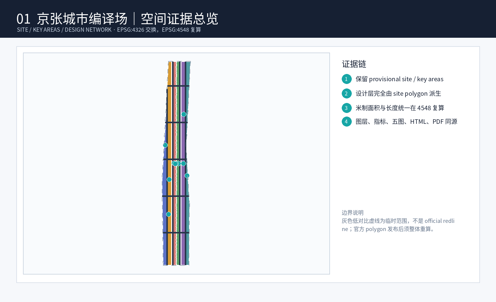
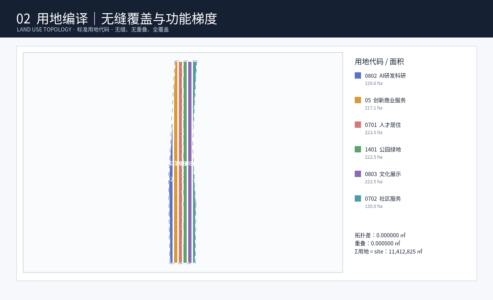
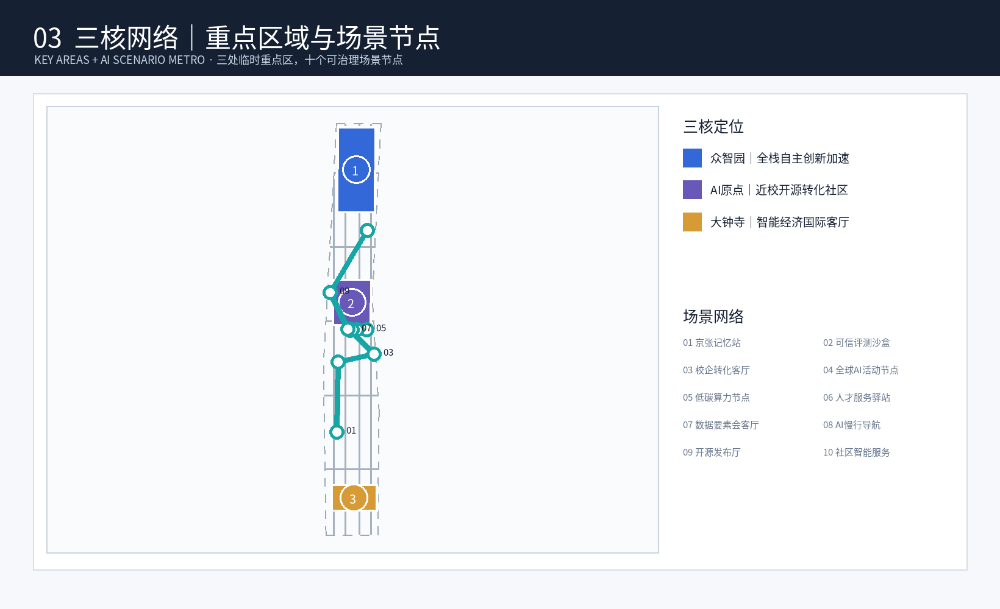
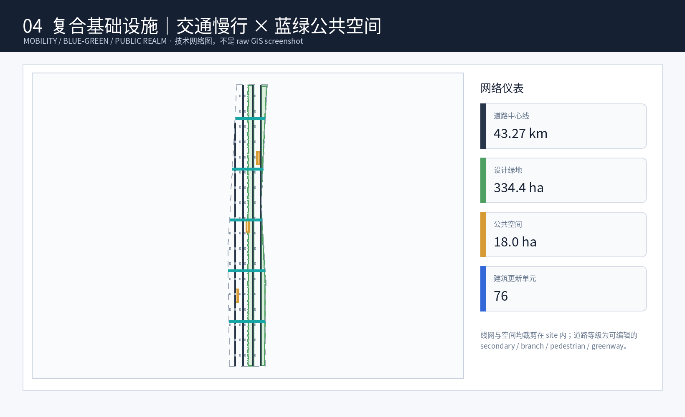
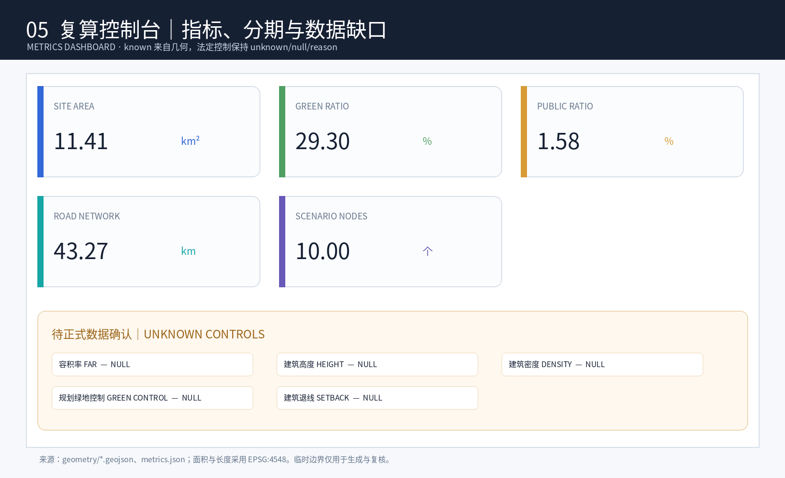

# Jing-Zhang Urban Design Fabric: Open-Source AI Urban Renewal System on Centennial Source Code Tracks

"City Code Lab" does not compare the city to a machine governed by algorithms, but rather views the century-old Jing-Zhang Railway heritage, Haidian's innovation network, and residents' daily lives as a continuously evolving "urban code": history provides an underlying semantic layer that cannot be easily covered, Public Spaces provide an interface that can be collaboratively edited, AI scenarios provide testable plugins, and humans and professional institutions retain the rights to merge, rollback, and make the final decision. All spatial content in this proposal is a **Conceptual Recommendation, reference scheme, and subject to further research by professional teams**; the boundaries used are provisional rough geometries, **not official planning boundaries, and do not constitute government approval or implementation commitments**. The Floor Area Ratio, Building Height, Building Coverage Ratio, road red lines, setbacks, ownership, underground spaces, municipal capacity, fire safety, and cultural heritage control values are all **unknown** and must be legally re-verified after obtaining formal documentation. (Official Planning Boundary)

## Design Basis and Source List

### According to the hierarchy and evidence discipline

This scheme categorizes the bases into four levels. The first level is the primary project bases: the Haidian District Public Announcement specifies three layers of scope, three objectives, overall and key area tasks, and the context of outcomes; the Agent Task Book specifies three positioning, five functions, the Three Zones and Two Wings, six tasks, ten co-creation principles, and a unified boundary. The second level is professional rules: Urban Design management, the compilation and approval of Regulatory Detailed Planning, and the land use classification in the national spatial planning, all of which are public standards. The third level is the warehouse processing materials: site package, source registry, and fact pack, which only serve navigation, enumeration, and structured verification functions without adding new factual authorities. The fourth level is the design layers, indicators, and texts generated by this scheme, all of which are Conceptual Recommendations subject to revocation and recalculation. The Evidence Chain is [source:OFFICIAL-ANNOUNCEMENT] [source:AGENT-TASKBOOK] [source:SITE-PACKAGE] [source:SOURCE-REGISTRY] [source:PROCESSED-FACT-PACK]. Temporary spaces shall be subject to the single column [source:BOUNDARY-SOURCE] [source:KEY-AREA-SOURCE] and shall not be upgraded to statutory conditions.

Professional responses should adopt [standard:PROJECT-OFFICIAL-ANNOUNCEMENT], [standard:PROJECT-AGENT-OPEN-CALL-TASKBOOK], [standard:MOHURD-URBAN-DESIGN-MEASURES], [standard:MOHURD-CONTROL-DETAILED-PLANNING], [standard:MNR-LAND-USE-CLASSIFICATION-GUIDE], and [standard:MOHURD-ARCH-DESIGN-DEPTH-2016]. The last item is currently missing the official text and is only referenced as a gap for further development, not for construction or approval purposes. The current judgment follows [depth:existing_conditions_diagnosis]: the approximately 43.6 square kilometers, 11.4 square kilometers, and 368.4 hectares mentioned in the announcement are available for task scale understanding but cannot replace official GIS/CAD. Layer calculation values can only illustrate the current temporary model's internal relationships.

### provisional geometric list

9 submissions each establish anchor points for the main content: Provisional Boundary [data:geometry/site_boundary.geojson#SITE-001]; three provisional key areas [data:geometry/key_areas.geojson#PROV-KEY-001], [data:geometry/key_areas.geojson#PROV-KEY-002], [data:geometry/key_areas.geojson#PROV-KEY-003]; conceptual land use zones [data:geometry/land_use.geojson#LU-001] (with additional LU-002—LU-006 in the same file); building prototype base [data:geometry/buildings.geojson#BLDG-001]; pedestrian corridors [data:geometry/roads.geojson#ROAD-001]. Continuous green space [data:geometry/green_space.geojson#GREEN-001]; public activity interface [data:geometry/public_space.geojson#PUBLIC-001]; phased concept area [data:geometry/phasing.geojson#PHASE-001]. `constraints.geojson` explicitly records the analysis coverage for "official control conditions pending" in [data:geometry/constraints.geojson#CONSTRAINTS] and includes 10 conceptual scenario nodes; it is not a collection of official planning boundaries, and it cannot be used to claim that the current status does not have blue lines, green lines, yellow lines, purple lines, cultural protection, fire safety, or municipal constraints. (Official Planning Boundary)

The documentation governance follows a "source—assertion—space—metric—reviewer" five-column table: public facts are traced back to their sources; design judgments are marked with Conceptual Recommendations; geometric references are for features; quantitative references are for metrics; conclusions affecting public safety, privacy, rights, and approvals must be signed off by human professional teams. The current [metric:site_area_sqm] is merely the calculation result of the Provisional Boundary model, not an exact legal area. Any formal boundary replacement triggers a full recalculation of nine layers, five metrics, and the entire set of drawings and web pages, rather than a local shift. This documentation system implements the principles of open boundaries, generation disclosure, traceability, human final review, and public knowledge sedimentation. It also retains audit records for why modifications were made, who reviewed them, and the basis for the changes for subsequent version comparisons.

## Three-Level Scope Framework

### From three scale diagrams to a compiled workflow

The three layers are not three independent compositions. The Coordinated Research Area covers approximately 43.6 square kilometers, serving as a "dependency diagram": it studies the relationships between Haidian's universities, research institutions, enterprises, talents, computing power, capital, public services, and the coordinated development of the Beijing-Tianjin-Hebei region, but does not merely list the number of enterprises and investment amounts. The Overall Design Area covers approximately 11.4 square kilometers, serving as a "spatial interface diagram": it translates industrial demands into continuous Public Spaces, composite service nodes, renovation projects, and preconditions for infrastructure. The three key areas together cover approximately 368.4 hectares, serving as "testable modules": they validate the overall strategy through functional, traffic, public space, architectural prototypes, scenarios, and operations. All three layers are based on the scale defined in the announcement text, with only temporary positioning by [data:geometry/site_boundary.geojson#SITE-001] and provisional key-area polygons; the [depth:three_level_scope_framework] requires that all cross-layer conclusions can be traced and rolled back step by step.

The overall structure is summarized as **"one track and two networks with three stations"**. "One track" is the Centennial Jing-Zhang Heritage Track: it uses the cultural—ecological—slow-moving framework based on railway heritage and the Jing-Zhang Heritage Park, without drawing new red lines. "Two networks" are the Open Innovation Network and the Public Life Network: the former connects university innovation origins, open-source collaboration, corporate transformation, testing validation, and technological services; the latter connects communities, tracks, green spaces, culture, sports, education, and daily services. The two networks are not two closed-off park areas but meet at the public interface and operate under the principle of minimal data use. "Three stations" are the Verification Station in the northern Zhongzhiyuan, the Open Source Station in the central AI Origin community, and the Release Station in the southern Dazhongsi. These correspond to three key areas without implying the addition of new rail stations. Structural evidence is linked to [depth:overall_spatial_structure] and [source:PROCESSED-FACT-PACK].

### The synergistic loop of the Three Zones and Two Wings

The three zones are responsible for different stages of the compilation process: Zhongzhiyuan verifies full-stack technology, security governance, and low-carbon space interfaces; AI Origin community translates university original innovations into open-source collaboration, incubation, and talent living; Dazhongsi translates intelligent bodies, intelligent terminals, and content consumption into urban display, business services, and international exchange. The two wings are not new parcels added within the temporary overall boundary of this plan: Zhongguancun Technology Services Wing provides interfaces for intellectual property rights, legal services, capital, and international element allocation, while Xiaoyue River Scenario Enablement Wing provides interfaces for public services, Blue-Green Spaces, and resident co-testing. The collaborative sequence is "problem solicitation—open-source development—controlled verification—public review—result release—service transformation—operational review," with failed projects being reversible, and not substituting deployment quantity for public value.

Three levels of governance are set up with a Research Council, a Space Coordination Desk, and a District Co-Testing Group. The Research Council oversees the innovation chain and regional collaboration; the Space Coordination Desk checks for conflicts in land use, transportation, blue-green spaces, and facilities; the Co-Testing Group, composed of residents, developers, businesses, operators, accessibility representatives, and professionals, reviews scenarios. This framework responds to compliance requirements 1.3.1, 1.3.2, 1.3.3, 1.4.1, 1.4.2, and 1.4.3; all conclusions are still subject to [standard:PROJECT-OFFICIAL-ANNOUNCEMENT] and [standard:PROJECT-AGENT-OPEN-CALL-TASKBOOK]. Spatial or operational recommendations only enter the next phase when all five conditions—source verifiable, impact explainable, metrics recalculable, failure exitable, and human reviewable—are met.

## Coordinated Research Area: Industry and Future City Research

### Seven Global Comparative Case Studies

The case study only extracts publicly verifiable mechanisms, does not replicate names, scales, and governance systems, and does not claim that the case is equivalent to the Jing-Zhang conditions. The following links are provided merely as entry points for public fact-checking; they do not create new source IDs. The formal evidence index remains based on the final package `sources.json`.

| Case | Public Verification Entry | Referable Mechanisms | Jing-Zhang Transliteration and Boundary of Non-Adherence |
| --- | --- | --- | --- |
| Singapore Punggol Digital District | [JTC Official Project Page](https://www.jtc.gov.sg/punggol-digital-district) | Synergize Digital Industry, Educational Institutions, and Urban Infrastructure | Leverage the concept of "campus as a test bed"; no transfer of governance rights, technology suppliers, or construction metrics |
| Barcelona 22@ | [Barcelona City Council](https://ajuntament.barcelona.cat/22barcelona/en/) | Revitalization of Former Industrial Areas with Innovative Activities and Mixed Urban Functions | Drawing on industrial renewal and the juxtaposition with everyday urban life; not referencing its statutory intensity to Haidian |
| Toronto Quayside | [Waterfront Toronto](https://www.waterfrontoronto.ca/our-projects/quayside) | Public Agency-led Waterfront Revitalization with Ongoing Public Engagement | Drawing on Public Accountability and Phased Reviews; Not Treating Early Technical Vision as a Given |
| Paris Station F | [Station F Official Website](https://stationf.co/) | Large-Scale Existing Buildings Hosting Entrepreneurial Clusters and Supporting Services | Drawing on Shared Services and Community Density; Preserving the Existing Jing-Zhang Buildings for Potential Future Adaptation |
| Boston Kendall Square | [MIT Kendall Square Initiative](https://capitalprojects.mit.edu/projects/kendall-square-initiative) | Higher Education Innovation and Public Interface with Business and Open Spaces | Drawing on an On-Campus Technology Transfer Interface; Not Imagining Corporate Infiltration or University-Property Collaborations |
| London King's Cross | [Project Public Introduction](https://www.kingscross.co.uk/about-the-development) | Railway industrial heritage, Public Space, and long-term phased renewal | Draw on heritage to establish a long-term spatial framework; do not derive the Jing-Zhang heritage protection level and engineering feasibility. |
| New York High Line | [Friends of the High Line History Page](https://www.thehighline.org/history/) | Transform traffic remnants into continuous Public Space and rely on long-term operation. | Draw on the operation of linear Public Spaces; do not equate linearization and commercialization with the Jing-Zhang's only answer. |

Seven common examples: The competitiveness of innovative districts is not a single landmark building, but a combination of knowledge institutions, low-threshold spaces, public interfaces, credible governance, and long-term operations; technical ambition must be accompanied by public accountability. Case study comparison service compliance 1.5.1.1 with 1.5.1.2, in accordance with the requirements of [source:AGENT-TASKBOOK] 5—8, and corrected to be people-oriented, heritage-informed, and guided by [standard:MOHURD-URBAN-DESIGN-MEASURES]. (Public Space)

### Full-stack Ecology and Element "Compiler"

The industrial ecology is organized around eight key elements, not by fabricating a list of potential investors: **land** provides reversible pilot interfaces, **space** offers a combination of laboratories, shared workstations, presentation halls, and daily service types, **industry** forms a relationship from foundational technologies—toolchains—vertical applications—to specialized services, **capital** enters through transparent and rule-based conceptual engagement mechanisms, **talent** covers research, engineering, product development, governance, and operations, **computing power** adopts compliant booking and energy consumption auditing scenarios, **data** adheres to principles of authorization, minimization, anonymous aggregation, and purpose limitation, and **scenarios** use sandbox access, Human Review, and exit mechanisms. Zhongzhiyuan leans towards "validation," Original Point Community towards "open-source and transformation," Zhongguancun Technology Services Wing towards "intellectual property, legal affairs, capital, and international connections," Dazhongsi towards "launch and market feedback," and Xiao Yuehe Wing towards "public experience and livelihood validation."

Collaboration across the region is not aimed at sucking in resources: North Latitude Community, Future Science City, Huairou Science City, Economic & Technological Development Zone, and their Beijing-Tianjin-Hebei (Jing-Jin-Ji) partners can serve as collaboration interfaces for future professional teams to study, respectively discussing community scenarios, research facilities, scientific intelligence, industrial manufacturing, and regional supply chains. However, this plan does not claim to have reached any agreements. The annual "Dependency Graph" will reveal which resources come from within the region, which require cross-regional collaboration, and which are still unknown. Industrial performance is not measured by output value commitments but by observing the sustainability of cross-institutional collaboration, the cycle from problem to prototype, the rate of test exits, the approval rate of public value reviews, and the satisfaction of talent services; these are all suggested operational metrics for the future, not known metrics in the `metrics.json` file.

Brand name "Jing-Zhang Urban Design Workshop," with an English suggested name of **Jingzhang Urban Compiler Commons**, emphasizing Commons rather than a closed park. The slogan is "On the Centennial Source Code Track, Co-compile the Next Generation City." This naming responds to agent.1 and agent.2, and connects the three positioning and five functions through open protocols; specific logo design, trademark registration, and multilingual semantics must be refined by a professional team and do not constitute a rights guarantee.

## Overall Design Area: Urban Renewal and Regulatory-Plan-Level Urban Design

### Update Unit and Spatial Syntax

The overall design adopts an "preserve base, open interfaces, and add plugins" update syntax. The base layer includes cultural and historical heritage, ecological safety, public access, barrier-free design, and basic livelihoods; the interfaces are the first-floor public interface, pedestrian connections, shared services, and accessible infrastructure; the plugins are removable exhibition pavilions, reserved experimental spaces, event facilities, and digital services. The conceptual land use is represented by [data:geometry/land_use.geojson#LU-001] through LU-004, indicating four prototype categories: research and innovation, park openness, industrial and commercial services, and community services. The land use code follows [standard:MNR-LAND-USE-CLASSIFICATION-GUIDE], but the current zoning is generated by the agent to illustrate the structural method, not the land use approval. The goal of a complete, closed, and non-overlapping topology is to be verified in subsequent topological checks, with [depth:land_use_layout] responsible for this task.

Urban Renewal prioritizes addressing four inefficient "relationships" rather than arbitrarily identifying inefficient parcels: cross-line connectivity disruptions, sealed ground-floor facades, misaligned service hours, and inability to share park facilities. Each object undergoes a current condition survey, ownership verification, architectural safety and cultural value assessment before deciding to preserve, restore, reprogram, or legally update. The building prototype [data:geometry/buildings.geojson#BLDG-001] and other regularized units on the same level are merely for metric demonstration purposes and do not correspond to any actual building demolition or construction permits; [metric:building_footprint_area_sqm] of 295488.000 square meters is the aggregate value of this temporary design layer in EPSG:4548, with a medium level of confidence, not reflecting the current condition or planned total built area.

### The "Known—Recommended—To Be Completed" three columns for control detail plan depth

According to [standard:MOHURD-CONTROL-DETAILED-PLANNING], the control plan serves as the administrative permit and implementation management basis; this Open Co-Creation text has no approval authority. Therefore, **known** content includes announcement tasks, public standards, and warehouse registration status; **recommended** content includes one track two networks three stations, updated interfaces, scenarios, and operations; **to be added** includes official scope, parcel boundaries, existing buildings, ownership, population and industrial base, Floor Area Ratio, Building Height, Building Coverage Ratio, green space ratio control values, four lines, road red lines, rail conditions, municipal pipelines, fire safety, flood control, and cultural heritage protection. `floor_area_ratio` in `metrics.json` is unknown; all other control plan values are managed as unknown. The completion standard for [depth:development_intensity_controls] is not to provide numbers, but to clearly identify gaps, responsible parties, the order of additions, and recalculation triggers.

Update the model to propose four types of prototypes: "Trackside Shared Living Room, Innovative Courtyard, Community Service Pod, and Blue-Green Experimental Corridor." The volumes, number of floors, setback distances, fire safety spacing, and parking requirements are not specified and will be refined by professional teams under formal conditions. The architectural style should adopt performance language such as material durability, maintainable equipment, transparent and friendly ground-level design, orderly rooftop equipment, and low-impact night lighting, avoiding pseudo-precise shape control. [depth:height_massing_character] and [depth:retain_renovate_demolish] are jointly defined: any specific object must have evidence of measurement, value, structure, ownership, and public opinion to be categorized.

This section covers compliance with 1.5.2.1 and 1.5.2.2, and responds to the new urban form goals of 1.3.2. Spatial comprehensive carrying capacity takes into account six threshold conditions: transportation, utilities, ecology, public services, operation, and data governance. Any critical threshold unknown, it must not be used to reverse-engineer implementability through building scale. Thus, so-called "controlled detailed Urban Design" is presented as an object, interface, and gap for review, rather than a substitute for approved controlled detailed planning.

## Detailed Design of Key Areas

### Three Stations: Validation, Open Source, Release

**Beixian —— Zhongzhiyuan Validation Station.** Temporary location anchor point is at [data:geometry/key_areas.geojson#PROV-KEY-001], with an announcement area of approximately 192.1 hectares, currently calculated at approximately 192.9201877 hectares, for compositional discussion only. The Conceptual Recommendation forms "Qinghe Low-Carbon Test Corridor — Full Stack Validation Academy — Governance Transparency Hall — Industrial Display Interface": green spaces accommodate the removal of sensors, robotics, and energy management tests; the Governance Transparency Hall showcases model cards, risks, Human Review, and exit records; the Validation Academy provides appointment-based isolation testing; the public interface connects to pedestrian and bicycle paths, social interactions, and Qinghe cultural interpretation. External transportation, waterways, flood control, green lines, building scale, and specific construction are all pending formal conditions and are not to be considered as engineering conclusions. This station responds to compliance 1.5.3.1 and agent.2.

**Zhongzhan——AI Origin Open Station.** Anchor point is [data:geometry/key_areas.geojson#PROV-KEY-002], with an announcement area of approximately 104.3 hectares, currently calculated at 104.3236909 hectares. The conceptual structure is "Near-School Achievement Street—Open Source Deliberation Hall—Talent Living Ring—Five Dazhao/TSinghua East Road West Mouth Connection Interface." Achievement Street juxtaposes small-scale displays, intellectual property consultations, legal services, investment and financing connections, and community commerce; the Open Source Deliberation Hall preserves contribution records and version notes; the Talent Living Ring connects short-term work, study, childcare consultation, sports, and international exchange spaces. The connection between campus, park, and street areas only discusses pedestrian needs and interfaces, without advocating for crossing closed jurisdictions or presuming campus openness. Building updates adhere to low-disturbance priority, with specific demolish–renovate–retain strategies still unknown. This station responds to compliance 1.5.3.2 and agent.1. (Demolish–Renovate–Retain Strategy)

**South Station — Dazhongsi Release Station.** Anchor point is [data:geometry/key_areas.geojson#PROV-KEY-003], announcement area of approximately 72.0 hectares, with current polygon calculation at approximately 72.0454221 hectares. The conceptual structure is "Dazhongsi Station Quadrant Walkway Issue Platform — Smart Native Release Hall — Data Rights Living Room — Urban Consumption Co-Testing Street." The release hall provides an explainable demonstration for intelligent entities, intelligent terminals, and content consumption; the rights living room visualizes data authorization, content origins, consumer protection, and complaint mechanisms; the co-testing street only accepts low-risk, reversible, and staffed experiences. The quadrants are connected based on the needs of traffic and rail professionals, without providing feasibility for bridges, tunnels, or underground works. This station responds to compliance 1.5.3.3 and agent.4.

Three stations will adopt the "public podium + reversible modules + operational agreement": ensure barrier-free access, fire safety, evacuation routes, quiet resting areas, and daily passage first; then arrange for technical experiences; and restore public use after activities. The detailed design depth will be checked by [depth:three_key_area_detailed_design] for functionality, business operations, pedestrian-friendly design, Public Space, implementation dependencies, and governance boundaries, rather than using effect diagrams as evidence. [metric:key_area_count] is 3, sourced from the current temporary key-area feature count; it can demonstrate that the three objects within the document are present, but it cannot prove the formal boundaries.

Three stations are connected by a source code track, with open innovation networks conveying outcomes, and public life networks validating public value: the original point community generates or aggregates prototypes, Zhongzhiyuan executes controlled validation, Dazhongsi forms a public understanding release, and then returns resident feedback and operational issues to the open source station. Any test failures are retained with the failure reasons and are exited, not considering "full-scale deployment" as success. All three stations comply with the Public Space, architectural scale, historical and cultural preservation, and municipal requirements as specified in [standard:MOHURD-URBAN-DESIGN-MEASURES], covering compliance 1.5.3.required.

## AI Innovation Ecosystem, Personas, and AI+ Scenarios

### Seven Groups of People and Equity Goals

1. **Surrounding residents** need quiet, safe, affordable daily services and genuine feedback channels; 2. **University students, faculty, and researchers** need cross-institutional collaboration, technology transfer, and research ethics support; 3. **Open-source developers** need low-threshold collaboration, contribution recognition, and reproducible experiments; 4. **Start-up teams and small and medium-sized enterprises (SMEs)** need shared testing, legal, intellectual property, and business services; 5. **Industrial engineers and maintenance personnel** need maintainable interfaces, nighttime services, and skill updates; 6. **International visitors and innovation organizations** need multilingual signage, short-term collaboration, and clear rules; 7. **Children, older adults, people with disabilities, and caregivers** need accessibility, non-digital alternatives, low-sensory burden, and prioritized safety. Seven categories of personas are not individual profile databases; they are used only for service design, not for commercial recommendations, and do not collect continuous identity trajectories.

### Twelve Scene Cards

| Card | Concept Space and Object | Minimum Data, Human Review, and Operations |
| --- | --- | --- |
| S01 Open Source Gallery | Origin Open Source Station; Developers, Students | Only records project information voluntarily submitted; reviewed for copyright by copyright reviewers; operated by the community council |
| S02 Model Safety Governance Sandbox | Zhongzhiyuan Validation Institute; R&D Team, Regulatory Researchers | Isolate Test Data; Red Team and Ethical Dual Review; Scheduled Access, Expired Clearance |
| S03 End-Side Computing Hub | Three Stations Sharing Service Points; Small and Medium Teams | Account Permissions and Resource Usage, Not Content; Maintainer Audit; Energy Consumption Conditions Pending |
| S04 Slow Travel Co- Diagnosis Assistant | [data:geometry/roads.geojson#ROAD-001]; residents, commuters | voluntary reporting of obstacles and anonymous counting; reviewed by traffic personnel; retention of non-digital channels |
| S05 Accessible Route Interpreter | Public Life Network; People with Disabilities, Caregivers | No Health Diagnosis, Only Facility Status; Accessibility Represents On-Site Acceptance |
| S06 Qinghe Blue-Green Maintenance Assistant | Zhongzhiyuan Green Interface; Residents, Maintenance Staff | Environmental Equipment Status and Manual Inspection; Abnormalities judged by maintenance staff, no flood control decisions made |
| S07 Near-School Technology Transfer Assistant | Origin Point Results Street; Students, Teachers, and Start-up Teams | Users Proactively Fill Out Requirements; Reviewed by Legal and Technical Managers; Does Not Scrape Unpublished Research Results |
| S08 Corporate Service Coordination Platform | Zhongguancun Technology Services Wing Interface; Small and Medium Enterprises | Authorized Matters List; Review by Corporate Service Specialist; No Commitment to Funding, Policy, or Investment Results |
| S09 Data Rights Living Room | Dazhongsi Release Station; Consumers, Enterprises | Only display authorized templates and audit examples; Legal personnel review; Set up recall and appeal entry |
| S10 Intelligent Natively Generated Consumption Co-Testing | Dazhongsi Co-Testing Street; Citizens, Visitors | On-site Clear Consent and Immediate Feedback; Staffed; No Facial Recognition or Induced Recommendations |
| S11 Jing-Zhang Cultural Tour | Public Space; Suitable for All Ages | Utilize Public Domain Historical Materials; Curated by Curator; Provide Paper/Static Alternative Routes |
| S12 Urban Event Coordinated Drill | Three Station Public Spaces; Operations, Security, Public | Only use synthetic or desensitized drill data; human command for final decision-making; do not take over the emergency system |

The twelve cards form agent.3's "Scenes-Space-Operations" matrix, also responding to the AI traffic, enterprise services, and public safety three frontmatter scenes. Public Space refers to [data:geometry/public_space.geojson#PUBLIC-001], and green space refers to [data:geometry/green_space.geojson#GREEN-001]. Privacy principles are purpose limitation, minimum collection, short-term storage, decentralized access, transparent communication, revocability, appeal mechanisms, Human Review, event reporting, and exit mechanisms; no technology shall exclude users due to the absence of a smartphone, language, age, or disability.

### Four industrial tests validated

**T1 Full Stack Compatibility and Security Validation**: Test models, toolchains, and edge-side devices within the isolated sandbox of Zhongzhiyuan, using publicly available, licensed, or synthetic data as inputs; the standard is that risk documentation is complete, human intervention is possible, and results are reproducible, not solely based on model scores. **T2 Low-Carbon Computing—Spatial Co-Validation**: Validate the relationships between reservation scheduling, thermal management, energy consumption disclosure, and service periods; energy capacity is unknown, only a monitoring protocol prototype is developed. **T3 Co-Testing of Pedestrian-Friendly and Accessible Spaces**: Conduct on-site pedestrian audits, temporary signage, and voluntary feedback in the ROAD-001 concept corridor; any route changes must be reviewed by traffic professionals. **T4 Public Service Pressure Testing of Intelligent Bodies**: Test the errors, deviations, rejection mechanisms, and fallback to human intervention in enterprise services, life consultations, and event coordination using synthetic cases; personal privacy or alternative administrative decisions must not be accessed. All four are "proposed tests," not approved operations.

This section implements the scenario-side validation of [depth:traffic_rail_slow_parking] and the quantity requirements from [source:AGENT-TASKBOOK]. Success metrics include the effectiveness of human takeovers, the closure rate of accessibility issues, the completeness of risk disclosures, and the response and public understanding of retraction, all of which must be quantified after future data collection; do not mistake the frequency of technology use for public value.

## Land Use, Building Scale, and Retain-Renovate-Demolish Strategy

### Land Use: Type Prototype Rather than Statutory Nature

Current `land_use.geojson` consists of four agent-generated design polygons: LU-001 with `0802` for demonstration of research and development, LU-002 with `1401` for park open spaces, LU-003 with `05` for industrial commercial uses, and LU-004 with `0702` for community services, illustrating the structural relationships among these uses. The code references [standard:MNR-LAND-USE-CLASSIFICATION-GUIDE], but the layer itself does not imply existing land use, planned uses, or approved use changes. Formal deepening should first import official parcels and zoning plans, then perform a six-step validation: code legality, boundary closure, area conservation, compatibility, public services, and four-line conflict. If the current status conflicts with the proposal, prioritize the factual layer and downgrade the design layer, not modifying the facts to fit the composition.

Mixed-use development should not be an excuse for arbitrary compatibility. Ground floors of research and development spaces can be studied for shared meeting rooms, exhibitions, and convenience services; public green spaces can be studied for reversible activities that do not harm the ecosystem or passage; the interface between industrial and commercial uses should emphasize consumer rights and order day and night; community services should prioritize basic services over displays. All compatibility ratios, facility scales, and service radii remain unspecified. The design goal is to make fifteen-minute daily needs and innovative activities mutually accessible, rather than turning residential areas into non-stop laboratories. [depth:land_use_layout] Responsible for structure, [standard:MOHURD-CONTROL-DETAILED-PLANNING] responsible for reminding of the statutory control boundaries.

### Building: Demolish–Renovate–Retain Strategy of Evidence Gate Control

The Demolish–Renovate–Retain (dçghl) strategy employs a five-step gatekeeping process: first, mapping the structural, chronological, usage, fire safety, and ownership details; second, evaluating historical and cultural significance, social memory, carbon, and spatial value; third, identifying safety and functional deficiencies; fourth, comparing retention and maintenance, restoration and enhancement, adaptive reuse, and legal updates; and fifth, public engagement and professional approval. No specific building is labeled for demolition until all five steps are completed. (Demolish–Renovate–Retain Strategy) [depth:retain_renovate_demolish] Therefore, it should be implemented as methods and a checklist rather than fictional classification results. BLDG-001 is merely a conceptual development baseline [data:geometry/buildings.geojson#BLDG-001], and does not correspond to a real property object.

In terms of building scale, the known value in `metrics.json` for [metric:building_footprint_area_sqm] is 295488.000 square meters, which only represents the aggregate area of the normalized conceptual Building Footprint and cannot be used to derive the total gross floor area; the Floor Area Ratio `floor_area_ratio` is unknown, and the Building Height, density, number of floors, setback, parking, fire safety distances, and other factors are all unknown. The formal model should record the factual/suggested status, source, time, confidence, and approval status for each building, and strictly prohibit the inclusion of agent-generated footprints in the current baseline. [depth:development_intensity_controls] and [depth:height_massing_character] require that future conditions be detailed to include height, massing, skyline, roof equipment, color, ground-floor interfaces, and aesthetic controls.

Building type prototypes include "Shared Innovation Institutes," "Convertible R&D Floor Levels," "Community Service Pods," and "Lightweight Launch Corridors." Common principles are structural maintainability, equipment replaceability, first-floor accessibility, clear entrances, low nighttime disturbance, continuous accessibility, and materials that are not overly technologized. When involving cultural resources such as the Tsinghua Garden Railway Station, cultural heritage identity and protection boundaries must be verified first; when involving artistic resources such as the Beijing Film Academy, only cultural collaboration possibilities should be explored, and unauthorized use of film and television images, personal likenesses, or trademarks is prohibited. This approach ensures compliance with 1.5.2.2 and 1.5.2.5 without exceeding the approval limits.

## Transport, Rail, Municipal Infrastructure, and Public Services

### One track connection, two networks transfer, three stations arrival

Traffic strategies regard the Jing-Zhang Heritage Park as the "one track" for the slow-moving framework, treating pedestrian and bicycle paths and public transport connections as the "public life network," and the scheduled logistics and personnel collaboration between innovation service nodes as the "open innovation network." ROAD-001 [data:geometry/roads.geojson#ROAD-001] serves as the conceptual central line for the bi-directional "slow-moving and innovation service corridor" oriented east-west, not as a road right-of-way or construction alignment. Key actions include establishing a database of discontinuity records: location, type of obstacle, affected population, temporary improvements, permanent engineering dependencies, and review status. Sites such as Wudaokou, West Qinghua East Road, and Dazhongsi are only mentioned in the announcement as connection issues, with station bodies, entrances and exits, passenger flow, and four-quadrant construction conditions awaiting official documentation.

Priority is given to walking and accessibility, followed by cycling, public transit connections, and necessary service vehicles, before discussing parking. At intersections, temporary high-contrast signage can be tested first, along with extended rest nodes, standardized non-motorized vehicle parking, and staggered events; any signal, crosswalk, bridge, tunnel, or lane adjustments must involve traffic authorities and professional design. Slow mobility diagnostics do not employ continuous individual tracking but rely on on-site audits, voluntary issue reporting, and anonymous count aggregation as evidence. Parking supply numbers are not set; instead, a usage survey, feasibility of shared parking, and demand for loading/unloading and accessible parking spaces are verified first. [depth:traffic_rail_slow_parking] A "demand-solution-safety-approval-retest" loop is required.

### Municipal Affairs, New Infrastructure, and Dual Redundancy in Public Services

Edge computing, environmental sensing, public Wi-Fi, and digital signage are merely suggested types of new infrastructure. They must meet requirements for cybersecurity, energy capacity, heat dissipation, noise control, maintenance, lifecycle management, and equipment decommissioning. Each digital service must have a non-digital alternative: navigation with static maps, booking with manual counters, alerts with on-site inspections, and community consultations with phone or counter services. In the event of a critical equipment outage, basic passage and public services must not be disrupted. Distributed energy research is limited to interfaces, monitoring, and phased implementation, as power, municipal pipelines, underground spaces, and fire safety data are unknown. [depth:municipal_new_infrastructure] These points should be listed as professional deepening prerequisites.

Public services are to be implemented under the principle of "shared but not congested": innovative service platforms can provide intellectual property, legal, standardization, testing, and international collaboration; talent services can offer research, learning, cultural, sports, care consultation, and multilingual support; community basic services should have independent guarantees to ensure accessibility is not lost during activity and visitor peaks. Service locations are conceptually based on the PUBLIC-001 public interface, without committing to specific properties. `constraints.geojson` ([data:geometry/constraints.geojson#CONSTRAINTS]) is merely an analytical auxiliary surface for the analysis of "pending statutory conditions," and other SCENE nodes are merely scene type anchors; neither should be misinterpreted as blue lines, green lines, yellow lines, purple lines, cultural heritage, municipal, fire safety, or public safety restrictions that have been ascertained.

This section implements compliance with 1.5.2.3 and 1.5.2.4, and aligns the technical solution with the traffic, utilities, street furniture, pedestrian access, and green space requirements outlined in [standard:MOHURD-URBAN-DESIGN-MEASURES]. The "intelligence" of transportation and facilities does not lie in their level of automation, but in their ability to ensure safe and equitable access for people with varying abilities and equipment conditions, and to provide clear accountability for maintenance operators regarding who is responsible, when maintenance is due, and how to degrade safely in the event of a failure.

## Blue-Green Network, Public Space, and Urban Character

### Blue-green infrastructure and public component library

GREEN-001 [data:geometry/green_space.geojson#GREEN-001] is the continuous park green space prototype within the current model, while PUBLIC-001 is the public activity interface prototype. Both are only used to illustrate how the ecological, pedestrian, social interaction, sports, exhibition, and maintenance elements can be integrated along the "track," and do not represent official green lines, blue lines, or park ownership. The strategy unfolds from two aspects: north-south continuity and east-west integration. North-south continuity is maintained through readable mileage, continuous shade, resting points, and cultural narratives; east-west integration is established through station connections, community entrances, school and campus boundaries, and cross-street issues. At nodes such as north of the Fifth Ring Road, only connectivity goals are proposed, and the feasibility of bridge and tunnel engineering is unknown.

Public Space component library includes: mobile co-measurement tables, low-brightness information kiosks, accessible rest islands, rain garden interpretive signs, temporary power/network interface boxes, parallel paper and digital wayfinding, silent display stands, algorithm explanations for children to understand, and removable safety barriers. Each component has a maximum occupancy period, daily clear passage dimensions, maintenance responsibility, emergency mode, material recycling, and requirements for restoration after events. Technology facilities do not enter ecologically sensitive areas, do not obstruct historical views, and do not force QR code scanning. The blue-green system is reviewed by [depth:blue_green_public_space] and linked to [metric:green_space_area_sqm], [metric:green_ratio], [metric:public_space_area_sqm], and [metric:public_space_ratio]. The current design geometric calculated values are 3344025.172 square meters, 0.293006, 180361.538 square meters, and 0.015803, which are all internal results of agent-generated polygons under the provisional boundary. The confidence level is medium and they are not statutory green space ratios or control indicators for Public Spaces.

### four AI landmark sites

1. **Century Source Code Gate**: Located at the conceptual starting type space of the source code track, it connects the spirit of railway engineering, the innovation culture of Zhongguancun, and the responsibility of AI through a timeline and record of updatable versions, without replicating historical objects.
**Open Source Star Map Hall**: A contribution display system for the original community, recording public projects, failed experiences, and maintainers. Contributors can choose to be named or anonymous.
**Trusted AI Prism**: A governance landmark in Zhongzhiyuan, using readable model cards, risk cards, energy consumption, and demonstrations of human intervention to replace flashy screens.
**Urban Echo Platform**: A release and public feedback landmark at Dazhongsi, displaying on the same interface: "Technical Party Claim—Independent Testing—Public Opinion—Improvement Status." All four are type prototypes, with specific locations, scales, structures, and cultural heritage and construction permits still unknown; the requirement of at least three landmarks is covered by agent.4.

The honor system does not feature corporate advertising walls but instead uses four categories of badges: "Contribution—Verification—Maintenance—Public Value." These badges publicly detail the content of contributions, evidence, validity period, and mechanisms for revocation; sponsorship does not automatically confer technical endorsement. Urban Character is set by the tone of "the restrained structure of railways, the open collaboration of Zhongguancun, and the transparent responsibility of the AI era": colors are derived from the direction of track metal, brick, and blue-green environments, without specifying commercial color codes; fonts prioritize system default or local repository fonts, without loading commercial fonts; night scenes emphasize low brightness, low dynamic range, and timely shutdown.

Cultural narrative is "build—open source—co-govern": the century-old railway symbolizes connection and engineering responsibility, while Zhongguancun culture emphasizes knowledge transformation and trial-and-error. AI new culture emphasizes explainability, correctability, and human dignity. An international communication short phrase suggests as **"Compile the city, keep people in command."**, which translates to "Co-compile the city, always by people in command." It serves agent.5, not replacing the overall logo. All historical facts are verified with public resources, and all specific protection requirements must be integrated into formal heritage documents.

## Renewal Projects, Implementation Policy, and Phasing

### Nine Concept Update Projects

| Number | Concept Project | Primary Action | Prerequisites and Exit Conditions |
| --- | --- | --- | --- |
| JZ-01 | Source Code Track Breakpoint Diagnosis | pedestrian audit, accessibility checklist, temporary wayfinding | Permits for Road and Park Management; Removal if Safety is Affected |
| JZ-02 | Zhongzhiyuan Trust Verification Institute | T1 Safety Sandbox and Governance Public Hall | Ownership, fire safety, cybersecurity, confirmation of operating entity |
| JZ-03 | Qinghe Low-Carbon Co-Monitoring Corridor | Environmental Maintenance and Low-Carbon Interface Experiment | River courses, flood protection, green line conditions; must not interfere with ecology |
| JZ-04 | Original Point Open Source Meeting Hall | Contribution Registration, Achievement Release, Ethical Review | Clear the site and copyright; suspend the display of disputed projects. |
| JZ-05 | Near-School Conversion Interface for Academic Results | Legal Services, Intellectual Property, and Corporate Services Shared | Campus and Property Boundary Verification; No Commitment to Investment Incentives |
| JZ-06 | Dazhongsi Quadrant Walkable Issue Platform | On-Site Problem Map and Joint Evaluation of Transportation | Track, Road, and Passenger Flow Data; No Premature Engineering Judgment |
| JZ-07 | Data Rights Living Room | Authorization, Revocation, Appeal, and Audit Display | Legal review and independent oversight; high-risk applications not permitted |
| JZ-08 | Four Landmarks and Public Components Pilot Installation | 1:1 Demountable Prototype, Public Testing | Preservation, Structural, Fire Safety, Accessibility Review |
| JZ-09 | Urban Design Compilation Operation Platform | Project Versions, Indicators, Risks, and Feedback Made Public | Establish Clear Governance Charter; Cease Automation if Unauditable |

Project List Response [depth:renewal_project_list]. Policy recommendations include: establishing an interdepartmental "issue list rather than project commitment list"; setting time limits and restoration guarantees for low-risk reversible experiments; capping commercial activities in Public Spaces and prioritizing community interests; requiring registration of algorithm services for purpose, data, model versions, human responsible party, and exit strategy; avoiding supplier lock-in in procurement by prioritizing open interfaces and migratable data; managing contributor attribution, intellectual property, and public feedback separately. All policies are research recommendations and do not claim current policies or government arrangements.

### Three-phase Implementation with Dual-Clock Operation

**Recent "Calibration and Light Testing" (Initiated after Official Data Acquisition)**: Replace official polygons, complete current condition mapping, ownership, cultural heritage, traffic, municipal services, and population and industrial baseline data; select signboards, deliberation, and synthetic data sandboxes that do not alter engineering conditions. **Mid-term "Update and Networking"**: After legal approval, study key district public interfaces, shared services, pedestrian connections, and infrastructure interfaces, integrating the three stations under a single operational agreement. **Long-term "Review and Iteration"**: Retain, expand, modify, or exit scenarios based on public value assessments, forming cross-regional cooperation. PHASE-001 [data:geometry/phasing.geojson#PHASE-001] is only the "discussable scope for Phase 1," not representing the actual development sequence, investment, or approval; [depth:phasing_implementation] requires re-drawing after formal boundary updates.

Two Clocks One end is the slow clock of spatial renewal, while the other end is the fast clock of activity operations. An annual brand proposal is suggested: **JZ Compile / Jing-Zhang Co-compile Season**. It includes: a "Problem Open Source Month" in spring to collect community and industry problems; a "Safety Verification Season" in summer to conduct four types of tests; a "City Launch Week" in autumn to showcase along three stations and accept public comments; and a "Maintainers' Conference" in winter to announce failures, exits, repairs, and topics for the following year. Monthly activities include developer maintenance nights, accessibility peer audits, and resident open tables. Services are provided on a rotating basis by the three stations. The brand visual identity uses the dual lines of the track and the syntax of version nodes, without an enterprise logo.

Long-term governance recommendations include the establishment of a Public Interest Committee, a Technical and Ethics Committee, a Spatial Operations Team, a Community Co-Testing Group, and an independent audit role. The talent/enterprise/developer transformation pathway is defined as "participate in activities—enter the open problem repository—form a cross-disciplinary team—validate data synthesis—conduct controlled space testing—public debriefing—legally connect with services or markets"; participants can exit at any stage. The source of operational funding, the primary entity, and the charging rules are unknown, and no fiscal commitment is made. This system implements agent.6, and it is anchored through risk registers, annual reports, open API standards, and version archiving to preserve brand assets.

## Metrics, Area Recalculation, and Compliance Matrix

### known indicators and their strict meanings

Currently, the `metrics.json` contains ten known metrics, all recalculated from the same source geometry in EPSG:4548 and referenced individually here. [metric:site_area_sqm]=11412825.386 square meters, derived from the temporary polygon SITE-001, with a medium level of confidence, and can only be used as a model area. [metric:land_use_area_sqm]=11,412,825.386 square meters, indicating that the six land use zones fully cover the Provisional Boundary within numerical tolerance, and do not represent statutory land use; [metric:building_footprint_area_sqm]=295,488.000 square meters, derived from the aggregated regularized building prototype. [metric:green_space_area_sqm]=3344025.172 square meters and [metric:green_ratio]=0.293006; [metric:public_space_area_sqm]=180361.538 square meters and [metric:public_space_ratio]=0.015803; [metric:road_length_m]=43272.210 meters, which only indicates the combined length of conceptual roadways and pedestrian centerlines, and is not the current or approved road mileage; [metric:key_area_count]=3, which only indicates that the document retains three designated key areas; [metric:scenario_node_count]=10, which only indicates the number of conceptual scenario nodes in the constraints layer. The above values should not be used as approval metrics, current survey conclusions, or implementation commitments.

`floor_area_ratio` is unknown due to the lack of an approved Floor Area Ratio and official site boundary. Building Height, density, green space ratio, road red lines, and municipal capacity are also managed as unknown. The formal recalculation process is as follows: verify CRS and sources—validate geometric legality—clip by official boundary—check land use topology—compute area using a uniform projection—verify numerator and denominator—record script version and error—manually sample check—update drawings and web pages. Recalculation is constrained by [depth:metrics_recalculation]; old values are retained but must not be mixed with new values.

### 23 compliance coverage index

| Group | Requirement ID | Main Evidence for This Proposal |
| --- | --- | --- |
| Three Objectives | 1.3.1, 1.3.2, 1.3.3 | Ecological Compiler, One Track Two Networks Three Stations, Seven Categories of People and Public Value Thresholds |
| Three Levels Scope | 1.4.1, 1.4.2, 1.4.3 | Three Levels Dependencies/Interfaces/Module Framework with Provisional Warning |
| Coordinated Research | 1.5.1.1, 1.5.1.2 | Seven Case Studies, Eight Elements, Three Zones and Two Wings, Future City Dual Networks |
| Overall Design | 1.5.2.1, 1.5.2.2, 1.5.2.3, 1.5.2.4, 1.5.2.5 | Industrial Function, Update Syntax, Transportation and Utilities, Vitality Corridor, Scenic Character |
| Key Area | 1.5.3.required, 1.5.3.1, 1.5.3.2, 1.5.3.3 | Detailed Design of Three Stations, Functions/Active Transportation/Public Space/Implementation Dependencies |
| Intelligent Body Tasks | agent.1, agent.2, agent.3, agent.4, agent.5, agent.6 | Brand, Ecology, 12 Scenarios/4 Tests/7 Groups, 4 Landmarks, Culture, Long-term Operations |

A total of 17 announcement requirements were added, with 6 additional agent requirements, making a total of 23 requirements. All maintain the existing IDs from `compliance_matrix.json` and do not introduce new fictional IDs. The standard coverage includes all six standards. Depth coverage for all 15 items: [depth:existing_conditions_diagnosis], [depth:three_level_scope_framework], [depth:overall_spatial_structure], [depth:land_use_layout], [depth:development_intensity_controls], [depth:height_massing_character], [depth:retain_renovate_demolish], [depth:traffic_rail_slow_parking], [depth:municipal_new_infrastructure], [depth:blue_green_public_space], [depth:three_key_area_detailed_design], [depth:renewal_project_list] [depth:phasing_implementation], [depth:metrics_recalculation], [depth:risk_missing_data].

Assessing more than just quantity is crucial. For the spatial category, consider continuity, accessibility, conflicts, and reversibility; for the industrial category, evaluate the quality of collaboration, the path from testing to commercialization, and failure records; for the public category, cover seven categories of people, ensure accessibility, address appeals, and provide non-digital alternatives; for the AI category, focus on data minimization, error rates, human takeovers, biases, and exit strategies; for the operational category, assess maintenance responsibilities, cost transparency, and annual reviews. Beyond the ten known metrics listed above, the remaining are suggested indicators that can only be quantified after a baseline survey in the future.

## Risk, Copyright, and Compliance

### Boundaries, Planning, and Implementation Risks

The highest priority risk is misreading of spatial precision. SITE-001, PROV-KEY-001/002/003, and the upstream provisional geometry are all rough substitutes formed based on the announced text boundaries, approximate area, and bbox; `official_boundary=false`; they are not official planning boundaries, statutory controls, precise areas, approvals, or implementation references. All spaces are Conceptual Recommendations, reference schemes, and are available for further research by professional teams. Once the official range is released, all land use, building, road, green space, Public Space, constraints, phased development, and metrics must be recalculated. The second priority is the planning gap: all unknowns include Floor Area Ratio, Building Height, Building Coverage Ratio, setbacks, four lines, and road red lines; [standard:MOHURD-CONTROL-DETAILED-PLANNING] requires legal compilation and approval, and this plan does not replace that procedure. (Official Planning Boundary)

Third is the engineering and safety risks: bridge tunnels, underground spaces, track lines, energy loads, municipal capacities, drainage flood prevention, fire safety, and structural safety have not been calculated. Fourth is the ownership and social risks: without obtaining the ownership of the land, buildings, campuses, and Public Spaces, specific demolish–renovate–retain strategies or opening commitments cannot be made. Fifth is the technical risks: model errors, deviations, supplier lock-in, equipment decommissioning, and network failures must be controlled through sandbox environments, open interfaces, manual takeovers, non-digital redundancies, and exit mechanisms. Sixth is the fairness risks: digital thresholds, nighttime disturbances, activity disruptions, and commercialization should be evaluated by seven categories of people. The risk list is managed by [depth:risk_missing_data], and the empty constraint layer [data:geometry/constraints.geojson#CONSTRAINTS] must not be interpreted as risks being cleared. (Demolish–Renovate–Retain Strategy)

### Data, Copyright, and Liability

Scenes shall use only publicly available, de-identified, authorized, aggregated, or synthesized data, and shall not use government data, corporate private data, personal privacy, or secret maps that have not been legally authorized for the project. Default facial recognition, continuous personal trajectories, social scoring, and non-appealable automated decisions are prohibited. Urban Agents can only assist in identifying issues, generating options, and organizing evidence; high-impact judgments such as planning approvals, public safety, and medical laws shall be completed by humans with the appropriate responsibilities. An impact assessment shall be completed before testing, and human intervention shall be retained during operation. Data shall be deleted and a debriefing disclosed within a specified period after the end of the operation.

Text and original graphics were compiled by AI and LTSlw; facts and rules are based solely on publicly available or cleared sources as listed in the final package, with generation methods, source boundaries, and limitations detailed in `sources.json` and `report/copyright_statement.md`. Five of the images in the main text are local static assets within the repository and do not call upon remote images. The web pages must not load remote scripts, map tiles, iframes, forms, or external API Or commercial fonts. The global case study table only links to publicly accessible institutional pages for verification purposes, and does not copy their images, drawings, logos, or protected expressions. Licenses are **COMMUNITY-DISPLAY-ONLY, consistent with the frontmatter; third-party publicly available documents continue to use their respective copyright statements, and the project license does not expand their authorization.

According to [standard:PROJECT-AGENT-OPEN-CALL-TASKBOOK], the final judgment belongs to humans and the professional team; according to [standard:MOHURD-ARCH-DESIGN-DEPTH-2016], the official text of the building depth standard is missing, hence it cannot be claimed that the design depth has been reached. The proposal does not claim government approval, corporate occupancy, funding commitment, event confirmation, or guaranteed implementation. When issues with source, copyright, geometry, metrics, privacy, or security are discovered, related displays or tests should be paused, a version recorded, and the issue addressed, rather than deleting unfavorable evidence.

## References

### Final package source ID index

- [source:SITE-PACKAGE]: An entry point for tasks, enumeration, permissible design space, scope, and schema; not an additional authority.
- [source:SOURCE-REGISTRY]: Distinguish between formal, provisional, and review-required uses in the source registry.
- [source:PROCESSED-FACT-PACK]: A navigation layer for scope, tasks, source purposes, and gaps; not a substitute for the original basis.
- [source:BOUNDARY-SOURCE]: Overall boundary, provisional source, used only for generation, display, and self-check.
- [source:KEY-AREA-SOURCE]: Three key areas provisional sources, which are not official polygons.
- [source:OFFICIAL-ANNOUNCEMENT]: Official public basis for the three-layer scope, design objectives, tasks, and outcomes context.
- [source:AGENT-TASKBOOK]: Three Key Positions, Five Major Functions, Three Zones and Two Wings, Six Tasks, Brand Operations, and Unified Boundary Criteria.

### Standards, Data, and Review Entry

The standard index includes [standard:PROJECT-OFFICIAL-ANNOUNCEMENT], [standard:PROJECT-AGENT-OPEN-CALL-TASKBOOK], [standard:MOHURD-URBAN-DESIGN-MEASURES], [standard:MOHURD-CONTROL-DETAILED-PLANNING], [standard:MNR-LAND-USE-CLASSIFICATION-GUIDE], and [standard:MOHURD-ARCH-DESIGN-DEPTH-2016]. The local path is `brief/site-package/standards/standards.json` and its `standards/references/` snapshot. The project tasks enter through `brief/site-package/agent_taskbook.json`, `design_brief.json`, and `allowed_design_space.json`; documentation entry points are `data/source_registry.json` and `data/processed/agent_fact_pack.md`.

Nine layers for review are sequentially [data:geometry/site_boundary.geojson#SITE-001], [data:geometry/key_areas.geojson#PROV-KEY-001] (including PROV-KEY-002 and PROV-KEY-003), [data:geometry/land_use.geojson#LU-001], [data:geometry/buildings.geojson#BLDG-001], [data:geometry/roads.geojson#ROAD-001], [data:geometry/green_space.geojson#GREEN-001], [data:geometry/public_space.geojson#PUBLIC-001], [data:geometry/constraints.geojson#CONSTRAINTS]. [data:geometry/phasing.geojson#PHASE-001]. The metric entry includes [metric:site_area_sqm], [metric:land_use_area_sqm], [metric:building_footprint_area_sqm], [metric:green_space_area_sqm], [metric:green_ratio], [metric:public_space_area_sqm], [metric:public_space_ratio], [metric:road_length_m], [metric:key_area_count], [metric:scenario_node_count]; the statutory control indicators such as `floor_area_ratio` are unknown and cannot be cited as known conclusions.

Read the document in the following order: start with the announcement and task book, then review the source/standard/depth/compliance matrices, followed by verifying the geometry and metrics, and finally read the main text, the five figures, and the copyright notice. All external comparative cases are for methodological research only and do not serve as legal planning references for the Jing-Zhang project. In case of conflicts between the text, figures, JSON, or indicators, the higher source, official documents, and manual professional review shall prevail, with the conflicts recorded as revisions in the new version. The purpose of this reference system is not to create an illusion of completeness but to ensure that every known source is traceable, every unknown source is accountable, every suggestion is reversible, and every update is auditable.
