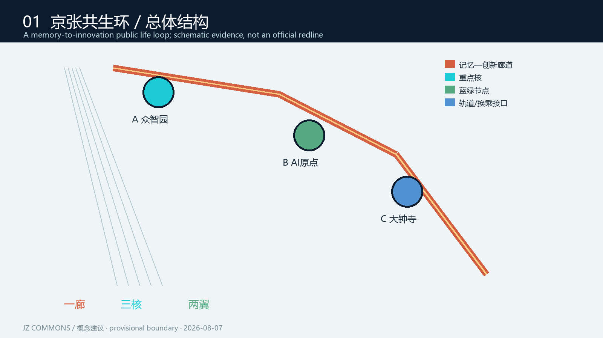
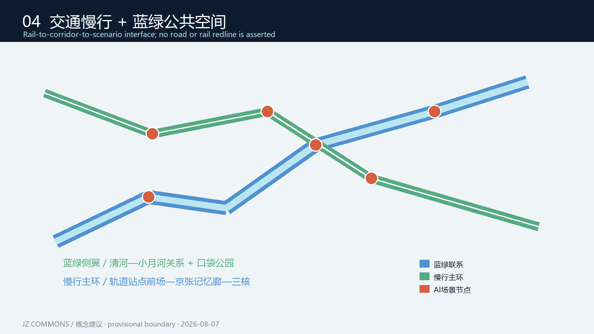
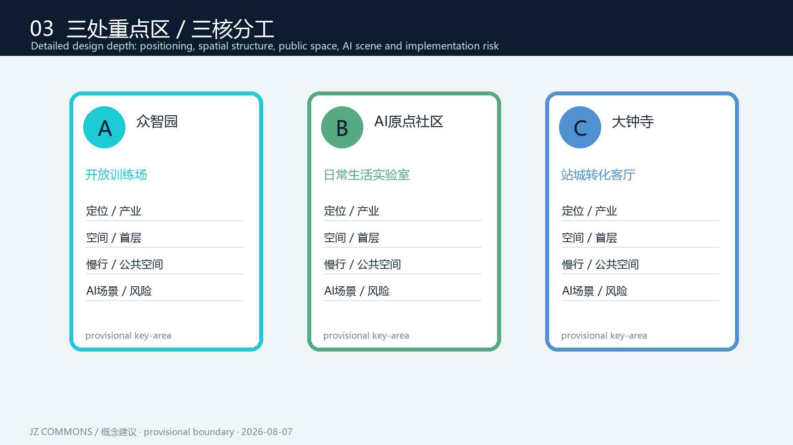
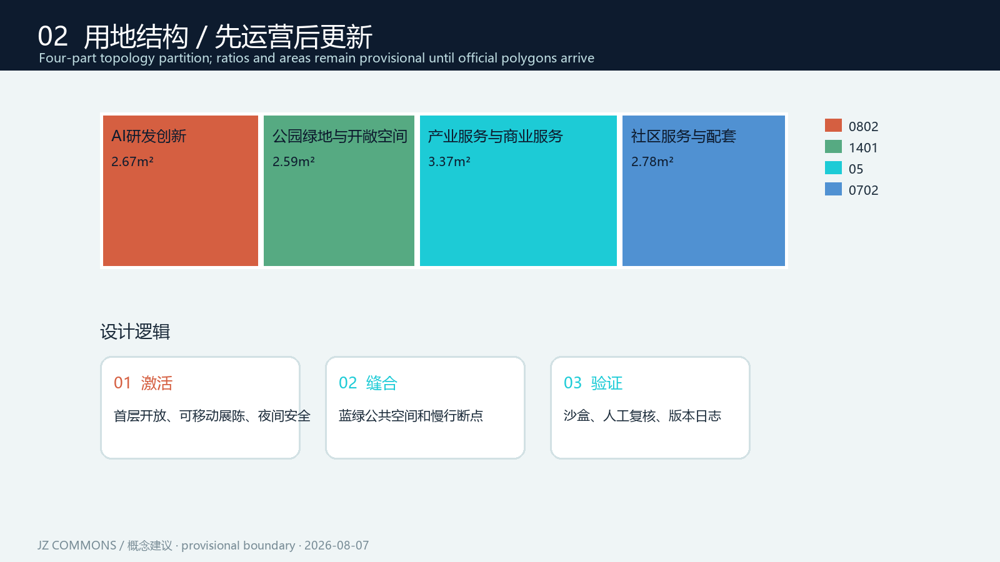
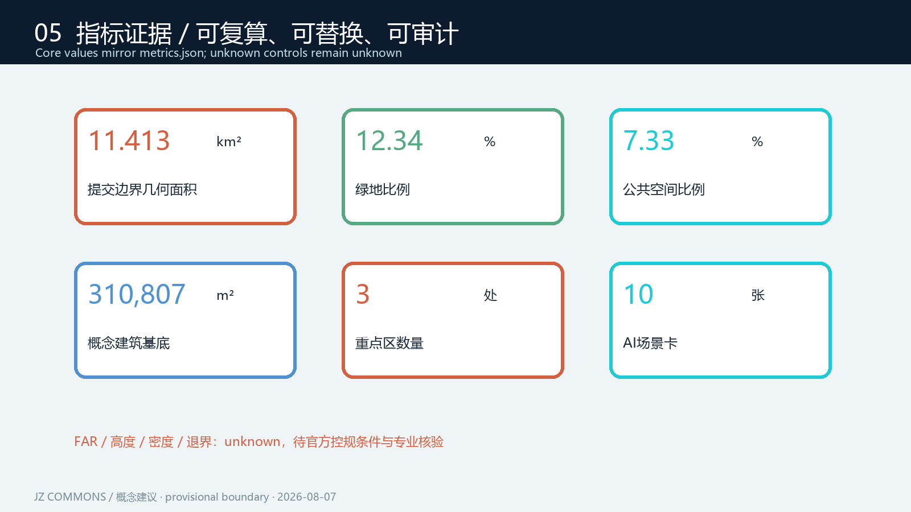

# 京张共生环：一条会学习的城市公共生活带

> **核心命题**：把“百年京张”从一条被观看的遗址线，转译为一条每天被使用、被验证、被共同维护的AI公共生活带。方案提出“一廊、三核、两翼、十场景”的空间—产业—运营框架，所有空间落地内容均为**概念建议、参考方案，可供专业团队深化研究**。

## 设计依据与资料清单

本方案依据公开征集公告、面向智能体任务书和仓库 site package 编制。[source:OFFICIAL-ANNOUNCEMENT] 明确了统筹研究范围、总体设计范围和三处重点区域；[source:AGENT-TASKBOOK] 明确三大定位、五大功能、三区两翼、六项智能体任务以及场景卡、品牌和运营要求。结构化范围、设计空间、图层枚举、指标 schema 和临时边界分别来自 [source:SITE-PACKAGE]、[source:SOURCE-REGISTRY]、[source:PROCESSED-FACT-PACK]、[source:BOUNDARY-SOURCE] 和 [source:KEY-AREA-SOURCE]。

当前官方精确 SITE_BOUNDARY、KEY_AREA polygon 和地块级控规条件尚未进入公开 site package。本提交使用仓库提供的 `provisional_boundaries.geojson`，并在 `geometry/site_boundary.geojson`、`geometry/key_areas.geojson`、`sources.json`、`assumptions.json`、`self_check.json` 与 `visual/index.html` 中保留 `provisional_constraint` 和 `official_boundary=false`。它只用于生成、展示、拓扑自检和方向性讨论，不是 official redline、审批依据、精确面积复算依据或法定规划控制。官方 polygon 发布后，所有设计图层和 [metric:site_area_sqm] 应统一复算。

专业标准响应以本地快照为证据：城市设计编制与管理相关要求引用 [standard:MOHURD-URBAN-DESIGN-MEASURES]，控规深度和实施管理边界引用 [standard:MOHURD-CONTROL-DETAILED-PLANNING]，用地分类引用 [standard:MNR-LAND-USE-CLASSIFICATION-GUIDE]，建筑设计深度仅用于表达深度边界而不替代审批条件，引用 [standard:MOHURD-ARCH-DESIGN-DEPTH-2016]。本方案不引入非公开数据、人物肖像、企业内部资料、商业地图瓦片或未经授权的图像。

## 三层范围工作框架

### 1. 统筹研究范围：43.6平方公里的创新协同网络

北至北五环路、东至京藏高速、南至西直门外大街、西至万泉河路的统筹研究范围，不被理解为单一园区，而是北京AI创新网络的“城市接口层”。方案建议以京张铁路历史线索为认知主线，串联中关村核心区、北纬社区、未来科学城、怀柔科学城、经开区以及京津冀协同节点，建立“研发—验证—生活—传播—转化”五类联系。这里的结论是区域协同研究建议，不替代任何区域规划或产业政策。

### 2. 总体设计范围：11.4平方公里的公共生活操作系统

总体设计范围以京张遗址公园周边1—2公里城市地区和产业区为设计对象，形成“一条记忆—创新廊道、三处重点核、东西两翼、可插拔场景节点”的结构。廊道不是新增道路红线，而是以现有公共空间、慢行联系、站点前场、桥下空间和可更新建筑首层构成的连续体验系统。西翼偏向社区生活与历史叙事，东翼偏向企业服务、产业验证与交通换乘；两翼由公共服务节点和蓝绿空间共同缝合。

### 3. 重点区域：368.4公顷的三核联动

- **众智园AI自主创新加速区**（约192.1公顷）：面向早期团队、开源社区和中试验证，设置“共享算力前厅—原型街区—企业加速器”连续界面。
- **北京AI原点社区**（约104.3公顷）：面向居民、人才和公共机构，设置“可解释的AI日常”服务网络，优先做社区健康、教育、养老、无障碍和低碳管理场景。
- **大钟寺AI产业聚集区**（约72.0公顷）：面向成熟企业、展示转化和站城融合，设置产业服务客厅、开发者交流平台与面向公众的应用展示界面。

三处重点区均为临时粗略多边形约束，具体开发边界、权属、建筑控制线、交通工程和市政容量需待官方资料与专业深化确认。[data:geometry/key_areas.geojson#PROV-KEY-001] [data:geometry/key_areas.geojson#PROV-KEY-002] [data:geometry/key_areas.geojson#PROV-KEY-003]

## 统筹研究范围产业与未来城市研究

本节响应 [standard:PROJECT-OFFICIAL-ANNOUNCEMENT]、[standard:PROJECT-AGENT-OPEN-CALL-TASKBOOK]，并以 [depth:existing_conditions_diagnosis]、[depth:three_level_scope_framework] 组织区域判断。

### 产业生态：从“企业集聚”转向“能力互换”

提出四层生态：①基础模型、数据与算力的底座层；②智能终端、机器人、软件工具链的产品层；③医疗、教育、交通、文化、法律与城市治理的验证层；④开发者、居民、学生、国际访客共同参与的公共层。空间上不预设招商结果，而是建议用“场景开放协议、测试沙盒、公共数据最小化、人工复核、问题回流”的机制，让企业可以在真实但受控的城市情境中验证，居民可以看到收益与边界。

### 人才画像与未来城市能力

五类用户画像贯穿空间设计：**开源开发者**需要低门槛共享工位、夜间安全和可复用数据；**AI创业团队**需要算力、导师、法务和中试空间；**科研与产业人才**需要15分钟生活圈、托育、运动和跨机构交流；**社区居民与银发人群**需要可理解、可拒绝、可人工转接的服务；**国际访客与学生**需要多语导视、历史叙事和可体验的AI展陈。每类用户都对应“空间触点—服务触点—治理触点”，避免把人才政策写成没有空间承载的口号。

### 区域协同

建议形成“京张共生环协同协议”概念框架：海淀作为研发与公共试验入口，未来科学城与怀柔科学城承接科学研究和大型设施，经开区承接规模化产品与制造，京津冀节点承接应用扩散。协议只表达合作方向和接口标准，不构成政府承诺、投资安排或招商保证。

## 总体设计范围城市更新与控规深度城市设计

### 总体结构：一廊、三核、两翼、十场景

**一廊**是“京张记忆—AI共创廊”，由遗址叙事、林荫步道、可变展廊、站点前场和首层开放界面组成；**三核**对应三处重点区；**两翼**分别是“社区生活翼”和“产业验证翼”；**十场景**是可插拔的城市服务模块。道路、轨道、桥隧、管线不在本概念包中确定线位，方案仅提出接口和断点治理原则。[data:geometry/land_use.geojson#LU-001] [data:geometry/roads.geojson#ROAD-001]

### 更新策略：轻介入、可逆、先运营后建设

1. 近期以导视、开放首层、夜间照明、可移动展陈、无障碍连续性和微型公共空间为主；
2. 中期以存量建筑更新、共享实验室、社区服务站和蓝绿空间缝合为主；
3. 远期在官方控规、权属、工程与资金条件确认后，再由专业团队深化地块级方案。

建议采用“保留—改造—替换—新增”四类标签，但不对现实建筑作未经调查的拆改结论。现有 `BUILDING_FOOTPRINT` 仅为概念性设计基底，不代表现状建筑清单。[data:geometry/buildings.geojson#BLDG-001]

### 城市形象与Logo方向

品牌名建议为 **JZ·COMMONS / 京张共生环**。Logo方向是一条由“铁轨双线”与“数据回路”叠合的开放环，双线保留历史连续性，断点表达可加入、可退出和可审计；不使用任何现有机构或企业商标。颜色系统采用京张铁锈红、清河水蓝、算力荧光青、社区暖灰四种功能色，分别对应记忆、蓝绿、创新和日常生活。字体和图形应选用清权、可替代的开源字体系统，正式传播前由设计团队完成版权核验。

## 重点区域详细设计

三处重点区按 [depth:three_key_area_detailed_design] 展开，并引用 [data:geometry/key_areas.geojson#PROV-KEY-001]、[data:geometry/key_areas.geojson#PROV-KEY-002]、[data:geometry/key_areas.geojson#PROV-KEY-003]；其临时几何不作为法定边界。

### A 众智园AI自主创新加速区｜“开放训练场”

定位为低门槛、可共享、可快速验证的AI自主创新加速器。概念结构为“算力前厅—原型街—共创院落—产业接口”。首层以透明但不暴露隐私的实验展示、共享会议、模型评测和开发者服务为主；公共空间设置可拆装的演示台、雨棚、夜间安全节点。交通上建议把园区内部短距离出行优先交给步行、骑行和接驳微循环，具体道路组织待交通专业核验。首批更新项目为共享算力服务站、开发者夜校和模型安全评测台。

### B 北京AI原点社区｜“日常生活实验室”

定位为居民能够理解、拒绝和共同改进的AI社区。概念结构为“一环两厅多口袋”：一环是社区慢行和蓝绿串联，两厅是社区AI服务客厅与健康教育客厅，多口袋是嵌入邻里空间的可解释服务点。重点设计不追求屏幕密度，而追求人工服务在场、数据最小化和弱势群体可达。建议建设社区数据公约、无障碍语音导视、老年人数字陪伴和儿童安全步行场景，任何健康、教育和安全应用均设置人工复核与退出机制。

### C 大钟寺AI产业聚集区｜“站城转化客厅”

定位为成熟企业、国际访客、开发者和公众之间的转换界面。概念结构为“站点前场—产业客厅—应用展廊—夜间创客街”。空间建议把首层服务、可见的应用验证和公共活动结合，形成从轨道站点到京张记忆廊的连续导视。场景包含机器人协作展示、企业服务 copilot、国际路演和城市问题挑战赛；不预设企业名称、投资金额或确定入驻结果。

## AI 创新生态、人才画像与 AI+ 场景

### 五类用户画像

| 画像 | 核心需求 | 空间触点 | 保护边界 |
|---|---|---|---|
| 开源开发者 | 低门槛、可互助、夜间安全 | 开发者街、夜校、共享工位 | 代码与身份可选择性公开 |
| AI创业团队 | 算力、法务、中试、客户反馈 | 加速器、测试沙盒、产业客厅 | 商业数据隔离、结果不作背书 |
| 科研/产业人才 | 交流、运动、托育、住房服务 | 15分钟生活圈、跨界院落 | 不采集不必要的个人画像 |
| 社区居民/银发人群 | 可理解、可拒绝、人工转接 | 社区AI客厅、健康与教育站 | 明示同意、人工复核、离线替代 |
| 国际访客/学生 | 多语、历史、可体验 | 遗址展廊、路线节点、讲解站 | 授权素材、公共安全优先 |

### 十张AI场景卡

1. **记忆导览**：遗址公园；访客；公开历史资料；不做人脸识别；文化讲解员抽检。
2. **无障碍路径助手**：廊道与站点；行动不便者；路况与设施状态；位置最小化；人工客服兜底。
3. **社区健康问答**：AI原点社区；居民；用户主动输入；不作诊断；医护人员复核。
4. **儿童安全步行**：社区口袋空间；家庭；脱敏事件统计；不追踪儿童身份；社区工作者复核。
5. **绿色能源看板**：公共空间；全体公众；设备运行数据；不关联住户；运维人员审查。
6. **开发者夜校**：众智园；开发者与学生；报名与课程数据；可匿名参与；组织者人工审核。
7. **模型安全评测台**（测试验证）：众智园；企业与科研团队；授权测试集；隔离环境；专家委员会复核。
8. **机器人协作街**（测试验证）：大钟寺；企业与公众；设备遥测；禁止采集非必要肖像；安全员现场复核。
9. **城市问题挑战赛**（测试验证）：三核联动；企业、学生、居民；开放问题与结果；不开放隐私数据；主办方评议。
10. **企业服务 Copilot**：大钟寺产业客厅；企业访客；公开办事指南；不替代审批；服务人员确认。

每张卡都映射到 `AI_SERVICE_ZONE`/`SCENARIO_NODE` 的后续扩展层；当前提交只将空间节点作为设计讨论，不把场景写成已上线系统。[data:geometry/public_space.geojson#PS-001]

## 用地、建筑规模与拆改留方案

`geometry/land_use.geojson` 将总体设计范围作为完整分区分解为AI研发创新、公园绿地与开敞空间、产业服务与商业服务、社区服务与配套四类，四块共享边界、无重叠、覆盖提交边界。[metric:site_area_sqm] 为 11,412,825.386 平方米，是临时 polygon 的几何计算值；公告面积约11.4平方公里仅作背景校核。[metric:building_footprint_area_sqm] 为 310,807.184平方米，表示概念性建筑基底总量，不等于现状或批准建设量。

官方 FAR、建筑高度、密度、绿地率、退界、权属和市政容量均为 unknown，不能被本方案填充为控制指标。[metric:floor_area_ratio] 明确保持 unknown。所有建筑体量、拆改留、新建和更新标签均应在现状调查、控规条件、文保要求、消防与市政核验后由专业团队深化；本方案只提出“首层开放、体量渐变、遗址视廊避让、可逆更新”的形态原则。[standard:MOHURD-CONTROL-DETAILED-PLANNING]

## 交通、轨道、市政与公共服务设施

本节对应 [depth:traffic_rail_slow_parking]、[depth:municipal_new_infrastructure]，并以 [data:geometry/constraints.geojson#CONSTRAINT-001] 说明锁定约束不可被概念方案改写。

提出“轨道到廊道、廊道到场景、场景到社区”的三级换乘：轨道站点前场设置清晰导视、短停接驳和非机动车换乘；京张廊道设置连续步行、骑行和夜间安全节点；重点区内部采用可调整的慢行微循环。既有主干道路、轨道、水系和遗产保护等锁定图层不可修改；`geometry/roads.geojson` 只表达概念连接，不是道路红线或工程线位。

新型基础设施建议采用分布式、可关停、可审计的节点：端侧算力柜、公共数据交换接口、低功耗感知、应急通信和能源管理。市政设施以“先核验容量、再开放场景”为原则，不对能源负荷、排水能力、管线走向作工程结论。公共服务设施优先补齐托育、养老、健康、教育、开发者支持、国际服务和公共卫生接口。

## 蓝绿空间、公共空间与城市风貌

蓝绿系统以京张遗址公园活力带为记忆主轴，以清河/小月河等既有蓝绿资源为生态侧翼，形成“线性步行—口袋公园—共享院落—站点前场”的公共空间网络。`geometry/green_space.geojson` 和 `geometry/public_space.geojson` 仅表达概念性空间范围；[metric:green_ratio] 为 0.123423，[metric:public_space_ratio] 为 0.073281，均应在官方边界与现状绿地核验后重算。

风貌建议采用“低对比背景、强节点识别”：遗址段保留克制的铁锈红和材料肌理，创新段使用可替换的青色信息界面，社区段采用暖灰和可参与的公共家具。AI公共空间不等于屏幕广场，而是让服务、解释、人工协助和退出选项可见。三处AI朝圣地标为概念建议：**京张记忆门**（遗址与历史叙事入口）、**共生环数据台**（公开展示城市问题与匿名反馈）、**AI原点共创塔**（开发者与居民共同维护的年度成果标志）。三者不代表已批准建设，也不使用未经授权的企业标识。

## 更新项目清单、实施政策与分期计划

项目清单与 [data:geometry/phasing.geojson#PHASE-001] 对应，响应 [depth:renewal_project_list] 与 [depth:phasing_implementation]；所有政策均是建议方向。

| 编号 | 项目 | 位置 | 阶段 | 依赖与验证 |
|---|---|---|---|---|
| P01 | 京张记忆导视与夜间安全环 | 一廊 | 近期 | 文保、无障碍、照明与公众共识核验 |
| P02 | 三处AI公共客厅试点 | 三核 | 近期 | 场地权属、运营主体、隐私公约 |
| P03 | 开发者夜校与共享工位 | 众智园 | 近期 | 场地清权、消防、开放时段 |
| P04 | 社区AI服务站 | AI原点 | 中期 | 社区议事、人工服务、数据最小化 |
| P05 | 站城应用展廊 | 大钟寺 | 中期 | 轨道接口、企业清权内容、公共安全 |
| P06 | 蓝绿断点缝合与雨洪韧性试验 | 两翼 | 中期 | 水务、园林、工程可行性 |
| P07 | 跨区场景开放协议与年度挑战赛 | 统筹范围 | 长期 | 多方协作、伦理审查、资金与评估机制 |

分期采用“先运营、再微更新、后专业工程深化”的门槛式路径。政策建议包括公共空间场景开放指南、数据最小化与人工复核清单、开发者社区共治章程、存量首层开放激励研究和年度评估机制；均为可供专业团队与管理部门研究的方向，不是已确定政策、资金或招商承诺。

## 全球AI创新活动体系与长期运营

建议形成年度 **JZ COMMONS LOOP**：春季“数据与历史”公众周，夏季“城市问题挑战赛”，秋季“模型安全与应用验证季”，冬季“开发者共创与年度复盘”。开发者社区采用“开放议题—小规模试验—人工评审—可复用组件—公众反馈—版本归档”闭环；AI场景开放采用分级权限、沙盒环境、退出机制和事故复盘。国际传播以双语路线、可下载开放成果和跨城市案例交换为主，不把活动设想写成已确定安排。

长期品牌资产包括：可复用Logo与导视规范、场景卡模板、年度问题库、匿名指标时间序列、贡献者名录（自愿）、项目版本日志和公共反馈档案。招引转化路径为“参观理解—开发者参与—企业验证—专业深化—合规采购/合作研究”，任何招商和投资结果都需以未来正式程序为准。

## 指标体系、面积复算与合规矩阵

本节按 [depth:metrics_recalculation] 组织，核心几何还包括 [data:geometry/site_boundary.geojson#SITE-001] 与 [data:geometry/green_space.geojson#GREEN-001]。

| 指标 | 当前值 | 解释 | 证据 |
|---|---:|---|---|
| 提交边界面积 | 11,412,825.386 sqm | 临时多边形的几何面积，不是官方红线面积 | [metric:site_area_sqm] |
| 建筑基底总量 | 310,807.184 sqm | 概念性设计基底，不等于现状/批准规模 | [metric:building_footprint_area_sqm] |
| 绿地比例 | 0.123423 | 支撑热舒适、慢行连续与公共活动 | [metric:green_ratio] |
| 公共空间比例 | 0.073281 | 支撑交往、展示、人工服务与可达性 | [metric:public_space_ratio] |
| FAR | unknown | 缺少官方控规条件，待确认 | [metric:floor_area_ratio] |
| 重点区数量 | 3 | 三核联动的详细设计对象 | [metric:key_area_count] |

面积由 GeoJSON 几何在仓库校验流程中复算；GeoJSON 交换坐标为 EPSG:4326，面积计算政策为 EPSG:4548。`standard_matrix.json` 对应专业标准，`design_depth_matrix.json` 对应现状诊断、总体结构、重点区、实施路径和图纸深度，`compliance_matrix.json` 覆盖公告任务和 agent.1—agent.6。图纸和网页只是可读表达层，权威证据仍为 geometry、metrics 和矩阵文件。

## 智能体任务响应与边界声明

- **agent.1 世界级AI创新生态体系**：四层生态、测试沙盒、场景开放协议与京津冀协同接口。
- **agent.2 新型城市形态**：一廊、三核、两翼、首层开放、可逆更新和蓝绿公共生活网络。
- **agent.3 全球AI人才高品质城区**：五类画像、15分钟生活服务、开发者夜校、无障碍与多语导视。
- **agent.4 京张遗址公园活力带**：记忆导览、京张记忆门、克制材料和公共活动时间表。
- **agent.5 交通、市政与新基建策略**：轨道到廊道、慢行微循环、端侧算力、应急通信与容量核验门槛。
- **agent.6 全球活动与长期品牌资产**：JZ COMMONS LOOP、开发者社区闭环、版本日志和转化路径。

三大定位为百年京张文化带、都市AI生活体验带、AI融合创新带；五大功能落实为AI全栈自主创新体系、世界级AI创新生态、AI+场景赋能新范式、智能化AI活力城市、AI治理全球话语权。三区两翼落实为众智园、北京AI原点社区、大钟寺AI产业聚集区及社区生活翼、产业验证翼。

所有成果均为开放共创建议，不替代正式规划，不构成政府审定结论。不得据此作出控规调整、容积率、建筑高度、建筑强度、拆改留、道路红线、轨道线位、桥隧工程、市政管线、土地权属、投资测算、开发时序或审批判断。所有空间落地建议均应理解为“概念建议”“参考方案”“可供专业团队深化研究”。

## 风险、版权与合规说明

本节响应 [depth:risk_missing_data]、[standard:PROJECT-OFFICIAL-ANNOUNCEMENT]，并以 [data:geometry/constraints.geojson#CONSTRAINT-001]、[metric:floor_area_ratio] 说明资料缺口与控制边界。

风险重点包括临时边界误读、数据隐私、算法偏差、公共接受度、运营成本、技术成熟度、实施复杂度和空间争议。治理原则是最小化采集、明示同意、可退出、人工复核、无障碍替代、公开版本日志和事故复盘。提交包只使用仓库公开/清权资料和原创结构化设计；图形由本 agent 用本地绘制脚本生成，不含外部人物、商标、字体文件或商业地图底图。详细声明见 `report/copyright_statement.md`。[data:geometry/constraints.geojson#CONSTRAINT-001] 及 [metric:floor_area_ratio] 代表当前不能越权补齐的控制和数据缺口；官方边界、现状建筑、权属、文保、消防、交通和市政资料发布后，必须重新执行空间拓扑、面积、指标、图纸和网页复核。任何AI推断若无法追溯到公开来源，只能作为待验证假设，不能进入正式控制、实施承诺或公共安全判断。

## 参考资料
 [depth:blue_green_public_space] [depth:development_intensity_controls] [depth:height_massing_character] [depth:land_use_layout] [depth:retain_renovate_demolish]

本清单由 [source:SOURCE-REGISTRY]、[standard:PROJECT-AGENT-OPEN-CALL-TASKBOOK] 和 [depth:overall_spatial_structure] 共同索引。

- `brief/site-package/design_brief.json`、`agent_taskbook.json`、`allowed_design_space.json`
- `data/source_registry.json` 与 `data/processed/agent_fact_pack.md`
- `brief/site-package/standards/references/` 本地标准快照
- `geometry/*.geojson`、`metrics.json`、`compliance_matrix.json`、`standard_matrix.json`、`design_depth_matrix.json`
