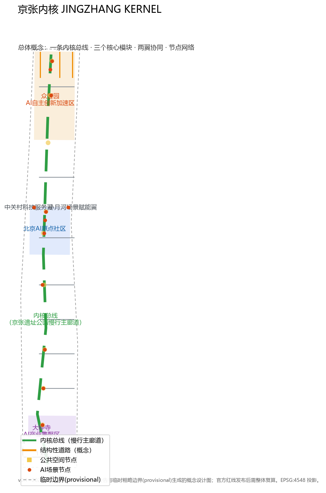
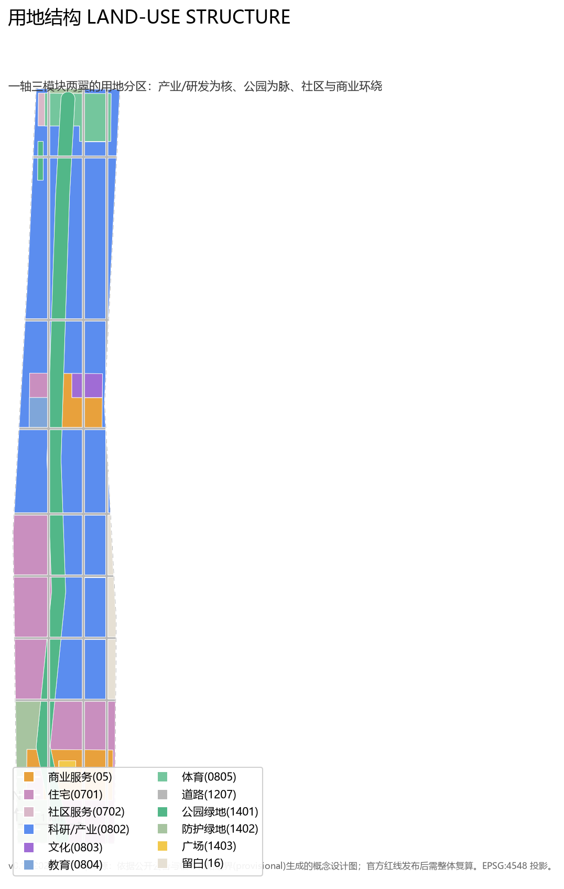
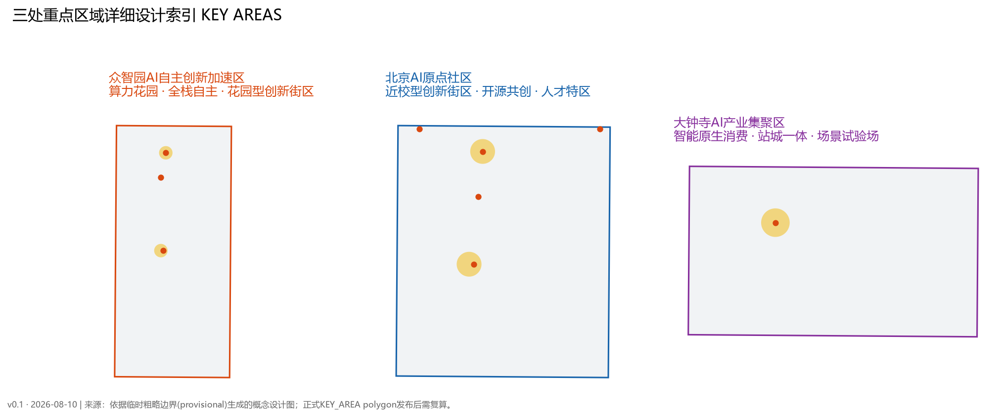
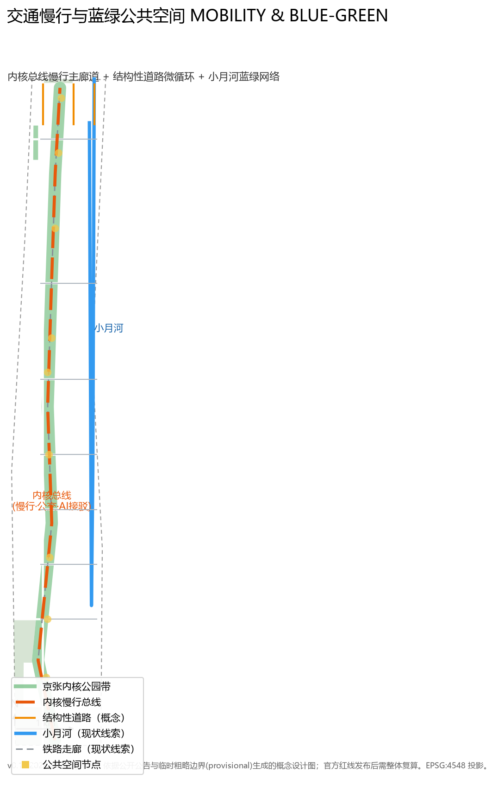
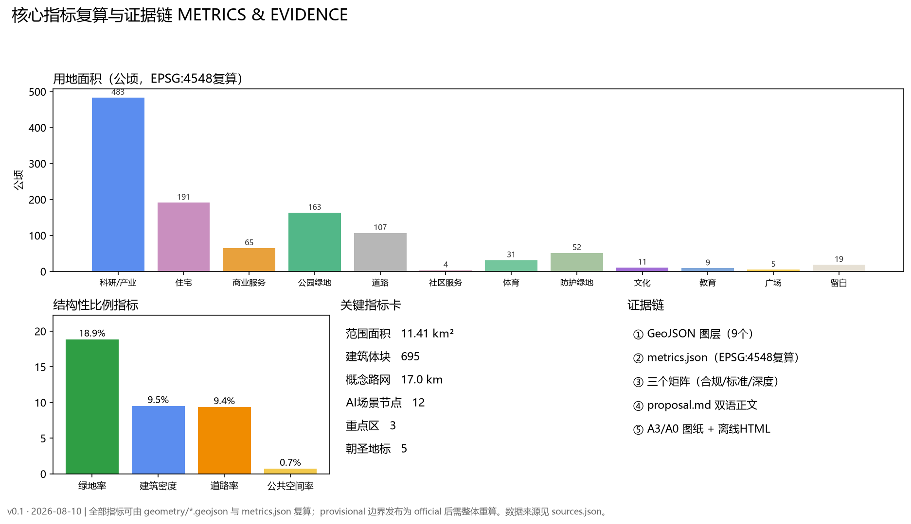

# 京张内核 JingZhang Kernel

## 设计依据与资料清单

本方案以北京市规划和自然资源委员会海淀分局发布的《百年京张AI创新带城市设计国际方案征集资格预审公告》为第一依据，公告给出项目名称、三层范围、三处重点区域、面积与文字四至，以及 1.3、1.4、1.5 节的设计任务和成果深度要求 [source:OFFICIAL-ANNOUNCEMENT]。面向智能体任务书补充了三大定位、五大功能、三区两翼、六项智能体任务（agent.1–agent.6）与统一边界条款 [source:AGENT-TASKBOOK]。

资料使用遵循 `data/source_registry.json` 的边界：正式公告与面向智能体任务书可作为 formal 任务依据；`brief/site-package/geometry/provisional_boundaries.geojson` 仅作为 provisional intake 边界，用于生成、展示与自检，不作为官方红线或精确面积依据 [source:SOURCE-REGISTRY] [source:BOUNDARY-SOURCE]。`data/processed/agent_fact_pack.md` 作为阅读导航层，帮助把三层范围、任务清单、资料可用性与缺口整理成可读结构 [source:PROCESSED-FACT-PACK]。

本方案的空间图层、指标、标准与任务覆盖分别保存在 `geometry/*.geojson`、`metrics.json`、`standard_matrix.json`、`design_depth_matrix.json` 与 `compliance_matrix.json`。正文只在与判断直接相关处放置少量证据锚点，机器可复核的完整索引见上述结构化文件 [source:SITE-PACKAGE]。

## 三层范围工作框架

公告明确了三个层级的工作范围，本方案按"产业战略—总体设计—重点片区"逐级落实：

| 层级 | 名称 | 面积 | 边界与工作深度 |
| --- | --- | --- | --- |
| L1 | 统筹研究范围 | 43.6 km² | 北至北五环路、东至京藏高速、南至西直门外大街、西至万泉河路；完成产业生态与未来城市战略研究 [source:OFFICIAL-ANNOUNCEMENT] |
| L2 | 总体设计范围 | 11.4 km²（约） | 京张遗址公园周边1—2公里城市地区；完成控规深度城市设计 [data:geometry/site_boundary.geojson#SITE-001] |
| L3 | 重点区域范围 | 368.4 ha（约） | 众智园、AI原点、大钟寺三处；完成规划综合实施方案深度城市设计 [data:geometry/key_areas.geojson] |

官方精确 polygon 尚未发布，本方案使用临时粗略边界完成空间生成。`site_boundary.geojson` 面积 1141.3 ha，与公告约 11.4 km² 一致（偏差来自粗略边界，非官方值）；三处重点区复算面积为 192.9 / 104.3 / 72.0 ha，与公告 192.1 / 104.3 / 72.0 ha 的偏差分别为 +0.4% / 0.0% / +0.06%，均在粗略边界精度内 [metric:key_area_zhongzhiyuan_sqm] [metric:key_area_ai_origin_sqm] [metric:key_area_dazhongsi_sqm]。官方 polygon 发布后，site boundary、key areas、land use、buildings、roads、green/public space、phasing 与全部面积类指标需整体重算 [source:BOUNDARY-SOURCE]。

## 统筹研究范围产业与未来城市研究

### 总体概念与命名体系（agent.1）

本方案提出主名称「**京张内核 JingZhang Kernel（JZK）**」。1909 年詹天佑主持建成中国第一条自主设计建造的干线铁路——京张铁路；一百多年后，海淀在铁路遗址上建设面向人工智能时代的创新带。"内核"一词把这条自主之路延伸为"自主可控的 AI 城市内核"，与"城市大脑""智脉"等既有叙事错开，形成可延展的命名体系：

- **Kernel Bus（内核总线）**：京张遗址公园慢行主廊道，全长约 9.7 km 的概念慢行与公共服务主轴 [data:geometry/roads.geojson#RD-011]；
- **K0 众智园 · 算力内核**：AI 全栈自主创新加速区，承载公共算力、基础模型与自主创新；
- **K1 北京AI原点社区 · 人才内核**：近校型创新街区，承载人才、开源共创与成果转化；
- **K2 大钟寺 · 场景内核**：AI 产业集聚区，承载智能原生消费、测试验证与站城一体；
- **W-S 中关村科技服务翼**：要素全球化配置、中关村 IP 与资本赋能的服务总线；
- **W-E 小月河场景赋能翼**：AI 场景与城市活力试验的场景端口。

Logo 方向：以"双轨—电路"为母题——两条平行铁轨演化为"内核总线"，三个模块化为三个芯片引脚节点，两翼化为总线两侧的扩展端口；色彩采用轨道灰、开源青绿与中关村蓝。该方向为概念建议，字体、图形均不使用未授权素材 [source:AGENT-TASKBOOK] [depth:overall_spatial_structure]。

### 三大定位、五大功能与三区两翼协同回路

方案把三大定位（百年京张文化带、都市AI生活体验带、AI融合创新带）落到"一条总线承载三种体验"：内核总线既是文化带（遗址叙事）、又是生活带（慢行与公共生活）、也是创新带（场景节点与开放平台）[source:AGENT-TASKBOOK]。

五大功能形成协同回路：AI全栈自主创新体系（K0）→ 世界级AI创新生态（K1 人才与开源）→ AI+场景赋能新范式（K2 与 W-E）→ 智能化AI活力城市（总线与社区）→ AI治理全球话语权（开源治理、荣誉体系与全球活动），并由 W-S 服务翼提供资本、IP、数据与政策要素回流 [data:geometry/land_use.geojson#LU-004]。

### 全球 AI 创新生态案例（agent.2）

研究 8 个全球案例并提炼可转化机制（完整来源见 `sources.json`）：

| 案例 | 区位 | 关键机制 | 可转化到本方案的机制 |
| --- | --- | --- | --- |
| 美国波士顿 Kendall Square | MIT 周边 | 高校—产业—风投步行可达的"创新街区" | K1 以高校为锚，构建步行 10 分钟创新圈 |
| 英国伦敦 King's Cross | 城市更新区 | 铁路遗产更新 + 高校（中央圣马丁）带动 | 内核总线以铁路遗址为文化锚，导入教育科研 |
| 新加坡 one-north | 纬壹科技城 | 主题集群（生命科学/信息通信）+ 公共实验室 | K0 设立公共算力与共享实验平台 |
| 法国巴黎 Station F | 火车站改造 | 巨型创业园区 + 大企业开放创新 | 大钟寺站城一体引入"场景试验场"运营 |
| 法国巴黎-萨克雷 | 科学城 | 大学—研究机构集聚 + 公交导向 | L1 层面加强高校与研发单元轨道衔接 |
| 中国深圳南山 | 科技园城区 | 企业—人才—场景自循环 | 中关村科技服务翼承接资本与场景回流 |
| 中国杭州未来科技城 | 新城片区 | 龙头企业生态 + 人才公寓 | 众智园配置人才公寓与产城融合配套 |
| 韩国板桥科技谷 | 产业园 | 政府引导 + 大企业孵化 + 展示体验 | 场景展示廊与开放测试场地机制 |

以上案例只作为设计参考与机制来源，不作为空间或数据结论，且不构成任何招商、产值或政策承诺 [source:AGENT-TASKBOOK]。

### 区级公开统计与设计判断

方案引用海淀区官方发布的 2025 年国民经济和社会发展统计公报与海淀概况，把产业与人才判断收敛到可核验的区情上 [source:SRC-HAIDIAN-STATS-2025] [source:SRC-HAIDIAN-OVERVIEW-2026]：

| 公开统计（2025年） | 数值 | 本方案的设计判断 |
| --- | --- | --- |
| 地区生产总值 | 13691.4 亿元，+7.2%；第三产业占 92.56% | L1 产业定位聚焦科技服务与 AI 场景，不需要重工业载体 |
| 备案上线大模型 | 123 款，占全市 60% | K0 公共算力花园与模型评测/验证场景有真实需求底座 |
| 全国重点实验室 | 92 家，占全市 63.4%、全国 17.9% | K1 近校转化与"策源—验证—开源"链条 |
| 每万人高价值发明专利 | 599 件，为全国平均 37.4 倍 | 成果转化空间与知识产权服务需求 |
| 技术合同 | 成交额 4053.1 亿元，+6.5%；输出占全市 52.5% | 中关村科技服务翼的转化服务机制 |
| 常住人口 | 311.1 万人，外来人口占 33.0% | 人才服务、职住平衡与多文化公共空间需求 |
| 人才资源总量 | 200.58 万人；两院院士 692 名，占全国 36.23% | "人才内核"定位与人才画像的区情依据 |
| 统一开源智算系统软件栈"众智" | 迭代升级，摆脱国外依赖 | 与"众智园·算力内核"命名形成现实呼应 |

上述数据仅用于产业生态、人口与公共服务需求的背景判断，不作为空间控制、面积或工程依据；2025 年数据为初步数，引用以官方发布为准 [source:SRC-HAIDIAN-STATS-2025] [source:SRC-HAIDIAN-OVERVIEW-2026]。

## 总体设计范围城市更新与控规深度城市设计

### 总体空间结构

总体设计范围采用"**一轴、三模块、两翼、十二节点**"结构 [depth:overall_spatial_structure]：

- **一轴**：内核总线（京张遗址公园慢行主廊道），串联南北，承载文化展示、慢行、公交接驳与 AI 场景；
- **三模块**：K0 众智园（北）、K1 AI原点（中）、K2 大钟寺（南），对应三处重点区域；
- **两翼**：西侧中关村科技服务翼、东侧小月河场景赋能翼；
- **十二节点**：沿总线布置 12 个 AI 场景节点与公共空间节点，形成"地铁站—社区—园区—公园"的多模式接驳网 [data:geometry/constraints.geojson]。

用地布局以科研产业用地（0802，483.5 ha，占 42.4%）为内核，居住与社区（0701+0702，195.0 ha，17.1%）保障职住平衡，公园绿地（1401，163.4 ha，14.3%）形成贯穿南北的绿脉，道路用地（1207，107.0 ha，9.4%）支撑街区骨架，商业（05，64.9 ha）、体育（0805，31.5 ha）、文化（0803，11.2 ha）、教育（0804，9.0 ha）、广场（1403，5.3 ha）与留白（16，18.7 ha）构成多元功能 [data:geometry/land_use.geojson#LU-004] [metric:land_use_area_0802_sqm]。

### 城市更新总体框架

更新遵循"保留文脉、低扰动、渐进式"原则：京张铁路遗址与清华园站旧址周边以保护与活化为主，不提出突破文保与蓝绿控制的工程结论；产业空间以"功能置换+公共空间织补"为主，不预设地块拆改留结论 [source:OFFICIAL-ANNOUNCEMENT] [depth:retain_renovate_demolish]。控规层面，容积率、建筑高度、建筑密度、绿地率、退线与道路红线均属待补官方资料，本方案不给出审定指标，只提供概念建议与待确认条件 [depth:development_intensity_controls]。

## 重点区域详细设计

三处重点区域均以"定位—空间结构—更新策略—交通慢行—公共空间—AI 场景—实施风险"组织详细设计，当前 polygon 为 provisional，结论均为方向性概念 [data:geometry/key_areas.geojson] [depth:three_key_area_detailed_design]。

### K0 众智园 · 算力内核（192.1 ha，复算 192.9 ha）

- **定位**：花园型 AI 自主创新街区，承载公共算力、基础模型与全栈自主创新；
- **空间结构**：中央科研带 + 北侧社区服务与体育设施 + 南侧花园式研发街区 [data:geometry/land_use.geojson#LU-004]；
- **更新策略**：以"算力花园"为概念，将公共算力中心、开放实验室与景观一体化布置，不预设拆改留；
- **交通慢行**：内核总线北段贯通，设置自动驾驶接驳测试段（概念）[data:geometry/constraints.geojson#SCN-010]；
- **公共空间**：内核北门站·开发者荣誉墙、众智园创新市集广场 [data:geometry/public_space.geojson#PS-009]；
- **AI 场景**：公共算力花园、开源成果展示廊、自动驾驶接驳测试段 [data:geometry/constraints.geojson#SCN-008]；
- **风险**：无官方控规与权属资料，建筑体量为概念示意，需专业复核。

### K1 北京AI原点社区 · 人才内核（104.3 ha，复算 104.3 ha）

- **定位**：近校型创新街区，人才吸引、成果孵化转化与开源共创；
- **空间结构**：南侧孵化转化带、中部教育科研与近校商业活力带、北部人才社区与京张·中关村文化馆群 [data:geometry/land_use.geojson#LU-006]；
- **更新策略**：依托高校资源低扰动更新，不将高校、园区改造写成已获权属同意；
- **交通慢行**：清华园站旧址纪念广场与学院路知识交换站构成步行接驳节点 [data:geometry/public_space.geojson#PS-005]；
- **公共空间**：AI原点开源广场——面向全球开发者的开源成果展示与共创空间 [data:geometry/public_space.geojson#PS-006]；
- **AI 场景**：AI 文化导览起点、开源广场共创空间、健康服务导航（人工复核优先）[data:geometry/constraints.geojson#SCN-002]；
- **风险**：轨道站点一体化与文保控制范围待官方资料确认。

### K2 大钟寺 · 场景内核（72.0 ha，复算 72.0 ha）

- **定位**：城市型 AI 产业集聚区，智能原生消费、智能终端与内容消费；
- **空间结构**：大钟寺站前广场为核心，周边商业服务业用地为主，西缘保留居住用地 [data:geometry/land_use.geojson#LU-011]；
- **更新策略**：站城一体概念，强化地铁站四象限步行连通，不把站体改造写成已批准工程；
- **交通慢行**：大钟寺站前广场组织多方式接驳与静态交通概念 [data:geometry/public_space.geojson#PS-001]；
- **公共空间**：大钟寺AI会客厅（场景体验与展示）[data:geometry/public_space.geojson#PS-002]；
- **AI 场景**：智能体消费体验区、低速机器人配送测试环、AI 会客厅 [data:geometry/constraints.geojson#SCN-006]；
- **风险**：道路红线、断面与市政管线待补，慢行与停车组织仅为概念。

## AI 创新生态、人才画像与 AI+ 场景

### 用户画像（5 类以上）

| 画像 | 特征 | 主要空间需求 | 对应场景 |
| --- | --- | --- | --- |
| P1 算法工程师/开源开发者 | 25—35 岁，通勤+远程混合 | 公共算力、共创空间、深夜慢行安全 | SCN-002、SCN-008、SCN-009 |
| P2 AI 初创企业创始人 | 30—45 岁 | 孵化器、验证场地、资本对接 | SCN-005、SCN-007、SCN-010 |
| P3 高校研究生/青年教师 | 22—35 岁 | 实验室、讲座、低租金创新工位 | SCN-001、SCN-004 |
| P4 社区居民/老年人 | 60 岁以上 | 无障碍、人工服务、健康与生活服务 | SCN-003、SCN-011 |
| P5 园区企业白领 | 25—45 岁 | 通勤接驳、餐饮商业、公共绿地 | SCN-004、SCN-006 |
| P6 国际访客/朝圣者 | 各年龄 | 双语导览、文化地标、活动日历 | SCN-001、SCN-012 |

### AI 场景卡（12 张，其中 4 张为测试验证场景）

| 编号 | 场景 | 空间节点 | 服务对象 | 数据与隐私边界 | 人工复核 | 运营主体（概念） | 状态 |
| --- | --- | --- | --- | --- | --- | --- | --- |
| SCN-001 | 京张AI文化导览 | 清华园站旧址纪念广场 | 访客/学生 | 位置与偏好可选，匿名化 | 讲解内容专家审校 | 公园运营+文化馆 | 概念建议 |
| SCN-002 | AI原点开源广场共创 | AI原点开源广场 | 开发者 | 代码公开、个人信息脱敏 | 开源理事会审核 | 社区自治组织 | 概念建议 |
| SCN-003 | AI健康服务导航 | AI原点社区 | 居民/老人 | 不采集医疗数据，仅导航 | 人工客服兜底 | 社区卫生中心 | 概念建议 |
| SCN-004 | AI交通步行友好 | 学院路知识交换站 | 通勤者 | 客流聚合数据，不识别个人 | 交警+运营复核 | 交通运营方 | 概念建议 |
| SCN-005 | 企业服务Copilot | 小月河翼 | 企业 | 企业授权数据，最小化 | 合同与法务复核 | 产业服务公司 | 概念建议 |
| SCN-006 | 大钟寺智能体消费 | 大钟寺站前 | 市民 | 消费数据不共享，可退订 | 消费者委员会监督 | 商业运营商 | 概念建议 |
| SCN-007 | 低速机器人配送测试环 | 大钟寺 | 商户/居民 | 限定线路与时段，实时可停 | 安全员+远程接管 | 测试联盟 | **测试验证** |
| SCN-008 | 公共算力花园 | 众智园 | 开发者/企业 | 算力配额可审计 | 算力委员会复核 | 平台运营方 | 概念建议 |
| SCN-009 | 开源成果展示廊 | 众智园 | 开发者 | 公开作品授权展示 | 版权与来源审查 | 项目维护者 | 概念建议 |
| SCN-010 | 自动驾驶接驳测试段 | 内核北段 | 通勤者 | 车辆轨迹匿名，全时段可回退 | 安全员+监管备案 | 测试联盟 | **测试验证** |
| SCN-011 | 人才公寓智能社区 | AI原点西 | 人才家庭 | 门禁/能耗数据不出社区 | 物业人工复核 | 社区运营 | 概念建议 |
| SCN-012 | 小月河蓝绿实验室 | 小月河翼 | 居民/学生 | 环境公开数据 | 专业复核 | 高校+环保组织 | **测试验证** |

所有场景均为"概念建议/可供专业团队深化研究"，不表述为已批准运营；涉隐私场景坚持最小化采集、匿名化、人工复核与可退出原则 [source:AGENT-TASKBOOK] [depth:risk_missing_data]。

## 用地、建筑规模与拆改留方案

用地结构以科研产业为内核、公园绿脉贯穿南北，形成"北研发—中教育人才—南场景消费"的轴向分工 [data:geometry/land_use.geojson]：

- 科研用地（0802）483.5 ha，占 42.4%，分布在众智园、AI原点南段与两翼；
- 居住与社区（0701+0702）195.0 ha，占 17.1%，围绕人才社区与既有生活区；
- 公园与防护绿地（1401+1402）215.2 ha，占 18.9%，以内核总线为主脉 [metric:green_ratio]；
- 道路用地（1207）107.0 ha，占 9.4%，对应 17.0 km 概念结构性道路 [metric:road_centerline_length_m]；
- 商业（05）64.9 ha，体育（0805）31.5 ha，文化（0803）11.2 ha，教育（0804）9.0 ha，广场（1403）5.3 ha，留白（16）18.7 ha。

建筑体量以 701 个概念体块表达空间结构（基底合计 109.8 ha，建筑密度 9.6%），体块类型覆盖 AI 研发、实验室、孵化器、办公、教育、文化、商业、居住与人才公寓 [data:geometry/buildings.geojson] [metric:building_count]。所有体量均为概念示意：现状建筑底数、权属、控规指标与工程条件缺失，拆改留只作方向性分类（保留文脉、功能置换、公共空间织补、留白储备），不给出地块级结论 [source:BOUNDARY-SOURCE] [depth:retain_renovate_demolish]。

## 交通、轨道、市政与公共服务设施

### 交通与轨道

方案以"内核总线+结构性道路+轨道接驳"组织交通：内核总线承担慢行与公交接驳主轴；2 条南北结构性道路与 7 条东西道路构成街区骨架（概念线位，非红线）[data:geometry/roads.geojson]；大钟寺站、清华园站旧址周边布置站城一体与多方式接驳节点 [source:OFFICIAL-ANNOUNCEMENT]。道路红线、断面与轨道线位待官方资料确认，本方案不给出工程线位或施工可行性结论 [depth:traffic_rail_slow_parking]。

### 市政与新型基础设施

市政策略聚焦"融合承载"：分布式能源、端侧算力、低速配送网络与公共空间复合，不给出管线迁改、消防通道或市政容量工程结论；公共算力、开源平台与场景测试作为新型基础设施纳入街区运营 [source:AGENT-TASKBOOK] [depth:municipal_new_infrastructure]。

### 公共服务设施

按"10 分钟生活圈"配置社区服务（0702，3.6 ha）、教育（0804，9.0 ha）、体育（0805，31.5 ha）、文化（0803，11.2 ha）与广场（1403，5.3 ha），服务设施容量与底数待官方数据补充 [data:geometry/land_use.geojson#LU-003]。

## 蓝绿空间、公共空间与城市风貌

### 京张内核公园带

以京张遗址公园为文化主线，形成宽约 180 m 的概念公园廊道（1401 公园绿地 163.4 ha + 防护绿地 51.8 ha，合计绿地率 18.9%），串联三处重点区域与 9 个公共空间节点 [data:geometry/green_space.geojson] [metric:green_ratio]。小月河作为蓝绿线索贯通东翼，与公园带构成"一纵一横"蓝绿网络 [data:geometry/constraints.geojson#CON-WTR-001]。

### AI 朝圣地标（5 个，agent.4）

1. **清华园站旧址纪念广场**——百年铁路记忆起点；
2. **AI原点开源广场**——开源共创与成果发布；
3. **开源成果展示廊**——贡献者作品与迭代记录展示；
4. **开发者荣誉墙（内核北门站）**——智能体与人类贡献者共同纪念；
5. **京张AI文化导览起点**——文化—科技融合叙事的入口。

地标均为概念节点，不得突破文保、绿地、蓝线与交通安全约束，不表述为已批准建设 [data:geometry/public_space.geojson] [depth:blue_green_public_space]。

### 城市风貌

风貌基调为"轨道记忆+开源理性"：公园带两侧控制建筑体量，产业街区采用理性网格与可识别地标组合，社区街区强调人性尺度；屋顶、材料与色彩仅作方向性建议，建筑高度与体量控制待官方控规确认 [standard:MOHURD-URBAN-DESIGN-MEASURES]。

## 更新项目清单、实施政策与分期计划

### 更新项目清单（概念）

| 项目 | 类型 | 位置 | 依赖条件 | 实施主体（概念） |
| --- | --- | --- | --- | --- |
| 内核总线贯通工程 | 公共空间 | 全线 | 公园实施边界、文保控制线 | 区政府+公园运营 |
| 清华园站旧址活化 | 文化 | K1 | 文保审批 | 文物+文旅 |
| AI原点开源广场 | 公共空间 | K1 | 权属确认 | 社区+开源组织 |
| 公共算力花园 | 产业配套 | K0 | 算力政策与能源 | 平台公司 |
| 大钟寺站城一体 | 交通/商业 | K2 | 轨道与道路红线 | 轨道公司+商业 |
| 小月河蓝绿廊道 | 蓝绿空间 | W-E | 蓝线管理 | 水务+公园 |

### 分期计划

- **一期（2026—2028）AI原点+内核中段**：开源广场、文化导览、慢行贯通，复算面积 293.1 ha [data:geometry/phasing.geojson#PH-001]；
- **二期（2028—2031）众智园+内核北段**：公共算力花园、展示廊、自动驾驶测试段，复算面积 196.7 ha [data:geometry/phasing.geojson#PH-002]；
- **三期（2031—2035）大钟寺+内核南段+两翼**：站城一体、机器人配送测试环、蓝绿实验室，复算面积 401.6 ha [data:geometry/phasing.geojson#PH-003]。

### 全球 AI 创新活动体系与长期运营（agent.6）

- **年度活动体系**：京张AI开源周（展示廊+荣誉墙发布）、内核开发者日（月度）、全球AI创新大会（年度）、"自主之路"朝圣之旅（年度文化路线）；
- **活动品牌**：以"JZK"视觉系统统一活动主视觉，与 Logo 方向一致；
- **开发者社区运营**：开源共创协议、贡献者荣誉墙、代码与设计双轨贡献者等级；
- **场景开放运营**：测试场景联盟、公开数据集与回退机制、运营商准入清单；
- **国际传播与招引转化**：双语导览、全球案例库、人才—企业—资本转化路径。

以上活动、招商、资金与政策安排均为概念建议，不表述为已确定政府安排 [source:AGENT-TASKBOOK] [depth:phasing_implementation]。

## 指标体系、面积复算与合规矩阵

核心指标全部由 `geometry/*.geojson` 在 EPSG:4548 下复算（完整清单见 `metrics.json`）：

| 指标 | 值 | 设计含义 |
| --- | --- | --- |
| 总体设计范围面积 | 1141.3 ha | 与公告约 11.4 km² 一致（provisional）[metric:site_area_sqm] |
| 绿地率 | 18.9% | 公园带+防护绿地支撑慢行与气候韧性 [metric:green_ratio] |
| 公共空间率 | 0.75% | 节点广场网络（另有公园绿地 18.9%）[metric:public_space_ratio] |
| 建筑密度 | 9.6% | 概念体块密度，控规指标待官方确认 [metric:building_density] |
| 概念路网 | 17.0 km | 结构性道路与慢行主轴 [metric:road_centerline_length_m] |
| 重点区域 | 3 处 | 众智园 192.9 / AI原点 104.3 / 大钟寺 72.0 ha [metric:key_area_count] |
| AI 场景节点 | 12 个 | 场景—空间—运营映射 [metric:scenario_node_count] |
| 朝圣地标 | 5 个 | 荣誉与纪念体系 [metric:ai_pilgrimage_landmark_count] |

容积率等法定控规指标状态为 unknown：官方控规条件与精确边界未发布，本方案不给出审定值 [metric:floor_area_ratio]。合规矩阵覆盖公告 1.3、1.4、1.5 全部任务与 agent.1–agent.6；标准矩阵覆盖 5 部强制标准；设计深度矩阵 15 项全部 complete（详见三个矩阵文件）[source:SITE-PACKAGE]。

## 风险、版权与合规说明

- **边界风险**：全部空间结论基于 provisional 边界生成，官方 polygon 发布后必须整体重算；本方案未将临时边界表述为官方红线 [source:BOUNDARY-SOURCE]；
- **资料风险**：控规、道路红线、权属、现状建筑、文保、市政与服务设施底数缺失，相关结论均为待确认事项（见 `assumptions.json`）[depth:risk_missing_data]；
- **概念边界**：所有建设强度、建筑高度、拆改留、工程线位、投资测算与活动安排均为概念建议，不构成政府审定结论或实施承诺 [source:AGENT-TASKBOOK]；
- **版权与数据**：方案文本与图纸由 AI agent 基于公开/清权资料生成，未使用未授权字体、图片、商标、人物肖像或非公开数据；完整声明见 `report/copyright_statement.md`；
- **隐私与伦理**：场景设计坚持最小化采集、匿名化、人工复核与可退出，不设置过度监控或无法人工复核的服务 [source:AGENT-TASKBOOK]。

## 参考资料

1. 北京市规划和自然资源委员会海淀分局：《百年京张AI创新带城市设计国际方案征集资格预审公告》（2026-05-09 发布）[source:OFFICIAL-ANNOUNCEMENT]
2. 面向全球智能体开展百年京张AI创新带城市设计开源征集任务书摘录（用户提供清权摘要，2026-05-18）[source:AGENT-TASKBOOK]
3. 中华人民共和国住房和城乡建设部：《城市设计管理办法》（2017）[standard:MOHURD-URBAN-DESIGN-MEASURES]
4. 中华人民共和国住房和城乡建设部：《城市、镇控制性详细规划编制审批办法》（2011）[standard:MOHURD-CONTROL-DETAILED-PLANNING]
5. 中华人民共和国自然资源部：《国土空间调查、规划、用途管制用地用海分类指南（试行）》（2023）[standard:MNR-LAND-USE-CLASSIFICATION-GUIDE]
6. 项目维护者整理：百年京张 AI 创新带三层范围与三处重点区临时粗略 polygon（2026-06-05）[source:BOUNDARY-SOURCE]
7. 全球创新生态案例公开资料：Kendall Square（MIT）、King's Cross（London）、one-north（Singapore）、Station F（Paris）、巴黎-萨克雷、深圳南山、杭州未来科技城、韩国板桥科技谷（检索日期 2026-08-10，见 `sources.json`）
8. 海淀区统计局：《海淀区2025年国民经济和社会发展统计公报》（2026-04-10 发布）[source:SRC-HAIDIAN-STATS-2025]
9. 北京市海淀区人民政府：《海淀概况》（2026-04-10 更新）[source:SRC-HAIDIAN-OVERVIEW-2026]

完整机器可复核索引以 `sources.json`、`metrics.json` 与三个矩阵文件为准。
