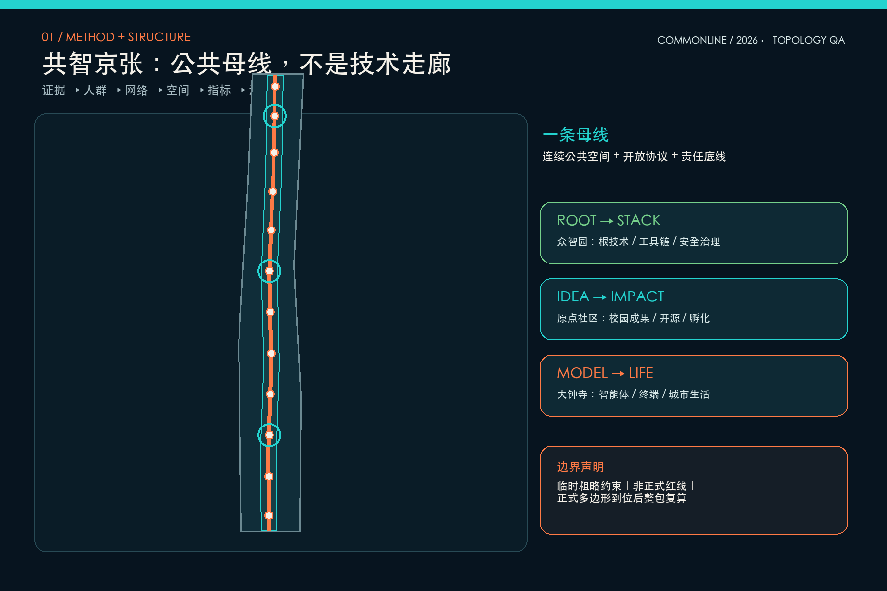
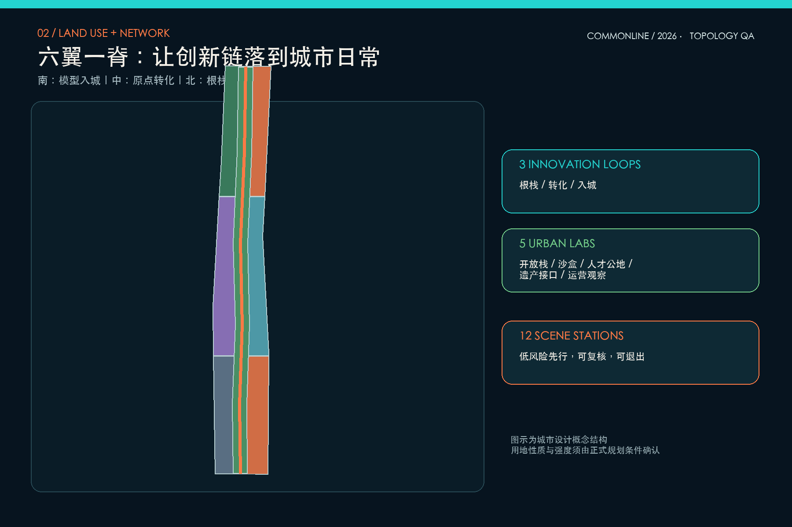
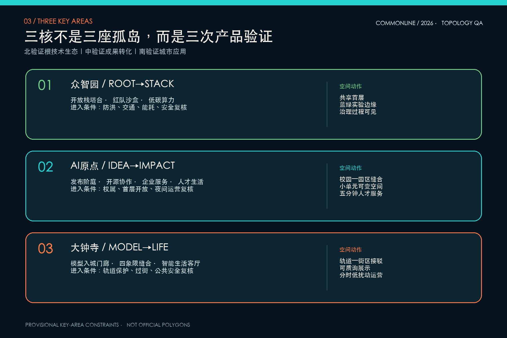
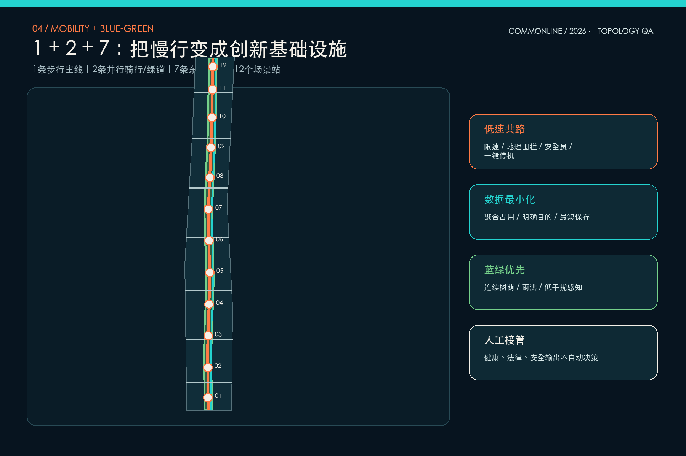
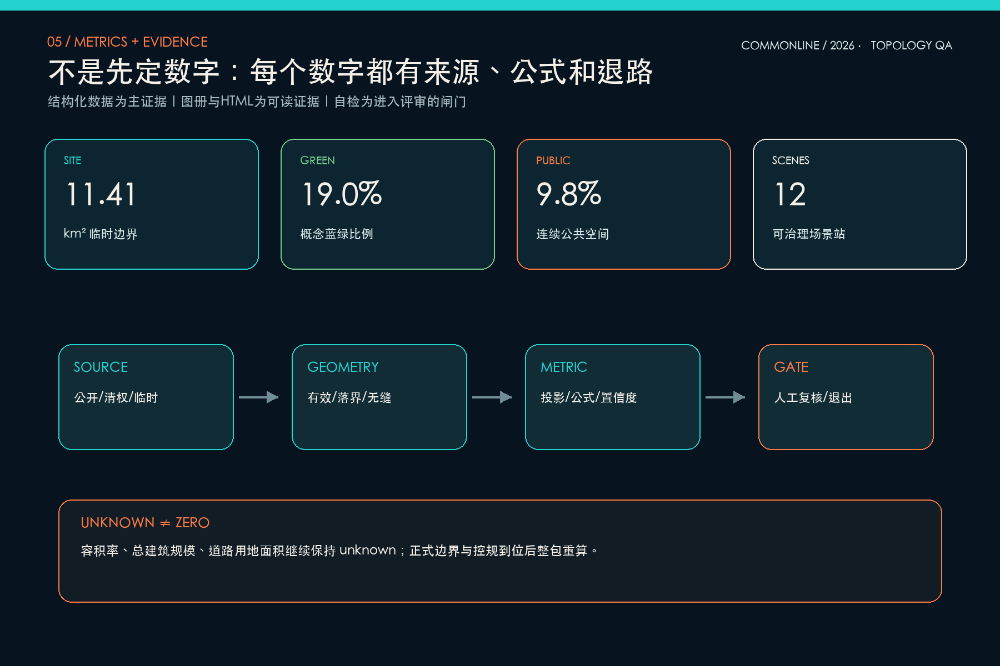

# 共智京张 COMMONLINE

## 设计依据与资料清单

本方案采用“证据—人群—网络—空间—指标—治理”六步闭环。第一步只承认可追溯资料：官方公告确定统筹研究、总体设计和三处重点区域的任务边界；仓库任务书补充智能体征集的场景、品牌、运营与开源要求；临时几何只承担生成和校验约束。第二步从科研人员、创业者、工程师、居民、学生、访客和城市运营者的日常活动出发，不从技术清单倒推城市。第三步把创新链、慢行链、公共空间链和数据治理链叠合；第四步生成可替换的用地、建筑、道路、绿地、公共空间与分期；第五步从几何复算指标；第六步以人工复核、评估阈值和退出机制管理实施。依据包括 [source:OFFICIAL-ANNOUNCEMENT]、[source:AGENT-TASKBOOK]、[source:SITE-PACKAGE]、[source:SOURCE-REGISTRY]、[source:PROCESSED-FACT-PACK]、[source:BOUNDARY-SOURCE]、[source:KEY-AREA-SOURCE]。

国际案例只提炼组织机制：[source:CASE-ONE-NORTH] 的复合园区与连接系统、[source:CASE-STATION-F] 的一站式创业服务、[source:CASE-MARS] 的资本—客户—人才连接、[source:CASE-MILA] 的开放科学与负责任AI、[source:CASE-KNOWLEDGE-QUARTER] 的机构网络以及 [source:CASE-22BARCELONA] 的产业更新与混合使用。它们不提供本项目法定指标。标准响应覆盖 [standard:PROJECT-OFFICIAL-ANNOUNCEMENT]、[standard:PROJECT-AGENT-OPEN-CALL-TASKBOOK]、[standard:MOHURD-URBAN-DESIGN-MEASURES]、[standard:MOHURD-CONTROL-DETAILED-PLANNING]、[standard:MNR-LAND-USE-CLASSIFICATION-GUIDE]、[standard:MOHURD-ARCH-DESIGN-DEPTH-2016]；现状诊断由 [depth:existing_conditions_diagnosis] 管理。当前总体边界和三处重点区均标记 `official_boundary=false`、`geometry_role=provisional_constraint`、`boundary_precision=provisional_rough`，不得作为正式红线或审批依据。[data:geometry/site_boundary.geojson#SITE-001] [data:geometry/key_areas.geojson#PROV-KEY-001]

## 三层范围工作框架

统筹研究层处理约 43.6 平方公里内的创新生态和区域协同，不绘制新的管控线；总体设计层在约 11.4 平方公里临时约束内形成“一条公共母线、三条创新回路、五类城市实验室、十二个场景站”的空间系统；重点设计层分别把众智园、AI原点社区和大钟寺作为根技术、成果转化与城市应用的验证样本。三层之间不是放大关系，而是“战略假设—空间原型—局部证伪”的反馈关系：重点区若无法满足步行、公共服务、运营和安全条件，总体结构必须回退；总体结构若不能支撑产业链闭环，区域战略必须调整。[depth:three_level_scope_framework] [depth:overall_spatial_structure]

COMMONLINE 不是把京张理解为单一景观轴，而是把公共空间变成创新基础设施。主线承担连续步行、绿荫、文化叙事、公共服务与低风险测试；三条回路分别为北段“根技术—工具链—安全治理”、中段“校园成果—开源协作—企业孵化—人才生活”、南段“智能体—终端—内容—消费—公共体验”。五类城市实验室是开放栈实验室、城市沙盒、人才公地、遗产接口和运营观察站。三层范围的几何索引见 [data:geometry/site_boundary.geojson#SITE-001]、[data:geometry/key_areas.geojson#PROV-KEY-002]、[data:geometry/key_areas.geojson#PROV-KEY-003]，任务映射进入 `compliance_matrix.json`，替换正式边界后所有图层统一重算。

## 统筹研究范围产业与未来城市研究

区域策略的判断不是“再造一个科技园”，而是修复三类断裂：科研成果与企业试验之间缺少低成本接口，人才高强度工作与日常生活之间缺少共享客厅，AI能力扩张与公共信任之间缺少可见的治理过程。为此提出“Root-to-Stack、Idea-to-Impact、Model-to-Life”三回路：北段聚集基础模型、工具链、测评和安全治理；中段把高校成果、开源社群、法务知识产权、孵化与人才服务串成步行可达网络；南段让智能体、终端、内容和商业服务在真实城市界面中被看见、被质询、被复核。东翼面向小月河方向构想低风险城市沙盒，西翼承载国际人才、知识产权、资本和专业服务；两翼均是概念协同方向，不是新增边界。[standard:PROJECT-AGENT-OPEN-CALL-TASKBOOK] [depth:overall_spatial_structure]

品牌名“共智京张”强调共同智慧而非单向智能；英文名 COMMONLINE 同时指公共线路、共同底线与开放协议。标志原型由一条不断开的线构成“人”字、铁路道岔和神经节点，色彩采用深京张蓝、开放青和信号橙，不使用第三方商标。三处概念性 AI 朝圣地标分别是北段“开放栈塔台”、中段“原点发布阶庭”、南段“模型入城门廊”：地标靠公共活动与知识贡献形成意义，不以高度竞争。全球案例的共同启示是把机构、空间和服务连续组织，而不是复制建筑造型；案例数量由 [metric:ecosystem_case_count] 记录，地标数量由 [metric:landmark_count] 记录。

## 总体设计范围城市更新与控规深度城市设计

总体空间以中央复合公共母线作为结构性空隙，两侧形成六个功能翼：南段人才生活与智能经济，中段近校协同与城市服务，北段根技术研发与转化服务。中央空间按公园绿地代码表达，但明确只是设计建议；两翼地块仅确定功能接口，不给出未经核验的容积率和高度。用地多边形完整覆盖临时边界且互不重叠，分区接缝按同一投影坐标执行零重叠拓扑，建筑基底避让蓝绿脊，东西缝合通道把两翼重新接入主线。图层证据为 [data:geometry/land_use.geojson#LU-001]、[data:geometry/buildings.geojson#BLDG-001] 和 [data:geometry/roads.geojson#ROAD-001]，深度由 [depth:land_use_layout]、[depth:development_intensity_controls] 与 [depth:height_massing_character] 控制。

更新采用“先界面、后体量；先复用、后增量；先监测、后扩展”。首层优先布置可共享会议、展示、餐饮、社区服务、学习与企业服务，形成至少跨越工作日和周末的时间复合；建筑二层以上再根据现状结构、权属与控规确定研发、办公、居住或实验功能。18 个建筑基底是体量接口原型，不对应具体门牌或拆除对象。道路层表达一条步行主线、两条并行骑行/绿道线和七条东西缝合通道，不替代红线和工程交通组织。容积率、总规模和道路用地面积保持 unknown，避免在资料不足时制造精确感。[standard:MOHURD-CONTROL-DETAILED-PLANNING]

## 重点区域详细设计

众智园定位为“Root-to-Stack 根栈公园”：以开放栈塔台作为知识展示与治理界面，沿清河方向构想低干扰蓝绿实验边缘，内部形成基础研究—工具链—测评—标准—展示的闭环。优先改造可共享首层和闲置空间，设置模型安全红队沙盒、开源工具链工坊、低碳端侧算力站；任何户外测试按预约窗口、地理围栏、人工观察和一键停机运行。河道、防洪、生态和对外交通条件在专业核验前不固化。[data:geometry/key_areas.geojson#PROV-KEY-001]

北京AI原点社区定位为“Idea-to-Impact 原点转化街”：以原点发布阶庭连接校园成果、开源社区、孵化器、知识产权、投融资与人才生活，建筑更新强调小单元、低门槛、可短租和夜间安全；共享学习站、企业服务 Copilot 和成果发布厅围绕步行五分钟的公共界面组织。大钟寺定位为“Model-to-Life 模型入城客厅”：围绕轨道接驳与四象限步行缝合，布置智能体、终端、内容和公共服务的可质询展示，模型入城门廊既是导视也是责任说明界面。两区分别见 [data:geometry/key_areas.geojson#PROV-KEY-002] 与 [data:geometry/key_areas.geojson#PROV-KEY-003]。三处详细设计都坚持留改优先、公共性优先和治理可见，由 [depth:three_key_area_detailed_design] 校核。

## AI 创新生态、人才画像与 AI+ 场景

七类画像不是人口标签，而是任务画像：科研负责人需要安静研究与可预约验证；开源开发者需要协作、发布和贡献声誉；初创团队需要低成本空间、算力入口、法务与首个客户；产品工程师需要真实但可控的测试窗口；居民与照护者需要无障碍、安静时段和可人工求助的公共服务；学生与青年需要学习、运动和夜间安全；国际访客与城市运营者分别需要多语导览和可审计的运行界面。画像只用于空间编程，不建立个人追踪档案。[metric:persona_count]

十二个场景站均落到 [data:geometry/public_space.geojson#SCENE-S01] 至 [data:geometry/public_space.geojson#SCENE-S12]：智能无障碍导航、低速机器人共路、大钟寺模型入城、动态路缘复核、社区公共服务导航、京张文化叙事、原点开源发布、人才共享学习、模型安全红队、低碳端侧算力、众智根栈协作和城市运营观察。[metric:scenario_node_count] 至少三类属于产业测试：机器人共路采用限速、地理围栏和现场安全员；模型红队只用授权测试集并保留审计记录；端侧算力试验以能源上限、热风险和隐私隔离为进入条件。健康、法律、安全等高影响输出只能提供导航和提示，最终决定由有资质人员完成。治理采用“最小数据—明确目的—有限保存—人工复核—公开申诉—可随时退出”六道闸门。

## 用地、建筑规模与拆改留方案

用地结构按公开分类子集表达：科研、教育、商业服务、住宅、社区服务和公园绿地围绕公共母线混合组织；面积可从七个互不重叠的多边形复算，但这些分区不是用地性质调整决定。建筑原型分为研发实验、孵化办公、混合服务、人才居住、社区服务、文化展示和接驳设施，均位于蓝绿脊之外。当前只计算概念基底 [metric:building_footprint_area_sqm]，总建筑规模与容积率保持 unknown。用地标准依据 [standard:MNR-LAND-USE-CLASSIFICATION-GUIDE]，图层入口为 [data:geometry/land_use.geojson#LU-007] 与 [data:geometry/buildings.geojson#BLDG-001]。

拆改留采用四级证据门：一级核验建筑年代、结构安全、权属和合法性；二级评估历史文化、产业记忆、碳排和社区使用价值；三级比较原位修缮、功能置换、加建和新建的全生命周期成本；四级通过公众沟通和专业审查决定。未完成四级证据前不标注“拆除”。本方案 18 个体量接口仅用 `retain_and_activate`、`renovate_first` 和 `infill_after_survey` 表达倾向，不映射到具体房屋。屋顶、首层、街角和连廊作为公共性控制重点，高度、退线、消防间距和停车须等待正式条件。[depth:retain_renovate_demolish] [depth:height_massing_character]

## 交通、轨道、市政与公共服务设施

交通采用“1+2+7”慢行骨架：一条连续步行主线、两条并行骑行/绿道线、七条东西缝合通道。南中北三处接驳节点优先连接轨道与重点区，其余通道服务社区、校园和企业日常穿行。评价不追求道路数量，而看连续阴影、无障碍坡度、过街等待、夜间照明、冲突点和人工求助距离。机器人只进入指定低速窗口，动态路缘只使用聚合占用数据并保留人工交通管理权。概念网络长度记录于 [metric:road_centerline_length_m]，空间入口为 [data:geometry/roads.geojson#ROAD-001]，专业深度由 [depth:traffic_rail_slow_parking] 管理。

市政与新基建实行“嵌入而不炫技”：端侧算力、感知、充换电、雨洪监测、照明和公共 Wi-Fi 共享维护廊与能源预算；公共服务节点提供医疗、教育、法律和生活服务导航，但不替代专业服务。每个设备须有责任主体、数据清单、保存期限、维护窗口和退役方案。道路红线、地下管线、供配电、热环境、消防、防洪和轨道保护条件尚缺，故 [data:geometry/constraints.geojson#CONSTRAINTS] 保持空约束集而不是伪造控制线，待资料到位后再叠加。设施深度由 [depth:municipal_new_infrastructure] 管理。

## 蓝绿空间、公共空间与城市风貌

蓝绿系统把中央 112 米概念缓冲带转译为连续学习景观：树荫步行、骑行、雨洪花园、季节草地、低干扰感知和十二个公共节点共享同一维护逻辑；宽度只是当前几何生成参数，不是法定绿线。公共空间用更窄的连续客厅和节点广场表达，使创新活动不会吞噬生态底盘。绿地面积与比例为 [metric:green_space_area_sqm]、[metric:green_ratio]，公共空间面积与比例为 [metric:public_space_area_sqm]、[metric:public_space_ratio]；源图层为 [data:geometry/green_space.geojson#GREEN-001] 与 [data:geometry/public_space.geojson#PUBLIC-001]。[depth:blue_green_public_space]

风貌遵循“旧轨迹、新接口、低能耗”。旧轨迹通过连续线、枕木尺度铺装和口述史节点被感知，不复制历史构件；新接口把模型说明、贡献者、数据边界和人工负责人直接做成空间信息；建筑以可改造骨架、深檐、可开窗和共享首层降低能耗。色彩系统以深蓝为底、开放青标识公共与开源、信号橙标识试验边界和人工接管。公共艺术优先邀请社区、科研和设计团队共创并记录版权。整体风貌受 [standard:MOHURD-URBAN-DESIGN-MEASURES] 约束，任何文保结论在正式名录和保护范围核验前保持开放。

## 更新项目清单、实施政策与分期计划

项目库以十个可拆分行动组成：慢行断点审计、连续树荫试点、原点发布阶庭、模型安全沙盒、社区服务导航、大钟寺四象限步行缝合、共智首层更新、低碳端侧算力站、文化叙事站和城市运营观察站。每项均须填写位置、公共价值、责任主体、数据清单、空间依赖、预算级别、试验时限、退出条件和复盘结论。政策上建议建立“场景通行证”：低风险、可逆、数据最小化的场景可先做限期试点；高影响场景必须完成专业审查、公众沟通和独立安全评估。[depth:renewal_project_list]

空间分期不是承诺年份，而是成熟度闸门。第一阶段覆盖南段学习与轻量试点，面积为 [metric:phase_1_area_sqm]；当无障碍、慢行冲突、隐私和运营指标达标后进入第二阶段网络化更新，其面积为 [metric:phase_2_area_sqm]；第三阶段把北段根技术、标准协作和区域网络接入，面积为 [metric:phase_3_area_sqm]。三阶段边界完整覆盖临时总体范围，见 [data:geometry/phasing.geojson#PHASE-001]，替换正式边界后重算。进入下一阶段的硬条件包括正式边界与权属核验、交通市政可行性、责任主体和资金来源明确，以及上一阶段公开评估完成。[depth:phasing_implementation]

## 指标体系、面积复算与合规矩阵

本包以 EPSG:4548 对临时边界复算，得到 [metric:site_area_sqm] = 11412825 平方米；该数值服务于图层一致性，不与公告约数竞争。三处重点区数量为 [metric:key_area_count]。概念建筑基底、蓝绿、公共空间、慢行中心线和三阶段面积分别由 [metric:building_footprint_area_sqm]、[metric:green_space_area_sqm]、[metric:public_space_area_sqm]、[metric:road_centerline_length_m]、[metric:phase_1_area_sqm]、[metric:phase_2_area_sqm]、[metric:phase_3_area_sqm] 记录。比例只从同一临时边界计算：[metric:green_ratio] = 0.1901，[metric:public_space_ratio] = 0.0984。场景、画像、案例和地标计数分别为 [metric:scenario_node_count]、[metric:persona_count]、[metric:ecosystem_case_count]、[metric:landmark_count]。

复算顺序固定为：读取来源状态—投影几何—检查有效性与边界内落位—检查用地无缝无叠—联合求面积—生成指标—把数值回写 HTML 与图册—运行确定性、空间、视觉和专业四类检查。容积率、总建筑规模和道路面积保持 unknown，不在文本中伪装为目标值。`compliance_matrix.json` 将公告 17 项和智能体 6 项任务逐条挂接章节、图层、指标、图纸、来源、假设和自检；`standard_matrix.json`、`design_depth_matrix.json` 分别管理规范和专业深度。方法深度由 [depth:metrics_recalculation] 控制，所有可读数据入口包括 [data:geometry/site_boundary.geojson#SITE-001]、[data:geometry/land_use.geojson#LU-001]、[data:geometry/buildings.geojson#BLDG-001]、[data:geometry/roads.geojson#ROAD-001]、[data:geometry/green_space.geojson#GREEN-001]、[data:geometry/public_space.geojson#PUBLIC-001]、[data:geometry/phasing.geojson#PHASE-001]。

## 风险、版权与合规说明

最大风险不是图画得不够细，而是把临时几何当成正式条件。正式总体边界、重点区多边形、控规、权属、现状建筑、道路红线、轨道保护、市政管线、防洪、消防、公共服务和文保资料缺失，导致落位、面积、强度、拆改留和实施主体都需复核。第二类风险来自 AI：偏差、幻觉、过度采集、自动决策、系统失效和责任模糊；对应措施是限定目的、使用公开或授权数据、最短保存、人工复核、显著告知、申诉和退出。第三类风险是运营热度替代长期公共价值；因此每个试点须评估无障碍、公平、扰民、维护、能源和机会成本。[depth:risk_missing_data] [standard:MOHURD-ARCH-DESIGN-DEPTH-2016]

本方案不声称获得官方批准，不构成控规、土地权属、建设许可或投资承诺。五张图为本项目根据结构化几何和自编文字程序生成，无外部照片、地图瓦片、字体网络请求或第三方标志；COMMONLINE 名称、图形语言、文字、图表和代码为本次原创表达。外部案例只在 `sources.json` 登记链接和使用边界，不复制其图片或版式。HTML 完全离线，不含远程资源、表单或追踪。专业团队使用本方案前应核验来源、边界、版权和技术条件，风险与缺口进入 `assumptions.json`、`self_check.json` 及 [data:geometry/constraints.geojson#CONSTRAINTS]。

## 参考资料

项目主依据为北京市规划和自然资源委员会海淀分局公告、仓库 `brief/site-package/`、`agent_taskbook.json`、`data/source_registry.json` 和处理后的任务导航；国际案例为 one-north、STATION F、MaRS、Mila、London Knowledge Quarter 与 Barcelona 22@ 的公开机构页面。机器引用总表： [source:SITE-PACKAGE] [source:SOURCE-REGISTRY] [source:PROCESSED-FACT-PACK] [source:BOUNDARY-SOURCE] [source:KEY-AREA-SOURCE] [source:OFFICIAL-ANNOUNCEMENT] [source:AGENT-TASKBOOK] [source:CASE-ONE-NORTH] [source:CASE-STATION-F] [source:CASE-MARS] [source:CASE-MILA] [source:CASE-KNOWLEDGE-QUARTER] [source:CASE-22BARCELONA]。设计深度总表： [depth:existing_conditions_diagnosis] [depth:three_level_scope_framework] [depth:overall_spatial_structure] [depth:land_use_layout] [depth:development_intensity_controls] [depth:height_massing_character] [depth:retain_renovate_demolish] [depth:traffic_rail_slow_parking] [depth:municipal_new_infrastructure] [depth:blue_green_public_space] [depth:three_key_area_detailed_design] [depth:renewal_project_list] [depth:phasing_implementation] [depth:metrics_recalculation] [depth:risk_missing_data]。

空间数据共九份：[data:geometry/site_boundary.geojson#SITE-001] [data:geometry/key_areas.geojson#PROV-KEY-001] [data:geometry/land_use.geojson#LU-001] [data:geometry/buildings.geojson#BLDG-001] [data:geometry/roads.geojson#ROAD-001] [data:geometry/green_space.geojson#GREEN-001] [data:geometry/public_space.geojson#PUBLIC-001] [data:geometry/phasing.geojson#PHASE-001] [data:geometry/constraints.geojson#CONSTRAINTS]。它们与 `metrics.json`、三张矩阵、A3 文册、A0 展板和离线 HTML 共同构成提交证据；如正式边界发布，应整包重新生成、复算和校验，而不是手工改一个数字。
