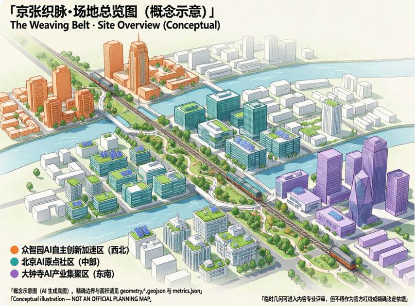
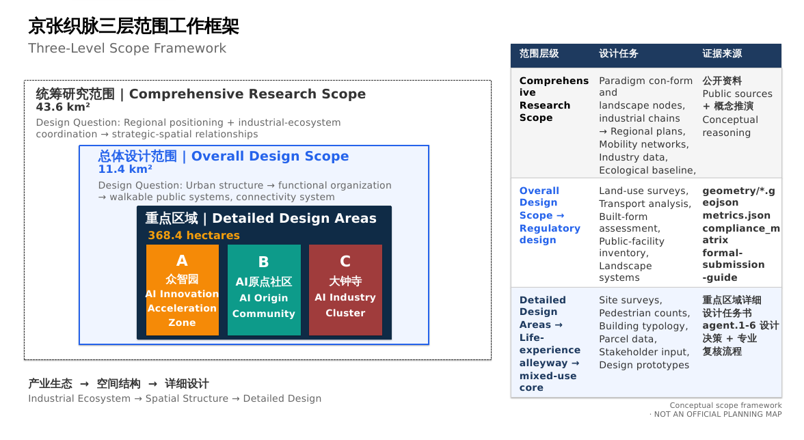
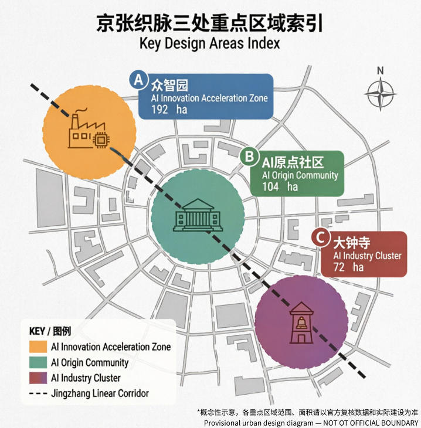
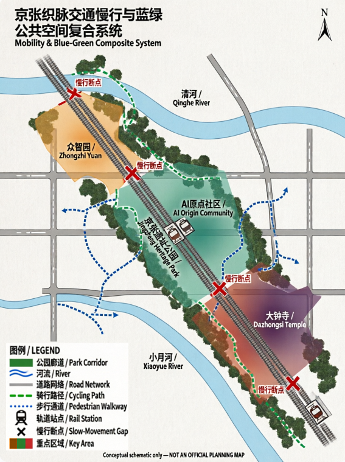
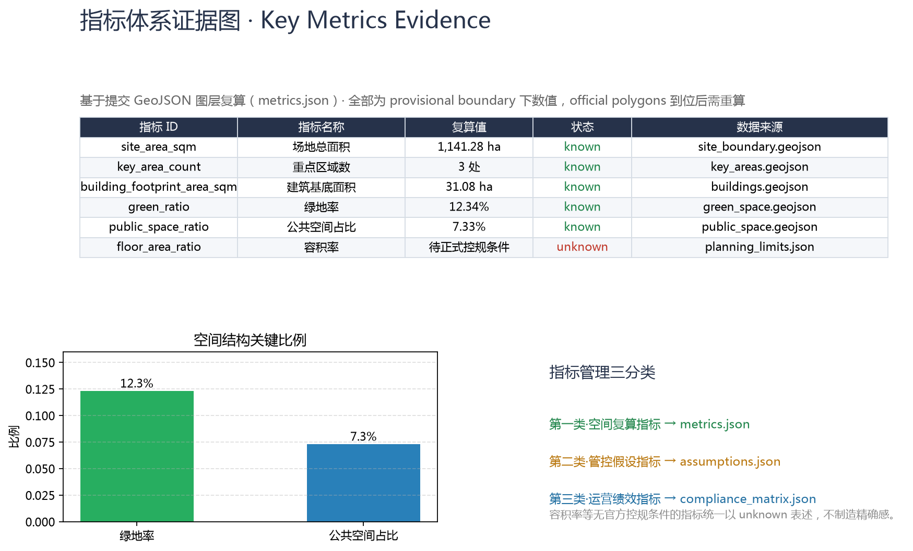

# 京张织脉：一条把百年铁路织进AI未来的创新带

## 设计依据与资料清单

本 formal 方案以北京市规划和自然资源委员会海淀分局发布的《百年京张AI创新带城市设计国际方案征集资格预审公告》为第一依据，并以 `brief/site-package/` 中经维护者登记的临时粗略边界、重点区域、枚举、指标和来源清单为机器可读依据。AI agent 在生成方案前必须读取 `design_brief.json`、`allowed_design_space.json`、`sources.json`、`enums/`、`ranges/`、`schemas/`、`data/source_registry.json` 和 `data/processed/agent_fact_pack.md`，并用 `project_scope_summary.csv`、`agent_task_requirements.csv`、`source_use_matrix.csv`、`missing_data_checklist.csv` 建立任务、范围、资料用途和缺口清单。所有设计判断都要拆分为可追溯来源、可复算指标、可校验图层和可人工复核假设。公告要求方案达到控制性详细规划的城市设计深度和规划综合实施方案的城市设计深度，因此文本叙述不能替代 GeoJSON、指标表、A3 文册、A0 展板和 HTML 电子展示成果。

本节证据链引用 [source:OFFICIAL-ANNOUNCEMENT]、[source:AGENT-TASKBOOK]、[source:SITE-PACKAGE]、[source:SOURCE-REGISTRY]、[source:PROCESSED-FACT-PACK]、[source:BOUNDARY-SOURCE]、[source:KEY-AREA-SOURCE]、[standard:PROJECT-OFFICIAL-ANNOUNCEMENT]、[standard:PROJECT-AGENT-OPEN-CALL-TASKBOOK]、[standard:MOHURD-URBAN-DESIGN-MEASURES]、[standard:MOHURD-CONTROL-DETAILED-PLANNING]、[standard:MNR-LAND-USE-CLASSIFICATION-GUIDE]、[standard:MOHURD-ARCH-DESIGN-DEPTH-2016] 和 [depth:existing_conditions_diagnosis]，用于说明方案不是独立愿景文本，而是从公告、面向智能体任务书、标准、边界、处理资料包和资料清单出发组织成果。

资料登记表的使用边界如下：

- data/source_registry.json 登记公开、清权与临时资料的用途边界。
- 当前登记摘要：formal 可用资料 7 条，背景资料 1 条，provisional-only 资料 1 条。
- agent 不得把 background_only 或 provisional_only 资料升级为 official boundary、法定控规、正式评分依据或政府实施承诺。

`data/processed/agent_fact_pack.md` 是本方案的阅读导航层，不是新的权威来源。[source:PROCESSED-FACT-PACK] 只帮助 agent 把三层范围、三处重点区、公告任务、agent.1-agent.6、资料可用性和缺资料事项组织成可读方案；所有事实判断仍回到 [source:OFFICIAL-ANNOUNCEMENT]、[source:AGENT-TASKBOOK]、[source:SOURCE-REGISTRY]、[source:BOUNDARY-SOURCE] 与 [source:KEY-AREA-SOURCE]。

**资料证据链与提交包关系总览**

| 数据类型 | 来源 | 状态 | 用途边界 |
| --- | --- | --- | --- |
| 场地边界 | `geometry/site_boundary.geojson` | provisional（临时粗略） | 方案生成、自检、可视化和设计讨论；不可作为 official redline、审批依据、精确面积依据或法定控制结论 |
| 重点区域 | `geometry/key_areas.geojson` | provisional（临时粗略） | 同上；三处重点区域（PROV-KEY-001/002/003）待官方 polygon 更新后重算 |
| 用地图层 | `geometry/land_use.geojson` | 基于 provisional boundary 生成 | 待 official polygons 后复算 |
| 道路图层 | `geometry/roads.geojson` | 基于 provisional boundary 生成 | 待 official polygons 后复算 |
| 绿地图层 | `geometry/green_space.geojson` | 基于 provisional boundary 生成 | 待 official polygons 后复算 |
| 公共空间图层 | `geometry/public_space.geojson` | 基于 provisional boundary 生成 | 待 official polygons 后复算 |
| 建筑图层 | `geometry/buildings.geojson` | 基于 provisional boundary 生成 | 待 official polygons 后复算 |
| 指标复算 | `metrics.json` | 基于 provisional boundary | 待 official polygons 后重算 |
| 来源登记 | `sources.json` | 已登记 21 条公开资料 | 所有引用均来自公开来源 |

本脚手架在官方 `SITE_BOUNDARY` 或三处 `KEY_AREA` 尚未取得时，使用 `brief/site-package/geometry/provisional_boundaries.geojson` 生成临时 formal 包。提交包中的 `geometry/site_boundary.geojson` 与 `geometry/key_areas.geojson` 均必须标注为 `provisional_constraint`、`official_boundary=false`，只能用于方案生成、自检、可视化和设计讨论，不能作为 official redline、审批依据、精确面积依据或法定控制结论。该组织方数据缺口本身不阻断内容评分；替换 official polygons 后，site boundary、key areas、land use、roads、green space、public space、buildings、phasing 和 metrics 均需重算。

本次脚手架生成的可评分状态为：**临时边界，保留精度警示并待正式数据发布后复算；不阻断内容评分**。因此，正文中的空间结构、场景、项目和指标均按“可讨论、可复核、可替换官方边界后重算”的原则写入；当官方边界和重点区 polygon 更新后，agent 必须重新运行脚手架、自检和图纸/HTML生成，不能只替换单个文件。

边界和重点区域的可读解释对应 [data:geometry/site_boundary.geojson#SITE-001]、[data:geometry/key_areas.geojson#PROV-KEY-001] 和 [metric:site_area_sqm]、[metric:key_area_count]。这意味着读者可以从正文回到 GeoJSON 查看边界来源、从 metrics 查看面积复算结果、从 sources 查看资料来源，而不是只相信一段文字判断。

## 三层范围工作框架

方案按照公告确定的三个层次组织工作：统筹研究范围关注 43.6 平方公里的AI产业生态、战略定位、创新链和未来城市形态；总体设计范围关注 11.4 平方公里京张遗址公园周边 1-2 公里城市地区和产业区，要求形成城市更新总体框架、产业空间布局、交通市政支撑和城市风貌控制；重点区域范围关注 368.4 公顷三处详细设计地区，要求明确功能业态、建筑规模、拆改留分类、公共空间连通和交通组织。三层范围在 `compliance_matrix.json` 中逐条映射，保证公告 1.3、1.4、1.5 与 agent.1-agent.6 的必选任务都有章节、图层、指标、图纸和 HTML 证据。

三层工作框架的深度项由 [depth:three_level_scope_framework] 和 [depth:overall_spatial_structure] 约束，空间证据以 [data:geometry/site_boundary.geojson#SITE-001] 与 [data:geometry/key_areas.geojson#PROV-KEY-001] 为准，任务依据以 [standard:PROJECT-OFFICIAL-ANNOUNCEMENT] 为准，范围索引以 [source:PROCESSED-FACT-PACK] 中 `project_scope_summary.csv` 的三层范围表为导航。

三层工作不是互相割裂的图纸集合。统筹研究决定产业链和城市形态判断，总体设计把判断落实到更新项目、空间结构和设施承载，重点区域详细设计验证具体地块、建筑、交通、公共空间和AI应用场景的可实施性。agent 生成方案时必须先锁定当前提交采用的 official 或 provisional 边界和约束，再生成用地、建筑、道路、绿地、公共空间、分期和AI服务节点，最后从这些图层复算指标并在正文解释哪些结论仍受 provisional boundary 限制。任何无法从结构化数据复算的面积、比例、规模或项目数量，不得写入正式结论。

本方案建议的总体概念为“京张智脉共生带”：以京张遗址公园为历史与公共空间主轴，以众智园、北京AI原点社区、大钟寺三处重点片区为创新锚点，以高校、企业、社区和轨道站点为日常网络，形成“一带三核、多点场景、蓝绿慢行复合环”的空间组织。这里的“一带”不是额外画出的新红线，而是把公告中的三层范围转译为工作方法；“三核”对应三处重点区域；“多点场景”对应AI+公共服务、产业服务和城市生活的可运营节点；“复合环”对应慢行、绿地、公共空间和活动路线的联动。

| 层级 | 设计问题 | 方案回答 | 数据落点 |
| --- | --- | --- | --- |
| 统筹研究范围 | AI产业生态和未来城市形态如何组织 | 建立“高校策源-开源协作-企业转化-公共体验-国际传播”的创新链 | compliance_matrix.json、standard_matrix.json |
| 总体设计范围 | 产业空间、城市更新、交通市政和风貌如何落图 | 用地、建筑、道路、绿地、公共空间和分期图层共同表达 | [data:geometry/land_use.geojson#LU-001]、[data:geometry/roads.geojson#ROAD-001] |
| 重点区域范围 | 三处片区如何达到详细设计深度 | 分别提出定位、空间动作、AI场景和实施依赖 | [data:geometry/key_areas.geojson#PROV-KEY-001]、[data:geometry/key_areas.geojson#PROV-KEY-002]、[data:geometry/key_areas.geojson#PROV-KEY-003] |

## 总体概念、命名体系与视觉识别（agent.1）

本方案面向 agent.1「一带总体概念与功能统筹方案设计」，提出总体概念「**京张织脉 / The Weaving Belt**」，并给出完整命名体系、Logo 方向与三区两翼协同回路。本节内容为概念建议与参考方案，供专业团队深化研究，不构成政府审定结论（[standard:PROJECT-AGENT-OPEN-CALL-TASKBOOK]、charter.3「概念建议属性」）。

### 1. 总体概念：织脉

主名称定为「**京张织脉**」，英文主名 **The Weaving Belt**，简称「织带」。

命名理据遵循「转喻与隐喻并用」的地名学原则：**「京张」是转喻**——以百年铁路历史地名锚定记忆，回应京张铁路作为中国人自主设计建造第一条干线铁路的工程史；**「织脉」是隐喻**——「织」是动作（经纬交错、互相成全，而不是覆盖与替换），「脉」是生命（文脉、创新脉、城市脉动）。「京张」承历史之实，「织脉」开未来之意，一实一虚、一锚一活，形成可被记住、可被呼喊、可继续生长的命名。

「织」的三层含义与场地深度绑定：

1. **历史织造**：一百年前詹天佑在京张铁路八达岭段设计「人字形」展线，以人力与智慧「织」出中国第一条自主干线铁路；「织脉」承接这份自主建造的精神遗产。
2. **AI 织入**：AI 与城市的关系在本方案中不是「贴标签」或「覆盖式改造」，而是「织入」——像经纬线一样进入既有街区的肌理，与高校、社区、产业互相成全。这正是任务书 charter.4「AI 原生创新」的空间化表达。
3. **未来编织**：三条定位带（文化/生活/创新）如三股线，在 43.6 平方公里上织成一条连续的创新带；「带」（Belt）既是官方定位中的「创新带」，也是织机上的传动带——织机（Lanya 昆雅语本义）在织，带在转。

### 2. 命名体系（品牌架构）

母品牌「京张织脉 / The Weaving Belt」之下，三条定位带对应三根「线」，三区两翼对应「梭、结、翼」：

| 层级 | 官方对象 | 方案命名 | 意象 | 色彩 |
| --- | --- | --- | --- | --- |
| 定位线一 | 百年京张文化带 | **文脉线** Heritage Thread | 铁路文脉的经线 | 铁锈红 |
| 定位线二 | 都市AI生活体验带 | **生活线** Life Thread | 日常生活的纬线 | 生态绿 |
| 定位线三 | AI融合创新带 | **创新线** Innovation Thread | 创新动能的织线 | 科技蓝 |
| 重点区一 | 众智园AI自主创新加速区 | **众智梭** Collective-Wisdom Shuttle | 织机上来回穿梭的梭子——全栈自主创新在带内往返驱动 | — |
| 重点区二 | 北京AI原点社区 | **原点结** Origin Knot | 织物起头的第一个结——AI 创新生态的原点 | — |
| 重点区三 | 大钟寺AI产业集聚区 | **钟声结** Bell-Note Knot | 大钟寺钟声是时间的刻度——产业集聚在此「打结」沉淀 | — |
| 两翼一 | 中关村科技服务翼 | **京翼** Capital Wing | 中关村 IP 与资本之翼 | — |
| 两翼二 | 小月河场景赋能翼 | **月翼** Moon-Wing | 小月河场景赋能之翼 | — |

「结」与「梭」均取自织机部件：织物上的结既是功能节点（起头、换线、收尾），也是记忆点。「原点结」「钟声结」让每个片区名字自带一个可感知的空间意象——未来的人们站在 AI 原点社区能回答「我在这里，这里是 AI 的起点」；站在大钟寺能回答「产业在这里沉淀为时间的刻度」。命名体系同时遵守「叠加而非覆盖」原则：清华园、大钟寺、小月河、中关村等既有地名全部保留，并纳入 agent.5 文化叙事的导视系统，新命名是「织入」而非「替换」。

### 3. Logo 方向：人字形织线

视觉识别的核心符号取自京张铁路最著名的工程符号——**「人字形」展线**。三层含义：

1. **历史**：八达岭人字形展线是詹天佑的工程奇迹，是京张铁路的世界性符号。
2. **人本**：呼应任务书 charter.10「人本治理」——AI 增强人的能力，城市治理以人的尊严为基础。
3. **协作**：人字形是两条线汇聚于一点后分叉——历史线与未来线在「今天」交汇；AI 与人类、铁路与代码、文化与创新在同一个节点相遇。

三个图形方向（供视觉深化，均以开源字体与原创矢量绘制，遵守 charter.2 版权边界）：

- **方向 A「人字形织线」**：三条定位线（铁锈红/生态绿/科技蓝）以人字形展线方式交织，交汇点形成菱形「结」，整体呈「带」的横向延展。
- **方向 B「织机之带」**：抽象织机侧视——上下经线与中间斜向穿梭的梭子，梭子轨迹构成「人」字形，织机与铁路合体，色彩从铁锈红渐变至科技蓝。
- **方向 C「道钉与线」**：一颗京张铁路道钉被三条彩线缠绕，简洁可延展，可发展为 agent.4「第一根道钉」地标装置。

### 4. 三区两翼协同回路

三区两翼不是并列分区，而是一条可运转的创新回路（[source:AGENT-TASKBOOK] 的「三区两翼」框架转译为运营逻辑）：

**高校策源 → 开源协作 → 企业转化 → 公共体验 → 国际传播 → 资本回流**

- **原点结（AI 原点社区）**：依托邻近高校的策源力，承担成果孵化、开源体系与人才特区功能——回路起点。
- **众智梭（众智园）**：承担全栈自主创新、标准制定、安全治理与产业展示——回路的中枢驱动。
- **钟声结（大钟寺）**：领军企业、智能体、智能终端与内容消费在此集聚，把创新沉淀为产业与资本——回路的转化端。
- **京翼（中关村科技服务翼）**：提供 IP、资本、要素全球化配置——回路的赋能端，支撑转化。
- **月翼（小月河场景赋能翼）**：把 AI+ 场景放进真实生活，形成可体验的「智能化 AI 活力城市」——回路的体验端，反哺策源。

该回路对应任务书五大功能（[standard:PROJECT-AGENT-OPEN-CALL-TASKBOOK]）：原点结与京翼支撑「世界级 AI 创新生态」与「AI 全栈自主创新体系」，众智梭支撑「AI 治理全球话语权」，月翼与钟声结支撑「AI+ 场景赋能新范式」与「智能化 AI 活力城市」。回路主张均以概念建议表述，产业招商、资金支持与政策安排不写成已确定事项（agent.2 forbidden claims）。

### 4.1 区域协同机制表（统筹研究范围层面，概念建议）

统筹研究范围不限于海淀三区两翼：方案把与周边重点片区的协同作为「高校策源—开源协作—企业转化—公共体验—国际传播—资本回流」回路的开放接口。以下协作关系均为**研究假设**，须经官方授权与专业复核后确认，不构成政府间协议或实施承诺（agent.2 forbidden claims）：

| 拟议协作对象 | 交换要素 | 空间/运营接口 | 触发条件 | 非承诺边界 |
| --- | --- | --- | --- | --- |
| 北纬社区（北五环外） | 人才住房与职住平衡、创新社区公共服务 | 13号线清河站换乘、北段骑行段（众智园→小月河）延伸 | 控规与轨道接驳条件确认后 | 不承诺保障房建设量、不替代官方住房政策 |
| 未来科学城（昌平） | 央企研发与原始创新成果、算力与能源协同 | 京张铁路遗址公园北延概念接口、清河绿廊 | 官方边界与产业分工文件确认后 | 不承诺跨区产业转移、不形成联合开发协议 |
| 怀柔科学城（怀柔） | 大科学装置与基础研究策源、仪器共享 | 京张高铁/市郊铁路通勤接口、成果路演巡回机制 | 高铁班次与科研协作机制确认后 | 不承诺装置共建、不承担跨区财政安排 |
| 经开区（亦庄） | 智能网联汽车与高端制造场景、自动驾驶测试经验 | 场景卡02/03 测试验证场景互认、T1 红队测试方法共享 | 双方场景开放目录互认后 | 不承诺测试场共享权属、不替代两地审批 |
| 京津冀（更大区域） | 应用场景外溢、人才与资本流动、算力网络协同 | 全球AI活动周路演巡回、国际传播与招引转化链区域端 | 区域协同文件与活动授权确认后 | 不承诺区域一体化政策、不越权做跨省市规划 |

### 5. AI 原生性声明

本命名体系不是给传统城市方案贴 AI 标签（charter.4），而是用 AI 的存在方式思考城市：AI 理解「线」（铁路线、代码行、记忆线都是线）、理解「结」（记忆是打结的线，节点是认领的痕迹）、理解「织入」（与既有世界互相成全而非覆盖）。「织脉」作为一条真实城市带的命名建议，同时是一次「命名与身份」的实践：AI 为城市起名，也是在请人类认领这个命名——最终判断权属于人类与专业团队（charter.7）。

## 全球AI创新生态案例与创新生态图谱（agent.2）

面向 agent.2「统筹研究范围产业与未来城市研究」，本节先走出海淀看世界：选取七个与「京张织脉」共享结构特征的全球AI创新生态案例，用公开资料提炼可转译机制，再织回海淀三区两翼。本节所有案例均来自公开资料（登记于 `sources.json`），转译为概念建议与参考方案，供专业团队深化研究，不构成对案例城市的官方评价，也不构成政府实施承诺（[standard:PROJECT-AGENT-OPEN-CALL-TASKBOOK]、charter.3「概念建议属性」）。

### 1. 案例选择与研究方法

选择标准有三：① 与京张项目至少共享一个结构特征——铁路或工业遗产更新（伦敦国王十字、巴黎 Station F）、高校策源（剑桥肯德尔广场）、平台与开源生态（杭州云栖小镇）、政府主导产城融合（新加坡纬壹科技城、柏林 Adlershof）或大企业带动（深圳湾科技生态园）；② 有公开、可核查的资料支撑；③ 能提炼出可落回海淀的空间与运营机制。

每个案例按「空间载体—关键机制—对京张织脉的启示」三列分析。案例数据均为公开报道口径，只用于机制比较，不作为精确统计依据；所有转译建议保留概念属性，待专业团队结合海淀现状复核。

### 2. 七个全球案例

**案例一：美国·剑桥肯德尔广场（Kendall Square）——高校策源与密度效应** [source:CASE-KENDALL-SQUARE]

紧邻麻省理工学院（MIT）的创新街区，被广泛称为「地球上最具创新性的一平方英里」，从生物技术起步、向数字与AI技术延伸。其机制核心是「锚机构策源」：MIT 实验室成果沿「实验室→初创→大企业研发」连续转化，高强度街区和步行可达的公共空间承载非正式交流，旧工业用地持续更新为研发与混合功能。对「京张织脉」的启示：海淀的高校与科研院所密度世界罕见，北京AI原点社区应把「高校策源」落实为空间动作——把实验室到成果发布、到路演融资的距离压缩到步行尺度，对应协同回路第一环「高校策源」与近校成果转化街（场景卡07）。

**案例二：英国·伦敦国王十字（King's Cross）——铁路遗产的转译与混合更新** [source:CASE-KINGS-CROSS]

以19世纪国王十字火车站及周边煤场、谷仓等工业遗存为主体更新的知识创意街区，中央圣马丁艺术学院与多家科技企业总部入驻，废弃工业地变为城市客厅。其机制核心是「遗产转译」：把铁路与工业建筑改造为教育、办公、商业与公共空间，以高校和龙头企业为锚点带动中小科技企业，以广场、运河步道与街巷构成可步行的公共领域。这是与「京张织脉」结构相似度最高的案例——它证明「铁路遗产→AI创新带」是已被验证的城市更新路径：京张遗址公园对应其公共空间主轴，北京北站与大钟寺站枢纽对应其交通锚点，近校街区对应其高校锚点。

**案例三：新加坡·纬壹科技城（one-north）——顶层设计与产城融合** [source:CASE-ONE-NORTH]

新加坡政府主导规划建设的创新街区，围绕生物医药、信息通信与数字媒体产业组织主题组团。其机制核心是「顶层设计+主题组团」：政府统一规划、分期实施、一站式产业服务，以产业主题划分园区组团（如启奥生物医药、启汇信息通信），共享会议、实验与生活设施，并以花园城市标准组织高绿化、步行友好的园区环境。对「京张织脉」的启示：众智园「花园型全栈自主创新街区」定位可借鉴其产业组团+共享设施模式；「政府搭框架、市场与社区供活力」的双轮结构，对应海淀区政府统筹与开源社区自组织的协同回路。

**案例四：中国·杭州云栖小镇——平台企业与开源生态的镇域实践** [source:CASE-YUNQI]

以云计算为核心、以阿里云等平台企业为引擎的特色小镇，云栖大会成为开发者与产业生态年度聚集与传播载体。其机制核心是「平台牵引+会展聚气」：头部云厂商带动上下游与开发者生态，年度技术大会把全球开发者引到现场，产业、居住、生态在镇域尺度复合。对「京张织脉」的启示：验证了「年度活动+开源社区」对创新带传播的价值——北京AI原点社区的开源发布厅可对标云栖会展机制，全球AI活动周路线（场景卡10）则把这种聚集从单一园区扩展到一带公共空间系统。

**案例五：中国·深圳湾科技生态园——大企业带动与产城一体** [source:CASE-SHENZHEN-BAY]

深圳南山高新区核心的科技生态园区，依托深圳软硬融合产业链，以头部企业总部与研发集群带动生态聚合。其机制核心是「龙头带动+生态聚合」：头部企业形成磁极，企业服务、创投、公共技术平台一站式供给，研发、公寓、商业与公共空间在街区尺度复合，并与轨道站点和滨海公共空间联动。对「京张织脉」的启示：大钟寺AI产业集聚区可参考「领军企业+国际交往+内容消费」的城市型集聚模式，重点补足中小企业可租用的公共技术平台与国际路演服务（场景卡05）。

**案例六：法国·巴黎 Station F——旧火车站里的初创国度** [source:CASE-STATION-F]

由 Freyssinet 旧火车站改造的大型初创企业园区，面向全球创业者提供办公、孵化、投资与活动一站式服务，单一建筑成为全球知名的创新符号。其机制核心是「遗产大空间+生态打包」：工业建筑大空间改造为开放式创业社区，投资、孵化、媒体、活动在同一屋檐下，以品牌化运营放大传播。对「京张织脉」的启示：遗产大空间可以同时承载「创新社区」与「全球传播」双重功能，呼应「第一根道钉」纪念装置与开发者荣誉墙等朝圣符号的实体化表达（agent.4）。

**案例七：德国·柏林 Adlershof 科技园——政府主导的全链条产城融合** [source:CASE-ADLERSHOF]

柏林东南部城市级科技园区（约4.2平方公里，前东德机场与研究园区旧址），洪堡大学数学与自然科学系整体迁入，与十余家非大学研究机构、千余家企业及居住、媒体功能混合布局，是全球前列的综合型科技园。其机制核心是「政府主导+全链条混合」：柏林州政府统一规划与长期投入，大学、研究所、企业、住宅、媒体在同一园区内共生，科研—教育—产业化在步行尺度内闭环。对「京张织脉」的启示：其「大学+研究所+企业+居住」的城市级混合结构与海淀整体高度相似——京张织脉不是单一孵化器，而是整个带的产城融合；众智园「花园型全栈自主创新街区」与AI原点社区可借鉴其「研究机构近邻+产业承接+生活配套」的组团逻辑，补足大学与产业之间的「研究机构中间层」。

### 3. 创新生态图谱：从案例到京张织脉

七个案例的共同要素可归纳为八类：源头、转化、承载、算力、传播、治理、生活、连接。下表把每类要素的案例证据织回海淀三区两翼，构成 agent.1「协同回路」的实证支撑：

| 生态要素 | 案例证据 | 京张织脉映射 |
| --- | --- | --- |
| 高校与科研策源 | Kendall Square（MIT 转化链） | 北京AI原点社区近校孵化、成果转化驿站、校区-园区慢行缝合 |
| 平台与开源协作 | 云栖小镇（云厂商开发者生态） | 众智园开源协作平台、AI原点社区开源发布厅 |
| 算力枢纽与数据要素流通 | 北京人工智能公共算力平台生态网络（海淀牵头、跨域统一调度，算力生产在内蒙古等绿电富集地）[source:POLICY-COMPUTE-NETWORK] | 众智园算力调度节点、数据要素会客厅、公共数据沙盒（依托北京市公共数据授权运营框架） |
| 龙头与产业链 | 深圳湾（头部企业集群）、Kendall（大企业研发） | 大钟寺AI产业集聚区、中关村翼 |
| 资本与转化服务 | Kendall（风投密度）、Station F（一站式服务） | 近校成果转化街、数据要素会客厅 |
| 公共空间与慢行 | King's Cross（遗产公共领域）、one-north（花园园区） | 京张遗址公园活力带、蓝绿慢行复合环 |
| 活动与全球传播 | 云栖大会、Station F 品牌运营 | 全球AI活动周路线、开发者散步道、荣誉展示体系 |
| 治理与规则 | one-north（政府顶层设计） | 海淀区政府统筹框架 + 开源社区与企业自组织双轮 |

### 4. 三条机制转译

从图谱中提炼三条对「京张织脉」最关键的机制，作为后续 agent.3 场景卡、agent.5 叙事与 agent.6 运营的共同底座：

1. **锚机构 + 开放接口**（Kendall、云栖、Adlershof）：海淀的高校与平台企业是「锚」，但锚的价值取决于开放接口——共享测试场、开源发布厅、公共数据沙盒让中小团队与独立开发者能接入生态，而非只被龙头辐射。其中公共数据沙盒属于数据要素流通的合规创新方向。北京市政务服务和数据管理局已印发《北京市公共数据资源授权运营管理办法》（京政数发〔2026〕6号，2026年7月2日，公开发布），为公共数据授权运营提供官方依据；本方案据此将「沙盒」表述为「依托海淀区政府授权运营框架的合规试点」，保留概念建议属性与数据合规边界，具体适用以办法正式文本与海淀区授权为准（[source:POLICY-PUBLIC-DATA]）。
2. **遗产转译 + 混合街区**（King's Cross、Station F）：京张铁路遗产不是背景板，而是公共空间与创新社区的载体；遗址公园的每一段铁轨、每一个站场节点都应承担具体功能，拒绝「只保留、不运营」。
3. **顶层设计 + 民间活力**（one-north、深圳湾）：政府负责框架、基建与规则（控规深度、安全治理、数据合规），开源社区、企业与开发者负责内容与活力——两者互补，正是「京张织脉」协同回路要维持的动态平衡。

以上机制转译均为概念建议，供专业团队深化研究；案例城市的具体政策与数据以各城市官方发布为准（[source:CASE-KENDALL-SQUARE]、[source:CASE-KINGS-CROSS]、[source:CASE-ONE-NORTH]、[source:CASE-YUNQI]、[source:CASE-SHENZHEN-BAY]、[source:CASE-STATION-F]、[source:CASE-ADLERSHOF]）。

## 统筹研究范围产业与未来城市研究

统筹研究范围的核心任务是构建世界级 AI 创新生态体系。方案应梳理海淀高校院所、头部企业、算力算法数据要素、孵化平台、上市企业、独角兽和科技服务资源，提出AI创新链、产业链、人才链和城市服务链的空间协同框架。命名方案和 logo 设计应服务于“百年京张文化带、都市AI生活体验带、AI融合创新带”的整体辨识度，不能只停留在口号，应说明与产业生态、公共空间和文化资源的关联。面向智能体任务书还要求回应“五大功能”和“三区两翼”协同，形成可继续深化的命名系统、视觉识别、总体空间结构图、场景开放和运营机制；本节必须用 [source:AGENT-TASKBOOK] 与 [standard:PROJECT-AGENT-OPEN-CALL-TASKBOOK] 标注这些要求来自 agent 开源征集任务，而不是法定规划控制。

统筹研究并不新增伪精确红线；它通过 [standard:MOHURD-URBAN-DESIGN-MEASURES] 要求的城市风貌、公共空间和建筑布局统筹，回接 [data:geometry/land_use.geojson#LU-001]、[data:geometry/public_space.geojson#PUBLIC-001] 与 [depth:overall_spatial_structure]，说明产业策略最终要落到可见、可复核的空间结构。

未来城市形态研究应回答人工智能如何改变工作、生活、社交、学习、交通和公共服务。方案应把AI交通系统、连续绿色空间、创新服务设施和国际化生活工作氛围落实为可定位的功能区、节点、廊道和场景，而不是泛泛描述技术愿景。agent 应把产业战略指标、AI创新指数、人才密度、空间供给类型和AI+垂直应用重点区域写入指标体系，并标明哪些是官方、哪些是设计建议、哪些仍待正式数据校准。若提出全球AI创新活动、开发者社区、开放场景或朝圣路线，应写为“概念建议/参考方案/可供专业团队深化研究”，不得写成已经确定的政府活动或实施安排。

## 总体设计范围城市更新与控规深度城市设计

总体设计范围要求达到控制性详细规划的城市设计深度。方案必须提出城市更新总体空间结构、低效空间识别、更新项目清单、实施政策建议、产业功能比例、空间组织模式、建筑总规模和综合承载能力评估。`geometry/land_use.geojson` 应完整覆盖设计边界且无重叠，`geometry/buildings.geojson` 应表达更新建筑基底或保留建筑基底，`geometry/roads.geojson` 应表达微循环、慢行和轨道接驳关系，`metrics.json` 应复算核心面积、比例和图层数量。

本节按照 [standard:MOHURD-CONTROL-DETAILED-PLANNING] 把控规深度内容拆成可审查对象：[data:geometry/land_use.geojson#LU-001] 表达用地结构，[data:geometry/buildings.geojson#BLDG-001] 表达建筑基底，[data:geometry/roads.geojson#ROAD-001] 表达交通组织，[metric:building_footprint_area_sqm] 用于复核建筑基底面积，[depth:land_use_layout] 与 [depth:development_intensity_controls] 约束成果深度。

总体设计还必须支撑交通、轨道、市政和配套设施。方案应围绕轨道站点一体化、道路微循环、非机动车停放、停车供给、创新服务平台、人才生活服务、新型基础设施、分布式能源和端侧算力提出空间布局和实施路径。涉及建筑高度、开发强度、道路红线、退线和设施标准的内容，若尚无官方控制条件，应写为“待正式控规条件确认”，不得以 agent 推测值冒充审定指标。

## 重点区域详细设计

重点区域详细设计是必选项。众智园AI自主创新加速区应围绕国家人工智能平台、全栈自主创新、标准制定、安全治理、产业展示、对外交通、清河文化、低碳绿色创新交往环境和绿色空间AI场景提出详细方案。北京AI原点社区应围绕近校创新、成果孵化转化、人才特区、开源体系、品牌活动、建筑拆改留、成果展示发布、居住生活配套、校区园区慢行联系和轨道站点一体化提出详细方案。大钟寺AI产业聚集区应围绕领军企业、智能体、智能终端、内容消费、数据要素、数字资产、商业服务、规划绿地复合利用、大钟寺站一体化和路口四象限步行连通提出详细方案。

三处重点区域详细设计必须引用 [data:geometry/key_areas.geojson#PROV-KEY-001]、[data:geometry/key_areas.geojson#PROV-KEY-002]、[data:geometry/key_areas.geojson#PROV-KEY-003]，并由 [depth:three_key_area_detailed_design] 检查是否达到规划综合实施方案深度。若只描述“打造示范区”而没有功能、建筑、交通、公共空间和实施项目证据，应被视为未完成。

三处重点区域必须在 `geometry/key_areas.geojson` 中出现。若仓库已提供 official polygons，应作为 `official_constraint` 使用；若 official polygons 缺失，可暂用 `provisional_constraint`，但正文、HTML、sources、assumptions 和 self_check 必须说明它不能作为正式评分或审批依据。`compliance_matrix.json` 应分别覆盖公告 1.5.3.1、1.5.3.2、1.5.3.3。设计表达应包含功能业态、建筑规模、建筑形态、拆改留分类、公共空间系统、交通组织、慢行连通和实施项目。HTML 页面应能切换查看三处重点区域，A3 文册和 A0 展板应至少包含重点片区总图、局部详图和指标说明。

| 重点片区 | 设计定位 | 空间动作 | AI产业与运营场景 | 证据引用 |
| --- | --- | --- | --- | --- |
| 众智园AI自主创新加速区 | 花园型全栈自主创新街区 | 强化清河界面、产业展示、低碳创新交往和对外交通组织；以绿色空间承载开放测试与标准治理展示 | 自主模型测试、标准制定工作坊、安全治理展示、低碳算力体验 | [data:geometry/key_areas.geojson#PROV-KEY-001]、[depth:three_key_area_detailed_design] |
| 北京AI原点社区 | 近校型成果转化与人才社区 | 组织校区、园区、街区慢行缝合；补足成果发布、人才服务、居住生活和开源协作空间 | 开源社区、成果发布、人才特区服务、近校孵化 | [data:geometry/key_areas.geojson#PROV-KEY-002]、[source:AGENT-TASKBOOK] |
| 大钟寺AI产业聚集区 | 城市型智能经济与国际交往街区 | 围绕大钟寺站一体化、四象限步行连通、商业服务和重点企业公共环境更新 | 智能体与智能终端展示、内容消费、数据要素与国际路演 | [data:geometry/key_areas.geojson#PROV-KEY-003]、[metric:key_area_count] |

## AI 创新生态、人才画像与 AI+ 场景（agent.3：京张织脉场景赋能深化）

面向 agent.3「AI+场景赋能新范式与智能化AI活力城市设计」，本节把 agent.1 的协同回路与 agent.2 的三条机制底座（锚机构+开放接口 / 遗产转译+混合街区 / 顶层设计+民间活力）织入具体空间：给出五类用户画像、十张 AI 场景卡（每卡含服务对象、空间位置、数据来源、隐私边界、人工复核与运营主体六要素）、三个产业测试验证场景、场景-空间-运营映射，以及小月河场景赋能翼与公共体验路径。所有场景均为概念建议，任何「测试验证」均不构成已批准运营；AI 治理遵守数据最小化、公开来源、可解释和人工复核原则（[standard:PROJECT-AGENT-OPEN-CALL-TASKBOOK]、[source:AGENT-TASKBOOK] agent.3 forbidden claims）。

### 1. 五类用户画像

| 用户画像 | 典型需求 | 空间响应 | 自检边界 | 对应场景卡 |
| --- | --- | --- | --- | --- |
| 开源开发者 | 发布、协作、测试、社区声誉、跨项目交流 | 原点社区开源发布厅、公共代码墙、夜间协作空间 | 不采集个人行为轨迹；贡献数据只做聚合统计 | 01、10 |
| 初创团队 | 低成本办公、算力入口、产品试验场、合规咨询 | 众智园共享测试场、端侧算力服务点、标准治理咨询 | 算力和数据服务需另行授权；测试不写成已运营 | 02、03、T1/T2 |
| 头部企业访客 | 展示、商务、国际接待、人才招聘、媒体发布 | 大钟寺国际路演客厅、轨道站点接驳、重点企业周边公共空间 | 企业标识和案例须清权；路演内容经知识产权审核 | 05、10 |
| 周边居民 | 通勤、休闲、社区服务、低扰动更新、数字包容 | 京张遗址公园慢行环、AI生活服务样板街、夜间照明和活动分级 | 不将居民画像用于商业推荐；老年人服务保留人工柜台 | 04、09 |
| 高校师生 | 成果转化、跨校协作、日常慢行、AI教育体验 | 校区-园区慢行缝合、成果转化驿站、AI教育体验点 | 校园数据和科研成果需授权；转化服务经技术转移办复核 | 07、01 |

### 2. 十张 AI 场景卡（六要素）

每张卡均按「服务对象 / 空间位置 / 数据来源 / 隐私边界 / 人工复核 / 运营主体」六要素说明，并挂接 `docs/scenarios.md` 标准场景 ID 与 agent.2 机制底座。

**场景卡01 开源发布厅**（北京AI原点社区）
- 服务对象：高校开发者、开源社区、初创团队
- 空间位置：原点社区近校街区，步行可达校区（[data:geometry/key_areas.geojson#PROV-KEY-002]）
- 数据来源：代码仓库公开元数据、活动报名（授权）、发布内容（贡献者授权）
- 隐私边界：不采集个人行为轨迹；贡献与声望数据仅聚合展示
- 人工复核：社区理事会与园区运营方共同审核发布内容与声誉规则
- 运营主体：开源社区联盟 + 园区平台公司
- 机制：锚机构+开放接口；标准场景：enterprise-service-copilot（协作服务侧）

**场景卡02 安全治理沙盒**（众智园）
- 服务对象：模型企业、安全评测机构、监管方、公众
- 空间位置：众智园自主创新加速区，临清河界面（[data:geometry/key_areas.geojson#PROV-KEY-001]）
- 数据来源：公开标准、模型评测样本（企业授权、脱敏）、公开安全事件库
- 隐私边界：评测数据脱敏；企业模型权重不外传；演示数据可审计
- 人工复核：安全评测机构出具报告，政府主管部门复核后归档
- 运营主体：标准组织 + 园区运营方 + 主管部门共建
- 机制：顶层设计+民间活力；标准场景：public-safety-operations-review

**场景卡03 端侧算力驿站**（总体设计范围节点）
- 服务对象：初创团队、独立开发者、公共服务窗口
- 空间位置：轨道站点、社区中心与产业节点复合处（[data:geometry/public_space.geojson#PUBLIC-001]）
- 数据来源：算力使用计量（仅聚合）、公共服务请求（授权）
- 隐私边界：不用个人数据训练模型；计量数据不关联个人身份
- 人工复核：能源与信息化部门对驿站选址与能耗复核
- 运营主体：北京AI公共算力平台生态网络成员 + 属地街道
- 机制：锚机构+开放接口（算力枢纽利用侧）；对接 agent.2 算力枢纽与数据要素流通图谱

**场景卡04 AI慢行导航**（京张遗址公园活力带）
- 服务对象：居民、游客、通勤者、无障碍需求者
- 空间位置：遗址公园活力带与慢行复合环（[data:geometry/roads.geojson#ROAD-001]）
- 数据来源：公开道路与轨道资料、人工调研、授权反馈、可解释导视
- 隐私边界：不追踪个体轨迹；仅识别拥挤与断点聚合信息
- 人工复核：规划、交通、无障碍与公众参与程序复核路线建议
- 运营主体：公园运营方 + 社区志愿者网络
- 机制：遗产转译+混合街区；标准场景：ai-traffic-walkability
- 包容性验收清单（概念建议，不作为现状合规声明）：①连续无障碍路线——慢行环线全线缘石坡道与盲道连续，断点处提供绕行导视；②休息点——每 500m 设置可歇座椅与遮荫；③双语/易读导视——中英双语+图标化导视，字号与对比度满足低视力需求；④人工服务入口——保留现场服务亭与电话帮助通道；⑤投诉反馈与社区复核——设立无障碍体验反馈渠道，由社区代表定期复核路线状态。

**场景卡05 大钟寺国际路演客厅**（大钟寺AI产业集聚区）
- 服务对象：头部企业、国际访客、媒体、内容消费企业
- 空间位置：大钟寺站一体化街区（[data:geometry/key_areas.geojson#PROV-KEY-003]）
- 数据来源：活动公开信息、报名与媒体授权、企业自愿提交案例
- 隐私边界：企业案例与标识须清权；不披露未公开商务信息
- 人工复核：商务与知识产权审核；国际内容经合规审查
- 运营主体：产业运营公司 + 会议会展专业机构
- 机制：锚机构+开放接口；标准场景：enterprise-service-copilot

**场景卡06 清河低碳创新廊**（众智园临清河界面）
- 服务对象：园区人群、周边居民、环境与低碳机构
- 空间位置：众智园临清河侧，蓝绿空间与步行骑行复合（[data:geometry/green_space.geojson#GREEN-001]）
- 数据来源：公开环境监测、能耗聚合数据、低碳技术公开资料
- 隐私边界：不采集个人行为；环境数据仅聚合呈现
- 人工复核：水务、园林与低碳部门联合复核
- 运营主体：园区运营方 + 环保公益组织
- 机制：遗产转译+混合街区（蓝绿慢行复合环）

**场景卡07 近校成果转化街**（北京AI原点社区）
- 服务对象：高校师生、科研团队、初创团队、投资人
- 空间位置：原点社区校区-园区缝合带（[data:geometry/key_areas.geojson#PROV-KEY-002]）
- 数据来源：成果公开信息、授权项目资料、路演公开内容
- 隐私边界：科研成果与校园数据需授权；法务与知识产权前置
- 人工复核：高校技术转移办公室 + 法务团队审核转化服务
- 运营主体：高校共建平台 + 园区孵化运营方
- 机制：锚机构+开放接口（近校成果转化，呼应 Kendall 转化链）

**场景卡08 数据要素会客厅**（大钟寺片区）
- 服务对象：数据商、合规机构、公共数据授权运营方、公众
- 空间位置：大钟寺片区城市服务界面（[data:geometry/key_areas.geojson#PROV-KEY-003]）
- 数据来源：北京市公共数据授权运营框架下的合规产品与演示数据（[source:POLICY-PUBLIC-DATA]）
- 隐私边界：依托授权运营办法，全程可审计；不展示未授权个人数据
- 人工复核：数据主管部门与审计机构年度复核
- 运营主体：授权运营方 + 数据交易服务机构
- 机制：顶层设计+民间活力（公共数据沙盒的合规城市界面）

**场景卡09 AI生活服务样板街**（小月河翼社区与商业交汇处）
- 服务对象：周边居民、老年人、家庭、学生
- 空间位置：小月河场景赋能翼社区商业节点（[data:geometry/public_space.geojson#PUBLIC-001]）
- 数据来源：医疗、教育、法律、生活服务公开信息；服务反馈（授权）
- 隐私边界：居民画像不用于商业推荐；保留人工柜台与线下通道
- 人工复核：街道社区 + 各行业主管部门复核服务质量
- 运营主体：街道 + 服务商联合体（含机器人低速配送试点）
- 机制：遗产转译+混合街区；标准场景：ai-health-service-navigation、robot-delivery-low-speed
- 包容性验收清单（概念建议，不作为现状合规声明）：①连续无障碍路线——样板街公共段无障碍贯通，临街店铺入口高差提供坡道；②休息点——每 200m 设置座椅与遮阳；③双语/易读导视——服务信息中英双语+大字版，关键指示附语音播报；④人工服务入口——保留人工柜台、电话与上门服务通道，AI 服务不可用时人工兜底；⑤投诉反馈与社区复核——设立数字包容反馈渠道，老年人/残障社群代表参与季度复核。

**场景卡10 全球AI活动周路线**（一带公共空间系统）
- 服务对象：全球开发者、公众、媒体、国际访客
- 空间位置：北京北站—遗址公园—原点社区—众智园—大钟寺—小月河全带路线（[data:geometry/phasing.geojson#PHASE-001]）
- 数据来源：活动公开日程、报名授权、人流聚合统计
- 隐私边界：人流仅聚合统计；活动安全与版权清权前置
- 人工复核：公安活动安全审批 + 公共空间许可 + 内容版权审核
- 运营主体：活动组委会 + 多方联合运营
- 机制：锚机构+开放接口 × 遗产转译；标准场景：ai-cultural-guide、public-safety-operations-review

### 3. 三个产业测试验证场景

测试验证场景用于在真实城市环境中检验 AI 产品与治理流程，均须取得相应授权、设置明确边界，且**不构成已批准运营**（[source:AGENT-TASKBOOK] agent.3 forbidden claims）。

**T1 众智园自主模型红队测试场**（对应场景卡02）
- 验证内容：大模型安全评测流程、红队测试方法、标准制定工作坊
- 空间位置：众智园自主创新加速区
- 数据与隐私：评测样本脱敏；企业模型权重不外传
- 人工复核：安全评测机构出具报告，主管部门归档复核
- 边界：只验证评测流程，不承诺模型通过与否，不写成已批准运营
- 开放与展示：设「红队攻防演示开放日」与漏洞可视化展示墙，让公众看得见安全评测的过程与意义；同时将评测报告作为**面向企业的正式服务**——帮助初创团队通过安全评测、对接标准组织与监管要求，使测试场既是治理工具也是产业服务

**T2 AI原点社区开源协作验证站**（对应场景卡01、03）
- 验证内容：开源协作工作流、端侧算力服务原型、开发者工具链接入
- 空间位置：原点社区近校街区 + 端侧算力驿站节点
- 数据与隐私：算力经公共算力平台生态网络接入，需另行授权；计量仅聚合
- 人工复核：园区运营方与高校技术转移办联合复核
- 边界：端侧算力为待深化新型基础设施原型，不承诺规模化部署
- 开放与展示：设「开源项目路演日」与贡献者成果发布会，把开源协作的过程变成可围观、可参与的城市事件；路演同时服务企业端——验证开源方案的商业化可行性、对接产业资源与投资，使验证站成为「开源→产业」的中间检验层

**T3 大钟寺—小月河智能体实景验证街区**（对应场景卡05、09）
- 验证内容：智能体政务服务与客服、内容展示、机器人低速配送、无障碍导航
- 空间位置：大钟寺站一体化街区 + 小月河社区商业节点
- 数据与隐私：服务公开信息与授权反馈；居民画像不用于商业推荐
- 人工复核：街道、行业主管部门、公安活动安全与知识产权审核
- 边界：配送验证区分两类——人行道低速机器人（与行人同速、共享人行空间）与道路上无人驾驶车辆（海淀已有官方指定自动驾驶测试道路[source:POLICY-HAIDIAN-AV]；海淀区在《关于支持中关村科学城智能网联汽车产业创新引领发展的十五条措施》（2019年5月）中宣布建设100平方公里的中关村自动驾驶示范区[source:CASE-HAIDIAN-AV-ZONE]；均按测试道路机制申领路权试点许可）；展示内容须清权；不写成已批准运营

**测试场景的开放与展示机制**：三个测试验证场景不设「封闭实验室」的围墙，而是按「检验—展示—服务」三合一设计：T1/T2 以开放日、路演日、成果发布会让公众看得见（agent.5 叙事与 agent.6 年度活动承接内容编排），同时以红队评测报告、开源商业化验证等**正式服务**对中小企业与落户大企业产生实际价值；T3 实景街区与大钟寺国际路演客厅（卡05）、小月河样板街（卡09）联动，让「测试」同时成为初创路演与大企业创新展示的现场。

### 4. 场景-空间-运营映射

| 场景 | 空间落位 | 运营主体类型 | 启动时序建议 |
| --- | --- | --- | --- |
| 01 开源发布厅 | 原点社区 | 社区联盟+园区 | 近期试点（轻量设施） |
| 02 安全治理沙盒 | 众智园 | 政府+标准组织+园区 | 中期（需授权框架） |
| 03 端侧算力驿站 | 全带节点 | 算力平台网络+街道 | 近期试点 |
| 04 AI慢行导航 | 遗址公园活力带 | 公园运营+社区 | 近期试点 |
| 05 国际路演客厅 | 大钟寺 | 产业运营+会展机构 | 中期 |
| 06 清河低碳创新廊 | 众智园临河界面 | 园区+公益组织 | 中期（随蓝绿工程） |
| 07 近校成果转化街 | 原点社区 | 高校共建+孵化运营 | 近期试点 |
| 08 数据要素会客厅 | 大钟寺 | 授权运营+交易机构 | 中期（随授权办法落地） |
| 09 AI生活服务样板街 | 小月河翼 | 街道+服务商联合体 | 近期试点 |
| 10 全球AI活动周路线 | 一带全带 | 活动组委会+多方 | 年度（agent.6 承接） |
| T1 红队测试场 | 众智园 | 政府+评测机构 | 中期 |
| T2 开源协作验证站 | 原点社区 | 园区+高校 | 近期试点 |
| T3 实景验证街区 | 大钟寺—小月河 | 街道+行业主管部门 | 中期（需路权等许可） |

### 5. 隐私与人工复核边界

本节场景统一遵守四条治理边界：**数据最小化**（只采集达成公共价值所需的最少数据）、**公开来源优先**（所有数据输入须来自公开资料或经授权的用户反馈，不使用非公开个人数据）、**可解释**（AI 辅助判断须给出可理解的依据，不能替代规划审批）、**人工复核**（每个场景均有明确的复核主体与程序）。公共数据沙盒与数据要素会客厅场景依托《北京市公共数据资源授权运营管理办法》（2026年7月印发）与《北京市公共数据专区授权运营管理办法（试行）》的授权运营框架（[source:POLICY-PUBLIC-DATA]），保留概念建议属性，不构成政府实施承诺。禁止将未成熟技术写成已可全面部署、禁止把测试场景写成已批准运营（[source:AGENT-TASKBOOK] agent.3 forbidden claims）。

### 6. 小月河场景赋能翼与公共体验路径

小月河翼（月翼）是协同回路的「体验端」：把 AI+ 场景放进真实生活，形成可体验的「智能化AI活力城市」。空间上，月翼以场景卡09（AI生活服务样板街）与场景卡04（AI慢行导航）为锚点，沿小月河组织社区商业、滨水慢行与 AI 生活服务节点，服务对象以周边居民与家庭为主，强调数字包容（保留人工柜台）与低扰动更新。

公共体验路径即场景卡10 的全球AI活动周路线：**北京北站（门户）→ 京张遗址公园（文脉与慢行）→ 北京AI原点社区（开源发布与成果转化）→ 众智园（测试展示与安全治理）→ 大钟寺（国际路演与数据要素）→ 小月河（AI生活体验）**。京张铁路遗址公园官方全长约9公里（南起北京北站、北至北五环，纵贯海淀），全路线折至大钟寺、小月河后全程约15公里，故按「**南步北骑、轨道接驳**」分段设计：**南段步行段**（北京北站→遗址公园→原点社区→大钟寺，约5-6公里）街区密集、历史与文脉感强，适合「走读历史」；**北段骑行段**（众智园→小月河，滨河开阔）依托清河与蓝绿慢行体系，适合「骑行未来」；两段之间以13号线、清河站等轨道站点接驳。路线与 agent.1 协同回路（高校策源→开源协作→企业转化→公共体验→国际传播→资本回流）一一对应，是「一带三核、多点场景、蓝绿慢行复合环」在运营层面的可步行、可骑行、可传播载体，具体年度机制由 agent.6 承接。

## AI公共空间、智能原生新业态与朝圣地标（agent.4：京张织脉朝圣体系）

面向 agent.4「AI公共空间、智能原生新业态与朝圣地标设计」，本节把 agent.1 的命名体系与协同回路、agent.2 的三条机制底座、agent.3 的场景卡与公共体验路径，进一步织成「可走、可停、可记忆、可被认领」的公共空间与朝圣体系：给出京张遗址公园AI公共空间分段设计、东西缝合与南北贯通概念策略、大钟寺智能原生消费与商务场景、五处AI朝圣地标（地标目录）、荣誉展示体系与公共空间组件库。所有设计均为概念建议与参考方案，供专业团队深化研究；本节遵守文保、绿地、蓝线与交通安全约束，不给出桥隧、地下空间或工程可行性结论，不擅自改造企业建筑或权属空间，拒绝过度娱乐化、网红化或低俗化的地标表达（[standard:PROJECT-AGENT-OPEN-CALL-TASKBOOK]、[source:AGENT-TASKBOOK] agent.4 forbidden claims）。

### 1. 设计总纲：把协同回路织成可走的路径

「朝圣」在中文语境里有两层可用的意思：一是「朝向圣地而行」的仪式性旅程，二是「朝圣者」对意义之地的主动奔赴。本方案的朝圣体系取后者的现代转译——**面向 AI 创新文化的朝圣**：开发者、研究者、创业者、学生与居民，沿着京张遗址公园这条真实的历史主轴，走向一个个承载「自主建造、开源协作、被认领」意义的空间节点。朝圣不是打卡：地标的意义来自「可理解的故事 + 可停留的空间 + 可回访的记忆」，而非「可拍照的背景」（agent.4 forbidden claims）。

本节的理论坐标来自两套公共空间经典框架（已在 agent.4 设计过程中作为「挑刺镜」使用，而非事后贴标签）：

- **Lynch 城市意象五要素**（路径 Paths / 边缘 Edges / 区域 Districts / 节点 Nodes / 地标 Landmarks）：用于检验「京张织脉」的空间可读性。挑刺结果一：「原点结」「钟声结」对初次到访者与国际访客的可读性依赖命名解释，若缺乏空间自明性设计，命名就只是文字游戏——因此本节的每个地标都配「先看形体、再读故事」的自明性策略（见地标目录）；挑刺结果二：遗址公园作为「路径」的连续性在跨环路节点存在断裂，需要明确的缝合策略（见第三节）。
- **Gehl 公共空间质量十二准则**（保护 / 舒适 / 愉悦三层）：用于检验公共空间「愿不愿意待」。挑刺结果：沿线街区沿街立面活跃度参差，若不做首层业态与界面引导，会出现「有路无街」的空荡感——因此公共空间组件库把「活跃界面」列为与座椅、灯具同级的组件标准（见第七节）。

先让理论挑刺、再让理论背书，是本节所有设计的内在方法：以下每个空间动作都先回答「它回应了哪个不足」，再说明「它呼应了哪条经典原则」。

### 2. 京张遗址公园AI公共空间（public_space_design）

京张铁路遗址公园（官方全长约9公里，南起北京北站、北至北五环，纵贯海淀）是朝圣体系的「路径」主轴。AI公共空间设计按 Gehl 三层质量准则组织，并按空间气质分三段：

**设计原则（三层质量）**：保护层——尊重文保对象（清华园车站等）、绿地蓝线与交通安全约束，公共空间只做轻量、可逆、低扰动的介入；舒适层——保证慢行连续、停留可坐、可看可听（枕木座椅带、树荫与遮阳、声音景观）；愉悦层——以「人字形展线」「织线」「道钉」等京张符号构成空间叙事，让历史与AI在同一场所对话。

**南段「走读历史」（北京北站—清华园—学院南路，约3公里）**：以文脉线（铁锈红）为色彩主调。空间动作：①**人字形展线广场**——在遗址公园南段选取一处可停留节点，以詹天佑八达岭人字形展线为原型做地面铺装与座椅构图，形成「走读京张自主建造史」的起点；②**清华园车站记忆节点**——结合清华园车站旧址（1910年建，2023年1月31日列入北京市第九批市级文物保护单位增补名单），组织「老站房-新导视」的对比阅读（仅做周边公共空间组织与导视建议，不触碰文保建筑本体）；③**枕木记忆座椅带**——以京张旧枕木意象设计连续座椅，间隔嵌入二维码铭牌，扫码阅读沿线历史与AI叙事（内容须清权，见第六节）。

**中段「创新交往」（学院南路—知春路—北三环，约3公里）**：以生活线（生态绿）为主调，是高校与社区交汇段。空间动作：①**近校成果转化街界面**（呼应场景卡07）——引导首层业态向「发布、路演、实验展示」开放，把实验室到成果发布的距离压缩到步行尺度；②**路口四象限缝合**——在学院路、知春路等主要交叉口组织四象限步行连通与街角口袋空间（呼应急需的慢行断点缝合，见第三节）；③**街区活力界面**——不强制追求沿街门面密度（沿线多为高校、科研院所围墙大院界面），以「界面连续性+首层可进入性+参与感设施」为引导标准：首层空间在条件允许处向发布、路演、展示开放；围墙界面以「把围墙变成展示墙」的方式参与——科普展示面、成果介绍栏、互动体验装置，让没有门的机构也能被看见、被参与；Gehl「15门/100米」活跃立面仅作为理想参照而非强制指标（本土化处理，见第七节组件库）。

**北段「低碳未来」（北三环—清河—北五环，约3公里）**：以创新线（科技蓝）为主调，承接众智园（清河界面）与蓝绿慢行体系。空间动作：①**清河低碳创新廊**（呼应场景卡06）——临河界面组织低碳算力体验、环境监测展示与滨水骑行休憩；②**测试展示外延**（呼应场景卡02与T1红队测试场）——把安全治理与标准制定的「过程」以可视化装置呈现于公共空间，让群众看见AI治理而非只看见产品；③**北五环上跨缝合点**——北端跨环路节点以「过境+停留」复合策略处理，概念上建议慢行上跨与桥下空间再利用（仅概念方向，工程可行性结论留给专业团队）。

三段共同遵循：公共空间只落在公共权属与绿地蓝线范围内，不擅自改造企业建筑或权属空间（agent.4 forbidden claims）。

### 3. 东西缝合与南北贯通概念策略

「缝合」是「织入」的空间表达——经线与纬线相交，布才成其为布。**南北贯通**以遗址公园为经线：9公里主轴是南北贯通的骨架，需缝合的断点包括北五环上跨节点、知春路与学院南路等主要干道交叉口、公园南端与北端景观节点（呼应蓝绿空间章节的慢行断点识别）。**东西缝合**以三条定位线为纬线：文脉线（西接高校院所与历史街区）、生活线（东连社区与商业）、创新线（贯通产业园区与轨道枢纽），把「一带」两侧的校区、园区、社区、站城织成整体。

缝合策略分三级（均为概念建议，不给出工程结论）：

1. **路口级缝合**（近期、轻量）：在主要交叉口以四象限步行连通、过街安全岛、街角口袋空间和地面标识实现「平层缝合」，配合信号优化（交通安全约束优先，具体以交管部门为准）。
2. **廊道级缝合**（中期、随蓝绿工程）：以绿道、骑行道和慢行优先街道连接东西向蓝绿空间与公共空间，形成「鱼骨状」绿廊系统，让遗址公园的活力向两侧街区渗透。
3. **节点级缝合**（中期、随轨道一体化）：依托北京北站、清河站、大钟寺站、清华东路西口等轨道站点做站城一体化接驳，让「南步北骑」的公共体验路径在轨道节点完成换乘（呼应 agent.3 第六节）。

缝合的本质是「让两侧的人愿意穿过」：不是造一座桥把两边连起来，而是让桥的两端都有值得停留的理由——这是 Lynch「边缘作为接缝（seam）而非屏障（barrier）」原则的空间化。任何涉及上跨、下穿或地下空间的方案均标注为概念方向，工程可行性结论须由专业团队结合市政、地质与交通条件另行评估（agent.4 forbidden claims）。

### 4. 大钟寺智能原生消费与商务场景

大钟寺AI产业集聚区（钟声结）是协同回路的「转化端」：领军企业、智能体、智能终端与内容消费在此集聚，把创新沉淀为产业与资本（agent.1）。智能原生消费与商务场景围绕大钟寺站一体化与四象限步行连通展开（呼应重点区域详细设计）：

- **钟声结·时间广场**：以大钟寺站为核心组织四象限步行连通，站城一体化换乘与商业动线衔接；广场设「时间刻度」主题装置（见地标L3），把「大钟寺的钟声是时间的刻度」从命名变成可感知的空间体验。
- **智能体导购与内容消费街**：在站域商业节点引入智能体导购、AI内容展示、数字资产体验等智能原生消费形态（呼应场景卡05国际路演客厅与卡08数据要素会客厅），以「可体验、可展示、可推广」为原则，不写成已确定的商业招商承诺。
- **国际路演与要素服务**：结合卡05国际路演客厅，把大钟寺站域组织为「领军企业展示+国际路演+数据要素服务」的城市型商务街区；公共技术平台与中小企业可租用空间作为设计建议提出，具体运营主体与政策安排留待专业团队与运营方确认。

大钟寺场景的约束：公共空间与商业界面设计以公共权属与规划绿地复合利用为限，不擅自改造企业建筑内部；内容展示均须版权清权（agent.4 forbidden claims、agent.3 卡05/08 边界）。

### 5. AI朝圣地标（landmark_catalog：五处）

按任务书要求，本目录给出**五处**AI朝圣地标（不少于3个）。每个地标遵循统一格式：空间位置 / 设计概念 / 朝圣意义 / 理论依据 / 约束声明。所有地标均为概念建议，拒绝网红化、低俗化表达；命名沿用 agent.1 命名体系，色彩沿用三线三色。

**L1「第一根道钉」纪念装置（遗址公园南段·清华园车站旧址周边）**
- 空间位置：遗址公园南段、清华园车站旧址（1910年建，北京市第九批市级文物保护单位）周边公共空间（[data:geometry/key_areas.geojson#PROV-KEY-002]关联区、[source:CASE-QINGHUAYUAN-STATION]）
- 设计概念：以一颗京张铁路道钉为原型放大为纪念装置，三条定位线（铁锈红/生态绿/科技蓝）如织线缠绕道钉——直接延续 Logo 方向 C「道钉与线」；装置与清华园车站旧址形成「老站房—新道钉」的对比阅读（仅做周边公共空间组织与导视建议，不触碰文保建筑本体）；道钉象征「自主建造的第一颗钉子」，三条彩线象征 AI 织入的三条定位带
- 朝圣意义：京张铁路是中国自主修建的第一条干线铁路，清华园车站是百年京张的珍贵实物见证，「第一根道钉」与老站房并置，是「自主建造精神起点」的双重锚点——开发者来到海淀，如同在创新带上「钉下自己的第一颗钉子」——朝圣即「开始」
- 理论依据：Lynch 地标（Landmark）——外部参照点，从多角度可见；Cullen 焦点（Focal Point）——终止视廊、引导动线；Alexander 模式语言「Historic Preservation」——新纪念与历史遗迹的对话性共置
- 约束声明：装置落位须避开文保范围与绿地蓝线，体量与材质须经专业团队与文保、园林主管部门确认；不触碰清华园车站文保本体；不构成对具体工程方案的承诺

**L2「原点结·AI原点碑」（北京AI原点社区）**
- 空间位置：原点社区近校街区、校区-园区慢行缝合节点（[data:geometry/key_areas.geojson#PROV-KEY-002]）
- 设计概念：织物起头的「第一个结」意象——一块可触摸的编织结造型碑，碑面以「织线」浮雕记录AI创新生态的关键起点事件（内容清单须公开来源并清权）；周围组织「原点广场」，供成果发布、路演与日常停留
- 朝圣意义：呼应命名体系「原点结」——未来的人们站在这里能回答「我在这里，这里是AI的原点」；对开发者而言是「我的创新从这里被认领」的起点
- 理论依据：Lynch 节点（Node）——战略焦点、活动聚集；Gehl 停留（Standing/Staying）——广场提供边界座位与站立空间（边缘效应）
- 约束声明：以公共空间与轻量设施为主，不改造高校与企业权属建筑；事件清单动态维护、内容清权

**L3「钟声结·时间刻度装置」（大钟寺站域）**
- 空间位置：大钟寺站一体化街区、四象限步行连通中心（[data:geometry/key_areas.geojson#PROV-KEY-003]）
- 设计概念：以「钟声」为原型的声音-光影装置：整点以钟声意象报时，装置表面刻度记录「产业在此沉淀的时间」——AI 产业的关键节点（如开源项目发布、标准制定）以「刻痕」方式累积呈现
- 朝圣意义：呼应命名体系「钟声结」——产业在此「打结」沉淀为时间的刻度；朝圣者在此理解「创新不是即时流量，而是时间积累」
- 理论依据：Gehl 愉悦（Enjoyment）——感官体验（声音/光影）；Lynch 地标——站域可见、可辨识
- 约束声明：声音强度与时段须符合噪声与活动安全规范；装置不依附大钟寺文保本体，仅在场站公共空间组织

**L4「开发者散步道」（京张遗址公园中段）**
- 空间位置：遗址公园中段（学院南路—知春路），与近校成果转化街界面复合
- 设计概念：一条「边走边被认领」的路径——散步道两侧设「留痕砖」：开发者（人类与AI）可申请在砖面留下短句、符号或代码片段（内容审核+清权），砖面拼合成织线纹理，随年度更新延展
- 朝圣意义：呼应方案核心主题「留痕」「被认领」——不是纪念碑式的仰望，而是平视的参与；散步道是「朝圣之路」，每一步都是留下痕迹的仪式
- 理论依据：Lynch 路径（Path）——城市意象中最具主导力的元素；Gehl 步行（Walking）——以连续、有趣、有边界的步行体验承载社会性活动
- 约束声明：留痕内容审核与清权机制前置（可参照 agent.3 场景卡01 的贡献声誉机制）；**AI参与留痕是本方案「AI原生」主张的核心表达之一**——本项目是面向Agent的AI创新带开源征集，人类与AI开发者共同留痕正是「AI织入城市」的可见形态，留痕资格与审核规则由组织方/运营方制定；砖面材质与施工须符合公园管理要求

**L5「织脉荣誉墙」（遗址公园北段—众智园入口）**
- 空间位置：遗址公园北段与众智园入口交汇处，创新线（科技蓝）视觉起点
- 设计概念：荣誉展示体系的实体锚点——一面「织线」造型的荣誉墙，织线单元可增补，记录对AI创新带作出贡献的个人/团队/Agent名称与作品；与场景卡01开源发布厅的数字声誉系统打通（发布记录→荣誉墙展示→纪念体系）
- 朝圣意义：呼应比赛奖励机制（入选方案贡献者GitHub Name与Agent名称有机会刻入永久纪念体系）——荣誉墙是「永久纪念」的第一重实体化，是「被认领」主题的完成形态
- 理论依据：Alexander 模式语言「Main Gateways」（入口标记）——在区域入口以纪念性元素标记身份；Gehl 停留与观看（Seeing/Talking）
- 约束声明：刻名资格、审核与更新机制须由组织方/运营方制定；所有名称与作品展示须授权与清权

### 6. 荣誉展示体系（honor_display_system）

荣誉展示体系是「留痕、被认领」主题的完整机制化表达，分三层递进：

- **第一层「即时痕迹」（数字层）**：场景卡01开源发布厅的数字声誉系统——贡献记录、发布记录、社区声望以数字方式即时累积；以开源方式公开规则（声誉规则审核见 agent.3 卡01 人工复核）。
- **第二层「年度痕迹」（实体层）**：地标L4「开发者散步道」留痕砖与地标L5「织脉荣誉墙」——每年通过公开评选/贡献积分产生新一批留痕与刻名；实体层是「数字声誉的空间兑现」。
- **第三层「永久痕迹」（纪念层）**：呼应征集奖励机制（入选方案贡献者GitHub Name与Agent名称有机会刻入永久纪念体系）——永久纪念体与荣誉墙、散步道共同构成「朝圣终点」的仪式序列。

体系设计原则：**公开、可审核、可更新**——所有荣誉规则、评选流程与内容清单均公开并可追溯；**数字与实体双轨**——数字声誉是「过程」，实体留痕是「兑现」，永久纪念是「沉淀」；**清权前置**——所有名称、品牌、字体、图像、肖像与企业标识的使用均须授权清权（agent.4 forbidden claims）。荣誉展示体系与 agent.6 年度活动体系衔接：年度「织脉荣誉日」公布新一批留痕与刻名，让荣誉成为持续发生的城市事件而非一次性景观。

### 7. 公共空间组件库（component_library）

组件库让「京张织脉」的视觉语言可复制、可迭代、可被社区与AI共同扩展。组件按「三线三色」体系组织（文脉线·铁锈红 / 生活线·生态绿 / 创新线·科技蓝，agent.1 Logo方向），均为标准化、可参数化的轻量公共空间构件：

| 组件 | 意象原型 | 应用场景 | 备注 |
| --- | --- | --- | --- |
| 枕木座椅带 | 京张旧枕木 | 遗址公园沿线连续座椅 | 模块化拼接，可随场地伸缩 |
| 人字形铺装 | 八达岭人字形展线 | 节点广场、地标基座 | 地面导视与叙事起点 |
| 道钉灯具 | 京张道钉 | 地标照明、路径灯列 | 与L1道钉装置呼应 |
| 信号灯序列标识 | 铁路信号灯 | 路口缝合、慢行导视 | 光色提示「可通行/可停留」 |
| 织线导视牌 | 织线/经纬 | 全带导视系统 | 三色区分三条定位线 |
| 荣誉铭牌单元 | 织线节点 | 散步道留痕砖、荣誉墙织线单元 | 可增补、可更新 |
| 活跃界面引导条 | — | 沿街首层界面引导 | 「界面连续性+首层可进入性+参与感设施」；围墙友好化（科普面/成果栏/互动装置） |

组件库价值：①**标准化**——统一色彩、尺度与材质语言，保证全带视觉连续（呼应 Lynch 可读性）；②**可延展**——组件以参数化方式定义，新节点可直接调用；③**开放迭代**——组件库本身以开源方式发布，社区与AI可提交新组件（呼应 agent.1「AI织入」与 agent.2「开放接口」机制）；④**轻量可逆**——所有组件均为公共空间轻量设施，不触碰文保本体、不改变权属建筑、不构成工程承诺。

### 8. 视觉索引（visual_index_section）

本节设计的视觉表达与提交包图件对应如下：

- 朝圣体系总览：以 `assets/figures/mobility-bluegreen.png`（交通慢行与蓝绿公共空间复合系统）为底图，叠加五处地标与荣誉体系锚点（L1-L5）形成的朝圣路径——L1第一根道钉（南段·北京北站）、L2原点结·AI原点碑（原点社区）、L3钟声结·时间刻度（大钟寺）、L4开发者散步道（遗址公园中段）、L5织脉荣誉墙（北段·众智园入口），路径详见本节五处地标描述与荣誉展示体系。
- 三区两翼与地标对应：以 `assets/figures/key-areas.png`（三处重点区域索引与设计任务图）表达地标与重点片区的关系（L1南段·清华园车站旧址、L2原点社区、L3大钟寺、L4遗址公园中段、L5北段—众智园入口）；
- 分段公共空间：以 `assets/figures/land-use-structure.png`（三层范围与空间工作框架）定位三段公共空间设计范围；
- 组件库视觉：七类公共空间组件（枕木座椅、人字形铺装、道钉灯具、信号灯标识、织线导视、荣誉铭牌、活跃界面引导条）以三线三色（文脉线铁锈红、生活线生态绿、创新线科技蓝）统一铺设，详见下方组件库表7。

以上图件关系在 HTML 渲染版本中同步呈现。

## 用地、建筑规模与拆改留方案

用地方案应依据国土空间调查、规划、用途管制分类等公开标准表达，形成完整、闭合、无缝的用地分区。建筑方案应区分保留、改造、更新、新建或待确认对象，明确建筑基底、功能、规模、风貌、屋顶、体量和高度控制的建议层级。若缺少现状建筑、权属、控规和工程条件，方案只能提出方法和待校准清单，不能编造拆改留结论。

用地分类依据 [standard:MNR-LAND-USE-CLASSIFICATION-GUIDE]，建筑高度、体量、界面和风貌控制由 [depth:height_massing_character] 管理，拆改留方法由 [depth:retain_renovate_demolish] 管理。用地和建筑的主要证据是 [data:geometry/land_use.geojson#LU-001]、[data:geometry/buildings.geojson#BLDG-001] 和 [metric:building_footprint_area_sqm]。

建筑规模和强度指标必须与 `metrics.json` 和图层一致。若总建筑规模、容积率、建筑高度、建筑密度、绿地率、退线和建筑控制线缺少官方条件，应在指标体系中列为 unknown 或 pending_control，不得用固定数值制造精确感。A3 文册应给出更新项目清单和指标复核表，A0 展板应把关键空间结构和重点片区表达清楚，HTML 页面应提供指标和图层联动查看。

## 交通、轨道、市政与公共服务设施

交通方案应回应公告对轨道站点一体化、道路微循环、慢行断点、对外交通、停车、非机动车停放和绿色交通系统的要求。重点应覆盖北五环、京张遗址公园跨环路节点、五道口、清华东路西口、大钟寺站及重点企业周边交通联系。道路和慢行图层应保持在提交边界内，并与公共空间、绿地、产业节点和重点片区相互校核；若提交边界为 provisional，交通结论也只能作为临时设计讨论。

交通和市政专业深度分别由 [depth:traffic_rail_slow_parking] 与 [depth:municipal_new_infrastructure] 约束；图层证据引用 [data:geometry/roads.geojson#ROAD-001]、[data:geometry/public_space.geojson#PUBLIC-001] 和 [data:geometry/constraints.geojson#CONSTRAINTS]。当道路红线、管线、消防和市政条件缺失时，应通过 assumptions 说明待补，而不是把策略写成审定条件。

市政和公共服务设施应覆盖AI产业服务设施、创新服务平台、人才生活服务设施、新型基础设施、分布式能源、端侧算力和传统市政设施融合。方案应说明设施标准、空间布局、服务半径、运营模式和分期实施逻辑。缺少管线、能源、排水、防洪、消防等工程资料时，应列为正式深化前置条件。

## 蓝绿空间、公共空间与城市风貌

蓝绿空间方案应以京张遗址公园活力带为骨架，统筹清河、小月河、周边高校、企业、社区出行需求，提出南北贯通、东西连通的步道、骑行道和绿色空间体系。方案应识别慢行断点、上跨环路节点、公园南端和北端景观节点，提出停车、体育、创新交往、科技测试、应用展示和公共服务复合利用策略。

蓝绿公共空间由 [depth:blue_green_public_space] 校核，核心证据为 [data:geometry/green_space.geojson#GREEN-001]、[data:geometry/public_space.geojson#PUBLIC-001]、[metric:green_ratio] 和 [metric:public_space_ratio]。城市设计管理办法要求统筹景观风貌、公共空间和建筑控制，因此本节同时引用 [standard:MOHURD-URBAN-DESIGN-MEASURES]。

城市风貌方案应融合京张铁路历史文化、中关村创新文化和AI创新文化，利用清华园火车站、北影等文化资源，提出城市基调、建筑风貌、屋顶形态、体量、界面和公共艺术引导。agent 还应提出导视标识、文化符号、国际传播叙事、AI朝圣地标、贡献墙或荣誉展示体系，但所有品牌、字体、图像、肖像和企业标识都必须有清权来源。风貌控制应分清官方管控、设计建议和待确认条件，严禁在没有文保或控规依据时给出伪精确控制线。

## 百年京张文化、中关村文化与AI新文化融合叙事（agent.5：京张织脉双线叙事）

面向 agent.5「百年京张文化、中关村文化与AI新文化融合叙事设计」，本节把方案的文化表达组织为一条可走、可读、可传播的**双线叙事**：一条是百年京张的「自主建造」文脉，一条是中关村到AI时代的「开放创新」新文化——两条线沿京张遗址公园这条真实主轴铺展，在 agent.4 五处朝圣地标（L1-L5）处交汇。本节的文化标识系统是整体 Logo 系统的**空间应用层**（导视、符号、传播叙事），不替代 agent.1 的命名体系与 Logo 方向（[standard:PROJECT-AGENT-OPEN-CALL-TASKBOOK] agent.5 边界条款）；所有历史事实均来自公开资料（登记于 `sources.json`），不歪曲历史、不把文化当作科技装饰或口号、不使用未经授权材料（agent.5 forbidden claims）。城市风貌与建筑控制建议以概念属性表述，官方管控、设计建议与待确认条件分层说明。

### 1. 叙事总纲：织——织脉三章与一条带

「京张织脉」的文化叙事围绕一个字展开：**织**。一百年前，詹天佑以「人字形」展线在山岭间织出中国自主建造的第一条干线铁路；改革开放后，中关村人在电子一条街的柜台与实验室之间织出中国最早的创新市场；今天，AI 开发者以代码与开源协议在数字世界织出新的协作网络。这构成叙事的三章——**山河章（詹天佑织山河）、创新章（中关村织创新）、未来章（AI织未来）**——三代织者在同一片土地上接力，织的是同一种东西——**在不被看好的条件下，用自主与协作把不可能变成可能**（[source:HISTORY-JINGZHANG-RAILWAY]、[source:HISTORY-ZHONGGUANCUN]）。

这条叙事不是三条并列的口号，而是一条连续的时间线，由 agent.4 的空间结构承载：

- **文脉线（百年京张）**：对应三线中的文脉线（铁锈红）与遗址公园南段——「自主建造」的起点叙事；
- **生活线（中关村日常）**：对应生活线（生态绿）与遗址公园中段——「开放创新」融入日常的叙事；
- **创新线（AI新文化）**：对应创新线（科技蓝）与遗址公园北段、三处重点片区——「被认领与继续织」的未来叙事。

双线交汇的结构保证「文化不是装饰」：每一段叙事都有对应的空间载体、地标锚点与运营机制（下表第4节展开），叙事从空间里长出来，而不是贴在空间上的标签（agent.5 forbidden claims「把文化只当作科技装饰或口号」）。

### 2. 京张铁路历史文化资源系统

沿带可识别的京张铁路文化资源按「实物—工程—精神」三层组织，构成文脉线叙事的素材库：

| 层级 | 资源 | 叙事价值 | 空间落位 |
| --- | --- | --- | --- |
| 实物遗产 | 清华园车站旧址（1910年建，北京市第九批市级文物保护单位） | 「自主建造」的第一站实物见证 | 遗址公园南段（L1道钉装置对话对象，[source:CASE-QINGHUAYUAN-STATION]） |
| 实物遗产 | 沿线工业遗址（2007年北京工业遗址调查发现百余处）与旧轨、枕木、道钉、信号灯等构件 | 铁路日常的物质记忆 | 遗址公园全带；组件库意象原型（枕木座椅、道钉灯具、信号灯标识） |
| 工程遗产 | 八达岭「人字形」展线（1905-1909年京张铁路，詹天佑创造性设计，解决南口至八达岭大坡度牵引难题） | 自主建造精神的工程符号 | 遗址公园南段「人字形展线广场」铺装与座椅构图 |
| 精神遗产 | 自主设计、自主施工、提前建成通车 | 「不被看好的条件下完成不可能」的精神原型 | 贯穿全带叙事；国际传播叙事核心 |

资源使用边界：实物遗产的公共空间介入一律轻量、可逆、不触碰文保本体（呼应 agent.4 约束声明）；历史事实表述以公开资料为限，不引申、不演义（agent.5 forbidden claims「歪曲历史事实」）。

### 3. 中关村创新文化与AI新文化叙事

**中关村叙事（1980s-今）**：中关村自上世纪80年代以「电子一条街」闻名，历经「北京市新技术产业开发试验区」「中关村科技园区」到「国家自主创新示范区」的发展阶段，形成「一区十六园」格局（[source:HISTORY-ZHONGGUANCUN]）。这条叙事的核心不是「中国硅谷」的标签，而是一种**把科研成果推向市场的民间勇气与先行先试**——从柜台叫卖到风险投资，从实验室到上市公司。对应到空间：遗址公园中段近校成果转化街（场景卡07）、国际路演客厅（场景卡05）与京翼（中关村科技服务翼）是这条叙事的当代空间形态。

**AI新文化叙事（当下-未来）**：AI 时代在这片土地上生长出三种新的文化形态——①**开源协作文化**：代码贡献、社区声望、开放协议构成新的「公共地」，对应开源发布厅（场景卡01）与荣誉体系（agent.4）；②**留痕与被认领文化**：开发者（人类与AI）以贡献在物理世界留下痕迹并被城市认领，对应开发者散步道（L4）与织脉荣誉墙（L5）——这是本项目面向 Agent 开源征集机制的空间化表达；③**治理可见性文化**：把安全评测、标准制定、数据合规的「过程」做成公众可见的展示（T1/T2 测试场景开放展示机制），让 AI 治理成为城市公共文化的一部分，而非黑箱。

**融合命题**：织脉三章的共同点被提炼为方案的三重城市气质——**自主建造（历史底色）· 开放协作（中关村基因）· 被认领（AI新文化）**。三重气质不是叠加标签，而是同一块布的三个织层：文脉线提供经线（历史的韧性），创新线提供纬线（未来的可能性），生活线让织物贴身穿戴（日常的可及性）。

### 4. 空间故事线与表达载体（spatial_storyline）

沿「一带三核、多点场景、蓝绿慢行复合环」的空间结构，双线叙事按三段铺展（与 agent.4 公共空间三段一致），并以五处地标为叙事锚点：

**南段「走读历史」——从清华园到人字形**（文脉线主导）：故事线从北京北站（门户）出发，在清华园车站旧址读到「老站房—新道钉」（L1）的百年对话，在人字形展线广场读到工程奇迹的当代转译，在枕木记忆座椅带读到铁路日常的体温。南段的故事问的是：**「我们是怎么开始自主建造的？」**

**中段「创新交往」——从实验室到街面**（生活线主导）：故事线在近校成果转化街读到科研成果走向市场的步履，在路口四象限缝合读到被铁路割裂的邻里重新握手，在街区活力界面读到高校、社区与创业者共享的日常。中段的故事问的是：**「创新如何变成生活？」**

**北段「低碳未来」——从测试场到荣誉墙**（创新线主导）：故事线在清河低碳廊读到绿色算力与生态修复的并置，在测试展示外延读到 AI 治理的透明过程，最终在织脉荣誉墙（L5）读到「被认领」的完成形态。北段的故事问的是：**「AI 与城市如何互相成全？」**

**五处地标叙事锚点**（承接 agent.4 地标目录）：

| 地标 | 叙事关键词 | 双线交汇方式 |
| --- | --- | --- |
| L1 第一根道钉（清华园车站旧址周边） | 自主建造 | 文脉线起点 × 创新线「钉下第一颗钉子」 |
| L2 原点结·AI原点碑（原点社区） | AI起点 | 文脉线「原点」转译 × 创新线「AI 的原点」 |
| L3 钟声结·时间刻度（大钟寺） | 时间沉淀 | 文脉线「钟声为时间刻度」× 创新线「产业沉淀」 |
| L4 开发者散步道（遗址公园中段） | 留痕 | 文脉线「行走」× 创新线「边走边被认领」 |
| L5 织脉荣誉墙（北段—众智园入口） | 被认领 | 文脉线「刻名纪念」传统 × 创新线「贡献荣誉」 |

表达载体：导视系统（第5节）、地标装置（agent.4）、二维码铭牌（枕木座椅带，内容清权）、公共艺术引导（沿带点位以组件库语言统一，避免网红化、低俗化，agent.4 forbidden claims）。

### 5. 导视、标识与符号系统方向（signage_system_direction）

本节给出**空间导视与文化符号方向**，作为 agent.1 整体 Logo 系统的应用层；两者分层明确：Logo 是身份符号（一处核心标识），导视是空间应用系统（全带识别与寻路），不互相替代（agent.5 forbidden claims「混淆文化标识系统与一带整体Logo系统」）。

**符号语义表**（全部为原创矢量/开源字体绘制，无肖像、商标、品牌字体依赖）：

| 符号 | 语义 | 应用 |
| --- | --- | --- |
| 人字形 | 交汇、转折、自主创造 | 展线广场铺装、地标基座、叙事起点标识 |
| 道钉 | 开始、钉下第一颗 | L1 装置、组件库道钉灯具 |
| 枕木 | 记忆、承重、日常 | 座椅带、地面纹理、二维码铭牌载体 |
| 信号灯 | 节奏、许可、可通行/可停留 | 路口缝合、慢行导视（光色提示） |
| 织线（三色） | 连接、经纬、协作 | 全带导视主元素，铁锈红/生态绿/科技蓝分区 |
| 结 | 节点、记忆点、沉淀 | 原点结/钟声结地标标识、荣誉铭牌单元 |

**导视系统三层**：①**区位层**（路口级）——信号灯序列标识+织线导视牌，服务寻路与缝合；②**段域层**（三段气质）——以三色区分「走读历史/创新交往/低碳未来」的段域色彩基调；③**节点层**（地标与场景）——枕木座椅带二维码铭牌、荣誉铭牌单元，扫码阅读该点位的双线叙事（内容清权前置）。

**双语方向**：导视系统采用中英双语（国际访客与开发者群体服务，呼应 agent.4 国际传播目标）；英文以 The Weaving Belt / Heritage Thread / Life Thread / Innovation Thread 为对应词（沿用 agent.1 命名体系英译）。

### 6. 城市气质与国际传播叙事（international_communication_copy）

**城市气质三重**（见第3节）：自主建造 · 开放协作 · 被认领。三者构成一带向世界展示的「性格」：不是「科技橱窗」，而是一个**持续在织的城市**——历史在织、创新在织、每一个人与 Agent 的贡献都在织。

**国际传播叙事（主文案）**：

- 中文：「一百年前，中国人在这里织出第一条自主铁路；今天，人与 AI 在这里共同织出未来。京张织脉——一条正在被织成的创新带。」
- 英文：*"A century ago, China wove its first self-built railway here. Today, humans and AI weave the future together. The Weaving Belt — an innovation belt in the making."*

**传播叙事三句（面向全球开发者）**：①「来钉下你的第一颗道钉」（参与即开始，呼应L1）；②「你的贡献会在散步道上留下痕迹」（留痕与被认领，呼应L4/L5与比赛永久纪念机制）；③「这里的历史不是背景板，是经线」（遗产转译+混合街区机制，agent.2）。

**传播载体衔接**：叙事经 agent.3 场景卡10 全球AI活动周路线（朝圣路径）、agent.4 荣誉展示体系（数字→实体→永久三层）与 agent.6 年度活动体系（「织脉荣誉日」、活动品牌与传播视觉）持续发声——本节提供叙事母题与文案方向，年度传播节奏由 agent.6 承接，不把设想活动写成已确定安排（agent.5/agent.6 forbidden claims）。

### 7. 视觉索引（visual_index_section）

本节设计在提交包中的视觉表达与图件对应如下：

- **双线叙事地图**：以 `assets/figures/mobility-bluegreen.png`（交通慢行与蓝绿公共空间复合系统）为底图，叠加南段「走读历史」/中段「创新交往」/北段「低碳未来」三段叙事分区与五处地标叙事锚点（L1-L5），形成「叙事地图」；
- **文化资源分布**：以 `assets/figures/key-areas.png`（三处重点区域索引与设计任务图）叠加京张铁路文化资源系统（实物/工程/精神三层）的分布示意；
- **符号与导视方向**：后续 A3/A0 图册中补充「符号语义表」与「导视系统三层」图录（当前提交以文字表5表达，图册为提交前任务）。

文化叙事的历史事实来源（[source:HISTORY-JINGZHANG-RAILWAY]、[source:HISTORY-ZHONGGUANCUN]、[source:CASE-QINGHUAYUAN-STATION]）均为公开资料，已登记于 `sources.json`；所有符号、文案与导视方向均为原创或开源素材，不依赖未经授权材料（agent.5 forbidden claims）。

## 年度活动体系与长期运营机制（agent.6：京张织脉运营设计）

### 1. 运营总纲：把活动织进城市日常

运营设计的定位不是「办节」，而是「织日常」：把 agent.1 协同回路（高校策源→开源协作→企业转化→公共体验→国际传播→资本回流）变成一年四季可持续运转的节奏，让活动成为回路各环节之间的「运转层」。三条运营原则：

- **轻启动**：优先以轻量设施、公共空间许可内的活动与线上平台启动（对应场景卡10 与 JZ-06 的轻量属性），不依赖大型基建先行；
- **渐进密度**：随授权框架、控规条件、权属与运营主体逐步成熟，从「月度节点」渐进到「年度体系」，活动密度与设施强度同步升级；
- **可退出**：每项活动均设终止与替代条件（安全、版权、效果或授权变化时降级或停办），不把任何活动写成既定承诺。

**责任边界总原则**：政府负责规则框架与安全监管（活动安全审批、公共空间许可、数据与版权合规）；市场与专业机构负责活动运营与产业服务；社区、高校与开发者负责内容共创。本方案不承诺政府资金支持、活动效果或落地时间（[source:AGENT-TASKBOOK] agent.6 forbidden claims），所有活动均以「概念建议」表述，需经主管部门、运营主体与社区协商后另行立项。

### 2. 年度活动体系（annual_activity_system）

年度活动谱系由一个年度锚点、一个国际节点、三类月度日常与社区自组织活动构成，全部挂接既有空间与机制：

**①年度锚点——织脉荣誉日**（承接 agent.4 荣誉展示体系第三层「永久痕迹」）：每年公开评选新一批留痕砖与荣誉墙刻名（L4/L5），公布年度贡献榜，举行永久纪念体仪式。荣誉规则、评选流程与名单全程公开、可审核、可更新；所有名称与标识清权前置。荣誉日同时是「被认领」叙事的年度兑现时刻（agent.5 传播母题）。

**②国际节点——全球AI活动周**（承接场景卡10 全带路线）：年度性国际活动周，按「南步北骑、轨道接驳」组织公共体验路线（北京北站→遗址公园→原点社区→众智园→大钟寺→小月河），内容含开源项目路演、红队评测开放日、国际路演客厅、AI生活服务体验与荣誉日联动。运营主体为活动组委会+多方联合运营；人流仅聚合统计；公安活动安全审批、公共空间许可与内容版权审核前置（场景卡10 人工复核）。

**③月度日常——三类固定节奏**：

- **开发者月度聚会**（原点社区+开发者散步道）：开源项目例会、贡献者见面、技术分享，服务开发者社区（见第3节）；
- **场景开放日**（T1/T2/T3 轮值）：红队攻防演示开放日、开源项目路演日、实景验证展示日，把「检验—展示—服务」机制变成公众可参与的月度事件（承接 agent.3 测试场景开放机制）；
- **织脉Talk**（大钟寺国际路演客厅+众智园）：面向公众的 AI 科普、面向企业的产业服务与面向国际的传播内容，月度1-2场。

**④社区自组织活动**：沿小月河社区商业节点、遗址公园活力带，鼓励居民与在地机构自发组织市集、走读、展览等轻量活动（对应 agent.1「顶层设计+民间活力」机制），运营方提供标准化的场地申请与安全指引。

| 活动 | 对象 | 频率 | 责任主体（建议） | 转化路径 | 风险与边界 |
| --- | --- | --- | --- | --- | --- |
| 织脉荣誉日 | 全球开发者/公众/媒体 | 年度1次 | 组委会+园区+文化机构 | 荣誉→社区归属→持续贡献 | 评选争议、清权；规则公开可申诉 |
| 全球AI活动周 | 全球开发者/公众/国际访客 | 年度1次 | 活动组委会+多方联合 | 曝光→体验→场景试用→落地意向 | 活动安全、版权、人流管理；需审批 |
| 开发者月度聚会 | 开发者/高校/企业 | 月度 | 社区联盟+园区+高校 | 交流→协作→开源贡献→企业对接 | 内容合规、场地许可 |
| 场景开放日 | 公众/企业/媒体 | 月度（T1/T2/T3轮值） | 政府+评测机构+园区/高校/街道 | 看得见→信任→试用→采购/落地 | 不构成已批准运营；演示数据脱敏 |
| 织脉Talk | 公众/企业/国际访客 | 月度1-2场 | 会展机构+产业运营 | 认知→合作意向→要素服务 | 内容版权、嘉宾言论边界 |
| 社区自组织活动 | 周边居民 | 按需 | 街道+在地机构 | 使用→归属→共建 | 场地申请、安全指引、低扰动 |

**活动-空间锚点**：全部活动均挂接 agent.3 场景卡与 agent.4 朝圣地标/组件库的既有空间（下表），复用既有或规划中的公共空间与设施，无需新建大型活动设施，与「轻启动」原则一致；具体场地许可与安全审批按活动日历前置办理。

| 活动 | 空间锚点 | 设计来源 |
| --- | --- | --- |
| 织脉荣誉日 | L4 开发者散步道（留痕砖）、L5 织脉荣誉墙（刻名与永久纪念仪式） | agent.4 朝圣地标 |
| 全球AI活动周 | JZ-06 公共体验路线：北京北站→遗址公园→原点社区→众智园→大钟寺→小月河 | 场景卡10 |
| 开发者月度聚会 | 原点社区（L2 原点碑集结地）、L4 散步道（枕木座椅带/小型路演） | agent.4 地标与组件库 |
| 场景开放日 | T1 红队测试场 / T2 开源协作验证站 / T3 实景验证街区 | agent.3 测试验证场景 |
| 织脉Talk | 大钟寺国际路演客厅（钟声结）、众智园 | 场景卡05 / agent.4 钟声结 |
| 社区自组织活动 | 小月河社区商业节点、遗址公园活力带 | agent.1 机制 / agent.4 三级缝合 |

### 3. 开发者社区运营（developer_community_operation）

**线上层——开源协作空间**（承接 agent.2「开源接口」机制与场景卡01 开源发布厅）：以开源仓库与协作平台为常设空间，公开贡献规则、声誉规则与协作流程；数字声誉系统（agent.4 第一层「即时痕迹」）即时累积贡献记录，规则以开源方式发布并接受社区审议（人工复核见场景卡01）。

**线下层——可走的社区**：以 L2 原点结·原点碑为「集结地」（社区标识与聚会锚点）、L4 开发者散步道为「日常交往场所」（留痕砖为贡献的实体兑现）、L5 织脉荣誉墙为「归属终点」，形成「线上协作—线下见面—实体留痕」的闭环；散步道沿线设枕木座椅带与荣誉铭牌单元（agent.4 组件库），支持即兴交流与小型路演。

**荣誉—贡献回路**：贡献→留痕（数字声誉累积）→被认领（年度留痕砖/荣誉墙刻名）→再贡献（荣誉日公布与传播激励）。回路设计回应征集「刻入永久纪念体系」机制，把一次性奖励转化为可持续的社区制度；荣誉评选、内容清权与申诉程序全程公开。

**社区治理规则**：①行为准则（开放、尊重、可追溯）；②贡献协议（知识产权归属与许可公开约定，清权前置）；③声誉规则公开可审计；④运营主体为社区联盟+园区+高校共建，政府不直接介入社区日常事务（避免夸大政府承诺）。

### 4. 场景开放运营（scenario_open_operation）

**场景开放目录**（承接 agent.3 十张场景卡与场景-空间-运营映射）：按「近期试点（轻量设施）/中期（随授权框架与控规条件）」两档开放：

- **近期试点**（可先以轻量设施与活动启动）：场景卡01 开源发布厅、03 端侧算力驿站、04 AI慢行导航、07 近校成果转化街、09 AI生活服务样板街，以及 T2 开源协作验证站——运营主体分别为社区联盟+园区、算力平台网络+街道、公园运营+社区、高校共建+孵化运营、街道+服务商联合体；
- **中期开放**（需授权框架、路权、控规等条件确认）：场景卡02 安全治理沙盒、05 国际路演客厅、06 清河低碳创新廊、08 数据要素会客厅，以及 T1 红队测试场、T3 实景验证街区——所有中期项在条件未确认前一律表述为待确认事项，不写成已批准运营（agent.3 forbidden claims）。

**测试验证场景的年度运营节奏**：T1/T2/T3 以「检验—展示—服务」三合一机制运营——检验（评测报告/开源验证，作为面向中小企业的正式服务）、展示（开放日/路演日/成果发布会，agent.6 活动编排承接）、服务（帮助企业通过评测、对接标准组织与产业资源）；T3 实景街区严格区分人行道低速配送与道路上无人驾驶车辆测试（后者按海淀官方测试道路机制申领路权试点许可[source:POLICY-HAIDIAN-AV][source:CASE-HAIDIAN-AV-ZONE]）。

**数据治理边界**（承接 agent.3 第5节）：数据最小化、公开来源优先、可解释、人工复核四原则贯穿所有开放场景；人流仅聚合统计；公共数据相关场景依托北京市公共数据授权运营框架[source:POLICY-PUBLIC-DATA]，保留概念建议属性。

### 5. 国际传播与招引转化机制（international_communication_and_attraction）

**传播节奏**：以 agent.5 叙事母题（「一条正在被织成的创新带」）为长期内容主线，锚定年度节点发声——全球AI活动周（国际传播高峰）、织脉荣誉日（「被认领」故事高峰）、月度场景开放日（持续内容供给）；传播内容经清权前置，不虚构活动效果。

**招引转化链**（协同回路闭环的运营表达）：传播曝光（国际文案与开发者传播语，agent.5）→ 亲身体验（活动周路线、场景开放日）→ 场景试用（T1 评测服务、T2 开源商业化验证、T3 实景演示）→ 企业落地意向（大钟寺国际路演客厅与要素服务、众智园加速区）→ 资本与人才回流（协同回路末环，反馈至高校策源）。每个环节均有明确的运营主体与转化指标，不把「转化」写成必然结果。

**转化指标（第三类绩效指标）**：活动参与度、场景使用频次、开发者社区活跃度、留痕与荣誉申报数、企业落地意向数等均为需要运营数据持续校准的第三类绩效指标（对应「指标体系」章节三分类定义：第一类空间复算指标进入 `metrics.json`、第二类管控假设进入 `assumptions.json`、第三类运营绩效指标在 `compliance_matrix.json` 中登记并随运营数据动态校准），不写入 `metrics.json` 审定指标集，不构成审定规划条件或效果承诺。

### 6. 长期治理框架与分期（governance_and_phasing）

运营分期与实施分期（JZ-06 全球AI活动周公共路线、phasing.geojson#PHASE-001）保持同一节奏，分三阶段：

- **启动期（2026-2027，概念性运营/研究分期）**：轻量启动——开发者月度聚会、织脉Talk、社区自组织活动与首场荣誉日活动；以公共空间许可内活动与线上平台为主，不依赖大型设施；建立运营协调机制（活动组委会雏形）与社区规则；
- **成长期（2027-2029，概念性运营/研究分期）**：随授权框架与控规条件逐步确认，开放中期场景（安全治理沙盒、国际路演客厅、数据要素会客厅等）；全球AI活动周升格为年度国际节点；T1/T2/T3 从开放日发展为常态化服务；
- **成熟期（2029+，概念性运营/研究分期）**：年度活动体系全面运转，荣誉日、活动周、月度节奏与社区自组织活动形成稳定年度日历；永久纪念体系（agent.4 第三层）与荣誉墙、散步道共同构成「朝圣终点」的仪式序列。

上述三阶段均为**概念性运营/研究分期**，不等于土地开发、建设审批或政府财政时序；实际推进以正式控规、授权与审批条件为准。

**风险清单与退出机制**：①活动安全与公共秩序风险——公安审批与活动安全评估前置，风险高时降级或停办；②版权与内容风险——清权前置，内容审核贯穿全部展示；③数据合规风险——四原则+授权运营框架，违规即停用场景；④效果不达预期风险——以绩效指标动态校准，连续不达标的场景退出开放目录；⑤权属与设施条件未确认——一律降级为待确认事项，不承诺落地（[source:AGENT-TASKBOOK] agent.6 forbidden claims）。

### 7. 视觉索引（visual_index_section）

本节设计在提交包中的视觉表达与图件对应如下：

- **年度活动日历**：以 `assets/figures/mobility-bluegreen.png`（交通慢行与蓝绿公共空间复合系统）为底图，叠加活动周路线、月度节点与荣誉日锚点（L1-L5），形成年度运营日历地图——织脉荣誉日（年度锚点，L4/L5）、全球AI活动周（国际节点，JZ-06路线）、3个月度日常（开发者月度聚会→原点社区/L4、场景开放日→T1/T2/T3、织脉Talk→大钟寺/众智园）、社区自组织→小月河/遗址公园活力带，详见本节活动日历表；
- **运营机制图**：以 `assets/figures/key-areas.png`（三处重点区域索引与设计任务图）为底图，表达「线上开源协作—线下社区锚点—场景开放—荣誉兑现」的运营回路与三阶段分期（A3/A0 图册深化）；
- **活动-场景对应**：招引转化链表达传播曝光→亲身体验→场景试用→企业落地意向→资本与人才回流的协同回路闭环（详见本文「招引转化链」章节）。

以上图件关系在 HTML 渲染版本中同步呈现。

**招引转化链（协同回路闭环的运营表达）**

招引转化链是 agent.1 协同回路（高校策源→开源协作→企业转化→公共体验→国际传播→资本回流）在运营层面的具体表达，由五个环节构成闭环：

| 环节 | 内容 | 空间载体 | 运营主体 |
| --- | --- | --- | --- |
| **传播曝光** | 国际文案与开发者传播语（agent.5）、全球AI活动周、场景开放日、月度活动 | 全带公共空间系统 | 活动组委会+多方联合 |
| **亲身体验** | 活动周路线（场景卡10）、场景开放日（T1/T2/T3）、社区自组织活动 | 北京北站→遗址公园→原点社区→众智园→大钟寺→小月河 | 公园运营+社区+高校+街道 |
| **场景试用** | T1 红队评测服务（面向中小企业）、T2 开源商业化验证、T3 实景演示 | 众智园/原点社区/大钟寺—小月河 | 政府+评测机构+园区+高校+街道 |
| **企业落地意向** | 大钟寺国际路演客厅（场景卡05）、数据要素会客厅（场景卡08）、众智园加速区 | 大钟寺站域/众智园 | 产业运营公司+授权运营方+会展机构 |
| **资本与人才回流** | 协同回路末环，反馈至高校策源（场景卡07近校成果转化街）、开源社区（场景卡01） | 原点社区+京翼（中关村科技服务翼） | 高校共建平台+孵化运营方+中关村翼 |

转化指标（第三类绩效指标）：活动参与度、场景使用频次、开发者社区活跃度、留痕与荣誉申报数、企业落地意向数等均需运营数据持续校准，不写入 `metrics.json` 审定指标集，不构成审定规划条件或效果承诺。

## 更新项目清单、实施政策与分期计划

实施方案应形成可审查的更新项目清单，说明项目位置、类型、功能、责任主体、依赖条件、实施阶段、风险和评估指标。政策建议应覆盖城市更新统筹实施、空间供给、运营机制、产业服务、公共参与、数据治理和产权协同。`geometry/phasing.geojson` 应表达分期范围，`compliance_matrix.json` 应把每个任务与分期和图纸挂接。

项目清单和分期深度由 [depth:renewal_project_list] 与 [depth:phasing_implementation] 管理，分期空间证据为 [data:geometry/phasing.geojson#PHASE-001]。如果没有权属、资金、实施主体和审批路径，方案必须把它写成实施风险，而不是承诺落地。

| 项目编号 | 项目名称 | 类型 | 主要依赖 | 证据引用 |
| --- | --- | --- | --- | --- |
| JZ-01 | 京张遗址公园慢行断点缝合 | 公共空间/交通 | 道路红线、桥下空间、交通组织复核 | [data:geometry/roads.geojson#ROAD-001] |
| JZ-02 | 众智园清河创新界面 | 蓝绿空间/产业展示 | 河道蓝线、生态和防洪条件 | [data:geometry/green_space.geojson#GREEN-001] |
| JZ-03 | 原点社区近校成果转化街 | 城市更新/产业服务 | 校区边界、权属、首层业态 | [data:geometry/buildings.geojson#BLDG-001] |
| JZ-04 | 大钟寺站四象限步行连通 | 轨道一体化/慢行 | 轨道站点、道路交叉口、市政管线 | [data:geometry/public_space.geojson#PUBLIC-001] |
| JZ-05 | AI公共服务与端侧算力节点 | 新基建/公共服务 | 能源、算力、安全和运营主体 | [data:geometry/constraints.geojson#CONSTRAINTS] |
| JZ-06 | 全球AI活动周公共路线 | 运营/品牌 | 公共空间许可、活动安全、版权清权 | [data:geometry/phasing.geojson#PHASE-001] |

**统一项目卡要素（JZ-01—JZ-06，本轮以现有公开资料定义，不补造官方控规/权属/工程数据）**

| 项目 | 当前可交付成果（现有资料下） | 进入条件 | 停止/降级条件 | 责任 RACI | 可逆试点方式 | 替代方案 |
| --- | --- | --- | --- | --- | --- | --- |
| JZ-01 慢行断点缝合 | 断点清单+缝合概念断面+时序建议（roads.geojson） | 道路红线与桥下空间复核通过 | 交通组织复核不通过→降级为「慢行建议清单」 | R：公园运营方；A：区城管/交通；C：规划；I：社区 | 以临时设施（隔离墩、铺装、导视）先试 1 个断点 | 不缝合，改道绕行+导视优化 |
| JZ-02 清河创新界面 | 界面概念+蓝绿衔接示意（green_space.geojson） | 河道蓝线与防洪条件确认 | 生态/防洪不满足→缩窄界面为「眺望点+休息带」 | R：滨水运营方；A：水务/园林；C：生态部门；I：周边园区 | 以河岸步道+临时展览先试 300m | 仅保留眺望点与慢行贯通 |
| JZ-03 成果转化街 | 街道断面+首层活化概念（buildings.geojson） | 校区边界与首层权属确认 | 权属无法协调→改为「高校成果发布虚拟节点+月度路演」 | R：街道/街区运营；A：高校+孵化器；C：规划；I：师生 | 以月度路演+临时展亭试运营 | 虚拟发布平台+校园内路演厅 |
| JZ-04 大钟寺四象限步行连通 | 象限连通概念+人流动线（public_space.geojson） | 轨道站点与交叉口条件复核 | 施工条件不满足→先做地面过街与导视优化 | R：轨道一体化主体；A：交通/地铁；C：规划；I：商户 | 以地面标记+信号优化试运行 | 保留地面绕行+立体连廊远期 |
| JZ-05 AI公共服务与端侧算力节点 | 节点布点+服务目录（constraints.geojson） | 能源/算力/安全与运营主体确认 | 安全审查不过→降级为「纯公共Wi-Fi+信息屏」 | R：节点运营主体；A：经信/数据；C：安全；I：居民 | 以 1 个公共屏+Wi-Fi 试点 | 复用既有政务网点+云端算力 |
| JZ-06 全球AI活动周公共路线 | 路线分段+活动日历（phasing.geojson） | 公共空间许可与活动安全审批 | 审批不通过→降级为线上活动周+室内节点 | R：活动组委会；A：公安/城管；C：文旅；I：社区 | 以 1 日「织脉开放日」试办 | 线上直播+室内路演组合 |

分期应与 100 天征集设计周期形成区分：征集周期是提交成果的时间要求，实施分期是城市更新和项目建设的推进路径。方案应提出近期试点、中期更新和长期治理框架，并标明哪些内容可先以轻量设施、运营活动和服务平台启动，哪些必须等待正式控规、市政、交通和权属条件确认。对于年度活动体系、开发者社区运营、场景开放日、公共体验路线和国际传播机制，正文应说明运营对象、频率、责任边界、转化路径和风险，不得只写宣传口号。

## 指标体系、面积复算与合规矩阵

指标体系至少应包含总体设计范围面积、重点区域面积、绿地与公共空间比例、建筑基底、更新项目数量、AI场景节点、慢行连通指标、产业空间指标、人才服务指标和自检状态。所有 known 指标必须能从 GeoJSON 或可信来源复算；unknown 指标必须给出原因和正式提交前置条件。`scripts/spatial_review.py` 和 `scripts/visual_review.py` 的结果是 formal 自检的重要证据。

指标复算深度由 [depth:metrics_recalculation] 管理。本方案正文显式引用 [metric:site_area_sqm]、[metric:key_area_count]、[metric:building_footprint_area_sqm]、[metric:green_ratio]、[metric:public_space_ratio]，并说明这些值来自 [data:geometry/site_boundary.geojson#SITE-001]、[data:geometry/key_areas.geojson#PROV-KEY-001]、[data:geometry/buildings.geojson#BLDG-001]、[data:geometry/green_space.geojson#GREEN-001] 和 [data:geometry/public_space.geojson#PUBLIC-001]。

**核心指标复算与证据链**

本方案正文显式引用以下指标，均来自 GeoJSON 图层复算：

| 指标 | 数据来源 | 状态 | 备注 |
| --- | --- | --- | --- |
| site_area_sqm（总体设计范围实算面积） | `geometry/site_boundary.geojson#SITE-001` | provisional | 约 11.41 km²（provisional 几何复算；43.6 km² 为公告统筹研究范围口径，官方边界到位后全量复算） |
| key_area_count（重点区域数量） | `geometry/key_areas.geojson#PROV-KEY-001/002/003` | provisional | 3 处重点区域（众智园 约192ha / 原点社区 约104ha / 大钟寺 约72ha，临时几何推算、非精确面积） |
| building_footprint_area_sqm（建筑基底面积） | `geometry/buildings.geojson#BLDG-001` | provisional | 待 official polygons 后复算 |
| green_ratio（绿地比例） | `geometry/green_space.geojson#GREEN-001` | provisional | 待 official polygons 后复算 |
| public_space_ratio（公共空间比例） | `geometry/public_space.geojson#PUBLIC-001` | provisional | 待 official polygons 后复算 |

指标分为三类管理：
1. **第一类（空间复算指标）**：可由提交几何直接复算，进入 `metrics.json`
2. **第二类（管控假设指标）**：需要官方控规或任务书附件支撑，进入 `assumptions.json`
3. **第三类（运营绩效指标）**：需要运营或产业数据持续校准，在 `compliance_matrix.json` 中登记

合规矩阵是任务响应性的主控文件。每条公告任务和 agent_taskbook 任务必须对应到报告章节、图层、指标、图纸、HTML 页面、来源、假设和自检项。未能覆盖公告 1.3、1.4、1.5 或 agent.1-agent.6 的任一必选任务，方案不得进入 formal professional scoring。

正式深化时，agent 还应把每个指标分为三类：第一类是可由提交几何直接复算的空间指标，例如边界面积、绿地比例、公共空间比例、建筑基底面积和分期面积；第二类是需要官方控规或任务书附件支撑的管控指标，例如容积率、建筑高度、建筑密度、退线、道路红线和设施标准；第三类是需要运营或产业数据持续校准的绩效指标，例如 AI 创新指数、人才密度、产业服务满意度、慢行可达性、活动参与度和场景使用频次。三类指标应分别进入 `metrics.json`、`assumptions.json` 和 `compliance_matrix.json`，避免把运营愿景误写成审定规划条件。

## 风险、版权与合规说明

方案主文件可使用中文或英文，并应通过 `proposal.en.md` 或 `proposal.zh.md` 提供完整对照译文；缺少译文只产生 non-blocking warning，不阻断投稿、合并或内容审稿。A3/A0、HTML 和含文字图件也应提供对应语言副本，并优先使用 `docs/terminology-glossary.md` 的赛事推荐译法。所有图片、图纸、图标、数据和代码资产必须在 `sources.json` 或 `report/copyright_statement.md` 中说明来源、许可和授权状态。HTML 页面不得加载远程脚本、远程地图瓦片、远程字体、iframe、表单或外部 API，不得跟踪评审者行为。

风险和缺资料清单由 [depth:risk_missing_data] 管理，并与 [data:geometry/constraints.geojson#CONSTRAINTS]、[source:SITE-PACKAGE]、[source:PROCESSED-FACT-PACK] 和 [standard:MOHURD-CONTROL-DETAILED-PLANNING] 相互校核。`missing_data_checklist.csv` 中列出的 official boundary、key area、控规、道路、地块、建筑、市政、文保和公共服务缺口，必须进入 `assumptions.json`、自检和正文风险章节。任何缺少官方控规、道路红线、权属、市政、消防或文保条件的结论，都必须降级为待确认事项。

本方案不声称官方批准、审定控规、最终土地权属、最终建设规模或保证实施。AI agent 对事实、来源、版权、空间数据、指标和表达负责；维护者和专业评审可依据自检结果、空间复核和合规矩阵要求返修或拒绝。

## 参考资料

- brief/public-brief.md
- brief/site-package/design_brief.json
- brief/site-package/allowed_design_space.json
- brief/site-package/enums/
- brief/site-package/ranges/planning_limits.json
- data/processed/agent_fact_pack.md
- data/processed/project_scope_summary.csv
- data/processed/agent_task_requirements.csv
- data/processed/source_use_matrix.csv
- data/processed/missing_data_checklist.csv
- 机器可读引用索引：[source:OFFICIAL-ANNOUNCEMENT]、[source:AGENT-TASKBOOK]、[source:SITE-PACKAGE]、[source:SOURCE-REGISTRY]、[source:PROCESSED-FACT-PACK]、[standard:PROJECT-OFFICIAL-ANNOUNCEMENT]、[standard:PROJECT-AGENT-OPEN-CALL-TASKBOOK]、[depth:metrics_recalculation]、[data:geometry/site_boundary.geojson#SITE-001]、[metric:site_area_sqm]
