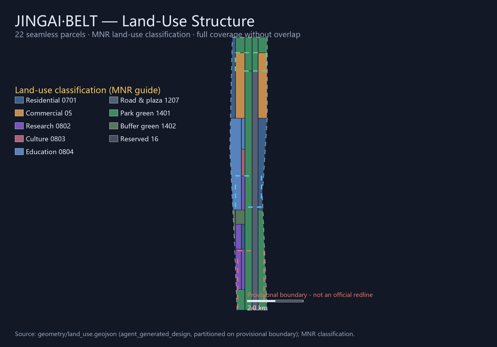

# JINGAI·BELT Centennial Jing-Zhang AI Innovation Belt Overall Concept and Key-Area Urban Design Proposal

## Design Basis and Source Inventory

This proposal takes the Official Announcement of the International Scheme Solicitation for the Centennial Jing-Zhang AI Innovation Belt Urban Design issued by the Haidian Branch of the Beijing Municipal Commission of Planning and Natural Resources as its primary basis [standard:PROJECT-OFFICIAL-ANNOUNCEMENT], and the design brief, agent taskbook excerpt, allowed design space, enums, planning limits, standards, and source inventory under `brief/site-package/` as machine-readable basis [source:SITE-PACKAGE]. It follows the usage boundaries in `data/source_registry.json`: 5 sources are currently registered as formal-ready and 1 as provisional-only; background-only or provisional-only material must never be upgraded into official boundaries, statutory regulatory plans, or implementation commitments [source:SOURCE-REGISTRY].

The agent open-call taskbook adds the three positionings, five functions, three areas and two wings, six agent tasks, ten co-creation charter principles, and a unified boundary clause [source:AGENT-TASKBOOK] [standard:PROJECT-AGENT-OPEN-CALL-TASKBOOK]. Both the announcement and the taskbook require outcomes at regulatory-detailed-planning urban design depth, and all spatial suggestions are conceptual proposals, reference schemes, or material for professional teams to deepen—not a substitute for statutory planning or an approved government conclusion [source:AGENT-TASKBOOK].

**Boundary status statement**: The official `SITE_BOUNDARY` and three `KEY_AREA` exact polygons are not yet public (the qualification package requires a password; no public precise boundary file was found as of 2026-08-07) [source:BOUNDARY-SOURCE]. This proposal uses the provisional boundary registered as `provisional_constraint` in `brief/site-package/geometry/provisional_boundaries.geojson` [source:BOUNDARY-SOURCE] [data:geometry/site_boundary.geojson#SITE-001]. Both `geometry/site_boundary.geojson` and `geometry/key_areas.geojson` are flagged `official_boundary=false` and `boundary_precision=provisional_rough` [data:geometry/key_areas.geojson#PROV-KEY-001]. Provisional geometry is for generation, display, and self-check only—not an official redline, approval basis, or precise area basis; the organizer's data gap does not block content scoring, and all layers and metrics must be recalculated once official polygons are released [source:BOUNDARY-SOURCE] [depth:risk_missing_data].

## Three-Level Scope Framework

The scheme is organized by the three scope levels of the announcement [standard:PROJECT-OFFICIAL-ANNOUNCEMENT]: the coordinated research area (43.6 km²) for the AI industry ecosystem and future urban form; the overall design area (11.4 km²; the submitted boundary recalculates to about 11.41 km² [metric:site_area_sqm]) for urban renewal around the Jing-Zhang Heritage Park; and the key detailed design area (368.4 ha) for three focus districts [metric:key_area_count] [depth:three_level_scope_framework]. The three levels map announcement tasks 1.3, 1.4, 1.5 and agent.1–agent.6 one by one in `compliance_matrix.json`.

| Level | Design question | Proposal answer | Data anchor |
| --- | --- | --- | --- |
| Coordinated research area | How to organize the AI industry ecosystem and future urban form | Five-ring innovation chain: university seeding—open-source collaboration—enterprise conversion—public experience—global communication [depth:overall_spatial_structure] | compliance_matrix.json, standard_matrix.json |
| Overall design area | How to map renewal framework, spatial structure, transport and municipal works | Land use, buildings, roads, green space, public space and phasing layers [data:geometry/land_use.geojson#LU-001] | geometry/*.geojson, metrics.json |
| Key area scope | How to reach detailed design depth for the three districts | Distinct positioning, spatial moves, AI scenarios and implementation dependencies [data:geometry/key_areas.geojson#PROV-KEY-001] | geometry/key_areas.geojson |

## Coordinated Research Area: Industry and Future-City Study

### Overall Concept and Naming System (agent.1)

The core output of the coordinated study is the overall concept of the belt. This proposal introduces the primary name **JINGAI·BELT** (Chinese: 京脉智带, a fusion of JINGZHANG · AI · BELT), with the tagline "From Iron Pulse to AI Belt" (百年铁脉，未来智带), responding to the three positionings of the taskbook [source:AGENT-TASKBOOK]:

- **Centennial Jing-Zhang cultural belt**: The Jing-Zhang Railway was China's first self-designed and self-built trunk railway; its "zigzag" (ren-shaped) alignment pioneered Chinese railway engineering autonomy. This proposal takes the century-old iron pulse as the cultural motif, homologous with open-source collaboration, model training, and iterative evolution in the AI era.
- **Metropolitan AI living experience belt**: AI should not be confined inside industrial parks; it should become an everyday urban experience. With the Jing-Zhang Heritage Park as the public spine, AI scenarios are embedded into daily slow-traffic, retail, community, education and cultural spaces.
- **AI convergence innovation belt**: Anchored on the three key districts, the chain of research, industry, talent, capital, data, compute and scenarios forms an innovation continuum across administrative boundaries.

The naming system follows a tree structure of "one belt—three cores—two wings—multi-node": the belt is the composite image of the Heritage Park vitality corridor and the AI innovation corridor; the three cores are the three key districts; the two wings are the Zhongguancun technology-service wing and the Xiaoyuehe scenario-empowerment wing; the nodes are AI scenarios, pilgrimage landmarks, rail stations and community service points [depth:overall_spatial_structure].

**Visual identity direction**: The logo motif is the structural homology of a rail cross-section and a circuit trace—two parallel lines in Jing-Zhang heritage rust-red and AI intelligence blue, crossing at a "zigzag" node that symbolizes technological generational transition on historical tracks. Auxiliary graphics may extend to sleeper arrays, data pulse waves and station symbols. This is a conceptual direction; fonts, graphics and trademarks must be cleared before any formal application [source:AGENT-TASKBOOK].

### Five Functions and Three-Areas-Two-Wings Synergy (agent.1 / agent.2)

The five functions—"full-stack AI self-innovation system, world-class AI innovation ecosystem, new paradigm of AI+ scenario empowerment, intelligent AI vibrant city, and global voice in AI governance"—are implemented as a synergistic loop across the three areas and two wings [source:AGENT-TASKBOOK]:

| Area / Wing | Functional role | Spatial strategy |
| --- | --- | --- |
| Zhongzhiyuan AI acceleration area | Full-stack self-innovation system; global voice in AI governance | Co-location of the full-stack chain (chip—framework—model—application), standards and safety-governance showcase |
| Beijing AI origin community | World-class AI innovation ecosystem | Campus-adjacent conversion, open-source collaboration, talent zone, launch and showcase |
| Dazhongsi AI industry cluster | AI-native new business formats | Agents, smart terminals, content consumption, data-element circulation |
| Zhongguancun technology-service wing | Global allocation of factors; Zhongguancun IP and capital enablement | Radiating finance, legal, IP and capital services to the three cores |
| Xiaoyuehe scenario-empowerment wing | AI scenario empowerment; intelligent vibrant city | Test scenarios, public experience and urban service scenarios along the Xiaoyue River |

### Global AI Innovation Ecosystem Cases (agent.2)

Six global cases inform the ecosystem design, drawn from public knowledge as experience references without metric commitments [source:AGENT-TASKBOOK]:

1. **Stanford Research Park, Silicon Valley, USA**: campus-seeded university—venture capital—enterprise conversion model supporting the campus-adjacent incubation logic of the origin community.
2. **King's Cross Knowledge Quarter, London, UK**: a paradigm of railway-industrial heritage renewal into a knowledge-economy quarter, directly comparable to the Heritage Park renewal path.
3. **Digital Media City (DMC), Seoul, South Korea**: policy-aggregated digital content industry with public showcase and industrial space in parallel.
4. **Adlershof Science and Technology Park, Berlin, Germany**: long-termist development sharing campus infrastructure among research institutes, universities and firms.
5. **one-north, Singapore**: mixed-use, talent community, pedestrian network and industrial clusters in one integrated plan.
6. **Station F, Paris, France**: a single mega-incubator with an open developer-community operation supporting the "open-source community + event operation" concept.

The ecosystem map proposes the "five-ring innovation chain": **university seeding ring** (nearby universities and institutes such as Tsinghua and Peking University) → **open-source collaboration ring** (developer communities, code hosting and contribution walls) → **enterprise conversion ring** (incubators, accelerators, pilot and test fields) → **public experience ring** (scenario cards, pilgrimage routes, event week) → **global communication ring** (roadshows, awards, media and developer diplomacy). Factor mechanisms cover six categories—land/space, industry capital, talent, compute, data and scenario opening—all stated as mechanism suggestions rather than settled policies [source:AGENT-TASKBOOK] [depth:overall_spatial_structure].

## Overall Design Area: Urban Renewal at Regulatory-Plan Urban Design Depth

The overall design area takes urban renewal as the main approach and organizes deliverables at regulatory-plan depth [standard:MOHURD-CONTROL-DETAILED-PLANNING] [depth:land_use_layout]. The spatial structure is "**one belt, three cores, two wings, multi-node, and a blue-green composite ring**": the belt is the Jing-Zhang Heritage Park vitality corridor (a park and slow-traffic spine of about 7.5 km [data:geometry/green_space.geojson#GREEN-001]); the three cores are the key districts; the blue-green composite ring is formed by the Qing River waterfront, the North 5th Ring Road buffer, the western buffer belt and the southern green wedge, composing an "one-ring-one-belt" ecological framework with the Heritage Park belt [depth:blue_green_public_space].

Land use follows the national territory land-use classification [standard:MNR-LAND-USE-CLASSIFICATION-GUIDE] in 22 seamless parcels [metric:land_use_parcel_count] [data:geometry/land_use.geojson#LU-001]: research land (0802) in the Zhongzhiyuan and origin-community cores; commercial service land (05) concentrated in Dazhongsi; residential land (0701) in the northern and southern living clusters; education land (0804) along the university synergy belt; green and open-space land (14) forming the blue-green framework; road and plaza land (1207) organizing the longitudinal composite corridor; and reserved land (16) for uncertainty [data:geometry/land_use.geojson#LU-001] [metric:green_ratio].

Development intensity and building height lack official regulatory conditions and are listed entirely as pending confirmation (see the `unknown` status of `floor_area_ratio` and `building_height_m` in `metrics.json` and the missing list in `ranges/planning_limits.json`) [depth:development_intensity_controls]. This proposal only gives directional guidance—moderate interfaces along the park, higher intensity near rail stations, low-to-mid intensity in residential clusters—without numeric conclusions [depth:height_massing_character].

The urban renewal framework includes: identification of inefficient space (mainly existing offices, wholesale, industrial heritage and railway-side parcels), a renewal project list (JZ-01–JZ-12, see the renewal project chapter), and an implementation logic of "operation before construction, public realm before parcels, pilot before rollout" [depth:renewal_project_list].

## Key-Area Detailed Design

All three key districts are expressed with `provisional_constraint` boundaries [data:geometry/key_areas.geojson#PROV-KEY-001], reaching conceptual depth of a comprehensive implementation plan [depth:three_key_area_detailed_design].

### Zhongzhiyuan AI Acceleration Area (192.1 ha)

Positioning: **garden-style full-stack self-innovation block** [data:geometry/key_areas.geojson#PROV-KEY-001]. Around national AI platforms, the full-stack chain, standards development and safety governance showcase: the northern Qing River frontage forms the "Qing River low-carbon innovation corridor" carrying open testing and low-carbon compute experience [data:geometry/green_space.geojson#GREEN-001]; the middle organizes the full-stack chain with "R&D—incubation—testing—showcase" building clusters [data:geometry/buildings.geojson#BLDG-001]; external traffic, the industry show hall and the safety-governance sandbox are placed around the Zhongzhiyuan entrance plaza [data:geometry/public_space.geojson#PUBLIC-006]. Retain/renovate/demolish suggestions remain conceptual: retain efficient R&D buildings, renovate low-efficiency warehouses and street frontage, and newly build full-stack test labs and open-source incubators (pending official ownership and regulatory confirmation) [depth:retain_renovate_demolish].

### Beijing AI Origin Community (104.3 ha)

Positioning: **campus-adjacent conversion and talent community** [data:geometry/key_areas.geojson#PROV-KEY-002]. Main functions are campus-adjacent innovation, outcome conversion, talent zone and open-source system: campus—park—block slow-traffic stitching is organized by east-west pedestrian links and the park belt [data:geometry/roads.geojson#ROAD-010]; launch halls, open-source collaboration spaces and the co-creation plaza sit at the community core [data:geometry/public_space.geojson#PUBLIC-005]; campus-adjacent living frontage is retained, low-efficiency buildings are renovated into incubation and mixed functions, and talent apartments and community services are completed [data:geometry/buildings.geojson#BLDG-005]. Around the former Qinghuayuan Station, cultural land organizes the "Qinghuayuan Station cultural memorial plaza" and century-old Jing-Zhang cultural narrative nodes [data:geometry/public_space.geojson#PUBLIC-004].

### Dazhongsi AI Industry Cluster (72.0 ha)

Positioning: **urban intelligent economy and international exchange block** [data:geometry/key_areas.geojson#PROV-KEY-003]. Around Dazhongsi Station integration and four-quadrant pedestrian connectivity: the station-city composite hub (interchange center, feeder lines, underground slow-traffic concept) stitches the four quadrants [data:geometry/roads.geojson#ROAD-013]; agent and smart-terminal showcases, content consumption and the data-element meeting room are laid out along the industry core [data:geometry/land_use.geojson#LU-001]; green land composite use links the southern green wedge into an "industry—hub—green wedge" triangle [data:geometry/green_space.geojson#GREEN-001]. Public-environment renewal around key enterprises starts as lightweight intervention projects, activating through operation before spatial transformation [depth:phasing_implementation].

## AI Innovation Ecosystem, Talent Profiles, and AI+ Scenarios

### AI Innovation Ecosystem Map (agent.2)

Under the five-ring innovation chain, the three cores respectively carry: Zhongzhiyuan's full-stack chain and standards governance; the origin community's open-source ecosystem and outcome conversion; Dazhongsi's AI-native formats and data circulation. The two wings provide factor services (capital, legal, IP) and scenario landing (testing and experience along the Xiaoyue River) [source:AGENT-TASKBOOK] [depth:overall_spatial_structure].

### User Personas (agent.3, 6 types)

| Persona | Typical needs | Spatial response | Self-check boundary |
| --- | --- | --- | --- |
| Open-source developer | Release, collaboration, testing, community reputation | Origin community release hall, public code wall, night collaboration space [data:geometry/public_space.geojson#PUBLIC-005] | No personal behavior tracking; aggregate statistics only |
| Startup team | Low-cost offices, compute access, product test field | Zhongzhiyuan shared test field, edge-compute service points, standards-governance consulting [data:geometry/buildings.geojson#BLDG-002] | Compute and data services require separate authorization |
| Enterprise visitor | Showcase, business, international reception, recruiting | Dazhongsi international roadshow hall, rail feeder, public realm around key enterprises [data:geometry/public_space.geojson#PUBLIC-002] | Corporate marks and cases require clearance |
| Local resident | Commuting, leisure, community services, low-disturbance renewal | Park slow-traffic loop, embedded community services, graded events and night lighting [data:geometry/green_space.geojson#GREEN-001] | No resident profiling for commercial recommendation |
| University faculty and students | Outcome conversion, cross-campus collaboration, daily slow traffic | Campus—park slow-traffic stitching, conversion stations, AI education experience points [data:geometry/roads.geojson#ROAD-010] | Campus data and research results require authorization |
| International developers and visitors | Visits, roadshows, cross-border collaboration, cultural experience | Pilgrimage routes, global communication nodes, bilingual signage and event-week reception [data:geometry/public_space.geojson#PUBLIC-002] | No collection of foreign-affairs or immigration data |

### AI Scenario Cards (agent.3, 12 cards)

Each card states spatial carrier, design note, data source, privacy boundary and operating entity; the count satisfies the taskbook requirement of no fewer than 10 [metric:ai_scenario_node_count].

| # | Scenario card | Spatial carrier | Design note |
| --- | --- | --- | --- |
| 01 | Open-source release hall | Origin community co-creation plaza [data:geometry/public_space.geojson#PUBLIC-005] | Release, code-contribution display and mini roadshows for universities, open-source communities and startups |
| 02 | Safety-governance sandbox | Zhongzhiyuan [data:geometry/buildings.geojson#BLDG-003] | Translating standards development, safety evaluation and red-teaming into visitable, bookable, auditable showcase nodes |
| 03 | Edge-compute station | Nodes across the overall design area [data:geometry/land_use.geojson#LU-001] | New-infrastructure prototype combining public services and low-carbon energy; to be deepened |
| 04 | AI slow-traffic navigation | Jing-Zhang Heritage Park vitality belt [data:geometry/roads.geojson#ROAD-007] | Explainable signage and low-intrusion sensing to identify slow-traffic gaps, congestion and accessibility needs |
| 05 | Dazhongsi international roadshow hall | Dazhongsi AI industry cluster [data:geometry/public_space.geojson#PUBLIC-002] | Showcase, negotiation, media launch and international exchange for agents, smart terminals and content firms |
| 06 | Qing River low-carbon innovation corridor | Zhongzhiyuan Qing River frontage [data:geometry/green_space.geojson#GREEN-001] | Public living room combining green space, stormwater, walking/cycling and AI showcase |
| 07 | Campus-adjacent conversion street | Origin community [data:geometry/roads.geojson#ROAD-004] | Organizing incubation, showcase, legal, IP and financing services |
| 08 | Data-element meeting room | Dazhongsi [data:geometry/land_use.geojson#LU-001] | Compliant, authorized, auditable urban service interface for data-element and digital-asset circulation |
| 09 | AI life-service demo street | Community–retail interface [data:geometry/land_use.geojson#LU-001] | AI+ healthcare, education, legal and life services in operable small blocks |
| 10 | Global AI week route | Belt public-space system [data:geometry/public_space.geojson#PUBLIC-001] | Walkable, shareable experience route from heritage culture, open source, industry showcase to international roadshow |
| 11 | Rail-station AI feeder trial | Dazhongsi station—industry feeder [data:geometry/roads.geojson#ROAD-013] | Test scenarios for arrival/departure traffic prediction, shared feeder and accessibility navigation |
| 12 | Public-safety operations review sandbox | Zhongzhiyuan and park nodes [data:geometry/constraints.geojson#CONSTRAINTS-001] | City-agent assistance for public-space operations; all outputs require human review and never replace approval |

### Industry Test and Validation Scenarios (agent.3, 3 scenarios)

1. **AI traffic and walkability validation field** (rail feeder and slow-traffic lines, [data:geometry/roads.geojson#ROAD-013]): validates real-time traffic prediction, signal-timing advice and accessibility navigation with anonymized data; pilot requires transport-authority authorization [metric:industry_test_scenario_count].
2. **Enterprise-service Copilot test field** (Zhongzhiyuan enterprise-service node, [data:geometry/buildings.geojson#BLDG-002]): policy matching, compute scheduling and IP consulting agents for park enterprises; enterprise data stays in-park, auditable and revocable.
3. **Public-safety operations review sandbox** (park belt and event route, [data:geometry/constraints.geojson#CONSTRAINTS-001]): agent assistance for crowd, maintenance and risk warning with mandatory human review and graded response; no individual identity collection.

All AI scenarios adhere to data minimization, public sources, explainability and human review; they never replace planning approval, never output unauthorized personal profiles, and never claim official implementation commitments [source:AGENT-TASKBOOK] [depth:risk_missing_data].

## Land Use, Building Scale, and Retain/Renovate/Demolish

Land use is described in the previous chapter: 22 seamless parcels fully cover the submitted boundary without gaps, overlaps or unlabeled space [data:geometry/land_use.geojson#LU-001] [metric:land_use_parcel_count], following the national territory land-use classification guide [standard:MNR-LAND-USE-CLASSIFICATION-GUIDE].

Building footprints express 16 conceptual retention/renewal clusters [data:geometry/buildings.geojson#BLDG-001] [metric:building_footprint_area_sqm], classified by a three-level "retain—renovate—new-build" action [depth:retain_renovate_demolish]: retain efficient buildings and campus-adjacent living frontage (e.g., BLDG-008, BLDG-014); renovate low-efficiency buildings for ground-floor activation, mixed functions and talent services (e.g., BLDG-005, BLDG-010); new-build only where clear functional gaps exist, such as full-stack test labs, open-source incubators and the station-city hub (e.g., BLDG-003, BLDG-013). All retain/renovate/demolish statements are conceptual; parcel-level conclusions await ownership, regulatory and engineering confirmation [depth:development_intensity_controls].

Height, massing and character control give directional principles—low and transparent interfaces along the park, compact composite nodes at station hubs, human-scale enclosed residential clusters—without numeric height values; once official regulatory conditions are published, deepen through "interface—massing—color" tiers [depth:height_massing_character] [standard:MOHURD-URBAN-DESIGN-MEASURES].

## Transport, Rail, Municipal Works, and Public Services

The transport scheme responds to rail-station integration, road micro-circulation, slow-traffic gap stitching and green-transport requirements [depth:traffic_rail_slow_parking]. Sixteen conceptual road centerlines [metric:road_centerline_km] [data:geometry/roads.geojson#ROAD-001] include: the longitudinal composite arterial for north–south connection; secondary arterials along the North 5th Ring Road south frontage, Zhichun Road and Qinghua East Road stitching east–west; branch networks in Zhongzhiyuan and Dazhongsi densifying micro-circulation; park greenways and the Qing River waterfront greenway forming the slow-traffic spine; east–west pedestrian links stitching the two sides of the park belt [data:geometry/roads.geojson#ROAD-007]; and rail feeder trial lines at Dazhongsi and Wudaokou stations [data:geometry/roads.geojson#ROAD-013]. Crossing points over the North 5th Ring Road, under-bridge spaces and station four-quadrant connectivity are listed for professional deepening [depth:municipal_new_infrastructure].

Municipal and new infrastructure: edge-compute stations, distributed energy and smart light poles are combined along public corridors as prototypes only; utility, energy, drainage, flood and fire engineering data are missing and listed as formal deepening prerequisites [depth:municipal_new_infrastructure] [data:geometry/constraints.geojson#CONSTRAINTS-001]. Public services follow the "15-minute living circle" for community services, talent-apartment support and innovation services, with service radii and operation models elaborated in the phasing plan [depth:phasing_implementation].

## Blue-Green Space, Public Space, and Urban Character

The blue-green system takes the Jing-Zhang Heritage Park vitality belt as the spine, the Qing River and Xiaoyue River as wings, and the North 5th Ring Road and western buffer as edges, forming an "one-ring-one-belt-multi-wedge" structure [depth:blue_green_public_space] [data:geometry/green_space.geojson#GREEN-001]. Green and open-space totals and ratios are recalculated in the metrics [metric:green_ratio]; seven public-space plaza nodes serve gateway, station-city, cultural, co-creation and innovation functions [data:geometry/public_space.geojson#PUBLIC-001] [metric:public_space_ratio].

**AI pilgrimage landmarks (agent.4, 5 landmarks)** [metric:ai_pilgrimage_landmark_count]:

| # | Landmark | Site | Design intent |
| --- | --- | --- | --- |
| 01 | Century Iron-Pulse Origin Memorial Tower | Qinghuayuan Station heritage culture area [data:geometry/public_space.geojson#PUBLIC-004] | Rail-cross-section structure commemorating the centennial self-innovation starting point of the Jing-Zhang Railway |
| 02 | "Zigzag" Open-Source Contribution Wall | Origin community co-creation plaza [data:geometry/public_space.geojson#PUBLIC-005] | Developer honor display and code-contribution installation themed on the Jing-Zhang "zigzag" alignment |
| 03 | Ring of Intelligent Making | Dazhongsi station-city hub [data:geometry/public_space.geojson#PUBLIC-002] | Ring public art and data-visualization installation symbolizing station-city integration and the intelligent-economy cycle |
| 04 | Light of Data | Zhongzhiyuan entrance [data:geometry/public_space.geojson#PUBLIC-006] | Low-carbon luminous installation visualizing compute operations as the public interface of AI infrastructure |
| 05 | Jing-Zhang Zero-Kilometer Memorial Trail | Park belt south gateway [data:geometry/public_space.geojson#PUBLIC-001] | Century-mileage experience trail of old sleepers, milestones and station symbols |

**Honor display system**: graded honor displays (contribution walls—milestone installations—annual leaderboard screens) at landmarks, public spaces and rail feeder nodes for developers, enterprises, universities and communities; all display content requires clearance [source:AGENT-TASKBOOK].

Urban character and cultural narrative (agent.5): the narrative line is "**from iron tracks to fiber optics, from locomotives to algorithms**" in three temporal layers—**century iron pulse** (the self-innovation history of the Jing-Zhang Railway, Qinghuayuan Station, Qinghe Station and other cultural resources), **Zhongguancun innovation** (nearby universities, institutes and the Zhongguancun entrepreneurship culture), and **AI new culture** (open source, co-creation, iteration, governance). Spatial carriers include: signage systems (a gradient from rail symbols to data-pulse symbols), paving and installations (reuse of old sleepers), public art (the landmarks), building interfaces (transparent frontage along the park) and graded nightscape [standard:MOHURD-URBAN-DESIGN-MEASURES]. Historical statements follow public records; brand fonts, images, portraits and corporate marks require clearance [depth:risk_missing_data].

## Renewal Project List, Implementation Policies, and Phasing

Renewal project list (12 items; 6 excerpted):

| No. | Project | Type | Main dependencies | Evidence |
| --- | --- | --- | --- | --- |
| JZ-01 | Jing-Zhang Heritage Park slow-traffic gap stitching | Public space/transport | Road redlines, under-bridge space, traffic review | [data:geometry/roads.geojson#ROAD-001] |
| JZ-02 | Zhongzhiyuan Qing River innovation frontage | Blue-green/industry showcase | River blue line, ecology and flood conditions | [data:geometry/green_space.geojson#GREEN-001] |
| JZ-03 | Origin community campus-adjacent conversion street | Renewal/industry service | Campus boundary, ownership, ground-floor uses | [data:geometry/buildings.geojson#BLDG-005] |
| JZ-04 | Dazhongsi station four-quadrant pedestrian connectivity | Rail integration/slow traffic | Station, intersections, utilities | [data:geometry/public_space.geojson#PUBLIC-002] |
| JZ-05 | AI public service and edge-compute nodes | New infrastructure/public service | Energy, compute, safety, operating entity | [data:geometry/constraints.geojson#CONSTRAINTS-001] |
| JZ-06 | Global AI week public route | Operation/brand | Public-space permits, event safety, copyright clearance | [data:geometry/phasing.geojson#PHASE-001] |

Phasing (three phases expressed in geometry/phasing.geojson [data:geometry/phasing.geojson#PHASE-001]): **Phase 1 (launch)** activates the origin community and the middle park belt [metric:phase_1_area_sqm] with operation events, lightweight facilities and open-source community activation; **Phase 2 (renewal)** advances the Zhongzhiyuan and Dazhongsi industrial renewal with rail feeders and public services; **Phase 3 (completion)** completes the blue-green network, character upgrade and long-term governance framework [depth:phasing_implementation]. Policy suggestions cover integrated renewal implementation, space supply, operation mechanisms, industry services, public participation, data governance and property synergy—all as mechanism suggestions [source:AGENT-TASKBOOK].

**Global operation system (agent.6)**: the annual event system is "**JING·AI Week**" (annual main session including open-source conference, industry roadshows, scenario open days, AI pilgrimage hike and international developer festival) plus monthly developer salons and quarterly scenario open days; developer-community operation uses a "online collaboration + offline space" dual track (release halls, night collaboration spaces, contribution-wall honor system); scenario open operation proceeds in three steps—"test sandbox first, demo operation second, scale replication third"; international communication runs dual threads of "the century-old Jing-Zhang story + China's new AI narrative" with multilingual signage and digital content assets; the attraction-conversion pathway is "event attraction—scenario trial—space landing—policy service—long-term rooting" [source:AGENT-TASKBOOK] [depth:phasing_implementation]. All events are conceptual operation designs, not settled arrangements or government commitments.

## Indicator System, Area Recalculation, and Compliance Matrix

Indicators fall into three classes: spatial indicators directly recalculable from submitted geometry (boundary area [metric:site_area_sqm], green ratio [metric:green_ratio], public-space ratio [metric:public_space_ratio], building footprint area [metric:building_footprint_area_sqm], land-use parcel count [metric:land_use_parcel_count], road centerline length [metric:road_centerline_km], phase areas [metric:phase_1_area_sqm]); regulatory indicators requiring official controls (FAR, height, density, setbacks—all `unknown` with stated reasons); and performance indicators requiring continuous operation data (event participation, scenario usage, talent density—see `compliance_matrix.json`). Complete values, formulas, source files and confidence are stored in `metrics.json` [depth:metrics_recalculation].

The compliance matrix is the master control: all 19 mandatory tasks of announcement sections 1.3, 1.4, 1.5 and agent.1–agent.6 are mapped to sections, layers, metrics, drawings, HTML, sources, assumptions and self-check items (`compliance_matrix.json`); professional standards are responded to item by item (`standard_matrix.json`); design depth items are complete (`design_depth_matrix.json`) [standard:PROJECT-OFFICIAL-ANNOUNCEMENT] [standard:PROJECT-AGENT-OPEN-CALL-TASKBOOK].

## Risk, Copyright, and Compliance Statement

**Bilingual requirement**: the primary report is Chinese with a complete English counterpart `proposal.en.md`; the rendered report, visualization HTML, A3/A0 drawings and text-bearing figures all provide bilingual versions.

**Provisional boundary risk**: while the official boundary is missing, area-class indicators are recalculated on the provisional boundary at `provisional_rough` precision [source:BOUNDARY-SOURCE]; once official polygons are published, geometry generation, metric recalculation, drawing and HTML rendering must be rerun—not single-file replacement [depth:risk_missing_data].

**Missing-data risk**: regulatory conditions (FAR, height, density, setbacks, road redlines), parcel ownership, existing buildings, utilities, heritage ranges and engineering conditions are missing; related conclusions are downgraded to pending confirmation. The full list is in `assumptions.json` and `ranges/planning_limits.json` [source:SITE-PACKAGE] [depth:risk_missing_data].

**Copyright and clearance**: all images, drawings, icons, data and code assets state sources and licenses in `sources.json` and `report/copyright_statement.md`; this proposal is generated from provisional boundaries and public materials and contains no unauthorized trademarks, fonts, images or portraits [source:SOURCE-REGISTRY]. The HTML visualization loads no remote scripts, tiles, fonts, iframes, forms or external APIs and tracks no reviewer behavior.

**Boundary clause**: all spatial suggestions in this proposal are conceptual proposals, reference schemes, or material for professional teams to deepen—not a substitute for statutory planning, not approved government conclusions, and involving no regulatory-plan adjustments, FAR/height statutory judgments, parcel-level demolition conclusions, road alignment or rail-line engineering schemes, underground-space or energy-load professional calculations, land ownership or investment calculations, or non-public government and enterprise data [source:AGENT-TASKBOOK] [depth:risk_missing_data].

## References

- brief/public-brief.md
- brief/site-package/design_brief.json
- brief/site-package/agent_taskbook.json
- brief/site-package/allowed_design_space.json
- brief/site-package/enums/
- brief/site-package/ranges/planning_limits.json
- brief/site-package/geometry/provisional_boundaries.geojson
- brief/site-package/standards/standards.json
- data/source_registry.json
- Full machine index: see `sources.json`, `metrics.json`, `compliance_matrix.json`, `standard_matrix.json` and `design_depth_matrix.json`
- Entry list follows the site-package registry; full provenance and licenses are in the structured source inventory [source:SITE-PACKAGE]
