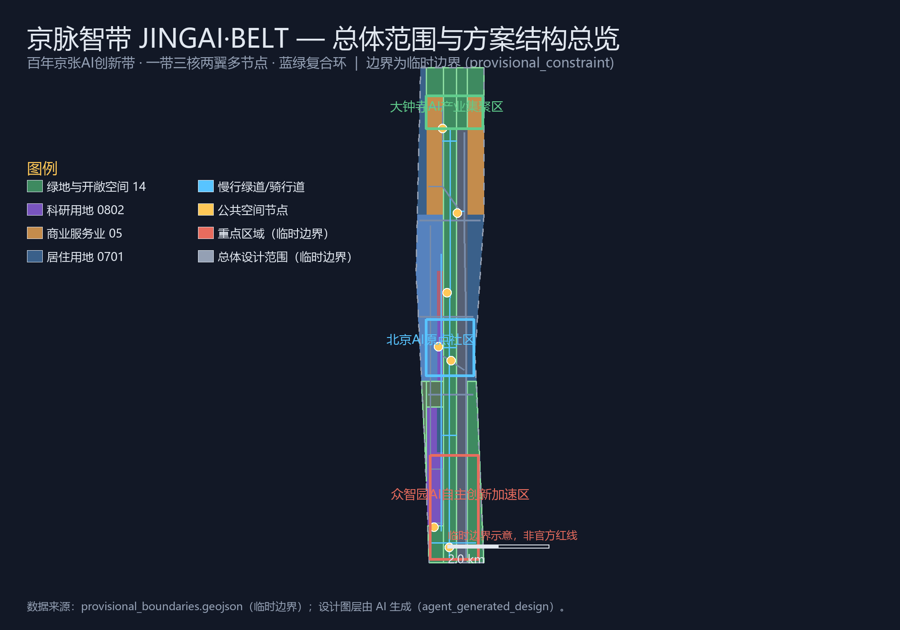
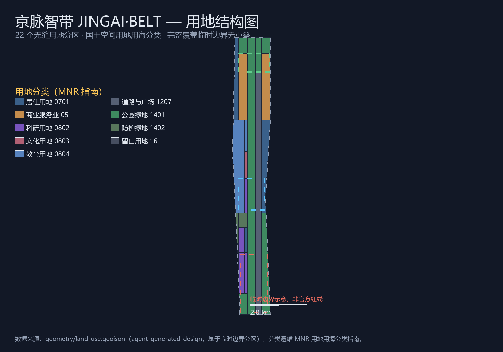
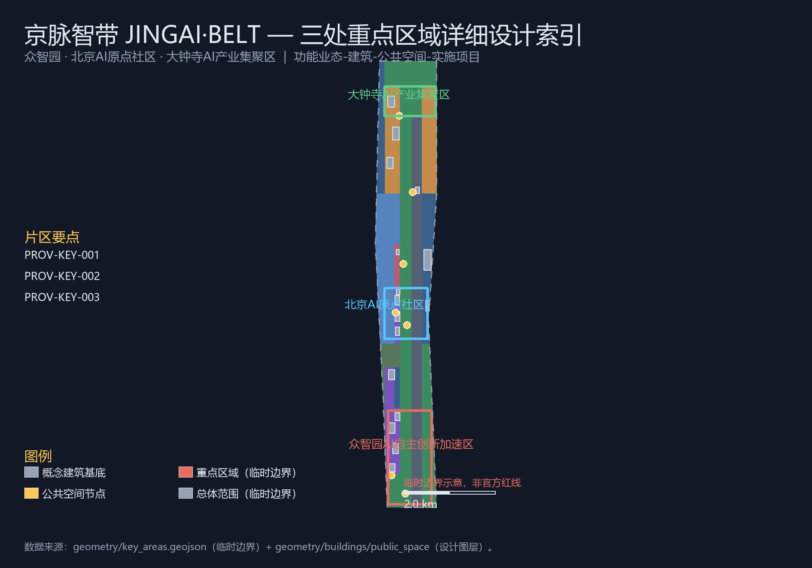
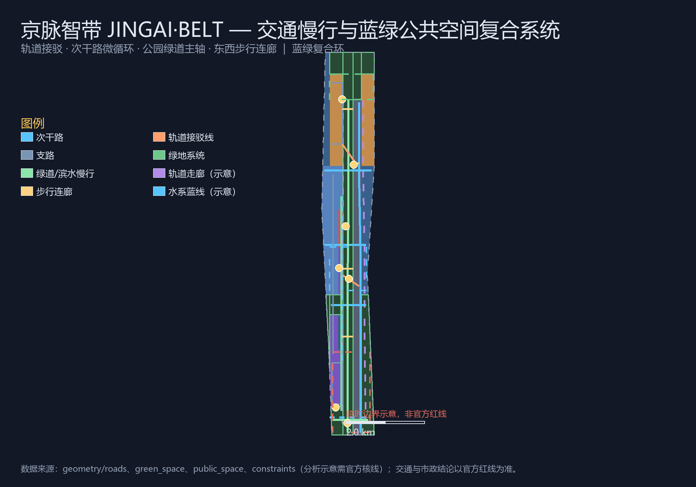
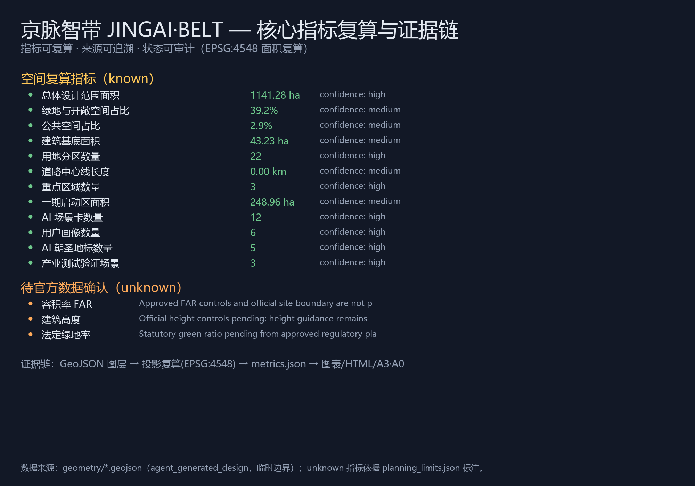

# 京脉智带 JINGAI·BELT 百年京张AI创新带总体概念与重点区域城市设计提案

## 设计依据与资料清单

本方案以北京市规划和自然资源委员会海淀分局发布的《百年京张AI创新带城市设计国际方案征集资格预审公告》为第一依据 [standard:PROJECT-OFFICIAL-ANNOUNCEMENT]，以 `brief/site-package/` 中的设计简报、任务书摘录、允许设计空间、枚举、规划限制、标准和来源清单为机器可读依据 [source:SITE-PACKAGE]，并遵循 `data/source_registry.json` 的用途边界：当前登记 5 条 formal 可用资料、1 条 provisional-only 资料，agent 不得把 background_only 或 provisional_only 资料升级为官方边界、法定控规或实施承诺 [source:SOURCE-REGISTRY]。

面向智能体开源征集任务书补充了三大定位、五大功能、三区两翼、六项智能体任务、十条共创原则和统一边界条款 [source:AGENT-TASKBOOK] [standard:PROJECT-AGENT-OPEN-CALL-TASKBOOK]。公告与任务书共同要求成果达到控制性详细规划的城市设计深度，且所有空间落地建议均为概念建议、参考方案或可供专业团队深化研究，不替代正式规划，不构成政府审定结论 [source:AGENT-TASKBOOK]。

**边界状态声明**：官方 `SITE_BOUNDARY` 与三处 `KEY_AREA` 精确多边形尚未公开（资格预审文件包需密码获取，截至 2026-08-07 未发现公开精确边界文件）[source:BOUNDARY-SOURCE]。本方案使用 `brief/site-package/geometry/provisional_boundaries.geojson` 中登记为 `provisional_constraint` 的临时边界生成提交包 [source:BOUNDARY-SOURCE] [data:geometry/site_boundary.geojson#SITE-001]，`geometry/site_boundary.geojson` 与 `geometry/key_areas.geojson` 均标注 `official_boundary=false`、`boundary_precision=provisional_rough` [data:geometry/key_areas.geojson#PROV-KEY-001]。临时边界仅用于方案生成、展示和自检，不作 official redline、审批依据或精确面积复算依据；组织方数据缺口不阻断内容评分，正式多边形发布后所有图层与指标均需重算 [source:BOUNDARY-SOURCE] [depth:risk_missing_data]。

## 三层范围工作框架

方案按公告三个层次组织工作 [standard:PROJECT-OFFICIAL-ANNOUNCEMENT]：统筹研究范围 43.6 平方公里关注 AI 产业生态与未来城市形态；总体设计范围 11.4 平方公里（本方案提交边界，复算面积约 11.41 平方公里 [metric:site_area_sqm]）关注京张遗址公园周边 1—2 公里城市更新与产业空间；重点区域范围 368.4 公顷聚焦三处详细设计片区 [metric:key_area_count] [depth:three_level_scope_framework]。三层范围在 `compliance_matrix.json` 中逐条映射公告 1.3、1.4、1.5 与 agent.1—agent.6 必选任务。

| 层级 | 设计问题 | 方案回答 | 数据落点 |
| --- | --- | --- | --- |
| 统筹研究范围 | AI产业生态和未来城市形态如何组织 | “高校策源—开源协作—企业转化—公共体验—国际传播”五环创新链 [depth:overall_spatial_structure] | compliance_matrix.json、standard_matrix.json |
| 总体设计范围 | 更新框架、空间结构、交通市政如何落图 | 用地、建筑、道路、绿地、公共空间、分期图层共同表达 [data:geometry/land_use.geojson#LU-001] | geometry/*.geojson、metrics.json |
| 重点区域范围 | 三处片区如何达到详细设计深度 | 分别提出定位、空间动作、AI场景与实施依赖 [data:geometry/key_areas.geojson#PROV-KEY-001] | geometry/key_areas.geojson |

## 统筹研究范围产业与未来城市研究

### 一带总体概念与命名体系（agent.1）

统筹研究的核心产出是“一带”总体概念。本方案提出主名称**“京脉智带”**，英文名称 **JINGAI·BELT**（JINGZHANG · AI · BELT 的融合缩写），以“**百年铁脉，未来智带**”（From Iron Pulse to AI Belt）为传播语，对应任务书要求的三大定位 [source:AGENT-TASKBOOK]：

- **百年京张文化带**：京张铁路是中国自主设计建造的第一条干线铁路，其“人字形”展线开创了中国铁路工程的自主创新先例；本方案把百年铁脉作为文化母题，与 AI 时代的开源协作、模型训练、迭代进化形成同构叙事。
- **都市AI生活体验带**：AI 不应只停留在产业园区的围墙内，而应成为市民可感知、可体验、可参与的城市日常；本方案以京张遗址公园为公共主轴，把 AI 场景植入慢行、商业、社区、教育、文化等日常空间。
- **AI融合创新带**：以三处重点片区为锚点，把科研、产业、人才、资本、数据、算力、场景组织成跨行政边界的创新连续体。

命名体系采用“一带—三核—两翼—多节点”树状结构：一带为京张遗址公园活力带与 AI 创新走廊的复合意象；三核即众智园、北京AI原点社区、大钟寺三处重点片区；两翼为中关村科技服务翼与小月河场景赋能翼；多节点为 AI 场景、朝圣地标、轨道站点与社区服务节点 [depth:overall_spatial_structure]。

**视觉识别方向**：Logo 以铁轨断面与电路走线双线同构为母题——两条平行线分别取京张铁路百年铁锈红与 AI 智蓝，交叉处形成“人字形”结点，象征自主创新在历史轨道上完成技术代际跃迁；辅助图形可延展为轨枕阵列、数据脉冲波与站点符号系统。该方向为概念建议，正式应用前需完成字体、图形与商标清权 [source:AGENT-TASKBOOK]。

### 五大功能与三区两翼协同（agent.1 / agent.2）

五大功能“AI全栈自主创新体系、世界级AI创新生态、AI+场景赋能新范式、智能化AI活力城市、AI治理全球话语权”在三区两翼中落实为协同回路 [source:AGENT-TASKBOOK]：

| 三区两翼 | 功能角色 | 空间策略 |
| --- | --- | --- |
| 众智园AI自主创新加速区 | AI全栈自主创新体系、AI治理全球话语权 | 全栈链条（芯片—框架—模型—应用）协同空间、标准与安全治理展示场 |
| 北京AI原点社区 | 世界级AI创新生态 | 近校成果转化、开源协作、人才特区、发布展示 |
| 大钟寺AI产业集聚区 | 智能原生新业态 | 智能体、智能终端、内容消费、数据要素流通 |
| 中关村科技服务翼 | 要素全球化配置、中关村IP与资本赋能 | 依托中关村金融、法务、知识产权与资本服务网络辐射三核 |
| 小月河场景赋能翼 | AI场景赋能与智能化AI活力城市 | 沿小月河串联测试场景、公共体验与城市服务场景 |

### 全球AI创新生态案例（agent.2）

方案梳理 6 个全球案例作为生态设计参照，均为公开资料层面的经验借鉴，不作具体指标承诺 [source:AGENT-TASKBOOK]：

1. **美国硅谷斯坦福研究园**：高校策源—风险资本—企业转化的近校模型，支撑“原点社区”近校孵化逻辑。
2. **英国伦敦国王十字知识街区**：铁路工业遗址更新为知识经济街区的范式，直接对标京张遗址公园的城市更新路径。
3. **韩国首尔数字媒体城 DMC**：数字内容与传媒产业政策集聚、公共展示与产业空间并置。
4. **德国柏林阿德勒斯霍夫科技园**：科研机构、大学与企业共享园区基础设施的长期主义开发。
5. **新加坡纬壹科技城 one-north**：混合用地、人才社区、步行网络与产业组团一体规划。
6. **法国巴黎 Station F**：单体巨型孵化器与开放开发者社区运营，支撑“开源社区+活动运营”概念。

生态图谱上，本方案提出“五环创新链”：**高校策源环**（清华、北大等近域高校与院所）→ **开源协作环**（开发者社区、开源代码托管与贡献墙）→ **企业转化环**（孵化器、加速器、中试与测试场）→ **公共体验环**（AI场景卡、朝圣路线、活动周）→ **国际传播环**（路演、奖项、全球媒体与开发者外交）。要素机制覆盖土地空间、产业资金、人才、算力、数据与场景开放六类，均表述为机制建议而非已确定政策 [source:AGENT-TASKBOOK] [depth:overall_spatial_structure]。

## 总体设计范围城市更新与控规深度城市设计

总体设计范围以城市更新为主要方式，以控规深度组织设计成果 [standard:MOHURD-CONTROL-DETAILED-PLANNING] [depth:land_use_layout]。空间结构为“**一带三核两翼多节点、蓝绿复合环**”：一带即京张遗址公园活力带（纵贯南北约 7.5 公里的公园与慢行主轴 [data:geometry/green_space.geojson#GREEN-001]）；三核为三处重点片区；蓝绿复合环由清河滨水带、北五环防护带、西部防护带与南部绿楔围合，与遗址公园带构成“一环一带”生态骨架 [depth:blue_green_public_space]。

用地结构依据国土空间用地用海分类表达 [standard:MNR-LAND-USE-CLASSIFICATION-GUIDE]，共 22 个无缝用地分区 [metric:land_use_parcel_count] [data:geometry/land_use.geojson#LU-001]：科研用地（0802）布局于众智园与原点社区核心，商业服务业用地（05）集中于大钟寺片区，居住用地（0701）分布于南北生活组团，教育用地（0804）沿高校协同带组织，绿地与开敞空间用地（14 类）构成蓝绿骨架，道路与广场用地（1207）组织纵向复合走廊，并预留留白用地（16）应对不确定性 [data:geometry/land_use.geojson#LU-001] [metric:green_ratio]。

开发强度与建筑高度未取得官方控规条件，全部列为待确认事项（见 `metrics.json` 中 `floor_area_ratio`、`building_height_m` 的 unknown 状态与 `ranges/planning_limits.json` 的缺失清单）[depth:development_intensity_controls]。本方案只给出“公园带两侧界面适度、轨道站点周边高强度、社区组团中低强度”的分级引导方向，不给出具体数值结论 [depth:height_massing_character]。

城市更新总体框架包括：低效空间识别（以既有办公、批发、工业遗存与铁路沿线空间为主），更新项目清单（JZ-01—JZ-12，见“更新项目清单”章），以及“先运营后建设、先公共后地块、先试点后推广”的实施逻辑 [depth:renewal_project_list]。

## 重点区域详细设计

三处重点片区均以 `provisional_constraint` 边界表达 [data:geometry/key_areas.geojson#PROV-KEY-001]，详细设计达到规划综合实施方案的概念深度 [depth:three_key_area_detailed_design]。

### 众智园AI自主创新加速区（192.1 公顷）

定位：**花园型全栈自主创新街区** [data:geometry/key_areas.geojson#PROV-KEY-001]。围绕国家人工智能平台、全栈自主创新链条、标准制定与安全治理展示组织空间：北部依托清河界面形成“清河低碳创新廊”，承载开放测试与低碳算力体验 [data:geometry/green_space.geojson#GREEN-001]；中部以“研发—孵化—测试—展示”四类建筑组团组织全栈链条 [data:geometry/buildings.geojson#BLDG-001]；对外交通组织、产业展示大厅与安全治理沙盒结合众智园入口广场设置 [data:geometry/public_space.geojson#PUBLIC-006]。拆改留建议为概念层级：保留现状高效研发楼宇，更新低效仓储与沿街界面，新建全栈测试实验室与开源孵化楼（待正式权属与控规确认）[depth:retain_renovate_demolish]。

### 北京AI原点社区（104.3 公顷）

定位：**近校型成果转化与人才社区** [data:geometry/key_areas.geojson#PROV-KEY-002]。以“近校创新、成果转化、人才特区、开源体系”为功能主线：校区—园区—街区慢行缝合由东西向步行连廊与公园带共同组织 [data:geometry/roads.geojson#ROAD-010]；成果发布厅、开源协作空间与共创广场结合社区核心设置 [data:geometry/public_space.geojson#PUBLIC-005]；保留沿街高校生活界面，更新低效楼宇为孵化与复合功能，补足人才公寓与社区服务 [data:geometry/buildings.geojson#BLDG-005]。清华园站旧址一带以文化展示用地组织“清华园站文化纪念广场”与百年京张文化叙事节点 [data:geometry/public_space.geojson#PUBLIC-004]。

### 大钟寺AI产业聚集区（72.0 公顷）

定位：**城市型智能经济与国际交往街区** [data:geometry/key_areas.geojson#PROV-KEY-003]。围绕大钟寺站一体化与四象限步行连通组织空间：站城复合枢纽（换乘中心、接驳线、地下慢行概念）缝合四个象限 [data:geometry/roads.geojson#ROAD-013]；智能体与智能终端展示、内容消费、数据要素会客厅沿产业集聚核心布局 [data:geometry/land_use.geojson#LU-001]；规划绿地复合利用与南部绿楔衔接，形成“产业—枢纽—绿楔”三角结构 [data:geometry/green_space.geojson#GREEN-001]。重点企业周边公共环境更新为轻量介入的示范项目，先以运营激活再谈空间改造 [depth:phasing_implementation]。

## AI 创新生态、人才画像与 AI+ 场景

### AI 创新生态图谱（agent.2）

在“五环创新链”框架下，三核分别承载：众智园的全栈自主链条与标准治理、原点社区的开源生态与成果转化、大钟寺的智能原生业态与数据流通；两翼提供要素服务（资本、法务、知识产权）与场景落地（小月河沿线测试与体验）[source:AGENT-TASKBOOK] [depth:overall_spatial_structure]。

### 用户画像（agent.3，6 类）

| 画像 | 典型需求 | 空间响应 | 自检边界 |
| --- | --- | --- | --- |
| 开源开发者 | 发布、协作、测试、社区声誉 | 原点社区开源发布厅、公共代码墙、夜间协作空间 [data:geometry/public_space.geojson#PUBLIC-005] | 不采集个人行为轨迹，活动数据只做聚合统计 |
| 初创团队 | 低成本办公、算力入口、产品试验场 | 众智园共享测试场、端侧算力服务点、标准治理咨询 [data:geometry/buildings.geojson#BLDG-002] | 算力与数据服务需另行授权 |
| 头部企业访客 | 展示、商务、国际接待、人才招聘 | 大钟寺国际路演客厅、轨道接驳、重点企业周边公共空间 [data:geometry/public_space.geojson#PUBLIC-002] | 企业标识与案例须清权 |
| 周边居民 | 通勤、休闲、社区服务、低扰动更新 | 公园带慢行环、社区服务嵌入、活动分级与夜间照明 [data:geometry/green_space.geojson#GREEN-001] | 不将居民画像用于商业推荐 |
| 高校师生 | 成果转化、跨校协作、日常慢行 | 校区—园区慢行缝合、成果转化驿站、AI教育体验点 [data:geometry/roads.geojson#ROAD-010] | 校园数据与科研成果需授权 |
| 国际开发者与访客 | 参访、路演、跨境协作、文化体验 | 朝圣路线、国际传播节点、双语导视与活动周接待 [data:geometry/public_space.geojson#PUBLIC-002] | 涉外数据与出入境信息不采集 |

### AI 场景卡（agent.3，12 张）

每张场景卡说明空间载体、设计说明、数据来源、隐私边界与运营主体；场景数量与覆盖满足任务书不少于 10 张的要求 [metric:ai_scenario_node_count]。

| # | 场景卡 | 空间载体 | 设计说明 |
| --- | --- | --- | --- |
| 01 | 开源发布厅 | 原点社区共创广场 [data:geometry/public_space.geojson#PUBLIC-005] | 面向高校、开源社区与初创团队，提供成果发布、代码贡献展示与小型路演 |
| 02 | 安全治理沙盒 | 众智园 [data:geometry/buildings.geojson#BLDG-003] | 将标准制定、安全评测、模型红队测试转译为可参观、可预约、可监管的展示协作节点 |
| 03 | 端侧算力驿站 | 总体设计范围节点 [data:geometry/land_use.geojson#LU-001] | 与公共服务、低碳能源结合的新型基础设施原型，待深化 |
| 04 | AI 慢行导航 | 京张遗址公园活力带 [data:geometry/roads.geojson#ROAD-007] | 用可解释导视与低侵入传感识别慢行断点、拥挤节点与无障碍需求 |
| 05 | 大钟寺国际路演客厅 | 大钟寺产业集聚区 [data:geometry/public_space.geojson#PUBLIC-002] | 服务智能体、智能终端与内容消费企业的展示、洽谈、媒体发布与国际交流 |
| 06 | 清河低碳创新廊 | 众智园临清河界面 [data:geometry/green_space.geojson#GREEN-001] | 绿色空间、雨洪、步行骑行与 AI 展示结合的园区公共客厅 |
| 07 | 近校成果转化街 | 原点社区 [data:geometry/roads.geojson#ROAD-004] | 组织孵化、展示、法务、知识产权与投融资服务 |
| 08 | 数据要素会客厅 | 大钟寺片区 [data:geometry/land_use.geojson#LU-001] | 以合规、授权、可审计为前提的数据要素与数字资产流通城市服务界面 |
| 09 | AI 生活服务样板街 | 社区与商业交汇处 [data:geometry/land_use.geojson#LU-001] | 医疗、教育、法律、生活服务的 AI+ 场景落到可运营的小尺度街区 |
| 10 | 全球 AI 活动周路线 | 一带公共空间系统 [data:geometry/public_space.geojson#PUBLIC-001] | 从遗址文化、开源社区、产业展示到国际路演的可步行、可传播体验路线 |
| 11 | 轨道站点 AI 接驳试验 | 大钟寺站—产业区接驳 [data:geometry/roads.geojson#ROAD-013] | 面向到发客流的路况预测、共享接驳与无障碍导航测试场景 |
| 12 | 公共安全运营审查沙盒 | 众智园与公园带节点 [data:geometry/constraints.geojson#CONSTRAINTS-001] | 城市智能体辅助公共空间运维，所有输出须人工复核，不替代审批 |

### 产业测试验证场景（agent.3，3 个）

1. **AI 交通与步行友好验证场**（轨道接驳与慢行线路，[data:geometry/roads.geojson#ROAD-013]）：验证实时路况预测、信号配时建议与无障碍导航，测试数据匿名化处理，须交通主管部门授权后试点 [metric:industry_test_scenario_count]。
2. **企业服务 Copilot 测试场**（众智园企业服务节点，[data:geometry/buildings.geojson#BLDG-002]）：面向园区企业的政策匹配、算力调度与知识产权咨询智能体，企业数据不出园区、可审计、可撤回。
3. **公共安全运营审查沙盒**（公园带与活动路线，[data:geometry/constraints.geojson#CONSTRAINTS-001]）：用于活动人流、设施维护与风险预警的智能体辅助，坚持人工复核与分级响应，不采集个体身份信息。

所有 AI 场景坚持数据最小化、公开来源、可解释与人工复核原则，不替代规划审批、不输出未经授权的个人画像、不声称官方实施承诺 [source:AGENT-TASKBOOK] [depth:risk_missing_data]。

## 用地、建筑规模与拆改留方案

用地方案已在前章表述：22 个无缝分区完整覆盖提交边界，无重叠、无未标注空间 [data:geometry/land_use.geojson#LU-001] [metric:land_use_parcel_count]，分类遵循国土空间用地用海分类指南 [standard:MNR-LAND-USE-CLASSIFICATION-GUIDE]。

建筑基底表达 16 个概念性更新/保留组团 [data:geometry/buildings.geojson#BLDG-001] [metric:building_footprint_area_sqm]，按“保留—更新—新建”三级行动分类 [depth:retain_renovate_demolish]：保留现状高效楼宇与高校生活界面（如 BLDG-008、BLDG-014）；更新低效楼宇为首层激活、复合功能与人才服务（如 BLDG-005、BLDG-010）；新建仅限全栈测试、开源孵化与站城复合枢纽等明确功能缺口（如 BLDG-003、BLDG-013）。所有拆改留均为概念建议层级，具体地块结论须待权属、控规与工程条件确认 [depth:development_intensity_controls]。

建筑高度、体量与风貌控制给出“临公园界面低矮通透、站城节点集约复合、社区组团围合宜人”的引导原则，不给出具体高度数值；官方控规条件发布后按“界面—体量—色彩”三级管控深化 [depth:height_massing_character] [standard:MOHURD-URBAN-DESIGN-MEASURES]。

## 交通、轨道、市政与公共服务设施

交通方案回应轨道站点一体化、道路微循环、慢行断点缝合与绿色交通要求 [depth:traffic_rail_slow_parking]。道路中心线共 16 条概念线 [metric:road_centerline_km] [data:geometry/roads.geojson#ROAD-001]：纵向复合主干路组织南北快速联系；北五环南辅路、知春路、清华东路沿线次干路缝合东西向；众智园与大钟寺支路网加密地块微循环；公园带绿道与清河滨水绿道构成慢行主轴；东西向步行连廊缝合公园带两侧街区 [data:geometry/roads.geojson#ROAD-007]；大钟寺站与五道口站设置轨道接驳试验线 [data:geometry/roads.geojson#ROAD-013]。跨北五环节点、桥下空间与轨道站四象限连通列为待专业深化的重点 [depth:municipal_new_infrastructure]。

市政与新型基础设施：端侧算力驿站、分布式能源与智慧灯杆沿公共走廊复合设置，均为原型概念；管线、能源、排水、防洪、消防等工程资料缺失，列为正式深化前置条件 [depth:municipal_new_infrastructure] [data:geometry/constraints.geojson#CONSTRAINTS-001]。公共服务设施按“15 分钟生活圈”组织社区服务、人才公寓配套与创新服务设施，服务半径与运营模式在分期计划中展开 [depth:phasing_implementation]。

## 蓝绿空间、公共空间与城市风貌

蓝绿系统以京张遗址公园活力带为主轴、清河与小月河为两翼、北五环与西部防护带为边界，形成“一环一带多楔”结构 [depth:blue_green_public_space] [data:geometry/green_space.geojson#GREEN-001]。绿地与开敞空间合计面积与占比见指标复算 [metric:green_ratio]，公共空间 7 处节点广场承担门户、站城、文化、共创与创新交往功能 [data:geometry/public_space.geojson#PUBLIC-001] [metric:public_space_ratio]。

**AI 朝圣地标（agent.4，5 处）** [metric:ai_pilgrimage_landmark_count]：

| # | 朝圣地标 | 选址 | 设计意向 |
| --- | --- | --- | --- |
| 01 | 百年铁脉原点纪念塔 | 清华园站旧址文化区 [data:geometry/public_space.geojson#PUBLIC-004] | 以铁轨断面构筑物纪念京张铁路百年自主创新起点 |
| 02 | “人字形”开源贡献墙 | 原点社区共创广场 [data:geometry/public_space.geojson#PUBLIC-005] | 以京张“人字形”展线为母题的开发者荣誉展示与代码贡献装置 |
| 03 | 智造之环 | 大钟寺站城枢纽 [data:geometry/public_space.geojson#PUBLIC-002] | 环形公共艺术与数据可视化装置，象征站城一体与智能经济循环 |
| 04 | 数据之光 | 众智园入口 [data:geometry/public_space.geojson#PUBLIC-006] | 低碳发光装置与算力运行可视化，展示 AI 基础设施的公共界面 |
| 05 | 京张零公里纪念步道 | 公园带南端门户 [data:geometry/public_space.geojson#PUBLIC-001] | 以旧轨枕、里程碑与站牌符号构成的百年里程体验步道 |

**荣誉展示体系**：在朝圣地标、公共空间与轨道接驳节点设置分级荣誉展示（贡献墙—里程碑装置—年度榜单屏），面向开发者、企业、院校与社区，所有展示内容须清权 [source:AGENT-TASKBOOK]。

城市风貌与文化叙事（agent.5）：以“**铁轨变光纤、机车变算法**”为叙事主线，三层时间叙事——**百年铁脉**（京张铁路自主创新史、清华园站、清河站等文化资源）、**中关村创新**（近域高校院所与中关村创业文化）、**AI 新文化**（开源、共建、迭代、治理）。空间表达载体包括：导视标识系统（铁轨符号→数据脉冲符号的渐变体系）、铺装与装置（旧轨枕再利用）、公共艺术（朝圣地标）、建筑界面（临公园带通透界面）与夜景分级 [standard:MOHURD-URBAN-DESIGN-MEASURES]。文化叙事中的历史事实表述以公开史料为准，品牌字体、图像、肖像与企业标识均须清权 [depth:risk_missing_data]。

## 更新项目清单、实施政策与分期计划

更新项目清单（12 项，节选 6 项）：

| 编号 | 项目 | 类型 | 主要依赖 | 证据引用 |
| --- | --- | --- | --- | --- |
| JZ-01 | 京张遗址公园慢行断点缝合 | 公共空间/交通 | 道路红线、桥下空间、交通组织复核 | [data:geometry/roads.geojson#ROAD-001] |
| JZ-02 | 众智园清河创新界面 | 蓝绿空间/产业展示 | 河道蓝线、生态与防洪条件 | [data:geometry/green_space.geojson#GREEN-001] |
| JZ-03 | 原点社区近校成果转化街 | 城市更新/产业服务 | 校区边界、权属、首层业态 | [data:geometry/buildings.geojson#BLDG-005] |
| JZ-04 | 大钟寺站四象限步行连通 | 轨道一体化/慢行 | 轨道站点、交叉口、市政管线 | [data:geometry/public_space.geojson#PUBLIC-002] |
| JZ-05 | AI 公共服务与端侧算力节点 | 新基建/公共服务 | 能源、算力、安全与运营主体 | [data:geometry/constraints.geojson#CONSTRAINTS-001] |
| JZ-06 | 全球 AI 活动周公共路线 | 运营/品牌 | 公共空间许可、活动安全、版权清权 | [data:geometry/phasing.geojson#PHASE-001] |

分期计划（geometry/phasing.geojson 表达三期范围 [data:geometry/phasing.geojson#PHASE-001]）：**一期（启动期）**以原点社区与遗址公园中段为启动区 [metric:phase_1_area_sqm]，先行运营活动、轻量设施与开源社区激活；**二期（更新期）**推进众智园与大钟寺产业区更新，配套轨道接驳与公共服务；**三期（完善期）**完成全区蓝绿网络、风貌提升与长期治理框架 [depth:phasing_implementation]。政策建议覆盖城市更新统筹实施、空间供给、运营机制、产业服务、公共参与、数据治理与产权协同，均为机制建议 [source:AGENT-TASKBOOK]。

**全球运营体系（agent.6）**：年度活动体系为“**JING·AI 周**”（年度主会期，含开源大会、产业路演、场景开放日、AI 朝圣徒步与国际开发者节）与月度开发者沙龙、季度场景开放日；开发者社区运营采用“线上协作+线下空间”双轨（开源发布厅、夜间协作空间、贡献墙荣誉体系）；场景开放运营以“先测试沙盒、后示范运营、再规模复制”三步推进；国际传播以“京张百年故事+中国 AI 新叙事”双主线，配套多语导视与数字内容资产；招引转化路径为“活动吸引—场景试用—空间落地—政策服务—长期扎根”五步 [source:AGENT-TASKBOOK] [depth:phasing_implementation]。所有活动均表述为概念运营设计，不构成已确定安排或政府承诺。

## 指标体系、面积复算与合规矩阵

指标体系分三类：可由提交几何直接复算的空间指标（边界面积 [metric:site_area_sqm]、绿地比例 [metric:green_ratio]、公共空间比例 [metric:public_space_ratio]、建筑基底面积 [metric:building_footprint_area_sqm]、用地分区数 [metric:land_use_parcel_count]、道路中心线长度 [metric:road_centerline_km]、分期面积 [metric:phase_1_area_sqm]）；需官方控规支撑的管控指标（容积率、建筑高度、建筑密度、退线等，均为 unknown 并注明原因）；需运营数据持续校准的绩效指标（活动参与度、场景使用频次、人才密度等，见 `compliance_matrix.json`）。完整数值、公式、来源文件与置信度保存在 `metrics.json` [depth:metrics_recalculation]。

合规矩阵为主控文件：公告 1.3、1.4、1.5 与 agent.1—agent.6 全部 19 项必选任务逐一映射到章节、图层、指标、图纸、HTML、来源、假设与自检项（`compliance_matrix.json`），专业标准逐条响应（`standard_matrix.json`），设计深度逐项完整（`design_depth_matrix.json`）[standard:PROJECT-OFFICIAL-ANNOUNCEMENT] [standard:PROJECT-AGENT-OPEN-CALL-TASKBOOK]。

## 风险、版权与合规说明

**双语言要求**：本方案主文件为中文，配套完整英文译文 `proposal.en.md`；渲染报告、可视化 HTML、A3/A0 图纸与含文字图件均提供中英对照版本。

**临时边界风险**：官方边界缺失期间，面积类指标基于临时边界复算，精度为 `provisional_rough` [source:BOUNDARY-SOURCE]；正式多边形发布后必须重跑几何生成、指标复算、图纸与 HTML 渲染，不能只替换单个文件 [depth:risk_missing_data]。

**缺资料风险**：控规条件（容积率、高度、密度、退线、道路红线）、地块权属、现状建筑、市政管线、文保范围与工程条件均缺失，相关结论一律降级为待确认事项，完整清单见 `assumptions.json` 与 `ranges/planning_limits.json` [source:SITE-PACKAGE] [depth:risk_missing_data]。

**版权与清权**：所有图片、图纸、图标、数据与代码资产在 `sources.json` 与 `report/copyright_statement.md` 中说明来源与许可；本方案使用临时边界与公开资料生成，不包含未授权商标、字体、图像或肖像 [source:SOURCE-REGISTRY]。HTML 可视化不加载远程脚本、瓦片、字体、iframe、表单或外部 API，不跟踪评审者行为。

**边界条款**：本方案全部空间落地建议均为概念建议、参考方案或可供专业团队深化研究，不替代正式规划，不构成政府审定结论，不涉及控规调整、容积率高度等法定规划判断、具体地块拆改留结论、道路线形与轨道线位工程方案、地下空间与能源负荷专业测算、土地权属与投资测算，以及非公开政府与企业数据 [source:AGENT-TASKBOOK] [depth:risk_missing_data]。

## 参考资料

- brief/public-brief.md
- brief/site-package/design_brief.json
- brief/site-package/agent_taskbook.json
- brief/site-package/allowed_design_space.json
- brief/site-package/enums/
- brief/site-package/ranges/planning_limits.json
- brief/site-package/geometry/provisional_boundaries.geojson
- brief/site-package/standards/standards.json
- data/source_registry.json
- 完整机器索引：见 `sources.json`、`metrics.json`、`compliance_matrix.json`、`standard_matrix.json` 与 `design_depth_matrix.json`
- 本节书目入口依据场地包登记，完整出处与许可见结构化来源清单 [source:SITE-PACKAGE]
