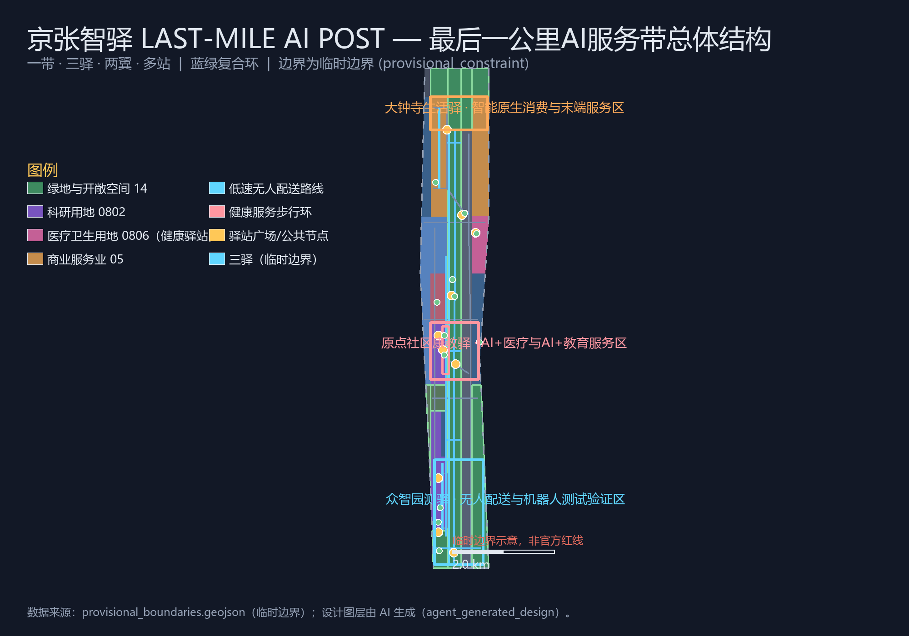
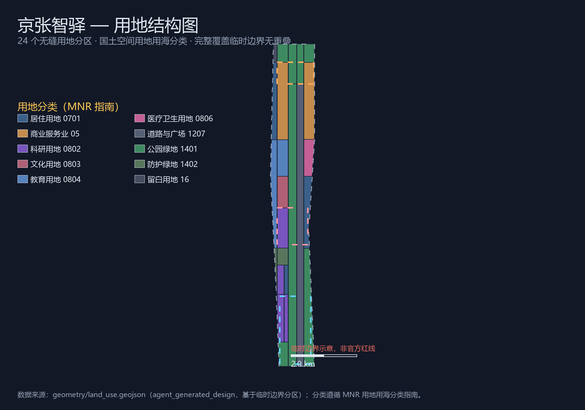
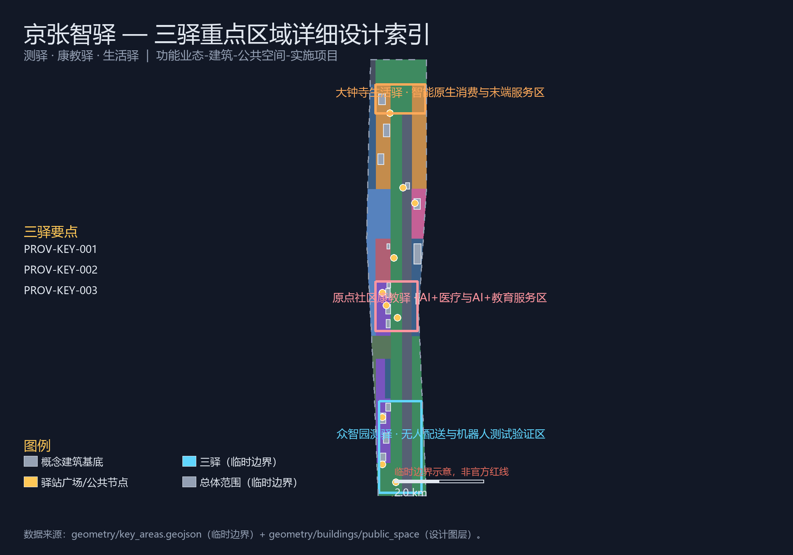
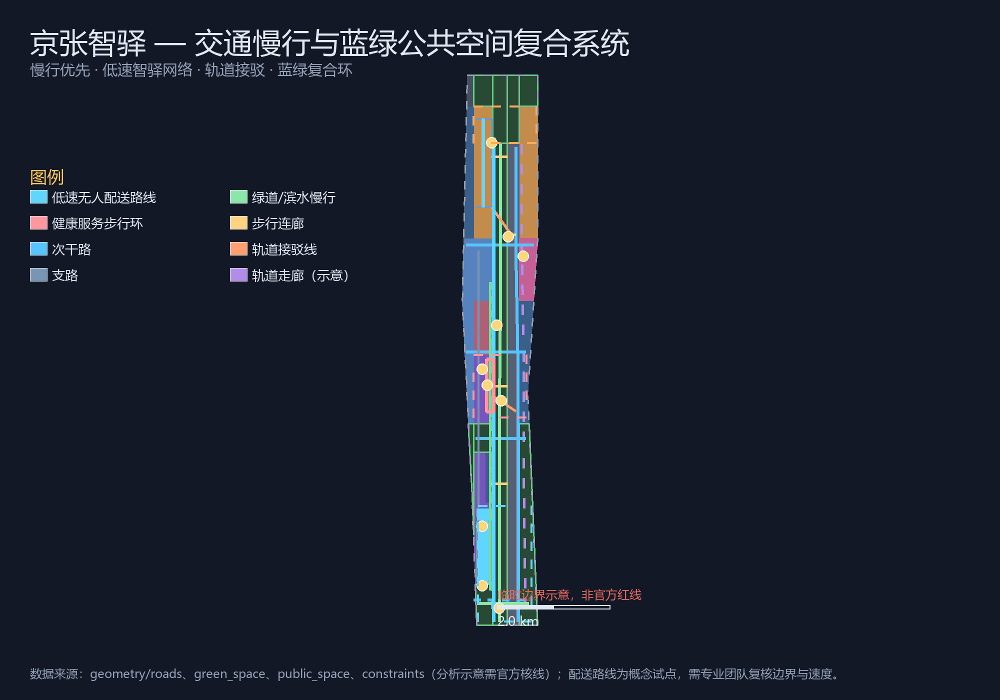
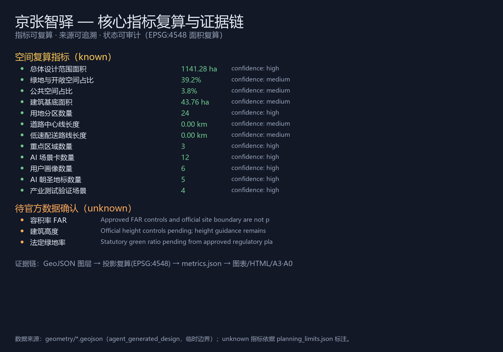

# JINGZHANG AI POST: Last-Mile AI Service Belt Urban Design Proposal for the Centennial Jing-Zhang AI Innovation Belt

## Design Basis and Source Inventory

This proposal takes the Qualification Prequalification Announcement for the Centennial Jing-Zhang AI Innovation Belt International Urban Design Open Call, published by the Haidian Branch of the Beijing Municipal Commission of Planning and Natural Resources, as its primary basis [standard:PROJECT-OFFICIAL-ANNOUNCEMENT], with the design brief, taskbook excerpts, allowed design space, enums, planning limits, standards and source lists under `brief/site-package/` as machine-readable basis [source:SITE-PACKAGE]. It follows the use boundaries in `data/source_registry.json`: currently 5 formal-ready sources and 1 provisional-only source are registered, and agents must not upgrade background-only or provisional-only material into official boundaries, statutory planning controls or implementation commitments [source:SOURCE-REGISTRY].

The agent-facing open-call taskbook adds the three positionings, five functions, three areas and two wings, six agent tasks, ten co-creation principles and a unified boundary clause [source:AGENT-TASKBOOK] [standard:PROJECT-AGENT-OPEN-CALL-TASKBOOK]. Both the announcement and the taskbook require deliverables at the urban design depth of regulatory detailed planning, and all spatial proposals are conceptual suggestions, reference schemes or material for professional teams to deepen; they do not replace formal planning or constitute government-approved conclusions [source:AGENT-TASKBOOK] [depth:existing_conditions_diagnosis].

**Boundary status statement**: The official `SITE_BOUNDARY` and the three `KEY_AREA` polygons are not yet public (the qualification package is password-protected; no public precise boundary file was found as of 2026-08-07) [source:BOUNDARY-SOURCE]. This proposal uses the provisional boundaries registered as `provisional_constraint` in `brief/site-package/geometry/provisional_boundaries.geojson` [source:BOUNDARY-SOURCE] [data:geometry/site_boundary.geojson#SITE-001]; `geometry/site_boundary.geojson` and `geometry/key_areas.geojson` are both marked `official_boundary=false` and `boundary_precision=provisional_rough` [data:geometry/key_areas.geojson#PROV-KEY-001]. Provisional boundaries are used only for generation, display and self-check; they are not official redlines, approval bases or precise-area recalculation bases. Organizer data gaps do not block content scoring; all layers and metrics must be recalculated when official polygons are released [source:BOUNDARY-SOURCE] [depth:risk_missing_data].

## Three-Level Scope Working Framework

The proposal organizes work along the three levels defined by the announcement [standard:PROJECT-OFFICIAL-ANNOUNCEMENT]: the coordinated research area of 43.6 km² focuses on the AI industry ecosystem, the unmanned delivery/robotics industry chain and future urban form; the overall design area of 11.4 km² (the submitted boundary, recomputed at about 11.41 km² [metric:site_area_sqm]) focuses on urban renewal within 1-2 km around the Jing-Zhang Heritage Park and the "last-mile" service network; and the key detailed-design area of 368.4 hectares focuses on three detailed design zones [metric:key_area_count] [depth:three_level_scope_framework]. The three levels are mapped item by item in `compliance_matrix.json` against the mandatory tasks in announcement sections 1.3, 1.4, 1.5 and agent.1—agent.6.

| Level | Design question | Proposal answer | Data anchor |
| --- | --- | --- | --- |
| Coordinated research area | How to organize AI industry ecosystem and future urban form | "Post evolution chain": century stations → service posts → AI post network [depth:overall_spatial_structure] | compliance_matrix.json, standard_matrix.json |
| Overall design area | How to implement renewal framework, service network, transport and utilities | Land use, buildings, roads, green space, public space and phasing layers jointly express it [data:geometry/land_use.geojson#LU-001] | geometry/*.geojson, metrics.json |
| Key detailed-design area | How to reach detailed design depth in three zones | "Testing / Health-Education / Living Post" positioning, spatial moves and AI scenarios [data:geometry/key_areas.geojson#PROV-KEY-001] | geometry/key_areas.geojson |

## Coordinated Research Area: Industry and Future City Research

### Belt-wide Concept and Naming System (agent.1)

The core output of the coordinated research is the belt-wide concept. This proposal puts forward the primary name **"京张智驿" (Jingzhang AI Post)**, English name **LAST-MILE AI POST · JINGZHANG** (abbreviated **JINGZHANG AI POST**), with the tagline **"From Century Stations to Last-Mile AI"** (百年站台，最后一公里), responding to the three positionings required by the taskbook [source:AGENT-TASKBOOK].

- **Centennial Jing-Zhang culture belt**: The Jing-Zhang Railway was China's first trunk railway designed and built independently. Its stations, crossings and locomotive sheds formed a "one station, one city" service tradition—the platform was the "last mile" origin of freight, mail, passengers and information exchange. This proposal takes the Post (驿) as its cultural motif, aligning the station tradition with AI-era last-mile services: delivery, health, education and guidance all return to the spatial archetype of the post.
- **Urban AI living experience belt**: AI services should not stay behind industrial park walls. Unmanned delivery vehicles, robot inspection, AI health navigation and AI education should be embedded as "post" forms into everyday citizen movement, becoming perceivable, experienceable and human-overridable urban infrastructure.
- **AI integration and innovation belt**: Using the three key areas as anchors, the robotics/autonomous-mobility industry chain, public service data and open scenarios form an innovation continuum across administrative boundaries; the "test–validate–use" loop closes within one belt [depth:overall_spatial_structure].

The naming system follows a "one belt, three posts, two wings, multiple stations" tree structure: the belt is the Jing-Zhang Heritage Park AI service belt; the three posts are the Zhongzhiyuan Testing Post, the Origin Community Health-Education Post and the Dazhongsi Living Post; the two wings are the Zhongguancun Technology Service Wing and the Xiaoyuehe Scenario Empowerment Wing; and the multiple stations are 12 AI scenario nodes (delivery, shuttle, health, education, guide stations, etc.) [data:geometry/constraints.geojson#SCN-001] [source:AGENT-TASKBOOK].

**Visual identity direction**: The logo uses the dual-line motif of "platform edge + delivery locker grid"—a horizontal platform line in the century-old Jing-Zhang rust red and a set of vertical locker cells in AI blue, intersecting into a "人"-shaped delivery symbol that represents the handover from the century-old delivery tradition to AI last-mile intelligence. The auxiliary graphics can extend into post module arrays, delivery route pulse lines and station symbol systems. This direction is a conceptual suggestion; font, graphic and trademark clearance is required before formal application [source:AGENT-TASKBOOK].

### Five Functions and Three-Areas-Two-Wings Synergy (agent.1 / agent.2)

The five functions—"AI full-stack independent innovation system, world-class AI innovation ecosystem, new paradigm of AI+ scenario empowerment, intelligent vibrant AI city, and global discourse power of AI governance"—are implemented as a synergy loop across the three areas and two wings [source:AGENT-TASKBOOK].

| Three areas / two wings | Functional role | Spatial strategy |
| --- | --- | --- |
| Zhongzhiyuan Testing Post (AI Acceleration Area) | AI full-stack independent innovation, global AI governance discourse | Unmanned delivery test loop, robot inspection & maintenance post, full-stack test labs, low-speed pilot zone (supervised, retractable) [data:geometry/constraints.geojson#CONSTRAINTS-006] |
| Origin Community Health-Education Post (Beijing AI Origin Community) | World-class AI innovation ecosystem, AI+ scenario empowerment paradigm | AI health navigation post, AI education post, near-campus commercialization, open-source collaboration and release spaces [data:geometry/buildings.geojson#BLDG-005] |
| Dazhongsi Living Post (AI Industry Cluster) | AI-native new business forms | Smart terminal experience street, smart consumption complex, data-element lounge, last-mile delivery branches [data:geometry/roads.geojson#ROAD-020] |
| Zhongguancun Technology Service Wing | Global allocation of factors, Zhongguancun IP and capital empowerment | Radiates to the three posts through Zhongguancun financial, legal, IP and capital service networks |
| Xiaoyuehe Scenario Empowerment Wing | AI scenario empowerment and intelligent vibrant AI city | Links test scenarios, public experiences and event-day delivery dispatch along Xiaoyuehe [data:geometry/roads.geojson#ROAD-012] |

### Global AI Innovation Ecosystem Cases (agent.2)

The proposal reviews 6 global cases as ecosystem design references, all at the level of publicly available experience, without committing to specific indicators [source:AGENT-TASKBOOK].

1. **Stanford Research Park, USA**: the near-campus model of university origination–venture capital–corporate conversion supports the Health-Education Post's near-campus incubation and education linkage.
2. **Punggol Digital District / delivery pilots, Singapore**: integrated park-level unmanned delivery and digital infrastructure, directly benchmarked for the Testing Post's low-speed pilot zone.
3. **Nuro, USA / commercial unmanned delivery in China**: publicly reported low-speed delivery pilots whose "fixed route, low speed, remote override" model is translated into pilot boundary and speed-constraint design.
4. **Seoul and Shenzhen last-mile robot delivery pilots**: operational experience of last-mile robots (building delivery, locker stations) coexisting with public space, supporting the multi-station nodes and post plazas.
5. **Tokyo and Helsinki autonomous shuttle pilots**: human-robot mixed traffic, station design and public communication experience on public roads, supporting the Dazhongsi station–industry zone shuttle line concept.
6. **Station F, Paris / BLOCK71, Singapore**: single incubator plus open developer community operations, supporting the Health-Education Post's open-source community and event operations.

In the ecosystem map, the proposal puts forward the "Post Evolution Chain": **station tradition** (century-old Jing-Zhang stations and delivery networks) → **service posts** (delivery, health, education and other public service posts) → **AI post network** (AI scenario nodes + data + open-scenario mechanisms) → **global AI posts** (event system, developer community and scenario going global). Factor mechanisms cover land space, industrial capital, talent, computing power, data and open scenarios; all are mechanism suggestions rather than confirmed policies [source:AGENT-TASKBOOK] [depth:overall_spatial_structure].

## Overall Design Area: Urban Renewal and Regulatory-Plan-Depth Urban Design

The overall design area is renewed primarily through urban regeneration and organized at regulatory-plan depth [standard:MOHURD-CONTROL-DETAILED-PLANNING] [depth:land_use_layout]. The spatial structure is "**one belt, three posts, two wings, multiple stations, and a blue-green composite ring**": the belt is the Jing-Zhang Heritage Park AI service belt (the north-south park and slow-traffic spine [data:geometry/green_space.geojson#GREEN-001]); the three posts are the three key areas; the blue-green composite ring is enclosed by the Qinghe waterfront, the North 5th Ring buffer, the western buffer and the southern green wedges, forming a "one ring one belt" ecological skeleton with the heritage park belt [depth:blue_green_public_space].

The land-use structure follows the national territorial spatial land-use classification [standard:MNR-LAND-USE-CLASSIFICATION-GUIDE], with 24 seamless land-use parcels [metric:land_use_parcel_count] [data:geometry/land_use.geojson#LU-001]: research land (0802) at the core of Zhongzhiyuan and the Origin Community; commercial service land (05) concentrated in the Dazhongsi area; residential land (0701) in the northern and southern living clusters; education land (0804) along the university collaboration belt and the central education-research extension; **newly added medical and health land (0806) as the community AI health service post area**; green and open space land (14 category) as the blue-green skeleton; road and plaza land (1207) organizing the longitudinal composite corridor; and reserved land (16) for uncertain AI scenario evolution [data:geometry/land_use.geojson#LU-001] [metric:green_ratio].

Development intensity and building height lack official regulatory-plan conditions and are all listed as pending confirmation (see the `unknown` status of `floor_area_ratio` and `building_height_m` in `metrics.json` and the missing list in `ranges/planning_limits.json`) [depth:development_intensity_controls]. The proposal only provides graded guidance—moderate interfaces along the park belt, higher intensity around transit stations, medium-low intensity in community clusters—without specific numeric conclusions [depth:height_massing_character].

The urban renewal framework includes: identification of underused space (mainly existing offices, wholesale, industrial heritage and railway-corridor space), a renewal project list (JZ-01—JZ-10, see "Renewal Project List" chapter), and the implementation logic of "posts before blocks, pilots before rollout, operations before construction" [depth:renewal_project_list].

## Key Area Detailed Design

The three key areas are expressed with `provisional_constraint` boundaries [data:geometry/key_areas.geojson#PROV-KEY-001], at the conceptual depth of a comprehensive implementation plan [depth:three_key_area_detailed_design].

### Zhongzhiyuan Testing Post: Unmanned Delivery and Robot Testing Area (approx. 192.1 ha)

**Positioning**: the "Testing Post" of full-stack independent innovation—organizing unmanned delivery, low-speed shuttle and robot inspection testing into a supervised, retractable park test field, while hosting the AI full-stack industry chain and safety-governance display [data:geometry/key_areas.geojson#PROV-KEY-001].

**Spatial moves**: a low-carbon innovation exchange belt along the Qinghe waterfront [data:geometry/green_space.geojson#GREEN-001]; a low-speed unmanned delivery pilot zone (conceptual range [data:geometry/constraints.geojson#CONSTRAINTS-006]) and delivery main corridor [data:geometry/roads.geojson#ROAD-017] in the central park; the internal branch loop (ROAD-005) connecting the test hub [data:geometry/buildings.geojson#BLDG-001], last-mile sorting center [data:geometry/buildings.geojson#BLDG-002] and robot inspection & maintenance post [data:geometry/buildings.geojson#BLDG-003].

**AI scenarios**: park low-speed unmanned delivery loop (test), robot inspection & maintenance (test), event-day delivery dispatch (test) [metric:industry_test_scenario_count]. Pilot boundaries, speed, avoidance rules and operational responsibility must be reviewed by transport, safety, operations and public-participation teams; pilots can be withdrawn at any time [source:AGENT-TASKBOOK].

### Origin Community Health-Education Post: AI+Health and AI+Education Service Area (approx. 104.3 ha)

**Positioning**: the near-campus "Health-Education Post"—organizing university origination, commercialization and AI health/education public services into a cluster of service posts reachable daily by talent and residents [data:geometry/key_areas.geojson#PROV-KEY-002].

**Spatial moves**: the AI health navigation post [data:geometry/buildings.geojson#BLDG-005] and AI education post [data:geometry/buildings.geojson#BLDG-006] are arranged along the community health service walking loop (ROAD-019), linking the co-creation plaza [data:geometry/public_space.geojson#PUBLIC-005] and the AI education interactive plaza [data:geometry/public_space.geojson#PUBLIC-010]; campus-park slow-traffic stitching relies on the Tsinghua East Road connection [data:geometry/roads.geojson#ROAD-004].

**AI scenarios**: AI health navigation post (AI+health), AI education post (AI+education), campus-community shuttle point. Health-related content serves only as public service navigation, reviewed by medical, legal and data-security professionals, without crossing into medical advice [source:AGENT-TASKBOOK].

### Dazhongsi Living Post: AI-Native Consumption and Last-Mile Service Area (approx. 72.0 ha)

**Positioning**: the urban "Living Post"—organizing smart terminals, content consumption, data elements and last-mile delivery into a smart living district experienceable by citizens [data:geometry/key_areas.geojson#PROV-KEY-003].

**Spatial moves**: the Dazhongsi station integrated hub plaza [data:geometry/public_space.geojson#PUBLIC-002] organizes rail connections and the unmanned shuttle line [data:geometry/roads.geojson#ROAD-013]; the smart terminal experience street [data:geometry/buildings.geojson#BLDG-012] and smart consumption complex [data:geometry/buildings.geojson#BLDG-011] form the experience spine; community delivery branches (ROAD-020) connect the four-quadrant pedestrian system (ROAD-016).

**AI scenarios**: smart terminal experience street, AI cultural guide station, unmanned shuttle trial boarding point. Consumption and display content must be rights-cleared; experience data follows minimization and human review [source:AGENT-TASKBOOK].

## AI Innovation Ecosystem, Talent Profiles and AI+ Scenarios

### User Personas (agent.3)

The proposal covers 6 user personas [metric:user_persona_count], organizing spatial responses around the "post" service interface:

| Persona | Typical needs | Spatial response | Self-check boundary |
| --- | --- | --- | --- |
| Park R&D staff | Test sites, computing power, commute and meal delivery | Testing Post loop, delivery corridor, post plazas | No personal behavior tracking; test data aggregated only |
| Last-mile operations staff | Delivery vehicle/robot charging, maintenance, dispatch | Robot inspection & maintenance post, sorting center | Operations data limited to device status, no personal identification |
| University students and faculty | Commercialization, health & education services, slow commute | Health/education posts, campus slow-traffic stitching | Campus data and research results require authorization |
| Nearby residents | Health navigation, community services, low-disturbance delivery | Community health service post area, community delivery branches | No resident profiling for commercial recommendation |
| Merchants and entrepreneurs | Smart terminal display, experience street traffic, last-mile shipping | Smart terminal experience street, data-element lounge | Business data requires merchant authorization |
| Visitors and tourists | AI guidance, cultural experience, public rest | AI cultural guide station, heritage park post plazas | Guide content requires fact-checking and rights clearance |

### 12 AI Scenario Cards (agent.3)

Each scenario card maps to a spatial node, service users, data sources, privacy boundaries, human review and operation entity [data:geometry/constraints.geojson#SCN-001]:

| Scenario card | Spatial carrier | Design note | Human review |
| --- | --- | --- | --- |
| 01 Park low-speed delivery loop (test) | Testing Post delivery corridor ROAD-017 [data:geometry/roads.geojson#ROAD-017] | Fixed low-speed route pilot, remote override, retractable | Pilot boundary and speed reviewed by transport/safety/operations teams |
| 02 Unmanned shuttle trial point (test) | Dazhongsi station–industry zone line ROAD-013 | Public shuttle pilot at rail terminus with booking and safety officer | Human-robot mixed traffic and station design require professional review |
| 03 Robot inspection & maintenance post (test) | BLDG-003 robot inspection post | Assistance for public-space inspection, greening and facility maintenance | Inspection scope and data retention require public-participation review |
| 04 AI health navigation post (AI+health) | BLDG-005 Origin Community health post | Health service directory navigation, event risk reminders, public service Q&A | Health content limited to navigation; reviewed by medical/legal/data professionals |
| 05 AI education post (AI+education) | BLDG-006 Origin Community education post | AI science education for students and the public, course booking, open-source learning | Teaching content reviewed by education professionals |
| 06 Accessible slow-traffic navigation point | Heritage park greenway ROAD-007 [data:geometry/roads.geojson#ROAD-007] | Explainable signage and low-intrusion sensing to identify slow-traffic gaps | No personal trajectory collection; gap data aggregated only |
| 07 AI cultural guide station | Tsinghua Garden station cultural memorial BLDG-009 | Explainable, traceable Jing-Zhang history and culture guidance | Facts, images and people narratives reviewed by culture and copyright staff |
| 08 Smart terminal experience street | Dazhongsi smart terminal street BLDG-012 | Smart terminals, content consumption and immersive display | Display content rights-cleared; experience data minimized |
| 09 Community comprehensive service post | Central community service center BLDG-016 | Life services, policy Q&A, public service navigation | Service information periodically verified with human fallback |
| 10 Event-day delivery dispatch point (test) | Qinghe waterfront innovation exchange belt | Event-day last-mile delivery and waste collection dispatch, tiered response | Event safety and traffic organization require professional review |
| 11 Campus-community shuttle point | Tsinghua East Road EDU-WEST | Low-speed shuttle and shared mobility for students and community | Campus and road ownership require authorized review |
| 12 Southern community health post (AI+health) | Community health service post area MED-HEALTH [data:geometry/land_use.geojson#LU-023] | Southern community health navigation and elderly service entry | Health content limited to navigation; professional review required |

Four of these are industry test/validation scenarios (01/02/03/10) [metric:industry_test_scenario_count], all following the low-speed, supervised, retractable principle; health and education scenarios follow data minimization, public sources, explainability and human review [source:AGENT-TASKBOOK]. All AI scenario nodes enter the SCENARIO_NODE layer of `geometry/constraints.geojson` (12 nodes [data:geometry/constraints.geojson#SCN-001]).

### AI Pilgrimage Landmarks and Honor Displays (agent.4)

The proposal puts forward 5 AI pilgrimage landmarks or honor-display nodes [metric:ai_pilgrimage_landmark_count]:

1. **Testing Post Bell Tower (Zhongzhiyuan)**: a public observation point at the start of the unmanned delivery test loop, commemorating the "first delivery" and test milestones, with an honor wall for enterprise/team contributions (rights-cleared).
2. **Open-Source Origin Stele (Origin Community)**: an honor node for near-campus commercialization and open-source collaboration, displaying contributor lists and open-source outputs (following the contribution-memory principle).
3. **Health-Education Post Lighthouse (Origin Community)**: a public landmark for AI health and education services, softly displaying service status at night (not an advertising screen).
4. **Last-Mile Museum (Dazhongsi)**: a narrative space of delivery history from century platforms to AI posts, showing the Jing-Zhang delivery tradition and AI last-mile service evolution.
5. **Smart Bell (Dazhongsi station plaza)**: data pulses and chimes announcing activity and service periods, translating the station timekeeping tradition into urban AI service rhythm.

Landmarks, signage, logos, fonts, images, people and enterprise identities must all be rights-cleared; they must not be over-entertained or presented as approved construction [source:AGENT-TASKBOOK] [depth:three_key_area_detailed_design].

## Land Use, Building Scale, and Retain/Renovate/Demolish Plan

Land use is organized around the "post": research land (0802) supports the Testing and Health-Education Post cores; medical and health land (0806) hosts the community AI health service post area; education land (0804) organizes the university collaboration belt; commercial service land (05) serves the Living Post; residential land (0701) and green land (14 category) secure a livable environment; and reserved land (16) provides room for AI scenario evolution [data:geometry/land_use.geojson#LU-001] [standard:MNR-LAND-USE-CLASSIFICATION-GUIDE].

Building footprints express 16 conceptual buildings [data:geometry/buildings.geojson#BLDG-001], distinguishing retain, renovate and proposed-new actions [depth:retain_renovate_demolish]: retained objects include the Xueyuan Road office clusters and talent residential buildings [data:geometry/buildings.geojson#BLDG-014]; renovated objects include the health posts, education posts, transfer center and existing commercial buildings [data:geometry/buildings.geojson#BLDG-005]; proposed-new objects include the delivery test hub, sorting center and smart consumption complex [data:geometry/buildings.geojson#BLDG-001]. The recomputed building footprint area is about 43.76 ha [metric:building_footprint_area_sqm], all conceptual renewal footprints pending official parcels and ownership data.

Building scale and intensity indicators must be consistent with `metrics.json` and the layers: floor area ratio, building height, building density, green ratio, setbacks and building control lines lack official conditions and are listed as unknown/pending_control, without fabricating precision [depth:development_intensity_controls] [metric:floor_area_ratio].

## Transport, Rail, Municipal and Public Service Facilities

The transport plan takes "slow traffic first + low-speed AI post network" as its skeleton: the longitudinal composite arterial road [data:geometry/roads.geojson#ROAD-001] organizes external connections; the Jing-Zhang Heritage Park greenway [data:geometry/roads.geojson#ROAD-007] and the health service walking loop [data:geometry/roads.geojson#ROAD-019] organize the slow-traffic spine; **4 low-speed delivery routes** (delivery corridors and branches ROAD-017/018/020, totaling about [metric:delivery_route_km] km [data:geometry/roads.geojson#ROAD-017]) form the unmanned delivery network skeleton; and 2 rail connection lines (ROAD-013/014) link Dazhongsi and Wudaokou stations [depth:traffic_rail_slow_parking].

All unmanned delivery routes are conceptual: pilot scope, speed limits, avoidance rules and operational responsibility must be reviewed by transport, safety, operations and public-participation teams, following the low-speed, supervised, retractable principle [source:AGENT-TASKBOOK]. Where rail alignments and road redlines are missing, the corresponding conclusions are downgraded to pending confirmation [depth:risk_missing_data].

Municipal and public service facilities cover AI industry service facilities, innovation service platforms, talent living services, new infrastructure, distributed energy, edge computing and integration with traditional municipal facilities [depth:municipal_new_infrastructure]; post nodes reserve charging/swapping, locker, smart cabinet and data-terminal interfaces as new-infrastructure prototypes to be deepened. Missing pipeline, energy, drainage, flood-control and fire-protection data are listed as prerequisites for formal deepening [source:AGENT-TASKBOOK].

## Blue-Green Space, Public Space and Urban Character

The blue-green system takes the Jing-Zhang Heritage Park belt as its skeleton, coordinates Qinghe, Xiaoyuehe and the travel needs of universities, enterprises and communities, and forms a north-south connected, east-west linked pedestrian and cycling system [depth:blue_green_public_space] [data:geometry/green_space.geojson#GREEN-001]; green and open space land recomputes to about 446.96 ha [metric:green_space_area_sqm], with a green ratio of about 39.2% [metric:green_ratio], supporting innovation exchange and talent living quality [data:geometry/public_space.geojson#PUBLIC-001].

Public space forms a network of 10 post plazas and gateway plazas [metric:public_space_ratio], including the new Zhongzhiyuan unmanned delivery post plaza [data:geometry/public_space.geojson#PUBLIC-008], the community AI health service plaza [data:geometry/public_space.geojson#PUBLIC-009] and the AI education interactive plaza [data:geometry/public_space.geojson#PUBLIC-010], giving delivery, health and education services a stayable, supervised and exit-able public interface [data:geometry/constraints.geojson#SCN-001].

Urban character fuses Jing-Zhang railway heritage culture, Zhongguancun innovation culture and AI innovation culture: cultural resources such as the Tsinghua Garden railway station are used, and the "platform-locker-pulse" symbol system organizes signage and public art; urban tone, building character, roof form, massing and interface control distinguish official controls, design suggestions and pending confirmation, strictly avoiding pseudo-precise control lines without heritage or regulatory-plan basis [standard:MOHURD-URBAN-DESIGN-MEASURES] [standard:MOHURD-ARCH-DESIGN-DEPTH-2016] [depth:height_massing_character].

## Renewal Project List, Implementation Policy and Phasing

| No. | Project | Type | Main dependencies | Evidence |
| --- | --- | --- | --- | --- |
| JZ-01 | Jing-Zhang Heritage Park slow-traffic gap stitching | Public space/transport | Road redlines, underpass space, traffic organization review | [data:geometry/roads.geojson#ROAD-007] |
| JZ-02 | Zhongzhiyuan Qinghe innovation interface | Blue-green/industry display | River blue lines, ecology and flood control conditions | [data:geometry/green_space.geojson#GREEN-001] |
| JZ-03 | Zhongzhiyuan low-speed delivery pilot zone | Testing/new infrastructure | Pilot boundary, speed, avoidance rules and operations review | [data:geometry/constraints.geojson#CONSTRAINTS-006] |
| JZ-04 | Origin Community health service walking loop | Public service/slow traffic | Campus boundary, ownership, ground-floor use | [data:geometry/roads.geojson#ROAD-019] |
| JZ-05 | Origin Community AI health/education posts | Renewal/public service | Medical and education content review, data security | [data:geometry/buildings.geojson#BLDG-005] |
| JZ-06 | Dazhongsi station four-quadrant pedestrian connection | Rail integration/slow traffic | Rail station, intersections, municipal pipelines | [data:geometry/public_space.geojson#PUBLIC-002] |
| JZ-07 | Dazhongsi smart terminal experience street | Renewal/smart consumption | Commercial operators, display content clearance | [data:geometry/buildings.geojson#BLDG-012] |
| JZ-08 | Community delivery branch network | New infrastructure/logistics | Road redlines, fire protection, operation permits | [data:geometry/roads.geojson#ROAD-020] |
| JZ-09 | Community AI health service post area | Renewal/health service | Medical land conditions, service qualifications | [data:geometry/land_use.geojson#LU-023] |
| JZ-10 | Global AI event week public route | Operations/brand | Public space permits, event safety, rights clearance | [data:geometry/phasing.geojson#PHASE-001] |

The phasing corresponds to `geometry/phasing.geojson` [depth:phasing_implementation]: **Phase 1** (about [metric:phase_1_area_sqm] ㎡) starts with the Origin Community Health-Education Post and the middle section of the heritage park, first implementing health/education posts and slow-traffic stitching [data:geometry/phasing.geojson#PHASE-001]; **Phase 2** (about [metric:phase_2_area_sqm] ㎡) advances the Zhongzhiyuan Testing Post and Dazhongsi Living Post renewal [data:geometry/phasing.geojson#PHASE-002]; **Phase 3** (about [metric:phase_3_area_sqm] ㎡) completes the belt-wide blue-green network and urban character [data:geometry/phasing.geojson#PHASE-004]. Implementation phasing is clearly distinguished from the 100-day call cycle; lightweight facilities and operation activities may start first, and no implementation commitments are made before official regulatory-plan, municipal, transport and ownership conditions are confirmed [depth:renewal_project_list].

**Long-term operations (agent.6)**: the proposal puts forward an annual event system (AI Post Open Day, Unmanned Delivery Experience Week, AI Health Service Festival, Education Science Camp), event branding and communication visual system, developer community operations (open-source contribution wall, open-scenario API pilot), open-scenario operation mechanism (low-speed pilot application–evaluation–exit), public experience and landmark operations (post plazas and pilgrimage landmark tours), and international communication and conversion mechanisms (global AI Post roadshows, developer diplomacy). All events, recruitment, policies and operations are conceptual suggestions and are not presented as confirmed government arrangements [source:AGENT-TASKBOOK].

## Indicator System, Area Recalculation and Compliance Matrix

All core indicators are reproducible from GeoJSON or trusted sources [depth:metrics_recalculation]: the overall design area is about 11.41 km² [metric:site_area_sqm], with three key areas [metric:key_area_count], 24 seamless land-use parcels [metric:land_use_parcel_count], green space of about 446.96 ha with a green ratio of about 39.2% [metric:green_ratio], and public space of about 43.70 ha with a ratio of about 3.83% [metric:public_space_ratio].

Building footprints total about 43.76 ha [metric:building_footprint_area_sqm]; road centerlines total about [metric:road_centerline_km] km, including about [metric:delivery_route_km] km of low-speed delivery routes [data:geometry/roads.geojson#ROAD-017]; phase areas are about [metric:phase_1_area_sqm], [metric:phase_2_area_sqm] and [metric:phase_3_area_sqm] ㎡ respectively [data:geometry/phasing.geojson#PHASE-001].

The proposal covers 12 scenario cards [metric:ai_scenario_node_count], 6 user personas [metric:user_persona_count], 5 pilgrimage landmarks [metric:ai_pilgrimage_landmark_count] and 4 industry test scenarios [metric:industry_test_scenario_count].

Control indicators such as floor area ratio, building height, building density, green ratio and setbacks lack official conditions and are all listed as unknown with prerequisites stated [metric:floor_area_ratio] [metric:building_height_m]. `compliance_matrix.json` covers all 23 mandatory tasks of announcement sections 1.3, 1.4, 1.5 and agent.1—agent.6 item by item; `standard_matrix.json` covers 6 mandatory standards; `design_depth_matrix.json` covers 15 formal design depth items (all complete).

## Risks, Copyright and Compliance

Legal status of materials, copyright authorization, exclusion of non-public data, privacy protection and AI generation responsibility follow the taskbook boundary clause [source:AGENT-TASKBOOK]: all images, drawings, icons, data and code assets are documented for source, license and authorization status in `sources.json` and `report/copyright_statement.md`; AI scenario data follows minimization and human review; this proposal does not claim official approval, approved regulatory planning, final land ownership, final construction scale or guaranteed implementation [depth:risk_missing_data] [data:geometry/constraints.geojson#CONSTRAINTS-001].

**Bilingual contract**: this proposal is written primarily in Chinese, with `proposal.en.md` as the complete counterpart translation; A3/A0 drawings, HTML visualization and text-bearing figures all provide English counterparts, preferring recommended translations from `docs/terminology-glossary.md`. HTML pages are offline static files without remote scripts, map tiles, fonts, iframes, forms or external APIs.

Pending data includes: official boundary and three key-area polygons, regulatory-plan conditions, road redlines, parcel ownership, existing buildings, municipal pipelines, rail alignments, Qinghe/Xiaoyuehe blue lines and heritage protection ranges; all gaps in `missing_data_checklist.csv` enter `assumptions.json` and the risk chapter, with full-chain recalculation after official polygon release [source:BOUNDARY-SOURCE] [depth:risk_missing_data].

## References

- Centennial Jing-Zhang AI Innovation Belt International Urban Design Open Call Qualification Prequalification Announcement, Haidian Branch of Beijing Municipal Commission of Planning and Natural Resources, 2026-05-09
- Agent Open Call Taskbook Excerpts for the Centennial Jing-Zhang AI Innovation Belt Urban Design Open Call, 2026-05-18 (user-provided cleared document)
- "Three Areas and Two Wings to Build a World-Class AI Cluster", Beijing Municipal Science & Technology Commission and Zhongguancun Administrative Committee, 2026-04-03
- "Haidian Releases the '1+X+1' Modern Industrial System Layout", Haidian District People's Government, 2026-03-02
- Urban Design Administrative Measures, Ministry of Housing and Urban-Rural Development, 2017
- Measures for Compiling and Approving Regulatory Detailed Plans for Cities and Towns, Ministry of Housing and Urban-Rural Development
- Guidelines for Land and Sea Use Classification in Territorial Spatial Surveys, Planning and Use Control, Ministry of Natural Resources, 2023
- Provisional Rough Boundaries and Three Key-Area Polygons for the Centennial Jing-Zhang AI Innovation Belt, registered by repository maintainers, 2026-06-05
- Complete machine index: `sources.json`, `metrics.json`, `compliance_matrix.json`, `standard_matrix.json`, `design_depth_matrix.json` [source:SITE-PACKAGE] [source:AGENT-TASKBOOK]
