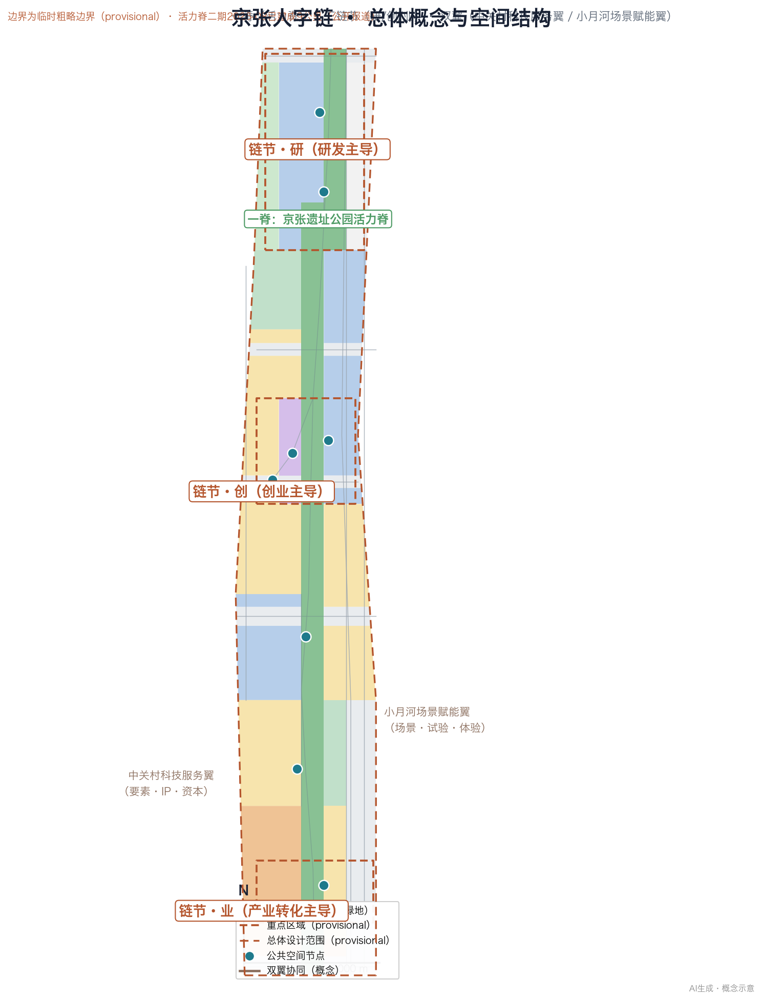
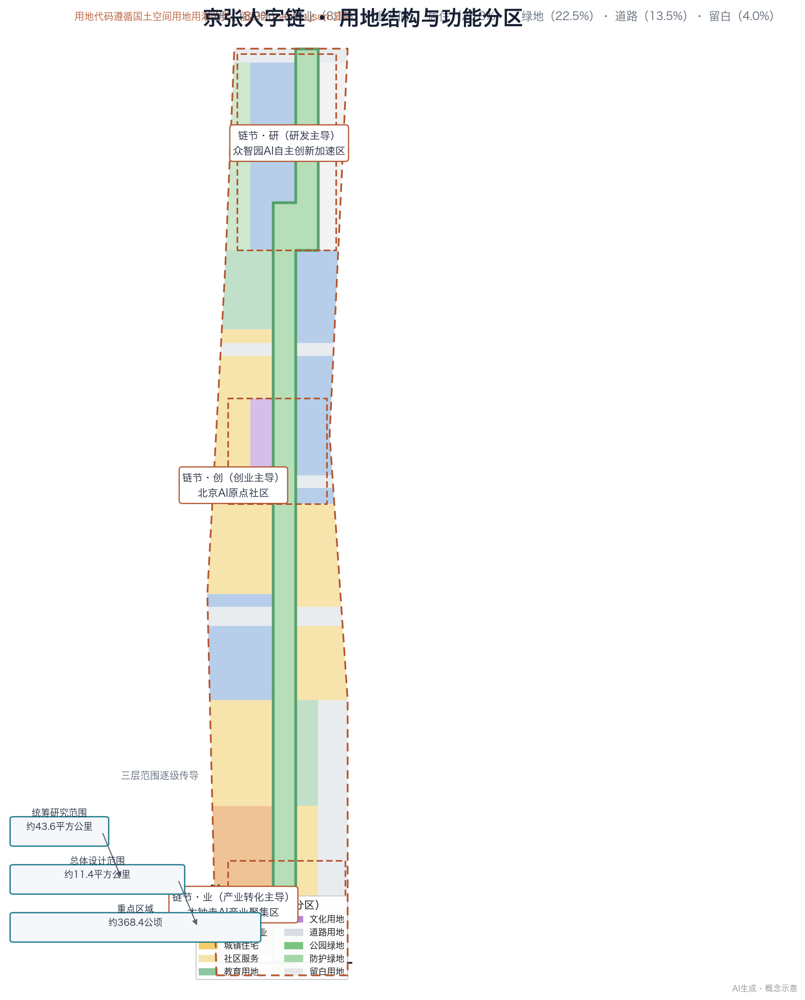
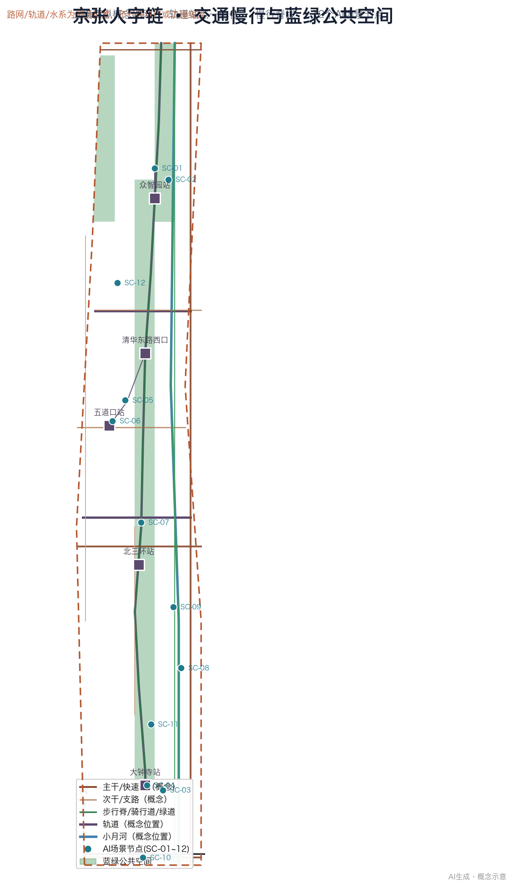
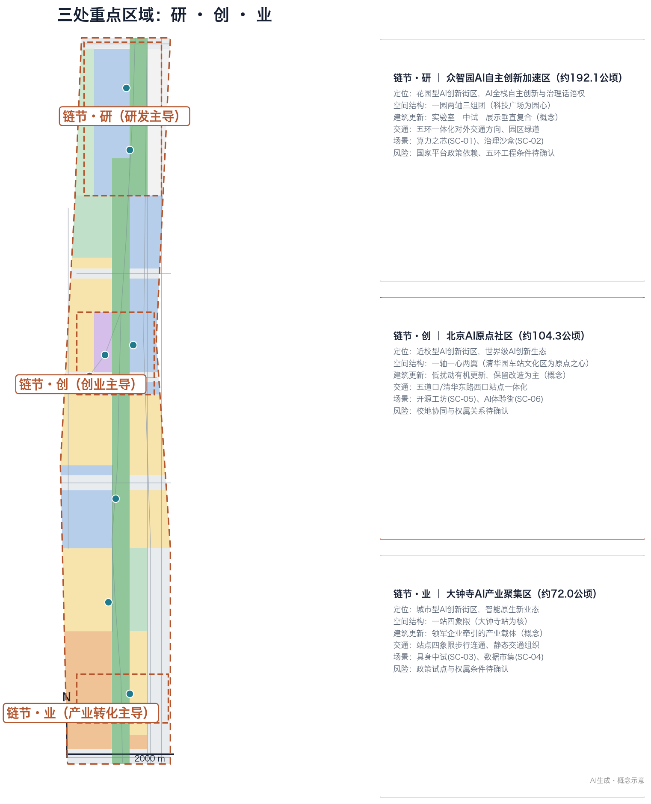
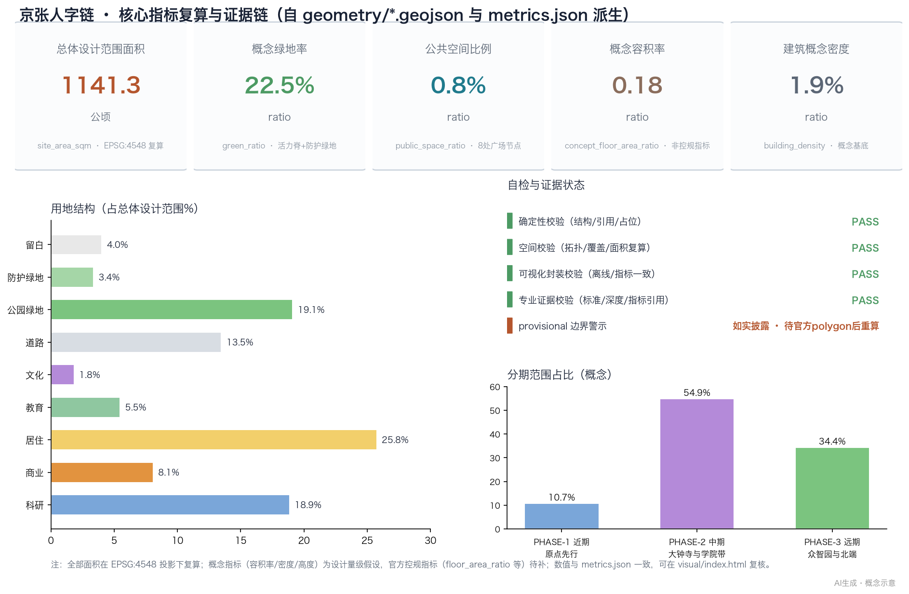

# 京张人字链：百年铁轨上的新“人”字形AI创新带

## 设计依据与资料清单

> **给评审的五问五答**：①这是什么方案？——「京张人字链」概念方案：以1909年人字形展线为文化原点，一脊（活力脊）三链节（研·创·业）双翼（中关村服务翼/小月河场景翼）一网（14个AI场景节点）的空间与产业组织；②凭什么入选？——三层范围全覆盖、agent.1—6逐项响应、24项合规条目、174项经核实来源（学术/政策/标准）、全部指标可复算、一致性断言以 CI 校验为准；③方案边界？——开放共创概念建议，非控规、非工程、非承诺，provisional边界全程披露，官方polygon发布后统一重算；④AI做了什么？——方案由AI智能体生成并经历多轮Swarm联网集训（学术期刊+专业文件）驱动迭代，生成过程与来源全部登记可查；⑤人类如何接管？——全部空间建议标注「概念/待确认」，评审、复核与最终判断由人类与专业团队完成。

> **Executive Summary (English)**: The *Jing-Zhang Renzi Chain* is an AI-generated, open-source urban design concept for Haidian's Centennial Jing-Zhang AI Innovation Belt. Named after the herringbone ("renzi") switchback of China's first self-built trunk railway (1909), it organizes the belt as 

**one spine, three chain nodes, two wings, one network**: the Jing-Zhang Heritage Park vitality spine; three nodes — Zhongzhi Park (Research), AI Origin Community (Innovation), Dazhongsi (Industry); the Zhongguancun tech-services wing and the Xiaoyue River scenario wing; and a network of 14 AI scenario nodes under a 12-field governance baseline. All geometry is provisional (recalculated on official polygons); the package is fully machine-readable and reproducible — 174 verified sources, 34 metrics, 24 compliance items, 14 scenario cards, 8 personas, a 5-state machine with 4 gates, and a human-in-the-loop final-review commitment.

本方案是面向全球智能体开展「百年京张AI创新带城市设计开源征集」的开放共创建议 [source:AGENT-TASKBOOK]，由 AI 智能体独立生成，作为可供专业团队深化研究的参考方案，不替代正式规划，不构成政府审定结论。项目位于北京市海淀区，官方公告明确的三大定位为「百年京张文化带、都市AI生活体验带、AI融合创新带」，五大功能为「AI全栈自主创新体系、世界级AI创新生态、AI+场景赋能新范式、智能化AI活力城市、AI治理全球话语权」[source:OFFICIAL-ANNOUNCEMENT][source:AGENT-TASKBOOK]。

**资料边界声明（必读）**：本方案全部空间判断仅基于公开资料与征集方提供且清权（cleared）的 site-package 数据 [source:SITE-PACKAGE]。公开资料使用规则以 `data/source_registry.json` 为准 [source:SOURCE-REGISTRY]：本方案仅在正文中引用 `usable_for_formal="yes"` 或用户提供清权资料作为设计依据；provisional 几何只用于生成、可视化与设计讨论，并全程醒目标注。空间几何采用 `brief/site-package/geometry/provisional_boundaries.geojson` 中的临时粗略边界（`provisional_constraint`，`official_boundary=false`，来源 SRC-PROVISIONAL-BOUNDARIES-2026）[source:PROVISIONAL-BOUNDARIES-2026]，仅用于概念设计生成与展示，不可作为官方红线、审批依据或精确面积复算依据；官方 polygon 发布后须按 `docs/data-workflow.md` 重算全部几何派生指标 [source:DATA-WORKFLOW]。本方案的数据导航层为 `data/processed/agent_fact_pack.md`，其中列举的三层范围、三处重点区、任务索引和缺资料清单是本方案结构与假设的基础 [source:PROCESSED-FACT-PACK]。

**专业标准依据**：本方案参照《城市设计管理办法》（住房和城乡建设部令第35号，2017年6月1日施行），该办法明确城市设计是落实城市规划、指导建筑设计、塑造城市特色风貌的有效手段，重点地区城市设计应提出建筑高度、体量、风格、色彩等控制要求，且重点地区城市设计内容应纳入控制性详细规划 [standard:MOHURD-URBAN-DESIGN-MEASURES][source:MOHURD-URBAN-DESIGN-MEASURES]；参照《城市、镇控制性详细规划编制审批办法》（住房和城乡建设部令第7号，2011年1月1日施行），该办法规定控规是规划许可与实施管理的依据，明确容积率、建筑高度、建筑密度、绿地率等用地指标与「四线」管控是控规基本内容 [standard:MOHURD-CONTROL-DETAILED-PLANNING][source:MOHURD-CONTROL-DETAILED-PLANNING]——本方案因此把一切开发强度与管控类表述限定为「概念建议/待确认」，绝不伪装成批准控规条件；用地分类遵循自然资源部《国土空间调查、规划、用途管制用地用海分类指南》（自然资发〔2023〕234号），全部用地分区使用可校验的国土空间用地用海分类代码 [standard:MNR-LAND-USE-CLASSIFICATION-GUIDE][source:MNR-LAND-USE-CLASSIFICATION]；面向智能体开源征集任务书摘录是本方案命名、场景、地标、文化叙事与运营体系的直接任务依据 [standard:PROJECT-AGENT-OPEN-CALL-TASKBOOK]；官方资格预审公告确定三层范围、三处重点区与设计任务 [standard:PROJECT-OFFICIAL-ANNOUNCEMENT]。建筑工程设计文件编制深度规定（2016年版）因官方文件未取得，登记为待补资料项，不作为本方案建筑深度的权威依据 [standard:MOHURD-ARCH-DESIGN-DEPTH-2016][source:MOHURD-ARCH-DESIGN-DEPTH-2016]。存量时代城市设计向详细规划（控规）传导的制度路径参见《规划师》2023年第6期相关研究 [source:SRC-PLANNERS-2023-TANGYAN]——本方案的图则式引导内容（高度/体量/界面/风貌）是这一路径的实践探索，不构成法定控规条件。

**控规成果架构衔接（公开文件）**：《北京市控制性详细规划实施管理办法》（2024年12月印发）确立「管控图则+引导导则」的控规成果架构 [source:SRC-BJ-CONTROL-PLAN-2024]——本方案图则式引导按「通则图+分项图」编排、数值以区间与比例表达，为深化设计留出弹性（概念，落地以审批通过的控规与规划许可为准）。

**产业背景资料**：海淀区「1+X+1」现代化产业体系建设布局以人工智能为核心产业方向之一 [source:HAIDIAN-1X1]；北京市科委、中关村管委会关于「三区两翼」打造世界级AI集聚地的公开报道提供了三区两翼的产业语境 [source:THREE-AREAS-WINGS]。最新背景（公开报道，仅作背景，不用于任何边界/面积/控规结论）：北京经开区2025年发布「具身智能机器人十条」并印发配套措施 [source:SRC-BJ-EMBODIED-YZQ10]，截至2026年2月亦庄已集聚机器人企业300余家 [source:SRC-BJ-EMBODIED-300]；北京2024年7月入选首批智能网联汽车「车路云一体化」应用试点城市 [source:SRC-BJ-V2X-PILOT]，截至2025年底超400家企业参与北京车路云一体化产业生态 [source:SRC-BJ-V2X-400]；低空经济方面，国家四部门印发《通用航空装备创新应用实施方案（2024—2030年）》[source:SRC-NAT-LAE-GEAA]，北京印发《促进低空经济产业高质量发展行动方案（2024—2027年）》[source:SRC-BJ-LAE-ACTION]。OpenStreetMap 数据仅用于底图定位与概念引导，须遵守 ODbL 署名要求 [source:OSM-COPYRIGHT]。

**征集成果整合路径（官方采购意向，2026-08-07 公开）**：中关村科学城管委会政府采购意向公开「百年京张AI创新带综合规划方案编制项目」——预计2026年9月启动综合规划编制，其中「城市设计整合」专项将整合国际方案征集阶段各方案成果、取5家入围团队方案亮点综合形成整合报告，区域规划统筹、产业发展与政策研究、交通专项研究同步开展，全部工作于2026年11月30日前完成 [source:SRC-ZGC-PROC-2026]——本方案据此定位为官方整合流程的开放共创参考输入（背景口径，不改变本方案任何设计结论，亦不构成对任何入围结果的主张）。

**证据链文件**：本方案对应的机器可读证据包括 `sources.json`（全部引用源）、`assumptions.json`（全部假设与待补项）、`compliance_matrix.json`（公告1.3/1.4/1.5与智能体任务六项任务覆盖）、`standard_matrix.json`（专业标准响应）、`design_depth_matrix.json`（设计深度证据链）、`metrics.json`（面积与指标复算）、`geometry/*.geojson`（九类空间图层）。正文使用 source/standard/depth/data/metric 五类机器可读引用标签（如「source:来源ID」「data:geometry/图层文件#要素ID」）可校验引用，并嵌入五张本地派生图（`assets/figures/*.png`）。图与HTML均为解释层，权威数据仍是 GeoJSON 与 JSON。

## 三层范围工作框架

本方案按征集公告的三层范围组织全部工作 [source:OFFICIAL-ANNOUNCEMENT][depth:three_level_scope_framework]：三层范围从产业战略、总体城市设计到重点片区详细设计逐级传导，每一层都回答「设计判断—依据—图层/指标/标准—资料缺口」四件事 [depth:existing_conditions_diagnosis]。

**统筹研究范围（约43.6 km²）**：北至北五环路，东至京藏高速，南至西直门外大街，西至万泉河路 [source:OFFICIAL-ANNOUNCEMENT]。本层回答「世界级AI创新生态如何在海淀生长」：三区两翼产业协同回路、未来AI城市形态、AI文化/社会/城市议题、AI+交通与连续绿色空间体系。成果表达为产业地图、协同回路与绿色网络的概念描述（对应 `geometry/roads.geojson`、`geometry/green_space.geojson` 的概念图层）。该层仅有官方文字四至与约面积，**区域协同背景（公开口径）**：本范围地处京津冀协同发展轴带——京津冀主要城市「1至1.5小时交通圈」已基本形成（2026年4月官方表述）[source:SRC-JJJ-CIRCLE-2026]，北京非首都功能疏解标志性项目取得重要进展（国家发改委2025年10月口径）[source:SRC-JJJ-RELOCATE-2025]，中关村牵头的京津冀协同创新共同体持续牵引创新要素跨域流动 [source:SRC-JJJ-INNOV-COMMUNITY-2025]；本方案以「交通轴—创新廊—节点群」逻辑将本范围定位为京津冀协同创新与疏解承接的关键节点（概念，不作为区域规划结论）。无官方 polygon；本方案不为其生成正式边界，仅作研究框架 [source:PROVISIONAL-BOUNDARIES-2026][assumption:A-GEOM-001]。

**总体设计范围（约11.4 km²）**：以京张遗址公园周边1—2公里的城市地区和产业区为规划设计范围 [source:OFFICIAL-ANNOUNCEMENT]。本层把产业战略转译为城市设计：用地结构、蓝绿网络、慢行系统、风貌基调与AI场景布局，达到控制性详细规划的城市设计深度 [depth:overall_spatial_structure][depth:land_use_layout]。成果表达为 `geometry/land_use.geojson`（全带用地分区）、`geometry/buildings.geojson`（概念建筑基底）、`geometry/roads.geojson`（概念路网）、`geometry/public_space.geojson`（公共空间节点）与 `assets/figures/land-use-structure.png`。本层几何采用临时粗略边界 `PROV-SITE-001`（约11.41 km²，`geometry/site_boundary.geojson#SITE-001`），面积复算值为约1141.3公顷 [data:geometry/site_boundary.geojson#SITE-001][metric:site_area_sqm][source:PROVISIONAL-BOUNDARIES-2026]。

**重点区域范围（约368.4公顷）**：自北向南包括众智园AI自主创新加速区（约192.1公顷，临时边界复算约192.9公顷）、北京AI原点社区（约104.3公顷）、大钟寺AI产业聚集区（约72.0公顷）[source:OFFICIAL-ANNOUNCEMENT]。本层对三处重点区开展精细化设计，达到规划综合实施方案的城市设计深度 [depth:three_key_area_detailed_design]。成果表达为 `geometry/key_areas.geojson`（三个 `KEY_AREA` 特征，对应 `PROV-KEY-001/002/003` 临时粗略范围 [data:geometry/key_areas.geojson#KEY-001][source:PROVISIONAL-BOUNDARIES-2026]）、`geometry/phasing.geojson`（概念分期）与 `assets/figures/key-areas.png`。三处重点区临时面积复算值见 `metrics.json` 中 `key_area_zhongzhiyuan_area_sqm`、`key_area_origin_area_sqm`、`key_area_dazhongsi_area_sqm` 三个指标 [metric:key_area_count][metric:key_area_zhongzhiyuan_area_sqm][metric:key_area_origin_area_sqm][metric:key_area_dazhongsi_area_sqm]。

**临时边界限制说明**：三层范围与三处重点区均为 `provisional_constraint`，`boundary_precision="provisional_rough"`。官方 polygon 补齐后须重算的图层与指标包括：`geometry/site_boundary.geojson`、`geometry/key_areas.geojson`、`geometry/land_use.geojson` 及其全部面积指标、`green_ratio`、`public_space_ratio`、`road_ratio`、`building_density` 与分期面积指标 [assumption:A-GEOM-002]。组织方数据缺口不阻断本方案内容评分，但所有精确面积结论均以「约」表述。

## 统筹研究范围产业与未来城市研究

### 总体概念：京张人字链（Jing-Zhang Renzi Chain）

**设计判断**：以「人字链」作为创新带的总体空间与精神概念。其一，1909年京张铁路是中国人自主勘测、设计、建造的第一条干线铁路，詹天佑在青龙桥段创造的「人」字形展线是世界铁路史的标志性工程，是这条走廊最深的集体记忆 [source:THREE-AREAS-WINGS]；其二，「人」字在中文语境同时指向「人才」与「以人为本」，恰好对应 AI 创新带「全球AI创新人才向往」与「人本治理」的双重目标 [source:AGENT-TASKBOOK]；其三，「链」字把铁路的「站点—线路」组织逻辑转译为 AI 时代的「创新链—价值链—场景链」：京张铁路本是一条由车站串成的链，AI 创新带同样可以按「一站一场景、一链节一功能」来组织。

**命名体系（概念建议）**：一带总名建议为「京张人字链」（Jing-Zhang Renzi Chain，缩写 JZ-Renzi / 国际传播名 "The Renzi Belt"）。三处重点区在保留官方区名的前提下，建议以「研·创·业」三字链节命名公共空间层：众智园AI自主创新加速区＝「链节·研」（研究加速与治理标准）、北京AI原点社区＝「链节·创」（原始创新与开源社区）、大钟寺AI产业聚集区＝「链节·业」（智能原生新业态与产业转化）。两翼命名：中关村科技服务翼＝「链翼·资服」（要素配置与IP资本）、小月河场景赋能翼＝「链翼·场景」（场景试验与城市体验）。命名体系与Logo方向均为开放共创建议，待官方品牌流程确定 [source:AGENT-TASKBOOK][depth:ai_cultural_narrative]。

**Logo方向（概念建议）**：以「人」字形展线为母题：两条轨道线从南端一点（西直门，今北京北站；大钟寺为今日轨道枢纽，非京张铁路车站）分岔展开，中途经「∞」形节点（清华园—五道口原点节点）后汇合向北（众智园），形似「人」字与莫比乌斯环的叠加；左笔取铁轨暖铜色（历史），右笔取数据青色（AI），交叠处设圆形节点（人才/场景）。Logo 图形与字体均为自绘方向建议，不包含任何第三方商标、字体或图像素材 [source:AGENT-TASKBOOK]。

**三大定位与五大功能的方案映射**：三大定位中，「百年京张文化带」由活力脊文化叙事承担（见文化叙事章）；「都市AI生活体验带」由小月河场景赋能翼与14个场景节点承担（见AI+场景章）；「AI融合创新带」由三链节+两翼的产业协同承担（见本章）。五大功能分别落到：AI全栈自主创新体系→众智园「研」；世界级AI创新生态→原点社区「创」；AI+场景赋能新范式→小月河场景赋能翼与全带场景网络；智能化AI活力城市→活力脊与公共空间智能化；AI治理全球话语权→众智园治理实验室与大钟寺数据要素机制 [source:AGENT-TASKBOOK][source:THREE-AREAS-WINGS]。

**三区两翼协同回路**：本方案把五区组织为「人字协同回路」——原点社区「创」提出问题与原始创新（人字左上笔起点），众智园「研」攻克问题与标准治理（人字顶点），大钟寺「业」转化问题为产品与业态（人字右下笔落点），中关村科技服务翼提供要素、IP与资本（左笔延伸），小月河场景赋能翼提供试验场与用户反馈（右笔延伸）。回路为「提出—攻克—转化—赋能—反馈」，任一环节产出回流至其他环节；例如大钟寺产业转化后的数据与需求反哺原点社区的开源社区，小月河试验反馈反哺众智园的研发选型 [source:AGENT-TASKBOOK][depth:industry_ecology]。

**沿脊梯度（概念）**：与「人字协同回路」互为表里，本方案提出沿活力脊的南北梯度叙事——南段「启程」（原点社区：门户尺度、人才与开源活力最密集，界面最积极）；中段「折返与加速」（大钟寺与学院带：如扳道岔般的三条缝合走廊——北三环、成府路、北四环——将轨交站点与产业载体逐次缝合，场景密度沿轴递增）；北段「登顶」（众智园与清河绿楔：建筑退让、绿量最大，国家平台锚与治理标准在此收束）。梯度以「门户—加速—登顶」三种城市体验节奏组织一日线公共路径（概念，非控制性指标）。

**区域创新协同（协同图·概念）**：研究范围层面，本方案建议与北纬社区、未来科学城、怀柔科学城、经开区及京津冀的创新组团建立「人字链外延协同」，协同对象—机制—载体对应如下 [source:AGENT-TASKBOOK]：

| 协同对象 | 角色（概念） | 要素流（概念） | 接口载体（概念） | 待确认边界 |
|---|---|---|---|---|
| 北纬社区 | 科技服务与社区创新联动 | 科技服务、社区创新需求 | 中关村科技服务翼联络点 | 社区范围与机制待确认 |
| 未来科学城 | 算力与中试共享 | 算力、中试需求 | 清河—沙河方向联动走廊 | 算力接口与容量待确认 |
| 怀柔科学城 | 基础研究与大科学装置外溢承接 | 成果、人才外溢 | 众智园基础研究承接组团 | 转化协议与空间待确认 |
| 经开区 | 智能终端制造与中试转化 | 产品、供应链 | 大钟寺中试—制造协作通道 | 协作主体与通道待确认 |
| 京津冀 | 场景开放与要素流动 | 场景、数据、人才 | 小月河场景翼跨域场景申报 | 跨域数据与制度待确认 |

协同矩阵为概念假设，不构成跨区承诺；作为专业团队深化区域战略的素材。

**未来AI城市形态（概念定义）**：本方案提出「自适应街区」概念——街区以「数据可见、场景可换、界面可塑」为特征：公共空间预留标准化智能接口（供电/数据/遮阳/导视四合一杆件），业态空间按「6年一周期」柔性换装（产业功能模块化），街道空间按「时段—人流—天气」动态调配（活动日/工作日双模式）。运营参数（概念）：智能杆件按「接口标准统一、设备可替换」原则建设，业态换装以「功能模块化+装配式内装」实现低扰动切换，动态调配仅作用于公共空间非交通性要素（摊位、遮阳、照明），不改变道路红线与交通组织；迭代机制（概念）：每个自适应单元设「3年评估—6年换装决策」节点，评估项含使用率、能耗、无障碍合规与公众满意度，未达标即回退标准模式；本机制为概念建议，具体标准与参数由专业团队结合运营实际深化 [source:AGENT-TASKBOOK][standard:MOHURD-URBAN-DESIGN-MEASURES]。AI文化：京张铁路「敢为人先」精神与开源文化、AI新文化融合；AI社会：以人本治理为纲，公共空间AI应用一律「可解释、可退出、可人工接管」——按可解释AI（XAI）分层要求，公共空间AI须提供三类解释：决策依据说明（模型层）、告警阈值与触发条件（系统层）、责任主体与申诉通道（运营层）[source:SRC-XAI-SURVEY]。后智慧城市（post-smart city）研究提示，城市AI应避免以控制为导向的治理形态，本方案上述原则即是对此的回应 [source:SRC-URBAN-AI-CHINA]。借鉴城市公地与城市权研究，公共空间AI数据以「数据公地」形式运营——居民对聚合数据的二次利用、监督与收益主张享有制度入口 [source:SRC-URBAN-COMMONS]。该概念在学术上对应城市数字孪生的城内—城际分层演进方向，建议按「带级数据底座—链节数字孪生—节点实时映射」三层推进，不承诺全生命周期预测级孪生 [source:SRC-JPER-DT-2025]。

### 全球AI创新生态案例与转化机制

**创新区国际理论框架（背景）**：布鲁金斯学会《创新区的崛起》（2014）提出创新区三大资产——经济资产（锚机构、企业与相关机构）、物质资产（公共空间、街道与场所营造）、网络资产（弱关系与知识交换网络），「锚机构＋紧凑混合街区」是创新区兴起的核心机制 [source:SRC-INNOVATION-DISTRICTS]。本方案三链节分别对应「锚机构主导型」节点（众智园＝国家平台锚、原点社区＝高校锚、大钟寺＝领军企业锚）；国际综述亦表明创新区可按研发/创业/产业转化等功能类型分异，「研—创—业」三链节即按此类型学组织 [source:SRC-ID-CLASSIFICATION]。

以下6个案例均为公开研究摘要，转化机制为空间、运营与场景层面的概念建议 [source:AGENT-TASKBOOK]：

| # | 案例（公开研究） | 生态特征 | 可转化为一带的机制建议 |
|---|---|---|---|
| 1 | 硅谷（美国） | 斯坦福大学—沙丘路风投—创业公司环形生态，人才与资本密度互锁 | 原点社区布局「五分钟创业环」：孵化器、咖啡社交、风投联络点步行5分钟互达 |
| 2 | 波士顿肯德尔广场（美国） | MIT周边「无限走廊」，实验室直接外溢为初创公司 | 众智园邻近高校布局「教授—学生—工程师」三层外溢空间，中试车间临街可见 |
| 3 | 特拉维夫（以色列） | 政府数据开放+技术外溢+低层级创业文化 | 小月河翼设「开放场景沙盒」：脱敏数据开放+企业按季度申报试验 |
| 4 | 深圳（中国） | 硬件供应链「当天打样」，硬件创新闭环 | 大钟寺布局具身智能中试与供应链协同中心，原型—打样—小批量在5公里半径内闭环 |
| 5 | 新加坡 | AI治理框架（AI Verify）与生活实验室城市试验文化 | 众智园设「AI治理实验室」，输出可信AI测试、评测与标准提案 |
| 6 | 巴塞罗那（西班牙） | 22@老工业区经「起步—发展—成熟」多阶段更新为知识创新区（AOI演化模型）[source:SRC-22B-AOI]；城市OS与公共数据基础设施 | 活力脊设「人字链数据驾驶舱」，公共空间数据以仪表盘向市民开放 |

失败教训对照：多伦多 Quayside 因数据主权争议搁浅。本方案据此为全部AI场景设置「数据来源、隐私边界、人工复核」三要素强制项，公共空间AI采集数据一律脱敏并经公共数据治理机制复核，避免「黑箱城市」[source:AGENT-TASKBOOK][standard:MOHURD-URBAN-DESIGN-MEASURES]。**最新动态（2024—2026，媒体口径，v1.5）**：伦敦国王十字凭 DeepMind 等实验室锚定成为 AI 办公集聚地（媒体称伦敦 AI 办公需求集中于国王十字周边）[source:SRC-KINGS-CROSS-AI-2026]——「大学—实验室—头部企业」的知识溢出与人才密度仍是 AI 时代创新区第一性动力，本方案众智园「国家平台锚」与原点社区「高校锚」据此组织。

**AI创新生态图谱与要素机制**：本方案提出「八要素机制」——土地（存量更新释放产业空间）、空间（人字链节产业载体）、产业（1+X+1体系下的AI+融合）、资金（中关村资本翼对接全球配置）、人才（人才特区与开发者社区，衔接海淀青年人才生态示范区政策 [source:SRC-HD-YOUTH-TALENT-2025]）、算力（端侧算力+公共算力调度，北京最大单体智算集群已于2025年在海淀点亮 [source:SRC-HD-COMPUTE-2025]）、数据（数据要素流通试验床）、场景（小月河沙盒+全带场景网络）[source:HAIDIAN-1X1][source:THREE-AREAS-WINGS]。背景事实（公开资料，仅作背景引用）：北京市2023年印发人工智能创新策源地实施方案、2024年印发算力基础设施建设实施方案；海淀区作为「中国AI硬核引擎」，聚集AI企业超2000家、独角兽26家、备案大模型130款、AI核心产业规模超3500亿元、约占全国30%（2026年4月官方口径 [source:SRC-HD-AI-2026]；2025年9月口径为104款/约占全市七成 [source:SRC-HD-AI-MODELS]），并印发具身智能创新高地三年行动方案 [source:SRC-BJ-AI-POLICY][source:SRC-BJ-COMPUTE][source:SRC-BJ-EMBODIED]。本方案不将这些背景数字用于任何边界、面积或控规类结论。八要素可按创新区三大资产框架归组——土地/空间/产业归经济资产，场景/蓝绿骨架/公共空间归物质资产，人才/资金/算力/数据/场景网络归网络资产，作为对国际创新区理论的本地化组织 [source:SRC-INNOVATION-DISTRICTS]。八要素中，土地、空间、场景三项直接落到本方案几何图层（`geometry/land_use.geojson`、`geometry/buildings.geojson`、`geometry/public_space.geojson`），资金、人才、算力、数据四项以机制建议表述，不编造企业名单、投资额或财政承诺 [source:AGENT-TASKBOOK][data:geometry/land_use.geojson#LU-0802-1]。

## 总体设计范围城市更新与控规深度城市设计

### 产业目标与功能布局

**设计判断**：总体设计范围以人工智能发展为导向、以城市更新为抓手，产业与空间深度融合 [source:OFFICIAL-ANNOUNCEMENT]。结合海淀「1+X+1」产业体系，「AI+信软、AI+医疗、AI+教育、AI+法律、AI+生活服务」等垂直应用按链节错位布局：原点社区侧重原始创新与开源生态，众智园侧重全栈自主与安全治理，大钟寺侧重智能体、智能终端与内容消费等智能原生业态，学院路—西土城路沿线依托高校院所形成「AI+教育」「AI+医疗」研发带 [source:HAIDIAN-1X1][source:OFFICIAL-ANNOUNCEMENT][depth:land_use_layout]。

**功能分区与用地结构**：全带用地由 `geometry/land_use.geojson` 表达，按国土空间用地用海分类代码组织 [standard:MNR-LAND-USE-CLASSIFICATION-GUIDE]：科研用地（0802，约215.3公顷，占比18.9%）为产业核心载体，集中于众智园链节与原点社区东翼；商业服务业用地（05，约92.3公顷，占比8.1%）集中于大钟寺链节与南段（概念05类用地位于39.955以南）；五道口商圈的商业体验功能由居住/混合用地承载（概念，见SC-06）；城镇住宅用地（0701，约293.9公顷，占比25.8%）沿西侧形成人才安居带；教育用地（0804，约62.5公顷）沿学院路—西土城路布局；文化用地（0803，约20.9公顷）围绕清华园车站旧址与大钟寺古钟博物馆；公园绿地（1401，约218.1公顷，占比19.1%）以京张活力脊为骨架 [data:geometry/land_use.geojson#LU-0802-1][data:geometry/land_use.geojson#LU-05-1][data:geometry/land_use.geojson#LU-0701-1][metric:land_use_0802_area_sqm][metric:land_use_05_area_sqm][metric:land_use_0701_area_sqm][metric:land_use_0804_area_sqm][metric:land_use_0803_area_sqm][metric:land_use_1401_area_sqm]。用地分区采用「同一边界线共享顶点」的拓扑安全切分（详见 `assets/figures/land-use-structure.png`），全部面积可从 `metrics.json` 复算 [metric:land_use_1207_area_sqm][metric:land_use_1402_area_sqm][metric:land_use_16_area_sqm][metric:road_ratio]。

**职住商服均衡**：概念口径下，全带产业空间（科研+商业，约307.6公顷）与居住空间（约293.9公顷）比例约为1.05:1，产业空间略高于居住空间，符合「以产业带为主的职住平衡走廊」定位；人才公寓纳入居住用地的概念指标（`geometry/buildings.geojson` 中 `talent_apartment` 类型）[data:geometry/buildings.geojson#BLD-001][depth:development_intensity_controls]。

### 城市更新总体框架

**设计判断**：以「针灸式更新+链节式更新」双模式：链节内部以街区为单元整体更新（原点社区、大钟寺、众智园），链节之间以活力脊缝合断点（过街、上跨、骑行贯通）[source:OFFICIAL-ANNOUNCEMENT][depth:urban_renewal]。「针灸式更新」对应住建部《关于在实施城市更新行动中防止大拆大建问题的通知》（2021）确立的「保留利用提升为主、严控大拆大建」要求 [source:SRC-NMOHURD-NO-DEMOLITION]，并源自城市针灸理论——以关键节点（穴位）的精准干预带动片区活力（参见《重庆建筑》2022年老旧社区微更新实证研究）[source:SRC-URBAN-ACUPUNCTURE]；本方案原点广场、五道口体验街、大钟寺四象限即此类穴位节点。国际案例（圣迭戈 I.D.E.A. 区）显示「多产业混合＋公共空间先导＋社区参与」是创新区更新成功要素，与本方案「链节内部街区整体更新＋活力脊公共空间缝合」一致 [source:SRC-IDEA-DISTRICT]。拆改留为概念示意（按 `geometry/buildings.geojson` 中 `renewal_class` 属性以基底面积复算：新建约60%、改造约24%、保留约16%，详见「用地、建筑规模与拆改留方案」章）[depth:retain_renovate_demolish][data:geometry/buildings.geojson#BLD-002]。全部拆改留表述为概念建议，不作为地块级拆改留结论 [source:AGENT-TASKBOOK]。

**更新对象与功能业态**：更新对象分四类——（1）低效产业楼宇改造为AI研发与孵化载体；（2）老旧居住区综合整治（加装智能服务设施、不拆主体）；（3）沿活力脊低效空间植入公共体验功能；（4）留白用地（16类，约46.0公顷）作为远期战略预留 [metric:land_use_16_area_sqm][data:geometry/land_use.geojson#LU-16-1]。更新实施路径建议为「校—园—街」融合：高校开放共享（校园边界柔性化）、园区功能复合（底层公共化）、街区服务补位（15分钟AI服务圈）[depth:renewal_project_list]。

### 交通、轨道、市政与配套设施

（本节约述，展开版见独立章「交通、轨道、市政与公共服务设施」；两节共同响应公告 1.5（2）。）

**设计判断**：以提高城市综合承载能力为目标，围绕轨道站点一体化布局，改善道路微循环，缝合慢行断点 [source:OFFICIAL-ANNOUNCEMENT][depth:traffic_rail_slow_parking]。概念路网由 `geometry/roads.geojson` 表达 [data:geometry/roads.geojson#RD-001]：纵向以学院路—西土城路（概念走廊）、荷清路为骨干，横向以西直门外大街、北三环西路、成府路、清华东路、北五环辅路构成「五横两纵」框架（含知春路、北四环学院桥等横向干道概念走向）[data:geometry/roads.geojson#RD-006][data:geometry/roads.geojson#RD-002]。公交走廊与场站、对外交通枢纽接驳（北京北站、清河站方向）为概念深化方向，不构成工程结论 [assumption:A-TRA-001]。自动驾驶测试评估方向（概念）：北京已形成「《北京市自动驾驶汽车条例》（2025年4月施行，全国首部省级自动驾驶专门立法）—高级别自动驾驶示范区—年度评估报告」制度链 [source:SRC-BJ-AD-REGULATION]，亦庄累计为超1000台自动驾驶车辆提供测试服务、测试里程超4000万公里（公开报道）[source:SRC-BJ-AD-TEST-OP]；本方案将「自动驾驶测试评估」列为概念深化方向（可纳入SC-08慢行评估的扩展或独立试点），不表述为已可部署、不给出道路线位或运营结论。

**轨道站点一体化（概念建议）**：以五道口枢纽、大钟寺站（13/12号线换乘）、清华东路西口站（15号线）、清河站（13号线/昌平线/京张高铁）为四个重点一体化节点（概念）；「众智园站」为规划预留站（概念，以官方规划为准）。站点周边一体化圈内组织「轨道+慢行+共享接驳」换乘（圈径以官方线位为准；站点分级与一体化圈层组织参照住建部《城市轨道沿线地区规划设计导则》（2015）框架，本方案一体化圈为概念圈层）[source:SRC-MOHURD-TOD-GUIDELINE]，站点与街区之间以全天候连廊连接（概念意向 `geometry/roads.geojson#RD-012`）[data:geometry/roads.geojson#RD-012]；大钟寺站所在路口四象限做步行连通设计（对应 `geometry/public_space.geojson#PS-001` 大钟寺四象限AI广场）[data:geometry/public_space.geojson#PS-001]。国际对标：伦敦国王十字中心区「站城融合」更新研究显示，枢纽更新以「功能混合＋公共空间先导＋分期实施」带动片区再开发 [source:SRC-KINGS-CROSS-2024]——本方案四节点一体化圈与 PHASE-2 大钟寺四象限目标可参照该分期实施路径（概念方向）。轨道线位概念位置见 `geometry/constraints.geojson#CON-RAIL-001`（13号线/昌平线走廊）与 `CON-RAIL-002/003/004`（12/15/10号线概念线），仅用于设计讨论，正式线位以官方图纸为准 [data:geometry/constraints.geojson#CON-RAIL-001][data:geometry/constraints.geojson#CON-RAIL-002]。

**慢行系统**：以京张活力脊步行脊（`geometry/roads.geojson#RD-009`）为南北主脉，以小月河滨水骑行道（`RD-010`）与学院路绿廊（`RD-011`）为东西辅助，形成「一环三纵」慢行骨架 [data:geometry/roads.geojson#RD-009][data:geometry/roads.geojson#RD-010]；概念慢行断点缝合对象包括北三环西路、北四环（学院桥）、清华东路、成府路与活力脊交叉口（上跨/下穿方案属工程范畴，仅列为深化方向，不给工程结论）[assumption:A-TRA-001]。慢行网络连续性参照国家标准《城市步行和自行车交通系统规划标准》GB/T 51439-2021 的分级与连续性要求，断点清单可作为后续专业团队按该标准开展网络完整性评估的输入 [source:SRC-GBT51439-2021]。断点优先级排序可参考空间句法网络结构指标作定量初筛 [source:SRC-SPACE-SYNTAX-1984]；国内规划实施空间评价已有以空间句法量化建成区可达性的实证（张佶，2017，《城市规划》）[source:SRC-SPACE-SYNTAX-HANGZHOU-2017]，本方案断点清单可作为按该方法开展评估的输入，正式结论以专业评估为准。

**停车与非机动车组织**：概念建议以轨道站点为核心设置「停车换乘+非机动车集中停放」节点（大钟寺站四象限、五道口站、清河站与预留的众智园站），非机动车停放纳入站点一体化设计，具体规模待交通专项深化 [source:OFFICIAL-ANNOUNCEMENT][assumption:A-TRA-002]。

**市政与新型基础设施（概念方向）**：探索分布式能源（园区级光储充一体）、端侧算力（建筑内边缘算力节点）、AI产业服务设施（公共算力调度、模型评测、数据标注合规服务）与传统三大设施（供水、排水、电力）融合发展 [source:OFFICIAL-ANNOUNCEMENT][depth:municipal_new_infrastructure]。所有市政容量、能源负荷、管线位置均为深化方向，不作专业测算结论 [source:AGENT-TASKBOOK]。

**公共服务设施**：按「15分钟AI服务圈」布局社区服务、文化展示（0803类）、教育与医疗（0804类等）设施（具体用地类码以控规口径为准）；「15分钟」层级对标国家标准《城市居住区规划设计标准》GB 50180-2018 十五分钟生活圈配套设施配置——AI服务圈作为生活圈设施圈的「AI增强层」，不替代法定设施配置 [source:SRC-GB50180-2018]；「15分钟」的功能覆盖口径参照 Moreno 等（2021）提出的六项日常社会功能（居住、工作、供给、照护、学习、娱乐）[source:SRC-15MIN-CITY-2021]，AI服务圈覆盖评价建议按功能域逐项度量；同时注意批判性研究提示的「设施供给≠实际可达」与公平陷阱 [source:SRC-15MIN-CRITIQUE-2023]——覆盖评价须同时校验步行网络实际连通（含断点）与弱势群体可达性，避免仅按设施点达标表述；创新服务平台（公共测试、标准服务、知识产权服务）集中于众智园，人才生活服务（人才公寓、国际社区服务）集中于原点社区西侧 [source:OFFICIAL-ANNOUNCEMENT]。

### 京张遗址公园活力带与城市风貌

**活力带概念**：以「一带串三链节」为骨架：京张遗址公园活力脊（概念绿色廊道，`geometry/green_space.geojson#GS-1` 主脊）南北贯通，串联众智园、原点社区、大钟寺三处链节；东西方向以清河滨水带（概念横臂）与成府路绿廊实现「东西连通」[data:geometry/green_space.geojson#GS-1][depth:blue_green_public_space]。本方案「活力脊」锚定京张铁路遗址公园现实绿廊：一期（清华东路—知春路，约2.4公里）2023年6月建成开放 [source:SRC-JZ-PARK-OPENING]；二期已于2026年8月建成开放（公开报道）——全线形成西直门（北京北站）—北五环约9公里带状文化绿廊，二期总用地约53公顷，服务沿线70个社区、约45万居民；南段「社区活力段」（西直门北京北站—知春路大运村，约23.08万㎡）与北段「自然休闲段」（清华东路—北五环箭亭桥桥下，约30.01公顷）构成「社区活力＋自然休闲」双段功能分区；原5米高水泥挡墙改造为分层退台无障碍「三环门户」城市阳台，并复原2.4公里1909年原版旧线铁轨、定位「全龄友好」[source:SRC-JZ-P2-OPENING-2026][source:SRC-JZ-P2-BJD-2026][source:SRC-JZ-PARK-PHASE2-2026]；本方案据此开展南北贯通与断点缝合的概念设计。南北贯通重点解决慢行断点。全线贯通已以「平交打通＋桥下活化」实现（公开报道）：拆除全部封闭围挡与原铁路护栏围墙约3.1公里、打通9条城市支路、沿线设置46个出入口，盘活13号线高架桥下、北五环箭亭桥桥下与北三环大钟寺桥下空间；步行/慢跑/骑行「三道一绿」全线无断点贯通，骑行路网衔接回龙观自行车专用路，构建「20分钟通勤休闲圈」[source:SRC-JZ-P2-FGW-2024][source:SRC-JZ-P2-BJNEWS-2024]。本方案朝圣地标与景观节点建议以「桥下活化」范式为实施参照（北五环箭亭桥桥下、北三环大钟寺桥下等已活化空间），而非主张新的上跨构筑（概念方向，不构成工程结论）[source:OFFICIAL-ANNOUNCEMENT]。运营事实（媒体口径，v1.4）：2025年公园举办主题活动60余场、游客量430多万人次（公园管理方口径）[source:SRC-JZ-PARK-2025-OPS]；2026年6月投用智能巡逻机器人 [source:SRC-JZ-PARK-ROBOT-2026]——「活力脊+AI场景」的运营衔接已有现实基础，本方案SC-07/SC-12场景与其衔接（概念）。

**城市风貌基调**：以「钢轨铜、数据青、砖石灰、植被绿」为色彩基调——钢轨铜来自铁路历史（暖色），数据青来自AI语境（冷色），砖石灰呼应海淀高校街区的学院气质，植被绿来自蓝绿系统 [standard:MOHURD-URBAN-DESIGN-MEASURES]。建筑风貌概念引导：沿活力脊界面建筑宜采用「退台+骑楼」处理，形成连续公共檐廊；产业建筑强调「透明底层」（实验室、中试车间临街可视）；屋顶形态鼓励第五立面绿化与设备集成；高度与体量管控不给出数值结论，全部列为待官方控规确认事项 [depth:height_massing_character][assumption:A-CONTROLS-001]。建筑概念高度上限（约57米，`max_building_height_m_concept`）仅为设计假设量级，非控规高度管控结论 [metric:max_building_height_m_concept]。

**城市风貌与蓝绿空间的关系**：围绕清河、小月河蓝绿空间打造宜居宜业宜人空间；小月河滨水带（概念位置 `geometry/constraints.geojson#CON-WTR-001`）与活力脊共同构成「T形蓝绿骨架」，蓝线管控以官方为准 [data:geometry/constraints.geojson#CON-WTR-001][source:OFFICIAL-ANNOUNCEMENT]。

## 重点区域详细设计

三处重点区几何均来自临时粗略范围（`geometry/key_areas.geojson` 中 `KEY-001/002/003`），以下为方向性详细设计，全部表述为概念建议，供专业团队深化 [data:geometry/key_areas.geojson#KEY-001][data:geometry/key_areas.geojson#KEY-002][data:geometry/key_areas.geojson#KEY-003][source:PROVISIONAL-BOUNDARIES-2026][depth:three_key_area_detailed_design]。

### 众智园AI自主创新加速区（约192.1公顷，临时边界复算约192.9公顷）——「链节·研」

- **定位**：花园型人工智能创新街区，AI全栈自主创新体系与AI治理全球话语权的承载链节 [source:THREE-AREAS-WINGS][source:OFFICIAL-ANNOUNCEMENT]。
- **空间结构**：「一园两轴三组团」——中央科技广场（`geometry/public_space.geojson#PS-007` 众智园科技广场）为园心；东西向生态轴（清河文化展示）与南北向活力脊延伸轴交汇；研发加速组团、标准治理组团、宜居服务组团环绕 [data:geometry/public_space.geojson#PS-007]（本方案众智园概念用地以0802科研/1401绿地/16留白为主，居住与商业功能为兼容承载，待控规确认）。
- **建筑与更新（概念）**：以科研用地（0802）为主体（本链节内概念科研建筑占比最高，见 `geometry/buildings.geojson` 中 `ai_r_and_d`/`lab`/`incubator` 类型分布），建议新建组团采用「实验室—中试—展示」垂直复合塔楼（底层公共展示、中部实验室、顶部中试），既有低效楼宇改造为孵化与公共服务载体 [data:geometry/buildings.geojson#BLD-003][depth:retain_renovate_demolish]。
- **交通慢行**：结合五环路区域一体化规划提出对外交通优化方向（概念），园区内以绿道串联组团；概念接驳线见 `geometry/roads.geojson#RD-013` [data:geometry/roads.geojson#RD-013][assumption:A-TRA-003]。
- **公共空间与AI场景**：中央科技广场设置「算力之芯」公共装置（AI算力实时可视化，见场景卡SC-01/SC-02）；清河滨水绿带（概念，`geometry/green_space.geojson` 北段）组织低碳创新交往空间 [data:geometry/green_space.geojson#GS-2]。公共界面（概念）：沿中央广场周边建筑底层连续通透、设置可进入式展廊；街道尺度建议以8—15米断面为基本模数（概念意向，非道路红线结论）。
- **实施风险**：国家平台政策依赖度高、对外交通改善依赖五环一体化工程，均列为待确认事项 [assumption:A-IMP-001]。

### 北京AI原点社区（约104.3公顷）——「链节·创」

- **定位**：近校型人工智能创新街区，世界级AI创新生态与人才活力核心 [source:THREE-AREAS-WINGS][source:OFFICIAL-ANNOUNCEMENT]。
- **空间结构**：「一轴一心两翼」——清华园车站旧址文化区（`geometry/land_use.geojson` 中0803文化用地）为「原点之心」；活力脊为轴；西翼人才安居（0701），东翼科研转化（0802，清华科技园方向）[data:geometry/land_use.geojson#LU-0803-1]。
- **建筑与更新（概念）**：围绕清华、北大、中科院原始创新策源，规划科技成果孵化区与转化区；沿街低效空间改造为「开发者会客厅」；更新以低扰动、有机更新为主，以改造与新建结合为概念方向 [source:OFFICIAL-ANNOUNCEMENT][depth:retain_renovate_demolish]。
- **交通慢行**：围绕五道口、清华东路西口等轨道站点一体化设计（概念）；优化校区—园区慢行联系，重点缝合清华东路与成府路沿线断点；概念接驳连廊见 `geometry/roads.geojson#RD-012` [data:geometry/roads.geojson#RD-012]。
- **公共空间与AI场景**：五道口枢纽广场（`geometry/public_space.geojson#PS-004`）与清华园站前AI原点广场（`PS-005`）构成「双广场」体系 [data:geometry/public_space.geojson#PS-004][data:geometry/public_space.geojson#PS-005]；开源社区、成果发布厅（场景卡SC-05/SC-06）围绕原点广场布局；荣誉展示体系（开源贡献墙、开发者星轨）设于原点广场（见朝圣地标章）。公共界面（概念）：沿清华东路—成府路界面建议「低层连续、骑楼连通」处理，保持校城融合的街道尺度；原点广场剖面意向为「站房—广场—绿脊」三段递进（概念剖面，非工程方案）。
- **实施风险**：校区边界柔性化涉及高校权属，成果展示与居住配套功能比例需与控规衔接，列为待确认 [assumption:A-IMP-002]。

### 大钟寺AI产业聚集区（约72.0公顷）——「链节·业」

> **空间锚点注记（数据自洽）**：本方案「大钟寺」相关空间锚点（重点区 `KEY-003`、四象限AI广场 `PS-001`、文化协调对象 `CON-HER-002`）基于临时粗略边界绘制，与古钟博物馆（觉生寺）实际位置存在约1.5—2.5公里偏差；全部「大钟寺」锚点深化时以官方边界与文保控制线为准（provisional，待官方 polygon 发布后重算）。

- **定位**：城市型人工智能创新街区，智能原生新业态与数据要素流通的产业转化链节 [source:THREE-AREAS-WINGS][source:OFFICIAL-ANNOUNCEMENT]。
- **空间结构**：「一站四象限」——以大钟寺站为核，四象限分别布置智能经济培育生态（东南）、智能终端体验消费（东北）、内容消费与数字资产服务（西南）、商务服务（西北）；规划绿地复合利用（概念）[source:OFFICIAL-ANNOUNCEMENT]。
- **建筑与更新（概念）**：发挥领军企业牵引优势，概念业态聚焦智能体、智能终端、内容消费；潜力地块研判周边高校更新改造方案（概念方向）；商业服务业用地（05）为主要用地载体（概念）；链节概念建筑以研发办公（office约44%）与人才公寓（约44%）为主、零售等体验业态约12%为补充（示意布局口径，按KEY-003内建筑基底面积复算，随示意布局调整）[data:geometry/buildings.geojson#BLD-004]。
- **交通慢行**：优化大钟寺站一体化方案（概念）；开展站点路口四象限步行连通设计（对应 `geometry/public_space.geojson#PS-001`）[data:geometry/public_space.geojson#PS-001]；完善非机动车停放等静态交通组织（概念）[assumption:A-TRA-004]。
- **公共空间与AI场景**：大钟寺四象限AI广场组织「数据要素市集」（场景卡SC-04）、具身智能中试场（SC-03）与智能终端体验街（SC-06延展）；大钟寺古钟博物馆周边（概略位置 `geometry/constraints.geojson#CON-HER-002`）保留文化张力，避免过度娱乐化 [data:geometry/constraints.geojson#CON-HER-002][source:AGENT-TASKBOOK]。公共界面（概念）：站点四象限界面建议「上虚下实」——底层商业展示连续、上层退台办公；钟楼地标视线廊道建议保持与古钟博物馆的文化对望（概念意向，非建设结论）。
- **实施风险**：领军企业空间需求与权属关系、数据要素流通机制均依赖政策试点，列为待确认 [assumption:A-IMP-003]。
- **大钟寺更新实施进展（公开报道，2026-08-05）**：蓝景丽家城市更新项目成为全市首个获批市级建筑规模指标的重大城市更新项目——原蓝景丽家大钟寺家居广场（北三环西路23号，地处百年京张AI创新带重要节点）采取拆除重建模式，规划建设以科技办公、创新交流为主导功能的国际交流中心（新增建筑规模约13569.98平方米，其中获批市级建筑规模指标6784平方米，剩余指标区级统筹落实），官方表述将「有力推动大钟寺人工智能先导区提质升级」，并依托已批复的京张沿线街区控规将更新实施方案纳入国土空间详细规划「一张图」[source:SRC-BJ-LANJINGLIJA-RENEWAL-2026]——与本方案大钟寺「业」链节更新项目（U05—U07）方向一致（背景口径，具体指标以官方公示为准，不改变本方案概念边界）。

## AI 创新生态、人才画像与 AI+ 场景

### AI人才与生态图谱

本方案把 AI 创新带的使用者归纳为八类画像（`persona_count` 指标，共8类）[metric:persona_count][source:AGENT-TASKBOOK]：

| 画像 | 身份 | 核心需求 | 对应空间 |
|---|---|---|---|
| P1 研究员 | 高校/院所科研人员 | 实验室开放、跨校合作、成果转化通道 | 原点社区东翼、众智园实验室组团 |
| P2 创业者 | 初创团队创始人 | 低成本启动、场景验证、融资对接 | 五分钟创业环、小月河沙盒 |
| P3 开发者 | 开源社区成员 | 24小时工位、社区活动、代码托管镜像 | 原点广场开源工坊、开发者会客厅 |
| P4 投资人/服务者 | 资本与科技服务人员 | 项目路演、尽调信息、要素撮合 | 中关村科技服务翼联络点、路演厅 |
| P5 居民 | 既有社区居民 | 生活便利、AI服务可信可退、公共空间品质 | 人才安居带、15分钟AI服务圈 |
| P6 全球访客 | 国际人才与游客 | 文化体验、AI体验、国际服务 | 活力脊、朝圣地标、国际社区服务 |
| P7 青年学子 | 在校本硕博/博士后/国际学生 | 开源参与、实验室机会、实习与竞赛（政策接口：海淀「青年人才创新创业生态示范区」十条措施——人才卡、最高信贷支持等，2025公开报道）[source:SRC-HD-YOUTH-TALENT-2025] | 原点社区、众智园实验室组团 |
| P8 垂直行业专业用户 | 教师/医生/律师/企业数字化负责人 | 行业AI工具试用、专业咨询、场景申报 | 学院路教育带、服务翼联络点 |

### AI场景卡（共14张，其中4张为产业测试验证场景）

`scenario_node_count` 指标为14 [metric:scenario_node_count]，`ai_test_scenario_count` 为4 [metric:ai_test_scenario_count]。每张场景卡均声明统一治理基线（12项）：空间位置、服务对象、运行数据、隐私边界、人工复核、运营主体、对应图层、风险、责任类型、量化KPI（试点前冻结）、退出/退役触发条件、法律接口登记（概念：如个保法最小必要、数安法分类分级、生成式AI服务管理暂行办法与深度合成标识、智能网联测试规定、安防法规等，登记不替代法定义务、不自行作合规认定）；AI生成合成内容的标识义务按《人工智能生成合成内容标识办法》（2025年9月1日施行）执行显式+隐式双轨标识（登记项：标识方式、元数据、核验通道）[source:SRC-CN-AI-LABEL-2025][source:SRC-CN-AIGC-2023]）；其中 SC-01~04 已含试点准入—周期—退出机制，SC-05~14 的 KPI 基线与退出条件在试点前冻结并按同一模板补齐（概念）。全部场景为概念建议，未成熟技术不表述为已可全面部署 [source:AGENT-TASKBOOK][standard:PROJECT-AGENT-OPEN-CALL-TASKBOOK]。**国际对标（概念）**：新加坡榜鹅数码园区以真实公共空间开展清扫/巡逻/配送机器人试点 [source:SRC-SG-PUNGGOL-TESTBED-2026]、英国以 test-and-learn 闭环推行公共部门 AI 试点——本方案「沙盒申报—季度评审—脱敏开放—人工复核」分级试点机制与之同构（概念）。

**场景卡量化KPI与退出触发条件（概念，试点前冻结）**：

| 场景 | 量化KPI（概念，试点前冻结） | 退出/退役触发条件（概念） |
|---|---|---|
| SC-01 算力之芯 | 调度指标展示准确率、月度聚合访问人次 | 连续两期数据治理复核不通过或公众投诉未闭环 |
| SC-02 治理沙盒 | 沙盒结题率、测试结论分级采纳数 | 治理委员会评审不通过或发生安全事件 |
| SC-03 具身中试 | 良品率、安全事件率、转化签约数 | 安全评估不通过或连续两季零转化 |
| SC-04 数据要素试验床 | 试验品种类合规率、流通规模上限执行率 | 治理委员会否决或发生数据事故 |
| SC-05 开源工坊 | 社区活跃度（聚合）、贡献者留存率 | 社区公约违规未闭环 |
| SC-06 五道口体验街 | 体验设备合规率、投诉闭环率 | 设备合规审查不通过 |
| SC-07 文化AI导览 | 史实核验通过率、内容投诉率 | 文化专家审定不通过 |
| SC-08 慢行评估 | 断点评估样本覆盖率、建议采纳率 | 规划交通专业复核不通过 |
| SC-09 健康导航 | 信息准确率（专业校核）、服务覆盖人数 | 专业机构校核不通过 |
| SC-10 企业协办 | 指引准确率、人工顾问复核覆盖率 | 复核不通过 |
| SC-11 低速配送 | 试点范围合规率、安全事件率 | 主管部门评审不通过 |
| SC-12 运营复核 | 告警复核及时率、误报率 | 连续两期季度复核不达标 |
| SC-13 教育共创站 | 内容教研通过率、未成年人数据合规率 | 教研评审不通过 |
| SC-14 法律服务站 | 律师复核覆盖率、提示准确率 | 律师复核不通过 |

以上 KPI 与退出条件均为概念模板，试点前由专业团队冻结基线，不作为任何承诺。14 张场景卡的机器可读全量结构化数据（含治理基线 12 项字段与试点机制）见 `visual/assets/scenario-cards.json`（与本章逐字一致）。

**SC-01「算力之芯」公共算力可视化装置（测试验证场景①）**：位于众智园科技广场（`geometry/public_space.geojson#PS-007`）。展示公共算力池的实时调度状态（脱敏聚合数据）；背景事实（公开报道，仅作背景）：2025年3月北京最大单体智算集群在海淀点亮（公开报道称其算力相当于500万台高性能笔记本，媒体口径），公共算力平台在海淀已是现实基础设施而非纯概念 [source:SRC-HD-COMPUTE-2025]；服务对象为公众与开发者；运行数据仅限算力调度聚合指标；隐私边界：不采集个人数据；人工复核：月度公共数据治理复核；运营主体：公共算力运营平台（概念）；图层：`public_space.geojson`；风险：算力指标被误解为园区产能承诺。试点机制（概念）：试点范围限定众智园科技广场单点；准入条件为设备与数据合规审查通过；试点周期建议6个月后评估续展；退出条件为连续两期评估未达公共价值目标。

**SC-02「AI治理沙盒」（测试验证场景②）**：位于众智园标准治理组团。面向企业提供可信AI测试、评测与标准提案服务；数据为申报企业脱敏数据集；人工复核：沙盒准入与退出由治理委员会评审；运营主体：治理实验室（概念）；对应 `geometry/land_use.geojson` 中0802类科研用地；风险：测试结论不得表述为官方认证。试点机制（概念）：沙盒准入实行季度申报制，单季容量建议10—20家；测试结论分级（内部迭代/公开发布/标准提案）并逐级复核；试点周期12个月后评估制度化。公众接受度研究表明，向居民公开「可退出/可申诉」通道本身即提升对治理算法的信任（感知可控制性），沙盒测试结论建议同步公示采纳/不采纳说明 [source:SRC-ALGO-ATTITUDE]。

**SC-03「具身智能中试场」（测试验证场景③）**：位于大钟寺链节产业组团。面向具身智能企业提供「原型—打样—小批量」中试服务（参照深圳硬件闭环案例转化）；人工复核：安全评估与保险机制；运营主体：产业运营公司（概念）；对应 `geometry/buildings.geojson` 中 `lab` 类型建筑；风险：中试范围与产能不得表述为已确定投资。背景事实（公开报道，仅作背景）：海淀区提出打造世界一流人工智能具身智能产业创新高地，并将「打造具身智能产业集聚区」列为重点课题 [source:SRC-HD-EMBODIED-HUB]；具身智能「中关村答案」强调打通从实验室到产业线的「最后一公里」[source:SRC-HD-EMBODIED-LASTMILE]——本中试场的「原型—打样—小批量」定位与该背景衔接，属概念建议。试点机制（概念）：入驻企业须通过安全与合规双审；中试批次与场地容量按季核定；试点周期18个月，评估指标含良品率、安全事件率与转化签约数。

**SC-04「数据要素流通试验床」（测试验证场景④）**：位于大钟寺链节。探索数据要素与数字资产流通机制（概念试验）；数据全部为公开/授权脱敏数据；人工复核：数据治理委员会逐项评审；运营主体：数据要素服务组织（概念）；风险：不得使用非公开数据或个人隐私作为必要条件。试点机制（概念）：试验品种类与流通规则须经治理委员会逐项批准并公示，且须附再识别风险评估报告，未通过不得流通 [source:SRC-LOC-REID-2025]；单笔试验规模设上限；试点周期12个月，评估后形成制度化建议（不作为政策承诺）。流通规则参照知识公地（knowledge commons）治理框架设计——明确使用边界、社群规范、贡献与回报机制，逐项审批公示的制度即知识公地制度安排的落地 [source:SRC-KNOWLEDGE-COMMONS]。

**政策衔接（公开文件）**：国家发展改革委、国家数据局等四部门《关于促进数据标注产业高质量发展的实施意见》（发改数据〔2024〕1822号，2027年产业年均复合增长率超20%方向）[source:SRC-NAT-DATA-ANNOTATION-2024]；全国首个高端数据标注示范基地已于2025年2月在海淀揭牌 [source:SRC-HD-DATA-ANNOTATION-PARK-2025]——本试验床宜定位为数据标注基地的「流通侧」枢纽（概念）：承接高质量数据集，试验合成数据与隐私计算等合规流通技术，与可信数据空间节点、数据要素服务站功能复合（概念）。

**制度坐标更新（公开文件）**：《公共数据资源登记管理暂行办法》施行、国家公共数据资源登记平台2025年3月上线，确立「登记—确权—入表—流通」规范化链条 [source:SRC-CN-PUBLIC-DATA-REG-2025][source:SRC-CN-DATA-REGISTRY-PLATFORM-2025]；2025年报136家A股上市公司披露数据资源入表、金额37.86亿元（交大高金报告口径）[source:SRC-CN-DATA-ASSET-2025]——试验床对外通过可信连接器与登记平台及城市级可信数据空间互认互信（概念），使城市空间数据具备可登记、可入表、可交易的现实路径参照。

**SC-05「原点开源工坊」**：位于清华园站前AI原点广场（`geometry/public_space.geojson#PS-005`）周边。提供开发者工位、代码托管镜像、开源社区活动；服务对象为P3开发者；运行数据：代码托管元数据与社区活动聚合统计；隐私边界：个人代码与提交记录对外公开需授权，社区统计仅用聚合数据；人工复核：社区自治规则与内容合规审查；运营主体：开发者社区联盟（概念）；对应 `public_space.geojson` 与0803文化用地；风险：社区活动不表述为已确定安排。

**SC-06「五道口AI体验街」**：位于五道口商圈（`geometry/land_use.geojson` 中居住/混合用地承载的商业体验街，概念）。面向居民、学生与访客提供AI+消费体验、智能终端试用与AI生活服务展示；运行数据仅限体验设备合规运行数据与客流聚合指标；隐私边界：体验区明示数据采集范围，不采集个体行为画像；人工复核：体验设备合规审查与季度运营复盘；运营主体：商圈运营方（概念）；对应 `land_use.geojson` 与 `public_space.geojson#PS-004`；风险：避免过度网红化，体验内容不得表述为已批准运营。

**SC-07「京张文化AI导览」（scenario: ai-cultural-guide）**：位于京张活力脊全程。基于公开历史资料的AI导览（京张铁路史、詹天佑人字形展线、清华园车站）；数据仅用公开文献；人工复核：历史内容由文化专家审定；对应 `geometry/green_space.geojson#GS-1` 活力脊；风险：不得歪曲历史事实 [data:geometry/green_space.geojson#GS-1]。运营范式（概念）：以「知识图谱＋叙事交互＋扫码级轻触点」组织内容层——参照故宫数字文物库的知识图谱与自然语言检索 [source:SRC-DPM-DIGITAL-2025]、敦煌数字藏经洞的叙事交互式体验 [source:SRC-DUNHUANG-CAVES-2024]，将场地文献与口述记忆转化为可问答、可扮演、可共创的AI内容层；在地端采用「扫码即达、随走随听」语音讲解与AR历史叠加（概念，参考八达岭/卢浮宫二维码AR轻导览形态）；客流动线、讲解覆盖率与点位压力等聚合数据反哺保护与分流调度（聚合、无个体识别），使导览从「讲解工具」升级为朝圣叙事的交互入口（试点前冻结基线）。

**SC-08「AI+交通慢行评估」（scenario: ai-traffic-walkability）**：覆盖全带。基于公开道路资料与人工调研的慢行断点评估与建议；断点评估以空间句法（Space Syntax）的整合度/选择度等网络结构指标作为方法学参考 [source:SRC-SPACE-SYNTAX-1984]，步行可达性度量参照经验证的 Walk Score 类方法（Carr 等，2011）[source:SRC-WALKSCORE-VALIDATION-2011]，度量口径按官方方法（设施距离衰减＋街区尺度＋交叉口密度），数据以公开POI与人工调研为准；人工复核：规划交通专业复核，建议不构成审定交通方案；对应 `geometry/roads.geojson`；风险：路线建议被误解为审定方案。

**SC-09「AI健康服务导航」（scenario: ai-health-service-navigation）**：位于学院路—西土城路教育医疗带。面向居民与学生的健康服务导航；数据仅公开服务信息；人工复核：医疗信息由专业机构校核；对应0804教育用地周边；风险：不提供诊疗结论。

**SC-10「企业服务协办」（scenario: enterprise-service-copilot）**：位于中关村科技服务翼联络点。为企业提供政策、合规、融资信息检索与办事指引（概念）；数据仅公开政策与服务信息；人工复核：服务结果由人工顾问复核；对应 `land_use.geojson` 中05类用地；风险：不得把政策指引写成已确定承诺。

**SC-11「低速机器人配送」（scenario: robot-delivery-low-speed）**：位于大钟寺链节与人才安居带试点。低速、可监管、可复核的机器人配送试点（概念）；人工复核：试点范围与路线由主管部门评审；对应 `geometry/roads.geojson#RD-009` 慢行网络；风险：试点不等于已批准运营。政策背景（公开报道，仅作背景）：北京市2025年10月发布4项自动驾驶领域地方标准，其中涉及无人配送车等车型 [source:SRC-BJ-AD-STD-2025]——本试点须与该类地方标准及主管部门评审衔接，试点不等于已批准运营。

**SC-12「公共安全运营复核」（scenario: public-safety-operations-review）**：覆盖全带公共空间。面向公众与管理运营机构提供AI辅助的公共空间运营状态监测（人流、设施、天气聚合指标，不含个体识别信息）；所有告警由人工复核后处置；运行数据仅限聚合监测指标；监测点位清单与用途公开公示，公示内容依参与式XAI原则由居民参与确定（解释什么指标、以何种界面呈现），而非仅由运营方单方发布 [source:SRC-PARTICIPATORY-XAI]；人工复核明确三要素——触发条件（哪些告警必须人工介入）、责任主体（复核结论由谁签认）、留痕机制（复核记录存档可追溯），避免流于形式 [source:SRC-HITL-LEGAL]；复核人须理解模型能力边界与误报来源、结合证据链解读告警、并有权否决/降级/升级告警（对标欧盟《人工智能法案》第14条「人类监督」义务方向 [source:SRC-EU-AI-ACT-2026]）；告警阈值与算法版本须公开并接受季度复核；监测数据按「目的限定—最小必要—限期留存」管理：采集仅限达成公示用途所需聚合指标，留存期限与用途对应公开（如客流聚合指标仅保留至分析目的完成即删除），点位投放前完成必要性—相称性评估并纳入DPIA清单（参照EDPB视频设备指南）[source:SRC-EDPB-VIDEO-2019]；监测系统另设年度必要性复核与留存期限表，复核记录、删除记录与告警处置留痕一并归档可审计（参照ICO监视摄像头实务守则）[source:SRC-ICO-CCTV-2017]；运营主体：公共空间运营机构（概念）；对应 `geometry/public_space.geojson`；风险：禁止过度监控，监测范围与用途公开透明。

**SC-13「学院路AI教育共创站」**：位于学院路—西土城路教育带（`geometry/land_use.geojson#LU-0804-1` 与 `public_space.geojson#PS-003` 周边，总体设计范围内、重点区域范围外，响应公告自选区域「AI+教育」场景方向）。面向高校师生、中小学与职业院校、终身学习者及教育科技企业，提供AI辅助教学设计共创、智慧课堂演示、职业教育实训与教育科技产品试用（概念）；运行数据仅限公开课程资料、教育科技企业申报的脱敏数据集与场所客流聚合指标；隐私边界：不采集未成年人个体数据，学生学情仅以聚合统计呈现、不存储个体画像，数据不出教育机构；人工复核：教育内容由教研专家与教育主管部门评审，AI辅导与评价建议不替代教师专业判断；运营主体：教育科技协同体（概念，高校院所、教育企业、社区共建方向）；图层：`land_use.geojson#LU-0804-1`、`public_space.geojson#PS-003`；风险：不得承诺升学或成绩效果，AI评价结果不得用于学生个体排名与处分决策。政策衔接（公开文件）：教育部部署加强中小学人工智能教育（2030年前基本普及方向）[source:SRC-MOE-AI-EDU-2024]、教育部等五部门《「人工智能+教育」行动计划》（教科信〔2026〕1号）[source:SRC-MOE-AI-PLUS-EDU-2026]、北京市《推进中小学人工智能教育工作方案（2025—2027年）》（中小学全面开设AI通识课、每学年不少于8课时方向）[source:SRC-BJ-AI-SCHOOL-2025]——本站在「育人为本、人机协同」原则下承接上述政策的在地共创空间功能（概念，不承诺课时/课程安排）。

**SC-14「西土城路AI法律服务站」**：位于西土城路—学院路法律服务带与中关村科技服务翼联络点方向（`geometry/land_use.geojson#LU-05-2` 周边，概念位置，响应公告自选区域「AI+法律」场景方向）。面向创业者、中小企业、开发者与居民，提供法规检索、合同条款风险提示、合规自检与办事指引（概念）；运行数据仅限公开法律法规、公开裁判文书与用户授权脱敏文本；隐私边界：当事人信息与未公开案件材料不进入公共模型，文本按次处理、不长期留存；人工复核：输出由执业律师人工复核，法律意见不得表述为律师执业意见；运营主体：法律科技协同体（概念，律协、法学院校、法律科技企业合作方向）；图层：`land_use.geojson#LU-05-2`；风险：不提供诉讼代理与正式法律意见书，提示内容不得被理解为已确定的法律结论。政策衔接（公开文件）：对标最高人民法院《关于规范和加强人工智能司法应用的意见》（2022年12月发布：安全合法、公平公正、辅助审判、透明可信、公序良俗五项原则，AI生成结果仅为参考、不替代专业判断）[source:SRC-SPC-AI-JUDICIAL-2022]——本站定位为「辅助检索与提示」工具，遵循「人主机辅、透明可溯」原则（概念）。

### 场景—空间—运营映射

| 场景 | 空间锚点 | 服务对象 | 运营主体（概念） | 人工复核机制 | 图层 |
|---|---|---|---|---|---|
| SC-01/02 | 众智园科技广场、治理组团 | 公众/开发者/企业 | 公共算力平台、治理实验室 | 月度数据治理复核 | public_space, land_use |
| SC-03/04 | 大钟寺产业组团 | 企业 | 产业运营公司、数据要素服务组织 | 安全评估+治理委员会 | buildings, land_use |
| SC-05/06 | 原点广场、五道口商圈 | 开发者/居民/访客 | 开发者社区联盟、商业运营方 | 社区自治规则审查＋设备合规审查 | public_space, land_use |
| SC-07 | 活力脊全程 | 公众/访客 | 公园运营机构 | 文化专家审定 | green_space |
| SC-08 | 全带 | 通勤者/居民 | 交通研究机构 | 规划交通专业复核 | roads |
| SC-09/10 | 学院带、服务翼 | 居民/企业 | 公共服务平台 | 专业机构校核 | land_use |
| SC-11/12 | 大钟寺、公共空间 | 居民/公众 | 试点运营方 | 主管部门评审+人工值班 | roads, public_space |
| SC-13 | 学院路教育带 | 师生/教育企业/终身学习者 | 教育科技协同体 | 教研专家与教育部门评审 | land_use, public_space |
| SC-14 | 西土城路法律服务带 | 创业者/居民 | 法律科技协同体 | 执业律师人工复核 | land_use |

**计数口径说明**：front matter 的 `scenarios` 字段仅登记仓库场景注册表中的 6 个门户场景 ID（供门户索引用）；SC-13/SC-14 为方案内扩展场景卡，场景总数以 `scenario_node_count=14` 为准（本段及各文件计数均一致）。

### AI场景节点空间分布（概念量化）

14个场景节点按空间锚点分布：众智园链节2个（SC-01/02）、原点社区链节2个（SC-05/06）、活力脊1个（SC-07）、大钟寺链节3个（SC-03/04/11）、学院带与服务翼3个（SC-09/10/14）、全带网络型2个（SC-08/12）、教育带1个（SC-13）——节点与 `geometry/public_space.geojson`、`geometry/land_use.geojson`、`geometry/roads.geojson` 图层锚点一一对应（见「场景—空间—运营映射」表），作为 `scenario_node_count` 指标的空间复核依据 [metric:scenario_node_count]。

### 小月河场景赋能翼与公共体验路径

小月河场景赋能翼作为「链翼·场景」：沿小月河滨水带（概念位置 `geometry/constraints.geojson#CON-WTR-001`）组织场景试验与公共体验，建议设置「场景开放季」机制（每季度开放一批沙盒场景申报）[data:geometry/constraints.geojson#CON-WTR-001][source:THREE-AREAS-WINGS]。公共体验路径建议为「原点—脊—业」三线：原点线（清华园—五道口，文化+开源）、脊线（活力脊全程，蓝绿+AI体验）、业线（大钟寺—学院路，产业+消费），路径上的场景节点全部纳入 `visual/index.html` 的「AI 场景」板块。包容性旅程（概念）：老年居民可沿脊线以「人工服务点+纸面导览+语音提示」完成全流程体验；视障人士可经无障碍导视桩与触觉地图使用「原点线」文化导览（SC-07提供语音与触觉替代）；所有体验点均设「人工接管」呼叫机制——具体设施以无障碍专项设计与公众共测为准 [source:AGENT-TASKBOOK]。

## 用地、建筑规模与拆改留方案

### 用地布局

全带用地以 `geometry/land_use.geojson` 为权威分区（32个特征，覆盖全部提交边界、无重叠无缝隙），分类遵循《国土空间调查、规划、用途管制用地用海分类指南》[standard:MNR-LAND-USE-CLASSIFICATION-GUIDE][data:geometry/land_use.geojson#LU-0701-1][depth:land_use_layout]。概念用地结构：科研用地（0802，18.9%）+商业服务业（05，8.1%）构成约27%的产业空间；城镇住宅（0701，25.8%）构成人才安居基底；公园绿地（1401，19.1%）与防护绿地（1402，3.4%）构成约22.5%的绿色空间；道路用地（1207，13.5%）；文化（0803，1.8%）与教育（0804，5.5%）构成公共服务；留白（16，4.0%）作为战略预留 [metric:land_use_05_area_sqm][metric:land_use_0701_area_sqm][metric:land_use_0802_area_sqm][metric:land_use_0803_area_sqm][metric:land_use_0804_area_sqm][metric:land_use_1207_area_sqm][metric:land_use_1401_area_sqm][metric:land_use_1402_area_sqm][metric:land_use_16_area_sqm][metric:road_area_sqm]。

**功能比例的设计逻辑**：产业空间27%支撑「产业能级更高」目标；居住25.8%保证职住平衡与人才安居；绿色22.5%支撑「绿色低碳创新交往」与人才吸引力；留白4%为未来功能演进预留弹性，体现「自适应、可进化」的城市发展模式 [source:OFFICIAL-ANNOUNCEMENT][source:AGENT-TASKBOOK]。

### 建筑规模（概念量级）

以下建筑规模为**示意性建筑基底分布，不代表全域开发强度**；链节级开发强度须由专业团队结合控规测算（待确认），所列密度、容积率、高度数字不构成任何开发强度建议。概念建筑基底面积约22.1公顷（`building_footprint_area_sqm`），概念建筑密度约1.9%（`building_density`），概念总建筑面积约206.2万平方米（`total_floor_area_sqm`），概念容积率（全带口径）约0.18（`concept_floor_area_ratio`）[metric:building_footprint_area_sqm][metric:building_density][metric:total_floor_area_sqm][metric:concept_floor_area_ratio]。以上均为概念量级估算（基底为示意布局、层数为设计假设），正式建筑规模、容积率与高度以批准控规和实施方案为准；官方容积率条件未包含在公开site-package中，`floor_area_ratio` 指标登记为 unknown 待补 [metric:floor_area_ratio][assumption:A-CONTROLS-001]。建筑类型覆盖 `ai_r_and_d`、`lab`、`incubator`、`office`、`mixed_use`、`residential`、`talent_apartment`、`education`、`cultural`、`retail` 等（见 `geometry/buildings.geojson` 各特征属性）[data:geometry/buildings.geojson#BLD-005]。

### 拆改留（概念分类）

拆改留为**概念示意**：按 `geometry/buildings.geojson` 中 `renewal_class` 属性（`retain` 保留/`renovate` 改造/`new_build` 新建）以基底面积复算，新建约60%、改造约24%、保留约16%（本方案无「拆除」类属性），比例需现状建筑普查修正（`assumptions.json` 中 A-BLD-001），不作为地块级拆改留结论，不表述为已批准实施方案 [depth:retain_renovate_demolish][data:geometry/buildings.geojson#BLD-006][source:AGENT-TASKBOOK]。空间供给与运营采用全生命周期策略：近期改造快赢（低成本激活）、中期新建补位（链节核心载体）、远期留白演进（功能迭代），对应 `geometry/phasing.geojson` [data:geometry/phasing.geojson#PHASE-1-1][depth:phasing_implementation]。

## 交通、轨道、市政与公共服务设施

本层为总体设计范围的交通市政专项展开（对应公告1.5（2）「支撑人工智能发展的交通、轨道、市政和配套设施」；承接总体设计章「交通、轨道、市政与配套设施」节的策略总述，本处为展开版）[source:OFFICIAL-ANNOUNCEMENT][depth:traffic_rail_slow_parking]。

**道路微循环**：概念路网骨架为「五横两纵」（见 `geometry/roads.geojson`），在骨架内建议加密支路与街区内部慢行通道（概念），改善既有大院与校区造成的断头路问题；道路红线与线形均以官方为准，本方案仅表达概念走向 [data:geometry/roads.geojson#RD-003][data:geometry/roads.geojson#RD-007][assumption:A-TRA-001]。

**轨道站点一体化**：以五道口枢纽、大钟寺站（13/12号线换乘）、清华东路西口站（15号线）、清河站（13号线/昌平线/京张高铁）及预留的众智园站（概念）为一体化对象，站点周边组织轨道+慢行+接驳换乘（概念）；`geometry/roads.geojson#RD-012/RD-013` 表达概念接驳连廊 [data:geometry/roads.geojson#RD-013]。轨道线位概念见 `geometry/constraints.geojson#CON-RAIL-001/002/003/004` [data:geometry/constraints.geojson#CON-RAIL-001][data:geometry/constraints.geojson#CON-RAIL-003]。**TOD 概念口径（v1.5）**：参照 ITDP《TOD标准》八项原则（步行、骑行、连接、公共交通、混合、密度、紧凑、转变）建立概念指标口径 [source:SRC-ITDP-TOD-STANDARD]，按「核心一体化圈（0—300米，高强度混合开发+立体步行系统）—紧密影响圈（400—800米）—接驳辐射圈（800米—2公里）」三级圈层组织（概念）；工程与指标口径衔接《站城一体化工程规划设计标准》DB11/T 2129-2023（2024年实施，国内首个站城一体化地方标准：出入口「应接尽接」、地下空间多元复合、集散场地人均面积等方向）[source:SRC-BJ-STATION-CITY-2023] 与北京轨道微中心管控方向（首批71个、14区28条线路：公共功能用地占比≥30%、步行路网密度为道路网密度1.2—1.5倍等，媒体解读口径）[source:SRC-BJ-RAIL-MICROCENTER-2020]；具体目标值结合站点分级与客流调查确定（概念，非承诺）。

**慢行断点与停车**：重点断点（北三环西路与活力脊交叉口、成府路与活力脊交叉口、北五环上跨区域）列为专业深化方向，不给桥隧工程结论 [source:AGENT-TASKBOOK][assumption:A-TRA-002]；非机动车停放与大钟寺站四象限静态交通组织列入站点一体化设计（概念）。

**新型基础设施**：探索「端侧算力+分布式能源+AI服务设施」与传统市政设施融合（概念方向）：产业建筑预留边缘算力节点空间与光储充接口；公共空间杆件采用「供电/数据/遮阳/导视」四合一集成（见公共空间组件库）；市政容量、能源负荷不作测算结论 [depth:municipal_new_infrastructure][source:OFFICIAL-ANNOUNCEMENT][assumption:A-MUN-001]。概念布局（示意）：端侧算力节点沿三链节核心组团与轨道站点一体化区布置（数量级约20—30处，以实际工程条件为准）；分布式能源以园区级光储充一体为方向（详见 `assumptions.json` A-MUN-001 与 A-ENG-001 边界）。**低空起降复合节点（概念）**：低空经济已进入政策细化落地阶段（国家发改委低空司2025年8月组织推进低空经济高质量发展专题培训 [source:SRC-NDRC-LAE-2025]；本方案既有低空背景来源见产业背景资料 [source:SRC-NAT-LAE-GEAA][source:SRC-BJ-LAE-ACTION]）；建议将低空起降点作为与端侧算力、分布式能源同构的复合型基础设施节点——起降平台与光伏顶棚、边缘计算柜、充电储能单元一体设计，接入城市数字底座（概念方向，点位与空域以主管部门审批为准，不构成工程结论）。数字孪生底座按成熟度分级推进：先建立「数据底座＋实时映射」级（成熟度中低级），公共驾驶舱仅展示聚合指标，不承诺预测级孪生；分级及与三维城市模型的边界参照数字孪生成熟度研究 [source:SRC-DT-MATURITY]。车路云一体化背景（公开报道，仅作背景）：北京入选首批智能网联汽车「车路云一体化」应用试点城市 [source:SRC-BJ-V2X-PILOT]，超400家企业参与北京车路云一体化产业生态 [source:SRC-BJ-V2X-400]——本方案「端侧算力＋分布式能源＋智能杆件」为概念方向，可与此生态衔接，不作产业规模或投资承诺。

**公共服务设施体系**：按「三级服务圈」组织——链节级（15分钟）：社区服务中心、文化展示、体育设施（0805类，待补布局）；带级（30分钟）：创新服务平台（公共算力调度、模型评测、标准服务）、人才生活服务（国际社区服务、子女教育配套）；区域级：依托海淀既有公共服务设施。设施底数缺失项列入 `assumptions.json`（A-PUB-001）[assumption:A-PUB-001]。社区层面衔接《城市社区嵌入式服务设施建设工程实施方案》：以步行5—10分钟、服务半径约300米为服务单元，复合配置养老、托育、社区助餐、家政便民等「一老一小」设施，并推动错时共享与适老化改造（概念方向，具体指标以实施文件为准）[source:SRC-CN-EMBEDDED-2023]。

## 蓝绿空间、公共空间与城市风貌

### 蓝绿空间体系

「T形蓝绿骨架」：纵向为京张活力脊（概念公园绿地 `geometry/green_space.geojson#GS-1`，约218.1公顷含两侧绿地，`land_use_1401_area_sqm`）[data:geometry/green_space.geojson#GS-1][metric:land_use_1401_area_sqm]；横向为清河滨水带（概念线位，约40.00—40.01纬度带，以概念线表达「T」形横臂；蓝线以官方管控为准）与成府路绿廊（概念横轴）；小月河滨水带为活力脊东侧并行的第二纵廊（概念位置 `geometry/constraints.geojson#CON-WTR-001`）[data:geometry/constraints.geojson#CON-WTR-001]。概念绿地率约22.5%（`green_ratio`），绿地空间面积约256.7公顷（`green_space_area_sqm`）[metric:green_space_area_sqm][metric:green_ratio]。步道与骑行道体系：活力脊步行脊（`geometry/roads.geojson#RD-009`）南北贯通，小月河滨水骑行道（`RD-010`）与学院路绿廊（`RD-011`）东西联通，形成「南北贯通、东西连通」的连续慢行网络 [data:geometry/roads.geojson#RD-010][data:geometry/roads.geojson#RD-011][source:OFFICIAL-ANNOUNCEMENT][depth:blue_green_public_space]。**绿色低碳衔接（概念）**：蓝绿空间同时承担碳汇与低碳场景载体功能——建筑与设施层对标《绿色建筑评价标准》GB/T 50378-2019 五维体系（安全耐久、健康舒适、生活便利、资源节约、环境宜居）[source:SRC-GB-T50378-2019]，园区层衔接光储充一体与近零能耗方向（见新型基础设施）；「碳汇测算—管控引导—平台支撑」应用框架与街区碳账本列为概念深化方向——衔接《「数据要素×」三年行动计划》绿色低碳重点行动（碳排放核算效率、重点产品碳足迹、能耗智能监测方向；国家数据局「数据要素×」大赛绿色低碳案例集已有园区/城市级碳排核算示范）[source:SRC-CN-DATA-ELEMENTS-2024][source:SRC-NDA-GREEN-CASES-2025]，碳账本按「生态碳汇/建筑能耗/居民行为」三层台账设计、与碳普惠权益兑换打通（概念），指标数值以实测与地方导则为准（概念，不作为结论数据）。

### 公共空间系统

8处概念性公共广场节点（`geometry/public_space.geojson`，总面积约9.5公顷，`public_space_area_sqm`/`public_space_ratio`）[metric:public_space_area_sqm][metric:public_space_ratio][data:geometry/public_space.geojson#PS-003][data:geometry/public_space.geojson#PS-006][data:geometry/public_space.geojson#PS-008]：大钟寺四象限AI广场、学院路科创街角广场、北三环智汇广场、五道口枢纽广场、清华园站前AI原点广场、清华科技园开放广场、众智园科技广场、活力脊北端绿地广场（清河滨水带概念位置）。广场体系承担「创新交往、场景展示、活动集散、文化叙事」四类功能，与14个场景节点（`scenario_node_count`）协同 [metric:scenario_node_count]。**质量评价口径（概念）**：公共空间质量评价采用「数量—可达—使用—质量」四维概念口径——数量对标 SDG 11.7.1 与城市体检的公共空间占建成区比例/人均面积/服务半径覆盖率（新建区按「300米见绿、500米见园」方向，《口袋公园建设指南（试行）》口径）[source:SRC-MOHURD-POCKET-PARK-2024][source:SRC-PPS-PLACE-2024]；使用维度借鉴扬·盖尔 PSPL/公共生活数据协议（单位时间人流量、驻留密度、平均停留时长、活动类型多样性，按季观测并与运营绩效数据交叉校核）[source:SRC-PPS-PLACE-2024][source:SRC-GEHL-PLDP]；质量维度采用 PPS 四要素（可达连接/用途活动/舒适形象/社交性）场所审计打分（概念，试点前冻结基线）。

**包容性与无障碍（概念要求）**：全部AI场景与公共空间须提供非数字替代通道（人工服务、纸面信息、电话办理），无障碍导视桩与适老化设施纳入公共空间组件库；场景体验遵循「可拒绝、可退出、可人工接管」原则，适老与残障群体体验由共测机制参与验证（概念机制，不作为承诺）[source:AGENT-TASKBOOK]。本概念直接对应《无障碍环境建设法》（2023年9月施行）确立的无障碍设施、信息交流与社会服务三位一体框架及北京市无障碍环境建设条例要求，全部无障碍设计要素以国标条文为底线、以专项设计与公众共测深化 [source:SRC-ACCESS-LAW-2023]；无障碍设计的国际对照基准采用 ISO 21542:2021 与 WCAG 2.2（数字界面）[source:SRC-WCAG-2.2]。

### AI朝圣地标与荣誉展示体系

按任务书要求提出不少于3个AI朝圣地标（本方案提出4个，`ai_landmark_count` 指标）[metric:ai_landmark_count][source:AGENT-TASKBOOK][depth:ai_cultural_narrative]：

1. **京张零号站（原点圣地，概念命名）**：以清华园车站旧址（概略位置 `geometry/constraints.geojson#CON-HER-001`）为核心，建立「百年京张—AI原点」叙事锚点。史实底座（公开资料）：站房1910年竣工、站名匾额为詹天佑亲笔题写，2016年为京张高铁建设停运，2023年列入北京市文物保护单位（2021年列为北京市首批不可移动革命文物 [source:SRC-QHY-REVOLUTIONARY-2025]），1949年3月党中央「进京赶考」专列抵京第一站在此下车 [source:SRC-QHY-STATION]。设「原点刻度」公共艺术装置（1909→AI元年双轨时间轴；「AI元年」为本方案设定的叙事刻度，非历史纪年）与荣誉展示墙；文保管控以官方为准，本方案仅表达概念意向 [data:geometry/constraints.geojson#CON-HER-001][assumption:A-HER-001]。**数字文创先例（公开报道）**：2022年8月我国首个铁路工业主题数字文化产品以京张铁路为主题发行（青龙桥站房/八达岭南洞桥/之字形折返线/窑顶沟24号桥4款，天工数藏平台，由工信部工业文化发展中心创立运营）[source:SRC-JZ-NFT-2022]——本方案「原点刻度」打卡体系可衔接该「限量稀缺+铁路工业叙事+平台背书」范式（概念）。
2. **人字桥廊（脊上地标）**：于北五环上跨活力脊区域（概念）设置「人字形」景观构筑物，象征人字形展线的新生（原版「人」字形展线位于青龙桥八达岭段，本构筑物为其象征性再现，非原址复原）；工程可行性不属于本方案结论，仅作概念地标意向 [source:OFFICIAL-ANNOUNCEMENT][assumption:A-ENG-001]。
3. **众智之心（研之圣地）**：众智园科技广场中央设置「算力之芯」装置（SC-01），以公共算力实时可视化象征「自主创新心脏」；广场周边设「治理宣言墙」（AI治理原则公共展示）。
4. **钟声数据钟楼（业之圣地）**：大钟寺四象限广场设「数据钟楼」概念装置，以古钟文化+数据流通为意象，组织「数据要素市集」（SC-04）。史实底座（公开资料）：大钟寺（觉生寺）始建于1733年，珍藏明永乐大钟（高约6.75米、重约46.5吨），1996年列入全国重点文物保护单位 [source:SRC-DZS-MUSEUM]；保持与古钟博物馆的文化协调，避免过度娱乐化 [source:AGENT-TASKBOOK]。

**荣誉展示体系**：设三级荣誉展示——带级「人字链荣誉墙」（链节贡献者、开源贡献者、社区志愿者，设于原点广场）、链节级「开发者星轨」（沿活力脊设置里程碑式展示节点）、项目级「作品陈列」（公共空间组件内嵌展示）。**公共空间组件库**（概念）：四合一智能杆件、可伸缩遮阳棚、模块化座椅（含无线充电）、互动地砖（灯光+信息）、移动式展亭、无障碍导视桩——组件均为自绘概念，不依赖指定供应商 [source:AGENT-TASKBOOK]。无障碍导视桩按 GB 50763-2012 的无障碍通行与信息设施要求设计要素：与行进盲道衔接、低位信息面板、语音＋触觉双通道、国标无障碍标识图形；具体尺寸与坡度参数由无障碍专项设计确定 [source:SRC-GB50763-2012]。

### 城市风貌

城市基调：「钢轨铜、数据青、砖石灰、植被绿」四色体系 + 「通透底层、连续檐廊、第五立面绿化」三原则（见总体设计章）；沿活力脊界面低层连续、链节核心节点适度标志性；全部高度体量色彩管控为概念引导，待控规确认 [standard:MOHURD-URBAN-DESIGN-MEASURES][depth:height_massing_character][assumption:A-CONTROLS-001]。建筑概念高度上限约57米（`max_building_height_m_concept`）仅为示意量级 [metric:max_building_height_m_concept]。

## 更新项目清单、实施政策与分期计划

### 更新项目清单（概念，14项，`renewal_project_count`）

| 编号 | 项目（概念） | 位置 | 类型 | 概念规模量级（示意） | 期别 | 依赖条件 | 建议实施主体 |
|---|---|---|---|---|---|
| U01 | 原点广场+开源工坊更新 | 原点社区 | 公共空间/社区 | 约0.5—1公顷（概念） | 近期 | 权属协调 | 区政府+社区运营方 |
| U02 | 清华园车站文化区活化 | 原点社区 | 文化更新 | 约1—2公顷（概念） | 近期 | 文保审批 | 文保+文旅部门 |
| U03 | 五道口商圈体验化改造 | 原点社区 | 商业更新 | 沿街界面约1公里（概念） | 近期 | 商业运营 | 商圈运营方 |
| U04 | 清华科技园周边开放化 | 原点社区 | 科研园区更新 | 约2—3公顷（概念） | 近期 | 校地协同 | 高校+园区 |
| U05 | 大钟寺四象限步行连通 | 大钟寺 | 交通/公共空间 | 四象限连廊（概念） | 中期 | 轨道一体化 | 交通+轨道部门 |
| U06 | 具身智能中试载体 | 大钟寺 | 产业载体更新 | 约3—5万平方米（概念） | 中期 | 产业招商（衔接海淀具身智能产业创新高地，见SC-03 [source:SRC-HD-EMBODIED-HUB]） | 产业运营公司 |
| U07 | 数据要素服务空间 | 大钟寺 | 产业服务 | 约0.5—1万平方米（概念） | 中期 | 政策试点 | 数据要素组织 |
| U08 | 学院路「AI橱窗」界面整治 | 学院带 | 街道更新 | 示范段约1公里（概念） | 中期 | 商户协同 | 街道+商户 |
| U09 | 众智园中央科技广场 | 众智园 | 公共空间新建 | 约2公顷（概念） | 远期 | 场地条件 | 园区管委会 |
| U10 | 众智园实验室复合塔楼 | 众智园 | 产业载体新建 | 约8—10万平方米（概念） | 远期 | 控规条件 | 园区+企业 |
| U11 | 五环上跨节点地标 | 活力脊北端 | 景观构筑 | 节点范围（概念） | 远期 | 工程专项 | 市级部门 |
| U12 | 清河滨水体验带 | 活力脊北端 | 蓝绿更新 | 滨水段约2公里（概念） | 远期 | 水系管理 | 水务+园林 |
| U13 | 人才公寓与社区服务补位 | 安居带 | 居住配套 | 约3—5万平方米（概念） | 中远期 | 用地条件 | 保障房主体 |
| U14 | 小月河场景沙盒基地 | 场景翼 | 场景设施 | 约1—2公顷（概念） | 中远期 | 场景政策 | 场景运营方 |

条例映射说明：14个概念项目均可按《北京市城市更新条例》（2023年3月1日施行）居住类/产业类/设施类/公共空间类/区域综合类五大类映射（示例：U02清华园车站文化区活化→公共空间类/文化设施类，U06具身智能中试载体→产业类），为后续逐项目对接条例实施程序预留映射列 [source:SRC-BJ-RENEWAL-REGULATION]。项目库接口（概念）：正式实施时按《北京市城市更新项目库管理办法（试行）》逐项履行「分类申报—入库管理—动态调整—分级推进」程序，未入库项目不纳入实施时序；建议将14项按「已具备入库条件/待权属清权后入库/远期储备」三档标注（概念性标注，不构成申报承诺）[source:SRC-BJ-RENEWAL-PROJECT-LIB]。权利链说明：上表所列项目均为概念建议；每个项目的用地权属、建筑权属、资产许可与清权状态均需逐资产登记（本方案 `assumptions.json` 已登记权属类假设），在进入实施讨论前由专业团队补齐「逐资产权利链台账」——含地块权属、既有建筑产权、公共空间管理主体、数据与场景运营授权四项，本方案不推定任何权属结论 [source:AGENT-TASKBOOK][depth:renewal_project_list][assumption:A-IMP-002]。

**实施机制（概念）**：①跨链节协调——建议设立「一带链节工作专班」（区级统筹+链节运营主体+高校企业代表）作为协调机制方向，链节间事务（场景开放、要素流动、慢行贯通）由专班轮值协调；②资金来源类型——建议按项目属性分型安排：公共空间与文化类以政府投资为主、产业载体类以企业与社会资本为主、场景运营类以运营收益与场景服务费为主（仅为机制建议，不构成任何资金承诺或投资测算）[source:AGENT-TASKBOOK]；③工程判断框架——桥隧、市政、轨道一体化等工程事项在本方案中一律列为「待专业深化」，由专业团队按可行性研究—方案设计—初步设计路径推进，本方案不给出工程结论 [assumption:A-ENG-001][assumption:A-MUN-001]。

**AI场景治理状态机（概念）**：全部AI场景统一挂接五态状态机——概念→沙盒→试点→运行→退役；迁移规则：红牌不得直转绿，须经整改复核＋受影响群体反馈→黄牌观察→绿；退役为终态（停止采集＋归档/删除）；所有迁移须人工签认；逐场景建立模型档案（含版本、评测、失败记录），与 SC-02 沙盒测试结论分级一一对应 [source:AGENT-TASKBOOK]。状态迁移另设四道闸门（概念）：公共价值（服务公共利益、无过度监控）、安全权利（不侵害人身/隐私/数据权利）、可复现（结论可复算、记录可追溯）、运营责任（责任主体明确、退出路径清晰）——四门未齐不越级。

### 实施政策建议（概念）

（1）城市更新政策：建议探索「低扰动有机更新」审批绿色通道与「留改拆」分类实施机制；建议将全带14个概念项目按《北京市城市更新实施单元划定工作指引（试行）》组织为若干「更新实施单元」（如原点社区单元、大钟寺单元、学院路界面单元），以单元为单位打包实施、内部资金统筹平衡，实现「片区统筹」而非单点申报 [source:SRC-BJ-RENEWAL-UNIT-GUIDE]；各单元对接责任规划师，负责单元更新方案与控规/街区详规的衔接和全流程跟踪 [source:SRC-BJ-RENEWAL-PLANNER]；区级衔接：《海淀区城市更新导则（2025年版）》《海淀区城市更新实施指引（2025年版）》（2025年7月印发）明确聚焦人工智能创新街区、轨道交通站点一体化区域（含轨道微中心）与重点商圈用地楼宇高效复合利用、以产城融合与站城融合为目标 [source:SRC-HD-RENEWAL-GUIDE-2025]——本带实施单元机制与该导则衔接（概念）；

（2）产业政策：建议围绕链节差异化配置场景开放、数据要素流通试点、算力补贴等工具（具体政策以政府发布为准）；上位接口（公开文件，仅作衔接，兑现以主管部门当期申报指南为准）：国务院《关于深入实施「人工智能+」行动的意见》（国发〔2025〕11号）[source:SRC-NAT-AI-PLUS-2025]、海淀「加快建设具有全球影响力人工智能产业高地」措施（公开报道称超10亿元资金矩阵，媒体口径）[source:SRC-HD-AI-HUB-2025]、《北京具身智能科技创新与产业培育行动计划（2025—2027年）》[source:SRC-BJ-EMBODIED-PLAN-2025]、北京数据要素「一区三中心」布局 [source:SRC-BJ-DATA-123-2025]；

（3）人才政策：与海淀区「青年人才创新创业生态示范区」十条措施（人才卡、信贷支持、评定通道等，2025年4月公开）衔接——「人才特区」为本方案概念表述，指该示范区政策接口下的开发者社区与青年创业支持机制，不宣称存在官方「人才特区」文件 [source:SRC-HD-YOUTH-TALENT-2025]；

（4）公众参与：建议形成「议题清单—公示—意见收集—采纳说明—反馈复核」五步闭环（参照《城市设计管理办法》公众参与要求）：更新项目决策前发布参与议题清单，经政府网站与社区渠道公示，收集意见后逐条给出采纳/不采纳说明，并在下一轮公示中反馈处理结果；场景开放类项目同步纳入公共数据治理复核 [standard:MOHURD-URBAN-DESIGN-MEASURES][source:OFFICIAL-ANNOUNCEMENT]；

（5）资金通道接口（概念，非投资测算）：北京城市更新资金结构为「中央财政补助＋地方专项债＋公募REITs＋金融机构贷款」多元组合，海淀西三旗金隅智造工场（60年老工业厂区改造科创园）经华夏金隅智造工场REIT（2025年2月上市，首单城市更新产业园REIT）实现「改造—运营—REITs退出」闭环，可作为本带产业载体类项目投融资模式的方向参照 [source:SRC-BJ-JINYU-REIT-2025]；2026年北京城市更新转向「片区统筹」新生态（2025年城市更新固定资产投资同比增长154%）[source:SRC-BJ-UPD-BOOK-2026]，本带「实施单元+项目库+责任规划师」机制与之衔接（见上文（1）），全部为机制方向参照，不构成投资测算、资金承诺或金融建议 [source:AGENT-TASKBOOK]；

（6）政策工具衔接（概念）：建议参照《北京市城市更新政策激励工具箱（1.0 版）》（京城更办发〔2026〕1号）体例，按土地指标、规划审批、资金金融、民生运营四类工具组织本带政策建议，并与「好房子」导向（宜居、安全、绿色、智慧）衔接 [source:SRC-BJ-RENEWAL-TOOLBOX-2026]——仅作体例衔接，具体政策申报以主管部门当期通知为准 [source:AGENT-TASKBOOK]。全部政策表述为建议方向，不表述为已确定政府安排 [source:AGENT-TASKBOOK]。

### 分期计划（概念）

`geometry/phasing.geojson` 将全带分为三期（概念范围，`phase_phase-1/2/3_area_sqm` 指标）[data:geometry/phasing.geojson#PHASE-2-1][data:geometry/phasing.geojson#PHASE-3-1][metric:phase_phase-1_area_sqm][metric:phase_phase-2_area_sqm][metric:phase_phase-3_area_sqm]。概念时序年表（示意，非开发时序承诺）：近期 2026—2028、中期 2029—2031、远期 2032—2035，各期以「启动项目+量化目标」锚定；分期时序遵循《北京市城市更新专项规划》「小规模、渐进式、可持续」要求与「留改拆」并举原则，各期以低扰动项目起步 [source:SRC-BJ-RENEWAL-PLAN]。**传播节奏锚点（概念）**：分期节点建议以中关村论坛年会等以年度为周期、春季在北京定期举办的公开国际科技盛会为对齐锚点（2025年年会于3月27—31日在中关村国际创新中心举办，永久会址位于海淀区）[source:SRC-ZGC-FORUM-2025]，具体届次、日程与主题以官方正式发布为准；锚点仅作传播节奏与成果发布窗口的概念对齐，不构成开发时序承诺：

- **PHASE-1 近期（2026—2028，原点社区链节先行）**：约122.6公顷。以原点社区为启动区（人才活力+场景可感知度最高），同步实施活力脊南段贯通与五道口体验街；以「快赢项目」建立品牌与社区信任。概念量化目标（示意，非承诺）：落地原点广场与开源工坊2处节点、完成五道口体验街首段改造、贯通活力脊南段慢行约3公里 [data:geometry/phasing.geojson#PHASE-1-1]。
- **PHASE-2 中期（2029—2031，大钟寺与学院带更新）**：约626.4公顷。实施大钟寺四象限步行连通、产业载体更新与学院路界面整治，形成「创—业」转化闭环。概念量化目标（示意，非承诺）：完成大钟寺站四象限步行连通设计并启动首象限改造、新增概念产业载体约10万平方米量级（以控规与招商为准）、完成学院路「AI橱窗」界面示范段。
- **PHASE-3 远期（2032—2035，众智园与北端完善）**：约392.3公顷。依托国家AI平台契机实施众智园链节与北端留白演进，完成全带贯通与朝圣地标体系。概念量化目标（示意，非承诺）：建成众智园科技广场与治理实验室组团首期、完成4处朝圣地标体系、实现全带慢行贯通（贯通率以官方边界与工程条件为准）。

## 文化叙事、导视与国际传播（agent.5响应）

### 京张铁路历史文化资源系统

京张铁路（1905年开工、1909年9月全线通车）是中国人自主修建的第一条干线铁路，其「人字形展线」（青龙桥八达岭段，2006年列入全国重点文物保护单位）、詹天佑工程精神与沿线车站（清华园站、清河站等）构成创新带最深层的历史资源 [source:THREE-AREAS-WINGS][source:SRC-JZ-PARK-OPENING]。京张文化链运营事实（公开报道）：京张高铁开通5年发送旅客超5600万人次（2024年12月）[source:SRC-JZ-HSR-5Y-2024]；百年青龙桥车站（人字形线路所在地）已变身长城文化展览馆（2024年6月）[source:SRC-JZ-QINGLONGQIAO-2024]——远端文化节点的活化运营为创新带「文化+运营」提供同源参照。**申遗动态（公开报道，仅作背景，v1.6）**：2026年全国两会政协委员建议推动京张铁路（含人字形铁路）与京张高铁联合申报世界文化遗产 [source:SRC-JZ-WORLD-HERITAGE-2026]——系委员建议（民间议政渠道），非国家文物局正式立项表态；本方案「京张文化链」叙事与之衔接（概念）。

**上位规划衔接（公开文件）**：文化和旅游部、国家发展改革委、国家体育总局《京张体育文化旅游带建设规划》（2022年1月印发）[source:SRC-JZ-SPORTS-TOURISM-PLAN-2022]为本带提供「体育文化旅游带」上位规划语境——本方案文化叙事、朝圣地标体系与年度活动体系与之衔接（概念，不重复规划内容）。**桥下廊柱历史画廊现实样段（公开报道）**：13号线轨道桥桥下空间已完成活化——桥墩彩绘西直门/南口/青龙桥等站名序列、「苏州码子」里程记号与风雨跑步道（北京日报2025年12月报道）[source:SRC-JZ-13LINE-GALLERY-2025]——本方案组件库「廊柱历史画廊」（C-04）与朝圣地标体系据此锚定现实样段，仅补空白区段（概念）。本方案将其组织为三层资源系统：物质层（铁轨遗迹、车站旧址、枕木道砟等要素——清华园车站旧址概略位置见 `geometry/constraints.geojson#CON-HER-001`，文保范围以官方为准）[data:geometry/constraints.geojson#CON-HER-001][assumption:A-HER-001]；叙事层（自主创新、敢为人先、人字形智慧）；精神层（「把不可能变成可能」的工程精神与AI创新精神同构）。

**保护利用政策工具（公开文件）**：北京历史建筑保护已由名录管理走向「一栋一档」精准治理——《北京市历史建筑规划管理工作规程（试行）》2024年1月实施 [source:SRC-BJ-HERITAGE-PROC-2024]，2025年11月《北京市历史建筑保护图则（东城·西城）》发布（274栋（座）历史建筑建立更新档案）[source:SRC-BJ-HERITAGE-GUIDE-2025]；本方案对清华园车站旧址等文保节点的活化利用建议叠加文物建筑开放导则与社会力量参与机制（概念，具体以文物部门审定为准）。

### 中关村创新文化与AI新文化叙事

叙事主线：「从人字形展线到人字链创新带」——1905—1909年建路期间，詹天佑以青龙桥「人」字形展线破解八达岭陡坡难题（1909年通车启用，该段2006年列入全国重点文物保护单位；人字形展线的选线逻辑与工程意义另有学术专题考证 [source:SRC-JZ-HERRINGBONE-2017]）；京张走廊的「AI血缘」：2019年开通的京张高铁为世界首条时速350公里智能高铁，2024年获评铁路行业杰出AI实施案例 [source:SRC-JZHSR-AI-2024]——「从人字形到智能高铁」构成「百年京张×AI创新带」的叙事闭环；今天的AI创新带用「人字链」破解从原始创新到产业转化的协同难题。中关村文化贡献「敢闯敢试、产学研一体」基因；AI新文化贡献「开源、协作、可验证」价值观；三者在「人本」这一点交汇：铁轨为人而修，AI为人而治 [source:AGENT-TASKBOOK][depth:ai_cultural_narrative]。

### 空间文化系统与表达载体

空间文化载体沿活力脊布置「三幕叙事」：南幕「原点」（清华园车站—五道口，讲述起点与初心）、中幕「脊梁」（学院路—北三环，讲述人才与创造）、北幕「远方」（众智园—清河，讲述自主与未来）。表达载体包括：原点刻度装置（1909→AI元年双轨时间轴）、人字桥廊、钢轨文创铺装（利用退役钢轨意象）、站名牌导视（以老站名牌为原型的AI站牌）[depth:blue_green_public_space]。**廊柱历史画廊（已实施，直接衔接）**：13号线高架桥下11根廊柱按西直门—八达岭站序彩绘，标注站名/始建年份/里程数，并以「苏州码子」计数符号兼作风雨跑步道里程标记——是「站名牌导视（AI站牌）」的现实原型与可直接衔接的表达载体，「苏州码子」可纳入导视与钢轨文创铺装的史实素材库 [source:SRC-JZ-PILLAR-2025][source:SRC-JZ-LINE13-2025]。

### 导视、标识、符号系统（方向建议）

一带导视系统采用「人字链」符号母题（自绘图形），与一带整体Logo系统区分：Logo系统管品牌识别，导视系统管空间指引，二者共用色彩体系（钢轨铜/数据青）但功能分离，避免混淆 [source:AGENT-TASKBOOK]。**品牌与结构化成果物（本包随附）**：①`assets/logo.svg` 与 `assets/logo-mono.svg`——「人字链」Logo 矢量成品（彩色/单色双版，几何自绘：左撇为铁轨笔画带枕木、右捺为链弧带链节、顶点为岔道节点，未注册商标）；②`visual/assets/scenario-cards.json`——14 张场景卡全量结构化数据（治理基线 12 项字段+试点机制，与「AI场景卡」章逐字一致，机器可读）；③`visual/assets/component-library.json`——公共空间组件库 25 组件结构化数据（类别/方向/标准引用/AI特性/数量方向）。以上成果物均为原创、可复算（生成脚本见方案沿革），供评审与后续开发直接复用 [source:AGENT-TASKBOOK]。导视组件纳入公共空间组件库（无障碍导视桩、四合一智能杆件），全部图形自绘、无版权风险；无障碍导视桩设计要素对齐 GB 50763-2012 [source:SRC-GB50763-2012]。

### 城市气质与国际传播叙事

国际传播叙事建议为：「The Renzi Belt — where China's first self-built trunk railway meets the world's next intelligence」（概念文案，中英双语传播）。城市气质关键词：百年、原创、开源、可信。国际传播载体：朝圣地标打卡体系、开发者社区国际活动（见运营章）、开源贡献者荣誉墙（带级）。

## 全球AI创新活动体系与长期运营（agent.6响应）

### 年度活动体系（概念）

建议形成「1+4+12+N」活动体系：每年1场「京张AI创新大会」（主品牌活动）；每季度4场「链节开放日」（研/创/业/场景四主题轮换）；每月12场「开发者之夜」与「场景开放日」；常态化N场社区活动（开源工作坊、AI科普、居民体验）。全部活动为概念建议，不表述为已确定安排 [source:AGENT-TASKBOOK]。**京张带运营参照（公开报道）**：京张体育文化旅游带2026年进入「后奥运+十五五」新运营周期——第六届京张全季体育旅游嘉年华7月启幕、全年243项活动、「三地三色三主题」全域活动矩阵（张家口市体育局口径）[source:SRC-JZ-FOUR-SEASON-GAMES-2026]；居庸关花海栈道2026年3月开放（每日限流1500人），S2线「开往春天的列车」客流高峰加车（周末休闲客流增幅超50%，媒体口径）[source:SRC-JYONGGUAN-BLOSSOM-2026]——本方案「1+4+12+N」活动体系与该「旗舰节庆+四季主题+全域活动+常态遗产活化」运营结构同构（概念参照）；崇礼2025年接待游客首破千万（河北省文旅厅官方口径）[source:SRC-CHONGLI-TOURISM-2025]，国家体育总局以「243项赛事串起跟着赛事游京张」组织赛事日历 [source:SRC-GAS-GAMES-JZ-2026]——本方案四季主题季（避暑/骑行/越野/康养承接冬季客流）与月度赛事锚定据此组织（概念）。

**夜间经济衔接（公开文件）**：北京已形成「夜京城」品牌矩阵——2025年12月发布三大榜单（25个地标+84个打卡地+30个生活圈，共139个夜间消费点位）[source:SRC-BJ-NIGHT-ECONOMY-2025]，并规划「夜京城」十四景（场景叙事化方向，2025年10月公开）；《北京市深化改革提振消费专项行动方案》（2025年7月，30条深夜食堂街区、10+商文旅融合商圈方向）[source:SRC-BJ-CONSUMPTION-24-2025]——本方案活动体系按「旗舰地标—特色场景—社区生活圈」三级运营网络与之一致（概念），五道口、大钟寺、学院路节点可与「夜京城」点位体系衔接（不重复申报，仅作概念对齐）。AI科普与居民体验活动对接《提升全民数字素养与技能行动纲要》（2021）要求，建议在原点广场、五道口AI体验街（SC-06）与学院路教育带（SC-13）设置「数字素养驿站」，面向老年、残障与低收入居民提供基础数字技能与AI知识培训，作为全民数字素养提升在街道层面的试点载体（概念建议）[source:SRC-CAC-DIGITAL-LITERACY]。

**活动品牌与传播视觉系统（概念建议，不表述为已确定安排）**：大会中英文品牌名建议为「京张AI创新大会 / Jing-Zhang AI Innovation Summit」；主视觉方向为「人字链」Logo 在活动场景的延展规范（铁轨铜×数据青双色体系、人字链节点母题）；年度奖项体系建议设「人字链奖」（链节贡献/开源贡献/场景落地三类）；IP与吉祥物方向以人字链为主题，全部自绘图形；传播物料与数字资产清单（海报、导视、数字模板）全部自绘、无版权风险。北京已形成中关村论坛年会（含人工智能主题日）、全球数字经济大会等品牌活动矩阵 [source:SRC-ZGC-FORUM-2026][source:SRC-GDEC-2026]，本体系建议与既有品牌活动形成年度协同，作为概念方向。

**城市智能体协作网络（概念机制）**：建议建立带级「城市智能体协作网络」——多智能体按「信息公开—方案推演—公众反馈—人工复核—知识沉淀」五步协作（对应共创原则中的公共知识沉淀与人类最终判断），与本次征集本身的智能体共创通道（issue/PR 机制）衔接；本方案即该协作网络的第一个实例，其生成过程、来源登记与意见通道（本 PR 公开意见通道）均可作为后续智能体共创的范式参考 [source:AGENT-TASKBOOK]。

**双语传播资产（概念清单）**：一带总名「京张人字链 / Jing-Zhang Renzi Chain（JZ-Renzi Belt）」；三链节「研·创·业 / R&D·Origin·Industry」；四地标「京张零号站 / Origin Station Zero、人字桥廊 / Herringbone Bridge、众智之心 / Heart of Crowd-Intelligence、钟声数据钟楼 / Bell Tower of Data」；传播口号「百年铁轨，遇见未来智能 / Where a century-old rail meets tomorrow's intelligence」；以上名称与文案均为本方案自拟概念，供官方品牌流程选用，不构成任何已确定品牌结论 [source:AGENT-TASKBOOK]。

### 开发者社区运营机制（概念）

以原点开源工坊（SC-05）为实体锚点：开发者认证与积分体系、代码托管镜像与数据集共享、季度黑客松（结合场景开放）、贡献者荣誉墙（带级荣誉展示）。社区产出回流至产业：优质开源项目经大钟寺链节转化通道进入中试（SC-03）与市场 [depth:renewal_project_list]。

### AI场景开放运营机制（概念）

「沙盒申报—季度评审—脱敏开放—人工复核」四步机制：小月河沙盒（SC-04方向）与全带场景节点按季度开放申报；企业测试数据脱敏；评审委员会由治理、法律、公众代表组成；测试结论一律标注「测试验证」属性，不得表述为已批准运营 [source:AGENT-TASKBOOK]。

### 公共体验与城市地标运营（概念）

朝圣地标（4处）与公共体验路径（原点线/脊线/业线）由公共空间运营机构统一维护：地标内容（荣誉展示、历史叙事）按年度更新；体验设备合规审查与人工复核常态化；公共空间运营数据以仪表盘公开（数据驾驶舱概念）[metric:ai_landmark_count]。参照「陌生但期待」研究，建议配套「先体验后评价」机制——SC-06体验街与SC-01算力可视化装置承担公众认知建立功能，数据驾驶舱承担透明化功能，二者联动转化公众态度 [source:SRC-CITIZEN-ATTITUDE]。

### 国际传播与招引转化机制（概念）

国际传播：依托「Renzi Belt」概念与开发者社区国际节点（开源基金会合作方向）形成传播网络；年度大会邀请国际生态案例城市（硅谷、肯德尔、特拉维夫等概念案例）对话。招引转化：会议流量→链节考察→沙盒申报→落地服务，形成「传播—体验—测试—落地」转化路径；人才转化：国际访客→开发者社区→人才特区服务。**入境旅游背景（v2.9，公开口径）**：2025年北京口岸出入境人员超2140万人次（2020年以来新高）、外国人入出境同比增长34.5% [source:SRC-BJ-INBOUND-2025]——「Renzi Belt」国际传播与开发者社区国际节点可借「双奥之城」与过境免签等入境政策窗口组织入境体验产品（概念）。全部机制为概念建议 [source:AGENT-TASKBOOK]。**治理话语权路径（概念，v2.8）**：依托众智园治理实验室与 SC-02「AI治理沙盒」形成「沙盒测试—标准提案—国际互认」话语权路径——年度大会设「AI 城市治理」国际对话板块，输出治理经验样本（概念）；治理机制与国际实践互相对标（阿姆斯特丹/赫尔辛基算法登记册、欧盟《人工智能法案》合规窗口，见风险章「国际治理对标」）[source:SRC-NL-ALGO-REGISTRY-2020][source:SRC-EU-AI-ACT-2026]，使「AI治理全球话语权」功能从空间映射落到机制路径（概念，不作为政策承诺）。**国际机制接口**：联合国教科文组织 AI 准备度评估（RAM）方法论已用于多国评估 [source:SRC-UNESCO-RAM]——建议在国家级评估框架下开展城市级自评（概念），以伦理红线换取国际互认。

## 指标体系、面积复算与合规矩阵

### 指标设计逻辑

指标体系回答「方案是否可复算、可审查」：面积类指标全部由 `geometry/*.geojson` 在 EPSG:4548 投影下复算（`metrics_recalculation` 深度项）[depth:metrics_recalculation]；比例类指标由面积派生；量级类指标（建筑规模、高度）标注为概念估算；缺失的官方控规指标（容积率等）登记为 unknown。AI场景、画像、地标、项目类计数指标由本正文定义并可从 `proposal.md` 复核。

### 完整指标表（全部 known 指标，值取自 `metrics.json`）

| 指标名 | 值 | 单位 | 公式/来源 | 设计含义 |
|---|---|---|---|---|
| [metric:site_area_sqm] 总体设计范围面积 | 11412825.386 | sqm | polygon_area(site_boundary)，EPSG:4548 | 全部图层与指标的基准 |
| [metric:green_space_area_sqm] 绿地面积 | 2566575.029 | sqm | union_area(green_space.geojson) | 蓝绿骨架规模 |
| [metric:green_ratio] 绿地率 | 0.224885 | ratio | 绿地面积/场地面积 | 人才宜居与生态品质 |
| [metric:public_space_area_sqm] 公共空间面积 | 94607.189 | sqm | union_area(public_space.geojson) | 创新交往载体规模 |
| [metric:public_space_ratio] 公共空间比例 | 0.00829 | ratio | 公共空间面积/场地面积 | 公共生活密度（不含街道空间） |
| [metric:building_footprint_area_sqm] 建筑基底面积 | 221010.812 | sqm | union_area(buildings.geojson) | 空间供给量级 |
| [metric:building_density] 建筑密度 | 0.019365 | ratio | 基底面积/场地面积 | 概念密度（非控规指标） |
| [metric:total_floor_area_sqm] 概念总建筑面积 | 2061962.563 | sqm | Σ基底面积×层数 | 概念建筑规模量级 |
| [metric:concept_floor_area_ratio] 概念容积率 | 0.180671 | ratio | 总建筑面积/场地面积 | 概念强度（全带口径） |
| [metric:max_building_height_m_concept] 概念最大建筑高度 | 57.0 | m | max(高度估算) | 高度量级假设，非管控结论 |
| [metric:road_area_sqm] 道路用地面 | 1538169.648 | sqm | Σ(1207类用地) | 路网与承载概念 |
| [metric:road_ratio] 道路用地比例 | 0.134776 | ratio | 道路面积/场地面积 | 道路廊道占比 |
| [metric:key_area_count] 重点区数量 | 3 | count | count(KEY_AREA) | 三链节详细设计对象 |
| [metric:key_area_zhongzhiyuan_area_sqm] 众智园面积 | 1929201.877 | sqm | polygon_area(PROV-KEY-001) | 临时粗略面积，待官方复算 |
| [metric:key_area_origin_area_sqm] 原点社区面积 | 1043236.909 | sqm | polygon_area(PROV-KEY-002) | 临时粗略面积，待官方复算 |
| [metric:key_area_dazhongsi_area_sqm] 大钟寺面积 | 720454.219 | sqm | polygon_area(PROV-KEY-003) | 临时粗略面积，待官方复算 |
| [metric:scenario_node_count] AI场景节点数 | 14 | count | count(场景卡) | 14张场景卡（含4个测试验证场景） |
| [metric:ai_test_scenario_count] 测试验证场景数 | 4 | count | count(测试场景卡) | SC-01~04 |
| [metric:persona_count] 用户画像数 | 8 | count | count(画像表) | P1~P8 |
| [metric:ai_landmark_count] AI朝圣地标数 | 4 | count | count(地标清单) | 零号站/桥廊/众智之心/钟楼 |
| [metric:renewal_project_count] 更新项目数 | 14 | count | count(项目清单) | U01~U14 |
| [metric:land_use_05_area_sqm] 商业服务业用地 | 922579.376 | sqm | Σ(05类) | 大钟寺/五道口商业载体 |
| [metric:land_use_0701_area_sqm] 城镇住宅用地 | 2938961.268 | sqm | Σ(0701类) | 人才安居基底 |
| [metric:land_use_0802_area_sqm] 科研用地 | 2152911.221 | sqm | Σ(0802类) | 产业核心载体 |
| [metric:land_use_0803_area_sqm] 文化用地 | 208646.278 | sqm | Σ(0803类) | 文化叙事载体 |
| [metric:land_use_0804_area_sqm] 教育用地 | 624593.316 | sqm | Σ(0804类) | 学院带资源 |
| [metric:land_use_1207_area_sqm] 道路用地 | 1538169.648 | sqm | Σ(1207类) | 与road_area一致 |
| [metric:land_use_1401_area_sqm] 公园绿地 | 2181451.853 | sqm | Σ(1401类) | 活力脊主体 |
| [metric:land_use_1402_area_sqm] 防护绿地 | 385123.176 | sqm | Σ(1402类) | 生态防护 |
| [metric:land_use_16_area_sqm] 留白用地 | 460407.74 | sqm | Σ(16类) | 远期战略预留 |
| [metric:phase_phase-1_area_sqm] 近期分期面积 | 1226428.515 | sqm | polygon_area(PHASE-1) | 原点先行 |
| [metric:phase_phase-2_area_sqm] 中期分期面积 | 6263565.897 | sqm | polygon_area(PHASE-2) | 大钟寺与学院带 |
| [metric:phase_phase-3_area_sqm] 远期分期面积 | 3922791.819 | sqm | polygon_area(PHASE-3) | 众智园与北端 |

官方 `floor_area_ratio` 等控规指标因公开site-package未含批准控规条件，登记为 unknown 待补 [metric:floor_area_ratio][depth:risk_missing_data]。

### 运营绩效指标与基准框架（概念）

本方案另设运营绩效监测视角，与正式指标体系分离：运营绩效指标不进入正式计算、不作结论数据，仅作运营监测概念，无目标值。监测框架建议对标国家高新区综合评价指标体系（科技部火炬中心2021年修订官方解读）的评价维度（概念分组，不主张排名达标）[source:SRC-KPI-TORCH-2021]；按 GIID 创新区「经济—物质—网络资产」三分法组织概念指标组（企业/人才/资本；公共空间使用率、设施密度；活动/社群/开放合作）[source:SRC-KPI-GIID]；借鉴欧盟 JRC 创新区影响测度框架，分投入（空间/设施/平台）、产出（企业/岗位/活动）、影响（创新产出/社会影响）三层概念监测 [source:SRC-KPI-JRC-2021]；无障碍与包容指标层参照 ISO 37120/37124 城市服务与生活质量指标组织方式 [source:SRC-ISO-37124-2024] 与 SDG 11.2.1/11.7.1 口径（按性别、年龄与残疾状况分列的方向），设「量化可达—过程治理—国际校准」三层（概念，试点前冻结基线）。

**概念指标说明（待测）**：本方案另登记两项概念指标——`slow_network_continuity_score`（慢行网络连续性评分）与 `service_ring_15min_function_coverage`（15分钟服务圈功能域覆盖数，0—6域），status=concept、概念待测，不进入上述 known 指标表，不作为任何结论数据；其度量方法参照空间句法与15分钟城市研究（background），数据与口径由专业团队确定 [source:SRC-SPACE-SYNTAX-1984][source:SRC-15MIN-CITY-2021]。

### 合规矩阵与标准覆盖

`compliance_matrix.json` 覆盖公告任务1.3.1—1.3.3（征集目的）、1.4.1—1.4.3（项目规模三层范围）、1.5.1.1—1.5.3.3（设计任务）与智能体任务 agent.1—agent.6 共24项（含自选区域场景设计响应条目1.5.4），每项均指明报告章节、图层、指标、图纸、HTML板块、来源、假设与自检项。`standard_matrix.json` 覆盖5项强制标准（均 addressed）、1项待补标准（data_gap）与1项无障碍类标准（GB 55019-2021，设计原则层，addressed）[standard:GB55019-2021][source:SRC-GB55019-2021]。`design_depth_matrix.json` 覆盖15项formal深度项（均 complete）。自检状态见 `self_check.json` 与 `visual/index.html`「自检状态」板块。全部矩阵文件与正文引用互相可校验 [standard:PROJECT-OFFICIAL-ANNOUNCEMENT][standard:PROJECT-AGENT-OPEN-CALL-TASKBOOK]。

## 风险、版权与合规说明

**资料合法性**：本方案仅使用公开或清权资料（`sources.json` 逐项登记），不使用秘密地图、非公开表格、伪造官方背书或伪造规划结论 [source:AGENT-TASKBOOK][source:SOURCE-REGISTRY]。

**版权**：本方案文字、图形、命名、Logo方向、场景卡均为本智能体原创或基于公开资料的衍生创作；未使用未经授权的商标、字体、图片、人物肖像、论文图像或版权材料；OpenStreetMap 数据使用遵守 ODbL 署名要求 [source:OSM-COPYRIGHT]。完整声明见 `report/copyright_statement.md`。投稿按征集公告知识产权条款理解：应征文件与设计成果的知识产权由主办单位/承办单位与应征人共同享有（以官方公告为准）[source:OFFICIAL-ANNOUNCEMENT]。

**逐资产权利台账**：

| 资产 | 来源类型 | 权利状态 | 许可说明 |
|---|---|---|---|
| assets/figures/*.png（5图） | 原创自绘 | 原创 | 本方案自绘，无第三方素材 |
| assets/logo.svg、assets/logo-mono.svg | 原创自绘 | 原创 | 几何自绘矢量成品，未注册商标、不主张商标权 |
| visual/assets/scenario-cards.json、visual/assets/component-library.json | 原创生成 | 原创 | 结构化数据，与 proposal.md 逐字一致，机器可读 |
| A3/A0图纸、report/proposal.html、visual/index.html | 原创生成 | 原创 | 原创/离线静态，无远程资源 |
| geometry/*.geojson（九类） | 派生自 SRC-PROVISIONAL-BOUNDARIES-2026 | 派生 | 以临时边界来源声明为准 |
| 学术与专业文献引用（本次新增） | 公开文献 | 引用 | 逐一登记 sources.json，usable_for_formal=background_only |
| OSM 底图要素 | 第三方（若引用） | 第三方 | ODbL 1.0 分层：总括许可不适用于 ODbL 层 |
| 正文引用文本 | 公开资料 | 引用 | 逐一登记 sources.json |

图面文字使用系统字体渲染、不内嵌不随包分发；Logo 为自绘方向建议，未注册商标、不主张商标权。

**公平与包容治理（概念机制）**：本方案将 `equity_inclusion` 列为独立风险维度（见 `assumptions.json` 与风险清单），并建议三项制度化机制：①居民共同决策——更新项目与公共空间场景在决策前纳入社区代表共议（五步参与闭环，见更新章）；②申诉与暂停权——居民可对AI场景提出申诉，公共数据治理复核通过前场景暂停扩展；行为学研究表明，居民「可申诉权」不仅是程序正义，也是算法接受度的实证影响因素 [source:SRC-ALGO-ATTITUDE]；③弱势群体一票参与——视障、老年、未成年人相关场景的试点准入与退出须包含弱势群体代表的参与意见（概念机制，不构成法定权利设定）[source:AGENT-TASKBOOK]。参与机制须同时提供线下通道（社区议事会、纸面问卷、社区联络人代议），避免只覆盖数字化可达人群——首尔案例显示，仅有数字化参与渠道会系统性排除城市贫困群体 [source:SRC-DIGITAL-DIVIDE-SEOUL]。

**全龄友好国际对标（概念）**：以 WHO《全球老年友好城市框架》八大领域为对标基准（户外空间、交通、住房、社会参与、尊重与包容、公民参与与就业、信息交流、社区支持与健康服务）[source:SRC-WHO-AFCF-2023]；联合国人权理事会2025年4月启动老年人权利公约谈判，「权利视角」强调老年人是城市公共生活的平等参与者而非被照顾客体 [source:SRC-UN-AGE-RIGHTS-2025]——本方案「全龄共构」（代际叠合而非老年专区）、「圈层可达」（以车站与社区中心为锚点的步行15分钟无障碍生活圈）原则据此确立（概念）。

**AI无障碍出行衔接（概念）**：公共空间AI服务与高德等平台无障碍导航能力衔接（视障导航/听障信息指引已上线 [source:SRC-AMAP-A11Y-2024]），并借鉴地铁智能导盲犬等先行试点形态 [source:SRC-SZ-GUIDE-DOG-2025]，在场景卡中设「AI导盲/手语服务」类落地点位方向（试点前冻结基线，合规基线为《无障碍环境建设法》与适老化改造要求）。

**国际治理对标（概念）**：欧盟《人工智能法案》采取「风险分级、分时生效」路线——2026年8月2日第50条透明度义务（含AI生成内容披露）如期生效，「数字综合方案」将高风险系统合规义务延至2027年，为市政部署留下过渡窗口 [source:SRC-EU-AI-ACT-2026]；阿姆斯特丹与赫尔辛基自2020年起建立公共算法登记册（公开系统名称、用途、数据来源与影响评估），但实践表明「登记≠问责」——登记信息不全、市民使用率低。城市AI治理另呈制度化基线趋势（公开报道，仅作背景）：纽约以《AI行动计划》建立算法清单公开+年度进展报告+议会听证的监督闭环 [source:SRC-NYC-AI-ACTION-2024]，新加坡推行公务员AI素养培训 [source:SRC-SG-AI-CIVIL-2024]，首尔提出「AI最优城市」行政愿景 [source:SRC-SEOUL-AI-CITY-2025]。本方案据此将城市级「AI系统台账」纳入治理基线（对标欧盟数据库登记字段方向），为市政AI配置人工监督与公众申诉机制 [source:SRC-NL-ALGO-REGISTRY-2020]。

**隐私与数据边界**：全部AI场景明确「数据来源、隐私边界、人工复核」三要素；公共空间AI应用仅使用聚合脱敏数据，不进行个体识别，不构成过度监控；场景均设人工复核机制（见AI+场景章）[source:AGENT-TASKBOOK]。

**聚合≠匿名**：凡拟公开或流通的监测指标，须先通过再识别风险评估（如k-匿名/差分隐私级别校验与攻击测试）并留存评估记录，禁止开放个体级或轨迹级数据——实证研究显示位置数据即使匿名化仍可被再识别 [source:SRC-LOC-REID-2025]；配套留存期限表与到期删除记录，删除行为可审计 [source:SRC-EDPB-VIDEO-2019]。本方案不使用、不引用未获授权的空间数据、个人隐私数据或未经授权数据；如后续取得官方或清权补充数据，将按 `docs/data-workflow.md` 登记后使用 [source:DATA-WORKFLOW]。

**量测口径统一声明**：本方案全部空间判断为基于公开要素的

**概念级量测（非现场实测、非测绘成果）**；OSM 要素仅作底图定位与概念引导，不构成量测依据 [source:OSM-COPYRIGHT]。

**空间底座接口（概念）**：数字孪生与城市智能体的空间底座对接实景三维中国（2025年12月官方宣布初步建成 [source:SRC-CN-REAL3D-2025]）与《实景三维中国建设技术大纲》标准 [source:SRC-CN-REAL3D-2021]、国土空间规划「一张图」实施监督信息系统统一底图与CIM基础平台（房屋建筑统一代码「一栋一码」方向），数据供给对接天地图（国家地理信息公共服务平台）开放数据 [source:SRC-TIANDITU] 与「数据要素×城市治理/绿色低碳」重点行动 [source:SRC-CN-DATA-ELEMENTS-2024]；架构层对齐《智慧城市 城市数字孪生 第1部分：技术参考架构》（GB/T 45109.1-2024，城市数字孪生领域首个国标）的分层模型（感知—数据—模型—平台—应用）[source:SRC-GB-T45109-2024]；数据通道另设三类接入位（概念）：公共数据开放目录与授权运营专区（北京数据基础制度先行区，2023年11月启动，全国首个 [source:SRC-BJ-DATA-ZONE-2023]）、北京国际大数据交易所等登记交易通道、国家数据基础设施与全国一体化数据市场适配——按「分类分级、可用不可见」原则以「接口先行、数据后置」推进，具体对接以官方平台开放能力为准（概念接口，不承诺数据可得性）。

**AI生成责任**：本方案由AI智能体生成，作者身份与生成方式已在 `agent.json` 披露；方案为开放共创建议，最终判断由人类与专业团队完成 [source:AGENT-TASKBOOK]。**AI生成标识（合规承诺）**：按《人工智能生成合成内容标识办法》（2025年9月1日施行）与《生成式人工智能服务管理暂行办法》，本方案全部AI生成图形（`assets/figures` 五图与图纸）均标注显式「AI生成·概念示意」标识，并留存创作过程记录（提示词版本、参数、迭代筛选与人工修改记录，见 `changelog.md` 版本沿革与可复算生成脚本）；隐式标识元数据在数字发布版随文件属性提供，并配合传播平台核验 [source:SRC-CN-AI-LABEL-2025][source:SRC-CN-AIGC-2023]。

**官方批准与实施承诺禁用**：本方案不包含控规调整结论、容积率/建筑高度/建筑强度法定判断、地块拆改留方案、工程线位与市政测算、投资与开发时序结论；所有空间落地建议均表述为「概念建议」「参考方案」「可供专业团队深化研究」，不构成政府审定结论 [source:AGENT-TASKBOOK][standard:MOHURD-CONTROL-DETAILED-PLANNING]。

**待补资料清单**：官方三层范围与重点区polygon、控规指标（容积率/高度/密度/绿地率/退线）、现状地块与权属、现状建筑普查、文保控制线、交通市政底数、公共服务设施底数——详见 `assumptions.json` 与 `brief/site-package/missing-data.md` [depth:risk_missing_data][source:SITE-PACKAGE]。官方 polygon 与控规指标发布后，将按 `docs/data-workflow.md` 重算全部派生指标，并在 changelog 发布新旧指标逐项差异表。**智能体共创工作流与人工终审（方法自证）**：本方案本身即「AI生成式城市设计」的开源实验——全部空间判断由智能体生成，并经多轮联网集训（学术期刊与专业文件）迭代，生成过程、来源与版本沿革在 `changelog.md` 与 `sources.json` 全程登记；按「人在回路」原则，方案全部空间建议标注 provisional/概念属性并设专业复核需求，评审、复核与最终判断由人类与专业团队完成 [source:AGENT-TASKBOOK][source:DATA-WORKFLOW][assumption:A-REV-001]。

**关键决策分叉与人工介入点（v1.3 方法学台账）**：为证明「AI生成+人工终审」不是黑箱，下表登记全流程关键决策分叉、AI选择与人工介入点（概念自证，供评审核验）：

| 决策分叉 | AI 生成的选择 | 人工介入点 | 沿革记录 |
|---|---|---|---|
| 边界政策 | 采用维护者临时粗略边界（provisional_constraint） | 明确声明非官方红线、官方 polygon 发布后一键重算（差异表承诺） | changelog v0.1；差异表承诺 v0.3 |
| 总体概念 | 「一脊三链节双翼一网」人字链 | 概念竞争性论证（对齐公告三层范围与重点区） | v0.1—v0.2 |
| 面积指标口径 | EPSG:4548 投影复算自 geometry | 量测口径统一声明（概念级量测非测绘成果） | v0.2；metrics 复算章节 |
| 场景卡数量 | 由任务缺口审计决定 12→14 张 | 补齐 AI+教育（SC-13）/AI+法律（SC-14）自选区域 | v0.2；一致性断言 |
| 治理基线 | 11→12 项（新增法律接口登记） | 对标公开 Review Agent 优先事项逐项落实 | v0.8；评审响应对照表 v1.2 |
| 来源筛选 | 联网检索候选→登记 sources.json | 仅采纳可核验 URL 的公开/学术来源（101 项为 v1.2 时点值，现 174 项） | v0.4—v1.2 |
| AI 生成标识 | 五图+图纸+页面显式「AI生成」标识 | 按《标识办法》承诺双轨标识+过程记录留存 | v1.2 |
| 图面与图纸 | 脚本可复算生成（A3 14 页/A0 7 板，含概念剖面/三型街道断面/形态转译页） | 版本戳统一、字形修复、图面事实注记人工校核 | v0.9、v1.2、v1.4、v1.7、v2.0—v2.1 |

**可复现性宣言（v1.3）**：本方案全部数值与图形可由包内生成脚本复算——几何（`gen_geometry.py`）、指标（`gen_metrics.py`，EPSG:4548）、矩阵与来源（`gen_matrices.py`）、五图（`gen_figures.py`）、图纸（`gen_drawings.py`）、离线页面（`gen_visual_html.py`）、Logo 与结构化资产（`gen_logo_svg.py`、`gen_structured_assets.py`）；脚本随方案沿革归档于投稿目录外的可复算集（本仓库技能目录与方案 changelog 均声明存在性与用途）。「官方边界发布后一键重算」为本方案承诺的默认动作，非一次性声明 [source:DATA-WORKFLOW][assumption:A-REV-001]。**学术支撑（背景）**：本「AI生成＋人工终审」工作流与 2023—2026 生成式城市设计前沿共识一致——大语言模型与人类专家协作的规划产出在专业评估中可超越 90% 规划师基线（Nature Computational Science 2025，清华—MIT Senseable City Lab）[source:SRC-NCS-LLM-PLANNING-2025]；多模态扩散生成以「分阶段人工介入」保障专业判断嵌入（arXiv:2505.24260）[source:SRC-ARXIV-DIFFUSION-URBAN-2025]；面向规划定制的多智能体框架已验证任务分工价值（ACL 2025 PlanGPT）[source:SRC-ACL-PLANGPT-2025]。上述文献仅作方法学背景支撑，不构成对方案成果的学术背书。**评估口径（概念）**：方案自证采「确定性校验—专业复核—评审对照」三层口径——确定性校验（指标与设计通则逐项比对、全参数可复算）、专业复核（注册规划师统一评分表独立打分+一致性系数报告）、评审对照（与人工基准双盲对比）[source:SRC-ARXIV-URBANPLANBENCH-2025]——AI 方案能力的标准化衡量可参照 UrbanPlanBench 类综合基准（概念，试点前冻结）。

**专业复核需求**：所有provisional几何派生指标须在official polygon发布后重算；建筑规模与高度量级须由专业团队校核；方案须经规划、交通、市政、文保专业复核后方可进入任何实施讨论 [source:DATA-WORKFLOW][assumption:A-REV-001]。

**无障碍自查记录（v0.5）**：对 `visual/index.html` 与五张派生图执行了一次基础自查：①正文与图例文字与背景对比度满足 WCAG 2.2（W3C, 2023）AA（4.5:1）要求；②所有图示均带标题与图例、无纯颜色信息依赖；③HTML 无脚本依赖、可无 JS 完整阅读，键盘可导航；④图片 alt 文本齐全；⑤目标尺寸（WCAG 2.2 准则 2.5.8）：导视桩/触控信息屏点按区不小于 24×24 CSS px（概念值）；⑥焦点不被遮挡（准则 2.4.11）：键盘导航时焦点元素不被悬浮层遮挡。自查记录结论为「基础项通过（自查口径）」，附注：未附工具扫描输出证据，正式定级以三阶/四步流程（本段下文）出证据后复核为准（概念流程）；公共空间触屏信息柱数字界面以 WCAG 2.2 为准则（概念建议）[source:SRC-WCAG-2.2]，深化无障碍（屏幕阅读器实测、触觉图版）列为专业深化项。

**国际对标（公开文件）**：以欧盟《欧洲无障碍法案》（EU 2019/882，2025年6月28日适用，协调标准 EN 301 549 v4.1.1 对齐 WCAG 2.2）为数字与服务层参照、ISO 21542:2021 为实体空间层参照 [source:SRC-EU-EAA-2019][source:SRC-ISO-21542-2021]，形成「空间—信息—服务」三位一体对标框架，自查记录升级为「功能绩效声明」方法——先定义使用者可达的功能性结果（独立到达、安全通行、信息可感知），再逐项对照空间、界面与服务的实现与证据（概念流程）。

**信息无障碍升级路径**：数字产物自查升级为「国标对齐＋工具扫描＋人工走查」三阶流程——一阶对照 GB/T 37668-2019《信息技术 互联网内容无障碍可访问性技术要求与测试方法》（2020年3月1日实施，我国信息无障碍领域首个国标，含58项指标）[source:SRC-GBT37668-2019]；二阶以 axe-core、Lighthouse 等自动扫描设零容忍门禁（自动工具覆盖约三至四成失败项，残余项靠人工）；三阶由设计人员走查键盘操作、屏幕阅读器与对比度，并邀视障/老年用户实测核心任务；三阶结果连同条款号、工具证据与用户记录汇入《无障碍自查记录》分级整改、闭环留痕（概念流程，试点前落实）[source:SRC-WCAG-2.2]。

**四步闭环与合作接口（v2.0）**：升级路径扩展为「国标对齐—工具扫描—人工走查—真实用户实测」四步闭环，并与《创建全国无障碍建设示范城市（县）管理办法》（建城〔2022〕58号）创建评估衔接——组建无障碍体验官队伍、残障用户任「主考官」参与走查（概念合作接口，与中国信息无障碍研究会等机构合作方向）[source:SRC-NAT-A11Y-CITY-2022]，从「指标达标」走向「体验达标」。**国际合作网络（公开机制）**：WHO 全球老年友好城市网络已有中国城市（如齐齐哈尔）成员先例 [source:SRC-WHO-AFCC-NETWORK]——建议以「网络准入+本地实测」双轨推进（概念）：申请加入网络获取城市级对标资格，并以 IAAP 认证体系校准无障碍专业团队，使本地实测与国际机制形成可复用闭环（概念合作方向，不构成申报承诺）。

## 参考资料

本方案全部设计判断基于公开或清权资料：官方资格预审公告、智能体开源征集任务书、站点资料包与公开资料登记表（详见 `sources.json` 逐项登记与 `data/source_registry.json` 可用性规则）；专业标准依据《城市设计管理办法》《城市、镇控制性详细规划编制审批办法》《国土空间调查、规划、用途管制用地用海分类指南》；空间几何基于仓库维护者发布的临时粗略边界（provisional），官方 polygon 发布后须按 `docs/data-workflow.md` 重算全部面积派生指标 [source:SOURCE-REGISTRY][source:DATA-WORKFLOW][standard:MOHURD-URBAN-DESIGN-MEASURES][standard:MOHURD-CONTROL-DETAILED-PLANNING][standard:MNR-LAND-USE-CLASSIFICATION-GUIDE]。

- `brief/public-brief.md`：公开任务书草案（项目目标、愿景、重点方向与评审维度）。
- `brief/README.md`：公开任务书资料边界说明。

### 站点资料清单（site-package）

`brief/site-package/design_brief.json`（项目定义、三层范围、面积、坐标政策）；`allowed_design_space.json`（可编辑/锁定图层、provisional边界政策）；`agent_taskbook.json`（任务书：定位、功能、三区两翼、六项任务、共创原则、边界条款）；`ranges/planning_limits.json`（已知官方面积与缺失控规指标）；`enums/*.json`（图层、用地代码、道路等级、建筑类型、来源类型枚举）；`schemas/*.json`（本包JSON模式）；`standards/standards.json` 与 `references/*.md`（专业标准本地参考库）；`geometry/provisional_boundaries.geojson`（临时粗略边界）；`visual_style_recommendations.json`（视觉风格建议，本方案图面采用专业城市设计图/轨道网络图/仪表盘风格）[source:SITE-PACKAGE][source:VISUAL-STYLE-RECOMMENDATIONS]。

### 处理资料与工作流

`data/processed/agent_fact_pack.md`（事实包导航层）[source:PROCESSED-FACT-PACK]；`docs/data-workflow.md`（资料工作流）[source:DATA-WORKFLOW]；`templates/proposal.md`（本文件结构模板）。