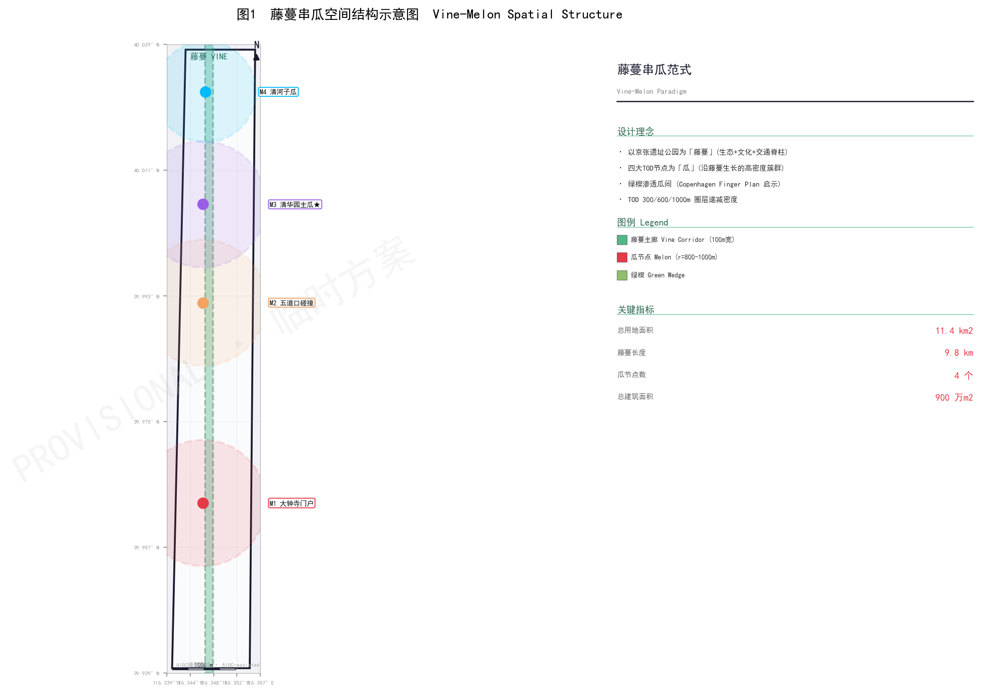
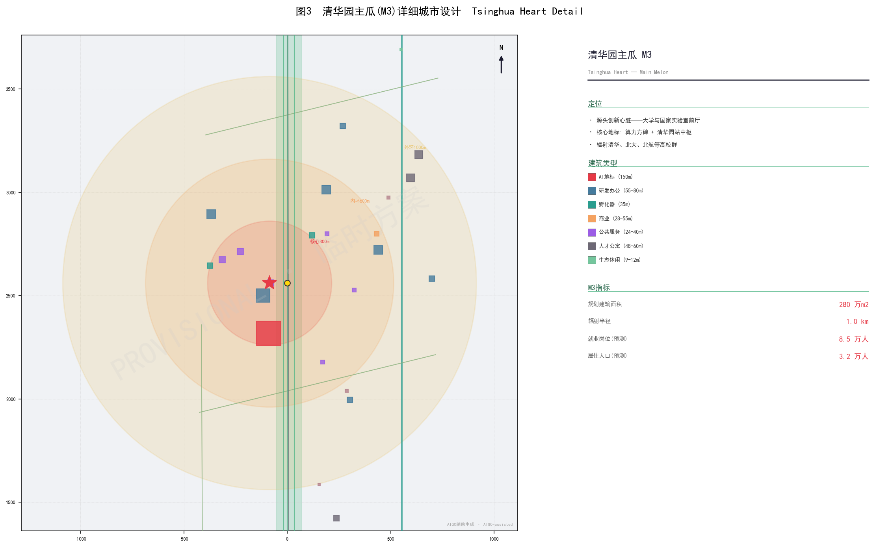
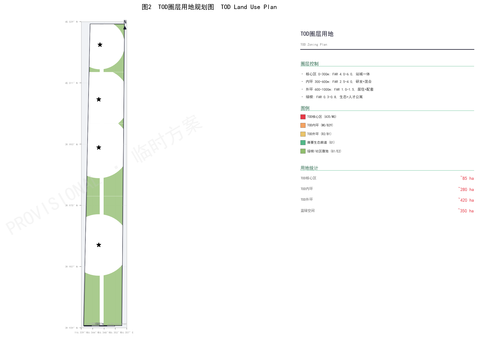
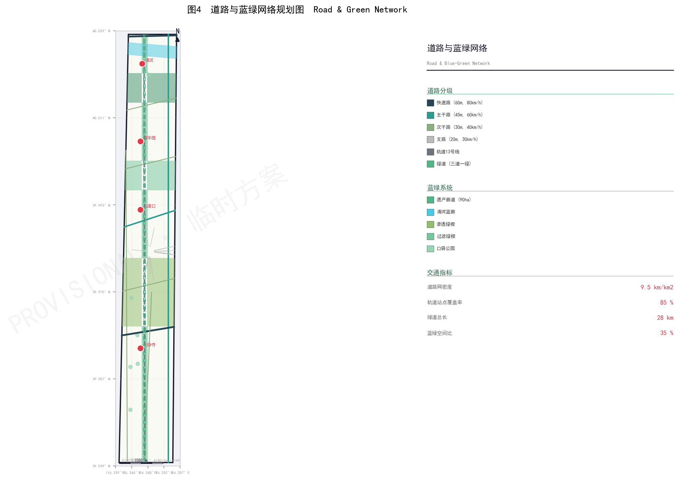
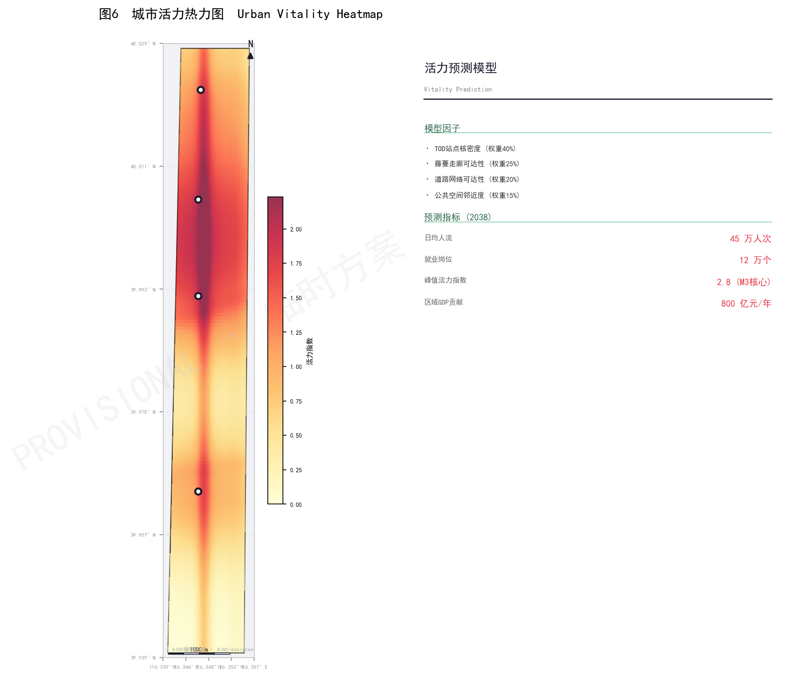

# Jing-Zhang 2.0: Vine-Core — From Railway Heritage to an AI Innovation Symbiosis

> **Submitted by**: Laser1209 · **Paradigm**: Vine-Core — one vine spine + four core nodes + three green wedges
> **Overall design area**: PROV-SITE-001, 11.40 km² / 1140.6 ha (provisional boundary) · **Coordinated research area**: 43.6 km²
> **Declaration**: This proposal is generated from a provisional boundary; all areas and ratios are conceptual suggestions, with missing control-plan conditions marked as "to be confirmed".

## Design Basis and Source List

This proposal takes the "Centennial Jing-Zhang AI Innovation Belt International Urban Design Qualification Announcement" as its primary basis [source:OFFICIAL-ANNOUNCEMENT] and reads the agent-oriented taskbook from the repository [source:AGENT-TASKBOOK], whose three-level scope definition, design tasks, and deliverable depth form the master framework. Design judgment follows an evidence chain of "announcement tasks — machine-readable data — narrative — drawings and HTML", with deliverable depth governed by the compliance, standard, and design-depth matrices [standard:PROJECT-OFFICIAL-ANNOUNCEMENT] [standard:PROJECT-AGENT-OPEN-CALL-TASKBOOK] [standard:MOHURD-URBAN-DESIGN-MEASURES]. Regulatory-plan-level organization aligns with the Urban Design Measures [standard:MOHURD-CONTROL-DETAILED-PLANNING], while land classification follows the National Spatial Survey, Planning, and Use-Control Land and Sea Classification Guide [standard:MNR-LAND-USE-CLASSIFICATION-GUIDE].

As of the data-review date, no official precise polygon, CAD, or GIS redline has been published; this proposal uses `geometry/site_boundary.geojson#PROV-SITE-001` as a provisional boundary [source:PROVISIONAL-BOUNDARIES]. The provisional boundary may be used for generation, display, and discussion only — not as an official redline, approval basis, or precise-area basis; organizer data gaps do not block content scoring, and all layers and metrics must be recalculated once official data is released [depth:risk_missing_data]. Usage boundaries follow `sources.json`: formal conclusions derive only from official public sources, while provisional material supports generation and discussion; no non-public, private, or unauthorized material is used [source:GLOBAL-AI-CASES].

## Three-Level Scope Framework

The announcement defines three working levels [source:OFFICIAL-ANNOUNCEMENT]: a coordinated research area of about 43.6 km² (item 1.3), an overall design area of about 11.4 km² (item 1.4), and key areas for detailed design. The proposal accordingly builds a "strategy—overall—key area" progressive framework [depth:three_level_scope_framework]: the strategy level addresses AI innovation ecology, industrial organization, and future urban form; the overall level translates strategy into the Vine-Core spatial structure, land use, transport, blue-green network, and urban character; and the key-area level carries out detailed urban design for the four TOD cores (M1-M4) [data:geometry/site_boundary.geojson#PROV-SITE-001].

| Level | Area / item | Core question | This proposal's answer | Data anchor |
| --- | --- | --- | --- | --- |
| Coordinated research area | 43.6 km² | How is a world-class AI ecology organized | University genesis—open collaboration—enterprise conversion—eco-community—global communication | [data:geometry/site_boundary.geojson#PROV-SITE-001]、[depth:overall_spatial_structure] |
| Overall design area | 11.4 km² | How do industry, space, transport, and infrastructure map out | Vine-Core + three green wedges; complete land division, roads, and blue-green system | [data:geometry/land_use.geojson#LU-VINE]、[data:geometry/roads.geojson#roads-001] |
| Key areas | four cores | How do four districts reach detailed-design depth | M1/M2/M3/M4 positioning, rings, building lists, and signature spaces | [data:geometry/key_areas.geojson#key_areas-001]、[depth:three_key_area_detailed_design] |

The boundary and area-recalculation evidence for the three-level framework is [metric:site_area_sqm]、[metric:design_area_km2] and [metric:research_area_km2], with key-area count evidence at [metric:key_area_count]. The provisional boundary is marked `geometry_role=provisional_constraint` and `official_boundary=false` in `geometry/site_boundary.geojson#PROV-SITE-001`; after the official polygon is substituted, all area metrics and drawings must be recalculated [depth:metrics_recalculation].

## Coordinated Research Area: Industry and Future City Research

### Industrial organization: from railway heritage to an AI innovation symbiosis

The coordinated research area draws on the research-resource belt along Xueyuan Road—Chengfu Road—North 5th Ring, forming a five-segment innovation chain of "university genesis—open collaboration—enterprise conversion—eco-community—global communication" [source:AGENT-TASKBOOK]. The industrial positioning responds to the three major roles of "centennial Jing-Zhang cultural belt, urban AI living-experience belt, and AI-integrated innovation belt", realized spatially through Vine-Core: the M3 Tsinghua Garden core absorbs basic-research spillover, the M2 Wudaokou core hosts the university-industry interface, the M1 Dazhongsi core serves as a display-and-conversion portal facing the central city, and the M4 Qinghe core acts as the industrialization breathing space [depth:overall_spatial_structure].

### Global AI innovation ecosystem case studies (8 cases)

To convert "world-class AI innovation ecology" into transferable mechanisms, this proposal organizes eight public background cases [metric:global_case_studies] (case facts need official-source verification during the refinement stage and serve as mechanism references only [depth:risk_missing_data]):

| Case | Mechanism | Transferable content |
| --- | --- | --- |
| Copenhagen Finger Plan | rail fingers + inter-finger green wedges, TOD overlaid since 1992 | Vine + three-wedge structure; TOD ring control |
| Singapore Rail Corridor | URA "light touch": heritage + ecology + community | four-layer vine stacking; low-intervention resilience |
| King's Cross Central | old rail yard to knowledge-based mixed community | public space first, adaptive reuse, TOD linkage |
| Curitiba BRT-TOD | exponential density decay along BRT axes | TOD density decay law |
| Paris Rive Gauche | rail decking, cultural-anchor facilities | rail-adjacent development; cultural anchors |
| Station F, Paris | large-space conversion into world's largest incubator | M2 vertical incubation + M4 open-source cabin operation |
| Shibuya Stream, Tokyo | station-city TOD, multi-layer pedestrian network | core-area station-city integration; multi-layer walkability |
| High Line, New York | elevated railway to linear park, spurring surroundings | railway heritage as public-space catalyst |

These mechanisms convert into six action principles — "public space first, open scenarios, test beds, developer community, data governance, station-city integration" [source:AGENT-TASKBOOK] — mapped respectively to the overall structure, key areas, blue-green system, and long-term operations.

### Future urban form research

Future AI urban form is not a stack of technical devices but a "verifiable public intelligent environment": the city turns perception, computing, service, and governance into explainable, reviewable, and exit-able public facilities. At the overall level the proposal offers three spatial responses: AI service nodes ([data:geometry/public_space.geojson#public_space-001] and others), a continuous blue-green public space ([data:geometry/green_space.geojson#green_space-001]), and an open scenario-testing network ([metric:scenario_cards_count] scenario cards). Formal talent, output, and investment metrics await official statistics and investment data [depth:risk_missing_data].

## Overall Design Area: Urban Renewal and Regulatory-Plan-Level Urban Design

### Overall spatial structure: Vine-Core

The proposal adopts the **"Vine-Core Paradigm"** as its core spatial paradigm [depth:overall_spatial_structure], replacing the earlier "A-shaped dual spine" structure. The **Vine Spine — a three-in-one composite spine** combines: the Ecological Vine (a blue-green ecological corridor and biological migration channel expressed through creeping-plant growth imagery), the Historical Context (carrying the centennial layering of the Jing-Zhang Railway and the self-innovation spirit of Zhan Tianyou's 1909 "herringbone" railway), and the Urban Artery (integrating Metro Line 13 and a 9.8 km slow-mobility "three paths and one green belt") — together forming continuous urban ecological infrastructure and a heritage main axis [data:geometry/key_areas.geojson#key_areas-001].

The **Core Node** — four TOD innovation core nodes distributed along the vine — strictly follows Calthorpe's (1993) TOD node-place model, with density-gradient development in 300/600/1000 m rings around each rail station; between the cores, **Green Wedges** penetrate from both east and west, forming a spatial pattern of "one vine threading four cores, three wedges enriching the spaces between" [source:GLOBAL-AI-CASES].

> **Naming rationale**: "Vine" (藤) retains the ecological growth imagery while "Spine/Artery" (脉) denotes both historical context and urban-artery function; "Core" is a standard urban-planning term (core node / growth pole). The vine links four high-density TOD cores with minimal linear-infrastructure input, while the wedges preserve ecological continuity between cores, achieving a rhythm of "dense and sparse, tense and relaxed".

### Urban renewal framework

Urban renewal does not presuppose large-scale demolition but establishes a four-tier "retain—renovate—new-build—to-be-confirmed" method framework [depth:retain_renovate_demolish]: retain railway heritage and high-value public-service assets; renovate industrial buildings, park environments, and community-service frontages; new-build the main axis, station plazas, and new-infrastructure prototypes; and classify items involving ownership, control-plan, and engineering conditions as to-be-confirmed [data:geometry/buildings.geojson#BLD-001]. Land use is organized under [standard:MNR-LAND-USE-CLASSIFICATION-GUIDE], with research, commercial, residential, road, green, and blue-green land fully covering the boundary without overlap [data:geometry/land_use.geojson#LU-VINE].

### Regulatory-plan depth and to-be-confirmed control conditions

The proposal organizes land use, buildings, transport, municipal infrastructure, and urban character at regulatory-plan (control detailed planning) urban-design depth [standard:MOHURD-CONTROL-DETAILED-PLANNING], but because official FAR, building height, building density, green ratio, setback, and road redlines are not provided in the public task package, all are listed as to-be-supplemented data [depth:development_intensity_controls]. The proposal gives only spatial structure, functional zoning, and renewal logic and does not write speculative values as approved metrics; once official control conditions are released, recalculation is required [metric:total_floor_area_wan_m2]、[metric:site_area_ha].

*Figure 1 · Site overview — Vine-Core spatial structure; the provisional boundary is shown dashed and is not an official redline*

## Detailed Design of Key Areas

Four TOD cores (M1-M4) along the vine constitute the main body of the key-area detailed design [depth:three_key_area_detailed_design]. Each core follows the density gradient of "core 0-300 m (FAR 4.0-6.0, station-city integration and AI landmarks) — inner 300-600 m (FAR 2.5-4.0, research and incubation) — outer 600-1000 m (FAR 1.0-1.5, talent residences and communities)" [standard:MOHURD-URBAN-DESIGN-MEASURES].

### M3 Tsinghua Garden Heart (core)

M3 is the **Heart Core** of the Vine-Core structure — a source-of-innovation heart adjacent to Tsinghua, Peking, Beihang, and the Chinese Academy of Sciences, absorbing basic-research spillover and undertaking "from 0 to 1" original innovation [source:AGENT-TASKBOOK]. Its core landmark is the **Computing Stele** (150 m, the district's highest point, 30 stories, a truncated pyramid from 36 m × 36 m at the base to 18 m × 18 m at the top, housing liquid-cooled computing, a public hall, and a 360° observation deck). **Conceptual radiation area 3.14 km², planned floor area about 2.8 million m² (the largest core)**, with a projected 85,000 jobs and 32,000 residents [depth:height_massing_character]. Around the stele a radial cluster forms: the West Court (research), the East Court (academicians' garden), and the South Court (living), with the Zhongzhiyuan Lake composing a "mountain-water-tower" axis [data:geometry/key_areas.geojson#key_areas-002]. Core public spaces include the Zhongzhiyuan Innovation Plaza (18,000 m²), the AI Meditation Ring, the Tsinghua Garden Station Platform Theater, and the Agent Honor Wall (5,000 m²).

### M2 Wudaokou Exchange

M2 is the "collision interface" between the university cluster and the industry cluster, surrounded by Tsinghua, Peking, Beijing Language and Culture University, and China University of Geosciences, with Chengfu Road connecting east-west [source:AGENT-TASKBOOK]. It is positioned as an "exchange node" — startup incubation, university technology transfer, and a youth entrepreneurship community — with the **Spark Tower** (125 m, a spiraling twisted form housing a vertical incubator and a venture-capital center) as its landmark. **Conceptual radiation area 3.14 km², planned floor area about 2.4 million m²** [depth:traffic_rail_slow_parking]. Signature spaces include the Wudaokou AI Crossroads (an "AI traffic-light" interactive installation at the Chengfu Road/vine crossing), the Spark Pedestrian Street, and the Tsinghua Garden Station Platform Theater [data:geometry/key_areas.geojson#key_areas-003].

### M1 Dazhongsi Portal

M1 is the southern portal of the Vine-Core structure, an AI display window facing the central city, positioned as a "display-and-conversion portal" — corporate headquarters, international forums, AI consumer experiences, and technology trading [source:OFFICIAL-ANNOUNCEMENT]. Its cultural anchor is the **Echo Bell · AI Chime Tower** (75 m, 15 stories, combining the resonant-cavity principle of ancient chimes with AI music generation, playing a "daily repertoire" at noon). **Conceptual radiation area 3.14 km², planned floor area about 2.2 million m²** [depth:height_massing_character]. The ring layout places commercial culture and a TOD hub in the core, corporate headquarters and fintech in the inner ring, and talent residences and community support in the outer ring [data:geometry/key_areas.geojson#key_areas-004].

### M4 Qinghe Lung

M4 is the northern sub-core of the vine, adjacent to Zhongzhiyuan, positioned as an "industrialization breathing space" — industrial conversion, open-source community, and ecological buffer [source:GLOBAL-AI-CASES]. It is slightly smaller than the other three cores (r = 800 m), emphasizing integration with the Qinghe ecological corridor. **Conceptual radiation area 2.01 km², planned floor area about 1.6 million m²**, with the Open-Source Discussion Cabin Cluster (five semi-buried circular mirror cabins: Turing, Shannon, McCarthy, Hinton, and Fei-Fei Li) as its landmark [depth:blue_green_public_space]. Ecological strategy includes restoring the natural Qinghe riverfront, ecological engineering slopes, and an "AI environmental sentinel" (20 sensor nodes along the river) [data:geometry/key_areas.geojson#key_areas-005].

*Figure 3 · Key-area detailed design — positioning of the four cores, TOD rings, and pilgrimage-landmark distribution, highlighting the M3 Computing Stele and the M2 Spark Tower*

## AI Innovation Ecosystem, Personas, and AI+ Scenarios

### Five user personas

The proposal establishes five user personas [source:AGENT-TASKBOOK] [metric:user_personas_count]: the AI researcher (M3, needing quiet deep-thinking and cross-disciplinary exchange); the entrepreneur (M2, needing low-cost offices and investment matching); the corporate executive (M1, needing corporate-image display and international exchange); the resident (outer-ring communities, needing community healthcare, convenience, and age-friendly facilities); and the student/visitor (university cluster, needing learning resources and public rituals). Their spatial responses fall onto research, incubation, headquarters, residential, and public-space uses [data:geometry/land_use.geojson#LU-VINE].

### Twelve AI scenario cards

The proposal offers twelve AI scenario cards [metric:scenario_cards_count] (meeting the ≥10 requirement), spanning cultural heritage, international exchange, public experience, startup innovation, startup acceleration, public art, landmark ritual, academic exchange, cultural performance, technical discussion, eco-technology, and daily public life:

| ID | Scenario card | Core/vine | Type |
| --- | --- | --- | --- |
| SC-01 | AI Chime Dawn Ritual | M1 | Cultural heritage |
| SC-02 | Global AI Governance Forum | M1 | International exchange |
| SC-03 | AI Consumer Experience Day | M1 | Public experience |
| SC-04 | 24-Hour Hackathon | M2 | Startup innovation |
| SC-05 | Spark Tower Vertical Incubation | M2 | Startup acceleration |
| SC-06 | AI Traffic-light Crossroads | M2 | Public art |
| SC-07 | Computing Stele Light Show | M3 | Landmark ritual |
| SC-08 | Academician Garden Salon | M3 | Academic exchange |
| SC-09 | Tsinghua Garden Station Platform Theater | M3/vine | Cultural performance |
| SC-10 | Open-Source Cabin Closed Meeting | M4/vine | Technical discussion |
| SC-11 | AI Environmental Sentinel Observation | M4/Wedge 3 | Eco-technology |
| SC-12 | Vine AI Station Walk | full line | Daily public |

Among them, SC-04 hackathon, SC-07 computing-stele light show, SC-06 AI traffic-light, and SC-11 environmental sentinel are four industry test-validation scenarios [metric:test_validation_scenarios] (meeting the ≥3 requirement), all bound by the four constraints of "open source, data minimization, human review, and exit-ability" [standard:PROJECT-AGENT-OPEN-CALL-TASKBOOK]. Scenario nodes are located at [data:geometry/public_space.geojson#public_space-001] and [data:geometry/green_space.geojson#green_space-001].

### Privacy and human-review boundaries

No scenario may infringe privacy, over-monitor, present immature technology as fully deployed, or present a test scenario as approved operation [source:AGENT-TASKBOOK]. Urban agents may assist in identifying facility maintenance, event safety, and enterprise-service needs, but final judgment rests with people and professional teams; AI-generated content must disclose its generation method and source [standard:PROJECT-AGENT-OPEN-CALL-TASKBOOK].

## Land Use, Building Scale, and Retain-Renovate-Demolish Strategy

### Land-use structure

Land use is fully divided under [standard:MNR-LAND-USE-CLASSIFICATION-GUIDE] from the same provisional boundary; `geometry/land_use.geojson` covers the full boundary without overlap and with shared edges, organized by TOD rings (core/inner/outer/wedge) [data:geometry/land_use.geojson#LU-VINE]. Land recalculation: TOD core ~85 ha (7.5%), TOD inner ring ~280 ha (24.6%), TOD outer ring ~420 ha (36.8%), vine + wedges + blue-green ~350 ha (30.7%), and transport and infrastructure ~5 ha (0.4%), totaling about 1140 ha [metric:site_area_ha].

### Building scale and typology

The district has 96 conceptual buildings [metric:building_count] with a total floor area (GFA) of about 9 million m² [metric:total_floor_area_wan_m2], divided into eight types: landmark (3, 75-150 m), research (~25), incubator (~12), commercial (~10), public (~8), residential (~20), community (~8), and ecological (~10) [data:geometry/buildings.geojson#BLD-001]. Distribution by core: M1 ~18 buildings / 2.2 million m², M2 ~28 / 2.4 million m², M3 ~30 / 2.8 million m², M4 ~12 / 1.6 million m², and ~8 along the vine. The skyline forms a rhythm of "M1 (75 m) → M2 (125 m) → M3 (150 m) → M4 (24 m)", with the M3 Computing Stele as the district's highest point [depth:height_massing_character].

### Three pilgrimage landmarks

The proposal offers three pilgrimage landmarks [metric:landmarks_count], each designed on the principle of "cultural anchor + public accessibility" [depth:height_massing_character]: the **Computing Stele** (M3, 150 m) uses the "stele" imagery to inscribe the computing foundation of the digital age, echoing the Jing-Zhang Railway's self-innovation spirit across time; the **Spark Tower** (M2, 125 m) uses "spark" imagery to symbolize innovation from a spark to a prairie fire; and the **Echo Bell · AI Chime Tower** (M1, 75 m) uses "bell sound" as its cultural origin, achieving a cross-time dialogue of "ancient bell — algorithm — future" [data:geometry/buildings.geojson#BLD-001].

### Retain-renovate-demolish strategy

The retain-renovate-demolish strategy follows the "retain—renovate—new-build—to-be-confirmed" tiers [depth:retain_renovate_demolish]: retaining heritage such as the Tsinghua Garden Station historic building, platforms, tracks, and signals; renovating industrial buildings and park environments; new-building axis nodes, station plazas, and new-infrastructure prototypes; and deferring parcel-level retention, FAR, height, and setbacks pending official control plans, ownership, and engineering data, without making statutory conclusions [depth:development_intensity_controls]. The Tsinghua Garden Station AI Innovation Hub adopts a "historic shell + contemporary core" strategy with three protection grades: Grade 1 (station-house facades, platforms, and canopy frames preserved as-is), Grade 2 (tracks, sleepers, and signals preserved in place with functional repurposing allowed), and Grade 3 (surroundings renewable in coordination with the historic character) [data:geometry/constraints.geojson#constraints-001].

*Figure 2 · TOD ring land-use structure — density gradient decaying from core/inner to outer, with the low-intervention vine ecological corridor running north-south*

## Transport, Rail, Municipal Infrastructure, and Public Services

### Road and transport organization

The transport strategy is organized around "vine slow-mobility spine + four-core interchange + green-wedge connectivity" [depth:traffic_rail_slow_parking]: externally relying on Jingzang Expressway, North 5th Ring, North 3rd Ring, Xizhimen Outer Street, and Xueyuan/Chengfu Roads; internally with graded roads (expressway 55-60 m, arterial 45-50 m, secondary arterial 30-35 m, branch 20 m, greenway 10-15 m), a **network density of about 9.5 km/km²** [metric:road_network_density], with 29 graded roads in `geometry/roads.geojson` [data:geometry/roads.geojson#roads-001]. Public transport relies on Metro Line 13 (Dazhongsi, Wudaokou, Tsinghua Garden, and Qinghe stations), the Xueyuan Road BRT/tram, and community micro-transit, with **about 85% of the area within 800 m of a rail station and 100% within 500 m of a bus stop**. Parking adopts "low provision in cores + peripheral P+R (3,000 spaces) + shared parking + AV reservation" [depth:traffic_rail_slow_parking].

### Vine slow-mobility "three paths and one green belt"

The vine carries a 9.8 km slow-mobility system [metric:vine_length_km] including a cycle path (4 m), running path (3 m), walking path (2.5 m), and green belt (5-10 m) [data:geometry/roads.geojson#roads-001]. An "AI station" (vending, shared charging, first aid, Wi-Fi, restrooms) is provided every 200 m. The vine is organized into four narrative segments: Memory of the Rails (M1-M2, ~1.5 km), Above the Wheels (around M2, ~2.0 km), Between the Platforms (around M3, ~2.0 km), and Rails to the Future (M3-M4, ~2.0 km) [depth:traffic_rail_slow_parking].

### Municipal and new infrastructure

Municipal facilities follow a "conventional pipeline renewal + new-infrastructure embedding" approach [depth:municipal_new_infrastructure]: distributed computing centers, district energy stations (geothermal heat pumps), utility corridors, smart parking, and an AI dispatch center are co-located [data:geometry/public_space.geojson#public_space-001]. Future transport reservations include a dedicated autonomous-driving corridor in the utility tunnel, medium-capacity rail upgrade conditions along Xueyuan/Chengfu Roads, eVTOL low-altitude takeoff points (one each at M3 and M1), and a smart-transport AI dispatch center [depth:risk_missing_data]. Pipeline capacity, energy load, fire safety, and flood control must be computed by professional teams; this proposal gives no engineering conclusions.

*Figure 4 · Road transport and blue-green ecological network — the vine slow-mobility spine links four cores, with 29 graded roads and three green wedges penetrating from east and west*

## Blue-Green Network, Public Space, and Urban Character

### Blue-green system: "one vine, one belt, two rivers, three wedges"

The blue-green system takes the vine (Jing-Zhang Heritage Park, 117 ha) as its main ridge, the Qinghe ecological corridor (45 ha) and two rivers (Qinghe + Xiaoyuehe) as tributaries, and community parks as nodes, forming a continuous blue-green network [data:geometry/green_space.geojson#green_space-001]. Three green wedges penetrate between the cores from east and west [depth:blue_green_public_space]: Wedge 1 permeable (M1-M2, community farms, outdoor sports, pocket parks), Wedge 2 filter (M2-M3, rain gardens, academic lawns, temporary curation), and Wedge 3 buffer (M3-M4, ecological buffer, riverfront restoration, habitats). **The total blue-green space is about 350 ha, about 31%** [metric:green_space_ratio]. Sponge strategies include bio-retention strips along the vine (5 km total), green-roof coverage ≥40%, ≥20 rain gardens, 100% permeable slow-path paving, and annual runoff control ≥80% [data:geometry/constraints.geojson#constraints-002].

### Public-space component library

The proposal builds a 30-component public-space library [source:AGENT-TASKBOOK] covering vine components (railway timeline plaques, AI stations, thinking-stone bench belts, platform theaters, open-source cabins), core-node components (landmark observation decks, computing display halls, TOD hub plazas, academician gardens, innovation plazas), wedge components (community farms, rain gardens, ecological buffers, AI environmental sentinels), and street furniture (AI guide streetlights, smart seats, AI waste-sorting stations, unmanned delivery stops) [data:geometry/public_space.geojson#public_space-001].

### Urban character

Urban character control follows [standard:MOHURD-URBAN-DESIGN-MEASURES]: railway-memory materials (grey brick, steel rail, and sleeper elements), AI-blue nodes, and greenway-green base form a three-tone palette; building massing, roof form, interfaces, and nightscape are refined under the control plan and design guidelines [depth:height_massing_character]. Interface controls set first-line buildings along the vine to ≤24 m with gradual increases in the second line; waterfront/park-front buildings are required to step back (3 m for every 6 stories); core-area landmarks may exceed height limits subject to aviation height clearance confirmation [depth:development_intensity_controls].

## Renewal Projects, Implementation Policy, and Phasing

### Renewal project list (conceptual)

| ID | Project | Location | Type | Dependencies |
| --- | --- | --- | --- | --- |
| R-01 | Vine 9.8 km greenway through-connection | heritage park corridor | public space / slow mobility | official boundary, ownership, heritage |
| R-02 | Computing Stele and M3 hub | M3 Tsinghua Garden | landmark / station-city | aviation height, control plan |
| R-03 | Spark Tower vertical incubator | M2 Wudaokou | landmark / incubation | station integration, land conditions |
| R-04 | Echo Bell · AI Chime Tower | M1 Dazhongsi | landmark / culture | heritage coordination, control plan |
| R-05 | Open-Source Discussion Cabin Cluster | M4 / vine segment 4 | public space / technology | ecology, land conditions |
| R-06 | Three green-wedge ecological restoration | Wedges 1/2/3 | blue-green ecology | ecological engineering, bio-monitoring |
| R-07 | Metro Line 13 station TOD integration | four stations | transport / station-city | rail operation, control plan |
| R-08 | Qinghe riverfront ecological restoration | Qinghe corridor | blue-green / riverfront | blue-line scope, ecological engineering |
| R-09 | Distributed computing and district energy stations | M3/M1 cores | new infrastructure | energy, computing, utility access |
| R-10 | Talent residences and community support | outer rings | residential / community | land conditions, community participation |

The renewal project list is detailed at [data:geometry/phasing.geojson#phasing-001] and [depth:renewal_project_list].

### Phasing implementation plan

Phasing follows the principles of "infrastructure first — public space first — landmark anchoring — mixed start — TOD synchronization" [depth:phasing_implementation], over four phases from 2026 to 2038 (PH-01 to PH-04) with a total investment of about 120 billion yuan (conceptual estimate) [metric:total_investment_yi_yuan]: PH-01 foundation (2026-2028, 25 billion, vine greenway connection, M2 pilot, M3 start), PH-02 development (2028-2031, 42 billion, M3 core landmark, M1 portal opening), PH-03 maturity (2031-2034, 33 billion, M4 industrialization, three-wedge restoration), and PH-04 vision (2034-2038, 20 billion, in-ring densification, full operation) [data:geometry/phasing.geojson#phasing-001].

### Long-term operations and the global AI innovation activities system

Corresponding to taskbook item agent.6, the proposal sets out a conceptual operating mechanism [source:AGENT-TASKBOOK]: a governance structure of council + operating company + community committee + AI ethics committee; an annual activities system of Q1 Jing-Zhang AI Innovation Week, Q2 Global AI Governance Forum and hackathon season, Q3 Academician Garden academic season, and Q4 AI Consumer Experience Expo and Spark Awards; and a developer community accumulating long-term assets through admission review, mentor networks, Demo Day, open-source incentives, and international exchange [depth:renewal_project_list]. All activities, investment promotion, policies, funding, and operations are conceptual suggestions and are not to be read as confirmed government arrangements [depth:risk_missing_data].

## Metrics, Area Recalculation, and Compliance Matrix

The metrics system is carried uniformly by `metrics.json`, with all areas and ratios recalculated from geometry under EPSG:4548 [depth:metrics_recalculation]; HTML-displayed values are consistent with `metrics.json` [metric:site_area_sqm]、[metric:green_space_ratio]、[metric:road_network_density]. Core metrics follow:

| Category | Metric | Value | Status |
| --- | --- | --- | --- |
| Scale | Overall design area | 11.40 km² / 1140.6 ha | known (provisional) |
| Scale | Total floor area | about 9 million m² | known (conceptual) |
| Scale | Conceptual building count | 96 | known |
| Scale | Building height cap | 150 m (pending aviation clearance) | to be confirmed |
| Population | Resident population (2038 forecast) | 80-100k | to be verified |
| Population | Jobs (2038 forecast) | 120-150k | to be verified |
| Transport | Road network density | 9.5 km/km² | known |
| Transport | Rail 800 m coverage | 85% | known (conceptual) |
| Environment | Blue-green ratio | about 31% | known |
| Environment | Annual runoff control | ≥80% | conceptual target |
| Innovation | AI scenario cards | 12 (incl. 4 tests) | known |
| Innovation | User personas | 5 | known |
| Innovation | Global cases | 8 | known |
| Economy | Total investment (estimate) | 120 billion yuan | conceptual |

`compliance_matrix.json` covers announcement items 1.3.1-1.3.3, 1.4.1-1.4.3, 1.5.1-1.5.3 and agent.1-agent.6 [standard:PROJECT-OFFICIAL-ANNOUNCEMENT]; `standard_matrix.json` covers all mandatory standards [standard:MOHURD-CONTROL-DETAILED-PLANNING]; and `design_depth_matrix.json` covers the 15 required design-depth items [depth:metrics_recalculation]. Metrics such as FAR (core/inner/outer) and the 2038 population/jobs forecasts are marked unknown with reasons, pending official control plans and statistics [depth:development_intensity_controls].

*Figure 5 · Core metrics and development phasing — four phases, 120-billion-yuan investment, population/jobs forecasts, and vitality-heatmap factor weights*

## Risk, Copyright, and Compliance

### Data and spatial risks

The greatest risk is the absence of official boundaries and control conditions [depth:risk_missing_data]: all current geometry is based on the provisional boundary [source:PROVISIONAL-BOUNDARIES] and may be used for generation, display, and discussion only; once official polygons are released, land_use, buildings, roads, green/public space, phasing, constraints, and all metrics must be recalculated [depth:metrics_recalculation]. Control conditions, ownership, municipal, heritage, and engineering data are listed as to-be-supplemented; FAR, building height, and total floor area are unknown [depth:development_intensity_controls]. To-be-confirmed items include the official precise redline and land-use control plan (TC-001), aviation height clearance value (TC-002), underground-pipeline status (TC-003), existing-building ownership and demolition status (TC-004), detailed metro-station positions (TC-005), Qinghe/Xiaoyuehe blue-line scope (TC-006), Tsinghua Garden Station protection grade (TC-007), and Dazhongsi heritage protection scope (TC-008) [depth:risk_missing_data].

### Scenario and operations risks

AI scenarios and operating mechanisms carry risks of technology maturity, public acceptance, operations cost, and policy uncertainty [source:AGENT-TASKBOOK]: all scenarios must follow the principles of open source, data minimization, human review, and exit-ability; conceptual suggestions, event ideas, and policy-mechanism proposals must not be expressed as confirmed government decisions or implementation arrangements [standard:PROJECT-AGENT-OPEN-CALL-TASKBOOK].

### Copyright and compliance

All text, geometry, figures, PDFs, and HTML in this proposal are generated by the declared AI agent or use cleared public sources [source:GLOBAL-AI-CASES], with no non-public, private, or unauthorized material; `report/copyright_statement.md` is the copyright statement [source:OFFICIAL-ANNOUNCEMENT]. Global cases serve as background references and require official-source verification of specific facts. The proposal is submitted under the `COMMUNITY-DISPLAY-ONLY` license and does not claim rights over unauthorized material. **Paradigm declaration**: this proposal adopts the "Vine-Core" paradigm, consistent with all GeoJSON layers, figures, and data files [depth:overall_spatial_structure].

## References

- `geometry/*.geojson`: site_boundary (PROV-SITE-001), key_areas (key_areas-001~005), land_use (LU-VINE and 29 others), buildings (BLD-001~096), roads (roads-001~029), green_space (green_space-001~011), public_space (public_space-001~014), constraints (constraints-001~004), phasing (phasing-001~004)
- `metrics.json`: 24 metrics (status/confidence/formula/source_files)
- `sources.json`, `assumptions.json`, `self_check.json`: source, assumption, and self-check registries
- `compliance_matrix.json`, `standard_matrix.json`, `design_depth_matrix.json`: task/standard/design-depth coverage
- `report/copyright_statement.md`, `report/narrative.md`, `report/proposal.html`: copyright, narrative, and offline HTML
- `drawings/a3-booklet.pdf`, `drawings/a0-boards.pdf`, `visual/index.html`: drawings and visualization
- Global AI innovation ecosystem case public material (Copenhagen, Singapore, London, Curitiba, Paris, Shibuya, High Line) [source:GLOBAL-AI-CASES] [source:STATION-F-CASE]
