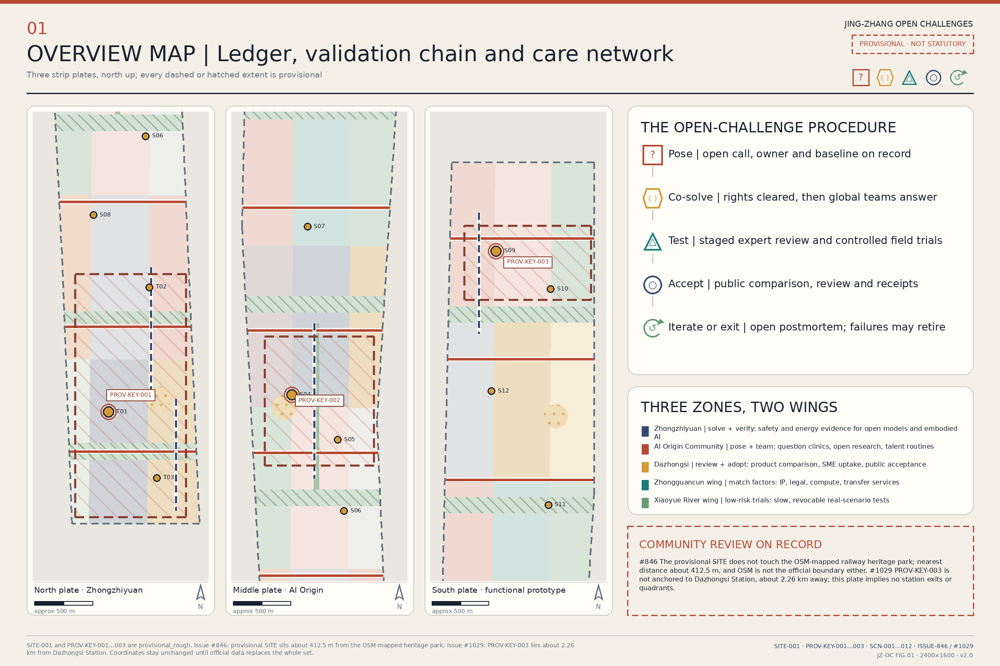
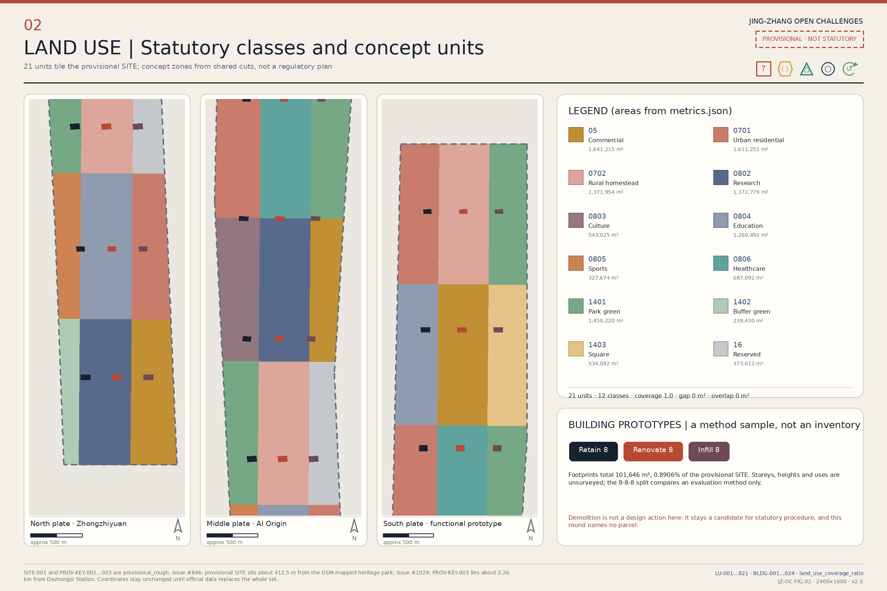
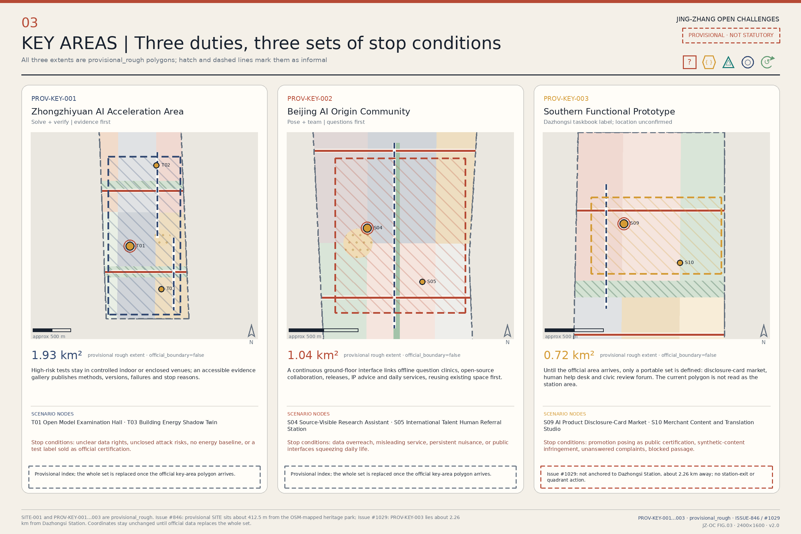
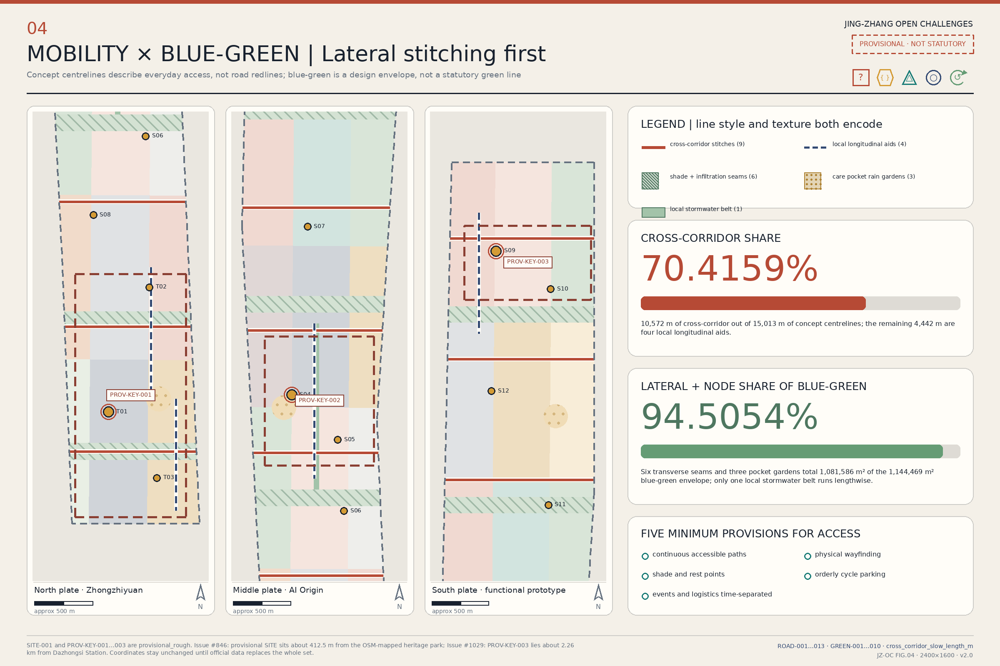
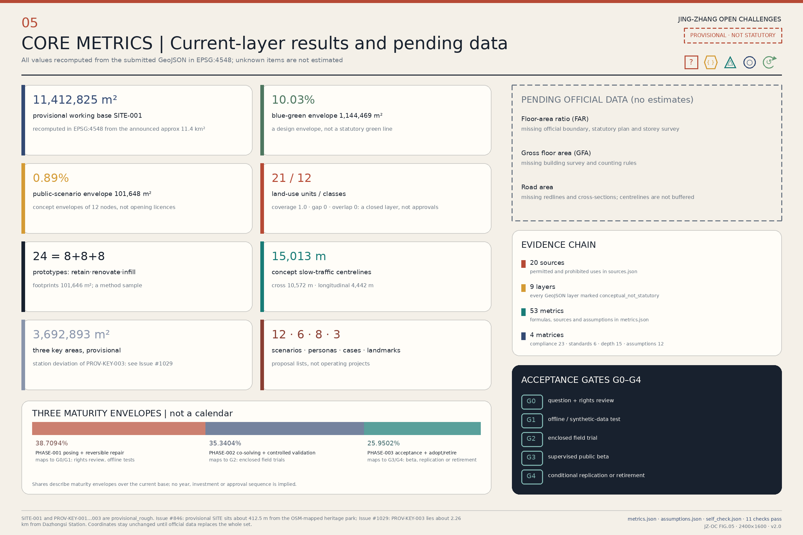

# JING-ZHANG OPEN CHALLENGES 2.0

**The City Poses. The World Co-solves. The Public Accepts.**

The Jing-Zhang Railway once turned "impossible to traverse" into a public work. A century later, the AI Innovation Belt's new hard problem lies beyond the technology gallery. The city needs a capability in which anyone can pose a real question, every answer must state its evidence and its costs, and the public has the right to send back an answer that fails public review.

### Executive Summary

Beyond technical validation, this proposal adds procedures for public question calls, accountability, acceptance and exit: who may pose a question, who bears the consequences, when testing may happen, how the public accepts an answer, and how a failed project exits. The spatial scheme places these procedures in one question ledger, one validation chain, one everyday care network and 12 scenario nodes; the operating proposal uses G0–G4 decision gates to check rights, risk, field testing, public adoption and annual review. The core judgment comes down to one question: does the project solve a clearly defined question that someone is accountable for and that the public accepts? [depth:governance_implementation_path] [data:visual/assets/question-ledger.example.json]

## Design Basis and Source List

This proposal takes the tasks, three-level work scope and deliverable depth defined by the open-call announcement as its primary basis, and follows the agent taskbook on the three positionings, five functions, Three Zones and Two Wings, AI scenarios, and cultural and operational requirements. [source:OFFICIAL-ANNOUNCEMENT] [source:AGENT-TASKBOOK]

"Open Challenge" is not a slogan but a seven-step public procedure: **open question call → rights and data clearance → cross-institution co-solving → professional validation → controlled field testing → public acceptance → open archiving, iteration or exit**. Urban design handles lateral everyday issues in parallel: crossings, shade, seating, accessibility, wayfinding, repair reporting and frontline working conditions, so that innovation does not serve only exhibitions and technology demonstrations. [standard:PROJECT-AGENT-OPEN-CALL-TASKBOOK] [depth:existing_conditions_diagnosis]

| Evidence tier | How this proposal uses it | What it is not used for |
| --- | --- | --- |
| Formal task and professional sources | Establish task semantics, work depth, urban-design dimensions and land-use classification | Not used to derive approved parcel indicators, engineering conditions or implementation decisions for the project |
| Provisional spatial data | Generate concept layers, diagrams and checks; drawings always mark them with low-contrast dashed lines | Not called official redlines; do not support approval, expropriation or investment conclusions [source:PROVISIONAL-BOUNDARIES] |
| Policy and legal sources | Delimit the narrowest boundaries for public-facing generative-AI services, in-person handling at specified public-service venues and elderly-friendly services | Not used as case-specific legal advice; provisions are not generalised to all AI or all public space |
| Background cases and community review | Compare organisational mechanisms; disclose known deviations of the provisional geometry | Do not replace central official sources, professional surveying or government confirmation |

The current design base covers 11,412,825 m², the green-space concept layer 1,144,469 m², and the public-scenario envelope 101,648 m²; these figures describe only the submitted geometry and are not official land-use statistics. [metric:site_area_sqm] [metric:green_space_area_sqm] [metric:public_space_area_sqm]

Two community reviews must be read together with the base. Issue #846 notes that the provisional SITE does not intersect the Jing-Zhang Railway Heritage Park as mapped in OSM, with a nearest distance of about 412.5 m; OSM is not the project's official boundary either, so this proposal keeps the current coordinates unchanged and will replace the whole package once the official SITE arrives. [source:ISSUE-846] [data:geometry/site_boundary.geojson#SITE-001]

Issue #1029 notes that `PROV-KEY-003` is not anchored to Dazhongsi Station and lies about 2.26 km from it. This round's "Dazhongsi" section answers only the functional and governance prototype required by the taskbook; it no longer claims that station exits, four quadrants or passenger-flow organisation fall inside that polygon, nor does it shift the polygon on its own. [source:ISSUE-1029] [data:geometry/key_areas.geojson#PROV-KEY-003]

Official boundaries, ownership, existing-condition surveys, regulatory detailed plans, roads, municipal utilities, fire protection, heritage, ecology and public-service ledgers are still pending official data. Once they arrive, SITE, key areas, land use, buildings, roads, green space, public space, phasing, metrics and all bilingual deliverables must be updated as one version. [depth:risk_missing_data]

## Three-Level Scope Framework

The three levels carry distinct decision scales, not three enlargements of one map: the Coordinated Research Area decides "which questions deserve joint answers across regions and institutions"; the Overall Design Area decides "how answers enter everyday urban systems"; the Key Areas decide "where, at what risk level, tests may run, and who accepts them". [standard:PROJECT-OFFICIAL-ANNOUNCEMENT] [depth:three_level_scope_framework]

| Level | Core question | v2.0 deliverables | Decision boundary |
| --- | --- | --- | --- |
| Coordinated Research Area | How Jing-Zhang forms a long-term innovation agenda | Urban question catalogue, case translation, annual Open Challenges Conference, cross-institution co-solving network | Adds no precise redlines or industry-scale commitments |
| Overall Design Area | How questions land in space and services | One "question ledger", one "validation chain", one "everyday care network" | Uses SITE-001 as the provisional working base [data:geometry/site_boundary.geojson#SITE-001] |
| Key Areas | Under what conditions trials may run and exit | Three types of validation environment, twelve scenario cards, G0–G4 gates | All three areas are provisional rough polygons [metric:key_area_count] |

The spatial responsibility chain is: **AI Origin Community poses questions and forms teams → Zhongzhiyuan conducts R&D and validation → Xiaoyue River Wing runs low-risk field tests → the Dazhongsi functional prototype hosts public comparison and adoption discussion → Zhongguancun Wing matches intellectual property, talent, compute and professional services → results return to the question ledger to form the next version.** This is a coordination framework, not a confirmed institutional mandate. [depth:overall_spatial_structure]

The lateral everyday care network runs through communities, campuses, business parks and public spaces. It prioritises short-distance walking, accessibility, shade, night-time safety and facility maintenance, so that any large AI project must first answer "does it improve an ordinary day?" The 9 cross-corridor stitching lines and 4 local auxiliary lines in key districts in the road layer express only this relationship; they are not new-road proposals. [data:geometry/roads.geojson#ROAD-001] [metric:cross_corridor_count]

## Coordinated Research Area: Industry and Future City Research

The umbrella brand is **"JING-ZHANG OPEN CHALLENGES｜京张开放题"**. The logo consists of three open frames, two outward interfaces and one public dot, corresponding to the Three Zones, the Two Wings and the public centre of judgment; the status symbols are "? pose, { } co-solve, △ test, ○ accept, ↺ iterate/exit". Rust red, research indigo and Xiaoyue River cyan always work together with text, shape and texture; colour never carries a state alone. [source:AGENT-TASKBOOK]

The proposal translates the three positionings into three public capabilities: the Centennial Jing-Zhang cultural belt preserves "how hard problems were solved and how failures were recorded"; the metropolitan AI life-experience belt proposes channels for information, human help, comments, appeals and withdrawal; the AI integrated innovation belt connects questions, research, validation, adoption and exit. The five functions correspond to five sets of responsibility: technical evidence, cross-institution collaboration, scenario validation, everyday services and governance review, not five homogeneous parks. [depth:overall_spatial_structure]

| Area | Primary responsibility | External interface | What is not promised |
| --- | --- | --- | --- |
| Zhongzhiyuan | Validation of open models, embodied AI, safety and energy use | Controlled experiments, method releases, failure records | Technical testing does not equal official certification |
| AI Origin Community | Urban question posing, cross-institution teaming, open research, everyday talent services | Question clinics, residencies, open-source collaboration | No promise of eligibility, funding or data supply |
| Dazhongsi functional prototype | Product comparison, public acceptance, SME adoption | Disclosure cards, human help, comment receipts | The provisional polygon does not represent station anchoring |
| Zhongguancun Technology Services Wing | Matching of IP, legal, talent, compute and technology-transfer services | Professional-service lists | No promise of investment attraction or procurement |
| Xiaoyue River Scenario Testing Wing | Low-speed, low-risk, revocable real-scenario validation | Time-slot booking and safety stewards | No promise of test permits or engineering modification |

The 8 background cases contribute mechanisms only: AI Singapore's question–baseline–handover process, the research intermediation of Mila and Vector, Punggol's learning–operations relationship, the proximity services of Shanghai's Model Speed Space, Pittsburgh's robotics collaboration network, Knowledge Quarter's governance of knowledge places, and STATION F's shared support system. The cases provide no scale, investment, partner or policy commitments for Jing-Zhang; the full permitted and prohibited uses are in `sources.json`. [source:CASE-AISINGAPORE-100E] [source:CASE-PUNGGOL-DIGITAL-DISTRICT]

If authorised and established, the Open Challenges Conference should publish an annual batch of urban questions, responsible owners, data conditions, testing status and retired projects. Review would consider public problems solved, wrong projects stopped in time and everyday facilities maintained, rather than using the number of technology demonstrations as the main measure. [depth:renewal_project_list]

## Overall Design Area: Urban Renewal and Regulatory-Plan-Level Urban Design

The overall structure is **one ledger, one chain, one network, three gates**: the ledger is the public question ledger; the chain is the validation responsibility chain from posing to exit; the network is the lateral everyday care network; the gates are the decision gates before controlled testing, before the public environment, and before replication and rollout. They overlay statutory land use and create no new land-use category. [standard:MOHURD-URBAN-DESIGN-MEASURES] [depth:land_use_layout]

Urban renewal is ordered into four actions:

1. **Repair everyday interfaces first**: crossings, accessibility, shade, seating, toilets, lighting, wayfinding, non-motorised-vehicle parking and repair workstations;
2. **Embed shared functions next**: place question clinics, open research, booked testing and public acceptance in existing buildings and public spaces, prioritising time-shared, reversible adaptation;
3. **Set development intensity later**: total building scale, floor-area ratio, height, density and setbacks are discussed only after official regulatory plans, ownership, surveys and engineering conditions arrive;
4. **Write the exit in advance**: before entering a site, every sensor, robot, sign and temporary structure states its duration, human owner, restoration method and removal responsibility. [standard:MOHURD-CONTROL-DETAILED-PLANNING]

The 21 land-use units cover the current SITE, and the 24 building prototypes split into 8 retain, 8 renovate and 8 infill; these objects are used to compare spatial strategies and do not correspond to statutory uses or retain-renovate-demolish decisions on real parcels. [data:geometry/land_use.geojson#LU-001] [data:geometry/buildings.geojson#BLDG-001] [metric:building_prototype_count]

The new design emphasis shifts from a longitudinal "innovation axis" to lateral "urban seams". Conceptual slow-traffic lines total 15,013 m, of which cross-corridor stitching is 10,572 m, or 70.42%; cross-corridor and node components make up 94.51% of blue-green space. The primary spatial organisation is the lateral everyday connection among community, campus and business park; longitudinal links provide support only near the key districts. [metric:road_centerline_length_m] [metric:cross_corridor_slow_length_m]

## Detailed Design of Key Areas

The three key areas use the same review framework: **positioning, spatial organisation, existing buildings, access and public space, AI scenarios, operational responsibility, and stop conditions**. All areas are provisional rough polygons; the following is a reference scheme for planning, architecture, transport, municipal, ecology, legal and public-participation teams to deepen. [depth:three_key_area_detailed_design]

### Zhongzhiyuan AI Independent Innovation Acceleration Area | Evidence First

- **Positioning**: an evidence area for open models, embodied AI, safety and energy use.
- **Space**: high-risk testing sits in controlled indoor or enclosed venues; an accessible evidence gallery on the periphery displays methods, versions, failures and stop reasons.
- **Renewal**: assess the reversible adaptation of existing R&D buildings first; new construction, demolition, height and scale await existing-condition surveys, ownership, regulatory plans and structural appraisal.
- **Scenarios**: T01 Open Model Examination Hall, T03 Building Energy Shadow Twin; the "Global Co-solving Forum" is an information and discussion node and presumes no large new building.
- **Stop conditions**: unclear data rights, unclosed model-attack risks, insufficient equipment safety, no energy baseline, or a test label promoted as official certification.

Its provisional spatial index is `PROV-KEY-001`, with scenario nodes `SCN-001` and `SCN-003`. [data:geometry/key_areas.geojson#PROV-KEY-001] [data:geometry/public_space.geojson#SCN-001]

### Beijing AI Origin Community | Questions First

- **Positioning**: public question posing, open research, cross-institution teaming and everyday services for international talent.
- **Space**: a continuous ground-floor interface connects offline question clinics, open-source collaboration, releases, IP advice and daily-life services.
- **Renewal**: activate adaptable space first and keep real users in place; no retain-renovate-demolish conclusion is made before ownership, structure, fire safety, tenancy and community impact are checked.
- **Scenarios**: S04 Source-Visible Research Assistant, S05 International Talent Human Referral Station; the "Century Challenge Archive" connects railway engineering history, innovation culture and the current question pool.
- **Stop conditions**: overreach into research or personal data, misleading services, persistent nuisance from activities, or public interfaces squeezing everyday community life.

Its provisional spatial index is `PROV-KEY-002`, with the public interface expressed by `SCN-004` and `SCN-005`. [data:geometry/key_areas.geojson#PROV-KEY-002] [data:geometry/public_space.geojson#SCN-004]

### Southern Functional Prototype | Dazhongsi Taskbook Label; Location Unconfirmed

- **Positioning**: a functional prototype for AI product explanation, comparative trial, SME adoption and public acceptance.
- **Space**: before the official key area arrives, only a portable combination of "disclosure-card market + human help desk + civic review forum" is defined; the current polygon is not interpreted as the area around Dazhongsi Station.
- **Renewal**: prioritise time-shared mixed use of existing commercial, office and public space; no large exhibition hall replaces everyday services.
- **Scenarios**: S09 AI Product Disclosure-Card Experience Market, S10 Merchant Content and Translation Studio; every experience displays data sources, human review, validity period and exit instructions.
- **Stop conditions**: commercial promotion posing as public certification, synthetic-content infringement, complaints without receipt, digital exclusion, or events crowding out basic passage.

The current index remains `PROV-KEY-003`, but the positional deviation is registered as an item to be resolved with official data; this round proposes no station-exit, passenger-flow or four-quadrant engineering action. [data:geometry/key_areas.geojson#PROV-KEY-003] [source:ISSUE-1029]

## AI Innovation Ecosystem, Personas, and AI+ Scenarios

Every Open Challenge establishes a `Q-ID` recording at minimum the question owner, beneficiaries, affected people, current baseline, permitted data, rights status, risk level, test location, success metrics, stop conditions, human owner, expiry date and the licence for open outputs. Public-facing generative-AI services are discussed only within the applicable scope of the Interim Measures; complaint channels name a responsible person and a handling status, and no statutory numeric deadline is invented. [source:GENERATIVE-AI-INTERIM-MEASURES]

| Persona | Primary need | Proposal response | Rights that must be retained |
| --- | --- | --- | --- |
| Model researchers and open-source maintainers | Rigorous experiments, contribution records, cross-institution collaboration | Teaming at the Origin Community, validation at Zhongzhiyuan, public versions and failures | Unauthorised research data never enters the question pool |
| Product, test and compliance staff in AI startups | Low-cost validation, professional services, real feedback | Staged testing and service matching through the Two Wings | A field test is not procurement or endorsement |
| International young talent and their families | Trustworthy bilingual information, continuity of housing and public services | Online assistant plus offline talent desk | Eligibility is confirmed by competent authorities and professionals |
| Residents, children, older people, people with disabilities and people with low digital capability | Everyday convenience, quiet, safety, the ability to opt out | Paper, telephone, human and accessible channels coexist | An app cannot become the only entrance |
| Small and medium merchants and community service workers | Low-threshold tools, clear copyright, transparent effects | Content studio, disclosure cards and human review | No forced handover of business data |
| Property, cleaning, repair, security and facility operators | Manageable workload, tools they can take over, clear responsibility | Frontline staff join design, training and stop decisions | Automation cannot shift risk onto frontline staff |

Article 39 of the Barrier-Free Environment Law is used only for on-site guidance and in-person handling at the public-service venues it explicitly lists, such as healthcare, social security, finance and utility payment; providing human backup in other scenarios is a design choice of this proposal, not a claimed universal legal duty. State Council General Office Document [2020] No. 45 provides only the policy background for running traditional and smart services in parallel; it does not mean Haidian has completed implementation. [source:BARRIER-FREE-ENVIRONMENT-LAW] [source:ELDERLY-SMART-TECH-PLAN-2020-45]

The 12 scenarios fall into three groups: technical validation, urban services and public care:

| ID | Scenario and spatial node | Intended first-round gate | Promotion evidence / exit condition |
| --- | --- | --- | --- |
| T01 / SCN-001 | Open Model Validation Court | G1 | Data cards, attack testing and an energy baseline; insufficient evidence keeps the test offline |
| T02 / SCN-002 | Low-Speed Embodied-AI Test Court | G1 | Fencing, safety stewards, emergency stop and accessibility testing; conflicts trigger removal from the site |
| T03 / SCN-003 | Building-Energy Shadow-Twin Window | G1 | Read-only shadow mode; no equipment control without the facility owner's approval |
| S04 / SCN-004 | Source-Visible Research Assistant Table | G1 | Sources, permissions and human verification; sensitive material must not enter public models |
| S05 / SCN-005 | International-Talent Human Referral Station | G1 | A bilingual responsibility list and human referral; no promises on visas or eligibility outcomes |
| S06 / SCN-006 | Transparent Compute and Data Navigation Desk | G0 | Publish providers, conditions, pricing basis and human consultation; do not promise supply outcomes |
| S07 / SCN-007 | Accessible Jing-Zhang Cultural-Guidance Starting Point | G0 | On-site wayfinding, human interpretation and non-smart service run in parallel; the provisional SITE must not be presented as the heritage-park boundary |
| S08 / SCN-008 | Xiaoyuehe Biodiversity Civic-Observation Court | G0 | Establish an ecological baseline first; sensitive-species coordinates remain private by default, and no sensors are installed without permission |
| S09 / SCN-009 | AI Product Disclosure-Card Market | G1 | Transparency on model, data, energy, responsibility and duration; misleading items are removed |
| S10 / SCN-010 | Merchant Content and Translation Studio | G1 | Copyright ledger and final human review; infringement or false promotion triggers a stop |
| S11 / SCN-011 | Public-Space Comfort Co-design Table | G0 | On-site co-assessment and maintenance responsibility come first; visual recognition does not replace surveys |
| S12 / SCN-012 | Urban Question Triage and Co-design Desk | G0 | Human intake, public receipts, and appeal and question-withdrawal channels must all exist at the same time |

G0 is question and rights review, G1 is offline or synthetic-data experiment, G2 is enclosed field testing, G3 is supervised public Beta, and G4 is conditional replication or retirement. Any project may be downgraded, paused or exited; safely stopping an unsuitable trial also counts toward the annual responsibility contribution. [data:geometry/public_space.geojson#SCN-012] [metric:scenario_count]

## Land Use, Building Scale, and Retain-Renovate-Demolish Strategy

Statutory land use and Open Challenges operations are expressed in separate layers: land use keeps verifiable `land_use_code` values, while question clinics, examination halls, review forums and service desks are operational overlays that invent no new statutory land-use category. [source:MNR-LAND-USE-CLASSIFICATION] [standard:MNR-LAND-USE-CLASSIFICATION-GUIDE]

The 21 conceptual units fully cover SITE-001, with zero gap and zero overlap in the current layer; this only shows the submitted topology is closed, not that uses are approved. Building-prototype footprints total 101,646 m², or 0.8906% of the current SITE; gross floor area, floor-area ratio, height, density and setbacks await official regulatory plans, building-by-building surveys and floor-area counting rules. [metric:land_use_zone_count] [metric:building_footprint_area_sqm]

| Action | v2.0 screening rule | Required before entering a project decision |
| --- | --- | --- |
| Retain | Prioritise heritage, public service, continuing use or low-carbon value | Heritage, title, structure, fire safety, actual use |
| Renovate | Can carry shared research, talent services and everyday care with low disturbance | Tenancy, structure, systems, accessibility, operation and maintenance |
| Demolish | Remains only a candidate that statutory procedures may confirm; this proposal names no parcel | Ownership, appraisal, compensation, social impact and approval |
| Infill | Enters comparison only when existing space cannot meet a demonstrated public need | Regulatory plan, transport, municipal capacity, fire safety, energy and life-cycle cost |

The 24 prototypes form a balanced sample of 8 retain, 8 renovate and 8 infill, demonstrating the evaluation method rather than announcing real dispositions. Any renewal conflicting with current users returns first to the rights-relationship map and the negotiation procedure. [data:geometry/buildings.geojson#BLDG-024] [depth:retain_renovate_demolish]

## Transport, Rail, Municipal Infrastructure, and Public Services

The transport strategy shifts from "building one axis" to "mending nine cross-corridor seams": short-distance walking, cycling and accessible paths connecting communities, campuses, business parks and public spaces come first; the 4 local longitudinal auxiliary segments serve only internal relationships within the key districts. All centrelines are conceptual connections, not road redlines, railway protection lines or engineering alignments. [data:geometry/roads.geojson#ROAD-013] [depth:traffic_rail_slow_parking]

Public access uses five minimum provisions: continuous accessible paths, clear physical wayfinding, shade and rest points, orderly non-motorised-vehicle parking, and time separation of events and logistics. Rail entrances and exits, traffic volumes, crossings, parking and railway-safety data are not yet in the package, so this proposal draws no conclusions on station-exit modification, road cross-sections or passenger capacity; the station deviation of `PROV-KEY-003` also forbids deriving engineering schemes from provisional alignments. [source:ISSUE-1029]

Municipal and new infrastructure follow "minimum necessary, maintainable, revocable":

- Sensing, networks and edge compute are deployed per scenario, with purpose, minimum fields, retention period, maintenance owner and removal responsibility stated;
- T03 stays in read-only shadow mode first; facility control is decided separately by qualified professionals;
- Charging, energy, stormwater, water supply and drainage, fire protection and underground pipelines await official capacity and survey data;
- Listed public services such as healthcare, social security, finance and utility payment retain on-site guidance and in-person handling; other services also provide human backup, explicitly as a design requirement. [source:BARRIER-FREE-ENVIRONMENT-LAW]

The constraints layer currently contains no formal constraint features; this means the data has not yet entered the submission package, not that heritage, water, fire, municipal or ecological constraints do not exist in reality. [data:geometry/constraints.geojson] [metric:constraints_feature_count]

## Blue-Green Network, Public Space, and Urban Character

The blue-green system consists of 1 local stormwater auxiliary belt, 6 cross-corridor shade-and-infiltration seams and 3 pocket care rain gardens. The total envelope is 1,144,469 m², or 10.03% of the current SITE; cross-corridor and node parts account for 94.51% and provide shade, infiltration and places to pause along lateral everyday connections. [data:geometry/green_space.geojson#GREEN-001] [metric:green_ratio]

Issue #846 shows a spatial difference between the provisional SITE and the OSM heritage park. This round draws no "accurate heritage-park boundary" and claims no conceptual green space as a heritage protection zone; shorelines, structures, lighting and landscape works are decided only after official heritage registers, protection scopes, construction control zones, and water, tree and ecology data arrive. [source:ISSUE-846] [depth:blue_green_public_space]

The cultural exhibits connect three bodies of material: the engineering and public-infrastructure history of the Jing-Zhang Railway; Zhongguancun's problem-driven culture of research and entrepreneurship; and this proposal's rules for data rights, failed trials and public accountability. Exhibits also record the residents who posed questions, the frontline staff who maintained facilities, the teams whose validation failed, the reviewers who asked for a pause, and the people who completed repairs.

All three landmarks are reversible public functional nodes:

1. **Century Challenge Archive**: preserves historic hard problems, the question pools of their era, evidence, failure retrospectives and version corrections;
2. **Global Co-solving Forum**: displays questions, teams, G0–G4 status, test boundaries, stop reasons and open outputs;
3. **Civic Review Forum**: provides comparative trials, human explanation, comments, appeals and public receipts. [metric:landmark_count]

Urban character uses durable, repairable, replaceable components and clear state labels; it uses no rights-uncleared images, third-party font files, corporate trademarks or portraits. Landmark names do not equal approved building projects. [data:geometry/public_space.geojson#SCN-009]

## Renewal Projects, Implementation Policy, and Phasing

Implementation uses "project package + responsible role + entry gate + exit gate" and does not write spatial phasing as a government construction schedule. The six proposed roles are: Open Challenges Office, question owner, rights-and-risk panel, independent validation group, site operator, and public acceptance group; every role requires future authorisation and cannot be self-appointed by this proposal. [depth:phasing_implementation]

| Project package | Lead role (proposed) | First deliverable | Conditions for not entering the next stage |
| --- | --- | --- | --- |
| P01 Question Ledger and Rights Clearance | Open Challenges Office + question owner | Q-ID, baseline, rights and duration card | No public question, lawful data or responsible owner |
| P02 Everyday Care Question Clinic | Community service provider + maintenance group | Offline question intake, work orders and receipts | No human intake or maintenance responsibility |
| P03 Zhongzhiyuan Validation Environment | Independent validation group + site operator | T01/T03 test reports | Safety, energy or facility conditions unclosed |
| P04 Xiaoyue River Low-Risk Field Testing | Site operator + safety stewards | T02/S08 field-test records | No fencing, emergency stop, permission or ecological baseline |
| P05 Origin Open Research and Talent Services | University/community interface + professional service providers | S04/S05 service lists | Data overreach or eligibility information without human confirmation |
| P06 Dazhongsi Public Acceptance Prototype | Merchant/public-service interface + public acceptance group | S09/S10 comparison receipts | Misleading content, infringement, unanswered complaints or unconfirmed location |
| P07 Three Landmarks and Contribution Archive | Cultural operator + community co-editing group | Reversible exhibits and rights ledger | Third-party assets not rights-cleared |
| P08 Exit and Version Archive | Open Challenges Office + independent observers | Incident, pause, retirement and changelog records | Publishing only success stories |

Three spatial work packages cover the current SITE: PHASE-001 corresponds to open question posing and reversible repair, PHASE-002 to closed co-solving and controlled validation, and PHASE-003 to public acceptance and adoption/retirement. They occupy 38.71%, 35.34% and 25.95% of the current base respectively; these are maturity envelopes only and indicate no year, investment, expropriation or approval sequence. [data:geometry/phasing.geojson#PHASE-001] [metric:phase_count]

Operations are proposed as a four-season cycle: spring question calls and rights clearance, summer cross-institution co-solving, autumn controlled field testing, and a winter `Jing-Zhang Open Challenges Review Week`. If the programme enters operation, the winter review should release passed, returned, voluntarily stopped, expired or retired projects together; every decision names a responsible owner, an evidence summary and the next action. Implementation is assessed with three indicator groups: public-problem handling, risk and exit, and everyday space maintenance, without treating event visits or firm counts as standalone achievements. [depth:renewal_project_list]

## Metrics, Area Recalculation, and Compliance Matrix

Metrics fall into two classes: "current-layer results" and "pending official data". The former check whether this version's space and narrative agree; the latter state explicitly what this round cannot conclude. The full 53 current metrics, formulas, source files and assumptions are in `metrics.json`; the text keeps only the metrics that shape design judgments. [depth:metrics_recalculation]

| Topic | v2.0 current result | Design meaning |
| --- | --- | --- |
| Working base | 11,412,825 m² | Submitted extent of the provisional SITE, not an official area [metric:site_area_sqm] |
| Land-use topology | 21 units, 12 classes; coverage 1, gap 0, overlap 0 | Shows only that the current layer is closed, not that uses are approved [metric:land_use_zone_count] |
| Building prototypes | 24 total: 8 retain, 8 renovate, 8 infill; footprint 101,646 m² | A method sample, not an existing-building inventory [metric:building_prototype_count] |
| Conceptual slow-traffic lines | Total 15,013 m; cross-corridor 10,572 m, local longitudinal 4,442 m | Lateral everyday connection is the main strategy [metric:cross_corridor_slow_length_m] |
| Blue-green space | 1,144,469 m², 10.03% of current SITE | A design envelope, not a statutory green line [metric:green_space_area_sqm] |
| Public scenarios | 12 nodes, envelope 101,648 m², 0.89% | Does not mean all space is licensed for opening [metric:scenario_count] |
| Key areas | 3 provisional polygons totalling 3,692,893 m² | The station deviation of `PROV-KEY-003` is disclosed separately [metric:key_area_total_sqm] |
| Content coverage | 6 persona types, 8 cases, 3 landmarks | Corresponds to proposal lists, not operating projects [metric:persona_count] |

This round provides no floor-area ratio, gross floor area or road area: the official SITE, statutory regulatory plans, building-by-building storeys and countable floor area, and road redlines and cross-sections are missing. Figures and tables uniformly state "pending official data"; no estimate fills the gaps. [metric:floor_area_ratio]

The review chain has four layers: `compliance_matrix.json` responds item by item to 23 announcement and agent tasks; `standard_matrix.json` records professional standards and data gaps; `design_depth_matrix.json` expands 15 design-depth items; `self_check.json` records this package's checks. The text, structured data, drawings, reports, PDF and visual outputs must share the same version of metrics and risk facts. [standard:MOHURD-CONTROL-DETAILED-PLANNING]

## Risk, Copyright, and Compliance

| Risk | Control | Immediate stop or return condition |
| --- | --- | --- |
| Provisional boundaries treated as official control | Mark text and figures as provisional and register #846/#1029 | Any extrapolation to approval, land price, expropriation or engineering |
| Generative-AI overreach | First judge whether a service falls in the public generative-service scope; publish complaint channels | Unclear handling of illegal content, data rights or responsible owner [source:GENERATIVE-AI-INTERIM-MEASURES] |
| Digital exclusion | The law requires on-site guidance and in-person handling at the public-service venues it specifies; this proposal treats that requirement as a design constraint and adds human backup elsewhere | An app becomes the only entrance, or disadvantaged groups cannot complete a service |
| Commercial promotion posing as public certification | Disclosure cards state provider, method, validity and limits | Use of unauthorised wording such as "government certified, approved, designated" |
| Hidden failures and complaints | Successes, returns, pauses, incidents, complaints and retirements are published in the same version | No receipt, no retrospective, or refusal to correct |
| Shifted maintenance burden | Frontline operators join design, testing and stop decisions | A tool adds uncompensated workload or mismatched responsibility |
| Activities squeezing daily life | Passage, quiet, ecology and care facilities are secured first | Uncontrollable complaints, noise, safety or ecological impact |
| Copyright and brand | An asset-by-asset rights ledger; no copying of case images, logos, layouts or long text | Assets with unclear rights status must not be published |

AI collaboration disclosure: OpenAI Codex handled sources, assumptions, spatial data, metrics, bilingual content, deliverable integration and validation; Kimi K3 handled design research, peer-scheme review and the Chinese-English visual front end. Tools cannot bear planning, architecture, transport, municipal, ecology, heritage, legal or public-decision responsibility; the GitHub submitter performs the final check. [data:agent.json] [depth:risk_missing_data]

The text, VI direction, data figures and interfaces were created for this submission; cases use only names, factual mechanisms and links. Final assets use system fonts and locally generated images, loading no CDN, remote scripts, tracking, forms or third-party images. The rights ledger is in `report/copyright_statement.md`.

All spatial, operational and policy content is a conceptual recommendation, reference scheme or material for professional teams to deepen; it constitutes no government commitment, planning approval, statutory regulatory plan, ownership judgment, retain-renovate-demolish decision, engineering feasibility conclusion, investment estimate, procurement, investment attraction, funding or event arrangement. [source:OFFICIAL-ANNOUNCEMENT]

## References

The text keeps only evidence anchors adjacent to judgments; full source titles, URLs, publication dates, access dates and permitted and prohibited uses are governed by `sources.json`. [source:OFFICIAL-ANNOUNCEMENT]

- **Tasks and spatial base**: the open-call announcement, the agent taskbook, provisional boundaries and their community-review records; provisional data is not promoted to formal redlines. [source:PROVISIONAL-BOUNDARIES] [source:ISSUE-846]
- **Urban design and land use**: urban-design administration, regulatory-plan preparation and approval, and land-use classification sources support only method and professional dimensions. [source:MOHURD-URBAN-DESIGN-MEASURES] [source:MNR-LAND-USE-CLASSIFICATION]
- **AI and inclusive services**: the Interim Measures for generative AI, the Barrier-Free Environment Development Law and the implementation plan for elderly-friendly smart technology, cited at their narrowest uses in `sources.json`. [source:GENERATIVE-AI-INTERIM-MEASURES] [source:BARRIER-FREE-ENVIRONMENT-LAW]
- **Case studies**: all 8 cases are `background_case_study`; only organisational mechanisms are compared, and they support no Jing-Zhang scale, investment, partner or planning-control claims. [source:CASE-MILA] [source:CASE-STATION-F]
- **Professional review entries**: standards, design depth, data gaps and metrics enter the three matrices, assumptions and metrics respectively; the official architecture-depth document is still pending. [standard:MOHURD-ARCH-DESIGN-DEPTH-2016] [source:ARCH-DESIGN-DEPTH-DATA-GAP]

The change scope of this v2.0 and its differences from the previous version are recorded in `changelog.md`.
