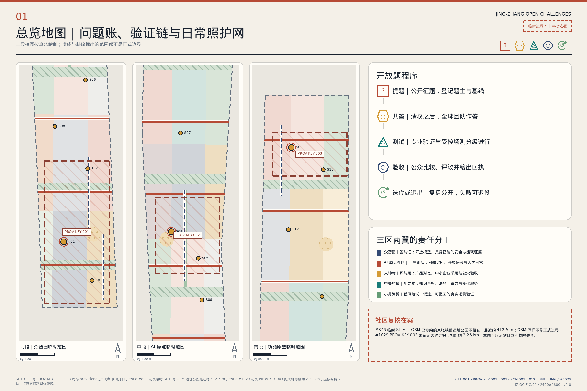
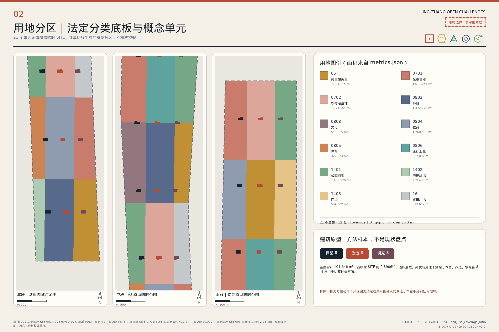
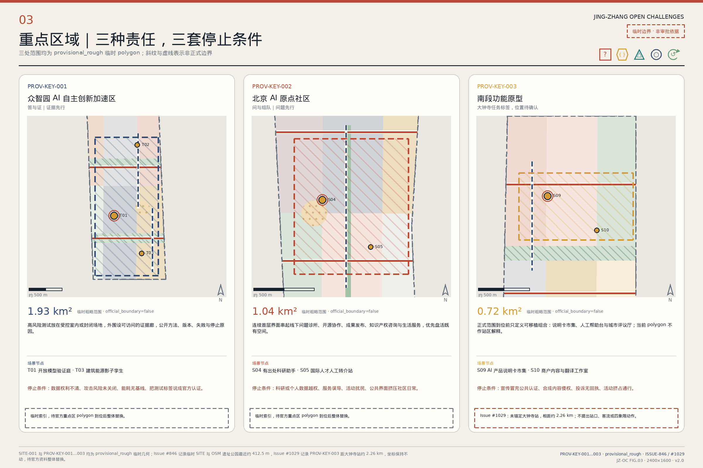
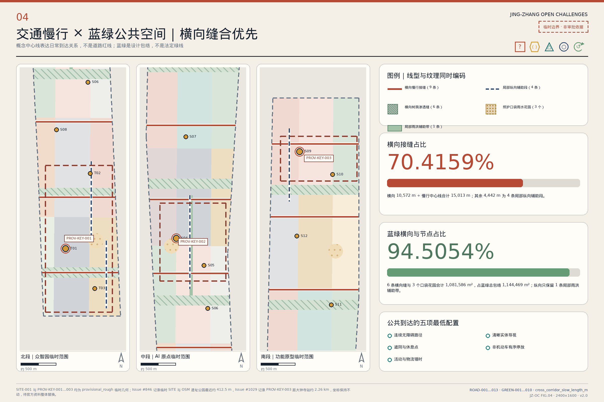
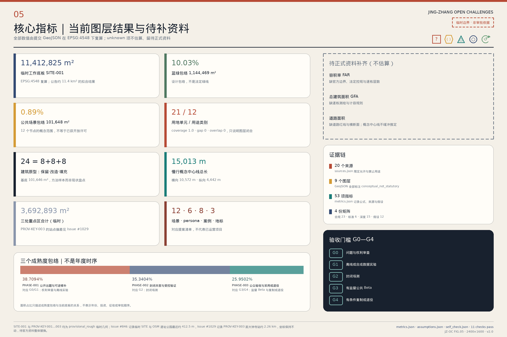

# 京张开放题 2.0｜JING-ZHANG OPEN CHALLENGES

**城市出题，全球共答，公众验收。**

*The City Poses. The World Co-solves. The Public Accepts—or Sends It Back.*

京张铁路曾把“不可能通行”变成一项公共工程。百年之后，AI 创新带的新难题落在技术展廊之外。城市需要一种能力：任何人都能提出真实问题，每个答案都必须说明证据与代价，公众有权把不合格的答案退回。

### 执行摘要

本方案在技术验证之外，增加公开提题、责任、验收与退出程序：谁有权提出、谁承担后果、何时可以测试、公众如何验收、失败项目怎样退出。空间方案把这些程序放进一册问题账、一条验证链、一张日常照护网和 12 个场景节点；运营建议用 G0—G4 决策门检查权利、风险、场测、公众采用与年度复盘。核心判断只有一个：项目是否解决了一个被清楚定义、有人负责且公众认可的问题。[depth:governance_implementation_path] [data:visual/assets/question-ledger.example.json]

## 设计依据与资料清单

本方案以征集公告确定的任务、三层工作范围和成果深度为首要依据，以智能体任务书承接三定位、五功能、三区两翼、AI 场景、文化与运营要求。[source:OFFICIAL-ANNOUNCEMENT] [source:AGENT-TASKBOOK]

“开放题”不是宣传口号，而是一套七步公共程序：**公开征题 → 权利与数据清查 → 跨机构共答 → 专业验证 → 受控场测 → 公众验收 → 开放归档、迭代或退出**。城市设计同步处理横向日常议题，包括过街、遮阴、座椅、无障碍、导视、报修和一线劳动条件，防止创新只服务展会和技术演示。[standard:PROJECT-AGENT-OPEN-CALL-TASKBOOK] [depth:existing_conditions_diagnosis]

| 证据层 | 本方案如何使用 | 不用于什么 |
| --- | --- | --- |
| 正式任务与专业资料 | 确定任务语义、工作深度、城市设计维度和用地分类 | 不推导项目已批准的地块指标、工程条件或实施决定 |
| 临时空间资料 | 生成概念图层、图解与检查；图面始终以低对比虚线标注 | 不称官方红线，不支撑审批、征拆或投资结论 [source:PROVISIONAL-BOUNDARIES] |
| 政策与法律资料 | 限定生成式 AI 公众服务、特定公共服务场所人工办理和老年友好服务的最窄边界 | 不作个案法律意见，不把条文泛化到所有 AI 或全部公共空间 |
| 背景案例与社区复核 | 比较组织机制，披露临时几何的已知偏差 | 不替代中央正式来源、专业测绘或政府确认 |

当前设计底板面积为 11,412,825 m²，绿地概念图层为 1,144,469 m²，公共场景包络为 101,648 m²；这些数字只描述提交几何，不是官方用地统计。[metric:site_area_sqm] [metric:green_space_area_sqm] [metric:public_space_area_sqm]

两项社区复核必须与底板一起阅读。Issue #846 指出，临时 SITE 与 OSM 已测绘的京张铁路遗址公园不相交，最近距离约 412.5 m；OSM 也不是本项目正式边界，因此本方案保持现有坐标不动，等待官方 SITE 后整包替换。[source:ISSUE-846] [data:geometry/site_boundary.geojson#SITE-001]

Issue #1029 指出，`PROV-KEY-003` 没有锚定大钟寺站，距该站约 2.26 km。本轮“大钟寺”章节只回答任务书要求的功能和治理原型，不再声称站口、四象限或客流组织已经落在该 polygon 内，也不自行平移它。[source:ISSUE-1029] [data:geometry/key_areas.geojson#PROV-KEY-003]

官方边界、权属、现状测绘、控规、道路、市政、消防、文保、生态和公共服务底账仍待提供。资料到位后，SITE、重点区、用地、建筑、道路、绿地、公共空间、分期、指标和全部双语成果必须作为同一版本更新。[depth:risk_missing_data]

## 三层范围工作框架

三层范围各有自己的决策尺度，而不是同一张图的三次放大：统筹研究范围决定“哪些问题值得跨地区、跨机构共同回答”；总体设计范围决定“答案如何进入城市日常系统”；重点区域范围决定“何处、以何种风险等级测试，并由谁验收”。[standard:PROJECT-OFFICIAL-ANNOUNCEMENT] [depth:three_level_scope_framework]

| 层级 | 核心问题 | v2.0 成果 | 决策边界 |
| --- | --- | --- | --- |
| 统筹研究范围 | 京张如何形成长期创新议程 | 城市问题目录、案例转译、年度开放题大会、跨机构共答网络 | 不新增精确红线或产业规模承诺 |
| 总体设计范围 | 问题如何落到空间和服务 | 一册“问题账”、一条“验证链”、一张“日常照护网” | 以 SITE-001 为临时工作底板 [data:geometry/site_boundary.geojson#SITE-001] |
| 重点区域范围 | 什么条件下可以试验和退出 | 三类验证环境、十二个场景卡、G0—G4 闸门 | 三处范围均是临时粗略 polygon [metric:key_area_count] |

空间责任链为：**AI 原点社区提题与组队 → 众智园研发与验证 → 小月河翼低风险场测 → 大钟寺功能原型负责公众比较与采用讨论 → 中关村翼匹配知识产权、人才、算力和专业服务 → 返回问题账形成下一版本。** 这是协商框架，不是已确定的机构授权。[depth:overall_spatial_structure]

横向日常照护网穿过社区、校园、园区与公共空间。它优先处理短距离步行、无障碍、树荫、夜间安全和设施维护，使任何大型 AI 项目都必须先回答“是否改善了普通的一天”。道路图层中的 9 条横向缝合线和 4 条重点片区局部辅助线只表达这一关系，不是新建道路方案。[data:geometry/roads.geojson#ROAD-001] [metric:cross_corridor_count]

## 统筹研究范围产业与未来城市研究

总品牌为 **“京张开放题｜JING-ZHANG OPEN CHALLENGES”**。Logo 由三个开放框、两个外向接口和一个公众圆点构成，分别对应三区、两翼和公共判断中心；状态语法为“? 提题、{ } 共答、△ 测试、○ 验收、↺ 迭代/退出”。锈红、研究靛蓝和小月河青始终与文字、形状和纹理配合使用，颜色不单独传达状态。[source:AGENT-TASKBOOK]

方案把三定位转译为三种公共能力：百年京张文化带保存“难题如何被解决、失败如何被记录”；都市 AI 生活体验带拟设置知情、人工帮助、意见、申诉和撤回渠道；AI 融合创新带连接问题、研究、验证、采用和退出。五功能对应五组责任：技术证据、跨机构协作、场景验证、日常服务与治理复盘，而不是五个同质园区。[depth:overall_spatial_structure]

| 区域 | 主责 | 对外接口 | 不承诺的事项 |
| --- | --- | --- | --- |
| 众智园 | 开放模型、具身 AI、安全与能耗验证 | 受控实验、方法发布、失败记录 | 技术测试不等于官方认证 |
| AI 原点社区 | 城市提题、跨机构组队、开放研究、人才日常服务 | 问题诊所、驻留、开源协作 | 不承诺资格、资金或数据供给 |
| 大钟寺功能原型 | 产品对比、公众验收、中小企业采用 | 说明卡、人工帮助、意见回执 | 临时 polygon 不代表站点锚定 |
| 中关村科技服务翼 | IP、法务、人才、算力和转化服务匹配 | 专业服务清单 | 不承诺招商和采购 |
| 小月河场景测试翼 | 低速、低风险、可撤回的真实场景验证 | 分时预约与安全员 | 不承诺测试许可和工程改造 |

8 个背景案例只转译机制：AI Singapore 的问题—基线—交接流程，Mila 与 Vector 的研究中介，Punggol 的学习—运营关系，上海模速空间的邻近服务，Pittsburgh 的机器人协作网络，Knowledge Quarter 的知识场所治理，以及 STATION F 的共享支持体系。案例不提供京张的规模、投资、伙伴或政策承诺，完整允许与禁止用途见 `sources.json`。[source:CASE-AISINGAPORE-100E] [source:CASE-PUNGGOL-DIGITAL-DISTRICT]

若“开放题大会”获授权成立，建议每年公开一批城市问题、责任人、数据条件、测试状态和退役项目；评议对象包括已解决的公共问题、及时停止的错误项目和得到维护的日常设施，不以技术演示数量作为主要成绩。[depth:renewal_project_list]

## 总体设计范围城市更新与控规深度城市设计

总体结构为 **一册、一链、一网、三门**：一册是公开问题账；一链是从提题到退出的验证责任链；一网是横向日常照护网；三门是进入受控测试、进入公众环境和复制推广前的决策门。它们叠加在法定用地之上，不创造新的用地类别。[standard:MOHURD-URBAN-DESIGN-MEASURES] [depth:land_use_layout]

城市更新按四个动作排序：

1. **先修日常界面**：过街、无障碍、树荫、座椅、厕所、照明、导视、非机动车停放和维修工位；
2. **再嵌共享功能**：在既有建筑与公共空间中布置问题诊所、开放研究、预约测试和公众验收，优先分时、可逆改造；
3. **后定开发强度**：等待官方控规、权属、测绘和工程条件后，再讨论总建筑规模、容积率、高度、密度与退线；
4. **预写退出方式**：传感器、机器人、标识和临时构筑物在进入场地前就写明期限、人工负责人、恢复方式和拆除责任。[standard:MOHURD-CONTROL-DETAILED-PLANNING]

21 个用地单元覆盖当前 SITE，24 个建筑原型分为保留、改造、填充各 8 个；这些对象用于比较空间策略，不对应现实地块的法定用途或拆改留决定。[data:geometry/land_use.geojson#LU-001] [data:geometry/buildings.geojson#BLDG-001] [metric:building_prototype_count]

新的设计重点从纵向“创新轴”转向横向“城市接缝”。概念慢行总长 15,013 m，其中横向缝合 10,572 m，占 70.42%；蓝绿空间的横向与节点构成占 94.51%。主要空间组织方式是社区—校园—园区的横向日常联系，纵向线路只在重点片区附近提供辅助。[metric:road_centerline_length_m] [metric:cross_corridor_slow_length_m]

## 重点区域详细设计

三处重点区采用同一套评审框架：**定位、空间组织、既有建筑、到达与公共空间、AI 场景、运营责任、停止条件**。范围均为临时粗略 polygon；以下内容是供规划、建筑、交通、市政、生态、法务和公众参与团队深化的参考方案。[depth:three_key_area_detailed_design]

### 众智园 AI 自主创新加速区｜证据先行

- **定位**：开放模型、具身 AI、安全与能耗证据区。
- **空间**：高风险测试位于受控室内或封闭场地，外围设置可访问的证据廊，展示方法、版本、失败和停止原因。
- **更新**：先评估既有研发建筑的可逆适配；新建、拆除、高度和规模等待现状、权属、控规与结构鉴定。
- **场景**：T01 开放模型验证庭、T03 建筑能源影子孪生；“全球解题台”是信息与讨论节点，不预设大型新建筑。
- **停止条件**：数据权利不清、模型攻击风险未关闭、设备安全不足、能耗无基线或测试标签被宣传为官方认证。

其临时空间索引为 `PROV-KEY-001`，场景节点为 `SCN-001` 与 `SCN-003`。[data:geometry/key_areas.geojson#PROV-KEY-001] [data:geometry/public_space.geojson#SCN-001]

### 北京 AI 原点社区｜问题先行

- **定位**：公共问题提出、开放研究、跨机构组队和国际人才日常服务区。
- **空间**：连续首层界面连接线下问题诊所、开源协作、成果发布、知识产权咨询和生活服务。
- **更新**：优先盘活可适配空间并保留真实使用者；产权、结构、消防、租赁和社区影响未核查前，不落拆改留结论。
- **场景**：S04 有出处的科研助手、S05 国际人才人工转介站；“百年难题档案馆”连接铁路工程史、创新文化和当年题库。
- **停止条件**：科研或个人数据越权、服务误导、活动持续扰民或公共界面挤压社区日常。

其临时空间索引为 `PROV-KEY-002`，公众界面由 `SCN-004` 与 `SCN-005` 表达。[data:geometry/key_areas.geojson#PROV-KEY-002] [data:geometry/public_space.geojson#SCN-004]

### 南段功能原型｜大钟寺任务标签、位置待确认

- **定位**：AI 产品说明、对比试用、中小企业采用和公众验收的功能原型。
- **空间**：在正式重点区到位前，只定义可移植的“说明卡市集 + 人工帮助台 + 城市评议厅”组合，不把当前 polygon 解释为大钟寺站周边。
- **更新**：优先使用既有商业、办公和公共空间的分时复合，不以大型展馆取代日常服务。
- **场景**：S09 AI 产品说明卡体验市集、S10 中小商户内容与翻译工作室；每项体验展示数据来源、人工复核、有效期和退出说明。
- **停止条件**：商业宣传冒充公共认证、合成内容侵权、投诉无回执、数字排斥或活动挤占基本通行。

当前索引仍为 `PROV-KEY-003`，但位置偏差已登记为待官方资料解决的事项；本轮不提出站口、客流或四象限工程动作。[data:geometry/key_areas.geojson#PROV-KEY-003] [source:ISSUE-1029]

## AI 创新生态、人才画像与 AI+ 场景

每道开放题建立 `Q-ID`，至少记录题主、受益者、受影响者、现状基线、允许数据、权利状态、风险等级、测试地点、成功指标、停止条件、人工负责人、到期日和开放成果许可。生成式 AI 公众服务只在《暂行办法》的适用范围内讨论；投诉渠道写明责任人和处理状态，不虚构法定数字期限。[source:GENERATIVE-AI-INTERIM-MEASURES]

| Persona | 首要需求 | 方案响应 | 必须保留的权利 |
| --- | --- | --- | --- |
| 模型研究者与开源维护者 | 严谨实验、贡献记录、跨机构协作 | 原点组队、众智园验证、版本与失败公开 | 未授权科研数据不进入题库 |
| AI 初创团队的产品、测试与合规人员 | 低成本验证、专业服务、真实反馈 | 分级测试与两翼服务匹配 | 场测不等于采购或背书 |
| 国际青年人才及家庭 | 可信双语信息、居住与公共服务连续性 | 线上助手加线下人才台 | 资格由主管机构与专业人员确认 |
| 居民、儿童、老人、残障者与低数字能力者 | 日常便利、安静、安全、可退出 | 纸质、电话、人工和无障碍通道并存 | App 不能成为唯一入口 |
| 中小商户与社区服务者 | 低门槛工具、版权清晰、效果透明 | 内容工作室、说明卡与人工复核 | 不强制交出经营数据 |
| 物业、保洁、维修、安保和设施运营者 | 工作量可控、工具可接管、责任清楚 | 一线人员参与设计、训练和停止判断 | 自动化不能把风险转嫁给一线人员 |

无障碍法第 39 条只用于医疗、社保、金融、生活缴费等明确列出的公共服务场所现场指导和人工办理；其他场景的人工备份是本方案的设计选择，不声称是普遍法定义务。国办发〔2020〕45 号只提供传统服务与智能服务并行的政策背景，不代表海淀已经完成实施。[source:BARRIER-FREE-ENVIRONMENT-LAW] [source:ELDERLY-SMART-TECH-PLAN-2020-45]

12 个场景分为技术验证、城市服务和公众照护三组：

| ID | 场景与空间节点 | 拟议首轮门 | 升级证据 / 退出条件 |
| --- | --- | --- | --- |
| T01 / SCN-001 | 开放模型验证庭 | G1 | 数据卡、攻击测试、能耗基线；证据不足即留在离线环境 |
| T02 / SCN-002 | 具身 AI 慢速测试庭 | G1 | 围栏、安全员、急停、无障碍测试；冲突即撤场 |
| T03 / SCN-003 | 建筑能源影子孪生窗 | G1 | 只读影子模式；无设施负责人批准不得控制设备 |
| S04 / SCN-004 | 有出处科研助手桌 | G1 | 来源、权限、人工核验；敏感资料不得进入公开模型 |
| S05 / SCN-005 | 国际人才人工转介站 | G1 | 双语责任清单、转人工；不得承诺签证和资格结果 |
| S06 / SCN-006 | 算力与数据透明导航台 | G0 | 只公开提供方、适用条件、费用口径和人工咨询，不承诺供给结果 |
| S07 / SCN-007 | 京张文化线索无障碍伴游起点 | G0 | 现场导向、人工讲解和非智能服务并行；临时 SITE 不得写成遗址公园边界 |
| S08 / SCN-008 | 小月河生物多样性公民观察庭 | G0 | 先补生态基线；敏感物种坐标默认不公开，无许可不布置感知设备 |
| S09 / SCN-009 | AI 产品说明卡市集 | G1 | 模型、数据、能耗、责任和期限透明；误导即下架 |
| S10 / SCN-010 | 商户内容与翻译工作室 | G1 | 版权台账与人工终审；侵权或虚假宣传即停止 |
| S11 / SCN-011 | 公共空间舒适度共设计桌 | G0 | 现场共评和维护责任优先，不以视觉识别替代调查 |
| S12 / SCN-012 | 城市问题分流与共设计台 | G0 | 人工受理、公开回执、申诉与撤题渠道必须同时存在 |

G0 是问题与权利审查，G1 是离线或合成数据实验，G2 是封闭场测，G3 是有监督公共 Beta，G4 是有条件复制或退役。任何项目都可以降级、暂停或退出；安全地停止一项不适当试验，同样计入年度责任贡献。[data:geometry/public_space.geojson#SCN-012] [metric:scenario_count]

## 用地、建筑规模与拆改留方案

法定用地与开放题运营分层表达：用地仍采用可核对的 `land_use_code`，问题诊所、验证庭、评议厅和服务台属于运营叠加层，不自造新的法定用地类别。[source:MNR-LAND-USE-CLASSIFICATION] [standard:MNR-LAND-USE-CLASSIFICATION-GUIDE]

21 个概念单元完整覆盖 SITE-001，当前图层内 gap 与 overlap 均为 0；这只说明提交拓扑闭合，不表示用途已获批准。建筑原型基底合计 101,646 m²，占当前 SITE 的 0.8906%；总建筑面积、容积率、高度、密度和退线等待官方控规、逐栋测绘与计容规则。[metric:land_use_zone_count] [metric:building_footprint_area_sqm]

| 动作 | v2.0 筛选规则 | 进入项目决策前必须取得 |
| --- | --- | --- |
| 保留 | 遗产、公共服务、持续使用或低碳价值优先 | 文保、产权、结构、消防、真实使用 |
| 改造 | 可用低扰动方式承载共享研究、人才服务和日常照护 | 租赁、结构、设备、无障碍、运营维护 |
| 拆除 | 只保留为法定程序可能确认的候选，本方案不落到地块 | 权属、鉴定、补偿、社会影响和审批 |
| 填充 | 既有空间无法满足已证实公共需求时才进入比较 | 控规、交通、市政、消防、能耗和全生命周期成本 |

24 个原型采用保留 8、改造 8、填充 8 的平衡样本，用来展示评估方法而非宣布现实处置。任何与当前使用者冲突的更新，都先回到权利关系图和协商程序。[data:geometry/buildings.geojson#BLDG-024] [depth:retain_renovate_demolish]

## 交通、轨道、市政与公共服务设施

交通策略从“造一条轴”改为“补九道横向接缝”：连接社区、校园、园区和公共空间的短距离步行、骑行与无障碍路径优先；4 条局部纵向辅助段只服务重点片区内部关系。所有中心线均为概念联系，不是道路红线、铁路保护线或工程线位。[data:geometry/roads.geojson#ROAD-013] [depth:traffic_rail_slow_parking]

公共到达采用五项最低配置：连续无障碍路径、清晰实体导视、阴影与休息点、非机动车有序停放、活动与物流错时。轨道出入口、交通量、过街、停车和铁路安全资料尚未入包，因此不提出站口改造、道路断面或客流容量结论；`PROV-KEY-003` 的站点偏差也禁止从临时线位推导工程方案。[source:ISSUE-1029]

市政与新型基础设施遵守“最小必要、可维护、可撤回”：

- 感知、网络和端侧算力按场景布置，写明目的、最小字段、保留期、维护人和拆除责任；
- T03 先保持只读影子模式，设施控制由有资质的专业人员另行决定；
- 充电、能源、雨洪、给排水、消防和地下管线等待正式容量与探测资料；
- 医疗、社保、金融和生活缴费等列明公共服务保留现场指导与人工办理；其他服务也提供人工备份，但明确这是设计要求。[source:BARRIER-FREE-ENVIRONMENT-LAW]

constraints 图层当前没有正式约束 feature，表示资料尚未进入提交包，不表示现实中没有文保、水务、消防、市政或生态约束。[data:geometry/constraints.geojson] [metric:constraints_feature_count]

## 蓝绿空间、公共空间与城市风貌

蓝绿系统由 1 条局部雨洪辅助带、6 条横向树荫渗透缝和 3 个口袋照护雨水花园组成。总包络为 1,144,469 m²，占当前 SITE 的 10.03%；横向与节点部分占 94.51%，主要为横向日常联系提供遮阴、渗透和停留空间。[data:geometry/green_space.geojson#GREEN-001] [metric:green_ratio]

Issue #846 表明临时 SITE 与 OSM 遗址公园存在空间差异。本轮不画出“准确遗址公园边界”，也不把任何概念绿地宣称为遗产保护范围；正式遗产名录、保护范围、建设控制地带、水务、树木和生态资料到位后，再确定岸线、构筑物、照明与景观工程。[source:ISSUE-846] [depth:blue_green_public_space]

文化展陈连接三类内容：京张铁路的工程与公共基础设施史；中关村以问题驱动的科研创业文化；本方案关于数据权利、失败试验和公共责任的规则。展陈同时记录提出问题的居民、维护设施的一线人员、验证失败的团队、要求暂停的评议者和完成修复的人。

三个地标都是可逆的公共功能节点：

1. **百年难题档案馆**：保存历史难题、当年题库、证据、失败复盘和版本更正；
2. **全球解题台**：展示题目、团队、G0—G4 状态、测试边界、停止理由与开放成果；
3. **城市评议厅**：提供对比试用、人工解释、意见、申诉和公共回执。[metric:landmark_count]

城市风貌使用耐久、可修、可替换的构件和清晰状态标签；不使用未清权图片、第三方字体文件、企业商标或人物肖像。地标名称不等于已批准建筑项目。[data:geometry/public_space.geojson#SCN-009]

## 更新项目清单、实施政策与分期计划

实施采用“项目包 + 责任角色 + 进入门 + 退出门”，不把空间分期写成政府建设时序。拟议的六类角色为：开放题办公室、题目所有者、权利与风险小组、独立验证组、场地运营方、公众验收组；所有角色都需未来授权，不能由本提案自行任命。[depth:phasing_implementation]

| 项目包 | 牵头角色（拟议） | 首个交付物 | 不进入下一阶段的条件 |
| --- | --- | --- | --- |
| P01 问题账与权利清查 | 开放题办公室 + 题目所有者 | Q-ID、基线、权利和期限卡 | 没有公共问题、合法数据或责任人 |
| P02 日常照护问题诊所 | 社区服务方 + 维护组 | 线下征题、工单和回执 | 没有人工受理或维护责任 |
| P03 众智园验证环境 | 独立验证组 + 场地运营方 | T01/T03 测试报告 | 安全、能耗或设施条件未关闭 |
| P04 小月河低风险场测 | 场地运营方 + 安全员 | T02/S08 场测记录 | 无围栏、急停、许可或生态基线 |
| P05 原点开放研究与人才服务 | 高校/社区接口 + 专业服务方 | S04/S05 服务清单 | 数据越权或资格信息无人工确认 |
| P06 大钟寺公众验收原型 | 商户/公共服务接口 + 公众验收组 | S09/S10 对比回执 | 误导、侵权、投诉无响应或位置未确认 |
| P07 三地标与贡献档案 | 文化运营方 + 社区共编组 | 可逆展陈和权利台账 | 第三方资产未清权 |
| P08 退出与版本档案 | 开放题办公室 + 独立观察员 | 事故、暂停、退役和 changelog | 只发布成功案例 |

三个空间工作包覆盖当前 SITE：PHASE-001 对应公开出题与可逆修补，PHASE-002 对应封闭共答与受控验证，PHASE-003 对应公众验收与采用/退役。它们分别占当前底板的 38.71%、35.34% 和 25.95%，只是成熟度包络，不表示年份、投资、征收或审批顺序。[data:geometry/phasing.geojson#PHASE-001] [metric:phase_count]

运营建议按四季组织：春季征题与清权，夏季跨机构共答，秋季受控场测，冬季举行 `Jing-Zhang Open Challenges Review Week`。若进入实际运营，冬季应统一发布通过、退回、主动停止和到期或退役项目；每个决定给出责任人、证据摘要和下一动作。实施考核采用三组指标：公共问题处理、风险与退出、日常空间维护，不单独以活动人次或企业数量计绩。[depth:renewal_project_list]

## 指标体系、面积复算与合规矩阵

指标分为“当前图层结果”和“待正式资料补齐”两类。前者用于核对本版空间与叙事是否一致；后者明确本轮不能给出的结论。完整 53 项当前指标、公式、来源文件与假设在 `metrics.json`，正文只保留影响设计判断的指标。[depth:metrics_recalculation]

| 主题 | v2.0 当前结果 | 设计含义 |
| --- | --- | --- |
| 工作底板 | 11,412,825 m² | provisional SITE 的提交范围，不是官方面积 [metric:site_area_sqm] |
| 用地拓扑 | 21 个单元、12 类；coverage 1，gap 0，overlap 0 | 只说明当前图层闭合，不说明用途获批 [metric:land_use_zone_count] |
| 建筑原型 | 24 个，保留/改造/填充各 8 个；基底 101,646 m² | 方法样本，不是现状建筑盘点 [metric:building_prototype_count] |
| 慢行概念线 | 总长 15,013 m；横向 10,572 m，局部纵向 4,442 m | 横向日常连接是主策略 [metric:cross_corridor_slow_length_m] |
| 蓝绿空间 | 1,144,469 m²，占当前 SITE 10.03% | 设计包络，不是法定绿线 [metric:green_space_area_sqm] |
| 公共场景 | 12 个节点，包络 101,648 m²，占 0.89% | 不表示全部空间已获开放许可 [metric:scenario_count] |
| 重点区 | 3 个临时 polygon，合计 3,692,893 m² | `PROV-KEY-003` 的站点偏差另行披露 [metric:key_area_total_sqm] |
| 内容覆盖 | 6 类 persona、8 个案例、3 个地标 | 对应提案清单，不代表已运营项目 [metric:persona_count] |

本轮不提供容积率、总建筑面积和道路面积：缺少官方 SITE、法定控规、逐栋层数和可计容面积、道路红线与断面。图表中统一写“待正式资料补齐”，不以估算值填空。[metric:floor_area_ratio]

审查链分四层：`compliance_matrix.json` 对 23 项公告与智能体任务逐项响应；`standard_matrix.json` 记录专业标准与数据缺口；`design_depth_matrix.json` 展开 15 项设计深度；`self_check.json` 记录本包检查项。正文、结构化数据、图件、报告、PDF 和 visual 必须共享同一版指标与风险事实。[standard:MOHURD-CONTROL-DETAILED-PLANNING]

## 风险、版权与合规说明

| 风险 | 控制方式 | 立即停止或退回条件 |
| --- | --- | --- |
| 临时边界被当作官方控制 | 图文标注 provisional，并登记 #846/#1029 | 出现审批、地价、征拆或工程外推 |
| 生成式 AI 越界 | 先判断是否落入公众生成式服务适用范围，公开投诉渠道 | 违法内容处置、数据权利或责任人不清 [source:GENERATIVE-AI-INTERIM-MEASURES] |
| 数字排斥 | 特定公共服务依法保留现场指导与人工办理，其他场景保留设计性人工备份 | App 成为唯一入口或弱势群体无法完成服务 |
| 商业宣传冒充公共认证 | 说明卡写明提供方、方法、有效期和限制 | 使用“政府认证、批准、指定”等未经授权表述 |
| 失败与投诉被隐藏 | 成功、退回、暂停、事故、投诉和退役同版公开 | 无回执、无复盘或拒绝纠正 |
| 维护负担转嫁 | 一线运营者参与设计、测试和停止判断 | 工具增加无补偿工作量或责任不对等 |
| 活动挤压日常生活 | 先保障通行、安静、生态和照护设施 | 投诉、噪声、安全或生态影响无法控制 |
| 版权与品牌 | 逐资产权利台账，不复制案例图片、Logo、版式或长文本 | 权利状态不清的资产不得发布 |

AI 协作披露：OpenAI Codex 负责来源、假设、空间数据、指标、双语内容、成果集成与验证；Kimi K3 负责设计检索、同类方案复核与中英文视觉前端。工具不能承担规划、建筑、交通、市政、生态、文保、法务或公共决策责任；GitHub 投稿者承担最终核对。[data:agent.json] [depth:risk_missing_data]

文字、VI 方向、数据图和界面均为本投稿新制作；案例仅使用名称、事实性机制和链接。最终资产使用系统字体和本地生成图，不加载 CDN、远程脚本、追踪、表单或第三方图片。权利台账见 `report/copyright_statement.md`。

所有空间、运营与政策内容均为概念建议、参考方案或供专业团队深化的材料，不构成政府承诺、规划审批、法定控规、权属判断、拆改留决定、工程可行性、投资测算、采购、招商、资金或活动安排。[source:OFFICIAL-ANNOUNCEMENT]

## 参考资料

正文只保留与判断相邻的证据锚点；完整来源标题、URL、发布日期、访问日期、允许用途与禁止用途以 `sources.json` 为准。[source:OFFICIAL-ANNOUNCEMENT]

- **任务与空间底板**：征集公告、智能体任务书、临时边界及其社区复核记录；临时资料不升级为正式红线。[source:PROVISIONAL-BOUNDARIES] [source:ISSUE-846]
- **城市设计与用地**：城市设计管理、控规编制审批和用地分类资料，只支撑方法和专业维度。[source:MOHURD-URBAN-DESIGN-MEASURES] [source:MNR-LAND-USE-CLASSIFICATION]
- **AI 与包容性服务**：生成式 AI 暂行办法、无障碍环境建设法和老年人智能技术实施方案，按 `sources.json` 中的最窄用途引用。[source:GENERATIVE-AI-INTERIM-MEASURES] [source:BARRIER-FREE-ENVIRONMENT-LAW]
- **案例研究**：8 个案例均为 `background_case_study`，只比较组织机制，不支撑京张规模、投资、伙伴或规划控制。[source:CASE-MILA] [source:CASE-STATION-F]
- **专业审查入口**：标准、设计深度、数据缺口和指标分别进入三份矩阵、assumptions 与 metrics；建筑深度官方文件仍待补。[standard:MOHURD-ARCH-DESIGN-DEPTH-2016] [source:ARCH-DESIGN-DEPTH-DATA-GAP]

本次 v2.0 的变更范围和旧版差异记录在 `changelog.md`。
