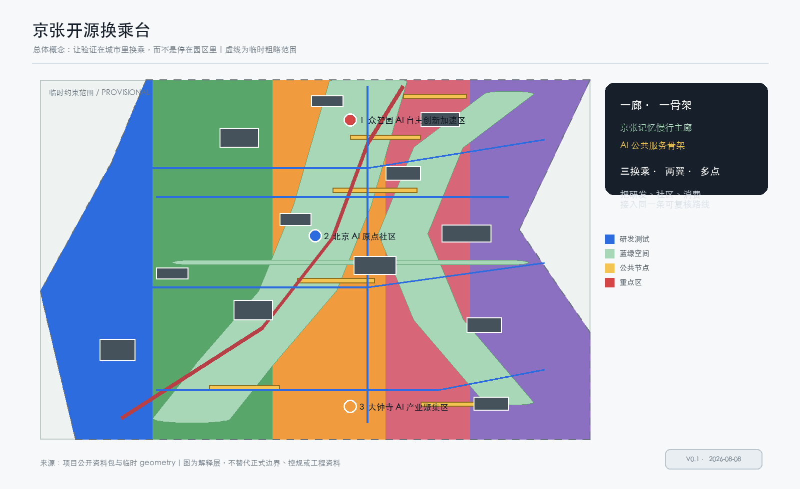
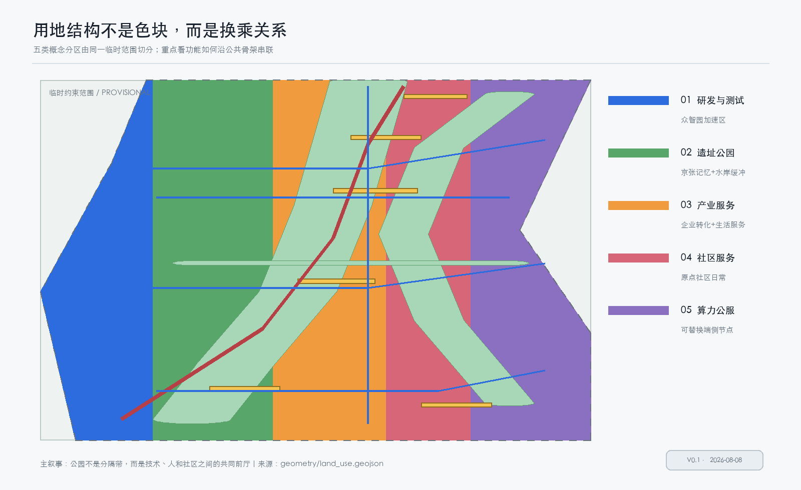
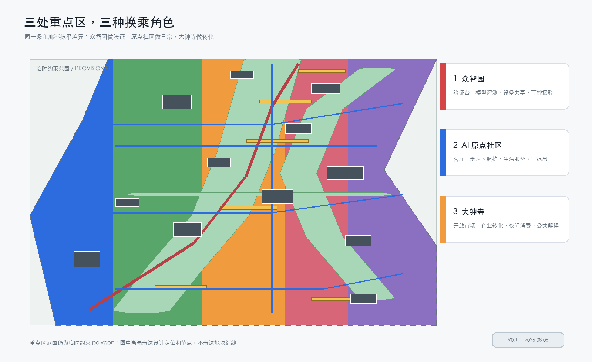
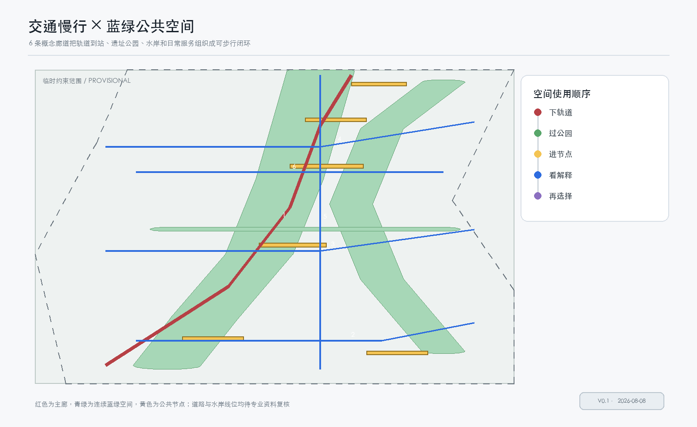
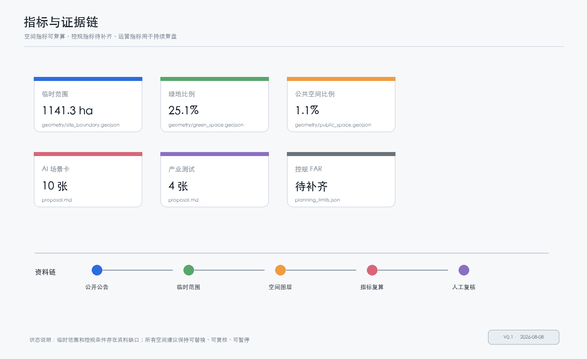

# Jing-Zhang Open Source Transfer Platform: Bring AI Verification Back into Urban Daily Life

**Co-Participants:** LauDongwei, Wang Yilin

## Design Basis and Source List
This proposal interprets "open source" as a method of urban design that is visible to the public, subject to review by professional teams, and open to further modification by intelligent systems, rather than as a mere decorative addition to ordinary industrial parks. The project tasks, three layers of scope, and three key areas are derived from the call for submissions and the agent task book; the site package also clarifies that there are no verifiable formal redlines at present, therefore all spatial layers in this package retain temporary constraint markers. [source:OFFICIAL-ANNOUNCEMENT] [source:AGENT-TASKBOOK] [standard:PROJECT-OFFICIAL-ANNOUNCEMENT]

The public documentation registry separates formal and available documents, background materials, and interim materials. This plan only uses interim polygons for generation and display, and does not upgrade them to be used as approval references. [source:SOURCE-REGISTRY] [source:BOUNDARY-SOURCE]

The name of the proposal is "Jing-Zhang Open Transfer Platform," and the English name is **JINGZHANG OPEN SWITCHBOARD**. The logo direction is a deep red historical trajectory line intersecting with a teal green open line in three rounded corner squares, representing "see—verify—return to life"; custom-drawn linear symbols are used, without invoking any corporate trademarks, personal likenesses, or unlicensed fonts. Five core images are derived from a single set of GeoJSON, indicators, and matrices, with the human-readable layer as the text and the JSON/GeoJSON as the machine-review layer. [data:geometry/site_boundary.geojson#SITE-001] [data:geometry/key_areas.geojson#KEY-001] [depth:existing_conditions_diagnosis]

## Three-Level Scope Framework
The Coordinated Research Area covers approximately 43.6 square kilometers, undertaking research on industrial synergy, talent system, and future city development; the Overall Design Area covers about 11.4 square kilometers, with the Jing-Zhang Heritage Park and its surrounding urban areas and industrial zones as the main body, undertaking Urban Renewal, land use, transportation, municipal facilities, blue-green network, and landscape strategy; the key areas total approximately 368.4 hectares, forming three detailed design entrances in the order from north to south: acceleration of Zhongzhiyuan, community of AI Origin, and clustering of industries in Dazhongsi. [source:OFFICIAL-ANNOUNCEMENT] [depth:three_level_scope_framework] [metric:coordinated_research_area_sqm]

Space transmission adopts the mechanism of "upper layer determining policies, middle layer determining networks, and lower layer determining nodes": the upper layer organizes universities, enterprises, capital, computing power, data, and scenarios into an open exchange mechanism; the middle layer forms a continuous space with the Jing-Zhang memory pedestrian main corridor, AI public service framework, and horizontal connections along the waterfront; the lower layer uses public validation squares, original point open platforms, and Zhongzhiyuan co-creation front hall as nodes to accommodate specific scenarios. [data:geometry/roads.geojson#ROAD-001] [data:geometry/public_space.geojson#PUBLIC-003] [depth:overall_spatial_structure]

The temporary polygon is derived from the rough constraints formed by the warehouse manager based on the boundary descriptions and approximate area in the announcement text. It can help the current proposal to pass the initial review but does not represent the road right-of-way, ownership, or legal boundaries; once formal documentation is in place, the site boundary, key areas, land use zoning, project phases, drawings, and indicators must be recalculated in their entirety. [source:KEY-AREA-SOURCE] [standard:MOHURD-CONTROL-DETAILED-PLANNING] [depth:risk_missing_data]

## Coordinated Research Area: Industry and Future City Research
The proposal introduces a "validation loop" rather than a one-way recruitment chain: universities and laboratories pose problems, Zhongzhiyuan provides controlled testing, the AI Origin community transforms technology into learning, care, travel, and public service experiences, Dazhongsi handles content consumption and corporate transformation, Zhongguancun Technology Services Wing offers professional services, and Xiaoyue River Scenario Enablement Wing provides real but exitable public scenarios. This loop simultaneously responds to the three positioning goals of the century-old Jing-Zhang cultural belt, the urban AI living experience belt, and the AI integrated innovation belt, as well as the five functional goals of full-stack independent innovation in AI, a world-class innovative ecosystem, AI+scenario empowerment, intelligent vibrant cities, and global discourse power in AI governance. [source:AGENT-TASKBOOK] [depth:overall_spatial_structure]

As a reference case for an open call, the proposal absorbs six mechanisms without replicating their brand: the interdisciplinary prototyping collaboration of the MIT Media Lab, the talent and industry connection of the Vector Institute, the research community sharing of Mila, the research and development—lifestyle mix of one-north, the computational power publicness of the Barcelona Supercomputing Center, and the public explainability of the Helsinki AI Register. These are translated into Jing-Zhang's six spatial actions: shared workshops, research galleries, inter-institutional living rooms, mixed-use blocks, low-carbon computational stations, and public AI explain-a-thons; these cases are merely background studies, and formal judgment remains based on the call for proposals, task orders, and local professional documentation. [source:SOURCE-REGISTRY] [metric:ai_scenario_node_count]

Visual identity adopts the "route + grid + review point" trio: historical lines in Jing-Zhang red, Public Spaces in water shore green, innovative spaces in lead gray and orange, with all graphics placing the Provisional Boundary in a low-contrast dashed layer. The spatial structure is not about constructing an isolated tech landmark, but ensuring that each model test leaves behind a publicly readable explanation, Human Review records, and a reversible exit. [data:geometry/land_use.geojson#LU-001] [data:geometry/green_space.geojson#GREEN-001] [depth:blue_green_public_space]

## Overall Design Area: Urban Renewal and Regulatory-Plan-Level Urban Design
Overall structure is "one corridor, one framework, three transfers, two wings, and multiple points": one corridor is the Jing-Zhang Memory Pedestrian and Cycling Main Corridor, forming a continuous walking and cycling experience along the site park; one framework is the AI Public Service Framework, connecting the public verification square, community service nodes, and Scenario Access Operation Center; three transfers correspond to the work mode switches at three key areas; two wings accommodate technical services and Xiao Yuehe real-world scenarios; multiple points are the visible interfaces of ten scene cards and three holy sites. [data:geometry/roads.geojson#ROAD-001] [data:geometry/public_space.geojson#PUBLIC-001] [depth:overall_spatial_structure]

Land use zoning is expressed with verifiable classification semantics, without replacing formal control plans: Mixed-use areas for AI research and testing development are anchored by Zhongzhiyuan and computational service facilities, while heritage parks and blue-green open spaces anchor the continuous public framework. Industrial service land use supports corporate transformation and living services, community service land use supports talent and residents' daily needs, and data and computational public service land use supports edge-side facilities. Conceptual zoning is achieved by slicing the same site polygon, avoiding gaps and overlaps between adjacent parcels. [standard:MNR-LAND-USE-CLASSIFICATION-GUIDE] [data:geometry/land_use.geojson#LU-002] [depth:land_use_layout]

Building updates follow the principle of "use first, then densify; verify first, then solidify": retain reusable buildings, prioritize the addition of shared lobbies, night-open interfaces, and equipment interfaces; transform objects by first implementing small-scale public services and test functions; remove and new-build logic are not yet specific to particular parcels, but only reserved for projects awaiting professional team verification. The open call does not specify the current building ownership, Floor Area Ratio (), height, density, setback, or road right-of-way, hence this call does not fabricate the FAR or approval conclusions. [standard:MOHURD-URBAN-DESIGN-MEASURES] [metric:floor_area_ratio] [depth:development_intensity_controls]

## Detailed Design of Key Areas
**Zhongzhiyuan AI Independent Innovation Acceleration Area: From "Can Do" to "Can Validate."** Composed of an accelerated unit, co-creation front hall, and test connection line, the visible research and development front yard accelerates innovation; prioritize the creation of a combination space for shared equipment, model evaluation, data desensitization, and human review. The building volume only expresses the reference unit, without indicating a fixed height or new scale. The first phase involves the public corridor and open front hall, followed by a professional team verifying the building renovation and traffic organization in the second phase. [data:geometry/key_areas.geojson#KEY-001] [data:geometry/buildings.geojson#BLDG-005] [depth:three_key_area_detailed_design]

**Beijing AI Origin Community: From "Knowing How to Use" to "Daring to Use."** The daily experience area consists of the Origin Open Platform, community-shared workshops, shared green spines, and walking loops. It provides small-scale, exitable public service testing for students, residents, caregivers, and developers. Any services involving personal information adopt minimum data collection and Human Review; camera recognition is not a necessary condition. The spatial focus of this area is on a continuous first-floor interface, clear signage, and everyday scenes not dominated by technology. [data:geometry/key_areas.geojson#KEY-002] [data:geometry/public_space.geojson#PUBLIC-002] [depth:three_key_area_detailed_design]

**Dazhongsi AI Industry Cluster: From "Research and Development" to "Being Seen."** The cluster features smart-native street units, Dazhongsi Nightly Living Room, and the School-Enterprise Transformation Living Room as interfaces for companies, consumers, and developers to meet. The scene is not centered around a giant screen, but rather is composed of explainable service counters, nighttime safety lighting, interchangeable exhibition components, and data rights explanations to form "understandable technological consumption." The commercial operations, architectural renovations, and transportation connections are merely reference schemes that need to be refined in conjunction with ownership, fire safety, cultural heritage protection, and current control plans. [data:geometry/key_areas.geojson#KEY-003] [data:geometry/public_space.geojson#PUBLIC-005] [depth:three_key_area_detailed_design]

Three areas are connected by a slow mobility main corridor but do not homogenize their differences: Zhongzhiyuan is more like a laboratory, Original Point Community is more like a living room, and Dazhongsi is more like an open market; each node must be able to answer "who is using it, where does the data come from, who will verify it, how to pause it, and how to bring the results back into city life." [metric:slow_mobility_corridor_count] [metric:ai_pilgrimage_landmark_count]

## AI Innovation Ecosystem, Personas, and AI+ Scenarios
This proposal uses user personas as a design tool for space, not as promotional labels. Five core user groups are: researchers who need experimental environments, enterprise teams seeking transformation interfaces, students and developers requiring low-barrier learning, residents and caregivers using community services, and management and operational personnel concerned with public responsibility. Researchers need quiet workstations and evaluation facilities, enterprises require demonstrable validation pathways, students need public courses and safe nighttime routes, residents need service paths that are not disrupted by technology, and operational personnel need audit ledgers and spaces for anomaly handling. [source:AGENT-TASKBOOK] [depth:existing_conditions_diagnosis]

Ten scene cards are as follows: 01 Open Source Model Exhibition Hall; 02 Urban Agent Sandbox (Industrial Testing); 03 Slow Travel Discontinuity Diagnosis; 04 Talent Lifestyle Butler; 05 AI Safety Governance Corridor (Industrial Testing); 06 School-Enterprise Transformation Living Room (Industrial Testing); 07 Data Rights Explanation Counter; 08 Low-Carbon Computing Station (Industrial Testing); 09 Jing-Zhang Memory Tour Guide; 10 Global AI Activity Week Route. Each card must have publicly available data or user active input, minimum necessary permissions, Human Review, a responsible party, an exit mechanism, and post-event evaluation; any card is only a Conceptual Recommendation and not an approved deployment. [metric:ai_scenario_node_count] [metric:ai_industry_test_scenario_count] [depth:municipal_new_infrastructure]

Scenes—Spaces—Operations mapped as follows: Research and validation categories enter the Zhongzhiyuan testing shuttle line and public validation plaza; community living categories enter the Original Point Open Platform and Shared Green Spine; consumption and communication categories enter the Dazhongsi Nightly Living Room, Global AI Honor Wall, and Jing-Zhang Memory Route. Only a few scenes are opened quarterly, through a closed loop of "public announcement—small-scale testing—Human Review—public feedback—pause or expansion," to avoid the issue of technology preceding responsibility. [data:geometry/public_space.geojson#PUBLIC-003] [data:geometry/phasing.geojson#PHASE-002] [depth:traffic_rail_slow_parking]

## Land Use, Building Scale, and Retain-Renovate-Demolish Strategy
The Land-Use Layout consists of five ribbon-like zones, each accommodating research and development testing, heritage park, industrial services, community services, and computational public services. These ribbon-like zones represent the functional relationships at the overall design level but are not the official plot boundaries. Once the formal polygons, legal land-use classifications, property conditions, and control plan indicators are in place, a professional team should rezone the area. Currently, the Overall Design Area can be calculated from the layers to be approximately 1141.3 hectares, with green spaces amounting to about 282.3 hectares, Public Spaces about 13.0 hectares, and Building Footprints about 46.6 hectares. [data:geometry/land_use.geojson#LU-003] [metric:site_area_sqm] [metric:green_space_area_sqm]

The architectural strategy employs four actions: preserve reusable structures, renovate and adapt the ground floor and public interfaces, implement the demolish–renovate–retain strategy for verification, and reference new service nodes. The 12 architectural units in the layer represent conceptual volumes and service locations, not the actual number of buildings, ownership, or construction scale; the building base ratio of 4.1% is a recalculable value for this design layer and cannot replace the controlled building density. Total floor area, Floor Area Ratio, and height are all retained as placeholders to be finalized with formal documentation. [metric:building_density] [metric:floor_area_ratio] [depth:height_massing_character] (Building Coverage Ratio) (Building Footprint) (Demolish–Renovate–Retain Strategy)

## Transport, Rail, Municipal Infrastructure, and Public Services
Traffic strategy is "Track to Station and Transfer to Urban Life": with existing rail stations and major roads as the backdrop for connections, conceptually arranging 6 slow-moving/service corridors, forming a north-south main corridor, an east-west connector, community pedestrian loops, and waterfront lines. Its role is not to redraw road boundaries, but to identify continuous routes from stations, schools, parks, communities, and heritage sites to public nodes. [data:geometry/roads.geojson#ROAD-003] [metric:slow_mobility_corridor_count] [depth:traffic_rail_slow_parking]

Public service facilities are arranged with "low threshold, visible, and easy to exit" principles: the first floor provides wayfinding, drinking water, toilets, resting areas, and accessibility information; the second floor provides shared workstations, public courses, and equipment booking; the third floor provides audit, complaint, suspension, and review services. The computational nodes adopt a distributed, replaceable reference scheme, without concluding on underground space, energy capacity, or pipeline engineering. Parking and non-motorized vehicle organization need to be refined after cross-referencing with current traffic organization, fire safety, and road data. [standard:MOHURD-CONTROL-DETAILED-PLANNING] [data:geometry/constraints.geojson#CONSTRAINT-003] [depth:municipal_new_infrastructure]

## Blue-Green Network, Public Space, and Urban Character
The Jing-Zhang Heritage Park Vitality Belt adopts a "historical line readable, technical line verifiable, and life line circumnavigable" three-line strategy: the historical line preserves the time nodes of railway memory, the technical line uses public validation squares and information kiosks to showcase verifiable AI services, and the life line uses continuous green spines, resting points, and pedestrian-friendly design to ensure that ordinary residents can comfortably pass through without participating in technical activities. Green spaces and Public Spaces are recalculated by layers, with the current green space ratio at 24.7%, public space ratio at 1.1%, and any temporary range replacement must be updated. [metric:green_ratio] [metric:public_space_ratio] [depth:blue_green_public_space]

Three AI pilgrimage landmarks are "Jing-Zhang Startpoint Memory Field," "Public Validation Plaza," and "Global AI Honor Wall." They are not giant sculptures but rather three components of Public Spaces: a tangible timeline and open-source milestone markers, a validation table that can be observed but not mandatory to participate in, and a long-term display interface to record contributors and review conclusions. The landmarks are connected to the Zhongguancun innovation culture, developer community, and public pathways, expressing "contributions are memorable, conclusions are traceable"; the form, materials, signage, and historical content still require review by cultural heritage and professional teams. [data:geometry/public_space.geojson#PUBLIC-001] [metric:ai_pilgrimage_landmark_count] [depth:blue_green_public_space]

## Renewal Projects, Implementation Policy, and Phasing
It is recommended to form 8 categories of modular and updatable projects: Jing-Zhang Memory Slow-Travel Main Corridor, Original Point Open Platform, Shared Workshop, Public Validation Plaza, Zhongzhiyuan Co-Creation Front Hall, Waterfront Slow-Travel Horizontal Line, Dazhongsi Nighttime Living Room, and Global AI Honor Wall. The project list corresponds to three phases: Phase 1 focuses on visible, low-engineering-dependency connectivity, signage, and public services; Phase 2 develops community services and industrial validation interfaces; Phase 3 deepens acceleration zones, international events, and replaceable computing nodes. All projects are Conceptual Recommendations, and the implementation entity, investment, policy, and construction timeline must be confirmed by professional teams, ownership units, and management departments. [data:geometry/phasing.geojson#PHASE-001] [metric:phase_count] [depth:renewal_project_list]

Long-term operational recommendations suggest a rhythm of "four seasons, twelve events, four reviews": in the spring, conduct open courses and collect railway memories; in the summer, host a Scenario Access Week; in the autumn, facilitate developer and industry testing; and in the winter, conduct public reviews and honor the achievements. The operational body can be a temporary joint working group composed of representatives from the park, community, school, enterprise, and public. The platform will only release results with cleared rights, change records, and review status, without replacing government approval. International communication will focus on bilingual roadmaps, open case reports, and reproducible data packages. Recruitment and conversion will be initiated through public demand lists, scenario validation records, and manual review opinions. [source:AGENT-TASKBOOK] [depth:phasing_implementation] [metric:ai_scenario_node_count]

## Metrics, Area Recalculation, and Compliance Matrix
The core metrics of this proposal are divided into three layers: spatial metrics are directly recalculated from GeoJSON; regulatory metrics are marked as pending confirmation due to the lack of formal documentation; operational metrics are for future observation and are not written as achieved performance. The current temporary submitted area is 1141.3 hectares, with a green space ratio of 24.7%, a Public Space ratio of 1.1%, a Building Footprint ratio of 4.1%, 6 slow travel/service corridors, 10 AI scenario cards, 4 industrial test scenario cards, and 3 pilgrimage landmarks. The significance of the metrics is to convert spatial arrangements into verifiable commitments rather than creating approval certainty through numbers. [metric:site_area_sqm] [metric:public_space_ratio] [depth:metrics_recalculation]

The task coverage matrix covers announcements 1.3, 1.4, 1.5, and agents.1 to agents.6; the professional standard matrix covers project announcements, task books, Urban Design management, control plan preparation and approval, and land use classification; the design depth matrix covers current diagnosis, three levels of scope, spatial structure, land use, Development Intensity, architectural style, demolish–renovate–retain strategy, traffic, Public Space, key areas, renovation projects, phasing, indicators, and risks. Drawings, offline HTML, and structured files reference each other, and any subsequent modifications must be re-rendered, recalculated, and self-checked. [source:SOURCE-REGISTRY] [standard:MNR-LAND-USE-CLASSIFICATION-GUIDE] [depth:risk_missing_data] (Demolish–Renovate–Retain Strategy)

## Risk, Copyright, and Compliance
This package uses only publicly available or open-source data and self-drawn graphics from the project repository. It does not use personal information, non-public maps, commercial map tiles, unauthorized corporate logos, or external images. Temporary polygons, conceptual zones, building massing, road corridors, scene cards, policies, and event scheduling all carry a Conceptual Recommendation attribute and cannot replace formal planning, engineering design, approval, or government commitment. [source:PUBLIC-OSM-COPYRIGHT] [standard:PROJECT-AGENT-OPEN-CALL-TASKBOOK] [depth:risk_missing_data]

Key risks include: boundary accuracy risk, missing planning indicators risk, technological maturity risk, privacy and fairness risk, operational cost risk, and title coordination risk. The response strategy is to use formal documentation as the first gatekeeper, limit high-risk scenarios to small-scale, public disclosure, Human Review, and test pausing, and include public feedback, accessibility, and non-technical user considerations as acceptance criteria. A complete copyright and generation responsibility statement can be found in `report/copyright_statement.md`. [source:SOURCE-REGISTRY] [metric:official_boundary_status]

## References
The primary references include the Qualification Pre-Review Announcement issued by the Haidian Branch of the Beijing Municipal Commission of Planning and Natural Resources, excerpts from the Mission Briefing for Global Agents, the Provisional Boundary and Public Documentation Registration Form provided by the warehouse, the Ministry of Housing and Urban-Rural Development's Urban Design Management Measures, the Ministry of Housing and Urban-Rural Development's Detailed Rules for the Preparation and Approval of Control Plans, the Ministry of Natural Resources' Land Use Classification Guide, and the OpenStreetMap Foundation's Public Copyright Statement. The announcements and mission briefings are used to determine the scope of the call, the depth of the results, and the provisional boundaries; the standard snapshots are used to determine the professional boundaries of Public Spaces, styles, land use classification, and control plan descriptions; the provisional boundaries are only used for generating and self-checking. External AI ecosystem case studies only help in comparing open collaboration, talent connections, public computing, and explainability mechanisms, but do not bear responsibility for local boundaries, approvals, areas, investments, or engineering judgments. Upon obtaining formal drawings in the future, the original documents, issuing institutions, dates, permissions, coordinate systems, and transformation methods should be registered first, and the current all provisional indicators, layers, drawings, and explanatory texts should be comprehensively updated. [source:OFFICIAL-ANNOUNCEMENT] [source:AGENT-TASKBOOK] [standard:MOHURD-URBAN-DESIGN-MEASURES]
