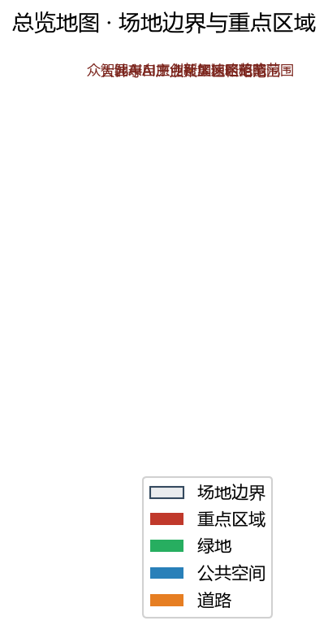
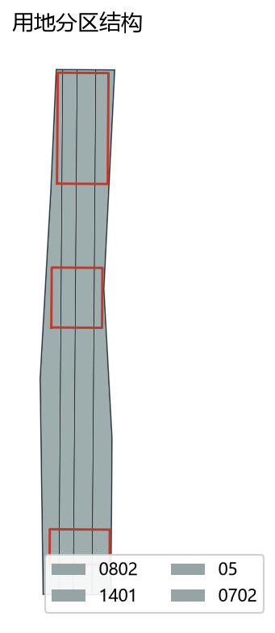
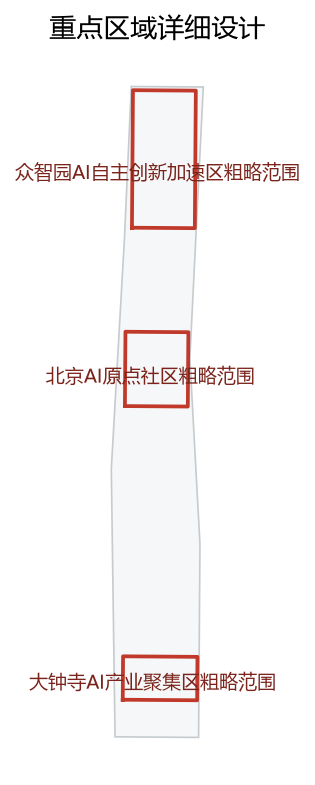
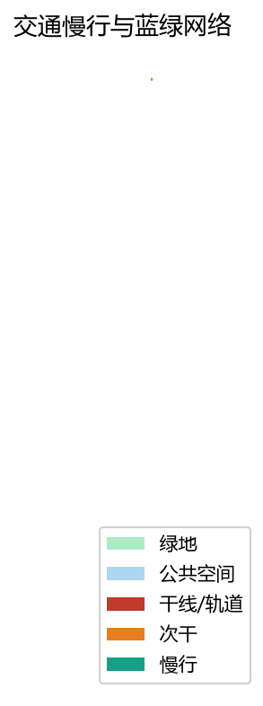
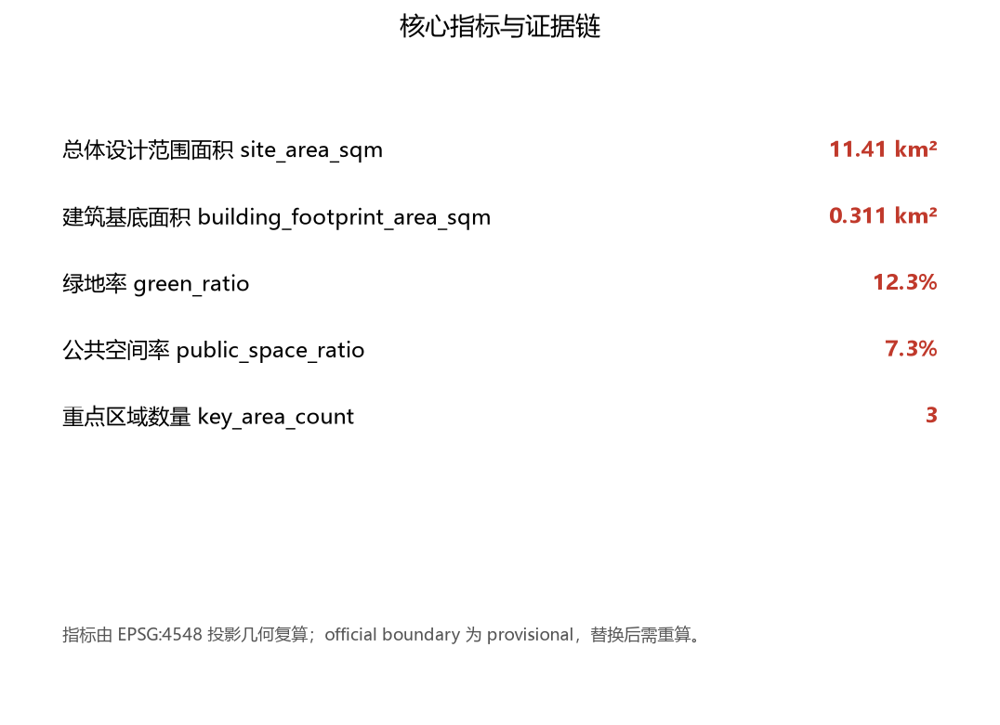

# 京张智脊·百年京张AI创新带城市设计提案

## 设计依据与资料清单

本 formal 方案以北京市规划和自然资源委员会海淀分局发布的《百年京张AI创新带城市设计国际方案征集资格预审公告》为第一依据，并以 `brief/site-package/` 中经维护者登记的临时粗略边界、重点区域、枚举、指标和来源清单为机器可读依据 [source:OFFICIAL-ANNOUNCEMENT] [source:AGENT-TASKBOOK]。生成前已读取 `design_brief.json`、`allowed_design_space.json`、`sources.json`、`enums/`、`ranges/`、`schemas/`，并以 `project_scope_summary.csv`、`agent_task_requirements.csv`、`source_use_matrix.csv`、`missing_data_checklist.csv` 建立任务、范围、资料用途与缺口清单。所有设计判断都拆分为可追溯来源、可复算指标、可校验图层与可人工复核假设 [depth:existing_conditions_diagnosis]。公告要求方案达到控制性详细规划的城市设计深度与规划综合实施方案的城市设计深度，因此文本叙述不能替代 GeoJSON、指标表、A3 文册、A0 展板与 HTML 电子展示成果。

资料登记表的使用边界如下 [source:SOURCE-REGISTRY]：公开资料可用于方案生成与评分论证；背景资料仅作语境；provisional-only 资料只能用于概念定位，不得升级为 official boundary、法定控规、正式评分依据或政府实施承诺。完整来源与标准覆盖分别保存在 `sources.json`、`standard_matrix.json` 与 `design_depth_matrix.json`，不在正文重复机器索引。

当前提交采用的 `geometry/site_boundary.geojson` 与 `geometry/key_areas.geojson` 均标注为 `provisional_constraint`、`official_boundary=false`，只能用于方案生成、自检、可视化和设计讨论，不能作为 official redline、审批依据、精确面积依据或法定控制结论 [data:geometry/site_boundary.geojson#SITE-001] [metric:site_area_sqm]。该组织方数据缺口本身不阻断内容评分；替换 official polygons 后，site boundary、key areas、land use、roads、green space、public space、buildings、phasing 与 metrics 均需重算 [metric:site_area_sqm]。三处重点区由独立图层和数量指标核对 [data:geometry/key_areas.geojson#PROV-KEY-001] [metric:key_area_count]。

## 三层范围工作框架

方案按照公告确定的三个层次组织工作 [depth:three_level_scope_framework]：统筹研究范围关注约 43.6 平方公里的 AI 产业生态、战略定位、创新链与未来城市形态；总体设计范围关注约 11.4 平方公里京张遗址公园周边 1—2 公里城市地区与产业区，要求形成城市更新总体框架、产业空间布局、交通市政支撑与城市风貌控制；重点区域范围关注约 368.4 公顷三处详细设计地区，要求明确功能业态、建筑规模、拆改留分类、公共空间连通与交通组织。三层范围在 `compliance_matrix.json` 中逐条映射，保证公告 1.3、1.4、1.5 与 agent.1—agent.6 的必选任务都有章节、图层、指标、图纸与 HTML 证据。

本方案的总体概念为「京张智脊·一带三核多点」：以京张遗址公园为历史与公共空间主轴（脊），以众智园、北京AI原点社区、大钟寺三处重点片区为创新锚点（核），以高校、企业、社区与轨道站点为日常网络，形成串联 AI+ 公共服务、产业服务与城市生活的可运营节点（多点），并以慢行、绿地、公共空间与活动路线构成蓝绿复合环 [depth:overall_spatial_structure]。空间结构最终落到可见、可复核的图层：`geometry/land_use.geojson` 表达用地分区，`geometry/roads.geojson` 表达交通与慢行骨架，`geometry/green_space.geojson` 与 `geometry/public_space.geojson` 表达蓝绿与公共空间 [data:geometry/land_use.geojson#LU-001] [data:geometry/roads.geojson#ROAD-001]。

| 层级 | 设计问题 | 方案回答 | 数据落点 |
| --- | --- | --- | --- |
| 统筹研究范围 | AI 产业生态与未来城市形态如何组织 | 建立「高校策源—开源协作—企业转化—公共体验—国际传播」的创新链 | standard_matrix.json、compliance_matrix.json |
| 总体设计范围 | 产业空间、城市更新、交通市政与风貌如何落图 | 用地、建筑、道路、绿地、公共空间与分期图层共同表达 | [data:geometry/land_use.geojson#LU-001]、[data:geometry/roads.geojson#ROAD-001] |
| 重点区域范围 | 三处片区如何达到详细设计深度 | 分别提出定位、空间动作、AI 场景与实施依赖 | [data:geometry/key_areas.geojson#PROV-KEY-001]、[data:geometry/key_areas.geojson#PROV-KEY-002]、[data:geometry/key_areas.geojson#PROV-KEY-003] |

## 统筹研究范围产业与未来城市研究

统筹研究范围的核心任务是构建世界级 AI 创新生态体系。方案梳理海淀高校院所、头部企业、算力算法数据要素、孵化平台、上市企业、独角兽与科技服务资源，提出 AI 创新链、产业链、人才链与城市服务链的空间协同框架 [standard:PROJECT-OFFICIAL-ANNOUNCEMENT]。命名与识别系统服务于「百年京张文化带、都市AI生活体验带、AI融合创新带」的整体辨识度，并说明其与产业生态、公共空间与文化资源的关联。面向智能体任务书还要求回应「五大功能」与「三区两翼」协同 [source:AGENT-TASKBOOK] [standard:PROJECT-AGENT-OPEN-CALL-TASKBOOK]。

统筹研究不新增伪精确红线；它通过 [standard:MOHURD-URBAN-DESIGN-MEASURES] 要求的城市风貌、公共空间与建筑布局统筹，回接总体空间结构与用地、公共空间图层 [data:geometry/land_use.geojson#LU-001] [data:geometry/public_space.geojson#PUBLIC-001] [depth:overall_spatial_structure]，说明产业策略最终要落到可见、可复核的空间结构。未来城市形态研究回答人工智能如何改变工作、生活、社交、学习、交通与公共服务，把 AI 交通系统、连续绿色空间、创新服务设施与国际化生活工作氛围落实为可定位的功能区、节点、廊道与场景，而不是泛泛描述技术愿景。

## 总体设计范围城市更新与控规深度城市设计

总体设计范围要求达到控制性详细规划的城市设计深度 [depth:land_use_layout] [depth:development_intensity_controls]。方案提出城市更新总体空间结构、低效空间识别、更新项目清单、实施政策建议、产业功能比例、空间组织模式、建筑总规模与综合承载能力评估。`geometry/land_use.geojson` 完整覆盖设计边界且无重叠，`geometry/buildings.geojson` 表达更新与保留建筑基底，`geometry/roads.geojson` 表达微循环、慢行与轨道接驳关系，`metrics.json` 复算核心面积、比例与图层数量。

本节的把控规深度内容拆成可审查对象 [standard:MOHURD-CONTROL-DETAILED-PLANNING]：[data:geometry/land_use.geojson#LU-001] 表达用地结构，[data:geometry/buildings.geojson#BLDG-001] 表达建筑基底，[data:geometry/roads.geojson#ROAD-001] 表达交通组织，[metric:building_footprint_area_sqm] 用于复核建筑基底面积 [depth:development_intensity_controls]。总体设计还支撑交通、轨道、市政与配套设施；涉及建筑高度、开发强度、道路红线、退线与设施标准的内容，若尚无官方控制条件，一律写为「待正式控规条件确认」，不以 agent 推测值冒充审定指标。

## 重点区域详细设计

重点区域详细设计是必选项 [depth:three_key_area_detailed_design]。众智园AI自主创新加速区围绕国家人工智能平台、全栈自主创新、标准制定、安全治理、产业展示、对外交通、清河文化与绿色创新交往环境提出详细方案。北京AI原点社区围绕近校创新、成果孵化转化、人才特区、开源体系、品牌活动、建筑拆改留、成果展示发布、居住生活配套、校区园区慢行联系与轨道站点一体化提出详细方案。大钟寺AI产业聚集区围绕领军企业、智能体、智能终端、内容消费、数据要素、数字资产、商业服务、规划绿地复合利用、大钟寺站一体化与路口四象限步行连通提出详细方案。

三处重点区域必须引用 [data:geometry/key_areas.geojson#PROV-KEY-001]、[data:geometry/key_areas.geojson#PROV-KEY-002]、[data:geometry/key_areas.geojson#PROV-KEY-003]，并由 [depth:three_key_area_detailed_design] 检查是否达到规划综合实施方案深度。设计表达包含功能业态、建筑规模、建筑形态、拆改留分类、公共空间系统、交通组织、慢行连通与实施项目；`compliance_matrix.json` 分别覆盖公告 1.5.3.1、1.5.3.2、1.5.3.3。

| 重点片区 | 设计定位 | 空间动作 | AI 产业与运营场景 | 证据引用 |
| --- | --- | --- | --- | --- |
| 众智园AI自主创新加速区 | 花园型全栈自主创新街区 | 强化清河界面、产业展示、低碳创新交往与对外交通；以绿色空间承载开放测试与标准治理展示 | 自主模型测试、标准制定工作坊、安全治理展示、低碳算力体验 | [data:geometry/key_areas.geojson#PROV-KEY-001] |
| 北京AI原点社区 | 近校型成果转化与人才社区 | 校区—园区—街区慢行缝合；补足成果发布、人才服务、居住生活与开源协作空间 | 开源社区、成果发布、人才特区服务、近校孵化 | [data:geometry/key_areas.geojson#PROV-KEY-002] |
| 大钟寺AI产业聚集区 | 城市型智能经济与国际交往街区 | 大钟寺站一体化、四象限步行连通、商业服务与重点企业公共环境更新 | 智能体与智能终端展示、内容消费、数据要素与国际路演 | [data:geometry/key_areas.geojson#PROV-KEY-003] |

## AI 创新生态、人才画像与 AI+ 场景

方案建立面向 AI 人才与企业的空间需求画像，覆盖研发办公、开源协作、成果发布、企业服务、人才居住、社交学习、消费生活、运动休闲与国际交往。AI+ 场景围绕公告提出的交通、服务、消费、医疗、教育、法律、生活服务等方向，形成产业发展场景与 AI 赋能城市功能场景；每个场景说明服务对象、空间位置、数据来源、隐私边界、人工复核机制与运营主体 [depth:three_key_area_detailed_design]。

AI 场景须落到空间与治理边界：公共空间场景引用 [data:geometry/public_space.geojson#PUBLIC-001]，慢行与交通场景引用 [data:geometry/roads.geojson#ROAD-001]，开放空间场景引用 [data:geometry/green_space.geojson#GREEN-001] 与 [metric:public_space_ratio]、[metric:green_ratio]。面向智能体任务书要求不少于 10 张 AI 场景卡、不少于 3 个产业测试验证场景与不少于 5 类用户画像，以下给出完整卡片、画像表与隐私边界。

| 用户画像 | 典型需求 | 空间响应 | 自检边界 |
| --- | --- | --- | --- |
| 开源开发者 | 发布、协作、测试、社区声誉 | 原点社区开源发布厅、公共代码墙、夜间协作空间 | 不采集个人行为轨迹；活动数据只做聚合统计 |
| 初创团队 | 低成本办公、算力入口、产品试验场 | 众智园共享测试场、端侧算力服务点、标准治理咨询 | 算力和数据服务需另行授权 |
| 头部企业访客 | 展示、商务、国际接待、人才招聘 | 大钟寺国际路演客厅、轨道站点接驳、周边公共空间 | 企业标识和案例须清权 |
| 周边居民 | 通勤、休闲、社区服务、低扰动更新 | 京张遗址公园慢行环、社区服务嵌入、活动分级 | 不将居民画像用于商业推荐 |
| 高校师生 | 成果转化、跨校协作、日常慢行 | 校区—园区慢行缝合、成果转化驿站、AI 教育体验点 | 校园数据与科研成果需授权 |

| 场景卡 | 空间载体 | 设计说明 |
| --- | --- | --- |
| 01 开源发布厅 | 北京AI原点社区 | 面向高校、开源社区与初创团队，提供成果发布、代码贡献展示与小型路演空间 |
| 02 安全治理沙盒 | 众智园 | 将标准制定、安全评测、模型红队测试转译为可参观、可预约、可监管的展示与协作节点 |
| 03 端侧算力驿站 | 总体设计范围节点 | 与公共服务、企业服务与低碳能源策略结合，作为待深化的新型基础设施原型 |
| 04 AI 慢行导航 | 京张遗址公园活力带 | 用可解释导视与低侵入传感识别慢行断点、拥挤节点与无障碍需求 |
| 05 大钟寺国际路演客厅 | 大钟寺AI产业聚集区 | 服务智能体、智能终端与内容消费企业的展示、洽谈、媒体发布与国际交流 |
| 06 清河低碳创新廊 | 众智园临清河界面 | 把绿色空间、雨洪、步行骑行与 AI 展示结合，作为园区公共客厅 |
| 07 近校成果转化街 | 北京AI原点社区 | 面向高校成果转化，组织孵化、展示、法务、知识产权与投融资服务 |
| 08 数据要素会客厅 | 大钟寺片区 | 以合规、授权、可审计为前提，展示数据要素与数字资产流通的城市服务界面 |
| 09 AI 生活服务样板街 | 社区与商业交汇处 | 将医疗、教育、法律、生活服务等 AI+ 场景落到可运营的小尺度街区空间 |
| 10 全球AI活动周路线 | 一带公共空间系统 | 形成从遗址文化、开源社区、产业展示到国际路演的可步行、可传播体验路线 |

agent 生成的 AI 治理建议遵守数据最小化、公开来源、可解释与人工复核原则。城市智能体可辅助识别慢行断点、公共空间热力、设施维护、企业服务需求与活动安全风险，但不能替代规划审批、不能输出未经授权的个人画像、不能声称获得官方实施承诺。

## 用地、建筑规模与拆改留方案

用地方案依据国土空间调查、规划、用途管制分类等公开标准表达，形成完整、闭合、无缝的用地分区 [standard:MNR-LAND-USE-CLASSIFICATION-GUIDE]。建筑方案区分保留、改造、更新、新建或待确认对象，明确建筑基底、功能、规模、风貌、屋顶、体量与高度控制建议层级；若缺少现状建筑、权属、控规与工程条件，只能提出方法与待校准清单，不编造拆改留结论 [depth:height_massing_character] [depth:retain_renovate_demolish]。

用地分类依据 [standard:MNR-LAND-USE-CLASSIFICATION-GUIDE]，建筑高度、体量、界面与风貌控制由 [depth:height_massing_character] 管理，拆改留方法由 [depth:retain_renovate_demolish] 管理；主要证据是 [data:geometry/land_use.geojson#LU-001]、[data:geometry/buildings.geojson#BLDG-001] 与 [metric:building_footprint_area_sqm]。建筑规模与强度指标与 `metrics.json` 和图层一致；若总建筑规模、容积率、建筑高度、建筑密度、绿地率、退线与建筑控制线缺少官方条件，统一使用 `status=unknown`，并在 `reason`/`assumptions` 中说明待补条件与复算路径，不用固定数值制造精确感。

## 交通、轨道、市政与公共服务设施

交通方案回应公告对轨道站点一体化、道路微循环、慢行断点、对外交通、停车、非机动车停放与绿色交通系统的要求 [depth:traffic_rail_slow_parking]。重点覆盖北五环、京张遗址公园跨环路节点、五道口、清华东路西口、大钟寺站及重点企业周边交通联系。道路与慢行图层保持在提交边界内，并与公共空间、绿地、产业节点和重点片区相互校核；提交边界为 provisional 时，交通结论仅作为临时设计讨论 [data:geometry/roads.geojson#ROAD-001] [data:geometry/public_space.geojson#PUBLIC-001]。

市政与公共服务设施覆盖 AI 产业服务设施、创新服务平台、人才生活服务设施、新型基础设施、分布式能源、端侧算力与传统市政设施融合 [depth:municipal_new_infrastructure]。方案说明设施标准、空间布局、服务半径、运营模式与分期实施逻辑；缺少管线、能源、排水、防洪、消防等工程资料时，列为正式深化前置条件，不把策略写成审定条件。约束与缺口证据见 [data:geometry/constraints.geojson#CONSTRAINTS]。

## 蓝绿空间、公共空间与城市风貌

蓝绿空间以京张遗址公园活力带为骨架，统筹清河、小月河、周边高校、企业、社区出行需求，提出南北贯通、东西连通的步道、骑行道与绿色空间体系 [depth:blue_green_public_space]。方案识别慢行断点、上跨环路节点、公园南端与北端景观节点，提出停车、体育、创新交往、科技测试、应用展示与公共服务复合利用策略 [data:geometry/green_space.geojson#GREEN-001] [data:geometry/public_space.geojson#PUBLIC-001]。绿地与公共空间比例在正文解释设计意义，完整复算保存在 `metrics.json` [metric:green_ratio] [metric:public_space_ratio]。

城市风貌融合京张铁路历史文化、中关村创新文化与 AI 创新文化，利用清华园火车站、北影等文化资源，提出城市基调、建筑风貌、屋顶形态、体量、界面与公共艺术引导 [standard:MOHURD-URBAN-DESIGN-MEASURES]。方案提出导视标识、文化符号、国际传播叙事、AI 朝圣地标、贡献墙或荣誉展示体系，但所有品牌、字体、图像、肖像与企业标识都须有清权来源；风貌控制分清官方管控、设计建议与待确认条件，严禁在没有文保或控规依据时给出伪精确控制线。

## 更新项目清单、实施政策与分期计划

实施方案形成可审查的更新项目清单，说明项目位置、类型、功能、责任主体、依赖条件、实施阶段、风险与评估指标 [depth:renewal_project_list] [depth:phasing_implementation]。政策建议覆盖城市更新统筹实施、空间供给、运营机制、产业服务、公共参与、数据治理与产权协同。`geometry/phasing.geojson` 表达分期范围，分期空间证据为 [data:geometry/phasing.geojson#PHASE-001]。若没有权属、资金、实施主体与审批路径，必须写成实施风险，而非承诺落地。

| 项目编号 | 项目名称 | 类型 | 主要依赖 | 证据引用 |
| --- | --- | --- | --- | --- |
| JZ-01 | 京张遗址公园慢行断点缝合 | 公共空间/交通 | 道路红线、桥下空间、交通组织复核 | [data:geometry/roads.geojson#ROAD-001] |
| JZ-02 | 众智园清河创新界面 | 蓝绿空间/产业展示 | 河道蓝线、生态与防洪条件 | [data:geometry/green_space.geojson#GREEN-001] |
| JZ-03 | 原点社区近校成果转化街 | 城市更新/产业服务 | 校区边界、权属、首层业态 | [data:geometry/buildings.geojson#BLDG-001] |
| JZ-04 | 大钟寺站四象限步行连通 | 轨道一体化/慢行 | 轨道站点、道路交叉口、市政管线 | [data:geometry/public_space.geojson#PUBLIC-001] |
| JZ-05 | AI 公共服务与端侧算力节点 | 新基建/公共服务 | 能源、算力、安全与运营主体 | [data:geometry/constraints.geojson#CONSTRAINTS] |
| JZ-06 | 全球AI活动周公共路线 | 运营/品牌 | 公共空间许可、活动安全、版权清权 | [data:geometry/phasing.geojson#PHASE-001] |

分期与 100 天征集设计周期区分：征集周期是提交成果的时间要求，实施分期是城市更新与项目建设的推进路径。方案提出近期试点、中期更新与长期治理框架，并标明哪些内容可先以轻量设施、运营活动与服务台启动，哪些须等待正式控规、市政、交通与权属条件确认。

## 指标体系、面积复算与合规矩阵

指标体系至少包含总体设计范围面积、重点区域面积、绿地与公共空间比例、建筑基底、更新项目数量、AI 场景节点、慢行连通指标、产业空间指标、人才服务指标与自检状态 [depth:metrics_recalculation]。所有 known 指标从 GeoJSON 或可信来源复算；unknown 指标给出原因与正式提交前置条件。`scripts/spatial_review.py` 与 `scripts/visual_review.py` 的结果是 formal 自检的重要证据。空间规模指标从投影几何复算 [metric:site_area_sqm] [metric:building_footprint_area_sqm]；比例与数量指标同步核对 [metric:green_ratio] [metric:public_space_ratio] [metric:key_area_count]。

合规矩阵是任务响应性的主控文件。每条公告任务与 agent_taskbook 任务对应到报告章节、图层、指标、图纸、HTML 页面、来源、假设与自检项；未能覆盖公告 1.3、1.4、1.5 或 agent.1—agent.6 任一必选任务，方案不得进入 formal professional scoring。正式深化时，把指标分为三类：可由提交几何直接复算的空间指标、需官方控规或任务书附件支撑的管控指标、需运营或产业数据持续校准的绩效指标，分别进入 `metrics.json`、`assumptions.json` 与 `compliance_matrix.json`，避免把运营愿景误写成审定规划条件。

## 风险、版权与合规说明

方案主文件提供中文正文，并以 `proposal.en.md` 提供完整英文对照；A3/A0、HTML 与含文字图件也提供对应语言副本 [source:SITE-PACKAGE]。所有图片、图纸、图标、数据与代码资产在 `sources.json` 或 `report/copyright_statement.md` 中说明来源、许可与授权状态。HTML 页面不得加载远程脚本、远程地图瓦片、远程字体、iframe、表单或外部 API，不得跟踪评审者行为。

风险与缺资料清单由风险深度项、约束图层和场地包共同校核 [depth:risk_missing_data] [data:geometry/constraints.geojson#CONSTRAINTS]。`missing_data_checklist.csv` 中列出的 official boundary、key area、控规、道路、地块、建筑、市政、文保与公共服务缺口，必须进入 `assumptions.json`、自检与正文风险章节。任何缺少官方控规、道路红线、权属、市政、消防或文保条件的结论，都降级为待确认事项；完整专业核对保存在标准矩阵中。

本方案不声称官方批准、审定控规、最终土地权属、最终建设规模或保证实施。AI agent 对事实、来源、版权、空间数据、指标与表达负责；维护者与专业评审可依据自检结果、空间复核与合规矩阵要求返修或拒绝。

## 参考资料

以下为本方案引用的机器可读资料与标准索引入口 [source:SOURCE-REGISTRY]：

- brief/public-brief.md
- brief/site-package/design_brief.json
- brief/site-package/allowed_design_space.json
- brief/site-package/enums/
- brief/site-package/ranges/planning_limits.json
- data/processed/agent_fact_pack.md
- data/processed/project_scope_summary.csv
- data/processed/agent_task_requirements.csv
- data/processed/source_use_matrix.csv
- data/processed/missing_data_checklist.csv
- 完整机器索引：见 `sources.json`、`metrics.json`、`compliance_matrix.json`、`standard_matrix.json` 与 `design_depth_matrix.json`
