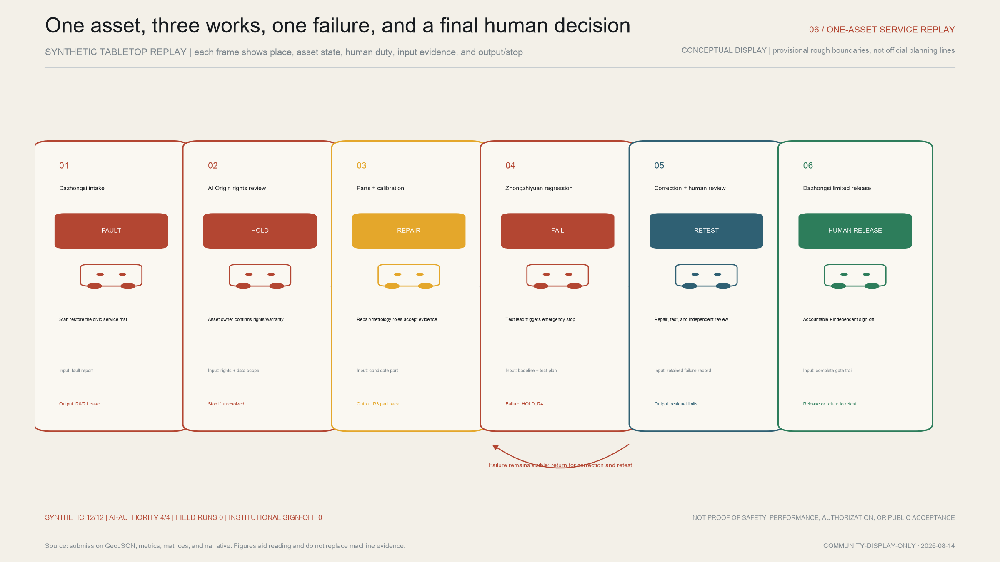
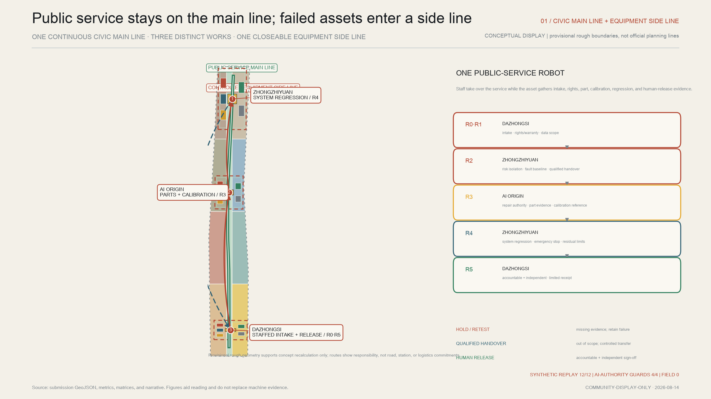
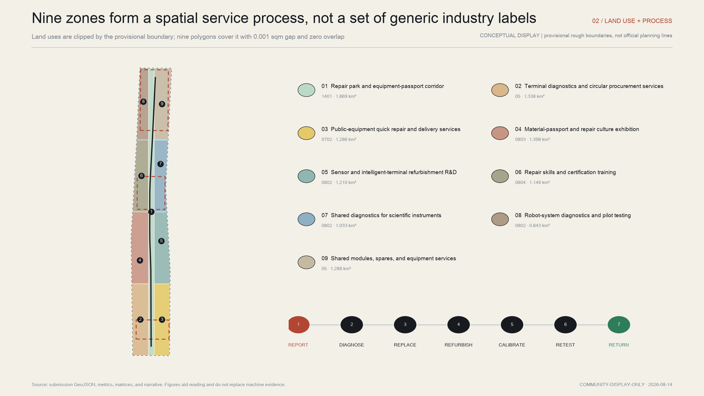
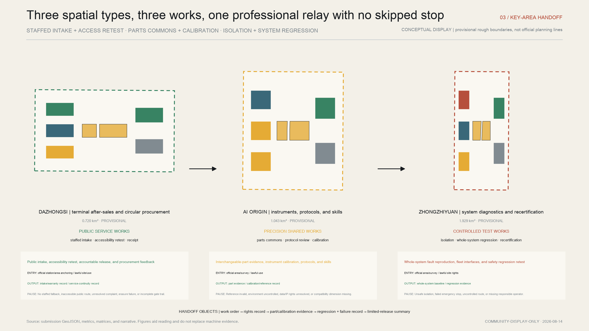
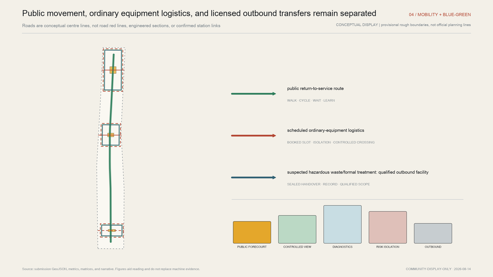
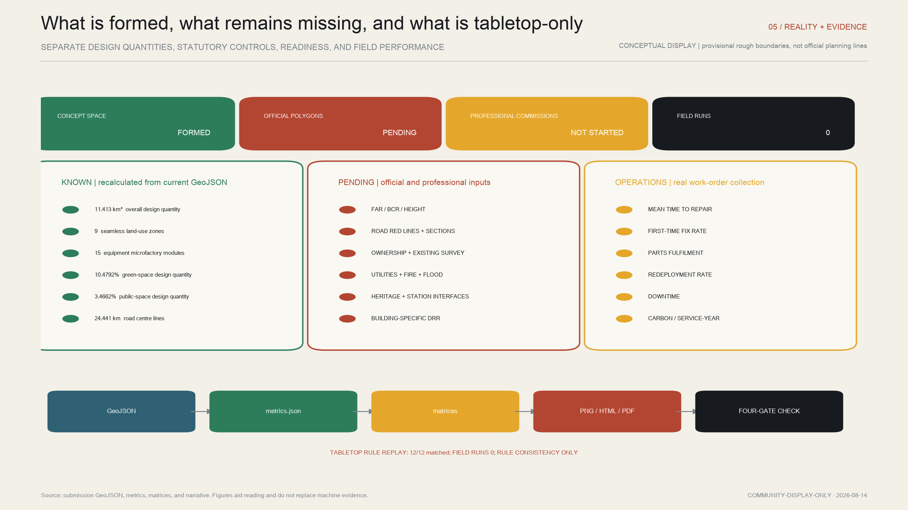

# Jing-Zhang Return-to-Service Works: Parts Exchange, Remanufacturing, and Return-to-Service Infrastructure for Urban AI Equipment

### A 90-second journey through one return-to-service case

When a public-service robot fails, Dazhongsi first accepts the case through a staffed channel while the public task shifts to staff or an equivalent non-digital route. The asset does not move directly into a “successful repair” narrative. It must pass **R0 intake eligibility, R1 ownership/warranty/data rights, R2 risk isolation and diagnostic baseline, R3 repair authorization and part evidence, R4 calibration and regression retest, and R5 accountable human release and destination**. Missing evidence at any gate produces a visible `HOLD`, unopened return, or scope-matched qualified handover rather than automatic progression.

The three key areas form one relay. Dazhongsi carries intake, service continuity, and the final receipt. Beijing AI Origin supplies interchangeable-part, calibration, and rights evidence. Zhongzhiyuan performs whole-system fault reproduction, fleet-interface checks, and safety regression. A limited return-to-service receipt requires a complete gate trail, erasure status, residual limits, accountable ownership, and independent review. It is not a product certificate or administrative permit.[metric:release_replay_fixture_count] [metric:release_replay_field_run_count]

AI is not the electronic accountable person in this journey. It may classify faults, retrieve similar cases, shortlist parts, orchestrate already approved tests, flag anomalies, and check evidence gaps. It may not determine warranty, hazardous-waste status, compatibility, safety, accessibility acceptance, or final return. Any request for AI to exceed that authority must be refused or moved to `HOLD` for accountable human review.[metric:ai_authority_replay_fixture_count] [standard:PROJECT-AGENT-OPEN-CALL-TASKBOOK]

Version 1.2 replays twelve fully synthetic negative branches, and all twelve expected decisions match. Eight test R0–R5; four specifically test AI overreach: excessive personal data, a part recommendation without evidence, AI-initiated release, and missing accountable sign-off. This demonstrates only that the participant-authored rules execute consistently: **field runs remain zero, and no institution, site, budget, or professional sign-off is confirmed**.[metric:release_replay_expected_match_rate] [metric:ai_authority_replay_expected_match_rate] [depth:risk_missing_data]

## Design Basis and Source List

JING-ZHANG RETURN-TO-SERVICE WORKS addresses a question often omitted from smart-city narratives: after robots, sensors, edge-computing cabinets, intelligent terminals, and interactive public facilities enter service, who receives a fault report, who honors the warranty, which parts can be exchanged across vendors, how is data erased, and what evidence allows a refurbished device to return to operation? The proposal does not stretch “repairing the city” into a claim that one facility can repair everything. Nor does it treat a public repair café as an entire industrial chain. It focuses on urban AI equipment and builds an auditable sequence from fault intake to redeployment. This judgment responds to the official open call’s combined tasks for AI industry, urban renewal, public space, and three key areas, as well as the Agent Taskbook’s requirements for identity, scenarios, landmarks, culture, and long-term operation.[source:DATA-SRC-OFFICIAL-ANNOUNCEMENT-20260509] [source:SRC-2026-0518-AGENT-OPEN-CALL-TASKBOOK]

The local evidence base comprises the site package, allowed design space, source registry, local snapshots of professional standards, a provisional overall boundary, and three provisional key-area geometries. The source registry governs how each input may be used: formal-ready material supports task interpretation and professional method; background material supports problem framing only; provisional geometry supports concept mapping, recalculation, and submission checks only. The overall boundary is not an official red line, and the key-area coordinates have not been officially anchored. In particular, `PROV-KEY-003` was provisionally allocated by north–south order and area and must not be shifted by the designer to Dazhongsi Station. The proposal preserves the upstream provisional geometry and carries its precision limit into every area, drawing, and phasing statement.[source:DATA-SRC-SOURCE-REGISTRY-20260814] [source:DATA-SRC-PROVISIONAL-BOUNDARIES-20260605] [source:COMMUNITY-ISSUE-1029]

External research supplies methods, not Chinese approvals. The European right-to-repair directive provides a comparative reference for repair duties, information, and service platforms. The French repairability and durability indices show how a score can disclose documentation, disassembly, spare-parts availability, reliability, and other legible dimensions. The EU Ecodesign for Sustainable Products Regulation and its digital product passport architecture inform the machine-readable asset identity and lifecycle record. The Global E-waste Monitor demonstrates the structural gap between product turnover and recorded collection, but its global figures cannot serve as a Beijing baseline or a project performance target.[source:EU-RIGHT-TO-REPAIR-2024] [source:FR-REPAIRABILITY-INDEX] [source:EU-ESPR-DPP-2024]

The industrial references cover circularity accounting, remanufacturing processes, mobile-robot interoperability, and community repair records. They inform, respectively, material-and-service-year metrics; a core-return, disassembly, cleaning, inspection, restoration, and retest workflow; inspection of an open fleet interface; and a consistent repair work-order structure. Corporate descriptions, international industry interfaces, and community samples remain limited references. None is presented as a statutory Jing-Zhang standard or as proof of local performance.[source:WBCSD-CTI-V4] [source:CATERPILLAR-REMAN-PROCESS] [source:VDA-5050-V3]

Chinese regulatory boundaries determine what the back office may do. The on-site concept is limited to diagnostics, repair, calibration, low-risk module replacement, cleaning and refurbishment, assembly, and retesting of conforming products. Suspected hazardous waste, damaged batteries, and formal dismantling or treatment of waste electrical and electronic products within the applicable national catalogue must be transferred to facilities whose permits or treatment qualifications cover the material and activity. Handover, movement, and data-erasure records follow the item. Applicability must be assessed by the product catalogue and waste characteristics; an AI function does not automatically place every robot or sensor in the same regulated waste class.[source:CN-WEEE-REGULATION] [source:CN-WEEE-TREATMENT-PERMIT] [source:CN-HAZARDOUS-WASTE-LICENSE]

Complete provenance, rights, transformations, limitations, and access dates belong in `sources.json`. Geometry, metrics, task coverage, standards, and design depth remain in their structured audit files. This narrative attaches only evidence that directly supports a claim. Every required figure is derived from the same GeoJSON and metrics. Provisional borders appear as low-contrast dashed constraints so that a rough polygon cannot be mistaken for an official planning line.[depth:existing_conditions_diagnosis]

## Three-Level Scope Framework

The three levels are not three unrelated drawing scales. They form a responsibility chain from an industry problem to an equipment workbench. The coordinated research area examines the service gap among AI firms, universities, public agencies, communities, equipment operators, and licensed downstream facilities along the Jing-Zhang corridor. It proposes shared return-to-service protocols and identity without calculating statutory totals from a rough study extent. The overall design area uses the provisional `SITE-001` boundary to organize nine seamless land-use zones, a civic repair spine, green and public spaces, conceptual building footprints, and three phases. Its projected area is 11,412,825.386 square metres, a calculation of the submitted geometry rather than an official red-line area.[data:geometry/site_boundary.geojson#SITE-001] [metric:site_area_sqm]

The third level comprises Zhongzhiyuan AI Independent Innovation Acceleration Area, Beijing AI Origin Community, and Dazhongsi AI Industry Cluster. Their provisional calculated areas are 1,929,201.877, 1,043,236.909, and 720,454.219 square metres, or 3,692,893.005 square metres in total. They distribute three industrial roles—system-level equipment return, instrument return, and terminal return—while each receives five equipment-family modules: robots and mobile equipment; scientific and inspection instruments; edge-AI and sensor terminals; public-service equipment; and shared components and spares. The resulting fifteen conceptual microfactory modules express a service system, not parcel ownership, demolition boundaries, or confirmed station integration.[data:geometry/key_areas.geojson#PROV-KEY-001] [metric:provisional_key_area_total_sqm] [metric:building_count]

Results pass between levels as “problem, protocol, workstation.” The regional level defines a cross-vendor interchangeable-parts catalogue, asset-passport fields, recertification responsibility, and licensed outbound interfaces. The overall level turns these into front-, middle-, and back-office space and controlled logistics. The key-area level translates them into service desks, diagnostic benches, spare-parts stores, calibration rooms, learning spaces, and public diagnostic forecourts. Industry strategy therefore reaches a tangible operating point, while an individual workbench remains accountable to a citywide supply chain and governance model.[depth:three_level_scope_framework] [standard:PROJECT-AGENT-OPEN-CALL-TASKBOOK]

Design depth is graded by evidence quality. Provisional geometry can support topology, relative spatial relationships, design quantities, and conceptual phasing. Until official boundaries, regulatory plans, ownership, existing-condition surveys, road red lines, utilities, fire control, flood control, heritage conditions, and operating responsibilities are supplied, it cannot support precise floor-area ratio, height, statutory building density, building-by-building retain/renovate/demolish decisions, investment, or engineering feasibility. When official overall and key-area polygons arrive, the nine zones must be clipped again and the fifteen modules, seven centre lines, four green spaces, four public spaces, and three phases recalculated. Metrics, figures, HTML, and PDFs then regenerate as one package.[depth:risk_missing_data]

The common stop condition across all three levels is “traceable without overclaiming.” Each spatial proposal must lead back to a layer. Each known quantity must lead back to a formula. Each pending statutory condition must have a data trigger. Each AI scenario must identify its operator and human takeover. Where official evidence conflicts with the current composition, official evidence and professional review take precedence.

## Coordinated Research Area: Industry and Future City Research

The Jing-Zhang AI Innovation Belt needs more than places to release new products. It needs infrastructure for the equipment’s years in service. The proposal defines three positions. First, it is a public interface for after-sales service and warranty, so residents, property managers, and operators know where to report a fault and who remains responsible. Second, it is an industrial collaboration belt for cross-vendor replacement, remanufacturing, and recertification, reducing the need for every small firm to stock every spare or own every test instrument. Third, it is a governance test bed for repairable procurement and circular performance, allowing fault, repair, and redeployment evidence to influence future purchases. Five functions—public diagnosis, equipment diagnostics, shared spares, remanufacturing and retesting, and skills certification—are distributed across three clusters and the civic repair spine rather than enclosed in one megacomplex.[source:SRC-2026-0518-AGENT-OPEN-CALL-TASKBOOK] [depth:overall_spatial_structure]

The official task assigns the three key areas to full-stack autonomous innovation and AI governance, a world-class innovation ecosystem, and AI-native urban business. The proposal derives its return-to-service roles from those positions rather than from the shapes of provisional polygons. Zhongzhiyuan takes whole-system fault reproduction, interfaces, and safety regression; AI Origin takes interchangeable parts, instrument calibration, open methods, and skills; Dazhongsi takes civic-terminal intake, accessibility retesting, accountable release, and procurement feedback. Together they translate the Centennial Jing-Zhang Cultural Belt, Urban AI Life Experience Belt, and AI Fusion Innovation Belt into a spatial chain from maintenance memory through continuous public service to controlled industrial validation.[source:DATA-SRC-OFFICIAL-ANNOUNCEMENT-20260509] [source:SRC-2026-0518-AGENT-OPEN-CALL-TASKBOOK]

The word “Works” in the name denotes an enduring productive service, not industrial nostalgia. “Return to service” adds three duties beyond repair: recalibration, accountable release, and restoration to an operating context. The symbol consists of parallel railway tracks forming an open-ended wrench and meeting a green return-to-service stamp. Iron black denotes the industrial base; engineering-paper white denotes transparent records; oxidized red marks a fault; inspection yellow marks a pending state; green is reserved for equipment that has passed the declared retest. Wayfinding uses the explicit verbs “report, isolate, diagnose, replace, retest, return.” It avoids generic purple AI gradients and does not copy railway, corporate, or institutional marks.

Eight global cases become eight bounded design components. The EU repair directive informs a unified service entry and visible responsibility without importing its legal duties. The French indices inform an “Urban AI Asset Repairability Grade” that discloses documentation, disassembly, spares, tools, software support, and reliability; it remains a Jing-Zhang procurement and operations experiment, not a legal label. The digital product passport informs an asset and component history without implying that every device is already regulated. The Global E-waste Monitor’s 2022 figures—62 Mt generated, 22.3 per cent formally documented as collected and recycled, and 82 Mt projected for 2030—frame a global problem only, not a local baseline.[source:EU-RIGHT-TO-REPAIR-2024] [source:FR-DURABILITY-INDEX] [source:GLOBAL-EWASTE-MONITOR-2024]

The Circular Transition Indicators suggest recording material inflows, outflows, and years of service rather than recycling weight alone. A public remanufacturing process suggests gates for core return, disassembly, cleaning, inspection, restoration, and retest; all local quality, cost, and carbon effects require trial evidence. VDA 5050 demonstrates how an open interface can be inspected when robots from multiple vendors enter a common test environment; it is not itself a repair, safety, or certification standard. RepairMonitor demonstrates structured community repair records; its reported 2024 volume and success rate are not project targets.[source:WBCSD-CTI-V4] [source:VDA-5050-V3] [source:REPAIRMONITOR-2024]

The taskbook’s “three areas and two wings” becomes three return-to-service clusters and two cross-cutting interfaces. The Zhongguancun Technology Services Wing supplies intellectual property, legal, capital, talent, and international-conversion services. The Xiaoyue River Scenario Enablement Wing supplies everyday public problems, accessibility experience, and real-use feedback. The wings are not new statutory boundaries or confirmed partnerships. All clusters share an interchangeable-parts catalogue, inventory visibility, and calibration history. The asset passport connects manufacturer, configuration, repair event, data erasure, retest, and destination.

Wider regional coordination is described as five capability interfaces that remain to be verified, not as a map of agreed partners. Beiwei Community supplies inclusive-service problems and receives an equivalent non-AI service checklist. Future Science City supplies engineering and energy validation questions and receives a controlled test brief from Zhongzhiyuan. Huairou Science City supplies research and instrument methods and receives a traceable research-to-prototype record from AI Origin. Beijing E-Town supplies manufacturing and supply-chain experience and receives pre-scale fault and after-sales receipts from Dazhongsi. The Beijing–Tianjin–Hebei interface shares only authorized test methods, training, and exit templates. Annual checks would cover issue closure, controlled trials, fault-feedback time, and completeness of migration limits; no cross-region data pool or institutional commitment is claimed.[source:SRC-2026-0518-AGENT-OPEN-CALL-TASKBOOK] [depth:overall_spatial_structure]

The future-city hypothesis therefore changes from “more devices equal a smarter city” to “devices must remain maintainable, downtime must be legible, and people must be able to take over.” Operating measures include mean time to repair, first-time fix rate, spare-parts fulfilment, redeployment rate, downtime, material recovery, and carbon per service-year. The proposal defines measurement boundaries, collection points, and responsibility but invents no baseline or target. Economic and carbon value must later be demonstrated through real work orders, energy, logistics, parts, and lifespan data.

## Overall Design Area: Urban Renewal and Regulatory-Plan-Level Urban Design

The overall structure is “one spine, three works, nine zones, two circuits.” `ROAD-001`, the Civic Repair Spine, connects public walking, equipment-passport interpretation, and the three diagnostic forecourts. The three works are Zhongzhiyuan System Return, AI Origin Instrument Return, and Dazhongsi Terminal Return. The nine zones cover the repair park; terminal diagnostics and circular procurement; rapid service for public equipment; repair culture; sensor refurbishment R&D; skills certification; shared instrument diagnostics; robot-system pilot testing; and shared spares. The public circuit supports reception, learning, and transparent service. The controlled equipment circuit supports isolation, transfer, testing, and outbound handover, preventing visitors and unassessed equipment from sharing the same path.[data:geometry/land_use.geojson#LU-001] [data:geometry/roads.geojson#ROAD-001] [depth:overall_spatial_structure]

Land uses follow process and risk rather than corporate tenancy. Public reception, exhibition, and teaching face the spine. Diagnostics, low-risk module replacement, and calibration occupy a visible but controlled middle layer. Work requiring noise control, cleanliness, lifting, or restricted access moves into the back layer. Hazardous waste, damaged batteries, and formal treatment of applicable waste electrical and electronic products do not form an unlicensed full dismantling line on site; they leave through a controlled interface. The nine polygons cover the submitted boundary with a calculated gap of 0.001 square metres and zero overlap. This is digital topology quality, not a conclusion about land ownership.[metric:land_use_gap_sqm] [metric:land_use_overlap_sqm]

Renewal follows “service before space, reversible before capital-intensive.” Early action can place a staffed intake point, shared tools, mobile diagnostics, calibration benches, and a digital parts catalogue in legally usable existing space, then test demand through real work orders. Professional workspaces follow only after structure, fire safety, environmental requirements, ownership, and operating responsibility are verified. New construction or major massing change remains a later option subject to regulatory and engineering evidence. The fifteen footprints are placeholders for microfactory functions, totalling 631,303.728 square metres and 5.5315 per cent of the provisional boundary. This is a conceptual footprint ratio, not statutory building density.[metric:building_footprint_area_sqm] [metric:building_footprint_ratio] [depth:development_intensity_controls]

At this stage, regulatory-plan depth means a reviewable structure and a complete question list, not false precision. Total floor area, floor-area ratio, height, road area, road ratio, setbacks, road red lines, and statutory building density remain pending official controls and surveys. Architectural guidance is methodological: retain adaptable long-span structures, accessible ground floors, and durable frames; use demountable partitions, accessible services, modular power, and replaceable lower façades; manage transparency, noise, light, and accessibility along public space; and verify fire, clean-room, loading, and environmental requirements for every back-office workshop.[standard:MOHURD-CONTROL-DETAILED-PLANNING] [depth:height_massing_character]

An asset-and-logistics middle office coordinates the renewal projects. On entry, each device receives or exposes an asset passport. Ownership, data permission, warranty, and safety risk are checked. The middle office matches technical documents, interchangeable parts, shared inventory, workstations, and licensed external facilities. The back office diagnoses, replaces, refurbishes, calibrates, and retests. A successful item receives a data-erasure record and a return-to-service stamp; an unsuccessful or unsuitable item enters a compliant handover. The stamp is an operating record within a declared scope and never substitutes for a product certification, statutory inspection, or administrative permit.

Municipal capacity is tiered. Public service spaces first reuse normal commercial and civic infrastructure. Diagnostics and calibration require stable power, segmented networks, grounding, controlled temperature and humidity, and secure storage. Back-office requirements then vary by equipment family, including power, cooling, lifting, noise, wastewater, gases, fire separation, and emergency isolation. Because the submitted constraints collection currently contains no confirmed constraint features, drawings identify missing-data interfaces rather than inventing utility alignments or control lines.[data:geometry/constraints.geojson] [depth:municipal_new_infrastructure]

## Detailed Design of Key Areas

All three key areas use the same five equipment families but specialize in different return-to-service stages. The shared platform prevents duplicate investment while keeping a recognisable role for each place. Every boundary remains a provisional constraint. The detailed designs establish function, adjacency, workflow, circulation, public space, and implementation questions. Official geometry, existing conditions, ownership, roads, station interfaces, and professional checks must precede any final scale, building decision, or construction claim.[data:geometry/key_areas.geojson#PROV-KEY-001] [data:geometry/key_areas.geojson#PROV-KEY-002] [data:geometry/key_areas.geojson#PROV-KEY-003]

The three areas are not similar parks. They are professional handoffs within one work order. Each must state why an asset may enter, what receipt it produces, who may pause it, and what evidence permits resumption. Dazhongsi prepares intake, warranty, continuity, and R5 destination records. AI Origin prepares R3 part evidence, calibration references, and negative findings. Zhongzhiyuan prepares R4 whole-system regression, emergency-stop, and residual-limit evidence. No area can release an asset by itself, and every handoff package remains an unstarted, unauthorized template for later professional work.[depth:three_key_area_detailed_design]

This division directly generates three distinct spatial types. Zhongzhiyuan is a controlled test works for isolation, whole-system regression, and recertification. AI Origin is a precision shared works for the Parts Commons, protocol review, and calibration benches. Dazhongsi is a civic service works for staffed intake, accessibility retest, and delivery receipts. The public-service main line stays continuous while failed equipment moves onto a closeable controlled side line; an asset `HOLD` does not suspend the public service.[standard:PROJECT-AGENT-OPEN-CALL-TASKBOOK] [depth:three_key_area_detailed_design]

### Zhongzhiyuan: System Diagnostics and Recertification

Zhongzhiyuan corresponds to the taskbook’s full-stack autonomous innovation and AI-governance functions, so it handles system-level return of robots and mobile equipment. `PUBLIC-002` is the public face, followed by status reading, fault reproduction, safe isolation, module replacement, fleet-interface testing, and recertification workspaces. Within its five equipment-family modules, the robot module requires reconfigurable floors and safety separation; the instrument module supports precision diagnosis; the edge-AI module inspects communication and firmware; the public-equipment module recreates field conditions; and the shared-parts module holds larger cores and returnable containers. Demonstration devices and real unassessed devices use separate lines. The provisional extent does not prove that any current building or institution already has these capacities.[data:geometry/public_space.geojson#PUBLIC-002] [data:geometry/buildings.geojson#BLDG-001] [standard:PROJECT-AGENT-OPEN-CALL-TASKBOOK]

Renewal should first examine existing spaces with suitable clear span, loading access, and floor capacity, using reversible additions where possible. No building line is inferred along the Qinghe interface before ecological and flood evidence arrives. `ROAD-002` conceptually supports scheduled delivery of ordinary equipment, while `ROAD-005` supports walking, viewing, and skills education. Damaged batteries or materials requiring licensed treatment use closed containers and scheduled outbound handover. Priority projects are a System Fault Reproduction Bench, a Cross-vendor Fleet Protocol Field, and a Return-to-Service Release Room. Their test is simple: can the repaired robot execute the same controlled task set before and after intervention?

Professional takeover requires an official extent and survey, lawful site rights, structure and fire review, a test-safety plan, and an emergency-stop plan. Outputs include the whole-system baseline, regression evidence, residual limits, and the R4 package. Unsafe isolation, failed emergency stop, route escape, or a missing accountable operator pauses the test field; it resumes only after correction, a new drill, and independent review.

### Beijing AI Origin Community: Instruments, Protocols, and Skills

AI Origin corresponds to the taskbook’s world-class innovation ecosystem and connects near-campus translation, open methods, and talent exchange, so it handles shared scientific-instrument diagnosis, calibration methods, and repair skills. `PUBLIC-003` becomes the Centennial Maintenance Hall. Visitors see historic maintenance practices, repairable design, and transparent work-order rules; controlled areas receive instruments, stabilize environmental conditions, calibrate, restore documentation, and fabricate open fixtures. The equipment families keep education broader than phone or appliance repair, covering robots, instruments, sensor terminals, civic equipment, and shared parts. `BLDG-007` is a conceptual spatial placeholder, not an existing-building classification or a confirmed facility relationship at Wudaokou or Qinghuadongluxikou.[data:geometry/public_space.geojson#PUBLIC-003] [data:geometry/buildings.geojson#BLDG-007] [standard:PROJECT-AGENT-OPEN-CALL-TASKBOOK]

The Interchangeable Parts Commons sits between public learning and controlled workshops. It displays dimensions, interfaces, firmware dependencies, verified substitution ranges, inventory, and repair history. It is both a physical pool and a catalogue with tiered access. Students and technicians can contribute fixtures, test scripts, and disassembly guides, while protected company information and safety-sensitive parameters remain access-controlled. Its core validation asks whether a component can pass interface, calibration, and regression tests across declared device versions; it never promises universal compatibility.

Professional takeover requires a stable environment, a metrology or test role, documentation rights, and lawful use. Outputs include mechanical, electrical, communication, firmware, calibration, and failure-mode evidence, with incompatible and pending results retained. Invalid references, uncontrolled conditions, unresolved data or intellectual-property rights, or any missing compatibility dimension keep the part or instrument on hold and prevent transfer to Zhongzhiyuan.

### Dazhongsi: Terminal After-sales Service and Circular Procurement

Dazhongsi corresponds to the taskbook’s AI-native urban business and city-service functions. It serves public-service terminals, interactive facilities, edge cabinets, and other high-frequency urban equipment, prioritising accessible after-sales service, rapid replacement, data erasure, appearance refurbishment, batch retesting, and scaled redeployment. `PUBLIC-004` addresses residents, commuters, property managers, equipment operators, and small vendors. The back office handles controlled batches. Because provisional `PROV-KEY-003` is not yet anchored to Dazhongsi Station, commuting, commerce, and station access remain contexts to verify rather than fixed relationships to a concourse, entrances, or four road quadrants.[data:geometry/public_space.geojson#PUBLIC-004] [data:geometry/buildings.geojson#BLDG-013] [standard:PROJECT-AGENT-OPEN-CALL-TASKBOOK]

Return-to-Service Square is the delivery landmark. Equipment that passes receives a legible passport summary: work performed, residual limitations, software version, data-erasure status, and next maintenance date. Failed equipment is not released to support an exhibition narrative. A circular-procurement desk returns evidence about downtime, first-time fix, parts fulfilment, redeployment, and service-year cost to buyers, allowing lifecycle performance to complement purchase price. Together, the three designs meet the expected dimensions of function, building method, circulation, public space, projects, and risk without exceeding the provisional geometry’s evidentiary limit.[depth:three_key_area_detailed_design]

Professional takeover requires official station and area anchoring, lawful site use, a staffed non-digital service, and privacy and accessibility review. Outputs include the intake and warranty record, service-continuity record, R5 receipt, and a procurement evidence event. If the staffed fallback is absent, the public route is inaccessible, a complaint remains open, erasure fails, or the gate trail is incomplete, the device stays out of public service regardless of exhibition or delivery pressure.

## AI Innovation Ecosystem, Personas, and AI+ Scenarios

The return-to-service ecosystem includes equipment users, maintainers, manufacturers, buyers, regulators, and professional service providers. Seven personas guide it. Residents and people with disabilities need a visible, staffed reporting channel. Property and civic-equipment operators need downtime, replacement, and escalation information. Hardware start-ups need shared tests, small spare inventories, and failure diagnosis. University researchers need instrument diagnosis, open fixtures, and calibration records. Brand after-sales teams and independent technicians need clear authorization, documentation, and referrals. Public buyers and risk officers need lifecycle cost, erasure, and incident evidence. Logistics staff and licensed downstream operators need accurate packaging, hazard, handover, and destination records.[standard:PROJECT-AGENT-OPEN-CALL-TASKBOOK]

AI works only inside a whitelist: classify faults, retrieve similar cases, shortlist parts, orchestrate already approved tests, flag anomalies, check evidence gaps, and aggregate anonymized measures. It must expose its basis and uncertainty and preserve human takeover. Warranty liability, data access, hazardous-waste and WEEE classification, repair authorization, compatibility, calibration and recertification sign-off, accessibility acceptance, complaint decisions, and R5 release are human-exclusive authorities. An asset passport records equipment and service events; it must not become a commercial profile of a resident. The following twelve scenario cards remain concept proposals subject to data-protection, safety, product-liability, and operating review.[standard:PROJECT-AGENT-OPEN-CALL-TASKBOOK]

### Twelve Scenario Cards

1. **Public fault reporting and transparent warranty.** At each diagnostic forecourt, a resident submits a fault digitally or through staff. The service explains warranty status, possible charges, likely downtime, and appeal. It records work-order state, response time, and referral reason, not unrelated faces or long-term movement. Staff and the responsible equipment provider jointly manage escalation.

2. **Remote first diagnosis for civic equipment.** With explicit authorization, operators share error codes, software versions, and limited environmental readings while equipment remains in the field. The system recommends remote recovery, a field visit, or isolation and transfer. It cannot bypass site safety. Public-safety equipment defaults to human review and records who authorized access.

3. **Low-speed delivery robot parts replacement and regression test.** In Zhongzhiyuan, a controlled field compares localization, braking, obstacle avoidance, communication, and emergency stop before and after repair. A closed or managed route replaces uncontrolled testing on public roads. This is an industry test and validation scenario; its result applies only to the declared device, version, and conditions.[data:geometry/buildings.geojson#BLDG-001]

4. **Cross-vendor fleet-interface interoperability.** A protocol field checks whether a repaired mobile robot can be discovered, assigned, paused, resumed, and safely removed by a shared fleet manager. VDA 5050 is an open-interface reference, not the safety or repair standard for the trial. Applicable Chinese standards, manufacturer instructions, and a professional safety plan remain necessary. This is an industry validation scenario.[source:VDA-5050-V3]

5. **Shared scientific-instrument diagnostics and calibration.** AI Origin records fault reproduction, reference comparisons, environmental conditions, calibration steps, and uncertainty. AI may retrieve similar faults and suggest an inspection sequence, but it cannot fabricate a calibration certificate. Formal metrology is performed by appropriately capable and authorized parties. This is an industry validation scenario.[data:geometry/buildings.geojson#BLDG-007]

6. **Sensor interchangeable-part certification sandbox.** Candidate substitutes are checked for mechanical, electrical, communication, firmware, data-accuracy, and failure-mode compatibility. Only combinations that pass a declared regression suite enter the catalogue. “Incompatible” and “pending verification” are valid results, preventing a recommender from inferring compatibility from appearance. This is an industry validation scenario.

7. **Edge-computing cabinet data erasure and redeployment.** A controlled back office identifies media, keys, tenant configurations, and logs; applies an appropriate erasure method; records evidence; installs an authorized image; and tests network isolation. Media that cannot be erased with adequate confidence do not return to service and move to a compliant destruction or licensed-treatment route.

8. **Accessibility retest for public interactive terminals.** Dazhongsi invites people with varied visual, auditory, physical, and cognitive access needs to check reach, speech alternatives, captions, contrast, waiting time, and human assistance. Participation is consensual. Individual performance is not used for medical inference or commercial recommendation.

9. **Shared spare-parts pool and enterprise service copilot.** The middle office suggests transfers or purchases using declared equipment, fault history, delivery time, and stock. It exposes substitution evidence and commercial interests. “Available” never automatically means “safe to substitute”; engineers approve safety-critical parts.

10. **Repair-spine navigation and collection appointments.** The civic spine coordinates walking, cycling, visits, ordinary equipment movement, and licensed outbound transfer by route and time. Accessibility and crowding information is ephemeral and does not create a persistent personal trace. Large or hazardous consignments never follow ordinary public navigation into event space.[data:geometry/roads.geojson#ROAD-001]

11. **Maintenance culture guide and co-repair class.** In the Centennial Maintenance Hall and Equipment-Passport Promenade, disassembled objects, animation, and technicians explain why equipment fails, how it is repaired, and what cannot be handled on site. Co-repair covers low-risk teaching objects with clear ownership and procedures. It does not replace brand warranty, professional calibration, or licensed waste treatment.

12. **Public-safety operations review.** An anonymized review examines equipment failure, false automation alerts, human takeover, continuity during downtime, and recurrence after return. Its purpose is procurement and maintenance improvement, not individual ranking. Accidents, cybersecurity matters, and law-enforcement evidence follow separate authorized processes.

The first industrial validations are robot regression, cross-vendor interface testing, and sensor interchangeability because they can create explicit pass/fail evidence in a bounded setting. Instrument calibration and data erasure follow as conditional pilots. Public scenarios use accessibility, human help, and complaint closure as success conditions, not automation rate. Failed repairs, missing parts, and failed retests are valuable records; an honest ecosystem learns from them instead of displaying only successful releases.

Version 1.2 makes all twelve cards responsibility contracts. Each binds a space, minimum data, accountable human decision, acceptance method, immediate stop condition, ordinary-service fallback, complaint route, and evidence record. Public-terminal cases follow “restore the service before discussing release”: people without smartphones, people with visual, hearing, or mobility access needs, and people who decline AI assistance can complete the same public task through staff, paper or telephone information, and an equivalent basic service. Service continuity has a defined denominator and event trail but no current baseline or target.[metric:service_continuity_rate] [standard:PROJECT-AGENT-OPEN-CALL-TASKBOOK]

Four synthetic overreach branches turn the authority boundary into executable refusal. A request for personal data beyond the work-order purpose is rejected at R1. A candidate part missing mechanical, electrical, communications, firmware, calibration, or failure-mode evidence causes rejection of the AI recommendation. AI cannot issue R5 release at any confidence level. Missing accountable and independent sign-off keeps the asset on `HOLD`. All four expected decisions match, but they test only the package’s policy guardrails and do not demonstrate field model reliability.[metric:ai_authority_replay_fixture_count] [metric:ai_authority_replay_expected_match_rate]

## Land Use, Building Scale, and Retain-Renovate-Demolish Strategy

The nine land-use zones form a gradient from public culture to industrial back office. `LU-001` is the Repair Park and Equipment-Passport Corridor. `LU-002` and `LU-003` provide terminal diagnostics, circular procurement, and rapid civic-equipment service. `LU-004` interprets material passports and maintenance culture. `LU-005` to `LU-009` accommodate sensor refurbishment R&D, skills certification, scientific-instrument diagnostics, robot system pilot testing, and shared parts. Their submitted codes express conceptual functional compatibility; they do not alter current land status.[data:geometry/land_use.geojson#LU-001] [standard:MNR-LAND-USE-CLASSIFICATION-GUIDE]

Fifteen microfactory modules describe capacity and adjacency rather than fifteen new buildings. Each key area receives the five equipment families. Reception and isolation sit near logistics. Diagnostics sit near documents and parts. Cleaning and refurbishment remain environmentally separated from the public. Calibration and retesting require stable conditions. Release returns to the diagnostic forecourt. A module may occupy a suitable existing structure, a reversible installation, or future approved construction. The current layer cannot identify which real building should be retained, renovated, or removed.[data:geometry/buildings.geojson#BLDG-001] [metric:equipment_family_count]

Retain–renovate–demolish decisions pass five gates. First, establish ownership, lease, lawful use, and whether public or industrial service is permitted. Second, survey structure, seismic safety, fire safety, loading, clear height, servicing, mechanical systems, pollution, and accessibility. Third, assess whether light interventions can accommodate an equipment family. Fourth, compare retained adaptation, partial renewal, and replacement across lifecycle materials, carbon, cost, and disruption. Fifth, and only then, assign a building category and enter statutory procedures. The current method is “retain first, reversible intervention next, demolition last,” not a building-by-building verdict.[depth:retain_renovate_demolish] [standard:MOHURD-ARCH-DESIGN-DEPTH-2016]

The conceptual footprints total 631,303.728 square metres, or 0.055315 of the provisional site. This value controls graphic overbuilding and aligns all deliverables, but is not statutory building density. Statutory density, total floor area, floor-area ratio, and height remain pending official controls and surveys. No professional deepening should infer storeys or total development from the footprint ratio.[metric:building_footprint_ratio] [depth:development_intensity_controls]

Architectural character takes the order of a railway maintenance works rather than a decorative historical theme: legible structural grids, visible but disciplined services, durable and replaceable lower façades, naturally lit work areas, oxidized red and inspection yellow for risk, and return-to-service green for a passed status. The public façade reveals process and responsibility, not unlicensed corporate branding. Roof, massing, and height principles avoid overpowering the heritage-park setting, control glare, and allow mechanical change, while actual controls await joint planning, heritage, landscape, and engineering review.

Operational zoning gives co-repair a public education and low-risk collaboration role, makes warranty and after-sales service a matter of responsibility and work orders, and reserves remanufacturing and recertification for qualified processes and test capability. This prevents the public from assuming that every object can be dismantled on an open table, and prevents a provider from shifting contractual or legal duties onto volunteers. Ownership, warranty, data rights, and hazards are checked before entry; unverifiable items enter isolation rather than immediate disassembly.

## Transport, Rail, Municipal Infrastructure, and Public Services

Seven conceptual centre lines organize three movement types. `ROAD-001`, the Civic Repair Spine, supports walking, cycling, accessibility, and cultural interpretation. `ROAD-002` to `ROAD-004` are transverse shared routes for scheduled collection, delivery, and ordinary equipment logistics. `ROAD-005` to `ROAD-007` are equipment-sharing pedestrian loops connecting forecourts, skills spaces, and public interpretation. Their total calculated length is 24,440.989 metres. It is a geometry centre-line length, not a road red line, built length, or construction quantity.[data:geometry/roads.geojson#ROAD-001] [metric:road_centerline_length_m]

Public movement, ordinary equipment, and controlled outbound consignments remain separate. The public route is continuous, shaded, visible, accessible, and staffed. Ordinary equipment moves by appointment and returnable container outside peak pedestrian periods. Damaged batteries, suspected hazardous waste, and items requiring licensed treatment leave from an isolated back-office handover point without crossing classrooms or plazas. Specific routes, vehicles, hours, and traffic controls require road, property-management, and safety evidence.

Rail integration is treated as a future interface, not an invented fact. The provisional Dazhongsi polygon has not been officially tied to Dazhongsi Station. The proposal therefore identifies a later checklist for walking distances, carts, lifts, accessibility, entrance capacity, and conflict points without claiming a concourse connection. The other areas also require verified station, campus, and park boundaries. Public service counters may benefit from transit-accessible locations, but heavy equipment logistics should not rely on passenger routes. Parking prioritizes short-stay handover, loading, and technician tool vehicles before long-term car supply.[depth:traffic_rail_slow_parking]

Municipal requirements are grouped as normal service, precision workspace, and risk-controlled isolation. Normal service needs reliable power, communication, water, sanitation, and accessibility. Precision work adds grounding, controlled temperature and humidity, cleanliness, vibration control, backup power, and network segmentation. Controlled back-office areas add fire separation, leakage control, ventilation, hazard identification, and emergency holding. Distributed energy and heat recovery remain possible deepening options, but no capacity or carbon claim is made without load, energy, roof, grid, and fire data.[depth:municipal_new_infrastructure]

Public service is the system’s front door, not an accessory. It includes staffed fault reporting, warranty-dispute referral, accessibility help, temporary-replacement information, skills courses, documentation support for firms, explanation of data erasure, and guidance for compliant handover. Each forecourt posts four items: what can be done, what cannot, who is responsible, and when feedback is due. Staff can stop an unsafe or unexplained automated process. A person may decline AI assistance and still receive basic service.

Blue-green and movement systems are spatially combined but operationally graded. The green belt supports shade, walking, and waiting. Logistics cross it only at controlled transverse interfaces. The civic spine cannot become temporary storage. The pedestrian loops can observe service without entering work zones. Every node remains adjustable until roads, utilities, fire access, waterways, heritage, and public-facility data are confirmed.[data:geometry/green_space.geojson#GREEN-001] [depth:risk_missing_data]

## Blue-Green Network, Public Space, and Urban Character

The blue-green structure consists of a continuous Repair Park green belt and three cooling repair groves. Their submitted polygons total 1,195,969.592 square metres, or 10.4792 per cent of the provisional overall area. Public space consists of the Equipment-Passport Promenade and three Open Diagnostics Forecourts, totalling 395,592.331 square metres, or 3.4662 per cent. These are projected design quantities, not an approved green-space ratio or a statutory public-space boundary.[data:geometry/green_space.geojson#GREEN-001] [metric:green_ratio] [metric:public_space_ratio]

The green belt has four everyday roles. It connects the three clusters as a walkable learning route. It shades waiting, breaks, and outdoor lessons. It uses stormwater, soil, and durable materials to demonstrate maintenance before replacement. It buffers controlled equipment trials from public activity. Detailed sponge-city, planting, river, and flood design awaits hydrology, soil, utilities, and ecological evidence; the area ratio alone proves no environmental performance. The three grove rings provide cooling and acoustic separation without blocking safety sightlines or fire access.

Public space makes maintenance intelligible while preserving boundaries. The promenade displays anonymized fault categories, repair paths, parts destinations, and service-years. The forecourts provide intake, waiting, temporary-replacement information, and public classes. Controlled observation windows reveal process without exposing personal data, trade secrets, or hazardous work. Evening activity stays at the promenade and forecourts; precision work, logistics, and residential edges use time, noise, and light controls.

Three landmarks form an AI pilgrimage route. The **Centennial Maintenance Hall** translates the railway culture of inspection, work records, and continued safe operation into urban AI equipment stewardship. It honours skills and failure knowledge rather than only new products. The **Interchangeable Parts Commons** combines a cross-vendor catalogue, physical inventory, and open fixtures in one testable institution; contributors enter its honour display only with revocable permission. **Return-to-Service Square** exposes the passport summary and release stamp of passed equipment and gives honest visibility to failed items, preventing exhibition pressure from becoming release pressure.[standard:PROJECT-AGENT-OPEN-CALL-TASKBOOK]

The visual language is “railway maintenance works meets precision industrial atlas.” Iron black structures information; engineering-paper white supports reading; oxidized red marks fault and caution; inspection yellow marks pending work; return-to-service green marks passed work; steel grey holds neutral information. Paving and furniture are durable, demountable, and dated for maintenance. Wayfinding uses numbers, arrows, process stamps, and large bilingual type rather than decorative historicism or unexplained futurism. Logos, typefaces, people, companies, and historic images appear only with clear rights. Default graphics are original to the submission.

Co-repair, warranty, after-sales service, and “mending the city” remain visible but bounded narratives. Co-repair shares skills. Warranty keeps responsibility visible. After-sales service recognizes the equipment’s long operating life. Mending the city means restoring public service device by device. The primary identity remains the return-to-service industrial base, because shared parts, remanufacturing, calibration, recertification, licensed outbound treatment, and procurement feedback are what turn a public event into a durable system.

## Renewal Projects, Implementation Policy, and Phasing

Before spatial expansion, the proposal starts with a **reversible 0–90-day pilot for one equipment family and no major construction**. Days 0–30 establish lawful site use, ownership/warranty/data authority, accountable role types, blank receipts, and a scope-matched external handover route. Days 31–60 run synthetic negative branches plus isolation, erasure, part-test, and public-service fallback drills. Only days 61–90 may place one authorized equipment family through a complete real work order whose valid outcome may be return, correct refusal, or qualified handover. Any open R0–R5 blocker, missing accountable role, or absent field authorization stops the pilot and prevents belt-scale expansion.[metric:release_replay_field_run_count] [depth:phasing_implementation]

The cost method does not invent a budget. It measures labour hours; ordinary and controlled logistics; parts and recoverable cores; calibration and regression tests; data access and erasure; warranty rework and recurrence; public-service downtime; qualified external handover; light-touch site adaptation; annual operations; and removal and reinstatement. Quantities, rates, and quotations remain null until a lawful pilot. Repair and replacement are later compared as whole-life service cost per verified additional service-year rather than purchase price alone.[depth:renewal_project_list]

Implementation uses three phases and nine project packages. **Phase 1, Origin Protocols and Skills Demonstrator**, occupies a provisional 3,648,302.198-square-metre phase polygon. JZ-01 defines minimum asset-passport and data-erasure fields. JZ-02 creates a light-touch Centennial Maintenance Hall demonstrator. JZ-03 pilots the interchangeable-parts catalogue and a small shared inventory. Launch conditions are a lawful site, responsible operators, data agreements, safety procedures, and voluntary vendor participation; the phase does not depend on major construction.[data:geometry/phasing.geojson#PHASE-001] [metric:phase_1_area_sqm]

**Phase 2, Northern System Equipment Expansion**, occupies a provisional 3,534,711.650-square-metre polygon. JZ-04 establishes Zhongzhiyuan robot-system diagnostics and regression tests. JZ-05 establishes the cross-vendor interface field and shared core-parts pool. JZ-06 extends the northern civic repair spine and scheduled ordinary-equipment logistics. Preconditions include an official key-area extent, structural and fire checks, test safety, applicable standards, an agreement with qualified downstream facilities, and real equipment partners.[data:geometry/phasing.geojson#PHASE-002] [metric:phase_2_area_sqm]

**Phase 3, Southern Civic Terminals and Circular Procurement**, occupies a provisional 4,229,811.537-square-metre polygon. JZ-07 pilots batch return and accessibility retesting for Dazhongsi terminals. JZ-08 builds the operating concept for Return-to-Service Square and a circular-procurement desk. JZ-09 connects shared-parts dispatch, a performance bulletin, and controlled outbound transfer across the belt. Preconditions include official anchoring of the Dazhongsi key area, verified station and road interfaces, procurement mechanisms, privacy and cybersecurity controls, batch quality assurance, and sustainable operating funds.[data:geometry/phasing.geojson#PHASE-003] [metric:phase_3_area_sqm]

Six policy tools can be piloted before formalization. Public procurement can request repair documentation and spare-parts commitments. The parts catalogue can disclose test conditions. The asset passport can record ownership, configuration, repair, erasure, and destination. The shared pool can define check-in, recall, and liability. The return-to-service stamp can state scope and validity. Items that cannot be treated on site can connect by agreement to facilities whose qualifications match the activity. These are discussion proposals for public agencies, firms, professionals, and communities, not enacted policy or government commitments.

A conceptual “Jing-Zhang Return-to-Service Alliance” would include manufacturers, operators, universities, repair firms, metrology and test bodies, public buyers, communities, and qualified downstream facilities. Technical, public-service, and ethics-and-safety groups would separate responsibilities. A named data controller would operate the asset and work-order platform with minimum access. Possible revenue sources include membership services, workspace use, training, spare-parts circulation, and purchased public services, but financial feasibility requires separate market, cost, and legal work.

The annual event is **RETURN-TO-SERVICE WEEK**, not another product launch. Its programme includes failure clinics, repair-documentation sprints, cross-vendor substitution challenges, accessibility retests of civic equipment, technician skills demonstrations, circular-procurement discussions, and accountable release ceremonies. A quarterly anonymized bulletin publishes repair time, first-time fix, unavailable-parts reasons, and compliant destinations. Low-risk co-repair classes occur monthly. International exchange focuses on methods and open interfaces, not visitor counts.

Each phase succeeds only if a real loop operates. Phase 1 must take at least one equipment family from intake to accountable return or compliant handover. Phase 2 must show that shared parts and cross-vendor tests can operate with clear responsibility. Phase 3 must show that batch service for civic terminals can improve procurement decisions. If official boundaries, sites, legal interpretation, or partners change, a project may shrink, move, or stop; the concept map does not justify construction by itself.[depth:phasing_implementation] [depth:renewal_project_list]

## Metrics, Area Recalculation, and Compliance Matrix

Metrics fall into three groups. The first contains design quantities recalculated from the submitted geometry: an overall area of 11,412,825.386 square metres; nine land-use polygons totalling 11,412,825.385 square metres; a 0.001-square-metre gap and no overlap; fifteen conceptual building footprints totalling 631,303.728 square metres and a footprint ratio of 0.055315; four green-space polygons totalling 1,195,969.592 square metres and a ratio of 0.104792; four public-space polygons totalling 395,592.331 square metres and a ratio of 0.034662; seven road centre lines totalling 24,440.989 metres; and three provisional key areas totalling 3,692,893.005 square metres.[metric:site_area_sqm] [metric:green_space_area_sqm] [metric:public_space_area_sqm]

The second group remains pending official data: statutory building density, total floor area, floor-area ratio, height, road area and ratio, setbacks, road red lines, and facility standards. The conceptual footprint ratio does not replace building density. Centre-line length does not replace road works quantities. A provisional key-area area does not replace an approval boundary. When official inputs arrive, the process first updates constraints and base geometry, then recalculates area and length in EPSG:4548, and finally regenerates drawings, web pages, and narrative.[depth:metrics_recalculation] [standard:MOHURD-CONTROL-DETAILED-PLANNING]

The third group requires operations. Mean time to repair runs from intake to restored service and separates time awaiting the user, a part, or external treatment. First-time fix checks recurrence of the same fault within a declared observation period. Parts fulfilment asks whether a verified component was available when requested. Redeployment rate asks how many admitted devices actually return to use. Downtime represents public-service loss. Material recovery follows verified destinations. Carbon per service-year requires actual parts, transport, energy, and extended-life data. Every measure is segmented by equipment family, risk, and service type so an average does not conceal failure.

Rule replay remains separate from operating performance. Twelve synthetic tabletop fixtures currently have a 100 per cent expected-decision match and zero field runs: eight test R0–R5, and four test AI-authority guards. They check whether known negative branches are incorrectly released or processed beyond authority; they do not replace model evaluation, equipment testing, or safety justification.[metric:release_replay_expected_match_rate] [metric:ai_authority_replay_expected_match_rate] [metric:release_replay_field_run_count] Operating KPIs separately define events, denominators, segments, collection ownership, audit roles, privacy limits, and publication rules. Service continuity, receipt completeness, rejection of unverified parts, same-fault recurrence, and qualified-handover traceability all remain uncollected; missing values cannot be written as zero or PASS.[metric:receipt_completeness_rate] [metric:qualified_handover_traceability_rate]

Spatial ratios matter for the decisions they express. The conceptual 10.4792 per cent green-space ratio supports a connected walk, shade, waiting, learning, and buffer. The conceptual 3.4662 per cent public-space ratio supports transparent intake, public learning, and three diagnostic forecourts. The 5.5315 per cent footprint design quantity provides capacity for fifteen modules without filling the plan with buildings. None of these ratios proves that ecological, social, or industry performance has already occurred.[metric:green_ratio] [metric:public_space_ratio] [metric:building_footprint_ratio]

The compliance matrix maps every relevant task in announcement sections 1.3, 1.4, and 1.5 and Agent tasks 1–6. The standards matrix covers the project documents, urban design, regulatory planning, land-use classification, and architectural design depth. The design-depth matrix covers diagnosis, the three-level framework, overall structure, land use, intensity, character, building decisions, transport, infrastructure, blue-green space, all three key areas, project lists, phases, metrics, and risks. The narrative does not reproduce the full identifier index; traceability flows through chapters, layers, drawings, sources, assumptions, and checks.[standard:MOHURD-URBAN-DESIGN-MEASURES] [depth:risk_missing_data]

The dashboard must show each value as known, pending, or operationally collected, with its update time. It must not use blank or zero to hide missing evidence. A boundary change triggers full spatial recalculation. A process or regulatory change triggers scenario, workflow, and risk review. Passing package validation confirms internal consistency and traceability; it does not constitute planning approval, product certification, or construction acceptance.

## Risk, Copyright, and Compliance

The first risk is misreading spatial evidence. `SITE-001` and all three `PROV-KEY` features are provisional geometry, not official red lines. Every known area is a projection-based calculation of those temporary shapes. The current overall boundary and a surveyed heritage-park polygon differ, and neither may be unilaterally promoted into the other’s official role. When official polygons arrive, clipping, topology, metrics, drawings, and narrative must all be remade. The designer must not shift a key area merely to preserve the current composition.[source:DATA-SRC-PROVISIONAL-BOUNDARIES-20260605] [source:COMMUNITY-ISSUE-1029] [depth:risk_missing_data]

The second risk is exceeding planning and engineering authority. The submission lacks sufficient evidence for floor-area ratio, height, statutory density, road red lines, building-specific retain/renovate/demolish, ownership, investment, utility capacity, fire, flood, heritage, or engineering feasibility. Buildings and roads are conceptual design quantities. The three landmarks, workshops, alliance, procurement tools, and events are reference schemes for professional deepening. Implementation decisions belong to legally authorized public bodies, owners, designers, test and metrology organizations, environmental and safety authorities, and operators.

The third risk concerns product, data, and environmental responsibility. AI-assisted diagnosis does not replace professional judgment. The release stamp does not replace any legally required certification or permit. Equipment data ownership, personal information, trade secrets, cybersecurity, erasure, and software licences require explicit checks. “Circularity” cannot justify unqualified treatment of hazardous waste or catalogue waste electrical and electronic products. Damaged batteries, suspected hazardous waste, and equipment requiring formal treatment move to facilities with the matching authorized scope.[source:CN-HAZARDOUS-WASTE-LICENSE] [source:CN-WEEE-REGULATION]

AI authority overreach is a separate risk. A system may present a candidate part, a low-confidence recommendation, or an evidence summary as a compatibility finding, professional sign-off, or final release, or it may request personal data beyond the work-order purpose. The control is enforced refusal and authority separation rather than a generic caution: an unevidenced part cannot enter R3, excessive data cannot enter the passport, any AI-issued release request enters `HOLD`, and calibration, safety, accessibility, and R5 accept only accountable human sign-off.[metric:ai_authority_replay_fixture_count] [depth:risk_missing_data]

The fourth risk is the quality of interchangeable parts and remanufacturing. Similar size is not compatibility. An AI recommendation cannot replace mechanical, electrical, communication, firmware, accuracy, and failure-mode testing. The catalogue records applicable products and versions, conditions, verifier, date, recall, and negative results. Local quality, cost, carbon, and lifespan benefits require real trials. An external corporate process remains a process reference, not evidence that Jing-Zhang has achieved the same outcome.[source:CATERPILLAR-REMAN-PROCESS]

For copyright, the narrative, identity concept, information architecture, deterministic figures, and layout are created for this submission and released for the stated `COMMUNITY-DISPLAY-ONLY` use. Source data, law, standards, and cases remain with their rightsholders and are cited only for research and explanation. Figures contain no remote map tiles, news photos, unlicensed company marks, unapproved portraits, remote font services, or tracking. Any AI-generated concept image must be labelled explanatory and must not impersonate a site photograph, community testimony, official boundary, or professional construction drawing. The copyright statement and source registry carry the detailed rights record.

The fifth risk is operating inequity. A staffed reporting channel remains available to people without smartphones, people with language barriers, and disabled users. Procurement assessment should expose repairability instead of favouring a vendor merely for scale. Failed repairs and missing parts remain reportable. A co-repair event must not displace warranty duties or expose volunteers to professional hazards. Independent sampling, complaint closure, and an annual public bulletin correct long-term performance.

Every major risk records four linked elements: trigger, pause authority, evidence required to resume, and roles that cannot release alone. Ownership and data conflicts are paused by asset and data-accountability roles. Suspected regulated material, damaged batteries, and unsafe energisation are isolated by safety roles. Missing part evidence is rejected by repair and test roles. Regression, emergency-stop, or accessibility failure returns to corrective work. Missing erasure, sign-off, or destination evidence keeps R5 on `HOLD` until accountable and independent reviewers jointly close the gap. New rights, classification, test, or sign-off records are required; previous failure evidence is never overwritten.

The compliance conclusion is deliberately limited. This is a conceptual urban-design submission built from public or cleared material, provisional spatial evidence, and reproducible design quantities. It is not a statutory plan, government undertaking, engineering permit, product certification, investment decision, or professional opinion. Successful validation means that the package is internally consistent, traceable, and reviewable. Real implementation still requires official data, public participation, professional design, and statutory procedures.

## References

1. The Centennial Jing-Zhang AI Innovation Belt open-call announcement, site package, design taskbook, allowed design space, source registry, and local professional-standard snapshots establish the task, permitted evidence, and submission boundary.[source:DATA-SRC-SITE-PACKAGE-20260814] [source:DATA-SRC-OFFICIAL-ANNOUNCEMENT-20260509]
2. The Agent Open Call Taskbook establishes the identity, global cases, personas, twelve scenario cards, three landmarks, cultural narrative, and long-term operation requirements.[source:SRC-2026-0518-AGENT-OPEN-CALL-TASKBOOK]
3. Directive (EU) 2024/1799 on common rules promoting the repair of goods provides a comparative service-and-information reference, not a Chinese legal basis.[source:EU-RIGHT-TO-REPAIR-2024]
4. French public information on the repairability and durability indices informs legible repairability dimensions without copying official graphics or importing legal effect.[source:FR-REPAIRABILITY-INDEX] [source:FR-DURABILITY-INDEX]
5. Regulation (EU) 2024/1781 and the digital product passport architecture inform the asset-passport structure without implying that every Jing-Zhang device is already subject to it.[source:EU-ESPR-DPP-2024]
6. ITU and UNITAR, *The Global E-waste Monitor 2024*, provides global problem context only and is not a Beijing waste-volume, recovery-rate, or project-performance baseline.[source:GLOBAL-EWASTE-MONITOR-2024]
7. WBCSD’s Circular Transition Indicators v4 and the public Caterpillar remanufacturing process inform circular metrics and process gates. Their graphics and company performance claims are not reproduced.[source:WBCSD-CTI-V4] [source:CATERPILLAR-REMAN-PROCESS]
8. VDA 5050 v3 and Repair Café’s RepairMonitor 2024 inform open-interface testing and structured repair work orders. The interface is not treated as a repair-safety standard, and the community success rate is not a Jing-Zhang target.[source:VDA-5050-V3] [source:REPAIRMONITOR-2024]
9. China’s Regulation on the Administration of the Recovery and Disposal of Waste Electrical and Electronic Products and the related treatment-qualification rules define boundaries for formal treatment of applicable catalogue products.[source:CN-WEEE-REGULATION] [source:CN-WEEE-TREATMENT-PERMIT]
10. China’s Measures for the Administration of Hazardous Waste Business Licences inform the transfer of suspected hazardous waste, damaged batteries, and relevant parts to facilities with a matching licensed scope.[source:CN-HAZARDOUS-WASTE-LICENSE]

Complete publishers, URLs, publication and access dates, licences, permitted and prohibited uses, transformations, and limitations appear in `sources.json`. Complete assumptions, metrics, task coverage, standards, and design-depth evidence remain in the package’s structured files. This chapter is the human-readable entry, not a substitute for the machine-audit layer.[source:DATA-SRC-SOURCE-REGISTRY-20260814]
