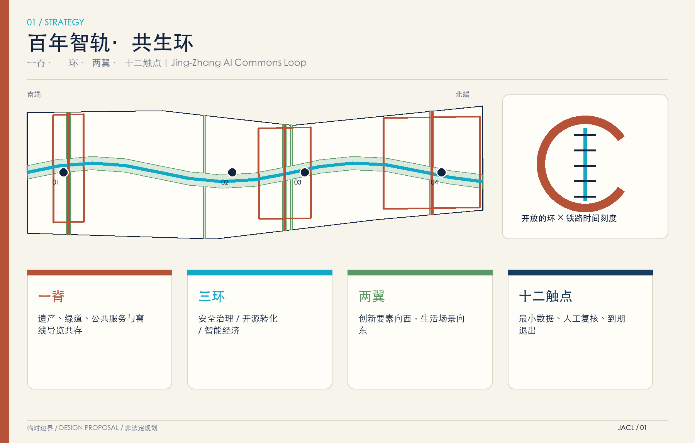
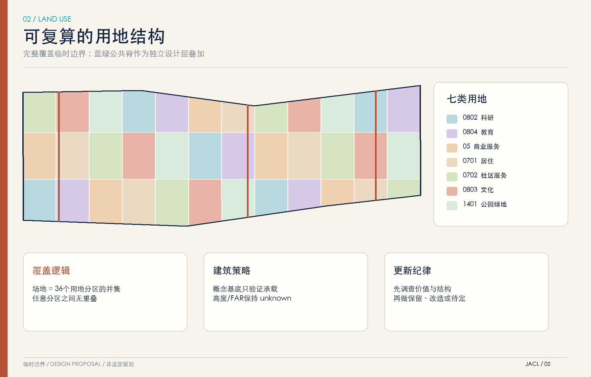
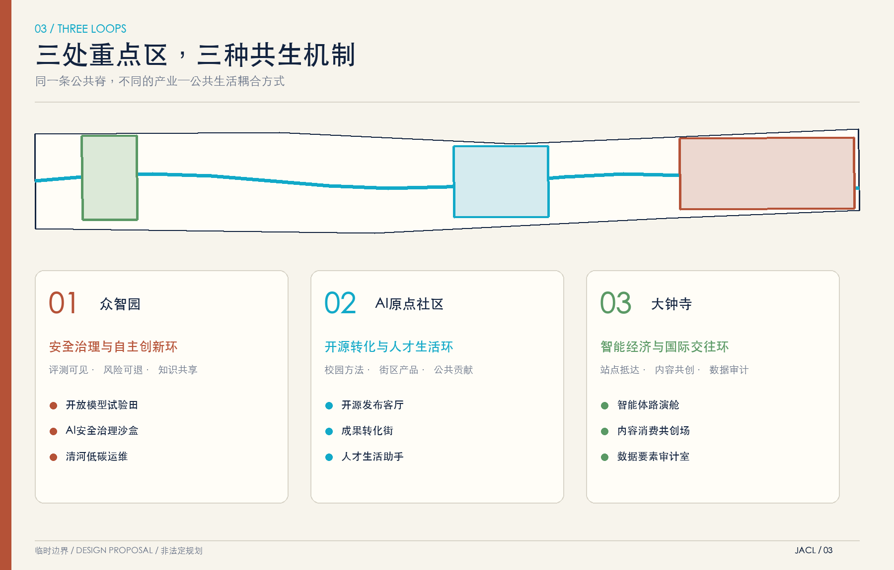
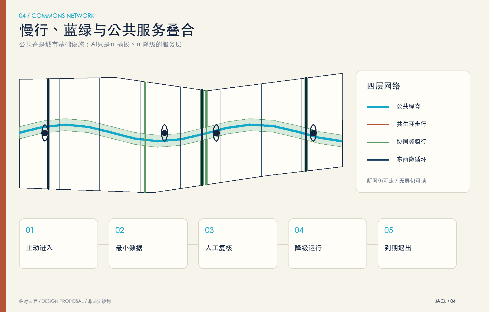
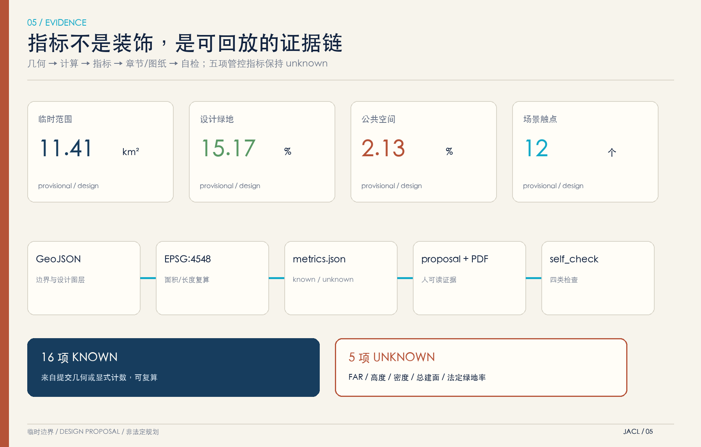

# 百年智轨·共生环

**Jing-Zhang AI Commons Loop / JACL**

> 不是把铁路遗产装进技术展柜，而是让历史、开源协作、日常生活与可信AI在同一条公共脊上持续发生。

本方案提出“**一脊·三环·两翼·十二触点**”：一条京张铁路遗产—AI公共脊连接南北；众智园、北京AI原点社区和大钟寺分别形成安全治理环、开源转化环、智能经济环；中关村创新要素与小月河生活场景构成两侧协同翼；十二个可进入、可退出、可人工复核的AI场景触点把产业能力转译为公共价值。方案不是法定规划，不声称获批或获得政府实施承诺。

## 设计依据与资料清单

第一依据为公开征集公告与仓库任务书 [source:OFFICIAL-ANNOUNCEMENT] [source:AGENT-TASKBOOK]；机器可读依据为 [source:SITE-PACKAGE] [source:SOURCE-REGISTRY] [source:PROCESSED-FACT-PACK]。边界与三处重点区来自仓库临时几何 [source:BOUNDARY-SOURCE] [source:KEY-AREA-SOURCE]，均保持 `official_boundary=false`、`geometry_role=provisional_constraint`。组织方数据缺口不阻断内容评分，但 official polygons 发布后必须重算全部图层、指标和图纸。

证据总索引：[standard:PROJECT-OFFICIAL-ANNOUNCEMENT] [standard:PROJECT-AGENT-OPEN-CALL-TASKBOOK] [standard:MOHURD-URBAN-DESIGN-MEASURES] [standard:MOHURD-CONTROL-DETAILED-PLANNING] [standard:MNR-LAND-USE-CLASSIFICATION-GUIDE] [standard:MOHURD-ARCH-DESIGN-DEPTH-2016]

深度总索引：[depth:existing_conditions_diagnosis] [depth:three_level_scope_framework] [depth:overall_spatial_structure] [depth:land_use_layout] [depth:development_intensity_controls] [depth:height_massing_character] [depth:retain_renovate_demolish] [depth:traffic_rail_slow_parking] [depth:municipal_new_infrastructure] [depth:blue_green_public_space] [depth:three_key_area_detailed_design] [depth:renewal_project_list] [depth:phasing_implementation] [depth:metrics_recalculation] [depth:risk_missing_data]

结构化数据索引：[data:geometry/site_boundary.geojson#SITE-001] [data:geometry/key_areas.geojson#PROV-KEY-001] [data:geometry/land_use.geojson#LU-001] [data:geometry/buildings.geojson#BLDG-001] [data:geometry/roads.geojson#ROAD-SPINE-001] [data:geometry/green_space.geojson#GREEN-001] [data:geometry/public_space.geojson#PUBLIC-001] [data:geometry/constraints.geojson#SCENE-001] [data:geometry/phasing.geojson#PHASE-001]

可复算指标索引：[metric:site_area_sqm] [metric:green_space_area_sqm] [metric:green_ratio] [metric:public_space_area_sqm] [metric:public_space_ratio] [metric:building_footprint_area_sqm] [metric:land_use_feature_count] [metric:key_area_count] [metric:ai_service_zone_area_sqm] [metric:scenario_node_count] [metric:road_length_m] [metric:phase_count] [metric:renewal_project_count] [metric:landmark_count] [metric:global_case_count] [metric:persona_count]

## 品牌、标识与文化叙事

品牌中文名“百年智轨·共生环”，英文名 “Jing-Zhang AI Commons Loop”。标识由一条未闭合的环与五道铁路时间刻度组成：未闭合表示持续贡献和公共进入，铁路刻度表示百年京张的时间纵深，青色断点表示每次AI介入都必须留下可解释、可撤回的治理接口。绣红代表铁路工业记忆，深海军蓝代表公共制度框架，青色代表AI协作，绿色代表日常共享空间。

文化叙事采用“遗产为底、贡献成环、城市作证”三句法。地标不复制历史构筑物，也不把AI拟人化为权威；每个地标都同时提供公共活动、贡献记录和离线解释。涉及清华园火车站、北影等具体文化资源时，只提出建立专业调查与共创线路的建议，不划定文保控制线 [depth:height_massing_character] [depth:risk_missing_data]。

## 三层范围工作框架

| 层级 | 核心问题 | 本方案回应 | 证据 |
| --- | --- | --- | --- |
| 43.6平方公里统筹研究 | AI创新链如何与城市生活互相支撑 | 高校策源—开源协作—企业转化—公共验证—国际传播五段链 | compliance_matrix.json |
| 11.4平方公里总体设计 | 更新、交通、蓝绿与设施如何落图 | 一脊三环两翼，完整用地分区与可复算几何 | [data:geometry/land_use.geojson#LU-001] |
| 368.4公顷重点区域 | 三处详细设计如何差异化 | 安全治理环、开源转化环、智能经济环 | [data:geometry/key_areas.geojson#PROV-KEY-001] |

三层范围是工作框架，不是新增红线。方案先锁定临时约束，再生成用地、建筑基底、慢行、绿地、公共空间、AI服务区与分期，最后从图层复算指标 [depth:three_level_scope_framework] [depth:overall_spatial_structure]。

## 统筹研究范围产业与未来城市研究

产业逻辑从“园区招商”转向“公共验证循环”：高校与研究机构输出方法和人才；开源社区形成可见贡献；企业在受治理的场景中验证产品；居民、访客和城市运营者提供问题反馈；审计与传播把可信成果带回下一轮研发。空间上，公共脊提供低门槛会面与演示，三环承载差异化研发和服务，两翼把产业能力带入日常生活而不收集无关个人数据。

未来城市不是满布传感器的自动化街区，而是“机器可读、人可否决”的公共服务环境。每个AI触点需公开目的、数据最小集、人工复核、退出方式和故障降级；高影响事项仍由依法授权的人工流程决定 [depth:existing_conditions_diagnosis]。

### 六个全球案例：只借机制，不借结论

| 案例 | 官方页面支持的机制 | 京张转译 | 禁止误读 |
| --- | --- | --- | --- |
| STATION F（巴黎） | 多项目、伙伴和创业服务共处一座校园 [source:CASE-STATION-F] | 原点社区建立开放项目桌与共享企业服务 | 不引用其规模证明本地需求 |
| Mila（蒙特利尔） | 开放科学、大学协作、产业转化与负责任AI [source:CASE-MILA] | 众智园设置公开评测与治理工作坊 | 不声称复制其科研组织 |
| one-north（新加坡） | work-live-play-learn 与研究、创业、测试床协同 [source:CASE-ONE-NORTH] | 两翼连接工作、生活与公共测试 | 不照搬开发指标 |
| Maria 01（赫尔辛基） | 旧医院适应性再利用为创业共同体 [source:CASE-MARIA-01] | 可逆更新既有空间，先运营后重资产 | 不先行判断拆改留 |
| Hazelwood Green（匹兹堡） | 工业遗产、机器人/AI研究与社区绿地并置 [source:CASE-HAZELWOOD-GREEN] | 铁路遗产与清河公共空间共同承载研发展示 | 不类比土地制度 |
| King’s Cross（伦敦） | 站城、遗产再利用、公共空间与持续活动运营 [source:CASE-KINGS-CROSS] | 大钟寺强调站点步行网络与全年公共内容 | 不套用商业强度 |

六案均为 background-only；其数字、绩效和治理条件不进入本地指标 [metric:global_case_count] [depth:global_case_references]。

## 总体设计范围城市更新与控规深度城市设计

总体结构为“一脊三环两翼”：公共脊兼具遗产叙事、绿道、低扰动展示和公共服务；三环围绕重点区建立不封闭的步行/创新共同体；两翼在东西方向缝合高校企业、轨道站点、社区和滨水空间。用地采用完整规则分区，蓝绿公共脊作为独立设计层叠加，避免把概念廊道误表达为精确法定地块；各图层均不越临时边界，用地无重叠和面积缺口 [depth:land_use_layout]。

本方案不填造容积率、建筑高度或总建筑规模。概念建筑基底只用来验证空间承载和公共空间关系，建筑总图、拆改留、权属与工程可行性需在 official controls 和实测建筑数据到位后重做 [depth:development_intensity_controls]。

## 重点区域详细设计

### 共生环 01：众智园安全治理与自主创新环

以“评测可见、风险可退、知识可共享”为定位。临清河界面布置低碳运维展示、开放模型测试、标准工作坊和公众解释厅；研发内部区与公共展示区分层授权。首期使用可移动展亭和预约试验场，避免在河道、防洪和道路条件未知时作永久工程判断。

### 共生环 02：北京AI原点开源转化环

以“从校园方法到街区产品”为定位。公共脊在此变成开源发布客厅、近校成果转化街、人才生活服务与知识产权/法务服务接口；贡献墙只显示自愿公开的项目与贡献，不做个人排名。校区—园区—社区联系以步行优先，具体接口等待权属和交通复核。

### 共生环 03：大钟寺智能经济与国际交往环

以“站点抵达即进入城市创新客厅”为定位。四象限步行缝合、智能体路演舱、内容消费共创场和数据要素审计室围绕公共空间布置；所有展示可离线运行，高影响数据交易仍须合规授权和人工审计。

三处边界均是临时讨论范围 [data:geometry/key_areas.geojson#PROV-KEY-001] [data:geometry/key_areas.geojson#PROV-KEY-002] [data:geometry/key_areas.geojson#PROV-KEY-003] [depth:three_key_area_detailed_design]。

## AI 创新生态、人才画像与 AI+ 场景

### 六类用户画像

| 画像 | 真实任务 | 空间需求 | 数据与公平边界 |
| --- | --- | --- | --- |
| 开源开发者 | 发布、协作、复现 | 夜间共创桌、离线演示、贡献记录 | 只记录自愿公开贡献 |
| 初创团队 | 测试、融资、合规 | 沙盒、共享会议、企业服务 | 商业数据租户隔离 |
| 高校师生 | 研究、转化、跨校交流 | 近校步行、实验排期、成果发布 | 科研成果先授权 |
| 周边居民 | 通勤、休闲、公共服务 | 连续慢行、安静时段、人工窗口 | 不做商业画像 |
| 城市运营者 | 维护、应急、设施调度 | 可解释看板、故障降级 | 不自动执法或处分 |
| 国际访客 | 抵达、翻译、理解生态 | 双语导视、站点客厅、参访路线 | 翻译结果可人工纠正 |

用户画像数量由 [metric:persona_count] 复核。

### 十二张场景卡

| # | 场景 | 位置/对象 | 输入最小集 | 人工复核与退出 |
| --- | --- | --- | --- | --- |
| 01★ | 开放模型试验田 | 众智园/研发团队 | 合规测试集、模型卡 | 专业评审后发布；可撤回 |
| 02★ | AI安全治理沙盒 | 众智园/治理人员 | 风险用例、审计日志 | 人工红队签字；隔离运行 |
| 03 | 清河低碳运维 | 众智园/运维人员 | 设施状态、天气 | 异常由人工派单；无个人数据 |
| 04 | 无障碍慢行副驾 | 公共脊/居民访客 | 公开路径、主动报障 | 可关闭定位；保留人工导视 |
| 05 | 开源发布客厅 | 原点社区/开发者 | 自愿项目信息 | 作者确认后展示；可下架 |
| 06 | 近校成果转化街 | 原点社区/师生团队 | 服务需求标签 | 人工匹配服务商；不售卖线索 |
| 07 | 人才生活助手 | 两翼/新入职人才 | 用户主动提问 | 明示非官方建议；人工窗口兜底 |
| 08 | 公共服务翻译站 | 公共脊/国际访客 | 用户输入文本 | 双语校对；不留存对话 |
| 09 | 智能体路演舱 | 大钟寺/企业访客 | 企业授权演示资料 | 主办方复核；离线模式 |
| 10 | 内容消费共创场 | 大钟寺/公众创作者 | 授权素材 | 版权确认；人工申诉 |
| 11★ | 数据要素审计室 | 大钟寺/机构 | 授权样本、审计规则 | 双人复核；禁止真实个人数据外流 |
| 12 | 遗产叙事导览 | 全线/游客 | 公开史料、位置选择 | 来源标注；人工纠错入口 |

★为产业测试验证场景。十二节点写入 [data:geometry/constraints.geojson#SCENE-001] 并由 [metric:scenario_node_count] 复核；任何场景均不得替代审批、诊疗、司法、执法或人事决定。

## 用地、建筑规模与拆改留方案

用地采用科研、教育、商业服务、居住、社区服务、文化和公园绿地七类，完整覆盖临时总体边界。用地特征数由 [metric:land_use_feature_count] 复核。概念建筑分为研发、教育、混合使用、人才公寓、社区服务和文化六类；其面积 [metric:building_footprint_area_sqm] 只说明方案图形，不代表现状建筑或批准规模。

拆改留采用“先调查、再分级、后行动”：遗产价值与结构安全双高者保留；结构可用但功能不适者可逆改造；权属、结构、污染或文保信息缺失者待定；只有完整专业论证和法定程序后才能提出拆除。当前所有建筑均为 conceptual envelope [depth:retain_renovate_demolish]。

## 交通、轨道、市政与公共服务设施

交通系统由南北公共绿道、三条共生环步行横联、两条协同翼骑行联系和七条东西微循环组成 [metric:road_length_m]。关键节点优先验证无障碍连续、骑行停放、轨道站点到公共空间的步行可读性和夜间照明；不在缺少红线、客流与工程资料时改变快速路或主干路。

市政与新基建采用“小盒子、可替换、可降级”：边缘算力、储能、通信、环境监测与公共服务终端共用标准化设备位；断网时保留离线导视和人工服务；日志只记录运维必要信息。排水、防洪、消防、供能和管线接入必须在专业深化阶段确认 [depth:traffic_rail_slow_parking] [depth:municipal_new_infrastructure]。

## 蓝绿空间、公共空间与城市风貌

绿地面积和比例分别由 [metric:green_space_area_sqm] [metric:green_ratio] 复算；公共空间面积和比例由 [metric:public_space_area_sqm] [metric:public_space_ratio] 复算。当前设计值约为绿地 15.17%、公共空间 2.13%，分母为临时边界，属于 design proposal，不是法定绿地率或审批指标。

城市风貌采用“遗产材质不仿古、数字界面不炫技”的原则：绣红耐候表面提示工业时间，青色细线只标识可进入的AI接口，深蓝构筑物提供稳定公共背景，暖白信息面保持阅读性。所有数字装置必须同时提供无屏幕替代和夜间低亮模式 [depth:blue_green_public_space]。

### 四处AI朝圣地标

| 地标 | 空间角色 | 内容与运营 | 非承诺边界 |
| --- | --- | --- | --- |
| 时序门廊 | 南端城市入口 | 百年京张时间线与可纠错史料索引 | 位置需正式边界校准 |
| 开源穹庭 | 原点社区公共客厅 | 年度开源发布、贡献档案、社区导师值班 | 不做个人声誉评分 |
| 共生钟庭 | 大钟寺国际客厅 | 智能体路演与版权清权的城市内容 | 不代表商业交易批准 |
| 清河智环 | 北端生态试验入口 | 低碳运维、开放模型与安全治理展示 | 防洪和生态条件先行 |

地标数量由 [metric:landmark_count] 复核。

## 更新项目清单、实施政策与分期计划

| 编号 | 更新项目 | 类型 | 阶段 | 前置条件 |
| --- | --- | --- | --- | --- |
| JACL-01 | 公共脊连续慢行补链 | 交通/公共空间 | 1 | 红线、无障碍与交通复核 |
| JACL-02 | 时序门廊可逆试装 | 遗产叙事 | 1 | 史料与位置清权 |
| JACL-03 | 开源发布客厅运营试点 | 产业服务 | 1 | 场地授权与运营主体 |
| JACL-04 | 三处场景治理说明牌 | AI治理 | 1 | 数据影响评估 |
| JACL-05 | 众智园安全治理环 | 研发/公共空间 | 2 | 权属、河道、交通条件 |
| JACL-06 | 原点成果转化街 | 城市更新 | 2 | 校园接口与首层业态 |
| JACL-07 | 大钟寺四象限缝合 | 站城一体 | 2 | 轨道、市政和客流研究 |
| JACL-08 | 两翼骑行与服务节点 | 绿色交通 | 2 | 道路与停放条件 |
| JACL-09 | 端侧算力共享设备位 | 新基建 | 2 | 能源、网络、安全评审 |
| JACL-10 | 四地标长期内容机制 | 品牌/文化 | 3 | 版权、维护与年度预算 |
| JACL-11 | 城市场景开放目录 | 运营治理 | 3 | 跨主体授权与审计 |
| JACL-12 | 年度共生环评估 | 公共参与 | 3 | 指标基线与第三方复核 |

更新项目数由 [metric:renewal_project_count] 复核。三期几何 [data:geometry/phasing.geojson#PHASE-001] 对应：近期先公共脊和低成本试点；中期推进三环空间更新；远期形成两翼协同、年度活动和治理制度。期数由 [metric:phase_count] 复核。权属、资金、采购和法定程序未确定，以上均是建议 [depth:renewal_project_list] [depth:phasing_implementation]。

## 长期运营与治理闭环

建议建立“公共问题池—场景准入—限域试验—第三方评估—开放复盘—续期/退出”六步机制。居民、高校、企业和运营单位均可提出问题；场景准入先完成目的合法性、最小数据、责任主体、人工复核与退出方案；每次试验设定时间和空间边界；评估报告公开非敏感结果；未达标、侵扰性过高或运营主体缺位的场景退出。

年度节奏建议为：春季公共问题征集，夏季受控原型测试，秋季京张AI共生周公开展示，冬季审计和维护。该节奏是运营参考，不代表官方活动安排。品牌传播以可复现项目、真实贡献和公共利益为核心，不以企业数量或曝光量替代城市质量。

## 指标体系、面积复算与合规矩阵

空间指标均来自提交几何：总体临时边界 [metric:site_area_sqm]、三处重点区 [metric:key_area_count]、三处AI服务区 [metric:ai_service_zone_area_sqm]。方案明确保留五项 unknown：容积率、建筑高度、建筑密度、总建筑面积和法定绿地率。unknown 不以估算值填空；待 official boundary、控规、建筑现状、权属和工程资料到位后统一复算 [depth:metrics_recalculation]。

`compliance_matrix.json` 覆盖公告 1.3、1.4、1.5 与 agent.1-agent.6；`standard_matrix.json` 与 `design_depth_matrix.json` 把规范、章节、图层、指标、图纸、来源和假设串成可机器复核的证据链。

## 风险、版权与合规说明

主要风险包括临时边界误用、建筑现状与权属缺失、控规与工程条件缺失、遗产价值判断不足、AI场景数据越界、运营主体与预算不明。对应措施是显著披露 provisional、保持 unknown、限定设计角色、采用可逆原型、最小化数据、人工复核与到期退出。完整缺口列入 `assumptions.json` [depth:risk_missing_data]。

五张图、离线HTML、A3文册与A0展板均由代码生成，不使用第三方案例图片、远程字体、地图瓦片、追踪脚本、表单或外部API。系统自带中文字体仅用于栅格化/文档文本渲染，不作为独立字体文件再分发。详情见 `report/copyright_statement.md`。

## 参考资料

- [source:OFFICIAL-ANNOUNCEMENT] 官方征集公告。
- [source:AGENT-TASKBOOK] 仓库面向智能体任务书。
- [source:SOURCE-REGISTRY] 资料可用性登记。
- [source:BOUNDARY-SOURCE] [source:KEY-AREA-SOURCE] 临时范围几何。
- [source:CASE-STATION-F] [source:CASE-MILA] [source:CASE-ONE-NORTH] [source:CASE-MARIA-01] [source:CASE-HAZELWOOD-GREEN] [source:CASE-KINGS-CROSS] 六个背景案例官方页面。
