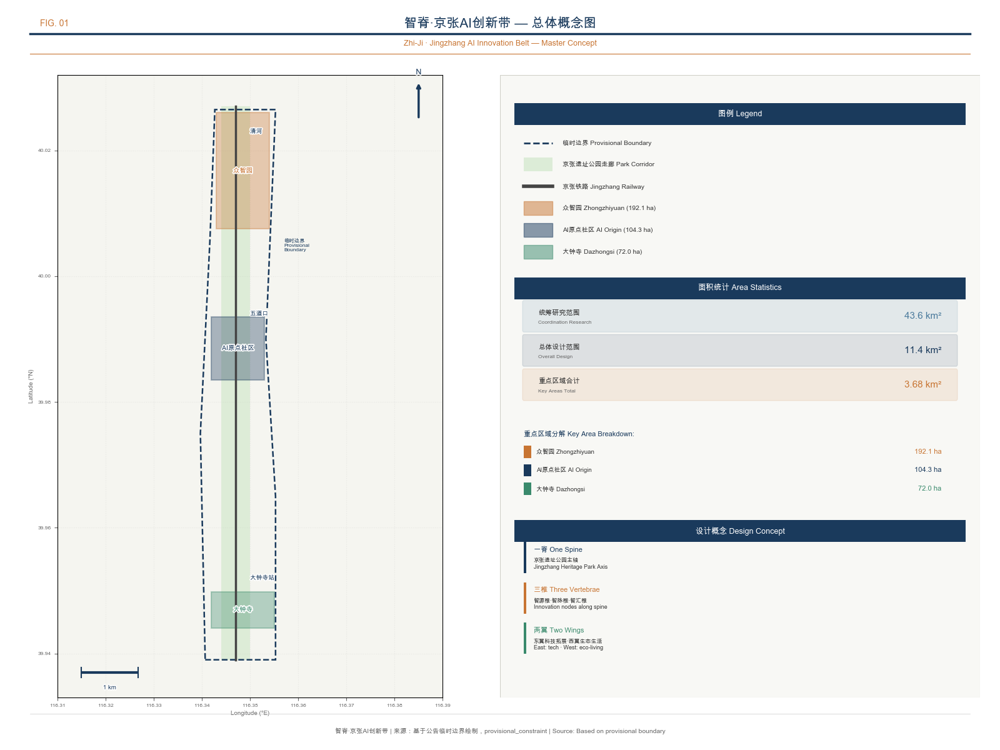
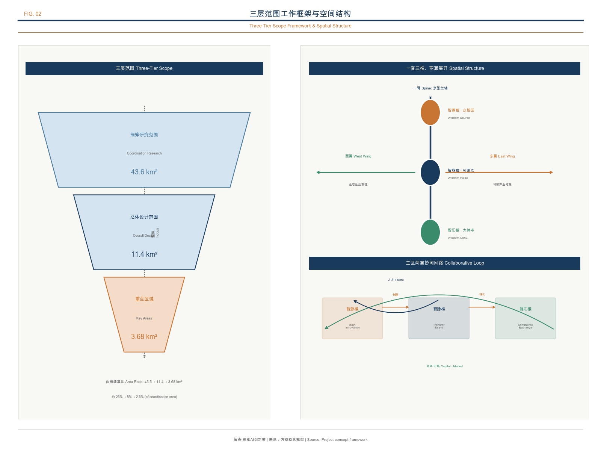
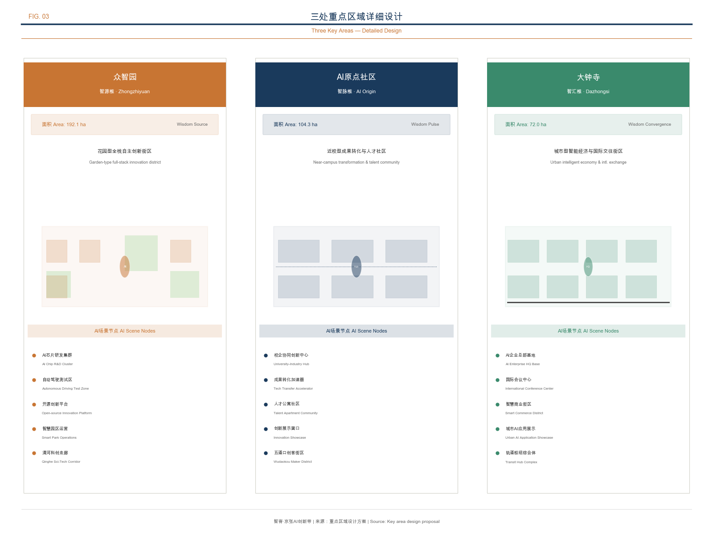
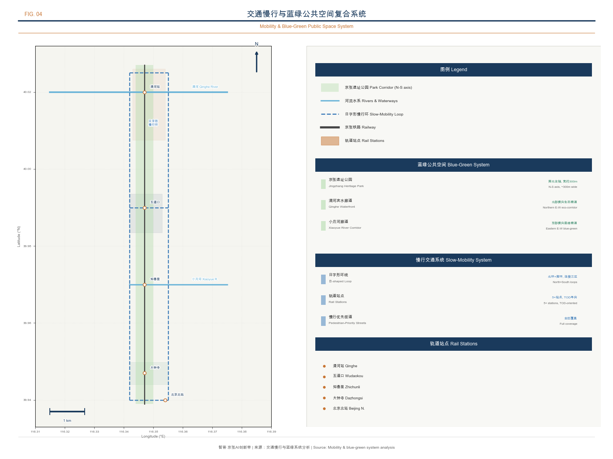
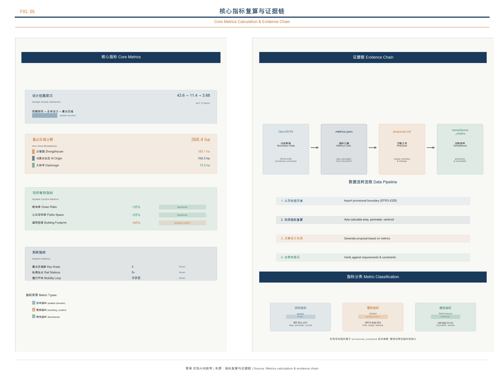

# AI Spine · Jingzhang AI Innovation Belt — Intelligent Rebirth of a Century-Old Railway

## Design Basis and Source List

This proposal takes the prequalification announcement issued by the Haidian Branch of the Beijing Municipal Planning and Natural Resources Commission as its primary basis [source:OFFICIAL-ANNOUNCEMENT], the open-source solicitation taskbook oriented toward agents as the agent task basis [source:AGENT-TASKBOOK], and the provisional rough boundaries registered by the repository maintainers as the spatial working basis [source:BOUNDARY-SOURCE]. The proposal also references the Ministry of Housing and Urban-Rural Development's *Measures for the Administration of Urban Design* [standard:MOHURD-URBAN-DESIGN-MEASURES], the *Measures for the Compilation and Approval of Regulatory Detailed Planning* [standard:MOHURD-CONTROL-DETAILED-PLANNING], and the Ministry of Natural Resources' *Guide to the Classification of Land and Sea Use* [standard:MNR-LAND-USE-CLASSIFICATION-GUIDE] as professional standards.

The current repository has not yet obtained the official precise red line. This proposal uses the provisional rough boundaries in `brief/site-package/geometry/provisional_boundaries.geojson` [data:geometry/site_boundary.geojson#SITE-001], annotated as `provisional_constraint` and `official_boundary=false`. These provisional boundaries are used solely for AI proposal generation, offline display, and local self-checking, and shall not be used as the official red line, an approval basis, or a basis for precise area recalculation. This package is available for conceptual review; official boundary data and any scoring or acceptance decisions remain pending. Once the official boundaries are released, all spatial layers and metrics must be recalculated [assumption:A-CONTROLS-001].

This proposal uses a verifiable citation format after key judgments. Complete source coverage is maintained by `sources.json`, professional standard responses are managed by `standard_matrix.json`, deliverable depth is constrained by `design_depth_matrix.json`, and task coverage is tracked by `compliance_matrix.json`. Readers need not open the JSON files to understand the proposal's design logic.

## Three-Level Scope Framework

The proposal organizes its working framework according to the three levels defined in the announcement, forming a progressive relationship from strategy to implementation.

| Level | Area | Core Question | Proposal Response |
| --- | --- | --- | --- |
| Coordinated Research Area | Approx. 43.6 sq km | How to organize the AI industry ecosystem and future urban form | Establish an innovation chain of "university origination — open-source collaboration — enterprise conversion — public experience — international communication," with Three Areas and Two Wings coordinated |
| Overall Design Area | Approx. 11.4 sq km | How to map industry space, urban renewal, and transport/municipal infrastructure onto the plan | "One Spine, Three Vertebrae, Two Wings Extended" spatial structure, with six linked layers: land use / buildings / roads / green space / public space / phasing |
| Key Detailed Design Area | Approx. 368.4 hectares | How to bring three districts to detailed design depth | Specify positioning, spatial actions, AI scenarios, and implementation dependencies for each |

The three levels are not isolated drawing sets. The Coordinated Research Area determines industry chain and innovation ecosystem judgments; the Overall Design Area translates these judgments into renewal projects and spatial structure; the Key Detailed Design Area validates the implementability of specific parcels and scenarios. Spatial evidence is benchmarked against [data:geometry/site_boundary.geojson#SITE-001] and [data:geometry/key_areas.geojson#PROV-KEY-001] [depth:three_level_scope_framework].

Because provisional rough boundaries are used, the following conclusions are all annotated as "directional design recommendations, subject to recalculation upon release of official boundaries": corridor alignments and node locations in the spatial structure, land-use zoning area ratios, building scale estimates, transport organization routes, and public space areas. These directional conclusions do not affect the validity of the design concept and strategy, but precise values must be calibrated once formal data is available [assumption:A-CONTROLS-001].

## Coordinated Research Area: Industry and Future City Research

### Overall Concept: AI Spine · Jingzhang

This proposal advances "AI Spine · Jingzhang" (AI Spine) as the overall concept of the century-old Jingzhang AI Innovation Belt [source:AGENT-TASKBOOK]. "Spine" carries multiple meanings: at the physical level, the Jingzhang Railway Heritage Park is the spatial spine running north-south; at the innovation level, the three key areas are the innovation vertebrae supporting the AI industry chain; at the cultural level, the spirit of independent innovation demonstrated by Zhan Tianyou a century ago remains the cultural spine continuing to this day; at the technical level, AI serves as the "nervous system" connecting the entire innovation belt.

The naming system is as follows:

| Level | Chinese Name | English Name | Meaning |
| --- | --- | --- | --- |
| Overall concept | 智脊·京张 | AI Spine · Jingzhang | Railway as the intelligent spine |
| Innovation belt | 京张智脊带 | Jingzhang AI Spine Belt | The north-south AI innovation main axis |
| Zhongzhiyuan AI Acceleration Area | 智源椎 | Source Vertebra | The source of full-stack AI autonomous innovation |
| Beijing AI Origin Community | 智脉椎 | Pulse Vertebra | The node where the innovation pulse merges into daily life |
| Dazhongsi AI Industry Cluster | 智汇椎 | Convergence Vertebra | The terminus of industry convergence and international exchange |

Logo direction: using vertical lines (railway/spine) as the skeleton, with three circular nodes (the three key areas) distributed along the spine, connected by thin lines to form a neural network image. The overall form can be read as an abstract variant of the Chinese character "脊" (spine), while echoing the visual language of data flow and neural synapses. The color palette uses deep blue (technological rationality) and copper-orange (railway industrial heritage) as primary colors, supplemented by white negative space. This logo direction is a conceptual design recommendation; actual use requires completing font and graphic copyright clearance [assumption:A-COPYRIGHT-001].

### Three Positionings, Five Functions, and Three-Areas-Two-Wings Coordination

The proposal responds to the three positionings in the announcement [source:OFFICIAL-ANNOUNCEMENT] and the five functions in the agent-oriented taskbook [source:AGENT-TASKBOOK]:

Three positionings — Century-old Jingzhang Cultural Belt (with the railway heritage park as the cultural main axis), Urban AI Life Experience Belt (with scenario cards and public space as daily touchpoints), and AI Convergence Innovation Belt (with Three Areas and Two Wings as the industrial skeleton).

Five functions — AI full-stack autonomous innovation system (carried by Zhongzhiyuan AI Acceleration Area), world-class AI innovation ecosystem (carried by Beijing AI Origin Community), AI+ scenario empowerment new paradigm (carried by the Xiaoyue River wing), intelligent AI-vitality city (carried by the Jingzhang Heritage Park vitality belt), and global discourse on AI governance (carried by cross-regional coordination).

Three-Areas-Two-Wings coordination loop: the three areas (Zhongzhiyuan AI Acceleration Area — Beijing AI Origin Community — Dazhongsi) form the innovation main axis along the Jingzhang Heritage Park from north to south; the Zhongguancun sci-tech service wing extends west to Zhongguancun Avenue, providing capital, intellectual property, and technology service support; the Xiaoyue River scenario empowerment wing extends east to the Xiaoyue River corridor, hosting AI scenario experiments and public experience. The coordination loop is: Zhongzhiyuan AI Acceleration Area produces original models and standards → Beijing AI Origin Community drives open-source collaboration and outcome conversion → Dazhongsi realizes industry convergence and commercial landing → the Xiaoyue River wing provides scenario validation → the Zhongguancun wing provides capital and service support → returning to Zhongzhiyuan AI Acceleration Area to form the next round of innovation iteration.

### Global AI Innovation Ecosystem Case Study

The proposal selects eight global AI innovation ecosystem cases and extracts experiences transferable to Haidian's spatial and operational mechanisms [source:AGENT-TASKBOOK].

| Case | Location | Core Characteristics | Transferable Experience |
| --- | --- | --- | --- |
| Silicon Valley Stanford-Berkeley Corridor | San Francisco Bay Area, USA | Industry-academia-research integration, professors retain IP when starting businesses, StartX incubator 92% ten-year survival rate | Deep cultivation of basic research anchored by universities to secure the source; full-cycle venture capital system; open and inclusive talent-attracting culture |
| London King's Cross | London, UK | Abandoned railway freight hub transformed into mixed-use district, 20 historic buildings preserved, 40% public space, attracting Google/Meta/DeepMind | Railway heritage regeneration paired with tech tenancy; "urban repair" stitching divided areas; historic fabric given a second life |
| Singapore One-North | Central Singapore | 200 hectares, 8 functional zones, 400+ enterprises, 50,000+ knowledge workers, "live-work-play-learn" integration | Government strategic leadership with fine-grained functional zoning; high agglomeration of research institutions and enterprises; continuously expanding housing supply to retain talent |
| Paris Station F | Paris, France | Former railway station transformed into the world's largest startup campus, 1000+ startups, annual financing exceeding EUR 1 billion | Mega single-space agglomeration of the startup ecosystem; historic building activation lends brand appeal; full-chain services reduce transaction costs |
| Seoul Digital Media City | Seoul, South Korea | 570,000 sqm digital media industry cluster, K-pop and other content production and dissemination hub | Single advantaged industry as anchor to build the full industry chain; coordinated symbiosis of cultural industry and technology |
| Shenzhen Nanshan Sci-Tech Park | Shenzhen, China | 1,351 above-scale AI enterprises, AI industry value-added of RMB 44.9 billion, 19 unicorns | Leading enterprises drive upstream-downstream agglomeration; "borderless space" reform releases industrial momentum; RMB 3 billion AI fund cluster supports the full chain |
| Tokyo Shibuya Smart City | Tokyo, Japan | 3D city model optimizes security/lighting/pedestrian planning, AI+5G smart transport pilot | "Transforming differences into strength" as vision; cross-domain spatial data fusion; enterprise technology field-testing combined with government scenario opening |
| Helsinki Kalasatama | Helsinki, Finland | Former port area transformed into smart community, "saving residents one hour per day," carbon neutral by 2035 | "Living lab" model enabling resident co-creation; agile pilots reduce trial-and-error costs; hard carbon-neutrality constraint drives efficient use |

Five transferable mechanisms are distilled from the cases: first, leveraging Haidian's basic research strengths of 37 universities and 96 national-level research institutions, establish professor entrepreneurship and IP retention mechanisms following the Silicon Valley model; second, following King's Cross's railway heritage regeneration experience, develop the Jingzhang Heritage Park into a linear public space fusing technology and culture; third, following One-North's fine-grained functional zoning, form differentiated positioning across the three key areas; fourth, following Station F's mega startup space model, build a centralized open-source innovation platform in the Beijing AI Origin Community; fifth, following Kalasatama's living lab model, establish an AI scenario agile experimentation mechanism in the Xiaoyue River wing.

### AI Full-Stack Autonomous Innovation System

The Zhongzhiyuan AI Acceleration Area Source Vertebra carries the AI full-stack autonomous innovation system, covering the basic research layer (chips/frameworks/algorithms), the technology platform layer (large model training/evaluation/safety), the application conversion layer (industry models/scenario APIs), and the industry ecosystem layer (standard setting/open-source communities/talent development). Haidian District already has an industrial base of 1,300+ AI enterprises, 76 registered large models, and 12,300 AI scholars [source:HAIDIAN-AI-ECOSYSTEM]; the Zhongzhiyuan AI Acceleration Area should provide full-chain spatial support from compute access and testing environments to standard governance.

## Overall Design Area: Urban Renewal and Regulatory-Plan-Level Urban Design

The Overall Design Area covers approximately 11.4 square kilometers [data:geometry/site_boundary.geojson#SITE-001] [metric:site_area_sqm] and is required to achieve urban design depth at the regulatory detailed planning level [standard:MOHURD-CONTROL-DETAILED-PLANNING]. The proposal advances a spatial structure of "One Spine, Three Vertebrae, Two Wings Extended, Blue-Green Slow-Mobility Composite Loop."

"One Spine" — the Jingzhang Railway Heritage Park serves as the north-south public space main axis and cultural spine, linking the three key areas and multiple community nodes. Phase II of the heritage park opened in August 2026 [source:JINGZHANG-PARK-PHASE2], introducing smart scenarios such as AI sentinels, cleaning robots, and AI sports training grounds, making it the core carrier of this proposal's spatial structure.

"Three Vertebrae" — the three key areas are distributed along the spine from north to south, forming an innovation vertebra chain: Zhongzhiyuan AI Acceleration Area (Source Vertebra) focuses on autonomous innovation acceleration, Beijing AI Origin Community (Pulse Vertebra) focuses on open-source collaboration and outcome conversion, and Dazhongsi AI Industry Cluster (Convergence Vertebra) focuses on industry convergence and international exchange.

"Two Wings" — the Zhongguancun sci-tech service wing extends west to Zhongguancun Avenue, carrying capital services, intellectual property, technology trading, and other functions; the Xiaoyue River scenario empowerment wing extends east along the Xiaoyue River corridor, carrying AI scenario experiments, public experience, and life services.

"Blue-Green Slow-Mobility Composite Loop" — with the heritage park as the north-south main axis and the Qing River (northern end) and Xiaoyue River (eastern side) as transverse blue-green corridors, a loop-shaped slow-mobility system is formed, linking universities, communities, industrial parks, and public space nodes.

The land use layout follows the classification logic of [standard:MNR-LAND-USE-CLASSIFICATION-GUIDE], covering scientific research land, industrial land, residential land, commercial and service land, road and transport facility land, and green space and plaza land [data:geometry/land_use.geojson#LU-001] [depth:land_use_layout]. The building strategy distinguishes four categories: retention, renovation, renewal, and new construction [data:geometry/buildings.geojson#BLDG-001] [depth:retain_renovate_demolish]; the specific retain-renovate-demolish classification must be calibrated once official regulatory plan conditions are confirmed.

Control indicators such as building height, floor area ratio, building density, green ratio, and setback lines currently lack official conditions [assumption:A-CONTROLS-001]. The proposal lists these as `pending_control` in the indicator system and does not use fixed values to create a false sense of precision. Once the formal regulatory plan is released, all control indicators must be re-verified.

## Detailed Design of Key Areas

### Zhongzhiyuan AI Autonomous Innovation Acceleration Area — Source Vertebra

Positioning: A garden-type full-stack autonomous innovation district, carrying national AI platform, full-stack autonomous innovation, standard setting, and safety governance functions.

Spatial structure: With the Qing River as the northern blue-green boundary and the heritage park as the eastern public space interface, a three-segment structure of "Qing River Innovation Corridor — Acceleration Core Zone — Standard Governance Demonstration Zone" is formed. The ecological restoration and public space opening of the Qing River interface are strengthened, and the riverside green space is used to host a low-carbon innovation exchange environment.

Building renewal: Focused on industrial R&D building renewal, retaining the structural framework of existing industrial buildings, converting ground floors into open exhibition and collaboration spaces, with upper floors for R&D offices. New buildings are kept within a low-intensity range to avoid overpowering the Qing River ecological interface. The specific retain-renovate-demolish classification must be calibrated after ownership and regulatory plan conditions are confirmed [assumption:A-CONTROLS-001].

AI scenarios: Autonomous model testing ground (for large model red-team testing and safety evaluation), standard-setting workshop (visualizing the AI safety governance process), low-carbon compute experience station (demonstrating green computing and edge-side computing), and Qing River AI ecological observation station (combining ecological monitoring and AI data collection).

Transport organization: Strengthen pedestrian connectivity beneath the North Fifth Ring Road overpass, set up a low-speed shuttle loop linking the acceleration core zone and the Qing River interface, and form pedestrian transfer nodes with rail stations. Transport conclusions are directional design recommendations [data:geometry/roads.geojson#ROAD-001].

Implementation risks: The engineering feasibility of the North Fifth Ring Road cross-ring-road node requires traffic and municipal condition review; the Qing River blue line and ecological protection requirements require confirmation from the water authority [assumption:A-CONTROLS-001].

### Beijing AI Origin Community — Pulse Vertebra

Positioning: A near-campus outcome conversion and talent community, carrying open-source collaboration, outcome incubation and conversion, and talent special zone functions.

Spatial structure: With the Wudaokou / Qinghua East Road West rail node as the hub, organize the stitching of campus, park, and district slow-mobility, forming a three-band parallel structure of "Open-Source Release Axis — Outcome Conversion Street — Talent Living Area." Break through slow-mobility breakpoints between campus and park, and establish a continuous campus-park-street-district pedestrian experience.

Building renewal: Focused on ground-floor activity activation and facade renewal, converting street-level ground-floor spaces into outcome exhibition, roadshow, legal consulting, and intellectual property service functions. Residential supporting facilities are mainly renewed from existing communities, supplementing young talent apartments and international community service facilities.

AI scenarios: Open-source release hall (for outcome release and code contribution display oriented toward universities and open-source communities), near-campus incubation station (a physical node for cross-campus collaboration and outcome conversion), AI education experience point (AI literacy education for the public), nighttime collaboration space (24-hour open-source community workstation), and talent special zone service center (one-stop policy consulting and life services).

Transport organization: Centered on the integrated design of the Wudaokou rail station, establish a pedestrian-priority district micro-circulation. Non-motor vehicle parking points and shared mobility hubs are arranged in conjunction with rail stations to reduce the problem of disordered bicycle parking around campuses.

Implementation risks: Campus boundaries and ownership require coordination with universities; ground-floor activity changes require the consent of property owners [assumption:A-CONTROLS-001].

### Dazhongsi AI Industry Cluster — Convergence Vertebra

Positioning: An urban-type intelligent economy and international exchange district, carrying leading enterprises, agents, intelligent terminals, and data element functions.

Spatial structure: With the Dazhongsi rail station as the hub, organize four-quadrant pedestrian connectivity at the intersection, forming a three-node linkage structure of "International Roadshow Parlor — Data Element Reception Hall — Intelligent Terminal Demonstration Street." Strengthen public space renewal around the station and enhance the quality of the business reception and international exchange environment.

Building renewal: Focused on commercial building renewal and public space enhancement, converting the ground floors and underground spaces of existing commercial complexes into AI product exhibition, experience, and trading functions. The four quadrants of the intersection are connected by underground passages and surface crossing facilities to establish all-weather pedestrian connectivity.

AI scenarios: Dazhongsi International Roadshow Parlor (serving the exhibition, negotiation, and media release of agent and intelligent terminal enterprises), Data Element Reception Hall (a data element circulation service interface premised on compliance and auditability), Intelligent Terminal Experience Street (AI hardware and intelligent terminal display and sales for consumers), and Content Consumption Lab (creative exhibition and copyright discussion of AI-generated content).

Transport organization: Centered on the integrated design of Dazhongsi Station, with four-quadrant pedestrian connectivity as the focus, combined with Line 13 and planned line transfers to optimize pedestrian flow organization.

Implementation risks: Four-quadrant pedestrian connectivity involves multiple property owners and municipal pipelines, requiring unified coordination [assumption:A-CONTROLS-001].

## AI Innovation Ecosystem, Personas, and AI+ Scenarios

### User Personas

The proposal advances five user personas, each mapped to specific spaces and scenarios [source:AGENT-TASKBOOK].

| Persona | Typical Needs | Spatial Response | Privacy Boundary |
| --- | --- | --- | --- |
| Open-source developer | Publishing, collaboration, testing, community reputation | Origin Community open-source release hall, public code wall, nighttime collaboration space | No collection of personal behavior trajectories; activity data used only for aggregate statistics |
| Startup team | Low-cost office, compute access, product testing ground | Zhongzhiyuan shared testing ground, edge-side compute service points, standard governance consulting | Compute and data services require separate authorization |
| Leading enterprise visitor | Exhibition, business, international reception, talent recruitment | Dazhongsi International Roadshow Parlor, rail station transfers, public space around key enterprises | Enterprise logos and cases must be cleared of rights |
| Surrounding resident | Commuting, leisure, community services, low-disturbance renewal | Jingzhang Heritage Park slow-mobility loop, embedded community services, tiered nighttime lighting | Resident profiles not used for commercial recommendations |
| University faculty and students | Outcome conversion, cross-campus collaboration, daily slow mobility | Campus-park slow-mobility stitching, outcome conversion stations, AI education experience points | Campus data and research outcomes require authorization |

### AI Scenario Cards

The proposal advances 12 AI scenario cards, of which 4 are AI industry testing and verification scenarios (marked with *), covering transport, public services, industry services, and urban governance [source:AGENT-TASKBOOK].

| No. | Scenario Card | Spatial Carrier | Design Description | Operating Entity |
| --- | --- | --- | --- | --- |
| S01 | Open-Source Release Hall | Beijing AI Origin Community | Outcome release, code contribution display, and small roadshow space | Open-source community operator |
| S02* | Safety Governance Sandbox | Zhongzhiyuan AI Acceleration Area | A visitable, reservation-based node for standard setting, safety evaluation, and model red-team testing | Evaluation institution + park |
| S03* | Edge-Side Compute Station | Overall Design Area nodes | A new infrastructure prototype integrated with public services | Operator + government |
| S04 | AI Slow-Mobility Navigation | Jingzhang Heritage Park | Explainable wayfinding and low-intrusion sensing to help identify slow-mobility breakpoints and accessibility needs | Park management |
| S05 | Dazhongsi International Roadshow Parlor | Dazhongsi area | Exhibition, negotiation, and international exchange for agent and intelligent terminal enterprises | Enterprise + property |
| S06 | Qing River Low-Carbon Innovation Corridor | Zhongzhiyuan riverside interface along Qing River | A park public parlor combining green space, stormwater, walking and cycling, and AI demonstration | Park + water authority |
| S07 | Near-Campus Outcome Conversion Street | Beijing AI Origin Community | Incubation, exhibition, legal, intellectual property, and investment and financing services | University + incubator |
| S08 | Data Element Reception Hall | Dazhongsi area | A compliant, authorized, auditable urban service interface for data element circulation | Data exchange |
| S09 | AI Life Service Model Street | Community and commercial intersections | Medical, educational, legal, and life-service AI+ scenarios landed in small-scale blocks | Community + service provider |
| S10* | Global AI Activity Week Route | Belt-wide public space system | A walkable, communicable experience route from heritage culture to international roadshow | Event organizing committee |
| S11 | AI Public Art Corridor | Along the heritage park | Public art nodes combining railway industrial heritage and AI-generated art | Cultural institution |
| S12* | Robot Delivery Pilot Zone | Xiaoyue River scenario empowerment wing | A supervised, auditable pilot scenario for low-speed unmanned delivery robots | Logistics enterprise + government |

Privacy and human-review boundaries for scenario-space-operation mapping: All AI scenarios follow the principles of data minimization, open sources, explainability, and human review. Urban agents may assist in identifying slow-mobility breakpoints, public space heat maps, and facility maintenance needs, but do not replace planning approval and do not output unauthorized personal profiles. AI governance recommendations must undergo human review before entering implementation [source:AGENT-TASKBOOK].

### AI Pilgrimage Landmarks

The proposal advances three AI pilgrimage landmarks [source:AGENT-TASKBOOK], serving as the spiritual anchors and public experience destinations of the innovation belt.

**Landmark One: Jingzhang AI Spine Memorial Corridor** — Located in the core segment of the Jingzhang Heritage Park, with Zhan Tianyou's hand-drawn Jingzhang Railway plan and profile drawings as ground engravings, embedding AI development milestones along the footpath (from the Turing Test to the large model era), forming a "century-old railway — century-old AI" spacetime dialogue. At the end of the corridor, an Agent Contribution Honor Wall is set up to record the most outstanding AI contributors and Agent names each year in a sustainably updatable manner.

**Landmark Two: Open-Source Code Dome** — Located at the core node of the Beijing AI Origin Community, the dome projection displays a real-time contribution map of global open-source code; beneath the dome is a circular open plaza that can be used for community gatherings, code marathons, and outcome releases. The dome structure references the engineering imagery of Zhan Tianyou's Y-shaped railway, using steel structure and light-transmitting materials to present the fusion of industrial heritage and modern technology.

**Landmark Three: AI Spark Tower** — Located at the gateway of the Dazhongsi area, the lighthouse imagery symbolizes the dissemination and convergence of AI innovation. The tower body integrates real-time AI data visualization (such as large model training parameters, compute consumption, application deployment, and other public indicators), and the top of the tower features an observation platform overlooking the entire innovation belt. The plaza at the base is the core venue for international roadshows and public activities.

The above landmarks are all conceptual design recommendations and do not constitute approved construction. Wayfinding, logos, fonts, images, and enterprise identifiers in the landmarks must complete copyright clearance before implementation [assumption:A-COPYRIGHT-001].

## Land Use, Building Scale, and Retain-Renovate-Demolish Strategy

The land use layout is organized according to the classification logic of the Guide to the Classification of Land and Sea Use [standard:MNR-LAND-USE-CLASSIFICATION-GUIDE] [data:geometry/land_use.geojson#LU-001]. The main land use types within the Overall Design Area include: scientific research land (Zhongzhiyuan AI Acceleration Area and Beijing AI Origin Community cores), commercial and service land (Dazhongsi area and around rail stations), residential land (existing community renewal), road and transport facility land (including rail station integration), and green space and plaza land (heritage park and blue-green corridors).

The building strategy distinguishes four renewal categories [data:geometry/buildings.geojson#BLDG-001] [depth:retain_renovate_demolish]:
- **Retain**: Existing residential, school, and public service buildings of good quality, maintaining their current functions.
- **Renovate**: Ground floors and facades of existing industrial and commercial buildings, converted into exhibition, collaboration, and service functions.
- **Renew**: Inefficiently used industrial land and warehousing land, redeveloped according to AI industry needs.
- **New construction**: Landmark buildings and public space nodes added at the core locations of key areas.

Building footprint area and scale indicators are recalculated from [data:geometry/buildings.geojson#BLDG-001] [metric:building_footprint_area_sqm]. Due to the lack of official regulatory plan conditions, control indicators such as floor area ratio, building height, building density, green ratio, and setback lines are listed as `pending_control` [assumption:A-CONTROLS-001]. Once the formal regulatory plan is released, all control indicators must be re-verified.

## Transport, Rail, Municipal Infrastructure, and Public Services

The transport proposal responds to the announcement's requirements for rail station integration, road micro-circulation, slow-mobility breakpoints, and green transport systems [source:OFFICIAL-ANNOUNCEMENT].

**Rail station integration**: Focus on strengthening the integrated design of Wudaokou / Qinghua East Road West (Beijing AI Origin Community hub) and Dazhongsi Station (Convergence Vertebra hub), establishing seamless connections between stations and surrounding industrial space, public space, and slow-mobility systems. A pedestrian-priority block scale control is applied within a 500-meter radius around stations.

**Road micro-circulation**: Break through the east-west transport connections on both sides of the heritage park that are severed by the railway, using the surface space released by the railway's undergrounding to add east-west slow-mobility passages. The branch road system in key areas is organized according to the principle of small blocks and dense networks, promoting walkability and commercial vitality.

**Slow-mobility system**: With the heritage park as the north-south main axis and the Qing River and Xiaoyue River as transverse corridors, a slow-mobility loop resembling the Chinese character 日 (a rectangular loop with a central crossbar) is formed. Identify and repair slow-mobility breakpoints across ring roads, rivers, and railways, establishing a continuous walking and cycling network [data:geometry/roads.geojson#ROAD-001] [depth:traffic_rail_slow_parking].

**New infrastructure**: Deploy edge-side compute nodes, distributed energy facilities, and AI sensing infrastructure in key areas, integrated with public service facilities and public space. Edge-side compute nodes serve as the "last mile" infrastructure for AI scenarios, providing local computing capability for low-latency applications [data:geometry/constraints.geojson#CONSTRAINTS].

The municipal facilities proposal covers traditional municipal systems such as water supply and drainage, electricity, communications, gas, and sanitation, as well as AI industry service facilities, innovation service platforms, and talent life service facilities. When pipeline, energy, drainage, flood control, and fire protection engineering data are lacking, they are listed as prerequisites for formal deepening [assumption:A-CONTROLS-001].

## Blue-Green Network, Public Space, and Urban Character

### Jingzhang Heritage Park Vitality Belt

The Jingzhang Heritage Park is the core carrier of this proposal's "One Spine" spatial structure. Phase II of the park opened in August 2026 [source:JINGZHANG-PARK-PHASE2], introducing smart scenarios such as AI sentinels, cleaning robots, and AI sports training grounds. The proposal recommends further deepening the park's AI-scenario-based functions on this basis:

- Southern community vitality segment: Strengthen the connection with surrounding community life services, embedding the AI Life Service Model Street and community AI education experience points.
- Central heritage memorial segment: Centered on the Jingzhang AI Spine Memorial Corridor, linking the former Qinghuayuan Railway Station site and industrial heritage, forming the cultural narrative main axis.
- Northern nature and leisure segment: Connect with the Qing River blue-green corridor, deploying AI ecological observation stations and low-carbon innovation exchange spaces.

### Blue-Green Space System

The blue-green space takes the heritage park as the north-south main axis and the Qing River (northern end) and Xiaoyue River (eastern side) as transverse corridors, forming an "I-shaped" blue-green skeleton [data:geometry/green_space.geojson#GREEN-001] [depth:blue_green_public_space]. The green space and public space ratios are recalculated from [data:geometry/green_space.geojson#GREEN-001] and [data:geometry/public_space.geojson#PUBLIC-001] [metric:green_ratio] [metric:public_space_ratio].

The public space system includes: the heritage park linear green corridor (north-south main axis), the Qing River waterfront promenade (northern transverse corridor), the Xiaoyue River waterfront promenade (eastern transverse corridor), the key area plaza cluster (core public spaces of the three key areas), and the community pocket park network (evenly distributed community-level green nodes).

### Cultural Fusion Narrative

The proposal constructs a three-layer cultural narrative of "century-old Jingzhang — Zhongguancun innovation — new AI culture" [source:AGENT-TASKBOOK]:

**First layer: Century-old Jingzhang culture** — Taking Zhan Tianyou's innovative spirit of "each contributing what they have learned and what they know" as the cultural origin, with the railway heritage, the former Qinghuayuan Railway Station site, and industrial heritage as the material carriers, and the Jingzhang AI Spine Memorial Corridor as the spiritual landmark. The cultural narrative emphasizes the century-long inheritance of the "autonomous innovation" spirit — from autonomously building railways to autonomously training large models.

**Second layer: Zhongguancun innovation culture** — Represented by the "Zhongguancun" brand and China's sci-tech innovation practice since reform and opening up, with universities, research institutes, and sci-tech enterprises as the carriers, and the Open-Source Code Dome as the spiritual landmark. The cultural narrative emphasizes "open collaboration" — from the Zhongguancun electronics market to the global open-source community.

**Third layer: New AI culture** — Marked by agents participating in real urban design as a new stage of AI-native culture, with AI scenario cards, pilgrimage landmarks, and the Agent Contribution Honor Wall as the carriers, and the AI Spark Tower as the spiritual landmark. The cultural narrative emphasizes "human-machine co-creation" — from humans designing cities to agents participating in real urban construction.

The three cultural layers are linked by the heritage park cultural guide route, forming a south-to-north (Dazhongsi — Beijing AI Origin Community — Zhongzhiyuan AI Acceleration Area) cultural experience sequence of "industry convergence — open-source collaboration — autonomous innovation."

### Urban Character Control

Urban character fuses three tones: railway industrial heritage, university collegiate temperament, and AI technological feel. Building character control recommendations: core buildings in key areas adopt a modern, clean style, with steel structure and glass as the main materials, echoing the engineering aesthetics of railway industrial heritage; community buildings maintain a moderate residential scale, with brick and stone and warm-toned paint as the main materials; buildings along the heritage park control height and massing to avoid oppressing the park space [standard:MOHURD-URBAN-DESIGN-MEASURES] [depth:height_massing_character]. Specific character control must be calibrated after official regulatory plan conditions are confirmed.

## Renewal Projects, Implementation Policy, and Phasing

### Renewal Project List

| No. | Project Name | Type | District | Main Dependencies | Phase |
| --- | --- | --- | --- | --- | --- |
| JZ-01 | Jingzhang Heritage Park Slow-Mobility Breakpoint Stitching | Public space / transport | Heritage park full length | Road red lines, under-bridge space, traffic organization review | Near-term |
| JZ-02 | Zhongzhiyuan Qing River Innovation Interface | Blue-green space / industry exhibition | Zhongzhiyuan AI Acceleration Area | River blue line, ecological and flood control conditions | Near-term |
| JZ-03 | Origin Community Near-Campus Outcome Conversion Street | Urban renewal / industry services | Beijing AI Origin Community | Campus boundaries, ownership, ground-floor activities | Near-term |
| JZ-04 | Dazhongsi Station Four-Quadrant Pedestrian Connectivity | Rail integration / slow mobility | Dazhongsi | Rail station, road intersection, municipal pipelines | Mid-term |
| JZ-05 | AI Public Services and Edge-Side Compute Nodes | New infrastructure / public services | Overall Design Area | Energy, compute, safety, and operating entities | Mid-term |
| JZ-06 | Jingzhang AI Spine Memorial Corridor | Cultural landmark / public space | Heritage park central segment | Public space permits, heritage conservation, copyright clearance | Mid-term |
| JZ-07 | Open-Source Code Dome | Cultural landmark / public space | Beijing AI Origin Community | Architectural design, structure, copyright clearance | Mid-term |
| JZ-08 | AI Spark Tower | Cultural landmark / public space | Dazhongsi | Architectural design, structure, operating entity | Long-term |
| JZ-09 | Xiaoyue River AI Scenario Experiment Corridor | Scenario experiment / blue-green space | Xiaoyue River wing | River blue line, scenario permits, data compliance | Mid-term |
| JZ-10 | Global AI Activity Week Public Route | Operations / branding | Belt-wide public space system | Public space permits, event safety, copyright | Long-term |

### Implementation Phasing

Phasing is distinguished from the 100-day solicitation design cycle: the solicitation cycle is the time requirement for submitting deliverables, while implementation phasing is the advancement path for urban renewal and project construction [data:geometry/phasing.geojson#PHASE-001] [depth:phasing_implementation].

**Near-term (1-2 years)**: Launch with lightweight facilities, operational activities, and service platforms. Prioritize slow-mobility breakpoint stitching (JZ-01), the Qing River Innovation Interface (JZ-02), and the near-campus outcome conversion street (JZ-03); these projects can be initiated with temporary facilities and operational interventions, without relying on large-scale construction.

**Mid-term (2-5 years)**: Advance rail integration, new infrastructure, and cultural landmark construction. Dazhongsi Station four-quadrant connectivity (JZ-04), edge-side compute nodes (JZ-05), the AI Spine Memorial Corridor (JZ-06), the Open-Source Code Dome (JZ-07), and the Xiaoyue River experiment corridor (JZ-09) are advanced in this phase, requiring confirmation of formal regulatory plan and municipal conditions.

**Long-term (5+ years)**: Construct the AI Spark Tower (JZ-08) and the Global AI Activity Week route (JZ-10), establishing long-term operational mechanisms and brand assets.

### Global AI Innovation Activity System and Long-Term Operations

The proposal advances the "Jingzhang AI Spine · Global AI Innovation Week" annual activity system [source:AGENT-TASKBOOK], serving as the long-term brand asset and operational closed loop of the innovation belt.

**Annual activity system**:
- Spring "Open-Source Co-Creation Festival": Centered on the Beijing AI Origin Community, hosting global open-source code marathons, developer community gatherings, and outcome releases.
- Summer "AI Scenario Open Day": Centered on the Xiaoyue River wing, opening AI scenario experiences and testing and verification scenario visits to the public.
- Autumn "Global AI Innovation Summit": Centered on Dazhongsi, hosting international roadshows, industry forums, and talent recruitment.
- Winter "Jingzhang Cultural Memory Exhibition": Centered on the heritage park, reviewing the century-old railway history and AI development milestones.

**Operational mechanism**: It is recommended to establish the "Jingzhang AI Spine Operations Alliance," composed of government, enterprises, universities, open-source communities, and resident representatives, responsible for event organization, scenario operations, public space management, and brand maintenance. The operations alliance does not replace government approval and statutory management, and serves only as a coordination and service platform.

**Developer community operations**: Relying on the Open-Source Code Dome and the Open-Source Release Hall, establish a sustained developer community operations mechanism, including weekly technical sharing, monthly community gatherings, quarterly outcome exhibitions, and an annual global summit. Community operations follow open-source governance principles, and contributor names and proposal records are sustainably preserved [source:AGENT-TASKBOOK].

**Scenario opening operations**: AI scenario cards and testing and verification scenarios are opened to enterprises, universities, and the public in a tiered manner. Industry testing scenarios require reservation and qualification review; public service scenarios are open to all members of the public; life service scenarios are operated according to community needs. All scenario operation records enter the public knowledge base [source:AGENT-TASKBOOK].

The above activities, investment attraction, funding, policies, and operational arrangements are all conceptual recommendations or directions for deepening, and must not be represented as determined government arrangements [source:AGENT-TASKBOOK].

## Metrics, Area Recalculation, and Compliance Matrix

The proposal establishes three categories of metrics [depth:metrics_recalculation].

**Category One: Spatial Metrics (recalculable from submitted geometry)**

| Metric | Value | Source | Status |
| --- | --- | --- | --- |
| Overall Design Area | Approx. 11,412,825 sqm | geometry/site_boundary.geojson | known (provisional) |
| Zhongzhiyuan AI Acceleration Area | Approx. 1,929,202 sqm | geometry/key_areas.geojson | known (provisional) |
| Beijing AI Origin Community Area | Approx. 1,043,237 sqm | geometry/key_areas.geojson | known (provisional) |
| Dazhongsi Area | Approx. 720,454 sqm | geometry/key_areas.geojson | known (provisional) |
| Green space ratio | Approx. 12.3% | geometry/green_space.geojson | known (provisional) |
| Public space ratio | Approx. 7.3% | geometry/public_space.geojson | known (provisional) |
| Building footprint area | Approx. 310,807 sqm | geometry/buildings.geojson | known (provisional) |
| Number of key areas | 3 | geometry/key_areas.geojson | known |

**Category Two: Control Metrics (requiring official regulatory plan support)**

| Metric | Status | Reason |
| --- | --- | --- |
| Floor area ratio | pending_control | Official regulatory plan conditions not released |
| Building height | pending_control | Height control and aviation/landscape/heritage conservation constraints not confirmed |
| Building density | pending_control | Official regulatory plan conditions not released |
| Green ratio | pending_control | Official regulatory plan conditions not released |
| Setback line | pending_control | Road red lines and building control lines not confirmed |

**Category Three: Performance Metrics (requiring operational data calibration)**

| Metric | Directional Target | Notes |
| --- | --- | --- |
| Number of AI scenario nodes | 12+ | Listed in scenario cards |
| Number of pilgrimage landmarks | 3 | Designed in the proposal |
| User persona coverage | 5 categories | Listed in persona table |
| Global case benchmarking | 8 cases | Analyzed in case study |
| Annual activities | 4 seasons | Planned in operations system |

All spatial metrics are recalculated based on provisional rough boundaries [assumption:A-CONTROLS-001], and precise values must be re-verified upon release of official boundaries. Performance metrics are directional targets and do not constitute government commitments.

The compliance matrix covers all mandatory tasks in announcement sections 1.3, 1.4, 1.5, and agent.1 through agent.6, with each task mapped to report sections, layers, metrics, drawings, and HTML evidence [data:compliance_matrix.json]. A proposal that fails to cover any mandatory task may not enter formal professional scoring.

## Risk, Copyright, and Compliance

### Source Legality

All materials used in this proposal come from public sources or copyright-cleared materials registered by the repository maintainers [source:SITE-PACKAGE] [source:SOURCE-REGISTRY]. The proposal does not use secret maps, non-public tables, fabricated official endorsements, or fabricated planning conclusions. The provisional rough boundaries are explicitly annotated as `provisional_constraint` and do not impersonate the official red line [source:BOUNDARY-SOURCE].

### Copyright and Clearance

The logo direction, landmark conceptual designs, scenario card descriptions, and event names in the proposal are all original conceptual design recommendations. Fonts, images, trademarks, portraits, and enterprise identifiers used in actual implementation must complete copyright clearance before deployment [assumption:A-COPYRIGHT-001]. HTML pages do not load remote scripts, remote map tiles, remote fonts, iframes, forms, or external APIs, and do not track reviewer behavior.

### Pending Materials

The following data gaps must be filled before formal deepening [assumption:A-CONTROLS-001]: official precise red lines and key area boundaries, approved regulatory plan conditions (floor area ratio, building height, building density, green ratio, setback lines), road red lines and building control lines, existing building ownership and retain-renovate-demolish basis, municipal pipelines and engineering conditions, and cultural heritage protection control lines and heritage conservation requirements.

### Unified Boundary Clause

All spatial implementation recommendations are expressed as "conceptual recommendations," "reference proposals," or "available for further study by professional teams" [source:AGENT-TASKBOOK]. This proposal does not claim official approval, approved regulatory plans, final land ownership, final construction scale, or guaranteed implementation. The AI agent is responsible for facts, sources, copyright, spatial data, metrics, and expressions; maintainers and professional reviewers may require rework or rejection based on self-check results, spatial review, and the compliance matrix.

## References

- Beijing Municipal Planning and Natural Resources Commission, Haidian Branch: *International Proposal Solicitation Prequalification Announcement for the Urban Design of the Century-Old Jingzhang AI Innovation Belt*, 2026-05-09
- Excerpts of the open-source solicitation taskbook oriented toward global agents (user-provided cleared document), 2026-05-18
- Ministry of Housing and Urban-Rural Development: *Measures for the Administration of Urban Design*, 2017
- Ministry of Housing and Urban-Rural Development: *Measures for the Compilation and Approval of Regulatory Detailed Planning for Cities and Towns*
- Ministry of Natural Resources: *Guide to the Classification of Land and Sea Use for National Spatial Survey, Planning, and Use Regulation*, 2023
- Beijing Daily / Capital Window: *Century-Old Iron Rails Pave the "City Main Axis" of AI Innovation*, 2026-03-30
- CCTV.com: *Phase II of the Jingzhang Railway Heritage Park Opens to the Public*, 2026-08-06
- Haidian District Government: *AI Haidian, See the Future Here*, 2025
- Beijing Municipal Science and Technology Commission: *"Three Areas and Two Wings" to Build a World-Class AI Cluster*, 2026-04-03
- Haidian District Government: *Haidian District Releases the "1+X+1" Modern Industrial System Construction Layout*, 2026-03-02
- Complete machine index: see `sources.json`, `metrics.json`, `compliance_matrix.json`, `standard_matrix.json`, and `design_depth_matrix.json`
