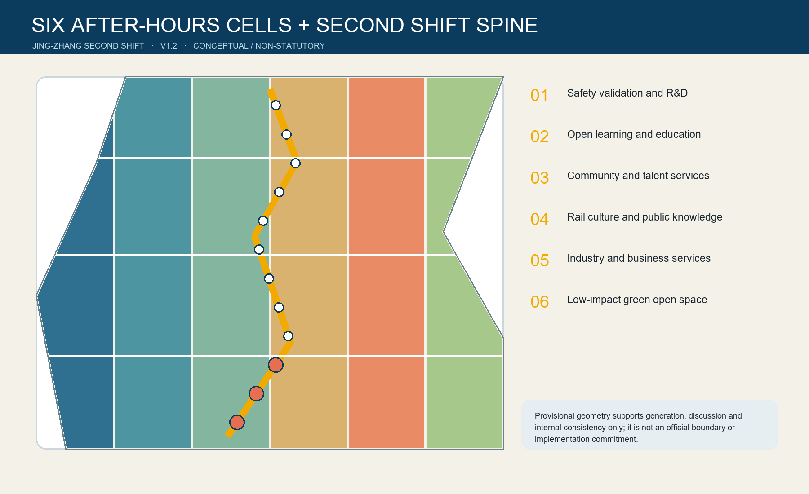
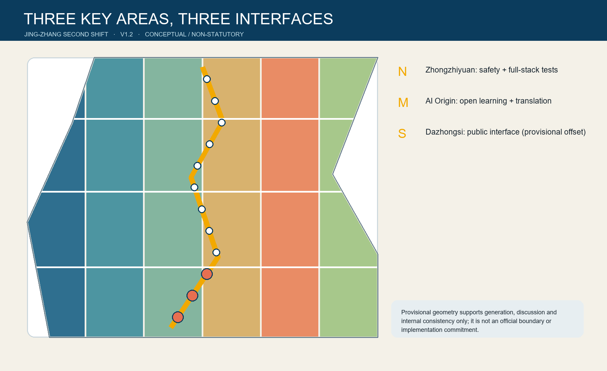
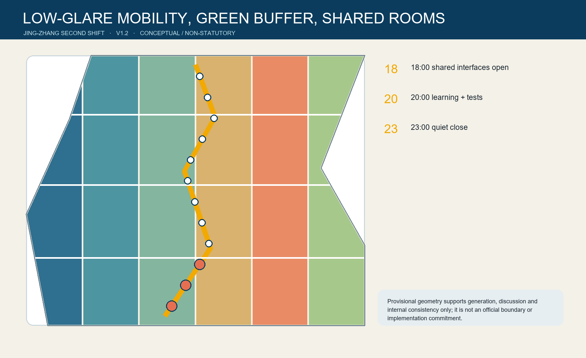

# THE SECOND SHIFT / 京张第二班

**After work, the city keeps learning.** The Chinese word *ban* means a work shift, a class, and a railway service. The proposal studies a conceptual 18:00-23:00 window in which selected campus, R&D park, enterprise ground-floor and community interfaces can become bookable, reversible and staffed public resources. One learning spine links six after-hours conversion cells, six shared rooms and twelve scenario nodes. This is not a 24/7 scheduling platform.

It is an urban design of “access protocol before spatial retrofit”: first answer who enters, who is responsible, when an activity stops and how to appeal; only then discuss paving, lobbies, lighting and equipment.

The visual identity uses two parallel rail lines that open into brackets at each node: temporarily opening otherwise bounded knowledge. Rail blue, late-class amber and paper white are original project colours. The mark must not resemble a government body, railway operator, university or company, and needs final rights clearance.

## Design Basis and Source List

The official announcement, repository site package, agent taskbook, source registry, processed fact pack and local professional-standard snapshots form the evidence basis. The source registry separates formal-ready, background-only and provisional-only material; no background case is promoted into a Beijing planning control. [source:OFFICIAL-ANNOUNCEMENT] [source:SOURCE-REGISTRY] [depth:existing_conditions_diagnosis]

Official site and key-area polygons are unavailable. The submitted SITE-001 and PROV-KEY-001/002/003 features therefore remain provisional rough constraints, unsuitable for an official planning boundary, parcel decision, exact-area scoring or approval. When official polygons arrive, all land use, buildings, roads, green space, public space, phasing, figures, metrics, matrices and bilingual claims must be regenerated. Issue #1029 additionally records that PROV-KEY-003 is displaced roughly 2.26 km toward Beijing North Station relative to Dazhongsi station; this package retains repository geometry and downgrades Dazhongsi siting claims instead of inventing a correction. [data:geometry/site_boundary.geojson#SITE-001] [source:ISSUE-1029] [metric:site_area_sqm]

## Three-Level Scope Framework

The Coordinated Research Area frames the AI ecosystem and future-city questions; the Overall Design Area tests the spatial structure and urban-renewal logic; the three Key-Area Detailed Design Areas translate the same protocol into different interfaces. Strategy, concept geometry and local operating rules remain visibly separate so a provisional polygon cannot silently become a statutory control. [depth:three_level_scope_framework] [data:geometry/key_areas.geojson#PROV-KEY-001] [metric:key_area_count]

The Second Shift does not add a fourth territory. Its six conversion cells are topology-safe partitions of the provisional Overall Design Area, used only to demonstrate a legible spatial allocation. The central spine and three cross-links are conceptual walking and cycling alignments pending road-redline, access, safety and accessibility review.

## Coordinated Research Area: Industry and Future City Research

Three position statements guide the proposal: a public-translation belt after controlled R&D; a night school that does not require everyone to become a programmer; and a renewal model that turns railway time culture into shared urban time. Five functions - open learning, testing and validation, research translation, human services and low-impact encounter - connect the Three Zones and Two Wings without asserting new legal boundaries. [source:AGENT-TASKBOOK] [standard:PROJECT-AGENT-OPEN-CALL-TASKBOOK] [depth:overall_spatial_structure]

Seven international cases contribute mechanisms only: Smart Kalasatama suggests small agile pilots in genuine urban settings; Marineterrein shows governed living-lab access; Knowledge Quarter London demonstrates collaboration and public connections among knowledge institutions; one-north suggests proximity among research, industry and everyday life; Punggol Digital District connects campus, industry and infrastructure; Paris-Saclay provides a multi-institution learning route; Kendall Square shows why research districts need a public-facing interface. None supplies Beijing FAR, ownership, programme, finance or government commitments. The first three mechanisms were checked against institutional sources. [source:CASE-SMART-KALASATAMA] [source:CASE-MARINETERREIN] [source:CASE-KNOWLEDGE-QUARTER]

## Overall Design Area: Urban Renewal and Regulatory-Plan-Level Urban Design

The design move is temporal before it is architectural: publish approved access hours, reveal a staffed threshold, provide a non-digital alternative, and close quietly. Six land-use cells cover the provisional envelope without gaps or overlaps; conceptual shared-frontage footprints indicate where professional teams could test ground-floor conversion. They are not existing-building survey results or demolition decisions. [data:geometry/land_use.geojson#LU-001] [data:geometry/buildings.geojson#BLDG-001] [depth:land_use_layout]

The Second Shift spine prioritises low-glare, accessible walking and cycling. Cross-links connect east-west destinations conceptually, while shared rooms provide rest, human assistance and event control. FAR, height, building coverage controls, setbacks, road redlines, utilities, fire access, ownership and engineering feasibility remain unavailable and explicitly unknown. [standard:MOHURD-CONTROL-DETAILED-PLANNING] [metric:building_footprint_area_sqm] [depth:development_intensity_controls]

## Detailed Design of Key Areas

**Zhongzhiyuan AI Independent Innovation Acceleration Area** becomes the safety-and-validation interface: three controlled test windows, a public debrief room and a green edge. Tests require booking, physical or network isolation, logs, a named observer and stop conditions.

**Beijing AI Origin Community** becomes the open-learning interface: research translation, approved after-hours laboratory listings, intergenerational digital literacy and a public model reading room. Campus security boundaries remain intact.

**Dazhongsi AI Industry Cluster** becomes the human-service interface: multilingual career support, transit guidance and a public-facing enterprise room. Because PROV-KEY-003 is known to be displaced, these are directional programme recommendations only, not parcel siting. [data:geometry/key_areas.geojson#PROV-KEY-003] [depth:three_key_area_detailed_design] [source:ISSUE-1029]

## AI Innovation Ecosystem, Personas, and AI+ Scenarios

Six personas test the public-interest claim: researcher/engineer, startup maintainer, night-shift worker or courier, older resident, disabled or temporarily impaired visitor, and family/student learner. Each needs a staffed choice, comprehensible notice and the ability to leave without losing access to essential service. Individual trajectories, labour scoring, identity inference and commercial profiling are excluded. [source:AGENT-TASKBOOK] [data:geometry/constraints.geojson#SC-08] [metric:scenario_node_count]

| Card | Place and purpose | Data and human boundary |
| --- | --- | --- |
| TVS-01 Synthetic-data and model-safety night class | Controlled indoor unit at Zhongzhiyuan | Cleared/synthetic data, isolated network, logs, expert review |
| TVS-02 Low-speed robot night test window | Enclosed park loop | Empty course, barrier, observer, emergency stop |
| TVS-03 Edge-AI heat-noise-energy bench | Back-of-house shared frontage | Device aggregates only; thermal/noise stop rules; engineering review |
| SC-04 Research-to-public translation desk | Beijing AI Origin Community | Researchers explain limits; public questions and objections retained only by consent |
| SC-05 After-hours lab time desk | Campus-park threshold | Lists institution-approved slots; no access behind secure laboratory doors |
| SC-06 Multilingual career clinic | Dazhongsi shared room | AI drafts reviewed by staff; no applicant scoring |
| SC-07 Accessible night wayfinding | Learning spine | Tactile, voice and low-glare modes; no identity trail |
| SC-08 Older-adult digital workshop with human counter | Community-service cell | Paper and staffed service remain available |
| SC-09 Night transit guidance | Cross-link | Public schedules plus staff update; no claim to alter services |
| SC-10 Railway-signal heritage walk | Heritage park interface | Original graphics; heritage content professionally checked |
| SC-11 Quiet-street steward | Residential edge | Staff respond to light, noise and help calls; anonymous aggregates only |
| SC-12 Public model reading room and appeal desk | Public-knowledge cell | Model cards, data notes, complaint route; no automated legal decision |

The first three are testing and validation scenarios; all twelve are mapped as points in the constraints layer. Their operation is conditional on a responsible organisation, risk assessment, accessibility review, public notice and human review. [metric:testing_scenario_count] [depth:ai_scenarios_ecosystem]

## Land Use, Building Scale, and Retain-Renovate-Demolish Strategy

Six conceptual cells represent R&D/validation, education, community service, culture, commercial service and green/open space. They are a complete spatial partition for internal consistency, not a recommended statutory rezoning. The building layer contains only conceptual shared-ground-floor footprints. A professional survey must classify actual buildings as retain, renovate, demolish or new-build after ownership, structure, heritage and use are verified. [standard:MNR-LAND-USE-CLASSIFICATION-GUIDE] [data:geometry/land_use.geojson#LU-001] [depth:retain_renovate_demolish]

The footprint total is a low-confidence geometry-derived quantity, permitted as a non-statutory concept metric. FAR and height remain unknown; no value is inferred from a diagram. [metric:building_footprint_area_sqm] [depth:height_massing_character]

## Transport, Rail, Municipal Infrastructure, and Public Services

The spine and three cross-links form a conceptual Walking and Cycling Network. Low-glare lighting, tactile continuity, rest points, staffed help and quiet closing procedures matter more than gadget density. Transit guidance consumes public service information but never claims new railway frequency. Utilities, drainage, distributed energy, edge compute, fire access and equipment loads require professional confirmation before any pilot. [data:geometry/roads.geojson#ROAD-001] [depth:traffic_rail_slow_parking] [depth:municipal_new_infrastructure]

## Blue-Green Network, Public Space, and Urban Character

A narrow conceptual green buffer follows the spine, while six shared rooms create visible entrances and staffed stopping points. The calculated green and public-space ratios prove only internal geometry consistency; they are not statutory controls. The night character uses warm, shielded light and paper-like information surfaces rather than media facades. [data:geometry/green_space.geojson#GREEN-001] [metric:green_ratio] [depth:blue_green_public_space]

Three pilgrimage/honour nodes make responsibility visitable: the **Contribution Signal** displays verified open-source work with a correction/removal route; the **Archive of Failure** records rejected or harmful experiments, not only success; the **Human Review Table** shows model cards, disputes and community decisions. They are conceptual public-art and operational ideas, not approved monuments or corporate rankings.

## Renewal Projects, Implementation Policy, and Phasing

Near term: negotiate access windows, wayfinding, staffed counters and three tightly bounded tests. Mid term: adapt selected ground floors and mend walking links after surveys. Long term: deepen renewal only after official planning, transport, heritage, utility, ownership and funding review. The three phasing polygons cover the provisional area without overlap and express sequencing, not committed construction. [data:geometry/phasing.geojson#PHASE-001] [depth:phasing_implementation]

The annual operating concept is a **Second Shift Week**: public classes, controlled test observations, failure reviews, a railway-knowledge walk and an international translation clinic. A standing calendar could be curated by a cross-institution operator with community representation, incident reporting and annual public evaluation. This is a reference governance scheme, not a confirmed government event, budget, operator or procurement.

## Metrics, Area Recalculation, and Compliance Matrix

Known quantities are recomputed from EPSG:4548 geometry: provisional site area, conceptual footprint, green/public-space ratios, route length, three key areas, twelve scenario nodes and three testing nodes. Their confidence follows their sources. FAR and height are deliberately unknown. `compliance_matrix.json` maps every announcement and agent task; mandatory standards and formal-depth evidence remain in their dedicated matrices. [metric:site_area_sqm] [metric:walking_cycling_length_m] [depth:metrics_recalculation]

## Risk, Copyright, and Compliance

No official boundary, parcel, road redline, ownership, building survey, utility, fire, heritage, approved FAR or height control is claimed. The 18:00-23:00 window, access rules, operators, events and projects are conceptual recommendations for professional deepening. Personal data must be minimised; every consequential output has human review and a non-digital alternative. [depth:risk_missing_data] [source:SITE-PACKAGE] [data:geometry/constraints.geojson#TVS-01]

All participant diagrams, text, HTML and PDFs are original. External cases are cited as background text only; no external maps, photos, logos, fonts or code are bundled. See `report/copyright_statement.md`.

## References

- Beijing Municipal Commission of Planning and Natural Resources, Haidian Branch, official open-call announcement.
- Open City AI, repository site package, agent taskbook, source registry and processed fact pack.
- Ministry of Housing and Urban-Rural Development local standard snapshots registered in the site package.
- Forum Virium Helsinki, *Smart Kalasatama Final Report*.
- Marineterrein Amsterdam, *Living Lab*.
- Knowledge Quarter London, institutional website.
- open-city-ai/haidian Issue #1029, provisional Dazhongsi geometry displacement discussion.

The structured source inventory and complete evidence indexes remain in `sources.json`, `metrics.json`, `compliance_matrix.json`, `standard_matrix.json` and `design_depth_matrix.json`. [source:SITE-PACKAGE]
