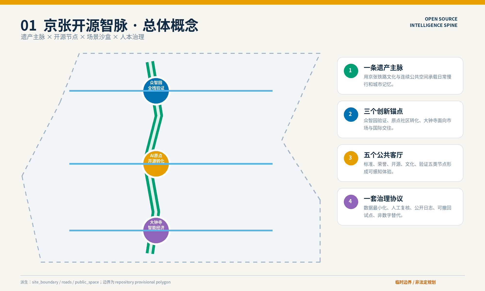
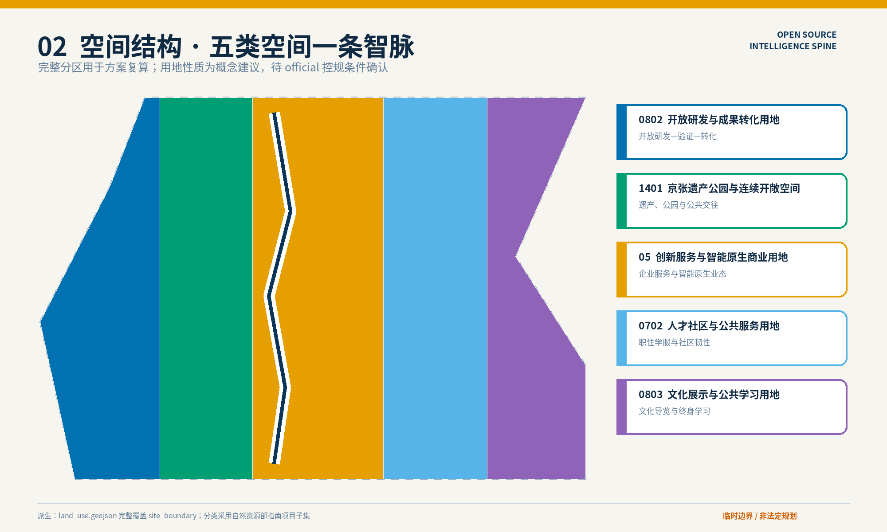
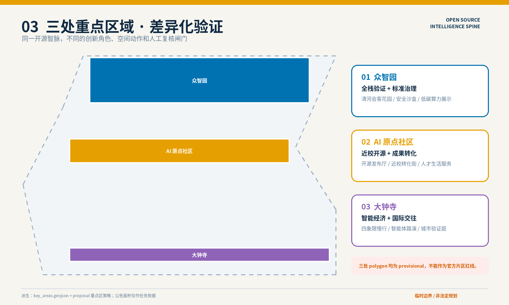
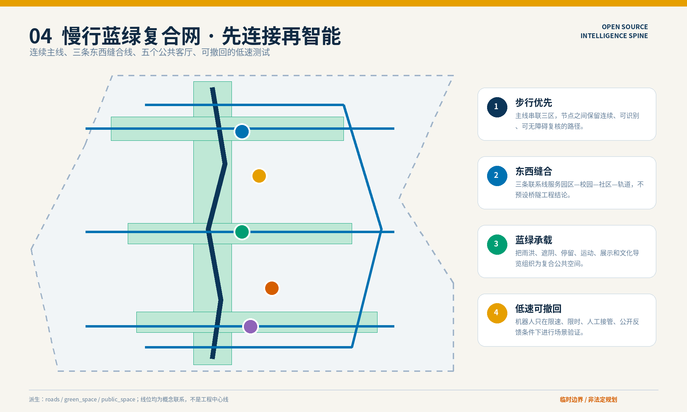
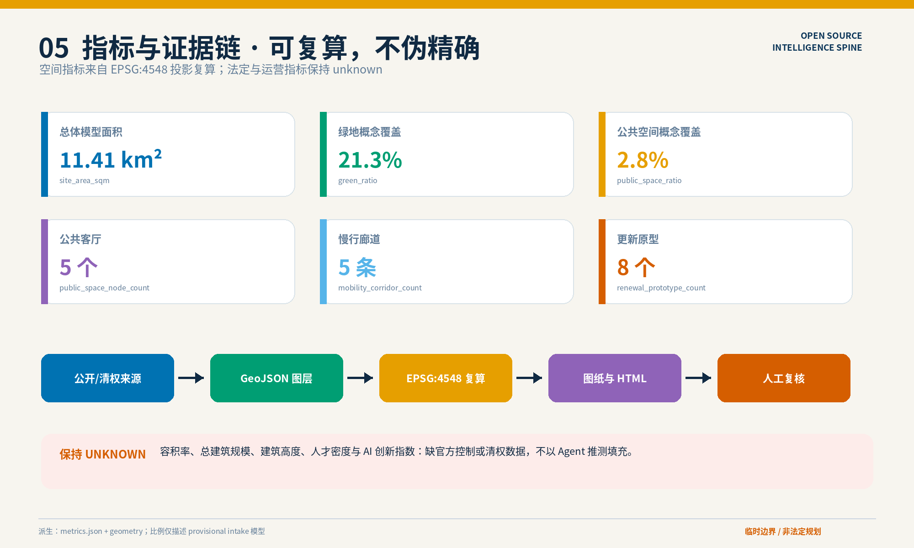

# 京张开源智脉：可验证、可体验、可持续的 AI 城市共生带

本方案把百年京张从一条被观看的遗产线，转化为一条持续产生公共价值的“开源智脉”。空间上，以京张遗址公园串联高校、社区、园区与轨道站点；产业上，以众智园、北京 AI 原点社区和大钟寺形成“验证—转化—交流”三锚；治理上，以数据最小化、人工复核、公开日志和可逆试点约束每一个 AI 场景。总体结构概括为“一脉三锚五客厅”：一条遗产与公共空间主脉，三处差异化创新锚点，标准广场、开发者荣誉廊、原点开源厅、百年时光站、城市验证院五个市民可进入的公共客厅。

## 设计依据与资料清单

方案以资格预审公告和面向智能体任务书为任务依据，以仓库中的 site package、来源登记表和处理后事实包为可追溯工作底板。[source:OFFICIAL-ANNOUNCEMENT] [source:AGENT-TASKBOOK] [source:SITE-PACKAGE] [source:SOURCE-REGISTRY] [source:PROCESSED-FACT-PACK] 对应 [standard:PROJECT-OFFICIAL-ANNOUNCEMENT]、[standard:PROJECT-AGENT-OPEN-CALL-TASKBOOK]、[standard:MOHURD-URBAN-DESIGN-MEASURES]、[standard:MOHURD-CONTROL-DETAILED-PLANNING]、[standard:MNR-LAND-USE-CLASSIFICATION-GUIDE] 与 [standard:MOHURD-ARCH-DESIGN-DEPTH-2016]。上述引用用于区分“任务要求、设计建议、待核实条件”，并落实 [depth:existing_conditions_diagnosis]。

当前仓库未提供正式红线和正式重点区 polygon。方案明确采用临时边界 [source:BOUNDARY-SOURCE] 与临时重点区 [source:KEY-AREA-SOURCE]，其属性均保留 `official_boundary=false`。因此 [data:geometry/site_boundary.geojson#SITE-001] 和 [data:geometry/key_areas.geojson#PROV-KEY-001] 只用于方案生成、空间拓扑检查和设计讨论，不构成审批依据、法定控规或最终权属判断。按当前临时几何复算，总体设计范围为 11,412,825.386 平方米 [metric:site_area_sqm]；正式数据发布后，应整体替换边界并重新裁切用地、建筑、道路、绿地、公共空间和分期图层，而非沿用本次面积数值。

证据等级分为三档：公告、任务书与公开标准用于确认任务边界；仓库中登记的空间数据用于机器检查；场景、项目和形态控制属于本方案的概念建议。所有外部案例只转译运营机制，不移植指标和管控条件。缺失的现状建筑、产权、控规、市政、消防、文保和交通工程资料，统一进入 assumptions 与风险清单，不以推测补齐。

## 三层范围工作框架

三层范围以“研究定机制、总体定骨架、重点区做验证”协同推进 [depth:three_level_scope_framework]：统筹研究范围讨论 AI 生态、人才与未来城市关系；总体设计范围组织城市更新、空间结构、交通市政和蓝绿网络；三个重点区域将功能、场景、公共空间、更新原型与实施依赖落到可审阅图层。总体结构由 [depth:overall_spatial_structure] 校核，空间底板见 [data:geometry/site_boundary.geojson#SITE-001] 与 [data:geometry/key_areas.geojson#PROV-KEY-001]。

“一脉”沿京张遗址公园建立连续步行、骑行、文化叙事和公共服务界面；“三锚”分别承担全栈验证、开源转化、智能经济与国际交流；“五客厅”把技术活动从封闭园区带入日常城市。土地被组织为五个连续的概念分区 [data:geometry/land_use.geojson#LU-001]，它们完整覆盖临时边界并避免重叠，表达结构关系而非法定用地调整。当前模型含 5 个用地区 [metric:land_use_zone_count]、3 个重点区 [metric:key_area_count]、5 条复合廊道 [metric:mobility_corridor_count] 与 5 个公共客厅 [metric:public_space_node_count]。

| 工作层次 | 核心判断 | 对应成果 | 决策边界 |
| --- | --- | --- | --- |
| 统筹研究 | 以开放协作和可信验证补齐创新链 | 生态机制、人才画像、品牌系统、案例转译 | 不推定行政承诺与产业规模 |
| 总体设计 | 以公共脊柱缝合园区、社区、高校和轨道 | 五类用地、五条廊道、蓝绿网络、项目库 | 不替代控规和工程专项 |
| 重点区域 | 三锚分别验证产业、生活与国际交流 | 三处详细策略、建筑原型、场景卡 | 边界与规模待官方 polygon 复算 |

## 统筹研究范围产业与未来城市研究

产业主线不是再建一个封闭“AI 园区”，而是形成可循环的开放创新链：高校与研究机构提出问题，原点社区组织开源协作和人才服务，众智园提供安全评测与全栈验证，大钟寺完成企业服务、展示交易和国际传播，公共空间则作为市民监督与真实需求反馈的界面。由此形成三个定位：京张文化与科技叙事的“城市记忆接口”、开放研发和产业验证的“公共基础设施”、人人可选择进入或退出的“可信 AI 生活实验场”。

“三区两翼”在本方案中被解释为三处重点区与两类外溢网络：西翼连接高校院所、青年人才和开源社区，东翼连接企业总部、商业服务和国际交往。五大功能对应“策源协作、测试验证、企业服务、公共体验、文化传播”。它们是 [source:AGENT-TASKBOOK] 任务要求的设计回应，不是新增法定分区。

品牌名称为“京张开源智脉”，英文为 “Jing-Zhang Open Source Intelligence Spine”。原创标志以两条京张铁轨构成连续主脉，代码花括号 `{ }` 构成开放接口，三个节点表示三处创新锚。主色为京张深蓝 `#0B3558`、开源绿 `#009E73` 和公共活力橙 `#E69F00`；版面采用系统字体和高对比图例，保证离线显示与色觉友好。品牌只用于本次概念方案，不使用未经授权的企业标识、人物肖像或第三方字体。

国际案例仅作为机制参照：one-north 的研发—产业—生活混合组织 [source:CASE-ONE-NORTH]；Seoul AI Hub 的公共测试与企业支持平台 [source:CASE-SEOUL-AI-HUB]；Cambridge Foundry 在 Kendall Square 周边提供可负担社区空间的做法 [source:CASE-KENDALL-SQUARE]；STATION F 以分层项目服务创业团队 [source:CASE-STATION-F]；Mila Ventures 连接研究成果与企业孵化 [source:CASE-MILA]；Barcelona 22@ 以更新框架统筹创新活动和城市环境 [source:CASE-BARCELONA-22AT]。本地转译分别落在混合街区、验证院、公共客厅、成长服务、近校转化和分期更新六类机制中；不直接移植其开发强度、财政工具或治理权限。

## 总体设计范围城市更新与控规深度城市设计

总体空间采用“中部遗产公共脊柱 + 两侧创新生活织补”。五类概念分区依次承担蓝绿遗产、产研协作、生活服务、创新混合与枢纽交流功能 [data:geometry/land_use.geojson#LU-001]。五条交通—慢行复合廊道 [data:geometry/roads.geojson#ROAD-001] 横向接入高校、社区、重点企业与轨道节点，避免所有活动只沿单一轴线纵向流动。建筑层面不做大拆大建，而以 8 个可复制的保留改造与小尺度插建原型验证首层开放、屋顶共享、低碳更新和复合服务 [data:geometry/buildings.geojson#BLDG-001] [metric:renewal_prototype_count]。

用地结构响应 [depth:land_use_layout]，但不改变现行法定用途；强度框架响应 [depth:development_intensity_controls]，但容积率、总建筑面积和建筑高度因缺少正式控规均保持 unknown。正式深化需在地块、产权和现状建筑核验后，按“先保留、再改造、后补缺”的顺序编制地块图则，并用 [standard:MOHURD-CONTROL-DETAILED-PLANNING] 检查道路、设施、开放空间与建设控制的相容性。

公共界面控制采用三条可验证原则：沿主脉的首层优先布置可进入的公共或共享功能；跨路节点至少提供一条连续无障碍路径；新增体量不遮蔽重要遗产叙事节点。其具体退线、限高、日照和消防结论必须等待法定资料与专项论证，当前只作为下一阶段的审查问题。

## 重点区域详细设计

三个重点区共同接受 [depth:three_key_area_detailed_design] 校核，但各自不复制同一种园区模式。它们分别对应“验证生产力、转化创造力、放大影响力”，形成从研究到产品、从产品到市场、从市场回到公共价值评估的闭环。边界分别见 [data:geometry/key_areas.geojson#PROV-KEY-001]、[data:geometry/key_areas.geojson#PROV-KEY-002] 和 [data:geometry/key_areas.geojson#PROV-KEY-003]。

| 重点区 | 定位与空间结构 | 详细动作 | 首批运营内容 |
| --- | --- | --- | --- |
| 众智园 AI 自主创新加速区 | 花园式全栈验证锚；清河生态界面与验证院并置 | 保留可适应改造建筑，增设安全治理沙盒、设备接入庭院、标准广场；以低速环线连接园区入口和公共绿地 | 模型安全评测、端侧设备压力测试、标准公开课、企业联合验证 |
| 北京 AI 原点社区 | 近校开源转化锚；校园—园区—社区形成步行织补 | 建设原点开源厅、开发者荣誉廊和成果转化街；底层嵌入法务、知识产权、托育与平价餐饮 | 代码发布、研究成果路演、导师门诊、社区共创与人才服务 |
| 大钟寺 AI 产业聚集区 | 轨道门户与智能经济交流锚；四象限慢行缝合 | 强化大钟寺站到企业片区的连续步行，设置国际路演客厅、智能终端体验面和可转换活动场地 | 企业服务、产品首发、全球 AI 周、公众体验和国际交流 |

三处均采用“沿街公共层—共享协作层—受控研发层”的垂直分区。公共层不要求数字身份即可进入；共享层实行预约和最小信息登记；受控研发层遵守企业和科研安全边界。建筑形态以可逆隔断、共享中庭和可维护设备带适应技术迭代，避免为短周期产品建设一次性地标。

## AI 创新生态、人才画像与 AI+ 场景

人才不是单一的“高端研发人员”。方案服务六类主体：开源开发者需要协作、发布与贡献声誉；高校师生与研究者需要近校转化和合规咨询；初创团队需要低成本空间、测试环境与客户验证；成熟企业和国际访客需要企业服务、展示交易与跨文化接待；居民、老人和儿童需要无门槛公共服务、安静休闲与数字替代选项；公共服务人员和场地维护者需要可解释告警、明确责任和人工处置界面。每类主体都可选择非数字流程，公共空间不以面部识别或持续个人轨迹采集作为使用前提。

十二个场景均为概念性试点。场景遵守“公开或获授权数据—最小化采集—人工复核—留痕审计—可随时下线”的共同规则。产业验证类场景在表中以“验证”标注。

| 场景卡 | 对象与位置 | 数据与隐私边界 | 人工复核、运营与退出条件 |
| --- | --- | --- | --- |
| 01 模型安全治理沙盒（验证） | 企业/研究团队；众智园城市验证院 | 仅使用授权测试集和合成数据，不接入真实市民身份 | 第三方评测员签发报告；联合实验室运营；出现越权访问立即停测 |
| 02 边缘算力与能耗基准（验证） | 设备企业；众智园端侧驿站 | 记录设备级能耗与延迟，不记录个人内容 | 能源工程师复核；园区运维运营；能耗或温升越限即断开 |
| 03 低速机器人共路测试（验证） | 机器人企业/行人；封闭时段低速环线 | 以匿名障碍物数据为主，不保留可识别人像 | 安全员现场接管；场地运营方负责；近失事件或投诉超阈值即暂停 |
| 04 开源发布厅 | 开发者/师生；原点开源厅 | 展示经许可的仓库元数据，贡献者可匿名 | 社区编辑审核；开源联盟运营；权利人撤回即下架 |
| 05 AI 慢行与无障碍助手 | 居民/访客；京张主脉与断点 | 使用公开路网及主动上报，不持续追踪位置 | 无障碍顾问复核路线；公园运营；错误引导或施工变化即回退静态导视 |
| 06 健康公共服务导航 | 老人/家庭；社区服务客厅 | 不诊断、不存储病历，只链接公开服务信息 | 社区工作人员确认；属地服务站运营；信息过期即停止推荐 |
| 07 学习陪伴与 AI 素养课 | 儿童/家长；原点社区学习空间 | 最小化账号信息，未成年人数据不用于训练 | 教师全程在环；教育公益机构运营；家长可随时退出并删除数据 |
| 08 法律与知识产权门诊 | 初创团队；成果转化街 | 仅处理主动提交材料，默认不进入模型训练 | 执业专业人员审阅；合规服务机构运营；高风险问题转人工办理 |
| 09 京张文化导览 | 市民/游客；百年时光站与主脉 | 使用清权史料与本地离线内容，不采集身份 | 史料编辑复核；文化运营团队负责；争议内容先撤下后核验 |
| 10 企业服务 Copilot | 企业；大钟寺与众智园服务台 | 只索引公开政策和授权企业资料 | 服务专员确认答复；园区服务机构运营；政策更新后旧答案自动失效 |
| 11 公共空间维护审阅 | 运维人员；五客厅与绿地 | 识别设施状态，不识别个人；原图短期留存 | 维护主管派单；公园运维运营；误报率过高即关闭模型、恢复巡检 |
| 12 全球 AI 周公共路线 | 访客/社区；三锚与五客厅 | 活动人流只做分区聚合，不建立个人画像 | 安保与社区代表共同复核；临时组委会运营；拥挤或扰民即限流/取消 |

公共空间场景落在 [data:geometry/public_space.geojson#PUBLIC-001]，蓝绿体验落在 [data:geometry/green_space.geojson#GREEN-001]，慢行和低速测试依托 [data:geometry/roads.geojson#ROAD-001]。五客厅占临时边界约 2.7567% [metric:public_space_ratio]，蓝绿概念网络约占 21.2814% [metric:green_ratio]；两者反映当前模型的空间优先级，而不是法定绿地率或公共空间配建标准。

## 用地、建筑规模与拆改留方案

五类用地按国土空间用途分类原则建立概念性交叉核对 [standard:MNR-LAND-USE-CLASSIFICATION-GUIDE]，不自行创造法定用地代码。建筑策略由 [depth:height_massing_character] 与 [depth:retain_renovate_demolish] 管理，采用四步判断：先核验安全、权属和历史价值；能保留则保留；可通过结构、机电和首层改造适配的则更新；只有无法满足安全或公共连通且经过专项论证的对象才进入拆除研究。

当前 8 个建筑原型 [metric:renewal_prototype_count] 的基底总面积为 861,226.918 平方米 [metric:building_footprint_area_sqm]，对应 [data:geometry/buildings.geojson#BLDG-001]。它们是用于验证布局关系的概念基底，并非现状建筑普查或建设量。建议的形态语言是“低层公共基座 + 可适应研发楼层 + 共享屋顶”，重要公共界面保持小尺度入口和可穿行首层。总建筑面积、容积率、建筑高度仍为 unknown，必须在正式控规、现状测绘、文保、日照、消防与交通承载资料齐备后复算。

## 交通、轨道、市政与公共服务设施

交通体系以“到站即步行、过路不断线、园区可穿行”为目标 [depth:traffic_rail_slow_parking]。五条概念廊道 [metric:mobility_corridor_count] 分别承担京张连续慢行、清河生态联系、校园园区缝合、大钟寺四象限连接和低速验证环。大钟寺站、五道口、清华东路西口及跨北五环节点优先进行无障碍连续性、换乘距离、过街等待与非机动车停放复核。停车坚持共享存量优先，新增停车须由交通评估确定。

市政与新型基础设施响应 [depth:municipal_new_infrastructure]：端侧算力节点与既有公共服务设施共址，设备可独立断电并公开能耗；雨水花园兼作热环境监测样区；活动空间预留可拆卸供电和网络接口。由于 [data:geometry/constraints.geojson#CONSTRAINTS] 目前为空，地下管线、河道蓝线、道路红线、消防通道、文保范围和电力容量均不得由本图推定，需在实施前由相应专业部门复核。

公共服务采用“数字辅助 + 人工窗口 + 纸质/静态替代”三通道。健康、教育、法律和企业服务场景都不让模型作最终决定；涉及权益、资金、诊疗、安全的结果必须由有权限的人员确认，并保留申诉、撤回和数据删除机制。

## 蓝绿空间、公共空间与城市风貌

蓝绿系统以京张遗址公园为脊、清河等生态界面为横向连接，形成四片概念绿地 [data:geometry/green_space.geojson#GREEN-001]。设计动作包括修补南北慢行断点、增加连续树荫与雨水花园、在交通节点设置可停留的无障碍平台、以轻量可拆设施承载展示和运动。该系统落实 [depth:blue_green_public_space]，当前模型绿地比例 [metric:green_ratio] 仅用于方案比较。

五个公共客厅 [metric:public_space_node_count] 形成可辨识的地标体系：标准广场以公开展板呈现测试规则和结果；开发者荣誉廊记录经许可的开源贡献；原点开源厅承载发布与协作；百年时光站连接铁路史料与当代口述；城市验证院让产业测试处于可参观、可隔离、可监管的庭院环境 [data:geometry/public_space.geojson#PUBLIC-001]。它们用同一组“铁轨—花括号—三节点”导视，夜间照明保持低眩光，并为不使用智能终端的人提供等价信息。

风貌上不仿古造景，也不以大屏幕代表 AI。保留铁路线性、工业材料和成熟树木作为时间底纹，新设施以可逆钢木构件、透明展示界面和耐久铺装表达开放性。重要历史资源的保护范围、建设控制和展示内容必须由正式文保资料确认。

## 更新项目清单、实施政策与分期计划

项目库由 [depth:renewal_project_list] 管理，分期由 [depth:phasing_implementation] 与 [data:geometry/phasing.geojson#PHASE-001] 表达。优先采用可撤回、可评估的小项目建立信任，再进入建筑与基础设施更新。

| 编号 | 项目与首要成果 | 阶段 | 前置依赖 | 评估与退出 |
| --- | --- | --- | --- | --- |
| JZ-01 | 主脉断点与无障碍缝合 | 近期试点 | 正式道路红线、交通组织、产权 | 连续通行率；工程条件不满足则改为地面导引 |
| JZ-02 | 五客厅轻量示范 | 近期试点 | 场地许可、社区共议、版权清权 | 到访与投诉并看；扰民或低使用率则调整/撤除 |
| JZ-03 | 众智园城市验证院 | 近期—中期 | 安全责任、设备标准、能源容量 | 测试闭环率与安全事件；越权即停运 |
| JZ-04 | 原点开源厅与成果转化街 | 中期更新 | 权属、现状建筑安全、运营主体 | 开源活动、转化服务和普惠空间时长 |
| JZ-05 | 大钟寺四象限步行连通 | 中期更新 | 轨道、路口、市政和交通专项 | 换乘可达性与过街安全；专项未通过则不建设 |
| JZ-06 | 清河低碳创新界面 | 中期更新 | 河道、防洪、生态专项 | 雨洪与热环境绩效；生态影响超限即回退 |
| JZ-07 | 建筑适应性更新原型 | 中期—远期 | 测绘、权属、结构、消防、控规 | 保留率、能耗和可出租性，不满足则重新定策 |
| JZ-08 | 全球 AI 周与公共路线 | 年度运营 | 公共空间许可、安全与社区协商 | 公共参与、拥挤和噪声；可取消且不固化建设 |

近期对应可逆公共空间、公开治理规则与三类产业验证；中期实施重点区建筑更新、轨道慢行和蓝绿工程；远期在官方边界、控规和产业监测基础上滚动校准。政策工具包括公共空间时段共享、验证场景责任清单、开源成果清权、社区代表参与的场景评审、年度公开绩效报告。所有实施主体均为建议角色，需通过后续采购、授权或协作机制确定。

## 指标体系、面积复算与合规矩阵

指标分为空间复算、法定控制和运营绩效三组 [depth:metrics_recalculation]。空间复算组由 GeoJSON 直接计算：临时范围面积 11,412,825.386 平方米 [metric:site_area_sqm]，概念建筑基底 861,226.918 平方米 [metric:building_footprint_area_sqm]，绿地占比 0.212814 [metric:green_ratio]，公共空间占比 0.027567 [metric:public_space_ratio]，以及 3 个重点区 [metric:key_area_count]、5 个用地区 [metric:land_use_zone_count]、5 条廊道 [metric:mobility_corridor_count]、5 个公共客厅 [metric:public_space_node_count]、8 个更新原型 [metric:renewal_prototype_count]。所有数值均受 provisional boundary 限制。

法定控制组包括容积率、总建筑面积、建筑高度、道路红线、退线和设施标准，因缺少正式资料保持 unknown；运营绩效组包括人才密度、AI 创新指数、场景使用、错误率、投诉与公共价值，须在运营后以透明口径建立基线。合规矩阵逐项连接公告任务、章节、数据、图纸和自检；任何“通过”只说明提交包结构和内部一致性通过，不代表方案获官方批准。

面积复算采用统一投影和相交检查：用地应覆盖站点边界且不重叠，建筑、道路、绿地、公共空间和分期应位于边界内；边界替换后全部指标、图表、HTML 与 PDF 必须一并再生成。图层索引包括 [data:geometry/land_use.geojson#LU-001]、[data:geometry/buildings.geojson#BLDG-001]、[data:geometry/roads.geojson#ROAD-001]、[data:geometry/green_space.geojson#GREEN-001]、[data:geometry/public_space.geojson#PUBLIC-001]、[data:geometry/phasing.geojson#PHASE-001]。

## 风险、版权与合规说明

风险与缺资料由 [depth:risk_missing_data] 管理。最高优先级风险是临时边界带来的范围偏差，其次是现状建筑、产权、控规、道路、市政、消防、文保和公共设施资料缺失。应对方式是保留来源标签、避免伪精确控制、把关键实施动作设为条件性决策，并在正式资料到位后整体复算。技术风险包括模型错误、数据越权和自动化偏见；每个场景均设置人工复核、非数字替代、日志审计和明确退出条件。

图表、地图、HTML、PDF 与文字均由本次提交原创生成，采用仓库登记的数据与系统字体；没有加载远程脚本、地图瓦片、字体、iframe、表单或跟踪器。外部案例只作文字机制参考并在 sources 中登记。详细版权说明见 `report/copyright_statement.md`。

本方案不声称官方批准、法定控规调整、最终土地权属、确定建设规模或政府活动承诺。公共安全、诊疗、教育、法律、审批、资金和企业决策均不交由 AI 自动完成；个人数据默认不采集，必须采集时需另行授权并遵守目的限定和最短保留。

## 参考资料

- 项目公告与智能体任务书：[source:OFFICIAL-ANNOUNCEMENT]、[source:AGENT-TASKBOOK]。
- 仓库任务包、登记表与处理事实包：[source:SITE-PACKAGE]、[source:SOURCE-REGISTRY]、[source:PROCESSED-FACT-PACK]。
- 临时边界与重点区：[source:BOUNDARY-SOURCE]、[source:KEY-AREA-SOURCE]。
- 国际机制案例：JTC one-north [source:CASE-ONE-NORTH]、Seoul AI Hub [source:CASE-SEOUL-AI-HUB]、Cambridge Foundry/Kendall Square [source:CASE-KENDALL-SQUARE]、STATION F [source:CASE-STATION-F]、Mila Ventures [source:CASE-MILA]、Barcelona 22@ [source:CASE-BARCELONA-22AT]。
- 本地标准索引：城市设计管理、控制性详细规划、国土空间用途分类和建筑设计文件深度等均通过 `standard_matrix.json` 与正文机器引用建立对应关系。
