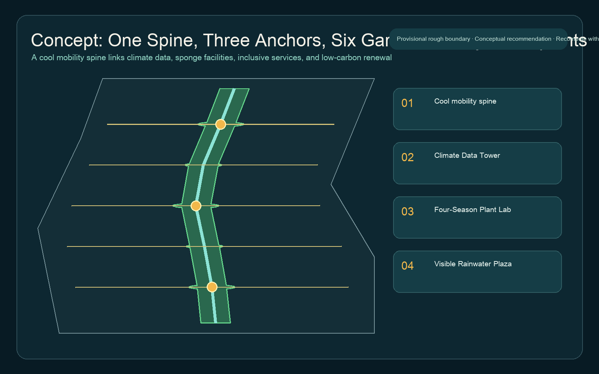
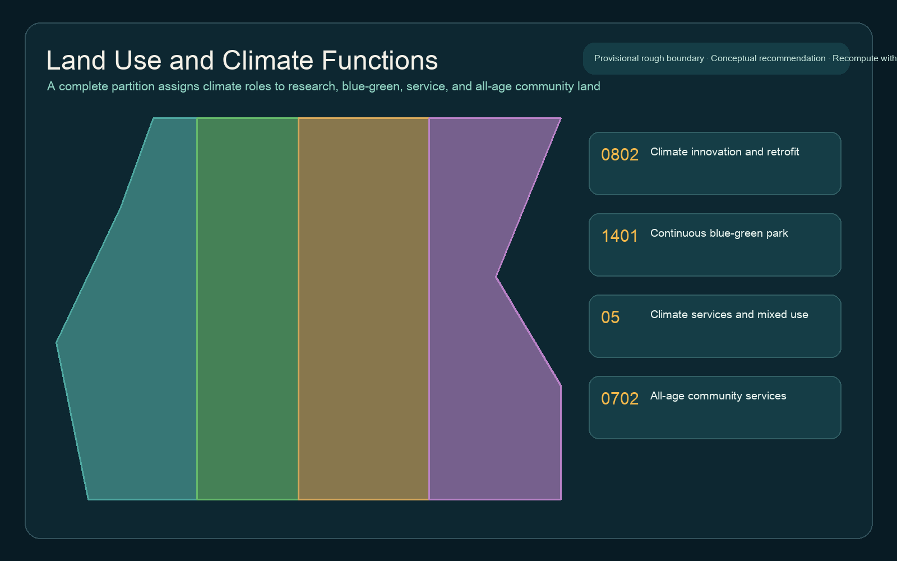
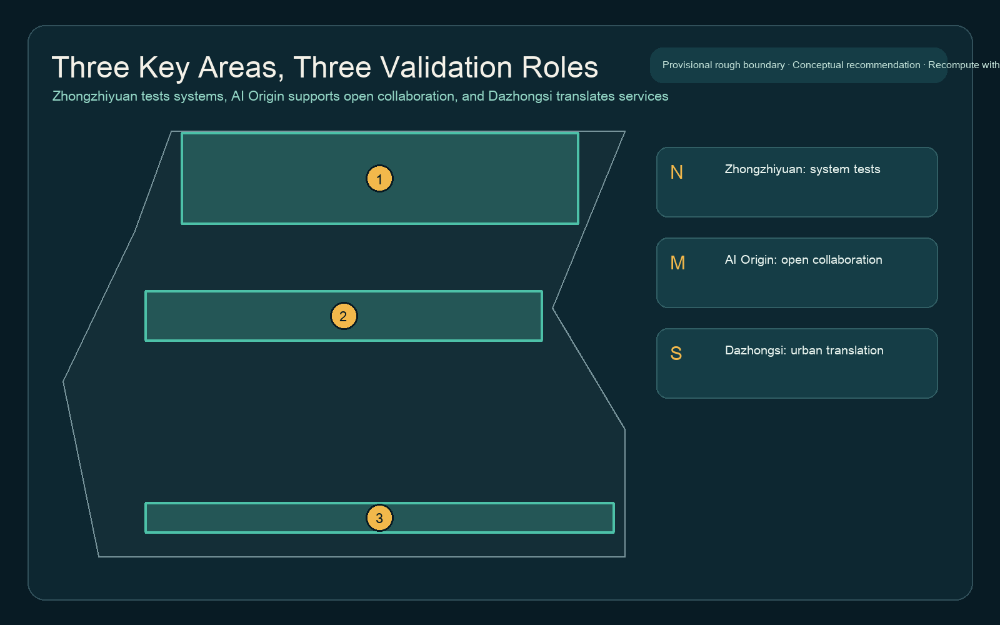
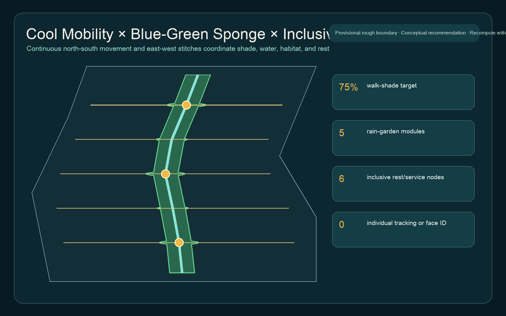
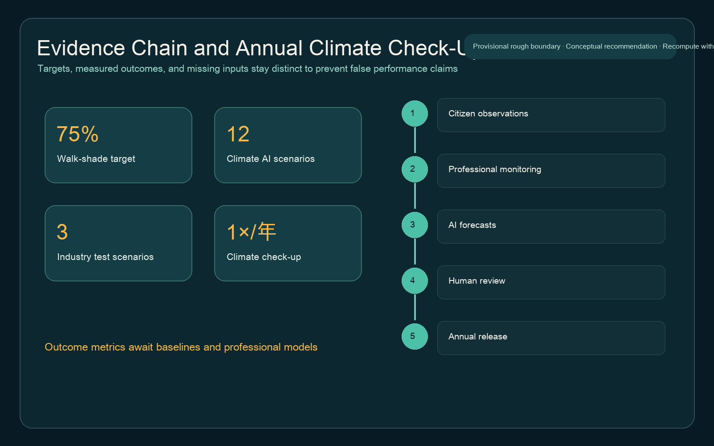

# Jing-Zhang Climate Symbiosis Corridor

> Slogan: AI should do more than appear in displays: it should help the city cool, retain water, save energy, and care for biodiversity.

This package is an open co-creation concept. It does not replace formal planning and is not a government approval, investment commitment, engineering feasibility conclusion, or implementation promise. Spatial work uses the repository's provisional rough boundaries only for generation, presentation, and intake checks. Every geometry layer, area, metric, figure, and drawing must be recalculated when official site and key-area polygons become available.

## Design Basis and Source List

The evidence base has three tiers. Official announcements and national planning references support the task, principles, public-space duties, and the legal distinction between design advice and approved regulatory planning [source:OFFICIAL-ANNOUNCEMENT] [standard:PROJECT-OFFICIAL-ANNOUNCEMENT] [standard:MOHURD-CONTROL-DETAILED-PLANNING]. The rights-cleared Agent taskbook defines naming, the five functions, Three Zones and Two Wings, scenario cards, personas, landmarks, and long-term operations [source:AGENT-TASKBOOK] [standard:PROJECT-AGENT-OPEN-CALL-TASKBOOK]. Repository geometry is provisional-only and cannot become an official boundary through repeated use [source:BOUNDARY-SOURCE] [source:KEY-AREA-SOURCE].

The Source Registry distinguishes formal, background-only, and provisional-only material; the processed fact pack is navigation rather than new authority [source:SOURCE-REGISTRY] [source:PROCESSED-FACT-PACK]. Land-use codes follow the national classification logic, but the proposed partition is conceptual and does not approve any parcel use [source:MNR-LAND-USE] [standard:MNR-LAND-USE-CLASSIFICATION-GUIDE]. Public-space and character decisions follow people-centered, nature-conscious, and heritage-aware urban-design principles [source:URBAN-DESIGN-MEASURES] [standard:MOHURD-URBAN-DESIGN-MEASURES].

Missing official boundaries, controls, road sections, heritage areas, municipal and flood data, ownership, climate baselines, meters, and ecological surveys are treated as design constraints. The gaps do not block content review, but they prevent a shade target from becoming a measured achievement or a rain garden from becoming certified drainage infrastructure [depth:existing_conditions_diagnosis] [data:geometry/constraints.geojson].

## Three-Level Scope Framework

The 43.6-square-kilometre Coordinated Research Area frames industry, talent, compute, data, scenarios, and ecological cooperation. The roughly 11.4-square-kilometre Overall Design Area organizes a continuous Cool Mobility Spine around the Jing-Zhang Railway Heritage Park. Zhongzhiyuan, Beijing AI Origin Community, and Dazhongsi take on distinct validation roles in the Key-Area Detailed Design Area. Announced areas remain task evidence; the submitted area is a provisional geometric calculation [data:geometry/site_boundary.geojson#SITE-001] [metric:site_area_sqm] [depth:three_level_scope_framework].

The structure is "One Spine, Three Anchors, Six Gardens, Many Touchpoints." The spine is a continuous shaded walking and cycling armature. The anchors are the Climate Data Tower, Four-Season Plant Laboratory Garden, and Visible Rainwater Plaza. Five rain-garden modules plus the continuous habitat corridor make six gardens. Touchpoints provide rest, drinking water, human assistance, tree observation, energy diagnostics, and citizen reporting. A north-south spine and five east-west stitch links form the geometric network [data:geometry/roads.geojson#ROAD-COOL-SPINE] [metric:slow_mobility_length_m] [depth:overall_spatial_structure].

The scopes are one evidence chain rather than three disconnected drawing sets. The coordinated scale defines ecosystem and governance, the overall scale locates land use and infrastructure, and the key areas test operating scenarios. Topological containment does not prove ownership, regulatory, heritage, or engineering feasibility.

## Coordinated Research Area: Industry and Future City Research

The identity combines paired railway lines, a leaf vein, and a rain ripple. Deep green, rainwater blue, and warm railway brick provide the palette. "Symbiosis" describes mutual learning among city, technology, climate, and living systems rather than an AI decoration. The three official positionings become cultural memory, urban climate experience, and AI-enabled innovation; the five functions become a climate technology stack, open ecosystem, AI-enabled climate scenarios, an inclusive active city, and auditable governance.

Five international cases contribute mechanisms, not copied branding or unverified statistics. Singapore's one-north demonstrates work-live-play-learn clustering and adaptable test space [source:CASE-ONE-NORTH]. Paris-Saclay links science, incubation, open innovation, and green transition [source:CASE-PARIS-SACLAY]. Barcelona 22@ offers a long view of industrial-area renewal and innovation governance [source:CASE-BARCELONA-22AT]. Testbed Helsinki shows that urban pilots need open calls, evaluation, and a clear statement that experimentation is not procurement [source:CASE-HELSINKI-TESTBED]. Seoul Digital Media City supplies a background lesson in digital-content clustering and district identity [source:CASE-SEOUL-DMC]. Jing-Zhang's translation is to place climate evidence, public space, and human review inside one scenario protocol.

The future-city hypothesis is climate service as everyday infrastructure. Residents encounter cooler routes, visible water cycles, healthier trees, and human help. Companies and universities encounter de-identified samples, open benchmarks, exit rules, and professional review. Public managers receive annual trends rather than a black-box score. No company list, investment volume, public subsidy, or implementation commitment is fabricated.

## Overall Design Area: Urban Renewal and Regulatory-Plan-Level Urban Design

A complete, gap-free partition assigns four conceptual roles: climate innovation and low-carbon renewal; continuous blue-green park; climate services and mixed-use vitality; and all-age community services [data:geometry/land_use.geojson#LU-001] [metric:land_use_research_area_sqm] [depth:land_use_layout]. These roles answer where climate tasks might fit, not what parcel use has legal approval. Research and renewal land hosts building diagnostics and climate-tech tests. Blue-green land provides shade, source control, and habitat continuity. Service land supports operations and exchange. Community-service land protects parallel digital and human channels for older adults, children, carers, and disabled people.

Renewal follows "diagnose first, make light changes second, expand only after evidence." Six low-carbon building prototypes express retention-first assessment, envelope improvement, equipment tuning, schedule coordination, and active ground floors. They do not decide any actual building's demolition or reconstruction [data:geometry/buildings.geojson#BLDG-CLIMATE-01] [metric:building_footprint_area_sqm] [depth:retain_renovate_demolish]. FAR, height, coverage, setbacks, and total floor area remain pending official controls and ownership data [metric:floor_area_ratio] [depth:development_intensity_controls] [depth:height_massing_character].

Regulatory-plan-level depth here means an auditable design chain, not statutory force: complete land coverage, locatable mobility and blue-green systems, differentiated key areas, dependency-led projects, known-versus-unknown metrics, and traceable risk. Qualified professional teams must deepen the work using official surveys, controls, roads, utilities, fire, flood, and heritage inputs.

## Detailed Design of Key Areas

The key areas retain the repository's provisional polygons. Their rectangular edges are not roads, parcels, or ownership boundaries [data:geometry/key_areas.geojson#PROV-KEY-001] [metric:key_area_count] [depth:three_key_area_detailed_design]. All three test how AI can serve climate-related public value, but in different ways.

Zhongzhiyuan becomes a full-stack climate test area. The Climate Data Tower reveals sensor health, missing data, model uncertainty, human review, and device energy rather than offering a spectacular screen. A shaded Qinghe interface links rain gardens and a safety-governance sandbox. Sensor, tower, energy, river, and access engineering remain for professional development.

Beijing AI Origin Community becomes the open-collaboration and talent-lifestyle area. The Four-Season Plant Laboratory Garden connects phenology, shade, habitat, and maintenance experiments to universities and residents. An open-source hall displays licensed models, data dictionaries, and failure cases. Low-disturbance renewal and walking-first service repair do not imply university or property-owner consent.

Dazhongsi becomes the urban-service translation area. The Visible Rainwater Plaza uses safe surface flows, level marks, and offline explanations to make water legible while supporting AI-native services, exchange, and inclusive rest. Four-quadrant station connections remain conceptual goals for accessibility, shade, and bicycle organization until rail, road, utility, and safety review [data:geometry/public_space.geojson#PUBLIC-RAIN-PLAZA] [metric:climate_landmark_count].

## AI Innovation Ecosystem, Personas, and AI+ Scenarios

Six personas structure the proposal: an older daily commuter who needs frequent shade and rest; a child with a carer; a wheelchair or mobility-aid user; a landscape and sponge-facility maintainer; a university developer or climate researcher; and a public-building energy or scenario operator. Each persona maps to space, service, data, and a human fallback. Accessibility law and older-adult smart-technology policy support principles, not a claim that existing facilities comply or that local implementation is confirmed [source:BARRIER-FREE-LAW] [source:ELDERLY-SMART-TECH-BACKGROUND].

| # | Scenario Card | Spatial Carrier | AI Task and Human Boundary |
|---|---|---|---|
|01|Urban heat monitoring|Cool Spine|Sensors and transects flag anomalies; professionals interpret weather and device error|
|02|Shade-aware routing|Corridor and key areas|Explain canopy, rest, slope, and crossings; retain offline wayfinding|
|03|Sponge-facility maintenance|Rain gardens and plaza|Rain, ponding, and inspections suggest work orders; no autonomous closure|
|04|Tree-health recognition|Plant Laboratory Garden|Imagery triages; arborists review diagnoses and false positives|
|05|Public-building energy coordination|Renewal prototypes|Authorized aggregate meters flag anomalies; owners retain control|
|06|Biodiversity observation|Habitat corridor|Citizen records complement professional plots; sensitive locations are blurred|
|07|Heavy-rain safety guidance|Links and stations|Approved emergency information supports rerouting; official warnings prevail|
|08|All-age access audit|Six node types|Older adults, children, carers, and disabled users audit barriers together|
|09|Low-carbon retrofit diagnostics|Public buildings|Separate envelope, equipment, and schedules; tune before expansion|
|10|Event carbon budget|Climate Week route|Report transport, energy, waste, and estimation limits without claiming certification|
|11|Citizen-observation verification|Observation stations|Remove personal data and review samples before annual trend inclusion|
|12|Open climate sandbox|Three key areas|Open de-identified samples, benchmarks, and exit rules; a pilot is not procurement|

Scenarios 02, 04, and 05 are the three industry testing and validation scenarios. Field route comparison, arborist-labelled error, and weather-normalized meter anomalies define their evidence [metric:climate_scenario_count] [metric:industry_test_scenario_count]. Each pilot requires an owner, duration, exit, complaint path, deletion policy, and human final judgment. Facial recognition and individual movement profiling are out of scope.

## Land Use, Building Scale, and Retain-Renovate-Demolish Strategy

The four land-use areas are recalculated from a shared, complete provisional partition [metric:land_use_green_area_sqm] [metric:land_use_service_area_sqm] [metric:land_use_community_area_sqm]. They check internal consistency rather than provide approval-ready quantities. Official planning and land-use controls remain decisive for parcels.

A five-stage building decision tree - retain, diagnose, light retrofit, deep retrofit, or hold - replaces demolition-first assumptions. Missing heritage value, structural safety, operational efficiency, carbon, and ownership data prevents demolition or new-build conclusions. Public buildings establish energy baselines and tune operations before envelope and equipment projects. Energy reduction remains unknown without authorized meters, floor area, schedules, and weather normalization [metric:building_energy_reduction_ratio].

Warm railway brick, repairable metal, permeable surfaces, and a continuous canopy create a restrained technological character. Climate displays show provenance and update times without becoming advertising screens. Lighting prioritizes safety, low glare, and habitat sensitivity. Height, massing, roofs, and interfaces remain directions for professional development rather than numeric controls.

## Transport, Rail, Municipal Infrastructure, and Public Services

The Cool Mobility Spine runs north-south while five east-west links stitch communities, campuses, rail, and the heritage park. Length is recalculated from design lines, but exact alignments, sections, crossings, bridges, and tunnels await official inputs and transport review [data:geometry/roads.geojson#ROAD-CROSS-01] [metric:slow_mobility_length_m] [depth:traffic_rail_slow_parking]. Seventy-five percent is a shade target for priority walking routes, to be tested by hot-season segment measurement or calibrated models [metric:walk_shade_target_ratio].

Municipal design follows "measure, then control, then coordinate." Rainwater facilities do not connect to unknown pipes. Energy coordination does not bypass owner control. Edge compute and sensors require energy budgets, offline operation, visible failure states, and manual bypass [depth:municipal_new_infrastructure]. Six inclusive node types offer seating, water, toilet guidance, human help, shade, and night safety; accessibility coverage awaits entrances, gradients, curb ramps, and crossings [metric:inclusive_access_node_count] [metric:elder_child_accessibility_ratio].

Transit-station integration is framed as a ten-minute climate-comfort walk after exiting the gate, not a straight-line radius. Dazhongsi, Wudaokou, and Qinghuadongluxikou connections require gate, street, ownership, and construction checks. Emergency routing uses authoritative warnings and site signs; AI does not autonomously close or evacuate space.

## Blue-Green Network, Public Space, and Urban Character

A continuous canopy and rain-garden network follows the spine and expands into five combined retention, habitat, and rest modules [data:geometry/green_space.geojson#GREEN-COOL-SPINE] [metric:green_space_area_sqm] [depth:blue_green_public_space]. A geometric continuity ratio of 1.0 only means the design corridor is unbroken. Biodiversity performance awaits four-season species, habitat-quality, and barrier-permeability surveys [metric:green_spine_continuity_ratio] [metric:biodiversity_connectivity_index].

Three landmarks turn invisible climate processes into public knowledge. The Climate Data Tower displays sensor health, gaps, and forecast intervals. The Plant Laboratory Garden compares phenology, shade, and care without announcing an unverified "best species." The Rainwater Plaza explains a storm's pathway through safe, maintainable surfaces and level markers. A Climate Ledger records verifiable contributions from citizens, landscape teams, researchers, schools, and operators without ranking people by tracked behavior.

Green and public-space ratios come from design geometry and inherit provisional-boundary uncertainty [metric:green_ratio] [metric:public_space_ratio]. Rain-garden count records spatial modules, not hydraulic capacity. Without design storms, soils, groundwater, catchments, pipes, and maintenance data, the proposal makes no cubic-metre or flood-performance claim [metric:rain_garden_count] [metric:rainwater_retention_performance].

## Renewal Projects, Implementation Policy, and Phasing

The near term measures before building: hot-season baselines, tree and access audits, five light rain-garden pilots, shade-route comparison, and temporary educational versions of the three landmarks. The mid term combines validated shade, sponge, building tuning, and public services into professional renewal packages. The long term establishes an annual Climate Check-Up, open benchmarks, and a rolling project library [data:geometry/phasing.geojson#PHASE-001] [depth:phasing_implementation]. These phases express dependencies rather than an approved schedule.

The project list includes JZ-C01 Cool Spine Pilot; JZ-C02 Five-Garden Sponge Modules; JZ-C03 Climate Data Tower; JZ-C04 Four-Season Plant Lab; JZ-C05 Visible Rainwater Plaza; JZ-C06 Public-Building Energy Check-Up; JZ-C07 All-Age Access Audit; and JZ-C08 Annual Climate Ledger. Before initiation, each needs accountable professionals, official boundaries, ownership, heritage, utilities, safety, procurement, data governance, and maintenance funding [depth:renewal_project_list].

The scenario-access policy moves from problem statement to pilot protocol, professional evaluation, public explanation, and exit or expansion. Passing a sandbox test does not grant procurement, funding, or planning permission. A proposed Jing-Zhang Climate Symbiosis Day shares failed experiments and data gaps, connected to a Developer Week, Plant Observation Seasons, and a Heavy-Rain Exercise.

## Metrics, Area Recalculation, and Compliance Matrix

Supply metrics are directly countable in the package: mobility length, three landmarks, five rain-garden modules, twelve scenario cards, and three industry tests [metric:climate_landmark_count] [metric:climate_scenario_count] [metric:industry_test_scenario_count]. The 75% shade ratio is a target requiring measurement. Heat exposure, runoff retention, energy, biodiversity, and older-adult/child accessibility remain unknown until baselines exist [metric:heat_exposure_reduction_ratio] [metric:rainwater_retention_performance] [metric:elder_child_accessibility_ratio].

The annual cycle is citizen observation, professional monitoring, AI forecasts, human review, and public release. One cycle per year is an operating proposal, not a confirmed government programme [metric:annual_climate_checkup_count] [depth:metrics_recalculation]. Citizens report shade, ponding, barriers, and species. Professionals own instruments, plots, hydrology, and energy. AI checks quality, identifies gaps, and compares scenarios. Human reviewers decide what enters a public trend and project list.

The compliance matrix maps all 23 requirements in Sections 1.3, 1.4, 1.5 and agent.1-agent.6. The standards matrix covers every mandatory reference; the design-depth matrix points from each complete item to prose, geometry, metrics, drawings, and self-checks. A PASS means the package can enter review, not that it is excellent, approved, or buildable.

## Risk, Copyright, and Compliance

The first risk is mistaking provisional polygons for official boundaries. Every figure de-emphasizes them and rejects precise regulatory, road, heritage, ownership, or engineering conclusions. The second risk is turning targets into achievements: shade remains a target; heat, water, energy, ecology, and access remain pending measurement. The third risk is excessive AI governance: no face recognition, individual trajectory, secret map, internal enterprise data, or unreviewable automatic decision is proposed [depth:risk_missing_data].

The bilingual Markdown, HTML, A3/A0 PDFs, and text-bearing figures align in chapter order, metrics, evidence, and placement. The cover was generated with OpenAI image generation for this task. It is a conceptual illustration, not a site photograph, resident testimony, official rendering, or construction promise [source:GENERATED-COVER]. Figures and PDFs render with a system font that is not redistributed as a standalone file. Full rights and method notes appear in `report/copyright_statement.md`.

Public data follows minimization, purpose limitation, retention, withdrawal, and complaint mechanisms. Sensitive species locations are delayed or blurred. Building energy requires owner authorization and aggregation. External communication must distinguish submitted, reviewed, selected, and implemented status. Every spatial move is a conceptual recommendation or reference scheme for professional teams to deepen.

## References

Full publisher, access date, source type, use, and limitation records are in `sources.json`. Core references include the official announcement, Agent taskbook, urban-design and regulatory-planning standards, land-use classification, accessibility principles, the Source Registry, and provisional geometry [source:SITE-PACKAGE] [source:OFFICIAL-ANNOUNCEMENT] [source:AGENT-TASKBOOK]. International cases support transferable mechanisms only. The machine-audit layer consists of `metrics.json`, `assumptions.json`, nine GeoJSON files, three matrices, and `self_check.json`.
