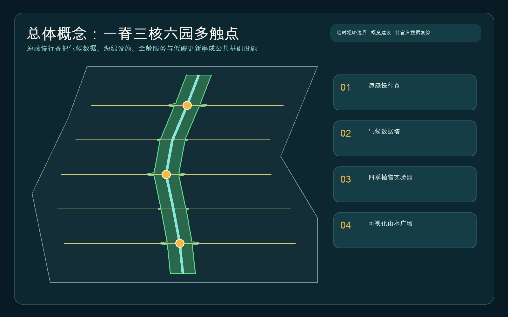
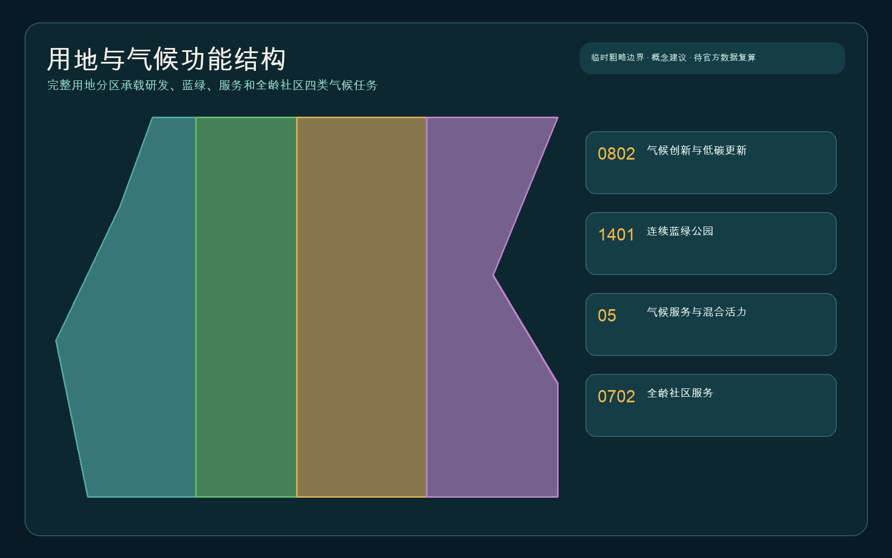
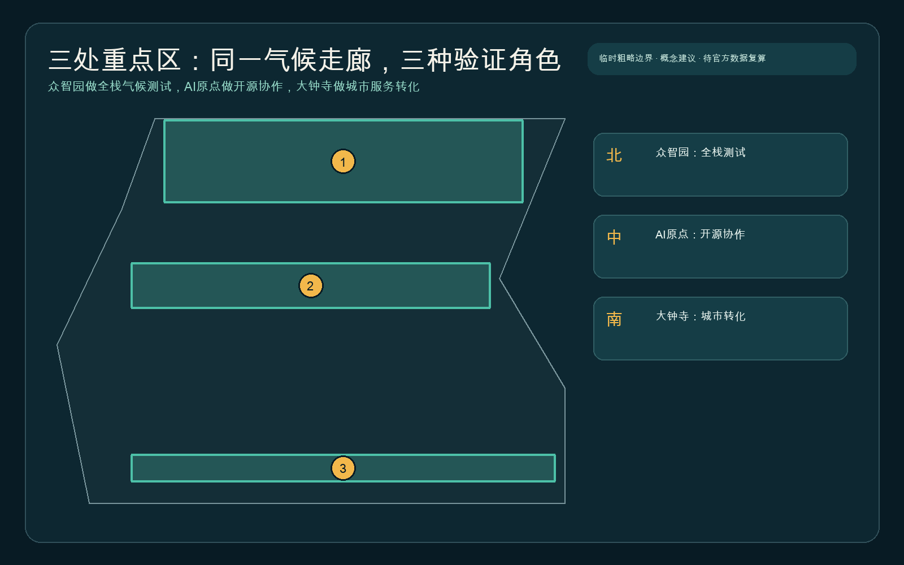
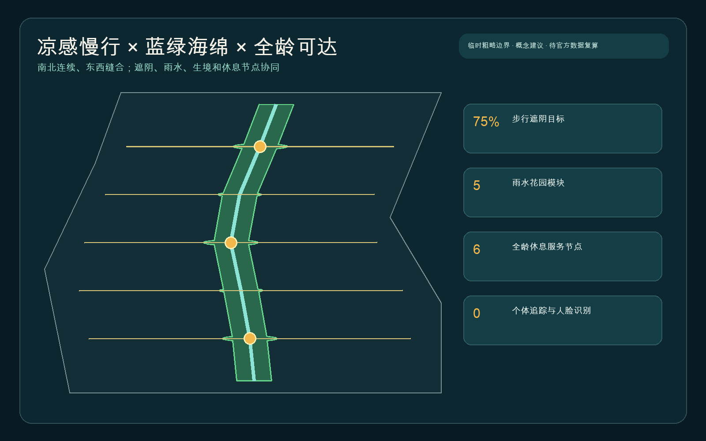
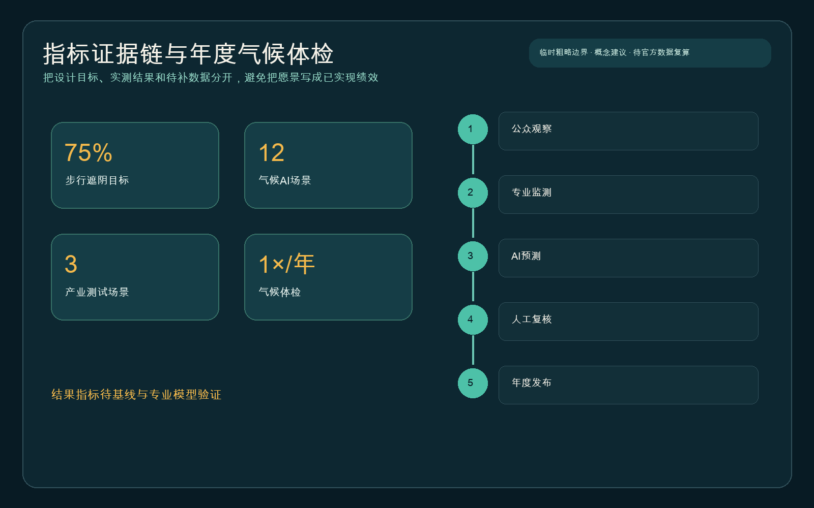

# 京张气候共生走廊

> 口号：让 AI 不只是被展示，而是帮助城市降温、蓄水、节能和照顾生物多样性。

本成果是开放共创的概念建议，不替代正式规划，不构成政府审定、投资、工程可行性或实施承诺。空间分析沿用仓库临时粗略边界，只用于生成、可视化和入口自检；待官方红线与重点区 polygon 发布后，所有图层、面积、指标、图件和图纸必须整体复算。

## 设计依据与资料清单

方案把资料分成三层。第一层是可支撑任务与原则的官方公告、城市设计办法、控规编制办法和用地分类指南；它们确认项目目标、三层范围、城市设计应关注公共空间和风貌，以及法定控规必须由依法批准资料支撑 [source:OFFICIAL-ANNOUNCEMENT] [standard:PROJECT-OFFICIAL-ANNOUNCEMENT] [standard:MOHURD-CONTROL-DETAILED-PLANNING]。第二层是清权的智能体任务书，用于确定命名、五大功能、三区两翼、场景卡、用户画像、地标和长期运营要求 [source:AGENT-TASKBOOK] [standard:PROJECT-AGENT-OPEN-CALL-TASKBOOK]。第三层是仓库临时几何，只能支持构图与自检，不得升级为 official boundary [source:BOUNDARY-SOURCE] [source:KEY-AREA-SOURCE]。

公开来源登记表用于区分 formal、background_only 与 provisional_only；处理后的事实包只承担阅读导航，不新增权威性 [source:SOURCE-REGISTRY] [source:PROCESSED-FACT-PACK]。用地代码遵循自然资源部分类逻辑，但本方案用地仍是概念性分区，不代表地块用途获批 [source:MNR-LAND-USE] [standard:MNR-LAND-USE-CLASSIFICATION-GUIDE]。总体设计、公共空间和风貌判断遵循以人为本、自然共生与历史传承原则 [source:URBAN-DESIGN-MEASURES] [standard:MOHURD-URBAN-DESIGN-MEASURES]。

资料缺口被写成设计约束：缺官方红线、控规、道路断面、文保控制、市政防洪、建筑权属、气候基线、能耗与生态调查。它们不会阻断内容评审，却阻止我们把 75% 遮阴目标写成现状达标率，或把雨水花园写成已核定排水设施 [depth:existing_conditions_diagnosis] [data:geometry/constraints.geojson]。

## 三层范围工作框架

统筹研究范围以 43.6 平方公里的产业、人才、算力、数据、场景和生态协同为对象，提出“气候技术也应成为 AI 创新生态的一部分”；总体设计范围沿约 11.4 平方公里的京张遗址公园周边组织连续凉感慢行脊；重点区域范围在众智园、北京 AI 原点社区和大钟寺配置不同验证角色。公告面积是任务依据，提交边界复算面积为临时几何结果 [data:geometry/site_boundary.geojson#SITE-001] [metric:site_area_sqm] [depth:three_level_scope_framework]。

总体空间结构概括为“一脊、三核、六园、多触点”。一脊是南北连续的凉感步行与骑行骨架；三核是气候数据塔、四季植物实验园、可视化雨水广场；“六园”包括五个雨水花园模块与一条连续生境带；多触点是遮阴休息、饮水、无障碍帮助、树木观察、能耗诊断和公众记录节点。几何上，慢行主脊与东西缝合支线形成连续网络 [data:geometry/roads.geojson#ROAD-COOL-SPINE] [metric:slow_mobility_length_m] [depth:overall_spatial_structure]。

三层并非三套互不关联的图纸。统筹层提出生态与治理机制，总体层把机制落到用地、道路、绿地、公共空间与低碳更新，重点区则用可运营场景检验设计。全部 feature 保持在当前临时边界内，但这仅说明拓扑一致，不说明工程、权属、控规或文保可行。

## 统筹研究范围产业与未来城市研究

“京张气候共生走廊 / Jing-Zhang Climate Symbiosis Corridor”的识别系统以铁路双线、叶片脉络和雨滴涟漪三种几何合成为核心标记；主色为深叶绿、雨水蓝与铁路暖砖色。命名不把 AI 当作装饰，而把“共生”定义为城市、技术、气候与生命系统共同学习。三大定位对应文化记忆、都市气候生活体验和 AI 融合创新；五大功能被转译为气候全栈工具链、世界级开放生态、AI+气候场景、全龄活力城市与可审计治理。

五个国际案例只作为可转化机制，不复制地名或统计结论：新加坡 one-north 提供“工作-生活-游憩-学习”和灵活试验空间的组织启发 [source:CASE-ONE-NORTH]；Paris-Saclay 展示科研、孵化、开放创新和绿色转型的网络化连接 [source:CASE-PARIS-SACLAY]；Barcelona 22@ 提供旧产业区更新、基础设施与创新治理协同的长期视角 [source:CASE-BARCELONA-22AT]；Helsinki Testbed 强调真实城市试验必须设开放申请、评估和“试验不等于采购”的边界 [source:CASE-HELSINKI-TESTBED]；Seoul Digital Media City 提供数字内容产业与地区识别的背景案例 [source:CASE-SEOUL-DMC]。京张的转化重点不是追逐规模，而是把气候数据、公共空间和专业复核纳入共同的场景协议。

未来城市假设是“气候服务成为日常基础设施”。公众每天感知的是更凉的路线、可见的雨水过程、健康的树木和可获得的人工帮助；企业与高校获得的是脱敏样本、开放评测、试验退出机制和专业复核接口；管理者得到的是年度趋势而非黑箱分数。方案不编造企业名单、投资额或政策承诺，只提出从公开问题到可复现试验、再到专业评估的合作路径。

## 总体设计范围城市更新与控规深度城市设计

用地采用完整、无缝、无重叠的四类概念分区：气候创新与低碳更新、连续蓝绿公园、气候服务与混合活力、全龄社区服务 [data:geometry/land_use.geojson#LU-001] [metric:land_use_research_area_sqm] [depth:land_use_layout]。分区回答“什么气候任务适合在哪类空间发生”，不回答法定地块用途。研发与更新区承担建筑体检和气候技术验证；蓝绿区承担遮阴、滞蓄与生境连续；服务区承接国际交流、场景运营和日常商业；社区服务区保障老人、儿童、照护者和残障人士可使用的人工与数字并行服务。

城市更新遵循“先体检、再微改、后扩展”。六个低碳建筑原型只表达保留优先、围护结构改善、设备优化、使用时段协同和首层公共性，不构成具体建筑的拆除、改造或新建结论 [data:geometry/buildings.geojson#BLDG-CLIMATE-01] [metric:building_footprint_area_sqm] [depth:retain_renovate_demolish]。容积率、建筑高度、建筑密度、退线和总建筑规模均待官方控规与权属资料，正文不以推测数值填空 [metric:floor_area_ratio] [depth:development_intensity_controls] [depth:height_massing_character]。

控规深度在本包中体现为证据链而非法定效力：用地完整覆盖、交通和蓝绿系统可定位、重点区有差异化设计、更新项目有依赖条件、指标区分已知与未知、风险可追踪。正式深化需由具备资质的专业团队结合官方现状、控规、道路、市政、消防、防洪和文保条件开展。

## 重点区域详细设计

三处重点区沿用仓库临时 polygon，矩形边不得解释为道路、地块或权属边界 [data:geometry/key_areas.geojson#PROV-KEY-001] [metric:key_area_count] [depth:three_key_area_detailed_design]。三者共同验证“AI 如何为气候公共利益工作”，但角色不同。

众智园建议承担“全栈气候测试”：气候数据塔不是炫技屏幕，而是把传感器状态、数据质量、模型不确定性、人工复核与设备能耗公开为可读界面；清河界面以树荫、雨水花园和安全治理沙盒联动。所有传感器、塔体、能源和河道设计需专业深化，不能据此声称工程可行。

北京 AI 原点社区建议承担“开源协作与人才日常”：四季植物实验园把树种、生境、遮阴、物候和养护试验与高校、社区共同观察连接；开源发布厅展示经过许可的模型、数据字典和失败案例。近校更新以低扰动、步行优先和服务补缺为导向，不假设高校或园区已同意改造。

大钟寺建议承担“城市服务转化”：可视化雨水广场用水位刻度、地表路径和离线说明展示雨水去向，同时连接智能原生消费、路演和全龄休息。大钟寺站四象限只提出无障碍、遮阴和非机动车组织的概念目标，道路红线、轨道结构、市政管线与交通安全必须另行论证 [data:geometry/public_space.geojson#PUBLIC-RAIN-PLAZA] [metric:climate_landmark_count]。

## AI 创新生态、人才画像与 AI+ 场景

六类用户画像包括：每日通勤、在热浪中需要频繁休息的老人；由照护者陪同的儿童；使用轮椅或助行器的访客；园林与海绵设施维护人员；高校开发者与气候研究者；承担能耗管理与场景运营的公共建筑团队。每类画像都映射到空间、服务、数据与人工后备，避免把“用户”简化为被追踪的数据点。无障碍法律和老年智能技术政策只支撑原则性设计，不能推断现状设施合规或本地政策已落实 [source:BARRIER-FREE-LAW] [source:ELDERLY-SMART-TECH-BACKGROUND]。

| # | 场景卡 | 空间载体 | AI任务与人工边界 |
|---|---|---|---|
|01|热岛监测|凉感慢行脊|固定点与移动测温提示异常；专业人员解释气象与设备误差|
|02|遮阴路线推荐|全线与重点区|按树荫、休息、坡度和过街给出可解释路线；保留离线导视|
|03|海绵设施维护|雨水花园与雨水广场|雨量、积水和巡检生成工单建议；不自动关闭设施|
|04|树木健康识别|四季植物实验园|影像只做初筛；园林人员复核病虫害与误报|
|05|公共建筑能耗协同|低碳更新原型|授权后的聚合能耗发现异常；控制权留给业主|
|06|生物多样性观察|连续生境带|公众记录与专业样方并行；敏感物种位置模糊发布|
|07|暴雨安全引导|慢行支线与站点|引用批准的应急信息提示绕行；不替代官方预警|
|08|全龄可达审计|六类休息服务节点|老人、儿童、照护者与残障人士共同核查|
|09|低碳更新诊断|公共建筑|围护、设备、时段分开诊断；先改造、后讨论扩展|
|10|活动碳预算|年度气候周路线|公开交通、能耗、废弃物和估算边界；不冒充核证|
|11|公众观察校验|公众观察站|去除个人信息并抽样复核后才进入年度趋势|
|12|开放气候沙盒|三处重点区|开放脱敏样本、基准和退出机制；试验不等于采购|

其中 02“遮阴路线”、04“树木健康”、05“建筑能耗协同”是三项产业测试验证场景，分别以路线现场对照、园林标注集误差和天气归一化能耗异常为验收对象 [metric:climate_scenario_count] [metric:industry_test_scenario_count]。任何试验都需要明确责任主体、期限、退出、投诉、数据删除与人类最终判断，不采用人脸识别或个体轨迹画像。

## 用地、建筑规模与拆改留方案

四类用地面积由同一临时边界分区复算：研发更新、连续蓝绿、气候服务与社区服务分别保持闭合共享边界 [metric:land_use_green_area_sqm] [metric:land_use_service_area_sqm] [metric:land_use_community_area_sqm]。这些面积用于检查结构和图面一致性，不是审批指标。用地代码仍沿用正式分类语义，具体地块需以官方控规和用途管制资料为准。

建筑策略用“保留-体检-轻改-深改-待定”五级决策树替代先验拆除。历史价值、结构安全、使用效率、碳排与权属资料缺一时，不进入拆除或新建判断；公共建筑先做能耗基线和运营调试，再讨论围护结构和设备改造。建筑能耗降低率保持 unknown，直到获得授权计量、面积、使用时段和天气基线 [metric:building_energy_reduction_ratio]。

风貌建议以铁路工业遗存的暖砖、可维修金属、透水铺装和连续树冠形成“克制的科技感”。气候设施显示数据来源和更新时间，但不使用动态广告式大屏；夜间照明遵循安全、低眩光和生境友好。高度、体量、屋顶和界面均为可供专业团队深化的方向，不构成管控数值。

## 交通、轨道、市政与公共服务设施

凉感慢行脊贯通南北，五条东西支线把社区、园区、轨道和遗址公园缝合；总长度是设计线几何复算，实际线路、断面、过街和桥隧均待官方资料与交通论证 [data:geometry/roads.geojson#ROAD-CROSS-01] [metric:slow_mobility_length_m] [depth:traffic_rail_slow_parking]。75% 是优先步行路线遮阴目标，需通过夏季逐段测量或模型校准；路线推荐必须显示“最凉、最平缓、最少过街”等选择理由 [metric:walk_shade_target_ratio]。

市政建议采用“先测量、再控制、后联动”。雨水设施不接入未核实管线；能耗协同不越过建筑业主控制权；端侧算力和传感器设置能耗预算、离线模式、故障提示和人工旁路 [depth:municipal_new_infrastructure]。六类全龄节点配置座椅、饮水、卫生间指引、人工帮助、遮阴与夜间安全，但可达率等待入口、坡度、缘石坡道和过街调查 [metric:inclusive_access_node_count] [metric:elder_child_accessibility_ratio]。

轨道站点一体化以“到站后十分钟气候舒适步行圈”为概念，不以直线半径冒充可达性。大钟寺、五道口和清华东路西口的具体联系需核对站口、闸机、道路、产权和施工条件。应急绕行只引用权威预警与现场标识，AI 不自动决定封闭或疏散。

## 蓝绿空间、公共空间与城市风貌

连续林荫与雨水花园网络覆盖主脊，并在五个模块处扩大为滞蓄、生境与休息复合空间 [data:geometry/green_space.geojson#GREEN-COOL-SPINE] [metric:green_space_area_sqm] [depth:blue_green_public_space]。几何连续率为 1.0，只证明设计廊道没有断裂；生物多样性功能仍需四季物种、栖息地质量和屏障通透性调查 [metric:green_spine_continuity_ratio] [metric:biodiversity_connectivity_index]。

三个地标分别把看不见的气候过程变成公共知识。气候数据塔显示传感器健康、数据空缺和预测区间；四季植物实验园比较物候、遮阴与养护，不展示未经核实的“最佳树种”；可视化雨水广场用安全、可维护的表面和刻度讲解一次降雨如何被分流。三处地标也是贡献荣誉节点：年度“气候账本”记录公众、园林、研究者、学校和运营者的可核验贡献，不按个人监控数据排名。

绿地率和公共空间率来自提交设计几何，置信度受临时边界限制 [metric:green_ratio] [metric:public_space_ratio]。雨水花园数量是空间模块数，滞蓄绩效仍为 unknown；没有设计暴雨、土壤、地下水、汇水区、管网和维护资料，就不宣称立方米容量或防涝效果 [metric:rain_garden_count] [metric:rainwater_retention_performance]。

## 更新项目清单、实施政策与分期计划

近期“先量再做”包括夏季热环境基线、树木与无障碍审计、五个轻量雨水花园样段、遮阴路线对照测试和三处地标的临时科普装置；中期把验证有效的遮阴、海绵、建筑调试与公共服务组合成专业更新包；长期形成年度气候体检、开放评测和滚动项目库 [data:geometry/phasing.geojson#PHASE-001] [depth:phasing_implementation]。三期只表达依赖关系，不是已批准时序。

项目清单包括：JZ-C01 凉感慢行样段、JZ-C02 五园海绵模块、JZ-C03 气候数据塔、JZ-C04 四季植物实验园、JZ-C05 可视化雨水广场、JZ-C06 公共建筑能耗体检、JZ-C07 全龄可达审计、JZ-C08 年度气候账本。每个项目在正式立项前都需确定专业责任人、官方边界、权属、文保、市政、安全、采购、数据治理和维护资金 [depth:renewal_project_list]。

政策建议是建立“问题单-试验协议-专业评估-公众说明-退出或扩展”的场景开放机制。企业提交的方案先在开放沙盒用脱敏数据和公共指标验证；通过试验不等于获得采购、资金或规划许可。年度“京张气候共生日”汇报失败经验和数据缺口，与开发者周、植物观察季和暴雨演练组成长期活动体系。

## 指标体系、面积复算与合规矩阵

指标分为三类。设计供给指标可由本包复算，如慢行长度、三处地标、五个雨水花园、十二张场景卡和三个产业测试场景 [metric:climate_landmark_count] [metric:climate_scenario_count] [metric:industry_test_scenario_count]。设计目标指标包括 75% 步行遮阴率，需要后续测量验证。结果指标包括热暴露降低、雨水滞蓄、建筑节能、生物多样性与老幼可达性，在没有基线前保持 unknown [metric:heat_exposure_reduction_ratio] [metric:rainwater_retention_performance] [metric:elder_child_accessibility_ratio]。

年度气候体检由“公众观察-专业监测-AI 预测-人工复核-年度发布”组成，每年一次是运营建议，不是政府已确认计划 [metric:annual_climate_checkup_count] [depth:metrics_recalculation]。公众可报告树荫、积水、无障碍和物种观察；专业团队负责仪器、样方、能耗和水文；AI 只做质量检查、缺口提示与情景预测；人类复核决定是否进入公开趋势和项目清单。

合规矩阵覆盖公告 1.3、1.4、1.5 与 agent.1-agent.6 共 23 项要求，标准矩阵覆盖所有 mandatory 专业依据，设计深度矩阵的完整项均指向正文、图层、指标、图纸和自检。PASS 只表示材料可进入审查，不代表方案优秀、官方批准或工程可行。

## 风险、版权与合规说明

首要风险是临时边界被误读。所有图面用低对比虚线和显著说明弱化临时 polygon，精准面积、控规、道路、文保、工程和权属结论一律不作。第二类风险是“目标冒充绩效”：75% 遮阴只作设计目标，热暴露、雨水、能耗、生态和全龄可达保持待测。第三类风险是 AI 过度治理：不使用人脸识别、个体轨迹、秘密地图、企业内部数据或无法人工复核的自动决策 [depth:risk_missing_data]。

双语正文、HTML、A3/A0 与文字图件保持章节、指标、证据和位置对应。封面由 OpenAI 图像生成工具在本任务中生成，只是概念表达，不是现场照片、居民意见、官方效果图或建成承诺 [source:GENERATED-COVER]。图件和 PDF 使用系统字体渲染，不单独再分发字体文件；完整方法、权利与限制见 `report/copyright_statement.md`。

公众数据遵循最小化、目的限定、保留期限、撤回与投诉机制；敏感物种位置延迟或模糊发布；建筑能耗必须获得业主授权并聚合处理。所有对外分享必须区分投稿、评审、入选与实施状态。空间建议统一表述为概念建议、参考方案或可供专业团队深化研究。

## 参考资料

完整来源、访问日期、发布者、用途与限制见 `sources.json`。核心依据包括官方公告、智能体任务书、城市设计与控规标准、用地分类、无障碍原则、来源登记表与临时几何 [source:SITE-PACKAGE] [source:OFFICIAL-ANNOUNCEMENT] [source:AGENT-TASKBOOK]。国际案例只用于提炼空间与运营机制，不作为项目事实或控制依据。机器审计层由 `metrics.json`、`assumptions.json`、九个 GeoJSON、三个矩阵和 `self_check.json` 组成。

证据使用分为三层。第一层是征集公告、任务书和仓库事实包，用于确认研究范围、三处重点区、成果要求与开放协作目标；其中公告只给出约 43.6 平方公里研究范围、约 11.4 平方公里整体设计范围及重点区面积，没有可供精确计算的法定矢量红线。第二层是国家与行业标准，用于约束用地语义、成果深度、无障碍、道路、市政和蓝绿空间的专业表达，但这些标准不能替代属地审批、专项论证或现场勘察。第三层是公开国际案例，用于比较创新社区的试验平台、长期运营和公众参与机制；本方案只吸收可迁移的方法，不复制其规模、绩效或治理结论。

这一证据分层直接影响空间与指标的表达：九个 GeoJSON 采用仓库提供的临时边界及其推导结构，只用于证明“一脊三核六园多触点”的拓扑关系、图层闭合和内部复算；所有面积与比例均标注低置信度，不作为控规、征地、建设或投资依据。慢行长度、节点数量、地标数量和场景数量属于可从本包复算的设计供给；75% 遮阴率属于待验证目标；热暴露降低、雨水滞蓄、建筑节能、生物多样性和老幼可达性因缺少基线而保持 unknown。待主办方提供正式边界、道路红线、权属、文保、市政管线、地形水文、树木、客流与能耗数据后，应按 `assumptions.json` 的替换条件重算几何与指标，并由相应专业人员签认，不能仅凭 AI 输出更新结论。
