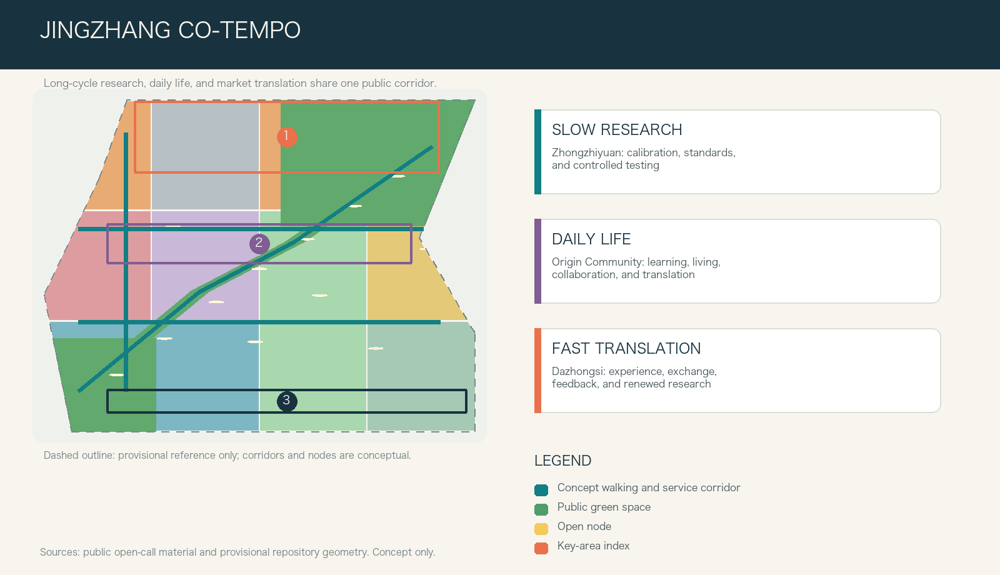
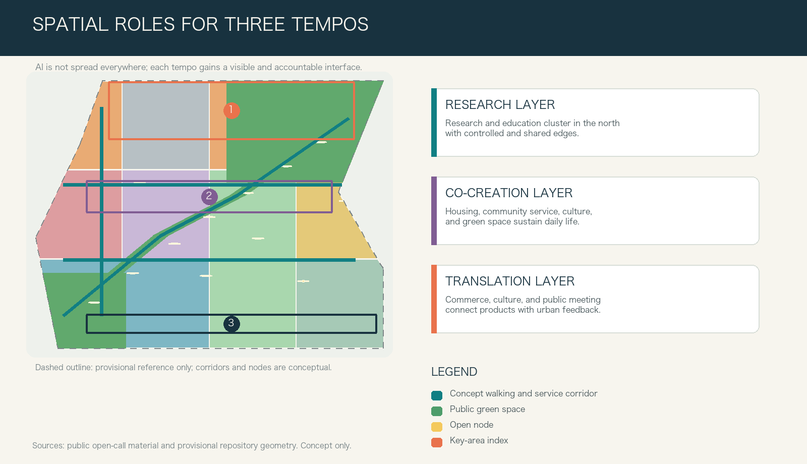
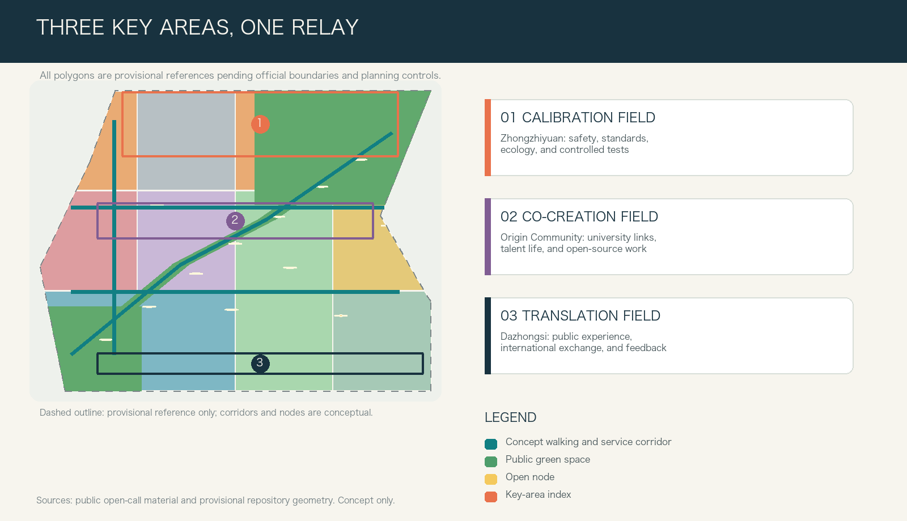

# JINGZHANG CO-TEMPO

> An AI-oriented city does not need to accelerate every minute. It needs long-cycle research, rapid experiments, and stable everyday life to see one another, connect, and hand work over responsibly.

## Design Basis and Source List

This proposal treats urban design as the organization of how different tempos coexist. The official announcement defines three work scales, three key areas, and tasks covering industry, urban renewal, public space, mobility, and urban character. The Agent taskbook adds identity, ecosystem cases, scenarios, cultural narrative, and long-term operation as readable deliverables. [source:OFFICIAL-ANNOUNCEMENT] [source:AGENT-TASKBOOK] The public Source Registry is used to separate material suitable for task interpretation from material limited to provisional generation; rough geometry and textual extents are never upgraded into an official planning boundary. [source:SOURCE-REGISTRY]

The public package does not yet include official polygons for the Overall Design Area or the three Key-Area Detailed Design Areas. It also lacks parcel controls, road boundaries, surveyed buildings, ownership, heritage controls, and municipal base data. All submitted extents, ratios, mobility links, and building carriers are therefore internal conceptual references that must be recalculated as a whole when official material becomes available. [source:BOUNDARY-SOURCE] [source:KEY-AREA-SOURCE] [depth:existing_conditions_diagnosis] This proposal does not replace planning approval, engineering design, or professional judgement.

## Three-Level Scope Framework

The Coordinated Research Area asks how Haidian's AI innovation can form a global collaboration network. The Overall Design Area asks how the surroundings of the Jing-Zhang Railway Heritage Park can support work, life, and translation together. The Key-Area Detailed Design Areas turn those relationships into discussable district strategies. The announced scales of approximately 43.6 square kilometres, 11.4 square kilometres, and 368.4 hectares remain task scales and are not replaced by the provisional geometry. [standard:PROJECT-OFFICIAL-ANNOUNCEMENT] [data:geometry/site_boundary.geojson#SITE-001]

Co-Tempo uses "three clocks and one public corridor." Zhongzhiyuan's research clock supports long-cycle research, standards work, safety deliberation, and controlled testing. Beijing AI Origin Community's daily-life clock combines learning, collaboration, living, social exchange, and innovation translation. Dazhongsi's translation clock connects public experience, enterprise services, international exchange, and feedback to renewed research. The corridor following the heritage-park direction is not a new road; it is a combined walking, cycling, shade, interpretation, rest, and human-service connection. [depth:three_level_scope_framework] [data:geometry/roads.geojson#ROAD-001] [metric:site_area_sqm]

## Coordinated Research Area: Industry and Future City Research

The proposal identity is "JINGZHANG CO-TEMPO." Its visual direction uses three offset tracks: one for the long research cycle, one for the daily cycle of public life, and one for the short cycle of products and markets. The tracks meet at public-space nodes without erasing one another. This translates the three positioning statements and five functions of the brief into visible urban interfaces for independent innovation, ecosystem building, scenario enablement, urban vitality, and governance voice. [standard:PROJECT-AGENT-OPEN-CALL-TASKBOOK] [depth:overall_spatial_structure]

The innovation ecosystem is not a concentration of firms and computing alone. It is a loop of urban question, controlled experiment, public explanation, feedback, and renewed research. Six mechanisms are proposed for later professional study: Barcelona-style challenge-led urban testing, Helsinki-style resident-centred agile pilots, the research and mobility ecosystem of Paris-Saclay, university-industry coordination in Punggol Digital District, real-environment test facilities, and AI Verify's emphasis on human agency and verifiability. The proposal borrows only methods such as problem intake, limited trials, interdisciplinary review, public explanation, and exit rules; it does not copy another city's scale, policy, or visual assets. [source:PROCESSED-FACT-PACK]

At the strategic level, the Three Zones and Two Wings become a coordination loop. Zhongzhiyuan leads research and calibration; Beijing AI Origin Community leads talent, open-source collaboration, and translation; Dazhongsi leads urban adoption. The Zhongguancun Technology Services Wing supports IP, legal, brand, and international liaison, while the Xiaoyue River Scenario Enablement Wing supports everyday public services and low-disturbance trials. Every loop must retain a non-digital alternative and a named human responsibility path. [source:SITE-PACKAGE] [depth:municipal_new_infrastructure]

## Overall Design Area: Urban Renewal and Regulatory-Plan-Level Urban Design

The overall structure is not a single industrial axis. It is a continuous sequence of a northern Calibration Field, a central Co-Creation Field, and a southern Translation Field, reinforced by cross-connections. The conceptual land-use partition fully covers the provisional extent: research and education face the northern research interface; housing and community services support all-day life in the centre; commerce, culture, and public meeting spaces translate outcomes in the south; green and mobility land form the shared public base. The classification uses a consistent national land-use vocabulary but does not constitute a statutory change to any parcel. [standard:MNR-LAND-USE-CLASSIFICATION-GUIDE] [data:geometry/land_use.geojson#LU-001] [depth:land_use_layout]

Urban renewal follows "survey first, choose second, act last." Without surveyed buildings, ownership, fire-safety, structural, heritage, and municipal data, the proposal makes no demolition decision for a real building. A four-step professional method is offered: verify public value and historical clues; compare repair, adaptive reuse, partial renewal, and new build through life-cycle effects; test whether any addition improves accessible ground floors and public service; then reach a decision through rights-holder consultation and statutory procedure. [data:geometry/buildings.geojson#BLDG-001] [depth:retain_renovate_demolish]

Floor Area Ratio, Building Height, Building Coverage Ratio, setbacks, and street sections remain pending official data. The current conceptual building carriers test only whether the spatial system can provide shared ground floors, quiet research edges, adaptable activity rooms, and accessible stopping points. Concept capacity is not represented as approved development intensity. [standard:MOHURD-CONTROL-DETAILED-PLANNING] [metric:building_footprint_area_sqm] [depth:development_intensity_controls]

## Detailed Design of Key Areas

**Zhongzhiyuan AI Independent Innovation Acceleration Area: Calibration Field.** The priority is not faster products but a credible environment for slow research. The conceptual recommendation combines research courts, a bookable standards and safety collaboration hall, a low-disturbance observation edge toward Qinghe, and a small public interpretation court. Controlled testing remains clearly separated from public green space; what the public sees is the purpose, stop condition, and responsible person rather than confidential model detail. Mobility, river, heritage, and energy conditions require specialist confirmation. [data:geometry/key_areas.geojson#PROV-KEY-001] [depth:three_key_area_detailed_design]

**Beijing AI Origin Community: Co-Creation Field.** University-adjacent innovation needs more than an investment chain. It needs slow interfaces between learning and translation, and between daily life and collaboration. Suggested components include open-source evening classes, a translation clinic, quiet work tables, talent-life services, and small public presentation rooms. Cross-campus connections, building renewal, and transit integration remain design directions pending official data. [data:geometry/key_areas.geojson#PROV-KEY-002] [data:geometry/public_space.geojson#PUBLIC-003]

**Dazhongsi AI Industry Cluster: Translation Field.** This area supports the final urban step through which agents, devices, content, and enterprise services meet everyday life. A public transit-front desk, explainable consumer interfaces, international meeting space, human complaint channel, and return-route nodes form an experience street with clear exit options. Industry display and everyday use share the same privacy, accessibility, and accountability rules. Four-quadrant walking integration around Dazhongsi Station is a design question, not an engineering proposal. [data:geometry/key_areas.geojson#PROV-KEY-003] [depth:traffic_rail_slow_parking]

## AI Innovation Ecosystem, Personas, and AI+ Scenarios

Five personas shape the proposal: open-source developers need durable public learning interfaces; start-up teams need low-cost trials with clear exits; university communities need rights-clear routes to translation and exchange; residents and carers need daily services that do not require a smartphone; and enterprise visitors and operators need credible, explainable meeting and display environments. Personas guide spatial and service design only and do not create individual tracking, commercial targeting, or hidden scoring. [source:AGENT-TASKBOOK] [data:geometry/public_space.geojson#SCN-001]

Twelve scenario cards use the same questions: who benefits, where does it happen, what minimum data is used, who can pause it, and how does a person return to human service? The first three are limited Testing and Validation Scenarios, not commitments to blanket deployment.

| Scenario | Spatial carrier | Users | Data boundary | Human Review | Type |
| --- | --- | --- | --- | --- | --- |
| 01 Calibration Day | Zhongzhiyuan safety and standards sandbox | Research teams | Controlled test data only | Independent panel and on-site lead | Industry test |
| 02 Energy Readout | Edge-compute energy interpretation desk | Developers and operators | Aggregated device energy data | Energy specialist verification | Industry test |
| 03 Embodied Coexistence Drill | Low-speed device and pedestrian pocket | Developers and pedestrians | Event and anonymized flow data | Safety officer can stop the test | Industry test |
| 04 Open-Source Evening Class | Beijing AI Origin evening learning hall | Students, faculty, developers | Opt-in registration and anonymous feedback | Teacher and community host | Education |
| 05 Translation Clinic | Origin Community innovation service desk | Start-up teams | Minimum necessary project material | Legal, IP, and technical specialists | Enterprise service |
| 06 Accessible Companion | Co-Tempo Corridor accessibility node | Residents and visitors | Immediate on-site information; no tracking | Human help and routine inspection | Public service |
| 07 Urban Question Board | Heritage Park public issue wall | Residents and operators | Anonymous issues and aggregated locations | Community deliberation and work-order review | Civic governance |
| 08 Explainable Consumption | Dazhongsi device experience street | Consumers and companies | Voluntary experience feedback | Human complaint and exit channel | Urban experience |
| 09 Health Route Referral | Community service desk | Residents and carers | User-entered service need | Human desk; no diagnosis | Daily service |
| 10 Legal and Rights Navigation | Translation Field public desk | Start-ups and residents | Issue category; no stored free text | Professional gives the final explanation | Daily service |
| 11 Shared Urban Memory | Railway culture reading table | Public and researchers | Licensed text and image metadata | Heritage adviser and rights-holder withdrawal | Culture |
| 12 Night Return | Transit connection and lighting node | Night commuters | Anonymous fault and illumination checks | Human emergency alternative | Public safety |

Four pilgrimage and honour-display components support public understanding rather than spectacle. Zhongzhiyuan's Calibration Ring shows how a trial can be paused and corrected. Origin Community's Co-Creation Shelf records rights-cleared open-source contributions, failed experiments, and community questions. Dazhongsi's Translation Beacon uses low-energy replaceable information to explain what a product must answer before entering the city. Return Tables along the corridor bring every node back to human help, rest, and conversation. [metric:landmark_count] [depth:blue_green_public_space]

## Land Use, Building Scale, and Retain-Renovate-Demolish Strategy

Land use is organized by research, co-creation, and translation rather than administrative labels. This makes the relationships among research, education, housing, community service, commerce, culture, green space, and mobility open to joint discussion. The submitted partition covers the provisional extent and is recalculated in one coordinate system; statutory use and parcel boundaries remain pending official data. [data:geometry/land_use.geojson#LU-006] [metric:land_use_0802_sqm]

Buildings follow three principles: adaptable ground floors, quiet upper levels, and technical interfaces that can be removed. Northern conceptual carriers support research, review, and small testing; central carriers support learning, collaboration, talent services, and mixed daily life; southern carriers support experience, meeting, and light commercial use. Without a building survey, every footprint remains a conceptual carrier, and the Demolish-Renovate-Retain Strategy is a decision sequence rather than a parcel action. [data:geometry/buildings.geojson#BLDG-006] [metric:concept_floor_area_sqm]

Urban Character comes from continuous sheltered edges, durable repairable materials, day-and-night legible wayfinding, low-glare lighting, and removable information elements rather than height competition or large screens. Height, massing, view corridors, and roofs require Regulatory Detailed Planning, sunlight, wind, heritage, and mobility studies; this proposal gives adjacency and public-interface recommendations only. [standard:MOHURD-URBAN-DESIGN-MEASURES] [depth:height_massing_character]

## Transport, Rail, Municipal Infrastructure, and Public Services

The first mobility objective is not higher vehicle speed but safe transition between tempos. The conceptual network includes one Co-Tempo Corridor, three cross-connections, and twelve stopping nodes, providing continuity for walking, cycling, rest, interpretation, accessible help, and daily service. All alignments express relationships only and are not road boundaries, bridge or tunnel schemes, or rail engineering recommendations. [data:geometry/roads.geojson#ROAD-001] [metric:slow_mobility_length_m]

Transit surroundings should be recognizable on exit, allow pauses during interchange, and provide human help when systems fail. Connection information should remain continuous at street level; night routes need clear low-disturbance human alternatives; bicycle parking and delivery locations must follow site surveys. Engineering interfaces toward Dazhongsi, Wudaokou, and Qinghe require joint work by transport, municipal, fire-safety, and accessibility specialists. [depth:traffic_rail_slow_parking] [data:geometry/constraints.geojson#CON-ROAD-001]

New Infrastructure follows minimum data, graded reliability, and offline fallback. Zhongzhiyuan may test controlled systems and energy interpretation; Origin Community may test public learning and translation interfaces; Dazhongsi may test explainable public experience. Data-centre capacity, energy, drainage, communications, fire safety, storage, and procurement all remain pending specialist data and an identified operator. [depth:municipal_new_infrastructure]

## Blue-Green Network, Public Space, and Urban Character

Blue-Green Space is not a technology stage. It is the urban base that lets different tempos buffer one another. The Co-Tempo Corridor combines shade, rain-protected stopping places, accessible seating, public explanation, and bookable small activity surfaces. Cross-connections turn breaks between campuses, parks, neighbourhoods, and stations into public questions for priority investigation. Green-space and public-space areas are recalculated from submitted geometry for internal comparison only and do not replace statutory ratios or park implementation boundaries. [data:geometry/green_space.geojson#GREEN-001] [metric:green_ratio] [metric:public_space_ratio]

Public-space components include quiet steps, shared reading tables, sheltered human-help desks, low-tech information boards, removable testing pockets, and child- and carer-friendly resting places. Each component must first satisfy accessibility, low disturbance, privacy, and everyday usefulness. Jing-Zhang railway memory is interpreted as connection, collaboration, and temporal order rather than unverified historical detail; the identity uses original lines, numbers, and colours without third-party trademarks, portraits, or unlicensed images. [source:PROCESSED-FACT-PACK] [depth:blue_green_public_space]

## Renewal Projects, Implementation Policy, and Phasing

Renewal begins by making the public base work before introducing technology. Nine conceptual project packages are proposed: walking-discontinuity audit, Zhongzhiyuan Calibration Ring, Qinghe low-disturbance observation edge, Origin open-source classes and translation clinic, university-area cross-connections, Dazhongsi Translation Beacon and human desk, twelve scenario nodes, Return Tables and public question boards, and an annual Co-Tempo Week. They are options for professional teams and operators to select, combine, revise, or abandon, not fixed investment or construction commitments. [data:geometry/phasing.geojson#PHASE-001] [depth:renewal_project_list]

Phasing follows evidence maturity rather than fixed years. Phase 1, Hear the Tempos, fills gaps in boundary, buildings, ownership, streets, infrastructure, heritage, and public-service data while using low-tech activities and observation to test questions. Phase 2, Limited Co-Tempo, runs small reversible trials only after responsibility, privacy, and safety conditions are clear. Phase 3, Reusable Urban Experience, considers broader renewal and cross-district coordination only after independent evaluation, public feedback, and professional review. [metric:phase_count] [depth:phasing_implementation]

Long-term operation combines Co-Tempo Week, monthly shared reading, scenario access days, night-return audits, and an annual Co-Tempo archive. Developers, residents, researchers, operators, and international visitors enter with explicit questions, and every activity may conclude with continue, revise, pause, or exit. Public value is not replaced by exposure or contract counts. [source:AGENT-TASKBOOK]

## Metrics, Area Recalculation, and Compliance Matrix

Metrics are divided into three groups. Reproducible submission metrics include provisional site area, conceptual land use, building footprints, green space, public space, walking and cycling length, scenario nodes, and phases. Statutory controls such as Floor Area Ratio, height, coverage, setbacks, road boundaries, and facility standards remain pending official data. Operational public-value metrics such as accessibility experience, availability of human service, scenario exits, and public understanding require continued observation. [metric:site_area_sqm] [metric:scenario_node_count] [metric:industry_test_scenario_count]

Land use, green space, public space, buildings, roads, phasing, and key areas are cross-checked in one coordinate system. The task coverage matrix maps the announcement and six Agent tasks to prose, geometry, metrics, drawings, and the offline visual. The professional standards matrix explains how public space, Urban Design, land classification, and Regulatory Detailed Planning boundaries are addressed. The design-depth matrix records diagnosis, structure, key areas, mobility, municipal systems, blue-green space, renewal, phasing, recalculation, and risk. [depth:metrics_recalculation] [data:geometry/phasing.geojson#PHASE-003]

## Risk, Copyright, and Compliance

The principal risk is presenting provisional data or conceptual recommendations as established fact. Official boundaries, key-area polygons, planning controls, ownership, surveyed buildings, street sections, rail interfaces, municipal systems, heritage constraints, public facilities, and ecological conditions are therefore prerequisites for professional development. Their absence is not concealed by visual detail or replaced by invented geometry. [depth:risk_missing_data] [data:geometry/constraints.geojson#CON-BOUNDARY-001]

Every technical scenario must use minimum data, Human Review, a non-digital alternative, clear notice, complaint access, and stop conditions. Health, legal, and public-safety directions provide referral or controlled drills only and do not replace professional judgement. No automated service may depend on private profiling, hidden scoring, or compulsory participation. All spatial actions are open co-creation ideas, conceptual references, or material for professional teams to develop; none constitutes approval, construction authorization, investment commitment, or engineering conclusion. [standard:MOHURD-CONTROL-DETAILED-PLANNING]

The text, conceptual geometry, diagrams, webpages, and drawings were created for this submission. External cases contribute methods only; no external map, image, identity, or trademark is copied. The display material loads no remote imagery, map tiles, fonts, scripts, or tracking. Source-use limitations are recorded in `sources.json`, and the rights statement is in `report/copyright_statement.md`.

## References

- Haidian Branch of the Beijing Municipal Commission of Planning and Natural Resources, qualification announcement for the Centennial Jing-Zhang AI Innovation Belt urban design call, May 9, 2026. [source:OFFICIAL-ANNOUNCEMENT]
- Extract of the Agent-oriented open-call taskbook. [source:AGENT-TASKBOOK]
- Site package and public Source Registry. [source:SITE-PACKAGE] [source:SOURCE-REGISTRY]
- Processed fact pack and provisional boundary records. [source:PROCESSED-FACT-PACK] [source:BOUNDARY-SOURCE] [source:KEY-AREA-SOURCE]
- Ministry of Housing and Urban-Rural Development urban design and regulatory planning measures, and the Ministry of Natural Resources land-use classification guide. [standard:MOHURD-URBAN-DESIGN-MEASURES] [standard:MOHURD-CONTROL-DETAILED-PLANNING] [standard:MNR-LAND-USE-CLASSIFICATION-GUIDE]
