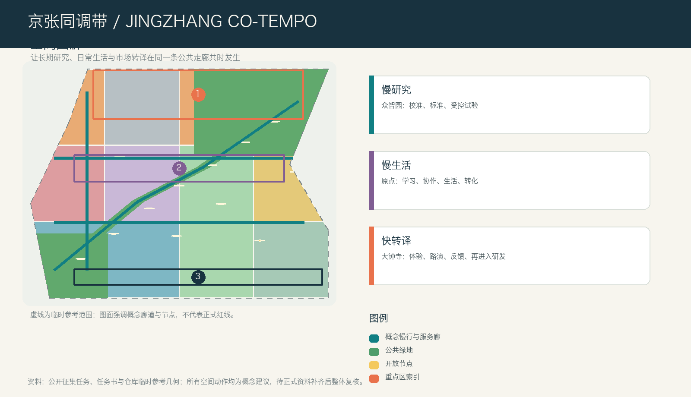
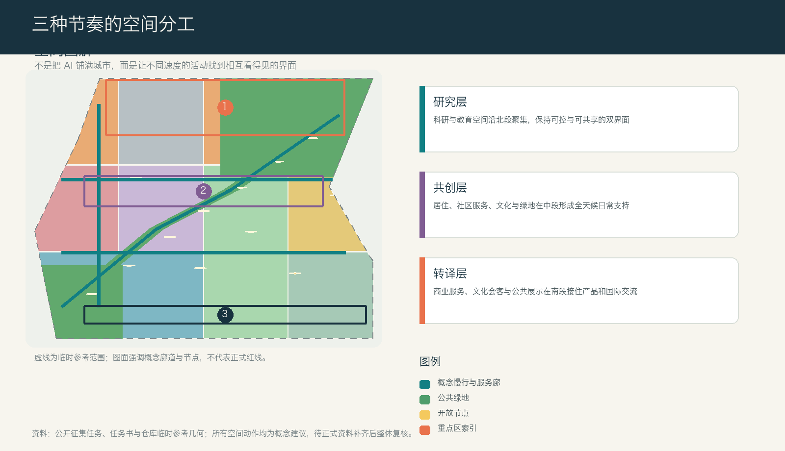
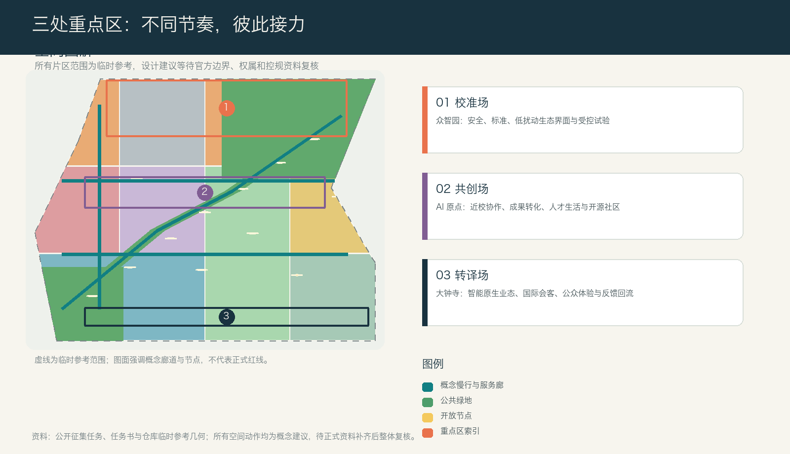
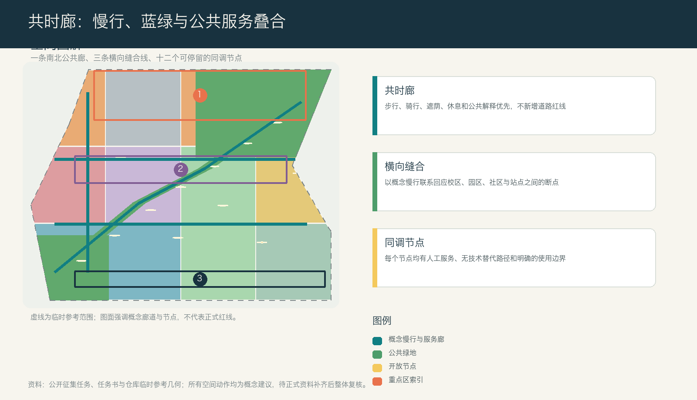

# 京张同调带 | JINGZHANG CO-TEMPO

> 一座面向 AI 的城市，不必把每一分钟都加速。它更需要让长期研究、快速试验和安稳日常彼此看得见、走得通、能交接。

## 设计依据与资料清单

本方案把城市设计理解为对“不同速度如何共处”的组织工作。官方公告确定了三层工作范围、三处重点区域和产业、城市更新、公共空间、交通与风貌的任务；面向智能体任务书进一步要求把命名、案例、场景、文化和长期运营写进可读成果。[source:OFFICIAL-ANNOUNCEMENT] [source:AGENT-TASKBOOK] 方案使用公开资料登记表来区分可用于任务判断的材料与只能用于临时生成的材料，不把临时几何、文字四至或概念图升级为正式红线。[source:SOURCE-REGISTRY]

当前公开资料没有总体范围和重点区域的正式多边形，也没有地块、道路红线、建筑现状、权属、文保和市政底图。因此本包中的范围只是一套临时参考，所有面积、比例、交通和建筑表达只用于本方案内部的空间推演；正式资料到位后，需连同图层、指标、图纸和网页整体重算。[source:BOUNDARY-SOURCE] [source:KEY-AREA-SOURCE] [depth:existing_conditions_diagnosis] 这份方案不替代规划审批、建设实施或行业专业判断。

## 三层范围工作框架

统筹研究范围回答“海淀的 AI 创新如何形成全球协作网络”，总体设计范围回答“京张遗址公园周边如何成为工作、生活和转化相互支持的城市”，重点区域则把三种节奏落到可讨论的街区和公共界面。公告给出的约 43.6 平方公里、11.4 平方公里和 368.4 公顷是任务尺度，不应被临时几何替代。[standard:PROJECT-OFFICIAL-ANNOUNCEMENT] [data:geometry/site_boundary.geojson#SITE-001]

同调带以“三种时钟、一个公共廊”组织层级传导：众智园的“研究时钟”允许长周期的基础研究、安全讨论和受控测试；AI 原点的“生活时钟”把学习、协作、居住、社交与成果转化编织进全天候界面；大钟寺的“转译时钟”承接产品体验、内容消费、国际交流与反馈回流。京张遗址公园方向的公共廊不是新道路，而是慢行、绿荫、解释、休息和人工服务的复合联系。[depth:three_level_scope_framework] [data:geometry/roads.geojson#ROAD-001] [metric:site_area_sqm]

## 统筹研究范围产业与未来城市研究

方案品牌为“京张同调带 / JINGZHANG CO-TEMPO”，标识概念是三道彼此错开的轨迹：一条表示研究的长周期，一条表示公共生活的日周期，一条表示产品和市场的短周期；三线在公共空间节点交汇，而不互相吞没。它对应百年京张文化带、都市 AI 生活体验带和 AI 融合创新带三重定位，并把“全栈自主、创新生态、场景赋能、活力城市、治理话语权”转译为可见的空间接口。[standard:PROJECT-AGENT-OPEN-CALL-TASKBOOK] [depth:overall_spatial_structure]

生态不是把企业和算力堆进同一个园区，而是建立“研究问题—受控试验—公众解释—反馈回流—再研究”的闭环。可供专业团队深化的六类案例机制包括：以真实城市问题组织试点的巴塞罗那城市创新实验机制、以居民参与检验生活品质的赫尔辛基敏捷试点、以研究和交通生态共构的 Paris-Saclay、以产学协同和数字底座组织园区的榜鹅数字区、以真实环境测试为重点的欧洲测试设施，以及以人类自主和可验证性为底线的 AI Verify。这里借鉴的是“问题受理、有限试验、跨学科审查、公开解释、退出机制”的方法，不复制任何城市的规模、组织或政策。[source:PROCESSED-FACT-PACK]

统筹层提出“三区两翼协同回路”：众智园负责研究与校准，AI 原点负责人才、开源与转化，大钟寺负责城市化采用；中关村科技服务翼补足知识产权、法务、品牌和国际联络，小月河场景赋能翼提供日常公共服务与低扰动试验。每一个回路都需有无技术替代路径和人类责任人，不能因技术展示挤占正常生活。[source:SITE-PACKAGE] [depth:municipal_new_infrastructure]

## 总体设计范围城市更新与控规深度城市设计

总体空间不是一条单一产业轴，而是“北部校准场—中部共创场—南部转译场”三段连续、横向缝合的城市结构。概念用地在临时范围内完整覆盖：科研和教育面向北部研究接口，居住与社区服务支撑中部的全天候生活，商业、文化和公共会客空间在南部把成果带向城市；绿地和道路用地则承担连续公共底座。用地分类采用统一的国土空间分类语言，但不构成任何具体地块用途的法定改变。[standard:MNR-LAND-USE-CLASSIFICATION-GUIDE] [data:geometry/land_use.geojson#LU-001] [depth:land_use_layout]

城市更新采取“先调查、再选择、后行动”的方法。没有现状建筑、权属、消防、结构、文保和市政资料时，不对任何具体建筑提出拆除决定。可供后续团队使用的四步法是：先核实公共价值和历史线索，再比较修缮、适应性再利用、局部更新和新建的生命周期影响，再以首层开放、无障碍和公共服务作为增量价值判断，最后经过权利人协商和法定程序形成决定。[data:geometry/buildings.geojson#BLDG-001] [depth:retain_renovate_demolish]

容积率、建筑高度、建筑密度、退线和道路断面都保持待正式资料确认。当前仅以概念建筑基底和公共空间关系检验空间是否有足够的共享首层、安静研究界面、可转换活动空间和无障碍停留点；不把概念容量写成审定强度。[standard:MOHURD-CONTROL-DETAILED-PLANNING] [metric:building_footprint_area_sqm] [depth:development_intensity_controls]

## 重点区域详细设计

**众智园 AI 自主创新加速区：校准场。** 这里的主角不是“更快的产品”，而是慢研究需要的可信环境。参考方案把研发院落、可预约的标准与安全协作厅、清河方向的低扰动观察界面和公开解释小庭组合起来。受控测试区与公共绿地之间保持清晰边界；面向公众的不是模型细节，而是测试目的、可退出条件和人工责任信息。对外交通、河道界面、文保与能源条件均需后续专项核实。[data:geometry/key_areas.geojson#PROV-KEY-001] [depth:three_key_area_detailed_design]

**北京 AI 原点社区：共创场。** 近校型创新不应只是一条招商链，而要有从学习到转化、从生活到协作的慢接口。方案建议设置开源晚课、成果转化会诊、安静工作桌、人才生活服务与小尺度公共发布空间，让校区、园区、街区的日常来往形成可见的协作网络。任何跨校连通、现状建筑更新和轨道站点整合，均只作为待确认条件下的设计方向。[data:geometry/key_areas.geojson#PROV-KEY-002] [data:geometry/public_space.geojson#PUBLIC-003]

**大钟寺 AI 产业聚集区：转译场。** 这里承接智能体、终端、内容和企业服务进入城市生活的最后一公里。方案将站前公共前台、可解释消费界面、国际会客厅、人工投诉入口和回程慢行节点组织成一条可退出体验街，使产业展示与居民的日常使用共享同样的安全、隐私和无障碍规则。大钟寺站四象限步行连通是设计议题而非工程方案，必须等候道路、轨道和市政条件补齐。[data:geometry/key_areas.geojson#PROV-KEY-003] [depth:traffic_rail_slow_parking]

## AI 创新生态、人才画像与 AI+ 场景

方案将人才理解为五类会在城市中交错出现的人：开源开发者需要可长期协作的公共学习界面；初创团队需要低成本、可退出的试验机会；高校师生需要授权清楚的转化和交流入口；居民和照护者需要不依赖智能手机的日常服务；企业访客和运营者需要可信、可解释的展示与会客环境。所有画像只服务于空间和服务设计，不建立个人轨迹、商业推荐或隐性评分。[source:AGENT-TASKBOOK] [data:geometry/public_space.geojson#SCN-001]

十二张场景卡把“谁受益、在哪里发生、最小使用什么数据、谁可以暂停、如何回到人工服务”写成同一张表；其中前三项是有限范围的产业测试验证场景，不能被表述为全面部署。

| 场景 | 空间载体 | 服务对象 | 数据边界 | 人工复核 | 类型 |
| --- | --- | --- | --- | --- | --- |
| 01 校准日 | 众智园安全与标准沙盒 | 研究团队 | 只用受控测试数据 | 独立评议与现场负责人 | 产业测试 |
| 02 能耗共读 | 端侧算力与能源解释台 | 研发者、运维者 | 设备级聚合能耗 | 能源专业人员核验 | 产业测试 |
| 03 具身共处演练 | 低速设备与行人共处口袋 | 开发者、行人 | 事件与匿名流量 | 安全员随时暂停 | 产业测试 |
| 04 开源晚课 | AI 原点夜间学习厅 | 高校师生、开发者 | 自愿报名与匿名反馈 | 教师与社区主持 | 教育 |
| 05 转化会诊 | 原点成果转译前台 | 初创团队 | 最小必要项目材料 | 法务、知识产权、技术人员 | 企业服务 |
| 06 慢行伴行 | 共时廊无障碍节点 | 居民、访客 | 现场即时信息，不留轨迹 | 人工求助与日常巡检 | 公共服务 |
| 07 城市问题招贴 | 遗址公园公共议题墙 | 居民、运营者 | 匿名问题与聚合位置 | 社区议事与工单复核 | 公共治理 |
| 08 可解释消费 | 大钟寺终端体验街 | 消费者、企业 | 自愿体验反馈 | 人工投诉和退出入口 | 城市体验 |
| 09 医疗路线转介 | 社区服务台 | 居民、照护者 | 用户主动输入的需求 | 人工窗口，不作诊断 | 生活服务 |
| 10 法律与权益导航 | 转译场公共前台 | 初创团队、居民 | 问题类别，不存文本内容 | 专业人员最终解释 | 生活服务 |
| 11 城市记忆共编 | 铁路文化共读台 | 公众、研究者 | 授权文本和图像元数据 | 文史顾问与权利人撤回 | 文化 |
| 12 夜间回程 | 轨道接驳与照明节点 | 夜间通勤者 | 匿名故障与照度巡检 | 人工应急替代 | 公共安全 |

三座 AI 朝圣地标也服务于公共理解而非打卡消费：众智园的“校准环”展示试验如何被暂停和修正；原点社区的“共创书架”记录经授权发布的开源贡献、失败经验和社区问题；大钟寺的“转译灯塔”以低能耗的可替换信息面向街道解释产品进入城市前需要回答什么；沿线的“回程桌”则让每个节点都能回到人工服务、休息和对话。[metric:landmark_count] [depth:blue_green_public_space]

## 用地、建筑规模与拆改留方案

用地分区以“研究—共创—转译”而非行政边界组织，目的是让科研、教育、居住、社区服务、商业文化、绿地和道路的关系可以被共同讨论。提交包中的分区完整覆盖临时范围，面积由统一坐标系复算；它只是一组用于检验空间关系的设计图层，正式用途和地块边界仍待法定资料确认。[data:geometry/land_use.geojson#LU-006] [metric:land_use_0802_sqm]

建筑以“可变首层、安静上层、可退的技术界面”为原则。北段概念建筑承接研究、评审和小规模中试，中段承接学习、协作、人才服务和混合生活，南段承接体验、会客和轻量商业。没有建筑调查时，所有建筑都标为概念载体；拆改留不直接落到现状楼栋，而是提供一套优先修缮、适应性再利用、局部替换和增量建设的判断顺序。[data:geometry/buildings.geojson#BLDG-006] [metric:concept_floor_area_sqm]

城市风貌不靠竞高和大屏幕制造未来感，而以连续灰空间、耐久可维修材料、日夜可读的导视、低眩光照明和可撤装的信息构件建立秩序。高度、体量、视廊和屋顶控制需由正式控规、日照、风环境、文保和交通专业分析共同校准；本方案仅提出相邻关系与公共界面建议。[standard:MOHURD-URBAN-DESIGN-MEASURES] [depth:height_massing_character]

## 交通、轨道、市政与公共服务设施

交通策略的第一目标不是增加车速，而是让人可以在不同节奏之间安全切换。概念网络包括一条贯通遗址公园方向的共时廊、三条横向缝合线和十二个停留节点；它们为步行、骑行、休息、公共解释、无障碍求助和日常服务提供连续性。所有线位仅是空间关系表达，不构成道路红线、桥隧或轨道工程建议。[data:geometry/roads.geojson#ROAD-001] [metric:slow_mobility_length_m]

轨道站点周边建议以“出站可识别、换乘可停留、失效可求助”为体验原则：连接信息必须在街道上连续，夜间应有清晰、低干扰的人工替代路径，非机动车停放和配送需要通过现场调查后再确定。大钟寺站四象限、五道口和清河方向的具体工程接口均应由交通、市政、消防与无障碍专业团队深化。[depth:traffic_rail_slow_parking] [data:geometry/constraints.geojson#CON-ROAD-001]

新型基础设施遵循“最小数据、分级可靠、断网可退”。众智园可讨论受控测试和能耗解释空间，原点社区可讨论公共学习与技术转译界面，大钟寺可讨论面向公众的可解释体验接口；但机房容量、能源、排水、通信、消防、储能和采购模式全部待专业资料与运营主体确认。[depth:municipal_new_infrastructure]

## 蓝绿空间、公共空间与城市风貌

蓝绿公共空间不是 AI 的展台，而是三种节奏能够彼此缓冲的城市底座。共时廊将连续绿荫、雨天可停留的灰空间、无障碍休息点、公共解释牌和可预约的小型活动面叠合；横向缝合线把高校、园区、社区和站点方向的步行断点转化为可优先调查的公共问题。绿地与公共空间面积均从提交几何复算，仅用于本包内部比较，不能替代法定绿地率或公园实施边界。[data:geometry/green_space.geojson#GREEN-001] [metric:green_ratio] [metric:public_space_ratio]

公共空间组件包含“安静台阶、共读长桌、雨棚下的人工帮助台、低技术信息板、可移除试验口袋和儿童/照护者友好休息点”。每个构件都应先满足无障碍、低扰动、隐私和日常可用，再讨论技术展示。京张铁路记忆在方案中被理解为连接、协作与时间秩序，而非未经核实的细节叙事；导视中只使用原创线条、编号和色彩，不挪用企业商标、人物肖像或未授权图像。[source:PROCESSED-FACT-PACK] [depth:blue_green_public_space]

## 更新项目清单、实施政策与分期计划

更新以“先让公共底座工作，再让技术进入”为顺序，形成九个概念项目包：共时廊慢行断点核查、众智园校准环、清河低扰动观察界面、原点开源晚课与转化会诊、近校慢行缝合、大钟寺转译灯塔与人工前台、十二个场景节点、回程桌与公共议题墙、年度同调周。它们都是供专业团队和运营主体选择、组合、调整或放弃的参考方案，不代表确定投资、建设时序或政策承诺。[data:geometry/phasing.geojson#PHASE-001] [depth:renewal_project_list]

分期按照证据成熟度而非固定年份组织。第一阶段是“听见不同节奏”：补齐边界、现状、权属、道路、市政、文保和服务设施数据，并以低技术公共活动和现场观察检验问题；第二阶段是“有限共时”：在责任主体、隐私边界和安全条件明确后，对十二个节点进行小规模、可退出的试验；第三阶段是“可被复用的城市经验”：仅在独立评估、公众反馈和专业审查支持后，讨论更大范围的更新与跨区协同。[metric:phase_count] [depth:phasing_implementation]

长期运营以“同调周、共读月、场景开放日、夜间回程审计、年度共时档案”构成，而非一次性的展会。开发者、居民、研究者、运营者和国际访客都可以带着明确问题进入，活动结果应包含继续、修改、暂停和退出四种结论；不以曝光量或签约数替代公共价值。[source:AGENT-TASKBOOK]

## 指标体系、面积复算与合规矩阵

本方案把指标分为三类。第一类是提交几何可复算的指标：临时范围面积、各类概念用地、概念建筑基底、绿地、公共空间、慢行长度、场景节点与阶段数量；第二类是待正式资料确认的法定控制，例如容积率、高度、密度、退线、道路红线和设施标准；第三类是需要运营期持续观测的公共价值指标，例如无障碍体验、人工服务可得性、场景退出次数和公众理解度。[metric:site_area_sqm] [metric:scenario_node_count] [metric:industry_test_scenario_count]

空间复算采用提交包中的统一坐标系，land use、green space、public space、buildings、roads、phasing 和 key areas 彼此交叉检查。任务覆盖矩阵把公告任务和六项智能体任务映射到正文、图层、指标、图纸和网页；专业标准矩阵说明公共空间、城市设计、用地分类和控规边界如何被回应；设计深度矩阵则把现状诊断、空间结构、三处重点区、交通、市政、蓝绿、更新、分期、复算和风险逐项固定下来。[depth:metrics_recalculation] [data:geometry/phasing.geojson#PHASE-003]

## 风险、版权与合规说明

本方案最大的风险不是“技术不够先进”，而是把临时数据和概念建议说成既定事实。因此，官方边界、重点区范围、控规、权属、现状建筑、道路断面、轨道、市政、文保、公共服务设施和生态条件都被列为深化前置条件；其缺失不会被视觉效果掩盖，也不被概念几何替代。[depth:risk_missing_data] [data:geometry/constraints.geojson#CON-BOUNDARY-001]

技术场景必须支持最小数据、人工接管、无技术替代、清晰告知、投诉入口和停止条件。医疗、法律、公共安全等高风险方向只做信息转介或受控演练，不替代专业判断；任何自动化服务都不应以个人隐私、不可见的评分或强制参与为前提。所有空间动作均为开放共创建议、参考方案或可供专业团队深化研究，不构成政府审定、建设批准、投资承诺或工程结论。[standard:MOHURD-CONTROL-DETAILED-PLANNING]

本包的文字、概念图层、图解、网页和图纸均为本次提交生成；外部案例只提炼机制，不复制其图像、地图或标识。图面不使用远程图片、地图瓦片、字体或脚本，所有引用材料的用途边界列于 `sources.json`，完整版权说明见 `report/copyright_statement.md`。

## 参考资料

- 北京市规划和自然资源委员会海淀分局，《百年京张AI创新带城市设计国际方案征集资格预审公告》，2026-05-09。[source:OFFICIAL-ANNOUNCEMENT]
- 《面向全球智能体开展百年京张AI创新带城市设计开源征集任务书摘录》。[source:AGENT-TASKBOOK]
- 项目场地包与公开资料登记表。[source:SITE-PACKAGE] [source:SOURCE-REGISTRY]
- 事实包与临时参考边界。[source:PROCESSED-FACT-PACK] [source:BOUNDARY-SOURCE] [source:KEY-AREA-SOURCE]
- 中华人民共和国住房和城乡建设部，《城市设计管理办法》；《城市、镇控制性详细规划编制审批办法》；自然资源部《国土空间调查、规划、用途管制用地用海分类指南》。[standard:MOHURD-URBAN-DESIGN-MEASURES] [standard:MOHURD-CONTROL-DETAILED-PLANNING] [standard:MNR-LAND-USE-CLASSIFICATION-GUIDE]
