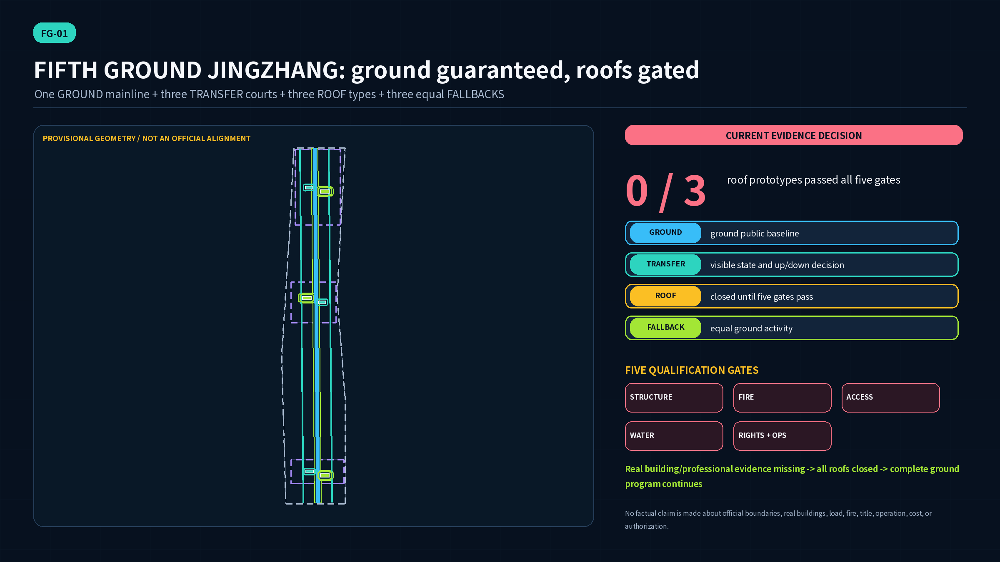
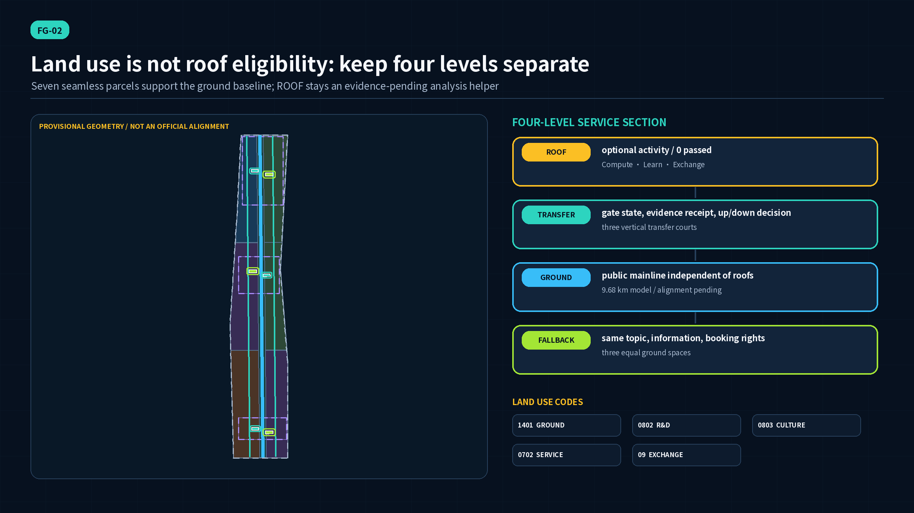
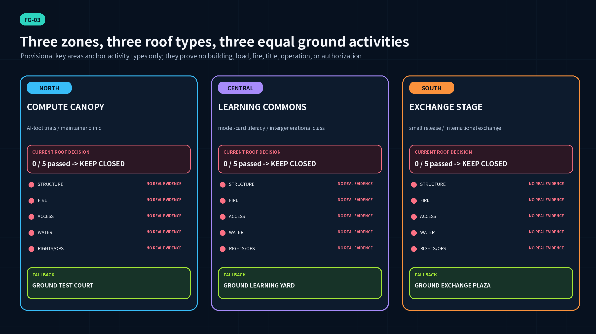
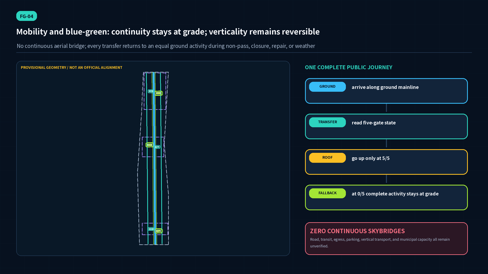
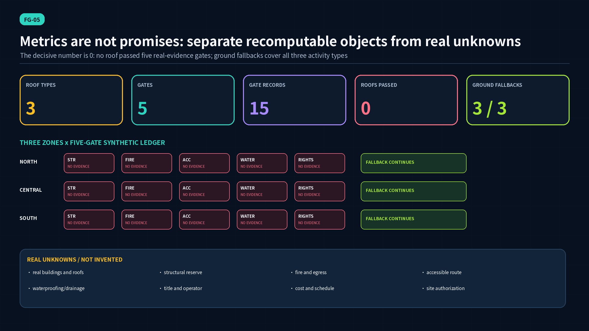

# FIFTH GROUND JINGZHANG: a ground-guaranteed, evidence-gated vertical public innovation belt

FIFTH GROUND is not a continuous aerial city. It gives the city an honest choice architecture. The first ground is the public baseline that can always host the program; three transfer courts extend an activity upward only when evidence is complete. Three roof types support collaborative testing, public learning, and exchange, but the package contains no verified building, load, fire, accessibility, waterproofing/drainage, title, operator, authorization, or cost evidence. `roof_eligibility_passed_count=0` therefore means “not yet passed,” not “physically ineligible.” Whenever a roof is closed, an equal ground activity keeps the same subject, information, booking rights, and public access. The concept draws no continuous skybridge.

## Design Basis and Source List

The official announcement establishes the project, three scope levels, three named key areas, approximate areas, and professional tasks. The cleared Agent taskbook establishes the six Agent tasks, three positions, five functions, and Three Zones and Two Wings [source:OFFICIAL-ANNOUNCEMENT] [source:AGENT-TASKBOOK]. The repository site package supplies schemas, enums, provisional geometry, and local standard snapshots; the public registry separates formal, background, and provisional uses [source:SITE-PACKAGE] [source:SOURCE-REGISTRY]. This open Agent submission does not claim institutional prequalification, government approval, compensation eligibility, or professional certification.

`SITE-001` and `PROV-KEY-001/002/003` are rough provisional constraints. They support internal topology, concept location, diagrams, and temporary area calculation only. They do not prove an official boundary, real roof, title line, surveyed Heritage Park alignment, or engineering setting-out [source:BOUNDARY-SOURCE] [source:KEY-AREA-SOURCE]. The heritage mainline is therefore a cultural and ground-continuity concept axis; all nine GeoJSON layers, metrics, figures, HTML pages, and PDFs must be regenerated when official polygons arrive.

Official sources define questions, not a pass result. Existing-building appraisal and Beijing roof-greening material inform structural and waterproofing evidence lists [source:MOHURD-GB55021-2021] [source:BJ-ROOF-GREENING-DB11-281-2015]. Fire and accessibility use only current general-code identifiers, leaving applicable clauses and decisions to qualified teams [source:GB55037-BUILDING-FIRE] [source:GB55019-ACCESSIBILITY]. Rights and operations still require verified consent, liability, filing, maintenance, insurance, and an accountable operator. Policy encouragement is never site authorization [source:BJ-VERTICAL-GREENING-2011-29].

## Three-Level Scope Framework

At research scale, underused roofs become a qualification-governance question: who supplies evidence, who decides, when does a pass expire, and where does the public go during closure? At Overall Design Area scale, the provisional 11.41-square-kilometre container holds one GROUND mainline, three TRANSFER courts, three ROOF activity prototypes, and three equal FALLBACK spaces [data:geometry/site_boundary.geojson#SITE-001] [metric:site_area_sqm]. At key-area scale, each rough polygon tests a different activity type without labelling any real building.

The four levels stay distinct. GROUND is the findable base public service. TRANSFER publishes evidence state and handles an upward or ground-return decision. ROOF is optional and may open only after all five gates pass. FALLBACK is not an inferior substitute; it preserves the same subject, information, and booking rights. All cross-district continuity stays at grade, with `continuous_skybridge_count=0` [data:geometry/roads.geojson#ROAD-GROUND-HERITAGE-MAINLINE] [metric:continuous_skybridge_count]. High-level experience becomes a reversible option while ground publicness becomes a non-removable baseline.

The package-model mainline is about 9,683 metres long, showing continuity inside rough geometry only. It proves no existing Heritage Park alignment, constructed path length, or public-opening state [metric:ground_heritage_mainline_length_m]. If official geometry, heritage protection, or public access contradicts the drawing, the mainline must be relocated inside the verified Overall Design Area rather than moving an official boundary to fit the concept.

## Coordinated Research Area: Industry and Future City Research

Six AI-ecosystem cases provide mechanisms rather than copied forms. Helsinki's AI Register informs public responsibility and feedback fields; Singapore AI Verify informs modular test receipts; the EU regulatory sandbox informs time-bounded, controlled, reversible trials; NIST AI RMF informs govern-map-measure-manage; GenAI profile and deployed-system monitoring research inform review cycles and withdrawal [source:HELSINKI-AI-REGISTER] [source:SINGAPORE-AI-VERIFY]. These mechanisms become a roof-qualification passport. No foreign geometry, dataset, certification, or endorsement is imported [source:EU-AI-ACT-SANDBOX] [source:NIST-AI-RMF].

A future city is not measured by the number of open roofs. It is measured by whether people can see why a roof opened, when it must close, and how service continues. Every prototype discloses five-gate state, evidence scope, reviewer, review date, expiry, failure conditions, and ground destination. Missing evidence keeps it closed. This turns structure, fire, accessibility, waterproofing, title, insurance, operation, data, and event planning into an auditable innovation chain instead of hiding them behind a rendering [standard:MOHURD-URBAN-DESIGN-MEASURES].

Across the Coordinated Research Area, Three Zones and Two Wings are not redrawn as a fictional title network. They share a qualification language: the same passport fields, expiry rules, closure receipt, and equal-ground-service promise. A passport proves only that evidence exists within a declared scope; it never replaces professional signature, administrative permission, or insurer judgment. The future-city proposition is therefore not “more roofs,” but “accountability for every upward move and continuity for every closure.”

## Overall Design Area: Urban Renewal and Regulatory-Plan-Level Urban Design

The overall framework is one Fifth Ground mainline, three vertical transfer courts, three roof types across three zones, three equal ground fallbacks, and five gates. Seven polygons share cut lines and completely cover the submitted boundary with permitted codes 0702, 0802, 0803, 09, and 1401. Coverage is one and overlap is zero [data:geometry/land_use.geojson#LU-GROUND-MAINLINE] [metric:land_use_coverage_ratio]. These are temporary model areas, not land-use amendment, land supply, planning permission, or title conclusions [standard:MNR-LAND-USE-CLASSIFICATION-GUIDE].

Urban renewal is “ground first, roof candidate second, evidence before decision.” The design establishes accessible ground programming before surveying real buildings. Six footprints are only concept placeholders for three transfer courts and three fallback service pavilions. Their combined model footprint is 91,500 square metres with model density about 0.008; neither value describes existing or statutory intensity [data:geometry/buildings.geojson#TRANSFER-01-NORTH] [metric:building_footprint_area_sqm]. Total floor area, FAR, height, real roof area, and cost remain pending official data [depth:development_intensity_controls].

No unknown building receives a retain, renovate, or demolish verdict, and “green roof” never bypasses fire, accessibility, or title. A transfer court first operates as a ground public interface. If later survey finds no suitable roof, it can still host five-gate learning, event check-in, and wayfinding at grade. This graceful-degradation structure prevents one failed roof from collapsing the urban strategy.

## Detailed Design of Key Areas

Zhongzhiyuan tests a Compute Canopy activity type: small AI-tool trials and an open-source maintainer clinic. Its transfer forecourt publishes the five-gate state; any missing gate turns the journey back to the complete Ground Test Court [data:geometry/constraints.geojson#ROOF-A-COMPUTE-CANOPY]. Beijing AI Origin Community tests a Learning Commons for model-card literacy, intergenerational classes, and developer questions. The Ground Learning Yard is a first-class venue from day one, not a temporary space added after roof failure [data:geometry/public_space.geojson#FALLBACK-B-GROUND-LEARNING-YARD].

Dazhongsi tests an Exchange Stage for small releases, urban experience, and international exchange. Its provisional polygon cannot prove station, four-quadrant intersection, parcel, or building adjacency; rights/operations and fire review are therefore especially material [data:geometry/key_areas.geojson#PROV-KEY-003]. All three prototypes currently have zero passed gates in the evidence ledger. A transfer court first acts as an honest stopping space that publishes closure reason, review route, and ground destination. It promises no existing lift, stair, or roof [metric:roof_eligibility_passed_count].

The three areas share one section contract but different operations. North prioritizes repeatable test tables, maintainer questions, and small-device connection. Central prioritizes reading, classes, quiet discussion, and intergenerational support. South prioritizes release, market exchange, safe dispersal, and emergency switching. Each must offer the same information density and service duration at grade; a roof may add view or seasonality, never monopolize speakers, booking slots, or essential content [depth:three_key_area_detailed_design].

## AI Innovation Ecosystem, Personas, and AI+ Scenarios

Six personas are open-source maintainers and startup researchers; owners and property managers; structural, fire, accessibility, and waterproofing professionals; disabled people, older adults, and carers; students, visitors, and residents; and event operators and emergency teams. Every group can choose a roof only after qualification and can use the ground route without justifying body, identity, or device conditions. The Barrier-Free Environment Construction Law informs construction, maintenance, participation, and necessary-alternative-measure context; engineering still requires qualified teams and real users [source:BARRIER-FREE-LAW].

Twelve cards are 01 qualification-passport intake (industry test); 02 structural-evidence parsing (industry test); 03 fire use/egress matrix review (industry test); 04 continuous accessible-route rehearsal (industry test); 05 waterproofing/drainage inspection ledger (industry test); 06 title/operator duty register (industry test); 07 ground-fallback scheduling; 08 public AI literacy; 09 open-source maintainer clinic; 10 Jing-Zhang ground sound/oral-history walk; 11 small international release and safe-dispersal rehearsal; and 12 annual roof-closure-to-ground drill. Each has human review, stop conditions, privacy boundaries, and a ground version. The synthetic ledger records fifteen “real evidence absent - not passed - fallback active” decisions [data:geometry/constraints.geojson#ROOF-B-LEARNING-COMMONS] [metric:design_scenario_card_count].

Three public knowledge landmarks are the Five-Gate Signal Mast, Ground Equals Roof Table, and Closure Receipt Archive Wall. They show evidence state and contribution history without pretending that a colour or honour is a safety certificate. The annual rhythm combines a spring building-inventory class, summer five-gate clinic, autumn international AI public school, and winter closure/ground-continuity drill. The developer community manages public classes and synthetic tests only [standard:PROJECT-AGENT-OPEN-CALL-TASKBOOK].

## Land Use, Building Scale, and Retain-Renovate-Demolish Strategy

The land model places the continuous shaded mainline in 1401, north qualification R&D in 0802, central/south culture and learning in 0803, community service in 0702, and southern exchange in 09. Every area recomputes from one partition [data:geometry/land_use.geojson#LU-NORTH-LAB-WEST] [depth:land_use_layout]. Concept building footprints express relative transfer and fallback interfaces only; model building density is neither an existing-condition nor a statutory intensity claim [metric:building_density].

There is no retain-renovate-demolish verdict. Verified building inventory, age, structure, title, use, fire condition, accessible route, waterproofing/drainage, roof plant, and maintenance history are absent. A visually open roof cannot become a candidate by inference. Existing-building and roof-greening material defines an evidence checklist, not appraisal, design, or approval [source:MOHURD-GB55021-2021] [source:BJ-ROOF-GREENING-GUIDE-2025-198]. A valid final outcome may be keep closed, repair only, no public use, or permanently retain the activity at grade.

When a real survey begins, each building first receives a “no conclusion” record with source, survey scope, accountable author, and unresolved questions. Five gates then submit evidence in parallel; mismatched scope, date, or signature returns the record. A pass includes expiry and retrigger conditions. Only a one-to-one link between a verified building and professional judgment can support retain, repair, strengthen, relocate equipment, or do-not-implement decisions [depth:retain_renovate_demolish].

## Transport, Rail, Municipal Infrastructure, and Public Services

The mobility system is entirely at grade: one Fifth Ground mainline, two ground loops, and three ground approaches. TRANSFER is a decision forecourt, not proof of a lift or new vertical facility. There is no roof-to-roof continuous bridge, preventing fire, title, accessibility, maintenance, and weather risk from becoming one chained dependency [data:geometry/roads.geojson#ROAD-TRANSFER-APPROACH-02] [depth:traffic_rail_slow_parking]. Real road capacity, transit access, parking, delivery, and evacuation remain unknown.

Concept infrastructure includes a five-gate passport desk, public state signal, evidence hashes and expiries, drainage-inspection interface, staffed counter, and closure announcement. Every process supports offline, paper, and human routes. Accessibility is not satisfied by writing “lift”; the team must verify a continuous chain from public entrance to activity, toilet, refuge, information, and service with users [source:GB55019-ACCESSIBILITY]. Qualified fire professionals determine real use and building requirements; the concept invents no occupancy, width, or distance.

Municipal and equipment strategy follows the same rule: no survey, no number. Roof drainage cannot connect to an unverified system; irrigation cannot assume water source; lighting and compute cannot assume electrical capacity. Ground fallbacks should continue check-in, interpretation, and staffed service during power, network, weather, and roof closure, but that performance remains a design target requiring operator, property, and emergency-team drills [depth:municipal_new_infrastructure].

## Blue-Green Network, Public Space, and Urban Character

The ground mainline and three rain-garden rings form the package's computable blue-green network. Temporary model green ratio is 0.1166 and public-space ratio is 0.0251. They demonstrate internal geometry consistency only, not statutory controls [data:geometry/green_space.geojson#GREEN-GROUND-MAINLINE] [metric:green_ratio]. Three fallbacks and three transfer forecourts remain at grade, supporting shade, dwelling, learning, exchange, and help even during roof closure [data:geometry/public_space.geojson#FALLBACK-C-GROUND-EXCHANGE-PLAZA] [metric:public_space_ratio].

The identity uses railway ground continuity plus five-gate state: a thick solid line for GROUND, short vertical strokes for TRANSFER, a dashed frame for an unpassed ROOF, and a double frame for FALLBACK. Red, amber, and green represent evidence state, never safety certification. The Jing-Zhang railway supplies a public-infrastructure and ground-continuity narrative only; no unsupported historical event, remnant location, or official interpretation is invented [standard:MOHURD-URBAN-DESIGN-MEASURES]. Every greening image remains conditional on structure, fire, accessibility, waterproofing/drainage, and maintenance.

Greening cannot cosmetically erase unknown engineering conditions. Ground rain-garden rings are public-space and learning concepts, not proof of a roof's storage or drainage performance. Roof planting, substrate, root resistance, wind, overflow, and maintenance access require building-specific design. Dark blue marks the ground baseline, cyan marks transfer information, dashed amber marks an unpassed roof, and a green double frame marks fallback, allowing closure to remain legible without stigma [source:BJ-ROOF-GREENING-DB11-281-2015].

## Renewal Projects, Implementation Policy, and Phasing

Ten concepts are P-00 Ground Heritage Mainline; P-01/02/03 the three transfer courts and roof types; P-04 three equal ground fallbacks; P-05 Five-Gate Passport Desk; P-06 Accessibility Co-review Lab; P-07 Waterproofing/Drainage Inspection Archive; P-08 Rights and Operations Duty Desk; and P-09 Annual Closure and Ground Continuity Program [data:geometry/phasing.geojson#PHASE-01-NORTH-GROUND-FIRST] [metric:design_project_count]. Cost, schedule, sponsor, land, approval, procurement, and operator status all remain unknown.

Phasing is a reversible decision sequence, not a construction promise: establish equal ground service and access; survey real buildings; submit professional evidence to five separate gates; then publicly decide open, time-limit, keep closed, or exit. A passed roof remains reviewable and closes when evidence expires, weather or repair triggers, complaints arise, or the operator withdraws [depth:phasing_implementation]. Beijing's waterproofing guide informs responsibility, process, inspection, and record questions only; its residential scope is not generalized into a universal roof-design verdict [source:BJ-WATERPROOF-GUIDE-2023].

The phase polygons cover north, central, and south trial segments but do not establish real construction order. P-00 and P-04 are preconditions for further action. P-05 through P-08 create evidence and responsibility infrastructure. P-01 through P-03 can enter design only after a real building and five passed gates exist. P-09 rehearses “remaining closed while service succeeds,” preventing an opening-rate KPI from pressuring unsafe activation.

## Metrics, Area Recalculation, and Compliance Matrix

All package areas use EPSG:4548. Core visual metrics recompute from submitted provisional SITE, GREEN_SPACE, and PUBLIC_SPACE geometry and appear with matching HTML `data-value` attributes [metric:site_area_sqm] [depth:metrics_recalculation]. Land-use coverage and phasing coverage equal one and overlap is zero, proving package topology only. Ground-mainline length, three transfer courts, three roof prototypes, five gates, fifteen gate records, three fallbacks, and zero skybridges are countable concept objects.

The decisive number is zero: `roof_eligibility_passed_count=0`, computed by counting prototypes whose five real-evidence gates all pass [metric:roof_eligibility_passed_count]. The ledger contains three prototypes [metric:roof_prototype_count], five gates [metric:qualification_gate_count], fifteen records [metric:roof_gate_record_count], and three equal ground spaces [metric:ground_fallback_count], with fallback coverage one [metric:ground_fallback_coverage_ratio]. Zero blocks visual optimism from becoming a factual pass; it does not label an unknown roof physically ineligible.

Three transfer courts [metric:vertical_transfer_court_count], twelve scenario cards [metric:design_scenario_card_count], six personas [metric:persona_count], and three knowledge landmarks [metric:pilgrimage_landmark_count] can each be located in narrative or machine ledger. The compliance matrix maps tasks 1.3-1.5 and agent.1-agent.6. The standards matrix covers current mandatory repository sources. The depth matrix marks a complete concept package limited by official and professional data. Four local gates are not independent professional review, site safety proof, or government approval [standard:MOHURD-CONTROL-DETAILED-PLANNING].

## Risk, Copyright, and Compliance

Nine material risks are missing real-building evidence, provisional geometry, roof-first exclusion, fire/emergency mismatch, waterproofing/drainage failure, unclear rights/liability, heritage overclaim, cost/maintenance optimism, and AI-event safety/privacy. `risk.json` gives every risk a stop condition, mitigation, and required human reviewers [depth:risk_missing_data]. Any failed structure, fire, accessibility, waterproofing/drainage, or rights/operations gate keeps the roof closed. Ground fallback is the primary public-space contract, not a patch after failure.

LiuLin1220 offers grantable original narrative, structured data, figures, HTML, and PDFs under CC-BY-4.0. Official pages, laws, standards, AI cases, and Noto fonts retain their own terms. The package links and briefly paraphrases sources; it copies no standard attachment, official graphic, map tile, or third-party screenshot. Noto is rasterized into figures and subset-embedded in PDFs [source:FONT-NOTO-SANS-CJK]. The proposal claims no official site authorization, real public consent, partner, operator, trademark, engineering feasibility, investment, or delivery date.

The rights/operations gate asks who may consent, who bears liability, who funds maintenance, who answers after hours, and who closes a roof when evidence expires. Beijing's vertical-greening opinion confirms that building safety, planning, filing, supervision, and maintenance duties must be coordinated, but it cannot make any building automatically open to public use [source:BJ-VERTICAL-GREENING-2011-29]. Cost, insurance, procurement, and operation remain unknown. If a sustainable duty chain cannot be formed, the correct decision is no roof opening with ground service retained.

## References

Project sources are the official announcement, Agent taskbook, site package, public registry, and provisional-boundary notes [source:OFFICIAL-ANNOUNCEMENT] [source:AGENT-TASKBOOK]. Qualification references include DB11/T 281-2015, the 2025 Beijing roof-greening guide, Beijing vertical-greening opinion, GB 55021-2021 announcement, Beijing waterproofing guide, GB 55037-2022, GB 55019-2021, and the Barrier-Free Environment Construction Law. They define questions and responsibilities, not a pass for a particular roof [source:BJ-ROOF-GREENING-DB11-281-2015] [source:BJ-ROOF-GREENING-GUIDE-2025-198].

Mechanism cases are Helsinki AI Register, Singapore AI Verify, the EU AI sandbox, NIST AI RMF, the NIST GenAI profile, and deployed-system monitoring challenges. Only registry, modular testing, controlled trials, risk cycles, review, and withdrawal are translated [source:NIST-AI-600-1] [source:NIST-AI-800-4]. `sources.json` carries publishers, URLs, access dates, rights boundaries, permitted uses, and limitations. GeoJSON, metrics, matrices, risk, simulation, and self-check remain the machine-audit layer.

The local standard matrix also addresses the Urban Design Management Measures, control-detailed-planning procedure, and land-use classification guide. The architectural design-depth reference without an official file is not treated as authority [standard:PROJECT-OFFICIAL-ANNOUNCEMENT] [standard:MOHURD-ARCH-DESIGN-DEPTH-2016]. Every external source supports only its stated scope. Changed availability, validity, or applicability must retrigger source and gate review rather than carry an old conclusion forward.
