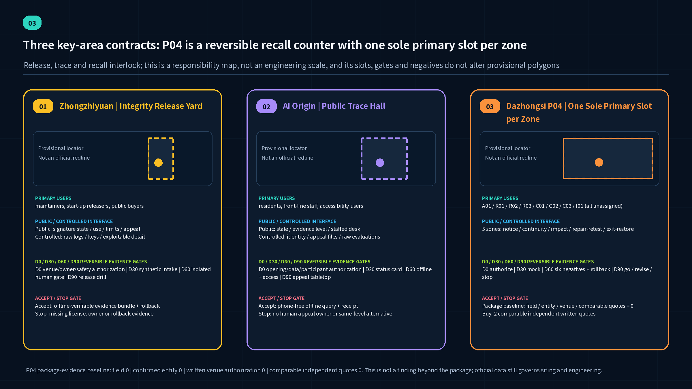
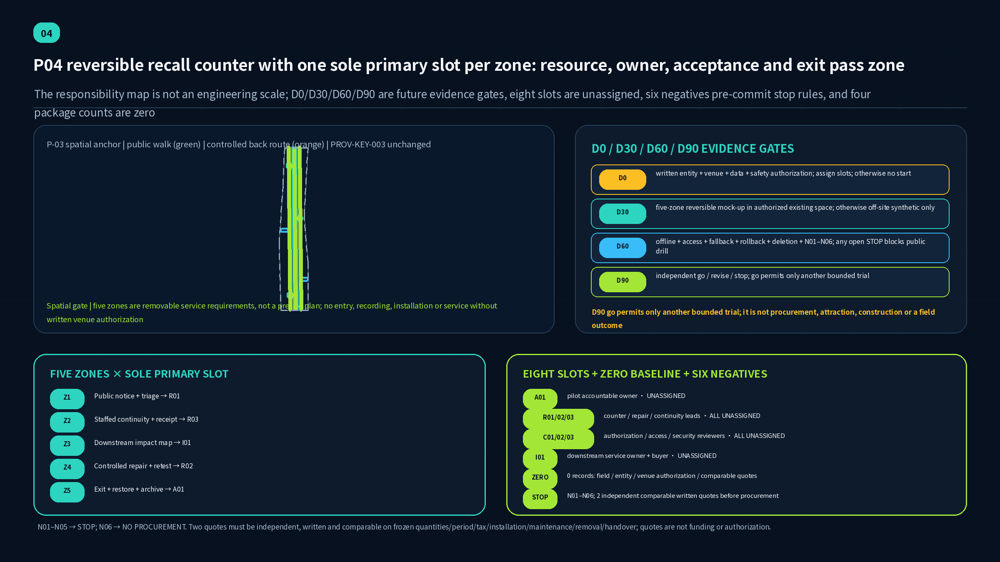
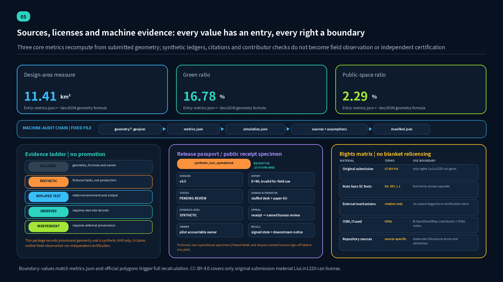

# Jing-Zhang Open Integrity Yard: Public Infrastructure for Trusted Urban-AI Release, Recall, and Learning

This proposal does not treat “AI governance” as an opaque back-office control center. It brings a neglected civic question into public space: once a model, agent, MCP service, plugin, or robot firmware enters an urban service, how can residents and operators know where it came from, what it depends on, what it is allowed to do, who may be affected by a failure, how it can be paused or recalled, and how people continue the service when the machine is unavailable? The answer is a north–south public chain of integrity, operation, and recall. Zhongzhiyuan hosts trusted release; Beijing AI Origin Community hosts public traceability; Dazhongsi hosts recall and service exchange. The Zhongguancun Technology Services Wing supports licensing, compliance, and maintainers; the Xiaoyue River Scenario Enablement Wing tests low-risk daily-use cases. The lifecycle walk should use verified public space in the Jing-Zhang Railway Heritage Park only if official geometry and access support it. Otherwise it relocates to a verified public walking network inside the Overall Design Area, while the park remains an external connection and cultural narrative rather than a boundary forced to fit the concept.

> **v0.5 audit focus | P04 reversible recall-service counter with one sole primary slot per zone.** Each of five service zones has exactly one primary accountable slot. The eight coded slots are functions awaiting written acceptance, not appointed people or confirmed organizations [metric:p04_service_zone_count] [metric:p04_named_role_slot_count]. As of 21 August 2026, this package contains `0` verified field-observation records, `0` confirmed responsible-entity records, and `0` written venue-authorization records. These are submission-evidence counts, not a survey finding about evidence outside the package [metric:p04_field_observation_record_count] [metric:p04_confirmed_operator_record_count] [metric:p04_written_venue_authorization_record_count]. Any future work follows four evidence gates—D0, D30, D60, and D90—and six negative cases. Procurement additionally requires two independent written quotes on one comparable scope; the package currently contains `0` such quote records [metric:p04_decision_gate_count] [metric:p04_negative_case_count] [metric:p04_comparable_independent_quote_record_count].

## Design Basis and Source List

The official announcement is the source for the project name, the three scope levels, the three named key areas, approximate announced areas, and professional tasks. The Agent taskbook separately establishes the six Agent tasks, three positions, five functions, Three Zones and Two Wings, scenario quantities, and open-co-creation boundary [source:OFFICIAL-ANNOUNCEMENT] [source:AGENT-TASKBOOK]. The repository's `brief/site-package/` supplies the schemas, enums, cleared local references, and missing-data boundary used by this submission, but it does not upgrade any provisional item into official evidence [source:SITE-PACKAGE]. `data/source_registry.json` is the use-rights gate: formal task material, background material, and provisional-only geometry cannot substitute for one another [source:SOURCE-REGISTRY].

No official boundary or official key-area polygon with a verifiable coordinate system is currently available. `SITE-001` and `PROV-KEY-001/002/003` are rough provisional geometries prepared by repository maintainers from textual extents, north-to-south order, and approximate areas. They are used only for concept location, offline diagrams, temporary recalculation, and submission self-checks. They are not an Official Planning Boundary, Regulatory Detailed Planning control, parcel boundary, exact station location, or engineering alignment. In particular, `PROV-KEY-003` cannot prove an exact relationship between the Dazhongsi concept, Dazhongsi Station, a four-quadrant intersection, or any parcel [source:BOUNDARY-SOURCE] [source:KEY-AREA-SOURCE].

A community cross-check Issue reports 0% intersection coverage between `PROV-SITE-001` and the Jing-Zhang Railway Heritage Park mapped in OSM, with a nearest separation of 412.5 m. Its author also states that OSM may cover only the built and mapped portion, while the provisional polygon is itself inferred; the measurement therefore cannot decide which geometry is correct [source:BOUNDARY-CROSSCHECK-ISSUE-846]. This submission has not independently reproduced the measurement and treats it as a material cross-check signal. “A lifecycle walk along the heritage park” remains a design intent awaiting official data, not proof that `SITE-001` contains the real park or that the diagram can be set out as drawn. If official material confirms non-intersection, the main corridor relocates to a verified public walking network inside the Overall Design Area, the stations retain public connections, and the park becomes an external link and regional narrative. Once official polygons and a rights-cleared base map are available, all nine GeoJSON layers, area metrics, drawings, HTML pages, and project locations must be regenerated together rather than merely swapping a basemap.

Separate from the Issue #846 heritage-park check above, the repository made one fixed OSM/Overpass street-centreline cross-check on 14 August 2026 for the four announcement-named roads: Dazhongsi East Road, Heqing Road, Xueyuan Road, and Xitucheng Road. The reproducibility record fixes the endpoint and `bbox=(39.9380,116.3128,40.0270,116.3722)`; the query SHA-256 is `358587c0…ade5f`, the fetch time is `2026-08-14T06:21:53Z`, and the response SHA-256 is `af61fe00…496e` (10,559 bytes, 84 ways). The method retains north–south ways only, uses median node longitude as a centreline proxy, and compares it with the provisional edge at the same latitude, producing background eastward offsets of 533–898 m with a 667 m mean. OSM is mutable crowdsourced data with uneven accuracy, and a street centreline is neither a road redline nor an official reading of the announcement. These values do not move `SITE-001` or a key area, create an area or adjacency claim, change a metric, or affect scoring. The raw OSM response is not redistributed; the submission cites the local record and derived statistics only, with `© OpenStreetMap contributors` under ODbL [source:OSM-BACKGROUND-QUERY]; the full assumption contract is `A-OSM-BACKGROUND-001` in `assumptions.json`.

The proposal also reviews primary specifications for software supply chains, AI risk, deployed-system monitoring, authorization, and vulnerability coordination. These sources answer how an integrity-and-recall mechanism might work; they do not establish any Jing-Zhang spatial fact. SLSA provenance, Sigstore signing and transparency, and CycloneDX/SPDX artifact relationships are translated into release passports, dependency maps, and a public verification interface. The proposal has not been assessed for conformance, does not claim SLSA Build L3, and does not present a production SBOM, VEX statement, or real signature [source:SLSA-V1.2] [source:SIGSTORE-DOCS] [source:CYCLONEDX-1.7].

Evidence is organized in three layers. This narrative should be understandable without JSON. GeoJSON, metrics, matrices, and a synthetic exercise make claims traceable. `assumptions.json` identifies conclusions that still require official data, professional teams, an accountable operator, or legal review. A machine-valid package proves internal structure only; it does not prove constructability, legal compliance, or service safety.

### Crosswalk to the Six Agent-Taskbook Tasks

The six tasks are not checked with one repeated evidence bundle. Each has a distinct reviewable spatial object, operating action, and exit boundary. The table decomposes the taskbook's required content and outputs; every named quantity, file, and visible output is a falsifiable acceptance point, and a row is not covered when one of its named contents is absent [source:AGENT-TASKBOOK].

| Taskbook item | Direct proposal response | Visible output and verification entry | Boundary that remains |
| --- | --- | --- | --- |
| `agent.1` corridor concept and functional coordination | The original bilingual name, visual grammar, and one-corridor/three-station/two-wing/one-depot structure organize the three positions, five functions, and Three Zones and Two Wings as a lifecycle | Opening overview, identity paragraph, three-level/regional interfaces, and `spatial.json` | Provisional geometry is not an official boundary or engineering alignment; final type and trademark clearance remain pending |
| `agent.2` full-stack independent innovation and world-class ecosystem | Eight open mechanism precedents become a release passport, dependency map, isolated evaluation, candidate signing, license clinic, and maintainer handover | Eight-precedent table, ecosystem/regional interfaces, twelve synthetic tasks, and `simulation.json` | No conformance, certification, real signature, current company data, or existing partnership is claimed |
| `agent.3` AI+ scenario paradigm and active city | Twelve cards, including four industry tests, six personas, and low-risk Xiaoyue River co-tests each have human review, a stop condition, and a non-digital alternative | Scenario cards, persona table, three-state interface, `risk.json`, and `simulation.json` | All are synthetic or conceptual; each live scenario needs separate authorization and reassessment |
| `agent.4` public space, new business forms, and pilgrimage landmarks | Three knowledge landmarks, five commons, east–west stitching/north–south continuity intent, and the Dazhongsi recall interface make public service open to questions and easy to exit | Three key areas, public/controlled interfaces, blue-green walk, versioned recognition rules, and component principles | No monumental screen, safety endorsement, or engineering-feasibility claim; carrier, fire, and access remain pending |
| `agent.5` Jing-Zhang, Zhongguancun, and new AI culture | “Accessibility—handoff—verifiable collaboration” links railway infrastructure ethics, open-source work, and public learning through a bilingual wayfinding grammar | Lifecycle Walk, three public-knowledge devices, public identity system, and equivalent Chinese/English text | No railway history, existing relic, or third-party brand right is invented; international communication is not official endorsement |
| `agent.6` global activities and long-term operation | A 90-day minimum pilot, seasonal rhythm, recall drill, night school, versioned contribution display, and exit charter form a stoppable loop | The 90-day acceptance contract below, annual operation P10, and three-phase plan | No budget, procurement, event, international partnership, conversion result, or operator is claimed as confirmed |

## Three-Level Scope Framework

The three levels are a progression from strategic question to spatial network to node-level test, not three disconnected plans. The approximately 43.6-square-kilometre Coordinated Research Area studies the regional innovation ecosystem and coordination rules. The approximately 11.4-square-kilometre Overall Design Area organizes the public corridor, functional pattern, mobility, municipal support, and renewal projects. The approximately 368.4-hectare Key-Area Detailed Design Area tests three different urban interfaces: release, trace, and recall [source:OFFICIAL-ANNOUNCEMENT] [standard:MOHURD-URBAN-DESIGN-MEASURES] [depth:three_level_scope_framework].

| Level | Question answered by the proposal | Main output | Precision boundary |
| --- | --- | --- | --- |
| Coordinated Research Area (CRA) | When urban-AI artifacts move among universities, firms, public bodies, and communities, who provides provenance, validation, licensing, maintenance, and exit capacity? | The “one corridor, three stations, two wings, one continuity depot” ecosystem loop, open-standard references, and regional interfaces | Strategic and mechanism research only; no new boundary or company fact |
| Overall Design Area (ODA) | How can trusted release, operational observation, human fallback, and public learning become accessible urban services? | Lifecycle walk, west service spine, east daily-life spine, six conceptual building anchors, blue-green public space, and three phases | `SITE-001` is provisional; area and length values are package-level recalculations only [data:geometry/site_boundary.geojson#SITE-001] |
| Key-Area Detailed Design Area (KDA) | How can the three mechanisms become distinct detailed-design briefs? | Integrity Release Yard, Public Trace Hall, and Recall and Service Exchange | All three polygons are provisional and cannot establish exact siting [metric:key_area_count] |

The overall structure is called **one corridor, three stations, two wings, and one depot**. The corridor is the Jing-Zhang Lifecycle Walk. The three stations are the Integrity Release Yard, Public Trace Hall, and Recall and Service Exchange. The two wings are the Zhongguancun Technology Services Wing and Xiaoyue River daily-life scenario wing. The depot stores human-fallback and continuity capability. An artifact enters provenance and isolated validation in the north, gains a publicly readable operational status along the corridor, and reaches impact mapping, recall, repair, or retirement in the south. The west wing connects licensing, capital, procurement, and maintainer support; the east wing connects community, accessibility, and daily-service tests. Design layers express this directional relationship without treating the rectangular provisional edges as streets, parcels, or engineering boundaries [data:geometry/roads.geojson#ROAD-LIFECYCLE-GREENWAY] [depth:overall_spatial_structure].

After official polygons replace the provisional geometry, professional teams must recheck whether each station remains in the correct area, whether the walk can follow real public space continuously, whether either wing crosses inaccessible or restricted land, whether a suitable renewal carrier exists for each building anchor, and whether the phasing areas and metrics remain valid. A failed check should move or redesign a project; it must never move the official boundary.

## Coordinated Research Area: Industry and Future City Research

The industrial judgment is that a world-class AI innovation ecosystem needs more than models, compute, and capital. It also needs shared civic capacity to identify, validate, procure, maintain, suspend, and retire artifacts. “Yard” refers simultaneously to the ordered handoffs of a railway yard, an open-source collaboration yard, and a public learning yard. The original visual grammar combines parallel rails, verification brackets, and reversible nodes. Charcoal, signal cyan, and repair orange distinguish normal, pending-review, and recall states. No third-party mark or uncleared typeface is used. This draft therefore draws one non-final identifier and a four-state grammar—normal, pending review, recall, and human fallback—without claiming trademark rights; final typography, accessible contrast, and trademark clearance require later professional work [source:AGENT-TASKBOOK].

The three positions form one narrative. The Centennial Jing-Zhang Cultural Belt speaks to the infrastructure ethic that movement has an origin and handoffs leave records. The Urban AI Life Experience Belt lets residents see permissions, status, human service, and exit routes. The AI Integrated Innovation Belt turns release validation, dependency governance, and maintenance into shared services. The five functions do not each need an isolated building: full-stack independent innovation passes through provenance and dependency review in the Release Yard; a world-class ecosystem grows through open collaboration at AI Origin; AI-enabled scenarios receive low-risk tests in the Xiaoyue River wing; an active AI city becomes visible through the walk and public interface; governance influence accumulates through reviewable rules, synthetic exercises, and published improvement.

The following are eight open mechanism precedents, not a ranking of global districts. They establish the rooms, counters, and operating sequences worth prototyping here; none supplies a spatial fact about Jing-Zhang.

| Mechanism precedent | Primary-source mechanism | Spatial translation | Claim deliberately not made |
| --- | --- | --- | --- |
| SLSA v1.2 | Artifact origin, production process, provenance, and incremental assurance | Provenance counter, reproduction cell, verification gate, and release passport | No SLSA level is claimed [source:SLSA-V1.2] |
| Sigstore | Identity-linked signing, short-lived certificates, transparent records, and verification | Synthetic signing ceremony, public verification terminal, and unexpected-signing observation seat | No production Sigstore service is operated or endorsed [source:SIGSTORE-DOCS] |
| CycloneDX 1.7 | Components, services, direct and transitive dependencies, lifecycle, and vulnerability status | Walkable dependency graph, downstream-impact table, and recall queue | The synthetic inventory is not claimed as conformant [source:CYCLONEDX-1.7] |
| SPDX 3.0.1 | BOM, AI models, datasets, licenses, provenance, integrity, and relationships | License clinic, model/data origin card, and reuse-boundary wall | SPDX marks are not used as certification [source:SPDX-3.0.1] |
| NIST AI RMF and GAI Profile | Voluntary govern-map-measure-manage process and GAI risk profile | Four public counters, human go/no-go meeting, and objection channel | They do not replace Chinese law or project review [source:NIST-AI-RMF] [source:NIST-AI-600-1] |
| NIST AI 800-4 | Post-deployment functionality, operations, human factors, security, compliance, and large-scale impact monitoring | Operations observatory, drift diary, and scheduled service and human-factors review | No real system is claimed as deployed or monitored [source:NIST-AI-800-4] |
| CERT/CC and FIRST CVD | Finder, supplier, downstream party, coordinator, and multiparty synchronization | Role-separated rooms, sealed work area, and synchronized notice counter | No exploit detail or universal timetable is published [source:CERTCC-CVD] [source:FIRST-MULTIPARTY-CVD] |
| CISA VEX and NIST SSDF | Affected-status communication, supplier collaboration, and root-cause improvement | Impact-status card, repair gate, retirement archive, and maintainer classroom | No real-product VEX or SSDF certification [source:CISA-VEX] [source:NIST-SSDF] |

### Globally Comparable Mechanisms: Not Spatial Templates

The following compare only three institutional actions—how to disclose systems, test claims, and bound a pilot. They supply no Jing-Zhang site fact, building form, applicable law, or partnership and do not show that a local implementation already exists.

| Official primary mechanism | Verifiable institutional action | Limited translation into this proposal | Conclusion that cannot be exported |
| --- | --- | --- | --- |
| City of Helsinki AI Register | A municipal register offers system overviews, details, and feedback; its Talbotti entry discloses responsible contacts, data, processing logic, performance, human oversight, and risk management | The Public Trace Hall uses a service card with owner, purpose, data category, human alternative, risk, feedback, version, and retirement state | No city data or interface is copied; registration is not treated as completeness, compliance, or certification, and no equivalent Jing-Zhang register is claimed [source:HELSINKI-AI-REGISTER] |
| Singapore IMDA AI Verify | A governance framework/toolkit combines technical tests and process checks and generates reports; the official source says it neither defines ethical standards nor guarantees a risk-free, bias-free, or completely safe system | The isolated evaluation desk records claim, scope, version, result, limit, reviewer, and rollback evidence in one receipt rather than issuing a pass badge | This proposal has not run AI Verify or received its report, certification, or endorsement; tool output cannot replace legal or professional judgment [source:SINGAPORE-AI-VERIFY] |
| EU AI Act Articles 57–58 sandbox mechanism, including the 2026 amendment | Under a specific plan agreed with competent authorities and safeguards, a controlled, time-limited environment supports development, training, testing, and validation with supervision, learning, and exit records | The 90-day minimum pilot borrows only the procedure grammar of scope, supervision, stop gates, and exit report; a live pilot still needs local authorization | This proposal is not an EU regulatory sandbox and creates no conformity, market-access, official-approval, or real-world-testing authorization [source:EU-AI-ACT-SANDBOX] |

The Three Zones and Two Wings are connected by artifacts rather than slogans. Zhongzhiyuan produces candidate artifacts with reviewable evidence. AI Origin lets maintainers, buyers, and the public understand capabilities and limits. Dazhongsi organizes impact, repair, and service continuity across many downstream uses. The Zhongguancun wing provides licensing, intellectual-property, compliance, procurement, and maintainer support. The Xiaoyue River wing tests usability in community, education, medical, legal, and daily-service contexts with synthetic data. Regional collaboration with Beiwei Community, Future Science City, Huairou Science City, Beijing E-Town, or Jing-Jin-Ji is proposed only through portable release-passport, status-card, and recall-notice interfaces. No existing partnership or data exchange is asserted.

The future city is therefore not an omniscient city covered in sensors. It makes permission boundaries, abnormal state, human takeover, and retirement as easy to find as a station, library, or service center. Its industrial value is to reduce the cost for small teams to reproduce compliance, validation, and maintenance work. Its public value is to preserve service, explanation, and appeal when AI fails.

## Overall Design Area: Urban Renewal and Regulatory-Plan-Level Urban Design

The renewal framework is “corridor first, nodes inserted, existing fabric preferred, pilots reversible.” The north–south Lifecycle Walk supports walking, cycling, status wayfinding, and public learning. A western service spine links licensing, compliance, procurement, and maintenance. An eastern daily-life spine links community tests, staffed counters, and accessible service. Three cross-connectors return the release, trace, and recall stations to the public corridor [data:geometry/roads.geojson#ROAD-LIFECYCLE-GREENWAY] [depth:traffic_rail_slow_parking].

The proposal does not turn the entire ODA into a security campus. Six shared carriers are inserted among AI research, industry services, community support, and park/open space: release validation, public trace, recall exchange, service wing, daily-life wing, and continuity depot. `land_use.geojson` expresses conceptual functions and topology only. Its codes and areas must be reconstructed against an official boundary, existing-condition survey, and Regulatory Detailed Planning base [data:geometry/land_use.geojson#LU-CORRIDOR] [depth:land_use_layout].

Buildings are small-scale, ground-floor-visible, and reversible. High-security isolated evaluation sits behind the public interface; status explanation, licensing advice, public feedback, and human service occupy accessible ground floors. Sensitive-information routes and visitor routes are separated. Every digital counter is paired with staffed or callable support. The six `BLDG-*` features are program envelopes, not surveyed buildings or approved construction. Floor area, height, FAR, setback, and fire conditions remain pending [data:geometry/buildings.geojson#BLDG-CONTINUITY-DEPOT] [metric:total_floor_area_sqm].

“Regulatory-plan-level” depth in this Agent submission means leaving a professional team a complete set of reviewable objects, not fabricating approved controls. Functional layout, public-space network, project dependencies, a retain-renovate-demolish decision tree, transport and utility checklists, phase order, and metric formulas are structured. Statutory land use, development intensity, road redlines, capacity, and engineering feasibility remain explicitly unknown [standard:MOHURD-CONTROL-DETAILED-PLANNING] [depth:development_intensity_controls].

The public corridor uses three common states. Green means that evidence is present and operation remains within the declared authorization. Orange means restricted use, active review, or required human confirmation. Red means the digital service is suspended and a human alternative is active. Color never carries meaning alone; text, shape, and accessible audio accompany it. A named responsible person publishes each state with timestamp, applicable version, and appeal route.

## Detailed Design of Key Areas

The three areas take different lifecycle roles rather than copying a generic AI exhibition hall. Their names, tasks, and approximate areas come from the announcement, but every location and building move below is a conceptual recommendation for professional development. The rough polygons provide three machine-readable indexes only; they do not verify a street, entrance, water edge, or parcel [source:KEY-AREA-SOURCE] [depth:three_key_area_detailed_design].

| Key area | Position and spatial sequence | Building renewal and DRR | Mobility, public space, and core scenario | Delivery risk |
| --- | --- | --- | --- | --- |
| Zhongzhiyuan AI Independent Innovation Acceleration Area | **Integrity Release Yard.** A one-way but abortable sequence leads from public forecourt to provenance intake, isolated validation, human review, and synthetic signed release. The secure back-of-house and public observation gallery remain separate | Adaptable R&D or display carriers are preferred. Valuable structures and interfaces are retained; box-in-box isolation cells and removable release benches are added. No demolition is designated before a survey | `PUBLIC-RELEASE-YARD` meets the Lifecycle Walk. Visitor and R&D logistics are separated. Tests include reproducible builds, AI/ML BOM, model evaluation, and signature-verification exercises [data:geometry/buildings.geojson#BLDG-RELEASE-YARD] | Qinghe, Fifth Ring mobility, green space, fire, power, and network isolation all require official data. No security certification or production release is claimed |
| Beijing AI Origin Community | **Public Trace Hall.** Maintainer studios, a license clinic, capability-and-limit gallery, public objection desk, and learning steps make “who made it, what it uses, when it changed, and how to opt out” readable | Low-disturbance adaptation of ground floors and courtyards; shared teaching, incubation, and community space is preferred. Sensitive research stays private; public content is modular and updateable | `PUBLIC-TRACE-FORECOURT` joins a conceptual campus–park walking link. It hosts release-passport search, an MCP least-privilege clinic, content-provenance classes, and staffed assistance [data:geometry/buildings.geojson#BLDG-PUBLIC-TRACE-HALL] | Campus edges, ownership, buildings, and station drawings are unavailable. The proposal does not claim access into a campus or a specific Wudaokou/Qinghuadongluxikou entrance |
| Dazhongsi AI Industry Cluster | **Recall and Service Exchange.** An impact-map hall, coordination rooms, repair/replacement counter, human-fallback dispatch, and retirement archive turn a multi-downstream failure into service recovery | Accessible commercial or industry ground floors are adapted first. Movable impact walls and temporary service counters occupy the public zone; closed coordination rooms remain behind, and the public zone shows approved, safe-to-publish summaries only | `PUBLIC-RECALL-PLAZA` links conceptual transit and daily services. It hosts synthetic dependency mapping, recall exercise, alternative-service routing, and public incident learning [data:geometry/buildings.geojson#BLDG-RECALL-EXCHANGE] | The current polygon does not establish Dazhongsi Station or the four-quadrant intersection. Transit integration, cycle parking, commerce, and evacuation require fieldwork |

All stations follow four rules: evidence travels with the artifact; permission is granted per task; abnormality first protects service continuity; public learning contains only facts safe to publish. Zhongzhiyuan outputs a versioned candidate release with limitations, not a pass certificate. AI Origin supports comparison, challenge, and withdrawal rather than company promotion. Dazhongsi shows affected services, repair status, human alternatives, and accountable learning rather than attack technique.

## AI Innovation Ecosystem, Personas, and AI+ Scenarios

### Six personas

| User | Real task | Spatial need | Boundary that cannot be crossed |
| --- | --- | --- | --- |
| Open-source maintainer or independent developer | Demonstrate origin, manage dependencies, receive reports, and preserve reputation | Affordable release desk, license clinic, closed coordination room, reservable evening workspace | No secret, unpatched detail, or personal identity is displayed; contribution credit can be withdrawn from display |
| Start-up release owner | Complete inventory, evaluation, permission, and rollback before procurement or pilot | Isolation cell, synthetic dataset, supplier support, and release-review table | Passing an exercise is not certification, investment endorsement, or procurement eligibility |
| Public buyer or operator | Judge version, intended use, downstream impact, and exit cost | Version comparison wall, dependency map, takeover drill, and retirement archive | Final procurement, launch, and emergency decisions remain with authorized people |
| Front-line service worker | Continue service, explain state, and record impact during AI degradation | Staffed counter next to digital terminal, paper process, callable support, and training | Automated advice is not a final decision; a person without a smartphone cannot be denied service |
| Resident, older adult, disabled person, or caregiver | Know whether AI is used, how to refuse it, and where to obtain redress | Clear status, accessible route, multilingual/easy-read notice, and offline appeal | No face recognition, persistent tracking, or commercial profile; a non-digital route remains available |
| Security researcher, coordinator, or downstream supplier | Report safely, validate impact, and synchronize remediation and notice | Secure receiving point, role-separated rooms, impact map, and notice review | No third-party testing without authorization; applicable law and disclosure processes govern |

### Twelve scenario cards

All scenarios use public, aggregate, synthetic, or explicitly authorized data. Each has a human owner, a stop condition, and a non-digital alternative. Cards 01–04 are industry testing and validation scenarios; 05–12 are public-service and learning scenarios. The twelve cards are grouped by shared spatial and operating capability into six synthetic scenario nodes in `simulation.json`/`spatial.json`, so `scenario_count=6` is not the number of cards. Twelve synthetic recall tasks are recorded separately by `simulation_task_count`. The exercise tests the evidence contract and status transitions only; it contains no real vulnerability [source:NIST-AI-600-1] [source:MCP-AUTH-2025-11-25].

| Card | Type and location | User and operating data | Human review, operator, and control |
| --- | --- | --- | --- |
| 01 Provenance Passport Clinic | Industry validation; Integrity Release Yard | Maintainer submits a synthetic artifact's version, origin, model/data note, license, owner, and exit plan | Release coach reviews every field; missing evidence returns the package and never creates “certification” |
| 02 Isolated Reproduction and Evaluation Cell | Industry validation; Zhongzhiyuan back-of-house | Synthetic input reproduces a build/evaluation while hash, tool version, energy budget, and failure are recorded | Security engineer approves network and data scope; privilege or budget violation stops the run [source:NIST-SSDF] |
| 03 AI/ML BOM and Downstream Dependency Table | Industry validation; Release Yard–Recall Exchange | Synthetic components, models, datasets, services, and direct/transitive dependencies form a visible graph | Supply-chain owner marks complete, incomplete, or unknown; absence is never silently treated as no dependency [source:CYCLONEDX-1.7] [source:SPDX-3.0.1] |
| 04 MCP Least-Privilege Clinic | Industry validation; Public Trace Hall | A fictional agent demonstrates target resource, minimal scope, step-up authorization, withdrawal, and token audience | Authorization specialist and security reviewer approve; only isolated services are used and no real token is retained [source:MCP-AUTH-2025-11-25] |
| 05 Synthetic Signed-Release Ceremony | Zhongzhiyuan public forecourt | Public compares artifact, digest, bundle, identity, and timestamp | Facilitator labels it as an exercise; failed results remain visible and no production trust root is used [source:SIGSTORE-DOCS] |
| 06 Public Trace Search | Trace Hall and offline page | Resident searches version, purpose, limitation, data category, owner, last review, and human alternative by service name | Content editor and service owner co-sign; secrets, personal data, and promotional ranking are excluded |
| 07 Content-Provenance Class | AI Origin learning steps | Self-made synthetic text and images teach provenance labels, context checks, and uncertainty | Educator explains that a technical label is not a truth guarantee; no victim or uncleared material is used |
| 08 Safe Vulnerability Intake and Coordination | Closed Recall Exchange intake | Researcher files a fictional report with contact preference, affected synthetic version, and safe reproduction summary | Coordinator first verifies authorization and scope; a real report must enter a lawfully established secure channel [source:MIIT-VULN-REGULATION] [source:CERTCC-CVD] |
| 09 Multiparty Impact Mapping | Recall Exchange impact hall | A synthetic upstream component affects several fictional downstream services; teams label unknown, affected, or not affected with justification | Each downstream owner signs its own status; automation cannot turn unknown into safe [source:FIRST-MULTIPARTY-CVD] [source:CISA-VEX] |
| 10 Recall–Replace–Human-Fallback Exercise | Recall Exchange and Continuity Depot | Twelve synthetic tasks are paused, notified, routed to human/offline service, repaired, retested, and restored | Exercise commander can stop the sequence; front-line staff decide restoration and the public sees service status rather than exploit detail [data:geometry/constraints.geojson#CONSTRAINT-HUMAN-FALLBACK] |
| 11 Xiaoyue River Low-Risk Daily-Service Trial | Xiaoyue River wing | Synthetic appointments, accessible routes, and FAQs test entry points for medical, education, legal, and daily services | Professionals provide final answers. No diagnosis, adjudication, eligibility decision, or personal trajectory is recorded |
| 12 Lifecycle Walk and Incident-Learning Night School | Jing-Zhang public corridor | Public reads sanitized cases at origin, permission, operation, abnormality, recall, repair, and retirement stops | Editorial board checks facts, wording, and accessibility; no real vulnerability is branded and individuals are not blamed |

These seven public-wayfinding themes form an explanatory layer. The six-step Register–Quarantine–Release–Observe–Recall–Learn lifecycle loop in the drawings is an operating layer; the two are not intended to correspond one-to-one.

The common exit design matters more than apparent intelligence. Interfaces show whether AI is active, which version is in use, and when it was last reviewed. A user can switch to a person. An operator can suspend one tool without closing the public service. A repaired version must retest the failed path. Retirement removes unneeded data, revokes authorization, and preserves only necessary audit records. Monitoring considers functionality, infrastructure, human interaction, security, compliance, and large-scale impacts, but this proposal supplies templates rather than field data [source:NIST-AI-800-4].

## Land Use, Building Scale, and Retain-Renovate-Demolish Strategy

The conceptual land-use structure organizes six design functions around the public corridor, carried by seven recomputable conceptual land-use units: park and learning corridor, northern release/R&D, central open collaboration, southern recall/service, western professional support, and eastern daily-life scenarios. The six functions do not correspond one-to-one with the seven GeoJSON features. They are design functions rather than statutory changes. Every `land_use_code` must be checked parcel by parcel against official boundaries, existing conditions, and Regulatory Detailed Planning [standard:MNR-LAND-USE-CLASSIFICATION-GUIDE] [data:geometry/land_use.geojson#LU-WEST-CENTRAL] [depth:land_use_layout].

To prevent the “industry ratio” from being mistaken for approved land allocation, the proposal specifies a first-round **operating-program and shared-indoor-time mix**: 30% release validation and security evaluation; 20% open-source collaboration and result traceability; 15% licensing, compliance, and procurement support; 15% human fallback and maintainer training; 10% public education and incident learning; 10% community daily-life scenarios. The mix schedules rooms and staff shifts. It is not a land, floor-area, investment, or tenant commitment and must be reworked from real demand.

The Demolish–Renovate–Retain Strategy uses four evidence gates:

1. **Retain:** buildings with cultural value, structural fitness, continued use, and compatible public interfaces are preferred; without heritage and structural data, the default is no demolition.
2. **Renovate:** low-disturbance ground-floor opening, accessibility, fire, MEP, acoustics, and network zoning are preferred when sufficient.
3. **Add reversibly:** box-in-box isolation cells, light galleries, and removable counters serve validation and temporary public service without prematurely becoming permanent construction.
4. **Demolish/new-build:** only after ownership, value, structure/fire, environmental effect, planning control, and approval support a professional comparison. This submission designates no building for demolition.

`BLDG-RELEASE-YARD`, `BLDG-PUBLIC-TRACE-HALL`, `BLDG-RECALL-EXCHANGE`, `BLDG-SERVICE-WING`, `BLDG-LIFE-WING`, and `BLDG-CONTINUITY-DEPOT` are project anchors only. Geometry can recompute conceptual footprint, while real floor area, FAR, height, and density remain limited by provisional boundaries and unsurveyed envelopes [metric:building_footprint_area_sqm] [metric:floor_area_ratio]. Character comes from legible entrances, visible service state, durable replaceable parts, and low-glare lighting. “Rail” is an abstract grammar of order and handoff, not an imitation of an unverified historic building.

## Transport, Rail, Municipal Infrastructure, and Public Services

Mobility first asks whether a person can reach explanation and human service continuously, safely, and accessibly. `ROAD-LIFECYCLE-GREENWAY` is a conceptual north–south walking and cycling route. `ROAD-SERVICE-SPINE` and `ROAD-LIFE-SPINE` serve professional support and daily scenarios. Three connectors link the key areas to the corridor. They represent network relationships, not road redlines or engineering centerlines [data:geometry/roads.geojson#ROAD-TRACE-CONNECTOR] [depth:traffic_rail_slow_parking].

Each station has four arrival layers: rail/bus orientation, continuous walking and cycling, a short accessible route, and separated service/emergency access. Dazhongsi's four quadrants, Wudaokou, and Qinghuadongluxikou remain subjects required for later development. This draft draws no bridge or tunnel, fixes no station entrance, and promises no crossing. Field counts, crossing delay, gradient, tactile paving, cycle parking, and evacuation should support ground-level-first options. AI wayfinding may recommend only human-reviewed public routes, process location briefly on-device, and remain entirely optional.

New infrastructure is small, distributed, isolatable, and degradable. The Release Yard has an isolated network and metered evaluation cell. The Trace Hall holds an offline public mirror so essential information survives an internet failure. The Recall Exchange stores version lists, notice templates, and a human call tree. The Continuity Depot holds paper forms, offline guides, backup-power interfaces, and training positions. No server-room scale, electrical class, cooling, drainage, bandwidth, or carbon reduction is claimed without professional calculation [depth:municipal_new_infrastructure].

Public and technical facilities always appear in pairs: staffed entry beside self-service terminal, low-tech notice board beside status screen, withdrawal route beside digital authorization, noise and dispersal plan beside evening program, and accountable contact plus stop control beside each scenario. Continuity is not a backup AI. It is trained front-line staff, paper/phone/in-person procedures, and cross-organization contact.

## Blue-Green Network, Public Space, and Urban Character

If official extents, ownership, and public access support it, the blue-green network uses the Jing-Zhang Railway Heritage Park as everyday ecological and learning infrastructure rather than technology-exhibition scenery. Otherwise `GREEN-LIFECYCLE-CORRIDOR` relocates to verified public green and walking space inside the Overall Design Area, while the heritage park remains an external connection. The concept corridor combines shade, rainwater retention, walking, cycling, and quiet rest. Three rain-garden learning spaces use the natural analogies of input–process–output, origin–relationship–feedback, and abnormality–repair–recovery. Water, blue-line, sponge-city, tree-protection, and park-relationship requirements await official and measured data [data:geometry/green_space.geojson#GREEN-LIFECYCLE-CORRIDOR] [depth:blue_green_public_space].

Five commons form the public-space system. The Release Forecourt holds small public reviews. The Trace Forecourt hosts easy-read search and community learning. Recall Plaza converts into a service-routing point during an exercise. The service-wing commons offers legal, license, and maintenance consultation. The daily-life commons hosts resident co-testing and accessibility review. They need no identity-tracking footfall system; manual or anonymous aggregate counts are sufficient. Event and quiet zones are separated by time and space to protect daily community use [data:geometry/public_space.geojson#PUBLIC-TRACE-FORECOURT] [metric:public_space_ratio].

Three AI pilgrimage landmarks are maintainable public-knowledge devices rather than monumental screens:

- **Checksum Gate** at the Release Yard forecourt uses two non-contact frames to explain artifact–digest matching and displays synthetic releases only.
- **Lineage Wall** at the Trace Hall uses replaceable cards for model, data, component, license, version, and responsibility relationships; unknowns remain prominent.
- **Recall Clock** at the Recall Exchange shows the relative order of discovery, confirmation, notice, human takeover, repair, retest, and retirement. It never counts down a real vulnerability.

Recognition uses withdrawable, versioned contribution cards that record only role, evidence link, applicable period, and change/withdrawal state; it creates neither a “safest product” ranking nor an official honour. The public-space component library defines only three reusable families: status signs that pair words with shapes, verification kiosks that work offline and issue receipts, and staffed fallback points reachable on the same level as a digital interface. Each must be replaceable, maintainable, bilingual, and accessible. A component cannot enter long-term deployment without an accountable content owner, maintenance resources, and a human alternative [source:AGENT-TASKBOOK].

The cultural narrative has three movements: railway accessibility and handoff; Zhongguancun open experimentation; verifiable collaboration in the AI era. It does not invent railway-history details or reduce culture to chip patterns. Wayfinding uses open typefaces or self-made geometry, Chinese primary information, equivalent English, color-blind-safe shapes, and tactile/audio support. Lighting is low, shielded, and demand-based. Logo, typeface, historic image, portrait, and company mark require separate clearance.

## Renewal Projects, Implementation Policy, and Phasing

The following are concepts for professional development, not approved investment, construction, or operating commitments.

| Project | Spatial role | First deliverable | Dependency and suggested responsibility mix |
| --- | --- | --- | --- |
| P01 Jing-Zhang Lifecycle Walk | Corridor | Seven-theme wayfinding, accessible nodes, and offline status interface | Official public-space/heritage/mobility data; relocate to a verified public walking network if the park lies outside the Overall Design Area; park, community, accessibility, and operating teams |
| P02 Zhongzhiyuan Integrity Release Yard | North station | Provenance passport, isolated validation, human go/no-go, and synthetic signed release | Site, fire, power, network, security, and review; park operator, maintainers, and testing organizations |
| P03 AI Origin Public Trace Hall | Middle station | License clinic, version/limit search, objection channel, and classes | Campus/ownership, public-opening conditions, and content review; community, university/open-source group, and public-service provider |
| P04 Dazhongsi Recall and Service Exchange | South station | Five-zone reversible recall counter with one sole primary slot per zone: notice/triage, staffed continuity, impact mapping, controlled repair/retest, and exit/restore/archive | Station/parcel survey, written responsible-entity and venue authorization, and lawful disclosure process; all eight role slots remain unassigned |
| P05 Zhongguancun Maintainer Services Wing | West wing | License, IP, procurement, compliance, maintenance funding, and handover support | Service providers and conflict-of-interest rules; professional and community organizations |
| P06 Xiaoyue River Daily-Service Scenario Wing | East wing | Low-risk co-tests for medical, education, legal, and daily service | Scenario authorization and privacy/accessibility review; residents, professionals, and scenario operators |
| P07 Continuity Depot | Depot | Human procedures, paper kit, offline mirror, call tree, and drills | Named continuity owner for each service; front-line, emergency, and facility teams |
| P08 Public Incident-Learning Editorial Room | Shared | Sanitized timeline, root-cause category, remediation, and institutional change | Legal, security, privacy, and fact review; independent editorial committee |
| P09 Synthetic Supply-Chain Exercise Pack | Digital/all-area | Twelve tasks covering fictional artifacts, dependencies, permissions, recall, and evidence | Safety scope, stop conditions, and versioned evidence; exercise commander and observers |
| P10 Annual Open Integrity Operation | All-area | Release week, dependency-map day, recall drill, public night school, and maintainer handover | Stable operating resources, public charter, complaint and exit rules; multiparty council |

Two namespaces are deliberately separate. `P01`–`P10` in the table above are human-facing identifiers for ten renewal and operating projects. The GeoJSON `project_id` field uses `P-00-*`–`P-06-*` only for the seven concepts that have independent spatial representations. The numbers must not be equated directly, and there are no missing `P-07-*`–`P-09-*` geometry IDs. The unambiguous mapping is:

| Human-facing project | GeoJSON `project_id` | Mapping boundary and machine evidence |
| --- | --- | --- |
| P01 Jing-Zhang Lifecycle Walk | `P-00-LIFECYCLE-CORRIDOR` | Corridor object; see `ROAD-LIFECYCLE-GREENWAY`, `GREEN-LIFECYCLE-CORRIDOR`, and `LU-CORRIDOR` |
| P02 Zhongzhiyuan Integrity Release Yard | `P-01-RELEASE-YARD` | Independent spatial object; see `BLDG-RELEASE-YARD` and its forecourt, garden, and isolation constraint |
| P03 AI Origin Public Trace Hall | `P-02-PUBLIC-TRACE-HALL` | Independent spatial object; see `BLDG-PUBLIC-TRACE-HALL` and its forecourt, garden, and human-fallback constraint |
| P04 Dazhongsi Recall and Service Exchange | `P-03-RECALL-EXCHANGE` | Independent spatial object; see `BLDG-RECALL-EXCHANGE` and its plaza, garden, and recall-staging constraint |
| P05 Zhongguancun Maintainer Services Wing | `P-04-SERVICE-WING` | Independent spatial object; see `BLDG-SERVICE-WING`, `ROAD-SERVICE-SPINE`, and `PUBLIC-SERVICE-COMMONS` |
| P06 Xiaoyue River Daily-Service Scenario Wing | `P-05-LIFE-WING` | Independent spatial object; see `BLDG-LIFE-WING`, `ROAD-LIFE-SPINE`, and `PUBLIC-LIFE-COMMONS` |
| P07 Continuity Depot | `P-06-CONTINUITY-DEPOT` | Independent spatial object; see `BLDG-CONTINUITY-DEPOT` |
| P08 Public Incident-Learning Editorial Room | No independent `project_id` | A shared operating program across the three stations, with no added footprint; machine evidence is `SCN-PUBLIC-LEARNING` in `simulation.json`, and it may use reviewed rooms in the three stations |
| P09 Synthetic Supply-Chain Exercise Pack | No independent `project_id` | A digital/all-area evidence pack with no spatial boundary; the authoritative machine evidence is the task ledger in `simulation.json` |
| P10 Annual Open Integrity Operation | No independent `project_id` | A recurring all-area operating program with no spatial boundary; its implementation sequence is carried by `PHASE-03-LONG-TERM-OPERATIONS` |

### P04 Reversible Recall-Service Counter with One Sole Primary Slot per Zone

“One sole primary slot per zone” does not mean that one person performs every task. It means each zone has one non-dilutable primary accountable slot. Consulted and observing slots may review the work, but cannot turn accountability into “everyone jointly owns it.” This is an operating-responsibility mapping, not a drawing ratio, full-scale plan, or engineering scale. The five zones are removable service requirements; they add no precise building and do not alter `PROV-KEY-003`:

| Zone | Minimum resource | Sole primary slot | Acceptance evidence | Exit / restoration |
| --- | --- | --- | --- | --- |
| Z1 Public Notice and Triage | Bilingual status board, paper triage form, accessible waiting position, timestamped receipt | `R01` Counter Duty Operator | A visitor can read version, impact, action, staffed alternative, and responsible slot and obtain a receipt | Close triage and route to a safe staffed channel when notice is uncleared, the accessible route fails, or the receipt is unverifiable |
| Z2 Staffed Continuity and Receipt | Paper procedure, offline roster, callback queue, same-level accessible counter | `R03` Front-line Continuity Lead | The frozen task remains completable after digital suspension, with a receipt for takeover, disposition, and next review | Stop the public-facing pilot when staffing is absent, the paper process fails, or the same-level alternative is unreachable |
| Z3 Downstream Impact Mapping | Versioned synthetic dependency graph, three-state reason cards, notice and acknowledgement ledger | `I01` Downstream Service Owner and Buyer | Every synthetic downstream item retains a responsible slot, state reason, notice route, and visible unresolved unknowns | Seal and stop if a real entity or production datum enters, affected scope lacks a responsible slot, or automation rewrites unknown as safe |
| Z4 Controlled Repair and Retest | Isolated workstation, frozen test suite, patch summary, rollback bundle, retest log | `R02` Artifact Maintainer and Repair Lead | Synthetic repair is reproducible in isolation, rollback executes, and both success and failure remain recorded | Isolate and end upon real exploit detail, production credentials, excessive privilege, rollback failure, or unverifiable deletion |
| Z5 Exit, Restore, and Archive Gate | De-installation checklist, deletion evidence, asset-handover form, space-restoration record, sanitized archive index | `A01` Pilot Accountable Owner | Recipient, assets, data, space, open issues, and next review all have signed records | De-install, delete, restore, and do not renew when D90 decides stop/revise or responsibility, funding, authorization, or recipient is missing |

The eight slots are `A01` Pilot Accountable Owner, `R01` Counter Duty Operator, `R02` Artifact Maintainer and Repair Lead, `R03` Front-line Continuity Lead, `C01` Authorization/Procurement/Legal Reviewer, `C02` Accessibility and Community Observer, `C03` Security and Disclosure Coordinator, and `I01` Downstream Service Owner and Buyer. Every holder state is **UNASSIGNED**. A diagrammed role becomes an operating responsibility only after a specific person and responsible entity accept it in writing.

| Evidence gate | Future action allowed | If the gate fails |
| --- | --- | --- |
| D0 Authorization and Freeze | Verify entity, venue, data, and safety authorization; assign roles in writing; freeze synthetic scope, baseline, stop gates, and measurement method | Do not start or enter the site if any item is missing |
| D30 Reversible Mock-up | Build the removable five-zone mock-up and run a tabletop only in authorized existing space; remain off-site and synthetic without venue authorization | Do not describe off-site simulation as field progress |
| D60 Negative-Case and Rollback | Verify offline operation, accessibility, staffed fallback, rollback, deletion, and N01–N06 | Do not enter a controlled public exercise while any STOP item remains open |
| D90 Independent Decision | Independent observation decides `GO / REVISE / STOP` and completes handover or de-installation records | `GO` authorizes only another bounded trial, never automatic procurement, attraction, or permanent construction |

Six negative cases are pre-committed: **N01**, entry, recording, installation, or service without written venue authorization; **N02**, live intake without a confirmed responsible entity or assigned A/R slots; **N03**, real exploit detail, personal data, production credentials, or an uncleared entity name entering the exercise or public layer; **N04**, unavailable staffed fallback, accessible route, or paper procedure; **N05**, unverifiable rollback, deletion, receipt, or space restoration; and **N06**, fewer than two independent written quotes, or quotes without one frozen scope and lifecycle basis. N01–N05 trigger `STOP`. N06 triggers at least `NO PROCUREMENT`; a single-supplier estimate cannot be filled in as a budget.

The two-quote condition is only a future procurement gate. Both quotes must come from independent parties that disclose conflicts and must use the same frozen five-zone list, quantities, service period, taxes, transport/installation, maintenance, de-installation/restoration, and asset-handover basis. `A01` and `C01` compare them with procurement and legal reviewers. Even two comparable quotes do not prove funding, select a supplier, authorize a venue, approve a pilot, or create an investment commitment. Cost remains `UNKNOWN`.

Phasing follows dependencies rather than demolition speed. **Phase 1, Public Pilot (2026–2028, conceptual sequence)** uses reversible wayfinding, a trace counter, synthetic exercises, and human-fallback training under `PHASE-01-PUBLIC-PILOT`; no real system is accelerated into deployment for exhibition. **Phase 2, Integrity Network (2028–2031, conceptual sequence)** connects the stations and wings only after spatial, operating, and professional conditions are met, then strengthens isolated validation, impact mapping, and service continuity under `PHASE-02-INTEGRITY-NETWORK`. **Phase 3, Long-Term Operation (rolling review after 2031, conceptual sequence)** may consider permanent adaptation, regional interoperability, and more complex scenarios, with an exit and space-restoration plan for ineffective projects, under `PHASE-03-LONG-TERM-OPERATIONS` [data:geometry/phasing.geojson#PHASE-01-PUBLIC-PILOT] [depth:phasing_implementation].

Phase 1 uses the stoppable **D0 / D30 / D60 / D90 minimum-pilot contract** above; it is not a construction promise for the 2026–2028 conceptual sequence. Eight slots turn RACI into signable responsibility, while five zones bind resources, primary ownership, acceptance, and exit one by one. If site, responsible entity, staffed alternative, rollback evidence, stop gate, or handover condition is missing, the pilot does not start or pauses immediately. Cost, funding cap, asset ownership, roster, and recipient still require real-party confirmation. D90 never automatically authorizes procurement, business or investment attraction, or permanent construction [source:AGENT-TASKBOOK] [data:geometry/phasing.geojson#PHASE-01-PUBLIC-PILOT].

An indicative annual rhythm is: spring provenance and licensing clinics; summer public-scenario usability co-tests; autumn multiparty recall and human-takeover drills; winter incident-learning and maintainer-handover week. A monthly version clinic and quarterly aggregate operating note support continuity. Success is not footfall alone. Reviews examine closed issues, availability of human alternatives, maintainer workload, and resident understanding. Business or investment attraction, funding, procurement, international partnership, or government events require separate confirmation.

The operating charter must cover transparent intake and conflicts of interest; safe reporting and coordinated disclosure; authority to suspend, recall, restore, and retire; sanitization and appeal for public-learning content; and exit obligations for data, facilities, people, and maintenance funding. A publisher cannot self-declare safety. A buyer cannot treat one exercise as a long-term guarantee. A platform accepts independent review. Public representatives have a veto-capable feedback channel on comprehensibility and human alternatives.

## Metrics, Area Recalculation, and Compliance Matrix

Metrics are divided into three groups. **Temporary spatial recalculations** cover the ODA, land use, footprints, road area, green space, public space, phases, and three key areas; they are calculated in EPSG:4548 from submitted geometry and prove package topology only. **Synthetic-exercise metrics** cover tasks, scenarios, evidence completeness, tool-schema pass rate, energy-budget violations, and synthetic recall success; they describe fictional evidence. **Pending official-data metrics** include floor area, FAR, height, road capacity, parking, real footfall, service quality, and industry performance; without evidence they remain unknown [metric:site_area_sqm] [metric:simulation_success_rate] [metric:height_limit_m].

| Metric group | Representative metrics | Design meaning | Use limit |
| --- | --- | --- | --- |
| Spatial structure | `corridor_length_m`, `integrity_station_count`, `design_project_count` | Check that corridor, stations, and projects are in one evidence chain | Length and location depend on provisional geometry |
| Public/ecological | `green_ratio`, `public_space_ratio`, `road_area_ratio` | Observe whether learning, walking, and blue-green space are displaced by program | Not statutory green-space or road ratios |
| Building/land use | Use-class areas, `building_footprint_area_sqm`, `building_density` | Check conceptual supply and excessive spread | Not an existing-building survey or approved intensity |
| Phasing | `phase_1/2/3_area_sqm` | Verify public pilot before network before long-term operation | Not investment amount or approved schedule |
| Scenario/exercise | `scenario_count`, `simulation_task_count`, `synthetic_recall_task_count` | Six synthetic spatial nodes group twelve cards, while twelve tasks cover the recall state flow | Entirely synthetic, not field performance; `scenario_count` is not the card total |
| Integrity evidence | `audit_completeness`, `tool_schema_pass_rate`, `energy_budget_violations` | Expose missing fields, protocol failure, and resource boundaries | Machine passing is not safety, legal compliance, or certification |
| P04 contract and zero baseline | Five zones, eight slots, four gates, six negative cases; field/entity/venue-authorization/comparable-quote records all equal 0 | Freeze the service contract and evidence gap so concept roles cannot look operational | Counts submission records only; no real-world inference, authorization, or procurement follows |

Every spatial metric must trace to a feature, and every scenario metric to a synthetic task and log. `design_project_count=6` counts the six building anchors only; the human-readable project list also includes the corridor, editorial room, exercise pack, and annual operation, for ten entries. The twelve scenario cards are likewise counted separately from six grouped scenario nodes. If Markdown, PDF, HTML, and JSON differ, structured evidence is the starting point for investigation, not automatically the most favorable number. `compliance_matrix.json` indexes announcement and Agent-task coverage; `standard_matrix.json` indexes professional standards; `design_depth_matrix.json` indexes depth from diagnosis to delivery. An index does not prove that the indexed answer is correct [depth:metrics_recalculation].

A future authorized pilot should publish baselines, samples, accountable owners, and measurement methods before measuring staffed-service findability, human-switch target attainment, downstream-notification coverage, unknown-dependency closure, repair-retest pass rate, maintainer-effort budget attainment, accessible task completion, and timely data deletion after exit. P04's four zeroes are package-evidence baselines, not zero scores or target values for those outcomes. This submission supplies no achieved target without authorized observation data.

The minimum field-validation protocol pre-commits to no fictional success rate. Only after D0 supplies the required written authorizations and role assignments may it freeze three participant groups—residents and accessibility users, station maintainers, and public-buying or downstream-service owners—and three tasks: find same-level staffed service; switch from an AI path and obtain a verifiable receipt; and complete notification plus deletion confirmation through a recall or exit path. Each task is compared with an equivalent fully staffed or paper baseline, while the observation window, exclusions, participant protection, accountable owner, and thresholds for all eight outcomes are frozen; N01–N06 are tested explicitly. Any `STOP` condition causes exit and restoration. Every other result follows the pre-frozen `GO / REVISE / STOP` rules, with no retrospective denominator changes and no synthetic exercise counted as a field outcome.

## Risk, Copyright, and Compliance

The largest spatial risk is that a rough polygon looks precise. Maps, values, and project positions must remain visibly provisional. When official boundaries, key areas, controls, roads, buildings, ownership, utilities, fire, heritage, and service baselines arrive, professional teams may redesign the structure [source:BOUNDARY-SOURCE] [depth:risk_missing_data].

Technical risks include false provenance, incomplete dependencies, misunderstood signing identity, excessive privilege, model drift, fragmented logs, and overloaded human review. Controls are layered evidence, explicit unknowns, least privilege, independent review, continuous monitoring, suspension of one tool, and service continuity. Although the synthetic exercise contains a verifiable Ed25519 signature record, standards remain references only: no certification, production deployment, SLSA L3, production-trust signature, or real VEX is claimed [source:NIST-AI-800-4].

Security and legal risk concentrates in vulnerability handling. China's Regulation on the Management of Network Product Security Vulnerabilities addresses discovery, reporting, remediation, and publication. A future operator must determine the applicable actor, timetable, channel, and cross-border restriction. This proposal uses only synthetic, non-exploitable events with no real target, secret, or exploit code and a stop control. The public-learning layer publishes only reviewed impact, mitigation, human alternative, and institutional improvement; it excludes unpatched detail, system location, and exploit tool [source:MIIT-VULN-REGULATION].

Privacy and public-interest limits are firm: no face recognition, persistent movement history, or individualized commercial profile is traded for the appearance of intelligence; AI does not make final medical, educational, legal, eligibility, punishment, or basic-service decisions; notice, minimum data, short retention, human review, appeal, and non-digital service are required. Effects on older adults, disabled people, children, non-Chinese speakers, and front-line workers require dedicated assessment before any live pilot.

Text, tables, structured design, synthetic data, and self-made figures were generated, edited, or structured by OpenAI Codex under the direction confirmed by contributor LiuLin1220. Official and external sources are summarized and cited only; no third-party diagram, logo, portrait, or long passage is copied. The submission distributes no standalone font file. Final figures and all four PDFs use OFL-1.1 Noto Sans SC; PDFs embed only used-glyph subsets, and earlier local Microsoft YaHei intermediates are not final deliverables. `sources.json` records source terms, font hashes, toolchain licenses, redistribution status, and transformation; `report/copyright_statement.md` records the rights boundary [source:FONT-NOTO-SANS-CJK]. LiuLin1220 has explicitly selected CC-BY-4.0; that licensing choice does not decide copyright subsistence or ownership of AI-generated material in every jurisdiction and does not enlarge rights in third-party material.

Except where otherwise noted, the original text, tables, structured design, synthetic data, and self-made figures in this submission are offered by LiuLin1220 under Creative Commons Attribution 4.0 International (`CC-BY-4.0`) to the extent the contributor can grant those rights; the license is at <https://creativecommons.org/licenses/by/4.0/>. Reusers must give appropriate credit, link to the license, and indicate whether changes were made, without implying endorsement by the contributor or cited sources. This grant excludes third-party sources, standards, trademarks, fonts, repository code, and rights outside the contributor's control; their own terms continue to apply. The intellectual-property terms in the professional call have not been shown to govern an ordinary Agent GitHub pull request, and this proposal does not assume that they do.

This is an open-co-creation conceptual recommendation and reference scheme. It is not a government-approved plan, planning permission, engineering-feasibility opinion, legal advice, security assurance, procurement recommendation, or implementation commitment. Chinese is the primary proposal and English is an equivalent reading copy. Any semantic difference should be repaired in both versions rather than interpreted opportunistically.

## References

- Haidian Branch of the Beijing Municipal Commission of Planning and Natural Resources, *Prequalification Announcement for the Centennial Jing-Zhang AI Innovation Belt International Urban Design Call*, 9 May 2026 [source:OFFICIAL-ANNOUNCEMENT].
- open-city-ai/haidian, Agent taskbook, site package, source registry, and provisional geometry; use rights follow `data/source_registry.json`.
- OpenStreetMap contributors, fixed 14 August 2026 Overpass street-centreline background cross-check; the query, response hash, method, and ODbL boundary are in `brief/site-package/geometry/provisional_boundaries_basis.md` [source:OSM-BACKGROUND-QUERY].
- City of Helsinki, official AI Register and Talbotti entry [source:HELSINKI-AI-REGISTER]; Singapore IMDA, official AI Verify framework and toolkit information [source:SINGAPORE-AI-VERIFY].
- European Parliament and Council, Regulation (EU) 2024/1689 Articles 57–58 and the amending Regulation (EU) 2026/1744 [source:EU-AI-ACT-SANDBOX].
- SLSA Community / The Linux Foundation, *SLSA Specification v1.2* [source:SLSA-V1.2]; Sigstore Community, official signing, verification, and transparency-log documentation [source:SIGSTORE-DOCS].
- OWASP Foundation / Ecma International, *CycloneDX Specification 1.7* [source:CYCLONEDX-1.7]; Linux Foundation SPDX Workgroup, *SPDX Specification 3.0.1* [source:SPDX-3.0.1].
- U.S. NIST, *AI Risk Management Framework 1.0* [source:NIST-AI-RMF], *NIST AI 600-1 Generative AI Profile* [source:NIST-AI-600-1], and *NIST AI 800-4 Challenges to the Monitoring of Deployed AI Systems* [source:NIST-AI-800-4].
- Model Context Protocol Project, *Authorization Specification 2025-11-25* [source:MCP-AUTH-2025-11-25].
- Ministry of Industry and Information Technology, Cyberspace Administration of China, and Ministry of Public Security, *Regulation on the Management of Network Product Security Vulnerabilities*, 2021 [source:MIIT-VULN-REGULATION].
- CERT/CC, *The CERT Guide to Coordinated Vulnerability Disclosure* [source:CERTCC-CVD].
- FIRST Vulnerability Coordination SIG, *Guidelines and Practices for Multi-Party Vulnerability Coordination and Disclosure v1.1* [source:FIRST-MULTIPARTY-CVD].
- U.S. CISA, *Vulnerability Exploitability eXchange (VEX) Use Cases and Minimum Requirements* [source:CISA-VEX].
- U.S. NIST, *Secure Software Development Framework (SSDF) v1.1, SP 800-218* [source:NIST-SSDF].

Complete URLs, access dates, permitted uses, limitations, and transformations are in `sources.json`; spatial and implementation gaps are in `assumptions.json`.
