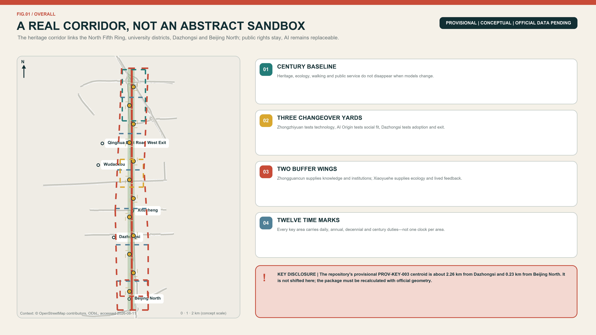
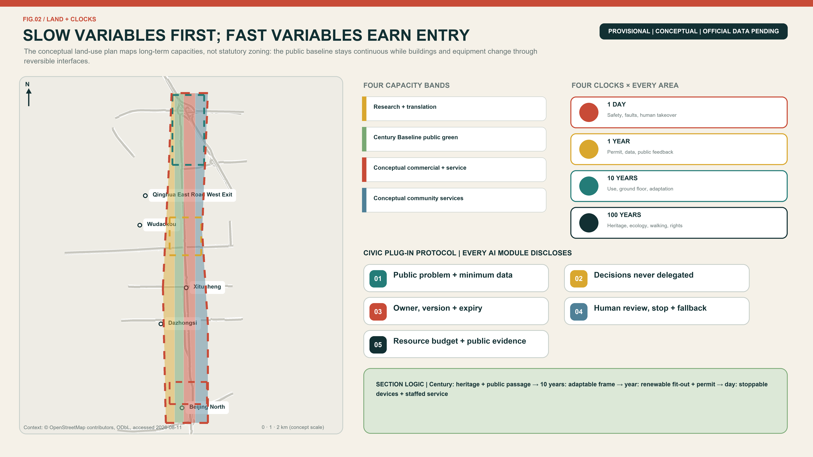
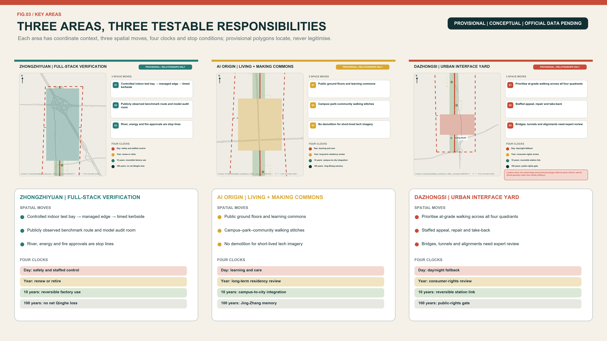
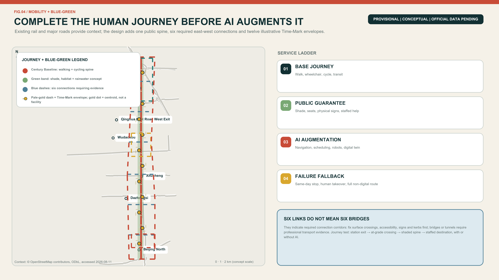
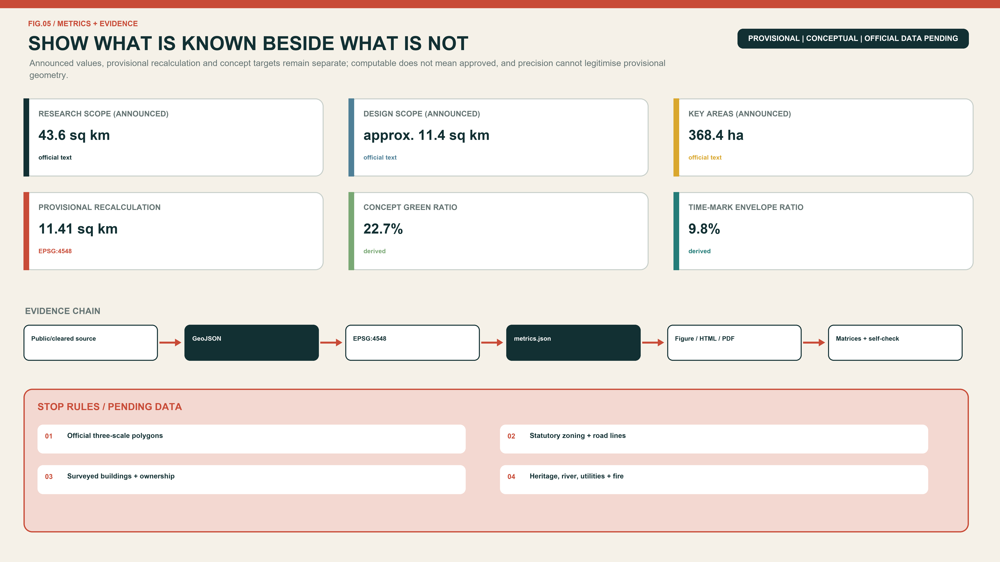

# JING-ZHANG SLOW VARIABLES

> **Fast technology, lasting life.** Models may change every week; a city cannot be rebuilt every week. This proposal separates the enduring layer of heritage, public space, walking, care and civil rights from a replaceable layer of models, robots, sensors and events. Every AI-enabled service enters the city with five obligations: a review date, a named human owner, a takeover procedure, a non-AI alternative and an end-of-life destination.

## Design Basis and Source List

The evidence hierarchy begins with the competition repository. The official-announcement extract defines the three scales, three key areas and expected design depth. The agent taskbook defines the three positionings, five functions and six mandatory agent tasks. National planning references provide professional principles and land-use terminology; they do not create project-specific statutory controls that have not been released. [source:OFFICIAL-ANNOUNCEMENT] [standard:PROJECT-AGENT-OPEN-CALL-TASKBOOK]

The only geometry currently available is the repository's provisional polygon set, registered on 5 June and reviewed on 7 August 2026. It was fitted to textual extents and announced approximate areas. It may support intake drawings, conceptual geometry and internal recalculation, but it is not an official planning boundary and says nothing conclusive about roads, parcels, ownership, heritage controls or engineering feasibility. [source:PROVISIONAL-BOUNDARY] [data:geometry/site_boundary.geojson#SITE-001]

Sources are separated into formal task evidence, provisional geometry and background precedents. External case studies are used only for factual citation and mechanism transfer; their photographs, maps, logos and layouts are not reproduced. Missing official building surveys, zoning controls, utilities, ownership, traffic sections and heritage controls remain explicit data gaps. The package therefore presents a recalculable conceptual framework and professional hand-off points, not an approved plan. [depth:existing_conditions_diagnosis] [source:SOURCE-REGISTRY]

## Three-Level Scope Framework

The three scales carry different responsibilities. The 43.6-square-kilometre Coordinated Research Area asks how universities, research, capital, urban scenarios and daily life can form a durable ecosystem. The approximately 11.4-square-kilometre Overall Design Area asks how the public spine, land use, walking, blue-green space and renewal projects work together. The 368.4-hectare Key-Area Detailed Design Area asks what the three Changeover Yards should do first, who maintains them and when each action is reviewed. [source:OFFICIAL-ANNOUNCEMENT] [metric:site_area_sqm]

| Scope | Announced size | Responsibility | Design level | Data status |
| --- | ---: | --- | --- | --- |
| Coordinated Research Area | 43.6 km² | Industry, talent life, global links and governance | Strategic research | Textual extent and announced area |
| Overall Design Area | 11.4 km² | Century Baseline, Buffer Wings, land use and renewal | Conceptual RDP-level urban design | Provisional polygon |
| Three Key Areas | 368.4 ha | Three differentiated Changeover Yards | Conceptual implementation interface | Three provisional polygons |

Boundary replacement is part of the design method. When official polygons arrive, the site and key-area boundaries are replaced first; land use, buildings, roads, green space, public space and phasing are then clipped; all areas and ratios are recalculated in EPSG:4548; and the five figures, both HTML views and both drawing sets are regenerated. A geometry change may never be hidden by updating only a cover image. [depth:three_level_scope_framework] [data:geometry/key_areas.geojson#PROV-KEY-001]

This iteration makes only relational claims: the heritage park should stay publicly continuous; east-west links should outrank gated campuses; the three key areas should form a differentiated learning chain; and daily services should not be displaced by a monoculture of offices. FAR, height, coverage, setbacks, road redlines and confirmed floor area remain pending official data. [standard:MOHURD-CONTROL-DETAILED-PLANNING]

## Coordinated Research Area: Industry and Future City Research

The principal name is JING-ZHANG SLOW VARIABLES and the line is “Fast technology, lasting life.” The identity uses a continuous dark line for century-scale heritage and public commitments, a segmented vermilion pulse for replaceable technology, and circular Time Marks where they meet. The naming family is one Century Baseline, three Changeover Yards, two Buffer Wings, twelve Time Marks and four Urban Clocks. All graphics use original geometry and system fonts rather than corporate marks. [source:AGENT-TASKBOOK] [depth:overall_spatial_structure]

The three official positionings remain intact. The Centennial Jing-Zhang Cultural Belt protects continuity of memory; the Urban AI Life Experience Belt protects continuity of everyday service; and the AI Integrated Innovation Belt protects continuity of responsibility from research through testing, adoption, maintenance and retirement. The five official functions become daily full-stack testing, annual ecosystem collaboration, time-limited AI scenarios, shared day-and-night urban life and public lifecycle governance. The Technology Services Wing supplies talent, finance, legal and IP services; the Xiaoyue River Scenario Enablement Wing supplies real needs and feedback. [standard:PROJECT-OFFICIAL-ANNOUNCEMENT]

### Transfer Evidence from Eight Cases

Global references transfer only mechanisms supported by their registered sources. The proposal does not copy imagery, ratios, budgets, governance bodies or partnerships. Each row states what is learned, where it lands and what is explicitly not imported.

| Case | Transferable mechanism | Application in Slow Variables | Explicit non-transfer |
| --- | --- | --- | --- |
| Barcelona 22@ | Innovation-led renewal also addresses mixed uses, public services and green public space | `LU-002`/`LU-004` and P01 continuity audit | No imported land-use ratio, housing quantity or finance tool [source:CASE-BCN-22AT] |
| London King’s Cross | Railway heritage, university links and long-term place stewardship can work together | P04 Lasting-Life Commons and P08 public ledger | No assumed campus partnership, ownership arrangement or single operator [source:CASE-LON-KX] |
| New York High Line / West Chelsea | A linear park needs coordinated access, daylight and adjoining interfaces | P01 Baseline audit and P02 cross-link surveys | No transferred zoning uplift, development rights or landscape form [source:CASE-NYC-HIGHLINE] |
| Paris Urban Lab | Real-world trials need selection, bounded settings, evaluation and exit | P03 controlled loop and P05 adoption/repair review | No claim of a Paris-style partnership or copied procurement system [source:CASE-PARIS-URBAN-LAB] |
| Helsinki Kalasatama | Small, short-cycle pilots can be co-defined by users and implementers | S01-S12 scenario cards and P08 renewal process | No imported grant size, institutional role or performance result [source:CASE-HEL-KALASATAMA] |
| Singapore Punggol Digital District | University–industry links can pair with a separable digital layer | S03 city-model bay and disconnectable municipal interfaces | A twin is not an approval basis; district capacity is not copied [source:CASE-SG-PDD] |
| Amsterdam algorithm governance | Registration, accountability, objection and audit span the lifecycle | P08 Clock Contract, ledger and staffed appeal | Overseas practice is not stated as a local statutory duty [source:CASE-AMS-ALGO] |
| Montréal Mila | A neutral research hub can link open science, translation and responsible AI | Independent-review role and cross-yard handover records | No invented tenancy, partnership or investment commitment [source:CASE-MTL-MILA] |

### Eight Required Elements + One Cross-Cutting Governance Layer (8+1)

The taskbook names eight ecosystem elements: land, space, industry, capital, talent, computing, data and scenarios. This proposal adds governance as a cross-cutting layer; it does not misstate governance as a ninth taskbook element. Every row has an entry and exit gate. [source:AGENT-TASKBOOK]

| Element | Spatial/mechanism carrier | Suggested accountable role | Entry gate | Exit or review evidence |
| --- | --- | --- | --- | --- |
| Land | Four conceptual functional bands `LU-001..004` | Qualified planning/GIS team | Official boundaries, parcels and statutory uses available | Recalculate if the public Baseline is weakened or land procedure fails |
| Space | Century Baseline, three Yards and twelve Time Marks | Planning, landscape, accessibility and operations professionals | Survey, heritage and public-passage evidence | Stop if free stay, continuity or a non-digital route is incomplete |
| Industry | Technical gate → social gate → adoption/maintenance gate | Site operator and independent safety reviewer | Test scope, owner, fault and retirement plan complete | No progression when safety, maintenance or handover evidence fails |
| Capital | Proposed maintenance/retirement reserve and lifecycle account | Finance, procurement and operations roles | Auditable method and visible exit cost | No launch without maintenance responsibility or retirement provision; no amount is promised |
| Talent | AI Origin Lasting-Life Commons and community-service interface | Suggested community/site, service and housing professionals | Living/service baseline and public co-review | Pause on digital exclusion, loss of free space or unremedied displacement |
| Computing | Disconnectable edge computing and changeover bays | Energy, fire, cyber and facility professionals | Energy, fire, network and human fallback verified | Remove if it cannot separate from the safe city base or lacks an afterlife |
| Data | Clock Contract and minimum-data schedule | Data-compliance role, scenario owner and human reviewer | Purpose, lawful source, retention and export/deletion paths complete | Stop on purpose drift, no appeal or no exit |
| Scenarios | S01-S12 expiring scenario cards | Scenario operator, professional reviewers and user representatives | Owner, review, takeover, non-AI route and retirement complete | Expiry without review, or any missing element, means automatic exit |
| Governance (proposal layer) | Proposed Slow Variables Council and public ledger | Multi-disciplinary, resident and accessibility representatives | Duties, records, conflicts and disclosure rules defined | No renewal when final human responsibility or auditable records are absent |

The resulting ecosystem moves from controlled technical changeover at Zhongzhiyuan, to social adaptation at AI Origin, to adoption, maintenance and retirement at Dazhongsi. Each transfer requires a Clock Contract. District AI information remains background and is not downscaled into invented project-area talent or output figures. [source:HAIDIAN-GOV-REPORT-2026] [metric:ecosystem_element_count]

### Proposed Regional-Synergy Interfaces

The five interfaces below answer the taskbook review dimension through exchangeable deliverables only. They do not imply that any place, institution or government has agreed to cooperate; no interface starts without authority, responsibility and lawful data. [source:AGENT-TASKBOOK]

| Counterpart | Proposed exchange deliverable | Entry condition | Pause/exit condition |
| --- | --- | --- | --- |
| Beiwei Community | Resident problem list, non-AI service routes and co-review records | Voluntary participation, public question and minimum data | Inadequate representation, privacy risk or unanswered feedback |
| Future Science City | Reproducible test protocols, failure records and review templates | Both sides define permission, responsibility and scope | Results are irreproducible or misrepresented as universal certification |
| Huairou Science City | Safety and maintenance checklist for scientific devices in public space | Professional review and public risk boundary | No maintenance, retirement or public-explanation mechanism |
| Beijing E-Town | Product-adoption, repair-training and asset-take-back templates | Replaceable vendors, exportable data and traceable responsibility | Vendor lock-in or invisible exit cost |
| Beijing–Tianjin–Hebei | A shared format for public problems, evaluation results and retirement archives | Each jurisdiction separately meets its procedure and data permissions | Any party presents a conceptual trial as approval or political commitment |

These five proposed interfaces exchange auditable outputs only; they do not pre-assign industry, finance or policy. [metric:regional_synergy_interface_count]

## Overall Design Area: Urban Renewal and Regulatory-Plan-Level Urban Design

The spatial structure is one Century Baseline, three Changeover Yards, two Buffer Wings and twelve Time Marks. The Baseline combines heritage, walking, cycling, blue-green space and public service. The Yards specialise in technical durability, social fitness and market maintenance. The Wings move expertise and lived experience into the spine, then return public feedback to research. Six conceptual cross-links identify priorities for east-west walking, cycling and universal access; they are not proposed road redlines. [data:geometry/roads.geojson#ROAD-SPINE-001] [depth:traffic_rail_slow_parking]

Four conceptual land-use bands are recalculable across the provisional area: research and translation; the blue-green public Baseline; conceptual commercial/service land; and long-life community-service facilities. A stable layer protects green space, public space, basic walking and non-digital service. An adaptable layer accommodates reconfigurable ground floors and shared facilities. A fast layer supports detachable equipment, temporary tests and events. Public-space and green-space polygons may overlap because one records public use and the other ecological/open-space character. [data:geometry/land_use.geojson#LU-001] [metric:green_ratio]

Renewal follows “retain first, adapt second, demolish only after evidence.” Without surveyed buildings, structural condition, ownership or heritage controls, this package makes no demolition decision about a real building. The submitted building polygons are nine conceptual envelopes for reversible partitions, shared ground floors, equipment interfaces and maintenance routes. Height, FAR, coverage, daylight, fire access and parking remain pending official data and professional confirmation. [data:geometry/buildings.geojson#BLDG-ZY-01] [depth:retain_renovate_demolish]

Urban character avoids a generic cyber aesthetic. Durable layers use repairable, low-glare materials and shade. Replaceable layers use detachable signs, legible status lights and tactile or written information that does not depend on a QR code. Technical objects may not occupy an accessible route or replace seats, shade, water, help points and other fundamentals. [standard:MOHURD-URBAN-DESIGN-MEASURES]

## Detailed Design of Key Areas

### Zhongzhiyuan AI Independent Innovation Acceleration Area | Daily Changeover Yard

This is the full-stack innovation and reliability gateway. Its spatial prototype grades control from inside to outside: isolated test loop → staffed takeover/maintenance band → public benchmark gallery → Century Baseline. A system reaches the public edge only after it passes the safety gate. [data:geometry/key_areas.geojson#PROV-KEY-001] [depth:three_key_area_detailed_design]

| Detail item | Conceptual design decision | Auditable evidence and data gate |
| --- | --- | --- |
| Programme | Model/edge-device changeover, low-speed embodied testing, public benchmarks and independent review | S01-S03; no public interface without permit and owner |
| Building modules | `BLDG-ZY-01..03` total 114,594.60 m² of conceptual footprints, with demountable partitions, visible maintenance and common connections | Envelope only, not floor area, FAR or approved scale [metric:zhongzhiyuan_module_footprint_area_sqm] |
| Retain/adapt/demolish | Survey structure, ownership and heritage first; then repair, adapt and insert reversibly; no demolition object is named | `A-BUILDING-001` and professional review |
| Public space | `TIME-MARK-10..12` are schematic public-space envelopes for a benchmark gallery, staffed help and visible fault state, not component footprints | Confirm public status, accessibility and survey evidence before component siting |
| Movement | `CROSS-06` is an east-west need only; test, logistics and public walking are separated and stoppable | No fixed alignment without redlines, flows, fire and river evidence |
| Section prototype | Public spine → display threshold → takeover/maintenance → isolated test bay; intensity reduces towards the public edge | Qinghe, Fifth Ring, energy, fire and heritage conditions are stop lines |
| Project package | P03 controlled loop, linked to P02 surveys, P06 Time Marks and P08 Clock Contract | Closed/indoor proof first; expansion only after the gates |

### Beijing AI Origin Community | Annual Living Commons

This is the near-campus translation and long-life core. The prototype is a campus–park–community stitch: a continuous walk enters a public ground floor, then shared learning, quiet work, family/care services and a staffed non-digital counter. Innovation display may not displace ordinary life. [data:geometry/key_areas.geojson#PROV-KEY-002] [source:CASE-LON-KX]

| Detail item | Conceptual design decision | Auditable evidence and data gate |
| --- | --- | --- |
| Programme | Learning, translation, family service, short-stay support, community culture and quiet work are mixed | Service-needs baseline and co-review by residents, students and frontline staff |
| Building modules | `BLDG-AO-01..03` total 61,968.28 m² of conceptual footprints; shared ground floors may change annually | Not a housing quantity or approved development scale [metric:ai_origin_module_footprint_area_sqm] |
| Retain/adapt/demolish | Existing use and community value enter the retention gate; no demolition for short-lived technology imagery | No decision without ownership, structure, fire and current-use evidence |
| Public space | `TIME-MARK-07..08` are schematic public-space envelopes for a learning commons, staffed service, quiet hours and an account-free route | Component siting awaits survey; no renewal if free stay or non-digital equivalent service is incomplete |
| Movement | `CROSS-04` is a campus–site–community connection need, not a gate, parcel or road project | Confirm entrances, fire access, commute flows and ownership |
| Section prototype | Park walk → open ground floor → learning/work → quiet/care buffer; public access extends inward | Daylight, fire, noise, housing and service baselines remain pending |
| Project package | P04 Lasting-Life Commons linked to P02, P06 and P08 | Annual public review decides renewal, reduction or exit |

### Dazhongsi AI Industry Cluster | Decennial Reuse Yard (Location Pending Correction)

**The location offset precedes every design claim.** `PROV-KEY-003` has a centroid near 39.94692° N, 116.34850° E: about 2.26 km from Dazhongsi metro and 0.23 km from Beijing North. It does not align with the task name. The proposal does not shift or fabricate it. The table is a directional prototype for the Dazhongsi task, not a station, bridge, parking or engineering conclusion at the current polygon. [source:ISSUE-1029] [data:geometry/key_areas.geojson#PROV-KEY-003]

| Detail item | Directional conceptual decision | Auditable evidence and data gate |
| --- | --- | --- |
| Programme | Product-adoption review, repair training, take-back, staffed appeal and account-free service are co-located | Re-site after the correct official KEY_AREA arrives |
| Building modules | `BLDG-DZ-01..03` total 42,794.99 m² of conceptual footprints, expressing only relationships among adoption, public and repair interfaces | Constrained by the offset; not development scale [metric:dazhongsi_module_footprint_area_sqm] |
| Retain/adapt/demolish | Public ground-floor value and long-term maintainability come first; no real building is classified | Survey ownership, buildings, structure and shop impacts before judgement |
| Public space | `TIME-MARK-01` is a directional schematic envelope for free stay, staffed help and take-back; its centroid is only a map symbol | Re-site components and recalculate the package after official geometry, public-space evidence and survey |
| Movement | `CROSS-01` expresses a need only; at-grade four-quadrant walking precedes any bridge/tunnel idea | No fixed move without station exits, road lines, flow, fire and parking evidence |
| Section prototype | At-grade station walk → free public edge → adoption/appeal hall → repair/take-back back-of-house | Functional sequence only, not a current coordinate or engineering section |
| Project package | P05 Adoption and Repair Hall linked to P02, P06, P08 and P09 | Stop when the offset remains unresolved or maintenance/retirement ownership is missing |

All three Yards use one handover sheet. Zhongzhiyuan transfers technical boundaries and failure records; AI Origin transfers user feedback and equity review; Dazhongsi transfers maintenance cost, adoption conditions and retirement routes. Failure at one gate never implies progression. Official geometry triggers full regeneration of buildings, roads, public space, metrics, figures, matrices and bilingual anchors. [source:PROVISIONAL-BOUNDARY] [metric:cross_area_handoff_completion_rate]

## AI Innovation Ecosystem, Personas, and AI+ Scenarios

Six personas reveal whether innovation supports a lasting life. An early-career researcher needs attainable short-stay housing, night safety and peers. A startup team needs small test spaces, compliance and procurement translation. A worker with children or care duties needs predictable time and service. An older or disabled resident needs accessibility, a staffed route and freedom from digital exclusion. A frontline cleaner, guard, technician or service worker needs training and real takeover authority. An international developer or visitor needs multilingual orientation and a route into community life. Personas are planning lenses, never identity scores. [source:AGENT-TASKBOOK]

| ID | Scenario and type | Place and users | Minimum data and human review | Expiry and non-AI route |
| --- | --- | --- | --- | --- |
| S01 | Model Expiry Label - industry test | Zhongzhiyuan; teams and buyers | Version, purpose, benchmark, owner; independent sign-off | 90-day review; physical label and ledger |
| S02 | Low-Speed Robot Endurance Loop - industry test | Zhongzhiyuan; robot teams and pedestrians | Occupancy and event logs, no face recognition; safety marshal | Per-session permit; human delivery/cleaning |
| S03 | City-Model Changeover Bay - industry test | Zhongzhiyuan; planning and operations | Synthetic or cleared data; professional scope check | Retest each release; drawings and site visit |
| S04 | Explainable Walking Navigation | Whole line; walkers, cyclists, disabled users | Obstacles and hours; accessibility review | Quarterly; signs and staffed help |
| S05 | Family Health-Service Navigation | AI Origin; families and older people | Voluntary input, no diagnosis; clinical/social referral | Six months; phone and counter |
| S06 | Campus-Community Learning Assistant | AI Origin; learners and residents | Public courses and bookings; teacher confirmation | Each term; noticeboard and manual booking |
| S07 | Community Legal-Process Guide | AI Origin; residents and small teams | Public procedures, no case dossier; legal review | Six months; legal-aid entry |
| S08 | Night Public-Space Companion | AI Origin/Dazhongsi; night users | Lighting, repairs and active help request, no blanket tracking | Monthly; lights, patrol and help point |
| S09 | Robot Delivery Time Slots | Three areas; shops, residents and couriers | Time slot and kerb use; on-site operator | Clear daily; human delivery retained |
| S10 | Multilingual Heritage Guide | Public spine; visitors and community | Verified history and language preference; curator review | Annual; physical label and volunteer guide |
| S11 | Shared-Space Scheduler | Three Yards; teams and community | Capacity and booking only; venue confirmation | Quarterly; staffed booking and fair quota |
| S12 | Public-Service Degradation Drill - operations test | Dazhongsi; operators and public | Fault tickets and recovery time; duty manager switches mode | Monthly drill; complete manual process |

Every card passes five gates: necessity, minimum data, physical safety, human accountability and exit/asset disposition. S01-S03 are explicit industrial testing scenarios, while S12 tests recovery after public-service failure. All cards provide notice, choice, appeal and an accessible alternative. AI outputs may not directly decide medical care, education, legal outcomes, employment or eligibility for public resources. [standard:PROJECT-AGENT-OPEN-CALL-TASKBOOK]

The operating loop is research, validation, shared use, maintenance and retirement. Researchers document performance; independent reviewers and professionals operate the technical gate; user representatives operate the social gate; service owners operate the delivery gate; and an annual public ledger records renewal, pause, incidents and repair. Fast model replacement is kept separate from repeated construction by using stable interfaces and reusable spatial modules. [source:CASE-HEL-KALASATAMA]

## Land Use, Building Scale, and Retain-Renovate-Demolish Strategy

Four conceptual land-use bands partition the provisional site. `LU-003` uses code 05, commercial and service land, only as its dominant conceptual classification; replaceable AI testing, display and maintenance are a design theme, not an industrial-production designation. `LU-004` uses code 0702, urban community-service facilities, only for the long-life community-service direction. Education, culture, housing and small commerce remain site-level needs that must be classified separately through parcel evidence and statutory process; code 0702 does not stand in for them. The research and Century Baseline bands are likewise a conceptual balance, not ownership or approved zoning. [standard:MNR-LAND-USE-CLASSIFICATION-GUIDE] [data:geometry/land_use.geojson#LU-003] [data:geometry/land_use.geojson#LU-004]

Buildings are organised by conceptual renewal cycle rather than futuristic appearance. Structural shells and public ground floors should remain stable across multiple decades; building services, partitions and shared programmes may adapt in five to ten years; sensors, robot docks, exhibits and event components should be removable within a year. The nine submitted footprints are envelopes for changeover modules, not a surveyed building stock or approved construction programme. [metric:building_footprint_area_sqm] [data:geometry/buildings.geojson#BLDG-AO-02]

Retain-renovate-demolish decisions pass four evidence gates: heritage/structure/ownership/current use; fitness of retention and adaptive reuse; lifecycle comparison of low-disruption retrofit and new build; and only then a parcel-level decision. Current evidence supports only a principle of retention first, adaptation second and reversible insertion. It does not support naming a real building for demolition. [depth:retain_renovate_demolish]

FAR, height, coverage, green ratio as a statutory control, setbacks, daylight and parking remain pending. Once official boundaries and controls are available, a parcel capacity table should be tested against public space, transport, utilities, fire safety, daylight and heritage rather than a single maximum FAR. Talent stays and family services are functional directions, not promised housing quotas or eligibility rules. [depth:development_intensity_controls]

## Transport, Rail, Municipal Infrastructure, and Public Services

The movement framework combines one north-south public walking/cycling Baseline with six conceptual east-west links. The Baseline carries continuous accessible movement and cultural interpretation. Cross-links prioritise connections to campuses, communities, stations and both Wings, but remain need corridors rather than construction alignments. The final 500 metres from transit should be walk-first. Test vehicles are time-, speed- and area-limited and can be stopped immediately by on-site staff. [data:geometry/roads.geojson#CROSS-03] [metric:mobility_crosslink_count]

Transit integration begins with people: step-free routes, crossing time, shade, seating, night lighting and physical wayfinding are checked before autonomous shuttles, parking or loading. The four Dazhongsi quadrants, Qinghua East Road West Exit, other station exits and detailed transfer arrangements require official station, road, flow and fire-safety evidence. This proposal therefore defines priority and interfaces rather than an engineering alignment. [depth:traffic_rail_slow_parking]

Municipal and digital systems follow one rule: the city base does not depend on AI; AI only augments it. Water, power, heat, communications, drainage, fire systems and emergency broadcasting retain independent safe operation. Edge computing, sensing and twins attach through separable interfaces. Data are minimised as public, operational or sensitive, with purpose, retention period and owner recorded. Intelligent control degrades to established operation during failure. [depth:municipal_new_infrastructure] [source:CASE-SG-PDD]

Every AI public-service interface visibly lists the staffed counter, opening time, account-free route, help point and accessible mode. Health applications navigate and refer rather than diagnose; education does not replace teacher judgement; legal tools do not adjudicate; safety tools avoid indiscriminate biometric surveillance. Capacity and final location await the missing public-facility baseline. [source:AGENT-TASKBOOK]

## Blue-Green Network, Public Space, and Urban Character

The Century Baseline is first a place to walk, rest, cool down and seek help, and only second a technology display. The submitted green-space polygon creates a continuous conceptual band measuring 2,589,338.29 square metres (258.93 hectares), with a conceptual green-space ratio of about 22.69%. The twelve `TIME-MARK` polygons are regularised schematic public-space envelopes, each about 9.32 hectares and together 1,118,594.33 square metres (111.86 hectares). Their 9.80% value is only envelope coverage within the provisional site, not a Time Mark structure footprint, service catchment or approved public-space control. Actual component locations and footprints remain unknown until survey, accessibility, utilities and heritage review. [metric:green_ratio] [metric:public_space_ratio]

Three pilgrimage landmarks perform ordinary public duties. The **Century Gauge** aligns verified railway, innovation and resident contributions while leaving unknown history blank. The **Changeover Clock** shows the version, owner, next review and fault state of each scenario rather than an advertising leaderboard. The **Offline Commons** provides physical guidance, staffed service, water, seating, charging and quiet space, demonstrating that the city still works without AI. Distributed Slow-Variable Archive Cabinets hold open documentation, failure records and maintenance manuals. [source:JZ-PARK-PLANNING-2021]

The cultural route has three chapters: Building the Line, in which Jing-Zhang is public engineering memory; Growing the City, in which Zhongguancun moves knowledge into innovation; and Staying Together, in which AI is admitted to daily life only when it is maintainable, contestable and retireable. Exhibit labels distinguish fact, inference and concept. People, companies and trademarks enter a final exhibition only with permission. [source:OFFICIAL-ANNOUNCEMENT]

Character is divided between durable and changeable layers. Durable elements are shaded, repairable, low-glare and materially restrained. Changeable elements use bolted connections, replaceable panels and common interfaces. Night lighting communicates safety, opening and status without creating a bright cyber canyon. Planting, water management, sponge-city engineering, heritage views and material specifications await site and professional studies. [depth:blue_green_public_space]

## Renewal Projects, Implementation Policy, and Phasing

The nine packages are auditable responsibility sheets, not project approvals or funding commitments. Every “lead” is a suggested role; competent authorities must separately determine accountability, procurement and permission. [depth:renewal_project_list]

| ID / package | Verifiable deliverable | Suggested lead and collaborators | Prerequisite evidence | Public review point | Stop/exit condition | Timing |
| --- | --- | --- | --- | --- | --- | --- |
| P01 Century Baseline continuity audit | Register of breaks, heritage/accessibility issues and repeat checks | Qualified planning/heritage team; park operator and accessibility professional | Official redline, heritage and walking survey | Walk audit with residents and disabled users | Record only, no works, while ownership, heritage or safety is unclear | 0–2 year baseline |
| P02 Six east-west link surveys | Obstacles, flows, alternatives and professional action list for every need corridor | Transport professional; local public-space operator | Road lines, flows, ownership and fire access | Commuter, cyclist and accessibility review | No fixed bridge/crossing alignment without feasibility | 0–2 year survey |
| P03 Zhongzhiyuan controlled loop | Permit pack, isolation boundary, takeover drill and fault record | Site operator and independent safety reviewer; R&D, fire, cyber and accessibility roles | Test scope, permits, energy/fire and owner | Safety demonstration and appeal route before public exposure | Failed physical safety or takeover means shutdown and removal | Closed test first; adaptation after gates |
| P04 AI Origin Lasting-Life Commons | Ground-floor service schedule, staffed counter, account-free route and co-review record | Suggested community/site operator; service and fire professionals | Ownership, fire and service-needs evidence | Students, residents, carers and frontline workers | Exit if free stay is displaced or no non-digital equivalent remains | Reversible 0–2 year pilot |
| P05 Dazhongsi Adoption and Repair Hall | Adoption review, repair training, take-back and station-walk issue register | Suggested area operator and transport professional; shops/operators collaborate | Correct official KEY_AREA polygon, station/road lines and owner consent | Commuters, shops and maintenance workers | No engineering conclusion while location or maintenance/retirement responsibility is unresolved | Triggered development |
| P06 Twelve Time Mark components | Issue maps for twelve schematic public-space envelopes, component-siting review sheets, physical signs, staffed service and maintenance cycles | Landscape/park operator; accessibility and facility professionals | Survey, utilities and heritage | Accessibility and free-use audit for each envelope and candidate component site | Remove if tactile routes, green/heritage assets or maintenance are compromised | 0–2 year prototype; annual review |
| P07 Three pilgrimage landmarks | History/copyright register, reversible prototypes, structural and heritage checks | Cultural/heritage professional; park operator | Verified history, rights, structure and heritage controls | Community history review and public explanation | No permanent object when facts, rights or professional checks fail | Early prototype; permanent form triggered |
| P08 Clock Contract and public ledger | Purpose, data, owner, expiry, takeover, non-AI route and retirement for every scenario | Proposed council-secretariat role; data-compliance and operations roles | Duties, disclosure, conflict and archive rules | Pre-launch notice, expiry hearing and appeal | Any missing element blocks launch/renewal; organisation and budget are uncommitted | Establish in 0–2 years; continue |
| P09 Official-data replacement and whole-package recalculation | Source hashes, CRS log, difference report and bilingual regeneration checklist for GeoJSON, metrics, figures and matrices | Qualified GIS/planning team and data-custodian role | Official CAD/GIS/PDF, licence and CRS verified | Publish the difference report for professional review | If source, licence or CRS is unclear, retain the old version and mark a blocker | **Triggered by data, not a fixed year** |

`phasing.geojson` uses three intentionally overlapping whole-site polygons as cross-area eligibility envelopes. `PHASE-001..003` each duplicate provisional `SITE-001` and recalculate to about 11.413 square kilometres; they indicate the maximum site-wide applicability of the 0-2, 3-5 and 6-10 year evidence gates, not actual construction or adaptation footprints. Years 0-2 allow only low-disruption surveys, staffed services and reversible prototypes; years 3-5 require official redlines, controls, ownership and professional proof; years 6-10 expand, restructure or retire through public evidence. Actual project locations and areas remain unknown, and P09 is always data-triggered. [data:geometry/phasing.geojson#PHASE-001] [metric:phase_1_area_sqm] [depth:phasing_implementation]

The annual programme follows four clocks: daily operating/fault status, quarterly scenario open days, annual renewal hearings and Changeover Week, and a decennial spatial/public-commitment review. International activity includes an Urban AI Durability Challenge, public-service degradation drills, developer-resident repair sessions, residencies and an open yearbook. These are programme concepts rather than funded or confirmed government events. [source:CASE-PARIS-URBAN-LAB]

A proposed Slow Variables Council would include planning, landscape, transport, utilities, heritage, law, AI safety, operations, resident and accessibility representatives. Operating finance includes maintenance and retirement reserves; procurement includes data exit, model replacement, takeover and asset recovery. The Technology Services Wing supports expertise and finance, the Scenario Wing supports lived trials, and the three Yards manage staged handover. [source:CASE-MTL-MILA]

## Metrics, Area Recalculation, and Compliance Matrix

Metrics belong to three evidence classes: approximate announced task benchmarks; low-confidence package design quantities recalculated from submitted geometry; and performance metrics that must wait for a field baseline. The classes are never conflated. A precise calculation does not turn a provisional polygon into an official boundary, and an unknown measure is not filled with an aspirational target. [source:PROCESSED-FACT-PACK]

| Metric family | Current value/status | Formula/source | Permitted interpretation |
| --- | ---: | --- | --- |
| Announced task benchmarks | 43.6 km² / approx. 11.4 km² / 368.4 ha | official planning limits | Task scale, not usable polygons |
| Three announced key-area benchmarks | 192.1 / 104.3 / 72.0 ha | official announcement | Names and approximate areas only |
| Provisional Overall Design Area | 11,412,825.39 m² (11.413 km²) | EPSG:4548 `SITE-001` | Package denominator, not official redline |
| Research and translation band | 2,415,628.52 m² / 21.17% | `LU-001 / site` | Conceptual balance, not statutory zoning share |
| Century Baseline public/green band | 2,589,339.43 m² / 22.69% | `LU-002 / site` | Long-term civic/ecological capacity, not statutory green ratio |
| Conceptual commercial/service band | 3,366,138.43 m² / 29.49% | `LU-003 / site`, dominant code 05 | AI testing/display/maintenance theme, not industrial-production land |
| Long-life community-service-facility band | 3,041,726.42 m² / 26.65% | `LU-004 / site`, dominant code 0702 | Community-service direction; no substitute classification or capacity quota |
| Conceptual green space | 2,589,338.29 m² / 22.69% | union green / site | Baseline continuity, not statutory control |
| Schematic Time Mark public-space envelopes | 1,118,594.33 m² / 9.80% | union schematic envelopes / site | Envelope coverage, not component footprint, catchment or approved control |
| Conceptual footprints / coverage | 219,357.87 m² / 1.92% | union module envelopes / site | Nine reversible envelopes, not statutory coverage |
| Three Yard modules | 114,594.60 / 61,968.28 / 42,794.99 m² | ZY / AO / DZ footprints | Compare drawn conceptual quantity, not floor area or investment |
| Three phase eligibility envelopes | 11,412,825.39 m² each, intentionally overlapping | `PHASE-001..003 = SITE-001` | Maximum applicability envelope; actual project footprint unknown |
| Conceptual mobility centrelines | 16,767.52 m; six cross-links | sum EPSG:4548 line length | Survey needs; road area/ratio remain unknown |
| Total floor area, FAR and height | **unknown** | No building survey, floors, controls or official boundary | No intensity or capacity conclusion |
| Road area and road ratio | **unknown** | Centrelines only; no redline, section or verified width | No engineering quantity or network-share conclusion |
| Content-coverage counts | 8 cases; 8 required elements + 1 governance layer; 5 regional interfaces; 12 scenarios | readable rows | Coverage, not implementation performance |
| Test and landmark counts | 3 industry tests + 1 operations test; 3 pilgrimage landmarks + 1 archive node type | readable cards/concepts | Preserves category meaning rather than merging unlike items |

Field-performance metrics remain `unknown`: AI talent-density index, AI industry-output index, cross-area handover completion, on-time scenario review, human-takeover drill pass rate and equivalent non-digital service coverage. Values begin only after an accountable operator, sample, denominator, privacy protocol and baseline period are jointly defined. [metric:ai_talent_density_index] [metric:non_digital_equivalent_service_coverage_rate]

GeoJSON is stored in EPSG:4326 and measured in EPSG:4548. The land-use partition must remain within project gap/overlap tolerance; green space, public space, buildings, centrelines and phasing are recomputed from their authoritative files. All three matrices are now narrowed row by row to directly relevant sections, layers, metrics, sources and assumptions instead of reusing one evidence bundle for every requirement. [depth:metrics_recalculation] [data:geometry/green_space.geojson#GREEN-001]

The concept also has a binary quality test. A scenario without an expiry, owner, takeover, non-AI route or retirement destination is incomplete. A spatial project that weakens heritage, blue-green continuity, walking, public access or the choices of vulnerable users cannot offset that loss with an efficiency score. Metrics support comparison and deliberation; they do not automate public decisions. [source:CASE-AMS-ALGO]

## Risk, Copyright, and Compliance

The largest spatial risk is misalignment between provisional polygons and real roads, park limits or key areas. Every figure therefore labels the boundary PROVISIONAL and treats areas as package-internal calculations. The empty `geometry/constraints.geojson` layer deliberately avoids inventing unpublished constraints. Official boundaries, key areas, buildings, ownership, controls, roads, utilities, flood/fire constraints, heritage controls and facilities require a new professional review. The proposal is not an approved regulatory plan, construction permit, investment commitment or engineering basis. [depth:risk_missing_data] [source:SOURCE-REGISTRY]

The public-data boundary permits only registered public or cleared material. Privacy protection uses purpose limitation, data minimisation and no-personal-data defaults. Copyright treatment limits external material to attributed factual reference. Implementation risk is controlled through small, reversible and exit-capable pilots. Human review retains final responsibility for medical, educational, legal, safety, spatial and public-resource decisions.

AI risk is managed across the lifecycle. Purpose and minimum data are checked before launch; safety staff and human reviewers control operation; appeal and a non-AI equivalent protect choice; fault logs and review decide renewal; retirement deletes or lawfully archives data and recovers devices. Indiscriminate face recognition, hidden social scoring, automated diagnosis, automated legal judgement, automated education eligibility and unexplainable allocation of public resources are excluded. [source:GENERATIVE-AI-MEASURES]

Equity failures can also be spatial: screens exclude people who cannot scan, robots block tactile paths, events displace free use, and innovation rent can push out the workers who maintain the district. Accessibility review, carers and families, frontline takeover authority, quiet rooms, staffed counters and a public ledger therefore operate together. Children, health and disability contexts default to no-personal-data options. [source:BARRIER-FREE-LAW]

All prose, design geometry, diagrams, HTML and PDFs were originally generated for this package. External material is summarised as citation only; no external photograph, raster map tile, logo, portrait or restricted layout is embedded. Five map-based figures use only OpenStreetMap major-road context and Nominatim station anchors as a low-contrast location aid, with source, licence and access date shown on every map; they do not serve as official boundaries, statutory zoning, legal metrics or engineering alignments. [source:OSM-CONTEXT-20260811] The package uses COMMUNITY-DISPLAY-ONLY for project-community display and review. Qualified human teams retain final professional judgement and responsibility for statutory process and implementation. [source:SOURCE-REGISTRY]

## References

1. Beijing Municipal Commission of Planning and Natural Resources, Haidian Branch, official open-call announcement, 9 May 2026. [source:OFFICIAL-ANNOUNCEMENT]
2. Centennial Jing-Zhang AI Innovation Belt repository, agent open-call taskbook extract, 18 May 2026. [source:AGENT-TASKBOOK]
3. Ministry of Housing and Urban-Rural Development, Measures for Urban Design Administration and regulatory detailed planning procedures. [standard:MOHURD-URBAN-DESIGN-MEASURES] [standard:MOHURD-CONTROL-DETAILED-PLANNING]
4. Ministry of Natural Resources, land and sea-use classification guidance, 2023. [standard:MNR-LAND-USE-CLASSIFICATION-GUIDE]
5. Barcelona City Council, 22@ implementation materials and Barcelona Impulsa 2025. [source:CASE-BCN-22AT]
6. Greater London Authority, King’s Cross Opportunity Area materials. [source:CASE-LON-KX]
7. New York City Planning, Special West Chelsea District zoning text. [source:CASE-NYC-HIGHLINE]
8. City of Paris, Paris Urban Lab urban innovation programme. [source:CASE-PARIS-URBAN-LAB]
9. Forum Virium Helsinki, Smart Kalasatama agile-piloting tools. [source:CASE-HEL-KALASATAMA]
10. JTC Singapore, Punggol Digital District and Open Digital Platform. [source:CASE-SG-PDD]
11. City of Amsterdam, algorithm policy and *Grip on Algorithms*. [source:CASE-AMS-ALGO]
12. Mila, Montréal AI ecosystem, open-science and responsible-AI materials. [source:CASE-MTL-MILA]

References support only their adjacent claims. Dynamic institution sizes, planning capacities and historical project figures have not been converted into Jing-Zhang performance promises. External pages were checked on 11 August 2026 and should be rechecked for version, availability and reuse terms at every iteration. [source:SOURCE-REGISTRY]
