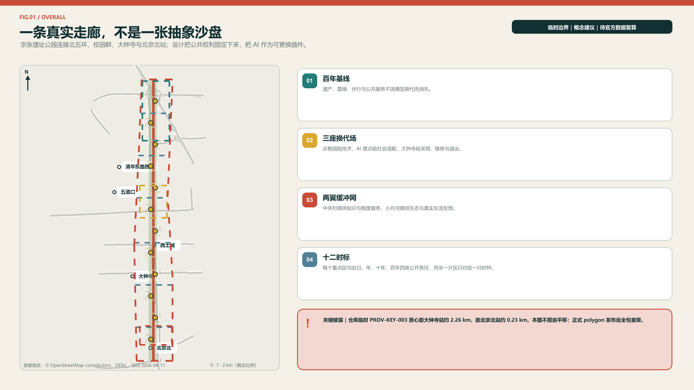
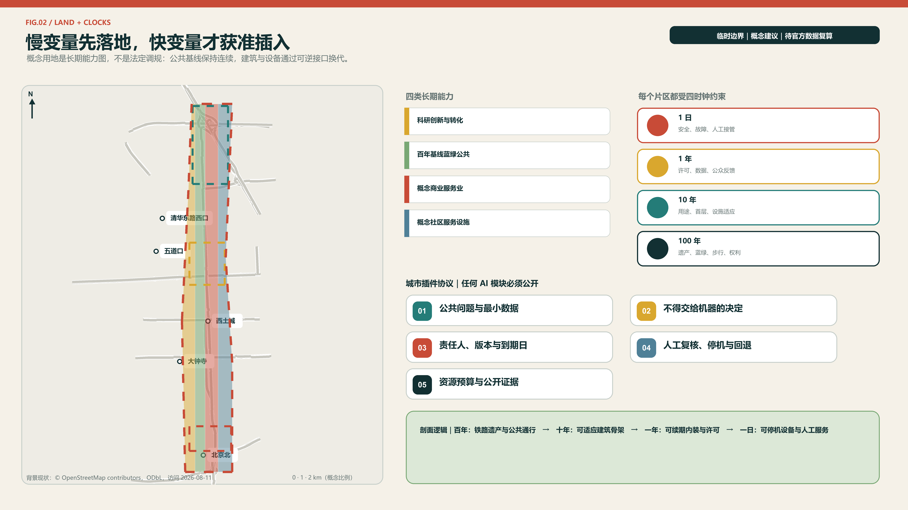
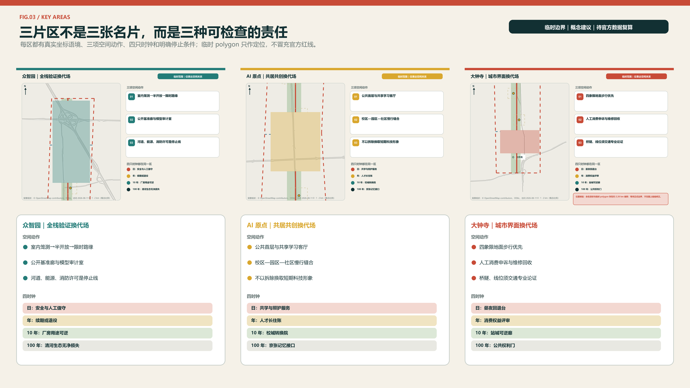
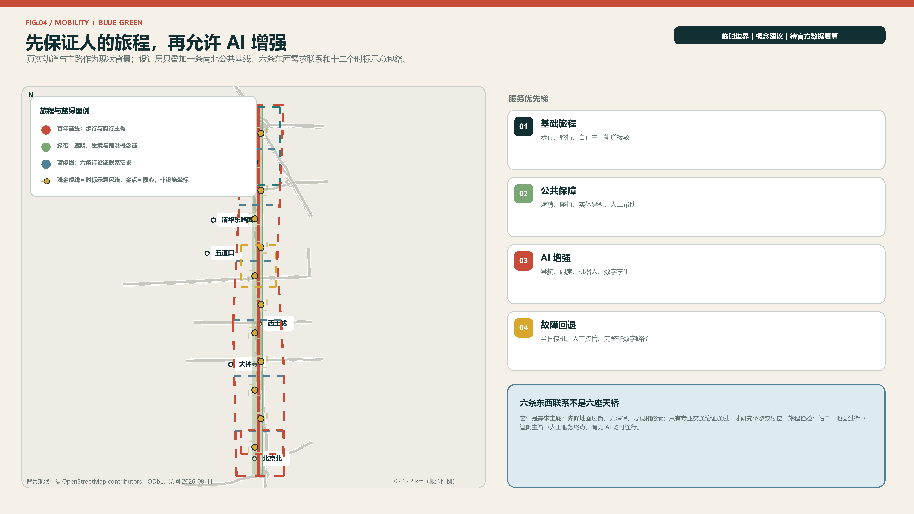
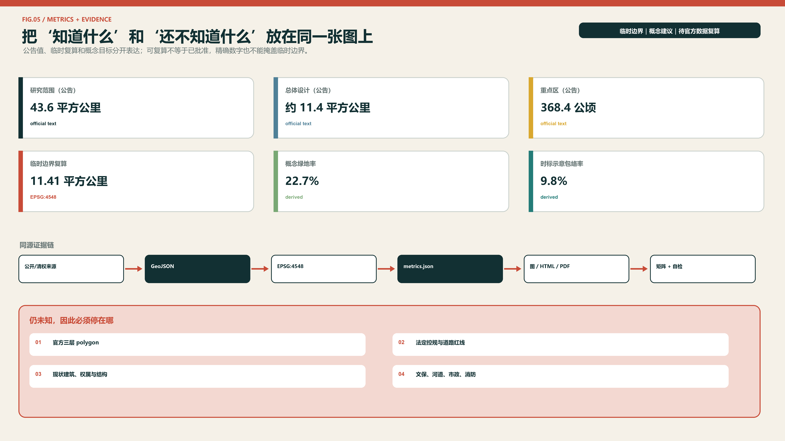

# 京张慢变量 / JING-ZHANG SLOW VARIABLES

> **快技术，长生活。** 模型可以按周换代，城市不能按周推倒重来。京张慢变量把百年铁路的耐久、日常生活的连续和 AI 的快速试错分层组织：慢层守住遗产、蓝绿、步行、可负担的公共生活与人的选择权；快层容纳模型、机器人、传感器和活动的迭代。每个 AI 场景必须带着“复审日期、责任人、人工接管、非数字替代、退役去向”五件套进入城市。

## 设计依据与资料清单

本方案以项目仓库的正式公告摘录、面向智能体任务书、公开来源登记和专业标准为主证据层。公告确定三层工作范围、三处重点区域及任务深度，面向智能体任务书确定三大定位、五大功能与 agent.1-agent.6 六项必答；住建、自然资源领域文件只提供原则与分类语言，不生成本项目尚未公布的控规指标。[source:OFFICIAL-ANNOUNCEMENT] [standard:PROJECT-AGENT-OPEN-CALL-TASKBOOK]

当前可用空间底图是仓库于 2026-06-05 登记、2026-08-07 核查的临时粗略 polygon。它依据公告文字四至和公告约面积拟合，仅适合本次 intake 的概念生成、图面表达和相对面积复算；它不是官方红线，也不能证明道路、宗地、产权、文保或工程边界。方案将该限制写入所有图、指标、假设和图纸，official polygon 到位后应整包替换并重算。[source:PROVISIONAL-BOUNDARY] [data:geometry/site_boundary.geojson#SITE-001]

资料分为三档：A0/正式可用资料支撑项目任务、名称和原则；provisional 资料仅支撑临时几何；全球案例和海淀公开材料仅支撑机制比较与背景。所有外部案例只做事实性引文和机制提炼，不复制地图、照片、Logo 或版式。由于官方建筑现状、控规、市政、权属、交通断面和文保控制范围尚缺，本方案只提交可复算的概念空间骨架和专业深化接口。[depth:existing_conditions_diagnosis] [source:SOURCE-REGISTRY]

## 三层范围工作框架

三层范围不是同一张图放大三次，而是三种不同责任。43.6 平方公里统筹研究范围回答“海淀的高校、科研、资本、场景和生活如何形成长期生态”；约 11.4 平方公里总体设计范围回答“公共脊、用地、慢行、蓝绿、更新项目怎样互相支撑”；368.4 公顷重点区域范围回答“众智园、AI 原点、大钟寺各自先做什么、谁维护、何时复审”。公告面积是任务依据，提交 polygon 的 11,412,825 平方米仅是 EPSG:4548 下的临时复算值。[source:OFFICIAL-ANNOUNCEMENT] [metric:site_area_sqm]

| 层级 | 公告规模 | 本方案职责 | 交付深度 | 数据状态 |
| --- | ---: | --- | --- | --- |
| 统筹研究范围 | 43.6 km² | 产业链、人才生活、全球联系与治理制度 | 战略研究 | 仅文字四至与公告面积 |
| 总体设计范围 | 11.4 km² | 百年基线、双翼缓冲、用地与更新系统 | 控规深度城市设计的概念接口 | 临时 polygon |
| 三处重点区域 | 368.4 ha | 三座换代场与可实施项目包 | 规划综合实施方案的概念接口 | 三处临时 polygon |

替换机制是本方案的组成部分：官方边界到位后，先替换 `site_boundary` 和 `key_areas`，再裁切土地分区、建筑概念基底、道路、绿地、公共空间与分期层，随后在 EPSG:4548 复算面积和比例，最后重出五张图、HTML 与两套图纸。任何几何变化都必须触发指标与矩阵复核，不允许只换封面图。[depth:three_level_scope_framework] [data:geometry/key_areas.geojson#PROV-KEY-001]

本轮空间判断只讨论相对关系：连续公园脊应保持公共性，东西联系优先于封闭园区，三处重点区形成差异化试验链，生活服务不得被产业单一化挤出。具体容积率、高度、建筑密度、退线、道路红线和建设规模全部记为待官方资料核定，而非以算法补齐。[standard:MOHURD-CONTROL-DETAILED-PLANNING]

## 统筹研究范围产业与未来城市研究

总体概念是“京张慢变量”，口号为“快技术，长生活”。品牌不是把铁路画成芯片，而是用一条连续深色线代表百年遗产与公共承诺，用一条分节朱红脉冲代表可更换技术；两线在圆形“时标”相交。名称系统依次为“一条百年基线、三座换代场、两翼缓冲网、十二个时标、四只城市时钟”。字体使用系统无衬线字，图形和色板均为本次原创，不嵌入企业标识或第三方图像。[source:AGENT-TASKBOOK] [depth:overall_spatial_structure]

三大定位保持不变，但通过时间尺度建立联系：百年京张文化带负责记忆不断线，都市 AI 生活体验带负责日常服务不断线，AI 融合创新带负责研究—验证—采用—维护—退役的责任不断线。五大功能分别落到全栈自主创新的“日更测试”、世界级生态的“年更协作”、AI+场景的“有期限试用”、智能活力城市的“昼夜共享”、AI 治理话语权的“公开复审”。三区两翼因此不是五个孤岛：中关村科技服务翼输入人才、资本、法务和知识产权服务，小月河场景赋能翼输入真实需求与反馈，三处换代场按技术、社会、市场三个门逐步放行。[standard:PROJECT-OFFICIAL-ANNOUNCEMENT]

### 八个案例的可迁移证据

全球对标只迁移经来源支撑的机制，不复制形象、比例、预算、治理主体或合作关系。每个案例只回答“学什么、落在哪里、什么不能照搬”。

| 案例 | 可迁移机制 | 在京张慢变量中的落位 | 明确不迁移 |
| --- | --- | --- | --- |
| Barcelona 22@ | 产业更新同时处理混合功能、公共服务与绿色公共空间 | `LU-002`/`LU-004` 与 P01 连续性核查 | 不复制用地比例、住房数量或财政工具 [source:CASE-BCN-22AT] |
| London King’s Cross | 铁路遗产、大学联系与长期场所治理协同 | P04 长生活客厅与 P08 公开账本 | 不推定校地合作、产权安排或单一运营主体 [source:CASE-LON-KX] |
| New York High Line / West Chelsea | 线性公园的出入口、光照与邻线界面需要同步约束 | P01 公共脊核查与 P02 横向联系踏勘 | 不复制分区增益、开发权或景观形态 [source:CASE-NYC-HIGHLINE] |
| Paris Urban Lab | 真实环境试验应有遴选、限定场景、评估与退出 | P03 受控换代环与 P05 采用/维修评审 | 不声称已形成巴黎式合作或复制采购制度 [source:CASE-PARIS-URBAN-LAB] |
| Helsinki Kalasatama | 小尺度、短周期试点可由使用者与实施者共同定义 | S01-S12 场景卡与 P08 续期机制 | 不移植资金额度、机构分工或成效数据 [source:CASE-HEL-KALASATAMA] |
| Singapore Punggol Digital District | 大学—产业联系与可分离数字层协同 | S03 城市模型换代舱和可断开市政接口 | 不把数字孪生当审批依据，不复制区级设施规模 [source:CASE-SG-PDD] |
| Amsterdam algorithm governance | 登记、责任、异议与审计贯穿算法生命周期 | P08 时钟合约、公开账本与人工申诉 | 不将境外制度直接表述为本地法定义务 [source:CASE-AMS-ALGO] |
| Montréal Mila | 中立研究枢纽、开放科学与负责任 AI 可连接研究和转化 | 独立评测角色与跨场交接记录 | 不虚构机构入驻、伙伴关系或投资承诺 [source:CASE-MTL-MILA] |

### 八项必答要素 + 治理横切项（8+1）

任务书明确列出土地、空间、产业、资金、人才、算力、数据、场景八项要素；本方案另加“治理”作为横切层，而不是把它误写成任务书第九项。九行都以进入门和退出门约束空间选择。[source:AGENT-TASKBOOK]

| 要素 | 空间/机制载体 | 建议责任角色 | 进入门 | 退出或复核证据 |
| --- | --- | --- | --- | --- |
| 土地 | 四类概念功能带 `LU-001..004` | 有资质规划/GIS 团队 | official 边界、地块与法定用途到位 | 公共基线被削弱或用途程序不成立即重算 |
| 空间 | 百年基线、三座换代场、十二时标 | 规划、景观、无障碍及运营专业 | 现状测绘、文保与公共通行核验 | 免费停留、连续通行或非数字路径不完整即停止 |
| 产业 | 技术门—社会门—采用/维护门 | 园区运营与独立安全评测角色 | 测试范围、责任人、故障与退役方案齐备 | 安全、维护或交接证据未通过即不进下一门 |
| 资金 | 建议设置维护/退役准备与全生命周期账 | 财务、采购、运营专业角色 | 审计口径和退出成本可见 | 无维护责任或退役准备不得上线；不承诺额度 |
| 人才 | AI 原点长生活客厅与社区服务接口 | 社区/园区运营、服务与住房专业 | 居住/服务需求基线和公众共评 | 发生数字排除、免费空间挤出或不可补救置换即暂停 |
| 算力 | 可断开的端侧算力与换代舱 | 能源、消防、网安、设施运维专业 | 能耗、消防、网络与人工回退核验 | 无法与城市安全底座分离或无退役去向即移除 |
| 数据 | 时钟合约与最小数据清单 | 数据合规、场景责任人与人工复核者 | 目的、合法来源、保留期、导出/删除路径齐备 | 目的漂移、不可申诉或不可退出即停用 |
| 场景 | S01-S12 可到期场景卡 | 场景运营、专业审核与用户代表 | 责任、复审、人工接管、无 AI 路径、退役齐备 | 到期未评审或五件套缺项即自动退出 |
| 治理（本方案横切项） | 拟议慢变量委员会与公开账本 | 多专业、居民及无障碍代表 | 职责、记录、利益冲突与公开规则明确 | 无人承担最终判断或记录不可审计即不得续期 |

由此形成“慢变量创新生态”：科研成果先在众智园进行受控技术换代，再到 AI 原点接受居民、学生和运营人员的社会换代，最后到大钟寺完成采用、维护与退役验证；每次跨站都提交“时钟合约”。区级产业信息只作背景，不被推算为项目范围的人才或产值指标。[source:HAIDIAN-GOV-REPORT-2026] [metric:ecosystem_element_count]

### 区域协同接口（拟议）

以下五项只是在任务书评分维度下提出的成果交换接口，不代表任何地区、机构或政府已经同意合作；无授权、无责任人或无合法数据时不启动。[source:AGENT-TASKBOOK]

| 协同对象 | 拟议交换成果 | 进入条件 | 暂停/退出条件 |
| --- | --- | --- | --- |
| 北纬社区 | 居民问题清单、无 AI 服务路径与共评记录 | 自愿参与、公开议题和最小数据 | 代表性不足、隐私风险或反馈无回应 |
| 未来科学城 | 可复现测试协议、失败记录与复审模板 | 双方明确许可、责任和适用范围 | 结果不可复核或被误作通用认证 |
| 怀柔科学城 | 科学装置进入公共空间的安全/维护清单 | 专业审查与公开风险边界 | 无维护、退役或公众解释机制 |
| 经开区 | 产品采用、维修培训与资产回收模板 | 供应商可替换、数据可导出、责任可追溯 | 锁定供应商或退出成本不可见 |
| 京津冀 | 公开问题、评测结果与场景退役档案的互认格式 | 各地法定程序和数据许可分别满足 | 任何一方把概念试验表述为审批或政绩承诺 |

这五类接口只交换可复核成果，不预设产业分工、资金安排或跨区政策。[metric:regional_synergy_interface_count]

## 总体设计范围城市更新与控规深度城市设计

总体空间结构是“一条百年基线、三座换代场、两翼缓冲网、十二个时标”。百年基线沿遗址公园形成慢行、蓝绿、文化与公共服务连续面；三座换代场分别承担技术耐久、社会适配和市场维护；两翼缓冲网把中关村的专业服务和小月河沿线的生活场景送入主脊，也把居民反馈送回研究端。六条概念横向联系优先处理东西步行、骑行和无障碍连续性，不被表述为新建道路红线。[data:geometry/roads.geojson#ROAD-SPINE-001] [depth:traffic_rail_slow_parking]

概念用地分成四个可复算带：科研创新与转化、百年基线蓝绿公共空间、概念商业服务、长生活社区服务设施。它们完整覆盖临时总体设计范围，表达功能平衡而非地块权属；其中“稳定层”承担绿地、公共空间、基础步行与非数字服务，“适应层”承担可调整首层和共享设施，“快换层”承接可拆卸设备、短期试验和活动。公共空间与绿地可重叠，因为前者记录公共使用界面，后者记录生态开敞属性。[data:geometry/land_use.geojson#LU-001] [metric:green_ratio]

城市更新采用“先留、再改、最后才拆”的闸门。没有现状建筑测绘、结构安全、权属和文保资料时，不对任何真实建筑下拆除结论；提交的建筑 polygon 是九个概念性适应模块包络，用于表达可逆隔断、共享首层、设备接驳和维修通道。建筑高度、容积率、密度、日照、消防和停车容量均待正式数据补齐与专业核定，后续由专业团队在官方控规与现状调查基础上深化。[data:geometry/buildings.geojson#BLDG-ZY-01] [depth:retain_renovate_demolish]

总体风貌不追求“赛博化”。慢层使用耐久、易修复、低眩光材料和连续树荫；快层使用可拆标识、明示状态灯和二维码之外的文字/触觉信息。技术装置不得占用主要无障碍通道，不得遮挡遗产视线，不得用交互屏替代可坐、可走、可喝水、可求助的基础设施。所有建议仍需道路、市政、防洪、消防与文保专业复核。[standard:MOHURD-URBAN-DESIGN-MEASURES]

## 重点区域详细设计

### 众智园 AI 自主创新加速区｜日更换代场

定位为全栈自主创新与城市 AI 可靠性首站。空间原型不是开放道路上的“科技秀”，而是由内向外分级的受控试验单元：隔离测试内环—人工接管/检修带—公开基准廊—百年公共基线。任何成果先在可隔离界面验证，再决定是否面向公众。[data:geometry/key_areas.geojson#PROV-KEY-001] [depth:three_key_area_detailed_design]

| 深化项 | 概念设计判断 | 可核查证据与数据门 |
| --- | --- | --- |
| 功能业态 | 模型/端侧设备换代、低速具身测试、公开基准与独立评测并置 | S01-S03；无许可和责任人不进入公共界面 |
| 建筑模块 | `BLDG-ZY-01..03` 共 114,594.60 m² 概念基底，采用可拆隔断、可见检修面和通用接驳 | 仅为概念包络，不是总建面、FAR 或批准规模 [metric:zhongzhiyuan_module_footprint_area_sqm] |
| 拆改留 | 先测绘/结构/权属/文保，再保留修缮、适应改造、可逆插入；当前不指认拆除 | `A-BUILDING-001` 与专业复核 |
| 公共空间 | `TIME-MARK-10..12` 是公开基准廊、人工求助与故障展示的示意公共空间包络，不是组件占地 | 现状公共性、无障碍与测绘核验后再确定组件落点 |
| 交通 | `CROSS-06` 只表示东西联系需求；测试流、物流与公众慢行分时且可立即停机 | 无道路红线、客流、消防与河道条件不得固化线位 |
| 剖面原型 | 公共脊—展示门槛—接管/检修带—隔离试验舱，测试强度向公共界面递减 | 清河、五环、能源、消防和文保条件是停止线 |
| 项目包 | P03 受控换代环，衔接 P02 踏勘、P06 时标、P08 时钟合约 | 先做室内/封闭验证，通过门禁才扩大 |

### 北京 AI 原点社区｜年更共居场

定位为近校成果转译与人才长期生活核心。空间原型是“校园—公园—社区缝合带”：连续步行进入公共首层，依次经过共享学习、安静工作、家庭/照护服务和非数字窗口；创新展示不能挤出日常生活。[data:geometry/key_areas.geojson#PROV-KEY-002] [source:CASE-LON-KX]

| 深化项 | 概念设计判断 | 可核查证据与数据门 |
| --- | --- | --- |
| 功能业态 | 共学、成果转译、家庭服务、短住支持、社区文化和安静工作混合 | 服务需求与居民/学生/一线人员共评先行 |
| 建筑模块 | `BLDG-AO-01..03` 共 61,968.28 m² 概念基底，公共首层和共享空间可按年调整 | 非住房数量或批准开发规模 [metric:ai_origin_module_footprint_area_sqm] |
| 拆改留 | 既有使用和社区价值纳入保留闸门，不以短期科技形象换拆除 | 无权属、结构、消防与现状调查不作拆除判断 |
| 公共空间 | `TIME-MARK-07..08` 是共学客厅、人工服务、安静时段与无账户入口的示意公共空间包络 | 组件落点待测绘；不满足免费停留与非数字等价服务即不续期 |
| 交通 | `CROSS-04` 表达校区—园区—社区缝合需求，不预设校门、地块或道路工程 | 出入口、消防、通勤流线和权属协商后深化 |
| 剖面原型 | 公园步道—开放首层—共学/工作层—安静与照护缓冲，公共性向内延伸 | 日照、消防、噪声、住房与服务基线待核 |
| 项目包 | P04 长生活客厅，衔接 P02、P06、P08 | 一年公开复审，续期、缩小或退出均留记录 |

### 大钟寺 AI 产业聚集区｜十年转用场（位置待纠偏）

**位置偏移先于设计判断披露。** 当前 `PROV-KEY-003` 质心约为北纬 39.94692°、东经 116.34850°，距大钟寺站约 2.26 公里、距北京北站约 0.23 公里，与任务名称锚点不一致。方案不自行平移或伪造精度；下表是“大钟寺任务”的方向性原型，不能按当前 polygon 形成站点、桥隧、停车或工程结论。[source:ISSUE-1029] [data:geometry/key_areas.geojson#PROV-KEY-003]

| 深化项 | 方向性概念判断 | 可核查证据与数据门 |
| --- | --- | --- |
| 功能业态 | 产品采用评审、维修培训、退役回收、人工申诉与无账户服务并置 | 正确 official KEY_AREA 到位后重新落位 |
| 建筑模块 | `BLDG-DZ-01..03` 共 42,794.99 m² 概念基底，只表达公共采用厅/维修界面关系 | 受位置偏移约束，不是开发规模 [metric:dazhongsi_module_footprint_area_sqm] |
| 拆改留 | 首层公共界面和长期维护能力优先；不指认真实建筑拆改 | 产权、现状建筑、结构和商户影响调查后判断 |
| 公共空间 | `TIME-MARK-01` 是免费停留、人工窗口和退役回收的方向性示意包络；质心仅作图面符号 | official polygon、公共空间现状与测绘到位后再定组件落点并全包重算 |
| 交通 | `CROSS-01` 仅表示联系需求；四象限地面步行优先于桥隧想象 | 站点出入口、道路红线、客流、消防和停车资料缺一不固化 |
| 剖面原型 | 站前地面步行—免费公共界面—采用/申诉厅—维修/回收后场 | 只表达功能顺序，不表达当前坐标或工程断面 |
| 项目包 | P05 采用与维修厅，衔接 P02、P06、P08、P09 | 位置偏移未解或维护/退役责任缺失即停止深化 |

三处换代场共享交接单：众智园交付技术边界与故障记录，AI 原点交付使用者反馈与公平性复核，大钟寺交付维护成本、采用条件和退役去向。任何一站未通过都不自动进入下一站；official key-area polygon 到位后，建筑、道路、公共空间、指标、图件、矩阵与双语锚点全部重算。[source:PROVISIONAL-BOUNDARY] [metric:cross_area_handoff_completion_rate]

## AI 创新生态、人才画像与 AI+ 场景

六类画像贯穿全生命周期：初入职青年研究者需要可负担的短住、夜间安全与同伴网络；创业团队需要小规模试验、合规和采购转译；带儿童或照护责任的人才需要托幼、健康导航和可预测时间；长者及残障居民需要无障碍、人工窗口和不被数字排除；一线保洁、安保、运维和服务人员需要培训、接管权与可维护设备；国际开发者与访客需要多语、文化理解和短期驻留。画像不是个人追踪标签，不绑定身份或信用评分。[source:AGENT-TASKBOOK]

| 卡号 | 场景与类型 | 位置/服务对象 | 最小数据与人工复核 | 到期与非 AI 替代 |
| --- | --- | --- | --- | --- |
| S01 | 模型到期牌（产业测试） | 众智园；模型团队、采购方 | 版本、用途、基准、责任人；独立评测员签署 | 90 天复审；纸质状态牌与人工台账 |
| S02 | 具身智能低速耐久环（产业测试） | 众智园；机器人团队、行人 | 路段占用与事件日志，不做人脸识别；安全员停机 | 单次许可；普通配送/人工清洁保留 |
| S03 | 城市模型换代舱（产业测试） | 众智园；规划与运维团队 | 合成或清权数据；专业人员核对适用边界 | 每版重测；离线图纸与现场踏勘 |
| S04 | 可解释慢行导航 | 全线；行人、骑行者、残障者 | 路径障碍与开放时段；无障碍顾问复核 | 季度复审；实体导视和人工问询 |
| S05 | 家庭健康服务导航 | AI 原点；家庭、长者 | 用户主动输入，不作诊断；医务/社工转介 | 六个月；电话和窗口服务 |
| S06 | 校地共学助理 | AI 原点；学生、居民、研究者 | 公开课程与预约信息；教师最终确认 | 学期复审；公告栏和人工报名 |
| S07 | 社区法律流程导航 | AI 原点；居民、小微团队 | 公开办事规则，不存案情；法律人员复核 | 六个月；法律援助人工入口 |
| S08 | 夜间公共空间伙伴 | AI 原点/大钟寺；夜间使用者 | 照明、设施报修与主动求助，不做无差别追踪 | 每月复核；照明、巡查与求助柱 |
| S09 | 机器人配送时隙 | 三处重点区；商户、居民、配送员 | 时隙和路缘占用；现场运营员调度 | 每日清场；人工配送与普通货架 |
| S10 | 百年京张多语导览 | 公共脊；访客、社区 | 已核实史料与语言偏好；文化人员审校 | 年度修订；实体展签和志愿者导览 |
| S11 | 共享空间调度 | 三座换代场；团队、社区 | 场地容量与预约，不做行为画像；场馆人员确认 | 每季度；现场登记与公平配额 |
| S12 | 公共服务降级演练（运营测试） | 大钟寺；运营人员、公众 | 故障工单与恢复时间；总值班员决定切换 | 每月演练；完整人工流程 |

每张卡都通过五道门：目的必要性、最少数据、物理安全、人工责任、退出与资产去向。S01-S03 是明确的产业测试验证场景，S12 验证公共服务失效后的恢复能力；其余场景也必须有告知、选择、申诉和可访问替代。算法输出不得直接决定医疗、教育、法律、就业或公共资源资格。[standard:PROJECT-AGENT-OPEN-CALL-TASKBOOK]

生态运营采用“研究—验证—共用—维护—退役”闭环。研究机构和企业负责性能与文档，独立评测和专业人员负责技术门，居民/用户代表负责社会门，运营主体负责服务门，年度公共账本公开续期、暂停、事故和修复情况。模型快速换代不等于空间持续施工；同一套可接驳模块和公共基线支持多代技术更换。[source:CASE-HEL-KALASATAMA]

## 用地、建筑规模与拆改留方案

四类概念用地完整分割临时总体设计范围。`LU-003` 只以代码 05“商业服务业用地”表达概念主导分类，可插拔 AI 测试、展示与运维是设计主题，不被解释成工业生产用地；`LU-004` 只以代码 0702“城镇社区服务设施用地”表达长生活社区服务方向。教育、文化、居住和小型商业仍是片区级需求，必须在地块调查和法定程序中分别分类，不能由 0702 一码代替。科研转化带与百年基线蓝绿公共带同样只是概念功能平衡，不代表权属或批准用途。[standard:MNR-LAND-USE-CLASSIFICATION-GUIDE] [data:geometry/land_use.geojson#LU-003] [data:geometry/land_use.geojson#LU-004]

建筑以“壳体寿命”而非科技外观组织，并按概念更新周期分层：结构壳体和公共首层力求跨数十年稳定；机电、室内和共享功能可按 5-10 年周期适应；传感器、机器人停靠、展陈和活动组件应能在 1 年以内拆换。提交的九个 `BUILDING_FOOTPRINT` 是换代模块的概念包络，并非现状建筑总量或批准新建量；其复算面积只说明本方案画了多少概念性模块，不能推导总建筑面积、容积率或投资。[metric:building_footprint_area_sqm] [data:geometry/buildings.geojson#BLDG-AO-02]

拆改留采用四步证据闸门：第一步核对文保、结构、权属和现状使用；第二步计算保留与适应性再利用能否满足安全和功能；第三步比较低扰动改造与新建的全生命周期影响；第四步才形成地块级保留、改造、拆除或新建结论。当前资料仅允许提出“优先保留、鼓励改造、可逆新插入”的原则，不允许点名真实建筑拆除。[depth:retain_renovate_demolish]

开发强度、建筑高度、建筑密度、绿地率、退线、日照和停车都保持待确认。后续取得 official polygon 与控规后，应以地块为单元建立容量表，再用公共空间、交通、市政、消防、日照和文保承载力校核，而不是以单一 FAR 最大化。人才短住、家庭生活和社区配套属于功能方向，不承诺住房数量或政策资格。[depth:development_intensity_controls]

## 交通、轨道、市政与公共服务设施

交通骨架由一条南北公共慢行基线和六条东西概念联系组成。南北线服务连续步行、骑行、无障碍与文化导览；横向联系优先打通校园、社区、站点和两翼服务，但仅是需求走廊，不是道路红线或施工线位。每处重点区设置到站后最后 500 米的步行优先界面，测试车辆必须限时、限速、限域并可由现场人员立即停机。[data:geometry/roads.geojson#CROSS-03] [metric:mobility_crosslink_count]

轨道站点一体化遵循“先人后车”：先核无障碍路径、过街等待、遮荫、座椅、夜间照明和实体导视，再讨论低速接驳、停车与装卸。大钟寺四象限、清华东路西口及其他站点的具体出入口和接驳组织，需要官方站点、道路红线、客流和消防资料；本方案只给出换乘优先级与场景接口。[depth:traffic_rail_slow_parking]

市政与新型基础设施采用“城市底座不依赖 AI、AI 只做增强”的原则。水、电、热、通信、排水、消防和应急广播保持独立安全逻辑；端侧算力、传感和数字孪生通过可断开的接口接入。数据按公开、运营、敏感三层最小化，边缘侧先处理，跨主体共享须有用途、保留期和责任人。任何智能节能、调度或安全建议都需人工确认，故障时自动降级为既有设施运行。[depth:municipal_new_infrastructure] [source:CASE-SG-PDD]

公共服务形成“一张可见服务图”：每个 AI 界面旁同时标出人工窗口、开放时间、无账户路径、求助电话/位置和可访问方式。医疗场景只做导航与转介，教育场景不代替教师评价，法律场景不作个案裁判，公共安全场景不做无差别生物识别。相关容量和布点须在公共设施底数补齐后再定。[source:AGENT-TASKBOOK]

## 蓝绿空间、公共空间与城市风貌

百年基线首先是一条可走、可停、可避暑、可求助的公共地面，其次才是技术展示。提交绿地 polygon 形成连续概念带，EPSG:4548 复算面积为 2,589,338.29 平方米（258.93 公顷），概念绿地率约 22.69%。十二个 `TIME-MARK` polygon 是规则化的示意公共空间包络，每个约 9.32 公顷，合计 1,118,594.33 平方米（111.86 公顷）；9.80% 只表示这些包络在临时范围内的覆盖率，不是时标构筑物占地、服务半径或批准公共空间指标。实际组件位置和占地保持 unknown，须经现状测绘、无障碍、地下管线和文保复核后确定。[metric:green_ratio] [metric:public_space_ratio]

三类朝圣地标都承担实际公共功能。**百年刻度台**把铁路、创新与居民贡献按可核实年份并置，未知史料留空不补写；**换代钟**公开展示场景版本、责任人、下次复审和故障状态，拒绝广告化排行榜；**不在线客厅**提供纸质导览、人工服务、饮水、座椅、充电和安静空间，证明不用 AI 也能完整使用城市。第四个分布式节点“慢变量档案柜”保存开放文档、失败记录和维护手册。[source:JZ-PARK-PLANNING-2021]

文化叙事分为三章：“立路”讲百年京张作为工程与公共记忆；“兴城”讲中关村从知识生产走向产业创新；“长伴”讲 AI 只有在可维护、可质疑、可退役时才能进入日常。导览路线沿百年基线贯穿三座地标和十二时标，展签明确事实、推断与概念三种状态。所有人物、企业和商标只有取得授权后才可进入正式展陈。[source:OFFICIAL-ANNOUNCEMENT]

风貌以耐久层和换代层区分：耐久层使用低眩光、易维修、可再利用的材料及连续植被；换代层使用螺栓连接、可替换面板和统一接口。夜景只显示安全、开放与场景状态，不营造高亮“赛博”屏幕峡谷。具体树种、水文、海绵设施、文保视廊和材料性能均需现场调查与专业设计。[depth:blue_green_public_space]

## 更新项目清单、实施政策与分期计划

九个项目包是可审查的责任单，而不是立项或资金承诺。所有“牵头”均为建议角色；实际责任、采购和许可必须由有权主体另行确定。[depth:renewal_project_list]

| ID / 项目包 | 可核验交付物 | 建议牵头与协作角色 | 前置证据 | 公众复核点 | 停止/退出条件 | 时序 |
| --- | --- | --- | --- | --- | --- | --- |
| P01 百年基线连续性核查 | 断点、遗产、无障碍问题清单及复测记录 | 有资质规划/遗产团队；公园运营、无障碍专业协作 | official redline、文保与现状步行调查 | 居民及残障代表步行审计 | 权属、文保或安全不明时只登记不施工 | 0-2 年基线 |
| P02 六条东西联系踏勘 | 每条需求走廊的障碍、流线、替代路径与专业待办 | 交通专业；属地公共空间运营协作 | 道路红线、客流、权属、消防 | 通勤者、骑行者和无障碍使用者复核 | 桥隧/过街可行性不足不得固化线位 | 0-2 年调查 |
| P03 众智园受控换代环 | 试验许可包、隔离边界、人工停机演练与故障记录 | 园区运营与独立安全评测；研发、消防、网安、无障碍协作 | 测试范围、许可、能源/消防与责任人 | 公共边界开放前的安全演示与申诉入口 | 物理安全或人工接管未通过即下线并移除 | 先封闭测试，资料门后改造 |
| P04 AI 原点长生活客厅 | 共享首层服务清单、人工窗口、无账户路径与共评记录 | 建议由社区/园区运营牵头；服务和消防专业协作 | 权属、消防、服务需求 | 学生、居民、照护者、一线人员共同评审 | 挤出免费停留或无非数字等价服务即退出 | 0-2 年可逆试点 |
| P05 大钟寺采用与维修厅 | 采用评审、维修培训、退役回收及站点步行问题清单 | 建议由片区运营与交通专业牵头；商户/运维协作 | 正确 official KEY_AREA polygon、站点/道路红线、产权同意 | 通勤者、商户、运维人员复核 | 位置偏移未解或维护/退役机制缺失，不形成工程结论 | 触发后深化 |
| P06 十二时标公共组件 | 12 个示意公共空间包络的问题图、区内组件落点复核单、实体导视、人工服务与维护周期清单 | 景观/公园运营；无障碍与设施专业协作 | 现状测绘、地下管线、文保 | 逐区及组件候选点的无障碍和免费使用审计 | 占盲道、损绿、遮挡遗产或无人维护即撤除 | 0-2 年样机，逐年复审 |
| P07 三座朝圣地标 | 史料/版权台账、可逆原型、结构与文保复核单 | 文化策展/遗产专业；公园运营协作 | 史料、权利、结构、文保控制 | 社区史料核验与公共说明 | 史实不可证、权利不清或专业复核未过即不建 | 原型可早，永久体触发后 |
| P08 时钟合约与公开账本 | 每场景的目的、数据、责任、到期、接管、非 AI 路径和退役记录 | 拟议委员会秘书角色；数据合规与运营协作 | 职责、公开规则、利益冲突与归档机制 | 上线前说明、到期公开复审与申诉 | 五件套任一缺失即不得上线/续期；组织和预算未获承诺 | 0-2 年建立，持续运行 |
| P09 official 数据替换与全包复算 | 来源哈希、CRS 记录、差异报告及 GeoJSON/metrics/图件/矩阵双语重生清单 | 有资质 GIS/规划团队与数据保管角色 | official CAD/GIS/PDF、许可和坐标系可核 | 差异报告公开，专业团队复核 | 来源、许可或 CRS 不清则保留旧版并标 blocker | **资料到位即触发，不按年份** |

`phasing.geojson` 以三个有意重叠的全域 polygon 表达跨片区准入包络：`PHASE-001..003` 都复制临时 `SITE-001`，每个复算约 11.413 平方公里，只表示 0-2 年、3-5 年、6-10 年三道证据门在全域的最大适用范围，不是实际施工或改造占地。近期只允许低扰动调查、人工服务和可逆样机；中期须在 official 红线、控规、权属与专业论证到位后才可适应性改造；长期按公开评估扩展、重构或退役。具体项目位置与面积仍为 unknown，P09 始终由资料触发。[data:geometry/phasing.geojson#PHASE-001] [metric:phase_1_area_sqm] [depth:phasing_implementation]

年度运营采用“四时钟日历”：每天公布运行/故障状态，每季度开展场景开放日，每年进行续期听证与“换代周”，每十年复核空间适应和公共承诺。全球活动体系包括城市 AI 耐久挑战、公共服务降级演练、开发者与居民共同维修、国际驻留和开放成果年鉴；活动品牌仍称“慢变量周”，不虚构主办承诺或预算。[source:CASE-PARIS-URBAN-LAB]

长期组织建议设“一带慢变量委员会”，由规划、园林、交通、市政、文保、法律、AI 安全、运营、居民与无障碍代表共同组成；场景运营费包含维护和退役准备金，采购合同写入数据退出、模型更换、人工接管和资产回收条款。中关村翼负责专业与资本服务，小月河翼负责真实场景和公众反馈，三处换代场负责逐级交接。[source:CASE-MTL-MILA]

## 指标体系、面积复算与合规矩阵

指标分三类：公告给定的近似“任务基准”、可从提交几何复算的低置信度“包内设计量”、以及必须等待现场基线的“绩效指标”。三类不可混用；精确复算不把临时 polygon 变成官方边界，未知指标也不以愿景数字填空。[source:PROCESSED-FACT-PACK]

| 指标族 | 当前值/状态 | 公式/来源 | 可用于什么 |
| --- | ---: | --- | --- |
| 公告任务基准 | 43.6 km² / 约 11.4 km² / 368.4 ha | official planning limits | 任务规模，不代表可用 polygon |
| 三重点区公告基准 | 192.1 / 104.3 / 72.0 ha | official announcement | 校核任务范围名称和约面积 |
| 临时总体设计范围 | 11,412,825.39 m²（11.413 km²） | EPSG:4548 `SITE-001` | 包内面积分母，不是官方红线 |
| 科研创新与转化带 | 2,415,628.52 m² / 21.17% | `LU-001 / site` | 概念功能平衡，不是法定用途比例 |
| 百年基线蓝绿公共带 | 2,589,339.43 m² / 22.69% | `LU-002 / site` | 长期公共/生态能力，不是法定绿地率 |
| 概念商业服务带 | 3,366,138.43 m² / 29.49% | `LU-003 / site`，主导代码 05 | AI 测试/展示/运维主题，不解释为工业生产用地 |
| 长生活社区服务设施带 | 3,041,726.42 m² / 26.65% | `LU-004 / site`，主导代码 0702 | 社区服务方向；不代替其他用途分类或形成容量配额 |
| 概念绿地 | 2,589,338.29 m² / 22.69% | union green / site | 百年基线连续性，非法定控制 |
| 时标示意公共空间包络 | 1,118,594.33 m² / 9.80% | union schematic envelopes / site | 包络覆盖率；非组件占地、服务半径或批准指标 |
| 概念建筑基底 / 覆盖 | 219,357.87 m² / 1.92% | union module envelopes / site | 九个可逆模块包络，非法定建筑密度 |
| 三片区概念模块 | 114,594.60 / 61,968.28 / 42,794.99 m² | ZY / AO / DZ footprints | 比较概念表达量，不推导总建面或投资 |
| 三阶段全域准入包络 | 各 11,412,825.39 m²，彼此重叠 | `PHASE-001..003 = SITE-001` | 最大适用包络；实际项目占地 unknown |
| 概念慢行中心线 | 16,767.52 m；6 条横向联系 | sum EPSG:4548 line length | 踏勘需求；道路面积/道路率仍 unknown |
| 建筑总面积、FAR、高度 | **unknown** | 缺建筑调查、层数、控规及 official boundary | 禁止形成强度或容量结论 |
| 道路面积、道路率 | **unknown** | 只有中心线，无红线/断面/核实宽度 | 禁止形成工程量或路网率结论 |
| 内容覆盖计数 | 8 案例；8 必答要素 + 1 治理；5 区域接口；12 场景 | readable rows | 覆盖度，不等于实施绩效 |
| 测试与地标计数 | 3 产业测试 + 1 运营测试；3 朝圣地标 + 1 档案节点类型 | readable cards/concepts | 保持类别语义，不把 4 混成同一类 |

现场绩效全部保持 `unknown`：AI 人才密度指数、AI 产业产出指数、跨区交接完成率、场景按期复审率、人工接管演练通过率和无 AI 等价服务覆盖率。待责任主体、样本、分母、隐私协议和基准期共同确定后再记录实测值，不预填目标。[metric:ai_talent_density_index] [metric:non_digital_equivalent_service_coverage_rate]

空间文件以 EPSG:4326 存储、EPSG:4548 计算；用地 partition 的缺口与重叠必须保持在项目容差内，绿地、公共空间、建筑、中心线和分期面积从对应 GeoJSON 重新汇总。三个矩阵现按任务逐行收窄到相关章节、图层、指标、来源与假设，不再用同一组证据覆盖所有要求。[depth:metrics_recalculation] [data:geometry/green_space.geojson#GREEN-001]

“慢变量”自身也接受评价：任何场景若没有到期日、责任人、人工接管、无 AI 替代或退役去向，即判为未完成；任何空间项目若削弱遗产、蓝绿、步行、公共可达或弱势群体选择权，即不得用效率收益抵消。指标用于比较与复盘，不自动决定公共决策。[source:CASE-AMS-ALGO]

## 风险、版权与合规说明

最高空间风险是临时 polygon 与真实道路、公园或重点区不一致，因此所有图以虚线和“PROVISIONAL”标注，面积只做包内复算；当前 `geometry/constraints.geojson` 明确为空图层，不虚构尚未公开的约束要素。官方红线、重点区、现状建筑、权属、控规、道路、市政、防洪、消防、文保和公共设施底数到位后必须重做专业判断。方案不构成审定控规、建设许可、投资承诺或施工依据。[depth:risk_missing_data] [source:SOURCE-REGISTRY]

公开资料边界只允许使用已登记的公开或已清权资料；隐私保护采用目的限定、数据最小化和无个人数据优先；版权边界要求外部材料仅作有来源的事实引用；实施风险通过小尺度、可逆、可退出的试点控制；人工复核对医疗、教育、法律、安全、空间和资源配置判断保留最终责任。

AI 风险按场景全生命周期处理：数据最小化和目的限定在上线前检查，安全员与人工复核在运行中负责，申诉与无 AI 等价路径保障使用者选择，故障日志与复审决定续期，退役时删除或依法归档数据并回收设备。不得进行无差别人脸识别、隐性信用评分、自动医疗诊断、自动法律裁判、自动教育资格或不可解释的公共资源分配。[source:GENERATIVE-AI-MEASURES]

公平风险不只来自算法，也来自空间：屏幕可能排斥不会扫码者，机器人可能占用盲道，活动可能挤出免费停留，创新租金可能削弱人才与服务人员长期生活。应以无障碍审查、家庭与照护者参与、一线人员接管权、安静空间、人工窗口和公开账本共同约束。涉及儿童、健康和残障信息时优先采用无个人数据方案。[source:BARRIER-FREE-LAW]

文字、设计几何、图解、HTML 与 PDF 由本次 Agent 工作流原创生成；引用材料只做摘要，未复制外部照片、地图瓦片、商标、人物肖像或受限版式。五张地图型信息图仅使用 OpenStreetMap 主路矢量现状与 Nominatim 站点锚点作为低对比定位背景，并在图面标注来源、许可和访问日期；它们不作为官方边界、控规、法定指标或工程线位。[source:OSM-CONTEXT-20260811] 完整声明见 `report/copyright_statement.md`。提交采用 `COMMUNITY-DISPLAY-ONLY`，便于项目社区展示与评审，不额外主张第三方材料权利。最终专业判断、法定程序和实施责任仍由有资质的人类团队承担。[source:SOURCE-REGISTRY]

## 参考资料

1. 北京市规划和自然资源委员会海淀分局，《百年京张 AI 创新带城市设计国际方案征集资格预审公告》，2026-05-09。[source:OFFICIAL-ANNOUNCEMENT]
2. 百年京张 AI 创新带仓库，《面向全球智能体开展城市设计开源征集任务书摘录》，2026-05-18。[source:AGENT-TASKBOOK]
3. 住房和城乡建设部，《城市设计管理办法》及《城市、镇控制性详细规划编制审批办法》。[standard:MOHURD-URBAN-DESIGN-MEASURES] [standard:MOHURD-CONTROL-DETAILED-PLANNING]
4. 自然资源部，《国土空间调查、规划、用途管制用地用海分类指南》，2023。[standard:MNR-LAND-USE-CLASSIFICATION-GUIDE]
5. Barcelona City Council, 22@ implementation materials and Barcelona Impulsa 2025 agenda。[source:CASE-BCN-22AT]
6. Greater London Authority, King’s Cross Opportunity Area materials。[source:CASE-LON-KX]
7. New York City Planning, Special West Chelsea District zoning text。[source:CASE-NYC-HIGHLINE]
8. City of Paris, Paris Urban Lab urban innovation programme。[source:CASE-PARIS-URBAN-LAB]
9. Forum Virium Helsinki, Smart Kalasatama agile piloting tools。[source:CASE-HEL-KALASATAMA]
10. JTC Singapore, Punggol Digital District and Open Digital Platform living lab。[source:CASE-SG-PDD]
11. City of Amsterdam, algorithm governance policy and *Grip on Algorithms*。[source:CASE-AMS-ALGO]
12. Mila, Montréal AI ecosystem, open-science and responsible-AI materials。[source:CASE-MTL-MILA]

参考资料只支持其对应判断；动态机构规模、规划容量和历史项目数字未被移植为京张的绩效承诺。所有外部网页的核查日期为 2026-08-11，后续迭代应重新检查链接、版本与许可。[source:SOURCE-REGISTRY]
