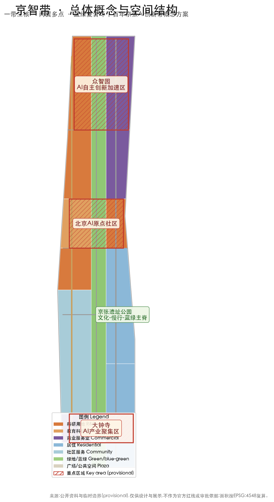
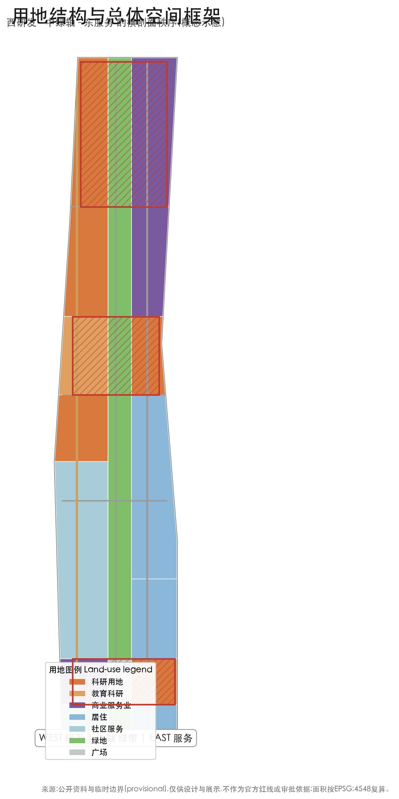
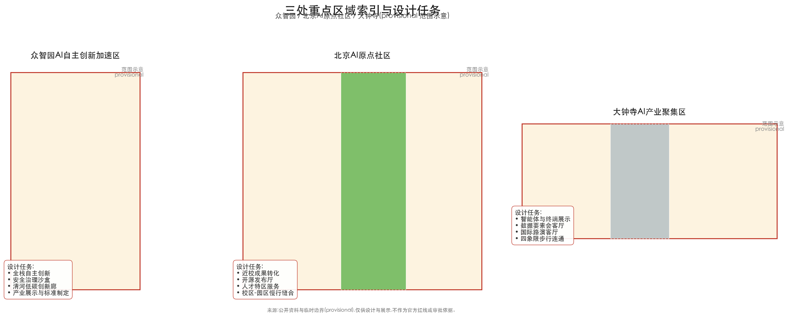
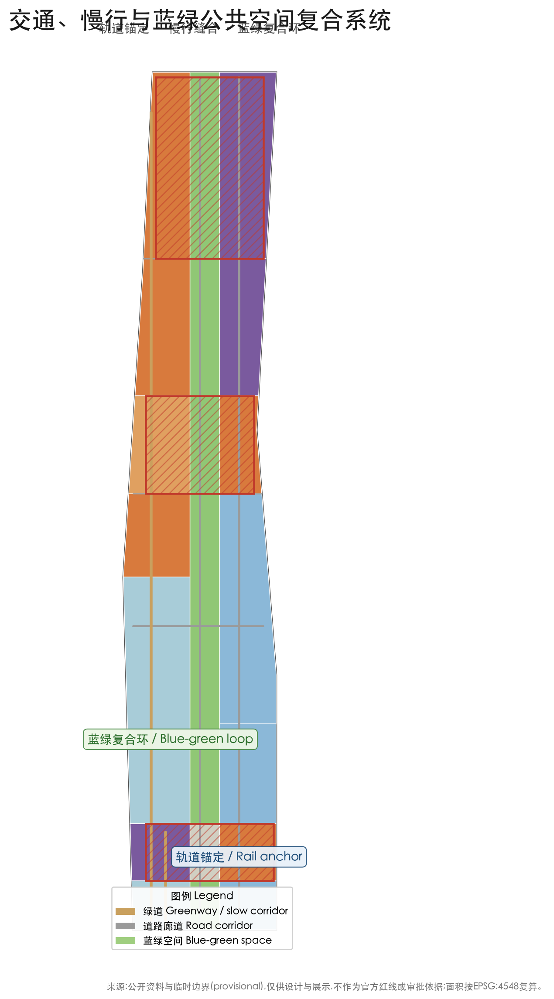
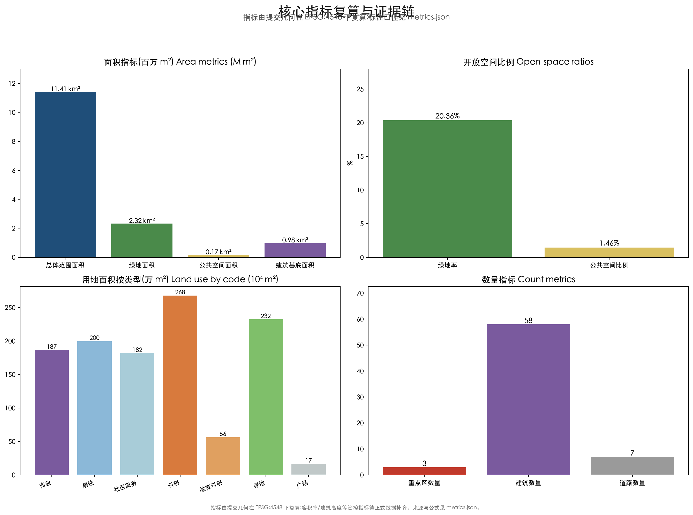

# Jingzhi Belt — Conceptual Urban Design Proposal for the Centennial Jingzhang AI Innovation Belt

## Design Basis and Data Inventory

This formal proposal takes the “Centennial Jingzhang AI Innovation Belt International Urban Design Solicitation – Prequalification Announcement” issued by the Haidian Branch of the Beijing Municipal Commission of Planning and Natural Resources as its primary basis, and the provisional rough boundaries, key areas, enums, indicators, and source inventory maintained in `brief/site-package/` as its machine-readable basis. Before generating the proposal, the AI agent must read `design_brief.json`, `allowed_design_space.json`, `sources.json`, `enums/`, `ranges/`, `schemas/`, `data/source_registry.json`, and `data/processed/agent_fact_pack.md`, and use `project_scope_summary.csv`, `agent_task_requirements.csv`, `source_use_matrix.csv`, and `missing_data_checklist.csv` to establish the task, scope, source-use, and gap lists. Every design judgment must be decomposed into traceable sources, recomputable metrics, checkable layers, and human-reviewable assumptions. The announcement requires the proposal to reach the urban design depth of a regulatory detailed plan and of an integrated planning implementation scheme, so narrative text cannot replace the GeoJSON, metric tables, A3 booklet, A0 boards, and HTML electronic deliverables [source:OFFICIAL-ANNOUNCEMENT] [source:AGENT-TASKBOOK].

The proposal is not a standalone vision text; it organizes deliverables from the announcement, the agent open-call taskbook, and the site package. This section places only the most critical evidence next to the judgment [source:OFFICIAL-ANNOUNCEMENT] [source:AGENT-TASKBOOK] [depth:existing_conditions_diagnosis]. Full source and standard coverage is kept in `sources.json`, `standard_matrix.json`, and `design_depth_matrix.json`, and is not repeated as machine indexes in the prose.

The source inventory defines usage boundaries as follows [source:SOURCE-REGISTRY]:

- data/source_registry.json records the permitted use boundaries of public, cleared, and provisional materials.
- Current registry summary: 7 formal-ready items, 1 background item, and 1 provisional-only item.
- The agent must not upgrade background_only or provisional_only materials into an official boundary, statutory regulatory plan, formal scoring basis, or government implementation commitment.

`data/processed/agent_fact_pack.md` is the reading-navigation layer of this proposal, not a new authoritative source [source:PROCESSED-FACT-PACK]. It helps the agent organize the three scopes, three key areas, announcement tasks, agent.1–agent.6, material availability, and data gaps into a readable proposal; factual judgments must still return to the registered primary materials [source:OFFICIAL-ANNOUNCEMENT] [source:AGENT-TASKBOOK], with the full source relations kept in `sources.json`.

Where the official `SITE_BOUNDARY` or the three `KEY_AREA` polygons are not yet available, this proposal generates a temporary formal package from `brief/site-package/geometry/provisional_boundaries.geojson`. The submitted `geometry/site_boundary.geojson` and `geometry/key_areas.geojson` are both labeled `provisional_constraint` with `official_boundary=false`, usable only for design generation, self-check, visualization, and design discussion, and not as an official redline, approval basis, precise-area basis, or statutory control conclusion [data:geometry/site_boundary.geojson#SITE-001] [metric:site_area_sqm]. This organizer data gap does not itself block content scoring; after official polygons are supplied, the site boundary, key areas, land use, roads, green space, public space, buildings, phasing, and metrics must all be recalculated.

The submission status is: **provisional boundary, precision caveats retained and to be recalculated when official data is released; content scoring remains eligible.** Spatial structures, scenarios, projects, and metrics are written under the principle of “discussable, reviewable, and recalculable after replacing the official boundary”; when official boundary and key-area polygons update, the agent must rerun generation, self-check, and drawing/HTML rendering, not simply replace a single file.

The boundary can be traced back to the overall-scope layer and area recalculation [data:geometry/site_boundary.geojson#SITE-001] [metric:site_area_sqm]. The three key areas are verified by their own layer and count metric [data:geometry/key_areas.geojson#PROV-KEY-001] [metric:key_area_count].

## Overall Concept: Jingzhi Belt

“Jingzhi Belt” (Belt of Intelligence, BoI) is this proposal's naming and spatial translation of the “Centennial Jingzhang AI Innovation Belt.” It turns the required main name, English name, naming system, visual identity direction, three positionings, five functions, and the three-areas-two-wings collaboration loop into a memorable, communicable, and deepenable urban design motif [source:AGENT-TASKBOOK] [standard:PROJECT-AGENT-OPEN-CALL-TASKBOOK] [depth:three_level_scope_framework].

**Naming logic:** “Jing” carries the local history and geography of Beijing, the Jingzhang Railway, and Zhongguancun; “zhi” points to artificial intelligence as the new productive force; “belt” returns to the planning language of linear spatial organization (cultural belt, experience belt, innovation belt) rather than adding a new administrative redline. The English name “Belt of Intelligence” expresses a “stream of intelligence” woven from data, compute, talent, and scenarios. Both names share a “zigzag-spine” core image: the 1909 “zigzag” (switchback) alignment of the Jingzhang Railway is the spiritual origin of China's self-driven innovation, and this proposal reconstructs it as the AI-era “zigzag loop” — university ideation (lower-left branch) → open-source collaboration (middle beam) → enterprise translation (upper-right branch) → scenario validation and governance feedback (southern loop), forming a closed “ideate–validate–deploy–feed back” cycle.

**Logo and visual identity direction:** a basic form of “zigzag spine + intelligence node + heritage green vein” is recommended — two converging streams metaphorize the Jingzhang twin tracks and switchback alignment; at the meeting point sits a growable round intelligence node (representing the three key areas); layered green at the base symbolizes the Jingzhang Heritage Park green axis. The full identity direction comprises a primary mark, Chinese/English wordmarks, an auxiliary graphic (sleeper/track beat), a color system (railway rust red + AI cyan + ecology green), and usage prohibitions, as a starting point for professional teams to deepen; this package does not produce cleared fonts, images, or trademark assets and only describes the direction [source:AGENT-TASKBOOK].

**Three positionings and five functions:** the three positionings (Centennial Jingzhang Cultural Belt, Urban AI Life Experience Belt, AI Convergence Innovation Belt) correspond to cultural, experience, and industry spatial threads; the five functions (AI full-stack independent innovation system, world-class AI innovation ecosystem, AI+ scenario-empowerment paradigm, intelligent AI vibrant city, global voice in AI governance) are carried by the three key areas and two wings: Zhongzhiyuan carries full-stack autonomy and governance voice, the Beijing AI Origin Community carries a world-class innovation ecosystem, Dazhongsi carries intelligent-native new business formats, the Zhongguancun Technology Service Wing carries globalized allocation of factors, Zhongguancun IP and capital enablement, and the Xiaoyuehe Scenario Empowerment Wing carries AI scenario enablement and a vibrant city. The three areas and two wings are not parallel plates but a collaboration chain linked by the “zigzag loop” [source:AGENT-TASKBOOK] [standard:PROJECT-AGENT-OPEN-CALL-TASKBOOK].

## Three-Level Scope Working Framework

The proposal organizes work along the three levels defined by the announcement: the overall research scope focuses on the AI industrial ecology, strategic positioning, innovation chain, and future urban form of 43.6 km²; the overall design scope focuses on the 11.4 km² urban area and industrial districts within 1–2 km around the Jingzhang Heritage Park, requiring an overall urban renewal framework, industrial spatial layout, transport-municipal support, and urban character control; the key-area scope focuses on the three detailed-design areas of 368.4 ha, requiring clarification of functional formats, building scale, retain/renovate/demolish classification, public-space connectivity, and transport organization. The three levels are mapped requirement-by-requirement in the compliance matrix, ensuring every mandatory task in announcement sections 1.3, 1.4, 1.5 and agent.1–agent.6 has chapter, layer, metric, drawing, and HTML evidence [source:PROCESSED-FACT-PACK] [depth:three_level_scope_framework].

The depth of the three-level framework is constrained by [depth:three_level_scope_framework] and [depth:overall_spatial_structure]; spatial evidence follows [data:geometry/site_boundary.geojson#SITE-001] and [data:geometry/key_areas.geojson#PROV-KEY-001]; task basis follows [standard:PROJECT-OFFICIAL-ANNOUNCEMENT]; and the scope index follows the three-level scope table in `project_scope_summary.csv` under [source:PROCESSED-FACT-PACK].

The three levels are not isolated drawing sets. The overall research determines the industrial chain and urban-form judgment, the overall design lands that judgment into renewal projects, spatial structure, and facility capacity, and the key-area detailed design verifies the implementability of specific parcels, buildings, transport, public space, and AI application scenarios. When generating, the agent must first lock the official or provisional boundary and constraints adopted by this submission, then generate land use, buildings, roads, green space, public space, phasing, and AI service nodes, and finally recompute metrics from these layers and explain in prose which conclusions remain limited by the provisional boundary. Any area, ratio, scale, or project count that cannot be recomputed from structured data must not be written into formal conclusions [data:geometry/land_use.geojson#LU-001] [data:geometry/roads.geojson#ROAD-001].

The recommended overall spatial structure is “one belt, three cores, two wings, multiple nodes, and a blue-green loop”: the “one belt” is the north–south cultural–slow-mobility–blue-green spine along the Jingzhang Heritage Park; the “three cores” are Zhongzhiyuan, the Beijing AI Origin Community, and Dazhongsi; the “two wings” are the Zhongguancun Technology Service Wing and the scenario-empowerment wing facing Xiaoyuehe; the “multiple nodes” are AI scenario nodes scattered across neighborhoods, stations, and blocks; and the “blue-green loop” links the Qinghe River, Xiaoyuehe, the Heritage Park green axis, and street public spaces into a continuous network [depth:overall_spatial_structure] [data:geometry/green_space.geojson#GREEN-001].

| Level | Design question | Proposed answer | Data anchor |
| --- | --- | --- | --- |
| Overall research scope | How to organize the AI industrial ecology and future urban form | Build an innovation chain of “university ideation – open-source collaboration – enterprise translation – public experience – international communication” and the zigzag loop | compliance_matrix.json, standard_matrix.json |
| Overall design scope | How to map industrial space, renewal, transport, municipal, and character | Land use, buildings, roads, green space, public space, and phasing layers jointly express one-belt-three-cores-two-wings-multiple-nodes | [data:geometry/land_use.geojson#LU-001]、[data:geometry/roads.geojson#ROAD-001] |
| Key-area scope | How the three areas reach detailed design depth | Each area proposes positioning, spatial moves, AI scenarios, and implementation dependencies | [data:geometry/key_areas.geojson#PROV-KEY-001]、[data:geometry/key_areas.geojson#PROV-KEY-002]、[data:geometry/key_areas.geojson#PROV-KEY-003] |

## Overall Research Scope: Industry and Future Urban Form

The core task of the overall research scope is to build a world-class AI innovation ecosystem. The proposal should inventory Haidian's universities and institutes, leading enterprises, compute–algorithm–data factors, incubators, listed companies, unicorns, and technology services, and propose a spatial coordination framework for the AI innovation chain, industrial chain, talent chain, and urban service chain. The agent taskbook requires 5–8 global AI innovation ecosystem cases as benchmarking references. This proposal selects the following public, verifiable cases as references (benchmarking only, no implementation commitment):

| Case | Region type | Lessons transferable to this proposal |
| --- | --- | --- |
| Silicon Valley / Stanford, USA | University-driven | On-the-spot translation of university output, venture capital corridor, free talent mobility |
| Kendall Square / MIT, USA | Campus–park seaming | Continuous innovation chain of lab–incubator–enterprise–public space |
| One-North, Singapore | Plan-led | Mixed land use, slow-mobility priority, industry–city–talent integration, international environment |
| King's Cross, London, UK | Urban renewal + innovation | Industrial heritage renewed into a knowledge-economy district, public-space operations |
| Shenzhen Nanshan / Xili Lake, China | Industry + university | Leading-enterprise pull, complete industrial chain, open scenarios |
| Yunqi Town / Alibaba ecosystem, Hangzhou, China | Enterprise ecosystem | Digital platform ecology, developer community, conventions and event operations |

These benchmarks confirm three judgments: first, world-class AI ecosystems are built on a continuous spatial chain of “campus/research – incubation – enterprise – public experience”; second, successful innovation districts emphasize mixed use and high-quality public space rather than pure industrial parks; third, developer communities, open scenarios, and annual events are important operational assets for ecosystem continuity. These judgments translate into the land-use ratios and spatial structure of the overall design scope [source:AGENT-TASKBOOK] [data:geometry/land_use.geojson#LU-001] [standard:PROJECT-AGENT-OPEN-CALL-TASKBOOK].

The proposed AI innovation ecosystem map is a “six-ring system”: university research ideation ring (Tsinghua, Beihang, etc.), open-source collaboration and talent ring (developer community, talent special zone), compute–data factor ring (edge compute, data-factor circulation), enterprise translation ring (unicorns, leading enterprises, agent enterprises), scenario validation ring (transport, public service, consumption, manufacturing), and international communication ring (events, roadshows, discourse building). The six rings map one-to-one to the three areas, two wings, and the Xiaoyuehe scenario-empowerment wing, forming a deepenable ecosystem–space mapping [source:AGENT-TASKBOOK] [depth:overall_spatial_structure].

The overall research does not add pseudo-precise redlines; through the coordination of urban character, public space, and building layout required by urban design measures, it reconnects land use, public space, and the overall spatial structure [standard:MOHURD-URBAN-DESIGN-MEASURES] [data:geometry/land_use.geojson#LU-001] [data:geometry/public_space.geojson#PUBLIC-001], showing that the industry strategy ultimately lands in visible, reviewable spatial structure.

Future-urban-form research should answer how AI changes work, life, socializing, learning, transport, and public services. The proposed future urban form advocates “three Ables and one Sustainable”: walkable (5–15 minute living circles), testable (open validation scenarios), feedback-able (data and governance give back to the public), and sustainable (low-carbon and ecology-first). It lands as locatable functional zones, nodes, corridors, and scenarios rather than vague technology visions [source:AGENT-TASKBOOK] [metric:green_ratio] [metric:public_space_ratio].

## Overall Design Scope: Urban Renewal and Regulatory-Planning-Depth Urban Design

The overall design scope must reach the urban design depth of a regulatory detailed plan. The proposal must present an overall urban renewal spatial structure, identification of inefficient space, a renewal project list, implementation policy suggestions, industrial function ratios, spatial organization models, total building scale, and comprehensive capacity assessment. `geometry/land_use.geojson` fully covers the design boundary without overlap, `geometry/buildings.geojson` expresses conceptual building footprints, `geometry/roads.geojson` expresses micro-circulation, slow mobility, and rail connection, and `metrics.json` recomputes core areas, ratios, and layer counts.

This section decomposes regulatory-planning-depth content into reviewable objects per [standard:MOHURD-CONTROL-DETAILED-PLANNING]: [data:geometry/land_use.geojson#LU-001] expresses land-use structure, [data:geometry/buildings.geojson#BLDG-0001] expresses building footprints, [data:geometry/roads.geojson#ROAD-001] expresses transport organization, [metric:building_footprint_area_sqm] verifies footprint area, and [depth:land_use_layout] and [depth:development_intensity_controls] constrain deliverable depth.

The overall design spatial strategy revolves around the “Jingzhang Intelligence Vein”: with the Jingzhang Heritage Park as the north–south main spine, research, education, commercial, residential, and community-service land uses are organized on both sides, forming a “west R&D – central green axis – east services” cross-section order; the three key areas sit at critical nodes of the spine. Conceptual land-use zoning shows research (08) and commercial-service (05) uses concentrated in the west wing and south section, residential and community services (07) distributed in the eastern living neighborhoods, and green space (14) along the Heritage Park and river corridors [data:geometry/land_use.geojson#LU-001] [data:geometry/land_use.geojson#LU-001].

The overall design must also support transport, rail, municipal, and supporting facilities, proposing spatial layouts and implementation paths for station-area integration, road micro-circulation, non-motorized parking, parking supply, innovation service platforms, talent living services, new infrastructure, distributed energy, and edge compute [depth:traffic_rail_slow_parking] [depth:municipal_new_infrastructure]. Because no official control conditions exist, all content involving building height, development intensity, road redlines, setbacks, and facility standards is written as “pending official regulatory conditions” rather than agent-guessed approved indicators [metric:building_height_m] [metric:floor_area_ratio].

## Key-Area Detailed Design

Key-area detailed design is mandatory. The Zhongzhiyuan AI Independent Innovation Acceleration Area should propose a detailed scheme around the national AI platform, full-stack independent innovation, standard setting, safety governance, industrial exhibition, external transport, Qinghe culture, low-carbon green innovation interaction, and green-space AI scenarios. The Beijing AI Origin Community should propose a detailed scheme around near-campus innovation, output incubation and translation, the talent special zone, open-source systems, brand events, building retain/renovate/demolish, output showcase and release, living and daily services, campus–park slow-mobility connections, and station-area integration. The Dazhongsi AI Industry Cluster should propose a detailed scheme around leading enterprises, agents, intelligent terminals, content consumption, data factors, digital assets, commercial services, composite use of planned green space, Dazhongsi Station integration, and four-quadrant pedestrian connectivity at intersections [source:OFFICIAL-ANNOUNCEMENT] [depth:three_key_area_detailed_design].

The three key-area detailed designs cite [data:geometry/key_areas.geojson#PROV-KEY-001], [data:geometry/key_areas.geojson#PROV-KEY-002], and [data:geometry/key_areas.geojson#PROV-KEY-003], and are checked by [depth:three_key_area_detailed_design] for integrated planning implementation depth. All three areas exist in `geometry/key_areas.geojson`; because official polygons are absent, `provisional_constraint` is used, and the proposal, HTML, sources, assumptions, and self_check all state that they cannot serve as a formal scoring or approval basis. The compliance matrix covers announcement sections 1.5.3.1, 1.5.3.2, and 1.5.3.3 separately. The design expression includes functional formats, building scale, building form, retain/renovate/demolish classification, public-space system, transport organization, slow-mobility connectivity, and implementation projects.

| Key area | Design positioning | Spatial moves | AI industry and operation scenarios | Evidence |
| --- | --- | --- | --- | --- |
| Zhongzhiyuan AI Independent Innovation Acceleration Area | Garden-style full-stack independent innovation block | Strengthen the Qinghe frontage, industrial exhibition, low-carbon innovation interaction, and external transport; use green space for open testing and standards-governance showcase | Proprietary-model testing, standards workshops, safety-governance showcase, low-carbon compute experience | [data:geometry/key_areas.geojson#PROV-KEY-001] |
| Beijing AI Origin Community | Near-campus translation and talent community | Sew campus, park, and block slow mobility; add output release, talent services, living, and open-source collaboration space | Open-source community, output release, talent-zone services, near-campus incubation | [data:geometry/key_areas.geojson#PROV-KEY-002] |
| Dazhongsi AI Industry Cluster | Urban intelligent economy and international exchange block | Station integration, four-quadrant pedestrian connectivity, commercial services, and public-environment renewal around key enterprises | Agent and intelligent-terminal showcase, content consumption, data factors, international roadshows | [data:geometry/key_areas.geojson#PROV-KEY-003] |

The three key areas jointly form the three links of the “zigzag loop”: the Origin Community outputs ideation, Zhongzhiyuan carries full-stack acceleration and governance validation, and Dazhongsi lands intelligent-native scenarios and international exchange; they are connected by the Heritage Park slow-mobility spine and rail stations within a 15-minute reach [source:AGENT-TASKBOOK] [metric:key_area_count].

## AI Innovation Ecosystem, Personas, and AI+ Scenarios

The proposal should build spatial demand personas for AI talent and enterprises covering R&D office, open-source collaboration, output release, enterprise services, talent housing, socializing and learning, consumption and life, sports and leisure, and international exchange. AI+ scenarios should follow the announcement directions of transport, services, consumption, healthcare, education, law, and life services, forming both industrial-development scenarios and AI-empowered urban-function scenarios. Each scenario must state its target users, spatial location, data source, privacy boundary, human-review mechanism, and operating entity [source:AGENT-TASKBOOK] [standard:PROJECT-AGENT-OPEN-CALL-TASKBOOK].

This proposal establishes at least five personas:

| Persona | Typical needs | Spatial response | Self-check boundary |
| --- | --- | --- | --- |
| Open-source developer | Release, collaborate, test, community reputation | Origin Community open-source release hall, public code wall, nighttime collaboration space | No personal behavior tracking; event data aggregated only |
| Startup team | Low-cost offices, compute access, product testbed | Zhongzhiyuan shared test field, edge-compute service points, standards-governance consulting | Compute and data services require separate authorization |
| Leading-enterprise visitor | Showcase, business, international reception, recruiting | Dazhongsi international roadshow hall, station connection, public space around key enterprises | Enterprise logos and cases must be rights-cleared |
| Nearby resident | Commute, leisure, community services, low-disturbance renewal | Heritage Park slow-mobility loop, embedded community services, graded nighttime lighting and events | Resident personas not used for commercial recommendation |
| University student and faculty | Output translation, cross-campus collaboration, daily walking | Campus–park slow-mobility seaming, translation stations, AI education experience points | Campus data and research outputs require authorization |

This proposal provides at least ten AI scenario cards:

| Scenario card | Spatial carrier | Design description | Operation and review boundary |
| --- | --- | --- | --- |
| 01 Open-source release hall | Beijing AI Origin Community | Output release, code-contribution showcase, and small roadshow space for universities, open-source communities, and startups | Aggregated event data; releases per open-source license |
| 02 Safety-governance sandbox | Zhongzhiyuan | Translate standard setting, safety evaluation, and red-team testing into visitable, bookable, supervised showcase and collaboration nodes | Independent review; test data de-identified |
| 03 Edge-compute station | Nodes across the design scope | Prototype new infrastructure combined with public services, enterprise services, and low-carbon energy | Compute services require separate authorization |
| 04 AI slow-mobility navigation | Heritage Park vitality belt | Explainable wayfinding and low-intrusion sensing to identify gaps, congestion, and accessibility needs | Aggregated only; no individual identification |
| 05 Dazhongsi international roadshow hall | Dazhongsi AI Industry Cluster | Showcase, meeting, media release, and international exchange for agent, terminal, and content firms | Enterprise cases rights-cleared |
| 06 Qinghe low-carbon innovation corridor | Zhongzhiyuan Qinghe frontage | Combine green space, stormwater, walking/cycling, and AI showcase as the park's public living room | Ecology and blue-line constraints first |
| 07 Near-campus translation street | Beijing AI Origin Community | Incubation, showcase, legal, IP, and financing services for university output translation | Research data requires authorization |
| 08 Data-factor living room | Dazhongsi area | Urban service interface demonstrating data-factor and digital-asset circulation under compliance, authorization, and auditability | Auditable logs; personal data stays in-domain |
| 09 AI life-service demo street | Community–commerce junctions | Land healthcare, education, law, and life-service AI+ scenarios into operable small-scale block space | Licensed human review for healthcare/legal services |
| 10 Global AI event-week route | Public-space system along the belt | Walkable, shareable experience route from heritage culture, open source, industry showcase to international roadshow | Public-space permits and safety assessment |

The agent taskbook also requires at least three industry test/validation scenarios. This proposal proposes three types: first, the Zhongzhiyuan “full-stack validation field” (a visitable version of proprietary-model safety evaluation, standards sandbox, and red-team testing); second, the “urban-scale AI transport validation segment” along the Heritage Park (a conceptual testing corridor for slow-mobility sensing, signal coordination, and autonomous shuttles, requiring separate feasibility study); third, the Dazhongsi “data-factor circulation sandbox” (an urban service interface validating data-product circulation under authorization and auditability). All three are written as “conceptual suggestions pending professional deepening and feasibility study,” not approved operations or engineering commitments [source:AGENT-TASKBOOK] [depth:three_key_area_detailed_design].

Agent-generated AI governance suggestions must follow data minimization, public sources, explainability, and human review. Urban agents may assist in identifying slow-mobility gaps, public-space heat, facility maintenance, enterprise-service demand, and event safety risks, but must not replace planning approval, output unauthorized personal profiles, or claim official implementation commitments [source:AGENT-TASKBOOK] [data:geometry/public_space.geojson#PUBLIC-001] [data:geometry/roads.geojson#ROAD-001].

## AI Public Space, Intelligent-Native New Business, and Pilgrimage Landmarks

The Jingzhang Heritage Park is the main stage of AI public space in this proposal. The park is organized in a “three-segment” structure: the south segment (toward Dazhongsi) is an urban living room and roadshow plaza, the middle segment is a cultural slow-mobility and community life belt, and the north segment (toward Zhongzhiyuan) is an innovation showcase and low-carbon experience zone. The park public space, together with the Qinghe and Xiaoyuehe ecological corridors and street public spaces, forms the “blue-green loop” supporting exhibitions, markets, testing showcases, sports and leisure, and large events [depth:blue_green_public_space] [data:geometry/public_space.geojson#PUBLIC-001] [data:geometry/green_space.geojson#GREEN-001].

The agent taskbook requires at least three AI pilgrimage landmarks and an honor-display system. This proposal proposes three conceptual landmarks (pending professional deepening and heritage/safety review):

- **Zigzag Spine · Origin Monument**: a monument and interactive exhibition at the Jingzhang Railway culture node, paying tribute to the 1909 switchback alignment, as the spiritual origin of China's self-driven innovation and the spiritual starting point for AI-era innovators;
- **Qinghuayuan · Intelligence Source Station**: drawing on the Qinghuayuan railway-station cultural resource, a release and honor-display space that turns near-campus ideation into a visitable “source of innovation” landmark;
- **Dazhongsi · Sound and Light Intelligence Valley**: combined with Dazhongsi Station integration and the urban living room, using light, sound, installations, and data visualization to express “intelligence landing” as an international exchange and communication landmark.

The honor-display system suggests: a developer contribution wall (aggregating open-source contributions and community honors, anonymized), an AI milestone gallery (annual narrative of key outputs), and a public scenario check-in system (linked to event operations). The public-space component library suggests reusable, standard-driven elements: modular exhibition frames, seating and shading units, accessible wayfinding, reusable stages, and low-carbon materials, for communities and enterprises to reuse [source:AGENT-TASKBOOK] [depth:blue_green_public_space].

Intelligent-native new business concentrates in the Dazhongsi area: agent enterprises, intelligent-terminal experiences, content consumption, digital assets, and data-factor services, combined with commercial services and composite use of planned green space, forming an “exhibition–experience–transaction–exchange” urban consumption and business scenario. All related design is written as conceptual suggestion and does not constitute conclusions on renovating existing buildings or engineering commitments [data:geometry/key_areas.geojson#PROV-KEY-003].

## Land Use, Building Scale, and Retain/Renovate/Demolish

The land-use proposal follows public standards of national territory survey, planning, and use-control classification [standard:MNR-LAND-USE-CLASSIFICATION-GUIDE], forming a complete, closed, seamless land-use partition. Conceptual zoning shows research and education uses concentrated in the west wing and north section (toward Zhongzhiyuan and the Origin Community), commercial-service uses mixed along the south section and east side, residential and community services in the eastern living neighborhoods, green space and plazas along the Heritage Park, Qinghe, and Xiaoyuehe, with green and public space combined at about 21.8% [metric:green_ratio] [metric:public_space_ratio] [data:geometry/land_use.geojson#LU-001].

The building proposal distinguishes retained, renovated, renewed, new, or pending objects, and defines recommended tiers for footprint, function, scale, character, roof, massing, and height control. Because existing buildings, ownership, regulatory plans, and engineering conditions are missing, this package only expresses conceptual footprints as spatial-capacity illustrations and does not fabricate retain/renovate/demolish conclusions; the method is governed by [depth:retain_renovate_demolish] and height/massing/character by [depth:height_massing_character]. Footprint area can be verified from the layer [data:geometry/buildings.geojson#BLDG-0001] [metric:building_footprint_area_sqm].

Building scale and intensity indicators must be consistent with `metrics.json` and the layers. Because official conditions for total building scale, FAR, height, density, green ratio, setbacks, and building control lines are missing, they are listed in the metric system as “pending official data” rather than fabricated for a false sense of precision [metric:floor_area_ratio] [metric:building_height_m]. The A3 booklet provides the renewal project list and indicator review table, the A0 boards express key spatial structure and key areas, and the HTML page provides linked metric and layer views.

## Transport, Rail, Municipal, and Public Service Facilities

The transport proposal responds to the announcement's requirements on station-area integration, road micro-circulation, slow-mobility gaps, external transport, parking, non-motorized parking, and green transport systems, covering the North Fifth Ring Road, the Heritage Park grade-separation nodes, Wudaokou, the West End of Qinghua East Road, Dazhongsi Station, and transport links around key enterprises. Road and slow-mobility layers stay within the submitted boundary and cross-check with public space, green space, industry nodes, and key areas [data:geometry/roads.geojson#ROAD-001] [depth:traffic_rail_slow_parking].

The transport strategy advocates “rail anchored, slow-mobility seamed, testing friendly”: rail stations anchor TOD mixed blocks; the Heritage Park slow-mobility spine seams north–south gaps; and a conceptual corridor for open testing is reserved in Zhongzhiyuan and the north section of the Heritage Park. Because the submitted boundary is provisional, transport conclusions are temporary design discussion only, and missing road redlines, pipelines, fire-safety, and municipal conditions are recorded as pending through assumptions [data:geometry/roads.geojson#ROAD-001] [data:geometry/constraints.geojson#CONSTRAINT-PROV-SITE].

Municipal and public service facilities cover AI industry service facilities, innovation service platforms, talent living service facilities, new infrastructure, distributed energy, edge compute, and integration with traditional municipal facilities. The proposal states the framework of facility standards, spatial layout, service radii, operation models, and phased implementation logic; missing pipeline, energy, drainage, flood-control, and fire-safety engineering data are all listed as preconditions for formal deepening [depth:municipal_new_infrastructure].

## Blue-Green Space, Public Space, and Urban Character

The blue-green proposal takes the Jingzhang Heritage Park vitality belt as the skeleton, coordinates the Qinghe River, Xiaoyuehe, and the travel needs of surrounding universities, enterprises, and communities, proposes a north–south through, east–west connected network of walking, cycling, and green space, identifies slow-mobility gaps, grade-separation nodes, and south/north park landscape nodes, and proposes composite use of parking, sports, innovation interaction, technology testing, application showcase, and public services. Blue-green and public space are jointly checked by the design-depth item and the green/public layers [depth:blue_green_public_space] [data:geometry/green_space.geojson#GREEN-001] [data:geometry/public_space.geojson#PUBLIC-001]. The green and public ratios are explained in prose for design meaning, with full recalculation in `metrics.json` [metric:green_ratio] [metric:public_space_ratio].

The urban character proposal fuses Jingzhang Railway history, Zhongguancun innovation culture, and AI innovation culture, using cultural resources such as Qinghuayuan Station and the Beijing Film Academy, and proposes city tone, building character, roof form, massing, frontage, and public-art guidance [standard:MOHURD-URBAN-DESIGN-MEASURES]. Character control distinguishes official control, design suggestion, and pending conditions, and never gives pseudo-precise control lines without heritage-protection or regulatory-plan basis.

## Jingzhang Heritage, Zhongguancun Culture, and AI New-Culture Narrative

The cultural narrative is the spiritual core that distinguishes the “Jingzhi Belt” from ordinary industrial-district proposals. This proposal puts forward the storyline “one railway, two crossings”: in 1909, the Jingzhang Railway crossed the Badaling mountains with a switchback alignment, the coordinate origin of China's self-driven innovation; today, the AI innovation belt “crosses” industrial boundaries with data, compute, talent, and scenarios, the contemporary continuation of this spirit [source:AGENT-TASKBOOK] [depth:overall_spatial_structure].

- **Jingzhang Railway heritage resource system**: inventory Qinghuayuan Station, the Badaling switchback imagery, rail industrial heritage, and the railway construction narrative, forming a resource map and protective reminders; history is not distorted [source:AGENT-TASKBOOK].
- **Zhongguancun innovation culture and AI new culture**: connect the Zhongguancun spirit of “dare to create, tolerate failure, open collaboration, and go global” with AI new culture, bringing open-source spirit, geek culture, and digital public life into urban public-space expression.
- **Spatial culture system and carriers**: unify wayfinding, paving, public art, lighting, and interactive interfaces with the “zigzag spine” motif; the wayfinding, sign, and symbol system extends rather than replaces the overall Belt logo system [source:AGENT-TASKBOOK].
- **International communication narrative**: the suggested narrative thread is “From China's first self-built railway to a world-class innovation belt,” supported by short films, route maps, landmark check-ins, and developer stories; all portraits, trademarks, paper images, or copyrighted material must be rights-cleared before use [source:AGENT-TASKBOOK].

## Renewal Project List, Implementation Policy, and Phasing

The implementation scheme forms a reviewable renewal project list stating location, type, function, responsible entity, dependencies, phase, risk, and evaluation indicators. Policy suggestions cover integrated urban renewal implementation, spatial supply, operation mechanisms, industrial services, public participation, data governance, and property-right coordination. `geometry/phasing.geojson` expresses phasing areas, and the compliance matrix links each task to phasing and drawings [depth:renewal_project_list] [depth:phasing_implementation] [data:geometry/phasing.geojson#PHASE-1].

| No. | Project name | Type | Main dependencies | Evidence |
| --- | --- | --- | --- | --- |
| JZ-01 | Jingzhang Heritage Park slow-mobility gap seaming | Public space / transport | Road redlines, under-bridge space, transport review | [data:geometry/roads.geojson#ROAD-001] |
| JZ-02 | Zhongzhiyuan Qinghe innovation frontage | Blue-green / industry showcase | River blue line, ecology and flood control | [data:geometry/green_space.geojson#GREEN-001] |
| JZ-03 | Origin Community near-campus translation street | Urban renewal / industry services | Campus boundary, ownership, ground-floor uses | [data:geometry/buildings.geojson#BLDG-0001] |
| JZ-04 | Dazhongsi Station four-quadrant pedestrian connectivity | Rail integration / slow mobility | Station, intersections, municipal pipelines | [data:geometry/public_space.geojson#PUBLIC-001] |
| JZ-05 | AI public services and edge-compute nodes | New infrastructure / public services | Energy, compute, safety, operating entity | [data:geometry/constraints.geojson#CONSTRAINT-PROV-SITE] |
| JZ-06 | Global AI event-week public route | Operations / brand | Public-space permits, event safety, rights clearance | [data:geometry/phasing.geojson#PHASE-1] |

Three phases are suggested: Phase 1 (near-term pilots) focuses on the Heritage Park spine, the Zhongzhiyuan validation field, and the Origin Community translation street, prioritizing lightweight facilities, operations, and service platforms; Phase 2 (mid-term renewal) sews the Xiaoyuehe scenario-empowerment wing and Dazhongsi Station integration and completes road micro-circulation and public space; Phase 3 (long-term governance) completes citywide character quality, the international event system, and long-term operations. Phase areas are verifiable in the layer [data:geometry/phasing.geojson#PHASE-1] [data:geometry/phasing.geojson#PHASE-1]. Phasing is distinguished from the 100-day solicitation cycle: the solicitation cycle is a deliverable deadline, while implementation phasing is the renewal and construction path. Projects without ownership, funding, implementing entity, and approval path are written as implementation risks, not commitments.

## Global AI Innovation Event System and Long-Term Operations

The agent taskbook requires a global AI innovation event system and long-term operation mechanisms. This proposal proposes a “four-season rhythm” event system (conceptual suggestion): Spring “Open-Source Collaboration Season” (developer conference, code contribution week, recruiting market), Summer “Scenario Opening Season” (public experience routes, transport and life-service testing showcases), Autumn “International Roadshow Season” (international AI roadshows, output releases, data-factor exchange), and Winter “Governance and Outlook Season” (standards workshops, governance white paper, annual milestone release). Each season sets fixed venues (Origin Community release hall, Zhongzhiyuan validation field, Dazhongsi roadshow hall, Heritage Park public space) and operational responsibility boundaries [source:AGENT-TASKBOOK].

The event brand and communication visual system extends the Belt's identity direction into operations, unifying event key visuals, route maps, landmark check-ins, and media guidelines. The developer community operation mechanism suggests: regular open-source workshops, online–offline node linkage, a contributor honor system (connecting to the contribution wall), and a newcomer onboarding program. The AI scenario open-operation mechanism suggests a four-stage apply–review–open–review loop, with clear data boundaries, human review, responsibility, and exit mechanisms. Public-experience and landmark operations suggest booked group experiences, graded daily-open versus large-event management, and volunteer and professional guides. The international communication and attraction-conversion mechanism suggests global distribution of event content, cooperation with international media and developer networks, and post-event conversion tracking of talent, enterprises, and projects [source:AGENT-TASKBOOK].

All event, brand, and operation design is written as “conceptual suggestions pending operating entity and public management confirmation,” not as confirmed arrangements, does not exaggerate government commitments or event outcomes, and explains the follow-up conversion paths for talent, enterprises, and developers [source:AGENT-TASKBOOK] [standard:PROJECT-AGENT-OPEN-CALL-TASKBOOK].

## Indicator System, Area Recalculation, and Compliance Matrix

The indicator system covers the overall design scope area, key-area areas, green and public ratios, building footprint, renewal project count, AI scenario nodes, slow-mobility connectivity indicators, industrial-space indicators, talent-service indicators, and self-check status. Every known metric must be recomputable from GeoJSON or a trusted source; unknown metrics state their reason and formal-submission preconditions. The results of `scripts/spatial_review.py` and `scripts/visual_review.py` are important evidence for formal self-check [depth:metrics_recalculation].

Metric recalculation follows the unified design-depth requirement [depth:metrics_recalculation]. The prose explains the design meaning of the metrics: the overall-scope area constrains spatial allocation [metric:site_area_sqm], the green and public ratios support everyday interaction [metric:green_ratio] [metric:public_space_ratio], the key-area count and areas verify the three-core structure [metric:key_area_count] [data:geometry/key_areas.geojson#PROV-KEY-001], and phase areas verify the implementation rhythm [data:geometry/phasing.geojson#PHASE-1] [data:geometry/phasing.geojson#PHASE-1].

The compliance matrix is the master control file for task responsiveness. Every announcement task and agent taskbook task maps to report sections, layers, metrics, drawings, HTML pages, sources, assumptions, and self-check items. Mandatory tasks in announcement sections 1.3, 1.4, 1.5 and agent.1–agent.6 are all covered in `compliance_matrix.json`; if any mandatory task is uncovered, the proposal cannot enter formal professional scoring.

For formal deepening, each metric is classified into three types: first, spatial metrics directly recomputable from the submitted geometry (boundary area, green ratio, public ratio, building footprint, phase area); second, control metrics requiring official regulatory plans or taskbook annexes (FAR, height, density, setbacks, road redlines, facility standards); third, performance metrics requiring continuous calibration with operations or industry data (AI innovation index, talent density, industrial-service satisfaction, slow-mobility accessibility, event participation, scenario usage frequency). The three types go into `metrics.json`, `assumptions.json`, and `compliance_matrix.json` respectively, avoiding operational visions being mistaken for approved planning conditions.

## Risks, Copyright, and Compliance

**Bilingual requirement.** The primary proposal is Chinese, with a complete counterpart translation in `proposal.en.md`; the A3/A0, HTML, and text-bearing figures also provide corresponding language versions. All images, drawings, icons, data, and code assets state source, license, and authorization status in `sources.json` and `report/copyright_statement.md`. HTML pages do not load remote scripts, remote map tiles, remote fonts, iframes, forms, or external APIs, and do not track reviewers.

Risks and the missing-data list are jointly checked by the risk depth item, the constraints layer, and the site package [depth:risk_missing_data] [data:geometry/constraints.geojson#CONSTRAINT-PROV-SITE] [source:SITE-PACKAGE]. The official boundary, key-area, regulatory-plan, road, parcel, building, municipal, heritage-protection, and public-service gaps listed in `missing_data_checklist.csv` go into `assumptions.json`, self-check, and the prose risk section. Any conclusion lacking official regulatory plans, road redlines, ownership, municipal, fire-safety, or heritage-protection conditions is downgraded to a pending-confirmation item; full professional verification is kept in the standard matrix.

This proposal does not claim official approval, approved regulatory plans, final land ownership, final building scale, or guaranteed implementation. The AI agent is responsible for facts, sources, copyright, spatial data, metrics, and expression; maintainers and professional reviewers may request repair or rejection based on self-check results, spatial review, and the compliance matrix.

## References

- brief/public-brief.md
- brief/site-package/design_brief.json
- brief/site-package/allowed_design_space.json
- brief/site-package/agent_taskbook.json
- brief/site-package/enums/
- brief/site-package/ranges/planning_limits.json
- brief/site-package/geometry/provisional_boundaries.geojson
- data/processed/agent_fact_pack.md
- data/processed/project_scope_summary.csv
- data/processed/agent_task_requirements.csv
- data/processed/source_use_matrix.csv
- data/processed/missing_data_checklist.csv
- Full machine index: see `sources.json`, `metrics.json`, `compliance_matrix.json`, `standard_matrix.json`, and `design_depth_matrix.json`
- This bibliography entry is based on the site-package registry; complete attribution and licenses are in the structured source list [source:SITE-PACKAGE]
