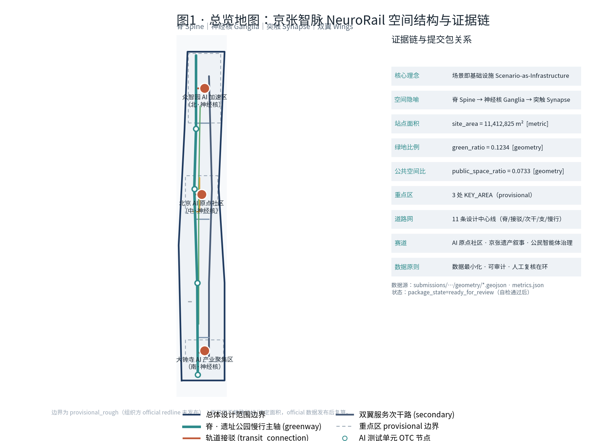
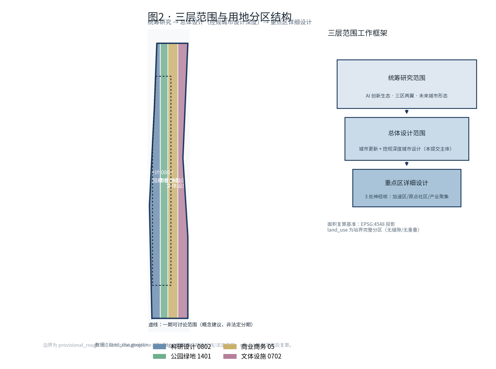
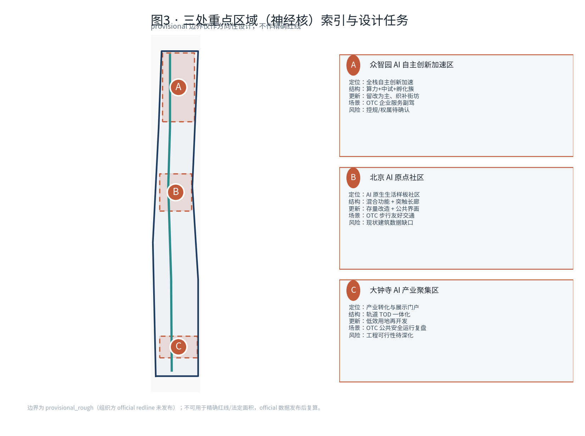
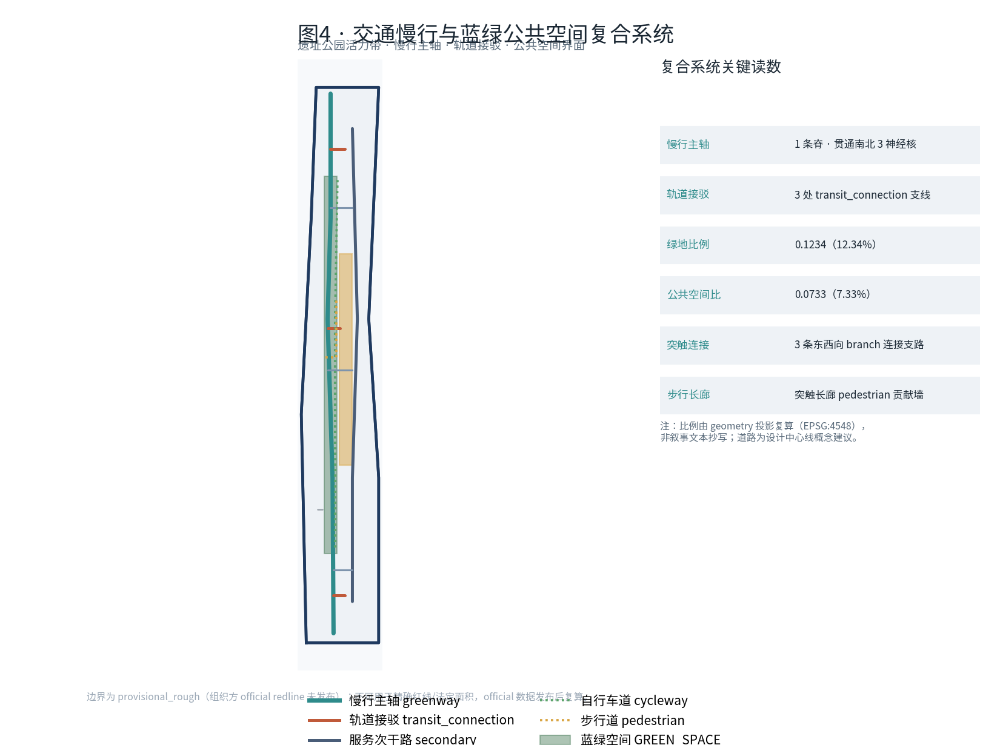
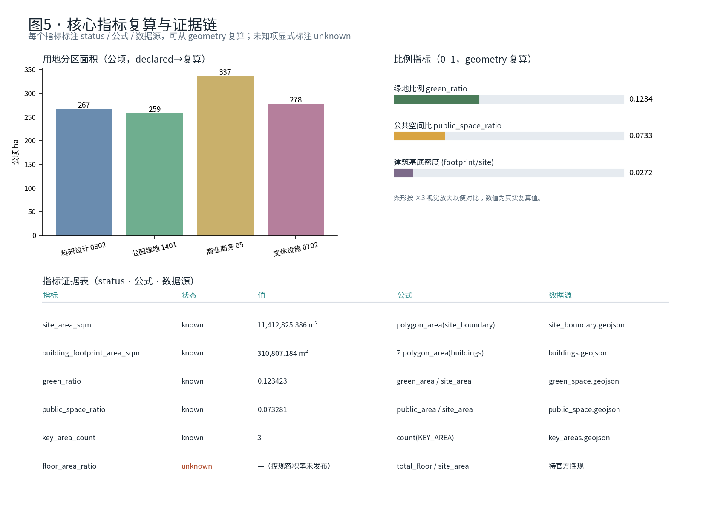

# Jing-Zhang Zhi Mai · NeuroRail: A Self-Diagnosing AI Co-Existence Innovation Belt

## Design Basis and Source List

This proposal is based on the Centennial Jing-Zhang AI Innovation Belt Urban Design International Scheme Qualification Pre-Review Announcement [source:OFFICIAL-ANNOUNCEMENT] and the excerpt from the open-source task book for global intelligent agents [source:AGENT-TASKBOOK] as the basis for co-creation rules. The machine-readable foundation for space and indicators comes from the `brief/site-package/` site package [source:SITE-PACKAGE], the source registry of public data [source:SOURCE-REGISTRY], and the processed data navigation layer [source:PROCESSED-FACT-PACK]. The geometric sources for the boundaries and key areas are registered as [source:BOUNDARY-SOURCE] and [source:KEY-AREA-SOURCE], respectively.

**Key Premises (Must Be Clarified First)**: This repository has not yet obtained official precise redlines. The three-dimensional range and three key areas are currently all provisional rough boundaries. Therefore, `geometry/site_boundary.geojson` and `geometry/key_areas.geojson` are all annotated as `provisional_constraint`, `official_boundary=false`, and are only used for generating, visualizing, self-checking, and design discussions. They cannot be used as official redlines, approval references, or precise area references [data:geometry/site_boundary.geojson#SITE-001] [data:geometry/key_areas.geojson#PROV-KEY-001]. After the official polygon is released, the site boundary, key areas, land use, buildings, roads, green space, public space, phasing, and all indicators must be recalculated. This organizational data gap itself does not block content scoring.

The Evidence Chain follows the "Judgment—Standard—Depth—Data—Indicator" loop in the first-tier institute style: Urban Design is based on the [standard:MOHURD-URBAN-DESIGN-MEASURES], the control plan depth is based on the [standard:MOHURD-CONTROL-DETAILED-PLANNING], the land use classification is based on the [standard:MNR-LAND-USE-CLASSIFICATION-GUIDE], the results depth is based on the [standard:MOHURD-ARCH-DESIGN-DEPTH-2016], and the announcement and task book serve as project-level standards [standard:PROJECT-OFFICIAL-ANNOUNCEMENT] [standard:PROJECT-AGENT-OPEN-CALL-TASKBOOK]. This section is constrained by the depth item for the current condition diagnosis [depth:existing_conditions_diagnosis]. All matrices are one-to-one correspondences: `sources.json` registers sources, `assumptions.json` registers gaps and tolerances, `compliance_matrix.json` covers announcements 1.3/1.4/1.5 with agent.1–agent.6, `standard_matrix.json` responds to six mandatory standards, and `design_depth_matrix.json` demonstrates compliance with fifteen depth items.

The three genuine issues identified in the current diagnosis have determined the overall strategy: Firstly, while the Jing-Zhang Heritage Park has been connected as a linear green artery, it is fragmented by multiple north-south arterial roads such as the North Fifth Ring Road, Chengfu Road, Tsinghua East Road, and Dazhongsi East Road, resulting in a lack of continuous north-south experience and insufficient east-west integration; Secondly, while innovation elements in Haidian are highly concentrated, they are "hidden" within buildings, lacking a low-threshold public interface for young people, residents, and small teams; Thirdly, while AI applications are widespread, there is a lack of a public mechanism that can continuously record sources, review effects, and alert to risks. This plan does not aim to draw a final blueprint but instead responds to these issues with verifiable spatial and governance interfaces.

## Three-Level Scope Framework

The plan is strictly organized into three levels as specified in the announcement [depth:three_level_scope_framework]. **The Coordinated Research Area covers approximately 43.6 square kilometers** (north to the North Fifth Ring Road, east to the Jingzhang Expressway, south to West Straight Street, and west to Wanquan River Road), addressing strategic judgments on the AI industry ecosystem and future urban form; **the Overall Design Area covers approximately 11.4 square kilometers** [metric:site_area_sqm] (around the Jingzhang Ruins Park within 1-2 kilometers of the urban and industrial areas), requiring Urban Design at the level of control plan depth; **key areas cover approximately 368.4 hectares** [metric:key_area_count], specifically the Zhongzhiyuan, AI Origin community, and Dazhongsi, requiring urban design at the Integrated Planning Implementation Plan depth. Each layer is positioned in `compliance_matrix.json`, ensuring that every task has a corresponding chapter, layer, indicator, drawing, and HTML evidence. (Jing-Zhang)

The three levels are not a disconnected collection of diagrams but a progressively converging framework: holistic research to determine the industrial chain and urban form, followed by overall design that translates these determinations into spatial structure, renovation projects, and facility support [data:geometry/site_boundary.geojson#SITE-001]. Detailed design for the key areas then verifies the implementability of specific parcels [data:geometry/key_areas.geojson#PROV-KEY-001]. The overall concept is defined as **"Jing-Zhang Smart Pulse · NeuroRail"**: viewing the Jing-Zhang Heritage Park as the city's **"Spine"**, the three key areas as three **"Ganglia"** (neural centers), and the scattered AI scenario nodes as perceivable and verifiable **"Synapses"** (neural connections). The Zhongguancun Technology Services Wing and the Xiaoyue River Scenario Enablement Wing are the **"Wings"** that extend outward. This forms a **"One Spine, Three Ganglia, Multiple Synapses, and Two Wings"** spatial organization. Here, the "Spine" is not a new red line but a reimagining of the three levels as a set of operational work methods.

| Level | Design Issue | Solution Approach | Data Focus |
| --- | --- | --- | --- |
| Coordinated Research Area 43.6km² | AI Industry Ecology and Future Urban Form Integration | "Innovation Chain of Origin—Collaboration—Transformation—Experience—Dissemination," Three Zones and Two Wings Synergy | `compliance_matrix.json`, `standard_matrix.json` |
| Overall Design Area 11.4 km² | Industrial space, Urban Renewal, transportation infrastructure, how to be reflected on the plan | Land Use/Building/Road/Green Space/Public Space/Phased Layered Co-expression | [data:geometry/land_use.geojson#LU-001], [data:geometry/roads.geojson#ROAD-001] |
| Key Area 368.4 ha | How to Achieve Detailed Design Depth for Three Districts | A Small Scheme for Each "Location + Structure + Update + Pedestrian + Public Space + AI Scenario + Risk" | [data:geometry/key_areas.geojson#PROV-KEY-002] |

If replaced with the official polygon, all areas and three-dimensional unit relationships in this section must be recalculated, and the pending task and tolerance have been recorded in the `assumptions.json`.

## Coordinated Research Area: Industry and Future City Research

The core of coordinated research is to construct a world-class AI Innovation Ecosystem [source:AGENT-TASKBOOK] [standard:PROJECT-AGENT-OPEN-CALL-TASKBOOK]. The plan organizes the resources of Haidian's "universities and research institutions—leading enterprises—computing power, algorithms, and data elements—incubation platforms—technology services" into a **"origin—collaboration—transformation—experience—dissemination" five-segment innovation chain**. This corresponds to the five functions outlined in the task book (Full-Stack Independent AI Innovation System, World-Class AI Innovation Ecosystem, AI+Scenario Enabling New Paradigm, Intelligent AI Vibrant City, AI Governance Global Discourse Power) and the Three Zones and Two Wings collaborative loop: the AI Origin community bears the "world-class ecosystem," Zhongzhiyuan bears "full-stack independence and governance discourse power," Dazhongsi bears "intelligent native new business models," Zhongguancun Technology Services Wing is responsible for global element configuration and capital empowerment, and the Xiaoyue River Scenario Enablement Wing is responsible for scenarios and vibrant city.

**Naming and Visual Identity Direction (agent.1)**: The main name is "Jing-Zhang Zhi Mai," with the English name **NeuroRail**, a play on "rail" and "neuro," echoing the Jing-Zhang century-old railway and AI neural networks. The logo direction is a continuous line transitioning from "rail ties" to "neuronal synapse pulses," with the main colors inspired by the "steel gray + signal orange" of the Jing-Zhang steam locomotive, which can be extended to signage, events, digital badges, and contribution walls. The naming system covers three cores (Spine·Core·Synapse), two wings, and scene node numbering (OTC-xx), ensuring international recognition and extensibility. All of the above are Conceptual Recommendations and do not include Floor Area Ratio, height limits, or engineering conclusions.

Facing the future urban form, the proposal addresses how AI can transform work, life, learning, transportation, and public services: by establishing locatable functional zones, corridors, and scenarios that integrate AI transportation, continuous green veins, innovative service facilities, and an international living atmosphere, rather than vague technological visions. The industrial strategy ultimately ties back to visible spatial structures [data:geometry/public_space.geojson#PUBLIC-001] [depth:overall_spatial_structure], and is coordinated with architectural layout, landscape aesthetics, and Public Spaces according to [standard:MOHURD-URBAN-DESIGN-MEASURES].

**5–8  AI Innovation Ecosystem Transformable Cases (agent.2)**: 1. Boston Kendall Square (MIT campus innovation, transformed into an "on-campus innovation transfer street"); 2. London King's Cross (redevelopment of railway wasteland + Google relocation, transformed into a "ruins park + industrial interface"); 3. Helsinki Maria 01 (operational model of a park-like entrepreneurial community, transformed into an open-source community mechanism); 4. Singapore one-north (government-led mixed industrial-research district, transformed into a Scenario Access mechanism); 5. Barcelona 22@ (digital update of industrial zone + district-level governance, transformed into an area update logic); 6. Seoul Digital Media City (content and media cluster aggregation, transformed into a content consumption scenario at Dazhongsi); 7. Shenzhen Bay/Nanshan (a "one-kilometer service circle" with a high concentration of enterprises, transformed into a service front-end network). Each case takes only the "transformable mechanism," without copying the name or fabricating investment or output figures.

## Overall Design Area: Urban Renewal and Regulatory-Plan-Level Urban Design

The Overall Design Area reaches the depth of Urban Design in control and detailed planning [standard:MOHURD-CONTROL-DETAILED-PLANNING] [depth:land_use_layout]. The spatial structure is defined as **"one spine running through, four segments woven, and two wings externally connected"**: with the heritage park green spine running north-south, setting up "overpass/underpass + scenario activation" weaving nodes at four horizontal corridors in the North Fifth Ring Road section, the Tsinghua East Road section, the Chengfu Road section, and the Dazhongsi section, connecting eastward to the Zhongguancun Technology Services Wing and westward to the Xiaoyue River Scenario Enablement Wing. (Regulatory Detailed Planning) Use the [standard:MNR-LAND-USE-CLASSIFICATION-GUIDE] to organize the land use into a complete, closed, and seamless zoning district: four primary land use categories—research and development (0802), park and green space (1401), business (05), and residential/mixed use (0702) [data:geometry/land_use.geojson#LU-001] [data:geometry/land_use.geojson#LU-003]. The areas of the four land use categories can be directly calculated using geometry and should be documented in `metrics.json`.

The overall framework for Urban Renewal is based on the principle of "**low-efficiency space identification → scenario injection → light-weight update → Phased Implementation**": prioritize the integration of AI scenarios in existing industrial parks, community service facilities, underbridge spaces, and riverfront passive spaces to avoid large-scale demolition and reconstruction. The Building Footprint and update targets are expressed in [data:geometry/buildings.geojson#BLDG-001], with the recalculable building footprint area indicated as [metric:building_footprint_area_sqm]. The update intensity, height limits, and setback controls are managed by [depth:development_intensity_controls]. Where official control conditions (such as Floor Area Ratio, height limits, road red lines, etc.) are lacking, they should be documented in `assumptions.json` as "awaiting formal control conditions confirmation" and not be substituted with speculative values. The spatial bearing for transportation, rail transit, municipal infrastructure, and ancillary facilities will be detailed in a subsequent chapter, and will be cross-referenced with the land-use, building, and update logic presented in this section.

## Detailed Design of Key Areas

Three key areas have reached the depth of the Integrated Planning Implementation Plan in terms of Urban Design [depth:three_key_area_detailed_design], corresponding to announcements 1.5.3.1/1.5.3.2/1.5.3.3. Each area forms a "positioning + spatial structure + building renewal + traffic and pedestrian facilities + Public Space + AI scenarios + implementation risks" readable small plan; as the polygon is provisional, all conclusions are directional designs, and the official boundaries will be recalculated after the Official Boundary is released [data:geometry/key_areas.geojson#PROV-KEY-001] [data:geometry/key_areas.geojson#PROV-KEY-002] [data:geometry/key_areas.geojson#PROV-KEY-003].

| Key Areas | Positioning (Neural Core) | Spatial Actions | Representative AI Scenarios (Open Test Unit OTC) | Evidence Reference |
| --- | --- | --- | --- | --- |
| Zhongzhiyuan AI Independent Innovation Acceleration Area (approximately 192.1 ha) | Garden-Type Full-Stack Independent Innovation Core | Strengthening Qinghe interface, promoting low-carbon innovative interaction loop, organizing external transportation; green spaces for open testing and display of standard governance | OTC Safety Governance Sandbox, Autonomous Model Evaluation Field, Low-Carbon Computing Station | [data:geometry/key_areas.geojson#PROV-KEY-001] [depth:three_key_area_detailed_design] |
| Beijing AI Origin Community (approximately 104.3 ha) | On-campus Type Conversion and Talent Community Core | Seamlessly Integrating Campus—Park—Downtown Pedestrian Zones; Supplementing Result Release, Talent Services, Residential Amenities, and Open Source Collaboration Spaces | OTC Open Source Release Hall, On-campus Incubation Street, Talent Life AI Butler | [data:geometry/key_areas.geojson#PROV-KEY-002] [source:AGENT-TASKBOOK] |
| Dazhongsi AI Industry Cluster (approximately 72.0 ha) | Urban-type Intelligent Economy and International Exchange Core | Around Dazhongsi station integration, quadrants four-way pedestrian connectivity, key enterprise public environment renewal | OTC International Roadshow Living Room, Data Element Living Room, Content Consumption Laboratory | [data:geometry/key_areas.geojson#PROV-KEY-003] [metric:key_area_count] |

Each focus area is covered in `compliance_matrix.json` with corresponding requirements, and the A3 document is required to provide a master plan + detailed drawings + indicator explanations for the respective area. The A0 board should express the spatial structure, and HTML should allow switching views among the three cores.

## AI Innovation Ecosystem, Personas, and AI+ Scenarios

The core innovation of this plan is **"Scenario-as-Infrastructure"**: each AI landing point is not a PPT concept but a physical location that is bookable, auditable, and data-minimized **Open Test Cell (OTC)**. Each OTC has a unified "space-data-review-operation" quadrilateral card: clearly defining the service target, spatial carrier, data source and privacy boundaries, Human Review responsible party, operational entity, and risks. Public Space scenarios reference [data:geometry/public_space.geojson#PUBLIC-001], slow-moving traffic scenarios reference [data:geometry/roads.geojson#ROAD-001], and open green space scenarios reference [data:geometry/green_space.geojson#GREEN-001] with [metric:public_space_ratio] [metric:green_ratio]. The following includes **≥5 user personas** and **≥10 scenario cards (including ≥3 industrial Testing and Validation Scenarios marked [TEST])** (agent.3).

| User Profile | Typical Needs | Spatial Response | Privacy/Review Boundary |
| --- | --- | --- | --- |
| Open Source Developer | Release, Collaborate, Community Reputation | Origin Community Open Source Release Hall, Public Code Wall | No personal trajectory data is collected; activity data is aggregated only |
| Startup Team | Low-Cost Office, Computing Power Entry Point, Test Bed | Zhongzhiyuan Shared Test Bed, Edge Side Computing Power Station | Computing Power/Data Services Require Separate Authorization |
| Headquarter Companies and Visitors | Exhibitions, Business, International Reception | Dazhongsi International Roadshow Living Room, Site Shuttle | Corporate Identity and Case Studies Must Clear Rights |
| Surrounding Residents | Commuting, Leisure, Community Services | Heritage Park Pedestrian Loop, Embedded Community Services | Image Not to Be Used for Commercial Recommendations |
| College Students and Faculty | Technology Transfer and Cross-Institutional Collaboration | Campus-Area Walkable Connection, Technology Transfer Hub | Campus and Research Data Require Authorization |
| Vulnerable and Accessibility Groups | Safety, Accessibility, Understandability | Barrier-Free Navigation, Voice-Explainable Signage | Local Reasoning Only, No Identity Upload |

| Scenario Card | Spatial Carrier | Design Description and Review Mechanism |
| --- | --- | --- |
| OTC-01 Open Source Release Hall | AI Origin Community | Results Release/Code Contribution Display/Small Showcase; Aggregated Statistics Only |
| OTC-02 Safety Governance Sandbox [TEST] | Zhongzhiyuan | Standard Development and Model Red Team Evaluation Translated into Visitable and Bookable Nodes; Expert In-Loop Review |
| OTC-03 Autonomous Model Evaluation Field [TEST] | Zhongzhiyuan | A public benchmark testing site for domestic computing power/frameworks; results are open and traceable to their source |
| OTC-04 End-Side Computing Hub [TEST] | Overall Design Area Node | Prototype for New Infrastructure Integrated with Low-Carbon Energy; Data Masking for Quantity Data |
| OTC-05 AI Slow-Travel Navigation | Heritage Park Vitality Belt | Low-Intrusion Sensing Identifies Slow-Travel Discontinuities/Crowding/Accessibility; Edge Computing Does Not Store Personal Data |
| OTC-06 Dazhongsi International Roadshow Living Room | Dazhongsi | Smart Body/Smart Terminal Display and International Exchange; Corporate Identity Clearing Rights |
| OTC-07 Qinghe Low-Carbon Innovation Corridor | Zhongzhiyuan by Qinghe | Green Space + Flood Control + Pedestrian and Bicycle Paths + AI Demonstration Composite Public Living Room |
| OTC-08 Near-School Conversion Street | AI Origin Community | Incubation/Legal/IP Rights/Financing and Investment Services Interface |
| OTC-09 Data Element Living Room | Dazhongsi | Display data element circulation under compliance, authorization, and auditable conditions |
| OTC-10 AI Life Service Sample Street | intersection of community commercial areas | Medical/education/law/life service AI+ implemented at the small-scale neighborhood level; information assistance does not replace professional expertise. |
| OTC-11 Global AI Activity Week Route | One Belt Public Space System | Heritage Culture → Open Source → Industry → Pitch Event Walkable and Transmissible Experience Route |
| OTC-12 City Operation Review Platform | Zhongzhiyuan Governance Core | Public Space Heat Map/Facility Maintenance/Activity Safety Review under Public Data; No Personal Profile Output |

All OTC complies with the principles of data minimization, public sources, explainability, and Human Review, entering structured layers or grid matrices to allow reviewers to see the relationships between the scene, industry, space, and public interest. The Urban Agent only assists in identification and inference, not replacing planning approval, not outputting unauthorized personal profiles, and not claiming official implementation commitments.

## Land Use, Building Scale, and Retain-Renovate-Demolish Strategy

The land use is organized according to the [standard:MNR-LAND-USE-CLASSIFICATION-GUIDE] to form a complete, closed, and seamless zoning division. Four categories of dominant land use cover the entire boundary with no overlap [data:geometry/land_use.geojson#LU-001], and the area can be recalculated geometrically and written into `metrics.json`. The architectural schemes are differentiated into preservation/renovation/updating/new construction/to be confirmed, with clear definitions of the Building Footprint and functions. The building footprint area can be recalculated [metric:building_footprint_area_sqm] [data:geometry/buildings.geojson#BLDG-001]. The height, massing, facade, and aesthetic control are managed by [depth:height_massing_character], and the demolish–renovate–retain strategy is managed by [depth:retain_renovate_demolish]. (Building Height) (Demolish–Renovate–Retain Strategy)

The Demolish–Renovate–Retain Strategy follows the principle of "**Prioritize Preservation, Cautious Renovation, and Minimal New Construction**": prioritize the retention of historical and cultural carriers such as the Tsinghua Garden Railway Station and the Beijing Film Academy; for underperforming buildings and inactive spaces, implement light renovations through "first-floor activation + rooftop gardens + scenario injection"; and only propose minimal new construction concept suggestions where necessary to make up for missing public services and pedestrian connections. Wherever the current buildings, ownership, control plans, and engineering conditions are missing, the plan only provides methods and a pending list for calibration, without fabricating any conclusions for the Demolish–Renovate–Retain Strategy. If the total scale, Floor Area Ratio, height limit, density, and setback are not provided by official conditions, they should be marked as  or  in `metrics.json`, without creating a sense of precision. (Conceptual Recommendation)

## Transport, Rail, Municipal Infrastructure, and Public Services

Traffic responds to Transit-Station Integration, road micro-circulation, pedestrian discontinuities, external traffic, parking, and organization of non-motorized vehicles [depth:traffic_rail_slow_parking]. The focus covers the north side of the Fifth Ring Road, the intersection of the relic park with the ring road, Wudaokou, the west end of Qinghua East Road, Dazhongsi station, and the surrounding areas of key enterprises. The road and pedestrian layers remain within the submission boundary and are cross-referenced with Public Space, green spaces, and industrial nodes [data:geometry/roads.geojson#ROAD-001] [data:geometry/public_space.geojson#PUBLIC-001]; as the submission boundary is provisional, the traffic conclusions are for temporary design discussion only. The proposal includes "four segment weaving nodes" for pedestrian priority crossings, quadrants of pedestrian connectivity at Dazhongsi station, and continuous cycling paths that link the relic green spine.

Municipal and public services are managed by [depth:municipal_new_infrastructure], covering AI industry service facilities, innovation service platforms, talent living services, New Infrastructure, distributed energy, edge-side computing power, and the integration with traditional municipal services. Constraints (blue lines, green lines, cultural heritage protection, municipal utility corridors, etc.) are recorded in [data:geometry/constraints.geojson#CONSTRAINTS-PLACEHOLDER] (currently empty, awaiting official data to be filled in). Any missing pipeline, energy, drainage, flood control, or fire safety data shall be listed as formal preconditions for in-depth study, to be written into `assumptions.json`, and not to be included as final approval conditions.

## Blue-Green Network, Public Space, and Urban Character

Blue-Green Space is structured around the heritage park vitality belt, integrating the Qinghe and Xiaoyuehe rivers with surrounding travel needs, proposing a network of pedestrian and cycling paths and green spaces that are north-south connected and east-west linked [depth:blue_green_public_space] [data:geometry/green_space.geojson#GREEN-001] [metric:green_ratio]. The Public Space system is connected by the OTC nodes, forming a city living room that is stop-able, usable, and verifiable [data:geometry/public_space.geojson#PUBLIC-001] [metric:public_space_ratio], and is coordinated with landscape and architectural control according to [standard:MOHURD-URBAN-DESIGN-MEASURES].

**AI Public Space, Pilgrimage Landmarks, and Honor System (agent.4)**: Propose **≥3 AI pilgrimage landmarks** — 1. **"Intelligence Axis Zero Point" Memorial Square** (at the intersection of Jing-Zhang Heritage Park and Origin Community, featuring an "AI Origin Nail" evolved from railway spikes, embedded with a list of open-source contributors); 2. **"Centennial Signal Tower" Light Column** (next to Tsinghua Garden Railway Station, using programmable light columns to display the public indicators of the city's AI operation as nighttime information signals); 3. **"Synapse Corridor" Contribution Wall** (at Dazhongsi Station Hall, dynamically showcasing developer/team contribution badges). Accompanying an "Honor Display System" and a "Public Space Component Library" (standardized seating + shade + signage + edge computing boxes + reservation screens), ensuring that the landmarks are not overly entertainment-oriented or trend-focused, and that all fonts, images, portraits, and corporate logos are cleared. Urban Character blends the history of the Jing-Zhang Railway, the innovation culture of Zhongguancun, and the new AI culture. The character control is differentiated between official management, design recommendations, and pending conditions, with no pseudo-precise control lines where there is no cultural heritage or control plan basis.

## Renewal Projects, Implementation Policy, and Phasing

The implementation plan forms a reviewable update project list [depth:renewal_project_list], detailing the location, type, dependencies, stakeholder, phases, and risks, corresponding to the phasing layer [data:geometry/phasing.geojson#PHASE-001] [depth:phasing_implementation]. Where there are missing ownership, funding, stakeholders, and approval pathways, these should be documented as implementation risks rather than firm commitments.

| Number | Project Name | Type | Main Dependency | Evidence Reference |
| --- | --- | --- | --- | --- |
| JZ-01 | Ruins Park Segment Four Stitching | Public Space/Transport | Review of Road Rights-of-Way, Bridge Underpass Space, and Traffic Organization | [data:geometry/roads.geojson#ROAD-001] |
| JZ-02 | Zhongzhiyuan Qinghe Low-Carbon Innovation Interface | Blue-Green/Industrial Display | River Blue Line, Ecological and Flood Control Conditions | [data:geometry/green_space.geojson#GREEN-001] |
| JZ-03 | Origin Community Near-School Conversion Street | Urban Renewal/Services | campus boundaries, ownership, first-floor uses | [data:geometry/buildings.geojson#BLDG-001] |
| JZ-04 | Dazhongsi Station Quadrant Pedestrian Connectivity | Transit-Oriented Development/Slow Zone | Transit Station, Intersection, Utility Infrastructure | [data:geometry/public_space.geojson#PUBLIC-001] |
| JZ-05 | OTC Network and Edge Side Computing Nodes | New Infrastructure/Public Services | Energy, computing power, security, and operational entity | [data:geometry/land_use.geojson#LU-002] |
| JZ-06 | Global AI Activity Week Public Route | Operations/Brand | Public Space Permits, Event Safety, Phasing | [data:geometry/phasing.geojson#PHASE-001] |

Distinguish between the "Design Collection Period" (with results due by August 31) and the "Phases of Urban Renewal Implementation": the near term (0-12 months) will focus on the initiation of lightweight facilities, operational activities, and platform services that can be implemented first through OTC; the mid-term (1-3 years) will aim to complete missing pedestrian and cyclist connections, update projects, and establish a network of service front-ends; the long term (more than 3 years) will involve the establishment of open evaluation mechanisms.

**Global AI Innovation Activity System and Long-term Operation (agent.6)**: Propose an annual "**Jing-Zhang Smart Vein Activity Season**" (open-source marathon + Scenario Access day + International Pitch Week + Heritage Festival), with the activity brand and visual identity continuing to use the NeuroRail system; the developer community will be sustained through "contribution badges + honor wall + public knowledge base"; Scenario Access will be operated under an OTC reservation system; international promotion will rely on pilgrimage landmarks and experience routes; and attraction and conversion will be advanced through a "visit—trial—locate—feedback" closed loop. All of the above are Conceptual Recommendations and deepening directions, not expressed as confirmed government activities, business attraction, funding, or policy arrangements.

## Metrics, Area Recalculation, and Compliance Matrix

The metric system covers three categories [depth:metrics_recalculation]: **First Category Spatial Metrics** can be recalculated directly by geometry — Overall Design Area [metric:site_area_sqm], number of Key Areas [metric:key_area_count], Building Footprint [metric:building_footprint_area_sqm], Green Space Ratio [metric:green_ratio], and Public Space Ratio [metric:public_space_ratio], respectively derived from [data:geometry/site_boundary.geojson#SITE-001], [data:geometry/key_areas.geojson#PROV-KEY-001], [data:geometry/buildings.geojson#BLDG-001], [data:geometry/green_space.geojson#GREEN-001]. [data:geometry/public_space.geojson#PUBLIC-001]; **Second Category Control Indicators** (Floor Area Ratio, Limit Height, Density, Setback, Road Redline) must be supported by official master plans, currently unknown/pending; **Third Category Performance Indicators** (AI Innovation Index, Talent Density, Walkability and Cyclability, Participation in Activities, Frequency of Scene Usage) must be continuously calibrated with operational data. The three categories should be entered into `metrics.json`, `assumptions.json`, and `compliance_matrix.json` respectively, to avoid miswriting operational vision as approval conditions.

Proper alignment is the task response master control file: Announcements 1.3/1.4/1.5 map to each of the agents.1–agents.6, which are linked to chapters, layers, indicators, drawings, HTML, sources, assumptions, and self-check items [standard:PROJECT-OFFICIAL-ANNOUNCEMENT]. The green space ratio supports the quality of life for talent, the Public Space ratio supports the density of innovative interactions, and the Building Footprint responds to the supply of industrial space—each core indicator has a design meaning beyond just numbers. Any optional task missing evidence can be identified as incomplete and will not be eligible for Formal Professional Scoring.

## Risk, Copyright, and Compliance

The list of risks and missing data is managed by [depth:risk_missing_data] and cross-referenced with [data:geometry/constraints.geojson#CONSTRAINTS-PLACEHOLDER], [source:SITE-PACKAGE], [source:PROCESSED-FACT-PACK], and [standard:MOHURD-CONTROL-DETAILED-PLANNING]. The greatest risk is the absence of official boundaries and control detailed planning: all spatial conclusions in this scheme are based on provisional boundaries, and must be recalculated in their entirety once official data is released; related assumptions are recorded in `assumptions.json`. The sources, licenses, and permissions for all images, drawings, icons, data, and code assets are detailed in `report/copyright_statement.md` and `sources.json`. (Official Boundary) HTML Offline, do not load remote scripts/tiles/fonts, no iframes/forms/external API, Not tracked by reviewers [source:SOURCE-REGISTRY].

This scheme does not claim official approval, final zoning plan, ultimate land ownership, final construction scale, or guarantee of implementation; all spatial implementation suggestions are "Conceptual Recommendations, reference schemes, and available for further research by professional teams." The AI agent is responsible for the facts, sources, copyright, spatial data, metrics, and expressions; maintainers and professional reviewers may revise or reject based on self-inspection results, spatial verification, and conformity with the grid. The generation method, licensing, and limitations have been disclosed, aligning with the public interest priority, open data boundaries, and human final judgment principles of the task book co-creation charter [standard:PROJECT-AGENT-OPEN-CALL-TASKBOOK].

## References

- brief/public-brief.md
- brief/site-package/design_brief.json
- brief/site-package/allowed_design_space.json
- brief/site-package/agent_taskbook.json
- brief/site-package/enums/, ranges/planning_limits.json, schemas/
- data/source_registry.json, data/processed/agent_fact_pack.md
- Machine-readable citation index: [source:OFFICIAL-ANNOUNCEMENT], [source:AGENT-TASKBOOK], [source:SITE-PACKAGE], [source:SOURCE-REGISTRY], [source:PROCESSED-FACT-PACK], [source:BOUNDARY-SOURCE], [source:KEY-AREA-SOURCE], [standard:PROJECT-OFFICIAL-ANNOUNCEMENT], [standard:PROJECT-AGENT-OPEN-CALL-TASKBOOK], [standard:MOHURD-URBAN-DESIGN-MEASURES], [standard:MOHURD-CONTROL-DETAILED-PLANNING], [standard:MNR-LAND-USE-CLASSIFICATION-GUIDE] [standard:MOHURD-ARCH-DESIGN-DEPTH-2016], [depth:existing_conditions_diagnosis], [depth:three_level_scope_framework], [depth:overall_spatial_structure], [depth:land_use_layout], [depth:development_intensity_controls], [depth:height_massing_character], [depth:retain_renovate_demolish], [depth:traffic_rail_slow_parking], [depth:municipal_new_infrastructure], [depth:blue_green_public_space], [depth:three_key_area_detailed_design],  [depth:renewal_project_list], [depth:phasing_implementation], [depth:metrics_recalculation], [depth:risk_missing_data], [metric:site_area_sqm], [metric:key_area_count], [metric:building_footprint_area_sqm], [metric:green_ratio], [metric:public_space_ratio], [data:geometry/site_boundary.geojson#SITE-001]
