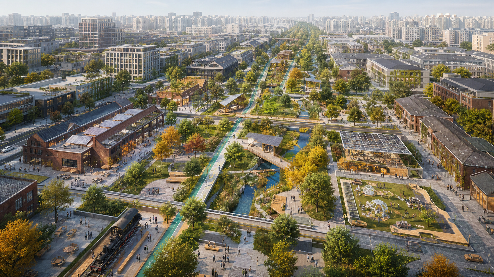

# Jing-Zhang Learning Commons

> **Design judgment:** rather than producing another symbolic AI axis, the proposal turns railway heritage into public learning infrastructure: visible trials, open evaluation, human review, and reversible deployment.

## Design Basis and Source List

The proposal uses the official open-call notice, the maintained site package, registered public sources, and provisional geometry. It treats every unverified control as pending official data and keeps a reproducible recalculation path. [source:OFFICIAL-ANNOUNCEMENT]

## Three-Level Scope Framework

Work is coordinated at 43.6 km² research scale, 11.4 km² overall-design scale, and 368.4 ha key-area scale. The submitted polygon is a rough temporary constraint, never an official redline. [data:geometry/site_boundary.geojson#PROV-SITE-001] [metric:site_area_sqm]

## Coordinated Research Area: Industry and Future City Research

The core proposition is a learning commons: AI production, public life, and governance improve through visible trials, open evaluation, human review, and reversible deployment. The corridor connects universities, enterprises, communities, and heritage as a civic learning system. [source:AGENT-TASKBOOK]

## Overall Design Area: Urban Renewal and Regulatory-Plan-Level Urban Design

A continuous heritage-and-green spine organizes cross-corridor links, mixed innovation services, public learning rooms, and phased low-disturbance renewal. FAR, height, ownership, and demolition decisions remain pending statutory and survey inputs. [data:geometry/land_use.geojson#LU-001] [depth:overall_spatial_structure]

## Detailed Design of Key Areas

Zhongzhiyuan becomes a validation-and-governance district; AI Origin becomes an open-source transfer district; Dazhongsi becomes an urban demonstration and international-service district. Each combines mobility, public space, industry, daily services, and an implementable pilot sequence. [data:geometry/key_areas.geojson#PROV-KEY-001] [depth:three_key_area_detailed_design]

## AI Innovation Ecosystem, Personas, and AI+ Scenarios

Five personas—developers, start-ups, enterprise visitors, residents, and university communities—use ten scenario cards. Three validation environments cover model safety, accessible mobility, and civic-service review; data minimization, consent, appeal, and human override are mandatory. [standard:PROJECT-AGENT-OPEN-CALL-TASKBOOK]

## Land Use, Building Scale, and Retain–Renovate–Demolish Strategy

The land-use layer is a complete conceptual partition for spatial review, not a statutory allocation. Existing buildings default to retain-and-audit; renovation or replacement requires ownership, structural, heritage, carbon, and community checks. [data:geometry/buildings.geojson#BLDG-001] [depth:retain_renovate_demolish]

## Transport, Rail, Municipal Infrastructure, and Public Services

The proposal prioritizes walking, cycling, accessible crossings, metro interchange, bicycle parking, and service logistics. Municipal and edge-compute nodes are modular and must pass energy, fire, security, privacy, and maintenance review. [data:geometry/roads.geojson#ROAD-001] [depth:traffic_rail_slow_parking]

## Blue-Green Network, Public Space, and Urban Character

Railway heritage, the Qinghe and Xiaoyuehe systems, rain gardens, shaded routes, and civic plazas form one everyday public realm. A restrained material palette and reusable components avoid spectacle and preserve cultural legibility. [data:geometry/green_space.geojson#GREEN-001] [metric:green_ratio]

## Renewal Projects, Implementation Policy, and Phasing

Phase 1 uses reversible pilots and evidence collection; Phase 2 repairs crossings and adapts buildings after professional confirmation; Phase 3 establishes long-term operations. Every project has dependencies, stop conditions, and evaluation indicators. [data:geometry/phasing.geojson#PHASE-001] [depth:phasing_implementation]

## Metrics, Area Recalculation, and Compliance Matrix

Known figures are recomputed from submitted GeoJSON in EPSG:4548. Unknown statutory or operating indicators remain explicitly pending. Structured matrices provide exhaustive coverage while prose explains design consequence. [metric:public_space_ratio] [depth:metrics_recalculation]

## Risk, Copyright, and Compliance

This is an AI-generated concept, not an approved plan or observed site record. The generated cover is narrative-only; all factual claims rely on registered sources. Official geometry, controls, ownership, utilities, heritage, and feasibility require professional confirmation. [data:geometry/constraints.geojson#CONSTRAINTS] [depth:risk_missing_data]

## References

The complete bibliography and licenses are in sources.json and copyright_statement.md; the site package, official notice, standards snapshots, assumptions, metrics, and matrices form the audit layer. [source:SITE-PACKAGE]
