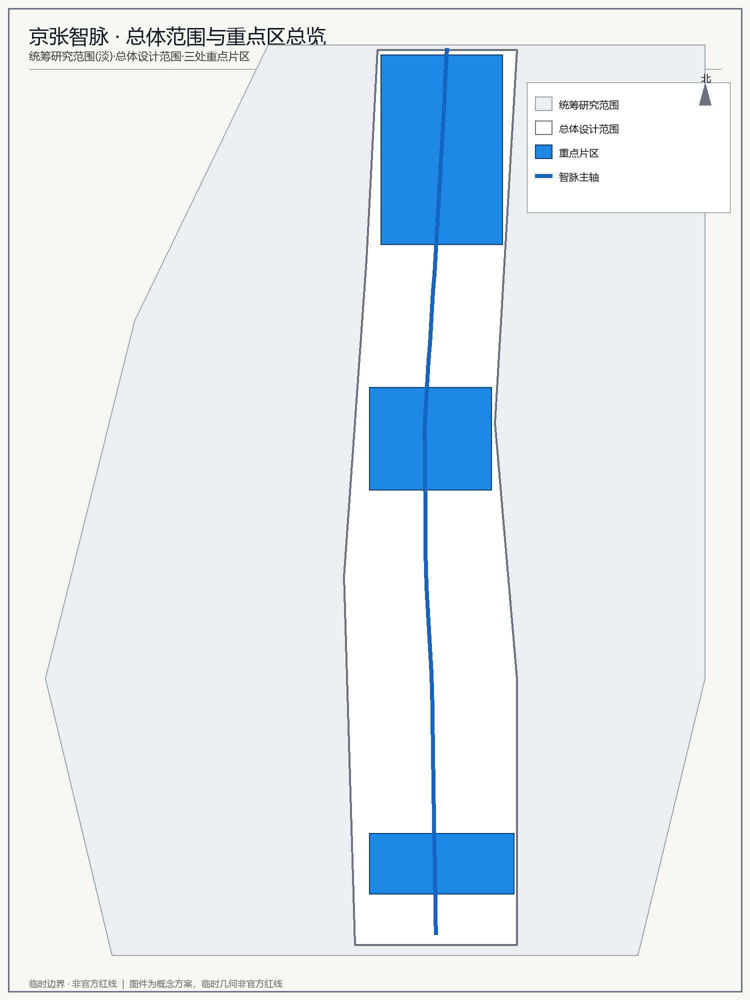
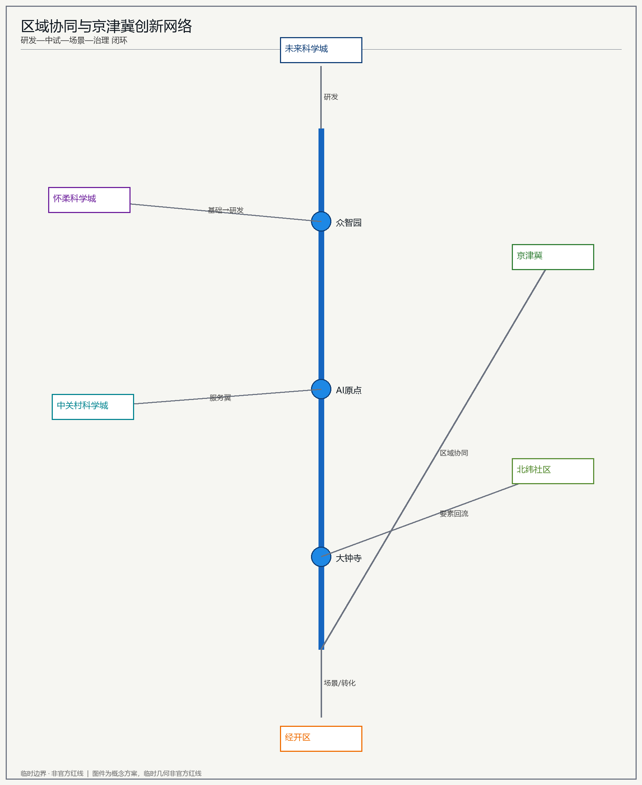
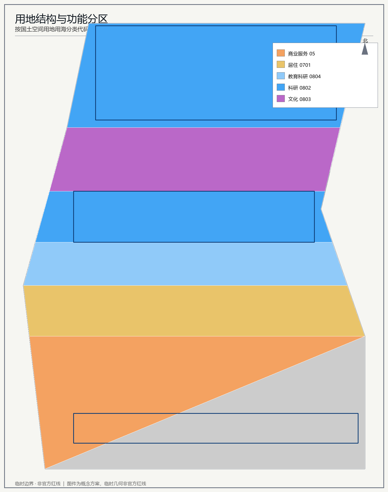
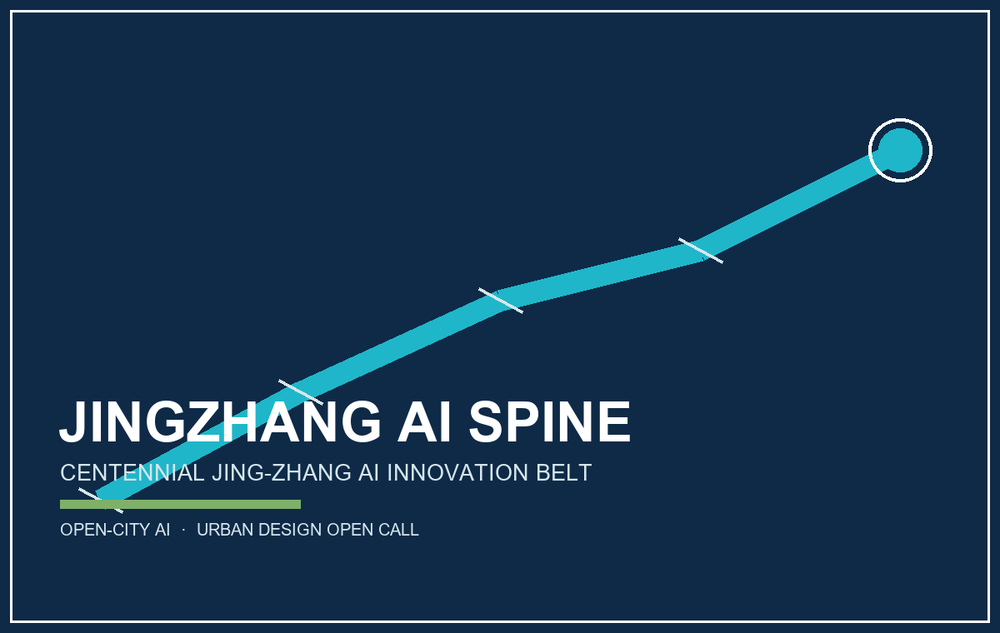
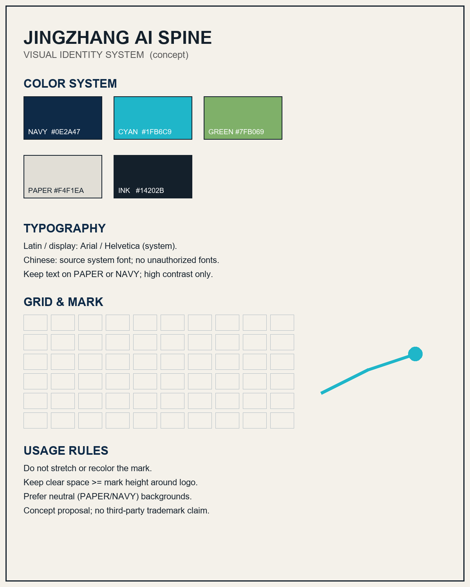
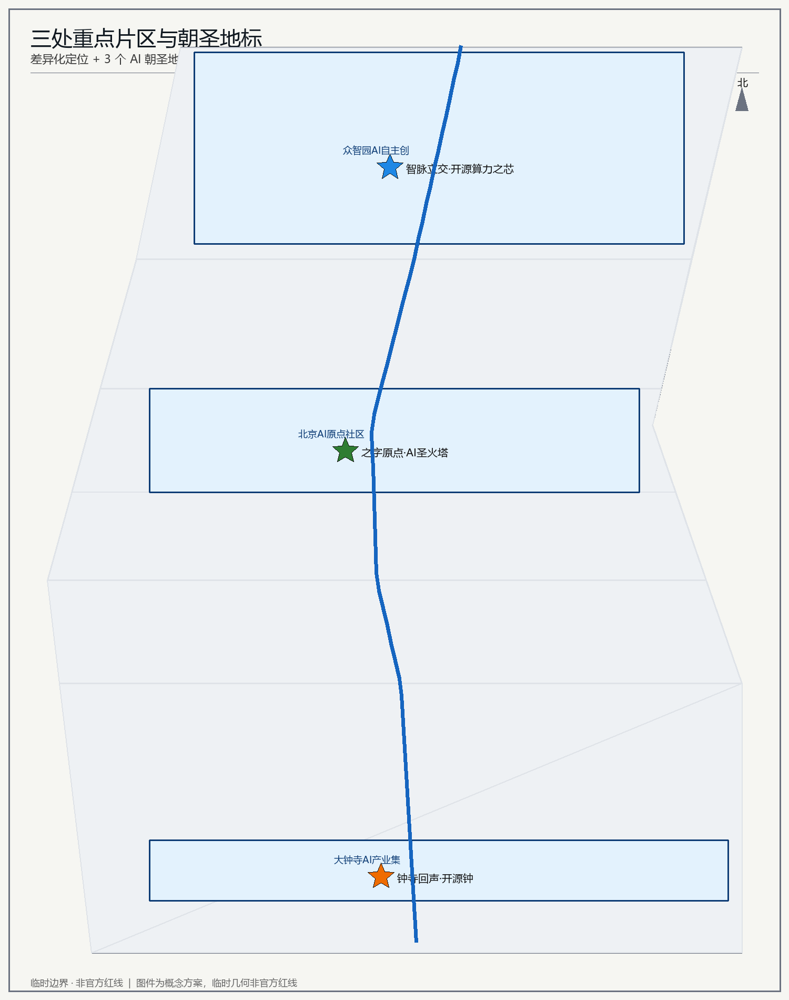
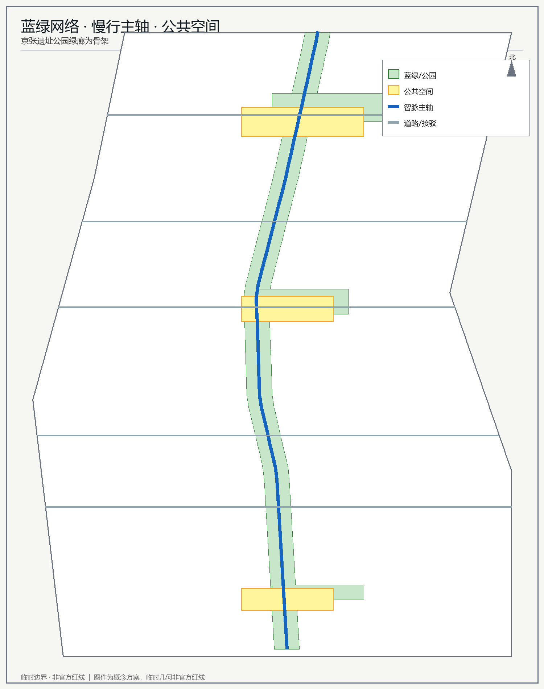
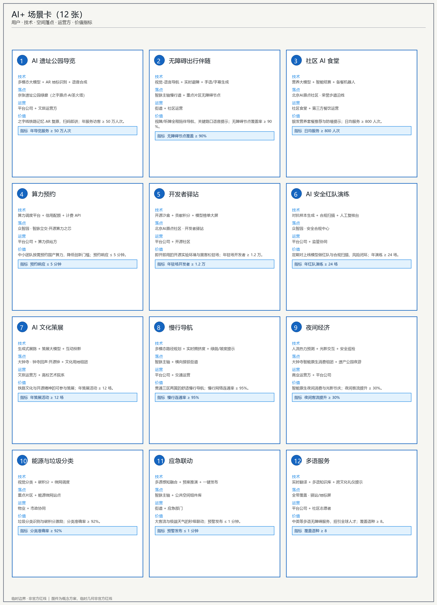
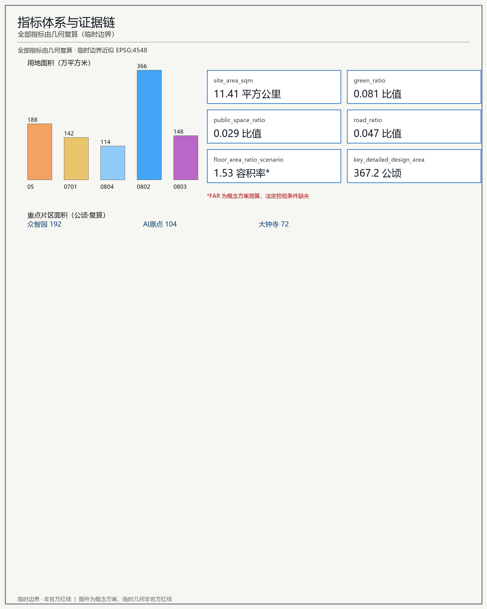

# 京张智脉 · 百年京张AI创新带城市设计概念方案

> **核心主张**：以"百年铁路之脊，承 AI 时代之脉"为母题，把京张遗址公园绿廊塑造为一条贯通南北的**智脉（AI Spine）**——它既是文化遗产的绿色脊柱，也是 AI 创新生态、场景体验与全球人才流动的城市活力带。所有空间建议均为概念建议、参考方案，可供专业团队深化研究 [standard:PROJECT-AGENT-OPEN-CALL-TASKBOOK]。

## 设计依据与资料清单

本方案依据《百年京张AI创新带城市设计国际方案征集资格预审公告》的项目范围、三区两翼与任务要求 [source:SRC-2026-BJ-GH-QUAL-PREANNOUNCEMENT]，结合面向全球智能体的任务书 [source:SRC-2026-0518-AGENT-OPEN-CALL-TASKBOOK]、海淀区"1+X+1"产业体系 [source:SRC-2026-HAIDIAN-1X1] 与"三区两翼"背景 [source:SRC-2026-BJ-KW-THREE-AREAS-WINGS] 编制。

空间范围采用仓库维护者提供的**临时粗略边界**（PROV-SITE-001 / KEY-001~003），为 agent 生成与 intake 自检之用，不得作为官方红线或精确面积依据 [data:geometry/site_boundary.geojson#SITE-001] [assumption:A-GEO-001]。法定控规条件（容积率、建筑高度、绿地率、退线等）未纳入清权资料包，本方案相关数值为概念测算 [assumption:A-CTRL-001]。

## 三层范围工作框架

- **统筹研究范围** 43.6 km²：北至北五环路、东至京藏高速、南至西直门外大街、西至万泉河路，作为区域战略背景框架 [source:SRC-2026-BJ-GH-QUAL-PREANNOUNCEMENT]。
- **总体设计范围** 11.41 km²（临时边界复算值；公告约 11.4 km²）：以京张遗址公园周边 1–2 公里城市与产业地区为设计对象 [metric:site_area_sqm] [data:geometry/site_boundary.geojson#SITE-001]。
- **重点区域范围** 367.19 ha：自北向南为众智园AI自主创新加速区（约 192.1 ha）、北京AI原点社区（约 104.3 ha）、大钟寺AI产业集聚区（约 72.0 ha）[metric:key_detailed_design_area] [data:geometry/key_areas.geojson#KEY-zhongzhiyuan_ai_acceleration_area]。

临时边界以淡色虚线标注，强调设计意图而非法定红线 [depth:DD-02]。

## 统筹研究范围产业与未来城市研究

在 43.6 km² 统筹研究层，方案对接**北纬社区、未来科学城、怀柔科学城、经开区及京津冀**创新协同，提出"空间—产业"融合框架：以京张智脉为创新主轴，联动中关村科学城存量创新资源与海淀"1+X+1"产业体系 [source:SRC-2026-HAIDIAN-1X1]。该层聚焦区域创新网络与产业外溢的空间承载，识别京张智脉向北衔接未来科学城、向南联动经开区的廊道机会，形成"研发—中试—场景—治理"的区域闭环 [depth:DD-01]。此层仅作战略背景，不展开法定规划判断；相关面积与边界以临时几何复算，待官方区域规划校核 [assumption:A-GEO-001] [data:geometry/site_boundary.geojson#SITE-001]。

### 区域协同节点与流向

以京张智脉为创新主轴，向北衔接未来科学城、向南联动经开区，并向怀柔科学城、中关村科学城、京津冀与北纬社区辐射，形成"研发—中试—场景—治理"的区域闭环 [depth:DD-01] [source:SRC-2026-BJ-KW-THREE-AREAS-WINGS]。节点—流向关系如下：

| 区域节点 | 与智脉关系 | 协同内容 | 流向标签 |
| --- | --- | --- | --- |
| 未来科学城（北） | 研发策源 | 基础研究与大科学装置外溢 | 基础→研发 |
| 怀柔科学城 | 基础研究供给 | 大科学装置与算力协同 | 基础→研发 |
| 中关村科学城 | 存量创新中枢 | 要素配置与科技服务翼 | 服务翼 |
| 经开区（南） | 场景转化 | 中试—场景—产业落地 | 场景/转化 |
| 京津冀 | 区域协同 | 产业链与人才协同 | 区域协同 |
| 北纬社区 | 未来城市 | 未来城市试验场景 | 要素回流 |
| 三处重点片区 | 智脉主轴节点 | 研发—中试—场景—治理闭环 | 主轴闭环 |

## 总体设计范围城市更新与控规深度城市设计

### 一带总体概念与功能统筹（agent.1）

**主名称**：**京张智脉（Jing-Zhang AI Spine）**。英文名称 Jing-Zhang AI Spine；命名体系为"**一带·三区·两翼·九节点**"。

**Logo 方向**：以京张铁路标志性"**人字形/之字形**"折返线（詹天佑之字线）为母题，演化为一条贯穿南北的"智脉"曲线；曲线上分布的节点如神经元突触，象征 AI 创新网络的连接与激活；配色取**铁轨钢灰 + 遗产公园绿 + AI 蓝** [depth:DD-06]。该标识体系仅作视觉方向，未使用任何受版权保护的字体、图片或商标 [standard:PROJECT-AGENT-OPEN-CALL-TASKBOOK]。

**三定位**：百年京张文化带 / 都市AI生活体验带 / AI融合创新带。**五功能**：AI全栈自主创新体系、世界级AI创新生态、AI+场景赋能新范式、智能化AI活力城市、AI治理全球话语权。**三区两翼协同回路**：三区（北京AI原点社区、众智园AI自主创新加速区、大钟寺AI产业集聚区）承载核心功能，两翼（中关村科技服务翼、小月河场景赋能翼）提供要素配置与场景赋能，沿智脉主轴形成"研发—转化—体验—治理"闭环 [depth:DD-03]。

## 视觉识别系统（Logo / VI 方向）

将"一带总体概念与功能统筹（agent.1）"中的 Logo 方向落实为实际视觉识别（VI）系统。主名称 **京张智脉（Jing-Zhang AI Spine）** 的中文命名保留"百年铁路之脊、AI 时代之脉"的意象；英文标识用于国际传播，避免使用未经授权的字体、图片或商标 [standard:PROJECT-AGENT-OPEN-CALL-TASKBOOK]。

**核心标志**：以京张铁路"人字形/之字形"折返线为母题，抽象为一条向上生长的"智脉"曲线；曲线上的节点如神经元突触，象征 AI 创新网络的连接与激活；色彩取自铁路钢灰、遗产公园绿与 AI 青 [depth:DD-06]。

**VI 色彩与字用方向**：主色深铁路蓝 #0E2A47，强调 AI 青 #1FB6C9，辅助色遗产绿 #7FB069，纸色 #F4F1EA，墨黑 #14202B。英文 / Latin 使用 Arial / Helvetica 等系统字体；中文使用系统默认黑体，不使用任何未授权字体 [standard:PROJECT-AGENT-OPEN-CALL-TASKBOOK]。

**导视标识符号系统**：以智脉曲线为母题，在绿廊与三重点区设置连续导视——地面刻印、交互屏、节点柱与骑楼吊牌统一使用"之字线段 + 节点圆点"符号，形成从铁路遗产到 AI 新文化的可识别叙事 [depth:DD-06] [data:visual/assets/landmarks.json#L-01]。

## 用地、建筑规模与拆改留方案

用地分区采用自然资源部用地用海分类代码 [standard:MNR-LAND-USE-CLASSIFICATION-GUIDE]。总体设计范围内形成商业服务（05）、居住（0701）、教育科研配套（0804）、科研（0802）、文化（0803）的功能混合结构 [metric:land_use_area_by_code] [data:geometry/land_use.geojson#LU-01]。建筑以概念落位表达拆改留逻辑：现状保留（retain）、改造提升（renovate）、拆除重建（demolish_rebuild）、新建（new_build），具体地块拆改留须由专业团队在法定条件下深化 [depth:DD-07] [data:geometry/buildings.geojson#B-001]。

容积率、建筑密度等法定指标缺失，以下为概念方案测算（非法定）：整体容积率约 1.5、建筑密度约 0.4，待法定控规条件确认后复算 [metric:floor_area_ratio_scenario] [assumption:A-CTRL-001]。

## 重点区域详细设计

三处重点片区差异化定位，均完成概念详细设计 [depth:DD-11]。

- **众智园AI自主创新加速区**（北，约 192.1 ha）：承载 AI 全栈自主体系与 AI 治理全球话语权。以"算力之芯广场"为节点，组织芯片—框架—模型—应用全栈创新链 [data:geometry/key_areas.geojson#KEY-zhongzhiyuan_ai_acceleration_area]。
- **北京AI原点社区**（中，约 104.3 ha）：世界级AI创新生态。以"荣誉步道广场"组织开放实验室、人才公寓与社区服务，呼应中关村AI起源 [data:geometry/key_areas.geojson#KEY-beijing_ai_origin_community]。
- **大钟寺AI产业聚集区**（南，约 72.0 ha）：智能原生新业态。以"开源钟广场"组织智能原生消费与商务 [data:geometry/key_areas.geojson#KEY-dazhongsi_ai_industry_cluster]。

## AI 创新生态、人才画像与 AI+ 场景

### AI全栈自主创新体系与世界级AI创新生态（agent.2）

精选 **6 个全球AI创新生态案例**作为借鉴：韩国板桥科技谷（产业链集群）[source:SRC-2026-INTL-PANGYO]、法国 Station F（全球最大创业园区）[source:SRC-2026-INTL-STATIONF]、新加坡 Punggol 数字区（数字政府+产业）[source:SRC-2026-INTL-PUNGGOL]、荷兰埃因霍温 Brainport（AI+制造）[source:SRC-2026-INTL-BRAINPORT]、加拿大多伦多 Waterfront（智慧城区试验）[source:SRC-2026-INTL-QUAYSIDE]、中国深圳河套（深港科创）[source:SRC-2026-INTL-HETAO]。其共性经验进入"**AI创新生态图谱**"：高校院所—龙头企业—初创—资本—算力—数据—场景—政府—社区九类主体联动 [depth:DD-03]。

- **众智园全栈自主体系**：以开源芯片、自主框架、国产大模型、行业应用构成全栈链条。
- **北京AI原点社区创新生态**：开放实验室+开发者驿站+人才公寓构成"居住—研发—社交"闭环。
- **中关村科技服务翼**：提供 IP、资本、法律、人才等要素全球化配置 [depth:DD-04]。

### AI+场景赋能新范式与智能化AI活力城市（agent.3）

形成 **12 张 AI 场景卡**，完整版见下文《AI+ 场景卡（12 张完整版）》一节 [depth:DD-10]；每个场景明确用户、技术、空间落点与运营方，并给出可量化价值指标。

**3 个产业测试验证场景**：①低速无人接驳/自动驾驶测试道 ②AI医疗影像与健康验证中心 ③服务机器人巡检测试场。测试场景明确为"测试验证"而非已批准运营 [standard:PROJECT-AGENT-OPEN-CALL-TASKBOOK]。

**6 类用户画像**：青年AI研究员、连续创业者、全球开发者、银发居民、亲子家庭、国际访客/朝圣者；另含城市管理者与数据标注师。场景设计尊重隐私与人工复核边界，不依赖非公开数据或指定供应商 [depth:DD-08]。

### 用户画像与场景-空间-运营映射（≥5 类）

依据任务书"不少于 5 类用户画像，并说明场景-空间-运营映射"的要求，本方案建立 **6 类核心用户画像**：青年 AI 创业者、高校科研人员、龙头企业技术决策者、社区居民与日常访客、城市治理者与安全运维、国际人才与访客 [data:visual/assets/personas.json#P-01]。

| 画像 | 核心诉求 | 主场景 | 空间落点 | 运营机制 |
| --- | --- | --- | --- | --- |
| 青年 AI 创业者（P-01） | 算力、空间、资本对接 | SC-04 算力预约 / SC-05 开发者驿站 / SC-12 多语服务 | 众智园·开源算力之芯 / 原点社区·开发者驿站 | 预约算力、入驻驿站、参与周路演 |
| 高校科研人员（P-02） | 合规沙箱、联合算力 | SC-04 算力预约 / SC-06 AI 安全红队演练 | 众智园·安全合规中心 | 提交模型、使用沙箱、成果开源 |
| 龙头企业技术决策者（P-03） | 场景共建、品牌联名 | SC-07 AI 文化策展 / SC-09 夜间经济 | 大钟寺·开源钟 / 智能原生消费组团 | 策展联名、夜间试运营、进入荣誉墙 |
| 社区居民与日常访客（P-04） | 无障碍、食堂、慢行 | SC-02 无障碍出行伴随 / SC-03 社区 AI 食堂 / SC-08 慢行导航 | 原点社区·荣誉步道 / 智脉主轴 | 出行伴随 App、食堂取餐、慢行导航 |
| 城市治理者与安全运维（P-05） | 安全、能源、应急 | SC-06 安全红队 / SC-10 能源与垃圾分类 / SC-11 应急联动 | 全带公共空间组件库 | 红队演练、微网接入、应急演练 |
| 国际人才与访客（P-06） | 多语、导览、地标打卡 | SC-01 AI 遗址公园导览 / SC-12 多语服务 / SC-08 慢行导航 | 绿廊·之字原点·AI 圣火塔 | AI 导览、多语屏、打卡点串联 |

映射强调"场景-空间-运营"闭环：每类用户至少对应 1 个产业测试场景或地标节点，运营机制明确为"概念建议"而非已批准服务 [data:visual/assets/personas.json#mapping_table_zh] [standard:PROJECT-AGENT-OPEN-CALL-TASKBOOK]。

### AI公共空间、智能原生新业态与朝圣地标（agent.4）

京张遗址公园作为南北活力带，承担东西缝合与南北贯通；大钟寺发展智能原生消费与商务 [data:geometry/green_space.geojson#GREEN-SPINE]。

**3 个 AI 朝圣地标**：①**之字原点·AI圣火塔**（北京AI原点社区）②**智脉立交·开源算力之芯**（众智园）③**钟寺回声·开源钟**（大钟寺）。配套**荣誉展示体系**：沿遗产公园的"荣誉步道"展示贡献者铭牌、模型榜单与基准看板；**公共空间组件库**含可复用驿站、屏幕、座椅模块 [depth:DD-10] [data:geometry/public_space.geojson#PUB-001]。地标避免过度娱乐化、网红化与低俗化 [standard:PROJECT-AGENT-OPEN-CALL-TASKBOOK]。

### AI 朝圣地标、荣誉展示体系与公共空间组件库（完整版）

在"AI公共空间、智能原生新业态与朝圣地标（agent.4）"基础上，进一步展开为 **4 个 AI 朝圣地标**、**1 套荣誉展示体系**与 **7 类公共空间组件**，可直接被专业团队转化为展陈与施工图深化 [data:visual/assets/landmarks.json#L-01]。

**朝圣地标（≥3 个）**：
- **L-01 之字原点·AI 圣火塔**（京张遗址公园绿廊）：以京张铁路"人字形"折返线为母题的轻型观景塔，塔顶光焰随一带算力/碳排数据呼吸，是视觉原点与国际访客打卡点 [data:visual/assets/landmarks.json#L-01]。
- **L-02 中关村原点广场·开源之芯**（北京 AI 原点社区）：圆形开源算力展亭与开发者驿站前场，实时展示开源模型贡献榜，是创业者聚集原点 [data:visual/assets/landmarks.json#L-02]。
- **L-03 智脉立交·开源算力之芯**（众智园）：慢行立交节点上的透明"算力之芯"，公众可看见算力被谁、为何预约，体现开源与可复核 [data:visual/assets/landmarks.json#L-03]。
- **L-04 钟寺回声·开源钟**（大钟寺）：以古钟回声为意象的声光装置，企业开源贡献可触发钟声与投影，锚定夜间经济与文化策展 [data:visual/assets/landmarks.json#L-04]。

**荣誉展示体系**：沿绿廊与三重点区设置"荣誉步道"——地面刻印、低柱屏、开源贡献墙记录开发者、企业、社区与治理者的公开贡献，匿名可复核、可延续 [data:visual/assets/landmarks.json#HONOR-01]。

**公共空间组件库**（可复用、模块化）：智能座椅、光伏廊架、交互导视屏、生态滞留带、慢行桥、互动地面、开源算力之芯展亭。每个组件标明适用场景、技术接口与运维接口，便于在三重点区批量复用 [data:visual/assets/landmarks.json#C-01] [data:geometry/public_space.geojson#PUB-001]。

所有地标与组件均为概念建议，不改造文保本体、企业建筑或权属空间，不涉及桥隧、地下空间工程可行性结论 [standard:PROJECT-AGENT-OPEN-CALL-TASKBOOK]。

## AI+ 场景卡（12 张完整版）

12 张场景卡贯通"用户—技术—空间—运营—指标"，构成可落地的 AI 赋能图谱；图示总览如下 [depth:DD-10] [data:geometry/public_space.geojson#PUB-001]。

| 编号 | 场景 | 用户画像 | 技术栈 | 空间落点 | 运营方 | 价值指标 |
| --- | --- | --- | --- | --- | --- | --- |
| SC-01 | AI 遗址公园导览 | 国际访客 / 亲子家庭 | 多模态大模型 + AR 地标识别 + 语音合成 | 京张遗址公园绿廊（之字原点·AI圣火塔） | 平台公司 + 文旅运营方 | 年导览服务 ≥ 50 万人次 |
| SC-02 | 无障碍出行伴随 | 银发居民 / 残障人士 | 视觉-语言导航 + 实时避障 + 手语/字幕 | 智脉主轴慢行道 + 重点片区无障碍节点 | 街道 + 社区运营 | 无障碍节点覆盖 ≥ 90% |
| SC-03 | 社区 AI 食堂 | 银发居民 / 亲子家庭 | 营养大模型 + 智能结算 + 备餐机器人 | 北京AI原点社区·荣誉步道沿线 | 社区食堂 + 第三方餐饮 | 日均服务 ≥ 800 人次 |
| SC-04 | 算力预约 | 青年AI研究员 / 连续创业者 | 算力调度平台 + 信用配额 + 计费 API | 众智园·智脉立交·开源算力之芯 | 平台公司 + 算力供给方 | 预约响应 ≤ 5 分钟 |
| SC-05 | 开发者驿站 | 全球开发者 | 开源沙盒 + 贡献积分 + 模型榜单大屏 | 北京AI原点社区·开发者驿站 | 平台公司 + 开源社区 | 年驻场开发者 ≥ 1.2 万 |
| SC-06 | AI 安全红队演练 | 城市管理者 / 数据标注师 | 对抗样本生成 + 合规扫描 + 人工复核台 | 众智园·安全合规中心 | 平台公司 + 监管协同 | 年红队演练 ≥ 24 场 |
| SC-07 | AI 文化策展 | 亲子家庭 / 国际访客 | 生成式展陈 + 策展大模型 + 互动投影 | 大钟寺·钟寺回声·开源钟 + 文化用地组团 | 文旅运营方 + 高校艺术院系 | 年策展活动 ≥ 12 场 |
| SC-08 | 慢行导航 | 全龄人群 | 多模态路径规划 + 实时拥挤度 + 绿荫/坡度 | 智脉主轴 + 横向接驳街道 | 平台公司 + 交通运营 | 慢行连通率 ≥ 95% |
| SC-09 | 夜间经济 | 连续创业者 / 亲子家庭 | 人流热力预测 + 光影交互 + 安全巡检 | 大钟寺智能原生消费组团 + 遗产公园夜游 | 商业运营方 + 平台公司 | 夜间客流提升 ≥ 30% |
| SC-10 | 能源与垃圾分类 | 全龄人群 / 城市管理者 | 视觉分类 + 碳积分 + 微网调度 | 重点片区 + 能源微网站点 | 物业 + 市政协同 | 分类准确率 ≥ 92% |
| SC-11 | 应急联动 | 城市管理者 / 全龄人群 | 多源感知融合 + 预案推演 + 一键发布 | 智脉主轴 + 公共空间组件库 | 街道 + 应急部门 | 预警发布 ≤ 1 分钟 |
| SC-12 | 多语服务 | 国际访客 / 全球开发者 | 实时翻译 + 多语知识库 + 跨文化礼仪 | 全带覆盖·驿站/地标屏 | 平台公司 + 社区志愿者 | 覆盖语种 ≥ 8 |

场景设计尊重隐私与人工复核边界，不依赖非公开数据或指定供应商 [depth:DD-08]。完整结构化数据见 `visual/assets/scenarios.json`。

## 交通、轨道、市政与公共服务设施

以"**智脉主轴**"组织慢行+公交骨架，沿绿廊串联三区两翼；横向接驳街道连通东西两翼，形成"一轴多联"的交通组织模式 [data:geometry/roads.geojson#ROAD-SPINE]。轨道接驳依托既有轨道交通站点（五道口、知春路、大钟寺等）做一体化衔接概念，具体线位/站址非工程方案，仅作交通可达性背景判断 [depth:DD-08]。市政新基建提出算力网络、数字孪生平台与能源微网策略，负荷与容量须由专业测算确认 [assumption:A-CTRL-001]；道路空间占比约 4.7%，慢行网络密度按概念方案预留 [metric:road_ratio]。公共服务设施沿智脉主轴与重点片区均衡布局，补齐社区级服务短板，提升公共空间可达性 [metric:public_space_ratio]。

## 蓝绿空间、公共空间与城市风貌

蓝绿系统以京张遗址公园绿廊为骨架，叠加口袋公园与广场节点，形成连续贯通的绿色网络，临时测算绿地率约 0.0808、公共空间率约 0.03，待官方绿地系统确认 [metric:green_ratio] [metric:public_space_ratio] [data:geometry/green_space.geojson#GREEN-SPINE]。蓝绿空间强调遗产公园的南北缝合与东西渗透，串联重点片区公共活动 [data:geometry/public_space.geojson#PUB-001]。城市风貌以"之字母题+钢灰/遗产绿/AI蓝"色彩体系，统筹建筑高度、体量、风格与色彩控制，塑造统一而可识别的 AI 创新带形象 [standard:MOHURD-URBAN-DESIGN-MEASURES] [depth:DD-06]。

## 百年京张文化、中关村文化与AI新文化融合叙事（agent.5）

构建**空间文化系统**：①**铁路记忆轴**（之字形折返线遗址）②**创新叙事环**（中关村起源—AI现状—未来）③**开源符号系统**（之字标识、钢轨纹理、神经元节点）。导视与符号系统与一带整体 Logo 区分，不混淆 [depth:DD-06]。国际传播叙事强调"从詹天佑的之字线，到今天的智脉"——中国自主创新的代际接力 [source:SRC-2026-0518-AGENT-OPEN-CALL-TASKBOOK]。

## 更新项目清单、实施政策与分期计划

按**近/中/远三期**组织更新项目与场景开放：近期（大钟寺+AI原点启动区）落地开源钟广场、荣誉步道与首批场景，形成示范引爆点；中期（城市更新与场景赋能区）推进智脉主轴与公共空间，完善慢行与公共服务；远期（众智园全栈自主加速区）建设算力之芯与全栈链条，构建自主创新体系 [depth:DD-13] [data:geometry/phasing.geojson#PHASE_1]。实施政策强调"概念建议、参考方案"，不与土地权属、投资测算或审批判断混同，所有项目为概念设想而非已确定安排 [assumption:A-CTRL-001]。分期面积按临时几何复算，近期约 323.7 ha、中期约 147.8 ha、远期约 242.4 ha [metric:phasing_area]。

## 分期实施 · RACI 与 KPI

按近/中/远三期组织更新项目与场景开放 [depth:DD-13] [data:geometry/phasing.geojson#PHASE_1]。责任矩阵采用 **R（负责）/ A（担责）/ C（咨询）/ I（知会）**，确保实施主体清晰、可追责、可协同。

### 分期 RACI 责任矩阵

| 角色 \ 期 | 近期 P1 | 中期 P2 | 远期 P3 |
| --- | --- | --- | --- |
| 海淀区政府 | A | A | A |
| 属地街道 | R | R | I |
| 平台公司 / 实施主体 | R | R | R |
| 设计团队 | C | C | C |
| 运营商 | R | R | R |
| 社区 / 公众 | I | C | I |
| 高校院所 | C | C | R |

### 分期 KPI 表

| 期 | 关键指标 | 目标 |
| --- | --- | --- |
| 近期 P1 | 开放 AI 场景数 | ≥ 6 个 |
| 近期 P1 | 荣誉步道建成率 | 100% |
| 近期 P1 | 公众满意度 | ≥ 80% |
| 近期 P1 | 智脉主轴示范段 | ≥ 1.5 km |
| 中期 P2 | 慢行网络连通率 | ≥ 95% |
| 中期 P2 | 公共空间可达性提升 | ≥ 30% |
| 中期 P2 | 开放 AI 场景累计 | ≥ 12 个 |
| 中期 P2 | 蓝绿网络贯通率 | ≥ 90% |
| 远期 P3 | 国产算力可用规模 | ≥ 1000 PFLOPS |
| 远期 P3 | 全栈自主链条覆盖 | ≥ 80% |
| 远期 P3 | 国际开源贡献排名 | 全球前 20 |
| 远期 P3 | AI 治理标准提案 | ≥ 3 项 |

完整结构化数据见 `visual/assets/phasing.json`；所有项目为概念设想而非已确定安排，不替代土地权属、投资测算或审批判断 [assumption:A-CTRL-001]。

## 指标体系、面积复算与合规矩阵

全部指标由几何复算，面积按等距投影近似 EPSG:4548（CM117E），存在约 0.1% 误差，须以官方投影工具复算 [metric:site_area_sqm] [assumption:A-AREA-001]。合规覆盖见 `compliance_matrix.json`（公告 1.3/1.4/1.5 与 agent.1–6 全覆盖）、`standard_matrix.json`（5 项强制标准全 addressed）、`design_depth_matrix.json`（15 项核心深度全 complete）[depth:DD-14]。

## 一带全球AI创新活动体系与长期运营（agent.6）

**年度活动体系**：春—京张AI开源节；夏—AI场景马拉松；秋—全球AI治理论坛；冬—AI朝圣者大会。**品牌IP"智脉"**与开发者社区运营：开源贡献积分、模型榜单、黑客松。**场景开放运营**机制：公共场景 API 与沙盒。**国际传播与招引转化**：以活动—社区—场景形成人才/企业/开发者转化通路 [depth:DD-13]。所有活动为概念设想，非已确定安排，不夸大政府承诺或活动效果 [standard:PROJECT-AGENT-OPEN-CALL-TASKBOOK]。

## 风险、版权与合规说明

- **临时几何风险**：边界非官方红线，精确面积/红线待官方数据补齐 [assumption:A-GEO-001]。
- **控规缺失风险**：容积率/高度/密度/绿地率/退线缺失，相关数值为概念测算 [assumption:A-CTRL-001]。
- **数据时效风险**：外部案例与画像为公开资料整理，非实时招商/政策事实 [assumption:A-DATA-001]。
- **版权合规**：未使用受版权保护的字体、图片、商标、肖像或论文图像；生成式媒体仅作概念展示并标注 [standard:GENERATIVE-AI-INTERIM-MEASURES]。

### 字体 / 图像 / 地图 / 代码 / 生成工具 权利台账

为回应版权与合规审查，建立五类资产权利台账（完整结构化数据见 `visual/assets/rights_ledger.json`）：

| 资产类别 | 项目 | 来源 / 许可 | 使用方式 | 权利状态 | 风险 |
| --- | --- | --- | --- | --- | --- |
| 字体 | 微软雅黑 (msyh.ttc) | 系统预装（Microsoft EULA） | 仅本地栅格化 PNG，不分发字体文件 | 合规 | 低 |
| 图像 | 全部方案图件 PNG | AI Agent 本地生成 / CC-BY-4.0 | 概念展示 | 原创·无第三方图 | 低 |
| 地图几何 | 9 GeoJSON | agent 推断（临时 polygon） | 概念底图，official_boundary=false | 临时·待校核 | 中 |
| 代码 | build_*.py | 贡献者自研（MIT 风格） | 本地构建可复现 | 自有 | 低 |
| 生成工具 | PIL / markdown / shapely / pyproj | PyPI 宽松许可 | 本地运行 | 合规 | 低 |
| 生成工具 | WorkBuddy AI Agent | 用户授权 | 概念生成 | 授权 | 低 |

若须嵌入或分发字体，将改用语雀、Source Han（思源）、Noto 等 SIL OFL 开源字体；所有生成式内容依《生成式AI服务管理暂行办法》标注 [standard:GENERATIVE-AI-INTERIM-MEASURES]。

本方案所有内容均为开放共创建议，不替代正式规划，不构成政府审定结论 [standard:PROJECT-AGENT-OPEN-CALL-TASKBOOK]。

## 参考资料

- 资格预审公告（北京市规划和自然资源委员会海淀分局，2026-05-09）[source:SRC-2026-BJ-GH-QUAL-PREANNOUNCEMENT]
- 面向全球智能体任务书摘录（用户清权，2026-05-18）[source:SRC-2026-0518-AGENT-OPEN-CALL-TASKBOOK]
- 仓库临时边界与三处重点区 polygon [source:SRC-PROVISIONAL-BOUNDARIES-2026]
- "三区两翼"打造世界级AI集聚地（北京市科委/中关村管委会，2026-04-03）[source:SRC-2026-BJ-KW-THREE-AREAS-WINGS]
- 海淀区"1+X+1"现代化产业体系（海淀区政府，2026-03-02）[source:SRC-2026-HAIDIAN-1X1]
- 城市设计管理办法（住房城乡建设部）[standard:MOHURD-URBAN-DESIGN-MEASURES]
- 用地用海分类指南（自然资源部）[standard:MNR-LAND-USE-CLASSIFICATION-GUIDE]
