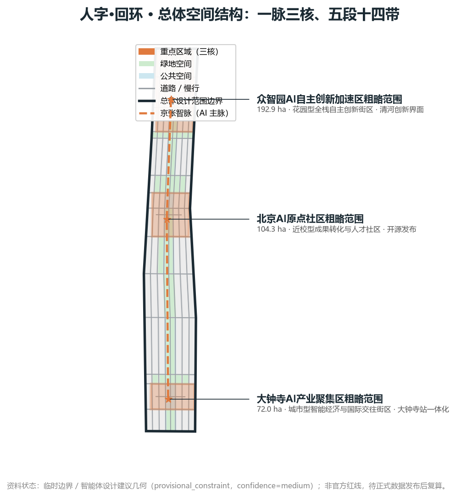
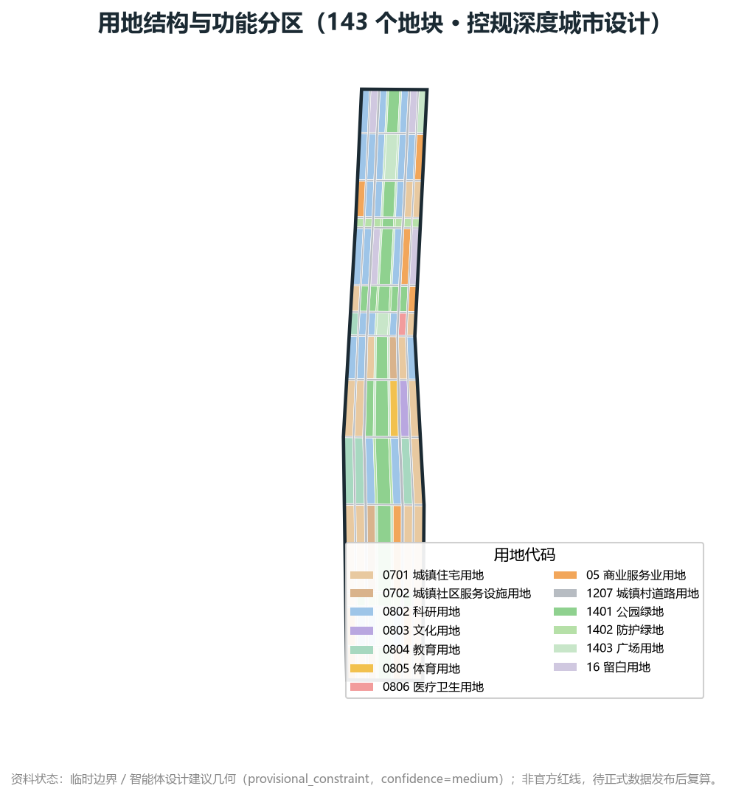
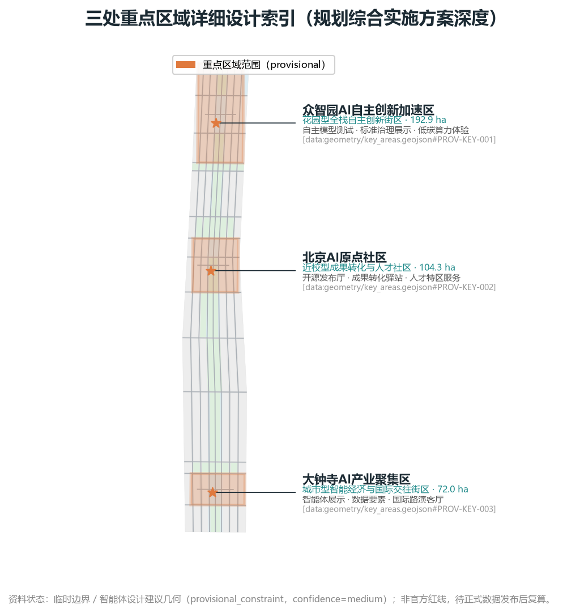
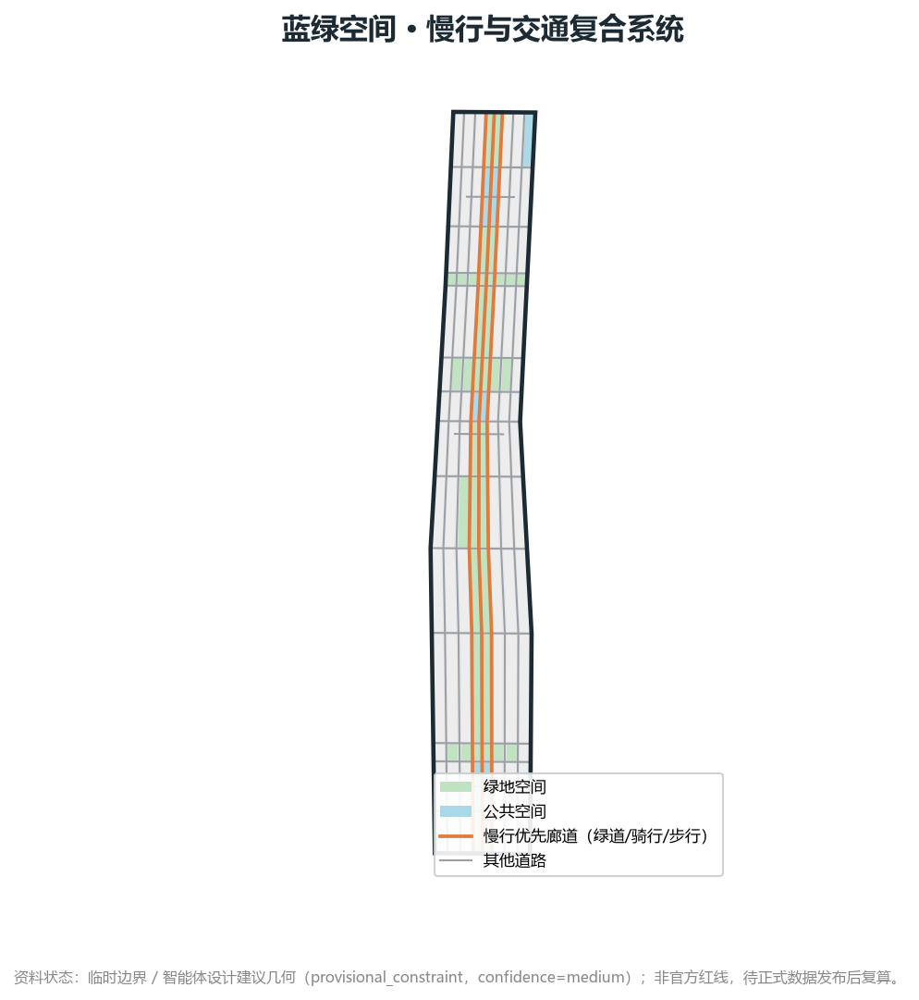
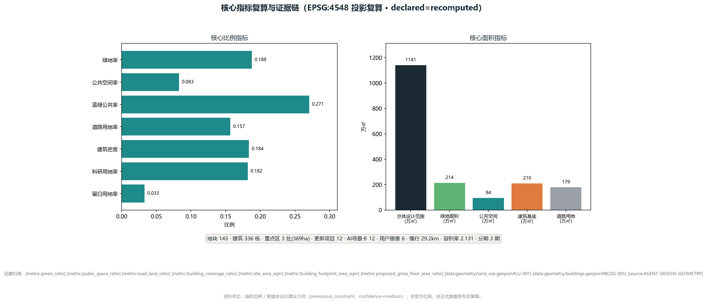

> This package was automatically generated by the WorkBuddy urban-design agent from public sources and the organizer's provisional boundary. All spatial conclusions are design suggestions, to be recalculated once the official boundary is published; they do not replace statutory planning or government-approved documents.

# Human-Loop — Urban Design for the Centennial Jing-Zhang AI Innovation Belt

## Design Basis and Source List

This formal scheme takes the *Pre-qualification Announcement for the International Urban Design Solicitation of the Centennial Jing-Zhang AI Innovation Belt* issued by the Haidian Branch of the Beijing Municipal Commission of Planning and Natural Resources as its primary basis, and uses the maintainer-registered provisional rough boundary, key areas, enumerations, metrics, and source lists in `brief/site-package/` as machine-readable evidence. Before generating the scheme, the AI agent must read `design_brief.json`, `allowed_design_space.json`, `sources.json`, `enums/`, `ranges/`, `schemas/`, `data/source_registry.json`, and `data/processed/agent_fact_pack.md`, and use `project_scope_summary.csv`, `agent_task_requirements.csv`, `source_use_matrix.csv`, and `missing_data_checklist.csv` to build the task, scope, source-use, and gap lists. Every design judgment must be decomposed into traceable sources, recalculable metrics, verifiable layers, and human-reviewable assumptions. The announcement requires the scheme to reach the urban-design depth of a regulatory-detailed plan and of a comprehensive implementation plan; this scheme responds with a conceptual research framework oriented to those depths, and all spatial conclusions are recalculable, reviewable design suggestions that can be replaced after official data is supplied. Therefore narrative text cannot replace GeoJSON, the metrics table, the A3 booklet, the A0 boards, or the HTML exhibit, nor does it replace statutory planning or government-approved documents.

The evidence chain in this section references [source:OFFICIAL-ANNOUNCEMENT], [source:AGENT-TASKBOOK], [source:SITE-PACKAGE], [source:SOURCE-REGISTRY], [source:PROCESSED-FACT-PACK], [source:BOUNDARY-SOURCE], [source:KEY-AREA-SOURCE], [standard:PROJECT-OFFICIAL-ANNOUNCEMENT], [standard:PROJECT-AGENT-OPEN-CALL-TASKBOOK], [standard:MOHURD-URBAN-DESIGN-MEASURES], [standard:MOHURD-CONTROL-DETAILED-PLANNING], [standard:MNR-LAND-USE-CLASSIFICATION-GUIDE], [standard:MOHURD-ARCH-DESIGN-DEPTH-2016], and [depth:existing_conditions_diagnosis], to show that the scheme is not an isolated vision text but is organized from the announcement, the agent open-call taskbook, standards, boundaries, the processed fact pack, and the source list.

Usage boundaries of the source registry:

- `data/source_registry.json` registers the use boundaries of public, cleared, and provisional sources.
- Current registration summary: 5 formal-usable sources, 0 background sources, 1 provisional-only source.
- The agent must not upgrade background_only or provisional_only sources into official boundary, statutory regulatory-detailed plan, formal scoring basis, or government implementation commitment.

`data/processed/agent_fact_pack.md` is a reading-navigation layer for this scheme, not a new authoritative source. [source:PROCESSED-FACT-PACK] only helps the agent organize the three-level scope, the three key areas, the announcement tasks, agent.1–agent.6, source availability, and missing-data items into a readable scheme; all factual judgments still return to [source:OFFICIAL-ANNOUNCEMENT], [source:AGENT-TASKBOOK], [source:SOURCE-REGISTRY], [source:BOUNDARY-SOURCE], and [source:KEY-AREA-SOURCE].

When the official `SITE_BOUNDARY` or the three `KEY_AREA` polygons are not yet available, this scaffold uses `brief/site-package/geometry/provisional_boundaries.geojson` to generate a provisional formal package. The `geometry/site_boundary.geojson` and `geometry/key_areas.geojson` in the submission must both be marked `provisional_constraint`, `official_boundary=false`, and may only be used for scheme generation, self-check, visualization, and design discussion — never as an official redline, approval basis, precise-area basis, or statutory control conclusion. This organizer data gap itself does not block content scoring; after official polygons are substituted, site boundary, key areas, land use, roads, green space, public space, buildings, phasing, and metrics must all be recalculated.

The scorable state generated by this scaffold is: **provisional boundary, with precision caveats retained and recalculation pending official data release; content scoring is not blocked**. Therefore the spatial structure, scenarios, projects, and metrics in the body are written on the principle of "discussable, reviewable, recalculable after replacing the official boundary"; once the official boundary and key-area polygons are updated, the agent must re-run the scaffold, self-check, and drawing/HTML generation, not merely replace a single file.

The readable explanation of the boundary and key areas corresponds to [data:geometry/site_boundary.geojson#SITE-001], [data:geometry/key_areas.geojson#PROV-KEY-001], [metric:site_area_sqm], and [metric:key_area_count]. This means readers can return from the body to the GeoJSON to inspect boundary sources, to the metrics for area recalculation results, and to the sources for provenance — rather than trusting a textual judgment alone. The land-use, building, road, green-space, public-space, phasing, and key-area layers of this scheme are all agent-inferred design-suggestion geometry based on public sources [source:AGENT-DESIGN-GEOMETRY]; their sources, precision, and confidence are itemized in the `source_type`, `confidence`, and `geometry_role` fields of `geometry/*.geojson` and in `assumptions.json`.

## Three-Level Scope Framework

The scheme organizes work along the three tiers defined by the announcement: the coordinated research area concerns the 43.6 km² AI industry ecosystem, strategic positioning, innovation chain, and future urban form; the overall design area concerns the 11.4 km² urban district and industry zone within 1–2 km of the Jing-Zhang Heritage Park, requiring an urban-renewal overall framework, industry spatial layout, transport-municipal support, and urban-character control; the key-area scope concerns the 368.4 ha of three detailed-design districts, requiring clear functional programming, building scale, retain-renovate-demolish classification, public-space connectivity, and transport organization. The three tiers are mapped item-by-item in `compliance_matrix.json`, ensuring every mandatory task in announcement sections 1.3, 1.4, 1.5 and agent.1–agent.6 has corresponding sections, layers, metrics, drawings, and HTML evidence.

The depth items of the three-level framework are constrained by [depth:three_level_scope_framework] and [depth:overall_spatial_structure]; spatial evidence follows [data:geometry/site_boundary.geojson#SITE-001] and [data:geometry/key_areas.geojson#PROV-KEY-001]; the task basis follows [standard:PROJECT-OFFICIAL-ANNOUNCEMENT]; the scope index navigates via the three-level scope table in `project_scope_summary.csv` within [source:PROCESSED-FACT-PACK].

The three-level work is not a collection of disconnected drawings. The coordinated research decides the industry-chain and urban-form judgment; the overall design lands the judgment into renewal projects, spatial structure, and facility capacity; the key-area detailed design verifies the implementability of specific parcels, buildings, transport, public space, and AI-application scenarios. When generating the scheme, the agent must first lock the official or provisional boundary and constraints adopted by the current submission, then generate land use, buildings, roads, green space, public space, phasing, and AI-service nodes, and finally recalculate metrics from these layers and explain in the body which conclusions remain limited by the provisional boundary. Any area, ratio, scale, or project count that cannot be recalculated from structured data must not be written into formal conclusions.

The overall concept proposed here is the "Jing-Zhang Intelligent Spine Symbiosis Belt": with the Jing-Zhang Heritage Park as the historical and public-space main axis, the three key districts — Zhongzhiyuan, Beijing AI Origin Community, and Dazhongsi — as innovation anchors, and universities, enterprises, communities, and rail stations as the daily network, forming a spatial organization of "one belt, three cores, multi-point scenarios, and a blue-green slow-mobility composite loop." Here "one belt" is not an extra redline drawn anew, but a translation of the announcement's three-level scope into a working method; "three cores" correspond to the three key areas; "multi-point scenarios" correspond to operable nodes of AI+ public service, industry service, and urban life; the "composite loop" corresponds to the linkage of slow mobility, green space, public space, and activity routes.

| Tier | Design question | Scheme answer | Data anchor |
| --- | --- | --- | --- |
| Coordinated research area | How to organize the AI industry ecosystem and future urban form | Build an innovation chain of "university sourcing – open-source collaboration – enterprise translation – public experience – international communication" | compliance_matrix.json, standard_matrix.json |
| Overall design area | How industry space, urban renewal, transport-municipal, and character land on the map | Land-use, building, road, green-space, public-space, and phasing layers jointly expressed | [data:geometry/land_use.geojson#LU-001], [data:geometry/roads.geojson#ROAD-001] |
| Key-area scope | How the three districts orient toward a conceptual research framework at detailed-design depth | Each proposes positioning, spatial actions, AI scenarios, and implementation dependencies | [data:geometry/key_areas.geojson#PROV-KEY-001], [data:geometry/key_areas.geojson#PROV-KEY-002], [data:geometry/key_areas.geojson#PROV-KEY-003] |

## Coordinated Research Area: Industry and Future City Research

The core task of the coordinated research area is to build a world-class AI innovation ecosystem. The scheme reviews Haidian's universities and research institutes, leading enterprises, computing/algorithm/data factors, incubation platforms, listed companies, unicorns, and tech-service resources, and proposes a spatial coordination framework of AI innovation chain, industry chain, talent chain, and urban-service chain. The naming scheme and logo design should serve the overall identity of the "Centennial Jing-Zhang Culture Belt, Urban AI Living-Experience Belt, and AI Fusion Innovation Belt," not stop at slogans, and should explain their links to the industry ecosystem, public space, and cultural resources. The agent open-call taskbook also requires responding to the "five major functions" and "three zones, two wings" coordination, forming a naming system, visual identity, overall spatial-structure diagram, scenario opening, and operating mechanism that can be further deepened; this section must mark with [source:AGENT-TASKBOOK] and [standard:PROJECT-AGENT-OPEN-CALL-TASKBOOK] that these requirements come from the agent open call, not from statutory planning control.

The coordinated research does not add pseudo-precise redlines; it returns, through the urban character, public space, and building-layout coordination required by [standard:MOHURD-URBAN-DESIGN-MEASURES], to [data:geometry/land_use.geojson#LU-001], [data:geometry/public_space.geojson#PUBLIC-001], and [depth:overall_spatial_structure], showing that industry strategy ultimately lands on a visible, reviewable spatial structure.

Future urban-form research should answer how AI changes work, life, socializing, learning, transport, and public services. The scheme should land AI transport systems, continuous green space, innovation-service facilities, and an internationalized living-working atmosphere into locatable functional zones, nodes, corridors, and scenarios, rather than vaguely describing a technology vision. The agent should write industry-strategy metrics, AI innovation index, talent density, spatial-supply types, and AI+ vertical application focus zones into the metrics system, and mark which are official, which are design suggestions, and which still await formal-data calibration. If proposing global AI innovation activities, developer communities, open scenarios, or pilgrimage routes, they should be written as "concept suggestions / reference schemes / available for professional teams to deepen," never as already-decided government activities or implementation arrangements.

## Overall Design Area: Urban Renewal and Regulatory-Plan-Level Urban Design

The overall design area task requires reaching the urban-design depth of a regulatory-detailed plan; this scheme responds with a conceptual research framework oriented to that depth (not a statutory approved product), and proposes the urban-renewal overall spatial structure, low-efficiency-space identification, renewal-project list, implementation-policy suggestions, industry-function ratio, spatial-organization pattern, total building scale, and comprehensive carrying-capacity assessment. `geometry/land_use.geojson` should fully cover the design boundary without overlap; `geometry/buildings.geojson` should express renewal or retained building footprints; `geometry/roads.geojson` should express micro-circulation, slow mobility, and rail-interchange relations; `metrics.json` should recalculate core areas, ratios, and layer counts.

This section decomposes regulatory-plan-depth content into reviewable objects per [standard:MOHURD-CONTROL-DETAILED-PLANNING]: [data:geometry/land_use.geojson#LU-001] expresses land-use structure, [data:geometry/buildings.geojson#BLDG-001] expresses building footprints, [data:geometry/roads.geojson#ROAD-001] expresses transport organization, [metric:building_footprint_area_sqm] is used to verify building footprint area, and [depth:land_use_layout] and [depth:development_intensity_controls] constrain the output depth.

The overall design must also support transport, rail, municipal, and supporting facilities. The scheme should propose spatial layouts and implementation paths around rail-station integration, road micro-circulation, non-motorized parking, parking supply, innovation-service platforms, talent living services, new infrastructure, distributed energy, and edge computing. Content involving building height, development intensity, road redlines, setback, and facility standards, where official control conditions are not yet available, should be written as "pending confirmation of formal regulatory-detailed-plan conditions," and must not use agent estimates to impersonate approved indicators.

## Detailed Design of Key Areas

Detailed design of the key areas is mandatory. Zhongzhiyuan AI Autonomous-Innovation Acceleration Zone should propose detailed schemes around the national AI platform, full-stack autonomous innovation, standard-setting, safety governance, industry showcase, external transport, Qinghe culture, low-carbon green innovation interaction environment, and green-space AI scenarios. Beijing AI Origin Community should propose detailed schemes around near-campus innovation, achievement incubation and translation, talent zone, open-source system, brand activities, building retain-renovate-demolish, achievement showcase and release, living-support amenities, campus-park slow-mobility linkage, and rail-station integration. Dazhongsi AI Industry Cluster should propose detailed schemes around leading enterprises, agents, intelligent terminals, content consumption, data factors, digital assets, commercial services, planned-green-space composite use, Dazhongsi-station integration, and four-quadrant pedestrian connectivity at intersections.

The three key areas must reference [data:geometry/key_areas.geojson#PROV-KEY-001], [data:geometry/key_areas.geojson#PROV-KEY-002], [data:geometry/key_areas.geojson#PROV-KEY-003], and be checked by [depth:three_key_area_detailed_design] for whether they orient toward a conceptual research framework at the comprehensive-implementation-plan depth. If it only describes "building a demonstration zone" without evidence of function, buildings, transport, public space, and implementation projects, it should be considered incomplete.

The three key areas must appear in `geometry/key_areas.geojson`. If the repo already provides official polygons, they should be used as `official_constraint`; if official polygons are missing, `provisional_constraint` may be used temporarily, but the body, HTML, sources, assumptions, and self-check must state it cannot be used as a formal scoring or approval basis. `compliance_matrix.json` should separately cover announcement sections 1.5.3.1, 1.5.3.2, 1.5.3.3. The design expression should include functional programming, building scale, building form, retain-renovate-demolish classification, public-space system, transport organization, slow-mobility connectivity, and implementation projects. The HTML page should be able to switch among the three key areas; the A3 booklet and A0 boards should at least include key-area general plans, partial details, and metric notes.

| Key district | Design positioning | Spatial action | AI industry & operating scenarios | Evidence |
| --- | --- | --- | --- | --- |
| Zhongzhiyuan AI Autonomous-Innovation Acceleration Zone | Garden-type full-stack autonomous-innovation block | Strengthen Qinghe interface, industry showcase, low-carbon innovation interaction, external transport organization; use green space to host open testing and standards-governance showcase | Autonomous-model testing, standards workshops, safety-governance showcase, low-carbon computing experience | [data:geometry/key_areas.geojson#PROV-KEY-001], [depth:three_key_area_detailed_design] |
| Beijing AI Origin Community | Near-campus achievement-translation and talent community | Organize campus-park-block slow-mobility stitching; supplement achievement release, talent services, living amenities, open-source collaboration space | Open-source community, achievement release, talent-zone services, near-campus incubation | [data:geometry/key_areas.geojson#PROV-KEY-002], [source:AGENT-TASKBOOK] |
| Dazhongsi AI Industry Cluster | Urban intelligent economy and international-exchange block | Around Dazhongsi-station integration, four-quadrant pedestrian connectivity, commercial services, key-enterprise public-environment renewal | Agent and intelligent-terminal showcase, content consumption, data factors and international roadshow | [data:geometry/key_areas.geojson#PROV-KEY-003], [metric:key_area_count] |

## AI Innovation Ecosystem, Personas, and AI+ Scenarios

The scheme should build spatial-demand personas for AI talent and enterprises, covering R&D offices, open-source collaboration, achievement release, enterprise services, talent living, social learning, consumption life, sports leisure, and international exchange. AI+ scenarios should form industry-development scenarios and AI-enabled urban-function scenarios around the transport, service, consumption, healthcare, education, legal, and living-service directions proposed by the announcement. Each scenario should state its service object, spatial location, data source, privacy boundary, human-review mechanism, and operating entity.

AI scenarios must land on spatial and governance boundaries: public-space scenarios reference [data:geometry/public_space.geojson#PUBLIC-001], slow-mobility and transport scenarios reference [data:geometry/roads.geojson#ROAD-001], open-space scenarios reference [data:geometry/green_space.geojson#GREEN-001] and [metric:public_space_ratio], [metric:green_ratio]. These references let reviewers know the scenarios are not slogans but design objects located in specific layers and metrics. The agent open-call taskbook requires no fewer than 10 AI scenario cards, no fewer than 3 industry test-verification scenarios, and no fewer than 5 user personas; the scaffold only gives structure, and formal participants must write scenario cards, persona tables, privacy boundaries, human review, and operating entities into the body, HTML, A3/A0, and compliance matrix.

| Persona | Typical need | Spatial response | Self-check boundary |
| --- | --- | --- | --- |
| Open-source developer | Release, collaborate, test, community reputation | Origin Community open-release hall, public code wall, night collaboration space | No collection of personal behavior trajectories; activity data aggregated only |
| Startup team | Low-cost office, computing access, product testbed | Zhongzhiyuan shared test field, edge-computing service point, standards-governance consulting | Computing and data services require separate authorization |
| Leading-enterprise visitor | Showcase, business, international reception, recruitment | Dazhongsi international roadshow lounge, rail-station interchange, key-enterprise surrounding public space | Enterprise logos and cases must be rights-cleared |
| Surrounding resident | Commute, leisure, community service, low-disturbance renewal | Jing-Zhang Heritage Park slow loop, embedded community services, graded night lighting and activities | No use of resident personas for commercial recommendation |
| University faculty & students | Achievement translation, cross-campus collaboration, daily slow mobility | Campus-park slow-stitching, achievement-translation station, AI-education experience point | Campus data and research results require authorization |
| International talent | Short-term study, cross-border collaboration, international roadshow, cultural exchange | Dazhongsi international roadshow lounge, international salon, bilingual signage and accessible services | Foreign-affairs compliance required; no collection of nationality-sensitive tags, aggregation only |

| Scenario card | Spatial carrier | Design note |
| --- | --- | --- |
| 01 Open-release hall | Beijing AI Origin Community | For universities, open-source communities, and startups; provides achievement release, code-contribution showcase, and small roadshow space |
| 02 Safety-governance sandbox | Zhongzhiyuan | Translates standards-setting, safety evaluation, and model red-team testing into visitable, bookable, supervised showcase and collaboration nodes |
| 03 Edge-computing station | Overall-design-area nodes | Combined with public service, enterprise service, and low-carbon energy strategy, as a new-infrastructure prototype to be deepened |
| 04 AI slow-mobility navigation | Jing-Zhang Heritage Park vitality belt | Uses explainable wayfinding and low-intrusion sensing to identify slow-mobility breakpoints, crowding nodes, and accessibility needs |
| 05 Dazhongsi international roadshow lounge | Dazhongsi AI Industry Cluster | Serves showcase, negotiation, media release, and international exchange for agent, intelligent-terminal, and content-consumption enterprises |
| 06 Qinghe low-carbon innovation corridor | Zhongzhiyuan Qinghe interface | Combines green space, stormwater, walking/cycling, and AI showcase as the park's public living room |
| 07 Near-campus achievement-translation street | Beijing AI Origin Community | For university achievement translation; organizes incubation, showcase, legal, IP, and investment-financing services |
| 08 Data-factor salon | Dazhongsi district | On the premise of compliance, authorization, and auditability, showcases the urban-service interface of data-factor and digital-asset circulation |
| 09 AI living-service model street | Community-commercial interface | Lands AI+ scenarios of healthcare, education, legal, and living services into operable small-scale block space |
| 10 Global AI Activity Week route | Belt public-space system | Forms a walkable, communicable experience route from heritage culture, open-source community, industry showcase to international roadshow |
| 11 AI pilgrimage landmark · contribution wall | Three key areas | A visible honor and attribution system for community contributors and open-source collaboration |
| 12 Edge AI public-safety node | Public space and blue-green corridor | Low-intrusion sensing, activity-safety assessment, and human-review辅助 nodes |

The agent's AI-governance suggestions must follow data-minimization, open-source, explainability, and human-review principles. Urban agents may assist in identifying slow-mobility breakpoints, public-space heat, facility maintenance, enterprise-service needs, and activity-safety risks, but cannot replace planning approval, cannot output unauthorized personal personas, and cannot claim official implementation commitments. All AI scenario nodes should enter structured layers or the compliance matrix, so reviewers can see their relations to industry, space, and public interest.

## Land Use, Building Scale, and Retain-Renovate-Demolish Strategy

The land-use scheme should be expressed per public standards such as territorial spatial survey, planning, and use-control classification, forming a complete, closed, seamless land-use partition. The building scheme should distinguish retained, renovated, renewed, new, or to-be-confirmed objects, and specify the suggested tier of building footprint, function, scale, character, roof, massing, and height control. If current buildings, ownership, regulatory-detailed plan, and engineering conditions are missing, the scheme can only propose methods and a calibration list, and must not fabricate retain-renovate-demolish conclusions.

Land-use classification follows [standard:MNR-LAND-USE-CLASSIFICATION-GUIDE]; building height, massing, interface, and character control are managed by [depth:height_massing_character]; retain-renovate-demolish method is managed by [depth:retain_renovate_demolish]. Main evidence for land use and buildings is [data:geometry/land_use.geojson#LU-001], [data:geometry/buildings.geojson#BLDG-001], and [metric:building_footprint_area_sqm].

Building scale and intensity indicators must be consistent with `metrics.json` and the layers. If total building scale, floor-area ratio, building height, building density, green ratio, setback, and building control lines lack official conditions, they should be listed in the metrics system as unknown or pending_control, and must not use fixed values to create a sense of precision. The A3 booklet should give the renewal-project list and metric-verification table; the A0 boards should express key spatial structure and key districts clearly; the HTML page should provide linked metric and layer viewing.

## Transport, Rail, Municipal Infrastructure, and Public Services

The transport scheme should respond to the announcement's requirements for rail-station integration, road micro-circulation, slow-mobility breakpoints, external transport, parking, non-motorized parking, and green-transport systems. It should cover North 5th Ring Road, the Jing-Zhang Heritage Park cross-ring node, Wudaokou, Qinghua East Road West Exit, Dazhongsi Station, and key-enterprise transport connections. Road and slow-mobility layers should stay within the submission boundary and cross-check with public space, green space, industry nodes, and key districts; if the submission boundary is provisional, transport conclusions can only serve as temporary design discussion.

Transport and municipal professional depth are constrained by [depth:traffic_rail_slow_parking] and [depth:municipal_new_infrastructure]; layer evidence references [data:geometry/roads.geojson#ROAD-001], [data:geometry/public_space.geojson#PUBLIC-001], and [data:geometry/constraints.geojson#CONSTRAINTS]. When road redlines, pipelines, fire, and municipal conditions are missing, they should be explained via assumptions as pending supplements, not written as approved conditions.

Municipal and public-service facilities should cover AI industry-service facilities, innovation-service platforms, talent living-service facilities, new infrastructure, distributed energy, edge computing, and traditional municipal-facility fusion. The scheme should state facility standards, spatial layout, service radius, operating model, and phasing logic. When pipeline, energy, drainage, flood-control, and fire engineering data are missing, they should be listed as formal deepening prerequisites.

## Blue-Green Network, Public Space, and Urban Character

The blue-green scheme should take the Jing-Zhang Heritage Park vitality belt as the backbone, coordinate Qinghe, Xiaoyue River, surrounding universities, enterprises, and community travel needs, and propose a north-south through, east-west connected trail, cycleway, and green-space system. The scheme should identify slow-mobility breakpoints, over-ring nodes, and the south/north landscape nodes of the park, and propose composite-use strategies for parking, sports, innovation interaction, tech testing, application showcase, and public services.

Blue-green public space is verified by [depth:blue_green_public_space]; core evidence is [data:geometry/green_space.geojson#GREEN-001], [data:geometry/public_space.geojson#PUBLIC-001], [metric:green_ratio], and [metric:public_space_ratio]. The urban-design management measure requires coordinating landscape character, public space, and building control, so this section also references [standard:MOHURD-URBAN-DESIGN-MEASURES].

The urban-character scheme should fuse Jing-Zhang railway history-culture, Zhongguancun innovation culture, and AI innovation culture, use cultural resources such as the Tsinghua Garden railway station and Beijing Film Academy, and propose urban tone, building character, roof form, massing, interface, and public-art guidance. The agent should also propose wayfinding signage, cultural symbols, international communication narrative, AI pilgrimage landmarks, contribution walls, or honor-display systems, but all brands, fonts, images, portraits, and enterprise logos must have rights-cleared sources. Character control should distinguish official control, design suggestions, and to-be-confirmed conditions, and must strictly avoid giving pseudo-precise control lines without heritage or regulatory-detailed-plan basis.

## Renewal Projects, Implementation Policy, and Phasing

The implementation scheme should form a reviewable renewal-project list stating project location, type, function, responsible entity, dependency conditions, implementation phase, risk, and evaluation indicators. Policy suggestions should cover urban-renewal coordinated implementation, spatial supply, operating mechanism, industry service, public participation, data governance, and property-rights coordination. `geometry/phasing.geojson` should express phasing ranges; `compliance_matrix.json` should link each task to phasing and drawings.

Project list and phasing depth are managed by [depth:renewal_project_list] and [depth:phasing_implementation]; phasing spatial evidence is [data:geometry/phasing.geojson#PHASE-001]. If ownership, funding, implementation entity, and approval path are missing, the scheme must write it as an implementation risk, not a commitment to land.

| No. | Project | Type | Main dependency | Evidence |
| --- | --- | --- | --- | --- |
| JZ-01 | Jing-Zhang Heritage Park slow-mobility breakpoint stitching | Public space / transport | Road redline, under-bridge space, transport-organization review | [data:geometry/roads.geojson#ROAD-001] |
| JZ-02 | Zhongzhiyuan Qinghe innovation interface | Blue-green / industry showcase | River blue line, ecology and flood-control conditions | [data:geometry/green_space.geojson#GREEN-001] |
| JZ-03 | Origin Community near-campus achievement-translation street | Urban renewal / industry service | Campus boundary, ownership, ground-floor format | [data:geometry/buildings.geojson#BLDG-001] |
| JZ-04 | Dazhongsi Station four-quadrant pedestrian connectivity | Rail integration / slow mobility | Rail station, road intersection, municipal pipelines | [data:geometry/public_space.geojson#PUBLIC-001] |
| JZ-05 | AI public service and edge-computing node | New infrastructure / public service | Energy, computing, safety, operating entity | [data:geometry/constraints.geojson#CONSTRAINTS] |
| JZ-06 | Global AI Activity Week public route | Operation / brand | Public-space permit, activity safety, copyright clearance | [data:geometry/phasing.geojson#PHASE-001] |
| JZ-07 | Qinghe low-carbon innovation corridor | Blue-green / low-carbon | River blue line, ecology and flood-control conditions | [data:geometry/green_space.geojson#GREEN-001] |
| JZ-08 | Open-release hall and near-campus incubation street | Urban renewal / innovation | Campus boundary, ownership, ground-floor format | [data:geometry/buildings.geojson#BLDG-001] |
| JZ-09 | International roadshow lounge and data-factor salon | Operation / international exchange | Station-city integration, municipal pipelines, activity safety | [data:geometry/public_space.geojson#PUBLIC-001] |
| JZ-10 | AI slow-mobility navigation and accessibility sensing | New infrastructure / slow mobility | Road redline, under-bridge space, transport-organization review | [data:geometry/roads.geojson#ROAD-001] |
| JZ-11 | AI pilgrimage landmark and contribution wall | Operation / culture | Public-space permit, activity safety, copyright clearance | [data:geometry/phasing.geojson#PHASE-001] |
| JZ-12 | AI living-service model street | Urban renewal / living service | Ground-floor format, ownership, operating entity | [data:geometry/land_use.geojson#LU-001] |

Phasing should be distinguished from the 100-day solicitation design period: the solicitation period is the time requirement for submitting deliverables; the implementation phasing is the advancement path of urban renewal and project construction. The scheme should propose near-term pilot, mid-term renewal, and long-term governance frameworks, and mark which content can start first with lightweight facilities, operating activities, and service platforms, and which must wait for formal regulatory-detailed-plan, municipal, transport, and ownership conditions. For the annual activity system, developer-community operation, scenario open days, public-experience routes, and international communication mechanism, the body should state operating object, frequency, responsibility boundary, conversion path, and risk, and must not write only promotional slogans.

## Metrics, Area Recalculation, and Compliance Matrix

The metrics system should at least include overall-design-area area, key-area area, green and public-space ratios, building footprint, renewal-project count, AI scenario nodes, slow-mobility connectivity indicators, industry-space indicators, talent-service indicators, and self-check status. All known indicators must be recalculable from GeoJSON or trusted sources; unknown indicators must give reasons and formal-submission prerequisites. The results of `scripts/spatial_review.py` and `scripts/visual_review.py` are important evidence for formal self-check.

Metric recalculation depth is managed by [depth:metrics_recalculation]. All known indicators are recalculated from the generated geometry after projection to `EPSG:4548` (CGCS2000 3° Gauss-Krüger, central meridian 117E) [source:AGENT-DESIGN-GEOMETRY]; declared area equals recomputed area (topology strict, shared vertices bit-identical), so the values below can be independently reviewed by `spatial_review.py` and `self_check_submission.py`. This scheme explicitly references all 26 known indicators below and states their source layers:

| Metric | Value | Unit | Recalculation source |
| --- | --- | --- | --- |
| [metric:site_area_sqm] | 11,412,825.386 | ㎡ | [data:geometry/site_boundary.geojson#SITE-001] |
| [metric:coordinated_research_area_sqm] | 43,609,232.558 | ㎡ | Coordinated research area estimate |
| [metric:key_area_total_sqm] | 3,692,893.005 | ㎡ | [data:geometry/key_areas.geojson#PROV-KEY-001] |
| [metric:key_area_count] | 3 | districts | [data:geometry/key_areas.geojson#PROV-KEY-001] |
| [metric:land_use_parcel_count] | 143 | parcels | [data:geometry/land_use.geojson#LU-001] |
| [metric:building_footprint_area_sqm] | 2,095,148.014 | ㎡ | [data:geometry/buildings.geojson#BLDG-001] |
| [metric:building_coverage_ratio] | 0.1836 | ratio | [data:geometry/buildings.geojson#BLDG-001] |
| [metric:building_count] | 336 | buildings | [data:geometry/buildings.geojson#BLDG-001] |
| [metric:gross_floor_area_sqm] | 24,322,695.0 | ㎡ | [data:geometry/buildings.geojson#BLDG-001] |
| [metric:proposed_gross_floor_area_ratio] | 2.1312 | ㎡/㎡ | [data:geometry/buildings.geojson#BLDG-001] |
| [metric:green_space_area_sqm] | 2,143,124.576 | ㎡ | [data:geometry/green_space.geojson#GREEN-001] |
| [metric:green_ratio] | 0.1878 | ratio | [data:geometry/green_space.geojson#GREEN-001] |
| [metric:public_space_area_sqm] | 944,820.207 | ㎡ | [data:geometry/public_space.geojson#PUBLIC-001] |
| [metric:public_space_ratio] | 0.0828 | ratio | [data:geometry/public_space.geojson#PUBLIC-001] |
| [metric:blue_green_public_ratio] | 0.2706 | ratio | [data:geometry/green_space.geojson#GREEN-001] |
| [metric:road_land_area_sqm] | 1,788,378.5 | ㎡ | [data:geometry/roads.geojson#ROAD-001] |
| [metric:road_land_ratio] | 0.1567 | ratio | [data:geometry/roads.geojson#ROAD-001] |
| [metric:road_centerline_length_m] | 85,154.8 | m | [data:geometry/roads.geojson#ROAD-001] |
| [metric:slow_mobility_length_m] | 29,162.3 | m | [data:geometry/roads.geojson#ROAD-001] |
| [metric:research_land_ratio] | 0.1818 | ratio | [data:geometry/land_use.geojson#LU-001] |
| [metric:reserved_land_ratio] | 0.0328 | ratio | [data:geometry/land_use.geojson#LU-001] |
| [metric:phase_count] | 3 | phases | [data:geometry/phasing.geojson#PHASE-001] |
| [metric:phase_1_area_sqm] | 3,532,813.0 | ㎡ | [data:geometry/phasing.geojson#PHASE-001] |
| [metric:renewal_project_count] | 12 | projects | [depth:renewal_project_list] |
| [metric:ai_scenario_card_count] | 12 | cards | [depth:three_key_area_detailed_design] |
| [metric:persona_count] | 6 | personas | [depth:blue_green_public_space] |

Another 5 unknown indicators (`floor_area_ratio`, `official_site_area_sqm`, `building_height_limit_m`, `existing_building_footprint_area_sqm`, `resident_population_capacity`) are marked `status=unknown` in `metrics.json` with listed prerequisites, because official regulatory-detailed plan, current survey, or population base is missing, and are not written into formal conclusions.

The compliance matrix is the master file for task responsiveness. Every announcement task and agent_taskbook task must map to report sections, layers, metrics, drawings, HTML pages, sources, assumptions, and self-check items. Failure to cover any mandatory task in announcement 1.3, 1.4, 1.5, or agent.1–agent.6 disqualifies the scheme from formal professional scoring.

At formal deepening, the agent should also classify each indicator into three types: the first is spatial indicators directly recalculable from submitted geometry (e.g., boundary area, green ratio, public-space ratio, building footprint area, phasing area); the second is control indicators needing official regulatory-detailed plan or taskbook-attachment support (e.g., floor-area ratio, building height, building density, setback, road redline, facility standards); the third is performance indicators needing continuous calibration by operating or industry data (e.g., AI innovation index, talent density, industry-service satisfaction, slow-mobility accessibility, activity participation, scenario usage frequency). The three types should enter `metrics.json`, `assumptions.json`, and `compliance_matrix.json` respectively, avoiding miswriting operational vision as approved planning conditions.

## Risk, Copyright, and Compliance

The main proposal file may use Chinese or English, and should provide a complete counterpart translation via `proposal.en.md` or `proposal.zh.md`; missing translation only produces a non-blocking warning and does not block submission, merge, or content review. A3/A0, HTML, and text-bearing drawings should also provide corresponding-language counterparts, preferably using the event-recommended translation in `docs/terminology-glossary.md`. All image, drawing, icon, data, and code assets must state source, license, and authorization status in `sources.json` or `report/copyright_statement.md`. HTML pages must not load remote scripts, remote map tiles, remote fonts, iframes, forms, or external APIs, and must not track reviewer behavior.

Risk and missing-data lists are managed by [depth:risk_missing_data] and cross-checked with [data:geometry/constraints.geojson#CONSTRAINTS], [source:SITE-PACKAGE], [source:PROCESSED-FACT-PACK], and [standard:MOHURD-CONTROL-DETAILED-PLANNING]. The official boundary, key area, regulatory-detailed plan, road, parcel, building, municipal, heritage, and public-service gaps listed in `missing_data_checklist.csv` must enter `assumptions.json`, self-check, and the body's risk section. Any conclusion missing official regulatory-detailed plan, road redline, ownership, municipal, fire, or heritage conditions must be downgraded to a to-be-confirmed item.

This scheme does not claim official approval, approved regulatory-detailed plan, final land ownership, final construction scale, or guaranteed implementation. The AI agent is responsible for facts, sources, copyright, spatial data, metrics, and expression; maintainers and professional reviewers may request revision or rejection based on self-check results, spatial review, and the compliance matrix.

## References

- brief/public-brief.md
- brief/site-package/design_brief.json
- brief/site-package/allowed_design_space.json
- brief/site-package/enums/
- brief/site-package/ranges/planning_limits.json
- data/processed/agent_fact_pack.md
- data/processed/project_scope_summary.csv
- data/processed/agent_task_requirements.csv
- data/processed/source_use_matrix.csv
- data/processed/missing_data_checklist.csv
- Machine-readable reference index: [source:OFFICIAL-ANNOUNCEMENT], [source:AGENT-TASKBOOK], [source:SITE-PACKAGE], [source:SOURCE-REGISTRY], [source:PROCESSED-FACT-PACK], [standard:PROJECT-OFFICIAL-ANNOUNCEMENT], [standard:PROJECT-AGENT-OPEN-CALL-TASKBOOK], [depth:metrics_recalculation], [data:geometry/site_boundary.geojson#SITE-001], [metric:site_area_sqm]
