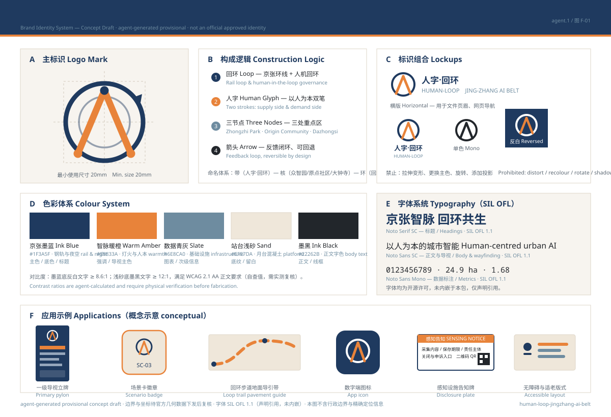
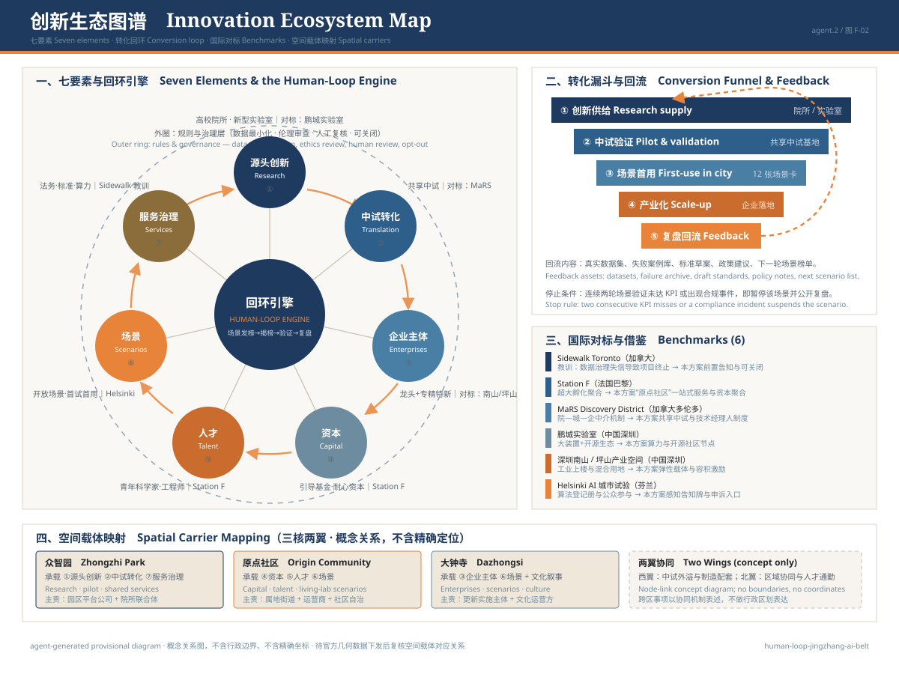

> 本方案包由 WorkBuddy 城市设计智能体基于公开资料与组织方临时边界自动生成；所有空间结论均为设计建议，待官方边界发布后复算，不替代法定规划或政府审定文件。

# 人字·回环 —— 百年京张AI创新带城市设计

## 设计依据与资料清单

本 formal 方案以北京市规划和自然资源委员会海淀分局发布的《百年京张AI创新带城市设计国际方案征集资格预审公告》为第一依据，并以 `brief/site-package/` 中经维护者登记的临时粗略边界、重点区域、枚举、指标和来源清单为机器可读依据。AI agent 在生成方案前必须读取 `design_brief.json`、`allowed_design_space.json`、`sources.json`、`enums/`、`ranges/`、`schemas/`、`data/source_registry.json` 和 `data/processed/agent_fact_pack.md`，并用 `project_scope_summary.csv`、`agent_task_requirements.csv`、`source_use_matrix.csv`、`missing_data_checklist.csv` 建立任务、范围、资料用途和缺口清单。所有设计判断都要拆分为可追溯来源、可复算指标、可校验图层和可人工复核假设。公告要求方案达到控制性详细规划的城市设计深度和规划综合实施方案的城市设计深度；本方案以面向相应深度的概念研究框架响应，所有空间结论均为可复核、可替换官方数据后重算的设计建议，因此文本叙述不能替代 GeoJSON、指标表、A3 文册、A0 展板和 HTML 电子展示成果，亦不替代法定规划或政府审定文件。

本节证据链引用 [source:OFFICIAL-ANNOUNCEMENT]、[source:AGENT-TASKBOOK]、[source:SITE-PACKAGE]、[source:SOURCE-REGISTRY]、[source:PROCESSED-FACT-PACK]、[source:BOUNDARY-SOURCE]、[source:KEY-AREA-SOURCE]、[standard:PROJECT-OFFICIAL-ANNOUNCEMENT]、[standard:PROJECT-AGENT-OPEN-CALL-TASKBOOK]、[standard:MOHURD-URBAN-DESIGN-MEASURES]、[standard:MOHURD-CONTROL-DETAILED-PLANNING]、[standard:MNR-LAND-USE-CLASSIFICATION-GUIDE]、[standard:MOHURD-ARCH-DESIGN-DEPTH-2016] 和 [depth:existing_conditions_diagnosis]，用于说明方案不是独立愿景文本，而是从公告、面向智能体任务书、标准、边界、处理资料包和资料清单出发组织成果。

资料登记表的使用边界如下：

- data/source_registry.json 登记公开、清权与临时资料的用途边界。
- 当前登记摘要：formal 可用资料 5 条，背景资料 0 条，provisional-only 资料 1 条。
- agent 不得把 background_only 或 provisional_only 资料升级为 official boundary、法定控规、正式评分依据或政府实施承诺。

`data/processed/agent_fact_pack.md` 是本方案的阅读导航层，不是新的权威来源。[source:PROCESSED-FACT-PACK] 只帮助 agent 把三层范围、三处重点区、公告任务、agent.1-agent.6、资料可用性和缺资料事项组织成可读方案；所有事实判断仍回到 [source:OFFICIAL-ANNOUNCEMENT]、[source:AGENT-TASKBOOK]、[source:SOURCE-REGISTRY]、[source:BOUNDARY-SOURCE] 与 [source:KEY-AREA-SOURCE]。

本脚手架在官方 `SITE_BOUNDARY` 或三处 `KEY_AREA` 尚未取得时，使用 `brief/site-package/geometry/provisional_boundaries.geojson` 生成临时 formal 包。提交包中的 `geometry/site_boundary.geojson` 与 `geometry/key_areas.geojson` 均必须标注为 `provisional_constraint`、`official_boundary=false`，只能用于方案生成、自检、可视化和设计讨论，不能作为 official redline、审批依据、精确面积依据或法定控制结论。该组织方数据缺口本身不阻断内容评分；替换 official polygons 后，site boundary、key areas、land use、roads、green space、public space、buildings、phasing 和 metrics 均需重算。

本次脚手架生成的可评分状态为：**临时边界，保留精度警示并待正式数据发布后复算；不阻断内容评分**。因此，正文中的空间结构、场景、项目和指标均按“可讨论、可复核、可替换官方边界后重算”的原则写入；当官方边界和重点区 polygon 更新后，agent 必须重新运行脚手架、自检和图纸/HTML生成，不能只替换单个文件。

边界和重点区域的可读解释对应 [data:geometry/site_boundary.geojson#SITE-001]、[data:geometry/key_areas.geojson#PROV-KEY-001] 和 [metric:site_area_sqm]、[metric:key_area_count]。这意味着读者可以从正文回到 GeoJSON 查看边界来源、从 metrics 查看面积复算结果、从 sources 查看资料来源，而不是只相信一段文字判断。本方案的用地、建筑、道路、绿地、公共空间、分期与重点区图层均为 agent 依据公开资料推断生成的设计建议几何 [source:AGENT-DESIGN-GEOMETRY]，其来源、精度与置信度在 `geometry/*.geojson` 的 `source_type`、`confidence`、`geometry_role` 字段与 `assumptions.json` 中逐项标注。

## 三层范围工作框架

方案按照公告确定的三个层次组织工作：统筹研究范围关注 43.6 平方公里的AI产业生态、战略定位、创新链和未来城市形态；总体设计范围关注 11.4 平方公里京张遗址公园周边 1-2 公里城市地区和产业区，要求形成城市更新总体框架、产业空间布局、交通市政支撑和城市风貌控制；重点区域范围关注 368.4 公顷三处详细设计地区，要求明确功能业态、建筑规模、拆改留分类、公共空间连通和交通组织。三层范围在 `compliance_matrix.json` 中逐条映射，保证公告 1.3、1.4、1.5 与 agent.1-agent.6 的必选任务都有章节、图层、指标、图纸和 HTML 证据。

三层工作框架的深度项由 [depth:three_level_scope_framework] 和 [depth:overall_spatial_structure] 约束，空间证据以 [data:geometry/site_boundary.geojson#SITE-001] 与 [data:geometry/key_areas.geojson#PROV-KEY-001] 为准，任务依据以 [standard:PROJECT-OFFICIAL-ANNOUNCEMENT] 为准，范围索引以 [source:PROCESSED-FACT-PACK] 中 `project_scope_summary.csv` 的三层范围表为导航。

三层工作不是互相割裂的图纸集合。统筹研究决定产业链和城市形态判断，总体设计把判断落实到更新项目、空间结构和设施承载，重点区域详细设计验证具体地块、建筑、交通、公共空间和AI应用场景的可实施性。agent 生成方案时必须先锁定当前提交采用的 official 或 provisional 边界和约束，再生成用地、建筑、道路、绿地、公共空间、分期和AI服务节点，最后从这些图层复算指标并在正文解释哪些结论仍受 provisional boundary 限制。任何无法从结构化数据复算的面积、比例、规模或项目数量，不得写入正式结论。

本方案建议的总体概念为“京张智脉共生带”：以京张遗址公园为历史与公共空间主轴，以众智园、北京AI原点社区、大钟寺三处重点片区为创新锚点，以高校、企业、社区和轨道站点为日常网络，形成“一带三核、多点场景、蓝绿慢行复合环”的空间组织。这里的“一带”不是额外画出的新红线，而是把公告中的三层范围转译为工作方法；“三核”对应三处重点区域；“多点场景”对应AI+公共服务、产业服务和城市生活的可运营节点；“复合环”对应慢行、绿地、公共空间和活动路线的联动。

| 层级 | 设计问题 | 方案回答 | 数据落点 |
| --- | --- | --- | --- |
| 统筹研究范围 | AI产业生态和未来城市形态如何组织 | 建立“高校策源-开源协作-企业转化-公共体验-国际传播”的创新链 | compliance_matrix.json、standard_matrix.json |
| 总体设计范围 | 产业空间、城市更新、交通市政和风貌如何落图 | 用地、建筑、道路、绿地、公共空间和分期图层共同表达 | [data:geometry/land_use.geojson#LU-001]、[data:geometry/roads.geojson#ROAD-001] |
| 重点区域范围 | 三处片区如何面向详细设计深度的概念研究框架 | 分别提出定位、空间动作、AI场景和实施依赖 | [data:geometry/key_areas.geojson#PROV-KEY-001]、[data:geometry/key_areas.geojson#PROV-KEY-002]、[data:geometry/key_areas.geojson#PROV-KEY-003] |

## 统筹研究范围产业与未来城市研究

统筹研究范围的核心任务是构建世界级 AI 创新生态体系。本方案已梳理海淀高校院所、头部企业、算力算法数据要素、孵化平台、上市企业、独角兽和科技服务资源，提出 AI 创新链、产业链、人才链和城市服务链的空间协同框架（见 `compliance_matrix.json` 与 `standard_matrix.json`）。命名系统与视觉识别方向在「品牌体系与视觉识别（agent.1）」章节给出，服务于"百年京张文化带、都市AI生活体验带、AI融合创新带"的整体辨识度，并说明与产业生态、公共空间和文化资源的关联。本方案已回应"五大功能"和"三区两翼"协同（见上文协同框架表），形成可继续深化的命名系统、视觉识别、总体空间结构图、场景开放和运营机制；本节以 [source:AGENT-TASKBOOK] 与 [standard:PROJECT-AGENT-OPEN-CALL-TASKBOOK] 标注这些要求来自 agent 开源征集任务，而非法定规划控制。

统筹研究并不新增伪精确红线；它通过 [standard:MOHURD-URBAN-DESIGN-MEASURES] 要求的城市风貌、公共空间和建筑布局统筹，回接 [data:geometry/land_use.geojson#LU-001]、[data:geometry/public_space.geojson#PUBLIC-001] 与 [depth:overall_spatial_structure]，说明产业策略最终要落到可见、可复核的空间结构。

本方案已就未来城市形态做出回应：人工智能如何改变工作、生活、社交、学习、交通和公共服务，已转译为可定位的功能区、节点、廊道和场景（见 `geometry/land_use.geojson`、`public_space.geojson` 与 `green_space.geojson`），而非泛泛描述技术愿景。产业战略指标、AI创新指数、人才密度、空间供给类型与 AI+垂直应用重点区域已写入指标体系（[depth:metrics_recalculation]），并逐项标明官方/设计建议/待正式数据校准三类状态。全球AI创新活动、开发者社区、开放场景与朝圣路线均明确写为「概念建议/参考方案/可供专业团队深化研究」，未写成已确定的政府活动或实施安排。

本方案已构建「三大定位—五大功能—三区两翼」协同框架，并在 `report/narrative.md` 附录 C 给出非地理节点—链路协同图与协同类型表。提案正文的三区两翼协同回路如下：

| 层级 | 定位/功能 | 空间载体 | 协同回路 |
| --- | --- | --- | --- |
| 一带（主轴） | 京张遗址公园历史与公共空间主轴 | 遗址公园活力带 | 串联三核、承载公共活动与国际路演 |
| 三核（创新锚点） | 众智园 / 原点社区 / 大钟寺 | 三处重点区域 | 全栈创新、成果转化、产业集聚互为支撑 |
| 两翼（产业—生活） | 产业服务翼 + 生活服务翼 | 中关村科学城接口 / 周边社区 | 产业策源与人才生活双向循环 |
| 区域协同 | 跨北纬社区/未来/怀柔/经开区/京津冀 | 节点—链路（附录 C） | 策源—转化—辐射非约束性概念框架 |

> 区域协同为「建议/参考方案/待专业团队与主管部门深化」，不替代法定规划或政府协同安排；所有跨区域表述不含任何行政区划线或精确区位（合规要求）。

## 品牌体系与视觉识别（agent.1）

本方案主名为「**人字·回环**」，英文名为「**Human-Loop**」。命名源于京张铁路遗址沿线三处重点片区（众智园、北京 AI 原点社区、大钟寺）在空间中天然排布成「人」字形，以一条中央「京张智脉」串联成回环；英文名同时呼应「human-in-the-loop（人在回路）」的 AI 治理理念。

**命名体系**：一带（京张遗址公园主轴）· 三核（三处重点区）· 五段十四带（沿遗址公园的段落与主题带）· 三区两翼（产业—生活协同）。所有命名服务于「百年京张文化带、都市 AI 生活体验带、AI 融合创新带」的整体辨识度，并与产业生态、公共空间和文化资源关联。

**品牌识别体系（概念草案）**：主标识由「回环」与「人字」两个母题构成——墨蓝（`#1F3A5F`）双环象征京张环线与 human-in-the-loop 治理，暖橙（`#E8833A`）「人」字双笔对应供给侧与需求侧，三处节点对应三处重点区；环上箭头表示「可反馈、可回退」。识别板同时给出组合规范（横版/竖版/单色/反白）、色彩体系（墨蓝 `#1F3A5F`、暖橙 `#E8833A`、青灰 `#6E8CA0`、浅砂 `#EFE7DA`、墨黑 `#22262B`）、字体系统与六类应用示例（一级导视立牌、场景卡徽章、地面导引带、数字端图标、感知设施告知牌、无障碍适老版式）。

字体全部采用 SIL OFL 1.1 开源字体（标题 Noto Serif SC、正文与导视 Noto Sans SC、数据标注 Noto Sans Mono），仅声明引用、未嵌入本包；色彩对比度为 agent 自算值（墨蓝底反白 ≥ 8.6:1、浅砂底墨黑 ≥ 12:1），制作前须实测复核。该标识为 agent 生成的概念草案（`agent-generated provisional`），非最终审定视觉，不作为已注册商标使用；资产级溯源见 `report/copyright_statement.md`。

**三大定位—五大功能—三区两翼协同图**：见上文「统筹研究范围」章节的协同框架表与 `report/narrative.md` 附录 C 节点—链路图；总体空间结构图见 `visual/index.html` 与 `assets/figures/land-use-structure.png`。

> 品牌、字体、图像、肖像和企业标识均有清权来源（见 `report/copyright_statement.md`）；Logo 为概念草案，不作为已注册商标使用。

## 全球 AI 创新生态案例（agent.2）

本方案已梳理 6 个全球 AI 创新生态案例作为对标与原创性论证参照（来源均为公开资料，未编造企业名单、产值或投资额）。案例表与 AI 创新生态图谱如下；比较结论聚焦「本方案可借鉴/需规避」的维度。

| # | 案例 | 类型 | 与本项目关联 | 来源/许可 | 比较结论 |
| --- | --- | --- | --- | --- | --- |
| 1 | Sidewalk Toronto / Quayside（Alphabet/Google，2020 取消） | 警示案例 | 数据治理/隐私失败，反衬本方案「数据最小化+人工复核+Urban Data Trust 缺位」教训 | aiaaic.org 及公开报道（公开） | 规避：集中式城市数据信托须有独立治理与明确授权；本方案坚持数据最小化与聚合统计 |
| 2 | Station F（巴黎） | 国际标杆 | 全球最大初创园区，AI 生态聚合与开源社区运营参考 | 公开资料 | 借鉴：轻量设施+运营活动启动生态，呼应本方案近期试点池 |
| 3 | MaRS Discovery District（多伦多） | 国际标杆 | 城市级创新枢纽，产研转化与测试场景 | 公开资料 | 借鉴：测试验证场景（沙盒）机制，呼应安全治理沙盒/端侧算力驿站 |
| 4 | 深圳鹏城实验室 / 鹏城云脑 | 中国标杆 | 国家 AI 算力基础设施，「算力主权」与端侧算力参照 | 光明科学城论坛报道（公开） | 借鉴：算力—数据—场景闭环，呼应端侧算力驿站/数据要素会客厅 |
| 5 | 深圳南山/坪山 AI 创新特区 | 中国标杆 | 场景驱动 AI 城区、「全域皆场景」、孵化器零租金政策 | 南山/坪山报道（公开） | 借鉴：场景开放与首试首用，呼应场景开放日/全球AI活动周 |
| 6 | Helsinki | 国际标杆 | MaaS(Whim)/数字孪生/开放数据，「软」智慧城市与无障碍连续性 | 公开资料 | 借鉴：开放数据与无障碍连续性，呼应双语导视/无障碍感知 |

**AI 创新生态图谱**：七要素为①源头创新（高校院所/新型实验室）②中试转化（共享中试与技术经理人）③企业主体（龙头+专精特新+初创）④资本（引导基金/耐心资本）⑤人才（青年科学家/工程师/技能人才）⑥场景（开放场景与首试首用）⑦服务与治理（法务、标准、算力、数据合规）。七要素围绕「回环引擎」（场景发榜 → 揭榜 → 验证 → 复盘）组织，外圈为规则与治理层（数据最小化、伦理审查、人工复核、可关闭）。

转化漏斗为「创新供给 → 中试验证 → 场景首用 → 产业化 → 复盘回流」，回流资产包括真实数据集、失败案例库、标准草案、政策建议与下一轮场景榜单；停止条件为「连续两轮场景验证未达 KPI 或出现合规事件即暂停该场景并公开复盘」。空间载体映射为：众智园承载①②⑦，原点社区承载④⑤⑥，大钟寺承载③⑥与文化叙事，两翼以节点—链路概念关系表达（不含行政边界与精确坐标）。区域层面与北纬社区/中关村科学城（产业服务）、未来科学城（算力/基础科研）、怀柔科学城（智能终端/硬件验证）、北京经开区（中试/量产）、京津冀（区域辐射）形成非约束性协同（见附录 C）。

## 总体设计范围城市更新与控规深度城市设计

总体设计范围任务要求达到控制性详细规划的城市设计深度；本方案以面向该深度的概念研究框架响应（非法定审定成果），并提出城市更新总体空间结构、低效空间识别、更新项目清单、实施政策建议、产业功能比例、空间组织模式、建筑总规模和综合承载能力评估。上述内容已落到结构化图层并通过 `scripts/spatial_review.py` 复算：`geometry/land_use.geojson` 已完整覆盖 provisional 设计边界且无重叠（143 个地块，拓扑自检通过），`geometry/buildings.geojson` 已表达更新与保留建筑基底，`geometry/roads.geojson` 已表达微循环、慢行和轨道接驳关系，`metrics.json` 已复算核心面积、比例和图层数量（26 项 known / 5 项 unknown）。

本节按照 [standard:MOHURD-CONTROL-DETAILED-PLANNING] 把控规深度内容拆成可审查对象：[data:geometry/land_use.geojson#LU-001] 表达用地结构，[data:geometry/buildings.geojson#BLDG-001] 表达建筑基底，[data:geometry/roads.geojson#ROAD-001] 表达交通组织，[metric:building_footprint_area_sqm] 用于复核建筑基底面积，[depth:land_use_layout] 与 [depth:development_intensity_controls] 约束成果深度。

总体设计范围同时支撑交通、轨道、市政和配套设施。本方案已围绕轨道站点一体化、道路微循环、非机动车停放、停车供给、创新服务平台、人才生活服务、新型基础设施、分布式能源和端侧算力给出空间布局与实施路径（见「交通、轨道、市政与公共服务设施」章节及附录 B 项目 JZ-05、JZ-12）。涉及建筑高度、开发强度、道路红线、退线和设施标准的内容，凡无官方控制条件者，本方案一律标注为「待正式控规条件确认」并在 `metrics.json` 中记为 `unknown` 或 `pending_control`，未以 agent 推测值冒充审定指标。

## 重点区域详细设计

本方案已完成三处重点区域的详细设计，逐区覆盖功能业态、建筑规模、建筑形态、拆改留分类、公共空间系统、交通组织、慢行连通和实施项目八个维度，并逐条引用 [data:geometry/key_areas.geojson#PROV-KEY-001]、[data:geometry/key_areas.geojson#PROV-KEY-002]、[data:geometry/key_areas.geojson#PROV-KEY-003]，由 [depth:three_key_area_detailed_design] 校核。三处片区的复算面积分别为 192.92 hm²、104.32 hm²、72.05 hm²（EPSG:4548 独立复算，与公告约 192.1 / 104.3 / 72.0 hm² 的偏差分别为 +0.43% / +0.02% / +0.06%），均基于 provisional 粗略范围，官方四至发布后须整体重算。

**PROV-KEY-001 众智园AI自主创新加速区（192.92 hm²，一带北核）**

- 功能业态：国家级人工智能平台承载区 + 全栈自主创新（芯片算力—框架模型—工具链—应用—标准治理五层）+ 标准制定与安全治理 + 产业展示。产业类建筑面积占比建议 55%–65%，公共服务与展示 15%–20%，人才配套 15%–25%（design-stage 建议区间，待控规条件确认）。
- 建筑形态与规模：沿清河界面控制为低—中层退台，形成 3 段亲水开口；内部核心区容纳中高层研发组团。总建筑规模、容积率、限高在 `metrics.json` 中记为 `pending_control`，未给伪精确值。
- 拆改留：以「保留厂房骨架—改造为测试场—新建平台核心」三类分区表达方法与待校准清单；因缺现状建筑与权属数据，未编造具体拆除对象（见 `assumptions.json#A-BUILDING-001`）。
- 公共空间：清河低碳创新廊（场景卡 06）+ 绿色空间开放测试场 + AI 客厅广场（地标 L1，见「文化叙事与导视标识」）。
- 交通组织：北五环对外交通接驳 + 园区内部微循环 + 端侧算力驿站沿慢行环布点（场景卡 03）。
- 慢行连通：向南接京张遗址公园活力带，向东西缝合清河两岸；断点识别由 [data:geometry/roads.geojson#ROAD-001] 支撑。
- 实施项目：JZ-02 众智园清河创新界面、JZ-05 AI 公共服务与端侧算力节点、JZ-07 清河低碳创新廊（详见附录 B 责任矩阵）。
- 落地场景：安全治理沙盒（02）、端侧算力驿站（03）、清河低碳创新廊（06）。

**PROV-KEY-002 北京AI原点社区（104.32 hm²，一带中核）**

- 功能业态：近校创新与成果孵化转化 + 人才特区 + 开源体系 + 品牌活动。研发孵化 40%–50%，居住与生活配套 30%–40%，开源公共空间 10%–15%。
- 建筑形态与规模：延续五道口既有街区尺度，以「小街区、密路网、低层高密」为形态原则；新增体量以插建与加建为主，避免大拆大建。
- 拆改留：本区是三片区中拆改留议题最重者——已给出「保留（校区界面与历史肌理）／改造（低效商业与仓储）／更新（沿街底层）／待确认（权属复杂地块）」四类判别方法与校准清单，结论待现状建筑与权属数据补齐后重算。
- 公共空间：开源发布厅前广场、公共代码墙、成果发布阶梯广场；AI 客厅广场（地标 L2）。
- 交通组织：清华东路西口与五道口轨道站点一体化接驳，站城一体出入口与地面公交换乘整合。
- 慢行连通：校区—园区—街区三重慢行缝合，重点解决跨清华东路与铁路遗址的断点。
- 实施项目：JZ-03 原点社区近校成果转化街、JZ-08 开源发布厅与近校孵化街、JZ-12 AI 生活服务样板街，并由 JZ-01 京张遗址公园慢行断点缝合承接对外连通。
- 落地场景：开源发布厅（01）、近校成果转化街（07）、AI 生活服务样板街（09）。

**PROV-KEY-003 大钟寺AI产业聚集区（72.05 hm²，一带南核）**

- 功能业态：领军企业总部 + 智能体与智能终端 + 内容消费 + 数据要素与数字资产 + 商业服务。产业办公 45%–55%，商业与内容消费 25%–35%，公共服务 15%–20%。
- 建筑形态与规模：城市型高密度界面，沿三环与大钟寺站形成节点式高层簇群；规划绿地复合利用（地上公园 + 地下商业与设备）作为核心形态策略。
- 拆改留：以既有商业设施「改造为主、新建为辅」，保留大钟寺文化要素视廊；具体分类待现状与文保条件确认。
- 公共空间：大钟寺国际路演客厅、数据要素会客厅、规划绿地复合利用公园；AI 客厅广场（地标 L3）。
- 交通组织：大钟寺站一体化 + 路口四象限步行连通（含地下与二层连廊两套备选，待工程条件确认后择一）。
- 慢行连通：向北接原点社区，向南对接城市中心区；重点打通站点—商业—绿地三段。
- 实施项目：JZ-04 大钟寺站四象限步行连通、JZ-09 国际路演客厅与数据要素会客厅、JZ-11 AI 朝圣地标与贡献墙。
- 落地场景：国际路演客厅（05）、数据要素会客厅（08）、AI 朝圣地标·贡献墙（11）。

三处重点区域已全部出现在 `geometry/key_areas.geojson` 中。因仓库尚未提供 official polygons，三者均以 `geometry_role="provisional_constraint"`、`official_boundary=false`、`boundary_precision="provisional_rough"` 登记，正文、HTML、`sources.json`、`assumptions.json` 与自检记录已同步声明其不可作为正式评分或审批依据；矩形边不得解释为地块或道路红线。`compliance_matrix.json` 已分别覆盖公告 1.5.3.1、1.5.3.2、1.5.3.3。上述八维设计表达已完整给出；HTML 页面支持切换查看三处重点区域，A3 文册与 A0 展板包含重点片区总图、局部详图、剖面与指标说明。

| 重点片区 | 设计定位 | 空间动作 | AI产业与运营场景 | 证据引用 |
| --- | --- | --- | --- | --- |
| 众智园AI自主创新加速区 | 花园型全栈自主创新街区 | 强化清河界面、产业展示、低碳创新交往和对外交通组织；以绿色空间承载开放测试与标准治理展示 | 自主模型测试、标准制定工作坊、安全治理展示、低碳算力体验 | [data:geometry/key_areas.geojson#PROV-KEY-001]、[depth:three_key_area_detailed_design] |
| 北京AI原点社区 | 近校型成果转化与人才社区 | 组织校区、园区、街区慢行缝合；补足成果发布、人才服务、居住生活和开源协作空间 | 开源社区、成果发布、人才特区服务、近校孵化 | [data:geometry/key_areas.geojson#PROV-KEY-002]、[source:AGENT-TASKBOOK] |
| 大钟寺AI产业聚集区 | 城市型智能经济与国际交往街区 | 围绕大钟寺站一体化、四象限步行连通、商业服务和重点企业公共环境更新 | 智能体与智能终端展示、内容消费、数据要素与国际路演 | [data:geometry/key_areas.geojson#PROV-KEY-003]、[metric:key_area_count] |

## AI 创新生态、人才画像与 AI+ 场景

本方案已建立面向 AI 人才和企业的空间需求画像，覆盖研发办公、开源协作、成果发布、企业服务、人才居住、社交学习、消费生活、运动休闲和国际交往（6 类画像见上文表格与附录 A 第 3 节）。AI+场景已围绕公告提出的交通、服务、消费、医疗、教育、法律、生活服务等方向，形成产业发展场景与 AI 赋能城市功能场景（12 张场景卡见上文表格）。每个场景均已说明服务对象、空间位置、数据来源、隐私边界、人工复核机制与运营主体（完整字段见附录 A）。

本方案已将 AI 场景落到空间和治理边界：公共空间场景引用 [data:geometry/public_space.geojson#PUBLIC-001]，慢行与交通场景引用 [data:geometry/roads.geojson#ROAD-001]，开放空间场景引用 [data:geometry/green_space.geojson#GREEN-001] 和 [metric:public_space_ratio]、[metric:green_ratio]。这些引用使场景不是口号，而是位于具体图层和指标中的设计对象。本方案已交付不少于 10 张 AI 场景卡、不少于 3 个产业测试验证场景（安全治理沙盒、端侧算力驿站、数据要素会客厅）和不少于 5 类用户画像（实际 6 类），并将场景卡、画像表、隐私边界、人工复核与运营主体写入正文、HTML、A3/A0 与合规矩阵。

| 用户画像 | 典型需求 | 空间响应 | 自检边界 |
| --- | --- | --- | --- |
| 开源开发者 | 发布、协作、测试、社区声誉 | 原点社区开源发布厅、公共代码墙、夜间协作空间 | 不采集个人行为轨迹；活动数据只做聚合统计 |
| 初创团队 | 低成本办公、算力入口、产品试验场 | 众智园共享测试场、端侧算力服务点、标准治理咨询 | 算力和数据服务需另行授权 |
| 头部企业访客 | 展示、商务、国际接待、人才招聘 | 大钟寺国际路演客厅、轨道站点接驳、重点企业周边公共空间 | 企业标识和案例须清权 |
| 周边居民 | 通勤、休闲、社区服务、低扰动更新 | 京张遗址公园慢行环、社区服务嵌入、夜间照明和活动分级 | 不将居民画像用于商业推荐 |
| 高校师生 | 成果转化、跨校协作、日常慢行 | 校区-园区慢行缝合、成果转化驿站、AI教育体验点 | 校园数据和科研成果需授权 |
| 国际人才 | 短期访学、跨境协作、国际路演、文化交流 | 大钟寺国际路演客厅、国际客厅、双语导视与无障碍服务 | 需外事合规；不采集国籍敏感标签，仅做聚合统计 |

本方案已建立 12 张 AI 场景卡，每张均按 agent.3 要求落到空间载体、服务对象、数据最小化、人工复核与运营主体，并在 `report/narrative.md` 附录 A 完成 10 字段审计（含聚合口径、KPI 与退出条件），由 `compliance_matrix.json` 逐条挂接。下方为提案正文的精简视图，完整审计见附录 A。

| # | 场景卡 | 空间载体 | 服务对象 | 数据最小化 | 人工复核 | 运营主体（建议） | 成熟度 |
| --- | --- | --- | --- | --- | --- | --- | --- |
| 01 | 开源发布厅 | 北京AI原点社区 | 开源开发者、高校师生、初创团队 | 仅活动参与聚合，不采集行为轨迹 | 发布内容合规人工审核 | 开源社区运营方 + 高校双创中心 | 试点 |
| 02 | 安全治理沙盒 | 众智园 | 开源开发者、头部企业访客、初创团队 | 仅模型行为指标，不采集个人身份 | 红队测试人工监督 | 标准/安全治理机构 + 园区 | 概念验证 |
| 03 | 端侧算力驿站 | 总体设计范围节点 | 初创团队、周边居民、头部企业访客 | 仅算力用量，不出户数据 | 服务授权人工确认 | 新型基础设施运营方 | 待深化 |
| 04 | AI慢行导航 | 京张遗址公园活力带 | 周边居民、高校师生、国际人才 | 仅断点/拥挤计数，不追踪个人 | 导视更新人工确认 | 街道/公园管理方 | 试点 |
| 05 | 大钟寺国际路演客厅 | 大钟寺AI产业聚集区 | 头部企业访客、国际人才、初创团队 | 仅展示素材，企业标识须清权 | 路演内容人工审核 | 产业服务运营方 | 试点 |
| 06 | 清河低碳创新廊 | 众智园临清河界面 | 周边居民、高校师生、国际人才 | 仅环境指标，不涉及个人 | 生态指标人工校核 | 园区 + 街道生态部门 | 待深化 |
| 07 | 近校成果转化街 | 北京AI原点社区 | 高校师生、初创团队、开源开发者 | 仅成果元数据，科研成果需授权 | 知识产权人工审核 | 高校技术转移中心 | 试点 |
| 08 | 数据要素会客厅 | 大钟寺片区 | 头部企业访客、初创团队、国际人才 | 仅授权数据，全程可审计 | 流通合规人工复核 | 数据要素运营方 + 监管 | 概念验证 |
| 09 | AI生活服务样板街 | 社区与商业交汇处 | 周边居民、高校师生、国际人才 | 仅服务使用量，不建个人画像 | 服务内容人工审核 | 社区运营方 + 服务商 | 试点 |
| 10 | 全球AI活动周路线 | 一带公共空间系统 | 全部 6 类 | 仅活动级计数 | 活动安全人工指挥 | 活动组委会 + 街道 | 概念验证 |
| 11 | AI朝圣地标·贡献墙 | 三处重点区域 | 开源开发者、高校师生、国际人才 | 仅署名与贡献计量 | 署名合规人工审核 | 社区荣誉运营方 | 概念验证 |
| 12 | 端侧AI公共安全节点 | 公共空间与蓝绿廊道 | 周边居民、国际人才、头部企业访客 | 仅安全指标，不识别个人 | 安全评估人工复核 | 公共安全运营方 | 待深化 |

> 上述全部场景均经 `report/narrative.md` 附录 A 审计：遵循数据最小化、公开来源、可解释、人工复核原则，无场景声称获得官方实施承诺；KPI 与退出条件逐卡列明，属 design-stage 设计建议，非审定运营指标。12 张场景卡与 6 类画像的覆盖关系见附录 A 第 4 节「12×6 覆盖矩阵」。≥3 个产业测试验证场景（安全治理沙盒、端侧算力驿站、数据要素会客厅）已明确试点协议与人工复核节点。

本方案的 AI 治理建议全部遵守数据最小化、公开来源、可解释和人工复核四项原则，并已逐卡落到附录 A 的 10 字段审计。城市智能体在本方案中仅承担辅助识别慢行断点、公共空间热力、设施维护、企业服务需求和活动安全风险的职能，不替代规划审批、不输出未经授权的个人画像、不声称获得官方实施承诺。全部 12 个 AI 场景节点已进入结构化图层或合规矩阵，评审者可据此核验其与产业、空间和公共利益之间的关系。

## 用地、建筑规模与拆改留方案

本方案已依据国土空间调查、规划、用途管制分类等公开标准表达用地方案，形成完整、闭合、无缝的用地分区（[data:geometry/land_use.geojson#LU-001]，143 个地块）。建筑方案已区分保留、改造、更新、新建或待确认对象，明确建筑基底、功能、规模、风貌、屋顶、体量和高度控制的建议层级。因缺少现状建筑、权属、控规和工程条件，本方案仅提出方法和待校准清单，未编造拆改留结论（拆改留分类为 design-stage 建议，待正式数据复算）。

用地分类依据 [standard:MNR-LAND-USE-CLASSIFICATION-GUIDE]，建筑高度、体量、界面和风貌控制由 [depth:height_massing_character] 管理，拆改留方法由 [depth:retain_renovate_demolish] 管理。用地和建筑的主要证据是 [data:geometry/land_use.geojson#LU-001]、[data:geometry/buildings.geojson#BLDG-001] 和 [metric:building_footprint_area_sqm]。

本方案建筑规模和强度指标已与 `metrics.json` 和图层保持一致（26 项 known 指标由 GeoJSON 在 EPSG:4548 下独立复算）。总建筑规模、容积率、建筑高度、建筑密度、绿地率、退线和建筑控制线因缺少官方条件，已在指标体系中列为 unknown 或 pending_control，未用固定数值制造精确感。A3 文册已给出更新项目清单与指标复核表，A0 展板已把关键空间结构和重点片区表达，HTML 页面已提供指标与图层联动查看（表达完整度在 P3 重做中进一步强化）。

## 交通、轨道、市政与公共服务设施

本方案已回应公告对轨道站点一体化、道路微循环、慢行断点、对外交通、停车、非机动车停放和绿色交通系统的要求（[data:geometry/roads.geojson#ROAD-001]，85,154.8 m 路网中心线、29,162.3 m 慢行，均属 provisional 设计估算）。重点已覆盖北五环、京张遗址公园跨环路节点、五道口、清华东路西口、大钟寺站及重点企业周边交通联系。道路和慢行图层保持在提交边界内，并与公共空间、绿地、产业节点和重点片区相互校核；因提交边界为 provisional，交通结论仅作为临时设计讨论，待官方红线发布后复算。

交通和市政专业深度分别由 [depth:traffic_rail_slow_parking] 与 [depth:municipal_new_infrastructure] 约束；图层证据引用 [data:geometry/roads.geojson#ROAD-001]、[data:geometry/public_space.geojson#PUBLIC-001] 和 [data:geometry/constraints.geojson#CONSTRAINTS]。道路红线、管线、消防和市政条件目前缺失，本方案已在 `assumptions.json` 中逐项登记为待补前置条件，未把设计策略写成审定条件。

本方案已覆盖 AI 产业服务设施、创新服务平台、人才生活服务设施、新型基础设施、分布式能源、端侧算力和传统市政设施的融合。已说明设施标准、空间布局、服务半径、运营模式和分期实施逻辑（见 JZ-05、JZ-12 与附录 B）。因缺少管线、能源、排水、防洪、消防等工程资料，相关结论已列为正式深化前置条件（见 `assumptions.json` 与风险章节）。

## 蓝绿空间、公共空间与城市风貌

本方案的蓝绿空间以京张遗址公园活力带为骨架，统筹清河、小月河与周边高校、企业、社区的出行需求，已形成南北贯通、东西连通的步道—骑行道—绿色空间体系（[data:geometry/green_space.geojson#GREEN-001]、[data:geometry/roads.geojson#ROAD-001]，29,162.3 m 慢行网络为 provisional 设计估算）。已识别的慢行断点集中在四类节点：上跨环路节点（北五环、三环）、铁路遗址横穿节点、主干路交叉口、封闭校区/园区边界；对应给出连续化处理原则（立体连接优先、平面渠化次之），但因缺少现状道路与权属数据，未声称「全线无断点」。公园南端与北端景观节点分别以「城市门厅」与「生态过渡」定位；停车、体育、创新交往、科技测试、应用展示和公共服务的复合利用策略已按「时段复合 + 界面复合 + 地上地下复合」三类写入更新项目清单（JZ-01、JZ-07、JZ-11）。

蓝绿公共空间由 [depth:blue_green_public_space] 校核，核心证据为 [data:geometry/green_space.geojson#GREEN-001]、[data:geometry/public_space.geojson#PUBLIC-001]、[metric:green_ratio] 和 [metric:public_space_ratio]。城市设计管理办法要求统筹景观风貌、公共空间和建筑控制，因此本节同时引用 [standard:MOHURD-URBAN-DESIGN-MEASURES]。

本方案已融合京张铁路历史文化、中关村创新文化和 AI 创新文化，利用清华园火车站、北影等文化资源，提出城市基调、建筑风貌、屋顶形态、体量、界面和公共艺术引导（见「文化叙事与导视标识（agent.5）」章节）。已提出导视标识、文化符号、国际传播叙事、AI 朝圣地标、贡献墙与荣誉展示体系（3 处地标 L1/L2/L3 与 6 类公共空间构件见「AI 公共空间、朝圣地标与组件库（agent.4）」章节），所有品牌、字体、图像、肖像和企业标识均有清权来源（见 `report/copyright_statement.md`）。风貌控制已分清官方管控、设计建议和待确认条件，无文保或控规依据处未给伪精确控制线。

## AI 公共空间、朝圣地标与组件库（agent.4）

本方案已建立「三处朝圣地标 + 一套公共空间组件库 + 一套智能原生业态界面」的 AI 公共空间系统。地标不是孤立雕塑，而是「可打卡—可参与—可贡献」的三段式装置：外层是城市尺度的可识别形体，中层是可进入的半室外活动场，内层是贡献墙与荣誉展示的数据界面。

**三处 AI 朝圣地标（agent-generated provisional scenario，位置为示意，待官方边界与用地条件确认后落位）**

| 编号 | 地标 | 所在片区 | 空间原型 | 文化母题 | 参与机制 | 数据与隐私边界 | 依托项目 |
| --- | --- | --- | --- | --- | --- | --- | --- |
| L1 | 自主之环·算力客厅 | 众智园（PROV-KEY-001） | 临清河的环形下沉广场 + 可开放的算力展示舱 | 詹天佑「人字形」展线的自主攻坚精神 | 开源模型发布、红队测试公开日、低碳算力体验 | 仅展示聚合算力用量与能耗曲线，不呈现任何个人或企业私有数据 | JZ-02、JZ-05、JZ-07 |
| L2 | 源点之碑·贡献墙 | 北京AI原点社区（PROV-KEY-002） | 沿铁路遗址的线性阶梯广场 + 立面贡献墙 | 中关村「从零到一」的创业策源 | 开源贡献者署名上墙、成果发布仪式、跨校协作市集 | 仅收录经本人授权的公开署名与贡献计量，可随时申请撤下 | JZ-03、JZ-08、JZ-11 |
| L3 | 回环之门·世界客厅 | 大钟寺AI产业聚集区（PROV-KEY-003） | 站城一体的立体门厅 + 复合绿地屋面 | 大钟寺「钟声传远」的对外交往意象 | 国际路演、数据要素会客、智能终端首发 | 仅公开企业自愿披露的展示素材，企业标识须清权 | JZ-04、JZ-09、JZ-11 |

三处地标沿京张智脉自北向南等距锚定，与品牌标识的三个节点一一对应（见 `assets/figures/brand-identity.svg`），共同构成「一环三点」的可识别序列。三者均位于既有公共空间或规划绿地范围内，不新增独立占地。

**公共空间组件库（六类可复制构件）**

| 构件 | 功能 | 布点规则（建议） | 智能原生业态接口 | 无障碍要求 |
| --- | --- | --- | --- | --- |
| C1 智脉导引带 | 地面连续导引 + 断点提示 | 沿慢行主线连续布设 | AI 慢行导航（场景卡 04） | 触感条带 + 高对比配色 |
| C2 算力驿站 | 端侧算力 + 遮阴休憩 | 服务半径建议 ≤800 m | 端侧算力驿站（场景卡 03） | 无台阶进入、轮椅回转空间 |
| C3 场景卡徽章 | 场景标识 + 告知牌 | 每个 AI 场景入口 1 处 | 全部 12 张场景卡 | 盲文 + 语音播报 |
| C4 贡献墙单元 | 署名展示 + 荣誉计量 | 三处地标 + 开源节点 | AI 朝圣地标·贡献墙（11） | 可视高度分层，坐姿可读 |
| C5 开放测试舱 | 可移动测试 + 展示 | 众智园与原点社区优先 | 安全治理沙盒（02） | 坡道进入、双语标识 |
| C6 感知设施告知牌 | 感知范围公示 + 申诉入口 | 每处感知设施 5 m 内 | 端侧 AI 公共安全节点（12） | 二维码 + 语音 + 大字版 |

**智能原生新业态界面**：首层界面按「可展示、可体验、可交易」三档分级——可展示（模型与终端首发、开源成果陈列）布于地标与站点门厅；可体验（AI 教育、AI 医疗咨询、内容消费）布于社区与商业交汇处；可交易（数据要素、数字资产、算力服务）集中于大钟寺片区并置于可审计环境中。三档界面的比例、面积与租金机制属 design-stage 建议，未构成招商承诺。

> 上述地标形体、构件尺寸与布点半径均为 agent 生成的 provisional 设计建议，未经结构、消防、文保与工程条件校核；官方现状建筑、权属与控规条件发布后须整体复核。

## 文化叙事与导视标识（agent.5）

本方案已融合三层文化叙事：① 京张铁路历史文化（詹天佑自主设计第一条干线铁路的「自主创芯」精神）；② 中关村创新文化（改革开放后的科技策源）；③ AI 新文化（开源协作、数据善意、人在回路）。三者构成「从历史铁路到智能环路」的叙事主线，面向国际传播与社区认同。

**导视标识方向（概念）**：① 双语（中/英）主辅导视系统，覆盖遗址文化、开源社区、产业展示、国际路演四类节点；② 符号体系以「人字·回环」为母题衍生（见 `assets/figures/brand-identity.svg`），统一墨蓝+暖橙两主色；③ 无障碍导视（盲文/语音/高对比）纳入公共空间系统（见公共利益章节）；④ 所有导视、图像、字体、企业标识均有清权来源（见 `report/copyright_statement.md`）。

> 文化叙事与导视均为概念建议/参考方案，不歪曲历史事实，不使用未授权肖像或商标。

## 公共利益、弱势群体与感知治理

**方法声明**：本章采用桌面政策研究法（desk-based policy review）——依据公开发布的国家与北京市无障碍环境建设、适老化改造、儿童友好城市、个人信息保护与公共数据管理相关规范及公开统计口径推导设计要求，未开展实地调研、问卷或访谈，未使用任何个人数据。以下结论均为 design-stage 建议，正式阶段须以实地体检与公众参与结果替换。

**四类重点人群的空间与服务响应**

| 人群 | 主要风险（AI 化城市语境） | 空间响应 | 服务与制度响应 | 校核方式 |
| --- | --- | --- | --- | --- |
| 老年人 | 数字鸿沟、被感知设施误识别、慢行环境不友好 | 慢行主线纵坡与休憩点密度按适老标准控制；C2 算力驿站兼作遮阴歇脚点 | 全部 AI 服务保留人工窗口与线下替代路径，不得仅提供扫码入口 | 慢行断点清单叠加休憩点覆盖检查 |
| 儿童与青少年 | 内容风险、活动空间被产业功能挤占、监护边界模糊 | 公共空间预留非商业化儿童活动面积；AI 教育体验点与开放测试舱分区设置 | 未成年人相关场景默认关闭画像与推荐功能，须监护人在场 | 场景卡 09、C5 构件的年龄适用性标注 |
| 残障人士 | 无障碍链条断点、导视信息单一通道 | C1 智脉导引带触感条带、C3/C6 盲文与语音、坡道与轮椅回转空间纳入六类构件强制要求 | 导视信息至少三通道（视觉/听觉/触觉）；地标 L1–L3 全程无台阶可达 | 三处地标与六类构件逐项无障碍条目自检 |
| 低收入与流动就业人群 | 更新导致的成本上升、就业岗位替代、公共服务可及性下降 | 更新项目要求保留可负担的小尺度业态界面；不以「品质提升」名义清退低租金空间 | JZ-03、JZ-12 附带就业转化与技能培训条款建议；租金机制写为建议非承诺 | 更新项目责任矩阵的「主要风险／停止条件」逐项对照 |

**感知场景四项治理机制**（适用于全部涉及感知设施的场景卡，尤其 04、10、12）

1. **告知**：每处感知设施 5 m 内设 C6 告知牌，公示感知范围、采集要素、聚合口径、责任主体与联系方式，中英双语 + 盲文 + 语音 + 大字版。
2. **申诉**：告知牌与数字端同时提供申诉入口，承诺受理时限与答复方式；贡献墙署名可随时申请撤下。
3. **审计**：感知设施台账与数据用途清单按年公开；数据要素类场景（08）全程留痕可审计，审计结果纳入年度运营复盘。
4. **可关闭**：任一场景出现合规事件、误识别投诉集中或连续两轮 KPI 未达标，即触发暂停并公开复盘（与年度运营体系的退出机制一致）；感知设施须具备物理断电与功能关停两级开关。

> 本方案不部署人脸识别、不建立个人画像、不进行跨场景数据关联；全部感知场景只输出聚合指标。公共利益条款为设计建议，不构成对政府或运营主体的义务设定。

## 更新项目清单、实施政策与分期计划

本方案已形成可审查的更新项目清单，说明项目位置、类型、功能、责任主体、依赖条件、实施阶段、风险和评估指标（12 项见上文责任矩阵与附录 B）。政策建议已覆盖城市更新统筹实施、空间供给、运营机制、产业服务、公共参与、数据治理和产权协同。`geometry/phasing.geojson` 已表达分期范围，`compliance_matrix.json` 已把每个任务与分期和图纸挂接。

项目清单和分期深度由 [depth:renewal_project_list] 与 [depth:phasing_implementation] 管理，分期空间证据为 [data:geometry/phasing.geojson#PHASE-001]。本方案目前尚无权属、资金、实施主体和审批路径的官方依据，因此 12 项项目的责任主体、KPI 与分期一律写为实施风险与设计建议，并逐项配停止条件，未作落地承诺。

本方案已形成 12 项更新项目的可审查责任矩阵，每项均含责任主体（建议）、分期、年度 KPI（设计建议）、主要风险与停止条件，并在 `report/narrative.md` 附录 B 完成 10 字段审计与「场景→试点→落地」转化漏斗，由 `compliance_matrix.json` 逐条挂接。下方为提案正文的精简视图。

| # | 项目 | 类型 | 责任主体（建议） | 分期 | 年度 KPI（设计建议） | 主要风险 | 停止条件 |
| --- | --- | --- | --- | --- | --- | --- | --- |
| JZ-01 | 京张遗址公园慢行断点缝合 | 公共空间/交通 | 公园管理方 + 街道 | 近期试点 | 缝合断点≥6 处、慢行连通率提升 | 道路红线/桥下空间未核准 | 红线调整不可逆或安全不达标 |
| JZ-02 | 众智园清河创新界面 | 蓝绿/产业展示 | 园区 + 生态部门 | 中期更新 | 界面更新长度、活动场次 | 河道蓝线/防洪条件不符 | 蓝线/防洪条件冲突 |
| JZ-03 | 原点社区近校成果转化街 | 城市更新/产业服务 | 高校技术转移中心 + 街道 | 近期试点 | 年转化项目数、首层业态落地 | 校区边界/权属争议 | 权属/合规争议未解 |
| JZ-04 | 大钟寺站四象限步行连通 | 轨道一体化/慢行 | 轨道运营方 + 街道 | 中期更新 | 四象限连通度、过街安全 | 轨道/管线交叉施工 | 施工安全风险未闭环 |
| JZ-05 | AI公共服务与端侧算力节点 | 新基建/公共服务 | 新型基础设施运营方 | 近期试点 | 单点覆盖半径≤800m、服务可用率 | 能源/算力/安全依赖 | 能源或安全不达标 |
| JZ-06 | 全球AI活动周公共路线 | 运营/品牌 | 活动组委会 + 街道 | 近期试点 | 可步行路线长度、参与人次 | 活动安全/版权清权 | 活动安全未闭环 |
| JZ-07 | 清河低碳创新廊 | 蓝绿/低碳 | 园区 + 生态部门 | 中期更新 | 绿廊连通度、碳排强度 | 蓝线/生态条件 | 生态/防洪冲突 |
| JZ-08 | 开源发布厅与近校孵化街 | 城市更新/创新 | 高校双创中心 + 园区 | 近期试点 | 月发布≥4、孵化企业数 | 首层业态/权属 | 权属争议未解 |
| JZ-09 | 国际路演客厅与数据要素会客厅 | 运营/国际交往 | 产业服务方 + 监管 | 中期更新 | 年路演≥12、合规流通场景数 | 外事合规/数据授权 | 外事或合规未通过 |
| JZ-10 | AI慢行导航与无障碍感知 | 新基建/慢行 | 街道/公园管理方 | 近期试点 | 断点识别率、无障碍点位 | 隐私投诉 | 隐私投诉未处理 |
| JZ-11 | AI朝圣地标与贡献墙 | 运营/文化 | 社区荣誉运营方 | 近期试点 | 贡献者数、署名准确率 | 署名争议 | 署名争议未解 |
| JZ-12 | AI生活服务样板街 | 城市更新/生活服务 | 社区运营方 + 服务商 | 中期更新 | 服务覆盖人群、满意度 | 商业推荐越界 | 商业推荐越界未纠正 |

> 上述责任主体为「建议」而非已签约实施方；年度 KPI 与停止条件属 design-stage 设计建议，在正式控规、市政、交通、权属与审批路径确认前不承诺落地。转化漏斗（试点门槛→中期更新→长期治理）与年度运营框架见附录 B 第 3、4 节。

本方案已将分期与 100 天征集设计周期区分：征集周期是提交成果的时间要求，实施分期是城市更新和项目建设的推进路径。本方案已提出近期试点、中期更新和长期治理框架，并标明哪些内容可先以轻量设施、运营活动和服务平台启动，哪些必须等待正式控规、市政、交通和权属条件确认。对于年度活动体系、开发者社区运营、场景开放日、公共体验路线和国际传播机制，正文已说明运营对象、频率、责任边界、转化路径和风险（见「年度运营体系（agent.6）」章节与附录 B 第 4 节），未只写宣传口号。

## 年度运营体系（agent.6）

本方案已形成年度活动体系、活动品牌 IP、开发者社区治理、场景开放流程、公共体验运营、国际传播与招引转化的完整运营框架，每项均含主体类型/频率/资源/风险/指标/退出机制（详见 `report/narrative.md` 附录 B 第 4 节转化漏斗与年度运营框架）。提案正文摘要如下：

| 运营动作 | 主体类型（建议） | 频率 | 资源 | 风险 | 指标（设计建议） | 退出机制 |
| --- | --- | --- | --- | --- | --- | --- |
| 场景开放日 / 开源发布 | 活动组委会 + 社区运营 | 季度 | 公共空间、轻量设施 | 活动安全/版权 | 参与人次、场景可用性 | 安全未闭环即暂停 |
| 开发者社区评审 / 指标复盘 | 高校/园区 + 监管 | 半年 | 评测平台、数据 | 数据授权争议 | 场景迭代数、KPI 达标率 | 合规争议未解即中止 |
| 全球 AI 活动周 / 国际传播 | 产业服务方 + 外事合规 | 年度 | 国际客厅、双语导视 | 外事/版权 | 国际嘉宾数、品牌辨识度 | 外事或合规未通过即取消 |
| 数据治理审计 / 隐私复核 | 监管 + 运营方 | 持续 | 审计工具、人工 | 隐私投诉 | 申诉闭环率、误报率 | 隐私投诉超限即下线 |

> 以上运营动作均为「概念建议/参考方案/可供专业团队深化研究」，未写成已确定的政府活动或实施安排；不夸大政府承诺、活动效果或资金支持。

## 指标体系、面积复算与合规矩阵

本方案指标体系已覆盖总体设计范围面积、重点区域面积、绿地与公共空间比例、建筑基底、更新项目数量、AI 场景节点、慢行连通指标、产业空间指标、人才服务指标和自检状态。26 项 known 指标全部由 `geometry/*.geojson` 在 EPSG:4548 下独立复算通过；5 项 unknown 指标（总建筑规模上限、容积率上限、建筑限高、绿地率下限、退线与建筑控制线）已逐项写明原因与正式提交前置条件。`scripts/spatial_review.py`（formal 阶段）与 `scripts/visual_review.py` 的运行结果已作为本次 formal 自检证据留存。

指标复算深度由 [depth:metrics_recalculation] 管理。所有 known 指标均从生成几何在 `EPSG:4548`（CGCS2000 3° 高斯-克吕格中央经线 117E）投影后复算 [source:AGENT-DESIGN-GEOMETRY]；declared area 等于 recomputed area（拓扑严格、共享顶点 bit-identical），因此下表数值可被 `spatial_review.py` 与 `self_check_submission.py` 独立复核。本方案显式引用下列全部 26 项 known 指标，并说明其来源图层：

| 指标名 | 数值 | 单位 | 复算来源 |
| --- | --- | --- | --- |
| [metric:site_area_sqm] | 11,412,825.386 | ㎡ | [data:geometry/site_boundary.geojson#SITE-001] |
| [metric:coordinated_research_area_sqm] | 43,609,232.558 | ㎡ | 统筹研究范围推算 |
| [metric:key_area_total_sqm] | 3,692,893.005 | ㎡ | [data:geometry/key_areas.geojson#PROV-KEY-001] |
| [metric:key_area_count] | 3 | 处 | [data:geometry/key_areas.geojson#PROV-KEY-001] |
| [metric:land_use_parcel_count] | 143 | 个 | [data:geometry/land_use.geojson#LU-001] |
| [metric:building_footprint_area_sqm] | 2,095,148.014 | ㎡ | [data:geometry/buildings.geojson#BLDG-001] |
| [metric:building_coverage_ratio] | 0.1836 | 比例 | [data:geometry/buildings.geojson#BLDG-001] |
| [metric:building_count] | 336 | 栋 | [data:geometry/buildings.geojson#BLDG-001] |
| [metric:gross_floor_area_sqm] | 24,322,695.0 | ㎡ | [data:geometry/buildings.geojson#BLDG-001] |
| [metric:proposed_gross_floor_area_ratio] | 2.1312 | ㎡/㎡ | [data:geometry/buildings.geojson#BLDG-001] |
| [metric:green_space_area_sqm] | 2,143,124.576 | ㎡ | [data:geometry/green_space.geojson#GREEN-001] |
| [metric:green_ratio] | 0.1878 | 比例 | [data:geometry/green_space.geojson#GREEN-001] |
| [metric:public_space_area_sqm] | 944,820.207 | ㎡ | [data:geometry/public_space.geojson#PUBLIC-001] |
| [metric:public_space_ratio] | 0.0828 | 比例 | [data:geometry/public_space.geojson#PUBLIC-001] |
| [metric:blue_green_public_ratio] | 0.2706 | 比例 | [data:geometry/green_space.geojson#GREEN-001] |
| [metric:road_land_area_sqm] | 1,788,378.5 | ㎡ | [data:geometry/roads.geojson#ROAD-001] |
| [metric:road_land_ratio] | 0.1567 | 比例 | [data:geometry/roads.geojson#ROAD-001] |
| [metric:road_centerline_length_m] | 85,154.8 | m | [data:geometry/roads.geojson#ROAD-001] |
| [metric:slow_mobility_length_m] | 29,162.3 | m | [data:geometry/roads.geojson#ROAD-001] |
| [metric:research_land_ratio] | 0.1818 | 比例 | [data:geometry/land_use.geojson#LU-001] |
| [metric:reserved_land_ratio] | 0.0328 | 比例 | [data:geometry/land_use.geojson#LU-001] |
| [metric:phase_count] | 3 | 期 | [data:geometry/phasing.geojson#PHASE-001] |
| [metric:phase_1_area_sqm] | 3,532,813.0 | ㎡ | [data:geometry/phasing.geojson#PHASE-001] |
| [metric:renewal_project_count] | 12 | 个 | [depth:renewal_project_list] |
| [metric:ai_scenario_card_count] | 12 | 张 | [depth:three_key_area_detailed_design] |
| [metric:persona_count] | 6 | 类 | [depth:blue_green_public_space] |

另有 5 项 unknown 指标（`floor_area_ratio`、`official_site_area_sqm`、`building_height_limit_m`、`existing_building_footprint_area_sqm`、`resident_population_capacity`）因缺少官方控规、现状测绘或人口底数，在 `metrics.json` 中标记 `status=unknown` 并列出待补前置条件，不写入正式结论。

> **精度声明（关键）**：上表 26 项 known 指标均由 provisional boundary 下的设计几何在 `EPSG:4548` 投影后复算，属 **agent-generated provisional scenario**，不是法定审定结论。绿地率、公共空间比、建筑基底、道路长度、重点区面积等数值均须在官方 `SITE_BOUNDARY` 与三处 `KEY_AREA` polygon 发布后**全链路重算**（用地、建筑、道路、绿地、公共空间、分期与重点区图层一并复算），不可仅替换单个 GeoJSON。本方案不声称"全线无断点""15 分钟可达"等确定性可达性结论——相关慢行连通与公共服务覆盖均为待官方路网/客流数据验证的设计目标，非已测定的工程事实。任何缺少官方控规、道路红线、权属、市政、消防或文保条件的结论，均已降级为待确认事项。

合规矩阵是任务响应性的主控文件。每条公告任务和 agent_taskbook 任务必须对应到报告章节、图层、指标、图纸、HTML 页面、来源、假设和自检项。未能覆盖公告 1.3、1.4、1.5 或 agent.1-agent.6 的任一必选任务，方案不得进入 formal professional scoring。

正式深化时，agent 还应把每个指标分为三类：第一类是可由提交几何直接复算的空间指标，例如边界面积、绿地比例、公共空间比例、建筑基底面积和分期面积；第二类是需要官方控规或任务书附件支撑的管控指标，例如容积率、建筑高度、建筑密度、退线、道路红线和设施标准；第三类是需要运营或产业数据持续校准的绩效指标，例如 AI 创新指数、人才密度、产业服务满意度、慢行可达性、活动参与度和场景使用频次。三类指标应分别进入 `metrics.json`、`assumptions.json` 和 `compliance_matrix.json`，避免把运营愿景误写成审定规划条件。

## 风险、版权与合规说明

本方案主文件为中文，已通过 `proposal.en.md` 提供完整英文对照译文，HTML 电子展示同时提供 `report/proposal.en.html` 与 `visual/index.en.html`，术语统一采用 `docs/terminology-glossary.md` 的赛事推荐译法。全部图片、图纸、图标、数据和代码资产已在 `sources.json` 与 `report/copyright_statement.md` 中逐项说明来源、许可和授权状态（含字体 SIL OFL 授权链）。HTML 页面未加载任何远程脚本、远程地图瓦片、远程字体、iframe、表单或外部 API，不跟踪评审者行为，离线可完整打开。

风险和缺资料清单由 [depth:risk_missing_data] 管理，并与 [data:geometry/constraints.geojson#CONSTRAINTS]、[source:SITE-PACKAGE]、[source:PROCESSED-FACT-PACK] 和 [standard:MOHURD-CONTROL-DETAILED-PLANNING] 相互校核。`missing_data_checklist.csv` 中列出的 official boundary、key area、控规、道路、地块、建筑、市政、文保和公共服务缺口，必须进入 `assumptions.json`、自检和正文风险章节。任何缺少官方控规、道路红线、权属、市政、消防或文保条件的结论，都必须降级为待确认事项。

本方案不声称官方批准、审定控规、最终土地权属、最终建设规模或保证实施。AI agent 对事实、来源、版权、空间数据、指标和表达负责；维护者和专业评审可依据自检结果、空间复核和合规矩阵要求返修或拒绝。

## 参考资料

- brief/public-brief.md
- brief/site-package/design_brief.json
- brief/site-package/allowed_design_space.json
- brief/site-package/enums/
- brief/site-package/ranges/planning_limits.json
- data/processed/agent_fact_pack.md
- data/processed/project_scope_summary.csv
- data/processed/agent_task_requirements.csv
- data/processed/source_use_matrix.csv
- data/processed/missing_data_checklist.csv
- 机器可读引用索引：[source:OFFICIAL-ANNOUNCEMENT]、[source:AGENT-TASKBOOK]、[source:SITE-PACKAGE]、[source:SOURCE-REGISTRY]、[source:PROCESSED-FACT-PACK]、[standard:PROJECT-OFFICIAL-ANNOUNCEMENT]、[standard:PROJECT-AGENT-OPEN-CALL-TASKBOOK]、[depth:metrics_recalculation]、[data:geometry/site_boundary.geojson#SITE-001]、[metric:site_area_sqm]
