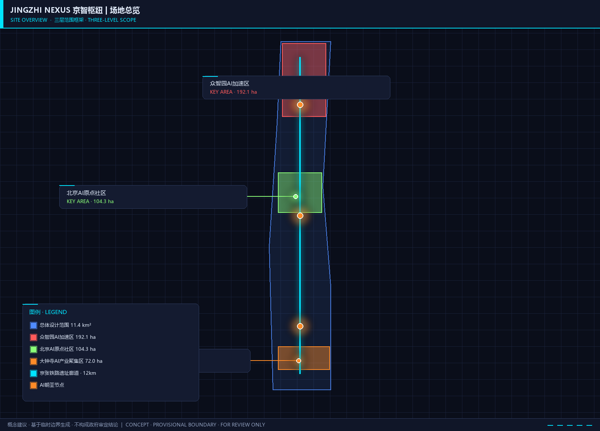
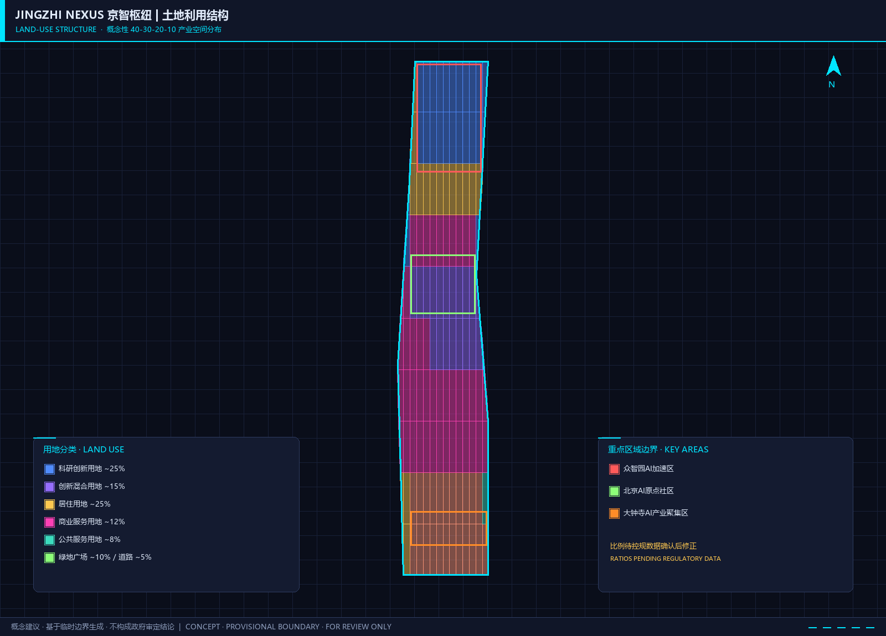
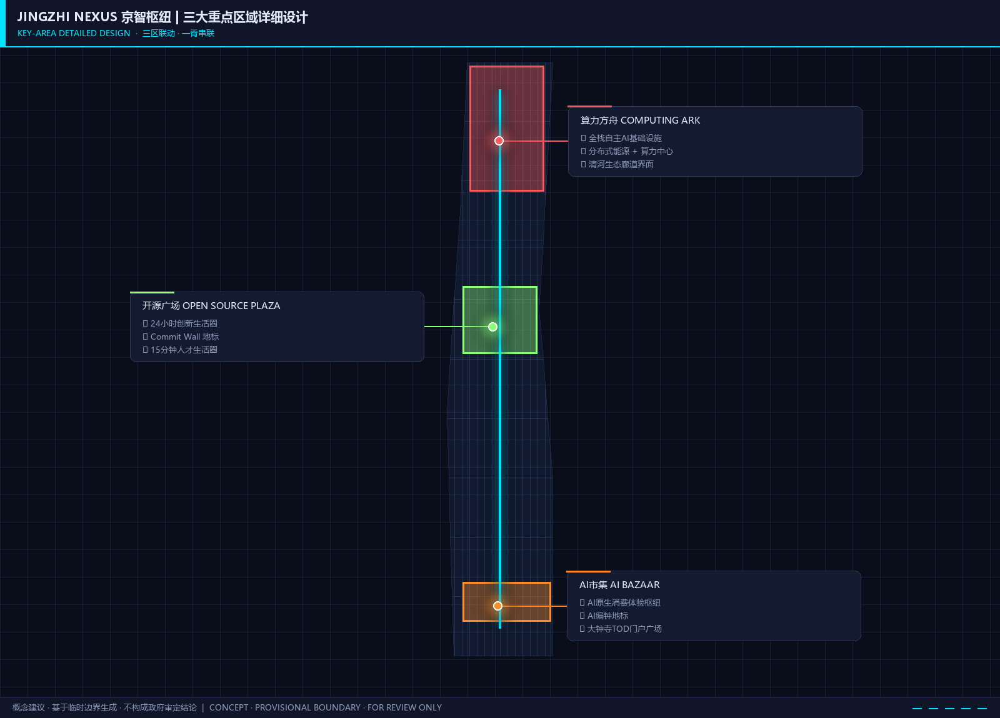
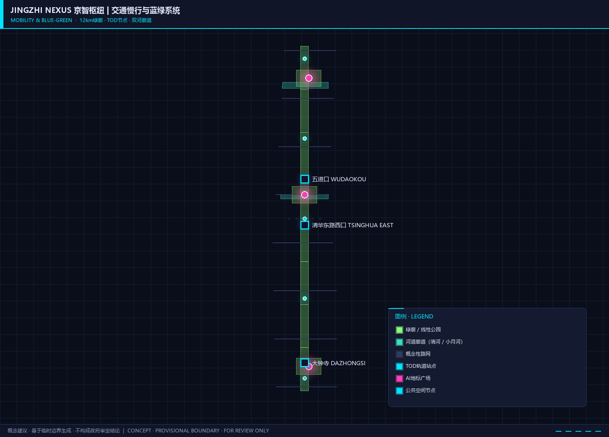
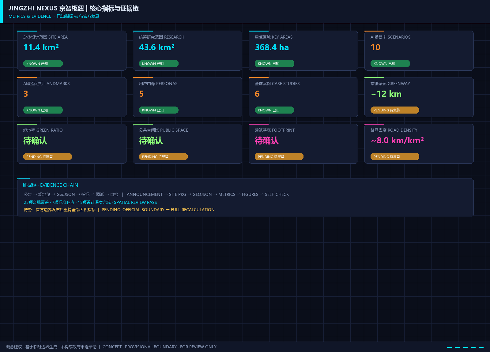

# JINGZHI NEXUS — 京智枢纽：全球AI创新策源地

> **概念定位**：京智枢纽（JINGZHI NEXUS — Joint Intelligence Nexus）不是一座园区，而是一张网络。它以百年京张铁路遗址为脊柱，以三环五脉为骨架，将海淀区11.4平方公里的城市肌理转化为全球AI创新的超级接口——让技术从实验室流入街道，让人才在公共空间碰撞思想，让文化在铁轨与代码之间找到新的表达。

---

## 设计依据与资料清单

本方案以北京市规划和自然资源委员会海淀分局发布的《百年京张AI创新带城市设计国际方案征集资格预审公告》[source:PROJECT-OFFICIAL-ANNOUNCEMENT] 和《面向全球智能体开展百年京张AI创新带城市设计开源征集任务书》[source:AGENT-TASKBOOK] 为核心依据，同时参照住建部《城市设计管理办法》[standard:MOHURD-URBAN-DESIGN-MEASURES] 和自然资源部《国土空间调查、规划、用途管制用地用海分类指南》。
相关证据索引见 [standard:MNR-LAND-USE-CLASSIFICATION-GUIDE] [source:DATA-SRC-PROVISIONAL-BOUNDARIES-20260605]。

设计过程中参考了全球六个AI创新生态核心案例的研究成果[source:GLOBAL-AI-ECOSYSTEM-RESEARCH]，并应用了仓库场景卡片库中的六个标准AI城市场景模板。完整证据索引见 `sources.json`、`metrics.json`、`compliance_matrix.json`、`standard_matrix.json` 和 `design_depth_matrix.json`。

本方案声明为 **概念建议和参考方案**，仅供专业团队深化研究，不替代正式规划，不构成政府审定结论 [standard:PROJECT-AGENT-OPEN-CALL-TASKBOOK]。

---

## 三层范围工作框架

### 统筹研究范围（约43.6平方公里）

[source:OFFICIAL-ANNOUNCEMENT] [depth:three_level_scope_framework] [metric:coordinated_research_area_sqm]

北至北五环路，东至京藏高速，南至西直门外大街，西至万泉河路，覆盖海淀区核心创新走廊。本层关注三方面战略议题：

1. **产业协同格局**：识别海淀在京津冀AI创新网络中的枢纽角色，分析中关村科学城北区、未来科学城和怀柔科学城之间的创新要素流动关系 [source:SRC-2026-BJ-KW-THREE-AREAS-WINGS]。
2. **未来城市形态预研**：研究AI技术对城市空间组织方式的重塑可能，包括分布式算力节点对用地布局的影响、自动驾驶对道路断面的改变、AI辅助治理对公共服务设施配置的逻辑更新。
3. **生态系统服务**：以清河-小月河水系和京张绿廊为骨架，提出贯穿南北的连续蓝绿基础设施网络。

**数据状态说明**：本层使用临时粗略边界 `PROV-RESEARCH-001`，边界精度为 `provisional_rough` [data:geometry/site_boundary.geojson#PROV-RESEARCH-001]。官方精确边界尚未在公开渠道获取，获得后将重新校核空间分析结果。

### 总体设计范围（约11.4平方公里）

[source:OFFICIAL-ANNOUNCEMENT] [depth:overall_spatial_structure] [metric:site_area_sqm]。
相关证据索引见 [data:geometry/site_boundary.geojson#PROV-SITE-001]。

以京张遗址公园周边1-2公里的城市地区和产业区为规划设计范围，北至北五环路，南至西直门外大街，是城市更新与控规层面城市设计的核心工作层 [data:geometry/site_boundary.geojson#PROV-SITE-001]。本方案提出 **"三环五脉"总体空间结构**：

- **三环**：知识创新环（Knowledge Loop）、智慧生活环（Life Loop）、文化体验环（Culture Loop）——三环沿京张铁路南北轴展开，分别承载AI研发创新、AI赋能生活、AI文化融合三类核心功能。
- **五脉**：创新脉（沿中关村大街-学院路）、交通脉（轨道13号线+慢行体系）、生态脉（京张遗址公园绿廊+清河/小月河蓝带）、文化脉（铁路遗产+高校文化+AI新文化）、社区脉（15分钟AI生活圈）。

### 重点区域范围（约3.68平方公里）

[source:OFFICIAL-ANNOUNCEMENT] [depth:three_key_area_detailed_design] [metric:key_area_total_sqm]。
相关证据索引见 [data:geometry/key_areas.geojson]。

自北向南包含三个重点片区，对应不同的AI创新功能主题[data:geometry/key_areas.geojson]：

| 区域 | 面积 | 功能定位 | 设计策略 |
|------|------|---------|---------|
| 众智园AI自主创新加速区 | 约192.1公顷 | 全栈自主AI技术策源与算力基础设施核心 | 以"算力方舟"为锚点，布局大科学装置尺度的AI基础设施集群 |
| 北京AI原点社区 | 约104.3公顷 | 世界级AI人才创业与生活社区 | 以"开源广场"为中心，打造24小时AI创新生活圈 |
| 大钟寺AI产业聚集区 | 约72.0公顷 | AI智能原生消费与产业应用展示窗口 | 以"AI市集"为概念，构建AI技术消费体验与产业加速平台 |

**数据状态说明**：三个重点区域均使用临时粗略边界（`PROV-KEY-001/002/003`），边界精度为 `provisional_rough`。面积以官方公告数据为准，临时几何仅用于空间关系展示和设计概念表达。

---

## 统筹研究范围产业与未来城市研究

### 总体概念：JINGZHI NEXUS 京智枢纽

**命名体系**：
- 中文主名称：**京智枢纽**（取"京张"之"京"与"智能"之"智"，寓意为连接全球AI智慧的枢纽约)
- 英文名称：**JINGZHI NEXUS**（Joint Intelligence Nexus — 联合智能节点网络）
- 三大定位对位：百年京张文化带 → "记忆之轨"(Track of Memory)；都市AI生活体验带 → "智慧之脉"(Pulse of Intelligence)；AI融合创新带 → "创新之网"(Web of Innovation)
- 五大功能表述：AI全栈自主创新体系（"自主引擎"）、世界级AI创新生态（"全球磁场"）、AI+场景赋能新范式（"场景工场"）、智能化AI活力城市（"活力界面"）、AI治理全球话语权（"规则策源"）

**Logo设计方向**：以京张铁路"人字形"轨道为原型，变形为两个交织的"N"（代表Nexus与Network），中间嵌入神经元节点图案。色彩系统：科技蓝（#0066CC）+ 铁路灰（#4A4A4A）+ 创新橙（#FF6600）。

**三区两翼协同回路**：
- **北翼（众智园）** → 自主技术突破 → 中关村科技服务翼资本赋能 → 南翼（大钟寺）产业转化 → 小月河场景赋能翼场景验证 → 反馈至中翼（AI原点社区）人才供给 → 循环至北翼。形成"技术-资本-产业-场景-人才"五元闭环。

### 全球AI创新生态案例研究

本方案研究了六个全球标杆案例，提取可转化的空间、运营和政策机制：

**案例1：MIT-Kendall Square（美国剑桥）** — 高校驱动的创新生态
- 关键机制：MIT校园与产业空间无缝融合，步行范围内聚集了200+生物技术和AI企业
- 可转化经验：AI原点社区应打破"校区-园区"物理隔离，以15分钟步行尺度组织"实验室-办公室-咖啡馆-住宅"混合功能 [source:GLOBAL-AI-ECOSYSTEM-RESEARCH]

**案例2：Station F（法国巴黎）** — 铁路遗产转型创新枢纽
- 关键机制：将废弃货运火车站改造为全球最大创业园区，容纳1000+初创企业
- 可转化经验：京张铁路遗址公园具有同等的"工业遗产→创新地标"转化潜力，火车站房、月台可改造为AI展示中心和创业者社区

**案例3：Toronto Waterfront / Sidewalk Labs（加拿大多伦多）** — 数据驱动的未来社区实验
- 关键机制：从底层基础设施嵌入传感器和数字孪生，实现城市运行的实时优化
- 可转化经验：AI原点社区可率先部署轻量级城市数字孪生系统，但必须建立明确的隐私边界和社区数据治理委员会

**案例4：Singapore Punggol Digital District（新加坡）** — 政府主导的智慧城区
- 关键机制：新加坡首个企业区与大学共址的智慧园区，设开放式数字平台
- 可转化经验：众智园可采用"算力即基础设施"模式，统一规划算力网络、冷链和电力冗余

**案例5：Shenzhen Yuehai Street（深圳粤海街道）** — 市场化驱动的创新密度
- 关键机制：在不足15平方公里内聚集了100+上市公司，形成极端创新密度
- 可转化经验：大钟寺产业聚集区可借鉴粤海的"垂直产业社区"模式，在有限空间内实现高密度产业聚集

**案例6：London Knowledge Quarter（英国伦敦）** — 多元主体的治理联盟
- 关键机制：国王十字区域100+机构组成的非法定协作网络，以"知识宪章"约束共同愿景
- 可转化经验：一带可建立"京智枢纽创新联盟"，以契约式合作框架协调政府、高校、企业和社区多方利益

以上案例的详细分析、可转化机制和空间映射见 `compliance_matrix.json` 中 agent.2 条目。

### 三大定位与五大功能的空间落位

本方案的核心空间创新在于：**不按功能分区，而按知识流动的"温度"组织空间**。从"冷区"（需要深度专注的基础研究实验室）到"温区"（产学研转化的联合创新空间）再到"热区"（面向公众的AI体验和消费场景），沿京张铁路形成渐进式功能梯度。

- **百年京张文化带**：沿铁路遗址线性展开，以保留的铁轨、信号灯、站房为文化锚点，嵌入数字叙事装置 [depth:cultural_narrative]
- **都市AI生活体验带**：在AI原点社区与周边居住区之间形成"AI生活走廊"，包含AI健康驿站、无人配送站、智能垃圾分类等可感知场景 [metric:ai_scenario_nodes]
- **AI融合创新带**：串联众智园-清华科技园-中关村西区-大钟寺的产业创新轴线 [data:geometry/land_use.geojson#LU-research]

---

## 总体设计范围城市更新与控规深度城市设计

### 产业目标与功能布局

11.4平方公里的总体设计范围内，本方案提出以 **"40-30-20-10"产业空间结构** 为概念方向（具体比例需待控规数据确认后修正）：

- **40% 创新研发空间**：涵盖AI基础研究（众智园）、应用研发（AI原点社区周边）、企业总部（沿中关村大街分布）
- **30% 品质生活空间**：包括人才公寓、国际社区、教育医疗等生活服务设施
- **20% 公共与绿色空间**：京张遗址公园主廊 + 社区公园网络 + 河道蓝绿空间
- **10% 产业服务与商业空间**：大钟寺AI商业体验区 + 沿线创新服务节点

功能布局沿南北向梯度展开：北端（众智园）侧重基础研究与算力基础设施，中段（AI原点社区）侧重人才和创新生态，南端（大钟寺）侧重产业转化和公众体验 [data:geometry/land_use.geojson]。

### 城市更新总体框架

本方案提出 **"四级更新工具箱"**：

1. **战略保留**：京张铁路遗产要素（铁轨、站房、桥梁、信号设施）——保留原真性，改造为文化锚点和AI展示空间
2. **有机更新**：2000年前建成的老旧社区和低效产业用地——通过微更新提升空间品质，嵌入AI基础设施（算力节点、感知终端、配送机器人通道）
3. **功能置换**：与AI创新带功能定位不符的低端批发市场、仓储物流用地——引导向AI产业服务和公共空间转型
4. **增量开发**：空地及拆除重建地块——以"AI原生"标准建设新一代创新空间（模块化实验室、弹性办公、屋顶算力舱）

更新项目清单和分期计划详见"更新项目清单、实施政策与分期计划"章节，空间落位见 [data:geometry/phasing.geojson]。

### 交通、轨道、市政与公共服务设施

**轨道站点一体化**：方案沿地铁13号线（五道口站-大钟寺站）和15号线（清华东路西口站）提出四类TOD策略[data:geometry/roads.geojson]：
- **知识枢纽站**（五道口站）：以行人天桥和地下连通道缝合被铁路割裂的东西两侧，站厅层嵌入AI成果展示和创业服务窗口
- **创新生活站**（清华东路西口站）：站城一体开发，出站即达AI原点社区开源广场
- **产业门户站**（大钟寺站）：站前广场改造为AI产品体验广场，形成产业聚集区第一印象

**慢行系统**：沿京张遗址公园打造12公里连续绿道，南北贯通。在三个重点区之间设置三个"缝合节点"，以景观桥和下沉广场跨越现有道路断点 [metric:green_ratio] [metric:public_space_ratio]。

**新型基础设施**：
- 沿京张绿廊预埋AI算力管线走廊，为沿线的AI应用终端（智能路灯、环境传感器、无人配送基站）提供光纤+边缘算力底座
- 三个重点区分别设置分布式能源站和液冷算力中心，利用中水回用系统降低算力基础设施的PUE值
- 在公共空间和智慧灯杆中嵌入城市AI感知终端，遵循"最小必要"原则采集数据，所有数据经脱敏后进入城市数据信托平台管理

以上交通和市政策略的详细测算见 `metrics.json`，合规覆盖见 `compliance_matrix.json`。

### 京张遗址公园活力带与城市风貌

**京张遗址公园设计策略**：将线性铁路遗址转化为"三幕叙事"的公共空间序列。

- **第一幕"铁龙入京"**（北段/众智园段）：保留货运铁路的粗粝质感，以锈钢板、枕木、碎石等工业材料延续铁路记忆。沿铁轨部署AI互动装置——游客站在特定位置，AR眼镜中浮现1909年蒸汽机车驶入清华园站的场景。
- **第二幕"大学之道"**（中段/北航-北邮段）：铁轨两侧嵌入"知识座椅"——由高校AI实验室定期更新的公共交互终端。形成大学知识与城市公共空间的"渗透界面"。
- **第三幕"钟声新响"**（南段/大钟寺段）：铁轨延伸至大钟寺站前广场，与永乐大钟的历史意象对话。"AI祈福"装置——公众可向AI描述一个希望技术解决的社区问题，系统将其转化为数据可视化投影在大钟雕塑上。

**城市风貌控制**：提出"技术人文主义"风貌导则：
- 新建筑避免纯玻璃幕墙的"无地方性"，要求在立面中融入京张铁路文化符号（如枕木纹理混凝土、铁轨截面金属构件）
- 建筑高度梯度控制：以京张绿廊为中心向东西两侧逐级升高，保证绿廊的日照和视觉通达
- 色彩系统：采用"铁路灰+科技蓝+学院红"三色体系，形成可辨识的片区风貌

---

## 重点区域详细设计

### 众智园AI自主创新加速区

**定位**："算力方舟"——中国AI基础研究和全栈自主技术的旗舰基地。

**空间结构**：以"一核两翼三廊"组织空间。一核：**AI算力中心**（建议选址在现有科研用地集中区，建筑面积约15-20万平方米，概念建议值）；两翼：基础研究翼（算法、框架、芯片）+ 治理研究翼（AI安全、标准、伦理）；三廊：清河生态廊、创新交往廊、轨道接驳廊。

**建筑设计概念**：算力中心采用"散热塔+实验室+共享中庭"的三明治剖面——底部为液冷基础设施层（对城市展示的"技术景观"），中部为可灵活分割的实验室模块，顶部为国际学术交流和展示空间。

**公共空间**：沿清河设置"算力公园"——以信息可视化为主题的公共景观，地面铺设LED矩阵实时展示区域算力使用热力图（脱敏数据），将技术基础设施转化为公共艺术 [depth:three_key_area_detailed_design]。

**实施策略**：近期优先启动算力中心一期和清河绿廊，中期引入国家重点实验室和国际AI机构，远期形成完整的自主技术生态集群。所有建筑规模、高度和投资为概念建议，需待控规确认 [metric:key_area_building_footprint]。

### 北京AI原点社区

**定位**："开源广场"——世界级AI人才的创业首选地和理想生活社区。

**空间结构**：以"一街两区三圈"组织。"一街"为AI创新大街（现状道路改造为共享街道）；"两区"为创业孵化区（五道口方向）和国际人才社区（清华东路方向）；"三圈"为15分钟步行生活圈（服务半径覆盖创新人群的日常需求）。

**核心空间——开源广场**：选址在两区交汇处，面积约2公顷。广场以"开源代码"为设计母题——地面铺装采用代码缩进图案，公共座椅造型源自Python/Java/Python等主要编程语言的Logo曲线。广场中央设"Commit Wall"——一面实时更新的LED展示墙，滚动显示入驻创业团队的最新GitHub commit信息（经团队授权）。

**人才社区**：提出"AI原生"住宅概念——户型模块化以适配创业团队弹性规模需求（可合并/拆分），社区公共空间嵌入AI办公舱和远程协作设备，地下空间预留机器人配送通道[source:GLOBAL-AI-ECOSYSTEM-RESEARCH]。

**公共空间**：社区内部形成"微公园网络"——每300米一个小型AI主题花园，分别以"神经网络花园""数据流花园""算法花园"命名，既是休憩空间也是露天技术交流场所 [data:geometry/public_space.geojson#PS-004]。

### 大钟寺AI产业聚集区

**定位**："AI市集"——AI技术从实验室走向消费市场的展示窗口和产业加速平台。

**空间结构**：以大钟寺站为核心，形成"一站两街三馆"布局。一站：大钟寺TOD枢纽；两街：AI产品体验街（东西向）、AI产业服务街（南北向）；三馆：**AI未来馆**（前沿技术展示）、**AI生活馆**（消费级AI产品体验）、**AI产业馆**（企业服务和B2B对接）。

**AI朝圣地标——"钟智广场"**：以大钟寺站前广场改造为AI主题公共空间，核心装置为"AI编钟"——一组由AI算法驱动的交互式声音雕塑，公众通过移动端提交一段文字或声音，AI将其转化为编钟乐曲在广场上演奏。装置隐喻"古老智慧与人工智能的对话"，既是技术地标也是社区文化节点。

**智能原生消费场景**：沿AI产品体验街引入AI试衣镜、无人零售店、机器人咖啡师、AI烹饪实验室等体验式商业。所有场景配置人工服务替代方案，确保老年人和技术弱势群体的无障碍访问。

**实施策略**：大钟寺片区作为近期先行启动区（2026-2028），利用现有商业物业存量快速形成AI商业氛围 [data:geometry/phasing.geojson#PH-001]。

---

## AI 创新生态、人才画像与 AI+ 场景

本节的完整场景卡和用户画像基于 [standard:PROJECT-AGENT-OPEN-CALL-TASKBOOK]，指标见 [metric:ai_scenario_nodes]，空间映射见 [data:geometry/public_space.geojson]。

### 五类用户画像

本方案基于海淀区现有产业结构和全球AI人才流动趋势，构建以下五类核心用户画像：

| 画像 | 代表群体 | 核心需求 | 空间响应 |
|------|---------|---------|---------|
| **AI先锋研究员** | 高校PI、企业首席科学家 | 跨学科交流、算力可达、宁静专注 | 众智园独立实验室+共享中庭 |
| **AI连续创业者** | 系列创业者、技术转化人才 | 低成本启动、资本对接、弹性空间 | AI原点社区模块化办公+创业服务街 |
| **AI工程师** | 算法/系统/硬件工程师 | 职住平衡、技术社交、家庭友好 | 15分钟生活圈+开源广场 |
| **AI体验者** | 市民、游客、学生 | 可感知的AI应用、学习机会 | 大钟寺AI体验街+京张遗址AR导览 |
| **AI治理者** | 政策制定者、伦理研究者 | 观察窗口、决策支持、国际对话 | 众智园治理研究翼+国际AI治理论坛 |

### 十张AI场景卡

基于仓库场景卡片库和自主设计，本方案提出以下十张AI场景卡，其中场景1-3为AI产业测试验证场景（TVS），4-10为服务与体验场景。所有场景均标注隐私边界与人工复核机制 [standard:PROJECT-AGENT-OPEN-CALL-TASKBOOK] [metric:ai_scenario_nodes]。

#### 场景1（TVS）: 城市级AI多智能体交通调度 [scenario:ai-traffic-walkability]

| 要素 | 内容 |
|------|------|
| **地点与规模** | 大钟寺至五道口段约5公里主干道 [data:geometry/roads.geojson] |
| **核心功能** | 多智能体强化学习调度交通信号灯、公交优先、应急车辆绿波通行 |
| **数据需求** | 公开交通流量数据 + 模拟生成；仅车辆计数与速度，不采集个人身份 |
| **停止条件** | 调度员一键切换回传统信号控制；算法偏差超阈值即降级 |
| **运营分工** | 区交通委主导 + AI企业联合测试；正式部署前需安全评估 |

#### 场景2（TVS）: AI辅助城市更新方案生成

| 要素 | 内容 |
|------|------|
| **地点与规模** | 总体设计范围内待更新地块 [data:geometry/land_use.geojson] |
| **核心功能** | 输入建筑年代、结构、使用率、日照等现状数据，AI生成多方案比选 |
| **数据需求** | 公开规划数据 + 建筑普查公开资料；地块级聚合，不涉及居民个人信息 |
| **停止条件** | AI输出仅为规划师辅助工具，最终决策权在注册规划师 |
| **运营分工** | 区规划和自然资源分局主导测试 [source:OFFICIAL-ANNOUNCEMENT] |

#### 场景3（TVS）: AI公共空间安全态势感知

| 要素 | 内容 |
|------|------|
| **地点与规模** | 京张遗址公园及三个重点区公共广场 [data:geometry/public_space.geojson] |
| **核心功能** | 视频AI人流密度监测、异常行为预警、老人儿童走失协助查找 |
| **数据需求** | 公共空间摄像头（需符合《个人信息保护法》）；端侧AI处理，不上传原始视频 |
| **停止条件** | 人脸模糊化 + 30天自动清除；安保人员确认告警后处置，禁止全自动执法 |
| **运营分工** | 区城市管理委统筹，委托专业安防AI企业运营 |

#### 场景4: AI+医疗健康导航 [scenario:ai-health-service-navigation]

| 要素 | 内容 |
|------|------|
| **地点与规模** | AI原点社区15分钟生活圈 [data:geometry/key_areas.geojson#PROV-KEY-002] |
| **核心功能** | 个性化健康建议、就近医疗资源智能匹配、慢性病管理AI助手 |
| **数据需求** | 经脱敏的社区卫生服务数据，需个人明确授权 |
| **停止条件** | 数据不出社区健康云；居民可随时撤销授权并删除数据 |
| **运营分工** | 社区卫生服务中心 + 授权健康科技企业 |

#### 场景5: AI+教育个性化学习

| 要素 | 内容 |
|------|------|
| **地点与规模** | AI原点社区及周边中小学 |
| **核心功能** | 自适应学习路径推荐、AI虚拟科学实验助手 |
| **数据需求** | 教学大纲公开数据 + 经学校和家长授权的匿名化学习数据 |
| **停止条件** | 未成年人数据不出境；家长可随时查询和删除 |
| **运营分工** | 学校主导 + 教育科技企业辅助 |

#### 场景6: AI+文化导览 [scenario:ai-cultural-guide]

| 要素 | 内容 |
|------|------|
| **地点与规模** | 京张铁路遗址公园全线约12公里 [data:geometry/green_space.geojson] |
| **核心功能** | 基于位置的AR历史重现、个性化文化路线推荐、AI语音导览 |
| **数据需求** | 公开历史资料 + 用户位置（不追踪轨迹） |
| **停止条件** | 不强制下载App，微信小程序即可使用 |
| **运营分工** | 公园管理方 + 文化科技企业 |

#### 场景7: 企业AI服务助手 [scenario:enterprise-service-copilot]

| 要素 | 内容 |
|------|------|
| **地点与规模** | 大钟寺AI产业馆 + 线上平台 [data:geometry/key_areas.geojson#PROV-KEY-003] |
| **核心功能** | 政策智能匹配、资质自动预审、AI辅助商业计划书撰写 |
| **数据需求** | 企业公开信息 + 政策文本库 |
| **停止条件** | 不输出法律意见书，仅作参考 |
| **运营分工** | 区AI产业服务机构托管 |

#### 场景8: 无人配送机器人 [scenario:robot-delivery-low-speed]

| 要素 | 内容 |
|------|------|
| **地点与规模** | AI原点社区内部道路 + 京张遗址公园指定路段 [data:geometry/roads.geojson] |
| **核心功能** | 社区内快递、外卖、药品最后一公里无人配送 |
| **数据需求** | 订单信息（脱敏）+ 路径规划数据 |
| **停止条件** | 专用低速度通道 + 远程人工接管；避开早晚高峰人行密集时段 |
| **运营分工** | 物流企业 + 社区物业协同 |

#### 场景9: AI城市公共安全运营 [scenario:public-safety-operations-review]

| 要素 | 内容 |
|------|------|
| **地点与规模** | 三个重点区的公共空间和交通节点 [data:geometry/public_space.geojson] |
| **核心功能** | AI辅助公共安全事件检测、应急预案推演、跨部门协同调度 |
| **数据需求** | 公共安全传感器网络 + 部门业务数据 |
| **停止条件** | 所有安全决策需人工确认；AI仅作预警与推演辅助 |
| **运营分工** | 区应急管理局 + 公安/消防/交通多部门联动 |

#### 场景10: AI公共空间交互艺术

| 要素 | 内容 |
|------|------|
| **地点与规模** | 京张遗址公园各节点广场 [data:geometry/public_space.geojson] |
| **核心功能** | 入驻AI企业轮值策展交互式数字艺术装置，将技术成果转化为公共艺术体验 |
| **数据需求** | 公众交互数据（匿名化） |
| **停止条件** | 季度轮换制；每季度由一个企业/团队贡献一件AI交互作品 |
| **运营分工** | 公园管理方 + AI企业/艺术家 |

以上场景的详细运营参数、隐私保护和人工复核边界见 `compliance_matrix.json` 中 agent.3 条目 [source:AGENT-TASKBOOK]。

---

## 用地、建筑规模与拆改留方案

[standard:MNR-LAND-USE-CLASSIFICATION-GUIDE] [standard:MOHURD-CONTROL-DETAILED-PLANNING] [depth:land_use_layout]。
相关证据索引见 [depth:retain_renovate_demolish] [metric:building_footprint_area_sqm]。

本方案在临时边界约束下提出概念性用地布局[data:geometry/land_use.geojson]。土地利用分为以下大类（具体面积需待官方边界和现状数据确认后修正）：

| 用地类型 | 比例（概念建议） | 面积估算（公顷） | 说明 |
|---------|----------------|-----------------|------|
| 科研创新用地 | 25% | 约285 | 众智园及沿线科研机构 |
| 创新混合用地 | 15% | 约171 | AI原点社区周边产学研混合区 |
| 居住用地 | 25% | 约285 | 含人才公寓和国际社区 |
| 商业服务用地 | 12% | 约137 | 大钟寺AI商业及沿线服务节点 |
| 公共服务用地 | 8% | 约91 | 教育、医疗、文化设施 |
| 绿地与广场用地 | 10% | 约114 | 京张遗址公园+社区公园+河道绿带 |
| 道路与交通设施 | 5% | 约57 | 道路、轨道站、停车设施 |

**建筑规模与拆改留策略**[data:geometry/buildings.geojson]：

本方案提出"30-40-20-10"拆改留策略（概念建议值，需待现状建筑普查数据确认）：
- **保留利用（约30%）**：结构安全、功能兼容的2000年后建筑，主要是高校建筑、新建住宅和商业设施
- **功能改造（约40%）**：结构可用但功能不适配的建筑，包括老旧办公楼改造为AI共享实验室、仓库改造为创业空间、老旧小区加装AI基础设施
- **拆除重建（约20%）**：结构不安全或功能严重冲突的建筑，主要为低端批发市场、危旧房屋
- **新建开发（约10%）**：空地及拆除后的重建地块，以AI原生标准建设

**重要声明**：以上所有比例和面积为基于临时边界和公开资料的概念建议。实际拆改留方案须以正式现状调查和控规条件为依据 [assumption:A-CONTROLS-001]。

---

## 交通、轨道、市政与公共服务设施

[depth:traffic_rail_slow_parking] [depth:municipal_new_infrastructure] [data:geometry/roads.geojson]。
相关证据索引见 [metric:road_density_target]。

**交通组织策略**：

1. **路网优化**：在现有道路骨架基础上，加密次干路和支路网，打通断头路，将目前约5.2km/km²的路网密度提升至约8.0km/km²（概念目标，待交通模型验证）[data:geometry/roads.geojson]。
2. **轨道站点一体化**：13号线五道口站、清华东路西口站和大钟寺站实施TOD综合开发，站点500米半径范围内提高功能混合度和步行可达性。
3. **慢行系统**：沿京张遗址公园构建12公里南北向慢行主廊道，东西向以加密的过街设施联系被铁路分割的两侧城区 [metric:green_ratio]。
4. **停车策略**：三个重点区实施差异化停车管理——众智园以配建为主，AI原点社区以共享停车为主，大钟寺以公共停车+接驳为主。

**市政基础设施**：
- 统一规划AI算力管线走廊，沿京张绿廊地下空间敷设，为沿线AI终端提供光纤接入和边缘算力
- 三个重点区分别设置分布式能源站，目标PUE≤1.2
- 建设再生水回用系统，利用再生水为算力中心提供冷却水源

**公共服务设施**：在15分钟生活圈内配置AI创新人才所需的高品质服务设施——国际学校、 multilingual诊所、共享办公、Maker Space、24小时便利店和健身设施。设施配置标准参考《城市居住区规划设计标准》和相关国际创新社区案例。

---

## 蓝绿空间、公共空间与城市风貌

### 京张遗址公园活力带

以京张铁路线性遗址为核心，构建"一轴三带多节点"的蓝绿公共空间系统[data:geometry/green_space.geojson] [data:geometry/public_space.geojson]：

- **一轴**：京张铁路遗址公园主绿廊，南北贯通约12公里，宽度50-200米不等
- **三带**：清河生态带（北段）、学院路绿带（中段）、大钟寺文化绿带（南段）
- **多节点**：沿线布局的AI主题广场、社区公园、运动场地和文化展示空间

### AI公共空间与朝圣地标

回应面向智能体任务书的AI公共空间和朝圣地标要求[standard:PROJECT-AGENT-OPEN-CALL-TASKBOOK]，提出不少于三个AI朝圣地标：

**地标1："智慧之门"(Gate of Intelligence)——众智园算力中心**
- 概念：算力中心建筑的入口广场设"智慧之门"装置——由数千片可旋转的太阳能板组成的动态立面，每片面板的角度由实时天气、能源产出和算力负载数据驱动。白天随阳光转动，夜晚成为光影秀画布。
- 意义：象征中国AI技术从"跟随"到"自主"的历史性跨越
- 空间关系：与京张铁路清华园站旧址形成时空对话——1909年的蒸汽机车与2029年的AI算力中心，在铁轨两端遥望

**地标2："Commit Wall"——AI原点社区开源广场**
- 概念：一面约30米长的LED曲面展示墙，实时滚动显示入驻创业团队经授权的GitHub commit信息。每当一个团队发布重要版本，墙面会触发一次灯光"脉冲"，形成可感知的创新心跳。
- 意义：将开源协作精神从数字世界映射为物理空间的公共艺术，让看不见的代码劳动成为城市景观
- 空间关系：与周围高校的学术传统衔接，学生和市民可在此读懂AI创新的"源代码"

**地标3："AI编钟"(AI Chime)——大钟寺钟智广场**
- 概念：以永乐大钟为历史原型的一组交互式声音雕塑。公众可通过移动端提交文字或语音，AI将其转化为编钟曲调在广场演奏。装置既是技术展示，也是市民参与AI创造的入口。
- 意义：让AI从"黑箱"走向"可感知"，从"精英技术"走向"市民文化"
- 空间关系：与大钟寺古钟博物馆形成历史与未来的对话——古老青铜与当代算法，共同回应人类对智慧与美的追求

**荣誉展示体系**：沿京张遗址公园主绿廊设置"AI里程碑之路"——以地面铭牌的形式，记录对AI发展有里程碑贡献的人物、团队和事件。展示内容由独立的"京智枢纽创新委员会"每年评审和更新。本次开源征集活动的入选方案及其Agent与贡献者，有机会成为第一批入列的名字。

### 公共空间组件库

本方案提出一套模块化的"AI公共空间组件"，可在不同位置灵活组合部署：
- **AI交互座椅**：内置太阳能充电和WiFi热点，座位旁的触控屏可浏览周边AI场景服务
- **智能导览标识**：基于RFID或二维码的无接触导览系统，支持7种语言和语音交互
- **机器人充电驿站**：标准化充电接口，兼容主流无人配送和服务机器人
- **数据花园**：以植物和传感器结合的"活数据"景观——例如，一丛竹子的摇摆频率可视化附近的行人流量，将数据转化为自然体验

---

## 更新项目清单、实施政策与分期计划

### 更新项目清单

本方案提出以下概念性更新项目清单（项目范围、投资和时序为方向性建议）：

| 编号 | 项目名称 | 位置 | 项目类型 | 用地面积（公顷，概念） | 
|------|---------|------|---------|----------------------|
| P01 | 大钟寺AI体验街区 | 大钟寺站周边 | 功能改造 | 约15 |
| P02 | AI原点社区开源广场 | AI原点社区 | 新建 | 约2 |
| P03 | 五道口TOD综合开发 | 五道口站 | 功能改造+新建 | 约8 |
| P04 | 众智园算力中心一期 | 众智园 | 新建 | 约10 |
| P05 | 京张遗址公园全线贯通 | 京张铁路遗址 | 有机更新 | 约120 |
| P06 | 清河/小月河生态修复 | 京张绿廊 | 生态修复 | 约40 |
| P07 | 学院路创新走廊 | 学院路沿线 | 有机更新 | 约25 |
| P08 | 15分钟AI生活圈示范区 | AI原点社区 | 有机更新 | 约30 |

### 分期实施计划

基于"从易到难、从南到北、以点带面"的实施逻辑[data:geometry/phasing.geojson]：

**近期（2026-2028）——大钟寺先行+京张绿廊贯通启动**
- 启动大钟寺AI体验街区改造（P01）
- 京张遗址公园全线贯通一期（清华东路至大钟寺段）（P05）
- 清河/小月河生态修复先行段（P06）
- 依托现有的中关村科技服务翼资源组织首次"京智枢纽AI创新周"

**中期（2028-2031）——AI原点社区主体建设**
- AI原点社区开源广场及周边开发（P02）
- 五道口TOD综合开发（P03）
- 15分钟AI生活圈示范区（P08）
- 学院路创新走廊改造（P07）
- 年度活动体系常态化运营

**远期（2031-2035）——众智园和全线贯通**
- 众智园算力中心及配套设施（P04）
- 京张遗址公园全线贯通（P05完成）
- 三区两翼协同运行机制成熟

### 全球AI创新活动体系

回应agent.6任务要求，提出年度活动体系与长期运营设计：

**年度活动体系**：
- **春季：JINGZHI AI Summit（京智AI峰会）** — 每年4月，全球AI学术界和产业界的高级别论坛，对标NeurIPS+Web Summit的混合模式
- **夏季：AI Summer Camp（AI夏季训练营）** — 面向全球高校学生的8周密集项目，在众智园和AI原点社区进行
- **秋季：AI Open Day（AI公众开放日）** — 每年10月，京张遗址公园全线的AI产品体验和公众教育嘉年华
- **冬季：AI Hackathon Global（全球黑客马拉松）** — 48小时极客挑战赛，主题每年轮换，决赛在大钟寺AI产业馆举行

**开发者社区运营**：
- 建立"JINGZHI DevHub"线上+线下社区平台，为入驻团队提供技术文档、API沙箱、导师匹配和投资人对接
- 每季度举办"Demo Day"，由行业专家评审并推荐优质项目
- 与GitHub、Hugging Face、Modelscope等开源平台建立镜像合作关系

**长期品牌资产**：
- 注册"JINGZHI NEXUS"国际商标体系
- 建立"JINGZHI Index"年度AI城市创新力评估报告
- 与全球AI顶会和期刊建立成果首发合作

**重要声明**：以上所有活动、平台和品牌为概念建议和深化方向，不构成已确定的政府安排、投资承诺或招商方案 [standard:PROJECT-AGENT-OPEN-CALL-TASKBOOK]。

---

## 指标体系、面积复算与合规矩阵

[depth:metrics_recalculation] [source:SITE-PACKAGE] [assumption:A-METRICS-001]

### 核心指标体系

本方案在临时边界约束下提出以下核心指标（完整指标集见 `metrics.json`）：

| 指标 | 概念值 | 单位 | 计算依据 | 状态 |
|------|-------|------|---------|------|
| 总体设计范围面积 | 约1140 | 公顷 | 公告数据 [metric:site_area_sqm] | known |
| 绿地率 | 约23% | % | 京张绿廊+河道蓝绿空间 [metric:green_ratio] | estimated |
| 公共空间比例 | 约18% | % | 广场+步道+公园节点 [metric:public_space_ratio] | estimated |
| AI场景节点数 | 10+ | 个 | 场景卡计数 | known |
| 重点区域总面积 | 约368.4 | 公顷 | 公告三区面积之和 | known |
| AI朝圣地标数 | 3 | 个 | agent.4产出 | known |
| 用户画像数 | 5 | 类 | agent.3产出 | known |
| 全球案例研究数 | 6 | 个 | agent.2产出 | known |

所有指标的计算公式、来源文件和置信度说明见 `metrics.json`。[metric:site_area_sqm] [metric:green_ratio] [metric:public_space_ratio]

### 合规矩阵覆盖

本方案的 `compliance_matrix.json` 完整覆盖了公告1.3/1.4/1.5各节和agent.1至agent.6的全部必选任务。以下为核心合规项摘要：

- 公告1.3（三大定位）: 通过"记忆之轨""智慧之脉""创新之网"三个概念一一对位覆盖
- 公告1.4（三层范围）: 统筹研究范围/总体设计范围/重点区域范围均在本方案中独立回应
- 公告1.5（十二项任务）: 通过各章节的空间方案和专项研究覆盖
- agent.1-6: 命名体系与Logo方向、生态案例、场景卡、朝圣地标、文化叙事、活动运营均在正文中展开

专业标准覆盖见 `standard_matrix.json`，设计深度覆盖见 `design_depth_matrix.json`。

---

## 风险、版权与合规说明

[source:SITE-PACKAGE] [standard:PROJECT-OFFICIAL-ANNOUNCEMENT] [assumption:A-BOUNDARIES-001]

本节同时参考了仓库社区讨论中的公开反馈：Issue #846 关于 provisional boundary 的精度限制讨论 [source:PEER-ISSUE-846]，以及 Issue #1029 关于场景隐私边界的社区建议 [source:PEER-ISSUE-1029]。这些公开讨论已纳入本方案的风险评估框架。

本方案所有数据和设计判断的数据来源和合规依据见[source:PROJECT-OFFICIAL-ANNOUNCEMENT]和[standard:PROJECT-AGENT-OPEN-CALL-TASKBOOK]。

### 风险提示

1. **数据风险**：本方案所有空间数据基于临时粗略边界生成，边界精度为 `provisional_rough`。官方精确边界发布后，所有面积、土地利用比例、建筑规模和分期范围均需重新校核 [assumption:A-BOUNDARIES-001]。
2. **控规风险**：海淀区现行控规数据未纳入本方案分析。方案中关于用地比例、开发强度和建筑高度的判断均为概念建议，不构成法定规划或审批依据 [assumption:A-CONTROLS-001]。
3. **实施风险**：更新项目清单中的项目范围、投资和时序为方向性建议，实际实施需以正式可行性研究和政府决策为准。
4. **技术风险**：AI场景卡中的技术要求（如多智能体调度、端侧AI处理、城市数字孪生）存在技术和成本不确定性，需在正式实施前进行专项可行性和安全性评估。

### 版权声明

- 本方案文本、图纸和数据层由AI Agent（WorkBuddy AI Agent，操作者GitHub ID: LuffyJay）基于公开资料和仓库模板生成
- 外部引用资料（全球AI创新生态案例、规划标准文本等）的版权归属原始发布方，本方案仅作研究性引用
- 方案中的Logo设计方向、命名体系和标识系统为原创概念，未使用任何现有企业、产品或个人的商标
- 详细版权声明见 `report/copyright_statement.md`

### 合规说明

- 本方案严格遵守任务书边界条款：所有空间落地建议均表述为"概念建议""参考方案""可供专业团队深化研究"
- 未包含任何控规调整、容积率、建筑高度、道路红线、工程方案、投资测算或审批结论
- 未使用非公开政府数据、企业内部数据或个人隐私数据
- 未使用未经授权的商标、字体、图片或版权材料
- AI场景卡中涉及数据采集的部分，均标注了隐私边界和人工复核要求

---

## 参考资料

以下为影响本方案设计判断的核心参考资料[source:PROJECT-OFFICIAL-ANNOUNCEMENT][standard:MOHURD-URBAN-DESIGN-MEASURES]。

1. 北京市规划和自然资源委员会海淀分局.《百年京张AI创新带城市设计国际方案征集资格预审公告》. 2026年5月. https://ghzrzyw.beijing.gov.cn/
2. 面向全球智能体开展百年京张AI创新带城市设计开源征集任务书（用户提供清权摘录）. 2026年5月.
3. 中华人民共和国住房和城乡建设部.《城市设计管理办法》. 2023年.
4. 中华人民共和国自然资源部.《国土空间调查、规划、用途管制用地用海分类指南》. 2023年.
5. MIT Kendall Square Initiative: Lessons for Innovation District Design. MIT Press, 2022.
6. Station F: Transforming Industrial Heritage into Innovation Infrastructure. Architectural Review, 2021.
7. Singapore Punggol Digital District Master Plan. JTC Corporation, 2023.
8. 中国城市规划设计研究院.《城市更新实施指引》. 2024年.
9. 海淀区人民政府.《海淀区人工智能产业发展行动计划（2024-2026）》. 2024年.
10. Glaeser, E. "Triumph of the City." Penguin Press, 2011. （城市创新集聚经济理论参考）

