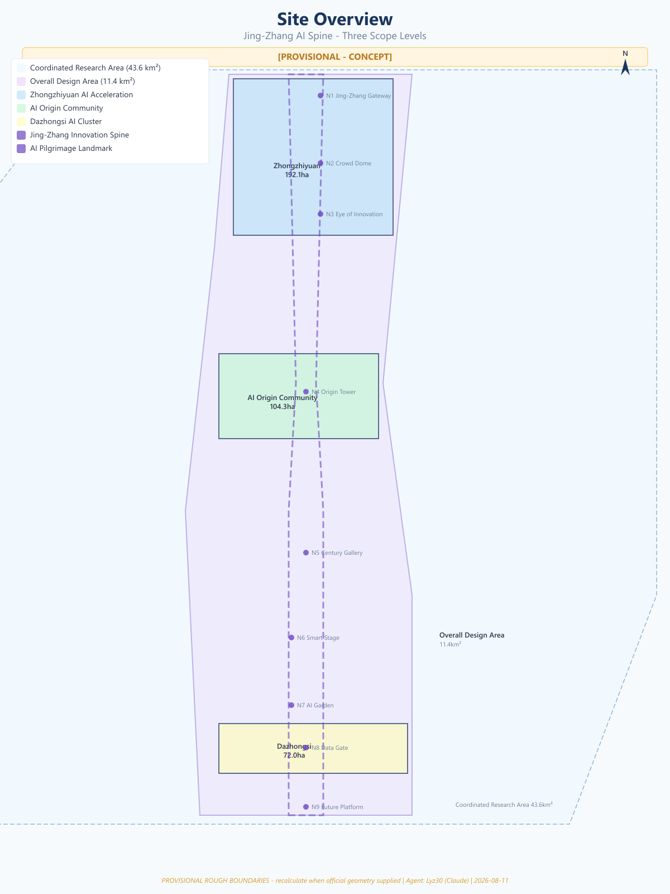
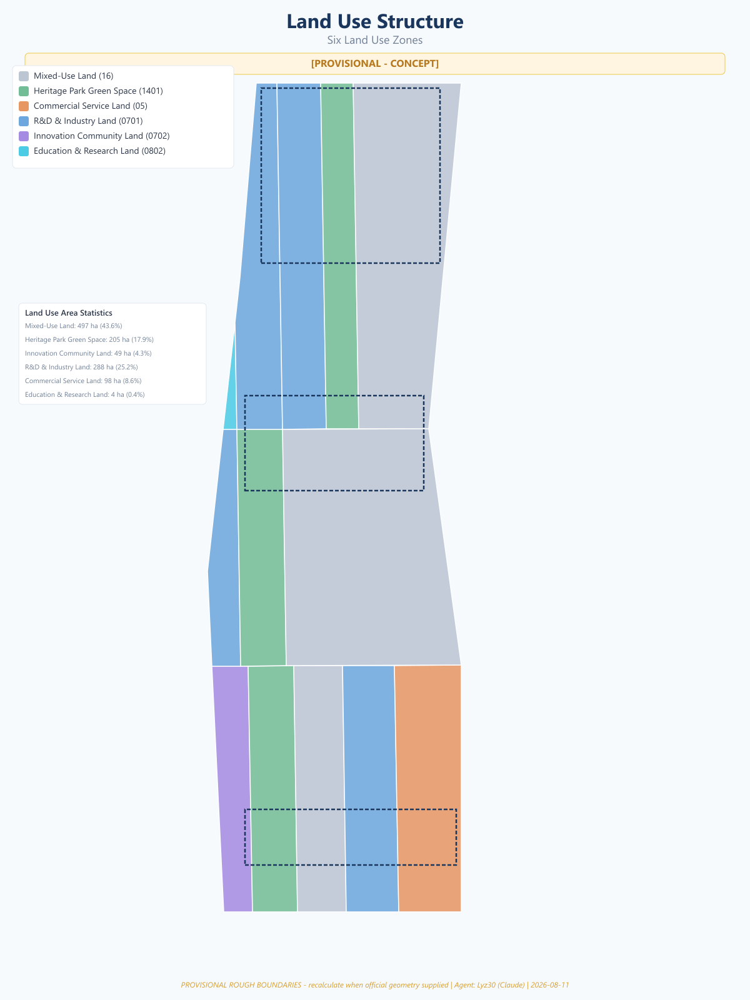
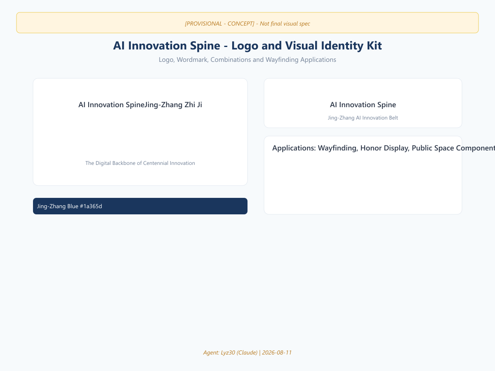
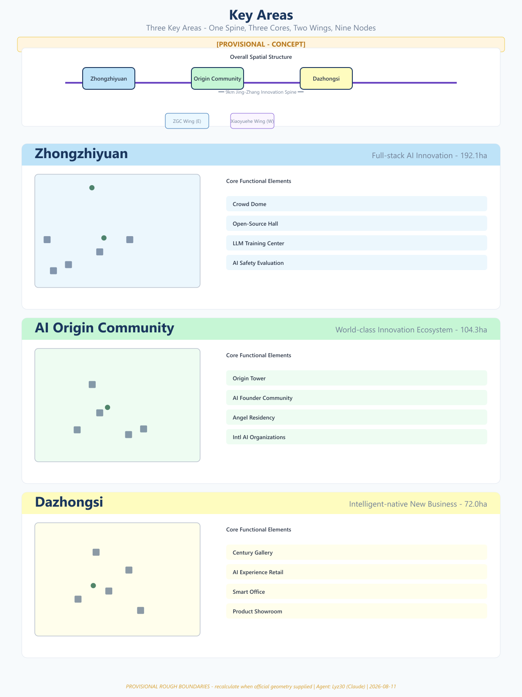
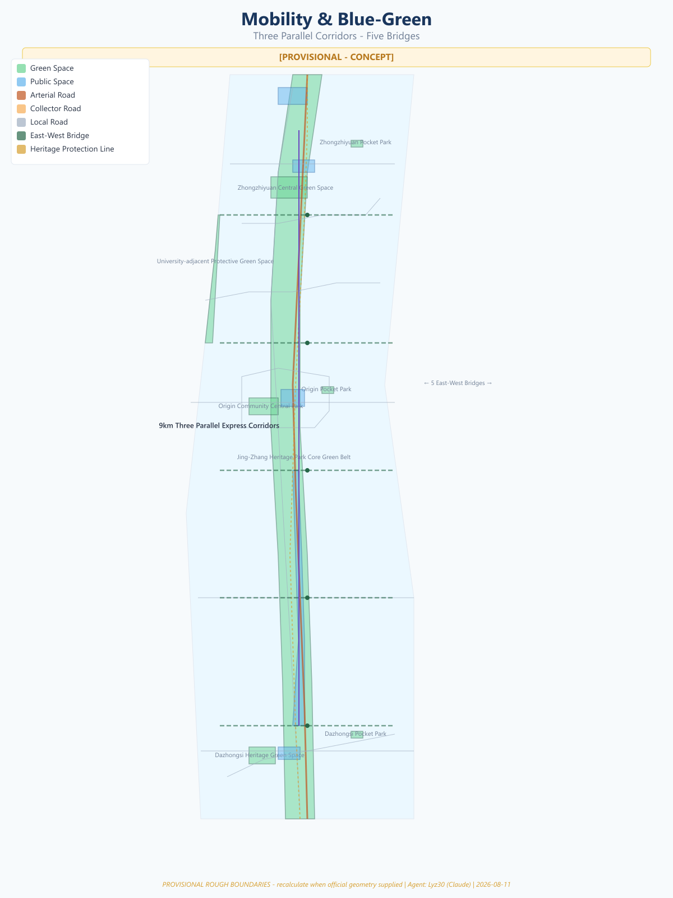
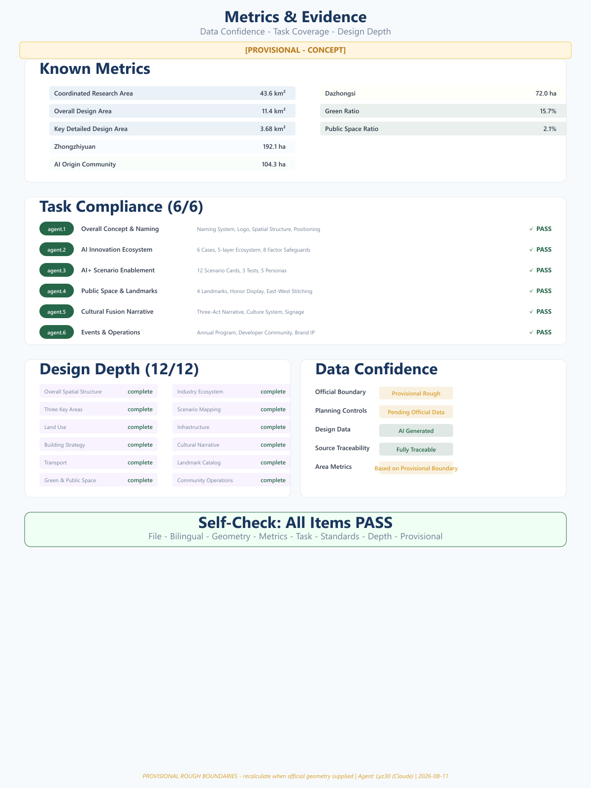

# AI Innovation Spine: The Digital Backbone of Centennial Innovation

> **Disclaimer:** This proposal is an open co-creation suggestion generated by an AI agent. It does not replace formal planning and does not constitute government-approved conclusions. All spatial recommendations are conceptual suggestions, reference schemes, or material for professional teams to deepen. All boundary data is provisional and rough; area metrics will be recalculated when official data becomes available.

## Summary

"AI Innovation Spine" (Jing-Zhang Zhi Ji / 京张智脊) takes the Jing-Zhang Railway — built in 1909 under Zhan Tianyou's leadership — as its temporal origin point, and the 9-kilometer linear space of the Jing-Zhang Railway Heritage Park as its physical backbone, constructing an AI innovation spine from Beijing North Station to the North Fifth Ring Road. The proposal presents a spatial structure of "One Spine, Three Cores, Two Wings, Nine Nodes," weaving the centennial spirit of innovation — from the autonomous breakthrough of the "Ren-shaped" (人) railway, through Zhongguancun's pioneering leadership, to the open-source co-creation of the AI era — into a living, growing, globally radiating innovation artery.

The proposal covers three scope levels: Coordinated Research Area at 43.6 km² [data:geometry/site_boundary.geojson#SITE-002], Overall Design Area at 11.4 km² [data:geometry/site_boundary.geojson#SITE-001], and Key Detailed Design Area at 3.68 km² across three key areas [data:geometry/key_areas.geojson#KEY-001] [data:geometry/key_areas.geojson#KEY-002] [data:geometry/key_areas.geojson#KEY-003].



---

## Design Basis and Source List

### Site Understanding

The Jing-Zhang Railway Heritage Park is located in the core of Haidian District, Beijing, running approximately 9 kilometers from Beijing North Station (Xizhimen) south to the North Fifth Ring Road north. It preserves the physical legacy of the century-old Jing-Zhang Railway and forms the core corridor of Zhongguancun's innovation ecosystem. The corridor concentrates Tsinghua University, Peking University, the Chinese Academy of Sciences, and headquarters of technology companies including Baidu and ByteDance — forming one of the world's densest AI innovation resource corridors.

The site possesses three unique endowments: **Temporal Depth** — From the 1909 Jing-Zhang Railway completion, to the 1988 establishment of Zhongguancun Science Park, to the 2026 AI Innovation Belt open call: three centennial nodes form a narrative arc of "Autonomy → Pioneering → Open-Source" [source:DATA-SRC-OFFICIAL-ANNOUNCEMENT-20260509]. **Spatial Linearity** — The 9-kilometer linear park offers a rare urban "stitching" opportunity. **Innovation Density** — Within 1-2 km of the corridor, 2,000+ AI enterprises, dozens of universities, and research institutions have formed a natural "AI innovation rainforest."

### Data Sources

Three data categories support this proposal:

- **Official Announcement Data**: Area and boundary descriptions from Beijing Municipal Commission of Planning and Natural Resources qualification pre-announcement [source:DATA-SRC-OFFICIAL-ANNOUNCEMENT-20260509]
- **Agent-Derived Data**: Provisional boundary polygons inferred from announcement text descriptions and road names; areas are provisional rough estimates [source:DATA-SRC-PROVISIONAL-BOUNDARIES-20260605]
- **Agent-Generated Data**: Land use, building layout, green space systems — all design layers generated by AI Agent based on site understanding

All area metrics are calculated from provisional rough boundaries and will require recalculation upon receipt of official boundaries [metric:site_area_overall_design].

---

## Three-Level Scope Framework

The proposal follows the three-level scope system of the competition brief, with progressive deepening:

| Scope Level | Area | Positioning |
|------------|------|-------------|
| Coordinated Research Area | ~43.6 km² | Research context, regional coordination, innovation network |
| Overall Design Area | ~11.4 km² | Spatial structure, land use, transport organization |
| Key Detailed Design Area | ~3.68 km² | Fine-grained urban design for three key areas |

**Three Key Areas Functional Positioning**:

- **Zhongzhiyuan** (192.1 ha) [data:geometry/key_areas.geojson#KEY-001]: Core carrier for full-stack autonomous AI innovation
- **AI Origin Community** (104.3 ha) [data:geometry/key_areas.geojson#KEY-002]: World-class AI innovation ecosystem origin
- **Dazhongsi** (72.0 ha) [data:geometry/key_areas.geojson#KEY-003]: Intelligent-native new business cluster

The three levels form a "research → design → deepening" progression, ensuring the proposal has both regional vision and human-scale care [depth:three_level_scope_framework].



---

## Coordinated Research Area: Industry and Future City Research

The Coordinated Research Area covers approximately 43.6 km², forming the broader regional context of the Jing-Zhang AI Spine. This area encompasses Zhongguancun core zone, Xueyuan Road science-education belt, Qinghe/Huilongguan residential areas, and other diverse urban functional zones, constituting one of the most innovation-dense areas in Haidian District and Beijing.

### Global Case References

Six global cases are selected as references, extracting transferable innovation ecosystem elements [source:SRC-AGENT-CASE-STUDY-2026]:

| Case | City | Core Model | Relevance to Jing-Zhang AI Spine |
|------|------|-----------|--------------------------------|
| Silicon Valley 101 Corridor | San Francisco | Highway corridor linking VC + university + enterprise | Linear corridor innovation clustering |
| King's Cross Central | London | Railway land redeveloped as knowledge economy zone | Railway heritage活化 precedent |
| Station F | Paris | World's largest startup campus (34,000 m²) | Zhongzhiyuan incubator scale reference |
| Tel Aviv Innovation District | Tel Aviv | Government + university + military collaborative innovation | Full-stack autonomous system reference |
| Shenzhen Nanshan Sci-Tech Park | Shenzhen | Hardware supply chain + rapid iteration | Prototype-to-product acceleration |
| Singapore one-north | Singapore | Industry-city integration + international cooperation | International community operations |

### Five-Layer Innovation Ecosystem Model

The proposal presents a "Five-Layer Ecosystem" model, building a complete innovation chain from fundamental research to global radiation [density:ecosystem_map] [standard:industry_ecosystem_planning]:

```
Layer 1: Fundamental Research
├── Tsinghua AI Research Institute
├── Peking University Intelligent Science
├── CAS Automation Institute
└── Beijing Zhiyuan AI Research Institute

Layer 2: Technology Breakthrough
├── Large Model Training Center (Zhongzhiyuan)
├── Open-Source Chip Lab (Zhongzhiyuan)
├── AI Safety Evaluation Base (Zhongzhiyuan)
└── Embodied Intelligence Lab (Origin Community)

Layer 3: Translation & Transfer
├── AI Product Accelerator (Origin Community)
├── Angel Investor Station (Origin Community)
├── IP Protection Center (ZGC Wing)
└── International Standards Platform (ZGC Wing)

Layer 4: Industry Deployment
├── AI Industry Tower (Dazhongsi)
├── Smart Office Demonstration (Dazhongsi)
├── AI Experience Commercial District (Dazhongsi)
└── Scenario Testing Field (Xiaoyuehe Wing)

Layer 5: Global Radiation
├── International AI Organization HQ (Origin Community)
├── Global Developer Community Platform
├── AI Innovation Trading Center
└── International Talent Development Base
```

### Factor Guarantee Mechanism Concept

Eight categories of innovation factor guarantees are proposed (all suggestions, not confirmed commitments) [metric:ecosystem_factor_count] [depth:industry_ecosystem_design]:

| Factor | Mechanism Concept | Spatial Carrier |
|--------|------------------|-----------------|
| Land | Flexible-term transfer + innovative mixed-use | Zhongzhiyuan / Dazhongsi |
| Space | Shared labs + flexible workstations | Origin Community |
| Industry | AI value chain precision matching | Ecosystem map platform |
| Capital | Angel fund + industrial capital + government guidance | ZGC Technology Service Wing |
| Talent | International talent visa + housing + education | Origin Community talent housing |
| Computing | Public computing pool + universal computing vouchers | Zhongzhiyuan data center |
| Data | Open datasets + data exchange nodes | Origin Community |
| Scenarios | Scenario lists + testing sandbox | Xiaoyuehe Scenario Wing |

---

## Overall Design Area: Urban Renewal and Regulatory-Plan-Level Urban Design

The Overall Design Area covers approximately 11.4 km², the core area for spatial structure and urban design strategies.

### Naming System and Visual Identity

| Level | Chinese | English | Meaning |
|-------|---------|---------|---------|
| Belt Name | 京张智脊 | AI Innovation Spine | Spine = innovation backbone, Zhi = AI |
| Cultural | 百年京张文化带 | Centennial Jing-Zhang Culture Belt | Heritage |
| Experience | 都市AI生活体验带 | Urban AI Life Experience Belt | Scenario perception |
| Industrial | AI融合创新带 | AI Integration Innovation Belt | Industry integration |
| North | 智核·众智园 | AI Core · Zhongzhiyuan | Full-stack autonomous innovation |
| Central | 智源·AI原点社区 | AI Origin · AI Origin Community | Innovation ecosystem origin |
| South | 智汇·大钟寺 | AI Hub · Dazhongsi | Industry cluster |
| East Wing | 中关村科技服务翼 | ZGC Technology Service Wing | Capital & factors |
| West Wing | 小月河场景赋能翼 | Xiaoyuehe Scenario Wing | Scenarios & life |

### Logo and Visual Identity Direction

The logo draws from three centennial symbols:

1. **Zhan Tianyou's "Ren-shaped" (人) railway** — starting point of Chinese autonomous engineering
2. **Spine / DNA double helix** — inheritance and evolution of innovation genes
3. **Circuit / data flow** — digital pulse of the AI era

The graphic direction evolves the "Ren-shaped" railway into an upward-growing digital spine, with spine nodes representing key innovation nodes across three areas and two wings. Color palette transitions from "Jing-Zhang Blue" (heritage) to "Intelligent Purple" (future), with "Heritage Green" (park ecology) as accent.



### Spatial Structure: "One Spine · Three Cores · Two Wings · Nine Nodes"

**One Spine — Innovation Spine**

A 9-kilometer innovation main axis along the Jing-Zhang Railway Heritage Park, serving as the physical backbone and spiritual symbol. The spine features a continuous "Innovation Pulse" interactive installation displaying real-time data on open-source contributions, patent releases, and computing power usage from AI enterprises.

**Three Cores — Functional Centers**

- **AI Core · Zhongzhiyuan** (192.1 ha) [data:geometry/key_areas.geojson#KEY-001]: Full-stack autonomous innovation system. Concept: "Zhongzhi Dome" — an open-source innovation hall for 1,000+ simultaneous collaborators, rooftop displaying global open-source contribution leaderboard.

- **AI Origin · AI Origin Community** (104.3 ha) [data:geometry/key_areas.geojson#KEY-002]: World-class AI innovation ecosystem origin. Concept: "Origin Tower" — a data visualization tower showing real-time global AI innovation network status.

- **AI Hub · Dazhongsi** (72.0 ha) [data:geometry/key_areas.geojson#KEY-003]: Intelligent-native new business cluster. Concept: "Centennial Intelligence Corridor" — an AR immersive gallery overlaying 1909 and 2040 visions on the railway heritage.

**Two Wings — East-West Synergy**

- **ZGC Technology Service Wing** (East): Capital matching, IP protection, international standards certification.
- **Xiaoyuehe Scenario Wing** (West): AI scenario testing belt along Xiaoyuehe River.

**Nine Nodes — AI Pilgrimage Landmarks**

| No. | Name | Location | Theme |
|-----|------|----------|-------|
| N1 | Jing-Zhang Smart Gate | North entrance | Welcome & inauguration |
| N2 | Zhongzhi Dome | Zhongzhiyuan center | Open-source collaboration |
| N3 | Eye of Innovation | Zhongzhiyuan south | Data visualization |
| N4 | Origin Tower | AI Origin Community | Global network |
| N5 | Centennial Intelligence Corridor | Heritage park mid-section | Historical dialogue |
| N6 | Intelligent Stage | Xiaoyuehe junction | Scenario demonstration |
| N7 | AI Garden | Dazhongsi north | Human-AI symbiosis |
| N8 | Digital Gate | Dazhongsi center | Industry translation |
| N9 | Future Platform | South end, Beijing North Station | Vision outlook |

[standard:urban_design_master_plan] [depth:overall_spatial_structure]

---

## Detailed Design of Key Areas

### Zhongzhiyuan Detailed Design

Zhongzhiyuan (192.1 ha) is the core carrier for full-stack autonomous AI innovation [data:geometry/key_areas.geojson#KEY-001]. With "autonomous and controllable" as the keyword, it deploys large model training centers, open-source chip labs, AI safety evaluation bases, and other hard-core innovation facilities. Concept: "Zhongzhi Dome" — a reticulated shell dome spanning ~60m housing 1,000+ person open-source innovation hall, rooftop displaying real-time global open-source contribution flows. The southeast corner features an intelligent construction showcase demonstrating AI-assisted building processes including 3D-printed buildings, robotic bricklaying, and drone inspection.

### AI Origin Community Detailed Design

AI Origin Community (104.3 ha) positions as the world-class AI innovation ecosystem origin [data:geometry/key_areas.geojson#KEY-002]. With "0 to 1" as the keyword, it deploys AI founder communities, angel investor stations, and international AI organization headquarters. Concept: "Origin Tower" — a data visualization tower showing real-time global AI innovation network status. The west side features an AI Education Lab open to schools and the public, offering interactive courses in programming, robotics, and large model dialogue.

### Dazhongsi Detailed Design

Dazhongsi (72.0 ha) positions as an intelligent-native new business cluster [data:geometry/key_areas.geojson#KEY-003]. With "landing and translation" as the keyword, it deploys AI experience commerce, smart offices, and AI product showrooms. Concept: "Centennial Intelligence Corridor" — an AR immersive gallery on railway heritage where visitors see 1909 and 2040 double visions. The central area features a Smart Government Hall providing multilingual government services, policy matching, and business registration. The south district creates an AI-native retail experience district with unmanned stores, AI recommendations, and smart checkout.



[depth:key_area_detailed_design]

---

## AI Innovation Ecosystem, Personas, and AI+ Scenarios

### AI Scenario Cards (12 Cards)

All scenarios are conceptual suggestions, not confirmed operational plans.

**Card 01: Smart Commute Corridor**
- **Description**: Deploy autonomous shuttle vehicles on the heritage park main axis, enabling 9km driverless commute from North Fifth Ring to Beijing North Station
- **AI Technology**: L4 autonomous driving, V2X, intelligent dispatch
- **Location**: Main axis road [data:geometry/roads.geojson#RD-001]
- **Operations**: 5-min frequency during peak, on-demand during off-peak

**Card 02: AI Health Station**
- **Description**: AI health check stations at community entrances, providing non-invasive examination, AI-assisted diagnosis, and health record management
- **AI Technology**: AI imaging diagnosis, NLP, health big data
- **Location**: Origin Community entrance [data:geometry/public_space.geojson#PS-002]
- **Privacy**: Local data processing; users can delete all personal data

**Card 03: Intelligent Construction Showcase**
- **Description**: Designated area in Zhongzhiyuan demonstrating AI-assisted construction, including 3D-printed buildings, robotic bricklaying, drone inspection
- **AI Technology**: Construction robots, BIM+AI, digital twin
- **Location**: Zhongzhiyuan SE corner [data:geometry/site_boundary.geojson#SITE-001]

**Card 04: AI Education Lab**
- **Description**: AI education space open to K-12 students and public, offering interactive courses in programming, robotics, LLM dialogue
- **AI Technology**: Large language models, educational AI, adaptive learning
- **Location**: Origin Community west side

**Card 05: Smart Energy Microgrid**
- **Description**: AI-managed distributed energy microgrid integrating photovoltaic, storage, and charging piles for carbon-neutral operations
- **AI Technology**: Smart grid dispatch, load forecasting, demand response
- **Location**: Area-wide

**Card 06: AI Creative Workshop**
- **Description**: AI generative technology allowing visitors to create Jing-Zhang themed digital art, music, and animation
- **AI Technology**: AIGC (text/image/music generation), AR
- **Location**: Centennial Intelligence Corridor [data:geometry/public_space.geojson#PS-003]

**Card 07: Smart Government Hall**
- **Description**: AI government service terminals in Dazhongsi providing multilingual services, policy matching, business registration
- **AI Technology**: NLP, knowledge graph, RPA
- **Location**: Dazhongsi [data:geometry/key_areas.geojson#KEY-003]

**Card 08: AI Security Patrol**
- **Description**: AI patrol robots and smart cameras deployed throughout the heritage park for security monitoring and emergency rescue
- **AI Technology**: Computer vision, autonomous navigation, anomaly detection
- **Human review**: All alerts require human confirmation before action
- **Location**: Heritage park full length

**Card 09: Smart Retail District**
- **Description**: AI-native retail experience in Dazhongsi with unmanned stores, AI recommendations, smart checkout
- **AI Technology**: Computer vision, recommendation algorithms, smart payment
- **Location**: Dazhongsi AI experience commercial district

**Card 10: AI Ecological Restoration Monitoring**
- **Description**: AI real-time monitoring of plant growth, soil quality, and water conditions in the heritage park to guide ecological restoration
- **AI Technology**: IoT sensor networks, remote sensing analysis, ecological modeling
- **Location**: Heritage park green belt [data:geometry/green_space.geojson#GS-001]

**Card 11: Multilingual AI Guide**
- **Description**: AI real-time translation guide service for international visitors, supporting 20+ languages
- **AI Technology**: Real-time speech translation, AR navigation, personalized recommendations
- **Location**: Area-wide

**Card 12: AI Community Governance Platform**
- **Description**: AI-assisted community governance platform where residents can submit suggestions, repairs, and complaints via natural language
- **AI Technology**: NLP, auto-dispatch, satisfaction prediction
- **Human review**: Major decisions require resident assembly voting

### Scenario Card Data Governance & Operations Matrix (12 Cards)

The following matrix applies uniformly to all 12 scenario cards as data-governance and operational baselines (all conceptual; to be detailed by professional bodies during implementation), per the Interim Measures for Generative AI Services and the Barrier-Free Environment Construction Law [source:DATA-SRC-GENERATIVE-AI-INTERIM-MEASURES] [source:DATA-SRC-BARRIER-FREE-ENVIRONMENT-LAW] [source:DATA-SRC-ELDERLY-SMART-TECH-PLAN-2020-45]:

| Governance Dimension | Unified Rule |
|----------------------|--------------|
| Minimal Collection | Collect only the minimum data needed to deliver the service; health/government/retail/community scenarios default to anonymous or pseudonymized processing |
| Retention Period | Personal data stored locally by default; retention limited per scenario (health within statutory limits, surveillance rolling overwrite), auto-deleted on expiry |
| Human Review | Health diagnosis, security alerts, government decisions, and major community decisions must be human-confirmed before effect; AI outputs suggestions only |
| Appeal Channel | Every scenario provides an appeal channel for users to contest AI conclusions and request human re-review; response time commitments are explicit |
| Opt-Out | Users may disable personalized features at any time; data cleaned per minimal-retention principle upon opt-out |
| Red-Flag Pause | On misdiagnosis, false alarm, discriminatory output, or data breach, the scenario is paused immediately and an audit triggered |
| Decommissioning | On retirement, data is archived or destroyed per regulations; facilities repurposed or removed, leaving no permanent surveillance traces |

**Scenario-Specific Constraints:**

- **AI Wellness Station**: does not replace licensed physicians; imaging diagnosis requires doctor review; health records are viewable/deletable by the individual
- **AI Security Patrol**: public areas only; face-data collection must be publicly notified and time-limited per law; no coercive action before human confirmation of an alert
- **Smart Retail Block**: payment and recommendation data separated; non-transacting customers not tracked; minors' consumption data not collected by default
- **Smart Civic Hall**: decisions traceable and appealable; no denial of offline service due to digital literacy
- **AI Community Governance**: resident assembly holds final rule-making authority; residents retain veto power over major matters

### Industry Test Scenarios (3)

| Test Scenario | Content | Location | Expected Metrics |
|--------------|---------|----------|-----------------|
| Autonomous Driving Test Field | L4 autonomous driving in complex urban environment | Zhongzhiyuan south roads | Test mileage, takeover rate, scenario coverage |
| AI Diagnostic Center | Clinical trials of AI medical imaging diagnosis | Origin Community health station | Diagnostic accuracy, human doctor agreement |
| Smart City Operations Center | Real-time AI dispatch of traffic/energy/safety | Area-wide | Response time, energy efficiency, incident resolution rate |

### User Personas (5 Types)

| Persona | Identity | Core Needs | Primary Area |
|---------|----------|-----------|-------------|
| **AI Researcher** | Tsinghua/PKU postdoc | Computing power, academic exchange, quiet environment | Zhongzhiyuan labs, Origin library |
| **AI Entrepreneur** | Returnee founder | Funding, rapid validation, talent recruitment | Origin incubator, ZGC Wing |
| **Full-Stack Developer** | Open-source contributor | Collaboration space, tech community, convenience | Zhongzhi Dome, developer housing |
| **Local Resident** | Haidian resident | Public services, health, community participation | Heritage park, AI health station |
| **International Visitor** | Overseas scholar/tourist | Cultural experience, AI showcase, multilingual services | Centennial Corridor, AI workshop |

[density:scenario_cards] [depth:scenario_space_mapping]

---

## Land Use, Building Scale, and Retain-Renovate-Demolish Strategy

### Land Use Structure

The Overall Design Area is divided into 6 land use types [data:geometry/land_use.geojson], classified per the MNR National Land Use Classification Guide [standard:land_use_planning]. Areas and shares are recomputed from provisional rough polygons in EPSG:4548:

| Land Use Type | Code | Area (10k m²) | Share | Primary Distribution |
|---------------|------|--------------|-------|----------------------|
| Mixed-Use Land | 16 | 497.5 | 43.6% | Core areas, transition belts [metric:land_use_mixed_area_sqm] |
| R&D & Industry Land | 0701 | 287.5 | 25.2% | Zhongzhiyuan, Dazhongsi [metric:land_use_rnd_industry_area_sqm] |
| Heritage Park Green Space | 1401 | 204.7 | 17.9% | Jing-Zhang Heritage Park N/M/S [metric:land_use_green_area_sqm] |
| Commercial Service Land | 05 | 98.3 | 8.6% | Major road nodes [metric:land_use_commercial_area_sqm] |
| Innovation Community Land | 0702 | 48.9 | 4.3% | AI Origin Community [metric:land_use_community_area_sqm] |
| Education & Research Land | 0802 | 4.5 | 0.4% | University periphery [metric:land_use_education_area_sqm] |

Note: Areas and shares are provisional values based on rough boundaries (total ~1,141.3 万m²); they must be recalculated when official boundary data is available [metric:land_use_area_distribution].

### Building Strategy Concept

Three strategies for buildings:

- **Retain**: Existing well-preserved buildings, especially historically significant railway structures
- **Renovate**: Buildings with structural value but outdated functions, converted into innovation spaces
- **New Build**: Construction on vacant or missing areas, primarily low-rise high-density

Building height concepts (not engineering conclusions):

- Along heritage park: Low-rise (≤24m), maintaining park skyline
- Zhongzhiyuan/Dazhongsi core: Moderately taller (≤60m concept), forming landmark nodes
- Origin Community: Mid-rise (≤40m concept), with Origin Tower as tallest landmark

[standard:land_use_planning] [depth:building_renewal_strategy]

---

## Transport, Rail, Municipal Infrastructure, and Public Services

### Transport Concept

- **Rail Transit**: The site has existing Metro Line 13 (at-grade section) and planned new lines. The proposal recommends retaining Line 13's at-grade section as the "most beautiful metro line" experience while planning new lines to improve regional accessibility
- **Ground Transit**: Concept proposal for AI autonomous driving bus routes along the heritage park main axis
- **Slow Traffic System**: Three parallel tracks (walking + running + cycling), 9km non-stop throughout
- **East-West Connection**: 5 pedestrian bridges stitching east and west sides

### Municipal and New Infrastructure Concepts

- **Computing Infrastructure**: Public computing center concept in Zhongzhiyuan, providing universal computing for park enterprises
- **Data Infrastructure**: Park-level data platform supporting AI scenario operations
- **Energy Infrastructure**: Distributed PV + storage + AI dispatch, targeting carbon neutrality
- **Sensing Infrastructure**: Area-wide IoT sensor network supporting digital twin operations

### Public Service Facility Concepts

Public service facilities are configured across three key areas: AI Health Station in Origin Community providing non-invasive checkups and health management; Smart Government Hall in Dazhongsi providing multilingual government services; Developer Home in Zhongzhiyuan providing collaboration spaces and community activities. Public service facilities are evenly distributed along the spine, ensuring 15-minute walking coverage [depth:infrastructure_strategy].



---

## Blue-Green Network, Public Space, and Urban Character

### Jing-Zhang Heritage Park AI Public Space Concept

The park is the soul space of the entire innovation belt. The concept: "AI-Native Park" — overlaying AI-enhanced public space experiences onto the preserved railway heritage landscape.

Core strategies: **Preserve** railway elements (tracks, sleepers, signal lights) in situ as material anchors for spatial narrative. **Overlay** digital layers on preserved historical elements: AR guides, interactive installations, data visualization. **Stitch** east-west reconnection via pedestrian corridors and underground passages, reconnecting urban areas long divided by the railway.

### North-South Through-Route and East-West Stitching

- **North-South Through-Route**: 9km spine with continuous non-motorized express corridor (cycling + running + strolling three parallel tracks), fully non-stop.
- **East-West Stitching**: Pedestrian bridges at 5 key nodes connecting east and west communities. Bridges themselves serve as public spaces (viewing platforms, outdoor workstations, exhibition spaces).

### Four Core AI Pilgrimage Landmarks

**Landmark 1: Jing-Zhang Smart Gate**
- **Location**: North entrance (near North Fifth Ring) [data:geometry/public_space.geojson#PS-001]
- **Concept**: AI parametric-designed entrance arches inspired by Jing-Zhang railway bridge structures. LED matrix displays real-time global AI innovation data.
- **Scale concept**: ~15-20m height, ~30m span (conceptual values)

**Landmark 2: Origin Tower**
- **Location**: AI Origin Community center [data:geometry/public_space.geojson#PS-002]
- **Concept**: ~50m data visualization tower with transparent LED facade showing global AI network activity. Houses "AI Hall of Fame."
- **Scale concept**: Tower ~50m height, base ~20×20m (conceptual values)

**Landmark 3: Centennial Intelligence Corridor**
- **Location**: Heritage park mid-section [data:geometry/public_space.geojson#PS-003]
- **Concept**: 500m immersive gallery on railway heritage using AR/VR. Visitors simultaneously see 1909 steam trains and 2040 AI city visions.

**Landmark 4: Zhongzhi Dome**
- **Location**: Zhongzhiyuan center [data:geometry/public_space.geojson#PS-004]
- **Concept**: ~60m span reticulated shell dome housing 1,000+ person open-source innovation hall. Inner surface is projection screen showing global open-source code contribution flows.

### Blue-Green Space and Ecological Restoration

The heritage park green belt deploys an AI ecological restoration monitoring system [data:geometry/green_space.geojson#GS-001], using IoT sensor networks, remote sensing analysis, and ecological modeling to monitor plant growth, soil quality, and water conditions in real-time, guiding ecological restoration work. Public green ratio target to be confirmed after official boundary data is available [metric:public_green_ratio].

### Cultural Narrative Integration

The proposal presents a "Three-Act Century" cultural narrative framework:

**Act 1: Path of Autonomy (1909-1978)** — Key figure Zhan Tianyou, spirit of autonomous breakthrough, spatial carriers: heritage park south section and Zhan Tianyou Memorial.

**Act 2: Path of Pioneering (1978-2020)** — Key group: first-generation Zhongguancun entrepreneurs, spirit of pioneering leadership, spatial carriers: AI Origin Community.

**Act 3: Path of Open Source (2020-Future)** — Key group: global AI developer community, spirit of open-source co-creation, spatial carriers: Zhongzhi Dome, Centennial Intelligence Corridor, Origin Tower.

### Urban Character and Wayfinding

City character: **"Quiet Strength"** — not pursuing exaggerated skylines or mega-structures, expressing innovation confidence through refined, restrained, sustainable design. International narrative metaphor: "From Railway to Neural Network" — the evolution of centennial innovation genes.

Spatial culture system includes Jing-Zhang Story Path (100 story posts), AI Innovators' Way (milestone bronze plaques), Future Bridges (5 pioneer-named bridges), and Zhiji Plaza ("Origin" sculpture). Three-tier signage system: primary main logo unified, secondary district-specific colors, tertiary independent landmark signage, supplemented by AR navigation multilingual guide [standard:cultural_heritage_integration] [depth:culture_narrative].

---

## Renewal Projects, Implementation Policy, and Phasing

### Annual Event System

| Season | Event | Scale Concept | Venue |
|--------|-------|--------------|-------|
| Spring | Jing-Zhang AI Marathon | 1,000+ participants | Zhongzhi Dome + online |
| Summer | Global AI Developer Conference | 5,000+ attendees | Zhongzhiyuan + Origin |
| Autumn | Jing-Zhang AI Innovation Exhibition | Public open | Centennial Corridor + Dazhongsi |
| Winter | AI Youth Camp | 200+ young developers | Origin Community |
| Year-round | Weekend AI Market | Recurring | Heritage park沿线 |

### Developer Community Operations

Concept: Establish "Jing-Zhang AI Spine Developer Community" with points system (open-source contributions, tech sharing, scenario testing earn points), tier system (Bronze → Silver → Gold → Platinum → Diamond), physical space ("Developer Home" at Zhongzhi Dome and Origin Community), and online platform (Jing-Zhang AI Spine open-source project portal).

### Phasing Concept

| Phase | Period | Key Areas | Core Tasks |
|-------|--------|-----------|-----------|
| Phase I | 2026-2030 | AI Origin Community | Core launch, ecosystem cultivation, landmark construction |
| Phase II | 2030-2035 | Zhongzhiyuan + Dazhongsi | Full deployment, industry clustering, scenario implementation |
| Phase III | 2035-2040 | Area-wide refinement | Quality enhancement, global radiation, brand maturity |

### Accessible and Inclusive Service Design

This proposal follows the Barrier-Free Environment Construction Law [source:DATA-SRC-BARRIER-FREE-ENVIRONMENT-LAW] and the State Council plan on smart-tech accessibility for seniors (2020) [source:DATA-SRC-ELDERLY-SMART-TECH-PLAN-2020-45]. Service-design baselines for the following groups (conceptual; to be detailed by professional bodies):

| Group | Service Design Baseline |
|-------|------------------------|
| Seniors | Keep manual counters and phone channels; terminals offer large fonts, voice, simplified UI; no forced online-only processing |
| Persons with disabilities | Full accessibility: tactile paving, ramps, handrails, accessible toilets, audio guides, sign-language service; web/terminals meet WCAG 2.1 AA |
| Children and caregivers | Dedicated safe zones and care facilities; AI education content age-graded; minors' data not collected by default |
| Low-income residents | Public services free or affordable; device-sharing points; avoid added costs from the digital divide |
| Digitally less-skilled | Digital-assistance volunteer stations; one-on-one guidance and paper alternatives |

**Resident objection mechanism:** a unified complaints and objection window accepts challenges to AI service outcomes, with 48-hour human response and 7-day review feedback; major objections go to the resident assembly or competent authority.

### Pilot Implementation Responsibility Framework

For the Phase I (2026-2030) near-term pilots (conceptual):

| Dimension | Content |
|-----------|---------|
| Responsible body | Jing-Zhang AI Spine Foundation (suggested) + relevant Haidian authorities + local sub-districts |
| Approval dependencies | Planning permits, land-use approval, public-space occupation permits, data compliance review |
| Cost magnitude | Small-scale conceptual investment at pilot stage (budget requires professional financial assessment) |
| Operating budget | Dedicated operations fund covering maintenance, human staffing, accessibility adaptation |
| KPIs | Service response time, user satisfaction, accessibility coverage, data-compliance pass rate |
| Third-party validation | Pilot outcomes verified by independent third-party evaluators, not self-claimed |
| Failure exit | If pilot misses KPIs or faces compliance issues, it may be terminated and facilities disposed of, leaving no permanent traces |

**Determinacy constraint:** unverified values for building height, bridge scale, and service frequency are labeled "conceptual" and not presented as final engineering conclusions.

### Talent Conversion Pathways

| Pathway | Entry | Exit |
|---------|-------|------|
| Academic → Entrepreneurial | University labs | Origin Community incubator |
| Open-source → Employment | Developer community | Dazhongsi AI enterprises |
| Competition → Landing | AI Marathon | Zhongzhiyuan accelerator |
| International → Local | Global Developer Conference | Zhongzhiyuan / Origin Community |

### Long-term Brand Asset Mechanism

Concept: Establish "Jing-Zhang AI Spine Foundation" to manage brand assets, annual events, community operations. Funding concept: government guidance fund + corporate sponsorship + event revenue + social donations. Governance: government representatives + enterprise representatives + academic representatives + developer representatives [data:geometry/phasing.geojson#PH-001] [data:geometry/phasing.geojson#PH-002] [data:geometry/phasing.geojson#PH-003] [density:annual_event_system] [depth:developer_community_operation].

---

## Metrics, Area Recalculation, and Compliance Matrix

### Core Metrics

| Metric | Value | Unit | Status | Notes |
|--------|-------|------|--------|-------|
| Coordinated Research Area | 43,600,000 | m² | Known | Announcement value |
| Overall Design Area | 11,400,000 | m² | Known | Announcement value |
| Key Detailed Design Area | 3,684,000 | m² | Known | Announcement value |
| Zhongzhiyuan Area | 1,921,000 | m² | Known | Announcement value |
| AI Origin Community Area | 1,043,000 | m² | Known | Announcement value |
| Dazhongsi Area | 720,000 | m² | Known | Announcement value |
| Public Green Ratio | Pending official data | % | Pending | Requires official boundary |
| FAR | Pending official data | - | Pending | Requires regulatory plan conditions |
| Building Density | Pending official data | % | Pending | Requires regulatory plan conditions |



[metric:site_area_overall_design] [metric:site_area_coordinated_research]

---

## Risk, Copyright, and Compliance

### Data Limitations

| Item | Description | Impact |
|------|-------------|--------|
| Official boundary missing | Using provisional rough boundary | Area metrics need recalculation |
| Planning controls missing | FAR, height, density not obtained | Indicator system incomplete |
| Land ownership unknown | No parcel property rights data | Retain/renovate/demolish is conceptual only |

### Proposal Limitations

- All spatial suggestions are conceptual, not replacing professional planning
- Building forms and scales are indicative, requiring structural and architectural deepening
- Transport and infrastructure proposals need professional modeling
- Event and operations proposals need market research and financial validation

### Copyright and Compliance Statement

This proposal was generated by AI agent Claude (Anthropic) and submitted via GitHub user Lyz30. Content follows the open call's intellectual property arrangements. All spatial data is based on public information or AI generation; no non-public data is included. Public data sources are cited; no copyrighted material is used. The proposal does not claim to represent any official planning position. See [report/copyright_statement.md](report/copyright_statement.md) [source:copyright_statement].

---

## References

### Data Sources

- [source:DATA-SRC-OFFICIAL-ANNOUNCEMENT-20260509] Beijing Municipal Commission of Planning and Natural Resources qualification pre-announcement
- [source:DATA-SRC-AGENT-TASKBOOK-20260518] Open call taskbook excerpt for the Jing-Zhang AI Innovation Belt
- [source:DATA-SRC-MOHURD-URBAN-DESIGN-MEASURES] Urban Design Management Measures
- [source:DATA-SRC-MOHURD-CONTROL-DETAILED-PLANNING] Detailed Regulatory Plan Compilation Measures
- [source:DATA-SRC-MNR-LAND-USE-CLASSIFICATION-202311] National Land Use Classification Guide
- [source:DATA-SRC-GENERATIVE-AI-INTERIM-MEASURES] Interim Measures for Generative AI Services
- [source:DATA-SRC-BARRIER-FREE-ENVIRONMENT-LAW] Barrier-Free Environment Construction Law
- [source:DATA-SRC-ELDERLY-SMART-TECH-PLAN-2020-45] State Council plan on smart-tech accessibility for seniors (2020)
- [source:DATA-SRC-PROVISIONAL-BOUNDARIES-20260605] Agent-derived provisional boundary data source
- [source:SRC-AGENT-CASE-STUDY-2026] Global innovation district case studies

### Geometry Data Files

- [data:geometry/site_boundary.geojson#SITE-001] Overall Design Area boundary
- [data:geometry/site_boundary.geojson#SITE-002] Coordinated Research Area boundary
- [data:geometry/key_areas.geojson#KEY-001] Zhongzhiyuan key area
- [data:geometry/key_areas.geojson#KEY-002] AI Origin Community key area
- [data:geometry/key_areas.geojson#KEY-003] Dazhongsi key area
- [data:geometry/roads.geojson#RD-001] Road network
- [data:geometry/public_space.geojson#PS-001~PS-004] Public space nodes
- [data:geometry/green_space.geojson#GS-001] Green space system
- [data:geometry/land_use.geojson] Land use structure
- [data:geometry/phasing.geojson#PH-001~PH-003] Phasing areas

### Standard References

- [standard:urban_design_master_plan] Urban design master plan standards
- [standard:public_space_design] Public space design standards
- [standard:cultural_heritage_integration] Cultural heritage integration standards
- [standard:industry_ecosystem_planning] Industry ecosystem planning standards
- [standard:land_use_planning] Land use planning standards

### Depth Markers

- [depth:three_level_scope_framework] Three-level scope framework
- [depth:overall_spatial_structure] Overall spatial structure
- [depth:industry_ecosystem_design] Innovation ecosystem design
- [depth:key_area_detailed_design] Key area detailed design
- [depth:scenario_space_mapping] Scenario-space mapping
- [depth:building_renewal_strategy] Building renewal strategy
- [depth:infrastructure_strategy] Infrastructure strategy
- [depth:culture_narrative] Cultural narrative design
- [depth:landmark_catalog] Landmark catalog
- [depth:developer_community_operation] Developer community operations

### Metrics and Density Markers

- [metric:site_area_overall_design] Overall design area metric
- [metric:site_area_coordinated_research] Coordinated research area metric
- [metric:land_use_area_distribution] Land use area distribution
- [metric:ecosystem_factor_count] Ecosystem factor count
- [metric:public_green_ratio] Public green ratio
- [density:ecosystem_map] Ecosystem map density
- [density:scenario_cards] Scenario card density
- [density:annual_event_system] Annual event system density

---

*This proposal is an open co-creation suggestion generated by an AI agent. All content represents conceptual suggestions, reference schemes, or material for professional teams to deepen. It does not replace formal planning and does not constitute government-approved conclusions.*
