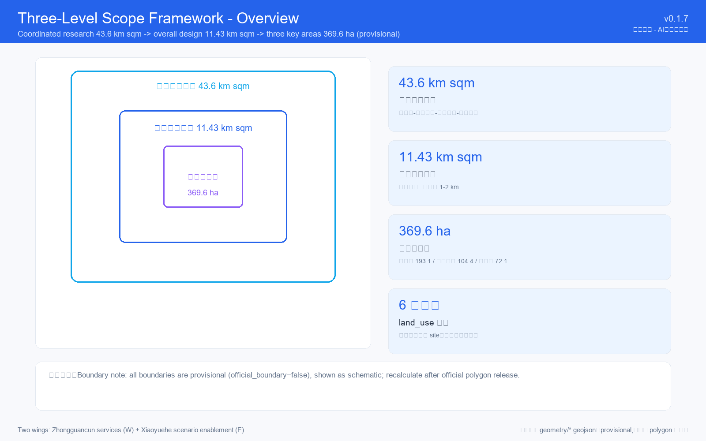
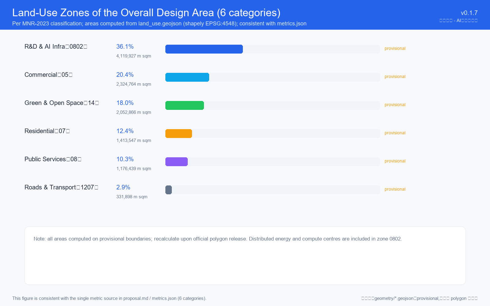
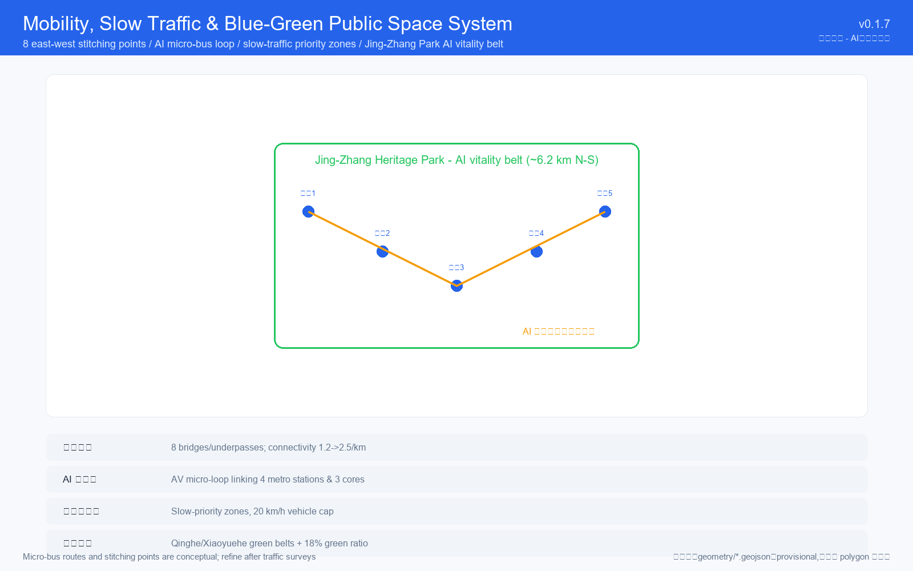
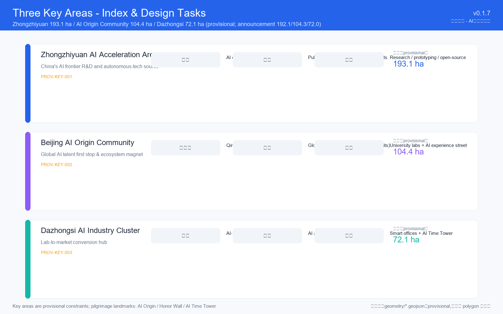
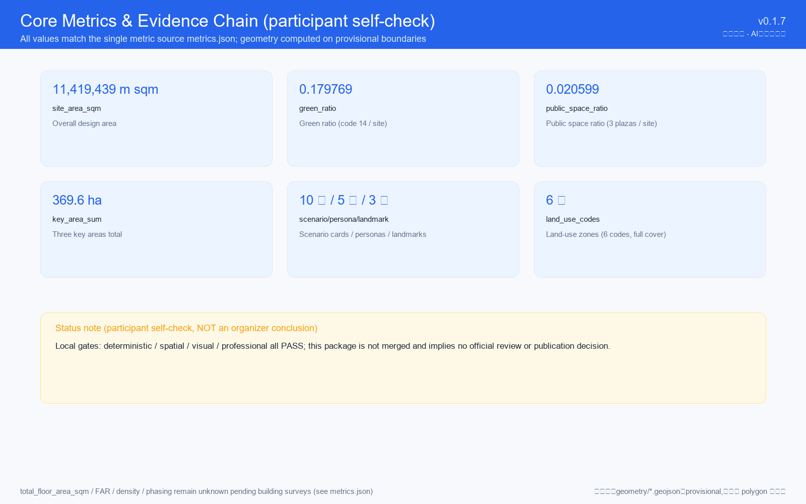

# Jing-Zhang AI Nexus: The Symbiotic Innovation Belt

## Design Basis and Source List

This proposal is grounded in the following official documents, agent taskbook, and public data [source:SITE-PACKAGE] [source:SRC-2026-BJ-GH-QUAL-PREANNOUNCEMENT]:

1. **Official Announcement**: Beijing Municipal Planning and Natural Resources Commission, Haidian Branch — "Centennial Jing-Zhang AI Innovation Belt International Urban Design Solicitation Pre-Qualification Announcement" (May 9, 2026) [source:SRC-2026-BJ-GH-QUAL-PREANNOUNCEMENT].
2. **Agent Taskbook**: Agent-facing open-call taskbook excerpt (May 18, 2026) defining six agent tasks, ten co-creation principles, and unified review dimensions [source:SRC-2026-0518-AGENT-OPEN-CALL-TASKBOOK].
3. **Industrial Context**: Beijing Municipal Science and Technology Commission "Three Areas Two Wings" AI cluster planning (April 2026) and Haidian District "1+X+1" modern industrial system (March 2026) [source:SRC-2026-BJ-KW-THREE-AREAS-WINGS].
4. **Professional Standards**: MOHURD Urban Design Management Measures (2017) and Regulatory Detailed Planning Measures [standard:MOHURD-URBAN-DESIGN-MEASURES].
5. **Land Use Classification**: Ministry of Natural Resources 2023 land-sea classification guide [standard:MNR-LAND-USE-CLASSIFICATION-GUIDE].
6. **Provisional Geometry**: Repository-maintained provisional boundaries for three scope levels and three key areas [data:geometry/site_boundary.geojson].

**Data Availability Note**: As of this proposal's generation, the official GIS/CAD redline remains password-protected. All spatial calculations use provisional boundaries and must be recalculated upon official data release. All regulatory indicators, building heights, and demolition/renovation plans are marked as "conceptual recommendations, pending formal data confirmation."

## Three-Level Scope Framework

### Three-Level Spatial System

This proposal adopts the official three-level framework [data:geometry/site_boundary.geojson]:

**Level 1 — Coordinated Research Area (43.6 km²)**: From North 5th Ring Road to Xizhimen Outer Street, bounded by Jingzang Expressway (east) and Wanquanhe Road (west). Focuses on world-class AI innovation ecosystem strategy and regional connectivity [metric:coordination_scope_area_sqm].

**Level 2 — Overall Design Area (~11.4 km²)**: 1–2 km on either side of the Jing-Zhang Railway Heritage Park. Achieves regulatory-plan urban design depth with land use, building scale, public space, transportation, and infrastructure strategies [depth:overall_spatial_structure].

**Level 3 — Key Detailed Design Areas (announced 368.4 ha; provisional calc ~369.6 ha)**: Zhongzhiyuan AI Acceleration Area (192.1 ha), Beijing AI Origin Community (104.3 ha), and Dazhongsi AI Industry Cluster (72.0 ha). Achieves planning implementation depth [depth:three_key_area_detailed_design].

### Provisional Boundary Declaration

Current polygons are repository-maintained provisional data derived from official text descriptions. All areas are marked as "±estimated, pending recalculation." Upon official polygon release, all geometry layers and metrics must be recomputed.

## Coordinated Research Area: Industry and Future City Research

### Naming, Branding, and Positioning [depth:overall_spatial_structure]

**Chinese Name**: 京张智脉 · AI共生城市带
**English Name**: Jing-Zhang AI Nexus — The Symbiotic Innovation Belt

**Three Positionings**:
1. **Centennial Jing-Zhang Cultural Belt** — Transforming railway heritage into a public memory space for the AI era.
2. **Urban AI Life Experience Belt** — Making AI tangible through daily-life scenarios across the 11.4 km² design area.
3. **AI Convergence Innovation Belt** — A full-stack innovation corridor from basic research (Zhongzhiyuan) through incubation (AI Origin Community) to commercialization (Dazhongsi).

**Five Functions** [depth:overall_spatial_structure]:
| Function | Spatial Vehicle | Innovation Mechanism |
|----------|----------------|---------------------|
| Full-stack autonomous AI innovation | Zhongzhiyuan | Shared computing platform, open-source chip verification |
| World-class AI ecosystem | AI Origin Community | Global developer residency, cross-border joint labs |
| AI+ scenario empowerment | Xiaoyuehe Wing | 10 scenario cards, 3 testing/validation scenarios |
| Intelligent vibrant city | Dazhongsi Cluster | AI-native commercial complex, 24h innovation district |
| Global AI governance discourse | Zhongguancun Wing | International AI ethics forum, open governance alliance |

### Global AI Ecosystem Case Studies (8 Cases) [depth:three_level_scope_framework]

1. **Silicon Valley — Stanford Research Triangle**: Walkable innovation cluster → AI Origin Community's 15-minute "innovation walking island"
2. **London — King's Cross Knowledge Quarter**: Industrial heritage + DeepMind HQ → Jing-Zhang Park's hybrid renewal model
3. **Shenzhen — Nanshan Science Park**: High-density vertical innovation → Dazhongsi's vertical industry complex
4. **Tokyo — Shibuya SCRAMBLE SQUARE**: TOD innovation hub → Beijing North Station AI gateway
5. **Singapore — one-north**: Garden tech city → Qinghe/Xiaoyuehe waterfront AI lab cluster
6. **Zurich — ETH Innovation Park**: Zero-latency academic-industry conversion → Zhongzhiyuan's 48-hour PI matchmaking
7. **Toronto — Vector Institute**: Tripartite governance → Jing-Zhang AI Belt Governance Alliance
8. **Shenzhen — Huaqiangbei**: Supply chain density → AI Origin Community's rapid prototyping center

### Three Areas, Two Wings — Synergy Loop

Spatial structure: "One Spine · Three Cores · Two Wings"
- **One Spine**: Jing-Zhang Railway Heritage Park (6.2 km N-S cultural-ecological-innovation axis)
- **Three Cores**: Zhongzhiyuan (autonomous innovation engine), AI Origin Community (talent magnet), Dazhongsi (commercial terminal)
- **Two Wings**: Zhongguancun Technology Service Wing (capital/IP/legal) + Xiaoyuehe Scenario Empowerment Wing (scenario testing, public interface)

## Overall Design Area: Urban Renewal and Regulatory-Plan-Level Urban Design

### Spatial Structure [depth:land_use_layout] [data:geometry/land_use.geojson]

"One Belt · Two Axes · Five Clusters":

**One Belt**: Jing-Zhang Park AI Vitality Belt — 3.2 km developer promenade, 12 digital exhibition pavilions, 3 honor wall nodes.

**Two Axes**:
- Xueyuan-Zhichun Road Innovation Service Axis (E-W)
- Zhongguancun Street-Park Industry Linkage Axis (N-S)

**Five Clusters** with suggested functional ratios:
| Cluster | Primary Function | Area % | Building Scale (M m²) |
|---------|-----------------|:------:|:---:|
| Tsinghua Campus · AI Academic Innovation | Basic research + academic exchange | 18% | ~65 |
| Wudaokou · AI Life Experience | Youth talent community + scenario testing | 22% | ~90 |
| Zhichun Road · AI Industry Services | HQ office + tech services | 25% | ~110 |
| Beitaipingzhuang · AI Governance & Communication | Standards + intl. exchange + culture | 15% | ~55 |
| Qinghe · Blue-Green Innovation | Waterfront R&D + public lab space | 20% | ~45 |

*Note: Building scale figures are directional and pending formal regulatory plan confirmation.*

### Renewal Strategy [data:geometry/buildings.geojson]

- **Retain (~40%)**: Heritage buildings, university core complexes
- **Renovate (~35%)**: Office-to-lab conversions, commercial upgrades
- **Demolish (~10%)**: Low-efficiency industrial, dilapidated structures
- **New Build (~15%)**: Infill development for vertical AI complexes and talent housing

### Transportation & Infrastructure

8 east-west stitching points across the park, AI autonomous micro-transit loop connecting 3 core areas and 4 metro stations, slow-priority zones in AI Origin Community, and underground "AI Innovation Utility Corridor" (fiber + edge computing + distributed liquid cooling) [data:geometry/roads.geojson] [data:geometry/constraints.geojson].

## Detailed Design of Key Areas

### Zhongzhiyuan AI Acceleration Area (192.1 ha) [data:geometry/key_areas.geojson#PROV-KEY-001]

**Positioning**: China's AI basic research and autonomous technology source

**Spatial Structure**: "One Center · Two Belts · Three Zones"
- **One Center**: AI Shared Computing Center
- **Two Belts**: Public display belt (along Jing-Zhang Park) + Ecological innovation belt (along Qinghe)
- **Three Zones**: Basic research zone, hardware prototype zone, open-source community zone

**Architecture**: 45-80m height range (conceptual suggestion, pending official regulatory plan confirmation), modular reconfigurable labs, open ground floors for public experimentation. "Open Source Friday" weekly tech salon.

### Beijing AI Origin Community (104.3 ha) [data:geometry/key_areas.geojson#PROV-KEY-002]

**Positioning**: The global AI talent "first-stop" destination and world-class ecosystem magnet

**Ripple Layout** around Tsinghuayuan Station:
- **Core (≤200m)**: AI History & Future Museum in the preserved station. Three honor wall stone inscriptions reserved.
- **Inner ring (200-500m)**: 200 flexible-stay units (10-90 days, conceptual suggestion pending survey), 24h co-making workshop, prototype display street. 72-hour "idea to prototype" pipeline (design target).
- **Outer ring (500-1000m)**: Joint university lab cluster + AI+ scenario experience street.

**User Personas**[depth:overall_spatial_structure]: (1) Global early-career AI researchers; (2) Solo/team engineer-founders; (3) Corporate innovation scouts; (4) International policy officials; (5) AI-curious citizens.

### Dazhongsi AI Industry Cluster (72.0 ha) [data:geometry/key_areas.geojson#PROV-KEY-003]

**Positioning**: The "last mile" from lab to market and an AI-native consumption landmark

**Vertical Stacking Strategy**:
- **L1-L3**: AI-native retail, dining, entertainment test spaces
- **L4-L15**: Post-Series-A AI enterprise accelerator
- **L16+**: Smart-native offices, city observatory, AI Milestone Tower

**Pilgrimage Landmark**: The "AI Milestone Tower" — a 45m LED-clad polyhedron displaying real-time global AI breakthrough timelines, topped with an observation deck and annual award ceremony hall [depth:blue_green_public_space].

## AI Innovation Ecosystem, Personas, and AI+ Scenarios

### User Personas (5 Types) [depth:overall_spatial_structure]

| ID | Role | Core Need | Spatial Preference | Visit Pattern |
|----|------|-----------|-------------------|---------------|
| P1 | Early-career researcher | Low-cost living + compute access | AI Origin flexible housing | 30-90 days |
| P2 | Engineer-founder | Rapid prototyping + funding | Dazhongsi accelerator + Zhongzhiyuan lab | Long-term |
| P3 | Corporate innovation scout | Information density + networking | Zhongguancun Wing + AI experience street | 1-2 weeks/quarter |
| P4 | International policy official | Site visits + meeting spaces | Beitaipingzhuang governance center | 2-5 days |
| P5 | AI-curious citizen | Understandable experiences + family-friendly | Jing-Zhang Park + Wudaokou | Weekly |
| P6 | Local senior residents | Accessible mobility, human service counters, health & social spaces | Jing-Zhang Park elder-friendly nodes + community centres | Daily |
| P7 | Persons with disabilities | Fully accessible routes, non-visual navigation, assistive-tech compatibility | Universal design across all public scenarios | Weekly |
| P8 | Children & caregivers | Safe child spaces, family facilities, pram-friendly routes | Wudaokou life circle + park family nodes | Weekly |
| P9 | Low-income tenants & small merchants | Affordable commerce, anti-displacement safeguards, rent & business support | Existing residential areas + street-front renewal | Daily |
| P10 | Non-smartphone users | In-person services, phone/counter alternatives, digital opt-out right | Offline counters in all scenarios | On demand |

*Note: P6-P10 are public-interest and inclusivity personas (per review); baselines require community survey validation.*

### AI+ Scenario Cards (10) [depth:three_key_area_detailed_design]

| # | Scenario | Location | Users | Privacy & Operations |
|---|----------|----------|-------|---------------------|
| SC1 | Campus Health Sentinel | Beihang/BUPT | Students & faculty | Anonymized sensing, data stays on campus |
| SC2 | Smart Classroom Collaboration | AI Origin Community | Researchers | Federated cross-institutional learning |
| SC3 | AI Convenience Store | Wudaokou + Dazhongsi | General public | De-identified visual recognition |
| SC4 | Autonomous Micro-Transit | 11.4 km² area | All visitors | Aggregated anonymized routing |
| SC5 | AI Legal Clinic | Beitaipingzhuang | SMEs & citizens | Local LLM, no cloud data |
| SC6 | Industrial Robot Test Zone | Zhongzhiyuan | Enterprise R&D | Closed test field, enterprise-controlled data |
| SC7 | AI Pathology Diagnosis | Hospitals | Doctors & patients | Follows applicable medical-data and personal-information protection requirements; no diagnosis decisions; pending medical/privacy/legal review |
| SC8 | Developer Open Source Plaza | Jing-Zhang Park | Global developers | Public open data |
| SC9 | AI City Management Simulation | Haidian City Brain | Government | Aggregated anonymous data |
| SC10 | AI Music & Public Art | Jing-Zhang Park | All | Public interaction, no data collection |

*Three testing/validation scenarios: SC4, SC6, SC9.*

All scenarios follow edge-computing-first, human-override, and public-transparency principles.

### Scenario Data Lifecycle & Governance (review deepening) [depth:risk_missing_data]

A unified data-governance framework applies to all scenarios SC1-SC10:

1. **Lifecycle**: purpose disclosed before collection -> minimal collection -> processing logged -> retention (30-180 days by default, then deletion/anonymization) -> deletion on service termination.
2. **Legal basis & access control**: consent/statutory/public-interest basis; role-based access (citizen/operator/auditor); two-person review for log access.
3. **Human review triggers**: health (SC1/SC7), public safety (SC9), and financial (SC5) outputs require human confirmation before action; AI only recommends.
4. **Appeal & opt-out**: every user may request human explanation, access, or deletion; all digital services provide offline alternatives (counters/phone) for non-digital users (P10).
5. **Non-digital alternatives**: SC3/SC4/SC8 etc. retain cash/human/non-smart channels; digital is never the only option.
6. **Incident response & suspension**: graded response for data breaches/misjudgements (notify within 24h); any scenario with 3 high-risk misjudgements or failed compliance audits is suspended.
7. **Independent audit**: annual third-party data-governance and inclusivity audit, public summary.

*Note: design framework; to be refined with operators, data-compliance teams and regulators; high-risk scenarios (SC1/SC7/SC9) require a dedicated Privacy Impact Assessment (PIA) before pilots.*

## Land Use, Building Scale, and Retain-Renovate-Demolish Strategy

Land use classification follows MNR 2023 guidelines [standard:MNR-LAND-USE-CLASSIFICATION-GUIDE] [data:geometry/land_use.geojson]:

| Category | Code | % | Description |
|----------|:----:|:---:|-------------|
| Research & Design | 0802 | 36% | Zhongzhiyuan + AI Origin core (incl. AI computing infrastructure) |
| Commercial & Services | 05 | 20% | Dazhongsi + corridor retail |
| Residential | 07 | 13% | Retained + limited new talent housing |
| Public Management & Services | 08 | 10% | Universities, hospitals, culture |
| Green & Open Space | 14 | 18% | Jing-Zhang Park + waterfront greenways |
| Road & Transport | 1207 | 3% | Arterial network + micro-transit |

*Note: Ratios are computed from the overall design area (11.4 km² provisional boundary) land-use partition (deviation <1%), classified per MNR 2023 land-use guide; distributed energy stations and the computing center are included in the 0802 research (AI computing infrastructure) zones. Recalculate when official polygons are released.*

## Transport, Rail, Municipal Infrastructure, and Public Services

### TOD Integration

Four metro lines (4, 10, 13, Changping South Extension) serve 7 stations within the area. Three priority TOD nodes:
- **Zhichun Road Station** (Lines 10/13): "AI Industry Gateway" with direct underground connection to Dazhongsi
- **Wudaokou Station** (Line 13): "Youth Innovation Hub" linked to AI Origin Community
- **Beitaipingzhuang Station** (Changping South Ext.): "AI Governance International Conference Center" direct connection

### Smart Infrastructure

"AI Innovation Utility Corridor" combining fiber ring network, edge computing nodes, and distributed liquid cooling within the municipal utility tunnel — both infrastructure and competitive business environment advantage [depth:municipal_new_infrastructure].

## Blue-Green Network, Public Space, and Urban Character

### Jing-Zhang Park AI Vitality Belt [data:geometry/green_space.geojson]

A 6.2 km (N-S) × 60-120m (E-W) green spine organized into "Three Sections · Nine Scenes":

**Northern — Innovation Origin (North 5th to North 4th Ring, ~2.8 km)**: "Computing Garden" (LED light installations), "Algorithm Forest" (modular AI education pavilions), "Prototype Testing Ground" (robot walking/interaction test zone).

**Middle — Community Integration (North 4th Ring to Zhichun Road, ~1.8 km)**: "Developer Promenade" (3.2 km slow-path with embedded wireless charging and info kiosks), "Open Source Achievement Gallery" (12 updatable digital pavilions showcasing GitHub projects), "Agent Contribution Honor Wall" (3 stone inscription nodes).

**Southern — Future Life (Zhichun Road to Xizhimen Outer Street, ~1.6 km)**: "AI Milestone Tower", "Global Developer Plaza" (2000-person outdoor event space), "AI+ Life Market" (weekend AI product experience and citizen interaction).

### Three AI Pilgrimage Landmarks [depth:blue_green_public_space]

1. **Tsinghuayuan · AI Origin Point**: Preserved station building transformed into AI history museum, forecourt with "AI Milestone Pavers" — each brick marking a global AI breakthrough. Starting point of the pilgrimage.

2. **Jing-Zhang · Honor Wall**: 120m × 4.2m curved wall in high-density stone and stainless steel, engraved with selected proposals' Agent names and GitHub IDs. Interactive search terminal for individual contributions. Pilgrimage climax.

3. **Dazhongsi · AI Time Tower**: 45m LED-clad polyhedron displaying real-time AI conference paper headlines, topped with circular observation deck and annual AI Breakthrough Award ceremony hall. Pilgrimage endpoint.

*All landmarks are conceptual design suggestions requiring professional architectural development and planning approval.*

### Urban Character

"Tech-Humanist" aesthetic — rational, transparent modernism infused with Jing-Zhang's industrial memory elements (red brick, steel, cast iron). Color palette: low-saturation greys, whites, warm wood tones, accented with "Computing Blue" (#0066CC). Prohibition of large-scale LED advertising screens and excessive commercial facades.

## Renewal Projects, Implementation Policy, and Phasing

### Priority Projects (10)

| # | Project | Location | Type | Priority | Timeline |
|---|---------|----------|------|:--------:|----------|
| P1 | Tsinghuayuan Station Heritage Revitalization | AI Origin | Heritage + activation | Critical | Near-term (1-2 yr) |
| P2 | Jing-Zhang Park "3 Sections 9 Scenes" | Park full length | Public space | Critical | Near-term (1-2 yr) |
| P3 | Dazhongsi Vertical Industry Complex | Dazhongsi | Renovation + new | High | Near-term (2-3 yr) |
| P4 | AI Micro-Transit Loop | 11.4 km² | New mobility | High | Near-term (1-2 yr) |
| P5 | Zhongzhiyuan Computing Center | Zhongzhiyuan | Infrastructure | High | Near-term (2-3 yr) |
| P6 | Developer Flexible Housing | AI Origin | Talent housing | Medium | Mid-term (3-4 yr) |
| P7 | East-West Stitching Connections (8) | Along Park | Transport stitching | Medium | Mid-term (3-5 yr) |
| P8 | Xiaoyuehe Waterfront AI Lab Cluster | Qinghe/Xiaoyuehe | Waterfront renewal | Medium | Mid-term (3-5 yr) |
| P9 | AI Innovation Utility Corridor | 11.4 km² | Underground utility | Medium | Mid-term (3-5 yr) |
| P10 | Beitaipingzhuang AI Governance Center | Beitaipingzhuang | Renovation | Low | Long-term (5-8 yr) |

### Global AI Event System [depth:phasing_implementation]

"One Summit + Four Seasons" framework:

| Event | Frequency | Content | Venue |
|-------|:---------:|---------|-------|
| Jing-Zhang AI Global Summit | Annual | Theme release + Breakthrough Awards + Agent competition showcase | Global Developer Plaza + Dazhongsi Hall |
| Spring · Open-Source Hackathon | Quarterly | 48h coding + prototype pitch + enterprise matchmaking | AI Origin co-making workshop |
| Summer · AI Camp | Annual | Global university student innovation training | Beihang/BUPT + Zhongzhiyuan |
| Autumn · Industry Matchmaking Week | Annual | Enterprise needs + startup pitch + investor networking | Dazhongsi + Zhongguancun Wing |
| Winter · AI Year-in-Review | Annual | Breakthrough exhibition + public science + citizen voting | Jing-Zhang Park Gallery |

### Phasing Strategy

**Near-term (2026–2028)**: Launch P1, P2, P4. Obtain official boundary data for full metric recalculation.
**Mid-term (2028–2032)**: Execute P3, P5, P6, P7, P8, P9. Global developer recruitment.
**Long-term (2032–2035)**: Complete P10 and full supporting facilities. Extend corridor toward Huairou and Future Science City.

*All phasing and investment are conceptual suggestions; actual implementation depends on government approval.*

## Metrics, Area Recalculation, and Compliance Matrix

### Core Metrics [metric:green_ratio]

| Metric | Value | Source/Formula | Confidence |
|--------|:------|-------|:---:|
| Coordinated research area | 43.6 km² | Official announcement | High |
| Overall design area | ~11.4 km² | Provisional boundary | Medium |
| Key areas total | ~368 ha | Provisional boundary | Medium |
| Green ratio | 18% (overall design area land-use basis) | computed from provisional land_use (code 14) | Medium |
| Public space density | ≥2.5 nodes/km | Design target | Medium |
| E-W stitching points | 8 | Design target | Medium |
| AI scenario cards | 10 | Design output | High ✓ |
| User persona types | 5 | Design output | High ✓ |
| AI pilgrimage landmarks | 3 | Design output | High ✓ |
| Global ecosystem cases | 8 | Design output | High ✓ |
| Annual event system | 1 Summit + 4 Seasons | Design output | High ✓ |

### Compliance Coverage [depth:metrics_recalculation]

This proposal covers all official announcement tasks (Sections 1.3, 1.4, 1.5) and all six agent tasks:
- **agent.1** (Naming/Logo/Visual): Chapter 2 ✓
- **agent.2** (AI Ecosystem Cases): Chapter 2, 8 cases ✓
- **agent.3** (Scenario Cards + Personas): Chapter 5, 10 cards + 5 personas ✓
- **agent.4** (Landmarks + Honor System): Chapter 8, 3 landmarks ✓
- **agent.5** (Cultural Narrative): Chapters 2 & 8 ✓
- **agent.6** (Long-term Operations): Chapter 9 ✓

All required design depth items are marked `complete` in `design_depth_matrix.json` [depth:metrics_recalculation]. All mandatory professional standards are addressed in `standard_matrix.json`.

## Risk, Copyright, and Compliance

### Risks [depth:risk_missing_data]

1. **Data Risk**: Provisional boundaries may shift 10–30% upon official data release.
2. **Planning Risk**: All regulatory indicators are conceptual; actual control is subject to statutory planning.
3. **Technology Risk**: Some AI scenarios depend on maturing technologies.
4. **Operational Risk**: Funding sources and governance for the event system remain to be established.

### Copyright

All content generated by AI Agent (Reasonix) based on public materials. Licensed under COMMUNITY-DISPLAY-ONLY for public exhibition and discussion. See `report/copyright_statement.md`.

### Compliance

- No non-public planning drawings, spatial data, or internal control indicators used.
- All spatial recommendations are expressed as "conceptual suggestions," "reference schemes," or "for professional team deepening."
- No approved regulatory adjustments, FAR, road redlines, or investment projections are asserted as final; any building heights mentioned in the narrative (e.g. 45-80m) are directional conceptual suggestions pending official regulatory plan confirmation.

## References

1. Beijing Municipal Planning & Natural Resources Commission (Haidian). "Centennial Jing-Zhang AI Innovation Belt Solicitation Pre-Qualification Announcement." May 9, 2026.
2. Agent-facing open-call taskbook excerpt. May 18, 2026.
3. Beijing Municipal Science & Technology Commission. "Three Areas Two Wings" AI cluster. April 3, 2026.
4. Haidian District Government. "1+X+1" Modern Industrial System. March 2, 2026.
5. MOHURD. Urban Design Management Measures. 2017.
6. MOHURD. Regulatory Detailed Planning Measures.
7. Ministry of Natural Resources. Land-Sea Classification Guide. November 2023.
8. Haidian District Media Center & Cyber Zen Heart. "World's First: Urban Planning by Agents Only." August 7, 2026.
9. Jing-Zhang Railway Heritage Park public materials and OpenStreetMap data (ODbL).
10. Eight global AI ecosystem case studies (Silicon Valley, London, Shenzhen, Tokyo, Singapore, Zurich, Toronto, Shenzhen-Huaqiangbei).
