# Connecting Spirit, Agitating Data: The Centennial Jingzhang AI Urban Community

## Design Basis and Source Inventory

This formal proposal takes the *International Proposal Solicitation Prequalification Announcement for the Century-old Jingzhang AI Innovation Belt Urban Design* issued by the Haidian Branch of the Beijing Municipal Planning and Natural Resources Commission as its primary basis, and uses the temporary rough boundaries, key areas, enumerations, metrics, and source inventories registered by maintainers in `brief/site-package/` as machine-readable bases. Before generating the proposal, the AI agent must read `design_brief.json`, `allowed_design_space.json`, `sources.json`, `enums/`, `ranges/`, `schemas/`, `data/source_registry.json`, and `data/processed/agent_fact_pack.md`, and use `project_scope_summary.csv`, `agent_task_requirements.csv`, `source_use_matrix.csv`, and `missing_data_checklist.csv` to establish inventories of tasks, scope, source usage, and gaps. All design judgments must be decomposed into traceable sources, recomputable metrics, verifiable layers, and manually reviewable assumptions. The announcement requires the proposal to reach the urban design depth of a regulatory plan and the urban design depth of a comprehensive planning implementation scheme; therefore, narrative text cannot replace GeoJSON, metric tables, A3 booklets, A0 panels, and HTML electronic display outputs [source:OFFICIAL-ANNOUNCEMENT] [source:AGENT-TASKBOOK] [depth:existing_conditions_diagnosis].

The usage boundaries of the source registry are as follows [source:SOURCE-REGISTRY]:

- data/source_registry.json registers the usage boundaries of public, cleared-rights, and temporary materials.
- Current registration summary: 7 formal available sources, 1 background source, and 1 provisional-only source.
- The agent must not upgrade background_only or provisional_only materials to official boundary, statutory regulatory plan, formal scoring basis, or government implementation commitment.

`data/processed/agent_fact_pack.md` is the reading navigation layer for this proposal, not a new authoritative source [source:PROCESSED-FACT-PACK]. The complete source relationships are maintained in `sources.json`.

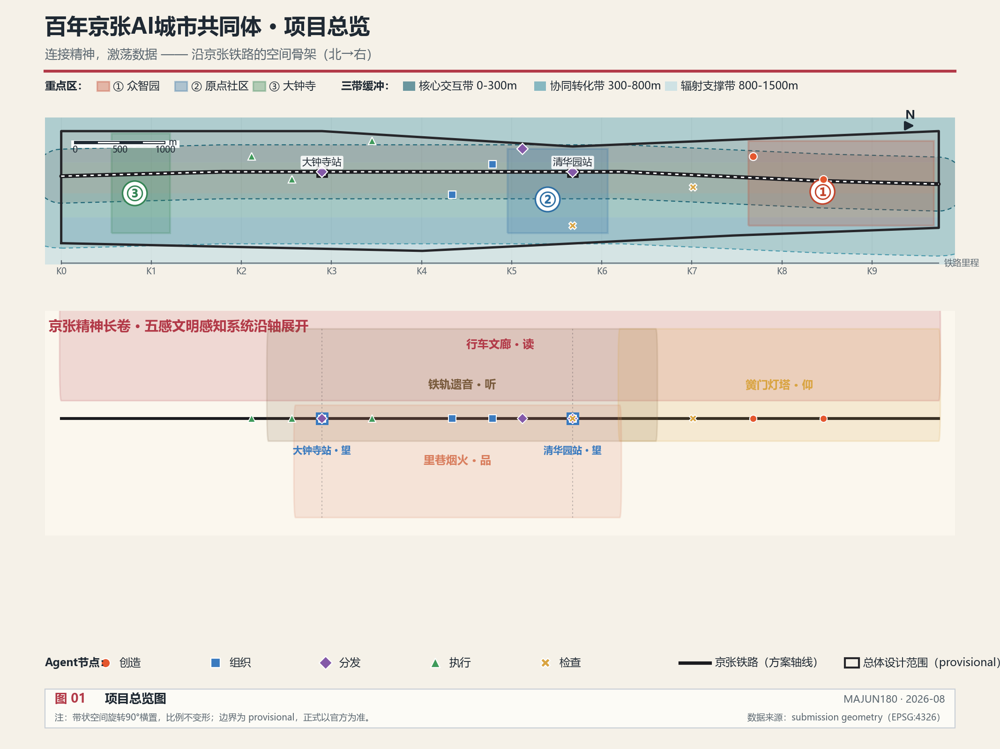

When the official `SITE_BOUNDARY` or the three `KEY_AREA`s are not yet available, this proposal uses `brief/site-package/geometry/provisional_boundaries.geojson` to generate a temporary formal package [source:SITE-PACKAGE]. The `geometry/site_boundary.geojson` and `geometry/key_areas.geojson` in the submission package are both marked as `provisional_constraint`, `official_boundary=false`, and can only be used for proposal generation, self-checking, visualization, and design discussion; they cannot serve as official redline, approval basis, precise area basis, or statutory control conclusion. This organizer data gap itself does not block content scoring; after official polygons are replaced, site boundary, key areas, land use, roads, green space, public space, buildings, phasing, data-stratification, agent-nodes, and metrics all need to be recalculated [source:PROCESSED-FACT-PACK].

Boundary interpretation can be traced back to the overall scope layer and area recomputation [data:geometry/site_boundary.geojson#SITE-001] [metric:site_area_sqm]. The three key areas are verified by independent layers and quantitative metrics [data:geometry/key_areas.geojson#PROV-KEY-001] [metric:key_area_count].

## Overall Concept: Connecting Spirit, Agitating Data

### Core Philosophy

The core proposition of this proposal is: **When the urban data flywheel of the AI era accelerates unstoppably, who holds the steering wheel?**

The answer is: **Spirit sets the direction, data provides the acceleration.**

- **Spirit Compass** = the steering wheel — a decision mechanism guided by civilization and values
- **Data Flywheel** = the engine — the productive force of the AI era
- **Community Cohesion** = the centripetal force — the inward force that keeps the flywheel from flying apart as it spins faster
- **Jingzhang Railway** = the axis connecting the two

Without the flywheel, spirit becomes empty talk; without the compass, the city is hijacked by technology; without cohesion, the faster the flywheel spins, the more easily it disintegrates. **Spirit generates cohesion, and cohesion steers the flywheel** — this is the core logic running through this proposal. The Jingzhang Railway connected Beijing and Zhangjiakou a century ago; in the AI era, it connects spirit, civilization, ecology, youth, creativity, vitality, and urban warmth — as well as the data foundation of this urban area. The train is no longer just a vehicle but a data collector and dispatcher, rolling, colliding, and generating new data in operation to form an AI data flywheel; and what truly makes this data "belong to the people of this land" is the community.

The goal of this area is not only an AI innovation belt but also **the world's first urban Agent, Skill, and Harness cluster** and **the Centennial Jingzhang AI Urban Community** — so that the city is not pushed forward by AI, but uses the power of spirit and civilization to determine the direction forward. Every spatial, data, Agent, and scenario design that follows answers the same question: **how to help this region grow into a cohesive community.**

### Four Pillars

The four pillars are not parallel functional modules but the four organs of the community: the pulse is the skeleton, the wheel is the heart, the body is the limbs, and the soul is the will. Without any one of them, the community is incomplete.

| Pillar | Name | Core | Community Role | Data Anchor |
| --- | --- | --- | --- | --- |
| Pillar One | Rail as Pulse | Three-zone buffer + four-level Data Foundation | The community's skeleton — connecting scattered people and institutions into one body | [data:geometry/constraints.geojson#DATA-STRAT-001] |
| Pillar Two | Data as Wheel | Train-style Data Flywheel, six-stage cycle | The community's heart — circulating data and trust together | [data:geometry/constraints.geojson#AGENT-NODE-001] |
| Pillar Three | Agent as Body | Five types of task clusters, Skill + Harness | The community's limbs — turning will into action | [data:geometry/constraints.geojson#AGENT-NODE-001] |
| Pillar Four | Spirit as Soul | Four-layer lineage + five-sense scenes + Civilization Committee | The community's will — determining direction and cohesion | [data:geometry/constraints.geojson#AGENT-NODE-011] |

### Mapping of the Five Functions to the Four Pillars

The taskbook proposes that the belt carries five functions [source:AGENT-TASKBOOK] [standard:PROJECT-AGENT-OPEN-CALL-TASKBOOK]. The four pillars do not start from scratch but are the realization mechanism of the five functions:

| Five Functions | Carrying Pillar | Spatial and Mechanism Anchors |
| --- | --- | --- |
| AI full-stack autonomous innovation system | Pillar Three · Agent as Body | Zhongzhiyuan Creative Agent core, University Lighthouse university spiritual landmarks |
| World-class AI innovation ecosystem | Pillar Two · Data as Wheel | Data flywheel drives the university-enterprise-community innovation closed loop |
| AI+ scenario empowerment new paradigm | Pillar One · Rail as Pulse + Pillar Three | Scenario tiering of the three-zone buffer, Agent role annotation of the 10 scenario cards |
| Intelligent AI vibrant city | Pillar Three · Agent as Body | Five-type Agent task chains, station acceleration points, AI slow-mobility navigation |
| Global voice in AI governance | Pillar Four · Spirit as Soul | Civilization Committee, Checking Agents, safety governance sandbox |

### Three Zones and Two Wings: The Spatial Skeleton of a Spiritual-Civilization Community

The taskbook proposes the "Three Zones and Two Wings" layout [source:AGENT-TASKBOOK]. This proposal's answer is: **the three zones and two wings are not merely a functional layout, but the spatial skeleton of a spiritual-civilization community — every unit is both a stage of the data flywheel and a node that produces cohesion.**

Core judgment: in the AI era, technology accelerates "speed," while spirit determines "direction." A flywheel spinning ever faster needs an inward force to keep it from flying apart — that force is **cohesion**. Spirit, civilization, and culture are the core that leads development in the AI era; community is the organizational form through which spirit becomes force. The true product of the three zones and two wings is not output value but cohesion: the cohesion of faith, trust, achievement, connection, and life.

| Unit | Official Role | Agent Positioning | Spiritual-Civilization Positioning | Source of Cohesion |
| --- | --- | --- | --- | --- |
| Zhongzhiyuan AI Autonomous Innovation Acceleration Zone | AI full-stack autonomous innovation system and global voice in AI governance | Creative + Checking Agent core [data:geometry/key_areas.geojson#PROV-KEY-001] | Inheritor of the Jingzhang Spirit: from Zhan Tianyou's self-reliant railway construction to the full-stack autonomous technology stack, the century-old conviction of "yielding to no one" transforms into the faith of autonomous innovation in the AI era | A shared national mission |
| Beijing AI Origin Community | World-class AI innovation ecosystem | Organizing Agent core [data:geometry/key_areas.geojson#PROV-KEY-002] | Pioneer of the Haidian Spirit: open-source collaboration, daring to be first. "Origin" is not only a geographical origin but the origin of community trust — people gather because of sharing | Open-source trust rules |
| Dazhongsi AI Industry Cluster Zone | Intelligent-native new business formats | Executing Agent core [data:geometry/key_areas.geojson#PROV-KEY-003] | Expresser of the Capital Spirit: the ancient bell tolls long, open and inclusive. AI industry and international exchange complete the "landing" from spirit to reality here — wherever the bell reaches, there is resonance | The sense of achievement from realized value |
| Zhongguancun Technology Service Wing | Globalized allocation of elements, Zhongguancun IP and capital empowerment | The "Service" stage of the flywheel | Spreading wings to the world: transforming the community's data assets into capital and global element allocation, letting China's AI governance propositions travel with the service network | Global connection |
| Xiaoyue River Scenario Empowerment Wing | AI scenario empowerment and intelligent AI vibrant city | The "Feedback" stage of the flywheel [data:geometry/green_space.geojson#GREEN-001] | Spreading wings toward life: scenarios unfold along the Xiaoyue River, effect data flows back into the flywheel, ultimately returning to community warmth — the terminus of technology is human life | Resonance of life |

The three zones answer three questions of the community: **where does knowledge come from** (Zhongzhiyuan creates), **how do people trust each other** (Origin Community organizes), **where does value land** (Dazhongsi executes). The two wings answer two directions of the community: **outward to the world** (Technology Service Wing), **inward to life** (Xiaoyue River Wing). The three zones form the "body" of the community, the two wings form its "wings" — the spirit compass sets the direction, the data flywheel provides the power, and cohesion determines how far this community can fly.

Correspondence with the four-layer spiritual lineage: Zhongzhiyuan corresponds to the Jingzhang Spirit (roots), Origin Community to the Haidian Spirit (trunk), Dazhongsi to the Capital Spirit (branches), and the two wings jointly point to the China Spirit (crown) — from roots to crown, the three zones and two wings grow into a tree of spirit [depth:overall_spatial_structure].

### Roles of the Three Key Areas under the New Concept

| Key Area | Agent Role | Data Foundation Level | Spiritual Anchor |
| --- | --- | --- | --- |
| Zhongzhiyuan AI Autonomous Innovation Acceleration Zone | Creative core | L2 Industrial Innovation + L3 Spiritual-Cultural | Landmark of autonomous innovation spirit |
| Beijing AI Origin Community | Organizing core | L1 Urban Operations + L2 Industrial Innovation | Anchor of open-source collaboration civilization |
| Dazhongsi AI Industry Cluster Zone | Executing core | L0 Infrastructure + L2 Industrial Innovation | Anchor of industrial heritage civilization |

## Three-Level Scope Working Framework

The proposal organizes work according to the three levels defined in the announcement: the overall research scope focuses on the 43.6 km² AI industry ecosystem, strategic positioning, innovation chain, and future urban form; the overall design scope focuses on the 11.4 km² urban area and industrial area within 1–2 km around the Jingzhang Heritage Park, requiring an overall urban renewal framework, industrial spatial layout, transportation and municipal support, and urban character control; the key area scope focuses on the 368.4 hectares of three detailed design areas, requiring clear functional programs, building scale, retain-renovate-demolish classification, public space connectivity, and traffic organization. The three levels are mapped item by item in `compliance_matrix.json` [depth:three_level_scope_framework] [depth:overall_spatial_structure] [standard:PROJECT-OFFICIAL-ANNOUNCEMENT].

The official text areas of the three key areas are: Zhongzhiyuan AI Autonomous Innovation Acceleration Zone 192.1 hectares, Beijing AI Origin Community 104.3 hectares, and Dazhongsi AI Industry Cluster Zone 72.0 hectares, totaling 368.4 hectares [source:OFFICIAL-ANNOUNCEMENT] [standard:PROJECT-OFFICIAL-ANNOUNCEMENT]. These area values come from the announcement text and cannot replace precise area recomputation from official polygons [metric:key_area_total_area_ha] [metric:key_area_count].

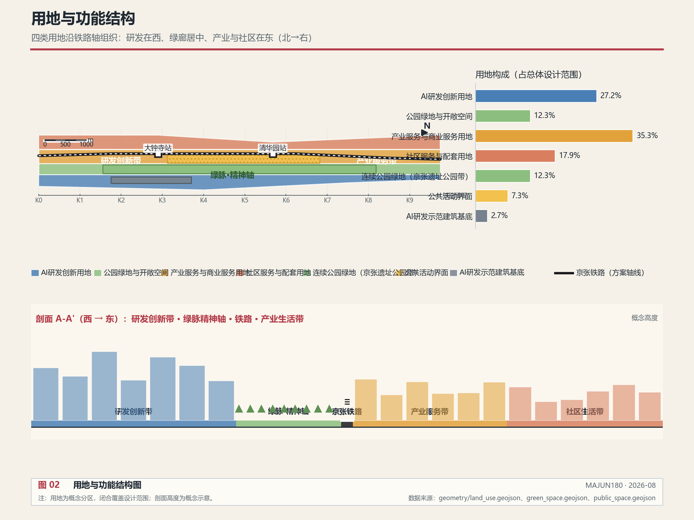

The three levels of work are not mutually isolated sets of drawings. Overall research determines industry-chain and urban-form judgments; overall design translates judgments into renewal projects, spatial structure, and facility capacity; key area detailed design verifies the feasibility of specific plots, buildings, transportation, public space, and AI application scenarios. This proposal organizes space on the basis of three-level data stratification [data:geometry/constraints.geojson#DATA-STRAT-001]: the Core Interaction Zone carries Agent task stations and spiritual landmarks; the Collaborative Transformation Zone carries university research and industry collaboration; the Radiation Support Zone carries community life and ecological services [source:PROCESSED-FACT-PACK].

From the community perspective, the three-level scopes correspond to three scales of the community: the overall research scope is the community's **vision layer** (what kind of community we want to become), the overall design scope is the community's **skeleton layer** (through what spaces and mechanisms the community connects), and the key area scope is the community's **touchpoint layer** (where community members truly meet, collaborate, and perceive spirit). Only when the three layers are consistent can the community descend from vision into perceivable everyday life.

| Level | Design Question | Proposal Response | Data Anchor |
| --- | --- | --- | --- |
| Overall research scope | How to organize the AI industry ecosystem and future urban form | Establish an innovation chain of "university origination - open-source collaboration - enterprise transformation - public experience - international communication," driven by the data flywheel | compliance_matrix.json, standard_matrix.json |
| Overall design scope | How to map industry space, urban renewal, transportation/municipal, and character | Expressed jointly through land use, buildings, roads, green space, public space, phasing, data-stratification, and Agent node layers | [data:geometry/land_use.geojson#LU-001], [data:geometry/constraints.geojson#DATA-STRAT-001] |
| Key area scope | How the three areas reach detailed design depth | Position each as Creative, Organizing, and Executing Agent core respectively, with spatial actions and implementation dependencies | [data:geometry/key_areas.geojson#PROV-KEY-001], [data:geometry/constraints.geojson#AGENT-NODE-001] |

## Pillar One: Rail as Pulse — Spatial and Data Tiered Classification

### Core Idea

With the Jingzhang Railway as the axis, buffer zones form outward — not just a physical distance concept, but a stratification of data density, data level, and collaboration intensity. The railway is the physical carrier of data connection — every time a train passes, data rolls among sensors, stations, and communities along the line [depth:overall_spatial_structure].

For the community, the railway is the **skeleton**: it strings the originally scattered universities, enterprises, communities, and heritage into a single pulse that can breathe together. The closer the distance, the denser the connection and the stronger the sense of community; the farther the distance, the looser the connection, yet still on the same axis. The essence of the three-zone buffer is to stratify "community members" by depth of participation, rather than cutting them by administrative boundaries.

### Three-Zone Buffer System

Three buffer zones form outward along the Jingzhang Railway, each corresponding to different data frequencies, collaboration modes, and spatial functions [data:geometry/constraints.geojson#DATA-STRAT-001]:

| Buffer Zone | Distance | Data Frequency | Collaboration Mode | Typical Spaces |
| --- | --- | --- | --- | --- |
| Core Interaction Zone | 0–300m | Second-level real-time | Fully open sharing | Agent task stations, innovation nodes, spiritual landmarks, railway heritage park |
| Collaborative Transformation Zone | 300–800m | Minute-level | Protocol-based sharing | Universities, laboratories, innovation centers, incubators |
| Radiation Support Zone | 800–1500m | Hourly/daily | Desensitized on-demand | Communities, commerce, ecological green space, daily services |

The Core Interaction Zone is the "rim" of the data flywheel — the highest-frequency data interactions happen here, with Agent task stations, spiritual landmarks, and the railway heritage park together forming a dense network for data collection and dispatch. The Collaborative Transformation Zone is the "spoke" — universities and research institutions transform raw data into knowledge and tasks here. The Radiation Support Zone is the "hub" — communities and ecological spaces provide life data and civilization perception here [data:geometry/constraints.geojson#DATA-STRAT-002] [data:geometry/constraints.geojson#DATA-STRAT-003].

### Four-Level Data Foundation Classification

The Data Foundation is not a static database but a living data system governed in layers by level. Data at different levels rolls at different distances and under different permissions [depth:metrics_recalculation]:

| Level | Data Type | Permissions and Rolling Mode | Typical Sources |
| --- | --- | --- | --- |
| L0 | Infrastructure Data | Fully open, municipal-level real-time rolling | Sensors, municipal systems, transportation facilities |
| L1 | Urban Operations Data | Desensitized sharing, permission-tiered rolling | Traffic flow, public safety, municipal operations |
| L2 | Industrial Innovation Data | Protocol-based sharing, industry-academia-research collaborative rolling | University research, enterprise R&D, patent transactions |
| L3 | Spiritual-Cultural Data | Community governance, Civilization Committee approval-directed rolling | Jingzhang heritage, oral history, community life, university spirit |

L3 Spiritual-Cultural Data is the original creation of this proposal — spirit is not a slogan but a collectable, governable, perceivable data asset embedded in the Data Foundation. The Civilization Committee conducts value reviews on the collection and use of L3 data to ensure that the directional guidance of the spiritual community is realized in practice [data:geometry/constraints.geojson#AGENT-NODE-011] [metric:jingzhang_spirit_index].

### Mapping between Data Foundation and Space

The three-zone buffer and four-level Data Foundation intersect to form a data foundation grid along the Jingzhang Railway — each spatial unit has its data identity (distance tier × type × level). Planning decisions are based on this grid, not on rule-of-thumb guesses [data:geometry/constraints.geojson#DATA-STRAT-001] [data:geometry/land_use.geojson#LU-001].

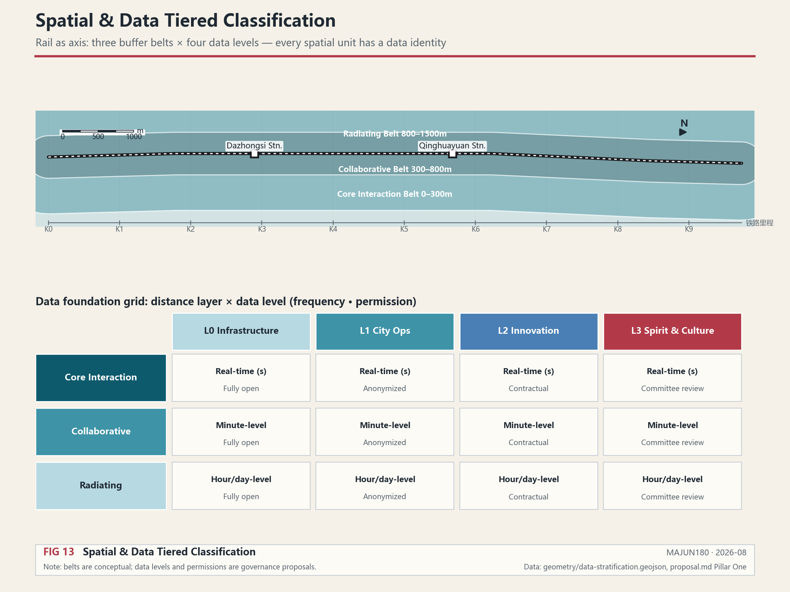

Upper: the three buffer belts unfold horizontally along the rail axis — distance equals depth of participation. Lower: the distance-tier × data-level grid, each cell annotated with rolling frequency and permission mode — L3 spirit and culture data, in any distance tier, is premised on Civilization Committee approval [data:geometry/constraints.geojson#DATA-STRAT-002].

## Pillar Two: Data as Wheel — Train-style Data Flywheel

### Core Idea

Not a static database, but a "Train-style Data Flywheel." Every station and every node on the Jingzhang Railway is an "acceleration point" for data rolling. Data generated by universities, aerospace, forestry, and mining institutions continuously collides and recombines under the train's drive, generating new tasks, new skills, and new connections [depth:overall_spatial_structure] [source:AGENT-TASKBOOK].

For the community, the flywheel is the **heart**: it circulates data and trust together. Data only generates value in flow, and trust only arises in collaboration. Every collision and sharing of data is a "handshake" between community members. The faster the flywheel spins, the denser the connections among members and the stronger the cohesion — but only on the premise that the steering wheel (the Spirit Compass) remains firmly in the community's hands; otherwise, the faster it spins, the more easily it disintegrates.

### Six Stages of the Flywheel

The data flywheel consists of six stages forming a cycle, each undertaken by a different type of Agent [data:geometry/constraints.geojson#AGENT-NODE-001]:

| Stage | Action | Subject | Output |
| --- | --- | --- | --- |
| Collection | Sensors along railway + Agents collect data along the line | Executing Agent | Raw data stream |
| Aggregation | Station data acceleration points aggregate multi-source data | Dispatching Agent | Structured datasets |
| Governance | Civilization Committee review + desensitization + classification | Checking Agent | Compliant data assets |
| Service | Skill Modules encapsulated as callable urban capabilities | Organizing Agent | Urban Skill library |
| Feedback | Scenario applications feedback effects and experiences | Executing Agent | Effectiveness data |
| Re-collection | Flywheel accelerates, entering the next cycle | Full-chain Agents | Emergent intelligence |

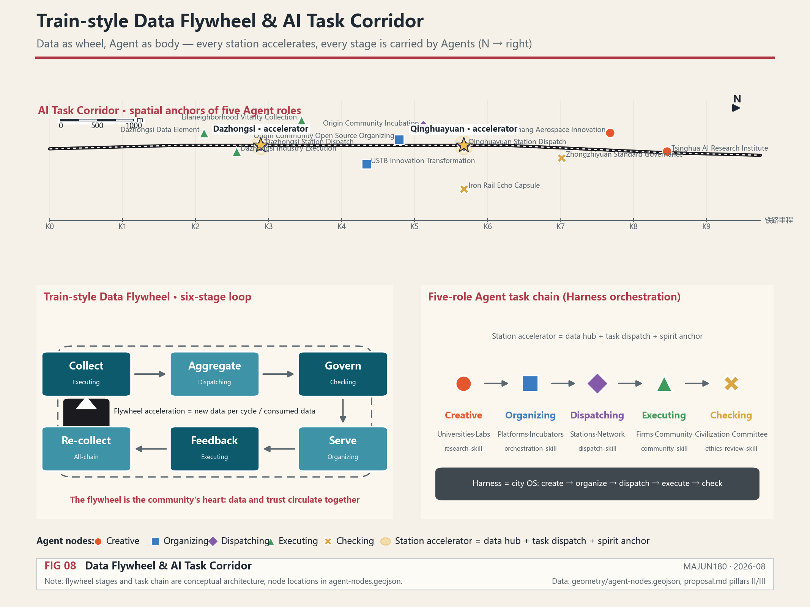

### Station Acceleration Points

Each rail station is an "acceleration point" of the data flywheel — a three-in-one node: data aggregation hub + task dispatch node + spiritual anchor [data:geometry/constraints.geojson#AGENT-NODE-009] [data:geometry/constraints.geojson#AGENT-NODE-010]:

- When a train arrives, the station automatically aggregates data collected along that segment
- The Dispatching Agent distributes task packages to surrounding Executing Agents and communities
- The spiritual anchor synchronously updates the civilization star map for that station, allowing passengers to perceive civilization coordinates during their stop

The flywheel spins faster and faster — the more data, the more frequent the collisions, the more new tasks, and the richer the urban intelligence that emerges [metric:data_flywheel_acceleration].

## Pillar Three: Agent as Body — Urban Task Clusters

### Core Idea

Urban Agent clusters are deployed along the railway to form a complete task chain. The goal of this area is to become the world's first urban Agent, Skill, and Harness cluster — with those who create tasks, those who organize tasks, those who dispatch tasks, those who execute tasks, and those who check tasks, forming a complete urban intelligent-agent ecosystem [source:AGENT-TASKBOOK] [depth:overall_spatial_structure].

For the community, Agents are the **limbs**: they turn the community's will into action. But limbs must obey the brain — the Agent cluster is not a purposeless efficiency machine but actors directed by the Spirit Compass and constrained by the Civilization Committee. Behind every Agent lies the mandate of a community member: Creative Agents carry the exploratory will of universities, Executing Agents carry the everyday demands of communities, and Checking Agents carry the value baseline of the Civilization Committee. The stronger the Agents, the stronger the community's capacity for action; but only with the right direction does capacity for action become cohesion rather than centrifugal force.

### Five Types of Agent Task Chains

| Role | Function | Spatial Carrier | Representative Institutions | Typical Skill Modules |
| --- | --- | --- | --- | --- |
| Creative | Generate new knowledge, new algorithms, new tasks | Universities, laboratories, research institutions | Tsinghua, Beihang, USTB, National AI Platform | research-skill, hypothesis-skill |
| Organizing | Integrate resources, orchestrate processes, schedule tasks | Platform institutions, innovation centers | Open-source community operators, incubators | orchestration-skill, resource-matching-skill |
| Dispatching | Transmit tasks and data, connect nodes | Skill/Harness system, railway, stations | Rail stations, data networks | dispatch-skill, sync-skill |
| Executing | Implement specific tasks on the ground | Enterprises, communities, space operators | Leading enterprises, community operators | traffic-optimize-skill, community-service-skill |
| Checking | Quality and compliance review, civilization assessment | Assessment institutions, Civilization Committee | Safety governance bodies, Civilization Committee | ethics-review-skill, civilization-audit-skill |

The five types of Agents are distributed along the railway, forming an "AI Task Corridor" [data:geometry/constraints.geojson#AGENT-NODE-001]. Creative Agents are concentrated in Zhongzhiyuan and universities; Organizing Agents are concentrated in the AI Origin Community; Dispatching Agents are distributed along stations; Executing Agents are concentrated in Dazhongsi and industrial parks; Checking Agents guard spiritual scene nodes and data governance [data:geometry/constraints.geojson#AGENT-NODE-011] [metric:agent_node_count].

### Skill and Harness

- **Skill** = reusable urban capability modules (e.g., "traffic optimization Skill," "carbon emission monitoring Skill," "community service matching Skill," "civilization audit Skill"). Each Skill is an encapsulated, callable urban service capability.
- **Harness** = the task orchestration framework, the scheduling system connecting Agents and Skills, similar to the city's "operating system." It manages the task lifecycle: from the Creative Agent proposing a task, to the Organizing Agent orchestrating resources, to the Dispatching Agent transmitting the task, to the Executing Agent implementing it, to the Checking Agent reviewing the results.

### Spatial Placement of Agent Clusters

Agent nodes are not just concepts but nodes with explicit spatial positions [data:geometry/constraints.geojson#AGENT-NODE-001]. A total of 12 Agent nodes are currently laid out, covering the five role types [metric:agent_node_count]:

- 3 nodes in the Zhongzhiyuan area (Creative ×2 + Checking ×1)
- 3 nodes in the AI Origin Community area (Organizing ×2 + Dispatching ×1)
- 2 nodes in the Dazhongsi area (Executing ×2)
- 2 nodes along the stations (Dispatching ×2)
- 2 spiritual scene nodes (Checking ×1 + Executing ×1)

## Pillar Four: Spirit as Soul — Civilization Community

### Core Idea

Urban development in the AI era is accelerating, and the acceleration of the data flywheel will rise without limit. In the future, what will become very important? It is spirit, civilization, and culture. From ancient times to the present, technology and productivity have been the drivers, but direction and decision-making must be led by spirit and civilization — because with spirit comes strength, comes cohesion. A city or an area can overcome all difficulties and move forward forever only when it has cohesion and a common goal.

This urban area is to form the Centennial Jingzhang AI Urban Community — simultaneously a sci-tech innovation community, a data community, a life community, and a cultural community. China Spirit, Capital Spirit, Haidian Spirit, and Jingzhang Spirit — four layers of spiritual lineage form concentric circles from within to without [depth:overall_spatial_structure].

### Four-Layer Spiritual Lineage

| Level | Lineage Name | Spiritual Core | Historical Anchor | Contemporary Expression |
| --- | --- | --- | --- | --- |
| First ring | Jingzhang Spirit | Century-old heritage · self-reliance | Zhan Tianyou's 1909 self-built railway | Autonomous AI large models · domestic technology stack |
| Second ring | Haidian Spirit | Integration of science and education · daring to be first | Zhongguancun 1980s electronics street | Cradle of global Agent clusters |
| Third ring | Capital Spirit | First-class standards · openness and inclusion | Yuan Dadu · Ming-Qing capital cultural lineage | International AI governance and cultural center |
| Fourth ring | China Spirit | National rejuvenation · shared human destiny | Five thousand years of civilization heritage | New form of human civilization in the AI era |

The four rings are not simply stacked — Jingzhang Spirit is the "root" (the most specific memory of the land), and China Spirit is the "crown" (the grandest responsibility of the era); from root to crown, they form a tree of spirit.

### Five-Sense Civilization Perception System

This is the core innovation of this proposal — using five modes of perception to make spirit **audible, visible, readable, lookable-up-to, and savorable**. Each scene is a node type in the Data Foundation — at once a physical space and a terminal for data collection and dispatch [data:geometry/constraints.geojson#AGENT-NODE-011] [data:geometry/constraints.geojson#AGENT-NODE-012] [metric:spirit_scene_count].

#### Scene One: Rail Echoes — Hear · Century-old Echoes

> *Above the rails, century-old echoes never fade*

| Dimension | Content |
| --- | --- |
| Spatial carrier | Along the Jingzhang Railway Heritage Park, a "Rail Echo Capsule" is set every 200m |
| Perception mode | Hear — soundscape immersion |
| Data type | L3 Spiritual-Cultural Data: historical soundscapes, oral history, environmental sounds, train sounds |
| Spiritual level | Jingzhang Spirit (first ring · root) |
| Data collection | Acoustic sensors collect environmental sounds; oral history databases record accounts of old railway workers; historical voiceprint libraries restore the sounds of 1909 steam locomotives |
| Experience design | Strolling through the railway heritage park, AR headphones automatically play the historical soundscape of that segment — the mountain wind when Zhan Tianyou surveyed, the whistles of the steam era, the silence after closure, the electronic tones of today's AI trains. Four layers of soundscape overlap, hearing the breathing of century-old Jingzhang |
| Sentiment expression | The rails can speak. They remember every train that passed, every person who waited, every step of this land's century-long journey from steam to intelligence. The Rail Echo Capsules keep the sound of the rails from dissipating |
| Agent role | Checking Agents guard the authenticity of voiceprint data and the integrity of civilization |

Rail Echoes let history no longer exist only in museum display cases but live in the vibration of every section of rail. When passengers walk through the heritage park, what they hear is not silence but century-old Jingzhang speaking [data:geometry/constraints.geojson#AGENT-NODE-011] [metric:heritage_sound_completeness].

#### Scene Two: Station Star Anchors — Look · Civilization Coordinates

> *Each station like a star, anchoring a sky of civilization*

| Dimension | Content |
| --- | --- |
| Spatial carrier | A "Star Anchor" device is set at each rail station entrance and exit along the line |
| Perception mode | Look — visual gaze upward |
| Data type | L1 Urban Operations + L3 Spiritual-Cultural: station civilization archives, surrounding resource atlas |
| Spiritual level | Haidian Spirit (second ring · integration of science and education) |
| Data collection | Each station establishes a "Civilization Star Map" — marking universities, research institutions, cultural heritage, and industrial landmarks and their spiritual identifiers within a 1 km radius of the station |
| Experience design | Looking up when exiting the station, the Star Anchor device projects that station's Civilization Star Map — Qinghuayuan Station's star map lights up the Tsinghua Lighthouse and aerospace institutes; Dazhongsi Station's star map lights up the Ancient Bell Museum and AI enterprise clusters. Each starry sky is different, seeing the spiritual map of this land |
| Sentiment expression | Stations are not just for departure and arrival. Behind every station name lies a landscape of scholarship and the struggles of a group of people. Star Anchors let passengers, in their hurried passage, see the depth of civilization beneath their feet |
| Agent role | Dispatching Agents distribute star-map data to station screens and passenger terminals [data:geometry/constraints.geojson#AGENT-NODE-009] |

Station Star Anchors turn every station into a coordinate system of civilization. In their hurried commute, passengers can look up and see the spiritual map of this land [metric:star_anchor_connectivity].

#### Scene Three: Moving Gallery — Read · A Moving Scroll

> *The train travels Jingzhang, a scroll of civilization slowly unfurls*

| Dimension | Content |
| --- | --- |
| Spatial carrier | Train carriage interior walls renovated into "Moving Gallery" digital screens |
| Perception mode | Read — reading immersion |
| Data type | L2 Industrial Innovation + L3 Spiritual-Cultural: four-layer spiritual lineage narrative, innovation stories along the line |
| Spiritual level | Capital Spirit (third ring · cultural center) |
| Data collection | Carriage digital screens link with train GPS and switch content in real time according to train position — reading Tsinghua's century when passing the Qinghuayuan segment, reading aerospace patriotism when passing the Beihang segment, reading the dialogue between ancient bells and AI when passing Dazhongsi |
| Experience design | Riding from north to south, the carriage gallery unfurls like a long painting. Outside the window is today's city; inside the window is a century of civilization. From Zhan Tianyou to today's AI Agents, from steam locomotives to the data flywheel, a single ride reads through Jingzhang's century-old spiritual history |
| Sentiment expression | The train is a moving study. A twelve-minute ride reads a century of Jingzhang; twelve minutes of light and shadow reveal a city's origin and destination. The Moving Gallery turns commute into pilgrimage |
| Agent role | Organizing Agents orchestrate gallery content, dynamically adjusting narrative according to time of day, season, and events |

The Moving Gallery turns commuting time into civilization reading time. The train is no longer dull displacement but a scroll of civilization slowly unfurling.

#### Scene Four: University Lighthouses — Look up to · Light of Academia

> *Above the university gates, the lighthouse burns long, illuminating the nation's future*

| Dimension | Content |
| --- | --- |
| Spatial carrier | "Lighthouse" devices are set at the entrances or landmark buildings of seven universities along the line |
| Perception mode | Look up to — reverent gaze upward |
| Data type | L2 Industrial Innovation + L3 Spiritual-Cultural: discipline spirit archives, national mission declarations, research achievement stories |
| Spiritual level | China Spirit (fourth ring · crown) |
| Data collection | Each university builds a "Spiritual Lighthouse Archive" — university motto spirit, discipline mission, core fields related to the nation's future (aerospace, forestry, mining, computer science, etc.), representative achievements and figures |
| Experience design | Approaching a university, look up at the Lighthouse device. The Tsinghua Lighthouse is inscribed "Self-discipline and Social Commitment" and lights up the light of aerospace patriotism; the Beihang Lighthouse is inscribed "Virtue and Talent Combined, Knowledge and Action Unified" and lights up the light of aerospace exploration; the Beili Lighthouse is inscribed "Know the Mountains and Waters, Cultivate Trees and People" and lights up the light of ecological civilization. Seven lighthouses, seven kinds of light, converging into the spiritual skyline of this land |
| Sentiment expression | Universities are the soul of a city. These institutions are not merely places of teaching but sentinels of the nation's future. The lighthouses let everyone passing by look up and see — on this land, people are doing things that bear on the destiny of the nation |
| Agent role | Creative Agents continuously update lighthouse archives, recording new spiritual stories [data:geometry/constraints.geojson#AGENT-NODE-001] |

University Lighthouses make the spirit of universities visible and lookable-up-to. The seven lighthouses are not decoration but declarations of seven universities about the nation's future [metric:lighthouse_brightness].

#### Scene Five: Alley Warmth — Savor · Human Warmth

> *Deep in the alleys, warmth rises; the city has a soul*

| Dimension | Content |
| --- | --- |
| Spatial carrier | "Warmth Collection Points" are set along community alleys, markets, and small plazas |
| Perception mode | Savor — savoring of life |
| Data type | L0 Infrastructure + L3 Spiritual-Cultural: community life data, neighborhood stories, everyday warmth |
| Spiritual level | Civilization of Life (the human foundation running through all four rings) |
| Data collection | Communities set up Warmth Collection Points — recording the sounds of morning markets opening, the chess moves of elders playing chess, the laughter of children, the stories of neighborhood mutual aid. This data does not enter commercial systems but only the civilization memory library |
| Experience design | Walking into the community, savor a bowl of soy milk, listen to a chat, watch a chess game. Warmth Collection Points record these daily moments in a simple way — no algorithmic recommendations, no data profiling, only respect for life. No matter how smart the city becomes, it cannot lack warmth |
| Sentiment expression | Spirit is not only in halls and on rails but in every wisp of cooking smoke. Technology can change a city but cannot replace a neighbor's greeting. Warmth Collection Points guard the softest part of the city — human life itself |
| Agent role | Executing Agents + Checking Agents jointly guard the privacy and dignity of warmth data [data:geometry/constraints.geojson#AGENT-NODE-012] |

Alley Warmth keeps the AI-era city from losing its temperature. Spirit is not only in grand narratives but in the aroma of soy milk every morning and the sound of every chess piece placed [metric:fireworks_warmth].

### Overview of the Five-Sense Civilization Perception System

| Sense | Scene Name | Spatial Carrier | Spiritual Level | Data Level | Agent Role |
| --- | --- | --- | --- | --- | --- |
| Hear | Rail Echoes | Railway Heritage Park | Jingzhang Spirit | L3 | Checking |
| Look | Station Star Anchors | Rail stations | Haidian Spirit | L1+L3 | Dispatching |
| Read | Moving Gallery | Train carriages | Capital Spirit | L2+L3 | Organizing |
| Look up to | University Lighthouses | Seven universities | China Spirit | L2+L3 | Creative |
| Savor | Alley Warmth | Community alleys | Civilization of Life | L0+L3 | Executing + Checking |

The five senses correspond to five types of spatial carriers, five layers of spirit, five levels of data, and five types of Agents — forming a complete civilization perception loop [metric:spirit_scene_count].

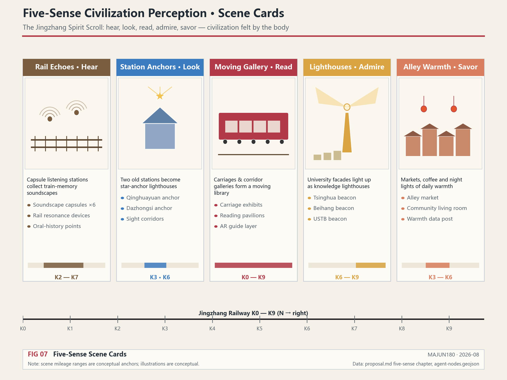

The ultimate purpose of the five-sense scenes is not "display" but **cohesion**. Each mode of perception is a spiritual handshake between a community member and this land: listening is a handshake with history; looking is a handshake with scholarship; reading is a handshake with civilization; looking up is a handshake with the national mission; savoring is a handshake with neighborhood life. When a person is moved by all five modes at once, they are no longer merely "passing through this region" but "belonging to this community."

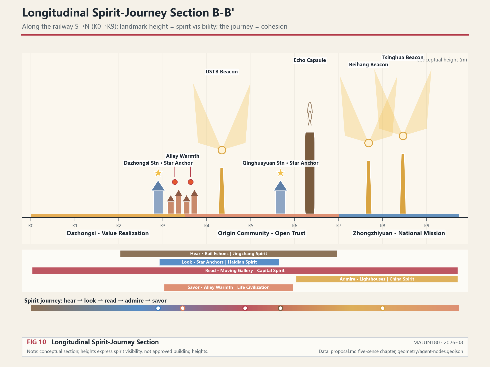

The longitudinal section along the railway from south to north shows that the heights of spiritual landmarks rise progressively from south to north — from the low eaves of Alley Warmth, to the heritage corridor frames of Rail Echoes, and finally to the spiritual skyline of the University Lighthouses. Landmark height equals spirit visibility; the journey itself is the process of cohesion [depth:height_massing_character].

### AI Pilgrimage Landmarks and Honor Display System

The taskbook requires proposing no fewer than 3 AI pilgrimage landmarks, an honor display system, and a public space component library [source:AGENT-TASKBOOK]. Three core scenes among the five-sense spiritual scenes are precisely the AI pilgrimage landmarks of this proposal:

| Pilgrimage Landmark | Corresponding Spiritual Scene | Pilgrimage Significance |
| --- | --- | --- |
| Rail Echoes · Century-old Echo Corridor | Scene One | Pilgrimage to Jingzhang Spirit — listening to the echoes of a century of autonomous innovation in the railway heritage park |
| University Lighthouses · Light of Academia | Scene Four | Pilgrimage to China Spirit — looking up to seven universities' watch over the nation's future |
| Alley Warmth · Human Warmth | Scene Five | Pilgrimage to the Civilization of Life — savoring the softest human warmth of the AI-era city |

The three pilgrimage landmarks are connected along the Jingzhang Railway Heritage Park, forming a pilgrimage route "from history to the future, from the hall to life," overlapping with the Global AI Activity Week route (Scenario Card 10) [data:geometry/constraints.geojson#AGENT-NODE-011] [data:geometry/constraints.geojson#AGENT-NODE-012].

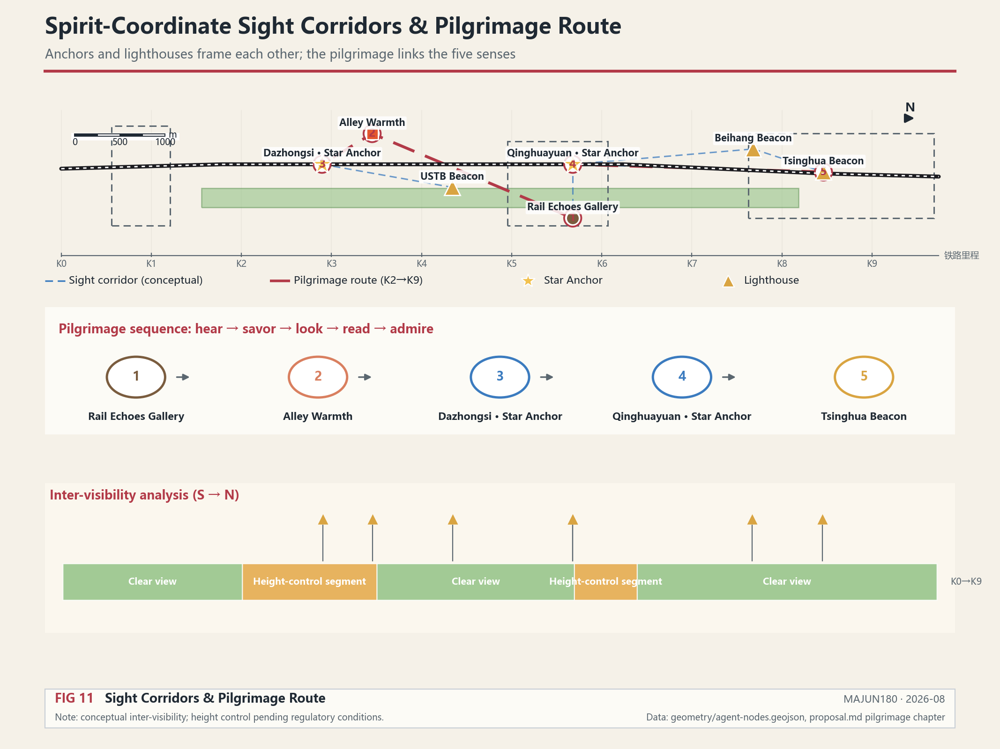

Star Anchors and Lighthouses frame each other: station Star Anchors fix the horizontal civilization coordinates, while university Lighthouses define the vertical spiritual skyline; the sight corridors between them form a spiritual network in which "sightlines are connection." The pilgrimage route is organized in the five-sense sequence of "listen → savor → gaze → read → look up"; walking itself is cohesion. Both the sight corridors and the pilgrimage route are conceptual analyses; concrete view control must be deepened together with the official regulatory height conditions [depth:height_massing_character].

**Honor Display System**: Contribution display walls are set at pilgrimage landmarks and stations, recording developers, researchers, community residents, and Agent contributors who participated in the belt's construction. Display content must be rights-cleared and authorized, distinguishing among submission, review, selection, and implementation status, and must not describe conceptual proposals as already built [source:AGENT-TASKBOOK].

**Public Space Component Library**: The facilities of the five-sense scenes are abstracted into reusable public space components — Rail Echo Capsules (soundscape components), Star Anchor devices (wayfinding components), Lighthouse devices (landmark components), Warmth Collection Points (community components), and Gallery screens (display components). The component library is available for subsequent professional teams to reuse and deepen in different sections; this is a conceptual recommendation [depth:blue_green_public_space].

### "Jingzhang Spirit Index" Measurement System

Transforming spirit from slogan into measurable, trackable indicators [metric:jingzhang_spirit_index]:

| Indicator Name | Measurement Dimension | Data Source | Current Status |
| --- | --- | --- | --- |
| Heritage Sound Completeness | Historical soundscape coverage, oral history collection volume | Rail Echo Capsule data | unknown [metric:heritage_sound_completeness] |
| Star Anchor Connectivity | Station civilization resource density, star-map update frequency | Station Star Anchor data | unknown [metric:star_anchor_connectivity] |
| Gallery Immersion | Riding reading duration, content reach rate | Moving Gallery interaction data | unknown |
| Lighthouse Brightness | University spirit archive completeness, achievement dissemination | University Lighthouse data | unknown [metric:lighthouse_brightness] |
| Alley Warmth Index | Community activity frequency, neighborhood mutual aid records | Alley Warmth Collection Points | unknown [metric:fireworks_warmth] |

Together they form the "Jingzhang Spirit Index" — a brand-new measure of urban civilization health. This indicator system is a conceptual recommendation and requires continuous calibration with operational data [source:AGENT-TASKBOOK].

### Spiritual Community Governance Mechanism

**"Civilization Committee"** — the governance body of the spiritual community

- **Composition**: university representatives, community representatives, cultural heritage experts, AI ethics experts, youth representatives, long-time resident representatives
- **Function**: conducts value reviews on the direction of the data flywheel — what data can be collected, what tasks can be executed, and what scenarios can be opened all require "spiritual review" by the Civilization Committee. In particular, the collection and use of L3 Spiritual-Cultural Data must be approved by the Civilization Committee
- **Positioning**: not an administrative body but the guardian of the "spiritual constitution" — ensuring that the city is not hijacked by AI but uses spirit and civilization to determine the direction forward

The Civilization Committee is a key institutional innovation of this proposal — it makes the spiritual community not just a concept but an entity with governance capacity. Every acceleration of the data flywheel must be calibrated by the Spirit Compass.

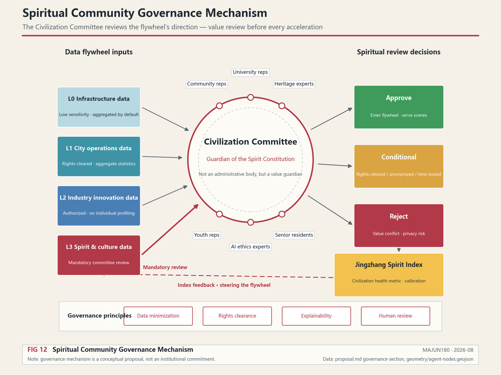

Operating logic of the governance mechanism: L0–L2 data enter the flywheel under the principles of rights clearance, aggregation, and authorization; L3 spirit and culture data must be approved by the Civilization Committee. The Committee issues three types of decisions — approve, conditional approve, and reject — and continuously calibrates the flywheel's direction with the "Jingzhang Spirit Index" [metric:jingzhang_spirit_index].

## Overall Research Scope: Industry and Future City Research

The core task of the overall research scope is to build a world-class AI innovation ecosystem. On the basis of the innovation chain required by the announcement — "university origination - open-source collaboration - enterprise transformation - public experience - international communication" — this proposal drives the innovation chain with the data flywheel: knowledge and data generated by universities are transmitted to enterprises and communities through the train-style flywheel, and enterprises generate new data during execution that feeds back to universities, forming an innovation closed loop [source:AGENT-TASKBOOK] [standard:PROJECT-AGENT-OPEN-CALL-TASKBOOK].

But from the community perspective, the innovation chain is not merely a chain of efficiency — it is a **production line of cohesion**. Every collaboration between universities and enterprises, every contribution in the open-source community, every piece of scenario feedback from communities is an accumulation of trust among community members. The ultimate competitiveness of a world-class AI innovation ecosystem lies not in the technological lead of any single enterprise, but in whether the whole community can continuously generate trust and continuously align its direction.

The naming scheme serves the overall recognizability of the "Century-old Jingzhang Cultural Belt, Urban AI Life Experience Belt, and AI Convergence Innovation Belt," while carrying the core concept of "Connecting Spirit, Agitating Data." The logo and visual identity should express three major images: the railway data axis, the five-sense spiritual scenes, and the Agent cluster [depth:overall_spatial_structure].

Future urban form research should answer how artificial intelligence changes work, life, socializing, learning, transportation, and public services. This proposal translates AI transportation systems, continuous green space, innovation service facilities, and an internationalized live-work atmosphere into locatable functional zones, nodes, corridors, and scenes. In particular, the proposal advances the vision of the "world's first urban Agent cluster" — deploying five types of Agent nodes along the Jingzhang Railway: Creative, Organizing, Dispatching, Executing, and Checking, forming a complete urban intelligent-agent ecosystem [data:geometry/constraints.geojson#AGENT-NODE-001] [metric:agent_node_count].

### Regional Synergy: From the Belt to Beijing-Tianjin-Hebei

The review requires reflecting innovation synergy with Beiwei Community, Future Science City, Huairou Science City, Economic-Technological Development Area, and Beijing-Tianjin-Hebei [source:AGENT-TASKBOOK]. The data flywheel inherently has cross-domain connection capability — the Jingzhang Railway itself is the axis of regional connection. This proposal brings regional synergy into the "dispatch" stage of the flywheel.

From the community perspective, the essence of regional synergy is **the expansion of community boundaries**: the belt is not a closed island of innovation but a cohesive core radiating trust and collaboration outward. A century ago, the Jingzhang Railway linked Beijing and Zhangjiakou into a single lifeline; today it links Haidian's AI community with the Beijing-Tianjin-Hebei innovation network. The strength of synergy depends not on administrative agreements but on whether the community can make external partners feel that "joining means belonging."

| Synergy Partner | Synergy Content | Flywheel Interface |
| --- | --- | --- |
| Future Science City | Mutual reinforcement of energy and life-science research data and AI models | Cross-domain collaborative tasks of Creative Agents |
| Huairou Science City | Research data from large-scale scientific facilities connected to the innovation chain | Protocol-based sharing of L2 industrial innovation data |
| Economic-Technological Development Area | Industrial transformation of AI manufacturing and smart terminals | Executing Agents undertaking transformation tasks |
| Beiwei Community and other surrounding communities | Collection of life data and everyday warmth | Alley Warmth Collection Points [data:geometry/constraints.geojson#AGENT-NODE-012] |
| Beijing-Tianjin-Hebei | The Jingzhang Railway extends to Zhangjiakou; the data flywheel radiates along the railway axis to the region | Dispatching Agents distributing along the railway axis |

The Jingzhang Railway extends from Beijing to Zhangjiakou; this century-old railway becomes the physical axis of Beijing-Tianjin-Hebei data synergy in the AI era — the data flywheel does not stop at Haidian but rolls along the railway axis to the region. This is a conceptual recommendation; specific synergy mechanisms require consultation with relevant regional parties.

### Global AI Innovation Ecosystem Case References

The taskbook requires referencing 5–8 global AI innovation ecosystem cases [source:AGENT-TASKBOOK]. The following are ecosystem-model references from public materials (conceptual references, not factual claims of this proposal; specific data require separate verification):

| Case | Ecosystem Model Characteristics | Implications for This Proposal |
| --- | --- | --- |
| San Francisco Bay Area | University origination + venture capital + open-source community | Confirms the "university-capital-open source" triangle, corresponding to the AI Origin Community Organizing core |
| Boston Kendall Square | High university density + biomedicine + walkable-scale innovation | Confirms the near-campus achievement transformation model, corresponding to the near-campus achievement transformation street |
| London King's Cross | Railway heritage renewal + university entry + public space | Confirms the railway heritage revitalization path, corresponding to Rail Echoes and the heritage park |
| Singapore one-north | Industry-city integration + living facilities + government-led | Confirms work-life integration, corresponding to the community function of the Radiation Support Zone |
| Seoul Digital Media City | Content industry + digital infrastructure + urban renewal | Confirms data elements and content consumption, corresponding to the Dazhongsi Executing core |
| Shenzhen Nanshan | Enterprise clusters + hardware manufacturing + rapid iteration | Confirms industrial transformation efficiency, corresponding to the Executing Agent implementation capability |

The common law of these cases is: innovation ecosystem = a closed loop of origination (universities) + organization (platforms) + transformation (enterprises) + life (communities). The four pillars and five types of Agents of this proposal are precisely the structured expression of this closed loop, with an additional "Spirit Compass" civilization dimension — this is the original creation distinguishing this proposal from existing cases.

From the community perspective, the deeper difference among these cases lies in **the source of cohesion**: the San Francisco Bay Area coheres through capital, Boston through academic reputation, and London King's Cross through heritage memory. The originality of this proposal is: using spirit, civilization, and culture as the primary source of cohesion, so that the community depends not on any single element (capital or policy) but on shared value identity — this is the sustainable cohesion of the AI era.

## Overall Design Scope: Urban Renewal and Regulatory-plan-depth Urban Design

The overall design scope requires reaching the urban design depth of a regulatory plan. The proposal must put forward an overall urban renewal spatial structure, inefficient space identification, renewal project list, implementation policy recommendations, industrial function ratios, spatial organization models, total building scale, and comprehensive carrying capacity assessment [standard:MOHURD-CONTROL-DETAILED-PLANNING].

From the community perspective, the essence of urban renewal is not demolishing the old to build the new, but **rebuilding the spatial carriers of the community**. Inefficient spaces are often inefficient not because buildings are dilapidated, but because connections between people have broken and places have lost their shared meaning. The urban renewal logic of this proposal is: first identify which spaces can once again become places where community members meet, collaborate, and perceive spirit, then decide what to retain, renovate, or demolish — space serves cohesion, not the other way around.

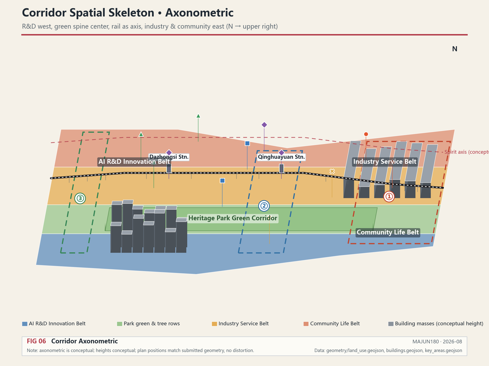

This proposal adds two design layers on top of the traditional land use, building, road, green space, public space, and phasing layers [depth:land_use_layout] [depth:development_intensity_controls]:

- **Data Foundation Stratification Layer** [data:geometry/constraints.geojson#DATA-STRAT-001]: expresses the three-zone buffer system, linking space with data density and collaboration intensity
- **Agent Node Layer** [data:geometry/constraints.geojson#AGENT-NODE-001]: expresses the spatial positions and roles of the five types of Agent task nodes

### Layer Framework

The submission package contains 11 geometry layers in total, all using layer codes registered in the site package's `enums/layers.json`, of which 9 are base layers and 2 are new design layers added by this proposal [source:SITE-PACKAGE]:

| Layer File | Layer Code | Content | Nature |
| --- | --- | --- | --- |
| geometry/site_boundary.geojson | SITE_BOUNDARY | Overall design scope (provisional) | Base · locked |
| geometry/key_areas.geojson | KEY_AREA | Three key areas (provisional) | Base · locked |
| geometry/land_use.geojson | LAND_USE | Land use classification | Base · editable |
| geometry/buildings.geojson | BUILDING_FOOTPRINT | Building footprints | Base · editable |
| geometry/roads.geojson | ROAD_CENTERLINE | Road centerlines | Base · editable |
| geometry/green_space.geojson | GREEN_SPACE | Green and open space | Base · editable |
| geometry/public_space.geojson | PUBLIC_SPACE | Public space | Base · editable |
| geometry/phasing.geojson | PHASE | Phasing implementation scope | Base · editable |
| geometry/constraints.geojson | (empty set) | Regulatory, heritage, redline and other constraints | Base · locked · gap registered |
| geometry/constraints.geojson | AI_SERVICE_ZONE | Three-zone buffer Data Foundation stratification | New · conceptual design |
| geometry/constraints.geojson | SCENARIO_NODE | Five types of Agent nodes and spiritual scene nodes | New · conceptual design |

`constraints.geojson` is deliberately kept as an empty set: regulatory control lines, cultural heritage protection scopes, road redlines, cadastral parcels, rail and blue lines are all locked layers with no citable official geometry source in the public site package. Gaps are registered as assumptions; before official or rights-cleared geometry is obtained, inferred lines must not be presented as official_constraint — an empty set is preferred over fabrication [data:geometry/constraints.geojson#CONSTRAINTS].

### Data Gap Mapping

The site package's `missing-data.md` lists 9 real data gaps that must be filled. Each gap is mapped to an assumption registration, affected layers, and this proposal's handling approach; organizer data gaps do not block content scoring [source:SITE-PACKAGE]:

| Gap ID | Missing Data | Assumption Registration | Affected Layers | This Proposal's Handling |
| --- | --- | --- | --- | --- |
| GAP-001 | Precise official polygons for the three-level scopes | ASM-GAP-001 | site_boundary, key_areas | Use provisional boundaries, marked official_boundary=false |
| GAP-002 | Precise polygons for the three key areas | ASM-GAP-002 | key_areas | Adopt announcement text areas (192.1/104.3/72.0 hectares) [metric:key_area_total_area_ha] |
| GAP-003 | Formal coordinate system and survey datum | ASM-GAP-003 | All geometry | Provisional boundaries inferred under EPSG:4548, pending official confirmation |
| GAP-004 | Regulatory plan conditions (FAR, height, setbacks, etc.) | ASM-GAP-004 | constraints | Control indicators uniformly status=unknown [metric:floor_area_ratio] |
| GAP-005 | Plot/parcel boundaries and ownership | ASM-GAP-005 | constraints | Retain-renovate-demolish judgments marked as conceptual recommendations |
| GAP-006 | Complete attributes of existing buildings | ASM-GAP-006 | buildings | Building scale recomputed from existing layers, classification pending review [metric:building_footprint_area_sqm] |
| GAP-007 | Heritage park scope and cultural protection layers | ASM-GAP-007 | constraints, agent-nodes | Spiritual scene placement marked as conceptual recommendation |
| GAP-008 | Transportation base data | ASM-GAP-008 | roads, agent-nodes | Station acceleration points and slow-mobility stitching pending official data review |
| GAP-009 | Municipal constraints and public service facility inventory | ASM-GAP-009 | constraints | New infrastructure layout marked as conceptual recommendation |

After official polygons are replaced, site boundary, key areas, land use, roads, green space, public space, buildings, phasing, data-stratification, agent-nodes, and metrics all need to be recalculated.

Content involving building height, development intensity, road redline, setback lines, and facility standards, where official control conditions are not yet available, should be written as "pending confirmation of formal regulatory plan conditions" and must not pass off agent-speculated values as approved indicators [depth:height_massing_character] [metric:floor_area_ratio].

## Key Area Detailed Design

Key area detailed design is mandatory. The three key areas are redefined under the four-pillar concept [depth:three_key_area_detailed_design].

The three key areas are not three independent plots but three **cohesion cores** of the community: Zhongzhiyuan coheres around the "national mission," the AI Origin Community coheres around "open-source trust," and Dazhongsi coheres around "value realization." The three cores are strung along the railway, letting community members complete a spiritual journey from "faith" to "trust" to "achievement" as they move through space.

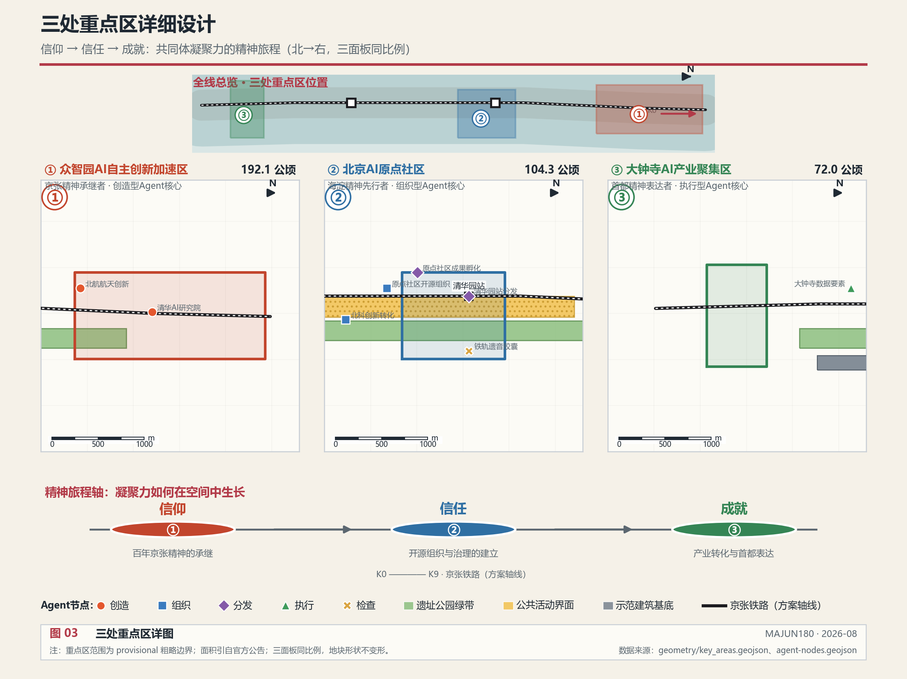

| Key Area | Agent Role | Design Positioning | Spatial Actions | AI Industry and Operation Scenarios | Evidence Citation |
| --- | --- | --- | --- | --- | --- |
| Zhongzhiyuan AI Autonomous Innovation Acceleration Zone | Creative core | Garden-style full-stack autonomous innovation district | Strengthen the Qinghe interface, industrial display, and low-carbon innovation interaction; use green space to host open testing and standards governance display; lay out Creative Agent nodes | Autonomous model testing, standards-setting workshops, safety governance display, low-carbon computing experience | [data:geometry/key_areas.geojson#PROV-KEY-001], [data:geometry/constraints.geojson#AGENT-NODE-001] |
| Beijing AI Origin Community | Organizing core | Near-campus achievement transformation and talent community | Organize campus-park-block slow-mobility stitching; supplement achievement release, talent services, residential living, and open-source collaboration space; lay out Organizing Agent nodes | Open-source community, achievement release, talent zone services, near-campus incubation | [data:geometry/key_areas.geojson#PROV-KEY-002], [data:geometry/constraints.geojson#AGENT-NODE-004] |
| Dazhongsi AI Industry Cluster Zone | Executing core | Urban-type intelligent economy and international exchange district | Centered on Dazhongsi Station integration, four-quadrant pedestrian connectivity, commercial services, and key enterprise public environment renewal; lay out Executing Agent nodes | Intelligent agent and smart terminal display, content consumption, data elements, and international roadshows | [data:geometry/key_areas.geojson#PROV-KEY-003], [data:geometry/constraints.geojson#AGENT-NODE-007] |

The three key areas are spatially connected and functionally divided — Zhongzhiyuan "creates," AI Origin Community "organizes," and Dazhongsi "executes," forming a complete Agent task chain [data:geometry/key_areas.geojson#PROV-KEY-001] [source:AGENT-TASKBOOK].

## AI Innovation Ecosystem, Talent Profiles, and AI+ Scenarios

The proposal should establish spatial demand profiles for AI talents and enterprises, covering R&D office, open-source collaboration, achievement release, enterprise services, talent housing, social learning, consumption and life, sports and leisure, and international exchange [source:AGENT-TASKBOOK].

From the community perspective, talent profiles are not merely a "demand list" but a **membership map of the community**. Open-source developers, startup teams, leading enterprises, surrounding residents, and university faculty and students — these five groups are not in a relationship of being served and serving, but equal members of the community. The design goal of AI+ scenarios is to let every group find here their own place, their own contribution, and their own belonging. A cohesive community is precisely one in which "there are no bystanders."

AI+ scenarios annotate each of the original 10 scenario cards with an Agent role, aligning scenarios with the cluster architecture [depth:overall_spatial_structure]:

| Scenario Card | Spatial Carrier | Agent Role | Design Description |
| --- | --- | --- | --- |
| 01 Open-source Release Hall | Beijing AI Origin Community | Organizing | For universities, open-source communities, and startup teams, providing achievement release, code contribution display, and small-scale roadshow space |
| 02 Safety Governance Sandbox | Zhongzhiyuan | Checking | Translates standards-setting, safety evaluation, and model red-teaming into visitable, bookable, and supervisable display and collaboration nodes |
| 03 Edge Computing Relay Station | Overall design scope nodes | Executing | Combined with public services, enterprise services, and low-carbon energy strategies, as a new infrastructure prototype to be deepened |
| 04 AI Slow-mobility Navigation | Jingzhang Heritage Park Vitality Belt | Dispatching | Uses explainable wayfinding and low-intrusion sensing to identify slow-mobility breakpoints, congestion nodes, and accessibility needs |
| 05 Dazhongsi International Roadshow Living Room | Dazhongsi AI Industry Cluster Zone | Executing | Serves intelligent agent, smart terminal, and content consumption enterprises for display, negotiation, media release, and international exchange |
| 06 Qinghe Low-carbon Innovation Corridor | Zhongzhiyuan Qinghe-facing interface | Creative | Combines green space, stormwater, walking and cycling, and AI display as the park's public living room |
| 07 Near-campus Achievement Transformation Street | Beijing AI Origin Community | Organizing | For university achievement transformation, organizes incubation, display, legal, intellectual property, and investment and financing services |
| 08 Data Elements Reception Hall | Dazhongsi area | Checking | On the premise of compliance, authorization, and auditability, displays the urban service interface for data elements and digital asset circulation |
| 09 AI Life Service Model Street | Intersection of community and commerce | Executing | Lands medical, educational, legal, and life-service AI+ scenarios in operable small-scale block spaces |
| 10 Global AI Activity Week Route | Public space system of the belt | Dispatching | Forms a walkable, communicable experience route from heritage culture, open-source community, industrial display, to international roadshow |

| User Profile | Typical Needs | Spatial Response | Self-check Boundary |
| --- | --- | --- | --- |
| Open-source developers | Release, collaboration, testing, community reputation | Origin Community open-source release hall, public code wall, nighttime collaboration space | No collection of personal behavior trajectories; activity data is used only for aggregate statistics |
| Startup teams | Low-cost office, computing access, product testing ground | Zhongzhiyuan shared testing field, edge computing service points, standards governance consultation | Computing and data services require separate authorization |
| Leading enterprise visitors | Display, business, international reception, talent recruitment | Dazhongsi international roadshow living room, rail station connections, public space around key enterprises | Enterprise identifiers and cases must be rights-cleared |
| Surrounding residents | Commuting, leisure, community services, low-disturbance renewal | Jingzhang Heritage Park slow-mobility loop, embedded community services, Alley Warmth Collection Points | Resident profiles are not used for commercial recommendations |
| University faculty and students | Achievement transformation, cross-campus collaboration, daily slow mobility | Campus-park slow-mobility stitching, achievement transformation stations, University Lighthouse spiritual landmarks | Campus data and research achievements require authorization |

AI governance recommendations generated by the agent must comply with the principles of data minimization, public sourcing, explainability, and human review. Urban intelligent agents can assist in identifying slow-mobility breakpoints, public space heat maps, facility maintenance, enterprise service demands, and event safety risks, but cannot replace planning approval, cannot output unauthorized personal profiles, and cannot claim official implementation commitments. In particular, the collection and use of L3 Spiritual-Cultural Data must be approved by the Civilization Committee [data:geometry/constraints.geojson#AGENT-NODE-011].

## Land Use, Building Scale, and Retain-Renovate-Demolish Scheme

The land use scheme should be expressed according to public standards such as territorial space survey, planning, and use control classification, forming a complete, closed, and seamless land use zoning [standard:MNR-LAND-USE-CLASSIFICATION-GUIDE]. The building scheme should distinguish between retained, renovated, renewed, newly built, and to-be-confirmed objects [depth:retain_renovate_demolish].

From the community perspective, retain-renovate-demolish is not a simple engineering judgment but **a trade-off between the community's memory and its future**. Retention guards the historical roots of the community — railway heritage, old station buildings, and community alleys are the material carriers of cohesion, and demolishing them is equivalent to demolishing the community's memory. Renovation lets old spaces once again carry the community's new connections — converting abandoned factories into open-source collaboration spaces and idle warehouses into spiritual scene carriers is reconnecting severed links. Renewal provides a new skeleton for the community's growth — deploying Agent infrastructure at the new nodes required by the data flywheel. The criterion is not the age of buildings, but **whether the space can continue to carry community members' encounters, collaboration, and spiritual perception** [depth:retain_renovate_demolish].

The main evidence for land use and buildings is [data:geometry/land_use.geojson#LU-001], [data:geometry/buildings.geojson#BLDG-001], and [metric:building_footprint_area_sqm]. Building scale and intensity indicators must be consistent with `metrics.json` and the layers. If total building scale, Floor Area Ratio (FAR), building height, building density, green-space ratio, setback lines, and building control lines lack official conditions, `status=unknown` should be used uniformly [depth:height_massing_character] [metric:floor_area_ratio].

## Transportation, Rail, Municipal, and Public Service Facilities

The transportation scheme should respond to the announcement's requirements for rail station integration, road micro-circulation, slow-mobility breakpoints, external transportation, parking, non-motor vehicle parking, and green transportation systems [depth:traffic_rail_slow_parking]. On the basis of the traditional transportation system, this proposal integrates the railway data axis concept into traffic organization — rail stations are not only transportation hubs but also "acceleration points" of the data flywheel [data:geometry/constraints.geojson#AGENT-NODE-009] [data:geometry/constraints.geojson#AGENT-NODE-010].

From the community perspective, the essence of transportation is **the physicalization of connection**. Slow-mobility breakpoints need to be stitched not only for travel efficiency, but because every breakpoint is a lost opportunity for community members to meet. Station integration is not only about transfer convenience, but about letting the spiritual journey "from university to enterprise to community" be completed seamlessly. The ultimate goal of traffic organization is to let community members continuously perceive "I belong here" while moving.

Transportation and municipal professional depth are constrained respectively by [depth:traffic_rail_slow_parking] and [depth:municipal_new_infrastructure]; layer evidence is cited at [data:geometry/roads.geojson#ROAD-001], [data:geometry/public_space.geojson#PUBLIC-001], and [data:geometry/constraints.geojson#CONSTRAINTS].

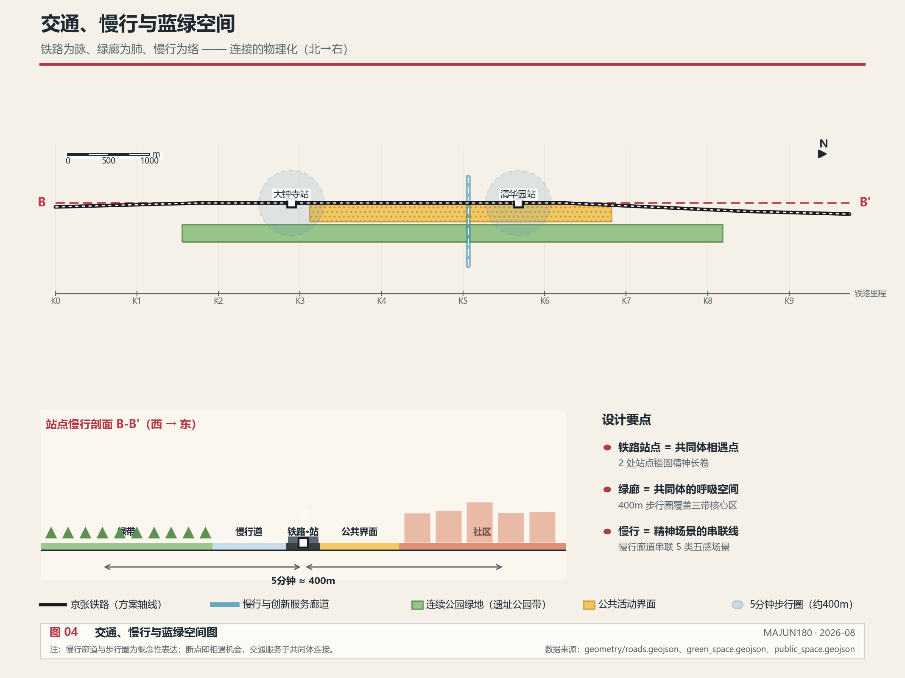

Municipal and public service facilities should cover AI industry service facilities, innovation service platforms, talent life service facilities, new infrastructure, distributed energy, edge computing, and the integration of traditional municipal facilities. The sensor networks and Agent nodes along the railway are themselves part of the new infrastructure [data:geometry/constraints.geojson#DATA-STRAT-001].

## Blue-Green Space, Public Space, and Urban Character

The blue-green space scheme should take the Jingzhang Heritage Park Vitality Belt as its backbone, coordinating the travel needs of Qinghe, Xiaoyue River, surrounding universities, enterprises, and communities [depth:blue_green_public_space] [data:geometry/green_space.geojson#GREEN-001] [data:geometry/public_space.geojson#PUBLIC-001].

From the community perspective, blue-green space is the community's **breathing space** — the faster the data flywheel spins, the more people need places where they can slow down, meet, and perceive spirit. The railway heritage park is not merely a green belt but the "public living room" where community members walk, listen, and look up together. An innovation district without public breathing space can only produce efficiency, not cohesion.

This proposal integrates the five-sense spiritual scenes into the blue-green space system — the railway heritage park is both the public space spine and the "Rail Echoes" soundscape corridor; community green spaces and plazas are the spatial carriers of the "Alley Warmth" collection points [data:geometry/constraints.geojson#AGENT-NODE-011] [data:geometry/constraints.geojson#AGENT-NODE-012]. Blue-green space is not only ecological and leisure function but also a place for civilization perception [metric:green_ratio] [metric:public_space_ratio].

The urban character scheme should fuse Jingzhang Railway historical culture, Zhongguancun innovation culture, and AI innovation culture, leveraging cultural resources such as Qinghuayuan Railway Station and Beijing Film Academy [standard:MOHURD-URBAN-DESIGN-MEASURES]. The spiritual landmarks of the five-sense spiritual scenes (Rail Echo Capsules, Star Anchor devices, Lighthouse devices, Warmth Collection Points) are themselves part of the urban character — they give the urban character spirit, warmth, and memory.

### Wayfinding, Signage, and Symbol System

The taskbook requires proposing a wayfinding, signage, and symbol system [source:AGENT-TASKBOOK]. The wayfinding system of this proposal takes the five-sense scenes as its framework:

- **Primary wayfinding**: Railway data axis main-line wayfinding — a continuous wayfinding belt is set along the Jingzhang Heritage Park, marking the boundaries and data levels of the three-zone buffer, letting walkers perceive that they are "walking on the rim of the data flywheel"
- **Secondary wayfinding**: Station Star Anchor wayfinding — the Star Anchor devices at each rail station entrance and exit double as wayfinding, projecting the civilization resource atlas and directional guidance of the surrounding 1 km
- **Tertiary wayfinding**: Community warmth wayfinding — Alley Warmth Collection Points double as community wayfinding nodes, guiding visitors into alley life with simple community signage
- **Symbol system**: Four image groups — rails, data flow, lighthouses, and warmth — form the symbol motifs, deriving a unified signage language. The symbol system must coordinate with the belt's overall logo system and must not be confused with it [source:AGENT-TASKBOOK]

The wayfinding system should comply with accessibility requirements. Venues involving medical care, social security, finance, and utility payment public services should retain on-site guidance and manual service channels [standard:BARRIER-FREE-ENVIRONMENT-LAW]. This is a conceptual recommendation; specific signage design requires deepening by professional teams.

### Urban Character and International Communication Narrative

The taskbook requires proposing urban character and an international communication narrative [source:AGENT-TASKBOOK]. The communication narrative of this proposal unfolds around "Connecting Spirit, Agitating Data":

- **Core narrative**: A century-old railway, from connecting cities to connecting spirit and data — the century of the Jingzhang Railway is a century of China's autonomous innovation; the next century of Jingzhang is a century of spirit leading AI
- **International communication angle**: The world's first urban Agent cluster + the Centennial Jingzhang AI Urban Community, providing the world with a Chinese solution to "how to guard civilization in an era of technological acceleration"
- **Communication carriers**: The moving scroll of the Moving Gallery, the pilgrimage route of the Global AI Activity Week, check-in dissemination of pilgrimage landmarks
- **Communication boundaries**: Distinguish among submission, review, selection, and implementation status; must not describe conceptual proposals as approved or built; external publication requires authorization [source:AGENT-TASKBOOK]

## Renewal Project List, Implementation Policies, and Phasing Plan

The implementation scheme should form a reviewable renewal project list [depth:renewal_project_list] [depth:phasing_implementation]. On the basis of the original 6 renewal projects, this proposal adds projects related to spiritual scenes and Agent clusters [data:geometry/phasing.geojson#PHASE-001].

From the community perspective, the ordering logic of the project list is not investment scale but **the generation sequence of cohesion**: first build places where people can meet and perceive spirit (slow-mobility stitching, spiritual scenes), then build the infrastructure supporting the data flywheel (Agent clusters), and only then industrial transformation. Because cohesion is the foundation of the community — if the foundation is unstable, the faster the flywheel spins, the faster it disintegrates.

| Project No. | Project Name | Type | Main Dependencies | Evidence Citation |
| --- | --- | --- | --- | --- |
| JZ-01 | Jingzhang Heritage Park slow-mobility breakpoint stitching | Public space / transportation | Road redline, under-bridge space, traffic organization review | [data:geometry/roads.geojson#ROAD-001] |
| JZ-02 | Zhongzhiyuan Qinghe Innovation Interface | Blue-green space / industrial display | River blue line, ecological and flood-control conditions | [data:geometry/green_space.geojson#GREEN-001] |
| JZ-03 | Origin Community near-campus achievement transformation street | Urban renewal / industrial services | Campus boundary, property rights, ground-floor programs | [data:geometry/buildings.geojson#BLDG-001] |
| JZ-04 | Dazhongsi Station four-quadrant pedestrian connectivity | Rail integration / slow mobility | Rail stations, road intersections, municipal pipelines | [data:geometry/public_space.geojson#PUBLIC-001] |
| JZ-05 | AI public service and edge computing node | New infrastructure / public services | Energy, computing power, safety, and operating entities | [data:geometry/constraints.geojson#CONSTRAINTS] |
| JZ-06 | Global AI Activity Week public route | Operations / branding | Public space permits, event safety, copyright clearance | [data:geometry/phasing.geojson#PHASE-001] |
| JZ-07 | Rail Echoes soundscape corridor | Spiritual scene / cultural facility | Railway heritage park, acoustic equipment, oral history collection | [data:geometry/constraints.geojson#AGENT-NODE-011] |
| JZ-08 | Station Star Anchors civilization coordinate system | Spiritual scene / digital facility | Rail stations, civilization archives, digital screens | [data:geometry/constraints.geojson#AGENT-NODE-009] |
| JZ-09 | Moving Gallery mobile exhibition corridor | Spiritual scene / train renovation | Train operators, digital screens, content licensing | [data:geometry/constraints.geojson#AGENT-NODE-001] |
| JZ-10 | University Lighthouse university spirit landmark | Spiritual scene / cultural facility | Universities, signage design, spirit archives | [data:geometry/constraints.geojson#AGENT-NODE-001] |
| JZ-11 | Alley Warmth community collection point | Spiritual scene / community facility | Communities, collection equipment, privacy protection | [data:geometry/constraints.geojson#AGENT-NODE-012] |
| JZ-12 | Urban Agent cluster infrastructure | New infrastructure / Agent system | Data networks, computing power, Skill platform | [data:geometry/constraints.geojson#AGENT-NODE-001] |

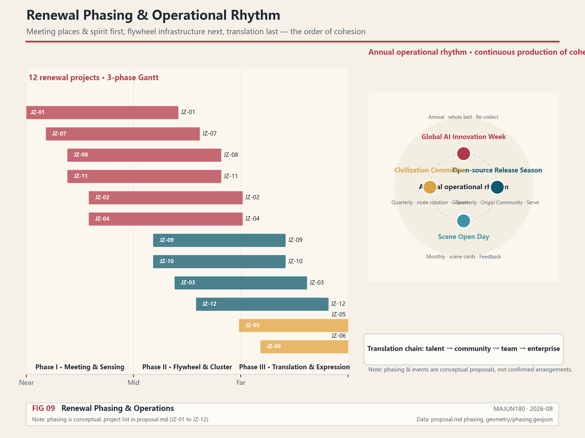

Phasing should be distinguished from the 100-day solicitation design cycle: the solicitation cycle is the time requirement for submitting deliverables, while implementation phasing is the advancement path for urban renewal and project construction. Spiritual scene projects (JZ-07 through JZ-11) can be launched first with lightweight facilities and pilots — Rail Echoes can begin with mobile soundscape devices, Station Star Anchors with temporary display boards, and Alley Warmth with community activities. Agent cluster infrastructure (JZ-12) requires consultation with AI technology providers and phased deployment [source:AGENT-TASKBOOK].

### Annual Activity System and Long-term Operations

The taskbook requires proposing an annual activity system, developer community operations, AI scenario open operations, public experience and urban landmark operations, and international communication and attraction-transformation mechanisms [source:AGENT-TASKBOOK]. This proposal uses the data flywheel as the operational framework.

From the community perspective, the essence of operations is **the continuous production of cohesion**. Activities are not decorations but rituals in which community members periodically "reconfirm that they belong to the same community": the Global AI Innovation Week is the annual grand cohesion, the Open-source Release Season is the quarterly cohesion, the Scenario Open Day is the monthly cohesion, and the Civilization Committee regular meeting is the directional cohesion. Without continuous operations, the community degenerates into a mere geographical name.

**Annual Activity System** (conceptual recommendation, not yet confirmed arrangements):

| Activity | Frequency | Spatial Carrier | Flywheel Stage |
| --- | --- | --- | --- |
| Global AI Innovation Week | Annual | Entire belt + pilgrimage route | Re-collection — annual aggregation of data and creativity |
| Open-source Release Season | Quarterly | AI Origin Community open-source release hall | Service — Skill and achievement release |
| Scenario Open Day | Monthly | Spaces of the 10 scenario cards | Feedback — scenario experience and data return |
| Civilization Committee Regular Meeting | Quarterly | Rotating among spiritual scene nodes | Governance — L3 data and directional review |

**Developer Community Operations**: With the AI Origin Community as the physical space and the open-source collaboration platform as the digital space, organizing code contributions, Skill development, and Agent task claiming. Developer contributions enter the honor display system [source:AGENT-TASKBOOK].

**AI Scenario Open Operations**: The 10 scenario cards open in three stages of "pilot - evaluate - promote"; at each stage, Checking Agents and the Civilization Committee evaluate privacy, safety, and civilization impact before expansion [data:geometry/constraints.geojson#AGENT-NODE-011].

**Attraction-Transformation Path**: The transformation chain of talent → community → team → enterprise — university faculty and students enter the community through the near-campus achievement transformation street, startup teams grow through incubators, and mature enterprises cluster in Dazhongsi. The transformation mechanism is a conceptual recommendation and does not constitute investment attraction or policy commitments [source:AGENT-TASKBOOK].

All operational activities must not exaggerate government commitments or activity effects, must not describe concepts as confirmed arrangements, and must not lack subsequent transformation paths [source:AGENT-TASKBOOK].

## Indicator System, Area Recomputation, and Compliance Matrix

The indicator system adds data-flywheel and spiritual-community indicators on top of the original spatial indicators [depth:metrics_recalculation].

The design principle of the indicator system is: **spatial indicators measure "what has been built," while spiritual indicators measure "what has been cohered."** A scheme with only spatial indicators can only prove engineering completion; only with spiritual indicators as well can it prove that the community is growing. The Jingzhang Spirit Index and its five sub-indicators are precisely the governance tool that transforms "cohesion" from an abstract concept into something trackable and accountable.

**Category One: Spatial indicators recomputable directly from submitted geometry**
- site_area_sqm [metric:site_area_sqm]
- green_ratio [metric:green_ratio]
- public_space_ratio [metric:public_space_ratio]
- building_footprint_area_sqm [metric:building_footprint_area_sqm]
- key_area_count [metric:key_area_count]
- key_area_total_area_ha [metric:key_area_total_area_ha] (official announcement text area 368.4 hectares, to be recomputed after official polygons are supplied)
- agent_node_count [metric:agent_node_count] (new)
- buffer_zone_count [metric:buffer_zone_count] (new)
- spirit_scene_count [metric:spirit_scene_count] (new)

**Category Two: Control indicators requiring official regulatory plan support**
- floor_area_ratio [metric:floor_area_ratio] (unknown, pending confirmation of formal regulatory plan conditions)

**Category Three: Performance indicators requiring continuous calibration with operational data**
- jingzhang_spirit_index [metric:jingzhang_spirit_index] (new, unknown)
- data_flywheel_acceleration [metric:data_flywheel_acceleration] (new, unknown)
- heritage_sound_completeness [metric:heritage_sound_completeness] (new, unknown)
- star_anchor_connectivity [metric:star_anchor_connectivity] (new, unknown)
- lighthouse_brightness [metric:lighthouse_brightness] (new, unknown)
- fireworks_warmth [metric:fireworks_warmth] (new, unknown)

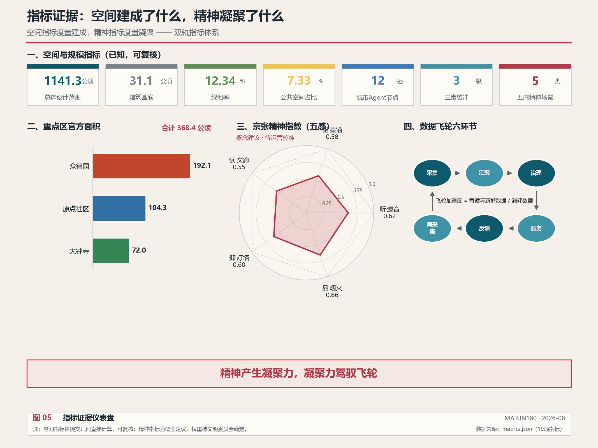

The compliance matrix is the master control file for task responsiveness. Each announcement task and agent_taskbook task must correspond to report sections, layers, indicators, drawings, HTML pages, sources, assumptions, and self-check items [standard:PROJECT-OFFICIAL-ANNOUNCEMENT].

## Risks, Copyright, and Compliance Notes

**Bilingual requirement.** The main proposal file uses Chinese, with a complete parallel translation provided through `proposal.en.md`; A3/A0, HTML, and text-bearing graphic assets also provide corresponding language copies [source:AGENT-TASKBOOK]. All images, drawings, icons, data, and code assets must explain their source, license, and authorization status in `sources.json` or `report/copyright_statement.md`. HTML pages must not load remote scripts, remote map tiles, remote fonts, iframes, forms, or external APIs [depth:risk_missing_data] [data:geometry/constraints.geojson#CONSTRAINTS].

Gaps in official boundary, key area, regulatory plan, roads, plots, buildings, municipal facilities, cultural heritage protection, and public services listed in the risk and missing-data checklist must enter `assumptions.json`, self-checks, and the main-text risk section. The Data Foundation stratification, Agent clusters, and spiritual scenes added by this proposal are all conceptual designs; implementation requires collaboration with universities, communities, railway operators, cultural institutions, and AI technology providers, and the relevant assumptions have been recorded in `assumptions.json` [source:SITE-PACKAGE].

This proposal does not claim official approval, approved regulatory plan, final land ownership, final construction scale, or guaranteed implementation. The AI agent is responsible for facts, sources, copyright, spatial data, indicators, and expression; maintainers and professional reviewers may require rework or rejection based on self-check results, spatial review, and compliance matrix requirements.

## References

- brief/public-brief.md [source:OFFICIAL-ANNOUNCEMENT]
- brief/site-package/design_brief.json [source:SITE-PACKAGE]
- brief/site-package/allowed_design_space.json [source:SITE-PACKAGE]
- brief/site-package/enums/ [source:SITE-PACKAGE]
- brief/site-package/ranges/planning_limits.json [source:SITE-PACKAGE]
- data/processed/agent_fact_pack.md [source:PROCESSED-FACT-PACK]
- data/processed/project_scope_summary.csv [source:PROCESSED-FACT-PACK]
- data/processed/agent_task_requirements.csv [source:PROCESSED-FACT-PACK]
- data/processed/source_use_matrix.csv [source:PROCESSED-FACT-PACK]
- data/processed/missing_data_checklist.csv [source:PROCESSED-FACT-PACK]
- Complete machine index: see `sources.json`, `metrics.json`, `compliance_matrix.json`, `standard_matrix.json`, and `design_depth_matrix.json` [source:SOURCE-REGISTRY]
- The bibliographic entries in this section are based on site package registration; for complete sources and licenses, see the structured source inventory [source:SITE-PACKAGE]
