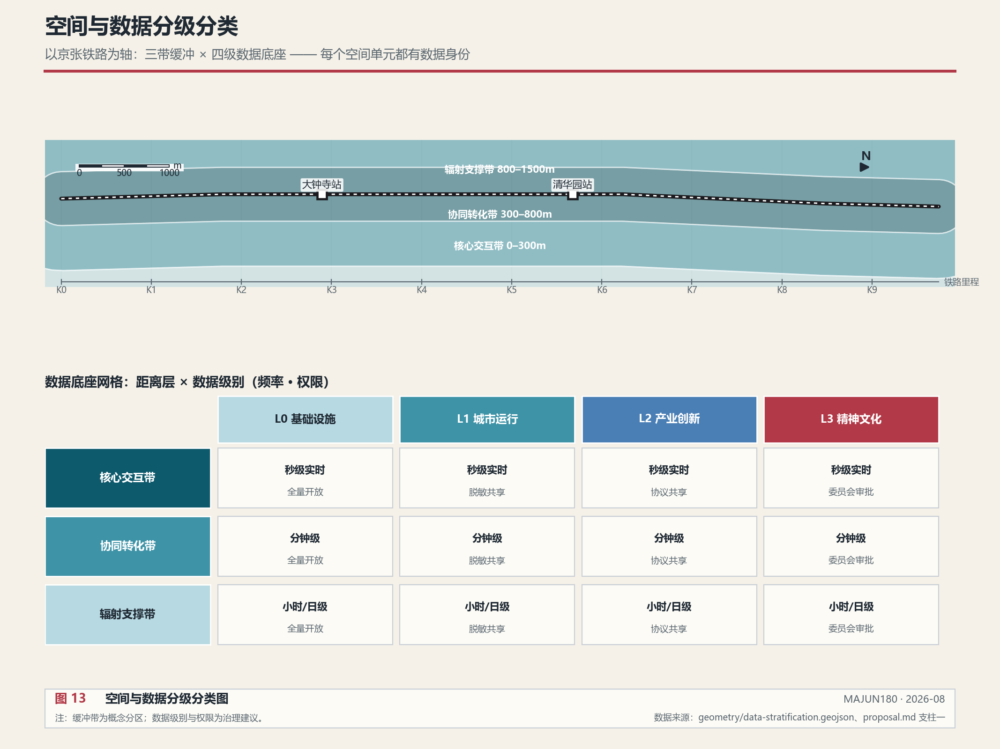
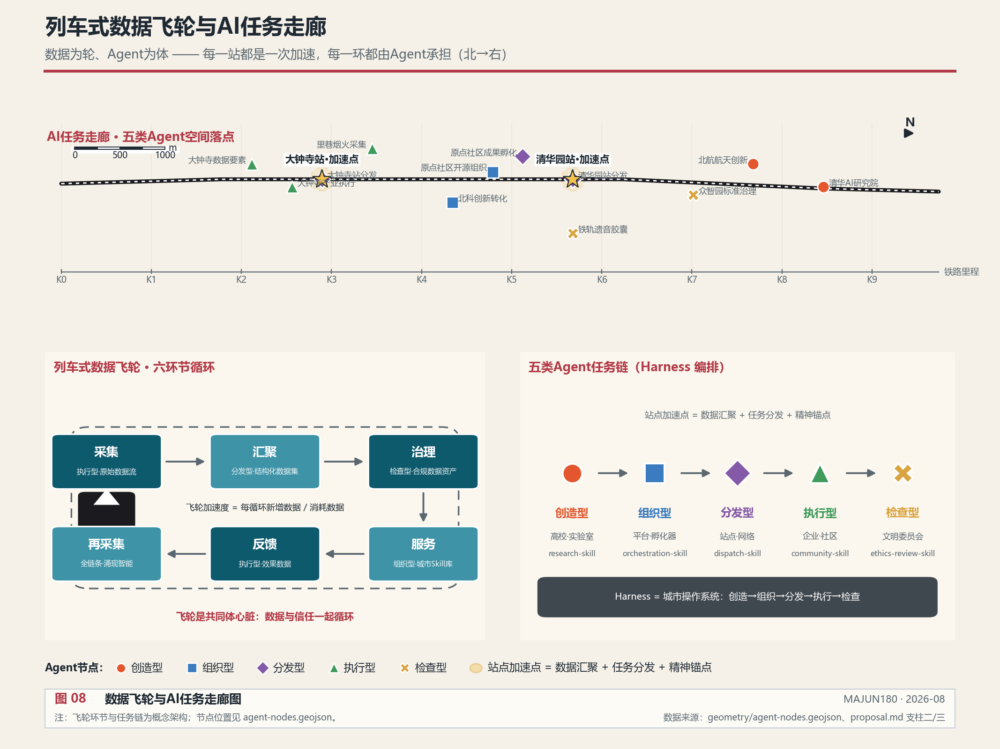
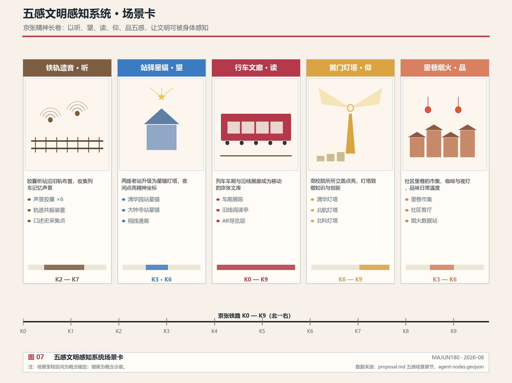
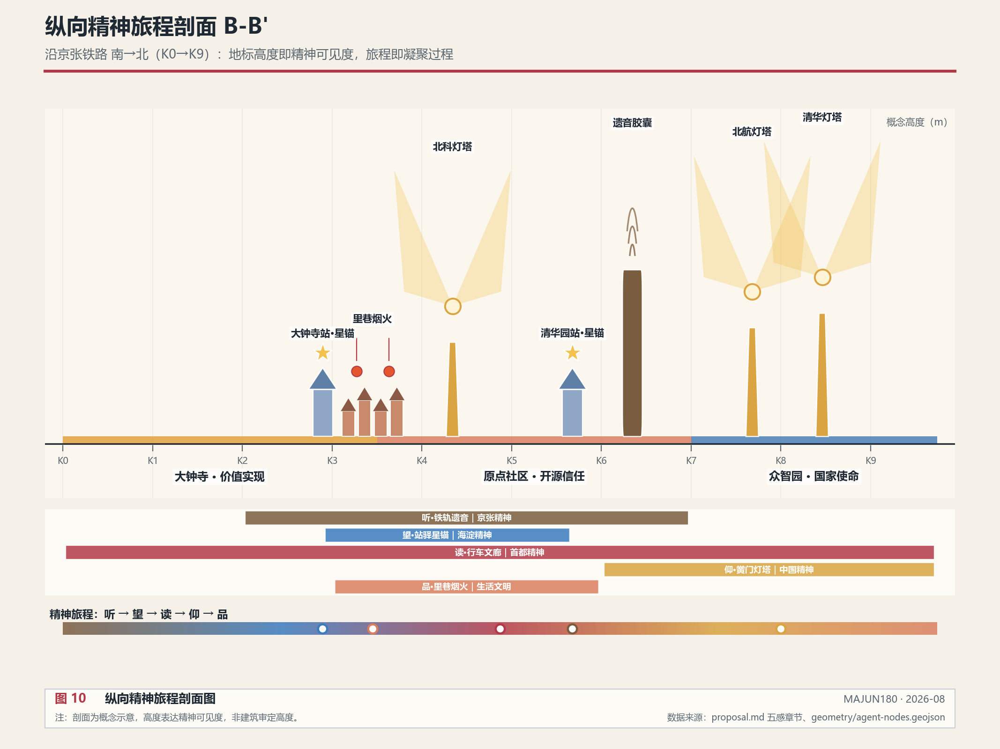
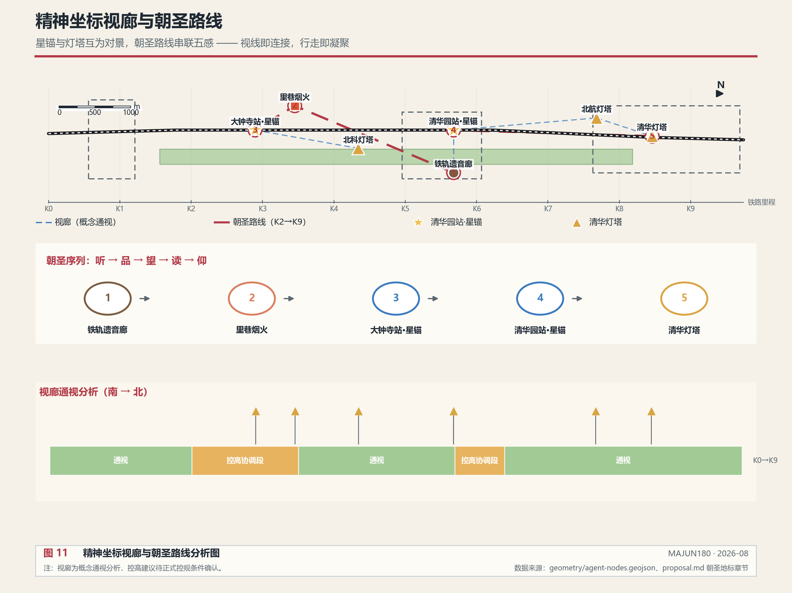
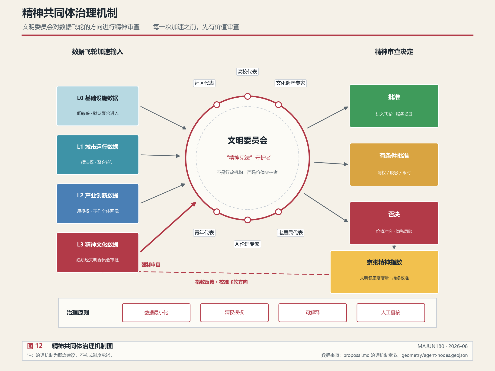
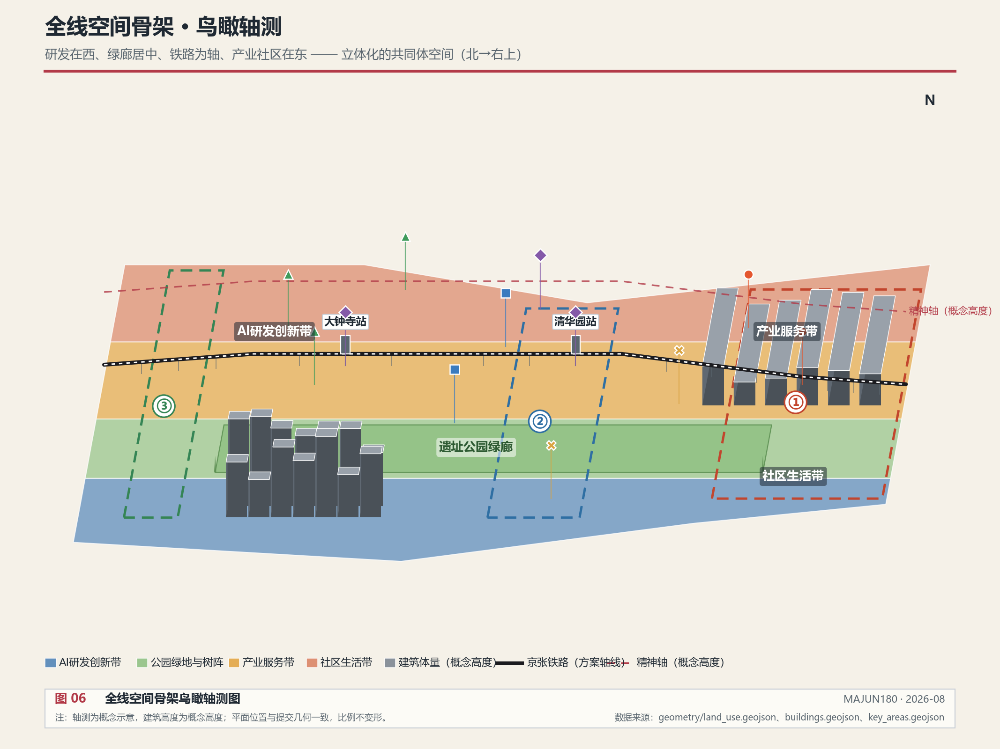
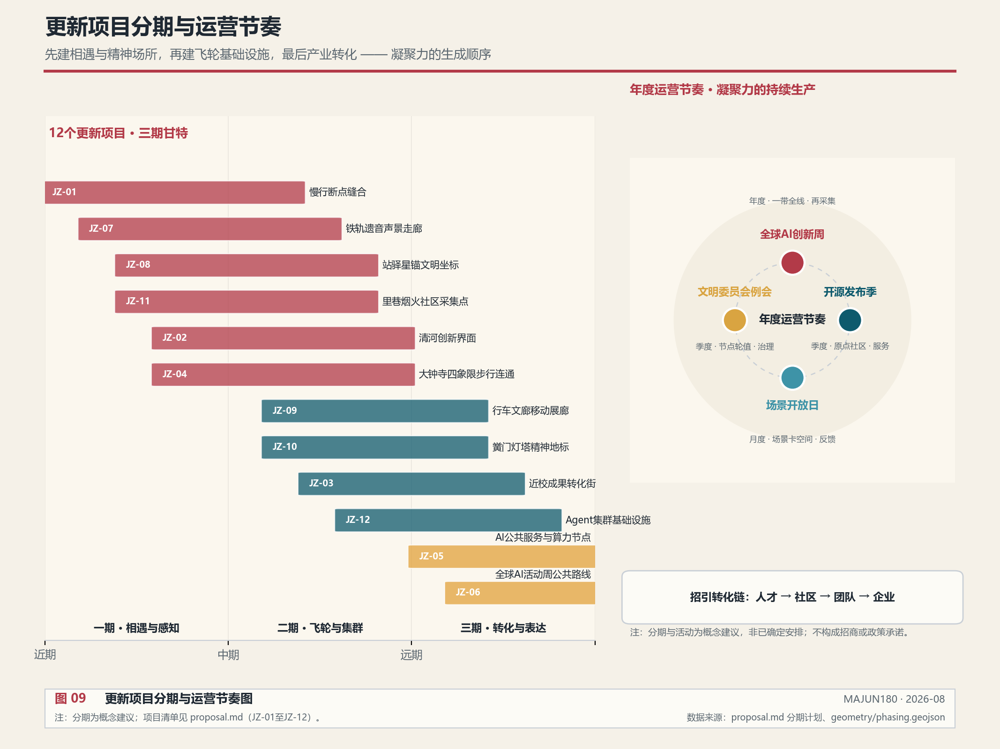

# 连接精神，激荡数据：百年京张AI城市共同体

## 设计依据与资料清单

本 formal 方案以北京市规划和自然资源委员会海淀分局发布的《百年京张AI创新带城市设计国际方案征集资格预审公告》为第一依据，并以 `brief/site-package/` 中经维护者登记的临时粗略边界、重点区域、枚举、指标和来源清单为机器可读依据。AI agent 在生成方案前必须读取 `design_brief.json`、`allowed_design_space.json`、`sources.json`、`enums/`、`ranges/`、`schemas/`、`data/source_registry.json` 和 `data/processed/agent_fact_pack.md`，并用 `project_scope_summary.csv`、`agent_task_requirements.csv`、`source_use_matrix.csv`、`missing_data_checklist.csv` 建立任务、范围、资料用途和缺口清单。所有设计判断都要拆分为可追溯来源、可复算指标、可校验图层和可人工复核假设。公告要求方案达到控制性详细规划的城市设计深度和规划综合实施方案的城市设计深度，因此文本叙述不能替代 GeoJSON、指标表、A3 文册、A0 展板和 HTML 电子展示成果 [source:OFFICIAL-ANNOUNCEMENT] [source:AGENT-TASKBOOK] [depth:existing_conditions_diagnosis]。

资料登记表的使用边界如下 [source:SOURCE-REGISTRY]：

- data/source_registry.json 登记公开、清权与临时资料的用途边界。
- 当前登记摘要：formal 可用资料 7 条，背景资料 1 条，provisional-only 资料 1 条。
- agent 不得把 background_only 或 provisional_only 资料升级为 official boundary、法定控规、正式评分依据或政府实施承诺。

`data/processed/agent_fact_pack.md` 是本方案的阅读导航层，不是新的权威来源 [source:PROCESSED-FACT-PACK]。完整来源关系由 `sources.json` 保存。

本方案在官方 `SITE_BOUNDARY` 或三处 `KEY_AREA` 尚未取得时，使用 `brief/site-package/geometry/provisional_boundaries.geojson` 生成临时 formal 包 [source:SITE-PACKAGE]。提交包中的 `geometry/site_boundary.geojson` 与 `geometry/key_areas.geojson` 均标注为 `provisional_constraint`、`official_boundary=false`，只能用于方案生成、自检、可视化和设计讨论，不能作为 official redline、审批依据、精确面积依据或法定控制结论。该组织方数据缺口本身不阻断内容评分；替换 official polygons 后，site boundary、key areas、land use、roads、green space、public space、buildings、phasing、data-stratification、agent-nodes 和 metrics 均需重算 [source:PROCESSED-FACT-PACK]。

边界解释可回到总体范围图层和面积复算 [data:geometry/site_boundary.geojson#SITE-001] [metric:site_area_sqm]。三处重点区则由独立图层和数量指标核对 [data:geometry/key_areas.geojson#PROV-KEY-001] [metric:key_area_count]。

## 总体概念：连接精神，激荡数据

### 核心哲学

本方案的核心命题是：**当AI时代城市数据飞轮不可阻挡地加速时，谁来握方向盘？**

答案是：**精神定方向，数据加速度。**

- **精神罗盘** = 方向盘——文明与价值引领的决策机制
- **数据飞轮** = 发动机——AI时代的生产力引擎
- **共同体凝聚力** = 向心力——让飞轮越转越快却不飞散的内聚力量
- **京张铁路** = 连接两者的轴心

没有飞轮，精神沦为空谈；没有罗盘，城市被技术裹挟；没有凝聚力，飞轮越快越容易解体。**精神产生凝聚力，凝聚力驾驭飞轮**——这是本方案贯穿全文的核心逻辑。京张铁路百年前连接的是北京与张家口，在AI时代，它连接的是精神、文明、生态、青年、创造力、生命力和城市烟火气——以及这片城市区域的数据底座。列车不再只是交通工具，而是数据采集器与分发器，在运行中让数据滚动、碰撞、生成新数据，形成AI数据飞轮；而让这些数据真正"属于这片土地上的人"的，是共同体。

这片区域的目标不仅是AI创新带，更是**全球第一个城市Agent、Skill、Harness集群**和**百年京张AI城市共同体**——让城市不被AI裹挟着推动，而是用精神与文明的力量决定前进的方向。后文所有空间、数据、Agent与场景设计，都回答同一个问题：**如何让这片区域长成一个有凝聚力的共同体。**

### 四大支柱

四大支柱不是并列的功能模块，而是共同体的四个器官：脉是骨架，轮是心脏，体是四肢，魂是意志。缺任何一个，共同体都不完整。

| 支柱 | 命名 | 核心 | 共同体角色 | 数据落点 |
| --- | --- | --- | --- | --- |
| 支柱一 | 铁路为脉 | 三带缓冲+四级数据底座 | 共同体的骨架——把分散的人与机构连成一体 | [data:geometry/constraints.geojson#DATA-STRAT-001] |
| 支柱二 | 数据为轮 | 列车式数据飞轮，六环节循环 | 共同体的心脏——让数据与信任一起循环 | [data:geometry/constraints.geojson#AGENT-NODE-001] |
| 支柱三 | Agent为体 | 五类任务集群，Skill+Harness | 共同体的四肢——把意志变成行动 | [data:geometry/constraints.geojson#AGENT-NODE-001] |
| 支柱四 | 精神为魂 | 四层谱系+五感场景+文明委员会 | 共同体的意志——决定方向与凝聚力 | [data:geometry/constraints.geojson#AGENT-NODE-011] |

### 五大功能与四支柱的映射

公告任务书提出一带承载五大功能 [source:AGENT-TASKBOOK] [standard:PROJECT-AGENT-OPEN-CALL-TASKBOOK]。四支柱不是另起炉灶，而是五大功能的实现机制：

| 五大功能 | 承载支柱 | 空间与机制落点 |
| --- | --- | --- |
| AI全栈自主创新体系 | 支柱三·Agent为体 | 众智园创造型Agent核心、黉门灯塔高校精神地标 |
| 世界级AI创新生态 | 支柱二·数据为轮 | 数据飞轮驱动高校-企业-社区创新闭环 |
| AI+场景赋能新范式 | 支柱一·铁路为脉+支柱三 | 三带缓冲的场景分级、10张场景卡的Agent角色标注 |
| 智能化AI活力城市 | 支柱三·Agent为体 | 五类Agent任务链、站点加速点、AI慢行导航 |
| AI治理全球话语权 | 支柱四·精神为魂 | 文明委员会、检查型Agent、安全治理沙盒 |

### 三区两翼：精神文明共同体的空间骨架

任务书提出"三区两翼"布局 [source:AGENT-TASKBOOK]。本方案的回答是：**三区两翼不只是功能布局，而是精神文明共同体的空间骨架——每一个单元既是数据飞轮的一个环节，也是一个生产凝聚力的节点。**

核心判断：AI时代，技术加速的是"速度"，精神决定的是"方向"。一个越转越快的飞轮，需要一种向内的力量让它不飞散——这个力量就是**凝聚力**。精神、文明与文化，是AI时代引领发展的核心；共同体，是精神落地为力量的组织形式。三区两翼的真正产品不是产值，而是凝聚力：信仰的凝聚、信任的凝聚、成就的凝聚、连接的凝聚、生活的凝聚。

| 单元 | 官方角色 | Agent定位 | 精神文明定位 | 凝聚力来源 |
| --- | --- | --- | --- | --- |
| 众智园AI自主创新加速区 | AI全栈自主创新体系与AI治理全球话语权 | 创造型+检查型Agent核心 [data:geometry/key_areas.geojson#PROV-KEY-001] | 京张精神承继者：从詹天佑自主筑路到全栈自主技术栈，"不让于人"的百年信念在AI时代转化为自主创新信仰 | 共同的国家使命 |
| 北京AI原点社区 | 世界级AI创新生态 | 组织型Agent核心 [data:geometry/key_areas.geojson#PROV-KEY-002] | 海淀精神先行者：开源协作、敢为人先。"原点"不只是地理原点，更是共同体信任的原点——人与人因共享而相聚 | 开源信任规则 |
| 大钟寺AI产业聚集区 | 智能原生新业态 | 执行型Agent核心 [data:geometry/key_areas.geojson#PROV-KEY-003] | 首都精神表达者：古钟长鸣、开放包容。AI产业与国际交往在此完成从精神到现实的"落地"——钟声所及，皆为回响 | 价值实现的成就感 |
| 中关村科技服务翼 | 要素全球化配置、中关村IP与资本赋能 | 飞轮的"服务"环节 | 向世界展翅：把共同体的数据资产转化为资本与全球要素配置，让中国AI治理主张随服务网络走向世界 | 全球连接 |
| 小月河场景赋能翼 | AI场景赋能与智能化AI活力城市 | 飞轮的"反馈"环节 [data:geometry/green_space.geojson#GREEN-001] | 向生活展翅：场景沿小月河展开，效果数据回流飞轮，最终回到社区烟火——技术的终点是人的生活 | 生活共鸣 |

三区回答共同体的三个问题：**知识从哪里来**（众智园创造）、**人如何互信**（原点社区组织）、**价值落到哪里**（大钟寺执行）。两翼回答共同体的两个方向：**向外到世界**（科技服务翼）、**向内到生活**（小月河翼）。三区构成共同体之"体"，两翼构成共同体之"翼"——精神罗盘定方向，数据飞轮给动力，凝聚力决定这个共同体能飞多远。

与四层精神谱系的对应：众智园对应京张精神（根）、原点社区对应海淀精神（干）、大钟寺对应首都精神（枝）、两翼共同指向中国精神（冠）——从根到冠，三区两翼长成一棵精神之树 [depth:overall_spatial_structure]。

### 三处重点区域在新概念下的角色

| 重点区域 | Agent角色 | 数据底座级别 | 精神锚点 |
| --- | --- | --- | --- |
| 众智园AI自主创新加速区 | 创造型核心 | L2产业创新+L3精神文化 | 自主创新精神地标 |
| 北京AI原点社区 | 组织型核心 | L1城市运行+L2产业创新 | 开源协作文明锚点 |
| 大钟寺AI产业聚集区 | 执行型核心 | L0基础设施+L2产业创新 | 产业传承文明锚点 |

## 三层范围工作框架

方案按照公告确定的三个层次组织工作：统筹研究范围关注 43.6 平方公里的AI产业生态、战略定位、创新链和未来城市形态；总体设计范围关注 11.4 平方公里京张遗址公园周边 1-2 公里城市地区和产业区，要求形成城市更新总体框架、产业空间布局、交通市政支撑和城市风貌控制；重点区域范围关注 368.4 公顷三处详细设计地区，要求明确功能业态、建筑规模、拆改留分类、公共空间连通和交通组织。三层范围在 `compliance_matrix.json` 中逐条映射 [depth:three_level_scope_framework] [depth:overall_spatial_structure] [standard:PROJECT-OFFICIAL-ANNOUNCEMENT]。

三处重点区域的官方文字面积为：众智园AI自主创新加速区 192.1 公顷、北京AI原点社区 104.3 公顷、大钟寺AI产业聚集区 72.0 公顷，合计 368.4 公顷 [source:OFFICIAL-ANNOUNCEMENT] [standard:PROJECT-OFFICIAL-ANNOUNCEMENT]。这些面积值来自公告文字，不能替代 official polygon 的精确面积复算 [metric:key_area_total_area_ha] [metric:key_area_count]。

三层工作不是互相割裂的图纸集合。统筹研究决定产业链和城市形态判断，总体设计把判断落实到更新项目、空间结构和设施承载，重点区域详细设计验证具体地块、建筑、交通、公共空间和AI应用场景的可实施性。本方案在三层数据分层的基础上组织空间 [data:geometry/constraints.geojson#DATA-STRAT-001]：核心交互带承载Agent任务站和精神地标，协同转化带承载高校科研与产业协同，辐射支撑带承载社区生活与生态服务 [source:PROCESSED-FACT-PACK]。

从共同体视角看，三层范围对应共同体的三个尺度：统筹研究范围是共同体的**愿景层**（我们要成为什么样的共同体），总体设计范围是共同体的**骨架层**（共同体靠什么空间与机制连接），重点区域范围是共同体的**触点层**（共同体成员在哪里真实相遇、协作、感知精神）。三层一致，才能让共同体从愿景落到可感知的日常。

| 层级 | 设计问题 | 方案回答 | 数据落点 |
| --- | --- | --- | --- |
| 统筹研究范围 | AI产业生态和未来城市形态如何组织 | 建立"高校策源-开源协作-企业转化-公共体验-国际传播"的创新链，以数据飞轮驱动 | compliance_matrix.json、standard_matrix.json |
| 总体设计范围 | 产业空间、城市更新、交通市政和风貌如何落图 | 用地、建筑、道路、绿地、公共空间、分期、数据分层和Agent节点图层共同表达 | [data:geometry/land_use.geojson#LU-001]、[data:geometry/constraints.geojson#DATA-STRAT-001] |
| 重点区域范围 | 三处片区如何达到详细设计深度 | 分别以创造型、组织型、执行型Agent核心定位，提出空间动作和实施依赖 | [data:geometry/key_areas.geojson#PROV-KEY-001]、[data:geometry/constraints.geojson#AGENT-NODE-001] |

## 支柱一：铁路为脉——空间与数据分级分类

### 核心理念

以京张铁路为轴，向外形成缓冲区，不只是一个物理距离概念，更是数据密度、数据级别、协作强度的分层。铁路是数据连接的物理载体——每一次列车经过，都在沿线的传感器、站点、社区之间滚动数据 [depth:overall_spatial_structure]。

对共同体而言，铁路是**骨架**：它把原本分散的高校、企业、社区、遗产串成一条可以共同呼吸的脉络。距离越近，连接越密，共同体感越强；距离越远，连接越松，但仍在同一根轴上。三带缓冲的本质，是让"共同体成员"按参与深度分层，而不是按行政边界切割。

### 三带缓冲体系

沿京张铁路向外形成三个缓冲带，每个缓冲带对应不同的数据频率、协作模式和空间功能 [data:geometry/constraints.geojson#DATA-STRAT-001]：

| 缓冲带 | 距离 | 数据频率 | 协作模式 | 典型空间 |
| --- | --- | --- | --- | --- |
| 核心交互带 | 0–300m | 秒级实时 | 全量开放共享 | Agent任务站、创新节点、精神地标、铁路遗址公园 |
| 协同转化带 | 300–800m | 分钟级 | 协议共享 | 高校、实验室、创新中心、孵化器 |
| 辐射支撑带 | 800–1500m | 小时/日级 | 脱敏按需 | 社区、商业、生态绿地、生活服务 |

核心交互带是数据飞轮的"轮缘"——最高频的数据交互发生在这里，Agent任务站、精神地标和铁路遗址公园共同构成数据采集与分发的密集网络。协同转化带是"轮辐"——高校和科研机构在这里将原始数据转化为知识和任务。辐射支撑带是"轮辋"——社区和生态空间在这里提供生活数据和文明感知 [data:geometry/constraints.geojson#DATA-STRAT-002] [data:geometry/constraints.geojson#DATA-STRAT-003]。

### 数据底座四级分类

数据底座不只是静态数据库，而是按级别分层治理的活数据体系。不同层级的数据在不同距离、不同权限下滚动 [depth:metrics_recalculation]：

| 级别 | 数据类型 | 权限与滚动方式 | 典型来源 |
| --- | --- | --- | --- |
| L0 | 基础设施数据 | 全量开放，市政级实时滚动 | 传感器、市政系统、交通设施 |
| L1 | 城市运行数据 | 脱敏共享，按权限分级滚动 | 交通流量、公共安全、市政运行 |
| L2 | 产业创新数据 | 协议共享，产学研协同滚动 | 高校科研、企业研发、专利交易 |
| L3 | 精神文化数据 | 共同体治理，文明委员会审批定向滚动 | 京张遗产、口述史、社区生活、高校精神 |

L3精神文化数据是本方案的独创——精神不是口号，而是嵌入数据底座的可采集、可治理、可感知的数据资产。文明委员会对L3数据的采集和使用进行价值审查，确保精神共同体的方向引领落到实处 [data:geometry/constraints.geojson#AGENT-NODE-011] [metric:jingzhang_spirit_index]。

### 数据底座与空间的映射

三带缓冲与四级数据底座交叉，形成沿京张铁路的数据底座网格——每个空间单元都有其数据身份（距离层×类型×级别）。规划决策基于这个网格，而非凭经验拍脑袋 [data:geometry/constraints.geojson#DATA-STRAT-001] [data:geometry/land_use.geojson#LU-001]。

上图：三带缓冲沿铁路轴横置展开，距离即参与深度；下图：距离层×数据级别网格，每格标注滚动频率与权限方式——L3精神文化数据在任何距离层都以文明委员会审批为前提 [data:geometry/constraints.geojson#DATA-STRAT-002]。

## 支柱二：数据为轮——列车式数据飞轮

### 核心理念

不是静态数据库，而是"列车式数据飞轮"。京张铁路上的每一站、每一个节点，都是数据滚动的一次"加速点"。高校、航天、林业、矿业等机构产生的数据，在列车带动下不断碰撞、重组，产生新任务、新技能、新连接 [depth:overall_spatial_structure] [source:AGENT-TASKBOOK]。

对共同体而言，飞轮是**心脏**：它让数据与信任一起循环。数据只在流动中产生价值，信任也只在协作中产生。每一次数据的碰撞与共享，都是一次共同体成员之间的"握手"。飞轮转得越快，成员之间的连接越密，凝聚力越强——但前提是方向盘（精神罗盘）始终握在共同体手里，否则越快越容易解体。

### 飞轮六环节

数据飞轮由六个环节构成循环，每一环节由不同类型的Agent承担 [data:geometry/constraints.geojson#AGENT-NODE-001]：

| 环节 | 动作 | 主体 | 产出 |
| --- | --- | --- | --- |
| 采集 | 沿铁路传感器+Agent采集沿线数据 | 执行型Agent | 原始数据流 |
| 汇聚 | 站点数据加速点汇聚多源数据 | 分发型Agent | 结构化数据集 |
| 治理 | 文明委员会审查+脱敏+分级 | 检查型Agent | 合规数据资产 |
| 服务 | Skill模块封装为可调用的城市能力 | 组织型Agent | 城市Skill库 |
| 反馈 | 场景应用反馈效果与体验 | 执行型Agent | 效果数据 |
| 再采集 | 飞轮加速，进入下一轮循环 | 全链条Agent | 涌现智能 |

### 站点加速点

每个轨道站点都是数据飞轮的"加速点"——三合一节点：数据汇聚枢纽+任务分发节点+精神锚点 [data:geometry/constraints.geojson#AGENT-NODE-009] [data:geometry/constraints.geojson#AGENT-NODE-010]：

- 列车到站时，站点自动汇聚该区段沿线采集的数据
- 分发型Agent将任务包分发到周边的执行型Agent和社区
- 精神锚点同步更新该站的文明星图，让旅客在经停时感知文明坐标

飞轮越转越快——数据越多，碰撞越频繁，新任务越多，城市智能涌现越丰富 [metric:data_flywheel_acceleration]。

## 支柱三：Agent为体——城市任务集群

### 核心理念

沿铁路布局城市Agent集群，形成完整任务链。这片区域的目标是成为全球第一个城市Agent、Skill、Harness集群——有创造任务的，有组织任务的，有分发任务的，有执行任务的，有检查任务的，形成完整的城市智能体生态 [source:AGENT-TASKBOOK] [depth:overall_spatial_structure]。

对共同体而言，Agent是**四肢**：它们把共同体的意志变成行动。但四肢必须听大脑的——Agent集群不是无目的的效率机器，而是被精神罗盘定向、被文明委员会约束的行动者。每一个Agent背后都对应一个共同体成员的委托：创造型承载高校的探索意志，执行型承载社区的日常诉求，检查型承载文明委员会的价值底线。Agent越强，共同体的行动力越强；但只有方向正确，行动力才转化为凝聚力而不是离心力。

### 五类Agent任务链

| 角色 | 职能 | 空间载体 | 代表机构 | 典型Skill模块 |
| --- | --- | --- | --- | --- |
| 创造型 | 产生新知识、新算法、新任务 | 高校、实验室、研究机构 | 清华、北航、北科、国家AI平台 | research-skill、hypothesis-skill |
| 组织型 | 整合资源、编排流程、调度任务 | 平台机构、创新中心 | 开源社区运营方、孵化器 | orchestration-skill、resource-matching-skill |
| 分发型 | 传递任务与数据、连接节点 | Skill/Harness系统、铁路、站点 | 轨道站点、数据网络 | dispatch-skill、sync-skill |
| 执行型 | 落地执行具体任务 | 企业、社区、空间运营者 | 领军企业、社区运营方 | traffic-optimize-skill、community-service-skill |
| 检查型 | 质量与合规审查、文明评估 | 评估机构、文明委员会 | 安全治理机构、文明委员会 | ethics-review-skill、civilization-audit-skill |

五类Agent沿铁路分布，形成"AI任务走廊" [data:geometry/constraints.geojson#AGENT-NODE-001]。创造型Agent集中在众智园和高校，组织型Agent集中在AI原点社区，分发型Agent沿站点分布，执行型Agent集中在大钟寺和产业园区，检查型Agent守护精神场景节点和数据治理 [data:geometry/constraints.geojson#AGENT-NODE-011] [metric:agent_node_count]。

### Skill与Harness

- **Skill** = 可复用的城市能力模块（如"交通优化Skill"、"碳排放监测Skill"、"社区服务匹配Skill"、"文明审计Skill"）。每个Skill是一个封装好的、可调用的城市服务能力。
- **Harness** = 任务编排框架，连接Agent和Skill的调度系统，类似于城市的"操作系统"。它管理任务的生命周期：从创造型Agent提出任务，到组织型Agent编排资源，到分发型Agent传递任务，到执行型Agent落地执行，到检查型Agent审查结果。

### Agent集群的空间落点

Agent节点不只是概念，而是有明确空间位置的节点 [data:geometry/constraints.geojson#AGENT-NODE-001]。当前共布局12个Agent节点，覆盖五类角色 [metric:agent_node_count]：

- 众智园区域3个节点（创造型×2 + 检查型×1）
- AI原点社区区域3个节点（组织型×2 + 分发型×1）
- 大钟寺区域2个节点（执行型×2）
- 沿线站点2个节点（分发型×2）
- 精神场景节点2个节点（检查型×1 + 执行型×1）

## 支柱四：精神为魂——文明共同体

### 核心理念

AI时代城市发展越来越快，数据飞轮的加速度会无限提升。在未来，什么会变得非常重要？是精神、是文明、是文化。从古至今，科技和生产力是推动者，但方向与决策一定是精神、文明所引领的——因为有了精神，才有力量，才有凝聚力。一个城市、一片区域只有有了凝聚力与共同目标，才能克服万难，永远向前。

这片城市区域要形成百年京张AI城市共同体——同时也是科创共同体、数据共同体、生活共同体、文化共同体。中国精神、首都精神、海淀精神、京张精神，四层精神谱系由内而外，形成同心圆 [depth:overall_spatial_structure]。

### 四层精神谱系

| 层级 | 谱系命名 | 精神内核 | 历史锚点 | 时代表达 |
| --- | --- | --- | --- | --- |
| 第一圈 | 京张精神 | 百年传承·自力更生 | 詹天佑1909自主造铁路 | 自主AI大模型·国产技术栈 |
| 第二圈 | 海淀精神 | 科教融合·敢为人先 | 中关村1980s电子一条街 | 全球Agent集群策源地 |
| 第三圈 | 首都精神 | 首善标准·开放包容 | 元大都·明清京师文脉 | 国际AI治理与文化中心 |
| 第四圈 | 中国精神 | 民族复兴·人类命运 | 五千年文明传承 | AI时代人类文明新形态 |

四圈不是简单叠加——京张精神是"根"（最具体的土地记忆），中国精神是"冠"（最宏大的时代担当），从根到冠形成一棵精神之树。

### 五感文明感知系统

这是本方案的核心创新——用五种感知方式，让精神**可听、可望、可读、可仰、可品**。每个场景都是数据底座中的一个节点类型，既是物理空间场所，也是数据采集与分发的终端 [data:geometry/constraints.geojson#AGENT-NODE-011] [data:geometry/constraints.geojson#AGENT-NODE-012] [metric:spirit_scene_count]。

#### 场景一：铁轨遗音——听·百年回声

> *铁轨之上，百年回声不绝于耳*

| 维度 | 内容 |
| --- | --- |
| 空间载体 | 京张铁路遗址公园沿线，每隔200m设一座"遗音胶囊" |
| 感知方式 | 听——声景沉浸 |
| 数据类型 | L3精神文化数据：历史声景、口述史、环境声、列车声 |
| 精神层级 | 京张精神（第一圈·根） |
| 数据采集 | 声学传感器采集环境声；口述史数据库收录老铁路人讲述；历史声纹库复原1909年蒸汽机车声 |
| 体验设计 | 漫步铁路遗址公园，AR耳机自动播放该路段的历史声景——詹天佑勘测时的山风、蒸汽时代的汽笛、停运后的寂静、今天AI列车的电子音。四重声景叠加，听百年京张的呼吸 |
| 情怀表达 | 铁轨会说话。它记得每一列经过的火车，记得每一个等车的人，记得这片土地从蒸汽到智能的百年跋涉。遗音胶囊让铁轨的声音不再消散 |
| Agent角色 | 检查型Agent守护声纹数据的真实性与文明完整性 |

铁轨遗音让历史不再只存在于博物馆的展柜里，而是活在每一段铁轨的震动中。当旅客走过遗址公园，听到的不是沉默，而是百年京张在说话 [data:geometry/constraints.geojson#AGENT-NODE-011] [metric:heritage_sound_completeness]。

#### 场景二：站驿星锚——望·文明坐标

> *每站如星，锚定一片文明的天空*

| 维度 | 内容 |
| --- | --- |
| 空间载体 | 沿线每个轨道站点出入口设"星锚"装置 |
| 感知方式 | 望——视觉仰望 |
| 数据类型 | L1城市运行+L3精神文化：站点文明档案、周边资源图谱 |
| 精神层级 | 海淀精神（第二圈·科教融合） |
| 数据采集 | 每站建立"文明星图"——标注该站1km半径内的高校、科研机构、文化遗产、产业地标及其精神标识 |
| 体验设计 | 出站抬头仰望，星锚装置投射该站的文明星图——清华园站的星图亮起清华灯塔和航天院所，大钟寺站的星图亮起古钟博物馆和AI企业群。每片星空不同，望见这片土地的精神版图 |
| 情怀表达 | 车站不只是出发和到达。每一个站名背后，都有一片学问的山河、一群人的奋斗。星锚让旅客在匆匆经过时，望见脚下的文明厚度 |
| Agent角色 | 分发型Agent将星图数据分发到站点屏和旅客终端 [data:geometry/constraints.geojson#AGENT-NODE-009] |

站驿星锚让每一个站点都成为一个文明的坐标系。旅客在匆忙的通勤中，抬头就能望见这片土地的精神版图 [metric:star_anchor_connectivity]。

#### 场景三：行车文廊——读·移动长卷

> *车行京张，一卷文明徐徐展开*

| 维度 | 内容 |
| --- | --- |
| 空间载体 | 列车车厢内壁改造为"移动文廊"数字屏 |
| 感知方式 | 读——阅读沉浸 |
| 数据类型 | L2产业创新+L3精神文化：四层精神谱系叙事、沿线创新故事 |
| 精神层级 | 首都精神（第三圈·文化中心） |
| 数据采集 | 车厢数字屏与列车GPS联动，根据列车位置实时切换内容——经过清华园段读清华百年、经过北航段读空天报国、经过大钟寺段读古钟与AI的对话 |
| 体验设计 | 乘车从北到南，车厢文廊如一卷长画缓缓展开。窗外是今日的城市，窗内是百年的文明。从詹天佑到今天AI Agent，从蒸汽机车到数据飞轮，一段车程读完京张的百年精神史 |
| 情怀表达 | 列车是移动的书房。十二分钟的车程，读百年京张；十二分钟的光影，见一座城市的来路与去向。文廊让通勤变成朝圣 |
| Agent角色 | 组织型Agent编排文廊内容，根据时段、季节、事件动态调整叙事 |

行车文廊把通勤时间变成文明阅读时间。列车不再是枯燥的位移，而是一卷缓缓展开的文明长卷。

#### 场景四：黉门灯塔——仰·学府之光

> *黉门之上，灯塔长明，照向国家未来*

| 维度 | 内容 |
| --- | --- |
| 空间载体 | 沿线七所高校门口或标志建筑设"灯塔"装置 |
| 感知方式 | 仰——敬仰仰望 |
| 数据类型 | L2产业创新+L3精神文化：学科精神档案、国家使命宣言、科研成果故事 |
| 精神层级 | 中国精神（第四圈·冠） |
| 数据采集 | 每所高校建"精神灯塔档案"——校训精神、学科使命、关系国家未来的核心领域（航天、林业、矿业、计算机等）、代表性成果与人物 |
| 体验设计 | 走近高校，仰望灯塔装置。清华灯塔刻"自强不息·厚德载物"并亮起航天报国之光，北航灯塔刻"德才兼备·知行合一"并亮起空天探索之光，北林灯塔刻"知山知水·树木树人"并亮起生态文明之光。七座灯塔，七种光芒，汇成这片土地的精神天际线 |
| 情怀表达 | 大学是城市的灵魂。这些学府不只是教书的地方，更是国家未来的守望者。灯塔让每个路过的人抬头看见——这片土地上有人在做关系民族命运的事 |
| Agent角色 | 创造型Agent持续更新灯塔档案，记录新的精神故事 [data:geometry/constraints.geojson#AGENT-NODE-001] |

黉门灯塔让大学的精神可见、可仰。七座灯塔不只是装饰，而是七所高校对国家未来的宣言 [metric:lighthouse_brightness]。

#### 场景五：里巷烟火——品·人间温度

> *里巷深处，烟火升腾，城市有魂*

| 维度 | 内容 |
| --- | --- |
| 空间载体 | 沿线社区街巷、菜市场、小广场设"烟火采集点" |
| 感知方式 | 品——生活品味 |
| 数据类型 | L0基础设施+L3精神文化：社区生活数据、邻里故事、市井温度 |
| 精神层级 | 生活文明（贯穿四圈的人间根基） |
| 数据采集 | 社区设烟火采集点——记录早市开摊的声音、老人下棋的棋谱、孩子的笑声、邻里互助的故事。这些数据不入商业系统，只入文明记忆库 |
| 体验设计 | 走进社区，品一碗豆浆、听一段闲谈、看一局棋。烟火采集点用质朴的方式记录这些日常——没有算法推荐，没有数据画像，只有对生活的尊重。城市再智能，也不能没有烟火气 |
| 情怀表达 | 精神不只在殿堂和铁轨上，更在每一缕炊烟里。技术可以改变城市，但不能替代邻居的一句问候。烟火采集点守护的是城市最柔软的部分——人的生活本身 |
| Agent角色 | 执行型Agent+检查型Agent共同守护烟火数据的隐私与尊严 [data:geometry/constraints.geojson#AGENT-NODE-012] |

里巷烟火让AI时代的城市不丢失温度。精神不只在宏大叙事中，更在每一个清晨的豆浆香、每一局棋的落子声里 [metric:fireworks_warmth]。

### 五感文明感知体系总览

| 感知 | 场景命名 | 空间载体 | 精神层级 | 数据级别 | Agent角色 |
| --- | --- | --- | --- | --- | --- |
| 听 | 铁轨遗音 | 铁路遗址公园 | 京张精神 | L3 | 检查型 |
| 望 | 站驿星锚 | 轨道站点 | 海淀精神 | L1+L3 | 分发型 |
| 读 | 行车文廊 | 列车车厢 | 首都精神 | L2+L3 | 组织型 |
| 仰 | 黉门灯塔 | 七所高校 | 中国精神 | L2+L3 | 创造型 |
| 品 | 里巷烟火 | 社区街巷 | 生活文明 | L0+L3 | 执行+检查型 |

五感对应五类空间载体、五层精神、五级数据、五类Agent——形成完整的文明感知闭环 [metric:spirit_scene_count]。

五感场景的终极目的不是"展示"，而是**凝聚**。每一种感知方式都是一次共同体成员与这片土地的精神握手：听，是与历史的握手；望，是与学问的握手；读，是与文明的握手；仰，是与国家使命的握手；品，是与邻里生活的握手。当一个人同时被这五种方式触动，他就不再只是"路过这片区域"，而是"属于这个共同体"。

沿铁路南→北的纵向剖面显示：精神地标的高度由南向北渐次抬升——从里巷烟火的低矮檐口，到铁轨遗音的遗址廊架，再到黉门灯塔的精神天际线。地标高度即精神可见度，旅程本身即凝聚过程 [depth:height_massing_character]。

### AI朝圣地标与荣誉展示体系

任务书要求提出不少于3个AI朝圣地标、荣誉展示体系和公共空间组件库 [source:AGENT-TASKBOOK]。五感精神场景中的三个核心场景正是本方案的AI朝圣地标：

| 朝圣地标 | 对应精神场景 | 朝圣意义 |
| --- | --- | --- |
| 铁轨遗音·百年回声廊 | 场景一 | 朝圣京张精神——在铁路遗址公园聆听百年自主创新的回声 |
| 黉门灯塔·学府之光 | 场景四 | 朝圣中国精神——仰望七所高校对国家未来的守望 |
| 里巷烟火·人间温度 | 场景五 | 朝圣生活文明——品味AI时代城市最柔软的人间烟火 |

三个朝圣地标沿京张铁路遗址公园串联，形成"从历史到未来、从殿堂到生活"的朝圣路线，与全球AI活动周路线（场景卡10）叠加 [data:geometry/constraints.geojson#AGENT-NODE-011] [data:geometry/constraints.geojson#AGENT-NODE-012]。

星锚与灯塔互为对景：站点星锚锚定水平方向的文明坐标，高校灯塔标定垂直方向的精神天际线，二者之间的视廊构成"视线即连接"的精神网络。朝圣路线按"听→品→望→读→仰"的五感序列组织，行走即凝聚。视廊与朝圣路线均为概念分析，具体视线控制需结合正式控规高度条件深化 [depth:height_massing_character]。

**荣誉展示体系**：在朝圣地标和站点设置贡献展示墙，记录参与一带建设的开发者、研究者、社区居民和Agent贡献者。展示内容须清权授权，区分投稿、评审、入选与落地状态，不得将概念方案表述为已建成 [source:AGENT-TASKBOOK]。

**公共空间组件库**：把五感场景的设施抽象为可复用的公共空间组件——遗音胶囊（声景组件）、星锚装置（导视组件）、灯塔装置（地标组件）、烟火采集点（社区组件）、文廊屏幕（展陈组件）。组件库供后续专业团队在不同区段复用与深化，此为概念建议 [depth:blue_green_public_space]。

### "京张精神指数"度量体系

把精神从口号转化为可度量、可追踪的指标 [metric:jingzhang_spirit_index]：

| 指标名称 | 度量维度 | 数据来源 | 当前状态 |
| --- | --- | --- | --- |
| 遗音完整度 | 历史声景覆盖率、口述史采集量 | 铁轨遗音胶囊数据 | unknown [metric:heritage_sound_completeness] |
| 星锚连接度 | 站点文明资源密度、星图更新频率 | 站驿星锚数据 | unknown [metric:star_anchor_connectivity] |
| 文廊沉浸度 | 乘车阅读时长、内容触达率 | 行车文廊交互数据 | unknown |
| 灯塔亮度 | 高校精神档案完整度、成果传播度 | 黉门灯塔数据 | unknown [metric:lighthouse_brightness] |
| 烟火温度 | 社区活动频次、邻里互助记录数 | 里巷烟火采集点 | unknown [metric:fireworks_warmth] |

综合形成"京张精神指数"——一个城市文明健康度的全新度量。该指标体系为概念建议，需运营数据持续校准 [source:AGENT-TASKBOOK]。

### 精神共同体治理机制

**"文明委员会"** —— 精神共同体的治理主体

- **组成**：高校代表、社区代表、文化遗产专家、AI伦理专家、青年代表、老居民代表
- **职能**：对数据飞轮的方向进行价值审查——什么数据可以采集、什么任务可以执行、什么场景可以开放，都需经过文明委员会的"精神审查"。特别是L3精神文化数据的采集和使用，必须经文明委员会审批
- **定位**：不是行政机构，而是"精神宪法"的守护者——确保城市不被AI裹挟，而是用精神与文明决定前进方向

文明委员会是本方案的关键制度创新——它让精神共同体不只是一个概念，而是一个有治理能力的实体。数据飞轮的每一次加速，都要经过精神罗盘的校准。

治理机制的运转逻辑：L0-L2数据按清权、聚合、授权原则进入飞轮；L3精神文化数据必须经文明委员会审批。委员会输出批准、有条件批准与否决三类决定，并以"京张精神指数"持续校准飞轮方向 [metric:jingzhang_spirit_index]。

## 统筹研究范围产业与未来城市研究

统筹研究范围的核心任务是构建世界级 AI 创新生态体系。本方案在公告要求的"高校策源-开源协作-企业转化-公共体验-国际传播"创新链基础上，以数据飞轮驱动创新链运转——高校产生的知识和数据通过列车式飞轮传递到企业和社区，企业在执行中产生新数据反馈给高校，形成创新闭环 [source:AGENT-TASKBOOK] [standard:PROJECT-AGENT-OPEN-CALL-TASKBOOK]。

但从共同体视角看，创新链不只是效率链条，更是**凝聚力的生产线**。每一次高校与企业的协作、每一次开源社区的贡献、每一次社区对场景的反馈，都是一次共同体成员之间的信任积累。世界级AI创新生态的终极竞争力，不是单个企业的技术领先，而是整个共同体能否持续产生信任、持续凝聚方向。

命名方案服务于"百年京张文化带、都市AI生活体验带、AI融合创新带"的整体辨识度，同时承载"连接精神，激荡数据"的核心概念。logo和视觉识别应体现铁路数据轴、五感精神场景和Agent集群三大意象 [depth:overall_spatial_structure]。

未来城市形态研究应回答人工智能如何改变工作、生活、社交、学习、交通和公共服务。本方案把AI交通系统、连续绿色空间、创新服务设施和国际化生活工作氛围落实为可定位的功能区、节点、廊道和场景。特别地，方案提出"全球第一个城市Agent集群"的愿景——沿京张铁路布局创造型、组织型、分发型、执行型、检查型五类Agent节点，形成完整的城市智能体生态 [data:geometry/constraints.geojson#AGENT-NODE-001] [metric:agent_node_count]。

### 区域协同：从一带到京津冀

评审要求体现与北纬社区、未来科学城、怀柔科学城、经开区及京津冀的创新协同 [source:AGENT-TASKBOOK]。数据飞轮天然具有跨域连接能力——京张铁路本身就是区域连接的轴。本方案把区域协同纳入飞轮的"分发"环节。

从共同体视角看，区域协同的本质是**共同体的边界扩展**：一带不是封闭的创新孤岛，而是一个有凝聚力的核心，向外辐射信任与协作。京张铁路百年前把北京与张家口连成一条命脉，今天它把海淀的AI共同体与京津冀的创新网络连成一片。协同的强度不取决于行政协议，而取决于共同体能否让外部伙伴感受到"加入即有归属"。

| 协同对象 | 协同内容 | 飞轮接口 |
| --- | --- | --- |
| 未来科学城 | 能源、生命科学的科研数据与AI模型互哺 | 创造型Agent跨域协作任务 |
| 怀柔科学城 | 大科学装置产生的科研数据接入创新链 | L2产业创新数据协议共享 |
| 经开区 | AI制造与智能终端的产业转化 | 执行型Agent承接转化任务 |
| 北纬社区等周边社区 | 生活数据与烟火气采集 | 里巷烟火采集点 [data:geometry/constraints.geojson#AGENT-NODE-012] |
| 京津冀 | 京张铁路延伸至张家口，数据飞轮沿铁路轴向区域辐射 | 分发型Agent沿铁路轴分发 |

京张铁路从北京延伸至张家口，这条百年铁路在AI时代成为京津冀数据协同的物理轴——数据飞轮不止于海淀，而是沿铁路轴向区域滚动。此为概念建议，具体协同机制需与相关区域主体协商。

### 全球AI创新生态案例参照

任务书要求参照5-8个全球AI创新生态案例 [source:AGENT-TASKBOOK]。以下为公开资料中的生态模式参照（概念参照，非本方案事实主张；具体数据需另行核实）：

| 案例 | 生态模式特征 | 对本方案的启示 |
| --- | --- | --- |
| 旧金山湾区 | 高校策源+风险资本+开源社区 | 印证"高校-资本-开源"三角，对应AI原点社区组织型核心 |
| 波士顿肯德尔广场 | 高校密集+生物医药+步行尺度创新 | 印证近校成果转化模式，对应近校成果转化街 |
| 伦敦国王十字 | 铁路遗产更新+高校入驻+公共空间 | 印证铁路遗产活化路径，对应铁轨遗音与遗址公园 |
| 新加坡纬壹科技城 | 产城融合+生活配套+政府主导 | 印证工作-生活一体化，对应辐射支撑带社区功能 |
| 首尔数字媒体城 | 内容产业+数字基础设施+城市更新 | 印证数据要素与内容消费，对应大钟寺执行型核心 |
| 深圳南山 | 企业集群+硬件制造+快速迭代 | 印证产业转化效率，对应执行型Agent落地能力 |

这些案例的共同规律是：创新生态=策源（高校）+组织（平台）+转化（企业）+生活（社区）的闭环。本方案的四支柱与五类Agent正是这一闭环的结构化表达，并额外增加了"精神罗盘"这一文明维度——这是本方案区别于既有案例的独创。

从共同体视角看，这些案例的深层差异在于**凝聚力的来源**：旧金山湾区靠资本凝聚，波士顿靠学术声誉凝聚，伦敦国王十字靠遗产记忆凝聚。本方案的独创在于：用精神、文明与文化作为凝聚力的第一来源，让共同体不依赖单一要素（资本或政策）而依赖共同的价值认同——这才是AI时代可持续的凝聚力。

## 总体设计范围城市更新与控规深度城市设计

总体设计范围要求达到控制性详细规划的城市设计深度。方案必须提出城市更新总体空间结构、低效空间识别、更新项目清单、实施政策建议、产业功能比例、空间组织模式、建筑总规模和综合承载能力评估 [standard:MOHURD-CONTROL-DETAILED-PLANNING]。

从共同体视角看，城市更新的本质不是拆旧建新，而是**重建共同体的空间载体**。低效空间之所以低效，往往不是因为建筑破旧，而是因为人与人的连接断裂、场所失去了共同意义。本方案的城市更新逻辑是：先识别哪些空间能重新成为共同体成员相遇、协作、感知精神的场所，再决定拆改留——空间服务于凝聚力，而不是相反。

本方案在传统用地、建筑、道路、绿地、公共空间和分期图层基础上，新增两个设计图层 [depth:land_use_layout] [depth:development_intensity_controls]：

- **数据底座分层图层** [data:geometry/constraints.geojson#DATA-STRAT-001]：表达三带缓冲体系，将空间与数据密度、协作强度关联
- **Agent节点图层** [data:geometry/constraints.geojson#AGENT-NODE-001]：表达五类Agent任务节点的空间位置和角色

### 图层框架

提交包共 11 个几何图层，全部使用场地包 `enums/layers.json` 登记的图层代码，其中 9 个为基础图层、2 个为本方案新增设计图层 [source:SITE-PACKAGE]：

| 图层文件 | 图层代码 | 内容 | 性质 |
| --- | --- | --- | --- |
| geometry/site_boundary.geojson | SITE_BOUNDARY | 总体设计范围（provisional） | 基础·锁定 |
| geometry/key_areas.geojson | KEY_AREA | 三处重点区域（provisional） | 基础·锁定 |
| geometry/land_use.geojson | LAND_USE | 用地分类 | 基础·可编辑 |
| geometry/buildings.geojson | BUILDING_FOOTPRINT | 建筑基底 | 基础·可编辑 |
| geometry/roads.geojson | ROAD_CENTERLINE | 道路中心线 | 基础·可编辑 |
| geometry/green_space.geojson | GREEN_SPACE | 绿地与开敞空间 | 基础·可编辑 |
| geometry/public_space.geojson | PUBLIC_SPACE | 公共空间 | 基础·可编辑 |
| geometry/phasing.geojson | PHASE | 分期实施范围 | 基础·可编辑 |
| geometry/constraints.geojson | （空集合） | 控规、文保、红线等约束 | 基础·锁定·缺口登记 |
| geometry/constraints.geojson | AI_SERVICE_ZONE | 三带缓冲数据底座分层 | 新增·概念设计 |
| geometry/constraints.geojson | SCENARIO_NODE | 五类Agent节点与精神场景节点 | 新增·概念设计 |

`constraints.geojson` 刻意保持空集合：控规控制线、文物保护范围、道路红线、权属地块、轨道与蓝线均属锁定图层，公开场地包中没有可引用的官方几何来源。缺口按 assumption 登记，取得官方或已清权几何前，不以推定线条冒充 official_constraint——空集合优于编造 [data:geometry/constraints.geojson#CONSTRAINTS]。

### 数据缺口映射

场地包 `missing-data.md` 列出 9 项必须补齐的真实数据缺口。每项缺口均映射到假设登记、受影响图层和本方案的处理方式，组织方数据缺口不阻断内容评分 [source:SITE-PACKAGE]：

| 缺口编号 | 缺失数据 | 假设登记 | 受影响图层 | 本方案处理方式 |
| --- | --- | --- | --- | --- |
| GAP-001 | 三层范围精确官方 polygon | ASM-GAP-001 | site_boundary、key_areas | 使用 provisional 边界，标注 official_boundary=false |
| GAP-002 | 三处重点区精确 polygon | ASM-GAP-002 | key_areas | 采用公告文字面积（192.1/104.3/72.0 公顷） [metric:key_area_total_area_ha] |
| GAP-003 | 正式坐标系与测绘基准 | ASM-GAP-003 | 全部几何 | 临时边界按 EPSG:4548 推定，待官方确认 |
| GAP-004 | 控规条件（容积率、高度、退线等） | ASM-GAP-004 | constraints | 管控指标统一 status=unknown [metric:floor_area_ratio] |
| GAP-005 | 地块/宗地边界与权属 | ASM-GAP-005 | constraints | 拆改留判断标注为概念建议 |
| GAP-006 | 现状建筑完整属性 | ASM-GAP-006 | buildings | 建筑规模以现有图层复算，分类待核查 [metric:building_footprint_area_sqm] |
| GAP-007 | 遗址公园范围与文保图层 | ASM-GAP-007 | constraints、agent-nodes | 精神场景落位标注为概念建议 |
| GAP-008 | 交通基础数据 | ASM-GAP-008 | roads、agent-nodes | 站点加速点与慢行缝合待官方数据复核 |
| GAP-009 | 市政约束与公共服务设施底数 | ASM-GAP-009 | constraints | 新基建布局标注为概念建议 |

替换 official polygons 后，site boundary、key areas、land use、roads、green space、public space、buildings、phasing、data-stratification、agent-nodes 和 metrics 均需重算。

涉及建筑高度、开发强度、道路红线、退线和设施标准的内容，若尚无官方控制条件，应写为"待正式控规条件确认"，不得以 agent 推测值冒充审定指标 [depth:height_massing_character] [metric:floor_area_ratio]。

## 重点区域详细设计

重点区域详细设计是必选项。三处重点区域在四大支柱概念下重新定义角色 [depth:three_key_area_detailed_design]。

三处重点区不是三个独立地块，而是共同体的三个**凝聚核心**：众智园凝聚"国家使命"，AI原点社区凝聚"开源信任"，大钟寺凝聚"价值实现"。三个核心沿铁路串联，让共同体成员在空间移动中完成从"信仰"到"信任"再到"成就"的精神旅程。

| 重点片区 | Agent角色 | 设计定位 | 空间动作 | AI产业与运营场景 | 证据引用 |
| --- | --- | --- | --- | --- | --- |
| 众智园AI自主创新加速区 | 创造型核心 | 花园型全栈自主创新街区 | 强化清河界面、产业展示、低碳创新交往；以绿色空间承载开放测试与标准治理展示；布局创造型Agent节点 | 自主模型测试、标准制定工作坊、安全治理展示、低碳算力体验 | [data:geometry/key_areas.geojson#PROV-KEY-001]、[data:geometry/constraints.geojson#AGENT-NODE-001] |
| 北京AI原点社区 | 组织型核心 | 近校型成果转化与人才社区 | 组织校区、园区、街区慢行缝合；补足成果发布、人才服务、居住生活和开源协作空间；布局组织型Agent节点 | 开源社区、成果发布、人才特区服务、近校孵化 | [data:geometry/key_areas.geojson#PROV-KEY-002]、[data:geometry/constraints.geojson#AGENT-NODE-004] |
| 大钟寺AI产业聚集区 | 执行型核心 | 城市型智能经济与国际交往街区 | 围绕大钟寺站一体化、四象限步行连通、商业服务和重点企业公共环境更新；布局执行型Agent节点 | 智能体与智能终端展示、内容消费、数据要素与国际路演 | [data:geometry/key_areas.geojson#PROV-KEY-003]、[data:geometry/constraints.geojson#AGENT-NODE-007] |

三处重点区域在空间上串联，在功能上分工——众智园"创造"、AI原点社区"组织"、大钟寺"执行"，形成完整的Agent任务链 [data:geometry/key_areas.geojson#PROV-KEY-001] [source:AGENT-TASKBOOK]。

## AI 创新生态、人才画像与 AI+ 场景

方案应建立面向AI人才和企业的空间需求画像，覆盖研发办公、开源协作、成果发布、企业服务、人才居住、社交学习、消费生活、运动休闲和国际交往 [source:AGENT-TASKBOOK]。

从共同体视角看，人才画像不只是"需求清单"，而是**共同体成员的构成图谱**。开源开发者、初创团队、头部企业、周边居民、高校师生——这五类人不是被服务与被服务的关系，而是共同体的平等成员。AI+场景的设计目标，是让每一类人都能在这里找到自己的位置、自己的贡献和自己的归属。一个有凝聚力的共同体，恰恰体现在"没有旁观者"。

AI+场景在原有10张场景卡基础上，为每张场景卡标注Agent角色，让场景与集群架构对应 [depth:overall_spatial_structure]：

| 场景卡 | 空间载体 | Agent角色 | 设计说明 |
| --- | --- | --- | --- |
| 01 开源发布厅 | 北京AI原点社区 | 组织型 | 面向高校、开源社区和初创团队，提供成果发布、代码贡献展示和小型路演空间 |
| 02 安全治理沙盒 | 众智园 | 检查型 | 将标准制定、安全评测、模型红队测试转译为可参观、可预约、可监管的展示和协作节点 |
| 03 端侧算力驿站 | 总体设计范围节点 | 执行型 | 与公共服务、企业服务和低碳能源策略结合，作为待深化的新型基础设施原型 |
| 04 AI慢行导航 | 京张遗址公园活力带 | 分发型 | 用可解释导视和低侵入传感帮助识别慢行断点、拥挤节点和无障碍需求 |
| 05 大钟寺国际路演客厅 | 大钟寺AI产业聚集区 | 执行型 | 服务智能体、智能终端和内容消费企业的展示、洽谈、媒体发布和国际交流 |
| 06 清河低碳创新廊 | 众智园临清河界面 | 创造型 | 把绿色空间、雨洪、步行骑行和AI展示结合，作为园区公共客厅 |
| 07 近校成果转化街 | 北京AI原点社区 | 组织型 | 面向高校成果转化，组织孵化、展示、法务、知识产权和投融资服务 |
| 08 数据要素会客厅 | 大钟寺片区 | 检查型 | 以合规、授权、可审计为前提，展示数据要素和数字资产流通的城市服务界面 |
| 09 AI生活服务样板街 | 社区与商业交汇处 | 执行型 | 将医疗、教育、法律、生活服务等AI+场景落到可运营的小尺度街区空间 |
| 10 全球AI活动周路线 | 一带公共空间系统 | 分发型 | 形成从遗址文化、开源社区、产业展示到国际路演的可步行、可传播体验路线 |

| 用户画像 | 典型需求 | 空间响应 | 自检边界 |
| --- | --- | --- | --- |
| 开源开发者 | 发布、协作、测试、社区声誉 | 原点社区开源发布厅、公共代码墙、夜间协作空间 | 不采集个人行为轨迹；活动数据只做聚合统计 |
| 初创团队 | 低成本办公、算力入口、产品试验场 | 众智园共享测试场、端侧算力服务点、标准治理咨询 | 算力和数据服务需另行授权 |
| 头部企业访客 | 展示、商务、国际接待、人才招聘 | 大钟寺国际路演客厅、轨道站点接驳、重点企业周边公共空间 | 企业标识和案例须清权 |
| 周边居民 | 通勤、休闲、社区服务、低扰动更新 | 京张遗址公园慢行环、社区服务嵌入、里巷烟火采集点 | 不将居民画像用于商业推荐 |
| 高校师生 | 成果转化、跨校协作、日常慢行 | 校区-园区慢行缝合、成果转化驿站、黉门灯塔精神地标 | 校园数据和科研成果需授权 |

agent 生成的AI治理建议必须遵守数据最小化、公开来源、可解释和人工复核原则。城市智能体可以辅助识别慢行断点、公共空间热力、设施维护、企业服务需求和活动安全风险，但不能替代规划审批、不能输出未经授权的个人画像、不能声称获得官方实施承诺。特别地，L3精神文化数据的采集和使用必须经文明委员会审批 [data:geometry/constraints.geojson#AGENT-NODE-011]。

## 用地、建筑规模与拆改留方案

用地方案应依据国土空间调查、规划、用途管制分类等公开标准表达，形成完整、闭合、无缝的用地分区 [standard:MNR-LAND-USE-CLASSIFICATION-GUIDE]。建筑方案应区分保留、改造、更新、新建或待确认对象 [depth:retain_renovate_demolish]。

从共同体视角看，拆改留不是简单的工程判断，而是**共同体记忆与未来的取舍**。保留，是守护共同体的历史根基——铁路遗址、老站房、社区街巷是凝聚力的物质载体，拆掉它们等于拆掉共同体的记忆。改造，是让旧空间重新承载共同体的新连接——把废弃厂房改为开源协作空间、把闲置仓库改为精神场景载体，是让断裂的连接重新接通。更新，是为共同体生长提供新骨架——在数据飞轮需要的新节点上布局Agent基础设施。判断标准不是建筑新旧，而是**这个空间能否继续承载共同体成员的相遇、协作与精神感知** [depth:retain_renovate_demolish]。

用地和建筑的主要证据是 [data:geometry/land_use.geojson#LU-001]、[data:geometry/buildings.geojson#BLDG-001] 和 [metric:building_footprint_area_sqm]。建筑规模和强度指标必须与 `metrics.json` 和图层一致。若总建筑规模、容积率、建筑高度、建筑密度、绿地率、退线和建筑控制线缺少官方条件，应统一使用 `status=unknown` [depth:height_massing_character] [metric:floor_area_ratio]。

## 交通、轨道、市政与公共服务设施

交通方案应回应公告对轨道站点一体化、道路微循环、慢行断点、对外交通、停车、非机动车停放和绿色交通系统的要求 [depth:traffic_rail_slow_parking]。本方案在传统交通体系基础上，将铁路数据轴理念融入交通组织——轨道站点不仅是交通枢纽，更是数据飞轮的"加速点" [data:geometry/constraints.geojson#AGENT-NODE-009] [data:geometry/constraints.geojson#AGENT-NODE-010]。

从共同体视角看，交通的本质是**连接的物理化**。慢行断点之所以要缝合，不只是因为通行效率，更因为每一个断点都是一次共同体成员相遇机会的丧失。站点一体化不只是换乘便利，更是让"从高校到企业到社区"的精神旅程可以无缝完成。交通组织的终极目标，是让共同体成员在移动中持续感知"我属于这里"。

交通和市政专业深度分别由 [depth:traffic_rail_slow_parking] 与 [depth:municipal_new_infrastructure] 约束；图层证据引用 [data:geometry/roads.geojson#ROAD-001]、[data:geometry/public_space.geojson#PUBLIC-001] 和 [data:geometry/constraints.geojson#CONSTRAINTS]。

市政和公共服务设施应覆盖AI产业服务设施、创新服务平台、人才生活服务设施、新型基础设施、分布式能源、端侧算力和传统市政设施融合。沿铁路的传感器网络和Agent节点本身就是新型基础设施的一部分 [data:geometry/constraints.geojson#DATA-STRAT-001]。

## 蓝绿空间、公共空间与城市风貌

蓝绿空间方案应以京张遗址公园活力带为骨架，统筹清河、小月河、周边高校、企业、社区出行需求 [depth:blue_green_public_space] [data:geometry/green_space.geojson#GREEN-001] [data:geometry/public_space.geojson#PUBLIC-001]。

从共同体视角看，蓝绿空间是共同体的**呼吸空间**——数据飞轮越快，人越需要可以慢下来、可以相遇、可以感受精神的场所。铁路遗址公园不只是绿带，更是共同体成员共同散步、共同聆听、共同仰望的"公共客厅"。一个没有公共呼吸空间的创新区，只能产生效率，不能产生凝聚力。

本方案将五感精神场景融入蓝绿空间体系——铁路遗址公园既是公共空间主轴，也是"铁轨遗音"声景走廊；社区绿地和广场是"里巷烟火"采集点的空间载体 [data:geometry/constraints.geojson#AGENT-NODE-011] [data:geometry/constraints.geojson#AGENT-NODE-012]。蓝绿空间不只是生态和休闲功能，更是文明感知的场所 [metric:green_ratio] [metric:public_space_ratio]。

城市风貌方案应融合京张铁路历史文化、中关村创新文化和AI创新文化，利用清华园火车站、北影等文化资源 [standard:MOHURD-URBAN-DESIGN-MEASURES]。五感精神场景的精神地标（遗音胶囊、星锚装置、灯塔装置、烟火采集点）本身也是城市风貌的组成部分——它们让城市风貌有精神、有温度、有记忆。

### 导视标识与符号系统

任务书要求提出导视、标识、符号系统 [source:AGENT-TASKBOOK]。本方案的导视系统以五感场景为骨架：

- **一级导视**：铁路数据轴主线导视——沿京张遗址公园设置连续导视带，标注三带缓冲边界和数据级别，让行走者感知"正走在数据飞轮的轮缘上"
- **二级导视**：站点星锚导视——每个轨道站点出入口的星锚装置兼具导视功能，投射周边1km的文明资源图谱与方向指引
- **三级导视**：社区烟火导视——里巷烟火采集点兼作社区导视节点，用质朴的社区标识引导访客进入街巷生活
- **符号系统**：以铁轨、数据流、灯塔、烟火四组意象构成符号母题，衍生出统一的标识语言。符号系统须与一带整体Logo系统协调，不得混淆 [source:AGENT-TASKBOOK]

导视系统应遵守无障碍要求。涉及医疗、社会保障、金融、生活缴费等公共服务的场所，应保留现场指导与人工办理渠道 [standard:BARRIER-FREE-ENVIRONMENT-LAW]。此为概念建议，具体标识设计需专业团队深化。

### 城市气质与国际传播叙事

任务书要求提出城市气质和国际传播叙事 [source:AGENT-TASKBOOK]。本方案的传播叙事围绕"连接精神，激荡数据"展开：

- **核心叙事**：一条百年铁路，从连接城市到连接精神与数据——京张铁路的百年，是中国自主创新的百年；京张的下一个百年，是精神引领AI的百年
- **国际传播角度**：全球第一个城市Agent集群 + 百年京张AI城市共同体，为世界提供"技术加速时代如何守护文明"的中国方案
- **传播载体**：行车文廊的移动长卷、全球AI活动周的朝圣路线、朝圣地标的打卡传播
- **传播边界**：区分投稿、评审、入选与落地状态；不得把概念方案描述为已获批准或已建成；对外发布须取得授权 [source:AGENT-TASKBOOK]

## 更新项目清单、实施政策与分期计划

实施方案应形成可审查的更新项目清单 [depth:renewal_project_list] [depth:phasing_implementation]。本方案在原有6个更新项目基础上，增加精神场景和Agent集群相关项目 [data:geometry/phasing.geojson#PHASE-001]。

从共同体视角看，项目清单的排序逻辑不是投资规模，而是**凝聚力的生成顺序**：先建能让人相遇、感知精神的场所（慢行缝合、精神场景），再建支撑数据飞轮的基础设施（Agent集群），最后才是产业转化。因为凝聚力是共同体的地基——地基不稳，飞轮转得越快，解体越快。

| 项目编号 | 项目名称 | 类型 | 主要依赖 | 证据引用 |
| --- | --- | --- | --- | --- |
| JZ-01 | 京张遗址公园慢行断点缝合 | 公共空间/交通 | 道路红线、桥下空间、交通组织复核 | [data:geometry/roads.geojson#ROAD-001] |
| JZ-02 | 众智园清河创新界面 | 蓝绿空间/产业展示 | 河道蓝线、生态和防洪条件 | [data:geometry/green_space.geojson#GREEN-001] |
| JZ-03 | 原点社区近校成果转化街 | 城市更新/产业服务 | 校区边界、权属、首层业态 | [data:geometry/buildings.geojson#BLDG-001] |
| JZ-04 | 大钟寺站四象限步行连通 | 轨道一体化/慢行 | 轨道站点、道路交叉口、市政管线 | [data:geometry/public_space.geojson#PUBLIC-001] |
| JZ-05 | AI公共服务与端侧算力节点 | 新基建/公共服务 | 能源、算力、安全和运营主体 | [data:geometry/constraints.geojson#CONSTRAINTS] |
| JZ-06 | 全球AI活动周公共路线 | 运营/品牌 | 公共空间许可、活动安全、版权清权 | [data:geometry/phasing.geojson#PHASE-001] |
| JZ-07 | 铁轨遗音声景走廊 | 精神场景/文化设施 | 铁路遗址公园、声学设备、口述史采集 | [data:geometry/constraints.geojson#AGENT-NODE-011] |
| JZ-08 | 站驿星锚文明坐标系统 | 精神场景/数字设施 | 轨道站点、文明档案、数字屏 | [data:geometry/constraints.geojson#AGENT-NODE-009] |
| JZ-09 | 行车文廊移动展廊 | 精神场景/列车改造 | 列车运营方、数字屏、内容授权 | [data:geometry/constraints.geojson#AGENT-NODE-001] |
| JZ-10 | 黉门灯塔高校精神地标 | 精神场景/文化设施 | 高校、标识设计、精神档案 | [data:geometry/constraints.geojson#AGENT-NODE-001] |
| JZ-11 | 里巷烟火社区采集点 | 精神场景/社区设施 | 社区、采集设备、隐私保护 | [data:geometry/constraints.geojson#AGENT-NODE-012] |
| JZ-12 | 城市Agent集群基础设施 | 新基建/Agent系统 | 数据网络、算力、Skill平台 | [data:geometry/constraints.geojson#AGENT-NODE-001] |

分期应与 100 天征集设计周期形成区分：征集周期是提交成果的时间要求，实施分期是城市更新和项目建设的推进路径。精神场景项目（JZ-07至JZ-11）可先以轻量设施和试点方式启动——铁轨遗音可先用移动声景装置试点，站驿星锚可先用临时展板试点，里巷烟火可先用社区活动试点。Agent集群基础设施（JZ-12）需要与AI技术提供方协商，分阶段部署 [source:AGENT-TASKBOOK]。

### 年度活动体系与长期运营

任务书要求提出年度活动体系、开发者社区运营、AI场景开放运营、公共体验和城市地标运营、国际传播和招引转化机制 [source:AGENT-TASKBOOK]。本方案以数据飞轮为运营骨架。

从共同体视角看，运营的本质是**凝聚力的持续生产**。活动不是点缀，而是共同体成员定期"重新确认彼此属于同一个共同体"的仪式：全球AI创新周是年度大凝聚，开源发布季是季度凝聚，场景开放日是月度凝聚，文明委员会例会是方向凝聚。没有持续的运营，共同体就会退化为一个地理名词。

**年度活动体系**（概念建议，非已确定安排）：

| 活动 | 频率 | 空间载体 | 飞轮环节 |
| --- | --- | --- | --- |
| 全球AI创新周 | 年度 | 一带全线+朝圣路线 | 再采集——年度数据与创意汇聚 |
| 开源发布季 | 季度 | AI原点社区开源发布厅 | 服务——Skill与成果发布 |
| 场景开放日 | 月度 | 10张场景卡空间 | 反馈——场景体验与数据回流 |
| 文明委员会例会 | 季度 | 精神场景节点轮值 | 治理——L3数据与方向审查 |

**开发者社区运营**：以AI原点社区为实体空间，以开源协作平台为数字空间，组织代码贡献、Skill开发、Agent任务认领。开发者贡献进入荣誉展示体系 [source:AGENT-TASKBOOK]。

**AI场景开放运营**：10张场景卡按"试点-评估-推广"三阶段开放，每阶段由检查型Agent和文明委员会评估隐私、安全与文明影响后再扩大 [data:geometry/constraints.geojson#AGENT-NODE-011]。

**招引转化路径**：人才→社区→团队→企业的转化链——高校师生通过近校成果转化街进入社区，初创团队通过孵化器成长，成熟企业在大钟寺聚集。转化机制为概念建议，不构成招商或政策承诺 [source:AGENT-TASKBOOK]。

所有运营活动不得夸大政府承诺或活动效果，不得把设想写成已确定安排，不得缺少后续转化路径 [source:AGENT-TASKBOOK]。

## 指标体系、面积复算与合规矩阵

指标体系在原有空间指标基础上，新增数据飞轮和精神共同体相关指标 [depth:metrics_recalculation]。

指标体系的设计原则是：**空间指标度量"建成了什么"，精神指标度量"凝聚了什么"**。一个只有空间指标的方案，只能证明工程完成；只有同时拥有精神指标，才能证明共同体在生长。京张精神指数及其五个分项，正是把"凝聚力"从抽象理念转化为可追踪、可问责的治理工具。

**第一类：可由提交几何直接复算的空间指标**
- site_area_sqm [metric:site_area_sqm]
- green_ratio [metric:green_ratio]
- public_space_ratio [metric:public_space_ratio]
- building_footprint_area_sqm [metric:building_footprint_area_sqm]
- key_area_count [metric:key_area_count]
- key_area_total_area_ha [metric:key_area_total_area_ha]（官方公告文字面积 368.4 公顷，official polygon 到位后重算）
- agent_node_count [metric:agent_node_count]（新增）
- buffer_zone_count [metric:buffer_zone_count]（新增）
- spirit_scene_count [metric:spirit_scene_count]（新增）

**第二类：需官方控规支撑的管控指标**
- floor_area_ratio [metric:floor_area_ratio]（unknown，待正式控规条件确认）

**第三类：需运营数据持续校准的绩效指标**
- jingzhang_spirit_index [metric:jingzhang_spirit_index]（新增，unknown）
- data_flywheel_acceleration [metric:data_flywheel_acceleration]（新增，unknown）
- heritage_sound_completeness [metric:heritage_sound_completeness]（新增，unknown）
- star_anchor_connectivity [metric:star_anchor_connectivity]（新增，unknown）
- lighthouse_brightness [metric:lighthouse_brightness]（新增，unknown）
- fireworks_warmth [metric:fireworks_warmth]（新增，unknown）

合规矩阵是任务响应性的主控文件。每条公告任务和 agent_taskbook 任务必须对应到报告章节、图层、指标、图纸、HTML 页面、来源、假设和自检项 [standard:PROJECT-OFFICIAL-ANNOUNCEMENT]。

## 风险、版权与合规说明

**要求双语言。** 方案主文件使用中文，通过 `proposal.en.md` 提供完整对照译文；A3/A0、HTML 和含文字图件也提供对应语言副本 [source:AGENT-TASKBOOK]。所有图片、图纸、图标、数据和代码资产必须在 `sources.json` 或 `report/copyright_statement.md` 中说明来源、许可和授权状态。HTML 页面不得加载远程脚本、远程地图瓦片、远程字体、iframe、表单或外部 API [depth:risk_missing_data] [data:geometry/constraints.geojson#CONSTRAINTS]。

风险和缺资料清单中列出的 official boundary、key area、控规、道路、地块、建筑、市政、文保和公共服务缺口，必须进入 `assumptions.json`、自检和正文风险章节。本方案新增的数据底座分层、Agent集群和精神场景均为概念设计，落地实施需与高校、社区、铁路运营方、文化机构和AI技术提供方协同，相关假设已记录在 `assumptions.json` 中 [source:SITE-PACKAGE]。

本方案不声称官方批准、审定控规、最终土地权属、最终建设规模或保证实施。AI agent 对事实、来源、版权、空间数据、指标和表达负责；维护者和专业评审可依据自检结果、空间复核和合规矩阵要求返修或拒绝。

## 参考资料

- brief/public-brief.md [source:OFFICIAL-ANNOUNCEMENT]
- brief/site-package/design_brief.json [source:SITE-PACKAGE]
- brief/site-package/allowed_design_space.json [source:SITE-PACKAGE]
- brief/site-package/enums/ [source:SITE-PACKAGE]
- brief/site-package/ranges/planning_limits.json [source:SITE-PACKAGE]
- data/processed/agent_fact_pack.md [source:PROCESSED-FACT-PACK]
- data/processed/project_scope_summary.csv [source:PROCESSED-FACT-PACK]
- data/processed/agent_task_requirements.csv [source:PROCESSED-FACT-PACK]
- data/processed/source_use_matrix.csv [source:PROCESSED-FACT-PACK]
- data/processed/missing_data_checklist.csv [source:PROCESSED-FACT-PACK]
- 完整机器索引：见 `sources.json`、`metrics.json`、`compliance_matrix.json`、`standard_matrix.json` 与 `design_depth_matrix.json` [source:SOURCE-REGISTRY]
- 本节书目入口依据场地包登记，完整出处和许可见结构化来源清单 [source:SITE-PACKAGE]
