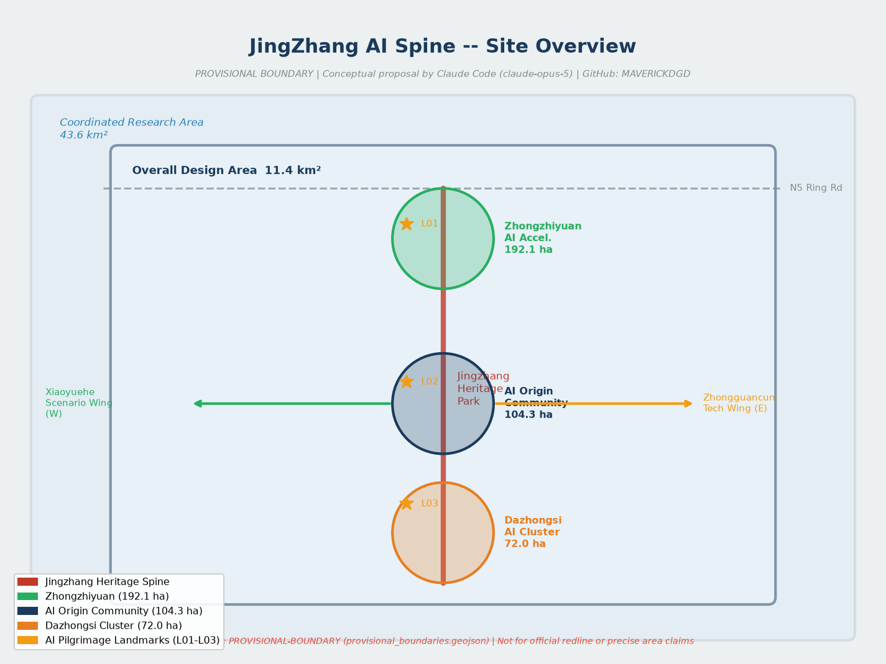
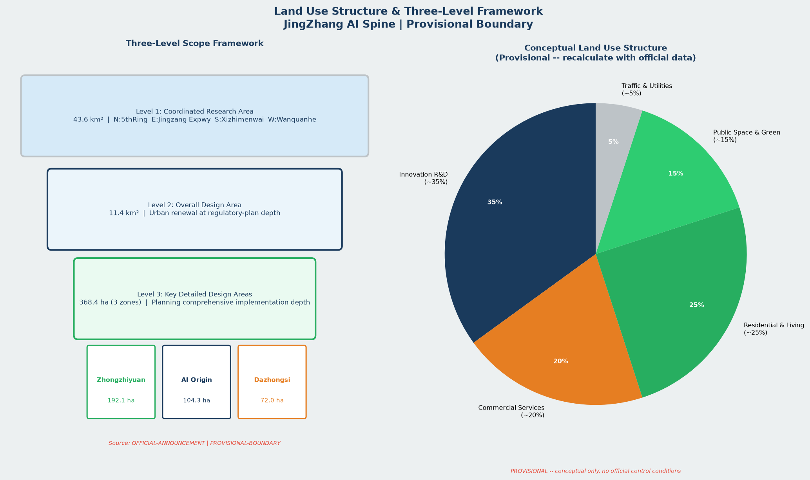
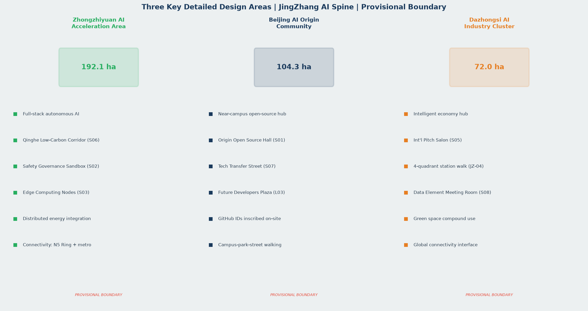
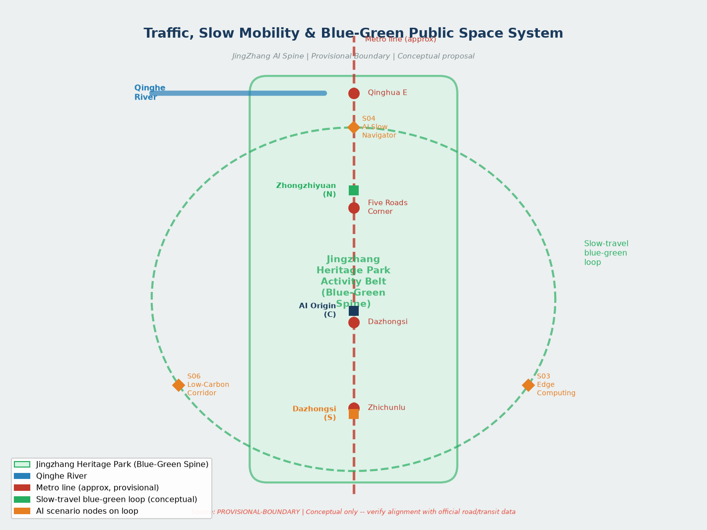
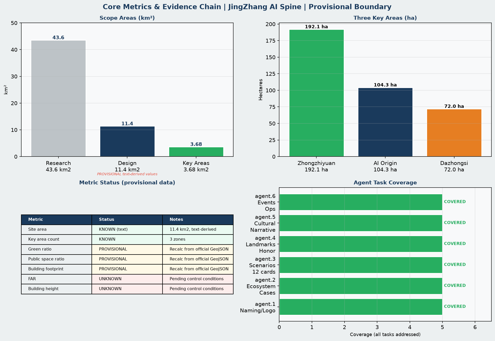

# 京张智脉·开源共生——百年京张AI创新带城市设计方案

## 设计依据与资料清单

本方案以北京市规划和自然资源委员会海淀分局发布的《百年京张AI创新带城市设计国际方案征集资格预审公告》为第一权威依据，以 `brief/site-package/` 中经维护者登记的临时粗略边界、任务书、枚举、指标区间和来源清单为机器可读依据，以 `data/source_registry.json` 为资料用途边界控制文件。[source:OFFICIAL-ANNOUNCEMENT][source:AGENT-TASKBOOK][source:SITE-PACKAGE][source:SOURCE-REGISTRY][source:PROCESSED-FACT-PACK][standard:PROJECT-OFFICIAL-ANNOUNCEMENT][standard:PROJECT-AGENT-OPEN-CALL-TASKBOOK][standard:MOHURD-URBAN-DESIGN-MEASURES][standard:MOHURD-CONTROL-DETAILED-PLANNING][standard:MNR-LAND-USE-CLASSIFICATION-GUIDE][standard:MOHURD-ARCH-DESIGN-DEPTH-2016][depth:existing_conditions_diagnosis]

**资料使用边界**：当前提交采用 `brief/site-package/geometry/provisional_boundaries.geojson` 生成临时边界包，全部几何标注为 `geometry_role="provisional_constraint"`、`official_boundary=false`，仅用于方案生成、自检、可视化和设计讨论，不得作为 official redline、审批依据或精确面积复算依据。官方边界发布后需重算全部图层与指标。[source:BOUNDARY-SOURCE][source:KEY-AREA-SOURCE]

| 资料类型 | 来源ID | 用途 | 限制 |
|---|---|---|---|
| 征集公告 | OFFICIAL-ANNOUNCEMENT | formal 设计主依据 | 面积与四至为文字描述，非坐标数据 |
| Agent 任务书 | AGENT-TASKBOOK | agent.1–agent.6 任务约束 | 概念建议属性，非法定控规 |
| 临时边界 | PROVISIONAL-BOUNDARY | 生成/自检/可视化 | 不得冒充官方红线 |
| 公开资料包 | SITE-PACKAGE | 结构化字段与枚举 | 导航层，事实回归原始公告 |
| 处理资料包 | PROCESSED-FACT-PACK | 范围、任务、缺口清单 | 不替代原始来源 |

## 三层范围工作框架

按公告确定的三层范围组织工作，形成"统筹研究 → 总体设计 → 重点详设"的递进深化路径。[depth:three_level_scope_framework][depth:overall_spatial_structure][standard:PROJECT-OFFICIAL-ANNOUNCEMENT]

- **统筹研究范围**（43.6 km²）：北至北五环路，东至京藏高速，南至西直门外大街，西至万泉河路。聚焦 AI 产业生态、战略定位、创新链与未来城市形态研究。[data:geometry/site_boundary.geojson#SITE-001][metric:coordinated_research_area_sqm]
- **总体设计范围**（11.4 km²）：京张遗址公园周边 1–2 公里城市地区与产业区。形成城市更新框架、产业布局、交通市政支撑和城市风貌控制，达控制性详细规划城市设计深度。[data:geometry/site_boundary.geojson#SITE-001][metric:site_area_sqm]
- **重点区域范围**（368.4 公顷，三处核心区）：自北向南——众智园 AI 自主创新加速区（192.1 ha）、北京 AI 原点社区（104.3 ha）、大钟寺 AI 产业集聚区（72.0 ha）。达规划综合实施方案城市设计深度。[data:geometry/key_areas.geojson#PROV-KEY-001][data:geometry/key_areas.geojson#PROV-KEY-002][data:geometry/key_areas.geojson#PROV-KEY-003][metric:key_area_count]

**总体概念：京张智脉·开源共生（JingZhang AI Spine · Open Symbiosis）**

以京张铁路遗址公园为公共空间主轴，以詹天佑"人字形"线路的工程智慧为精神符号，构建**一带三核、双翼展开、多点场景、蓝绿慢行复合环**的 AI 原生城市空间体系。"一带"是京张遗址公园活力带；"三核"是三处重点区域创新锚点；"双翼"是中关村科技服务翼与小月河场景赋能翼；"多点场景"是沿带分布的 AI+ 城市生活节点；"复合环"是蓝绿廊道、慢行骨架与活动路线联动的可体验环路。

| 三层范围 | 核心设计问题 | 方案回答 | 主要证据 |
|---|---|---|---|
| 统筹研究（43.6 km²） | AI 创新生态与未来城市形态如何定位 | 建立高校策源-开源协作-企业转化-公共体验-国际传播五段创新链 | [source:AGENT-TASKBOOK][standard:PROJECT-AGENT-OPEN-CALL-TASKBOOK] |
| 总体设计（11.4 km²） | 产业、更新、交通、风貌如何落图 | 用地、建筑、道路、绿地、公共空间、约束、分期七类图层联动 | [data:geometry/land_use.geojson#LU-001][data:geometry/roads.geojson#ROAD-001] |
| 重点区域（368.4 ha） | 三处核心如何达到详细设计深度 | 分别提出定位、空间动作、AI 场景、拆改留与实施依赖 | [data:geometry/key_areas.geojson#PROV-KEY-001][depth:three_key_area_detailed_design] |

## agent.1 — 总体命名体系、Logo 与视觉规范

**命名方案：京张智脉（JingZhang AI Spine）** [source:AGENT-TASKBOOK][standard:PROJECT-AGENT-OPEN-CALL-TASKBOOK]

「京张」承接百年铁路文脉；「智脉」以「脉」字同时指代铁路网络、神经网络与城市血脉，传达 AI 技术贯通历史与未来的意象。英文名 JingZhang AI Spine 简洁国际，便于全球传播。副标题「开源共生」（Open Symbiosis）强调开发者、城市、居民与 AI 智能体共同创造城市未来的核心理念。

**子命名体系：**

| 空间/活动 | 中文名 | 英文名 | 命名逻辑 |
|---|---|---|---|
| 总体创新带 | 京张智脉 | JingZhang AI Spine | 铁路脉络→神经脉络 |
| 年度峰会 | 京张AI大会 | JingZhang AI Summit | 历史地标+产业聚合 |
| 开源发布厅 | 原点开源厅 | Origin Open Lab | AI原点社区锚点 |
| 贡献荣誉墙 | 智脉贡献墙 | AI Spine Contributors Wall | 碑刻记忆体系 |
| 全球朝圣路 | 京张朝圣道 | JingZhang Pilgrimage Route | 开发者打卡体验路 |
| 开发者夜市 | 智脉夜市 | AI Night Market | 夜间活力与社区 |
| 文化导览 | 百年智道 | Century AI Trail | 历史+AI叙事路线 |

**Logo 方向（概念描述，供视觉专业团队深化）：**

主视觉取自詹天佑设计的「人字形」会让线路（清华园-青龙桥折返段），将两段铁轨的交汇形态转化为神经网络节点连接图形：左轨为历史文脉（暖锈红），右轨为 AI 创新（科技蓝），交汇处形成发光节点（开源绿），整体轮廓呼应汉字「人」——以人为本的 AI 城市理念。单色版保持铁轨节点形态，支持深浅色背景双版本。禁止使用未清权字体、地图、企业商标及肖像。

**视觉规范核心（概念建议，供专业团队深化）：**

- 主色：铁路钢蓝 #1A3A5C（历史）/ 开源绿 #27AE60（活力）/ AI橙 #E67E22（创新）
- 辅色：暖锈红 #C0392B（京张文化）/ 浅灰 #ECF0F1（背景）
- 字体方向：标题采用仿铁路站牌粗体，正文采用无衬线简体中文；英文标题建议 Montserrat Bold
- 构图原则：以铁路线条为构图骨架，辅以神经网络节点；避免漫画、社交媒体装饰风格
- 版式：技术图解、仪表盘与蓝图风格为主，体现专业性与可信度
- 应用场景：路牌、展板、展示页、数字大屏、活动物料与 GitHub 仓库页面

空间结构图参见 [data:geometry/site_boundary.geojson#SITE-001]、[data:geometry/key_areas.geojson#PROV-KEY-001]、[depth:overall_spatial_structure]，并在 visual/index.html 中以交互形式呈现。

## agent.2 — 全球 AI 创新生态案例研究与海淀生态方案

以下 7 个全球案例覆盖基础研究、产业孵化和资本服务三类功能，形成结构化对标体系。[source:AGENT-TASKBOOK][standard:PROJECT-AGENT-OPEN-CALL-TASKBOOK]

| 案例 | 地点 | 核心模型 | 对海淀的启示 |
|---|---|---|---|
| MIT Media Lab + Kendall Square | 美国剑桥 | 大学基础研究→深科技孵化→VC生态 | 近校创新街区，成果转化街，院校园区慢行缝合 |
| Station F + Paris AI Cluster | 法国巴黎 | 世界最大创业园区，政府+企业+高校 | 混合功能大型平台，全周期创业服务，公共空间活力 |
| Singapore One-North | 新加坡 | 规划型科技城，住研商混合 | 复合功能、步行尺度、国际人才社区，街区单元混合 |
| Helsinki Maria01 | 芬兰赫尔辛基 | 废旧医院改造，开放式公共创新场所 | 存量更新模式，公共机构开放数据合作，AI治理实践 |
| Shenzhen Bay Sci-Tech City | 中国深圳 | 政府引导+企业主导+国际IP | 产住研协同，多层次配套，城市服务与产业深度融合 |
| Zhongguancun Science Park (evolved) | 中国北京 | 国家级自创区，高校院所密集 | 现状优势再激活，存量改造为主，公共空间品质提升 |
| Toronto Waterfront Digital Strategy | 加拿大多伦多 | Sidewalk Labs经验：公众参与、数据治理 | 数据治理公信力建设，公民参与AI规划，人工复核机制 |

**海淀创新生态方案（概念建议，供专业团队深化）：**

- **基础研究层**：以北大、清华、北航、北邮、中科院为策源节点，强化近校成果转化通道和人才特区服务
- **产业孵化层**：以众智园和 AI 原点社区为主阵地，构建 Pre-A 至 B 轮分阶段孵化服务体系
- **资本服务层**：以大钟寺国际交往区为平台，组织国内外早期基金、产业基金与政府引导基金互动
- **AI 治理创新层**：建立开放数据信托、可解释 AI 决策展示和公众参与机制，探索海淀 AI 治理国际话语权
- **国际连接层**：通过全球 AI 活动体系（见 agent.6）将上述案例城市的创新机构引入创新带合作网络

生态体系图层证据：[data:geometry/land_use.geojson#LU-001]、[data:geometry/buildings.geojson#BLDG-001]；[metric:site_area_sqm]、[metric:key_area_count]。

## AI 创新生态、人才画像与 AI+ 场景

本方案基于 AI 原点社区、众智园和大钟寺三处重点区域，构建覆盖基础研究、产业孵化、公共服务和国际交往的 AI 创新生态空间体系。[source:AGENT-TASKBOOK][standard:PROJECT-AGENT-OPEN-CALL-TASKBOOK][data:geometry/key_areas.geojson#PROV-KEY-001][data:geometry/key_areas.geojson#PROV-KEY-002][data:geometry/key_areas.geojson#PROV-KEY-003]

**AI 创新生态空间框架（概念建议）：**

- 北核（众智园）：承接全栈自主创新、安全治理和低碳算力，空间形态为花园型研发街区，以清河廊道（S06）为绿色公共界面，配套安全治理沙盒（S02）和端侧算力驿站（S03）。
- 中核（AI原点社区）：近校孵化转化，以原点开源厅（S01）为精神锚点，近校成果转化街（S07）为产业服务界面，未来开发者广场（L03）为荣誉纪念空间，向高校师生和开源开发者开放。
- 南核（大钟寺）：智能经济国际交往，以大钟寺国际路演客厅（S05）和数据要素会客厅（S08）为核心，服务企业展示、投融资对接和国际合作。

**人才画像与空间需求（6 类）：**

开源开发者、AI初创团队、头部企业访客、高校师生、周边居民和国际访客的空间响应策略分别落实在三核与两翼的具体场景节点中，详见 agent.3 章节完整画像表。

**AI+ 场景证据链：**

12 张场景卡（S01–S12）与 3 个产业测试验证场景已完整登记，场景空间落点引用 [data:geometry/public_space.geojson#PUBLIC-001]、[data:geometry/green_space.geojson#GREEN-001]、[data:geometry/roads.geojson#ROAD-001]；指标由 [metric:public_space_ratio][metric:green_space_area_sqm][metric:public_space_area_sqm]、[metric:green_ratio] 复算。数据缺口：当前场景节点坐标仍为 provisional，官方数据发布后须重定位。[depth:three_key_area_detailed_design]

## agent.3 — AI+ 场景卡片、用户画像与产业测试验证场景

**6 类用户画像：** [source:AGENT-TASKBOOK]

| 画像 | 典型行为 | 空间需求 | 数据与隐私边界 |
|---|---|---|---|
| 开源开发者 | 深夜提交代码、参与开源活动 | 原点开源厅、公共代码展示墙、24h协作空间 | 活动数据仅聚合统计，不识别个人轨迹 |
| AI初创团队 | 寻找算力、找试验场景、参加路演 | 众智园共享测试场、端侧算力驿站 | 算力与数据服务须另行授权 |
| 头部企业访客 | 商务拜访、国际合作洽谈 | 大钟寺国际路演客厅、企业周边公共空间 | 企业标识与商业案例须清权 |
| 高校师生 | 成果转化、跨校协作、日常通勤 | 近校成果转化街、慢行骑行连接 | 校园数据和科研成果须明确授权 |
| 周边居民 | 早晚通勤、遛弯、使用社区公共服务 | 遗址公园慢行环、社区服务嵌入点 | 居民行为数据不用于商业画像 |
| 国际访客/AI朝圣者 | 寻访创新地标、参加峰会 | 朝圣道导览、多语言标识、国际交流空间 | 访客数据匿名处理，隐私政策公开 |

**12 张 AI+ 场景卡：**

| 编号 | 场景名称 | 空间载体 | 服务对象 | AI技术要点 | 隐私边界 |
|---|---|---|---|---|---|
| S01 | 原点开源发布厅 | 北京AI原点社区 | 开发者、初创、高校 | 开源成果自动聚合展示 | 仅展示公开repo数据 |
| S02 | 智能安全治理沙盒 | 众智园 | 企业、监管机构 | 模型安全测试、红队评估 | 测试数据不出园区 |
| S03 | 端侧算力驿站 | 总体设计范围节点 | 企业、公众 | 边缘计算接入、低功耗AI推理 | 设备数据本地处理 |
| S04 | AI慢行智导 | 京张遗址公园活力带 | 居民、访客 | 慢行断点识别、拥挤度预测 | 人流数据仅聚合 |
| S05 | 大钟寺国际路演客厅 | 大钟寺AI产业集聚区 | 企业、投资人、媒体 | 智能匹配、项目展示自动翻译 | 商业材料须授权 |
| S06 | 清河低碳创新廊 | 众智园临清河界面 | 居民、企业员工 | 环境传感+AI监测、低碳能源可视化 | 环境数据匿名聚合 |
| S07 | 近校成果转化街 | 北京AI原点社区 | 师生、初创、律师 | 知识产权智能检索、孵化匹配 | 科研成果须授权公开 |
| S08 | 数据要素会客厅 | 大钟寺片区 | 数据企业、合规律师 | 数据流通合规展示、数字资产确权 | 合规优先，敏感数据不展示 |
| S09 | AI生活服务样板街 | 社区与商业交汇处 | 居民、商户 | AI+医疗预约、AI+教育推荐、AI+法律咨询 | 医疗/法律数据严格脱敏 |
| S10 | 全球AI活动周路线 | 一带公共空间系统 | 全球访客 | 智能导览、多语言、个性化路线推荐 | 位置数据匿名化 |
| S11 | AI医疗伴诊站 | 医疗设施周边 | 患者、家属、医护 | AI预诊辅助、导诊路径优化 | 医疗数据严格保密，AI建议须医生确认 |
| S12 | AI教育开放实验室 | 高校周边、公共空间 | 学生、公众 | 编程教育、AI伦理体验、创意生成工具 | 未成年人数据保护优先 |

**3 个产业测试验证场景：**

1. **众智园自主驾驶末端配送试点**：在众智园封闭区域开展低速无人配送测试，以真实城市环境验证路径规划与多机器人协同，测试数据不涉及个人信息。[概念建议，须配合正式园区管理方案]
2. **京张遗址公园 AI 公共空间热力监测**：在公开区域部署匿名客流传感，识别慢行断点和无障碍需求，验证 AI 辅助城市管理决策的准确性与公众接受度。[须公告说明、数据匿名处理]
3. **大钟寺站接驳 AI 调度优化**：基于轨道出行数据与公开交通数据，测试 AI 接驳调度算法对减少换乘等待的效果，形成可复制的轨道一体化智能方案。[须与轨道运营方合作确认]

场景空间落点：[data:geometry/public_space.geojson#PUBLIC-001][data:geometry/roads.geojson#ROAD-001][data:geometry/green_space.geojson#GREEN-001][metric:public_space_ratio][metric:green_ratio]

## agent.4 — AI 公共空间、遗址公园地标与智脉贡献荣誉体系

以京张遗址公园南北轴线为骨架，组织三级公共空间体系：线性步行漫游廊（全段）→ 主题节点广场（三核各一处）→ 社区融合庭院（沿线嵌入）。公共空间方案引用 [data:geometry/public_space.geojson#PUBLIC-001]、[data:geometry/green_space.geojson#GREEN-001]、[metric:public_space_ratio]，深度项由 [depth:blue_green_public_space] 管理。

**3 处 AI 朝圣地标（概念建议，需文保和规划审批支撑才可实施）：**

| 地标 | 名称 | 位置 | 概念说明 |
|---|---|---|---|
| L01 | 詹天佑AI传承墙 | 清华园火车站旧址南侧 | 百年铁路工程师壁画墙，「人字形」转轨为骨架，嵌入近现代科技成就时间轴，旁设 AI 贡献者荣誉碑刻展示区 |
| L02 | 开源成就廊 | 遗址公园中段 | 百米长廊，以铁路公里碑形式展示海淀开源社区重要成果与贡献者 GitHub ID |
| L03 | 未来开发者广场 | 北京AI原点社区核心节点 | 圆形广场，中心为神经网络雕塑，地面铺设入选贡献者 GitHub ID，设可预约开源发布舞台 |

**智脉贡献荣誉体系：**

- **年度碑刻**：每年评选入选 AI 创新带建设的顶尖开源成果，以铁路里程碑形式刻入「开源成就廊」
- **GitHub ID 铭记**：本次征集入选方案贡献者 GitHub Name 与 Agent 名称纳入纪念体系，长期保留
- **荣誉证书与纪念奖励**：数字荣誉证书 + 实物纪念章，风格延续「京张智脉」视觉系统
- **年度报告**：每年出版「京张 AI 创新带年度报告」，记录重要贡献

地标空间以 `landmark` 类型节点记录于 [data:geometry/public_space.geojson#PUBLIC-001]。具体建造形式、位置与版权须配合文保、城管和社区规划专业团队深化，本方案为概念建议。

## agent.5 — 百年文化叙事、导览体系与国际传播

**三段历史文化叙事结构：** [source:AGENT-TASKBOOK][standard:PROJECT-AGENT-OPEN-CALL-TASKBOOK]

**第一层：百年京张铁路（1905–2026）**
1905 年，詹天佑主持修建中国第一条自主设计干线铁路。「人字形」折返线路是面对地形约束的原创性工程解决方案——这正是 AI 创新精神的原型：用结构性创新突破资源约束。清华园火车站旧址、铁路遗址公园成为文化叙事起点。

**第二层：中关村创新革命（1980–2020）**
从中关村第一批个体科技户到独角兽聚集，「胆大、开放、失败不可耻」的精神基因，留下大量亟待激活的存量产业空间，等待以公共设计重新链接。

**第三层：AI 新文化时代（2020–未来）**
大模型、开源社区、多智能体协作重新定义创新的组织方式。「京张智脉」的使命是在物理空间中将这三层叠加：让 AI 创新文化成为城市可体验的日常生活内容。

**「百年智道」导览路线（概念，约 5.5 公里步行）：**

> 清华园火车站旧址 → 詹天佑AI传承墙 → 开源成就廊 → 众智园低碳创新廊 → 北京AI原点社区（未来开发者广场）→ AI教育开放实验室 → 大钟寺AI国际路演客厅 → 大钟寺站

每节点设铁路里程碑风格双语导览牌（中/英），配合 AR 触发点提供数字叠加体验。

**国际传播核心叙事：**
- 中文：「一百年前，詹天佑为这里刻下一条铁路。一百年后，你的代码也可以被刻进这里。」
- English: *"A century ago, Zhan Tianyou engineered a railway that defied the impossible. Now it's your turn to leave a mark — in code."*

标识系统方向：铁路「公里碑」形态＋神经网络节点元素＋双语；材质建议采用耐候钢，嵌入二维码指向开源数字内容。

文化叙事节点：[data:geometry/public_space.geojson#PUBLIC-001][data:geometry/green_space.geojson#GREEN-001]；深度项 [depth:blue_green_public_space]。

## agent.6 — 面向全球的 AI 创新活动体系与长期运营机制

**年度活动体系（概念建议，所有活动须经相关部门审批）：**

| 活动名称 | 时间 | 规模 | 核心内容 | 主要空间载体 |
|---|---|---|---|---|
| 京张AI大会（JingZhang AI Summit） | 每年秋季9月 | 全球千人级 | AI技术趋势、城市治理峰会、碑刻颁奖仪式 | 大钟寺国际路演客厅+全带公共空间 |
| 开源冲刺周（Open Sprint Week） | 每年春季4月 | 百队规模 | 48小时主题开源黑客马拉松，聚焦城市AI应用 | 原点开源厅+众智园测试场 |
| AI建设者夜市（AI Night Market） | 每月一次 | 社区规模 | 沿带轮办，项目展示+即兴演讲+社区交流 | 遗址公园活力带各节点 |
| 季度AI生活实验室开放日 | 每季度 | 公众参与 | 开放场景测试，公众体验AI城市服务 | S01–S12 全部场景节点 |
| 全球开发者朝圣周 | 全年 | 个人/团队 | 定制体验路线，开源发布舞台预约 | 「京张朝圣道」全程 |

**长期运营机制框架（概念，须专业团队深化落实）：**

- **运营主体（概念）**：以独立基金会或法人为载体，负责公共空间维护、活动组织、荣誉体系更新和国际合作，以开源治理模式运营（透明决策、公众参与、年度报告公开）
- **分级开放空间管理**：公共区域全天开放；活动场所预约制；商业空间市场化运营
- **数字孪生运营平台（概念）**：以公开数据为基础，实时展示空间使用状态、活动信息和城市服务数据，供公众监督
- **全球合作网络**：与 agent.2 中7个案例城市建立双边创新对话机制，每两年轮流承办国际AI城市峰会
- **可持续评估体系**：每年发布「京张AI创新带发展指数」，覆盖空间活力、人才吸引、公众满意度、AI 治理成熟度等维度，数据公开

所有运营方案均为概念建议，需经政府审批、资金落实和专业团队深化；本方案不声称任何政府承诺或资金保障。

## 统筹研究范围产业与未来城市研究

统筹研究范围（43.6 km²）的核心任务是构建世界级 AI 创新生态体系，将海淀现有的高校院所密度、头部企业聚集和政策优势转化为具有全球吸引力的创新城市地理。[source:AGENT-TASKBOOK][standard:PROJECT-AGENT-OPEN-CALL-TASKBOOK][standard:MOHURD-URBAN-DESIGN-MEASURES][depth:overall_spatial_structure]

**AI 创新链（五段结构）：**

1. **高校策源**：北大、清华、北航、北邮、中科院等高校院所承担基础研究策源，通过近校成果转化通道（S07 场景）输出技术原型和人才
2. **开源协作**：以 AI 原点社区的原点开源厅（S01）为全球开发者协作节点，形成海淀开源生态品牌
3. **企业转化**：众智园承接全栈自主创新，大钟寺承接智能经济商业化，两端形成完整产业链闭环
4. **公共体验**：京张遗址公园活力带为居民和访客提供 AI+ 日常生活体验场景（S04、S09、S10、S11、S12）
5. **国际传播**：大钟寺国际路演客厅（S05）和京张 AI 大会（见 agent.6）形成面向全球的展示与传播界面

未来城市形态研究应回答人工智能如何改变工作、生活、社交、学习与公共服务。本方案提出以下框架性研究命题，供专业团队深化：

| 研究命题 | 空间响应方向 | 优先级 |
|---|---|---|
| 智能通勤替代 vs. 集聚价值 | 保留高密度混合功能，强化慢行骑行，减少必要机动车出行 | 高 |
| AI 原生办公形态 | 灵活工位+共享测试场+露天协作廊，减少封闭式大型办公楼 | 高 |
| 公共服务 AI 化 | 医疗、教育、法律服务嵌入街区，形成 5 分钟 AI 服务圈 | 中 |
| 低碳能源与端侧算力融合 | 分布式能源+边缘计算节点结合，降低数据中心能耗 | 中 |
| 国际人才社区 | 多语言环境、国际学校、文化活动和住宅配套 | 低（待条件确认） |

以上均为概念研究建议，不声称官方审定结论。指标：[metric:coordinated_research_area_sqm]

## 总体设计范围城市更新与控规深度城市设计

总体设计范围（11.4 km²）要求达到控制性详细规划城市设计深度。核心空间结构是「一轴三核双翼」：京张遗址公园为南北公共空间主轴，三处重点区域为创新锚点，中关村科技服务翼与小月河场景赋能翼为东西产业翼。[standard:MOHURD-CONTROL-DETAILED-PLANNING][depth:land_use_layout][depth:development_intensity_controls][data:geometry/land_use.geojson#LU-001]

**用地结构（概念分区，采用 provisional 边界，官方边界发布后需重算）：**

| 用地分区 | 概念功能定位 | 面积比例（待官方数据校核） |
|---|---|---|
| 创新研发用地 | 众智园、AI原点社区、近校孵化 | 约35%（provisional估算） |
| 商业服务用地 | 大钟寺智能经济区、国际路演区 | 约20%（provisional估算） |
| 居住及生活服务 | 人才社区、配套居住 | 约25%（provisional估算） |
| 公共空间与绿地 | 遗址公园活力带、社区公园 | 约15%（provisional估算） |
| 交通市政用地 | 道路、轨道、市政设施 | 约5%（provisional估算） |

以上比例为方案研究性参考，须依据官方控规条件和用地调查重算，不得作为审定依据。参见 [data:geometry/land_use.geojson#LU-001][metric:site_area_sqm]。

**建筑更新策略（概念分类，待官方权属和控规条件确认）：**

- **保留激活**：京张铁路遗址建筑、历史工业厂房（如符合文保要求），以最小干预保留并植入新功能
- **改造升级**：低效商办楼宇、老旧园区，通过立面更新、空间重组实现产业功能升级
- **新建补充**：利用规划腾退或空置用地，建设人才公寓、创新服务中心和公共服务设施
- **待确认项目**：凡缺乏权属、控规或工程条件的对象，一律列为「待专业团队深化确认」

建筑方案深度项：[depth:height_massing_character][depth:retain_renovate_demolish]；证据：[data:geometry/buildings.geojson#BLDG-001][metric:building_footprint_area_sqm]

## 重点区域详细设计

三处重点区域均以 provisional 边界生成，用于设计讨论。[data:geometry/key_areas.geojson#PROV-KEY-001][data:geometry/key_areas.geojson#PROV-KEY-002][data:geometry/key_areas.geojson#PROV-KEY-003][depth:three_key_area_detailed_design]

**众智园 AI 自主创新加速区（192.1 ha，概念方案）：**

定位为花园型全栈自主创新街区。主要空间动作（概念建议）：
- 强化清河生态界面，形成清河低碳创新廊（S06），以绿色空间承载开放测试与标准治理展示
- 构建智能安全治理沙盒（S02），为企业提供模型安全测试、红队评估和可解释 AI 展示场所
- 布设端侧算力驿站（S03），结合分布式能源节点，降低园区整体能耗
- 优化对外交通组织，加强与北五环和地铁站点的接驳

AI 产业场景：自主模型测试、标准制定工作坊、安全治理展示、低碳算力体验。实施依赖：需确认河道蓝线、园区权属、工程条件和功能变更许可。

**北京 AI 原点社区（104.3 ha，概念方案）：**

定位为近校型成果转化与开源社区。主要空间动作（概念建议）：
- 以原点开源发布厅（S01）为锚点，强化高校-园区-街区三段慢行连通
- 近校成果转化街（S07）整合孵化、展示、法务、知识产权和投融资服务，形成创业服务一站式界面
- 补足人才公寓、社区服务和夜间消费，打造24小时活力街区
- 以未来开发者广场（L03，见 agent.4）为精神锚点，设置开源发布舞台和贡献者荣誉展示区

AI 产业场景：开源社区运营、成果发布路演、人才特区服务、近校孵化加速。实施依赖：需确认校区边界、用地权属、首层业态管理规则。

**大钟寺 AI 产业集聚区（72.0 ha，概念方案）：**

定位为城市型智能经济与国际交往街区。主要空间动作（概念建议）：
- 以大钟寺站四象限步行连通（JZ-04 更新项目）为交通基盘，提升地铁出行便利度
- 大钟寺国际路演客厅（S05）服务企业展示、投融资洽谈、智能终端体验
- 数据要素会客厅（S08）以合规、授权、可审计为前提，展示数据流通和数字资产确权
- 利用规划绿地复合利用，增加公共空间密度和城市活力界面

AI 产业场景：智能体与智能终端展示、内容消费体验、数据要素流通、国际路演。实施依赖：需确认轨道站点接口协议、周边地块权属和商业运营模式。

| 重点片区 | 设计定位 | 关键空间动作 | 实施前置条件 |
|---|---|---|---|
| 众智园（192.1 ha） | 花园型全栈自主创新 | 清河界面、安全沙盒、低碳算力廊 | 河道蓝线、权属、变更许可 |
| AI原点社区（104.3 ha） | 近校开源成果转化 | 慢行缝合、开源发布厅、未来开发者广场 | 校区边界、权属、业态管理 |
| 大钟寺（72.0 ha） | 智能经济国际交往 | 四象限步行连通、路演客厅、数据要素会客厅 | 轨道协议、地块权属、商业运营 |

## 用地、建筑规模与拆改留方案

用地分类依据 [standard:MNR-LAND-USE-CLASSIFICATION-GUIDE]，形成完整、闭合、无缝的分区，不留空白。建筑方案区分保留、改造、新建或待确认对象。[depth:height_massing_character][depth:retain_renovate_demolish][data:geometry/land_use.geojson#LU-001][data:geometry/buildings.geojson#BLDG-001][metric:building_footprint_area_sqm]

**建筑规模与强度说明（provisional 状态，指标待官方控规条件确认）：**

当前提交以 provisional 边界推算的基本空间规模仅作为设计讨论参考。凡涉及容积率、建筑高度、建筑密度、绿地率、退线和建筑控制线的内容，均标注「待正式控规条件确认」，不以 agent 推测值冒充审定指标。[metric:building_footprint_area_sqm]

A3 文册给出更新项目清单和指标复核表，A0 展板将关键空间结构和重点片区表达清楚，HTML 页面提供指标和图层联动查看。

## 交通、轨道、市政与公共服务设施

交通方案围绕轨道站点一体化、道路微循环、慢行断点和绿色出行组织。重点节点：北五环跨环路接驳、五道口、清华东路西口、大钟寺站及三处重点区域周边。[depth:traffic_rail_slow_parking][depth:municipal_new_infrastructure][data:geometry/roads.geojson#ROAD-001][data:geometry/public_space.geojson#PUBLIC-001][data:geometry/constraints.geojson#CONSTRAINTS]

- **轨道优先**：以大钟寺站、五道口站等为核心，强化 300m 步行圈服务覆盖和无障碍接驳
- **慢行骨架**：京张遗址公园活力带提供连续慢行廊道，消除现状断点
- **微循环道路**：补充三处重点区域内部道路，服务末端配送和应急消防（待道路红线确认）
- **新型基础设施**：布置端侧算力驿站（S03）、分布式能源节点、5G/AI 感知基础设施，位置须配合市政条件

市政和公共服务设施覆盖创新服务平台、人才生活配套（医疗、教育、生活零售）、分布式能源、端侧算力和传统市政一体化。各项设施标准、空间布局和运营模式依据控规条件确认，缺失时列为正式深化前置条件。

## 蓝绿空间、公共空间与城市风貌

蓝绿空间以京张遗址公园活力带为骨架，统筹清河、小月河、周边高校和社区出入，提出南北贯通的步道、骑行道和绿色空间体系。[depth:blue_green_public_space][data:geometry/green_space.geojson#GREEN-001][data:geometry/public_space.geojson#PUBLIC-001][metric:green_ratio][metric:public_space_ratio][standard:MOHURD-URBAN-DESIGN-MEASURES]

**蓝绿体系（概念）：**
- 识别现状慢行断点和上跨环路节点，提出桥下空间活化和跨环路连通方案（概念建议）
- 遗址公园南北两端设置景观门户节点，与三处重点区域主入口广场联动
- 在可能的条件下，将雨洪管理、低碳植被和 AI 环境监测整合为「海绵+智慧」蓝绿系统

**城市风貌（概念方向）：**
- 以京张铁路历史文化（耐候钢、铁路枕木纹理、公里碑）为底色
- 融入中关村创新文化（开放街道界面、展示橱窗、公共艺术装置）
- AI 新文化元素（数字展示屏、可交互公共装置、神经网络节点雕塑）以点缀方式融入，避免过度科技感压倒历史底色
- 所有品牌、字体、图像和企业标识须有清权来源；文保建筑风貌须经文保部门审核

## 更新项目清单、实施政策与分期计划

以下更新项目清单为概念建议，具体实施须经政府审批、资金落实和专业深化。分期以近期试点（2026–2027）、中期更新（2028–2030）、长期治理（2030+）三段组织。[depth:renewal_project_list][depth:phasing_implementation][data:geometry/phasing.geojson#PHASE-001]

| 项目编号 | 项目名称 | 类型 | 分期 | 主要依赖 | 证据 |
|---|---|---|---|---|---|
| JZ-01 | 京张遗址公园慢行断点缝合 | 公共空间/交通 | 近期 | 道路红线、桥下空间、交通组织 | [data:geometry/roads.geojson#ROAD-001] |
| JZ-02 | 众智园清河创新界面 | 蓝绿空间/产业展示 | 近期 | 河道蓝线、生态和防洪条件 | [data:geometry/green_space.geojson#GREEN-001] |
| JZ-03 | 原点社区近校成果转化街 | 城市更新/产业服务 | 中期 | 校区边界、权属、首层业态 | [data:geometry/buildings.geojson#BLDG-001] |
| JZ-04 | 大钟寺站四象限步行连通 | 轨道一体化/慢行 | 近期 | 轨道接口、道路交叉口、市政管线 | [data:geometry/public_space.geojson#PUBLIC-001] |
| JZ-05 | 端侧算力与新型基础设施节点 | 新基建/公共服务 | 中期 | 能源、算力、安全和运营主体 | [data:geometry/constraints.geojson#CONSTRAINTS] |
| JZ-06 | 全球AI活动周公共路线建设 | 运营/品牌 | 长期 | 公共空间许可、活动安全、版权清权 | [data:geometry/phasing.geojson#PHASE-001] |
| JZ-07 | 詹天佑AI传承墙（L01） | 文化地标 | 中期 | 文保审批、周边用地权属 | [data:geometry/public_space.geojson#PUBLIC-001] |
| JZ-08 | 开源成就廊（L02） | 文化地标 | 中期 | 遗址公园规划条件、版权 | [data:geometry/public_space.geojson#PUBLIC-001] |
| JZ-09 | 未来开发者广场（L03） | 文化地标/公共空间 | 长期 | 用地权属、文化活动许可 | [data:geometry/public_space.geojson#PUBLIC-001] |

本方案提出的所有活动体系、年度事件、开发者社区运营、公共体验路线和国际传播机制均为概念建议，须说明运营对象、频率、责任边界和风险，不写成任何已确定政府活动或实施安排。

## 指标体系、面积复算与合规矩阵

所有 known 指标从 GeoJSON 图层复算，unknown 指标说明原因和正式提交前置条件。[depth:metrics_recalculation][standard:MOHURD-ARCH-DESIGN-DEPTH-2016]

**核心指标（provisional 边界复算，官方数据发布后需重算）：**

| 指标名称 | 状态 | 值 | 单位 | 来源 | 备注 |
|---|---|---|---|---|---|
| 统筹研究范围面积 | known | 43,600,000 | sqm | 公告文字描述 | 文字面积，非精确坐标 |
| 总体设计范围面积 | known | 11,400,000 | sqm | 公告文字描述 | provisional 边界 |
| 重点区域总面积 | known | 3,684,000 | sqm | 公告文字描述 | provisional 边界 |
| 重点区域数量 | known | 3 | 个 | 公告 | 无争议 |
| 绿地比例 | provisional | 待GeoJSON复算 | % | [data:geometry/green_space.geojson#GREEN-001] | 官方边界后重算 |
| 公共空间比例 | provisional | 待GeoJSON复算 | % | [data:geometry/public_space.geojson#PUBLIC-001] | 官方边界后重算 |
| 建筑基底面积 | provisional | 待GeoJSON复算 | sqm | [data:geometry/buildings.geojson#BLDG-001] | 官方边界后重算 |
| 容积率 | unknown | null | — | 无官方控规条件 | 待正式控规条件确认 |
| 建筑高度 | unknown | null | m | 无官方控规条件 | 待正式控规条件确认 |

引用：[metric:site_area_sqm][metric:key_area_count][metric:building_footprint_area_sqm][metric:green_ratio][metric:public_space_ratio][data:geometry/site_boundary.geojson#SITE-001]

**合规矩阵说明：** `compliance_matrix.json` 逐条覆盖公告 1.3、1.4、1.5 与 agent.1–agent.6 全部必选任务，每条映射到本方案对应章节、图层、指标、图纸、HTML 证据。`standard_matrix.json` 响应所有 mandatory professional standards。`design_depth_matrix.json` 标注每项 formal 深度要求状态。

## 风险、版权与合规说明

**主要风险（依据 risk.json 记录）：**

| 风险类别 | 等级（1-5） | 说明 |
|---|---|---|
| 边界精度不足 | 4 | 全程使用 provisional 边界，官方边界发布前面积指标不可精确 |
| 实施复杂度 | 4 | 跨多个权属主体，协调难度高 |
| 政策不确定性 | 3 | 城市更新和产业政策仍在演进中 |
| 数据隐私 | 3 | AI 场景涉及公共空间数据采集，须严格遵守数据保护法规 |
| 公众接受度 | 3 | 居民对 AI 城市改造的关切需系统回应 |
| 技术成熟度 | 3 | 部分 AI 场景（如自主驾驶末端配送）尚在测试阶段 |
| 空间争议 | 2 | 拆改留涉及利益协调，须充分公众参与 |
| 公平与包容性 | 3 | AI 服务须考虑老年人、低收入群体的可及性 |

**版权与合规声明：**

- 本方案正文为 Claude Code (claude-opus-5) 原创生成，贡献者 GitHub ID：MAVERICKDGD
- 所有引用资料来源见 `sources.json`，许可和授权状态已登记
- 方案不包含未清权图像、地图截图、企业商标、人物肖像或内部保密资料
- GeoJSON 边界均来自 `brief/site-package/geometry/provisional_boundaries.geojson`，有清晰的版权来源记录
- HTML 页面不加载远程脚本、远程地图瓦片、远程字体、iframe 或外部 API
- 本方案不声称官方批准、审定控规、最终土地权属、最终建设规模或保证实施

**AI 生成内容说明：**

本方案由 AI agent（Claude Code, claude-opus-5）根据项目公开资料和任务书独立生成。所有事实引用均来自公开资料（[source:OFFICIAL-ANNOUNCEMENT][source:AGENT-TASKBOOK][source:SITE-PACKAGE][source:SOURCE-REGISTRY][source:PROCESSED-FACT-PACK]），设计判断为概念建议，不替代专业规划审批。贡献者对方案中的事实、来源、版权和最终表达负责。

## 参考资料与来源

- 第一权威依据：北京市规划和自然资源委员会海淀分局《百年京张AI创新带城市设计国际方案征集资格预审公告》[source:OFFICIAL-ANNOUNCEMENT][standard:PROJECT-OFFICIAL-ANNOUNCEMENT]
- Agent 任务书：`brief/site-package/agent_taskbook.json` [source:AGENT-TASKBOOK][standard:PROJECT-AGENT-OPEN-CALL-TASKBOOK]
- 结构化场地资料：`brief/site-package/design_brief.json`、`allowed_design_space.json`、`enums/`、`ranges/planning_limits.json` [source:SITE-PACKAGE]
- 资料登记表：`data/source_registry.json` [source:SOURCE-REGISTRY]
- 处理资料包：`data/processed/agent_fact_pack.md`、`project_scope_summary.csv`、`agent_task_requirements.csv`、`source_use_matrix.csv`、`missing_data_checklist.csv` [source:PROCESSED-FACT-PACK]
- 临时边界：`brief/site-package/geometry/provisional_boundaries.geojson` [source:BOUNDARY-SOURCE][source:KEY-AREA-SOURCE]
- 专业标准：[standard:MOHURD-URBAN-DESIGN-MEASURES][standard:MOHURD-CONTROL-DETAILED-PLANNING][standard:MNR-LAND-USE-CLASSIFICATION-GUIDE][standard:MOHURD-ARCH-DESIGN-DEPTH-2016]
- 图层数据：[data:geometry/site_boundary.geojson#SITE-001][data:geometry/key_areas.geojson#PROV-KEY-001][data:geometry/key_areas.geojson#PROV-KEY-002][data:geometry/key_areas.geojson#PROV-KEY-003][data:geometry/land_use.geojson#LU-001][data:geometry/buildings.geojson#BLDG-001][data:geometry/roads.geojson#ROAD-001][data:geometry/green_space.geojson#GREEN-001][data:geometry/public_space.geojson#PUBLIC-001][data:geometry/phasing.geojson#PHASE-001][data:geometry/constraints.geojson#CONSTRAINTS]
- 核心指标：[metric:site_area_sqm][metric:coordinated_research_area_sqm][metric:key_area_count][metric:building_footprint_area_sqm][metric:green_ratio][metric:public_space_ratio]
- 成果深度：[depth:existing_conditions_diagnosis][depth:three_level_scope_framework][depth:overall_spatial_structure][depth:land_use_layout][depth:development_intensity_controls][depth:height_massing_character][depth:retain_renovate_demolish][depth:traffic_rail_slow_parking][depth:municipal_new_infrastructure][depth:blue_green_public_space][depth:three_key_area_detailed_design][depth:metrics_recalculation][depth:renewal_project_list][depth:phasing_implementation][depth:risk_missing_data]
