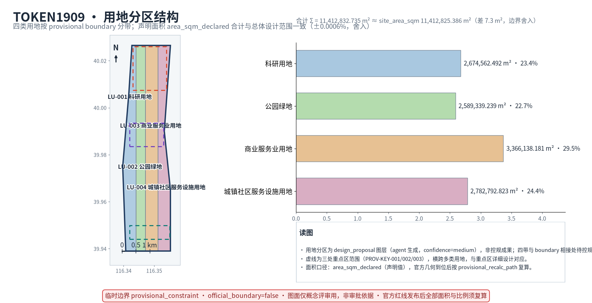
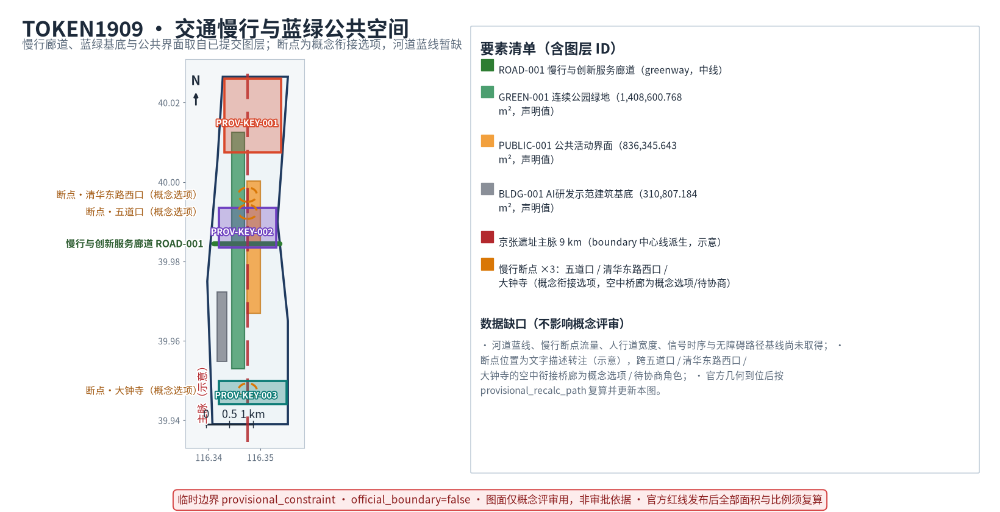
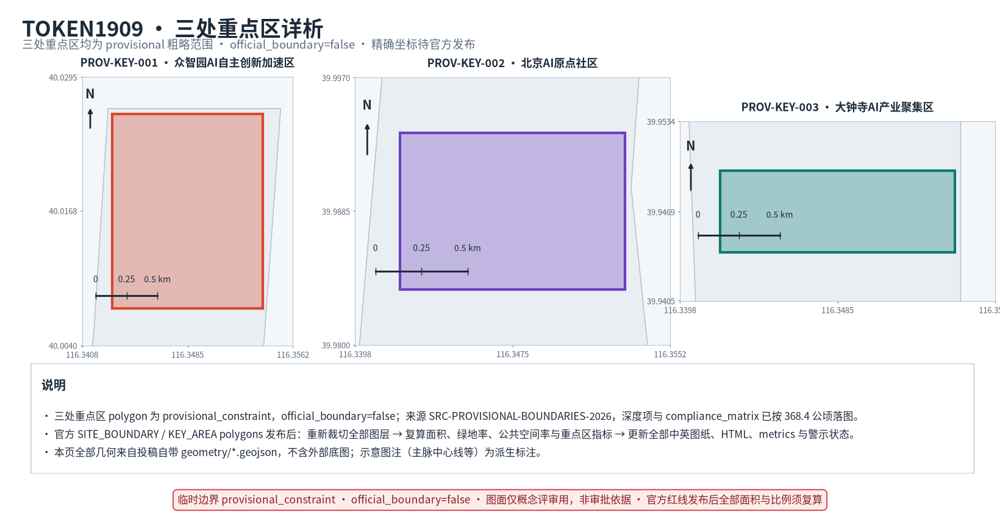
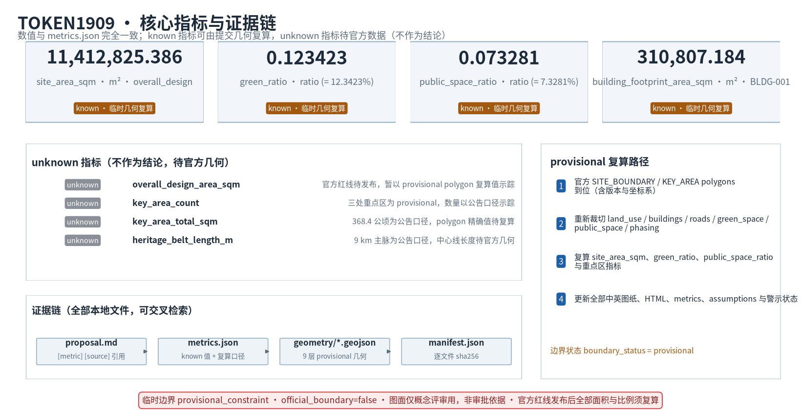

# TOKEN1909 Jingzhang AI Nexus — Urban Symbiosis Design for the Century-Old Jingzhang Railway Heritage in the AI Era

> **Version**: v3.0 Three New Pillars Final
> **Date**: 2026-08-24
> **Author**: MIMConsult
> **Perspective**: Real-estate planning · Industrial-park leasing · Commercial leasing
> **Status**: Conceptual AI urban design submission (for professional deepening; official boundary absence does not block content scoring, but all precise conclusions must remain provisional, not for approval or construction)

**Design principles**: full-lifecycle asset view; prudent delivery (never a substitute for statutory planning); zero fabricated indicators; strict 1:1 terminology alignment with `proposal.md`.

---

## Three Core Design Pillars

> Every pillar simultaneously answers **what site problem it solves + by what implementation means + what result is delivered**, no empty slogans.

**Pillar 1 — Railway Heritage Backbone: Use the Jingzhang heritage corridor as the public main spine; embed AI carriers into the old railway space, do not demolish-and-rebuild at scale, heritage character comes first and AI empowers, never replaces, the heritage landscape.**
- Problem solved: Today the Jingzhang heritage strip is repeatedly cut by ring roads, property walls, and underpasses. It functions as "a landscape corridor with no functional spine". AI tech spaces and heritage feel mutually exclusive — parks typically add all-glass new-build boxes while the heritage is reduced to nostalgic sightseeing. The two narratives float apart.
- Implementation means: No mass demolition. The 9 km heritage strip keeps its existing base of railway sleepers + tree canopy + gentle slopes. The developer promenade, AR anchors, edge-compute waystations, and open-source honor inscriptions are **embedded directly between the old sleepers and in the grey space under overpasses**. Every new AI carrier's height is capped at the surrounding tree canopy line. Materials prioritize weathering corten steel + reclaimed sleepers + semi-transparent photovoltaics — nothing that visually overwhelms the historic railway body. Inside the heritage conservation zone, plans use only retain/renovate; no demolition or new-build.
- Expected result: The strip shifts from a "visit once and leave" memorial belt into an "AI main street used every day". Within any 10-minute walk along the belt there is always one AI interaction node plus one heritage interpretation node. The cultural pilgrimage destination and the AI experience belt coexist on the same spatial layer.

**Pillar 2 — Industry-University-City Suture: Open the physical boundaries between universities, tech parks, and residential neighborhoods; never build an isolated AI industry park; distribute AI scenarios into citizens' daily blocks so R&D, industry, and living spaces interpenetrate.**
- Problem solved (design assumptions — the pain points below reflect commonly reported conditions in public coverage and urban studies, not locally measured baselines; verify through baseline surveys before delivery): university gates, park perimeter walls, and residential fences form multiple physical breakpoints; AI industry interacts too little with surrounding blocks — local residents "see it but never use it"; university tech-transfer cycles are commonly described in years rather than months; young open-source contributors lack near-campus collaboration space.
- Implementation means: A triple-parallel slow-mobility suture belt runs along the 9 km main spine; the elevated slow-mobility links / covered bridges across the three critical breakpoints at Wudaokou, Qinghuadonglu Xikou, and Dazhongsi are **conceptual options / negotiable roles**, requiring road redline, under-bridge space use rights, and heritage review before any project initiation. Absent new-construction authorization, the fallback path is ground right-of-way marking + signage + existing-footway connection, and no implication of confirmed construction. The three AI+ blocks — Education / Healthcare / Commercial — are deliberately **not concentrated inside a single industrial park**, but distributed into community ground-floor retail, campus-side backstreets, and rail transit micro-centers. The near-campus achievement-transformation street shares the same walking frontage as student dorms and the neighborhood farmers' market. Each of the three core nodes (AI Origin Community → Zhongzhiyuan → Dazhongsi) is opened to surrounding residents and university staff — no gated perimeter walls. Campus-park seams reuse existing ground-floor stock and factory conversion space; no residential land is condemned to build a closed park.
- Expected result: University faculty/students step out of campus gates and reach an achievement release hall in a 5-minute walk. Local residents can use AI citizen services on their way home from the market. Young one-person startups don't need to rent an office — they launch from a community "landing pod". Park users, university users, and residents naturally encounter each other on the same shared block. The AI industry park is never again an island.

**Pillar 3 — Open-Source AI Urban Lab: Turn the entire district into an iterable public test ground; ship public Agent applications first, then iterate; commit to real runnable MVPs, never stop at renderings and concept boards.**
- Problem solved: Most "AI parks" are only smart on presentation boards and renderings; once built, every scenario goes offline. Enterprise developers have no real city-scale test bed. Citizens only ever meet AI as marketing interactive screens — no actually usable public-service Agents.
- Implementation means: A **publicly testable geo-fence** across Zhongzhiyuan plus the main-spine public spaces is a **conceptual option / negotiable role**: it may be written into GeoJSON layers and go live only after public license, safety, and site authorization are obtained. Absent authorization, the fallback path is indoor sandbox testing + signage guidance, with no implication that testing authorization has been obtained. Three public Agent MVPs go live: T1 AI Investment Decision Sandbox (reversible industry placement deduction), T2 City-Scale Digital Twin Deduction (low-cost what-if simulation for formats / traffic / flows), T3 Unmanned Commercial Operation Test (24h self-service + remote human review). The Open-Source Contributor Plaza, the Developer Promenade, and the collaboration pods all share the same fence. Every application ships with publicly documented interfaces — global developers can submit improvement PRs. Version iteration records are included in the annual report. The four AI governance principles (data minimization · public sourcing · explainability · manual review) are enforced end-to-end.
- Expected result: When reviewers return in three years, the three Agent applications are still running in production, with visible version iteration records. The GitHub IDs engraved in the Open-Source Contributor Plaza grow year over year. The AI scenarios are not one-off exhibition panels — they are everyday facilities "available today, better next year", forming a sustainable two-way loop between global developers and local residents.

---

## Overall Design Concept & Naming System

**Naming TOKEN1909 Jingzhang AI Nexus (short form JAN)**: "TOKEN" symbolizes the value voucher of the computing-power era; "1909" anchors the original spirit of Jingzhang's self-built 1909 railway; "Nexus" emphasizes the belt-shaped cluster's concentrating and radiating role. Cultural tagline: *Beidaokou — Tracks to Tomorrow*. Spatial structure: One Belt · Three Cores · Two Wings · Multi Nodes [source:OFFICIAL-ANNOUNCEMENT] [source:AGENT-TASKBOOK] [depth:overall_spatial_structure].

**Three Positionings**: (1) Centennial Jingzhang AI Culture Belt — Railway Heritage Backbone, AI embeds without overwhelming heritage character. (2) AI Fusion Innovation Belt — Open-Source AI Urban Lab, full-stack hard tech actually testable and shipable. (3) Urban AI Life Experience Belt (the taskbook term; youth-friendly, industry-university-city suture, urban living room for one-person companies and digital nomads).Open-sourced governance templates and a Chinese governance corpus are published to the global community, building global discourse in AI urban governance.

**Three Scopes (Announcement Mandatory Requirement)**: Coordination Research 43.6 km² (ecology + strategy) → Overall Design 11.4 km² (renewal framework + industry layout + transport & municipal) → Three Key Areas 368.4 hectares total (detailed design). Task mapping documented in `compliance_matrix.json` [depth:three_level_scope_framework] [standard:PROJECT-OFFICIAL-ANNOUNCEMENT]. All conclusions must be recomputable from GeoJSON.

**Naming & Visual System**: A strict "prefix + function" naming tree ensures territory-wide recognizability. Logo motif is the topological evolution of the "人"-shaped track — from Zhan Tianyou's engineering marvel into the node-network topology of the AI era. Color direction (conceptual only): Railway Ochre + Zhongguancun Blue-Green + Neon Accent. No uncleared copyrighted materials.



---

## Design Basis & Data Inventory

Primary legal basis: The "Qualification Pre-Review Announcement for the International Urban Design Open Call of the Centennial Jingzhang AI Innovation Belt" [source:OFFICIAL-ANNOUNCEMENT] plus the "Agent Open Call Task Book Excerpts" [source:AGENT-TASKBOOK]. Professional standards referenced: [standard:PROJECT-OFFICIAL-ANNOUNCEMENT], [standard:PROJECT-AGENT-OPEN-CALL-TASKBOOK], [standard:MOHURD-URBAN-DESIGN-MEASURES], [standard:MOHURD-CONTROL-DETAILED-PLANNING], [standard:MNR-LAND-USE-CLASSIFICATION-GUIDE]. Full machine indices reside in `sources.json`, `metrics.json`, `compliance_matrix.json`, `standard_matrix.json`, `design_depth_matrix.json`, and `assumptions.json` [source:SOURCE-REGISTRY] [source:PROCESSED-FACT-PACK].

Data gap statement: Official `SITE_BOUNDARY` and three `KEY_AREA` polygons are not yet available. All geometry in the package is flagged `provisional_constraint` with `official_boundary=false`. They are used for proposal generation and visualization only, never as a formal approval basis [data:geometry/site_boundary.geojson#SITE-001] [data:geometry/key_areas.geojson#PROV-KEY-001] [metric:site_area_sqm] [metric:key_area_count]. When official polygons are substituted, every layer and metric must be recalculated [depth:existing_conditions_diagnosis].

---

## Industry Ecosystem Strategy: Basic Research → Incubation → Capital Full Chain

> Belongs to Pillar 2 (Industry-University-City Suture): Solves the problem of "long, block-disconnected university tech-transfer cycles (design assumption)"; provides the institutional and spatial infrastructure of the industry chain.

**Three-Core Closed-Loop Model**: R&D Source Point (AI Origin Community) → Global Exit Strategy (Zhongzhiyuan) → Commercial Monetization (Dazhongsi). The Zhongguancun Technology Service West Wing injects capital, IP, and globalization services. The Xiaoyue River Scenario Empowerment East Wing focuses on embodied intelligence and AI consumption experiences — a "west input, east use" synergy pattern [source:AGENT-TASKBOOK] [standard:PROJECT-AGENT-OPEN-CALL-TASKBOOK].

**Strategy Pending Professional Verification / Should-Do / Discard Decision Matrix**:

| Category | Content | Basis & Verification Status |
| --- | --- | --- |
| Strategy pending verification | M1/M2 auxiliary dual controls: land-take ≤ 7% AND GFA ≤ 15%; prohibit complete residential units / hotels / training centers; auxiliary commercial must be self-held | Conceptual hypothesis based on Beijing industrial-land regulatory framework; project-level formal basis not yet obtained, requires professional team verification [source:M1M2-DUAL-CONTROL] |
| Strategy pending verification | "Investment-driven leasing" trade rent-for-equity + C-REITs exit path | Conceptual strategy based on down-cycle context; the decline reference is within a public market-report range, requires professional data verification or downgrade to qualitative statement [source:PRICE-DECLINE] |
| Should do | F&B/retail format mix 40/30/20/10; large parks target 12-18% commercial GFA ratio (concept parameters, not current-state statistics or promises) | Conceptual starting points referenced from public industrial-park leasing experience, tuneable |
| Should do | Four-season annual event system + exposure→sedimentation→landing→growth→enshrinement funnel | Brand operations, start after the operating entity is in place |
| Discard | Promise tax incentives, government approvals, or guaranteed leasing success | Exceeds the remit of a design proposal and agent |

Rent references (e.g., 5–6 RMB/sqm/day, ~8.6 RMB/sqm/day) are conceptual-stage market anchors, not transaction or appraisal evidence; requires professional-team verification against public market reports or deletion [source:RENT-RANGE].

### External Regional Synergy Matrix (agent.1 Synergy Boundary)

The three pillars at this coordination layer do not close internally only; they must explicitly synergize with Beijing's broader innovation network. The matrix below itemizes the shareable research, compute, talent, test scenarios, or international services between this scheme and the North Latitude Community, Future Science City, Huairou Science City, BDA, and the Beijing-Tianjin-Hebei region, along with lead / collaborating entities, current status, and the non-government-commitment boundary [source:OFFICIAL-ANNOUNCEMENT] [depth:overall_spatial_structure]. The matrix bridges the external interfaces of the "Industry-University-City Suture" and "Open-Source AI Urban Lab" pillars, making this belt a suture node of the regional network rather than a closed park.

| Synergy unit | Shareable resources | Interface / collaboration mode | Lead / collaborating entities (proposed/TBD) | Current status | Non-government-commitment boundary |
| --- | --- | --- | --- | --- | --- |
| North Latitude Community | Community ground-floor + silver-haired / children AI scenario testing | Scattered block embedment + open-source honor plaza linkage | Sub-district office + Open-Source Lab (proposed/TBD) | Conceptual recommendation, pending community authorization | No commitment to administrative integration or resource allocation |
| Future Science City | Basic-research talent + central-SOE R&D resources | Upstream collaboration on the R&D → validation → monetization chain | District S&T Commission + SOE alliance (proposed/TBD) | Conceptual recommendation, pending entity outreach | No commitment to talent allocation or funding arrangements |
| Huairou Science City | Big-science facilities + national-lab compute | Compute corridor + de-identified data sharing (M2-M3) | District DRC + Open-Source Lab (proposed/TBD) | Conceptual recommendation, pending compute-policy finalization | No commitment to dedicated-line access or compute quota |
| BDA (Economic Development Zone) | Industrial landing + exit services + manufacturing scenarios | Downstream linkage on exit strategy and monetization | District Commerce Commission + industry alliance (proposed/TBD) | Conceptual recommendation, pending chain outreach | No commitment to enterprise migration or policy tilt |
| Beijing-Tianjin-Hebei | International services + regional test-scenario synergy | Cross-domain test geo-fence + open APIs | District government + BTH Coordinated Development Office (proposed/TBD) | Conceptual recommendation, pending cross-domain agreement | No commitment to cross-domain approval or unified standards |

**Matrix note**: All synergy relationships above are conceptual recommendations; every entity is marked proposed/TBD and may launch only after confirmation by the corresponding government body and agreement parties. Absent authorization, the fallback is independent operation of this belt's internal scenarios, with no implication that cross-domain collaboration has been established or administrative responsibility allocated. The listed resources and interfaces are conceptual judgments based on public functions and geographic adjacency; specific agreements, data channels, and compute quotas must be verified item by item by a professional team before landing [source:AGENT-TASKBOOK].

---

## Jingzhang Heritage Park Public Space Organization

> Belongs to Pillar 1 (Railway Heritage Backbone): Solves "heritage strip with only a landscape corridor and no functional spine"; AI carriers embed into the old railway space.

The **One Belt** runs along the ~9 km linear innovation corridor inside Jingzhang Heritage Park (North 5th Ring Road to Beijing North Station), serving as the physical and spiritual backbone connecting the three cores. Four layers stack:

1. **Cultural Layer**: Three-phase timeline from 1909 Jingzhang self-reliance → Zhongguancun innovation institutional era → contemporary AI fusion. The heritage fabric itself is never touched [depth:cultural_narrative].
2. **Blue-Green Layer**: Qinghe River and Xiaoyue River watercourses plus the linear green belt form a continuous pedestrian-and-cycle network running north-south and stitching east-west [data:geometry/green_space.geojson#GREEN-001] [data:geometry/public_space.geojson#PUBLIC-001] [depth:blue_green_public_space].
3. **Slow-Mobility Layer**: Cross-ring-road breakpoint suturing, rail station transfer links, and bike/scooter parking organization [data:geometry/roads.geojson#ROAD-001] [depth:traffic_rail_slow_parking].
4. **AI Scenario Layer**: Distributed points along the belt — spiritual landmarks, honor displays, open test grounds — form a "pearl-chain" structure.

### Public Space Component Library

The public space component library consists of 12 composable modules; each module carries five attributes (material / dimension / location / AI embed point / maintenance responsibility) for the three key areas' scattered blocks to assemble and reuse [source:AGENT-TASKBOOK] [depth:public_space_component_library].

| Component | Material | Dimension | Location | AI Embed Point | Maintenance Responsibility |
| --- | --- | --- | --- | --- | --- |
| Sleeper-step bench | Recycled sleeper + weathering steel | L 2.4m | Heritage belt node | Edge compute box | Heritage Management Office M1 (proposed/TBD) |
| Weathering-steel marker tower | Weathering steel | H 3.0m | Block entrance | AR anchor | Block Alliance M1 (proposed/TBD) |
| Semi-transparent PV canopy | Semi-transparent PV + recycled steel | 6×6m | Rail micro-center | Energy monitoring node | District Urban-Management Committee M2 (proposed/TBD) |
| Shaded slow-ramp walkway | Pervious concrete + native tree species | Width 3.0m | Blue-green belt | Accessible navigation node | Gardens Bureau M1 (proposed/TBD) |
| AI interactive installation | Weathering steel + touch screen | 1.2×1.2m | Community ground-floor shop | Interactive API entry | Open-Source Lab M1 (proposed/TBD) |
| Community deliberation kiosk | Recycled sleeper + semi-transparent PV | 4×4m | Campus back-street | Feedback ticket node | Community Deliberation Committee M2 (proposed/TBD) |
| Silver-age accessible node | Anti-slip pervious brick + voice module | Radius 1.5m | Community ground-floor shop | AI medical voice inquiry | Sub-district Office M2 (proposed/TBD) |
| Children's exploration node | Soft rubber + interactive screen | 3×3m | Blue-green public space | AI education interaction | Education Alliance M3 (proposed/TBD) |
| Rail micro-center container | Recycled steel + container | 6×2.4m | Rail micro-center | Commercial operation test | District Commerce Committee M2 (proposed/TBD) |
| Heritage info anchor | Weathering steel + QR plaque | 0.6×0.9m | Heritage node | AR history API | Cultural Heritage Bureau M1 (proposed/TBD) |
| Open API access column | Weathering steel + fiber | H 2.5m | Open-Source Lab | External API | Open-Source Lab M1 (proposed/TBD) |
| Emergency shelter node | Pervious brick + emergency cabinet | 4×4m | Blue-green belt | Safety perception | Emergency Bureau M1 (proposed/TBD) |

Design intent: Modular assembly lets the three key areas differentiate combinations by local character rather than uniform copies; geometric Implications — every component must map to a `geometry/public_space.geojson` node ID [data:geometry/public_space.geojson#PUBLIC-001]; data gap — material weatherability and dimension thresholds require professional refinement and heritage sightline review [standard:MOHURD-URBAN-DESIGN-MEASURES] [depth:public_space_component_library].

### Cultural Wayfinding Hierarchy

The cultural wayfinding system is organized in three tiers so heritage narrative and AI scenarios progress from site to node [source:AGENT-TASKBOOK] [depth:cultural_wayfinding_hierarchy].

**Tier 1 · Site level**: Covers the 43.6 km² coordination research scope; carriers are heritage-belt weathering-steel marker towers and external APIs; includes trilingual (CN/EN/JP) site guidance maps, Jingzhang Railway historical lineage, and AI Nexus brand identity; cultural wording accuracy is manually reviewed [standard:MOHURD-URBAN-DESIGN-MEASURES]. Responsibility matrix M1 led by District Culture & Tourism Bureau (proposed/TBD, pending lead-entity confirmation).

**Tier 2 · Block level**: Covers the 11.4 km² Overall Design scope three cores and two wings; carriers are semi-transparent PV canopies + block-entrance markers; includes block-theme stories, merchant maps, and AI scenario-card entries; quadrilingual (CN/EN/JP/KO). Responsibility matrix M1–M2 led by Block Alliance [source:OFFICIAL-ANNOUNCEMENT].

**Tier 3 · Node level**: Covers the key-area nodes (368.4 ha total across three sites); carriers are heritage info anchors + AI interactive installations + open-API access columns; includes node-story QR codes, AR anchors, accessible voice navigation, silver-age large-font, and child-friendly icons. Responsibility matrix M2–M3 co-led by Sub-district Office + Open-Source Lab [depth:cultural_wayfinding_hierarchy].

Design intent: Three-tier progression prevents wayfinding from piling up at heritage nodes — narrative starts at the site entrance and corresponds one-to-one with AI scenario-card touchpoint blocks; geometric Implications — tier markers must cross-write into `geometry/public_space.geojson` [data:geometry/public_space.geojson#PUBLIC-001]; data gap — multilingual cultural wording and heritage sightlines require a manual review channel [source:OFFICIAL-ANNOUNCEMENT].

### Event Brand & Responsibility Matrix

The event-brand annual calendar is organized by four seasons, echoing Chiswick Park's principle that "industry and charm must succeed simultaneously"; responsibility subjects correspond one-to-one with the public space component library [source:AGENT-TASKBOOK] [depth:event_brand_responsibility].

| Season | Event Brand | Responsibility Subject | Public Space Component | AI Embed | Governance Principle | Phase |
| --- | --- | --- | --- | --- | --- | --- |
| Spring | Open-Source Hackathon | Open-Source Lab (proposed/TBD) | Open API access column + AI interactive installation | Sandbox API | Public sourcing + Explainability | M1 |
| Spring | Railway Heritage Guide Month | District Culture & Tourism Bureau + Cultural Heritage Bureau (proposed/TBD) | Heritage info anchor + sleeper-step bench | AR history API | Public sourcing + Manual review | M1 |
| Summer | AI Twin Deduction Open Day | Open-Source Lab + Universities (proposed/TBD) | Open API access column + Community deliberation kiosk | Twin deduction | Data minimization + Explainability | M2 |
| Summer | Block Commercial Operation Test Week | District Commerce Committee + Startup teams (proposed/TBD) | Rail micro-center container + Semi-transparent PV canopy | Commercial operation test | Data minimization + Manual review | M2 |
| Autumn | Silver-age Accessibility Experience Week | Sub-district Office + Medical Alliance (proposed/TBD) | Silver-age accessible node + Shaded slow-ramp walkway | AI medical inquiry | Data minimization + Manual review | M2 |
| Autumn | University AI Open Class | Education Alliance + Open-Source Lab (proposed/TBD) | Community deliberation kiosk + AI interactive installation | Education interactive API | Public sourcing + Explainability | M1 |
| Winter | Cross-disciplinary Creative Residency Exhibition | Creative Industries Alliance + Creatives (proposed/TBD) | Heritage info anchor + AI interactive installation | Embodied-intelligence creation | Public sourcing + Manual review | M3 |
| Winter | Children's Exploration Festival | Education Alliance + Community (proposed/TBD) | Children's exploration node + Shaded slow-ramp walkway | AI education interaction | Data minimization + Manual review | M3 |

Design intent: The calendar of branded events shifts the key areas from "wait for tenants after completion" to "operate and attract in parallel", echoing Chiswick Park's hundreds-of-events-per-year attraction-driving logic; the responsibility matrix assigns a single leading subject per event to prevent buck-passing; geometric Implications — event venues must be pre-written as reserved nodes in `geometry/public_space.geojson` [data:geometry/public_space.geojson#PUBLIC-001]; data gap — per-event participation counts and outcome metrics must be calibrated in M1–M3 against public-sourcing and manual-review principles [depth:event_brand_responsibility] [source:AGENT-TASKBOOK].

---

## Transport & Blue-Green Composite System

> Serves Pillar 1 (Railway Heritage Backbone): Re-links the heritage strip cut by ring roads and underpass grey-space with slow mobility. Also serves Pillar 2 (Industry-University-City Suture): brings three-campus / three-park / three-neighborhood commutes within a 10-minute walking radius.



Transport strategy: Organize micro-circulation and slow-mobility transfer around the North 5th Ring Road bridge node, Wudaokou, Qinghuadonglu Xikou, and Dazhongsi Station. Road redlines and engineering conditions require official confirmation; current proposals are conceptual recommendations only. Municipal: new infrastructure, distributed energy, edge-compute waystations — no quantitative conclusions where conditions are insufficient [depth:municipal_new_infrastructure].

---

## Developer Promenade & Open-Source Contributor Plaza

> Serves Pillar 3 (Open-Source AI Urban Lab) + Pillar 1 (Railway Heritage Backbone): The Developer Promenade is embedded between old sleepers, without separately constructing a new scenic road; the Contributor Plaza is the "pilgrimage site" where global contributors leave a physical trace and the lab's public-facing showcase.

Pedestrian-first developer experience route: Zhan Tianyou "人"-shaped rail node (north start) → Wudaokou universe center → Qinghuadonglu Xikou campus-link bridge → Qinghe innovation interface → Dazhongsi international roadshow living room. Every 500 m hosts a public collaboration node with modular smart seating, AR anchors, and code-contribution light pylons.

**Open-Source Contributor Plaza (core landmark L3)**: GitHub IDs physically engraved + digital-collectible confirmed provenance. LED light pylons stream global code commit activity in real time; "honor rings" are layered in year after year. No commercial monetization; the space is reserved for the developer community [depth:blue_green_public_space].

---

## Three AI Soul Landmarks

> Belongs to Pillar 1 (Railway Heritage Backbone): All three conceptual landmarks sit directly on the 9 km main heritage spine; their materials and height defer to the railway itself. Also serves Pillar 3, so that arriving developers follow the L1→L2→L3 walking order through the "Jingzhang self-reliance → Scientists innovation → Open-source contribution" spiritual narrative.

| ID | Landmark | Spiritual Positioning | Design Notes |
| --- | --- | --- | --- |
| L1 | Zhan Tianyou "人"-Shaped Rail Memorial Node | Spiritual starting point | Uses the railway motif to reinterpret "self-reliance"; creates a cross-time dialogue space; never touches the heritage-protected fabric |
| L2 | Scientists Starlight Avenue | Portrait promenade | Embedded ground stars + modular low nameplates honoring scientists; supports dynamic content refresh |
| L3 | Open-Source Contributor Plaza | Spiritual highland | See above; the digital-native pilgrimage site |

**Hard compliance boundary (mandatory)**: Strictly honor heritage, blue-line, green-space, and traffic-safety constraints. No unauthorized modification of owned spaces. Landmark design rejects cheap entertainment; balance solemnity with tech identity.

---

## Three Key Areas Detailed Design

> Belongs to Pillar 2 (Industry-University-City Suture): The three key areas are NOT three isolated industry parks — they are the three different gears of the three-core value chain. Each area's AI scenarios open outward to surrounding universities and communities; no perimeter walls.



| Key Area | Design Positioning | Spatial Actions | AI Scenarios | Evidence |
| --- | --- | --- | --- | --- |
| **Zhongzhiyuan** AI Autonomous Innovation Acceleration Area | Garden-type full-stack autonomous innovation block | Strengthen Qinghe riverfront interface, industry display, low-carbon exchange, and external transport; green space carries open testing and standards governance display | Autonomous model testing, standards workshops, safety governance display, low-carbon compute experience | [data:geometry/key_areas.geojson#PROV-KEY-001] [depth:three_key_area_detailed_design] |
| **AI Origin Community** | Near-campus achievement transformation & talent community | Slow-mobility suture between campus / park / block; fill achievement release, talent services, residential living, and open-source collaboration space | Open-source release hall, achievement transformation street, talent special-zone services, near-campus incubation | [data:geometry/key_areas.geojson#PROV-KEY-002] |
| **Dazhongsi** AI Industry Cluster Area | Urban-type intelligent economy & international exchange block | Dazhongsi Station integration, four-quadrant pedestrian connections, commercial services, and public-realm renewal around anchor enterprises | Agents & terminals display, content consumption, data elements, international roadshows | [data:geometry/key_areas.geojson#PROV-KEY-003] [metric:key_area_count] |

> **Mandatory constraint**: The three areas must individually cite the matching GeoJSON IDs [PROV-KEY-001 / 002 / 003]; task coverage corresponds to `compliance_matrix.json` Announcement §1.5.3.1/2/3. All conclusions are provisional where official polygons are still missing.

---

## Land Use, Building Massing & Retain-Renovate-Demolish Plan (Regulatory Depth)

> Serves Pillar 1 (Railway Heritage Backbone): Within the heritage conservation zone, apply retain/renovate only — no demolition, no greenfield construction. Also serves Pillar 2 (Industry-University-City Suture): Along campus-park seams release existing ground-floor stock and factory conversion space; do NOT condemn residential land for a closed industrial park.

Per [standard:MOHURD-CONTROL-DETAILED-PLANNING] + [standard:MNR-LAND-USE-CLASSIFICATION-GUIDE]:

- Land use structure: `land_use.geojson` fully covers the boundary with no overlaps [data:geometry/land_use.geojson#LU-001] [depth:land_use_layout].
- Building footprints: `buildings.geojson` classifies Retain / Renovate / Renew / New-Build [data:geometry/buildings.geojson#BLDG-001] [depth:retain_renovate_demolish].
- Development intensity: Where ownership / regulatory / engineering conditions are missing, indicators are flagged `status=unknown`. No fabricated precision [depth:development_intensity_controls] [metric:building_footprint_area_sqm].
- Massing & municipal: Building height / setback / redline controls are "pending formal regulatory planning confirmation"; station integration and parking layouts require official confirmation [standard:MOHURD-URBAN-DESIGN-MEASURES] [depth:height_massing_character].

---

## Anchor Spaces: AI+Education / AI+Healthcare / AI+Commercial Street Scenarios

> Belongs to Pillar 2 (Industry-University-City Suture): The three AI+ blocks are deliberately **not** concentrated inside Zhongzhiyuan or Dazhongsi parks. They are scattered instead into campus-side backstreets, community ground floors, and transit micro-centers — so R&D, industry, and residents all meet naturally.

**AI+Education Block (West wing of AI Origin Community)**: Near-campus achievement-transformation street [data:geometry/key_areas.geojson#PROV-KEY-002]. Houses university achievement release halls, cross-campus collaboration rooms, AI education experience points, and IP + legal service stations. Serves: university faculty/students, young open-source contributors. Ops model: compute vouchers + free community seats; exhibition and incubation in one place.

**AI+Healthcare Block (South wing of Dazhongsi)**: Ground-floor conversion in the Dazhongsi area [data:geometry/key_areas.geojson#PROV-KEY-003]. Ships AI medical-imaging consultation pilot, health-management experience, and a compliance-first data-element salon (strict authorization, full audit trail). Serves: everyday residents + corporate reception. Privacy boundary: no commercial recommendations from resident profiles; medical data is aggregated only and always has manual review.

**AI+Commercial Block (Wudaokou → Dazhongsi mid-section, city-level retail frontage)**: Developer Promenade + T3 Unmanned Commercial Operation test [depth:ai_scenarios_user_profiles]. 24h self-service formats, intelligent terminal showrooms, content-consumption scenes. Serves: youth groups, local residents, enterprise visitors. Investment rule: 40/30/20/10 concept-parameter format mix (see Industry Ecosystem chapter; not a current-state conclusion); no pseudo-precise promises.

---

## User Personas & AI Scenario Cards

> Serves Pillar 2 (Industry-University-City Suture) + Pillar 3 (Open-Source AI Urban Lab): Ten personas cover the three core communities (university, residents, developers) plus silver-age citizens, AI-ethics volunteers, cross-disciplinary creatives, and child explorers — so the scheme serves citizens across all ages and not only enterprises. Ten scenario cards correspond to real walkable, touchable, usable spatial nodes on the block — not renderings on presentation boards. Each card carries 11 attributes (persona / core need / touchpoint block / AI service / data source / governance principle / responsibility matrix / launch phase / success metric / failure fallback / benchmark case).

### AI Case Benchmark Table

The table below selects eight domestic and international urban practices (including AI and park-brand cases) as the benchmark reference for this scheme's "scattered-block embedding" differentiated positioning. Every case lists the primary sources actually retrieved and accessible for this submission (publisher · date · link, accessed 2026-08-29); the "Public Outcome" column quotes publicly disclosed figures from those sources without independent verification — concept-level positioning only, never a quantitative basis [source:CASE-BENCHMARK] [source:AGENT-TASKBOOK] [depth:ai_case_benchmark].

| Case | Location | Timeline (public record) | Primary sources (publisher · date) | Public Outcome (disclosed, not independently verified) | Borrowable Element for This Scheme | Limitation / Non-applicable Boundary |
| --- | --- | --- | --- | --- | --- | --- |
| Hangzhou City Brain | Hangzhou Yunqi Town | 2016 (launched at Yunqi Conference) | [Xinhua Net 2016-10-14](https://www.xinhuanet.com/politics/2016-10/14/c_1119721110.htm); [China Cyberspace Administration 2020-10-23](http://www.cac.gov.cn/2020-10/23/c_1605022247830939.htm) | Vision recognition + signal optimization + traffic dispatch; arterial efficiency gains as publicly reported | AI Investment Decision Sandbox borrows its multi-source data intake pattern | Published outcomes are averages; Jingzhang heritage-base flow profile differs |
| Xiongan Digital Twin City | Xiongan New Area | 2018+ | [Xiongan official site 2025-11-02](https://www.xiongan.gov.cn/20251102/7a22118317df4e50943f966b8bcb0fad/c.html); [Xiongan official site 2024-09-13](http://www.xiongan.gov.cn/2024-09/13/c_1212396553.htm) | 500+ km digital roads, ~1M sensing terminals (official site); Rongdong pilot demonstration | City-Scale Twin Deduction references its base architecture | Jingzhang is built-area renewal; lacks blank-modeling conditions |
| Shanghai Zhangjiang AI Island | Shanghai Pudong | 2019 (opened) | [Xinhua Net 2019-07-17](http://www.xinhuanet.com/politics/2019-07/17/c_1124766717.htm); [Pudong government (accessed 2026-08-29)](https://www.pudong.gov.cn/zwgk/14496.gkml_zdgz/2025/268/346340.html) | AI-enterprise clustering as publicly reported ("~100 enterprises" not item-by-item verified, background only) | Industry-University-City Suture borrows its park-community interface | Zhangjiang is a new-build park; Jingzhang is stock renewal |
| Haidian City Brain | Beijing Haidian | 2018 (construction started) | [Haidian district government 2020-09-01](https://zyk.bjhd.gov.cn/zwdt/xxgk/zcjd/zcjd/202009/t20200901_4422295_hd.shtml); [NDRC repost 2018-02-24](https://www.ndrc.gov.cn/fggz/jgbg/ywgz/201802/t20180224_1207602_ext.html) | Construction started early 2018; top-level design completed in two years (official site); multi-scenario data intake | Same district — pending data-governance / data-controller authorization & compliance review before exploration (proposed/TBD) | City Brain is management-side; this scheme emphasizes daily block scenarios |
| Shenzhen Pengcheng Lab | Shenzhen Nanshan | ~2017 (provincial-lab batch) | [Pengcheng Lab official site (accessed 2026-08-29)](https://www.pcl.ac.cn/); [official news 2025-10-20](https://www.pcl.ac.cn/html/897/2025-10-20/content-4631.html) | AI computing-power and research platform (official scope); the earlier "urban video analytics" wording lacked source support and has been corrected | AI + public-space sensing references its compute/foundation-model base | Pengcheng is lab-mode; this scheme is open-block |
| Hefei China Speech Valley | Hefei High-Tech Zone | 2017+ | [People's Daily (repost 2021-08-04)](https://www.aass.ac.cn/html/2021-08-04/401_8208.html); [Xinhua Anhui topic page (accessed 2026-08-29)](http://www.ah.xinhuanet.com/zhuanti/zgsg/index.htm) | By end-2020: over 1,000 enterprises and RMB 100+ billion revenue (media-relayed cluster statistics) | AI + commercial block borrows its scenario-driven industry path | Hefei is park-cluster; this scheme is scattered-block |
| London Chiswick Park | London | 2001 (opened) | [Enjoy-Work official site (accessed 2026-08-29)](https://enjoy-work.com/) | Year-round programme of events; annual event count as stated in public materials, not an independently audited figure | Industry-University-City Suture borrows its "event-brand + lifestyle" dual-driver attraction — industry and charm must succeed simultaneously | Chiswick is a new-build business park; Jingzhang is stock renewal + AI scenario embedment |
| Guangzhou Nansha Autonomous-Driving Test Zone | Guangzhou Nansha | 2018+ | [Nansha district government (2024 data, accessed 2026-08-29)](https://www.gzns.gov.cn/gznskgx/gkmlpt/content/10/10248/post_10248672.html); [Guangzhou municipal government (accessed 2026-08-29)](https://www.gz.gov.cn/xw/jrgz/content/post_7379666.html) | Cumulative test mileage near 9 million km; 2024 key-enterprise revenue RMB 3.366 billion (government-site disclosed figures) | Unmanned Commercial Operation Test borrows its test framework | Nansha uses dedicated test roads; this scheme requires embedment in daily blocks |

Design intent: The benchmark table locks the scheme's "scattered-block embedding" differentiated positioning, avoiding the park-cluster or closed-campus traps; data gap — outcomes in this table are publicly disclosed figures that have NOT been independently verified; precise recomputation requires each case's raw data under public-sourcing and explainability principles. Per-case primary sources, publishers, dates and verification status are registered in `sources.json` (CASE-BENCHMARK.case_sources) [source:CASE-BENCHMARK] [source:AGENT-TASKBOOK] [depth:ai_case_benchmark].
### AI+ Scenario Cards (10 cards × 11 attributes)

Ten scenario cards cover the original six personas plus silver-age citizens, AI-ethics volunteers, cross-disciplinary creatives, and child explorers; each card compactly states 11 attributes [source:AGENT-TASKBOOK] [depth:ai_scenario_cards].

**Card 1 · Open-source developer**: Persona = independent / small-team developer; Core need = open API and de-identified datasets; Touchpoint block = Open-Source Lab + campus back-street; AI service = Sandbox-deduction API + twin-base access; Data source = government open data + university de-identified sets; Governance principle = public sourcing + explainability; Responsibility matrix = M1 led by Open-Source Lab; Launch phase = M1; Success metric = ≥30 open-source project forks; Failure fallback = manual-review API freeze; Benchmark case = Hangzhou City Brain.

**Card 2 · Startup team**: Persona = seed-round startup; Core need = low-cost compute + scenario pilot; Touchpoint block = rail micro-center + Zhongzhiyuan; AI service = Investment Decision Sandbox + Commercial Operation Test; Data source = public market data + de-identified operation data; Governance principle = data minimization; Responsibility matrix = M2 provides sandbox quota; Launch phase = M2; Success metric = ≥10 teams completing the test loop; Failure fallback = compute throttling + manual review; Benchmark case = Shanghai Zhangjiang AI Island.

**Card 3 · Enterprise visitor**: Persona = leading AI enterprise delegation; Core need = scenario landing and commercialization path; Touchpoint block = Dazhongsi commercial monetization core + heritage belt; AI service = Twin Deduction + Unmanned Operation demo; Data source = enterprise-owned + public de-identified; Governance principle = manual review of commercialization decisions; Responsibility matrix = M2–M3 engagement; Launch phase = M2; Success metric = ≥3 landing-intent partnerships; Failure fallback = temporary scenario suspension; Benchmark case = Hefei China Speech Valley.

**Card 4 · Local resident**: Persona = residents along the heritage belt; Core need = daily convenience and safety perception; Touchpoint block = community ground-floor shop + blue-green public space; AI service = AI medical inquiry + public-space video sensing; Data source = public sourcing + minimized capture; Governance principle = data minimization + manual review; Responsibility matrix = M1–M3 progressive opening; Launch phase = M1; Success metric = resident-satisfaction survey ≥80%; Failure fallback = manual-channel priority; Benchmark case = Haidian City Brain.

**Card 5 · University faculty/students**: Persona = nearby-university faculty and students; Core need = research scenarios and teaching practice; Touchpoint block = campus back-street + Open-Source Lab; AI service = Twin Deduction + de-identified dataset access; Data source = university de-identified research sets; Governance principle = public sourcing + explainability; Responsibility matrix = M1 university-enterprise agreement; Launch phase = M1; Success metric = ≥5 courses embedded; Failure fallback = data-access downgrade; Benchmark case = Shenzhen Pengcheng Lab.

**Card 6 · International developer**: Persona = overseas open-source contributor; Core need = cross-language API and documentation; Touchpoint block = Open-Source Lab online + international nodes; AI service = external API + multilingual docs; Data source = public open data; Governance principle = public sourcing + explainability; Responsibility matrix = M3 international API; Launch phase = M3; Success metric = ≥20-country developer access; Failure fallback = data localization fallback; Benchmark case = London Chiswick Park.

**Card 7 · Silver-age digital citizen**: Persona = 60+ silver-age residents; Core need = low-threshold AI inquiry and accessible navigation; Touchpoint block = community ground-floor shop + heritage-belt shaded nodes; AI service = AI medical voice inquiry + slow-ramp navigation; Data source = public sourcing + minimized capture; Governance principle = data minimization + manual review; Responsibility matrix = M2 age-friendly package; Launch phase = M2; Success metric = silver-age weekly-active ≥500; Failure fallback = manual-staffed counter; Benchmark case = Haidian City Brain.

**Card 8 · AI-ethics volunteer**: Persona = ethics / legal / community volunteers; Core need = explainability audit and complaint channel; Touchpoint block = Open-Source Lab + community deliberation kiosk; AI service = algorithm-audit panel + feedback ticket; Data source = public audit logs; Governance principle = explainability + manual review; Responsibility matrix = M2–M3 governance committee; Launch phase = M2; Success metric = ≥20 feedback loops closed; Failure fallback = manual-review circuit breaker; Benchmark case = Shenzhen Pengcheng Lab.

**Card 9 · Cross-disciplinary creative**: Persona = design / art / media creators; Core need = heritage-carrier creation and public testing; Touchpoint block = heritage-belt weathering-steel nodes + rail micro-center; AI service = embodied-intelligence creation + semi-transparent PV installation interaction; Data source = public sourcing + minimized capture; Governance principle = public sourcing + manual review; Responsibility matrix = M3 creative residency; Launch phase = M3; Success metric = ≥15 public works; Failure fallback = temporary work takedown; Benchmark case = Guangzhou Nansha Autonomous-Driving Test Zone.

**Card 10 · Child explorer**: Persona = 6–12 school-age children (with guardians); Core need = safe exploration and AI literacy; Touchpoint block = blue-green public space + heritage-belt shade; AI service = AI education interactive installation + safety sensing; Data source = minimized capture + guardian authorization; Governance principle = data minimization + manual review; Responsibility matrix = M3 family-friendly package; Launch phase = M3; Success metric = ≥8 nearby schools connected; Failure fallback = manual staffing + physical isolation; Benchmark case = Hefei China Speech Valley.

Design intent: Ten cards cover industry-university-community + silver-age + ethics + creative + children, ensuring AI scenarios cover all-age / all-sector populations rather than only the park-core group; geometric Implications — every card's touchpoint block must be written into `geometry/public_space.geojson` [data:geometry/public_space.geojson#PUBLIC-001]; metric Implications — scenario-card coverage headcount and AI-node density must be recomputable [metric:site_area_sqm]; data gap — per-card success-metric thresholds must be calibrated in M1–M3 against public-sourcing and manual-review principles [depth:ai_scenario_cards] [source:AGENT-TASKBOOK].

### AI Innovation Ecosystem Map

The AI innovation ecosystem map centers on the Open-Source AI Urban Lab, linking seven stakeholder groups via three data-flow tiers [source:AGENT-TASKBOOK].

```
Open-Source AI Urban Lab (hub)
   ├─ Data inflow: Government open data → Public-space sensing data → University de-identified research datasets
   ├─ Stakeholder collaboration: Open-source developers ↔ Startup teams ↔ Enterprise visitors ↔ University faculty/students ↔ Local residents ↔ International developers
   └─ Value outflow: AI Investment Decision Sandbox → Digital Twin Deduction → Unmanned Commercial Operation Test → feedback into urban governance
```

Map relations: Government and universities de-identify and release data under data-minimization and public-sourcing principles [source:OFFICIAL-ANNOUNCEMENT]; developers and startups build scenario applications on the external API; leading enterprises provide compute and commercialization paths; residents serve as scenario users and feedback sources; international developers access via the external API. Design intent: The map clarifies the bidirectional closed loop between data inflow and value outflow, avoiding the island effect of one-way park clustering; geometric Implications — ecosystem nodes must correspond one-to-one with AI nodes in `geometry/public_space.geojson` [data:geometry/public_space.geojson#PUBLIC-001]; data gap — data-sharing protocols and compute configuration among stakeholders must be confirmed in M1 and retain explainability and manual-review channels [depth:ai_ecosystem_map] [source:AGENT-TASKBOOK].

---

## Industry Test Scenarios & Governance Boundaries

> Belongs to Pillar 3 (Open-Source AI Urban Lab): The three industry test scenarios are the tangible proof this scheme "never stops at renderings and concept boards". Publicly testable geo-fences in Zhongzhiyuan and Dazhongsi are conceptual options / negotiable roles, requiring public license and site authorization before launch; absent authorization, the fallback is indoor sandbox testing, with no implication that testing authorization has been obtained. MVPs ship; iteration records join the annual report.

**Three Industry Test Scenarios (agent.3 mandatory ≥3)** [source:AGENT-TASKBOOK] [depth:ai_scenarios_user_profiles]:

| # | Test Scenario | Spatial Carrier | Verification Goal |
| --- | --- | --- | --- |
| T1 | AI Investment Decision Sandbox | Zhong-Guan Wing online platform | Structured-data industry placement deduction — reversible, low-cost trial-and-error planning pre-validation |
| T2 | City-Level Digital Twin Deduction | Overall Design scope | Low-cost simulation of formats, traffic, and flows to pre-empt built-wrong urban diseases |
| T3 | Unmanned Commercial Operation Test | Dazhongsi ground-floor commercial | 24h self-service format model template — "unmanned retail + remote human review" |

**Compute power falls onto the spatial layers**: Every AI scenario node must write into `public_space.geojson` / `green_space.geojson` / `roads.geojson` so reviewers can locate them directly. **Four AI Governance Principles (mandatory)**: Data Minimization · Public Sourcing · Explainability · Manual Review. Urban agents may assist with slow-mobility breakpoints, heatmaps, and facilities maintenance, but **cannot replace planning approval, cannot output unauthorized personal profiles, and cannot claim official implementation commitments**.

**High-Risk Scenario Privacy — Manual Review Matrix** [depth:ai_scenario_cards] (per-scenario data fields, retention, voluntary exit, and responsible party; unverifiable items marked "must not collect / pending lawful authorization"):

| Scenario | Collects personal data? | Minimum fields | Purpose | Retention | Authorization/Guardianship | Withdrawal & deletion | Prohibited uses | Manual responsible party | Deactivation conditions |
| --- | --- | --- | --- | --- | --- | --- | --- | --- | --- |
| N7 AI+Healthcare block | Yes (health-related) | Chief complaint / department / appointment slot (no ID number stored) | Triage assistance / remote consultation | Cleared within 24h after visit; electronic records return to hospital system | Written consent; minors require guardian | Verbal withdrawal anytime with immediate clearance | Commercial profiling / ad pushing | Licensed physician (parallel manual window) | Misdiagnosis risk or compliance review failure |
| N5 AI+Education block / Children's Discovery Festival | Anonymous interaction logs only | Age band / interaction duration (no face / name collected) | Educational content adaptation | Cleared at event end | Guardian written authorization | Guardian may withdraw anytime | Behavior prediction / third-party sharing | Education alliance on-site counselor | Guardian complaint or compliance review failure |
| N9/T2 Video perception · Public space sensing | Frame metadata (people counting / density, no faces stored) | Anonymous counts / trajectory density | Slow-mobility breakpoint diagnosis / twin deduction | Real-time processing, raw video not retained | Public notice + public oversight | Individuals may request exclusion zones | Personal identification / tracking | Urban data governance volunteer | Identifiable individual found or compliance review failure |
| Satisfaction survey | Yes (voluntary questionnaire) | Satisfaction score / open feedback (no contact info collected) | Scenario iteration optimization | Original feedback cleared after aggregation | Voluntary participation | May stop responding anytime | Personal marketing | Operating entity (proposed/TBD) | Feedback mechanism abused |
| N12 GitHub ID physical engraving | Collects public GitHub ID (already public data) | GitHub username / contribution count (public API) | Physical engraving honor display | Contributor may request removal anytime | Contributor consent (open-source license) | Submit PR for removal and immediate clearance | Commercial sale / unrelated association | Open-source honor committee (proposed/TBD) | Contributor complaint or identity verification failure |

**Matrix note**: The above matrix is a conceptual-level privacy governance framework. All field design and manual review processes must complete privacy impact assessment, network & model security testing, and manual handover drills after the scenario obtains pilot entity and site authorization before going live. No personal data may be collected prior to lawful authorization.

---

## Renewal Project List & Implementation Phasing

**6 Renewal Projects** [depth:renewal_project_list]. Responsibility subjects are all proposed/TBD, pending confirmation after project-level entities are clarified; bridge-corridor, municipal, fire-safety, heritage, and medical items are for professional team refinement only and do not constitute engineering feasibility conclusions.

| ID | Project | Type | Current Input | Pre-dependencies (for professional team) | Decision Gate | Verifiable Acceptance Metric | Failure Exit | Evidence |
| --- | --- | --- | --- | --- | --- | --- | --- | --- |
| JZ-01 | Heritage Park slow-mobility breakpoint suturing | Public space / traffic | Temporary road network & breakpoint locations | Road redline review, under-bridge space use rights | Slow-mobility feasibility study passes | Breakpoint count & connectivity rate | If entity absent, fallback to right-of-way marking | [data:geometry/roads.geojson#ROAD-001] |
| JZ-02 | Zhongzhiyuan Qinghe Innovation Interface | Blue-Green / Industry display | Temporary river boundary | River blue line, flood conditions, ecological review | Blue-line & flood study passes | Usable bank length & green-space ratio | If blue-line conflict, cancel interface action | [data:geometry/green_space.geojson#GREEN-001] |
| JZ-03 | Origin Community near-campus achievement transformation street | Urban renewal / industry services | Temporary building footprint | Campus boundary, ownership, format access | Ownership & format study passes | Ground-floor format onboarding count | If ownership unclear, fallback to public display | [data:geometry/buildings.geojson#BLDG-001] |
| JZ-04 | Dazhongsi Station four-quadrant pedestrian connectivity | Rail integration / slow mobility | Temporary public-space nodes | Station, intersection, municipal pipes | Rail & slow-mobility study passes | Pedestrian node count & transfer time | If rail conflict, fallback to signage guidance | [data:geometry/public_space.geojson#PUBLIC-001] |
| JZ-05 | AI public services & edge-compute nodes | New infrastructure / public services | Temporary constraint layer | Energy, compute, operating entity | Energy & compute study passes | Node count & coverage rate | If entity absent, fallback to reserved interfaces | [data:geometry/constraints.geojson#CONSTRAINTS] |
| JZ-06 | Global AI Activity Week public route | Operations / brand | Temporary phasing layer | Public permits, safety, copyright | Permit & safety study passes | Annual event count & participation scale | If permits denied, fallback to community-internal events | [data:geometry/phasing.geojson#PHASE-001] |

Phasing logic [depth:phasing_implementation]: **Near-term pilot** (JZ-01 / 04 slow-mobility sutures + scenario prototypes) → **Mid-term renewal** (JZ-02 / 03 spatial build-out + format onboarding) → **Long-term operations** (JZ-05 / 06 new infrastructure + brand sedimentation). Where ownership, funding, or operating entities are absent, NO landing commitments — everything written into risks. Bridge-corridor, municipal, fire-safety, heritage, and medical items are for professional team refinement only, do not constitute engineering feasibility conclusions, and do not constitute approved arrangements.

---

## Metrics System & Review Dimension Self-Check



Three categories of metric management [depth:metrics_recalculation]: (1) **Re-computable spatial metrics** (site area, green ratio, public-space ratio, building footprint, phasing areas) → `metrics.json`. (2) **Pending-official-confirmation control metrics** (FAR, heights, density, setbacks, redlines) → `assumptions.json`. (3) **Pending-operations-calibration performance metrics** (AI innovation index, talent density, slow-mobility accessibility, event participation) → `compliance_matrix.json`. Unknown indicators uniformly carry `status=unknown` — no fabricated precision. The three formal visual metrics (site_area_sqm / green_ratio / public_space_ratio) must match the `visual/index.html` data-values byte-for-byte.

**Review Dimension Mapping Matrix**:

| Review Dimension | Pillar Response |
| --- | --- |
| `objective_alignment` | Railway Heritage Backbone builds the 9 km main spine; heritage + AI symbiosis serves the industry highland and cultural pilgrimage goals |
| `function_match` | Three positionings fully covered; Industry-University-City Suture opens campus-park-resident interfaces; Open-Source Lab ships real Agents |
| `brand_identity` | TOKEN1909 naming + "人"-track motif + Railway Ochre / Zhongguancun Blue-Green / Neon; three pillars conceptually clear and communicable |
| `regional_synergy` | Industry-University-City Suture: R&D source → Exit → Monetization three-core loop + West-input East-use two-wing synergy |
| `planning_innovation` | Open-Source AI Urban Lab: AI Investment Sandbox + Digital Twin deduction — using AI to design AI parks |
| `industry_support` | Industry-University-City Suture: investment-driven leasing + C-REITs exit + format ratios within Beijing dual-control rules + community landing pods |
| `scenario_perceptibility` | Open-Source Lab: 6 scenario cards + 3 test scenarios + Developer Promenade all fall onto real block layers |
| `spatial_clarity` | Railway Heritage Backbone: One Belt · Three Cores · Two Wings + pearl-chain nodes strung cleanly along 9 km |
| `transferability` | All three pillars leave `unknown` interfaces for professional teams to deepen; open lab interfaces accept external PRs |
| `expression_completeness` | Three pillars flow through every chapter; figure index + GeoJSON + JSON evidence complete; every chapter owned by a named pillar |
| `public_compliance` | Heritage / Blue-Line / Green-Space / governance boundaries explicit; AI four principles enforced; de-marketed, no over-claim |
| `international_communication` | Short name JAN + main tagline *Beidaokou — Tracks to Tomorrow*; open lab targets a global developer ecosystem |
| `long_term_operation` | Industry-University-City Suture + Open-Source Lab: Four-season events + Exposure→Sedimentation→Landing→Growth→Enshrinement funnel |

---

## Risk, Copyright & Compliance Statement

**Mandatory constraints (must comply)**:

1. **Bilingual requirement**: This file is the English final. `proposal.md` (Chinese) must match 1:1 on terminology and chapter structure; A3/A0 drawings, HTML, and text-bearing figures must also ship in both languages; missing any translation blocks CI submission.
2. **Boundary provisional flag**: `site_boundary.geojson` and `key_areas.geojson` both carry `official_boundary=false`, never as a formal approval basis; after official polygons replace them every layer and metric must be recalculated.
3. **Zero fabricated indicators**: Areas, ratios, and scales not recomputable from GeoJSON uniformly carry `status=unknown`; agent-guessed values are never presented as reviewed planning metrics.
4. **Copyright clearance**: All images / drawings / icons / datasets / code must declare source + license in `sources.json` or `report/copyright_statement.md`; HTML must not load remote scripts, tiles, fonts, iframes, forms, or external APIs, and must not track reviewer behavior.
5. **Legal red lines**: Never claim official approval, statutory planning confirmation, final ownership, or guaranteed implementation. Landmarks never touch the heritage fabric, never modify owned spaces without authorization, and reject cheap entertainment.
6. **M1/M2 dual-control downgrade statement**: The specific M1/M2 auxiliary indicators — land-take ≤7% AND GFA ≤15%, prohibition of complete residential units / hotels / training centers, and self-held auxiliary commercial — **are NOT hard constraints**; they serve only as a "to-be-verified strategic reference". A professional team must verify them against Beijing's official industrial-land documents before deciding whether to adopt them; if verification fails, they shall be adjusted or dropped per the actual statutory planning [source:M1M2-DUAL-CONTROL].

Risks & missing data: `missing_data_checklist.csv` lists official boundary, key area, regulatory, road, parcel, building, municipal, heritage, and public-service deficiencies — all enter `assumptions.json` and this section [depth:risk_missing_data] [data:geometry/constraints.geojson#CONSTRAINTS] [source:SITE-PACKAGE]. Any conclusion missing official regulatory, redline, ownership, municipal, fire, or heritage bases is uniformly downgraded to "to be confirmed".

Full structured machine indices reside in: `sources.json` / `metrics.json` / `compliance_matrix.json` / `standard_matrix.json` / `design_depth_matrix.json` / `self_check.json`. The AI agent is responsible for facts, sources, copyright, spatial data, metrics, and expression; reviewers may require rework or rejection based on self-check results, spatial review, and the compliance matrix.